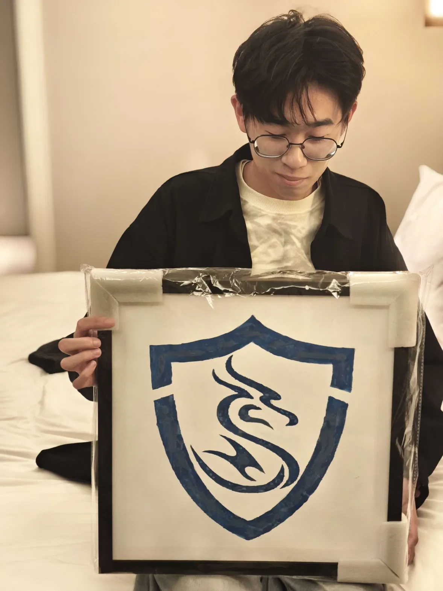
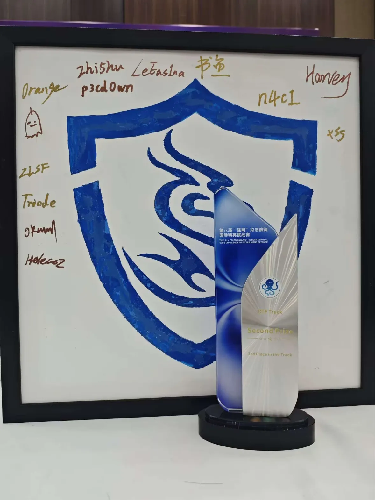
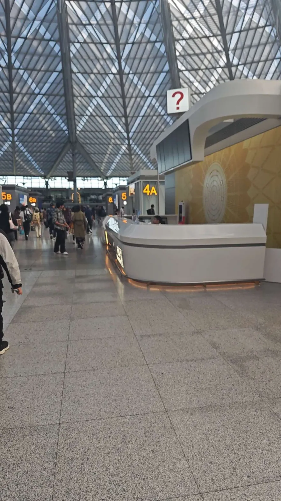
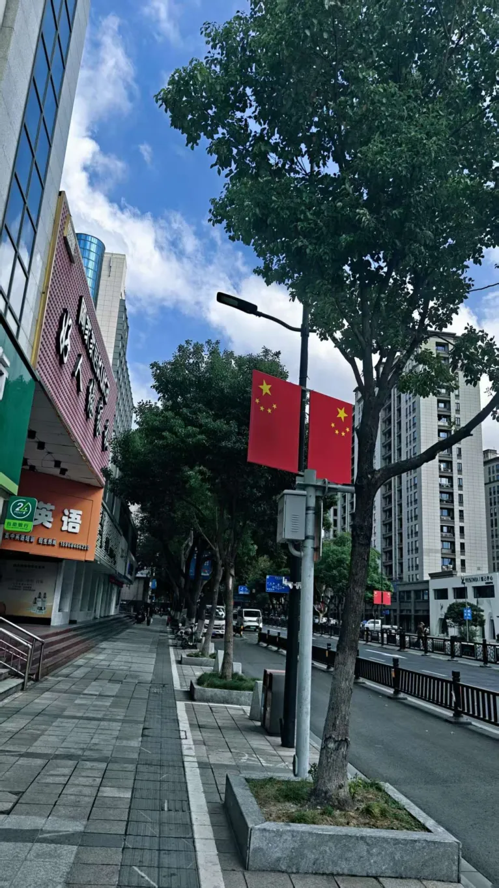
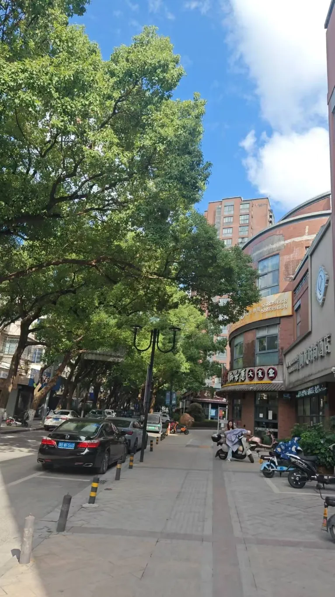
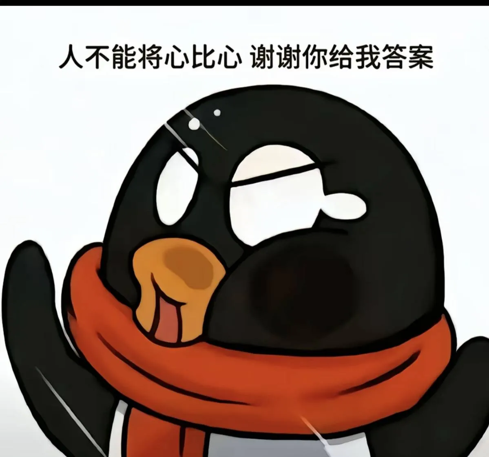
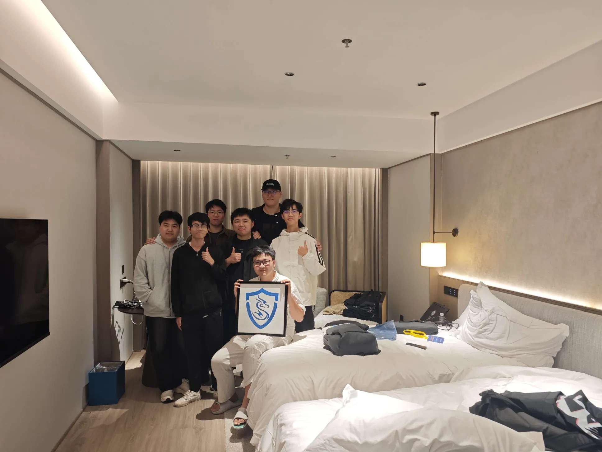
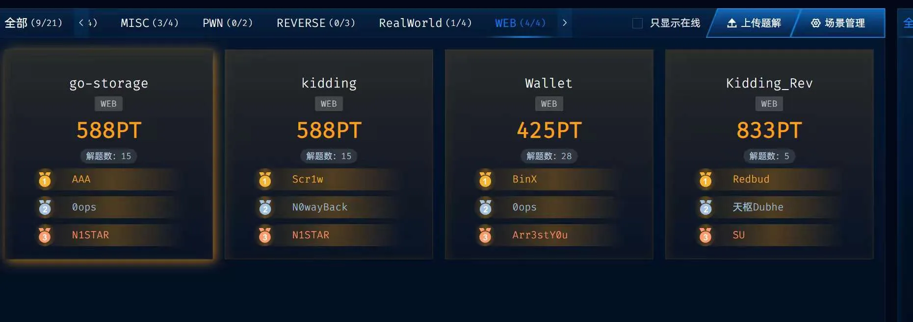

## 10\24

这天我下班之后，就火速赶往 [\_sun\_·empty.’s BlOg](https://sun1028.top/) 和他一起住的酒店，由于上海的酒店都很贵，这次是订的一家美居。那他们为什么会来上海呢，当然是来学习的了，这一天有 geekcon，所以 nop 也来了，他早就说他要来，还要给我买票来着，但是我是个牛马，我必须上班，遂婉拒，后来想着，刚好要去宁波，就懒得订酒店，蹭他的吧，结果这个 B 说自己晚上就回杭州，大家说他糖不糖，最后还不是一个人住的。

见到孙师傅之后就掏出了一个东西给我，这个东西可厉害了嗷，简直可以说是我们的传世佳作！😍

后来这件事告诉了书鱼哥哥，书鱼哥哥永远是那么优秀，他想到可以在这个队牌上写 id 留作纪念，所以后来这个牌子在拟态的时候就变丰满了不少。😎

待我休整好了之后和孙师傅一起去吃了顿海底捞，但是没想到他是个ℹ️人，其实并没感觉出来了，和他聊天发现他其实是个攻防大手子，害做什么其实都一样，但是要坚持下去最好是在该有的年纪有一些正反馈，我觉得他做攻防比 CTF 的正反馈会多些。

## 10\25

昨晚上聊到了深夜两点，说是深夜，其实我出来实习之后，我经常睡觉都是这个点了，即使我不学习，我玩都要玩到这个点，之前说不熬夜的小包终究是不在了(liao)🥹，自己去把衣服洗好之后，孙师傅的飞机也快到了，其实选择这家酒店主要就是，他离虹桥机场很近，离上海南也很近，送走孙师傅之后，过了一小时，收到了转账 300 的信息，我从来不讲理，因为我发现他估计会比小包还富裕🤣，我和 nop 还约了一顿，就地找了一家还行的川菜，叫 对酒当歌~地道川菜，本来是想直接吃便宜好吃的川菜系列，因为车子会很赶，应该是到饭店离上车还有一个半小时，结果没买到团购卷，那只能吃烤鱼了，其实 nop 没坐上车就是因为这条鱼，烤鱼一般上菜时间是半小时到 40 分钟，所以吃饭时间被压缩到了 20 分钟，即使是这样，我们吃的非常快，甚至都没怎么闲聊，还是吃了二十多分钟，打车又等了几分钟，所以到车站的入站口的时候距离高铁启动只剩下 10 分钟了，他直接就开摆了。而我不一样，我是 baozongwi，总有着 wi 的自信，所幸也被眷顾了，这个车站很小

我上车之后还有 6 分钟，结果又没充电的地方，手机其实没多少电了，就直接打了个盹，一醒就快到了，信息收集了一下，应该是到这里就不远了

看起来还是非常美的，就是 招宝山 这个酒店简直就是在荒郊野岭，2 号线坐到底了，怎么和成大一样 4 号线坐到底😓，下地铁的时候就只有五格🔋了，害怕自己走不到对岸，在群里说有人来接我吗，🤬CS（单纯发表个人情绪，误伤纯属巧合）“你自己没有脚吗”“为什么你要搞特殊”👍

我觉得这可能就是我是现充而某些同志只能在网上玩的原因

后来疏狂哥晚上八点到，我刚回酒店，其实我就是想直接去地铁口等他，顺便路上说一些只有我们两个人知道的话的，但是他给我婉拒了，好吧，那到酒店再敞开心扉吧😼

晚上聊了很多很嗨，大家欢聚一堂了属于是，第二天爬都爬不起来，哈哈哈。

也拍了一张合照，unk 队给我们拍的，就是我太丑了，嘤嘤嘤，怎么就我是顶光的🆙

下来之后小包就痛定思痛，开始蹭公司健身房了🤡，受不了自己这么丑陋

## 10\26

今天比赛情况还行，可惜的是喵师傅帮忙把 mscode2 的复现文章找出来了，但是赖哥哥好像太困了，而且我们也不知道可以把固件带回去攻击，回来再 check，所以就没做，为什么说可惜呢，等明天再和你说

得到神力加持之后一口气就把 web 打完了，当时 SU 排 5th，但是最后密码好多队伍都 AK 了，我们密码其实是弱项，所以排名有所下降，不过大家分其实都挨着非常近，一道题 1000 分剩下都是，第一名也才 9000，我们应该是 6000，成绩不错，和大家一起去吃了顿 **张四斤破火锅**，我感觉味道还是很不错的

## 10\27

昨晚上打 solo 的时候我们把 VN 秒了，所以今天肯定是四强，看了这四个队伍，应该就是亚军或者是季军，看运气了，如果第一轮打 pwn 而且没抽到 N1，那我们肯定就是亚军，当然这也是马后炮了🥴，最后的结果就是抽到逆向第一轮，被肘飞了

A&D 这边，更是被肘飞了，我打完才理解到赛制如何取胜，简单说下，也给大家一个参考。

前面报零或者领先其实用处都不大，因为附件中肯定是存在多个漏洞的，可以利用的也肯定是多个，但是不会太多，大概是 2-4 个，一天至多 web+pwn 四道题，这次的 web 就是两道题有 7 个🕳 [9th XCTF Final](https://baozongwi.xyz/p/9th-xctf-final/)

你只需要在最后三轮中能够审计出全场都没修复的漏洞，打一轮全场，扣全场的 30% 就能翻盘了😋。

不要用固有的 AWD 赛制去理解 A&D

今天虽然被打到倒数了，但是第一名 0ops 打了 18w 分，又是百分比算分，hiahia，所以今天打的好和差还不如昨天一道题，最后看到我们和 N1star 的总分差 30 分，昨天没做 mscode2，明天就只能拿三等了🥸，给后面的 SUer 创造了很大的进步空间🤗

## 10\28

今天研究生国赛，另外三个人在库次库次做，我和鸡哥还有 QJX unk monad就出去逛了，中途也聊了很多，unk 真是个大暖男，在线征婚🧵（开玩笑的，他并不知情

后来到点了，鸡哥要走了，我想着也没我什么事了，那我就改签也走吧，到了车站好想好想喝霸王茶姬，鸡哥直接给我拿下了，志强你真是个益虫🐛。

下车才发现，我居然睡了好久，睡出汗来了都，给他发信息，他也到了，而且他也睡着了，这车站的伯牙绝弦是不是掺水了，怎么没没劲😛

