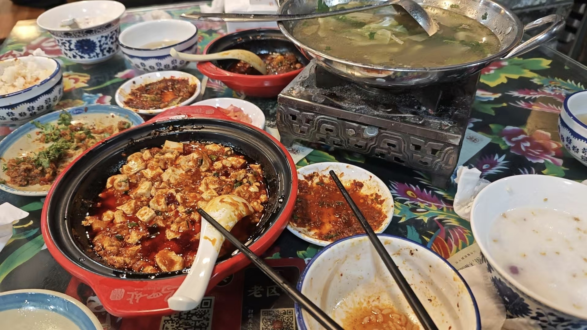
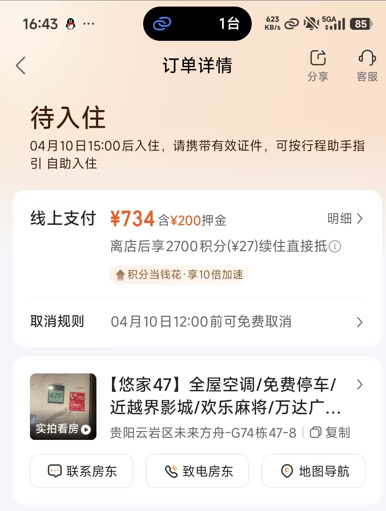
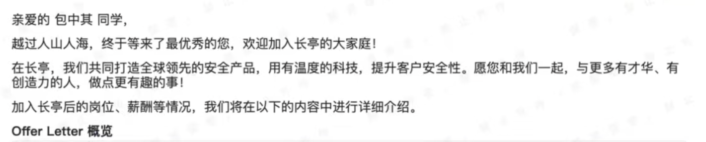

为什么这次少了一个游字呢，确实不像是游了，纯纯和朋友度过一个周末～☝️

这次住的美食街的汉庭，体验感属于是不好，里面还有一股子味道，突然想起之前某次带汤昌松住的酒店，居然是 282 一晚的，看来现在真是消费降级了昂，但是如果还会去乐山的话，这家汉庭我肯定是不考虑了😤

由于时间也过去的比较久，能记在心里的活动就几场

## 电玩城，也可能叫趣乐城

由于住在美食街，所以汤总选择带我去吃翘脚牛肉，

吃完之后就去了电玩城，我其实不知道这个叫什么名字，反正就是里面什么都有，大概玩了各种赛车摩托、3D 可视化游戏、switch 等等，后面玩的我汗流浃背，累的我是直接在 switch 里面的包间睡着了😂

心想下次肯定不去了，太累了哈哈哈，其实一开始我还担心我这个体重会不会很多项目玩不了，但是一看诶，好像没有真人游戏，都是电子游戏或者说是类电子游戏😃

出来之后，由于大左（汤总对象）还没有下班，在考教资，所以在超市逛了一会儿，发现了一个称，我称了一下我是 195 斤，我去，终于从 207 斤降下来了，随便还是一头 pig

后来还被他两调侃，没事，现在在北京待了十来天了，感觉应该是小于 190 了，明显的感觉肉少了，脸的线也顺畅了。

## 晚上火锅

在万豪广场找的一家火锅，我去，辣死我了！💀，没错我是四川人也被辣成 🐶 了。

而且饭桌上没有一个是解辣的，除了蛋炒饭🥵，吃完饭打车回酒店，同时也接到了任务，需要把大左的王者号打到 40 星，当时是 34 星，打车的时候，遇到的司机老哥，还是有故事的。

简单来讲就是老婆给他绿了，但是他没计较，然后还净身出户，这谁绷得住，我和汤先下车，后面大左还一直听这个大哥儿倒苦水，😂，仿佛找到了暂时可攀附的👩

回到酒店之后就开始猛攻，阿，哈撒给

最后是打了三个小时，收工

历史战绩被归档了艹

## X血旺川菜

第二天醒的特别晚，甚至都没吃早餐，直接去吃的 X 血旺，为什么是 X 呢，因为我忘记叫什么了，准确来说，味道中规中矩，和我学校附近的大厨小味差不多

饭后消食，这应该是这两天最喜欢的一段时光了，聊聊八卦，摆一摆龙门阵慢慢的走着，哈哈哈；逛到一个叫赵鸭子的地方，买了三个半只给朋友带回去，结果发现居然乐山站也有，我去白跑了，md，慢悠悠的走到了一个茶馆，点了一壶店员推荐的茶，拿了一副扑克，开始打起来，也聊了不少八卦，他们两也悄咪咪告诉我，其实这么点东西是不对的，因为可能不受欢迎，买的存活，我心想也挺有道理的🤔

后来打车，大左忽而说到羡慕我和汤的友谊，他的闺蜜都不能这样跨越城市互相找着玩，聊到这里也想到确实，我高中回大竹中学读书之后暂时还线下交流的同学就他一个了，后面约着去贵州旅游一下，但是大家也知道我现在在北京实习，所以这个旅游计划也是不了了之，当时大左还担心住房问题，其实这个问题很好解决，我直接订一个两居的民宿，100 平以上都就行了👍，而且我也确实订了，只不过一直在学校待着让我着急了，所以就跑了

当时的面试情况大概是

1. 合合信息技术面过，由于实习时间短被横向
2. 观星挂
3. 御之安过
4. chaitin 通信组过

并且 chaitin 张桂荣也在，也是找他推我的，所以我肯定来啊🤪

说到这，这两天这么看下来消费应该不会少，至少是 300 块左右，但是汤总两口子给我包圆了，而且不止这一次，几乎是每次去乐山，我觉得我能一直和他玩有这个原因，不喜欢对我吝啬的人（你可以对自己、别人吝啬，别对我吝啬

突然想起和曹楚涵认识的过程，我其实是被他钞能力打动了，后面才和他多交流的，一开始我利用 CTF 突出的能力，成为 SU 的 captain，那时候加我的人太多了，说真的，这么多网友，我除了 SUer 没一个是深入交流的，与此同时我博客开了 reward 功能，他三天两头给我打钱，问我问题，我不教他都有点不好意思，后面才开始像现在这样多多交流，线下还么见过他，但是他应该是健谈的，是大方的

缺失了好多图片，下次要早点记录了🤗

