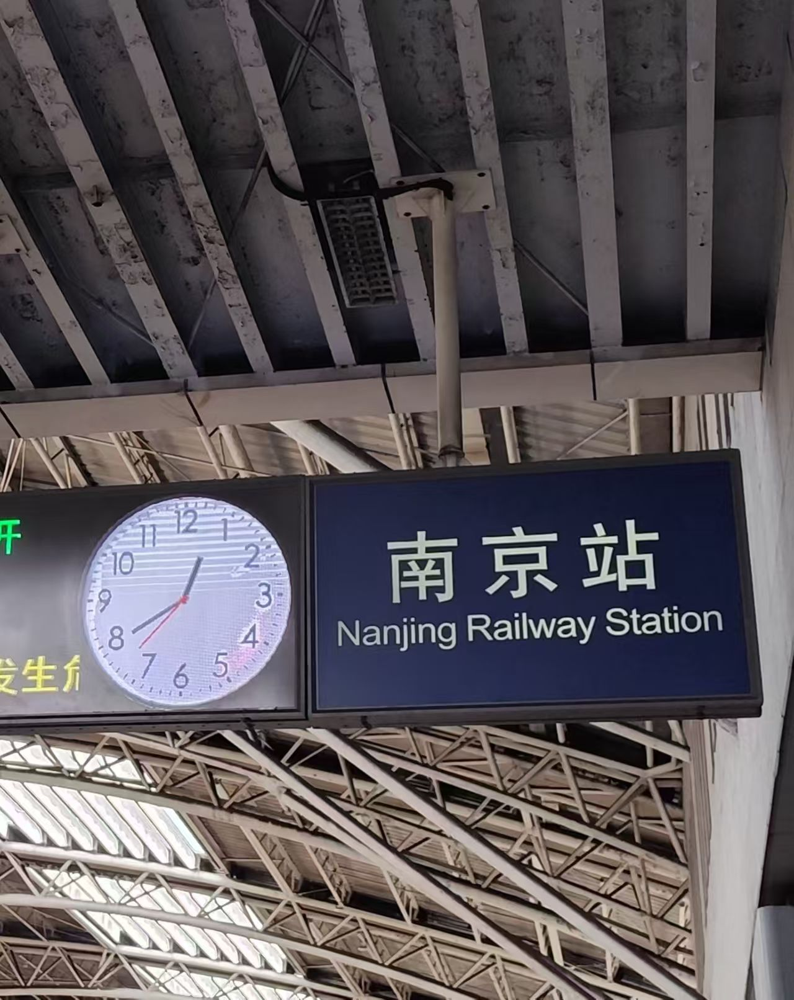
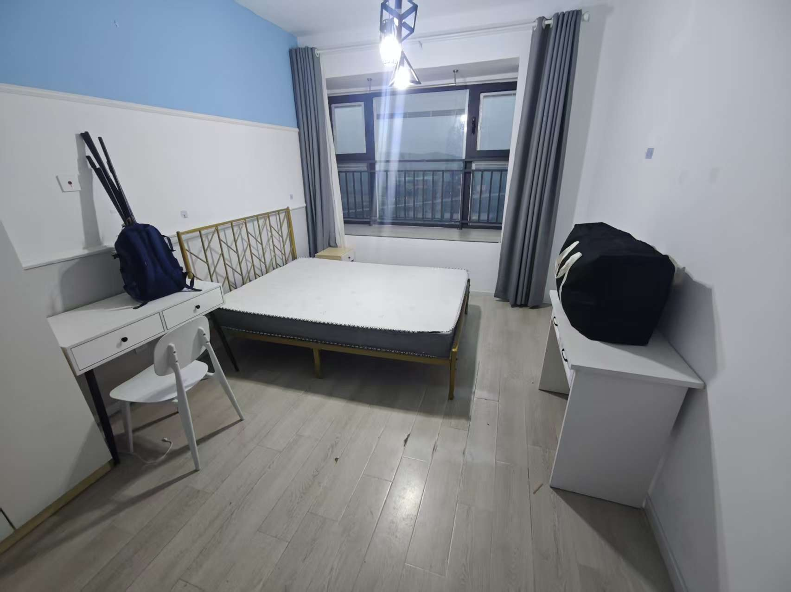
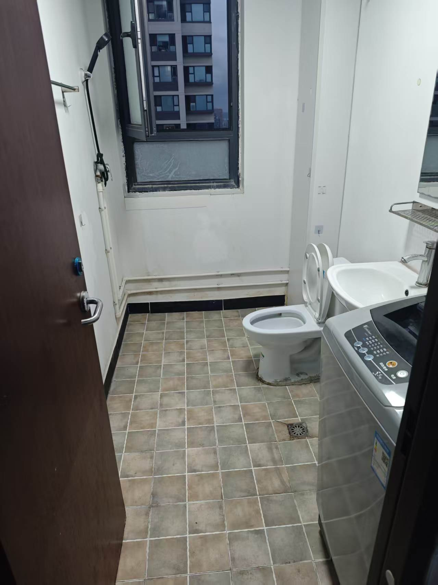
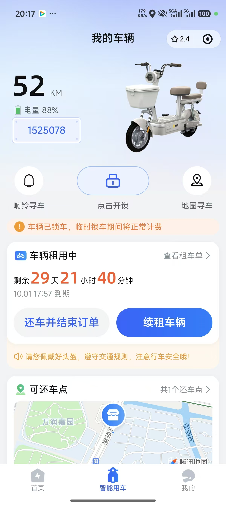
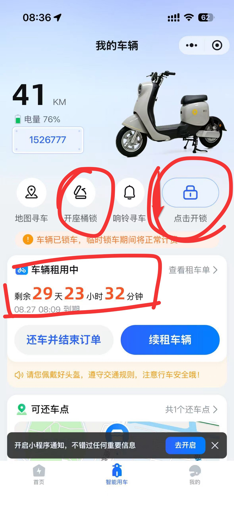
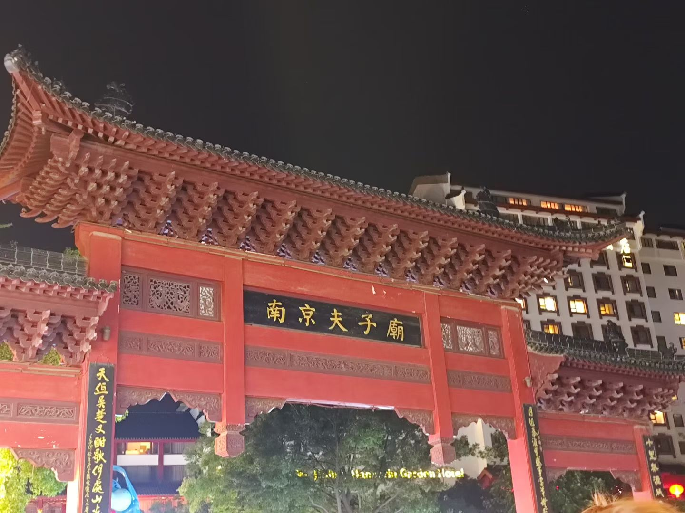
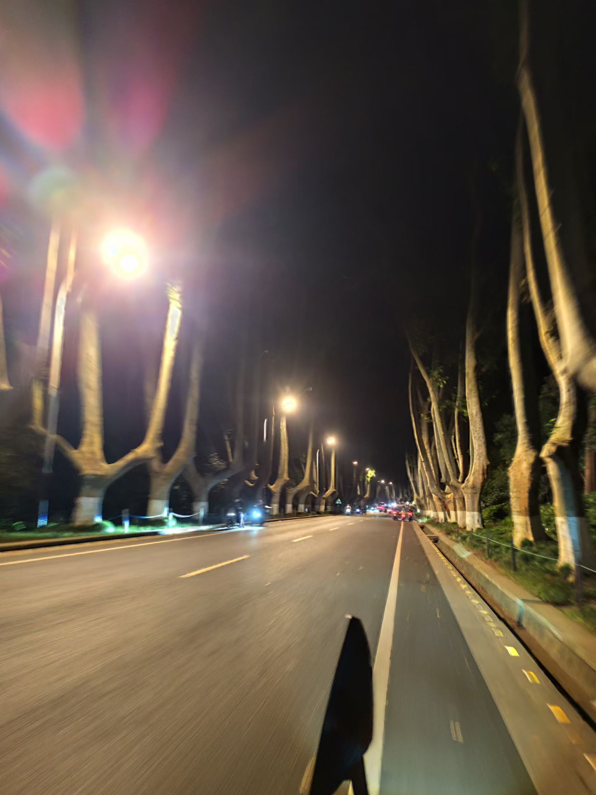

其实也想写一下我的生活的，但是感觉这样子就太杂了呢？算了还是写写吧，给后来来南京的人避一下坑

## 租房

第一套房子应该算是被诈骗了，就是傻逼小（打）红（拳）书，一开始很多中介引流帖子，但是犯蠢又不是很蠢，虽然一开始坦诚相待了，他给我说了一个月水费 30 电费 100 燃气 30 服务费 30 网费 50 中介费 299，我觉得总比租不到房子好吧，先看看，看了两小时给我看村里去了，最后价格，如果租半年就是 1620/month，我本来已经付了这个的押金了，后来心里回想起林师傅说的话，“可以租一个月看看”，后来我变卦说租一个月，价格最后是 2100

“我们都是引流骗到线下再实际签房子的”，😅
以后建议租房子之前问是不是实图实价，让他说**中国人不骗中国人**

现在已经搬走了，搬到了公司周围的一家公寓，楼下就是汉庭，1200 一个月，缺点是旁边有火车高铁轨道，吵，而且暂时租的不是落地窗的房间，估计后面会调整搬到楼下空出来的落地窗户型

总结一句话，弹性！其实如果去其他城市也可以完全套用，大不了就住一段时间的青旅没必要一去就租房。

## 租电动车

买的话实习纯送圆子，如果住的远而且找不到充电的地方，可以租换电池的，但是又不跑外卖我感觉还是很吃亏的，正常价格 500-600 CNY/month，我第一个月就租的这个，骑的挺舒服的，但是后来算起就牙疼，坑都踩完了

现在是在咸鱼上面租，月租、季租、半年租价格都是不一样的，实习就选择月租就行了，新租的房子离公司近，就租了一个小车（其实是这个月不宽裕），149 一个月，门店有点远，送上门 169，很便宜，比 500 便宜多了，楼下充电 1CNY/360mi，基本一块就充满了，就是续航比较小，

等下个月发工资了，换 200 一个月的大车，看到图就馋了

没有人觉得骑电动车很爽吗？我觉得外卖员都是爱骑电动车顺便赚钱

ps: 咸鱼真好用

## 秦淮河、夫子庙、梧桐大道

和孙师傅去过了，商业化太严重了，没啥意思，美女也少

  

梧桐大道就是感觉骑车很清爽，路达，晚上兜风很舒服

  - [ ] 公园
    - [ ] 羊山公园
    - [ ] 仙林湖公园
    - [ ] 龟山公园
    - [ ] 古林公园
    - [ ] 栖霞山
    - [ ] 鱼嘴湿地公园
    - [ ] 白鹭洲公园
    - [ ] 菊花台公园
  - [ ] 景点
    - [ ] 玄武湖
    - [ ] 瞻园
    - [ ] 南京博物馆
    - [ ] 红山动物园
    - [ ] 欢乐谷
    - [ ] 颐和路