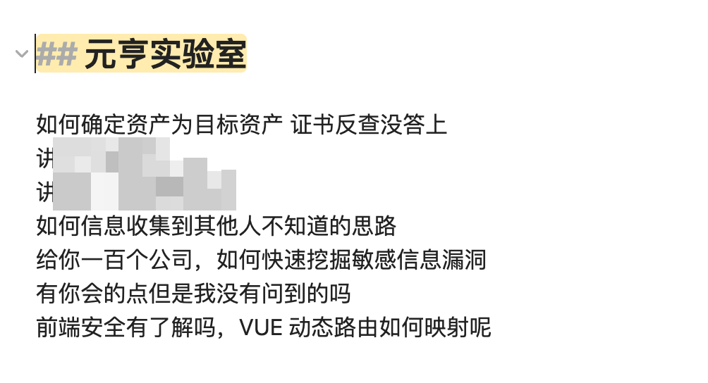
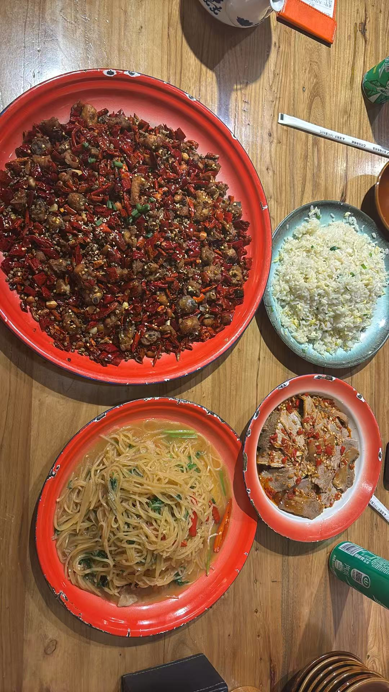
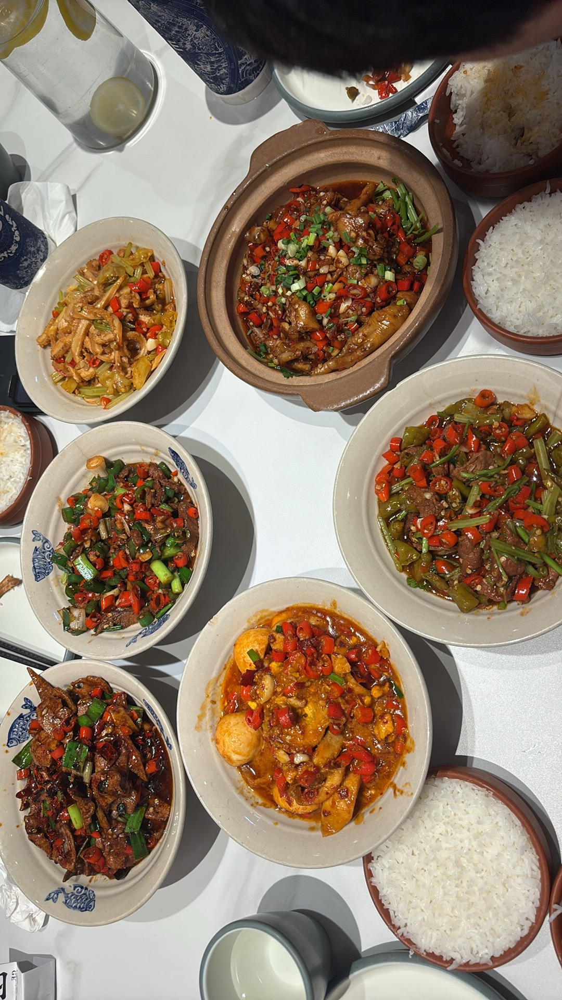
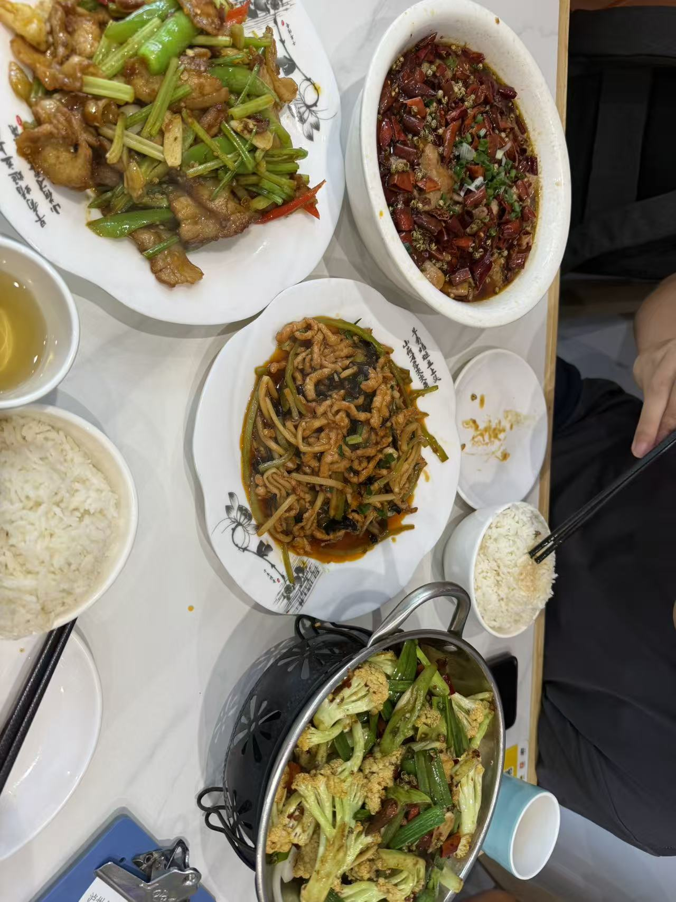
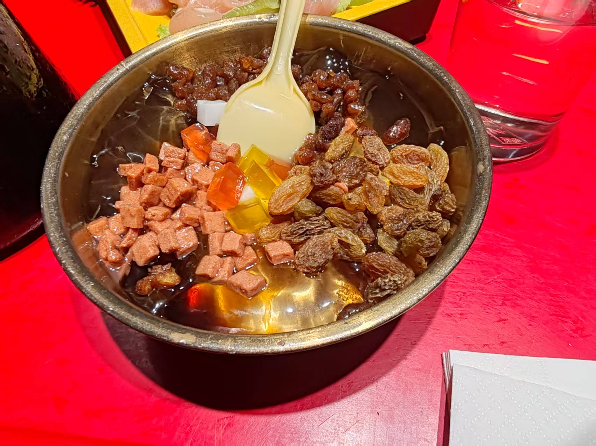
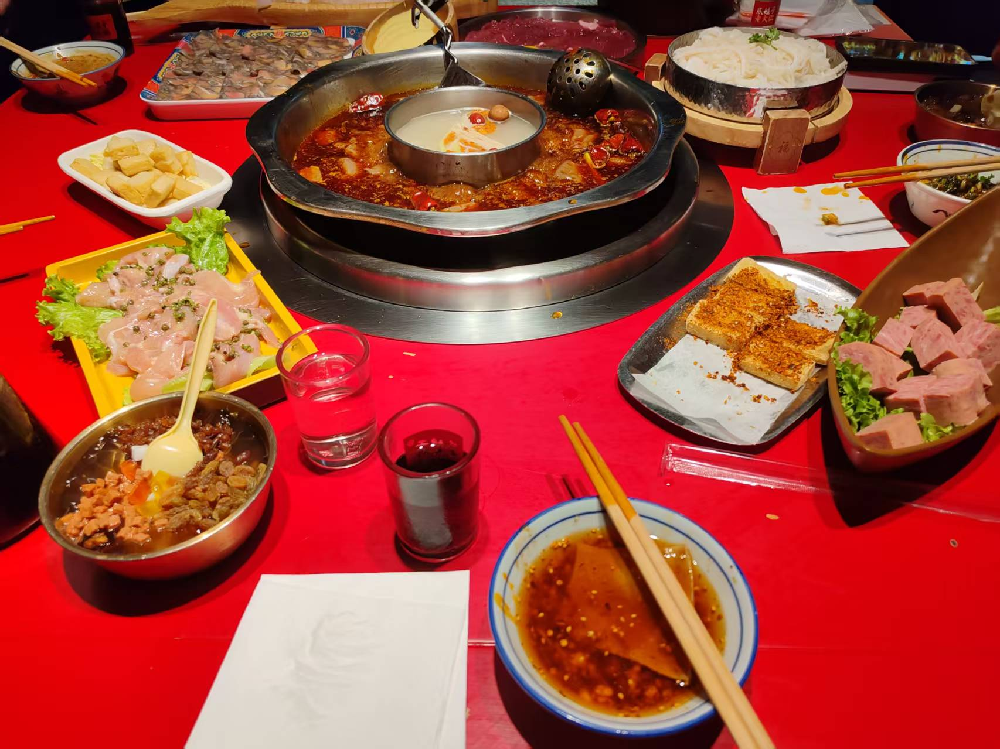
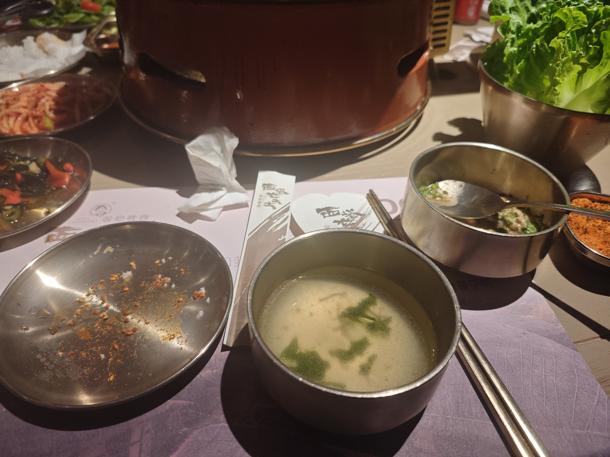
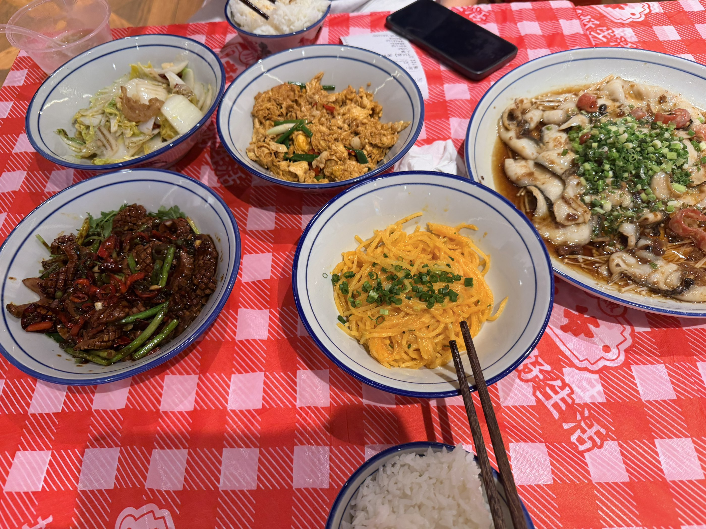

## 来的原因

在得物 SDLC 离职之后回到老家过年，当时百度二面刚挂，实在是非常失落，在家也不想学习，所以过了一个年，我反而更落后了，当时的 GPT 中转站什么优惠百花齐放，我也没赶上🥴

由于上一段实习是裸辞的，所以我回到学校就开始投简历，但是其实成效并不好，因为当时很多甲方都没招人，然后我就把目光放到了乙方，最后阴差阳错的来到了 chaitin，😆其实并不是阴差阳错是因为 infernity 在所以我就被内推来了。

## 来之后的工作

我为什么要写工作而不是生活，因为 tmd beijing 没有穷逼的生活！

粗略的算了算，大概在公司领到了 2w 的工资，但是我走的时候身上并没有剩下多少钱，加上我爸妈每个月现在还会给我生活费，我身上走的时候身上有几千块，但是我觉得这也很合理了。嗯对，这就是我讨厌北京的原因，押一付三这一块，人挤人的八号线，没有信号的地铁，和室友一起共用（其实是被占用）的厕所，各种各样的原因，让我非常之讨厌这儿。

我在公司大概到勤时间是三个月，但是做安服项目就做了很久，一晃就五月多了，直到后来才拿到一些攻防和渗透测试做，说真的我觉得我是被耽误了，周围的同事都在打攻防的时候，你一个人在那里和傻逼客户沟通，讲解这个产品、靶场有什么问题，如何启动、使用😅，还他妈动不动就是一个电话打过来。

所以我认为，我有怨气很正常，我在公司隔着屏幕骂人，工作态度不佳哈哈哈哈 wcnm 你工作态度好，这里就要引入一个神人经理了。我认为绝大多数的公司都是以结果为导向的

1. 小公司 干 APT 的
2. 乙方安全厂商 安服、安研
3. 甲方互联网公司 对业务进行运营、安全建设

暂时来看我都待过，都是以结果为导向，但是到了这里，tnnd 就要看你工作态度了，我是项目没交付还是打攻防没打穿，于是我下定决心要走，在我每每参与攻防项目，我都用尽全力🤣至少用尽 AI 的全力，晚上回到家，只要有网络情况，我就会一个人慢慢的去看，有没有推进的机会。

由于我前面的几份实习都是走的内推，所以我倒是想看看不走内推的情况几何，于是我加上了王太禹，中孚信息元亨实验室的负责人（微信二维码分享出去之后居然几年都没过期🙈）

一面问了一些问题，我认为答的并不好，但是吴师傅也让我通过了

二面那就确实是没问问题了，可以说是单方面的侮辱😅，但是其中还是有一个问题是有价值的，就是我与领导意见不符的时候，我会做什么，我也不是一个不明是非的人，我就是会偷偷做我想做的，并且结果就是好的

诶，但是到这里其实更合理的办法是和领导沟通完再去做，不过，实际的情况就是，有些傻逼领导他很有想法，不知道他哪里来的想法，他就不让做🙂‍↔️

后面回成都考试的时候我回忆起了整个 timeline，可能是因为我一开始就吐槽我老东家，毕竟这样的同志来到新公司肯定也会被以为吐槽新公司，这个崽种，我觉得完全有机会不面试我二面，我估计要和赵子武一样做三年的噩梦了

后来从成都回到北京，又去做了一次测试，15 号投递了一份简历，17 号一面 22 号二面调整到 25 号当场宣布通过。嗯这个地方很有缘，在我来 chaitin 之前我就面过代码审计的位置，这次面试的攻防，上次一面都没过，事实说明，chaitin 虽然是累了点，是有些吐槽的点，但是他值得每一个安全人停留☝️！

现在回想要是我第一段实习就是来 chaitin，现在会不会不一样呢？😄

## 离开前的生活

听说我要离开了，在微信最近经常看到的一句话就是 “你什么时候离开北京？有空吃个饭吗”

这句话不同人观感不同，有些人看着很轻，但是我看的很重，至少说明我在北京这三个来月，在公司的三个来月，不是一个透明人，有不少师傅记得我🤤，唯一可惜的就是在工作之后，即使和方总在一个城市也没吃几顿饭

一家川菜馆，我去了分量特别大，没吃完最后

潇湘阁，吃过两次了，吃完这次我不会去吃了😄，给我都辣的嘶哈嘶哈的，湖南人还是太凶了

和徐师傅去吃了一顿小菜馆，价格在北京算非常实惠了

吃的一顿火锅，四个人点了三份炒饭😂，胀莽了已经，好像北京的餐馆都是收藏➕打卡就有东西送，但是服务员又不会主动给你说，幸好我同事里面有个老吃家😄

和🌸吃的烤肉，其实来北京也是因为🌸建议的，不然我就可能去成都那个小公司了，这样反而还跳不动了，甚至转正也没有在 chaitin 转正待遇好

和🌸哥吃烤肉不用动手，只需要动嘴哈哈哈

想到 SU 有两个大二的师傅来北京实习了，就说约着吃一顿饭，结果孙周师傅去上海出差了，结果项目又取消了（网安冬又寒😅），回北京又太晚了，所以只和 mnzn 吃了

去过的地方 什刹海、北海公园 好像就没了，还有一些小公园哈哈🤓找不到照片，大家就自己想吧

## 前往 NJ 的路程租房踩点

