+++
title = "CTFd搭建"
slug = "ctfd-setup"
description = "刷"
date = "2025-03-17T15:47:27"
lastmod = "2025-03-17T15:47:27"
image = ""
license = ""
categories = ["talk"]
tags = ["docker"]
+++

你问我为什么又要搭建CTFd了，因为我打了两个月的国际赛了发现外面还是用的CTFd，当然你如果要使用动态靶机的话，要使用赵总的插件，那样子CTFd根本承受不住，所以如果使用的是静态靶机，比如校赛的话，就用CTFd比较简单方便

## docker安装&&换源

[之前的文章，基础使用docker](https://baozongwi.xyz/2024/10/08/docker%E5%AD%A6%E4%B9%A0%E4%BB%A5%E5%8F%8A%E5%9F%BA%E7%A1%80web%E9%A2%98%E7%9B%AE%E9%83%A8%E7%BD%B2/)

## CTFd搭建&&汉化

先创建目录并且把东西给clone下来

```
cd /opt
mkdir CTFd
cd CTFd
git clone https://github.com/CTFd/CTFd.git
cd CTFd
```

如果你的服务器是一台没有其他服务的机器，可以直接启动

```
docker compose up -d
```

起好docker之后我们就进行汉化

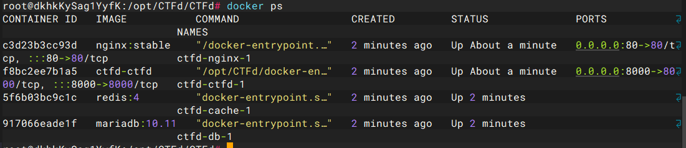

```
docker ps

git clone https://github.com/Gu-f/CTFd_chinese_CN.git
cd CTFd
rm -rf themes
cp -r ./../CTFd_chinese_CN/V3.1.1/CTFd-3.1.1/CTFd/themes ./
```

然后刷新页面就好了，先不创建比赛，先创建管理员用户

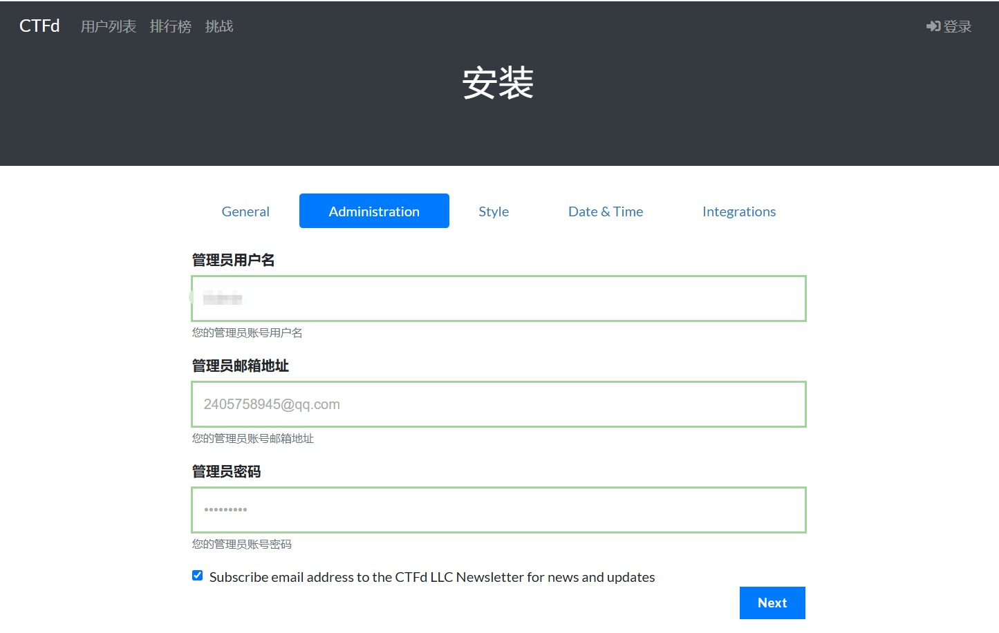

自己可以进行一些基础的设置，这里我也不改主题那些花里胡哨了，直接就用了

## chellenge&&smtp

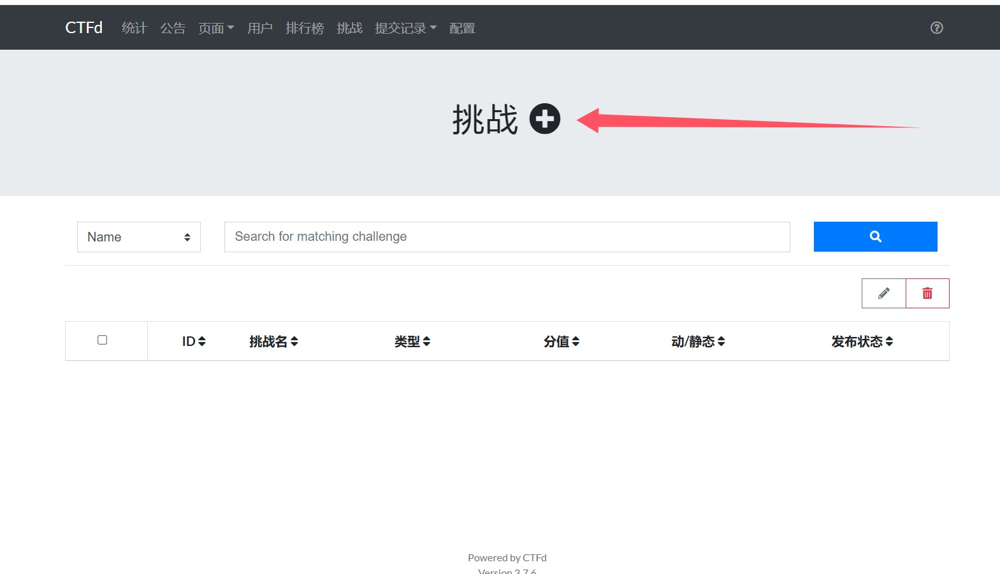

可以选择是动态分值还是静态分值，这里我选择动态分值，其他的自己写就可以，创建之后还可以选择是否隐藏，我建议是先隐藏

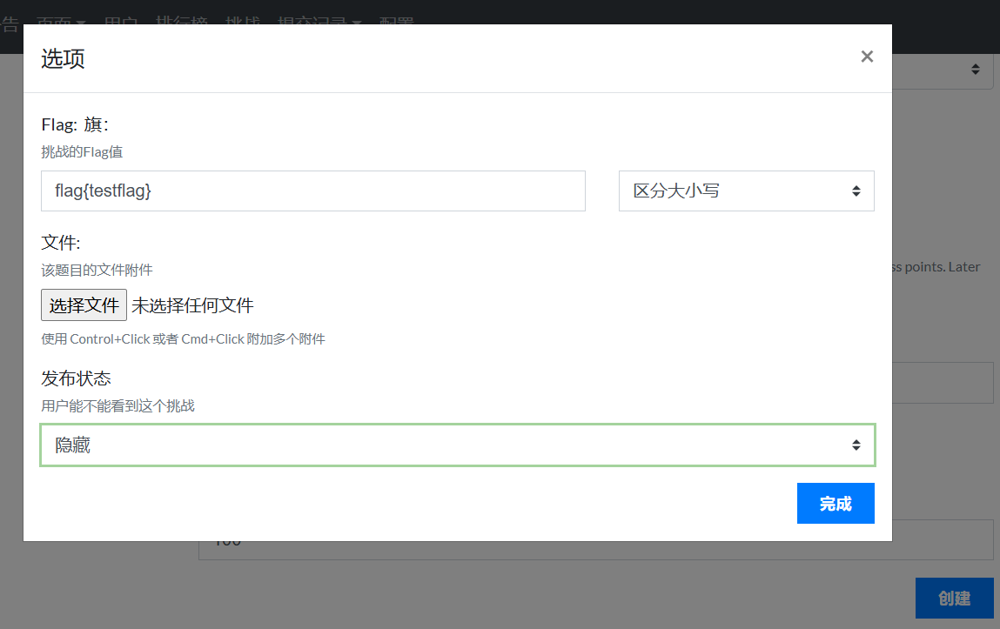

当然了最重要的就是我们要配一个smtp，**配置->邮箱**，哦对了，别忘了开启验证邮箱，这里我就不说了

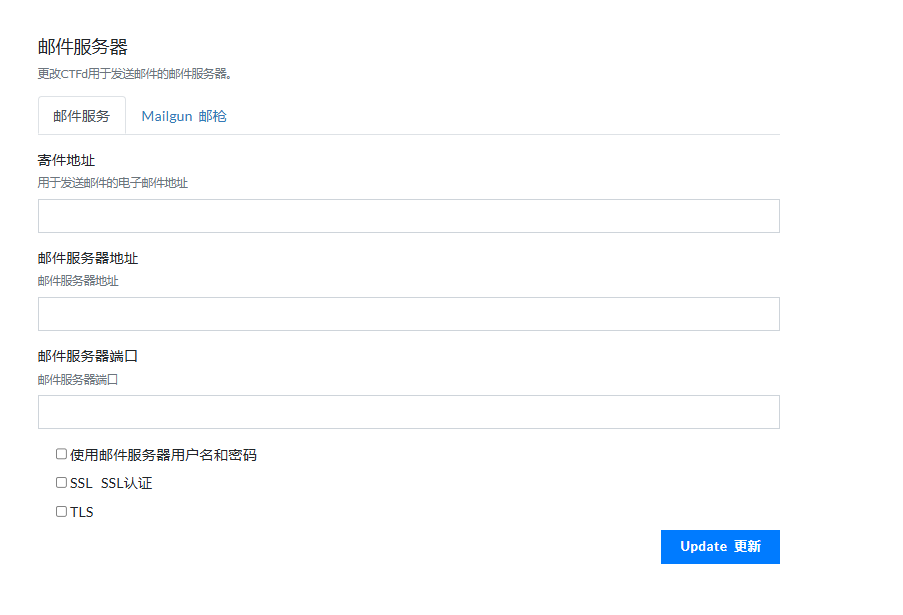


然后就可以收到邮件了，爽歪歪

## 域名解析&&https

这个老生常谈了，

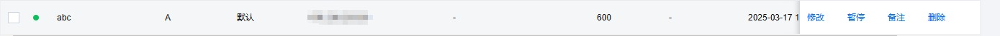

直接解析到台子的服务器上面，然后去这个网站申请一个一年的证书，真的挺方便的，一次用一年[证书网站](https://my.dnshe.com/) 

这个结果是失败了的，所以我就给删了内容，学到的东西就是一个命令

```
docker cp nginx.conf <container_id>:/tmp/nginx.conf
```

再进入容器来进行文件覆盖

```
docker exec -it <container_id> /bin/bash
cp /tmp/nginx.conf /etc/nginx/nginx.conf
```

但是我给搞宕机了

## CTFd个性化

可以看到几乎所有的国际赛都是使用的CTFd，但是却是各有特色(外观)，能够对平台进行改观最大的就是主题了

[题目分类主题](https://github.com/frankli0324/ctfd-pages-theme) [CTFd开源主题仓库](https://github.com/CTFd/themes) 

首先是进入主题进行初始化的时候可以定义部分东西，在不使用主题的情况都能变的很好看，首先就是站点logo

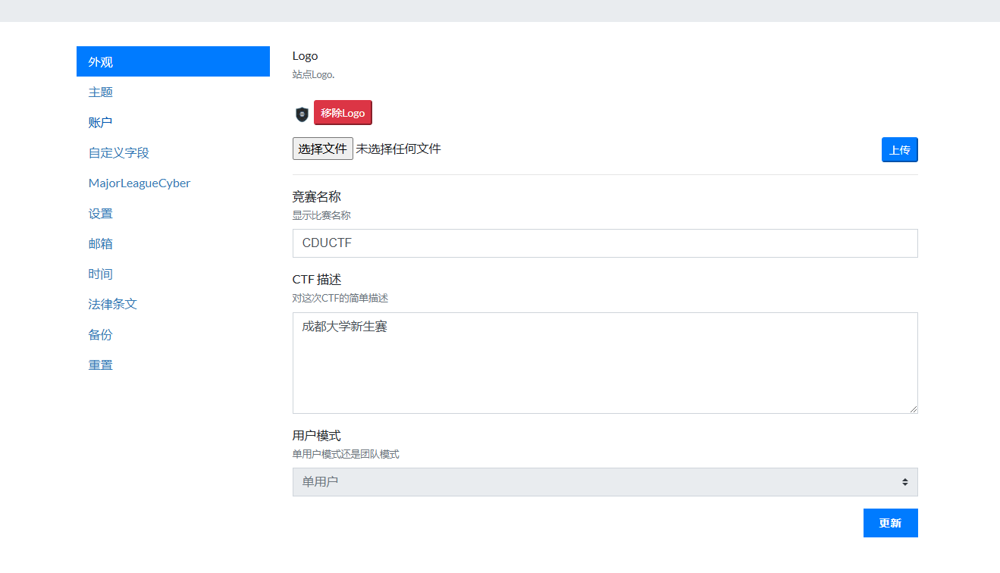

然后转到页面，把图片存到`/opt/CTFd/CTFd/themes/core/static/img/`，写的时候看着写一些前端代码就好了

```html
<style>
    /* 新增描述文字样式 */
    .cyber-description {
        font-family: 'Courier New', monospace;
        color: #00ff88;
        text-shadow: 0 0 8px rgba(0, 255, 136, 0.3);
        font-size: 1.2rem;
        line-height: 1.6;
        margin: 2rem auto;
        max-width: 600px;
        text-align: center;
        padding: 15px;
        background: rgba(0, 0, 0, 0.2);
        border-radius: 10px;
        border: 1px solid rgba(0, 255, 136, 0.3);
        animation: textGlow 2s ease-in-out infinite alternate;
    }

    @keyframes textGlow {
        from { text-shadow: 0 0 8px rgba(0, 255, 136, 0.3); }
        to { text-shadow: 0 0 12px rgba(0, 255, 136, 0.6); }
    }

    /* 修改Logo尺寸相关样式 */
    .main-logo {
        width: 50% !important;
        max-width: 400px !important;
        transition: transform 0.3s ease, filter 0.3s ease;
        padding: 20px !important;  /* 调整内边距 */
    }

    @keyframes gradientBG {
        0% { background-position: 0% 50%; }
        50% { background-position: 100% 50%; }
        100% { background-position: 0% 50%; }
    }

    body {
        background: linear-gradient(-45deg, #0f2027, #203a43, #2c5364);
        background-size: 400% 400%;
        animation: gradientBG 15s ease infinite;
        min-height: 100vh;
        position: relative;
    }

    #particles-js {
        position: fixed;
        top: 0;
        left: 0;
        width: 100%;
        height: 100%;
        z-index: -1;
    }

    .main-logo {
        transition: transform 0.3s ease;
        filter: drop-shadow(0 0 10px rgba(76, 175, 80, 0.5));
    }
    .main-logo:hover {
        transform: rotate(-5deg) scale(1.05);
    }

    .cyber-title {
        font-family: 'Courier New', monospace;
        color: #fff;
        text-shadow: 0 0 10px #00ff88;
        position: relative;
        margin-bottom: 2rem;
    }
    .cyber-title::after {
        content: "";
        display: block;
        width: 60px;
        height: 3px;
        background: #00ff88;
        margin: 10px auto;
    }

    .social-container {
        background: rgba(255, 255, 255, 0.1);
        backdrop-filter: blur(5px);
        border-radius: 15px;
        padding: 1.5rem;
        margin: 2rem 0;
        box-shadow: 0 4px 30px rgba(0, 0, 0, 0.1);
    }

    .social-icon {
        transition: all 0.3s ease;
        color: #fff;
        background: rgba(255, 255, 255, 0.1);
        border-radius: 50%;
        padding: 15px;
        margin: 0 10px;
    }
    .social-icon:hover {
        transform: translateY(-5px);
        background: #00ff88;
        color: #000;
    }

    .admin-btn {
        background: linear-gradient(45deg, #00ff88, #00b4d8);
        border: none;
        padding: 12px 30px;
        border-radius: 25px;
        font-weight: bold;
        transition: transform 0.3s ease;
    }
    .admin-btn:hover {
        transform: scale(1.05);
        box-shadow: 0 0 15px rgba(0, 255, 136, 0.5);
    }
</style>

<div id="particles-js"></div>

<div class="row">
    <div class="col-md-8 offset-md-2 text-center">
        <!-- 调整后的Logo -->
        
    </div>
</div>
<p id="cyber-text" class="cyber-description"></p>

<script>
    document.addEventListener("DOMContentLoaded", function () {
        const text = "welcome to CDUCTF! 💻🔐";
        let i = 0;
        function typeWriter() {
            if (i < text.length) {
                document.getElementById("cyber-text").innerHTML += text.charAt(i);
                i++;
                setTimeout(typeWriter, 80);  // 打字速度
            }
        }
        typeWriter();
    });
</script>

<div class="social-container text-center">
    <a href="https://cdusec.com/" target="_blank" class="social-icon">
        <i class="fab fa-site"></i> Site
    </a>
    <a href="mailto:baozongwi@qq.com" class="social-icon">
        <i class="fas fa-envelope"></i> contact
    </a>
</div>

<script src="https://kit.fontawesome.com/a076d05399.js" crossorigin="anonymous"></script>

<script src="https://cdn.jsdelivr.net/particles.js/2.0.0/particles.min.js"></script>
<script>
    particlesJS('particles-js', {
        particles: {
            number: { value: 80 },
            color: { value: '#00ff88' },
            shape: { type: 'circle' },
            opacity: { value: 0.5 },
            size: { value: 3 },
            move: {
                enable: true,
                speed: 1.5,
                direction: 'none',
                random: false,
                straight: false,
                out_mode: 'out'
            }
        },
        interactivity: {
            detect_on: 'canvas',
            events: {
                onhover: { enable: true, mode: 'repulse' },
                onclick: { enable: true, mode: 'push' }
            }
        }
    });
</script>
```

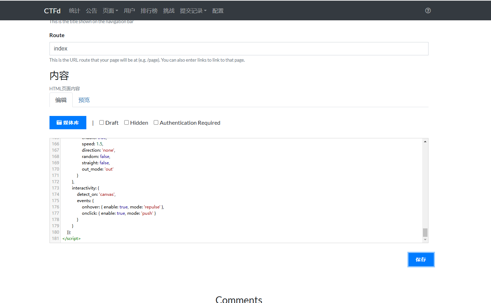

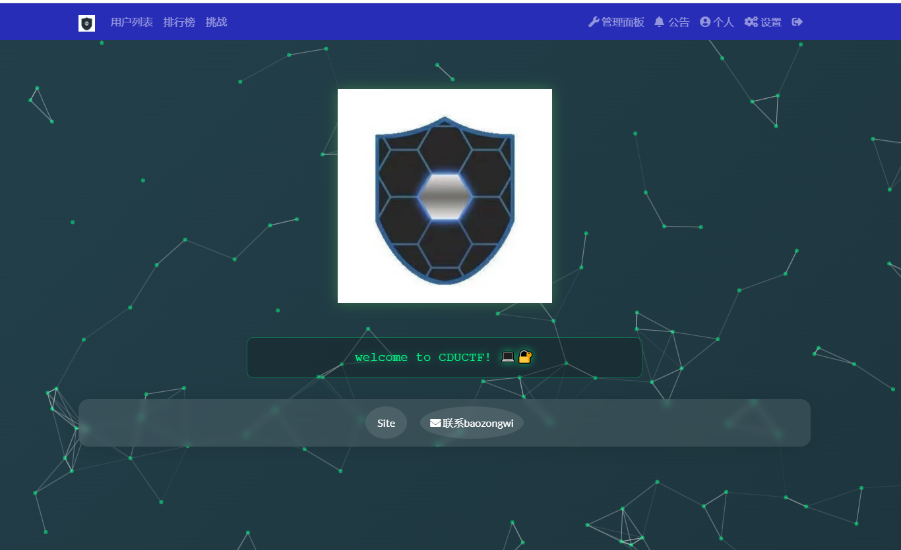

安装一个主题，以像素风主题pixo为demo

```
git clone https://github.com/hmrserver/CTFd-theme-pixo.git /opt/CTFd/CTFd/themes/pixo
```

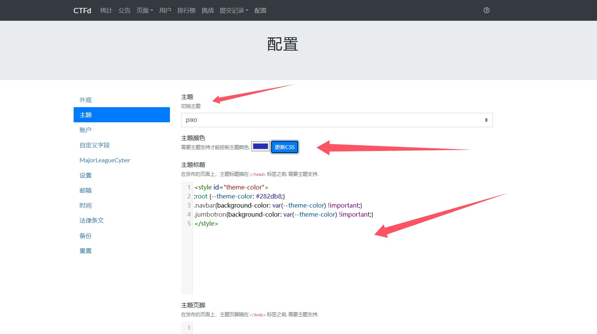

然后更新就会发现

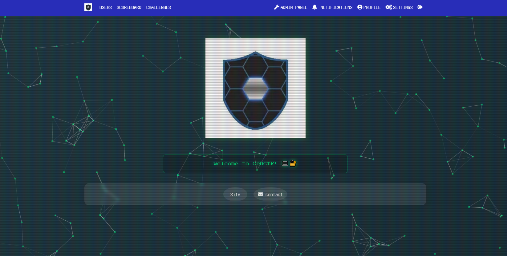

## 小结

用CTFd来打动态靶机不合适，所有有空的话，我还会来更新一下如何搭建GZCTF(适用零基础，因为11月的痛，我现在都记得)
