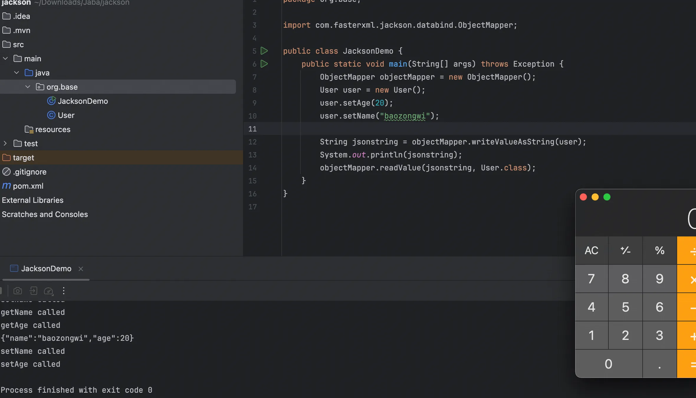
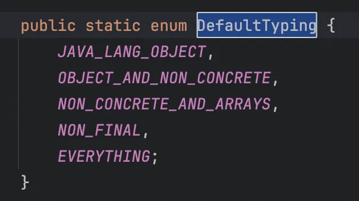
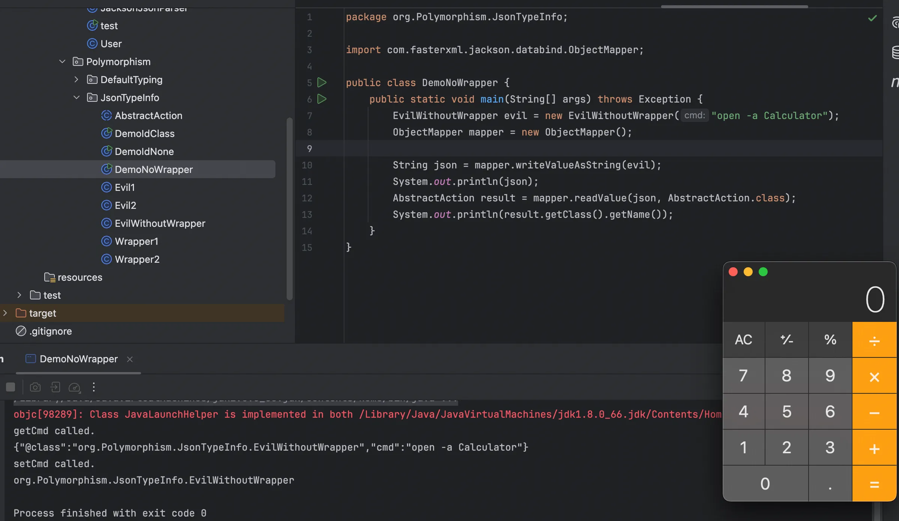

+++
title= "Jackson基础学习"
slug= "jackson-basics"
description= ""
date= "2025-11-27T21:25:22+08:00"
lastmod= "2025-11-27T21:25:22+08:00"
image= ""
license= ""
categories= ["Javasec"]
tags= [""]

+++

Jackson 是当前 Java 生态中最流行的开源 JSON 框架之一，因其高性能、低内存占用及灵活的扩展性而被选为 Spring MVC 的默认解析器，在处理大文件时速度显著优于 Gson。其核心架构由三个模块组成：底层的 `jackson-core` 提供高效的流模式解析 API，`jackson-annotations` 提供标准注解支持，而最常用的 `jackson-databind` 则基于前两者实现了对象绑定（ObjectMapper）和树模型解析，共同构成了简单易用且功能强大的 JSON 处理方案。

## 常用类

### ObjectMapper

Jackson 最常用的 API 就是基于"对象绑定" 的 ObjectMapper：

ObjectMapper 可以从字符串、流或文件中解析 JSON，并创建表示已解析的 JSON 的 Java 对象。 将JSON 解析为 Java 对象也称为从 JSON 反序列化为 Java 对象。ObjectMapper 也可以从 Java 对象创建JSON，从 Java 对象生成 JSON 也称为将 Java 对象序列化为 JSON，Object 映射器可以将 JSON 解析为自定义的类的对象，也可以解析置 JSON 树模型的对象，

之所以称为 ObjectMapper 是因为它将 JSON 映射到 Java 对象（反序列化），或者将Java对象映射到JSON（序列化），突出映射二字。

```java
package org.base;

public class User {
    public String name;
    public int age;
    public User(){ }

    public User(String name, int age) {
        this.name = name;
        this.age = age;
    }

    public String getName() {
        System.out.println("getName called");
        return name;
    }
    public void setName(String name) {
        System.out.println("setName called");
        this.name = name;
    }
    public int getAge() {
        System.out.println("getAge called");
        return age;
    }
    public void setAge(int age) {
        System.out.println("setAge called");
        this.age = age;
    }
}
```

序列化

```java
package org.base;

import com.fasterxml.jackson.databind.ObjectMapper;

public class JacksonDemo {
    public static void main(String[] args) throws Exception {
        ObjectMapper objectMapper = new ObjectMapper();
        User user = new User();
        user.setAge(20);
        user.setName("baozongwi");

        String jsonstring = objectMapper.writeValueAsString(user);
        System.out.println(jsonstring);
        objectMapper.readValue(jsonstring, User.class);
    }
}
// setAge called
// setName called
// getName called
// getAge called
// {"name":"baozongwi","age":20}
// setName called
// setAge called
```

序列化触发 setter\getter，反序列化触发 setter 方法，所以弹起来😁



### JsonParser

Jackson JsonParser类是一个底层一些的 JSON 解析器。 它类似于XML的 Java StAX 解析器，差别是JsonParser 解析 JSON 而不解析 XML。JsonParser 的运行层级低于 ObjectMapper。 这使得JsonParser比ObjectMapper更快，但使用起来也比较麻烦。使用 JsonParser 需要先创建一个JsonFactory

```java
package org.base;

import com.fasterxml.jackson.core.JsonFactory;
import com.fasterxml.jackson.core.JsonParser;

public class JacksonJsonParser {
    public static void main(String[] args)throws Exception{
        String json = "{\"name\":\"baozongwi\",\"age\":20}";
        JsonFactory jsonFactory = new JsonFactory();

        JsonParser parser = jsonFactory.createParser(json);
        System.out.println(parser);
    }
}
//com.fasterxml.jackson.core.json.ReaderBasedJsonParser@7699a589
```

输出的是这个解析器对象在内存里的地址，大家看到这，肯定和我一样，这是啥玩意，有啥用啊？🤯JsonParser 是 Jackson 最底层的 API（流式 API）。如果说 ObjectMapper 是全自动洗衣机（一键搞定），那 JsonParser 就是手洗（完全由你控制每一个步骤）。

它的作用是把 JSON 拆解成一个一个细小的 **Token，**接下来请看，适当的加了一些打印值，方便理解

```java
package org.base;

import com.fasterxml.jackson.core.JsonFactory;
import com.fasterxml.jackson.core.JsonParser;
import com.fasterxml.jackson.core.JsonToken;

public class JacksonJsonParser {
    public static void main(String[] args)throws Exception{
        String json = "{\"name\":\"baozongwi\",\"age\":20}";
        JsonFactory jsonFactory = new JsonFactory();

        JsonParser parser = jsonFactory.createParser(json);
        //System.out.println(parser);
        while (!parser.isClosed()) {
            JsonToken token = parser.nextToken();

            if (token == null) break;

            System.out.print("当前Token类型: " + token);

            if (JsonToken.FIELD_NAME.equals(token)) {
                System.out.println(" -> 字段名: " + parser.getCurrentName());
            } else if (JsonToken.VALUE_STRING.equals(token) || JsonToken.VALUE_NUMBER_INT.equals(token)) {
                System.out.println(" -> 值: " + parser.getText());
            } else {
                System.out.println();
            }
        }
    }
}
// 当前Token类型: START_OBJECT
// 当前Token类型: FIELD_NAME -> 字段名: name
// 当前Token类型: VALUE_STRING -> 值: baozongwi
// 当前Token类型: FIELD_NAME -> 字段名: age
// 当前Token类型: VALUE_NUMBER_INT -> 值: 20
// 当前Token类型: END_OBJECT
```

虽然说是可以看到很明显的属性值、名，但是他不会触发任何方法，对于我们来说，只能是个了解，平时也不怎么用到，除了处理大型 json 文件快速理解数据。

### JsonGenerator

Jackson JsonGenerator 用于从 Java 对象（或代码从中生成JSON的任何数据结构）生成 JSON，这句话比较难理解，说白了，他就是 JsonParser 好兄弟，他负责基本数据到 json

同样的 使用 JsonGenerator 也需要先创建一个 JsonFactory 从其中使用 createGenerator() 来创建一个JsonGenerator

```java
package org.base;

import com.fasterxml.jackson.core.JsonEncoding;
import com.fasterxml.jackson.core.JsonFactory;
import com.fasterxml.jackson.core.JsonGenerator;

import java.io.ByteArrayOutputStream;

public class JacksonJsonGenerator {
    public static void main(String[] args) throws Exception {
        JsonFactory jsonFactory = new JsonFactory();
        ByteArrayOutputStream outputStream = new ByteArrayOutputStream();
        JsonGenerator generator = jsonFactory.createGenerator(outputStream, JsonEncoding.UTF8);
        generator.writeStartObject();
        
        generator.writeStringField("name", "baozongwi");
        generator.writeNumberField("age", 20);
        generator.writeFieldName("skills");
        generator.writeStartArray();
        generator.writeString("Java");
        generator.writeString("Security");
        generator.writeEndArray();

        generator.writeEndObject();
        generator.close();
        System.out.println(outputStream.toString());
    }
}
//{"name":"baozongwi","age":20,"skills":["Java","Security"]}
```

这么来看从对象到json？怎么感觉像是扯犊子，所以再写个更容易让人理解的demo

```java
package org.base;

import com.fasterxml.jackson.core.JsonEncoding;
import com.fasterxml.jackson.core.JsonFactory;
import com.fasterxml.jackson.core.JsonGenerator;

import java.io.ByteArrayOutputStream;

public class test {
    public static void main(String[] args) throws Exception {
        User user = new User("baozongwi", 20);

        JsonFactory jsonFactory = new JsonFactory();
        ByteArrayOutputStream outputStream = new ByteArrayOutputStream();
        JsonGenerator generator = jsonFactory.createGenerator(outputStream, JsonEncoding.UTF8);

        generator.writeStartObject();
        generator.writeStringField("name", user.getName());
        generator.writeNumberField("age", user.getAge());
        generator.writeEndObject();
    }
}
// getName called
// getAge called
```

他是可以从对象到 JSON

## 多态问题的解决

Java多态就是同一个接口使用不同的实例而执行不同的操作。

在 Jackson 中 JacksonPolymorphicDeserialization 可以解决这个问题，在反序列化某个类对象的过程中 如果类的成员不是具体类型，比如是 Object 接口或者抽象类，那么可以在 JSON 字符串中，指定其类型  Jackson 将生成具体类型的实例。

具体来说就是将具体的子类信息绑定在序列化的内容中，以便于后续反序列化的时候，直接得到目标子类对象，我们可以通过 DefaultTyping 和 @JsonTypeInfo 注解来实现，不过也会隐式的留下后门。

### DefaultTyping

Jackson 提供一个 enableDefaultTyping 设置，包含五个值，



其中 Jackson 2.10 (2019年发布) 引入了第 5 个选项`EVERYTHING`。

为什么加这个？ 因为 Jackson 开发团队发现，即使是 NON_FINAL（非 Final 类）也有漏网之鱼。有些用户有特殊需求，希望连 String、Integer 这种 final 类型的类也能保存类型信息，于是就加了 EVERYTHING。

#### JAVA_LANG_OBJECT

恶意类

```java
package org.Polymorphism.DefaultTyping;

import java.io.IOException;

public class Evil1 {
    private String cmd;

    public Evil1() { }

    public Evil1(String cmd) {
        this.cmd = cmd;
    }

    public String getCmd() {
        System.out.println("getCmd called.");
        return cmd;
    }

    public void setCmd(String cmd) {
        System.out.println("setCmd called.");
        this.cmd = cmd;
        try {
            Runtime.getRuntime().exec(cmd);
        } catch (IOException e) {
            e.printStackTrace();
        }
    }
}
```

测试类

```java
package org.Polymorphism.DefaultTyping;

import com.fasterxml.jackson.databind.ObjectMapper;
import org.base.User;

public class attribute1 {
    public static void main(String[] args) throws Exception{
        Evil1 evil = new Evil1("open -a Calculator");

        User user = new User();
        user.age = 20;
        user.name = "baozonwi";
        user.object = evil;

        ObjectMapper objectMapper = new ObjectMapper();
        objectMapper.enableDefaultTyping(ObjectMapper.DefaultTyping.JAVA_LANG_OBJECT);

        String jsonstring = objectMapper.writeValueAsString(user);
        System.out.println(jsonstring);
        User u2 = objectMapper.readValue(jsonstring,User.class);
        System.out.println(u2);
        System.out.println(u2.object.getClass().getName());
    }
}
```

是否设置 JAVA_LANG_OBJECT，输出如下

```json
## 已设置
{"name":"baozonwi","age":20,"object":["org.Polymorphism.Evil",{"cmd":"open -a Calculator"}]}

## 没设置
{"name":"baozonwi","age":20,"object":{"cmd":"open -a Calculator"}}
```

可以看到没设置 JAVA_LANG_OBJECT 的时候，他直接抛弃了 Evil 类的信息，就自动反序列化成了 LinkedHashMap，所以并不会反序列化 Evil 类，也就没能成功命令执行

#### OBJECT_AND_NON_CONCRETE

当类中有 Interface、AbstractClass 类时 对其进行序列化和反序列化 这也是enableDefaultTyping() 的默认选项

恶意接口

```java
package org.Polymorphism.DefaultTyping;

import java.io.IOException;
import java.io.Serializable;

public class Evil2 implements Serializable {
    private String cmd;

    public Evil2() { }

    public Evil2(String cmd) {
        this.cmd = cmd;
    }

    public String getCmd() {
        System.out.println("getCmd called.");
        return cmd;
    }

    public void setCmd(String cmd) {
        System.out.println("setCmd called.");
        this.cmd = cmd;
        try {
            Runtime.getRuntime().exec(cmd);
        } catch (IOException e) {
            e.printStackTrace();
        }
    }
}
```

包装类

```java
package org.Polymorphism.DefaultTyping;

import java.io.Serializable;

public class Wrapper {
    public Serializable data;
}
```

测试类

```java
package org.Polymorphism.DefaultTyping;

import com.fasterxml.jackson.databind.ObjectMapper;

public class attribute2 {
    public static void main(String[] args) throws Exception {
        Evil2 evil = new Evil2("open -a Calculator");
        Wrapper wrapper = new Wrapper();
        wrapper.data = evil;

        ObjectMapper mapper = new ObjectMapper();
        mapper.enableDefaultTyping(ObjectMapper.DefaultTyping.OBJECT_AND_NON_CONCRETE);

        String json = mapper.writeValueAsString(wrapper);
        System.out.println(json);
        Wrapper result = mapper.readValue(json, Wrapper.class);
        System.out.println(result.data.getClass().getName());
    }
}
```

#### NON_CONCRETE_AND_ARRAYS

支持 Arrays 类型

恶意类

```java
package org.Polymorphism.DefaultTyping;

import java.io.IOException;

public class Evil3 {
    private String cmd;

    public Evil3() { }

    public Evil3(String cmd) {
        this.cmd = cmd;
    }

    public String getCmd() {
        System.out.println("getCmd called.");
        return cmd;
    }

    public void setCmd(String cmd) {
        System.out.println("setCmd called.");
        this.cmd = cmd;
        try {
            Runtime.getRuntime().exec(cmd);
        } catch (IOException e) {
            e.printStackTrace();
        }
    }
}
```

包装类

```java
package org.Polymorphism.DefaultTyping;

public class ArrayWrapper {
    public Object[] items;
}
```

测试类

```java
package org.Polymorphism.DefaultTyping;

import com.fasterxml.jackson.databind.ObjectMapper;

public class attribute3 {
    public static void main(String[] args) throws Exception{
        Evil3 evil = new Evil3("open -a Calculator");

        ArrayWrapper wrapper = new ArrayWrapper();
        wrapper.items = new Object[] { evil };

        ObjectMapper mapper = new ObjectMapper();
        mapper.enableDefaultTyping(ObjectMapper.DefaultTyping.NON_CONCRETE_AND_ARRAYS);
        
        String json = mapper.writeValueAsString(wrapper);
        System.out.println(json);
        mapper.readValue(json, ArrayWrapper.class);
    }

}
```

#### NON_FINAL

类里的全部、非 final 的属性将其进行序列化和反序列化，这里以父子类为 demo，

```java
package org.Polymorphism.DefaultTyping;

public class Person {
    public String name;
}
```

子类

```java
package org.Polymorphism.DefaultTyping;

import java.io.IOException;

public class EvilPerson extends Person {

    public void setName(String name) {
        System.out.println("EvilPerson setName called.");
        try {
            Runtime.getRuntime().exec("open -a Calculator");
        } catch (IOException e) {
            e.printStackTrace();
        }
        this.name = name;
    }
}
```

包装类

```java
package org.Polymorphism.DefaultTyping;

public class Family {
    public Person member;
}
```

测试类

```java
package org.Polymorphism.DefaultTyping;

import com.fasterxml.jackson.databind.ObjectMapper;

public class attribute4 {
    public static void main(String[] args) throws Exception{
        Family family = new Family();
        family.member = new EvilPerson();
        family.member.name = "baozongwi";

        ObjectMapper mapper = new ObjectMapper();
        mapper.enableDefaultTyping(ObjectMapper.DefaultTyping.NON_FINAL);

        System.out.println();
        String json = mapper.writeValueAsString(family);
        System.out.println(json);
        Family result = mapper.readValue(json, Family.class);
        System.out.println(result.member.getClass().getName());
    }
}
```

#### EVERYTHING

专门处理 final 修饰符修饰的类

恶意类

```java
package org.Polymorphism.DefaultTyping;

import java.io.IOException;

public final class FinalEvil {

    private String cmd;

    public FinalEvil() { }

    public FinalEvil(String cmd) {
        this.cmd = cmd;
    }

    public String getCmd() {
        System.out.println("getCmd called.");
        return cmd;
    }

    public void setCmd(String cmd) {
        System.out.println("setCmd called.");
        this.cmd = cmd;
        try {
            Runtime.getRuntime().exec(cmd);
        } catch (IOException e) {
            e.printStackTrace();
        }
    }
}
```

包装类

```java
package org.Polymorphism.DefaultTyping;

public class FinalBox {
    public FianlEvil dangerousItem;
}
```

测试类

```java
package org.Polymorphism.DefaultTyping;

import com.fasterxml.jackson.databind.ObjectMapper;
import com.fasterxml.jackson.databind.jsontype.BasicPolymorphicTypeValidator;

public class attribute5 {
    public static void main(String[] args) throws Exception {
        FinalEvil evil = new FinalEvil("open -a Calculator");

        FinalBox box = new FinalBox();
        box.dangerousItem = evil;

        ObjectMapper mapper = new ObjectMapper();
        mapper.activateDefaultTyping(
                BasicPolymorphicTypeValidator.builder().allowIfBaseType(Object.class).build(),
                ObjectMapper.DefaultTyping.EVERYTHING
        );
        //mapper.enableDefaultTyping(ObjectMapper.DefaultTyping.EVERYTHING);


        String json = mapper.writeValueAsString(box);
        System.out.println(json);
        FinalBox result = mapper.readValue(json, FinalBox.class);
        System.out.println(result.dangerousItem.getClass().getName());
    }
}
```

### @JsonTypeInfo

@JsonTypeInfo注解是Jackson多态类型绑定的一种方式，支持下面 6 种类型的取值：

```java
@JsonTypeInfo(use = JsonTypeInfo.Id.NONE)
@JsonTypeInfo(use = JsonTypeInfo.Id.CLASS)
@JsonTypeInfo(use = JsonTypeInfo.Id.MINIMAL_CLASS)
@JsonTypeInfo(use = JsonTypeInfo.Id.NAME)
@JsonTypeInfo(use = JsonTypeInfo.Id.CUSTOM)
@JsonTypeInfo(use = JsonTypeInfo.Id.DEDUCTION)
```

其中第六种是 Jackson 2.12+ 新添加的

#### JsonTypeInfo.Id.NONE

用于指定在序列化和反序列化过程中不包含任何类型标识 不使用识别码

这里写 demo 又有一个问题，就是注解是写到类定义头顶上，以及包装类的属性上

类里面：这种方式相当于给这个类打上了永久的标签。无论这个类在哪里被使用，Jackson 都会应用这个规则。

```java
// 【全局生效】
// 只要用到 Evil1 (或其子类)，都不允许使用类型标识
// 影响范围是全局的，如果此时 Evil1 被继承，那么其子类也会继承这个特性
@JsonTypeInfo(use = JsonTypeInfo.Id.NONE)
public class Evil1 {
    private String cmd;
    // ...
}
```

字段上：这种方式不需要修改 `Evil1` 类的源码。它控制的是“容器”的行为，优先级最高。即使全局开启了 DefaultTyping，或者 `Evil1` 类本身有其他配置，这里的设置也会强制覆盖。

```java
public class Evil1 {
    // 这里的 Evil1 类没有注解
}

public class Wrapper {
    // 【局部生效】
    // 只有在这个 data 字段上，强制禁用类型标识
    // 即使全局开启了 DefaultTyping，这里也会被覆盖为 NONE
    @JsonTypeInfo(use = JsonTypeInfo.Id.NONE)
    public Object data;
}
```

但是如果是在 Wrapper 包含 Object 的这种场景下，外层容器（字段定义）的“无作为”或者“默认行为”屏蔽了内部对象（类定义）的配置，发现确实如此

父类

```java
package org.Polymorphism.JsonTypeInfo;

import com.fasterxml.jackson.annotation.JsonTypeInfo;

@JsonTypeInfo(use = JsonTypeInfo.Id.CLASS)
public abstract class AbstractAction {
}
```

恶意子类

```java
package org.Polymorphism.JsonTypeInfo;

import java.io.IOException;

public class EvilWithoutWrapper extends AbstractAction {
    private String cmd;

    public EvilWithoutWrapper() {}

    public EvilWithoutWrapper(String cmd) {
        this.cmd = cmd;
    }

    public String getCmd() {
        System.out.println("getCmd called.");
        return cmd;
    }

    public void setCmd(String cmd) {
        System.out.println("setCmd called.");
        this.cmd = cmd;
        try {
            Runtime.getRuntime().exec(cmd);
        } catch (IOException e) {
            e.printStackTrace();
        }
    }
}
```

测试类

```java
package org.Polymorphism.JsonTypeInfo;

import com.fasterxml.jackson.databind.ObjectMapper;

public class DemoNoWrapper {
    public static void main(String[] args) throws Exception {
        EvilWithoutWrapper evil = new EvilWithoutWrapper("open -a Calculator");
        ObjectMapper mapper = new ObjectMapper();

        String json = mapper.writeValueAsString(evil);
        System.out.println(json);
        AbstractAction result = mapper.readValue(json, AbstractAction.class);
        System.out.println(result.getClass().getName());
    }
}
```



但是我们现在学习，就使用 wrapper 这种来控制字段的即可，恶意类

```java
package org.Polymorphism.JsonTypeInfo;

import java.io.IOException;

public class Evil1 {
    private String cmd;

    public Evil1() {}

    public Evil1(String cmd) {
        this.cmd = cmd;
    }

    public String getCmd() {
        System.out.println("getCmd called.");
        return cmd;
    }

    public void setCmd(String cmd) {
        System.out.println("setCmd called.");
        this.cmd = cmd;
        try {
            Runtime.getRuntime().exec(cmd);
        } catch (IOException e) {
            e.printStackTrace();
        }
    }
}
```

包装类

```java
package org.Polymorphism.JsonTypeInfo;

import com.fasterxml.jackson.annotation.JsonTypeInfo;

public class Wrapper1 {
    @JsonTypeInfo(use = JsonTypeInfo.Id.NONE)
    public Object data;
}
```

测试类

```java
package org.Polymorphism.JsonTypeInfo;

import com.fasterxml.jackson.databind.ObjectMapper;

public class DemoIdNone {
    public static void main(String[] args) throws Exception {
        Evil1 evil = new Evil1("open -a Calculator");
        Wrapper1 wrapper = new Wrapper1();
        wrapper.data = evil;

        ObjectMapper mapper = new ObjectMapper();

        String json = mapper.writeValueAsString(wrapper);
        System.out.println(json);
        Wrapper1 result = mapper.readValue(json, Wrapper1.class);
        System.out.println(result.data.getClass().getName());
    }
}
// getCmd called.
// {"data":{"cmd":"open -a Calculator"}}
// java.util.LinkedHashMap
```

#### JsonTypeInfo.Id.CLASS

使用完全限定类名做识别

恶意类

```java
package org.Polymorphism.JsonTypeInfo;

import java.io.IOException;

public class Evil2 {
    private String cmd;

    public Evil2() {}

    public Evil2(String cmd) {
        this.cmd = cmd;
    }

    public String getCmd() {
        System.out.println("getCmd called.");
        return cmd;
    }

    public void setCmd(String cmd) {
        System.out.println("setCmd called.");
        this.cmd = cmd;
        try {
            Runtime.getRuntime().exec(cmd);
        } catch (IOException e) {
            e.printStackTrace();
        }
    }
}
```

包装类

```java
package org.Polymorphism.JsonTypeInfo;

import com.fasterxml.jackson.annotation.JsonTypeInfo;

public class Wrapper2 {
    @JsonTypeInfo(use = JsonTypeInfo.Id.CLASS)
    public Object data;
}
```

测试类

```java
package org.Polymorphism.JsonTypeInfo;

import com.fasterxml.jackson.databind.ObjectMapper;

public class DemoIdClass {
    public static void main(String[] args) throws Exception {
        Evil2 evil = new Evil2("open -a Calculator");
        Wrapper2 wrapper = new Wrapper2();
        wrapper.data = evil;

        ObjectMapper mapper = new ObjectMapper();

        String json = mapper.writeValueAsString(wrapper);
        System.out.println(json);
        Wrapper2 result = mapper.readValue(json, Wrapper2.class);
        System.out.println(result.data.getClass().getName());
    }
}
// getCmd called.
// {"data":{"@class":"org.Polymorphism.JsonTypeInfo.Evil2","cmd":"open -a Calculator"}}
// setCmd called.
// org.Polymorphism.JsonTypeInfo.Evil2
```

#### JsonTypeInfo.Id.MINIMAL_CLASS

大致代码与 JsonTypeInfo.Id.CLASS 一致，只需要切换为`@JsonTypeInfo(use = JsonTypeInfo.Id.MINIMAL_CLASS)`

```java
getCmd called.
{"data":{"@c":"org.Polymorphism.JsonTypeInfo.Evil2","cmd":"open -a Calculator"}}
setCmd called.
org.Polymorphism.JsonTypeInfo.Evil2
```

#### JsonTypeInfo.Id.NAME

恶意类

```java
package org.Polymorphism.JsonTypeInfo;

import java.io.IOException;

public class Evil4 {
    private String cmd;

    public Evil4() {}

    public Evil4(String cmd) {
        this.cmd = cmd;
    }

    public String getCmd() {
        System.out.println("getCmd called.");
        return cmd;
    }

    public void setCmd(String cmd) {
        System.out.println("setCmd called.");
        this.cmd = cmd;
        try {
            Runtime.getRuntime().exec(cmd);
        } catch (IOException e) {
            e.printStackTrace();
        }
    }
}
```

测试类

```java
package org.Polymorphism.JsonTypeInfo;

import com.fasterxml.jackson.annotation.JsonSubTypes;
import com.fasterxml.jackson.annotation.JsonTypeInfo;

public class Wrapper4 {

    @JsonTypeInfo(
            use = JsonTypeInfo.Id.NAME,
            property = "my_type"
    )
    @JsonSubTypes({
            @JsonSubTypes.Type(value = Evil4.class, name = "evil4")
    })
    public Object data;
}
// getCmd called.
// {"data":{"my_type":"evil4","cmd":"open -a Calculator"}}
// setCmd called.
// org.Polymorphism.JsonTypeInfo.Evil4
```

wrapper 这么写，

```java
package org.Polymorphism.JsonTypeInfo;

import com.fasterxml.jackson.annotation.JsonSubTypes;
import com.fasterxml.jackson.annotation.JsonTypeInfo;

public class Wrapper4 {
    
    @JsonTypeInfo(
            use = JsonTypeInfo.Id.NAME, 
            property = "my_type"
    )
    @JsonSubTypes({
            @JsonSubTypes.Type(value = Evil4.class, name = "evil4")
    })
    public Object data;
}
```

为什么这么写呢，因为如果没有映射表，那么Jackson反序列化将会因为识别不到对象而失败，在`mapper.writeValueAsString(wrapper)`时，Jackson 看了看`wrapper.data`里装的是什么，发现里面装的是`new Evil4()`对象，查映射表：Jackson 去看 @JsonSubTypes 注解，

- 它问：“`Evil4.class` 对应的 `name` 是什么？”
- 注解回答：“是 `evil_tag`。”

生成 JSON：Jackson 自动把这个信息写入 JSON。它根据 `property="my_type"`，生成 Key，根据查到的 `name`，生成 Value，最终生成：`"my_type": "evil4"`。

具体的后面看序列化代码和反序列化代码来研究

#### JsonTypeInfo.Id.CUSTOM

`JsonTypeInfo.Id.CUSTOM`允许完全接管“类型 ID <-> Java 类”的转换逻辑，这意味着 Jackson 不再使用内置的规则（比如 class 全名或 name 别名），而是调用你编写的一个类（称为 TypeIdResolver ）来决定如何处理。

恶意类和前面的一致，自定义类型解析器如下

```java
package org.Polymorphism.JsonTypeInfo;

import com.fasterxml.jackson.annotation.JsonTypeInfo;
import com.fasterxml.jackson.databind.DatabindContext;
import com.fasterxml.jackson.databind.JavaType;
import com.fasterxml.jackson.databind.jsontype.impl.TypeIdResolverBase;

public class MyCustomResolver extends TypeIdResolverBase {

    @Override
    public JsonTypeInfo.Id getMechanism() {
        return JsonTypeInfo.Id.CUSTOM;
    }

    // 【序列化调用】 Java Object -> JSON String
    // 决定 JSON 中那个 property 字段的值是什么
    @Override
    public String idFromValue(Object value) {
        return idFromValueAndType(value, value.getClass());
    }

    @Override
    public String idFromValueAndType(Object value, Class<?> suggestedType) {
        // 自定义逻辑：给类名加上前缀
        return "HACKER_" + suggestedType.getSimpleName();
    }

    // 【反序列化调用】 JSON String -> Java Type
    // 核心安全点：这里决定了能不能把字符串转成类
    @Override
    public JavaType typeFromId(DatabindContext context, String id) {
        System.out.println("Custom Resolver resolving ID: " + id);
        
        if ("HACKER_Evil5".equals(id)) {
            return context.constructType(Evil5.class);
        }

        return null;
    }
}
```

包装类

```java
package org.Polymorphism.JsonTypeInfo;

import com.fasterxml.jackson.databind.annotation.JsonTypeIdResolver;
import com.fasterxml.jackson.annotation.JsonTypeInfo;

public class WrapperCustom {

    @JsonTypeInfo(
            use = JsonTypeInfo.Id.CUSTOM,
            property = "my_id"
    )
    @JsonTypeIdResolver(MyCustomResolver.class)
    public Object data;
}
```

测试类

```java
package org.Polymorphism.JsonTypeInfo;

import com.fasterxml.jackson.databind.ObjectMapper;

public class DemoIdCustom {
    public static void main(String[] args) throws Exception {
        Evil5 evil = new Evil5("open -a Calculator");
        WrapperCustom wrapper = new WrapperCustom();
        wrapper.data = evil;

        ObjectMapper mapper = new ObjectMapper();

        String json = mapper.writeValueAsString(wrapper);
        System.out.println(json);
        WrapperCustom result = mapper.readValue(json, WrapperCustom.class);
        System.out.println(result.data.getClass().getName());
    }
}
// getCmd called.
// {"data":{"my_id":"HACKER_Evil5","cmd":"open -a Calculator"}}
// Custom Resolver resolving ID: HACKER_Evil5
// setCmd called.
// org.Polymorphism.JsonTypeInfo.Evil5
```

#### JsonTypeInfo.Id.DEDUCTION

其核心逻辑为（Type Deduction based on property existence），不需要任何显式的类型字段（如 @class、type 等），Jackson 会检查 JSON 里有哪些字段，然后对比各个子类的定义，进行调用

恶意类

```java
package org.Polymorphism.JsonTypeInfo;

import java.io.IOException;

public class EvilDeduction {
    private String cmd;

    public EvilDeduction() {}

    public EvilDeduction(String cmd) {
        this.cmd = cmd;
    }

    public String getCmd() {
        return cmd;
    }

    public void setCmd(String cmd) {
        System.out.println("setCmd called via DEDUCTION!");
        this.cmd = cmd;
        try {
            Runtime.getRuntime().exec(cmd);
        } catch (IOException e) {
            e.printStackTrace();
        }
    }
}
```

普通类

```java
package org.Polymorphism.JsonTypeInfo;

public class NormalDeduction {
    public String msg;

    public NormalDeduction() {}
    public NormalDeduction(String msg) {
        this.msg = msg;
    }
}
```

包装类

```java
package org.Polymorphism.JsonTypeInfo;

import com.fasterxml.jackson.annotation.JsonSubTypes;
import com.fasterxml.jackson.annotation.JsonTypeInfo;

public class WrapperDeduction {
    
    @JsonTypeInfo(use = JsonTypeInfo.Id.DEDUCTION)
    @JsonSubTypes({
            @JsonSubTypes.Type(value = EvilDeduction.class),
            @JsonSubTypes.Type(value = NormalDeduction.class)
    })
    public Object data;
}
```

测试类

```java
package org.Polymorphism.JsonTypeInfo;

import com.fasterxml.jackson.databind.ObjectMapper;

public class DemoIdDeduction {
    public static void main(String[] args) throws Exception {
        EvilDeduction evil = new EvilDeduction("open -a Calculator");
        WrapperDeduction wrapper1 = new WrapperDeduction();
        wrapper1.data = evil;


        ObjectMapper mapper = new ObjectMapper();


        String json1 = mapper.writeValueAsString(wrapper1);
        System.out.println(json1);
        WrapperDeduction result1 = mapper.readValue(json1, WrapperDeduction.class);
        System.out.println(result1.data.getClass().getName());

        NormalDeduction normal = new NormalDeduction("Hello World");
        WrapperDeduction wrapper2 = new WrapperDeduction();
        wrapper2.data = normal;


        String json2 = mapper.writeValueAsString(wrapper2);
        System.out.println(json2);
        WrapperDeduction result2 = mapper.readValue(json2, WrapperDeduction.class);
        System.out.println(result2.data.getClass().getName());
    }
}
// {"data":{"cmd":"open -a Calculator"}}
// setCmd called via DEDUCTION!
// org.Polymorphism.JsonTypeInfo.EvilDeduction
// {"data":{"msg":"Hello World"}}
// org.Polymorphism.JsonTypeInfo.NormalDeduction
```

> https://xz.aliyun.com/news/12412
>
> https://www.cnblogs.com/LittleHann/p/17811918.html
