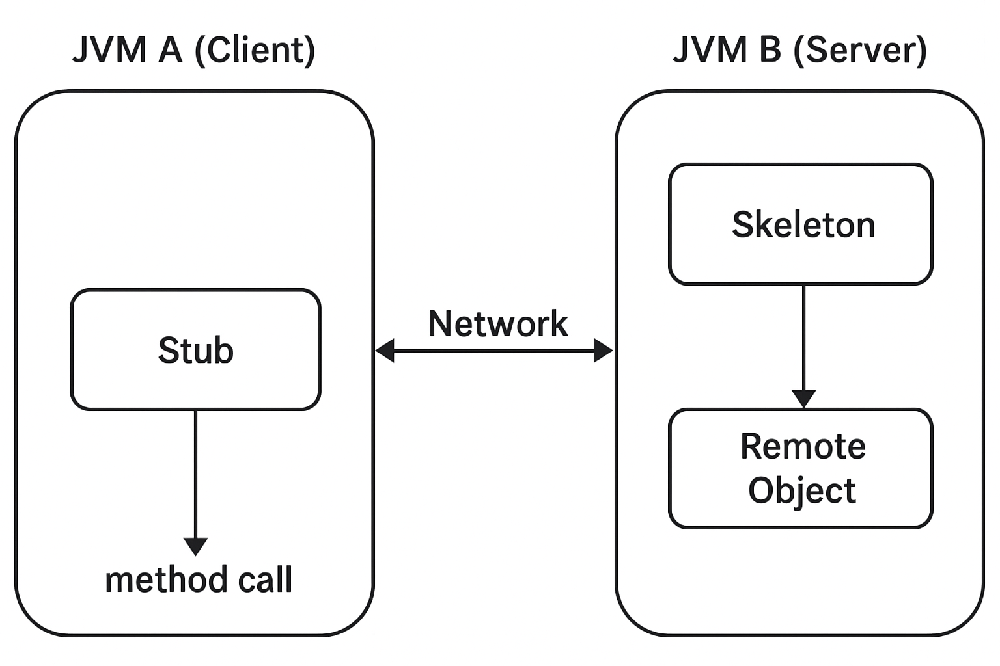
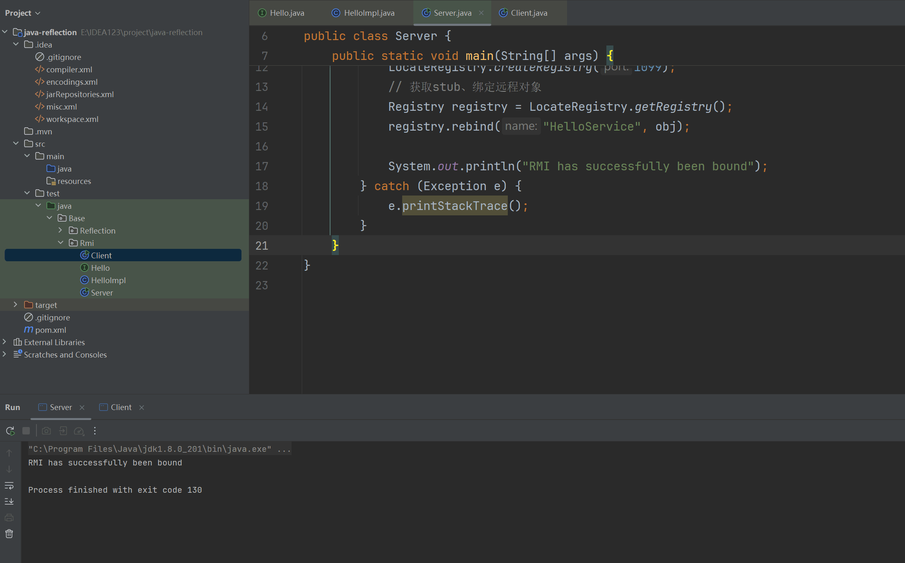
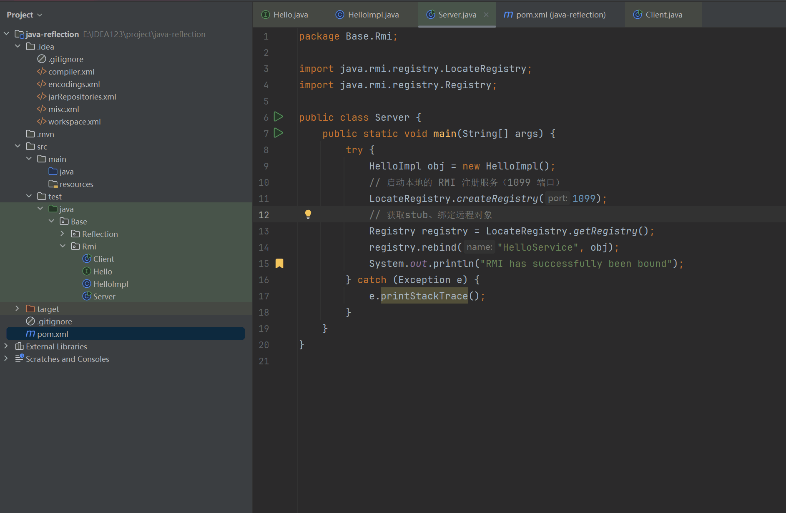
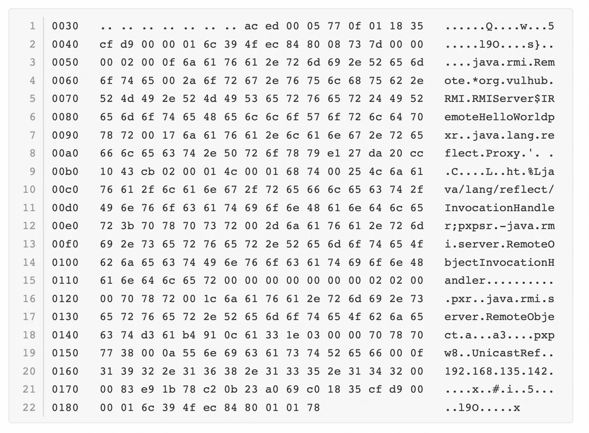

+++
title= "JavaRMI"
slug= "java-rmi"
description= ""
date= "2025-08-22T08:55:59+08:00"
lastmod= "2025-08-22T08:55:59+08:00"
image= ""
license= ""
categories= ["Javasec"]
tags= [""]

+++

## 概念

Java RMI（Remote Method Invocation，远程方法调用）是 Java 提供的一种机制，它允许一个 Java 程序调用运行在另一台计算机上的 Java 对象的方法，就像调用本地对象一样。简单来说，RMI 把分布式系统中的对象交互过程“透明化”了，开发者不需要关心底层的网络通信细节，而是通过接口和方法调用来实现跨机器、跨 JVM 的对象通信。

听起来就非常的方便，高端大气上档次。但是，其中的“跨 JVM ”是什么东西？

JVM（Java Virtual Machine，Java 虚拟机）就像是 Java 程序运行的一个容器。跨 JVM 就是指，调用发生在不同的 JVM 之间，通常运行在不同的进程甚至不同的机器上。



- 左边是 JVM A（客户端），它通过 Stub（远程代理） 发起方法调用。
- 右边是 JVM B（服务器端），里面有 Skeleton（远程对象桩） 和真正的 远程对象（Remote Object）。
- Stub 把客户端的调用请求打包，通过网络传输给 Skeleton，Skeleton 再调用真正的远程对象方法，最后把结果返回。

其核心思想就是跨 JVM。能够像本地调用一样远程调用方法，使分布式对象之间的交互变得透明、便捷。

## 实现

从安全的角度来讲，RMI的基础组件主要分为四种

- **远程接口（Remote Interface）**：定义远程对象可调用的方法。
- **远程对象的实现类（Remote Object Implementation）**。
- **服务器（Server）**：注册远程对象到 RMI 注册中心。
- **客户端（Client）**：查找远程对象并调用其方法。

现在我们挨个写出合适的组件，先写远程接口`Hello.java`，继承自`Remote`类，声明了`sayHello`这个方法并声明抛出 `RemoteException`。（和`forName`一样）

```java
package Base.Rmi;
import java.rmi.RemoteException;
import java.rmi.Remote;

public interface Hello extends Remote {
    String sayHello(String name) throws RemoteException;
}

```

接着写个ROI，`HelloImpl.java`通过继承 `UnicastRemoteObject` 并在构造器里调用 `super()`，把自己**导出为可远程访问的对象**；实现 `Hello` 则提供了可供客户端调用的`sayHello`方法。

```java
package Base.Rmi;
import java.rmi.RemoteException;
import java.rmi.server.UnicastRemoteObject;

public class HelloImpl extends UnicastRemoteObject implements Hello{
    protected HelloImpl() throws RemoteException {
        super();
    }
    public String sayHello(String name) throws RemoteException {
        return "Hello, " + name;
    }
}

```

服务端`server.java`，实现标准 RMI 服务端流程，远程对象实例化 → registry 启动 → 服务注册 → 等待客户端调用，只要寻找`HelloService`就可以获取代理调用方法

```java
package Base.Rmi;

import java.rmi.registry.LocateRegistry;
import java.rmi.registry.Registry;

public class Server {
    public static void main(String[] args) {
        try {
            HelloImpl obj = new HelloImpl();
            // 启动本地的 RMI 注册服务（1099 端口）
            LocateRegistry.createRegistry(1099);
            // 获取stub、绑定远程对象
            Registry registry = LocateRegistry.getRegistry();
            registry.rebind("HelloService", obj);
            System.out.println("RMI has successfully been bound");
        } catch (Exception e) {
            e.printStackTrace();
        }
    }
}
```

最后链接RMI 注册表然后查找名为`HelloService`远程对象，最后调用`sayHello`远程方法

```java
package Base.Rmi;
import java.rmi.registry.LocateRegistry;
import java.rmi.registry.Registry;

public class Client {
    public static void main(String[] args) {
        try{
            Registry registry = LocateRegistry.getRegistry("localhost");

            Hello stub = (Hello) registry.lookup("HelloService");

            String response = stub.sayHello("baozongwi");
            System.out.println("Server response:" + response);
        }catch(Exception e){
            e.printStackTrace();
        }
    }
}

```



## 安全问题

前面就已经很明显不安全了，但是依旧有两个问题，用这个的方便之处

1. 数据如何传递
2. 如何发现远程对象

对于第一个问题：

Java中是存在引用类型的，当引用类型的变量作为参数被传递时，传递的不是值，而是内存地址。

在分布式调用里，本地的“内存地址”是没法跨 JVM 传递的，所以 RMI 要么把对象**序列化成字节流传递副本**，要么传递一个**远程代理引用**，让对方通过网络间接访问对象。

在 Java RMI 中，参数和返回值的传递方式取决于数据类型：**基本数据类型**会直接拷贝一份数值传递；**实现了 `Remote` 接口的远程对象**会以“引用”形式传递，另一端拿到的是远程代理，可以继续调用原对象的方法；**普通对象**则通过序列化把对象状态打包成字节流传递，对方收到的是副本（如果对象不支持序列化则无法传递）。这样，RMI 就解决了分布式环境下“内存地址不共享”的问题，让远程调用看起来像本地调用一样自然。

对于第二个问题：

我们在刚才查找`HelloService`这个远程对象，就是因为在本地很好找，但是如果是远程的话，如何去找呢？

RMI 的“远程对象发现”就是通过 `rmi://host:port/name` 去注册表里找对象，不同的name对应不同的远程对象。主机、端口可以省略，主机默认本地，端口默认1099

在Java反序列化神器`ysoserial.jar`里面有一条利用链，在此之前，由于 JEP-290 机制，高版本jdk无法触发了，这里我下载了7u20（后面也要学习反序列化链刚好） [JDK7下载页面](https://www.oracle.com/cn/java/technologies/javase/javase7-archive-downloads.html)

需要修改一下`pom.xml`，加入CC依赖

```xml
<?xml version="1.0" encoding="UTF-8"?>
<project xmlns="http://maven.apache.org/POM/4.0.0"
         xmlns:xsi="http://www.w3.org/2001/XMLSchema-instance"
         xsi:schemaLocation="http://maven.apache.org/POM/4.0.0 http://maven.apache.org/xsd/maven-4.0.0.xsd">
    <modelVersion>4.0.0</modelVersion>

    <groupId>org.baozhongqi</groupId>
    <artifactId>java-reflection</artifactId>
    <version>1.0-SNAPSHOT</version>

    <properties>
        <project.build.sourceEncoding>UTF-8</project.build.sourceEncoding>
    </properties>

    <dependencies>
        <dependency>
            <groupId>commons-collections</groupId>
            <artifactId>commons-collections</artifactId>
            <version>3.2.1</version>
        </dependency>
    </dependencies>

    <build>
        <plugins>
            <plugin>
                <groupId>org.apache.maven.plugins</groupId>
                <artifactId>maven-compiler-plugin</artifactId>
                <version>3.11.0</version>
                <configuration>
                    <source>1.7</source>
                    <target>1.7</target>
                </configuration>
            </plugin>
        </plugins>
    </build>
</project>

```

Server代码不需要修改，只要有依赖并且允许外部进行链接就可以RMI反序列化

```cmd
java -cp ysoserial-all.jar ysoserial.exploit.RMIRegistryExploit 127.0.0.1 1099 CommonsCollections1 "calc"
```



## 原理

就是完整的通信过程，进⾏了两次TCP握⼿，也就是我们实际建⽴了两次 TCP连接。 

第⼀次建⽴TCP连接是连接远端 192.168.135.142 的1099端⼝，这也是我们在代码⾥看到的端⼝，⼆者进⾏沟通后，我向远端发送了⼀个“Call”消息，远端回复了⼀个“ReturnData”消息，然后我新建了⼀ 个TCP连接，连到远端的33769端⼝。 那么为什么我会连接33769端⼝呢？ 细细阅读数据包我们会发现，在“ReturnData”这个包中，返回了⽬标的IP地址 192.168.135.142 ，其后跟的⼀个字节`\x00\x00\x83\xE9` ，刚好就是整数 33769 的⽹络序列，而这整段数据流其实都是序列化流


