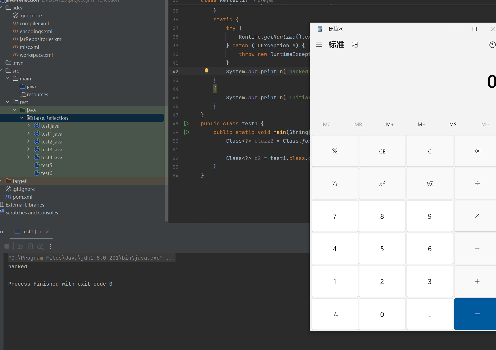
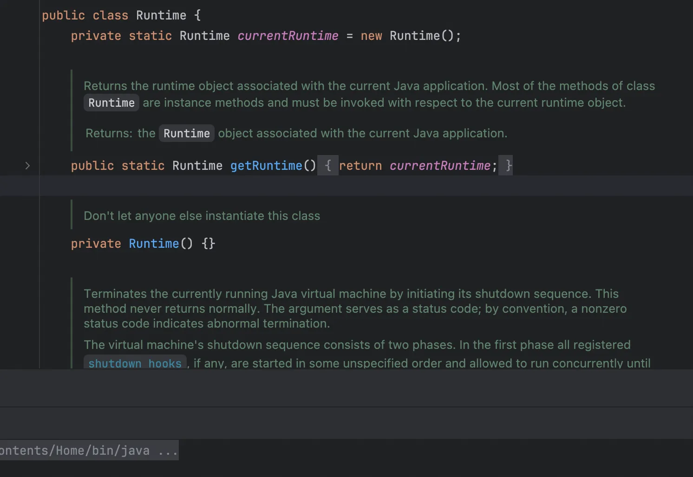

+++
title= "Java反射"
slug= "java-reflection"
description= ""
date= "2025-08-21T20:44:15+08:00"
lastmod= "2025-08-21T20:44:15+08:00"
image= ""
license= ""
categories= ["Javasec"]
tags= [""]

+++

## 概念

Java 的反射（Reflection）是一种在**运行时**动态获取类的信息（如类名、属性、方法、构造函数等），并且可以在不知道类的编译时定义的情况下创建对象、调用方法、修改属性的机制。它让程序具备“自省能力”，可以在执行过程中查看和操作自身结构。

类比到 PHP，Java 的反射机制就有点像 PHP 的 `ReflectionClass`、`call_user_func`、`call_user_func_array` 这些工具——在 PHP 中你可以通过类名的字符串来实例化对象、调用某个方法，而不需要在编译时明确写死。

Java 的反射 API 提供了一系列的类和接口来操作 Class 对象。主要的类包括：

- **`java.lang.Class`**：表示类的对象。提供了方法来获取类的字段、方法、构造函数等。
- **`java.lang.reflect.Field`**：表示类的字段（属性）。提供了访问和修改字段的能力。
- **`java.lang.reflect.Method`**：表示类的方法。提供了调用方法的能力。
- **`java.lang.reflect.Constructor`**：表示类的构造函数。提供了创建对象的能力。

一般地，Java 反射的工作流程就是：程序在运行时先获取类的 `Class` 对象，再通过它找到目标字段/方法/构造器，最后在对象上动态读写或调用。

另外反射还有好处，经常在一些源码里看到，类名的部分包含 $ 符号，比如fastjson在`checkAutoType`时候就会先将 `$`替换成`.`：https://github.com/alibaba/fastjson/blob/fcc9c2a/src/main/java/com/alibaba/fa stjson/parser/ParserConfig.java#L1038

 $ 的作用是查找内部类。 Java的普通类 C1 中支持编写内部类 C2 ，而在编译的时候，会生成两个文件： C1.class 和 C1$C2.class ，我们可以把他们看作两个无关的类，通过 Class.forName("C1$C2") 即可加载这个内 部类。

## 操作

## 获取对象

首先第一步我们就是获取类的 `Class` 对象，总的来说，有五种方法

- 通过类的字面量：`Class<?> clazz = String.class;`
-  通过对象实例：`String str = "Hello"; Class<?> clazz = str.getClass();`
-  通过 `Class.forName()` 方法：`Class<?> clazz = Class.forName("java.lang.String");`
-  通过类加载器：`Class<?> clazz = ClassLoader.getSystemClassLoader().loadClass("java.lang.String");`
-  通过基本类型的 TYPE 字段：`Class<?> clazz = Integer.TYPE;`

接下来使用五种方法来写demo，第一种适用于编译时已知类(比如String类)进行静态引用，直接利用`.class`就可以获取

```java
package Base.Reflection;


class Reflect{

}
public class test {
    public static void main(String[] args) {
        Class<?> clazz2 = String.class;
        System.out.println(clazz2.getName());
        Class<?> clazz1 = Reflect.class;
        System.out.println(clazz1.getName());
    }
}

/*
java.lang.String
Base.Reflection.Reflect
```

第二种必须是已经有了实例才能够成功

```java
package Base.Reflection;


class Reflect1{

}
public class test1 {
    public static void main(String[] args) {
        String str = "hello";
//        String str = new String("Hello");
        Class<?> clazz1 = str.getClass();
        System.out.println(clazz1.getName());

        Reflect1 Reflection = new Reflect1();
        Class<?> clazz2 = Reflection.getClass();
        System.out.println(clazz2.getName());
    }
}

/*
java.lang.String
Base.Reflection.Reflect1
```

第三种是当我们知道类的名字是，直接显式的按字符串加载类，并触发类初始化

```java
package Base.Reflection;


class Reflect1{

}
public class test1 {
    public static void main(String[] args){
        Class<?> clazz1 = Class.forName("java.lang.String");
        System.out.println(clazz1.getName());
        Class<?> clazz2 = Class.forName("Base.Reflection.Reflect1");
        System.out.println(clazz2.getName());
    }
}
```

在执行这个的时候我遇到了一个报错

```bash
E:\IDEA123\project\java-reflection\src\test\java\Base\Reflection\test1.java:37:40
java: 未报告的异常错误java.lang.ClassNotFoundException; 必须对其进行捕获或声明以便抛出
```

这是因为我们所用的字符串可能是找不到的类，所以必须允许异常抛出，而这种方法是最好加载我们的`Runtime`

的，对于`forName`实际上有两个函数

- `Class.forName(className)`
- `Class.forName(className, true, currentLoader)`

虽然本质差不多，但是其实差的也挺多。默认情况下， forName 的第一个参数是类名；第⼆个参数表示是否初始化；第三个参数就是 ClassLoader(类的加载器)。是否初始化这个参数其实是告诉JVM是否执行”类初始化“，在 forName 的时候，构造函数并不会执行，而是执行类初始化，也就是会执行`static{}`静态块里面的内容。

也就和我们第四种方法相互呼应，由指定 `ClassLoader` 加载类，不立即初始化（延迟至首次使用，也就是说不会执行静态块代码）；适用于自定义类加载器、复杂模块加载场景。

```java
package Base.Reflection;


class Reflect1{

}
public class test1 {
    public static void main(String[] args) throws Exception{
        Class<?> clazz1 = Class.forName("java.lang.String");
        System.out.println(clazz1.getName());
        Class<?> clazz2 = Class.forName("Base.Reflection.Reflect1");
        System.out.println(clazz2.getName());
    }
}
/*
java.lang.String
Base.Reflection.Reflect1
```

第五种，`TYPE` 字段用于拿到原始类型（`int`, `double` …）的 `Class` 对象；在方法反射、重载分辨原始/包装类型时很有用

```java
package Base.Reflection;

public class test1 {
    public static void main(String[] args){

        Class<?> cInt1 = Integer.TYPE;
        Class<?> cInt2 = int.class;
        System.out.println(cInt1.getName());
        System.out.println(cInt1 == cInt2);

        Class<?> cDouble = Double.TYPE;
        System.out.println(cDouble.getName());

        System.out.println(Integer.class == Integer.TYPE);
    }
}
/*
int
true
double
false
```

我们刚才所提到了一些代码块的问题，特别是static代码块由于加载方式不同导致是否执行，现在来了解一下代码块，静态初始化块（static block）、实例初始化块（instance initializer block） 和 构造方法（constructor），

```java
package Base.Reflection;


class Reflect1{
    public Reflect1() {
        System.out.println("Constructor");
    }
    static {
        System.out.println("Static");
    }
    {
        System.out.println("Initialize");
    }
}
public class test1 {
    public static void main(String[] args){
        new  Reflect1();
    }
}
/*
Static
Initialize
Constructor
```

- 静态初始化块（`static {}`）在类被加载到 JVM 时执行，仅执行一次，只能访问静态成员，同时在任何对象创建之前执行。
- 实例初始化块（`{}`）每次创建对象时，在构造方法之前执行。
- 构造方法（`public ClassName() {}`）每次创建对象时，在实例初始化块之后执行。

并且可以看到静态初始化块的优先级最高，当我们在其中利用恶意方法的话

```java
package Base.Reflection;
import java.io.IOException;

class Reflect1{
    public Reflect1() {
        System.out.println("Constructor");
    }
    static {
        try {
            Runtime.getRuntime().exec("calc");
        } catch (IOException e) {
            throw new RuntimeException(e);
        }
        System.out.println("Static");
    }
    {
        System.out.println("Initialize");
    }
}
public class test1 {
    public static void main(String[] args) throws Exception{
        Class<?> clazz2 = Class.forName("Base.Reflection.Reflect1");

        Class<?> c2 = test1.class.getClassLoader().loadClass("Base.Reflection.Reflect1");
    }
}
//hacked
```



## 创建对象

与刚才的`new Reflect();`效果一直，只需要在获取对象之后进行`.newInstance()`即可

```java
package Base.Reflection;


class Reflect2 {
    public Reflect2() {
        System.out.println("Constructor");
    }
    static {
        System.out.println("hacked");
    }
    {
        System.out.println("Initialize");
    }
}

public class test2 {
    public static void main(String[] args) throws Exception {
        Class<?> clazz2 = Class.forName("Base.Reflection.Reflect2");
        //Object obj = clazz2.newInstance();
        Object obj = clazz2.getDeclaredConstructor().newInstance();
    }
}

/*
hacked
Initialize
Constructor
```

## 访问字段

```java
package Base.Reflection;

import java.lang.reflect.Field;

class Person {
    public String name = "baozongwi";
    private int age = 20;

    @Override
    public String toString() {
        return "Person{name='" + name + "', age=" + age + "}";
    }
}

public class test3 {
    public static void main(String[] args) throws Exception {
        Class<?> clazz = Class.forName("Base.Reflection.Person");
        Object obj = clazz.getDeclaredConstructor().newInstance();

        // 3. 获取public字段 name
        Field nameField = clazz.getField("name");
        System.out.println("原始 name = " + nameField.get(obj));
        nameField.set(obj, "baozhongqi");
        System.out.println("修改后 name = " + nameField.get(obj));

        // 4. 获取private字段 age
        Field ageField = clazz.getDeclaredField("age");
        // 解除private限制
        ageField.setAccessible(true);
        System.out.println("原始 age = " + ageField.get(obj));
        ageField.set(obj, 17);
        System.out.println("修改后 age = " + ageField.get(obj));

        System.out.println("最终对象: " + obj);
    }
}

/*
原始 name = baozongwi
修改后 name = baozhongqi
原始 age = 20
修改后 age = 17
最终对象: Person{name='baozhongqi', age=17}
```

- clazz.getField(String name)：获取公有字段（包括继承的）
- clazz.getDeclaredField(String name)：获取本类中声明的字段（包括私有字段）
- field.setAccessible(true)：允许访问私有字段
- field.get(Object obj)：获取字段值
- field.set(Object obj, Object value)：设置字段值

## 调用方法

调用方法和访问字段类似，

- clazz.getMethod(String name, Class… parameterTypes)：获取 **公有方法**（包括继承的）（注意，这里第一个参数是方法名，后面的参数表示的是这个方法传入参数的类型，比如参数是String就是String.class）
- clazz.getDeclaredMethod(String name, Class… parameterTypes)：获取 **本类声明的方法**（包括私有方法）
- method.setAccessible(true)：允许访问私有方法
- method.invoke(Object obj, Object… args)：调用方法，第一个参数是对象，后面是传入方法的参数

一般流程为，通过 `Class` 获取 `Method` → 如是私有则 `setAccessible(true)` → 如果是实例方法先创建对象 → 调用 `invoke(对象, 参数...)` 执行并返回结果。

```java
package Base.Reflection;

import java.lang.reflect.Method;

class Demo {
    public void hello(String name) {
        System.out.println("Hello, " + name);
    }

    private int add(int a, int b) {
        return a + b;
    }

    public static void staticMethod() {
        System.out.println("I am a static method!");
    }
}

public class test4 {
    public static void main(String[] args) throws Exception {
        Class<?> clazz = Class.forName("Base.Reflection.Demo");
        Object obj = clazz.getDeclaredConstructor().newInstance();

        // 3. 调用 public 实例方法 hello
        Method helloMethod = clazz.getMethod("hello", String.class);
        helloMethod.invoke(obj, "Alice");

        // 4. 调用 private 实例方法 add
        Method addMethod = clazz.getDeclaredMethod("add", int.class, int.class);
        addMethod.setAccessible(true); // 必须解除限制
        Object result = addMethod.invoke(obj, 5, 7);
        System.out.println("add 方法返回值: " + result);

        // 5. 调用 static 方法
        Method staticM = clazz.getMethod("staticMethod");
        // 静态方法不需要实例
        staticM.invoke(null);
    }
}

/*
Hello, Alice
add 方法返回值: 12
I am a static method!
```

此处我有一个非常疑惑的点，就是为什么静态方法不需要实例即可调用？

因为静态方法属于类本身，不属于对象，它在类加载的时候就放在 **方法区**（或者说 class 元数据里），跟对象实例没有关系。

后来我就在想啊？那只有在同一个文件里面吗？

不需要。静态方法和类绑定，只要你能拿到那个类的 `Class<?>` 对象，就能调用。在反射中，也就是随便调用了

## calc

到这里，我们就已经学会了如何使用反射。先弹个计算器

```java
package Base.Reflection;

public class test5 {
    public static void main(String[] args) throws Exception {
        Class clazz = Class.forName("java.lang.Runtime");
        clazz.getMethod("exec", String.class).invoke(clazz.newInstance(), "calc");
    }
}
/*
Exception in thread "main" java.lang.IllegalAccessException: Class Reflection.test5 can not access a member of class java.lang.Runtime with modifiers "private"
	at sun.reflect.Reflection.ensureMemberAccess(Reflection.java:102)
	at java.lang.Class.newInstance(Class.java:436)
	at Reflection.test5.main(test5.java:6)
```

报错如下，显示私有，因为 `java.lang.Runtime` 的构造方法是 **private** 的，所以反射在尝试调用时直接抛出 `IllegalAccessException`。这里就涉及到一个知识点了单例模式

**单例模式（Singleton Pattern）** 是一种常见的设计模式，它的核心目的是确保一个类 **在整个程序运行期间只有一个实例** ，并提供全局访问点。而单例模式又分为以下几种

饿汉式

```java
public class Singleton {
    private static final Singleton instance = new Singleton();

    private Singleton() {}

    public static Singleton getInstance() {
        return instance;
    }
}
```

类加载时就创建实例，线程安全，但可能浪费资源。

懒汉式

```java
public class Singleton {
    private static volatile Singleton instance;

    private Singleton() {}

    public static Singleton getInstance() {
        if (instance == null) {
             // 加锁防止多线程竞争
            synchronized (Singleton.class) {
                if (instance == null) {
                    instance = new Singleton();
                }
            }
        }
        return instance;
    }
}
```

第一次调用 `getInstance()` 时才创建实例，节省资源，但需处理线程安全问题。还有两种是Holder模式和枚举，但是因为`INSTANCE` 是 `final` 的，无法通过反射修改。所以就不看了，有兴趣的师傅自己去了解一下



`Runtime` 采用了 **单例模式**，是饿汉式，构造器私有，对外只暴露了一个 `public static Runtime getRuntime()` 方法，用来获取唯一实例。到这里我们就知道怎么改了

```java
package Base.Reflection;

public class test5 {
    public static void main(String[] args) throws Exception {
        Class clazz = Class.forName("java.lang.Runtime");
        //clazz.getMethod("exec",String.class).invoke(clazz.getMethod("getRuntime").invoke(clazz), "calc");
        //clazz.getMethod("exec",String.class).invoke(clazz.getMethod("getRuntime").invoke(null), "calc");
        Object runtime = clazz.getMethod("getRuntime").invoke(null);
        clazz.getMethod("exec", String.class).invoke(runtime, "calc");
    }
}
```

但是我们前面提到Runtime其实比较特殊，所以还会有两个问题

- 如果一个类没有无参构造方法，也没有类似单例模式里的静态方法，我们怎样通过反射实例化该类呢？
- 如果一个方法或构造方法是私有方法，我们是否能执行它呢？

对于问题一，只需要选一个合适的构造器来传参调用，有两种方法可以使用，第一种是走 `List<String>` 构造器

```java
package Base.Reflection;

public class test6 {
    public static void main(String[] args) throws Exception {
        Class<?> c = Class.forName("java.lang.ProcessBuilder");
        Object pb = c.getConstructor(java.util.List.class).newInstance(java.util.Arrays.asList("calc"));
        c.getMethod("start").invoke(pb);
    }
}
```

第二种是走 `String...`（即 `String[]`）构造器，这里有一个坑点，需要强转 `(Object)` 或包一层 `new Object[]{ ... }`，因为 `Constructor#newInstance(Object... args)` 本身是 **varargs**，如果你直接写 `newInstance(new String[]{"calc.exe"})`，编译器可能把它当成“多个 Object 实参”的展开。

```java
package Base.Reflection;

public class test6 {
    public static void main(String[] args) throws Exception {
        Class<?> c = Class.forName("java.lang.ProcessBuilder");
        Object pb = c.getConstructor(String[].class).newInstance((Object) new String[]{"calc"});
//        Object pb = c.getConstructor(String[].class).newInstance(new Object[]{ new String[]{"calc"} });
//        Object pb = c.getConstructor(String[].class).newInstance(new String[][]{{"calc"}});
        c.getMethod("start").invoke(pb);
    }
}
```

对于问题二的话，我们直接设置`method.setAccessible(true)`即可

```java
package Base.Reflection;

public class test6 {
    public static void main(String[] args) throws Exception {
        Class<?> c = Class.forName("java.lang.Runtime");
        java.lang.reflect.Constructor<?> m = c.getDeclaredConstructor();
        m.setAccessible(true);
        Object runtime = m.newInstance();
        c.getMethod("exec", String.class).invoke(runtime, "calc");
    }
}
```

## 原理

Java 反射依赖于 JVM 的类加载机制——它把 `.class` 文件的结构（字段/方法/构造器等元信息）映射成 `Class` 对象；再结合字节码结构，反射 API 使程序能在运行中动态操控这些结构，从而实现灵活调用和修改。

先说类加载，JVM 在运行时会按需加载类，加载过程分为三个阶段：加载（Loading） → 链接（Linking） → 初始化（Initialization）。

- 加载：JVM 通过类加载器找到 `.class` 文件的二进制表示，并为它创建一个 `Class` 对象。这个对象承载着类的完整元数据。
- 链接：
  - *验证*：确保字节码结构符合规范；
  - *准备*：为静态变量分配空间；
  - *解析*：将符号引用替换为直接引用。
- 初始化：执行 `<clinit>` 方法，也就是静态代码块和静态变量初始化逻辑。

另外，类加载器层级（如 Bootstrap、Extension、Application）采用父加载器委派模型，确保基础类加载安全、避免重复加载、避免篡改核心类。

对反射而言：调用 `Class.forName("com.foo.Bar")`，就会触发上述所有阶段，从而生成可用于反射的 `Class` 对象，再通过它操作方法、字段、构造器等。

而类字节码如何与反射所联系呢？

 JVM 在加载 `.class` 文件后，将这些元数据装载进 `Class` 对象内部。反射 API（如 `getDeclaredMethod()` 等）读取这些信息，而实际执行则通过 JVM 的 native 或动态生成的代码（如 JIT 编译）来完成。
 此外，字节码操作框架（如 ASM、BCEL）还能在运行时修改类定义，实现 AOP、注入、代理等高级功能。

Java 源代码经编译器处理后，生成 `.class` 文件，其内容包括类的全部结构信息。

`.class` 文件结构大致包括：

- 魔数（CAFEBABE）
- 版本号
- 常量池（class、方法、字段、字符串等引用）
- 访问标志（如 public、abstract）
- 类声明、父类、接口
- 字段表（fields）
- 方法表（methods）
- 附加属性（attributes）

字节码是“.class 文件”的执行指令集，包括单字节操作码（opcode） + 可变长度的操作数，例如：`aload_0`, `invokespecial`, `getfield` 等。
